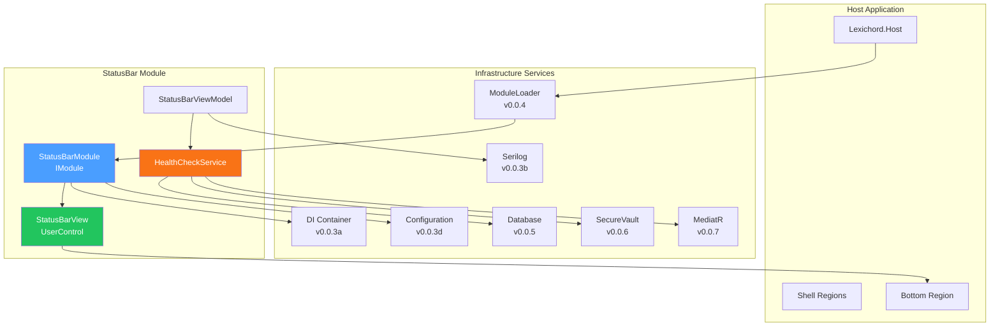
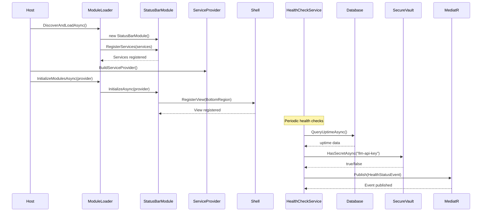

# LCS-DES-008: Design Specification Index — The Hello World (Golden Skeleton)

## Document Control

| Field                | Value                                     |
| :------------------- | :---------------------------------------- |
| **Document ID**      | LCS-DES-008-INDEX                         |
| **Feature ID**       | INF-008                                   |
| **Feature Name**     | The Hello World (Golden Skeleton)         |
| **Target Version**   | v0.0.8                                    |
| **Module Scope**     | Lexichord.Modules.StatusBar / All Systems |
| **Swimlane**         | Infrastructure                            |
| **License Tier**     | Core                                      |
| **Feature Gate Key** | N/A                                       |
| **Status**           | Draft                                     |
| **Last Updated**     | 2026-01-27                                |

---

## 1. Executive Summary

**v0.0.8** is the **Golden Skeleton milestone** — the end-to-end proof that all foundational systems work together. This release implements a real feature module (StatusBar) that exercises every infrastructure component built in v0.0.1 through v0.0.7.

> [!WARNING]
> **Region System Migration:** The static region system (`IShellRegionView`) defined in this version is replaced by `Avalonia.Dock` with `IRegionManager` in **v0.1.1**. Modules implementing against v0.0.8 should use the adapter pattern defined in [LCS-SBD-008](./LCS-SBD-008.md#compatibility) to ensure forward compatibility.

### 1.1 The Problem

After implementing seven foundational versions, Lexichord needs proof that all systems work together:

- Each version was developed and tested in isolation
- The architecture has never been validated end-to-end
- Future module developers need a canonical reference implementation
- The release process needs validation before feature development begins

### 1.2 The Solution

Implement `Lexichord.Modules.StatusBar`, a lightweight module that:

- **Status Bar Module** — Creates module and registers in Bottom Shell Region
- **Database Health Check** — Queries database for system uptime
- **Secure Vault Check** — Verifies API key presence
- **Golden Skeleton Release** — Tags repo and documents proven architecture

### 1.3 Business Value

| Value               | Description                                    |
| :------------------ | :--------------------------------------------- |
| **Validation**      | Proves all infrastructure works end-to-end     |
| **Reference**       | Canonical implementation for future modules    |
| **Confidence**      | Green light for feature development (v0.1.x+)  |
| **Documentation**   | Documented architecture patterns and decisions |
| **Release Process** | Validates tagging and release workflow         |

---

## 2. Related Documents

### 2.1 Scope Breakdown Document

The detailed scope breakdown for v0.0.8, including all sub-parts, implementation checklists, and acceptance criteria:

| Document                            | Description                       |
| :---------------------------------- | :-------------------------------- |
| **[LCS-SBD-008](./LCS-SBD-008.md)** | Scope Breakdown — Golden Skeleton |

### 2.2 Sub-Part Design Specifications

Each sub-part has its own detailed design specification following the LDS-01 template:

| Sub-Part | Document                              | Title                   | Description                            |
| :------- | :------------------------------------ | :---------------------- | :------------------------------------- |
| v0.0.8a  | **[LCS-DES-008a](./LCS-DES-008a.md)** | Status Bar Module       | Shell region registration and view     |
| v0.0.8b  | **[LCS-DES-008b](./LCS-DES-008b.md)** | Database Health Check   | Query database for system uptime       |
| v0.0.8c  | **[LCS-DES-008c](./LCS-DES-008c.md)** | Secure Vault Check      | Verify API key presence                |
| v0.0.8d  | **[LCS-DES-008d](./LCS-DES-008d.md)** | Golden Skeleton Release | Architecture tagging and documentation |

---

## 3. Architecture Overview

### 3.1 Systems Integration Diagram

### 3.2 Integration Flow Sequence

---

## 4. Dependencies

### 4.1 Upstream Dependencies (All v0.0.x Infrastructure)

| Dependency         | Source Version | Purpose                        |
| :----------------- | :------------- | :----------------------------- |
| Solution Structure | v0.0.1         | Project organization           |
| Avalonia Shell     | v0.0.2         | Shell regions for view hosting |
| DI Container       | v0.0.3a        | Service registration           |
| Serilog Pipeline   | v0.0.3b        | Logging all operations         |
| Configuration      | v0.0.3d        | Module configuration           |
| Module Loader      | v0.0.4         | Module discovery and loading   |
| Database           | v0.0.5         | Health check queries           |
| Secure Vault       | v0.0.6         | API key verification           |
| MediatR Event Bus  | v0.0.7         | Event publishing               |

### 4.2 NuGet Packages

| Package                 | Version | Purpose                        |
| :---------------------- | :------ | :----------------------------- |
| `Avalonia`              | 11.2.x  | UI framework for StatusBarView |
| `CommunityToolkit.Mvvm` | 8.x     | MVVM helpers for ViewModel     |

### 4.3 Downstream Consumers (Future)

| Version | Feature         | Uses From v0.0.8                  |
| :------ | :-------------- | :-------------------------------- |
| v0.1.x  | All Modules     | Reference implementation patterns |
| v0.2.x  | Document Module | Shell region registration pattern |
| v0.3.x  | Style Module    | Health check service pattern      |

---

## 5. License Gating Strategy

**N/A** — The StatusBar module is Core infrastructure for architecture validation. No runtime gating is applied.

---

## 6. Key Interfaces Summary

| Interface             | Defined In | Purpose                            |
| :-------------------- | :--------- | :--------------------------------- |
| `IHealthCheckService` | v0.0.8b    | Health check abstraction           |
| `IModule` (impl)      | v0.0.8a    | StatusBarModule implements IModule |

| Record/DTO          | Defined In | Purpose                          |
| :------------------ | :--------- | :------------------------------- |
| `HealthStatus`      | v0.0.8b    | Health check result data         |
| `HealthStatusEvent` | v0.0.8b    | MediatR event for health updates |

---

## 7. Implementation Checklist Summary

| Sub-Part  | Key Deliverables                                          | Est. Hours   | Status |
| :-------- | :-------------------------------------------------------- | :----------- | :----- |
| v0.0.8a   | StatusBarModule, StatusBarView, Shell region registration | 4            | [ ]    |
| v0.0.8b   | HealthCheckService, database uptime query                 | 3            | [ ]    |
| v0.0.8c   | Vault check, API key presence verification                | 2            | [ ]    |
| v0.0.8d   | Git tag, release notes, architecture documentation        | 3            | [ ]    |
| **Total** |                                                           | **12 hours** |        |

See [LCS-SBD-008](./LCS-SBD-008.md) Section 3 for the detailed implementation checklist.

---

## 8. Success Criteria Summary

| Category     | Criterion                                             | Target |
| :----------- | :---------------------------------------------------- | :----- |
| **Module**   | StatusBarModule discovered and loaded by ModuleLoader | Pass   |
| **View**     | StatusBarView appears in Bottom Shell Region          | Pass   |
| **Database** | Health check queries database successfully            | Pass   |
| **Vault**    | API key presence check works                          | Pass   |
| **Events**   | HealthStatusEvent published via MediatR               | Pass   |
| **Logging**  | All operations logged via Serilog                     | Pass   |
| **Config**   | Module reads from appsettings.json                    | Pass   |
| **Release**  | v0.0.8 tag created with release notes                 | Pass   |

See individual design specs for detailed acceptance criteria.

---

## 9. Test Coverage Summary

| Sub-Part | Unit Tests                          | Integration Tests           |
| :------- | :---------------------------------- | :-------------------------- |
| v0.0.8a  | Module registration, view creation  | Full module loading in Host |
| v0.0.8b  | Health service logic, query parsing | Real database health check  |
| v0.0.8c  | Vault check logic                   | Real vault API key check    |
| v0.0.8d  | N/A                                 | Manual release verification |

See individual design specs for detailed test scenarios.

---

## 10. What This Enables

| Version | Feature         | Depends On v0.0.8                  |
| :------ | :-------------- | :--------------------------------- |
| v0.1.x  | Settings Module | Proven module patterns             |
| v0.2.x  | Document Module | Shell region registration          |
| v0.3.x  | Style Module    | Health check patterns              |
| v0.4.x  | RAG Module      | Event publishing patterns          |
| All     | Future Modules  | Canonical reference implementation |

---

## 11. Risks & Mitigations

| Risk                                 | Impact | Mitigation                               |
| :----------------------------------- | :----- | :--------------------------------------- |
| Infrastructure bug discovered late   | High   | Comprehensive integration testing        |
| Module loader doesn't find StatusBar | High   | Verify output path configuration         |
| Shell region not available           | Medium | Fallback to logging if region missing    |
| Database not running during check    | Low    | Graceful degradation, show "unavailable" |
| Release tag conflicts                | Low    | Check for existing tag before creating   |

---

## 12. Golden Skeleton Checklist

This release validates all foundational infrastructure:

| System             | Version | Validation Method           |
| :----------------- | :------ | :-------------------------- |
| Solution Structure | v0.0.1  | Module project compiles     |
| Avalonia Shell     | v0.0.2  | View appears in region      |
| DI Container       | v0.0.3a | Services resolve correctly  |
| Serilog            | v0.0.3b | Logs appear in console/file |
| Configuration      | v0.0.3d | Settings read from JSON     |
| Module Loader      | v0.0.4  | StatusBarModule discovered  |
| Database           | v0.0.5  | Health query executes       |
| Secure Vault       | v0.0.6  | API key check works         |
| MediatR            | v0.0.7  | Event published/received    |

---

## Document History

| Version | Date       | Author           | Changes                                                      |
| :------ | :--------- | :--------------- | :----------------------------------------------------------- |
| 1.0     | 2026-01-27 | System Architect | Created INDEX from legacy LCS-INF-008 during standardization |
