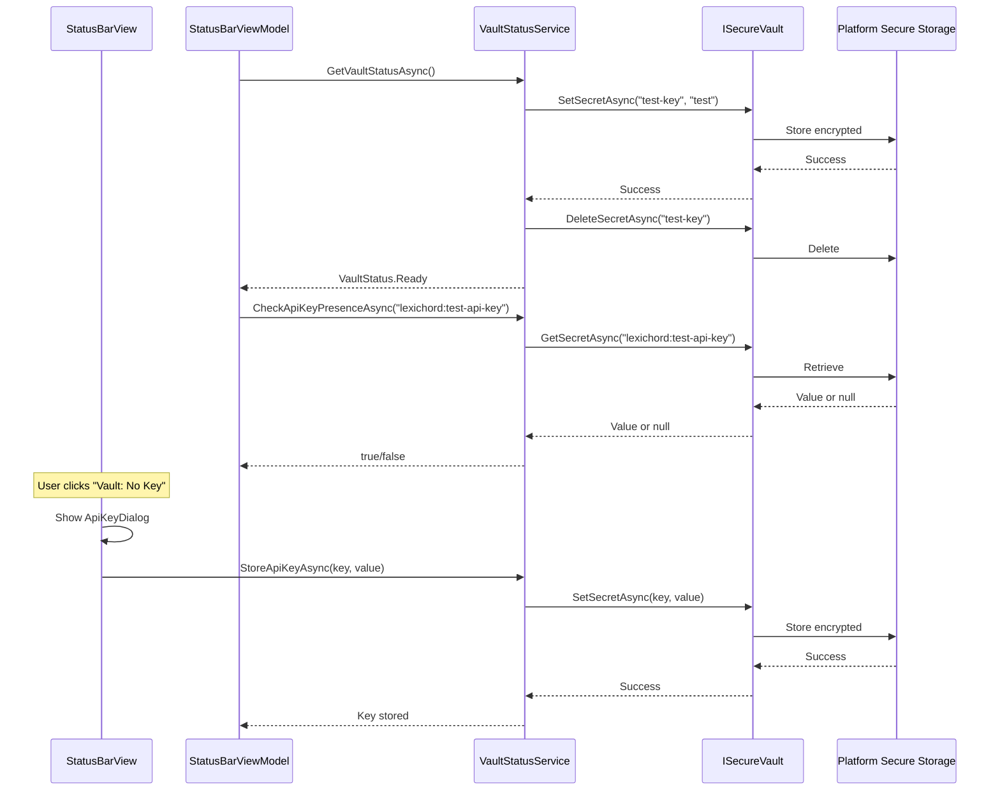

# LCS-DES-008c: Secure Vault Check - Verify API Key

## 1. Metadata & Categorization

| Field                | Value                                    | Description                                        |
| :------------------- | :--------------------------------------- | :------------------------------------------------- |
| **Feature ID**       | `INF-008c`                               | Infrastructure - Secure Vault Check                |
| **Feature Name**     | Secure Vault API Key Check               | Verify API key presence in ISecureVault            |
| **Target Version**   | `v0.0.8c`                                | Third sub-part of v0.0.8                           |
| **Module Scope**     | `Lexichord.Modules.StatusBar`            | StatusBar module vault integration                 |
| **Swimlane**         | `Infrastructure`                         | The Podium (Platform)                              |
| **License Tier**     | `Core`                                   | Foundation (Available to all users)                |
| **Author**           | System Architect                         |                                                    |
| **Status**           | **Draft**                                | Pending implementation                             |
| **Last Updated**     | 2026-01-26                               |                                                    |

---

## 2. Executive Summary

### 2.1 The Requirement

The StatusBar module needs to **prove secure vault integration** by:

- Checking if a test API key exists in the secure vault.
- Displaying vault status (Ready, No Key, Error).
- Allowing users to enter and store an API key.
- Persisting the key across application restarts.

This proves that:
- v0.0.7 Secure Vault infrastructure works.
- Modules can access the vault through DI.
- Platform-native secure storage is functioning.
- Sensitive data can be stored safely.

### 2.2 The Proposed Solution

We **SHALL** implement secure vault checking with:

1. **IVaultStatusService** - Service for vault status and key management.
2. **Vault Status Display** - Visual feedback in the status bar.
3. **API Key Dialog** - Modal for entering the test API key.
4. **Event Publishing** - Notify when vault status changes.

---

## 3. Architecture

### 3.1 Vault Integration Flow



### 3.2 Platform Secure Storage

The `ISecureVault` implementation (from v0.0.7) uses platform-native secure storage:

| Platform | Storage Backend                  | Encryption                      |
| :------- | :------------------------------- | :------------------------------ |
| Windows  | Windows Credential Manager       | DPAPI (user-scoped)             |
| macOS    | Keychain Services                | AES-256 (Keychain encryption)   |
| Linux    | libsecret / kwallet              | Platform-dependent              |

---

## 4. Implementation Tasks

### Task 1.1: Define Test API Key Name

The test API key uses a consistent identifier across all instances:

```csharp
/// <summary>
/// Constants for vault key identifiers.
/// </summary>
public static class VaultKeys
{
    /// <summary>
    /// The test API key used to verify vault functionality.
    /// </summary>
    /// <remarks>
    /// LOGIC: This key is used solely for proving the secure vault works.
    /// It does not connect to any real API. In production, this pattern
    /// would be used for storing LLM API keys (OpenAI, Anthropic, etc.).
    /// </remarks>
    public const string TestApiKey = "lexichord:test-api-key";

    /// <summary>
    /// Prefix for all Lexichord vault entries.
    /// </summary>
    public const string KeyPrefix = "lexichord:";
}
```

---

### Task 1.2: Create Vault Status Service

**File:** `src/Lexichord.Abstractions/Contracts/IVaultStatusService.cs`

```csharp
namespace Lexichord.Abstractions.Contracts;

/// <summary>
/// Service for checking secure vault status and managing API keys.
/// </summary>
/// <remarks>
/// LOGIC: This service wraps ISecureVault to provide:
/// - High-level status checking (Ready, Empty, Error, Unavailable)
/// - API key presence verification without exposing values
/// - Simple key storage interface
///
/// The service never exposes actual key values through its interface.
/// Values are only passed to ISecureVault for storage.
/// </remarks>
public interface IVaultStatusService
{
    /// <summary>
    /// Checks if the specified API key exists in the secure vault.
    /// </summary>
    /// <param name="keyName">The key identifier to check (e.g., "lexichord:test-api-key").</param>
    /// <returns>True if the key exists and has a non-empty value.</returns>
    /// <remarks>
    /// LOGIC: This method checks existence only. The actual value is never returned.
    /// This prevents accidental exposure of sensitive data.
    /// </remarks>
    Task<bool> CheckApiKeyPresenceAsync(string keyName);

    /// <summary>
    /// Stores an API key in the secure vault.
    /// </summary>
    /// <param name="keyName">The key identifier.</param>
    /// <param name="keyValue">The key value to store.</param>
    /// <exception cref="InvalidOperationException">Vault is not available.</exception>
    Task StoreApiKeyAsync(string keyName, string keyValue);

    /// <summary>
    /// Deletes an API key from the secure vault.
    /// </summary>
    /// <param name="keyName">The key identifier to delete.</param>
    /// <returns>True if the key was deleted, false if it didn't exist.</returns>
    Task<bool> DeleteApiKeyAsync(string keyName);

    /// <summary>
    /// Gets the overall vault status.
    /// </summary>
    /// <returns>The current vault status.</returns>
    Task<VaultStatus> GetVaultStatusAsync();
}

/// <summary>
/// Represents the overall status of the secure vault.
/// </summary>
public enum VaultStatus
{
    /// <summary>
    /// Vault is accessible and contains the test API key.
    /// </summary>
    Ready,

    /// <summary>
    /// Vault is accessible but no test API key is stored.
    /// </summary>
    Empty,

    /// <summary>
    /// Vault encountered an error during access.
    /// </summary>
    Error,

    /// <summary>
    /// Vault is not available on this platform.
    /// </summary>
    Unavailable
}
```

**File:** `src/Lexichord.Modules.StatusBar/Services/VaultStatusService.cs`

```csharp
using Lexichord.Abstractions.Contracts;
using Microsoft.Extensions.Logging;

namespace Lexichord.Modules.StatusBar.Services;

/// <summary>
/// Service for checking secure vault status and managing API keys.
/// </summary>
/// <remarks>
/// LOGIC: This service provides a safe abstraction over ISecureVault.
/// It performs presence checks without exposing values and handles
/// platform compatibility issues gracefully.
///
/// Error handling strategy:
/// - PlatformNotSupportedException -> VaultStatus.Unavailable
/// - Any other exception -> VaultStatus.Error (logged)
///
/// The service tests vault accessibility by performing a write/delete
/// operation with a temporary test value.
/// </remarks>
public sealed class VaultStatusService : IVaultStatusService
{
    private readonly ISecureVault _vault;
    private readonly ILogger<VaultStatusService> _logger;

    private const string VaultTestKey = "lexichord:vault-connectivity-test";

    public VaultStatusService(
        ISecureVault vault,
        ILogger<VaultStatusService> logger)
    {
        _vault = vault;
        _logger = logger;
    }

    /// <inheritdoc/>
    public async Task<bool> CheckApiKeyPresenceAsync(string keyName)
    {
        try
        {
            var value = await _vault.GetSecretAsync(keyName);
            var hasValue = !string.IsNullOrEmpty(value);

            _logger.LogDebug("API key presence check: {KeyName} = {HasValue}",
                keyName, hasValue);

            return hasValue;
        }
        catch (Exception ex)
        {
            _logger.LogError(ex, "Failed to check API key presence: {KeyName}", keyName);
            return false;
        }
    }

    /// <inheritdoc/>
    public async Task StoreApiKeyAsync(string keyName, string keyValue)
    {
        if (string.IsNullOrEmpty(keyName))
            throw new ArgumentException("Key name cannot be empty", nameof(keyName));

        if (string.IsNullOrEmpty(keyValue))
            throw new ArgumentException("Key value cannot be empty", nameof(keyValue));

        try
        {
            await _vault.SetSecretAsync(keyName, keyValue);
            _logger.LogInformation("API key stored successfully: {KeyName}", keyName);
        }
        catch (PlatformNotSupportedException)
        {
            _logger.LogWarning("Cannot store API key - vault not available on this platform");
            throw new InvalidOperationException(
                "Secure vault is not available on this platform");
        }
        catch (Exception ex)
        {
            _logger.LogError(ex, "Failed to store API key: {KeyName}", keyName);
            throw;
        }
    }

    /// <inheritdoc/>
    public async Task<bool> DeleteApiKeyAsync(string keyName)
    {
        try
        {
            var existed = await CheckApiKeyPresenceAsync(keyName);
            if (!existed)
            {
                _logger.LogDebug("API key does not exist, nothing to delete: {KeyName}",
                    keyName);
                return false;
            }

            await _vault.DeleteSecretAsync(keyName);
            _logger.LogInformation("API key deleted: {KeyName}", keyName);
            return true;
        }
        catch (Exception ex)
        {
            _logger.LogError(ex, "Failed to delete API key: {KeyName}", keyName);
            return false;
        }
    }

    /// <inheritdoc/>
    /// <remarks>
    /// LOGIC: Vault status is determined by:
    /// 1. Testing write/delete capability with a temporary key
    /// 2. Checking if the test API key exists
    ///
    /// This approach verifies:
    /// - Vault is accessible (write works)
    /// - Vault operations complete (delete works)
    /// - Configuration state (test key presence)
    /// </remarks>
    public async Task<VaultStatus> GetVaultStatusAsync()
    {
        try
        {
            // LOGIC: Test vault accessibility with a temporary key
            // This verifies the vault is working without affecting real data
            await TestVaultAccessibilityAsync();

            // LOGIC: Check if the test API key exists to determine Ready vs Empty
            var hasTestKey = await CheckApiKeyPresenceAsync(VaultKeys.TestApiKey);

            var status = hasTestKey ? VaultStatus.Ready : VaultStatus.Empty;

            _logger.LogDebug("Vault status: {Status}, HasTestKey: {HasTestKey}",
                status, hasTestKey);

            return status;
        }
        catch (PlatformNotSupportedException)
        {
            _logger.LogWarning("Secure vault not available on this platform");
            return VaultStatus.Unavailable;
        }
        catch (Exception ex)
        {
            _logger.LogError(ex, "Vault status check failed");
            return VaultStatus.Error;
        }
    }

    /// <summary>
    /// Tests vault accessibility by writing and deleting a temporary value.
    /// </summary>
    private async Task TestVaultAccessibilityAsync()
    {
        var testValue = $"test-{DateTime.UtcNow.Ticks}";

        try
        {
            // Write a test value
            await _vault.SetSecretAsync(VaultTestKey, testValue);

            // Verify it was written
            var readBack = await _vault.GetSecretAsync(VaultTestKey);
            if (readBack != testValue)
            {
                throw new InvalidOperationException(
                    "Vault read/write verification failed");
            }
        }
        finally
        {
            // Always clean up the test key
            try
            {
                await _vault.DeleteSecretAsync(VaultTestKey);
            }
            catch
            {
                // Ignore cleanup errors
            }
        }
    }
}
```

---

### Task 1.3: Status Bar Vault Display

**ViewModel Update:** Add vault status properties to `StatusBarViewModel.cs`:

```csharp
// Add these properties to StatusBarViewModel

[ObservableProperty]
private string _vaultStatusText = "Vault: Checking...";

[ObservableProperty]
private string _vaultTooltip = "Checking secure vault...";

[ObservableProperty]
private bool _isVaultReady;

[ObservableProperty]
private bool _isVaultEmpty;

[ObservableProperty]
private bool _isVaultError;

[ObservableProperty]
private bool _isVaultUnknown = true;

/// <summary>
/// Gets the vault status service for use by the view.
/// </summary>
/// <remarks>
/// LOGIC: The view needs access to the service for the API key dialog.
/// This is exposed as a public property rather than injecting into the dialog
/// to keep the dialog simple and testable.
/// </remarks>
public IVaultStatusService VaultStatusService { get; }

/// <summary>
/// Refreshes the vault status display.
/// </summary>
/// <remarks>
/// LOGIC: This method checks:
/// 1. Vault accessibility (can we read/write?)
/// 2. Test API key presence (is there a key stored?)
///
/// Status indicators:
/// - Ready (green): Vault accessible, test API key exists
/// - Empty (yellow): Vault accessible, no test API key
/// - Error (red): Vault operation failed
/// - Unavailable (red): Vault not supported on platform
/// </remarks>
[RelayCommand]
public async Task RefreshVaultStatusAsync()
{
    try
    {
        var status = await _vaultService.GetVaultStatusAsync();

        switch (status)
        {
            case VaultStatus.Ready:
                SetVaultReady();
                break;

            case VaultStatus.Empty:
                SetVaultEmpty();
                break;

            case VaultStatus.Error:
                SetVaultError("Vault access error");
                break;

            case VaultStatus.Unavailable:
                SetVaultUnavailable();
                break;
        }

        // Publish vault status changed event
        var hasKey = status == VaultStatus.Ready;
        await _mediator.Publish(new VaultStatusChangedEvent(status, hasKey));
    }
    catch (Exception ex)
    {
        _logger.LogError(ex, "Failed to refresh vault status");
        SetVaultError($"Error: {ex.Message}");
    }
}

private void SetVaultReady()
{
    VaultStatusText = "Vault: Ready";
    VaultTooltip = "Secure vault is configured and ready. Test API key is stored.";
    IsVaultReady = true;
    IsVaultEmpty = false;
    IsVaultError = false;
    IsVaultUnknown = false;
}

private void SetVaultEmpty()
{
    VaultStatusText = "Vault: No Key";
    VaultTooltip = "Click to configure a test API key.";
    IsVaultReady = false;
    IsVaultEmpty = true;
    IsVaultError = false;
    IsVaultUnknown = false;
}

private void SetVaultError(string message)
{
    VaultStatusText = "Vault: Error";
    VaultTooltip = message;
    IsVaultReady = false;
    IsVaultEmpty = false;
    IsVaultError = true;
    IsVaultUnknown = false;
}

private void SetVaultUnavailable()
{
    VaultStatusText = "Vault: N/A";
    VaultTooltip = "Secure vault is not available on this platform.";
    IsVaultReady = false;
    IsVaultEmpty = false;
    IsVaultError = true;
    IsVaultUnknown = false;
}
```

---

### Task 1.4: API Key Entry Dialog

**File:** `src/Lexichord.Modules.StatusBar/Views/ApiKeyDialog.axaml`

```xml
<Window xmlns="https://github.com/avaloniaui"
        xmlns:x="http://schemas.microsoft.com/winfx/2006/xaml"
        xmlns:d="http://schemas.microsoft.com/expression/blend/2008"
        xmlns:mc="http://schemas.openxmlformats.org/markup-compatibility/2006"
        xmlns:vm="using:Lexichord.Modules.StatusBar.ViewModels"
        mc:Ignorable="d"
        d:DesignWidth="400" d:DesignHeight="250"
        x:Class="Lexichord.Modules.StatusBar.Views.ApiKeyDialog"
        x:DataType="vm:ApiKeyDialogViewModel"
        Title="Enter Test API Key"
        Width="400"
        Height="250"
        WindowStartupLocation="CenterOwner"
        CanResize="False"
        ShowInTaskbar="False">

    <Window.Styles>
        <Style Selector="TextBlock.title">
            <Setter Property="FontSize" Value="16"/>
            <Setter Property="FontWeight" Value="SemiBold"/>
            <Setter Property="Margin" Value="0,0,0,8"/>
        </Style>
        <Style Selector="TextBlock.description">
            <Setter Property="FontSize" Value="12"/>
            <Setter Property="TextWrapping" Value="Wrap"/>
            <Setter Property="Opacity" Value="0.8"/>
            <Setter Property="Margin" Value="0,0,0,16"/>
        </Style>
        <Style Selector="TextBlock.label">
            <Setter Property="FontSize" Value="12"/>
            <Setter Property="Margin" Value="0,0,0,4"/>
        </Style>
        <Style Selector="TextBox.api-key-input">
            <Setter Property="PasswordChar" Value="*"/>
            <Setter Property="Margin" Value="0,0,0,16"/>
        </Style>
        <Style Selector="TextBlock.error">
            <Setter Property="Foreground" Value="#F44336"/>
            <Setter Property="FontSize" Value="11"/>
            <Setter Property="Margin" Value="0,0,0,8"/>
        </Style>
    </Window.Styles>

    <Border Padding="24">
        <StackPanel>
            <!-- Title -->
            <TextBlock Classes="title" Text="Enter Test API Key"/>

            <!-- Description -->
            <TextBlock Classes="description">
                This is a test key for validating the secure vault integration.
                The key will be stored securely using your system's credential manager.
            </TextBlock>

            <!-- API Key Input -->
            <TextBlock Classes="label" Text="API Key:"/>
            <TextBox Classes="api-key-input"
                     Text="{Binding ApiKeyValue, Mode=TwoWay}"
                     Watermark="Enter your test API key..."
                     PasswordChar="*"/>

            <!-- Error Message -->
            <TextBlock Classes="error"
                       Text="{Binding ErrorMessage}"
                       IsVisible="{Binding HasError}"/>

            <!-- Buttons -->
            <StackPanel Orientation="Horizontal"
                        HorizontalAlignment="Right"
                        Spacing="8">
                <Button Content="Cancel"
                        Command="{Binding CancelCommand}"
                        Width="80"/>
                <Button Content="Save Key"
                        Command="{Binding SaveKeyCommand}"
                        IsDefault="True"
                        Classes="accent"
                        Width="100"/>
            </StackPanel>
        </StackPanel>
    </Border>
</Window>
```

**File:** `src/Lexichord.Modules.StatusBar/Views/ApiKeyDialog.axaml.cs`

```csharp
using Avalonia.Controls;
using Lexichord.Modules.StatusBar.ViewModels;

namespace Lexichord.Modules.StatusBar.Views;

/// <summary>
/// Dialog for entering a test API key.
/// </summary>
public partial class ApiKeyDialog : Window
{
    public ApiKeyDialog()
    {
        InitializeComponent();
    }

    protected override void OnDataContextChanged(EventArgs e)
    {
        base.OnDataContextChanged(e);

        if (DataContext is ApiKeyDialogViewModel vm)
        {
            // LOGIC: Wire up dialog close commands
            vm.CloseRequested += (result) => Close(result);
        }
    }
}
```

**File:** `src/Lexichord.Modules.StatusBar/ViewModels/ApiKeyDialogViewModel.cs`

```csharp
using CommunityToolkit.Mvvm.ComponentModel;
using CommunityToolkit.Mvvm.Input;
using Lexichord.Abstractions.Contracts;
using Microsoft.Extensions.Logging;

namespace Lexichord.Modules.StatusBar.ViewModels;

/// <summary>
/// ViewModel for the API key entry dialog.
/// </summary>
/// <remarks>
/// LOGIC: This ViewModel handles:
/// - API key input validation
/// - Storing the key via IVaultStatusService
/// - Error display
/// - Dialog close signaling
///
/// The key is never logged or exposed after entry.
/// </remarks>
public partial class ApiKeyDialogViewModel : ObservableObject
{
    private readonly IVaultStatusService _vaultService;
    private readonly ILogger _logger;

    [ObservableProperty]
    private string _apiKeyValue = string.Empty;

    [ObservableProperty]
    private string _errorMessage = string.Empty;

    [ObservableProperty]
    private bool _hasError;

    [ObservableProperty]
    private bool _isSaving;

    /// <summary>
    /// Event raised when the dialog should close.
    /// </summary>
    public event Action<bool>? CloseRequested;

    public ApiKeyDialogViewModel(
        IVaultStatusService vaultService,
        ILogger logger)
    {
        _vaultService = vaultService;
        _logger = logger;
    }

    /// <summary>
    /// Saves the API key to the secure vault.
    /// </summary>
    [RelayCommand]
    private async Task SaveKeyAsync()
    {
        // LOGIC: Validate input
        if (string.IsNullOrWhiteSpace(ApiKeyValue))
        {
            ShowError("Please enter an API key.");
            return;
        }

        if (ApiKeyValue.Length < 8)
        {
            ShowError("API key must be at least 8 characters.");
            return;
        }

        IsSaving = true;
        ClearError();

        try
        {
            await _vaultService.StoreApiKeyAsync(VaultKeys.TestApiKey, ApiKeyValue);

            _logger.LogInformation("Test API key stored successfully");

            // Close dialog with success result
            CloseRequested?.Invoke(true);
        }
        catch (InvalidOperationException ex)
        {
            ShowError($"Vault not available: {ex.Message}");
        }
        catch (Exception ex)
        {
            _logger.LogError(ex, "Failed to store API key");
            ShowError($"Failed to save key: {ex.Message}");
        }
        finally
        {
            IsSaving = false;
        }
    }

    /// <summary>
    /// Cancels the dialog without saving.
    /// </summary>
    [RelayCommand]
    private void Cancel()
    {
        _logger.LogDebug("API key dialog cancelled");
        CloseRequested?.Invoke(false);
    }

    private void ShowError(string message)
    {
        ErrorMessage = message;
        HasError = true;
    }

    private void ClearError()
    {
        ErrorMessage = string.Empty;
        HasError = false;
    }
}
```

---

## 5. Vault Status Events

**File:** `src/Lexichord.Abstractions/Events/VaultStatusChangedEvent.cs`

```csharp
using MediatR;

namespace Lexichord.Abstractions.Events;

/// <summary>
/// Event raised when the vault status changes.
/// </summary>
/// <param name="Status">The new vault status.</param>
/// <param name="HasApiKey">Whether the test API key exists.</param>
/// <remarks>
/// LOGIC: This event is published when:
/// - Initial vault status is determined
/// - User adds or removes an API key
/// - Vault becomes inaccessible (error state)
///
/// Subscribers can use this to update UI or take actions
/// based on vault availability.
/// </remarks>
public record VaultStatusChangedEvent(
    VaultStatus Status,
    bool HasApiKey
) : INotification;
```

---

## 6. Unit Testing Requirements

### 6.1 VaultStatusService Tests

```csharp
[TestFixture]
[Category("Unit")]
public class VaultStatusServiceTests
{
    private Mock<ISecureVault> _mockVault = null!;
    private Mock<ILogger<VaultStatusService>> _mockLogger = null!;
    private VaultStatusService _sut = null!;

    [SetUp]
    public void SetUp()
    {
        _mockVault = new Mock<ISecureVault>();
        _mockLogger = new Mock<ILogger<VaultStatusService>>();
        _sut = new VaultStatusService(_mockVault.Object, _mockLogger.Object);
    }

    [Test]
    public async Task CheckApiKeyPresenceAsync_ReturnsTrue_WhenKeyExists()
    {
        // Arrange
        _mockVault.Setup(v => v.GetSecretAsync(It.IsAny<string>()))
            .ReturnsAsync("some-value");

        // Act
        var result = await _sut.CheckApiKeyPresenceAsync("test-key");

        // Assert
        Assert.That(result, Is.True);
    }

    [Test]
    public async Task CheckApiKeyPresenceAsync_ReturnsFalse_WhenKeyDoesNotExist()
    {
        // Arrange
        _mockVault.Setup(v => v.GetSecretAsync(It.IsAny<string>()))
            .ReturnsAsync((string?)null);

        // Act
        var result = await _sut.CheckApiKeyPresenceAsync("test-key");

        // Assert
        Assert.That(result, Is.False);
    }

    [Test]
    public async Task CheckApiKeyPresenceAsync_ReturnsFalse_WhenKeyIsEmpty()
    {
        // Arrange
        _mockVault.Setup(v => v.GetSecretAsync(It.IsAny<string>()))
            .ReturnsAsync(string.Empty);

        // Act
        var result = await _sut.CheckApiKeyPresenceAsync("test-key");

        // Assert
        Assert.That(result, Is.False);
    }

    [Test]
    public async Task StoreApiKeyAsync_CallsVaultSetSecret()
    {
        // Arrange
        const string keyName = "test-key";
        const string keyValue = "test-value";

        // Act
        await _sut.StoreApiKeyAsync(keyName, keyValue);

        // Assert
        _mockVault.Verify(v => v.SetSecretAsync(keyName, keyValue), Times.Once);
    }

    [Test]
    public void StoreApiKeyAsync_ThrowsArgumentException_WhenKeyNameEmpty()
    {
        // Act & Assert
        Assert.ThrowsAsync<ArgumentException>(
            async () => await _sut.StoreApiKeyAsync("", "value"));
    }

    [Test]
    public void StoreApiKeyAsync_ThrowsArgumentException_WhenValueEmpty()
    {
        // Act & Assert
        Assert.ThrowsAsync<ArgumentException>(
            async () => await _sut.StoreApiKeyAsync("key", ""));
    }

    [Test]
    public async Task GetVaultStatusAsync_ReturnsReady_WhenVaultAccessibleAndKeyExists()
    {
        // Arrange
        _mockVault.Setup(v => v.SetSecretAsync(It.IsAny<string>(), It.IsAny<string>()))
            .Returns(Task.CompletedTask);
        _mockVault.Setup(v => v.GetSecretAsync(It.IsAny<string>()))
            .ReturnsAsync("some-value");
        _mockVault.Setup(v => v.DeleteSecretAsync(It.IsAny<string>()))
            .Returns(Task.CompletedTask);

        // Act
        var status = await _sut.GetVaultStatusAsync();

        // Assert
        Assert.That(status, Is.EqualTo(VaultStatus.Ready));
    }

    [Test]
    public async Task GetVaultStatusAsync_ReturnsEmpty_WhenVaultAccessibleButNoKey()
    {
        // Arrange
        _mockVault.Setup(v => v.SetSecretAsync(It.IsAny<string>(), It.IsAny<string>()))
            .Returns(Task.CompletedTask);
        _mockVault.Setup(v => v.GetSecretAsync(VaultKeys.TestApiKey))
            .ReturnsAsync((string?)null);
        _mockVault.Setup(v => v.GetSecretAsync(It.Is<string>(s => s != VaultKeys.TestApiKey)))
            .ReturnsAsync("test-value");
        _mockVault.Setup(v => v.DeleteSecretAsync(It.IsAny<string>()))
            .Returns(Task.CompletedTask);

        // Act
        var status = await _sut.GetVaultStatusAsync();

        // Assert
        Assert.That(status, Is.EqualTo(VaultStatus.Empty));
    }

    [Test]
    public async Task GetVaultStatusAsync_ReturnsUnavailable_WhenPlatformNotSupported()
    {
        // Arrange
        _mockVault.Setup(v => v.SetSecretAsync(It.IsAny<string>(), It.IsAny<string>()))
            .ThrowsAsync(new PlatformNotSupportedException());

        // Act
        var status = await _sut.GetVaultStatusAsync();

        // Assert
        Assert.That(status, Is.EqualTo(VaultStatus.Unavailable));
    }

    [Test]
    public async Task GetVaultStatusAsync_ReturnsError_WhenExceptionThrown()
    {
        // Arrange
        _mockVault.Setup(v => v.SetSecretAsync(It.IsAny<string>(), It.IsAny<string>()))
            .ThrowsAsync(new Exception("Vault error"));

        // Act
        var status = await _sut.GetVaultStatusAsync();

        // Assert
        Assert.That(status, Is.EqualTo(VaultStatus.Error));
    }
}
```

### 6.2 ApiKeyDialogViewModel Tests

```csharp
[TestFixture]
[Category("Unit")]
public class ApiKeyDialogViewModelTests
{
    private Mock<IVaultStatusService> _mockVaultService = null!;
    private Mock<ILogger> _mockLogger = null!;
    private ApiKeyDialogViewModel _sut = null!;

    [SetUp]
    public void SetUp()
    {
        _mockVaultService = new Mock<IVaultStatusService>();
        _mockLogger = new Mock<ILogger>();
        _sut = new ApiKeyDialogViewModel(_mockVaultService.Object, _mockLogger.Object);
    }

    [Test]
    public async Task SaveKeyCommand_ShowsError_WhenKeyIsEmpty()
    {
        // Arrange
        _sut.ApiKeyValue = "";

        // Act
        await _sut.SaveKeyCommand.ExecuteAsync(null);

        // Assert
        Assert.That(_sut.HasError, Is.True);
        Assert.That(_sut.ErrorMessage, Does.Contain("enter an API key"));
    }

    [Test]
    public async Task SaveKeyCommand_ShowsError_WhenKeyTooShort()
    {
        // Arrange
        _sut.ApiKeyValue = "short";

        // Act
        await _sut.SaveKeyCommand.ExecuteAsync(null);

        // Assert
        Assert.That(_sut.HasError, Is.True);
        Assert.That(_sut.ErrorMessage, Does.Contain("at least 8 characters"));
    }

    [Test]
    public async Task SaveKeyCommand_CallsStoreApiKey_WhenKeyValid()
    {
        // Arrange
        _sut.ApiKeyValue = "valid-api-key-12345";

        // Act
        await _sut.SaveKeyCommand.ExecuteAsync(null);

        // Assert
        _mockVaultService.Verify(
            v => v.StoreApiKeyAsync(VaultKeys.TestApiKey, "valid-api-key-12345"),
            Times.Once);
    }

    [Test]
    public async Task SaveKeyCommand_RaisesCloseRequested_OnSuccess()
    {
        // Arrange
        _sut.ApiKeyValue = "valid-api-key-12345";
        bool? closeResult = null;
        _sut.CloseRequested += (result) => closeResult = result;

        // Act
        await _sut.SaveKeyCommand.ExecuteAsync(null);

        // Assert
        Assert.That(closeResult, Is.True);
    }

    [Test]
    public void CancelCommand_RaisesCloseRequested_WithFalse()
    {
        // Arrange
        bool? closeResult = null;
        _sut.CloseRequested += (result) => closeResult = result;

        // Act
        _sut.CancelCommand.Execute(null);

        // Assert
        Assert.That(closeResult, Is.False);
    }
}
```

---

## 7. Observability & Logging

| Level       | Context            | Message Template                                                |
| :---------- | :----------------- | :-------------------------------------------------------------- |
| Debug       | VaultStatusService | `API key presence check: {KeyName} = {HasValue}`                |
| Error       | VaultStatusService | `Failed to check API key presence: {KeyName}`                   |
| Information | VaultStatusService | `API key stored successfully: {KeyName}`                        |
| Warning     | VaultStatusService | `Cannot store API key - vault not available on this platform`   |
| Error       | VaultStatusService | `Failed to store API key: {KeyName}`                            |
| Debug       | VaultStatusService | `API key does not exist, nothing to delete: {KeyName}`          |
| Information | VaultStatusService | `API key deleted: {KeyName}`                                    |
| Error       | VaultStatusService | `Failed to delete API key: {KeyName}`                           |
| Debug       | VaultStatusService | `Vault status: {Status}, HasTestKey: {HasTestKey}`              |
| Warning     | VaultStatusService | `Secure vault not available on this platform`                   |
| Error       | VaultStatusService | `Vault status check failed`                                     |
| Information | ApiKeyDialog       | `Test API key stored successfully`                              |
| Debug       | ApiKeyDialog       | `API key dialog cancelled`                                      |
| Error       | ApiKeyDialog       | `Failed to store API key`                                       |
| Error       | StatusBarViewModel | `Failed to refresh vault status`                                |

---

## 8. Security Considerations

### 8.1 Key Value Security

> [!IMPORTANT]
> **API key values are NEVER logged.**
> - Use presence checks (bool) instead of value retrieval
> - Pass values directly to ISecureVault without intermediate storage
> - Clear input fields after submission

### 8.2 Platform Security

| Platform | Security Model                                         |
| :------- | :----------------------------------------------------- |
| Windows  | DPAPI encrypts with user credentials; inaccessible to other users |
| macOS    | Keychain provides secure enclave storage               |
| Linux    | libsecret uses session-scoped encryption               |

### 8.3 Error Handling

> [!WARNING]
> **Never expose vault contents in error messages.**
> - Log key names only, not values
> - Use generic error messages for users
> - Detailed errors only in internal logs

---

## 9. Definition of Done

- [ ] `IVaultStatusService` interface defined in Abstractions
- [ ] `VaultStatusService` implementation checks vault and key presence
- [ ] `VaultKeys` constants defined for key identifiers
- [ ] StatusBar displays vault status (Ready/Empty/Error/N/A)
- [ ] StatusBar tooltip shows appropriate status message
- [ ] Clicking "No Key" opens `ApiKeyDialog`
- [ ] `ApiKeyDialog` validates input (not empty, min 8 chars)
- [ ] `ApiKeyDialog` stores key via `IVaultStatusService`
- [ ] `VaultStatusChangedEvent` published on status changes
- [ ] Key persists across application restarts
- [ ] All unit tests passing
- [ ] No API key values logged anywhere

---

## 10. Verification Commands

```bash
# 1. Build the module
dotnet build src/Lexichord.Modules.StatusBar

# 2. Run the application
dotnet run --project src/Lexichord.Host

# 3. Check initial vault status
# Expected: "Vault: No Key" with yellow indicator (first run)

# 4. Click on vault status to open dialog
# Enter a test key (e.g., "test-api-key-12345")
# Click "Save Key"

# 5. Verify status changes
# Expected: "Vault: Ready" with green indicator

# 6. Restart the application
dotnet run --project src/Lexichord.Host

# 7. Verify key persisted
# Expected: "Vault: Ready" with green indicator (key was persisted)

# 8. Check logs for vault operations
# Expected logs:
# - "API key stored successfully: lexichord:test-api-key"
# - "Vault status: Ready, HasTestKey: True"

# 9. Run unit tests
dotnet test --filter "FullyQualifiedName~VaultStatusService"
dotnet test --filter "FullyQualifiedName~ApiKeyDialog"

# 10. Verify on different platforms (if available)
# Windows: Check Credential Manager for "lexichord:" entries
# macOS: Check Keychain Access for "lexichord:" entries
```

---

## 11. What v0.0.8c Proves

When v0.0.8c is complete, we have proven:

1. **Secure Vault Access from Modules** - Modules can use `ISecureVault`
2. **Platform Secure Storage Works** - Credentials stored natively
3. **Key Persistence Works** - Data survives restarts
4. **User Input Flow Works** - Dialog -> ViewModel -> Service -> Vault
5. **Event Publishing Works** - Status changes broadcast via MediatR
6. **Error Handling Works** - Platform issues handled gracefully
7. **Security Best Practices** - No key values in logs

This proves the secure vault infrastructure from v0.0.7 integrates correctly with the module system from v0.0.4.
