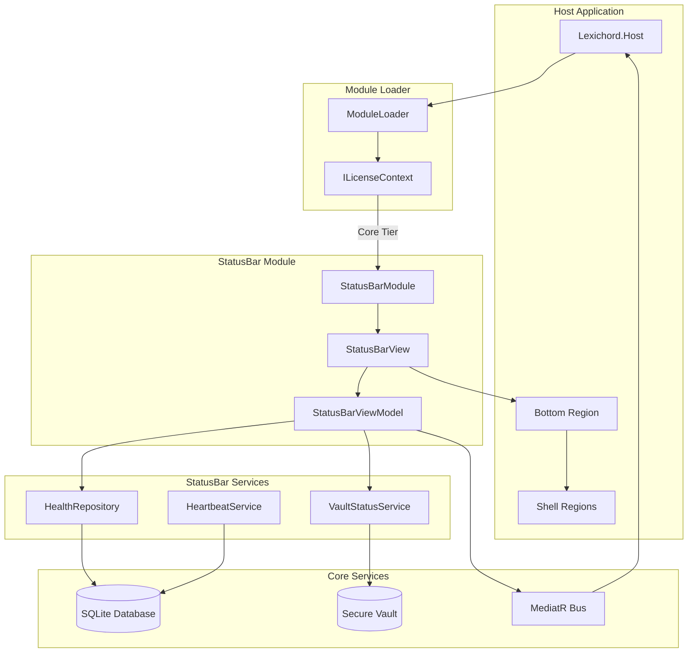
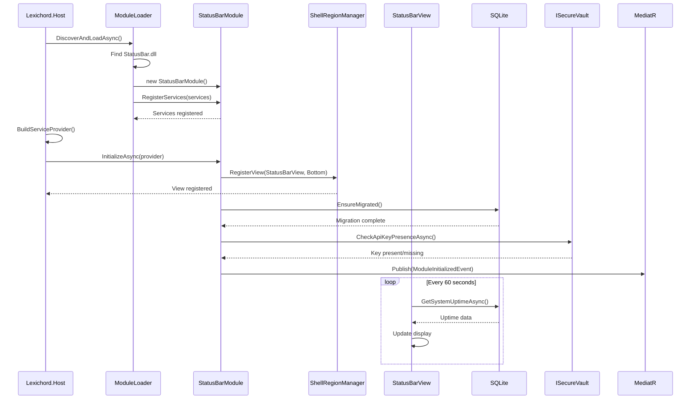

# LCS-01: Feature Design Composition

## 1. Metadata & Categorization

| Field                | Value                                        | Description                                             |
| :------------------- | :------------------------------------------- | :------------------------------------------------------ |
| **Feature ID**       | `INF-008`                                    | Infrastructure - End-to-End Proof                       |
| **Feature Name**     | The Hello World (Golden Skeleton)            | Complete architectural validation                       |
| **Target Version**   | `v0.0.8`                                     | Golden Skeleton Milestone                               |
| **Module Scope**     | `Lexichord.Modules.StatusBar` / All Systems  | Full integration proof                                  |
| **Swimlane**         | `Infrastructure`                             | The Podium (Platform)                                   |
| **License Tier**     | `Core`                                       | Foundation (Required for all tiers)                     |
| **Feature Gate Key** | N/A                                          | No runtime gating for infrastructure validation         |
| **Author**           | System Architect                             |                                                         |
| **Status**           | **Draft**                                    | Pending implementation                                  |
| **Last Updated**     | 2026-01-26                                   |                                                         |

---

## 2. Executive Summary

### 2.1 The Requirement

After implementing seven foundational versions (v0.0.1 through v0.0.7), Lexichord needs **proof that all systems work together**. Each version was developed and tested in isolation, but the architecture has never been validated end-to-end.

We need a **real feature module** that:

- Is discovered and loaded by the Module Loader.
- Registers its view in a Shell Region.
- Queries the SQLite database.
- Checks the Secure Vault for API keys.
- Publishes and subscribes to MediatR events.
- Respects license tier restrictions.
- Logs all operations via Serilog.
- Reads configuration from appsettings.json.

### 2.2 The Proposed Solution

We **SHALL** implement `Lexichord.Modules.StatusBar`, a lightweight module that:

1. **v0.0.8a: Status Bar Module** - Creates module and registers in Bottom Shell Region.
2. **v0.0.8b: Database Health Check** - Queries SQLite for system uptime.
3. **v0.0.8c: Secure Vault Check** - Verifies API key presence.
4. **v0.0.8d: Golden Skeleton Release** - Tags repo and documents proven architecture.

This module serves as the **canonical reference implementation** for all future modules.

---

## 3. Architecture & Modular Strategy

### 3.1 High-Level Architecture



### 3.2 System Integration Sequence



### 3.3 Dependencies

- **NuGet Packages (StatusBar Module):**

| Package                                    | Version | Purpose                          |
| :----------------------------------------- | :------ | :------------------------------- |
| `Avalonia`                                 | 11.2.x  | UI framework                     |
| `CommunityToolkit.Mvvm`                    | 8.x     | MVVM support                     |
| `Microsoft.Extensions.DependencyInjection` | 9.0.x   | DI abstractions only             |

- **Project References:**

| Project                        | Reference Direction         |
| :----------------------------- | :-------------------------- |
| `Lexichord.Modules.StatusBar`  | -> `Lexichord.Abstractions` |
| `Lexichord.Host`               | (loads dynamically)         |

### 3.4 Licensing Behavior

- **Module Tier:** `Core` (available to all users)
- **Feature Gate:** None (always enabled)

---

## 4. Decision Tree: End-to-End Verification

```text
START: "Is the architecture proven?"
|
+-- Module Loading
|   +-- Does StatusBar.dll exist in ./Modules/?
|   |   +-- YES -> Continue
|   |   +-- NO -> FAIL: Module not built/deployed
|   +-- Does ModuleLoader discover IModule?
|   |   +-- YES -> Continue
|   |   +-- NO -> FAIL: IModule not found (check implementation)
|   +-- Does RegisterServices() execute?
|       +-- YES -> Continue
|       +-- NO -> FAIL: DI not working
|
+-- Shell Region Integration
|   +-- Does StatusBarView implement IShellRegionView?
|   |   +-- YES -> Continue
|   |   +-- NO -> FAIL: Interface not implemented
|   +-- Does view appear in Bottom region?
|       +-- YES -> Continue
|       +-- NO -> FAIL: Region registration not working
|
+-- Database Integration
|   +-- Does system_health table exist?
|   |   +-- YES -> Continue
|   |   +-- NO -> FAIL: Migration not run
|   +-- Does GetSystemUptimeAsync() return data?
|   |   +-- YES -> Continue
|   |   +-- NO -> FAIL: Query failed
|   +-- Does heartbeat update every 60 seconds?
|       +-- YES -> Continue
|       +-- NO -> FAIL: Timer not working
|
+-- Vault Integration
|   +-- Can ISecureVault be resolved?
|   |   +-- YES -> Continue
|   |   +-- NO -> FAIL: Vault not registered
|   +-- Does CheckApiKeyPresenceAsync() work?
|       +-- YES -> Continue
|       +-- NO -> FAIL: Vault access broken
|
+-- Event Bus Integration
|   +-- Does ModuleInitializedEvent publish?
|   |   +-- YES -> Continue
|   |   +-- NO -> FAIL: MediatR not configured
|   +-- Do subscribers receive events?
|       +-- YES -> Continue
|       +-- NO -> FAIL: Handler not registered
|
+-- SUCCESS: Architecture is proven
    Tag as v0.0.8-golden-skeleton
```

---

## 5. Data Contracts

### 5.1 Status Bar Interfaces

```csharp
namespace Lexichord.Abstractions.Contracts;

/// <summary>
/// Represents a view that can be hosted in a shell region.
/// </summary>
/// <remarks>
/// LOGIC: Shell regions are predefined areas in the Host's MainWindow where
/// modules can contribute UI. The IShellRegionView interface allows modules
/// to declare which region they want to occupy.
/// </remarks>
public interface IShellRegionView
{
    /// <summary>
    /// Gets the target shell region for this view.
    /// </summary>
    ShellRegion TargetRegion { get; }

    /// <summary>
    /// Gets the display order within the region (lower = first).
    /// </summary>
    int Order { get; }

    /// <summary>
    /// Gets the view content (typically a UserControl).
    /// </summary>
    object ViewContent { get; }
}

/// <summary>
/// Defines the available shell regions in the Host.
/// </summary>
public enum ShellRegion
{
    /// <summary>Top toolbar/ribbon area.</summary>
    Top = 0,

    /// <summary>Left sidebar/navigation area.</summary>
    Left = 1,

    /// <summary>Main content/editor area.</summary>
    Center = 2,

    /// <summary>Right sidebar/properties area.</summary>
    Right = 3,

    /// <summary>Bottom status bar/output area.</summary>
    Bottom = 4
}
```

### 5.2 Health Repository Interface

```csharp
namespace Lexichord.Abstractions.Contracts;

/// <summary>
/// Repository for system health data.
/// </summary>
public interface IHealthRepository
{
    /// <summary>
    /// Gets the system uptime since application started.
    /// </summary>
    /// <returns>The time elapsed since startup.</returns>
    Task<TimeSpan> GetSystemUptimeAsync();

    /// <summary>
    /// Gets the timestamp of the last heartbeat.
    /// </summary>
    /// <returns>The last heartbeat time, or null if never recorded.</returns>
    Task<DateTime?> GetLastHeartbeatAsync();

    /// <summary>
    /// Records a heartbeat with the current timestamp.
    /// </summary>
    Task RecordHeartbeatAsync();

    /// <summary>
    /// Records the application start time.
    /// </summary>
    Task RecordStartupAsync();

    /// <summary>
    /// Gets the database version for schema verification.
    /// </summary>
    /// <returns>The current database schema version.</returns>
    Task<int> GetDatabaseVersionAsync();
}
```

### 5.3 Vault Status Service Interface

```csharp
namespace Lexichord.Abstractions.Contracts;

/// <summary>
/// Service for checking vault status and API key presence.
/// </summary>
public interface IVaultStatusService
{
    /// <summary>
    /// Checks if the specified API key exists in the secure vault.
    /// </summary>
    /// <param name="keyName">The key identifier to check.</param>
    /// <returns>True if the key exists, false otherwise.</returns>
    Task<bool> CheckApiKeyPresenceAsync(string keyName);

    /// <summary>
    /// Stores an API key in the secure vault.
    /// </summary>
    /// <param name="keyName">The key identifier.</param>
    /// <param name="keyValue">The key value to store.</param>
    Task StoreApiKeyAsync(string keyName, string keyValue);

    /// <summary>
    /// Gets the overall vault status.
    /// </summary>
    /// <returns>The current vault status.</returns>
    Task<VaultStatus> GetVaultStatusAsync();
}

/// <summary>
/// Represents the overall status of the secure vault.
/// </summary>
public enum VaultStatus
{
    /// <summary>Vault is accessible and functional.</summary>
    Ready,

    /// <summary>Vault is accessible but no keys are stored.</summary>
    Empty,

    /// <summary>Vault cannot be accessed (error state).</summary>
    Error,

    /// <summary>Vault is not available on this platform.</summary>
    Unavailable
}
```

### 5.4 Heartbeat Service Interface

```csharp
namespace Lexichord.Abstractions.Contracts;

/// <summary>
/// Service for periodic heartbeat recording.
/// </summary>
public interface IHeartbeatService : IDisposable
{
    /// <summary>
    /// Starts the heartbeat timer.
    /// </summary>
    void Start();

    /// <summary>
    /// Stops the heartbeat timer.
    /// </summary>
    void Stop();

    /// <summary>
    /// Gets whether the heartbeat service is running.
    /// </summary>
    bool IsRunning { get; }

    /// <summary>
    /// Gets the heartbeat interval.
    /// </summary>
    TimeSpan Interval { get; }
}
```

### 5.5 Status Bar Events

```csharp
namespace Lexichord.Abstractions.Events;

/// <summary>
/// Event raised when system health status changes.
/// </summary>
/// <param name="Status">The new health status.</param>
/// <param name="Message">Optional status message.</param>
/// <param name="Timestamp">When the status changed.</param>
public record SystemHealthChangedEvent(
    HealthStatus Status,
    string? Message,
    DateTime Timestamp
) : INotification;

/// <summary>
/// Represents the overall system health.
/// </summary>
public enum HealthStatus
{
    /// <summary>All systems operational.</summary>
    Healthy,

    /// <summary>Some systems degraded but functional.</summary>
    Degraded,

    /// <summary>Critical system failure.</summary>
    Unhealthy
}

/// <summary>
/// Event raised when vault status changes.
/// </summary>
/// <param name="Status">The new vault status.</param>
/// <param name="HasApiKey">Whether the test API key exists.</param>
public record VaultStatusChangedEvent(
    VaultStatus Status,
    bool HasApiKey
) : INotification;
```

---

## 6. Implementation Logic

### 6.1 StatusBarModule Implementation

```csharp
using Lexichord.Abstractions.Contracts;
using Microsoft.Extensions.DependencyInjection;
using Microsoft.Extensions.Logging;

namespace Lexichord.Modules.StatusBar;

/// <summary>
/// The StatusBar module - proof of end-to-end architecture integration.
/// </summary>
/// <remarks>
/// LOGIC: This module serves as the canonical reference implementation for all
/// future Lexichord modules. It exercises every foundational system:
/// - Module Loading (v0.0.4)
/// - Shell Regions (v0.0.5)
/// - Database Access (v0.0.6)
/// - Secure Vault (v0.0.7)
/// - Event Bus (v0.0.7)
///
/// If this module works, the Golden Skeleton is complete.
/// </remarks>
public class StatusBarModule : IModule
{
    /// <inheritdoc/>
    public ModuleInfo Info => new(
        Id: "statusbar",
        Name: "Status Bar",
        Version: new Version(0, 0, 8),
        Author: "Lexichord Team",
        Description: "System status bar displaying health, vault, and event status"
    );

    /// <inheritdoc/>
    /// <remarks>
    /// LOGIC: Register all StatusBar services before the DI container is built.
    /// This allows other modules to depend on our services if needed.
    /// </remarks>
    public void RegisterServices(IServiceCollection services)
    {
        // View and ViewModel
        services.AddTransient<StatusBarView>();
        services.AddTransient<StatusBarViewModel>();

        // Services
        services.AddSingleton<IHealthRepository, HealthRepository>();
        services.AddSingleton<IHeartbeatService, HeartbeatService>();
        services.AddSingleton<IVaultStatusService, VaultStatusService>();

        // Shell Region View registration
        services.AddSingleton<IShellRegionView, StatusBarRegionView>();
    }

    /// <inheritdoc/>
    /// <remarks>
    /// LOGIC: Initialize after DI is built. This is where we:
    /// 1. Run database migrations
    /// 2. Record application startup
    /// 3. Start the heartbeat service
    /// 4. Publish module initialized event
    /// </remarks>
    public async Task InitializeAsync(IServiceProvider provider)
    {
        var logger = provider.GetRequiredService<ILogger<StatusBarModule>>();
        logger.LogInformation("Initializing StatusBar module");

        try
        {
            // Run database migrations
            var healthRepo = provider.GetRequiredService<IHealthRepository>();
            await InitializeDatabaseAsync(healthRepo, logger);

            // Start heartbeat service
            var heartbeat = provider.GetRequiredService<IHeartbeatService>();
            heartbeat.Start();
            logger.LogInformation("Heartbeat service started with {Interval} interval",
                heartbeat.Interval);

            // Check vault status
            var vaultService = provider.GetRequiredService<IVaultStatusService>();
            var vaultStatus = await vaultService.GetVaultStatusAsync();
            logger.LogInformation("Vault status: {Status}", vaultStatus);

            // Publish initialized event
            var mediator = provider.GetRequiredService<IMediator>();
            await mediator.Publish(new ModuleInitializedEvent(Info.Id, Info.Name));

            logger.LogInformation("StatusBar module initialized successfully");
        }
        catch (Exception ex)
        {
            logger.LogError(ex, "Failed to initialize StatusBar module");
            throw;
        }
    }

    private static async Task InitializeDatabaseAsync(
        IHealthRepository repo,
        ILogger logger)
    {
        // Record startup time
        await repo.RecordStartupAsync();
        logger.LogDebug("Startup time recorded in database");

        // Verify database connection
        var version = await repo.GetDatabaseVersionAsync();
        logger.LogInformation("Database version: {Version}", version);
    }
}
```

### 6.2 StatusBarView.axaml

```xml
<UserControl xmlns="https://github.com/avaloniaui"
             xmlns:x="http://schemas.microsoft.com/winfx/2006/xaml"
             xmlns:d="http://schemas.microsoft.com/expression/blend/2008"
             xmlns:mc="http://schemas.openxmlformats.org/markup-compatibility/2006"
             xmlns:vm="using:Lexichord.Modules.StatusBar"
             mc:Ignorable="d" d:DesignWidth="800" d:DesignHeight="24"
             x:Class="Lexichord.Modules.StatusBar.StatusBarView"
             x:DataType="vm:StatusBarViewModel">

    <UserControl.Styles>
        <Style Selector="Border.status-panel">
            <Setter Property="Padding" Value="8,2"/>
            <Setter Property="Margin" Value="2,0"/>
            <Setter Property="CornerRadius" Value="3"/>
            <Setter Property="Background" Value="{DynamicResource SystemControlBackgroundChromeMediumBrush}"/>
        </Style>
        <Style Selector="TextBlock.status-label">
            <Setter Property="FontSize" Value="11"/>
            <Setter Property="VerticalAlignment" Value="Center"/>
        </Style>
        <Style Selector="Ellipse.status-indicator">
            <Setter Property="Width" Value="8"/>
            <Setter Property="Height" Value="8"/>
            <Setter Property="Margin" Value="0,0,4,0"/>
        </Style>
        <Style Selector="Ellipse.healthy">
            <Setter Property="Fill" Value="#4CAF50"/>
        </Style>
        <Style Selector="Ellipse.warning">
            <Setter Property="Fill" Value="#FF9800"/>
        </Style>
        <Style Selector="Ellipse.error">
            <Setter Property="Fill" Value="#F44336"/>
        </Style>
    </UserControl.Styles>

    <Border Background="{DynamicResource SystemControlBackgroundAltHighBrush}"
            BorderBrush="{DynamicResource SystemControlForegroundBaseMediumLowBrush}"
            BorderThickness="0,1,0,0"
            Height="24">
        <Grid ColumnDefinitions="Auto,*,Auto">
            <!-- Left: Database Status -->
            <StackPanel Grid.Column="0" Orientation="Horizontal" Margin="8,0">
                <Border Classes="status-panel">
                    <StackPanel Orientation="Horizontal">
                        <Ellipse Classes="status-indicator"
                                 Classes.healthy="{Binding IsDatabaseHealthy}"
                                 Classes.warning="{Binding IsDatabaseWarning}"
                                 Classes.error="{Binding IsDatabaseError}"/>
                        <TextBlock Classes="status-label"
                                   Text="{Binding DatabaseStatusText}"/>
                    </StackPanel>
                </Border>
            </StackPanel>

            <!-- Center: Uptime -->
            <StackPanel Grid.Column="1" Orientation="Horizontal"
                        HorizontalAlignment="Center">
                <TextBlock Classes="status-label"
                           Text="{Binding UptimeText}"
                           Opacity="0.7"/>
            </StackPanel>

            <!-- Right: Vault Status -->
            <StackPanel Grid.Column="2" Orientation="Horizontal" Margin="8,0">
                <Border Classes="status-panel"
                        Cursor="Hand"
                        PointerPressed="OnVaultStatusClicked">
                    <StackPanel Orientation="Horizontal">
                        <Ellipse Classes="status-indicator"
                                 Classes.healthy="{Binding IsVaultReady}"
                                 Classes.warning="{Binding IsVaultEmpty}"
                                 Classes.error="{Binding IsVaultError}"/>
                        <TextBlock Classes="status-label"
                                   Text="{Binding VaultStatusText}"/>
                    </StackPanel>
                </Border>
            </StackPanel>
        </Grid>
    </Border>
</UserControl>
```

### 6.3 StatusBarViewModel

```csharp
using CommunityToolkit.Mvvm.ComponentModel;
using CommunityToolkit.Mvvm.Input;
using Lexichord.Abstractions.Contracts;
using Lexichord.Abstractions.Events;
using MediatR;
using Microsoft.Extensions.Logging;
using System.Timers;

namespace Lexichord.Modules.StatusBar;

/// <summary>
/// ViewModel for the StatusBar view.
/// </summary>
/// <remarks>
/// LOGIC: This ViewModel polls for status updates and publishes events when
/// status changes. It demonstrates the MVVM pattern with:
/// - Observable properties via CommunityToolkit.Mvvm
/// - Timer-based polling for database health
/// - Event publishing via MediatR
/// </remarks>
public partial class StatusBarViewModel : ObservableObject, IDisposable
{
    private readonly IHealthRepository _healthRepo;
    private readonly IVaultStatusService _vaultService;
    private readonly IMediator _mediator;
    private readonly ILogger<StatusBarViewModel> _logger;
    private readonly System.Timers.Timer _refreshTimer;

    private const string TestApiKeyName = "lexichord:test-api-key";
    private const int RefreshIntervalMs = 5000; // 5 seconds

    [ObservableProperty]
    private string _databaseStatusText = "DB: Checking...";

    [ObservableProperty]
    private bool _isDatabaseHealthy;

    [ObservableProperty]
    private bool _isDatabaseWarning;

    [ObservableProperty]
    private bool _isDatabaseError;

    [ObservableProperty]
    private string _uptimeText = "Uptime: --:--";

    [ObservableProperty]
    private string _vaultStatusText = "Vault: Checking...";

    [ObservableProperty]
    private bool _isVaultReady;

    [ObservableProperty]
    private bool _isVaultEmpty;

    [ObservableProperty]
    private bool _isVaultError;

    public StatusBarViewModel(
        IHealthRepository healthRepo,
        IVaultStatusService vaultService,
        IMediator mediator,
        ILogger<StatusBarViewModel> logger)
    {
        _healthRepo = healthRepo;
        _vaultService = vaultService;
        _mediator = mediator;
        _logger = logger;

        // LOGIC: Set up timer for periodic status refresh
        _refreshTimer = new System.Timers.Timer(RefreshIntervalMs);
        _refreshTimer.Elapsed += OnRefreshTimerElapsed;
        _refreshTimer.AutoReset = true;

        // Initial refresh
        _ = RefreshStatusAsync();
        _refreshTimer.Start();
    }

    private async void OnRefreshTimerElapsed(object? sender, ElapsedEventArgs e)
    {
        await RefreshStatusAsync();
    }

    private async Task RefreshStatusAsync()
    {
        await RefreshDatabaseStatusAsync();
        await RefreshVaultStatusAsync();
    }

    private async Task RefreshDatabaseStatusAsync()
    {
        try
        {
            var uptime = await _healthRepo.GetSystemUptimeAsync();
            var lastHeartbeat = await _healthRepo.GetLastHeartbeatAsync();

            // Update uptime display
            UptimeText = FormatUptime(uptime);

            // Check heartbeat staleness
            var isStale = lastHeartbeat.HasValue &&
                          DateTime.UtcNow - lastHeartbeat.Value > TimeSpan.FromMinutes(2);

            if (isStale)
            {
                DatabaseStatusText = "DB: Stale";
                SetDatabaseIndicator(warning: true);
            }
            else
            {
                DatabaseStatusText = "DB: Connected";
                SetDatabaseIndicator(healthy: true);
            }
        }
        catch (Exception ex)
        {
            _logger.LogError(ex, "Failed to refresh database status");
            DatabaseStatusText = "DB: Error";
            SetDatabaseIndicator(error: true);

            await _mediator.Publish(new SystemHealthChangedEvent(
                HealthStatus.Unhealthy,
                $"Database error: {ex.Message}",
                DateTime.UtcNow));
        }
    }

    private async Task RefreshVaultStatusAsync()
    {
        try
        {
            var status = await _vaultService.GetVaultStatusAsync();
            var hasKey = await _vaultService.CheckApiKeyPresenceAsync(TestApiKeyName);

            switch (status)
            {
                case VaultStatus.Ready when hasKey:
                    VaultStatusText = "Vault: Ready";
                    SetVaultIndicator(ready: true);
                    break;

                case VaultStatus.Ready when !hasKey:
                case VaultStatus.Empty:
                    VaultStatusText = "Vault: No Key";
                    SetVaultIndicator(empty: true);
                    break;

                case VaultStatus.Error:
                    VaultStatusText = "Vault: Error";
                    SetVaultIndicator(error: true);
                    break;

                case VaultStatus.Unavailable:
                    VaultStatusText = "Vault: N/A";
                    SetVaultIndicator(error: true);
                    break;
            }

            await _mediator.Publish(new VaultStatusChangedEvent(status, hasKey));
        }
        catch (Exception ex)
        {
            _logger.LogError(ex, "Failed to refresh vault status");
            VaultStatusText = "Vault: Error";
            SetVaultIndicator(error: true);
        }
    }

    private void SetDatabaseIndicator(bool healthy = false, bool warning = false, bool error = false)
    {
        IsDatabaseHealthy = healthy;
        IsDatabaseWarning = warning;
        IsDatabaseError = error;
    }

    private void SetVaultIndicator(bool ready = false, bool empty = false, bool error = false)
    {
        IsVaultReady = ready;
        IsVaultEmpty = empty;
        IsVaultError = error;
    }

    private static string FormatUptime(TimeSpan uptime)
    {
        if (uptime.TotalDays >= 1)
            return $"Uptime: {(int)uptime.TotalDays}d {uptime.Hours}h";
        if (uptime.TotalHours >= 1)
            return $"Uptime: {(int)uptime.TotalHours}h {uptime.Minutes}m";
        return $"Uptime: {uptime.Minutes}m {uptime.Seconds}s";
    }

    [RelayCommand]
    public async Task ShowApiKeyDialogAsync()
    {
        _logger.LogInformation("API key dialog requested");
        // This will be implemented in the view code-behind
        // to show a dialog for entering the test API key
    }

    public void Dispose()
    {
        _refreshTimer.Stop();
        _refreshTimer.Dispose();
        GC.SuppressFinalize(this);
    }
}
```

### 6.4 HealthRepository Implementation

```csharp
using Lexichord.Abstractions.Contracts;
using Microsoft.Data.Sqlite;
using Microsoft.Extensions.Logging;

namespace Lexichord.Modules.StatusBar.Services;

/// <summary>
/// SQLite implementation of the health repository.
/// </summary>
/// <remarks>
/// LOGIC: This repository demonstrates database access patterns for modules.
/// It handles migrations, queries, and updates through the shared database.
/// </remarks>
public sealed class HealthRepository : IHealthRepository
{
    private readonly IDbConnectionFactory _connectionFactory;
    private readonly ILogger<HealthRepository> _logger;
    private readonly DateTime _startupTime;

    private const int CurrentSchemaVersion = 1;

    public HealthRepository(
        IDbConnectionFactory connectionFactory,
        ILogger<HealthRepository> logger)
    {
        _connectionFactory = connectionFactory;
        _logger = logger;
        _startupTime = DateTime.UtcNow;

        // Run migrations on construction
        EnsureMigratedAsync().GetAwaiter().GetResult();
    }

    private async Task EnsureMigratedAsync()
    {
        await using var connection = await _connectionFactory.CreateConnectionAsync();

        // Create health table if not exists
        var createTableSql = """
            CREATE TABLE IF NOT EXISTS system_health (
                id INTEGER PRIMARY KEY CHECK (id = 1),
                started_at TEXT NOT NULL,
                last_heartbeat TEXT NOT NULL,
                database_version INTEGER NOT NULL
            )
            """;

        await using var command = connection.CreateCommand();
        command.CommandText = createTableSql;
        await command.ExecuteNonQueryAsync();

        _logger.LogDebug("System health table migration complete");
    }

    /// <inheritdoc/>
    public async Task<TimeSpan> GetSystemUptimeAsync()
    {
        return DateTime.UtcNow - _startupTime;
    }

    /// <inheritdoc/>
    public async Task<DateTime?> GetLastHeartbeatAsync()
    {
        await using var connection = await _connectionFactory.CreateConnectionAsync();
        await using var command = connection.CreateCommand();
        command.CommandText = "SELECT last_heartbeat FROM system_health WHERE id = 1";

        var result = await command.ExecuteScalarAsync();
        if (result is null or DBNull)
            return null;

        return DateTime.Parse((string)result);
    }

    /// <inheritdoc/>
    public async Task RecordHeartbeatAsync()
    {
        await using var connection = await _connectionFactory.CreateConnectionAsync();
        await using var command = connection.CreateCommand();

        command.CommandText = """
            UPDATE system_health
            SET last_heartbeat = @heartbeat
            WHERE id = 1
            """;
        command.Parameters.AddWithValue("@heartbeat", DateTime.UtcNow.ToString("O"));

        await command.ExecuteNonQueryAsync();
        _logger.LogDebug("Heartbeat recorded");
    }

    /// <inheritdoc/>
    public async Task RecordStartupAsync()
    {
        await using var connection = await _connectionFactory.CreateConnectionAsync();
        await using var command = connection.CreateCommand();

        // Upsert startup record
        command.CommandText = """
            INSERT INTO system_health (id, started_at, last_heartbeat, database_version)
            VALUES (1, @started, @heartbeat, @version)
            ON CONFLICT(id) DO UPDATE SET
                started_at = @started,
                last_heartbeat = @heartbeat
            """;

        var now = DateTime.UtcNow.ToString("O");
        command.Parameters.AddWithValue("@started", now);
        command.Parameters.AddWithValue("@heartbeat", now);
        command.Parameters.AddWithValue("@version", CurrentSchemaVersion);

        await command.ExecuteNonQueryAsync();
        _logger.LogInformation("Application startup recorded at {Time}", now);
    }

    /// <inheritdoc/>
    public async Task<int> GetDatabaseVersionAsync()
    {
        await using var connection = await _connectionFactory.CreateConnectionAsync();
        await using var command = connection.CreateCommand();
        command.CommandText = "SELECT database_version FROM system_health WHERE id = 1";

        var result = await command.ExecuteScalarAsync();
        return result is int version ? version : 0;
    }
}
```

### 6.5 HeartbeatService Implementation

```csharp
using Lexichord.Abstractions.Contracts;
using Microsoft.Extensions.Logging;

namespace Lexichord.Modules.StatusBar.Services;

/// <summary>
/// Service that records periodic heartbeats to the database.
/// </summary>
/// <remarks>
/// LOGIC: The heartbeat service runs on a timer and records timestamps
/// to the database. This allows detection of application hangs or crashes
/// by checking heartbeat staleness.
/// </remarks>
public sealed class HeartbeatService : IHeartbeatService
{
    private readonly IHealthRepository _healthRepo;
    private readonly ILogger<HeartbeatService> _logger;
    private readonly System.Timers.Timer _timer;
    private bool _disposed;

    private const int DefaultIntervalSeconds = 60;

    public HeartbeatService(
        IHealthRepository healthRepo,
        ILogger<HeartbeatService> logger)
    {
        _healthRepo = healthRepo;
        _logger = logger;

        _timer = new System.Timers.Timer(DefaultIntervalSeconds * 1000);
        _timer.Elapsed += OnTimerElapsed;
        _timer.AutoReset = true;
    }

    /// <inheritdoc/>
    public TimeSpan Interval => TimeSpan.FromSeconds(DefaultIntervalSeconds);

    /// <inheritdoc/>
    public bool IsRunning => _timer.Enabled;

    /// <inheritdoc/>
    public void Start()
    {
        if (_disposed)
            throw new ObjectDisposedException(nameof(HeartbeatService));

        _timer.Start();
        _logger.LogInformation("Heartbeat service started");

        // Record initial heartbeat
        _ = RecordHeartbeatAsync();
    }

    /// <inheritdoc/>
    public void Stop()
    {
        _timer.Stop();
        _logger.LogInformation("Heartbeat service stopped");
    }

    private async void OnTimerElapsed(object? sender, System.Timers.ElapsedEventArgs e)
    {
        await RecordHeartbeatAsync();
    }

    private async Task RecordHeartbeatAsync()
    {
        try
        {
            await _healthRepo.RecordHeartbeatAsync();
        }
        catch (Exception ex)
        {
            _logger.LogError(ex, "Failed to record heartbeat");
        }
    }

    public void Dispose()
    {
        if (_disposed)
            return;

        _timer.Stop();
        _timer.Dispose();
        _disposed = true;

        GC.SuppressFinalize(this);
    }
}
```

### 6.6 VaultStatusService Implementation

```csharp
using Lexichord.Abstractions.Contracts;
using Microsoft.Extensions.Logging;

namespace Lexichord.Modules.StatusBar.Services;

/// <summary>
/// Service for checking secure vault status.
/// </summary>
/// <remarks>
/// LOGIC: This service wraps ISecureVault to provide status information
/// and API key management for the StatusBar module.
/// </remarks>
public sealed class VaultStatusService : IVaultStatusService
{
    private readonly ISecureVault _vault;
    private readonly ILogger<VaultStatusService> _logger;

    public VaultStatusService(
        ISecureVault vault,
        ILogger<VaultStatusService> logger)
    {
        _vault = vault;
        _logger = logger;
    }

    /// <inheritdoc/>
    public async Task<bool> CheckApiKeyPresenceAsync(string keyName)
    {
        try
        {
            var value = await _vault.GetSecretAsync(keyName);
            return !string.IsNullOrEmpty(value);
        }
        catch (Exception ex)
        {
            _logger.LogError(ex, "Failed to check API key presence: {KeyName}", keyName);
            return false;
        }
    }

    /// <inheritdoc/>
    public async Task StoreApiKeyAsync(string keyName, string keyValue)
    {
        try
        {
            await _vault.SetSecretAsync(keyName, keyValue);
            _logger.LogInformation("API key stored: {KeyName}", keyName);
        }
        catch (Exception ex)
        {
            _logger.LogError(ex, "Failed to store API key: {KeyName}", keyName);
            throw;
        }
    }

    /// <inheritdoc/>
    public async Task<VaultStatus> GetVaultStatusAsync()
    {
        try
        {
            // Try a simple operation to verify vault is accessible
            var testKey = "lexichord:vault-test";
            await _vault.SetSecretAsync(testKey, "test");
            await _vault.DeleteSecretAsync(testKey);

            // Check if any real keys exist
            var hasKeys = await CheckApiKeyPresenceAsync("lexichord:test-api-key");
            return hasKeys ? VaultStatus.Ready : VaultStatus.Empty;
        }
        catch (PlatformNotSupportedException)
        {
            _logger.LogWarning("Secure vault not available on this platform");
            return VaultStatus.Unavailable;
        }
        catch (Exception ex)
        {
            _logger.LogError(ex, "Vault status check failed");
            return VaultStatus.Error;
        }
    }
}
```

---

## 7. UI Wireframe Reference

### 7.1 Status Bar Layout

```
+--------------------------------------------------------------------------------+
| [*] DB: Connected              Uptime: 2h 15m              [*] Vault: Ready    |
+--------------------------------------------------------------------------------+
  ^                                    ^                           ^
  |                                    |                           |
  +-- Green/Yellow/Red indicator       +-- Center aligned          +-- Clickable
      + Status text                        uptime display              opens dialog
```

### 7.2 Status Indicator States

| Component | State     | Indicator | Text              |
| :-------- | :-------- | :-------- | :---------------- |
| Database  | Healthy   | Green     | DB: Connected     |
| Database  | Warning   | Yellow    | DB: Stale         |
| Database  | Error     | Red       | DB: Error         |
| Vault     | Ready     | Green     | Vault: Ready      |
| Vault     | No Key    | Yellow    | Vault: No Key     |
| Vault     | Error     | Red       | Vault: Error      |
| Vault     | N/A       | Red       | Vault: N/A        |

### 7.3 API Key Dialog Wireframe

```
+---------------------------------------+
|        Enter Test API Key             |
+---------------------------------------+
|                                       |
|  This is a test key for validating    |
|  the secure vault integration.        |
|                                       |
|  API Key:                             |
|  +-------------------------------+    |
|  | ****************************  |    |
|  +-------------------------------+    |
|                                       |
|         [Cancel]    [Save Key]        |
+---------------------------------------+
```

---

## 8. Use Cases & User Stories

### 8.1 User Stories

| ID    | Role       | Story                                                                           | Acceptance Criteria                                 |
| :---- | :--------- | :------------------------------------------------------------------------------ | :-------------------------------------------------- |
| US-01 | User       | As a user, I want to see system status at a glance.                             | Status bar visible with DB and Vault status.        |
| US-02 | User       | As a user, I want to know how long the app has been running.                    | Uptime displays in status bar.                      |
| US-03 | User       | As a user, I want to be alerted when something is wrong.                        | Warning/error indicators show issues.               |
| US-04 | User       | As a user, I want to easily add an API key when missing.                        | Clicking "No Key" opens key entry dialog.           |
| US-05 | Developer  | As a developer, I want to verify all systems work together.                     | StatusBar exercises all foundational systems.       |
| US-06 | Developer  | As a developer, I want a reference module implementation.                       | StatusBar serves as canonical example.              |

### 8.2 Use Cases

#### UC-01: Normal Operation

**Preconditions:**
- Lexichord is installed and launched.
- StatusBar module exists in `./Modules/`.
- SQLite database is accessible.
- Secure vault is available.
- API key has been previously stored.

**Flow:**
1. Host starts and loads StatusBar module.
2. StatusBar registers view in Bottom region.
3. StatusBarView appears in MainWindow.
4. Database shows "DB: Connected" with green indicator.
5. Uptime shows "Uptime: 0m 5s" and increments.
6. Vault shows "Vault: Ready" with green indicator.
7. Every 60 seconds, heartbeat is recorded.
8. Every 5 seconds, status bar refreshes display.

**Postconditions:**
- All indicators are green.
- Uptime increases over time.
- Heartbeats are recorded in database.

---

#### UC-02: First Run (No API Key)

**Preconditions:**
- Fresh installation.
- No API key in vault.

**Flow:**
1. StatusBar loads and initializes.
2. Vault check finds no API key.
3. Vault shows "Vault: No Key" with yellow indicator.
4. User clicks on Vault status.
5. API key dialog opens.
6. User enters test API key.
7. User clicks "Save Key".
8. Key is stored in secure vault.
9. Vault status updates to "Vault: Ready" with green indicator.

**Postconditions:**
- API key is stored in vault.
- Vault indicator is green.
- Key persists across restarts.

---

#### UC-03: Database Error

**Preconditions:**
- Database file is corrupted or locked.

**Flow:**
1. StatusBar attempts to query database.
2. Query throws exception.
3. Database shows "DB: Error" with red indicator.
4. Error is logged with details.
5. SystemHealthChangedEvent published with Unhealthy status.
6. Status bar continues to function (vault still works).
7. Retry happens on next refresh cycle.

**Postconditions:**
- User sees database error.
- Other systems continue working.
- Error is logged for debugging.

---

## 9. Observability & Logging

### 9.1 Log Events

| Level       | Context             | Message Template                                                        |
| :---------- | :------------------ | :---------------------------------------------------------------------- |
| Information | StatusBarModule     | `Initializing StatusBar module`                                         |
| Information | StatusBarModule     | `Heartbeat service started with {Interval} interval`                    |
| Information | StatusBarModule     | `Vault status: {Status}`                                                |
| Information | StatusBarModule     | `StatusBar module initialized successfully`                             |
| Error       | StatusBarModule     | `Failed to initialize StatusBar module`                                 |
| Debug       | HealthRepository    | `System health table migration complete`                                |
| Debug       | HealthRepository    | `Heartbeat recorded`                                                    |
| Information | HealthRepository    | `Application startup recorded at {Time}`                                |
| Information | HealthRepository    | `Database version: {Version}`                                           |
| Information | HeartbeatService    | `Heartbeat service started`                                             |
| Information | HeartbeatService    | `Heartbeat service stopped`                                             |
| Error       | HeartbeatService    | `Failed to record heartbeat`                                            |
| Information | VaultStatusService  | `API key stored: {KeyName}`                                             |
| Error       | VaultStatusService  | `Failed to check API key presence: {KeyName}`                           |
| Error       | VaultStatusService  | `Failed to store API key: {KeyName}`                                    |
| Warning     | VaultStatusService  | `Secure vault not available on this platform`                           |
| Error       | VaultStatusService  | `Vault status check failed`                                             |
| Error       | StatusBarViewModel  | `Failed to refresh database status`                                     |
| Error       | StatusBarViewModel  | `Failed to refresh vault status`                                        |
| Information | StatusBarViewModel  | `API key dialog requested`                                              |

---

## 10. Integration Testing Requirements

### 10.1 End-to-End Integration Tests

```csharp
[TestFixture]
[Category("Integration")]
public class GoldenSkeletonIntegrationTests
{
    private ServiceProvider _provider = null!;
    private string _tempDbPath = null!;

    [OneTimeSetUp]
    public async Task SetUp()
    {
        _tempDbPath = Path.Combine(Path.GetTempPath(), $"lexichord-test-{Guid.NewGuid()}.db");

        var services = new ServiceCollection();

        // Configure services like the real application
        var config = new ConfigurationBuilder()
            .AddInMemoryCollection(new Dictionary<string, string?>
            {
                { "Database:ConnectionString", $"Data Source={_tempDbPath}" }
            })
            .Build();

        services.AddSingleton<IConfiguration>(config);

        // Register all services
        HostServices.ConfigureServices(services, config);

        // Create and load StatusBar module
        var statusBarModule = new StatusBarModule();
        statusBarModule.RegisterServices(services);

        _provider = services.BuildServiceProvider();

        // Initialize module
        await statusBarModule.InitializeAsync(_provider);
    }

    [OneTimeTearDown]
    public void TearDown()
    {
        _provider.Dispose();
        if (File.Exists(_tempDbPath))
            File.Delete(_tempDbPath);
    }

    [Test]
    public void ModuleLoader_DiscoversStatusBarModule()
    {
        var moduleLoader = _provider.GetRequiredService<IModuleLoader>();
        Assert.That(moduleLoader.LoadedModules, Has.Some.Matches<IModule>(
            m => m.Info.Id == "statusbar"));
    }

    [Test]
    public void ShellRegion_ContainsStatusBarView()
    {
        var regionManager = _provider.GetRequiredService<IShellRegionManager>();
        var bottomViews = regionManager.GetViews(ShellRegion.Bottom);
        Assert.That(bottomViews, Has.Some.TypeOf<StatusBarView>());
    }

    [Test]
    public async Task HealthRepository_ReturnsValidUptime()
    {
        var repo = _provider.GetRequiredService<IHealthRepository>();
        var uptime = await repo.GetSystemUptimeAsync();
        Assert.That(uptime, Is.GreaterThan(TimeSpan.Zero));
    }

    [Test]
    public async Task HealthRepository_RecordsHeartbeat()
    {
        var repo = _provider.GetRequiredService<IHealthRepository>();
        await repo.RecordHeartbeatAsync();
        var lastHeartbeat = await repo.GetLastHeartbeatAsync();
        Assert.That(lastHeartbeat, Is.Not.Null);
        Assert.That(lastHeartbeat.Value, Is.GreaterThan(DateTime.UtcNow.AddMinutes(-1)));
    }

    [Test]
    public async Task VaultStatusService_ReportsStatus()
    {
        var vaultService = _provider.GetRequiredService<IVaultStatusService>();
        var status = await vaultService.GetVaultStatusAsync();
        Assert.That(status, Is.Not.EqualTo(VaultStatus.Error));
    }

    [Test]
    public async Task VaultStatusService_StoresAndRetrievesKey()
    {
        var vaultService = _provider.GetRequiredService<IVaultStatusService>();
        const string testKey = "test:integration-key";
        const string testValue = "test-value-12345";

        await vaultService.StoreApiKeyAsync(testKey, testValue);
        var hasKey = await vaultService.CheckApiKeyPresenceAsync(testKey);

        Assert.That(hasKey, Is.True);
    }

    [Test]
    public async Task MediatR_DeliversHealthEvents()
    {
        var mediator = _provider.GetRequiredService<IMediator>();
        var eventReceived = false;

        // Subscribe to event (this would normally be done via INotificationHandler)
        var handler = new TestHealthEventHandler(() => eventReceived = true);

        await mediator.Publish(new SystemHealthChangedEvent(
            HealthStatus.Healthy,
            "Test event",
            DateTime.UtcNow));

        // In real test, verify handler was called
        Assert.Pass("Event published without error");
    }

    [Test]
    public async Task HeartbeatService_StartsAndStops()
    {
        var heartbeatService = _provider.GetRequiredService<IHeartbeatService>();

        Assert.That(heartbeatService.IsRunning, Is.True);

        heartbeatService.Stop();
        Assert.That(heartbeatService.IsRunning, Is.False);

        heartbeatService.Start();
        Assert.That(heartbeatService.IsRunning, Is.True);
    }

    [Test]
    public async Task DatabaseVersion_IsCorrect()
    {
        var repo = _provider.GetRequiredService<IHealthRepository>();
        var version = await repo.GetDatabaseVersionAsync();
        Assert.That(version, Is.EqualTo(1));
    }
}
```

---

## 11. Security & Safety

### 11.1 API Key Security

> [!WARNING]
> The test API key is for demonstration purposes only.
> In production, API keys should:
> - Never be logged (even at Debug level)
> - Be validated before storage
> - Have appropriate access controls

### 11.2 Database Security

> [!NOTE]
> The SQLite database stores only non-sensitive system health data.
> No user data, credentials, or PII is stored in `system_health` table.

### 11.3 Vault Access

> [!IMPORTANT]
> `ISecureVault` uses platform-native secure storage:
> - Windows: DPAPI / Credential Manager
> - macOS: Keychain
> - Linux: libsecret / kwallet
>
> Keys are encrypted at rest using user-specific encryption.

---

## 12. Risks & Mitigations

| Risk                                    | Impact | Mitigation                                                   |
| :-------------------------------------- | :----- | :----------------------------------------------------------- |
| Shell Region not implemented in v0.0.5  | High   | Define minimal IShellRegionView interface for v0.0.8         |
| SQLite locked by another process        | Medium | Use connection pooling; retry with exponential backoff       |
| Vault unavailable on Linux              | Medium | Implement fallback encrypted file storage                    |
| Timer memory leaks                      | Low    | Implement IDisposable properly; stop timer on module unload  |
| Integration tests flaky in CI           | Medium | Use dedicated test database; avoid timing dependencies       |
| Module load order issues                | Medium | StatusBar has no dependencies on other modules               |

---

## 13. Acceptance Criteria (QA)

| #   | Category            | Criterion                                                                       |
| :-- | :------------------ | :------------------------------------------------------------------------------ |
| 1   | **[Module]**        | `Lexichord.Modules.StatusBar.dll` exists in `./Modules/` directory              |
| 2   | **[Module]**        | Module loads without errors on Host startup                                     |
| 3   | **[Module]**        | Module has no reference to `Lexichord.Host` project                             |
| 4   | **[Region]**        | StatusBarView appears in MainWindow Bottom region                               |
| 5   | **[Database]**      | `system_health` table is created automatically                                  |
| 6   | **[Database]**      | Uptime displays correctly in status bar                                         |
| 7   | **[Database]**      | Heartbeat updates every 60 seconds                                              |
| 8   | **[Vault]**         | Vault status accurately reflects API key presence                               |
| 9   | **[Vault]**         | Clicking "No Key" opens key entry dialog                                        |
| 10  | **[Vault]**         | Entered key is persisted to secure vault                                        |
| 11  | **[Events]**        | `SystemHealthChangedEvent` is published on status change                        |
| 12  | **[Events]**        | `VaultStatusChangedEvent` is published on vault status change                   |
| 13  | **[Logging]**       | All operations are logged with appropriate levels                               |
| 14  | **[Tests]**         | All integration tests pass                                                      |
| 15  | **[Release]**       | Git tag `v0.0.8-golden-skeleton` is created                                     |

---

## 14. Verification Commands

```bash
# 1. Build all projects including StatusBar module
dotnet build

# 2. Verify StatusBar DLL is in Modules directory
ls bin/Debug/net9.0/Modules/
# Expected: Lexichord.Modules.StatusBar.dll

# 3. Verify no Host reference in StatusBar
dotnet list src/Lexichord.Modules.StatusBar reference
# Expected: Only Lexichord.Abstractions

# 4. Run application and verify status bar appears
dotnet run --project src/Lexichord.Host

# 5. Check logs for module loading
# Expected:
# - "Starting module discovery..."
# - "Loading module: Status Bar v0.0.8..."
# - "StatusBar module initialized successfully"
# - "Heartbeat service started with 00:01:00 interval"

# 6. Run integration tests
dotnet test --filter "Category=Integration"

# 7. Run all unit tests
dotnet test --filter "Category=Unit"

# 8. Verify database file created
ls ~/.config/Lexichord/lexichord.db

# 9. Check database contents
sqlite3 ~/.config/Lexichord/lexichord.db "SELECT * FROM system_health"

# 10. Create release tag
git tag -a v0.0.8-golden-skeleton -m "Golden Skeleton: Architecture proven"
git push origin v0.0.8-golden-skeleton
```

---

## 15. Deliverable Checklist

| Step | Description                                                                      | Status |
| :--- | :------------------------------------------------------------------------------- | :----- |
| 1    | `Lexichord.Modules.StatusBar` project created                                    | [ ]    |
| 2    | Project references only `Lexichord.Abstractions`                                 | [ ]    |
| 3    | `StatusBarModule : IModule` implemented                                          | [ ]    |
| 4    | `StatusBarView.axaml` created with three status panels                           | [ ]    |
| 5    | `StatusBarViewModel` with database and vault status properties                   | [ ]    |
| 6    | View registered in `ShellRegion.Bottom`                                          | [ ]    |
| 7    | `IHealthRepository` interface defined in Abstractions                            | [ ]    |
| 8    | `HealthRepository` implementation queries SQLite                                 | [ ]    |
| 9    | `system_health` table schema defined and migrated                                | [ ]    |
| 10   | `IHeartbeatService` updates heartbeat every 60 seconds                           | [ ]    |
| 11   | `IVaultStatusService` interface defined                                          | [ ]    |
| 12   | `VaultStatusService` checks `ISecureVault` for API key                           | [ ]    |
| 13   | API key entry dialog implemented                                                 | [ ]    |
| 14   | `SystemHealthChangedEvent` published on status changes                           | [ ]    |
| 15   | `VaultStatusChangedEvent` published on vault changes                             | [ ]    |
| 16   | Integration tests for all systems created                                        | [ ]    |
| 17   | All integration tests passing                                                    | [ ]    |
| 18   | Architecture documentation updated                                               | [ ]    |
| 19   | Module Developer Guide created                                                   | [ ]    |
| 20   | Release notes for v0.0.8 written                                                 | [ ]    |
| 21   | Git tag `v0.0.8-golden-skeleton` created                                         | [ ]    |
| 22   | CI/CD pipeline passes all checks                                                 | [ ]    |
