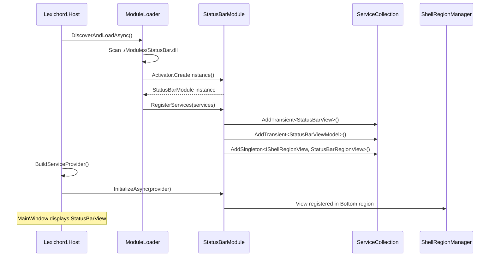

# LCS-INF-008a: Status Bar Module - Shell Region Registration

## 1. Metadata & Categorization

| Field                | Value                                    | Description                                        |
| :------------------- | :--------------------------------------- | :------------------------------------------------- |
| **Feature ID**       | `INF-008a`                               | Infrastructure - Status Bar Module Setup           |
| **Feature Name**     | Status Bar Module                        | Shell region registration and view creation        |
| **Target Version**   | `v0.0.8a`                                | First sub-part of v0.0.8                           |
| **Module Scope**     | `Lexichord.Modules.StatusBar`            | New feature module                                 |
| **Swimlane**         | `Infrastructure`                         | The Podium (Platform)                              |
| **License Tier**     | `Core`                                   | Foundation (Available to all users)                |
| **Author**           | System Architect                         |                                                    |
| **Status**           | **Draft**                                | Pending implementation                             |
| **Last Updated**     | 2026-01-26                               |                                                    |

---

## 2. Executive Summary

### 2.1 The Requirement

To prove the modular monolith architecture works, we need a **real module** that:

- Lives in the `./Modules/` directory as a separate assembly.
- Implements the `IModule` interface for lifecycle management.
- Registers services in the DI container.
- Contributes UI to a Shell Region in the Host.

Without a working module, we cannot prove:
- Module discovery and loading works.
- Service registration from modules works.
- Shell regions accept module-contributed views.
- The architecture is ready for feature development.

### 2.2 The Proposed Solution

We **SHALL** create `Lexichord.Modules.StatusBar`, a lightweight module that:

1. **Implements IModule** - Full lifecycle integration with the Host.
2. **Creates StatusBarView** - A UserControl for the bottom region.
3. **Registers in Shell Region** - View appears in the Host's Bottom area.
4. **Serves as Reference** - Blueprint for all future modules.

---

## 3. Architecture

### 3.1 Project Structure

```
src/
+-- Lexichord.Modules.StatusBar/
    +-- Lexichord.Modules.StatusBar.csproj
    +-- StatusBarModule.cs              # IModule implementation
    +-- Views/
    |   +-- StatusBarView.axaml         # Main view
    |   +-- StatusBarView.axaml.cs      # Code-behind
    |   +-- ApiKeyDialog.axaml          # Key entry dialog
    |   +-- ApiKeyDialog.axaml.cs
    +-- ViewModels/
    |   +-- StatusBarViewModel.cs       # Main ViewModel
    |   +-- ApiKeyDialogViewModel.cs    # Dialog ViewModel
    +-- Services/
    |   +-- HealthRepository.cs         # (v0.0.8b)
    |   +-- HeartbeatService.cs         # (v0.0.8b)
    |   +-- VaultStatusService.cs       # (v0.0.8c)
    +-- StatusBarRegionView.cs          # IShellRegionView wrapper
```

### 3.2 Module Loading Sequence



### 3.3 Dependencies

- **NuGet Packages:**

| Package                                            | Version | Purpose                    |
| :------------------------------------------------- | :------ | :------------------------- |
| `Avalonia`                                         | 11.2.3  | UI framework               |
| `CommunityToolkit.Mvvm`                            | 8.4.0   | MVVM support               |
| `Microsoft.Extensions.DependencyInjection.Abstractions` | 9.0.0 | DI interfaces only    |

- **Project References:**

| Project                       | Reference Type | Notes                              |
| :---------------------------- | :------------- | :--------------------------------- |
| `Lexichord.Abstractions`      | Project        | Only allowed reference             |
| `Lexichord.Host`              | **FORBIDDEN**  | Modules must not reference Host    |

---

## 4. Implementation Tasks

### Task 1.1: Create StatusBar Module Project

**File:** `src/Lexichord.Modules.StatusBar/Lexichord.Modules.StatusBar.csproj`

```xml
<Project Sdk="Microsoft.NET.Sdk">

  <PropertyGroup>
    <TargetFramework>net9.0</TargetFramework>
    <Nullable>enable</Nullable>
    <ImplicitUsings>enable</ImplicitUsings>
    <AvaloniaUseCompiledBindingsByDefault>true</AvaloniaUseCompiledBindingsByDefault>

    <!-- Module metadata -->
    <AssemblyTitle>Lexichord Status Bar Module</AssemblyTitle>
    <Description>System status bar displaying health, vault, and event status</Description>
    <Version>0.0.8</Version>

    <!-- CRITICAL: Output to Modules directory -->
    <OutputPath>$(SolutionDir)Modules\</OutputPath>
    <AppendTargetFrameworkToOutputPath>false</AppendTargetFrameworkToOutputPath>
    <AppendRuntimeIdentifierToOutputPath>false</AppendRuntimeIdentifierToOutputPath>
  </PropertyGroup>

  <ItemGroup>
    <!-- Avalonia UI -->
    <PackageReference Include="Avalonia" Version="11.2.3" />

    <!-- MVVM Support -->
    <PackageReference Include="CommunityToolkit.Mvvm" Version="8.4.0" />

    <!-- DI Abstractions only (not the full container) -->
    <PackageReference Include="Microsoft.Extensions.DependencyInjection.Abstractions" Version="9.0.0" />
    <PackageReference Include="Microsoft.Extensions.Logging.Abstractions" Version="9.0.0" />
  </ItemGroup>

  <ItemGroup>
    <!-- The ONLY project reference allowed for modules -->
    <ProjectReference Include="..\Lexichord.Abstractions\Lexichord.Abstractions.csproj" />
  </ItemGroup>

</Project>
```

**Rationale:** The output path ensures the DLL ends up in `./Modules/` where the ModuleLoader scans. Using only abstractions packages ensures no version conflicts with Host.

---

### Task 1.2: Implement IModule

**File:** `src/Lexichord.Modules.StatusBar/StatusBarModule.cs`

```csharp
using Lexichord.Abstractions.Contracts;
using Lexichord.Modules.StatusBar.Services;
using Lexichord.Modules.StatusBar.ViewModels;
using Lexichord.Modules.StatusBar.Views;
using Microsoft.Extensions.DependencyInjection;
using Microsoft.Extensions.Logging;

namespace Lexichord.Modules.StatusBar;

/// <summary>
/// The StatusBar module - canonical reference implementation for Lexichord modules.
/// </summary>
/// <remarks>
/// LOGIC: This module demonstrates the complete module lifecycle:
/// 1. ModuleLoader discovers StatusBar.dll in ./Modules/
/// 2. Reflection finds StatusBarModule implementing IModule
/// 3. RegisterServices() is called before DI container is built
/// 4. InitializeAsync() is called after DI container is built
///
/// IMPORTANT: This module must NOT reference Lexichord.Host.
/// All interaction with Host is through Abstractions interfaces.
/// </remarks>
public class StatusBarModule : IModule
{
    /// <inheritdoc/>
    public ModuleInfo Info => new(
        Id: "statusbar",
        Name: "Status Bar",
        Version: new Version(0, 0, 8),
        Author: "Lexichord Team",
        Description: "System status bar displaying health, vault, and event status"
    );

    /// <inheritdoc/>
    /// <remarks>
    /// LOGIC: This method is called BEFORE the ServiceProvider is built.
    /// Register all module services here. Do NOT resolve services.
    /// </remarks>
    public void RegisterServices(IServiceCollection services)
    {
        // Views - Transient because each request gets a new instance
        services.AddTransient<StatusBarView>();
        services.AddTransient<ApiKeyDialog>();

        // ViewModels - Transient to match their views
        services.AddTransient<StatusBarViewModel>();
        services.AddTransient<ApiKeyDialogViewModel>();

        // Services - Singleton for shared state
        services.AddSingleton<IHealthRepository, HealthRepository>();
        services.AddSingleton<IHeartbeatService, HeartbeatService>();
        services.AddSingleton<IVaultStatusService, VaultStatusService>();

        // Shell Region registration
        // LOGIC: This registers the StatusBar view for the Bottom region.
        // The ShellRegionManager will resolve this and add it to MainWindow.
        services.AddSingleton<IShellRegionView, StatusBarRegionView>();
    }

    /// <inheritdoc/>
    /// <remarks>
    /// LOGIC: This method is called AFTER the ServiceProvider is built.
    /// Resolve services and perform async initialization here.
    /// </remarks>
    public async Task InitializeAsync(IServiceProvider provider)
    {
        var logger = provider.GetRequiredService<ILogger<StatusBarModule>>();
        logger.LogInformation("Initializing {ModuleName} module", Info.Name);

        try
        {
            // Initialize database (v0.0.8b)
            await InitializeDatabaseAsync(provider, logger);

            // Start heartbeat service (v0.0.8b)
            StartHeartbeatService(provider, logger);

            // Verify vault status (v0.0.8c)
            await VerifyVaultStatusAsync(provider, logger);

            // Publish module initialized event
            await PublishInitializedEventAsync(provider, logger);

            logger.LogInformation("{ModuleName} module initialized successfully", Info.Name);
        }
        catch (Exception ex)
        {
            logger.LogError(ex, "Failed to initialize {ModuleName} module", Info.Name);
            // Don't rethrow - allow application to continue with degraded status bar
        }
    }

    private static async Task InitializeDatabaseAsync(
        IServiceProvider provider,
        ILogger logger)
    {
        var healthRepo = provider.GetRequiredService<IHealthRepository>();
        await healthRepo.RecordStartupAsync();

        var version = await healthRepo.GetDatabaseVersionAsync();
        logger.LogDebug("Database version: {Version}", version);
    }

    private static void StartHeartbeatService(
        IServiceProvider provider,
        ILogger logger)
    {
        var heartbeat = provider.GetRequiredService<IHeartbeatService>();
        heartbeat.Start();
        logger.LogInformation("Heartbeat service started with {Interval} interval",
            heartbeat.Interval);
    }

    private static async Task VerifyVaultStatusAsync(
        IServiceProvider provider,
        ILogger logger)
    {
        var vaultService = provider.GetRequiredService<IVaultStatusService>();
        var status = await vaultService.GetVaultStatusAsync();
        logger.LogInformation("Vault status: {Status}", status);
    }

    private static async Task PublishInitializedEventAsync(
        IServiceProvider provider,
        ILogger logger)
    {
        try
        {
            var mediator = provider.GetService<IMediator>();
            if (mediator is not null)
            {
                await mediator.Publish(new ModuleInitializedEvent("statusbar", "Status Bar"));
                logger.LogDebug("Module initialized event published");
            }
        }
        catch (Exception ex)
        {
            logger.LogWarning(ex, "Failed to publish module initialized event");
        }
    }
}
```

---

### Task 1.3: Create Status Bar View

**File:** `src/Lexichord.Modules.StatusBar/Views/StatusBarView.axaml`

```xml
<UserControl xmlns="https://github.com/avaloniaui"
             xmlns:x="http://schemas.microsoft.com/winfx/2006/xaml"
             xmlns:d="http://schemas.microsoft.com/expression/blend/2008"
             xmlns:mc="http://schemas.openxmlformats.org/markup-compatibility/2006"
             xmlns:vm="using:Lexichord.Modules.StatusBar.ViewModels"
             mc:Ignorable="d"
             d:DesignWidth="800" d:DesignHeight="24"
             x:Class="Lexichord.Modules.StatusBar.Views.StatusBarView"
             x:DataType="vm:StatusBarViewModel">

    <!-- LOGIC: Status bar styles define the visual appearance of status indicators.
         Using DynamicResource ensures theme changes are reflected. -->
    <UserControl.Styles>
        <!-- Status Panel Container -->
        <Style Selector="Border.status-panel">
            <Setter Property="Padding" Value="8,2"/>
            <Setter Property="Margin" Value="2,0"/>
            <Setter Property="CornerRadius" Value="3"/>
            <Setter Property="Background" Value="{DynamicResource SystemControlBackgroundChromeMediumBrush}"/>
            <Setter Property="Cursor" Value="Hand"/>
        </Style>
        <Style Selector="Border.status-panel:pointerover">
            <Setter Property="Background" Value="{DynamicResource SystemControlBackgroundChromeMediumHighBrush}"/>
        </Style>

        <!-- Status Label Text -->
        <Style Selector="TextBlock.status-label">
            <Setter Property="FontSize" Value="11"/>
            <Setter Property="FontFamily" Value="{StaticResource InterFont}"/>
            <Setter Property="VerticalAlignment" Value="Center"/>
            <Setter Property="Foreground" Value="{DynamicResource SystemControlForegroundBaseHighBrush}"/>
        </Style>

        <!-- Status Indicator Dot -->
        <Style Selector="Ellipse.status-indicator">
            <Setter Property="Width" Value="8"/>
            <Setter Property="Height" Value="8"/>
            <Setter Property="Margin" Value="0,0,6,0"/>
            <Setter Property="VerticalAlignment" Value="Center"/>
        </Style>

        <!-- Indicator Colors -->
        <Style Selector="Ellipse.healthy">
            <Setter Property="Fill" Value="#4CAF50"/>
        </Style>
        <Style Selector="Ellipse.warning">
            <Setter Property="Fill" Value="#FF9800"/>
        </Style>
        <Style Selector="Ellipse.error">
            <Setter Property="Fill" Value="#F44336"/>
        </Style>
        <Style Selector="Ellipse.unknown">
            <Setter Property="Fill" Value="#9E9E9E"/>
        </Style>

        <!-- Uptime Text -->
        <Style Selector="TextBlock.uptime-label">
            <Setter Property="FontSize" Value="11"/>
            <Setter Property="FontFamily" Value="{StaticResource InterFont}"/>
            <Setter Property="Opacity" Value="0.7"/>
            <Setter Property="VerticalAlignment" Value="Center"/>
        </Style>
    </UserControl.Styles>

    <Border Background="{DynamicResource SystemControlBackgroundAltHighBrush}"
            BorderBrush="{DynamicResource SystemControlForegroundBaseMediumLowBrush}"
            BorderThickness="0,1,0,0"
            Height="24">

        <Grid ColumnDefinitions="Auto,*,Auto">

            <!-- Left Section: Database Status -->
            <StackPanel Grid.Column="0"
                        Orientation="Horizontal"
                        Margin="8,0,0,0">
                <Border Classes="status-panel"
                        ToolTip.Tip="{Binding DatabaseTooltip}">
                    <StackPanel Orientation="Horizontal">
                        <Ellipse Classes="status-indicator"
                                 Classes.healthy="{Binding IsDatabaseHealthy}"
                                 Classes.warning="{Binding IsDatabaseWarning}"
                                 Classes.error="{Binding IsDatabaseError}"
                                 Classes.unknown="{Binding IsDatabaseUnknown}"/>
                        <TextBlock Classes="status-label"
                                   Text="{Binding DatabaseStatusText}"/>
                    </StackPanel>
                </Border>
            </StackPanel>

            <!-- Center Section: Uptime Display -->
            <StackPanel Grid.Column="1"
                        Orientation="Horizontal"
                        HorizontalAlignment="Center"
                        VerticalAlignment="Center">
                <TextBlock Classes="uptime-label"
                           Text="{Binding UptimeText}"
                           ToolTip.Tip="Time since application started"/>
            </StackPanel>

            <!-- Right Section: Vault Status -->
            <StackPanel Grid.Column="2"
                        Orientation="Horizontal"
                        Margin="0,0,8,0">
                <Border Classes="status-panel"
                        ToolTip.Tip="{Binding VaultTooltip}"
                        PointerPressed="OnVaultStatusClicked">
                    <StackPanel Orientation="Horizontal">
                        <Ellipse Classes="status-indicator"
                                 Classes.healthy="{Binding IsVaultReady}"
                                 Classes.warning="{Binding IsVaultEmpty}"
                                 Classes.error="{Binding IsVaultError}"
                                 Classes.unknown="{Binding IsVaultUnknown}"/>
                        <TextBlock Classes="status-label"
                                   Text="{Binding VaultStatusText}"/>
                    </StackPanel>
                </Border>
            </StackPanel>

        </Grid>
    </Border>
</UserControl>
```

**File:** `src/Lexichord.Modules.StatusBar/Views/StatusBarView.axaml.cs`

```csharp
using Avalonia.Controls;
using Avalonia.Input;
using Avalonia.Interactivity;
using Lexichord.Modules.StatusBar.ViewModels;
using Microsoft.Extensions.DependencyInjection;

namespace Lexichord.Modules.StatusBar.Views;

/// <summary>
/// Code-behind for the StatusBar view.
/// </summary>
/// <remarks>
/// LOGIC: The code-behind handles UI events that cannot be easily
/// bound through MVVM (like showing dialogs). All business logic
/// remains in the ViewModel.
/// </remarks>
public partial class StatusBarView : UserControl
{
    public StatusBarView()
    {
        InitializeComponent();
    }

    /// <summary>
    /// Called when the vault status panel is clicked.
    /// </summary>
    /// <remarks>
    /// LOGIC: When vault shows "No Key", clicking opens the API key
    /// entry dialog. This allows users to easily configure the vault.
    /// </remarks>
    private async void OnVaultStatusClicked(object? sender, PointerPressedEventArgs e)
    {
        if (DataContext is not StatusBarViewModel vm)
            return;

        // Only show dialog if vault is empty (no key)
        if (!vm.IsVaultEmpty)
            return;

        // Get the dialog from DI
        var topLevel = TopLevel.GetTopLevel(this);
        if (topLevel is not Window window)
            return;

        // Create and show the API key dialog
        var dialog = new ApiKeyDialog
        {
            DataContext = new ApiKeyDialogViewModel(
                vm.VaultStatusService,
                vm.Logger)
        };

        var result = await dialog.ShowDialog<bool>(window);

        if (result)
        {
            // Refresh vault status after key was added
            await vm.RefreshVaultStatusCommand.ExecuteAsync(null);
        }
    }
}
```

---

### Task 1.4: Shell Region Registration

**File:** `src/Lexichord.Modules.StatusBar/StatusBarRegionView.cs`

```csharp
using Lexichord.Abstractions.Contracts;
using Lexichord.Modules.StatusBar.Views;
using Microsoft.Extensions.DependencyInjection;

namespace Lexichord.Modules.StatusBar;

/// <summary>
/// Wraps StatusBarView for shell region registration.
/// </summary>
/// <remarks>
/// LOGIC: The IShellRegionView interface allows modules to declare
/// which region their view should be placed in. The ShellRegionManager
/// in Host collects all registered views and places them accordingly.
///
/// This wrapper pattern allows:
/// - Lazy view creation (view is created on first access)
/// - Dependency injection for the view
/// - Ordering multiple views in the same region
/// </remarks>
public sealed class StatusBarRegionView : IShellRegionView
{
    private readonly IServiceProvider _provider;
    private StatusBarView? _view;

    public StatusBarRegionView(IServiceProvider provider)
    {
        _provider = provider;
    }

    /// <inheritdoc/>
    /// <remarks>
    /// LOGIC: The StatusBar belongs in the Bottom region of the shell.
    /// This region is typically a narrow strip at the bottom of MainWindow.
    /// </remarks>
    public ShellRegion TargetRegion => ShellRegion.Bottom;

    /// <inheritdoc/>
    /// <remarks>
    /// LOGIC: Order determines position when multiple views target the same region.
    /// StatusBar uses 100 (middle priority) to allow other modules to position
    /// before (0-99) or after (101+) it.
    /// </remarks>
    public int Order => 100;

    /// <inheritdoc/>
    /// <remarks>
    /// LOGIC: The ViewContent is lazily created on first access.
    /// This ensures the view is created with a valid DI scope.
    /// </remarks>
    public object ViewContent
    {
        get
        {
            if (_view is null)
            {
                _view = _provider.GetRequiredService<StatusBarView>();
                _view.DataContext = _provider.GetRequiredService<StatusBarViewModel>();
            }
            return _view;
        }
    }
}
```

---

## 5. Shell Region Interface Definition

> [!NOTE]
> If `IShellRegionView` and `ShellRegion` don't exist in Abstractions from v0.0.5,
> they must be added as part of v0.0.8a.

**File:** `src/Lexichord.Abstractions/Contracts/IShellRegionView.cs`

```csharp
namespace Lexichord.Abstractions.Contracts;

/// <summary>
/// Represents a view that can be hosted in a shell region.
/// </summary>
/// <remarks>
/// LOGIC: Shell regions are predefined areas in the Host's MainWindow where
/// modules can contribute UI. This interface allows modules to declare:
/// - Which region they want to occupy
/// - What order they appear relative to other views
/// - The actual view content to display
///
/// The ShellRegionManager in Host is responsible for:
/// 1. Collecting all IShellRegionView registrations from DI
/// 2. Grouping them by TargetRegion
/// 3. Ordering them by Order property
/// 4. Adding ViewContent to the appropriate region container
/// </remarks>
/// <example>
/// <code>
/// public class MyModuleRegionView : IShellRegionView
/// {
///     public ShellRegion TargetRegion => ShellRegion.Left;
///     public int Order => 50;
///     public object ViewContent => _view;
/// }
/// </code>
/// </example>
public interface IShellRegionView
{
    /// <summary>
    /// Gets the target shell region for this view.
    /// </summary>
    ShellRegion TargetRegion { get; }

    /// <summary>
    /// Gets the display order within the region.
    /// </summary>
    /// <remarks>
    /// Lower values appear first. Use values like:
    /// - 0-49: High priority (appears at top/left)
    /// - 50-150: Normal priority (middle)
    /// - 151+: Low priority (appears at bottom/right)
    /// </remarks>
    int Order { get; }

    /// <summary>
    /// Gets the view content to display.
    /// </summary>
    /// <remarks>
    /// This is typically a UserControl but can be any visual element.
    /// The content is lazily created on first access.
    /// </remarks>
    object ViewContent { get; }
}

/// <summary>
/// Defines the available shell regions in the Host.
/// </summary>
/// <remarks>
/// LOGIC: Shell regions map to predefined areas in MainWindow:
/// - Top: Below title bar, full width (toolbars, ribbons)
/// - Left: Left sidebar (navigation, file tree)
/// - Center: Main content area (editor, documents)
/// - Right: Right sidebar (properties, inspector)
/// - Bottom: Status bar area (status, output)
///
/// The Host's MainWindow defines containers for each region.
/// Modules contribute views that are placed in these containers.
/// </remarks>
public enum ShellRegion
{
    /// <summary>
    /// Top toolbar/ribbon area, full width.
    /// </summary>
    Top = 0,

    /// <summary>
    /// Left sidebar/navigation area.
    /// </summary>
    Left = 1,

    /// <summary>
    /// Main content/editor area.
    /// </summary>
    Center = 2,

    /// <summary>
    /// Right sidebar/properties area.
    /// </summary>
    Right = 3,

    /// <summary>
    /// Bottom status bar/output area.
    /// </summary>
    Bottom = 4
}
```

---

## 6. Host Integration

The Host must be updated to support shell regions. This should be done in v0.0.5, but here's the pattern for reference.

**File:** `src/Lexichord.Host/Services/ShellRegionManager.cs` (Reference)

```csharp
using Lexichord.Abstractions.Contracts;
using Microsoft.Extensions.DependencyInjection;
using Microsoft.Extensions.Logging;

namespace Lexichord.Host.Services;

/// <summary>
/// Manages shell region views from modules.
/// </summary>
public sealed class ShellRegionManager : IShellRegionManager
{
    private readonly IServiceProvider _provider;
    private readonly ILogger<ShellRegionManager> _logger;
    private readonly Dictionary<ShellRegion, List<IShellRegionView>> _regionViews = new();

    public ShellRegionManager(
        IServiceProvider provider,
        ILogger<ShellRegionManager> logger)
    {
        _provider = provider;
        _logger = logger;
    }

    /// <summary>
    /// Initializes all registered region views.
    /// </summary>
    public void Initialize()
    {
        var views = _provider.GetServices<IShellRegionView>();

        foreach (var view in views)
        {
            if (!_regionViews.ContainsKey(view.TargetRegion))
                _regionViews[view.TargetRegion] = new List<IShellRegionView>();

            _regionViews[view.TargetRegion].Add(view);
            _logger.LogInformation(
                "Registered view in {Region} region with order {Order}",
                view.TargetRegion, view.Order);
        }

        // Sort each region by order
        foreach (var region in _regionViews.Keys)
        {
            _regionViews[region] = _regionViews[region]
                .OrderBy(v => v.Order)
                .ToList();
        }
    }

    /// <summary>
    /// Gets all views for a specific region, ordered by priority.
    /// </summary>
    public IReadOnlyList<IShellRegionView> GetViews(ShellRegion region)
    {
        return _regionViews.TryGetValue(region, out var views)
            ? views.AsReadOnly()
            : Array.Empty<IShellRegionView>();
    }
}
```

---

## 7. Unit Testing Requirements

### 7.1 Module Tests

```csharp
[TestFixture]
[Category("Unit")]
public class StatusBarModuleTests
{
    [Test]
    public void Info_ReturnsCorrectMetadata()
    {
        // Arrange
        var module = new StatusBarModule();

        // Assert
        Assert.Multiple(() =>
        {
            Assert.That(module.Info.Id, Is.EqualTo("statusbar"));
            Assert.That(module.Info.Name, Is.EqualTo("Status Bar"));
            Assert.That(module.Info.Version, Is.EqualTo(new Version(0, 0, 8)));
            Assert.That(module.Info.Author, Is.EqualTo("Lexichord Team"));
        });
    }

    [Test]
    public void RegisterServices_RegistersAllRequiredServices()
    {
        // Arrange
        var module = new StatusBarModule();
        var services = new ServiceCollection();

        // Add required dependencies
        services.AddLogging();
        services.AddSingleton<IConfiguration>(new ConfigurationBuilder().Build());

        // Act
        module.RegisterServices(services);
        var provider = services.BuildServiceProvider();

        // Assert
        Assert.Multiple(() =>
        {
            Assert.That(provider.GetService<StatusBarView>(), Is.Not.Null);
            Assert.That(provider.GetService<StatusBarViewModel>(), Is.Not.Null);
            Assert.That(provider.GetService<IShellRegionView>(), Is.Not.Null);
        });
    }
}
```

### 7.2 Region View Tests

```csharp
[TestFixture]
[Category("Unit")]
public class StatusBarRegionViewTests
{
    [Test]
    public void TargetRegion_ReturnsBottom()
    {
        // Arrange
        var mockProvider = new Mock<IServiceProvider>();
        var regionView = new StatusBarRegionView(mockProvider.Object);

        // Assert
        Assert.That(regionView.TargetRegion, Is.EqualTo(ShellRegion.Bottom));
    }

    [Test]
    public void Order_ReturnsMiddlePriority()
    {
        // Arrange
        var mockProvider = new Mock<IServiceProvider>();
        var regionView = new StatusBarRegionView(mockProvider.Object);

        // Assert
        Assert.That(regionView.Order, Is.EqualTo(100));
    }

    [Test]
    public void ViewContent_CreatesViewFromProvider()
    {
        // Arrange
        var mockView = new Mock<StatusBarView>();
        var mockViewModel = new Mock<StatusBarViewModel>();
        var mockProvider = new Mock<IServiceProvider>();

        mockProvider.Setup(p => p.GetService(typeof(StatusBarView)))
            .Returns(mockView.Object);
        mockProvider.Setup(p => p.GetService(typeof(StatusBarViewModel)))
            .Returns(mockViewModel.Object);

        var regionView = new StatusBarRegionView(mockProvider.Object);

        // Act
        var content = regionView.ViewContent;

        // Assert
        Assert.That(content, Is.SameAs(mockView.Object));
    }
}
```

---

## 8. Observability & Logging

| Level       | Context           | Message Template                                                |
| :---------- | :---------------- | :-------------------------------------------------------------- |
| Information | StatusBarModule   | `Initializing {ModuleName} module`                              |
| Information | StatusBarModule   | `{ModuleName} module initialized successfully`                  |
| Error       | StatusBarModule   | `Failed to initialize {ModuleName} module`                      |
| Debug       | StatusBarModule   | `Database version: {Version}`                                   |
| Information | StatusBarModule   | `Heartbeat service started with {Interval} interval`            |
| Information | StatusBarModule   | `Vault status: {Status}`                                        |
| Debug       | StatusBarModule   | `Module initialized event published`                            |
| Warning     | StatusBarModule   | `Failed to publish module initialized event`                    |
| Information | ShellRegionManager| `Registered view in {Region} region with order {Order}`         |

---

## 9. Definition of Done

- [ ] `Lexichord.Modules.StatusBar` project created
- [ ] Project outputs to `$(SolutionDir)Modules/` directory
- [ ] Project references ONLY `Lexichord.Abstractions`
- [ ] `StatusBarModule` implements `IModule` interface
- [ ] `RegisterServices()` registers all module services
- [ ] `InitializeAsync()` performs module initialization
- [ ] `StatusBarView.axaml` created with three status panels
- [ ] `StatusBarRegionView` implements `IShellRegionView`
- [ ] View targets `ShellRegion.Bottom` with order 100
- [ ] `IShellRegionView` interface exists in Abstractions (if not from v0.0.5)
- [ ] Module loads without errors on Host startup
- [ ] Status bar appears in MainWindow bottom region
- [ ] All unit tests passing

---

## 10. Verification Commands

```bash
# 1. Build the StatusBar module
dotnet build src/Lexichord.Modules.StatusBar

# 2. Verify DLL is in Modules directory
ls Modules/
# Expected: Lexichord.Modules.StatusBar.dll

# 3. Verify no Host reference
dotnet list src/Lexichord.Modules.StatusBar reference
# Expected: Only Lexichord.Abstractions

# 4. Build and run the full application
dotnet build
dotnet run --project src/Lexichord.Host

# 5. Check logs for module loading
# Expected logs:
# - "Starting module discovery..."
# - "Found module type: StatusBarModule"
# - "Loading module: Status Bar v0.0.8..."
# - "Initializing Status Bar module"
# - "Status Bar module initialized successfully"
# - "Registered view in Bottom region with order 100"

# 6. Run unit tests
dotnet test --filter "FullyQualifiedName~StatusBarModule"
dotnet test --filter "FullyQualifiedName~StatusBarRegionView"
```

---

## 11. What v0.0.8a Proves

When v0.0.8a is complete, we have proven:

1. **Module Discovery** - ModuleLoader finds assemblies in `./Modules/`
2. **Module Loading** - `IModule` implementation is instantiated correctly
3. **Service Registration** - Module services are added to DI container
4. **Module Initialization** - `InitializeAsync()` is called after DI is built
5. **Shell Region System** - Views can register for specific regions
6. **View Composition** - Module views appear in Host MainWindow
7. **Reference Isolation** - Modules work without Host reference

This is the first proof that the modular monolith architecture functions correctly.
