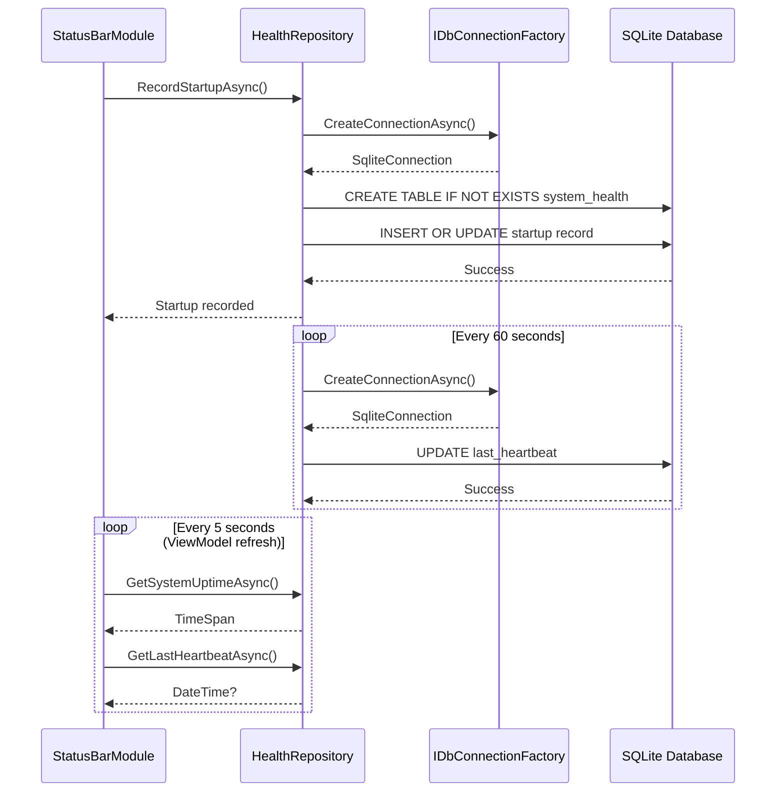

# LCS-INF-008b: Database Health Check - Query for Uptime

## 1. Metadata & Categorization

| Field                | Value                                    | Description                                        |
| :------------------- | :--------------------------------------- | :------------------------------------------------- |
| **Feature ID**       | `INF-008b`                               | Infrastructure - Database Health Check             |
| **Feature Name**     | Database Health Check                    | Query SQLite for system uptime and health          |
| **Target Version**   | `v0.0.8b`                                | Second sub-part of v0.0.8                          |
| **Module Scope**     | `Lexichord.Modules.StatusBar`            | StatusBar module database integration              |
| **Swimlane**         | `Infrastructure`                         | The Podium (Platform)                              |
| **License Tier**     | `Core`                                   | Foundation (Available to all users)                |
| **Author**           | System Architect                         |                                                    |
| **Status**           | **Draft**                                | Pending implementation                             |
| **Last Updated**     | 2026-01-26                               |                                                    |

---

## 2. Executive Summary

### 2.1 The Requirement

The StatusBar module needs to **prove database connectivity** by:

- Querying the SQLite database for system health information.
- Displaying uptime since application started.
- Recording periodic heartbeats to detect application hangs.
- Showing warnings when the heartbeat becomes stale.

This proves that:
- v0.0.6 Database infrastructure works.
- Modules can access the shared database through DI.
- Repository pattern implementation is correct.
- Migrations run properly on module initialization.

### 2.2 The Proposed Solution

We **SHALL** implement database health checking with:

1. **IHealthRepository** - Repository for health data access.
2. **system_health table** - SQLite table for uptime tracking.
3. **IHeartbeatService** - Periodic heartbeat recording.
4. **StatusBar Display** - Visual feedback of database status.

---

## 3. Architecture

### 3.1 Database Integration Flow



### 3.2 Database Schema

```sql
-- system_health table for tracking application health
CREATE TABLE IF NOT EXISTS system_health (
    id INTEGER PRIMARY KEY CHECK (id = 1),  -- Singleton row
    started_at TEXT NOT NULL,                -- ISO 8601 timestamp
    last_heartbeat TEXT NOT NULL,            -- ISO 8601 timestamp
    database_version INTEGER NOT NULL        -- Schema version
);

-- Example row:
-- id: 1
-- started_at: "2026-01-26T14:30:00.000Z"
-- last_heartbeat: "2026-01-26T14:35:00.000Z"
-- database_version: 1
```

---

## 4. Implementation Tasks

### Task 1.1: Create Health Repository

**File:** `src/Lexichord.Abstractions/Contracts/IHealthRepository.cs`

```csharp
namespace Lexichord.Abstractions.Contracts;

/// <summary>
/// Repository for system health data storage and retrieval.
/// </summary>
/// <remarks>
/// LOGIC: The health repository tracks application uptime and heartbeats.
/// It uses a singleton row pattern (id=1) to store the current session's
/// health information. This allows detection of:
/// - Application uptime (time since startup)
/// - Application responsiveness (heartbeat staleness)
/// - Database connectivity (query success/failure)
/// </remarks>
public interface IHealthRepository
{
    /// <summary>
    /// Gets the system uptime since application started.
    /// </summary>
    /// <returns>The time elapsed since startup.</returns>
    /// <remarks>
    /// LOGIC: Uptime is calculated as current time minus startup time.
    /// The startup time is stored in memory (not database) for accuracy.
    /// </remarks>
    Task<TimeSpan> GetSystemUptimeAsync();

    /// <summary>
    /// Gets the timestamp of the last successful heartbeat.
    /// </summary>
    /// <returns>The last heartbeat time, or null if never recorded.</returns>
    /// <remarks>
    /// LOGIC: If the heartbeat is more than 2 minutes old, the system
    /// should be considered potentially unresponsive.
    /// </remarks>
    Task<DateTime?> GetLastHeartbeatAsync();

    /// <summary>
    /// Records a heartbeat with the current timestamp.
    /// </summary>
    /// <remarks>
    /// LOGIC: This method is called periodically by the HeartbeatService.
    /// It updates the last_heartbeat column in system_health table.
    /// </remarks>
    Task RecordHeartbeatAsync();

    /// <summary>
    /// Records the application start time and initializes the health record.
    /// </summary>
    /// <remarks>
    /// LOGIC: This creates or updates the singleton health record.
    /// Should be called once during module initialization.
    /// </remarks>
    Task RecordStartupAsync();

    /// <summary>
    /// Gets the current database schema version.
    /// </summary>
    /// <returns>The schema version number.</returns>
    /// <remarks>
    /// LOGIC: Used to verify migrations have run and database is compatible.
    /// </remarks>
    Task<int> GetDatabaseVersionAsync();

    /// <summary>
    /// Checks if the database is accessible and responding.
    /// </summary>
    /// <returns>True if database is healthy, false otherwise.</returns>
    Task<bool> CheckHealthAsync();
}
```

**File:** `src/Lexichord.Modules.StatusBar/Services/HealthRepository.cs`

```csharp
using Lexichord.Abstractions.Contracts;
using Microsoft.Data.Sqlite;
using Microsoft.Extensions.Logging;

namespace Lexichord.Modules.StatusBar.Services;

/// <summary>
/// SQLite implementation of the health repository.
/// </summary>
/// <remarks>
/// LOGIC: This repository demonstrates proper database access patterns:
/// - Uses IDbConnectionFactory for connection management
/// - Runs migrations on construction (ensure table exists)
/// - Uses parameterized queries to prevent SQL injection
/// - Handles errors gracefully with logging
///
/// The singleton row pattern (id=1) ensures only one health record exists.
/// This simplifies queries and updates.
/// </remarks>
public sealed class HealthRepository : IHealthRepository
{
    private readonly IDbConnectionFactory _connectionFactory;
    private readonly ILogger<HealthRepository> _logger;
    private readonly DateTime _startupTime;

    private const int CurrentSchemaVersion = 1;
    private const string TableName = "system_health";

    public HealthRepository(
        IDbConnectionFactory connectionFactory,
        ILogger<HealthRepository> logger)
    {
        _connectionFactory = connectionFactory;
        _logger = logger;
        _startupTime = DateTime.UtcNow;

        // LOGIC: Ensure table exists on construction
        // This is safe because it uses CREATE TABLE IF NOT EXISTS
        EnsureTableExistsAsync().GetAwaiter().GetResult();
    }

    /// <summary>
    /// Ensures the system_health table exists.
    /// </summary>
    private async Task EnsureTableExistsAsync()
    {
        try
        {
            await using var connection = await _connectionFactory.CreateConnectionAsync();

            const string createTableSql = """
                CREATE TABLE IF NOT EXISTS system_health (
                    id INTEGER PRIMARY KEY CHECK (id = 1),
                    started_at TEXT NOT NULL,
                    last_heartbeat TEXT NOT NULL,
                    database_version INTEGER NOT NULL
                )
                """;

            await using var command = connection.CreateCommand();
            command.CommandText = createTableSql;
            await command.ExecuteNonQueryAsync();

            _logger.LogDebug("System health table verified/created");
        }
        catch (Exception ex)
        {
            _logger.LogError(ex, "Failed to ensure system_health table exists");
            throw;
        }
    }

    /// <inheritdoc/>
    public Task<TimeSpan> GetSystemUptimeAsync()
    {
        // LOGIC: Calculate uptime from in-memory startup time
        // This is more accurate than reading from database
        var uptime = DateTime.UtcNow - _startupTime;
        return Task.FromResult(uptime);
    }

    /// <inheritdoc/>
    public async Task<DateTime?> GetLastHeartbeatAsync()
    {
        try
        {
            await using var connection = await _connectionFactory.CreateConnectionAsync();
            await using var command = connection.CreateCommand();

            command.CommandText = $"SELECT last_heartbeat FROM {TableName} WHERE id = 1";

            var result = await command.ExecuteScalarAsync();

            if (result is null or DBNull)
            {
                _logger.LogDebug("No heartbeat record found");
                return null;
            }

            var timestamp = DateTime.Parse((string)result, null,
                System.Globalization.DateTimeStyles.RoundtripKind);

            _logger.LogDebug("Last heartbeat: {Timestamp}", timestamp);
            return timestamp;
        }
        catch (Exception ex)
        {
            _logger.LogError(ex, "Failed to get last heartbeat");
            return null;
        }
    }

    /// <inheritdoc/>
    public async Task RecordHeartbeatAsync()
    {
        try
        {
            await using var connection = await _connectionFactory.CreateConnectionAsync();
            await using var command = connection.CreateCommand();

            var now = DateTime.UtcNow.ToString("O");

            command.CommandText = $"""
                UPDATE {TableName}
                SET last_heartbeat = @heartbeat
                WHERE id = 1
                """;
            command.Parameters.AddWithValue("@heartbeat", now);

            var rowsAffected = await command.ExecuteNonQueryAsync();

            if (rowsAffected > 0)
            {
                _logger.LogDebug("Heartbeat recorded at {Timestamp}", now);
            }
            else
            {
                _logger.LogWarning("Heartbeat update affected 0 rows - record may not exist");
            }
        }
        catch (Exception ex)
        {
            _logger.LogError(ex, "Failed to record heartbeat");
            throw;
        }
    }

    /// <inheritdoc/>
    public async Task RecordStartupAsync()
    {
        try
        {
            await using var connection = await _connectionFactory.CreateConnectionAsync();
            await using var command = connection.CreateCommand();

            var now = DateTime.UtcNow.ToString("O");

            // LOGIC: Upsert pattern - insert if not exists, update if exists
            // The CHECK constraint (id = 1) ensures only one row ever exists
            command.CommandText = $"""
                INSERT INTO {TableName} (id, started_at, last_heartbeat, database_version)
                VALUES (1, @started, @heartbeat, @version)
                ON CONFLICT(id) DO UPDATE SET
                    started_at = @started,
                    last_heartbeat = @heartbeat,
                    database_version = @version
                """;

            command.Parameters.AddWithValue("@started", now);
            command.Parameters.AddWithValue("@heartbeat", now);
            command.Parameters.AddWithValue("@version", CurrentSchemaVersion);

            await command.ExecuteNonQueryAsync();

            _logger.LogInformation("Application startup recorded at {Timestamp}", now);
        }
        catch (Exception ex)
        {
            _logger.LogError(ex, "Failed to record startup");
            throw;
        }
    }

    /// <inheritdoc/>
    public async Task<int> GetDatabaseVersionAsync()
    {
        try
        {
            await using var connection = await _connectionFactory.CreateConnectionAsync();
            await using var command = connection.CreateCommand();

            command.CommandText = $"SELECT database_version FROM {TableName} WHERE id = 1";

            var result = await command.ExecuteScalarAsync();

            if (result is null or DBNull)
                return 0;

            return Convert.ToInt32(result);
        }
        catch (Exception ex)
        {
            _logger.LogError(ex, "Failed to get database version");
            return 0;
        }
    }

    /// <inheritdoc/>
    public async Task<bool> CheckHealthAsync()
    {
        try
        {
            await using var connection = await _connectionFactory.CreateConnectionAsync();
            await using var command = connection.CreateCommand();

            // Simple query to verify database is responsive
            command.CommandText = "SELECT 1";
            var result = await command.ExecuteScalarAsync();

            return result is not null;
        }
        catch (Exception ex)
        {
            _logger.LogError(ex, "Database health check failed");
            return false;
        }
    }
}
```

---

### Task 1.2: Create Heartbeat Service

**File:** `src/Lexichord.Abstractions/Contracts/IHeartbeatService.cs`

```csharp
namespace Lexichord.Abstractions.Contracts;

/// <summary>
/// Service for periodic heartbeat recording.
/// </summary>
/// <remarks>
/// LOGIC: The heartbeat service runs on a timer and periodically
/// records timestamps to the database. This allows detection of:
/// - Application hangs (heartbeat stops updating)
/// - Background processing issues (timer not firing)
/// - Database connectivity problems (update fails)
///
/// The service should be started during module initialization
/// and stopped during application shutdown.
/// </remarks>
public interface IHeartbeatService : IDisposable
{
    /// <summary>
    /// Starts the heartbeat timer.
    /// </summary>
    /// <remarks>
    /// LOGIC: After calling Start(), heartbeats will be recorded
    /// at the configured interval. An initial heartbeat is recorded
    /// immediately.
    /// </remarks>
    void Start();

    /// <summary>
    /// Stops the heartbeat timer.
    /// </summary>
    /// <remarks>
    /// LOGIC: Stops the timer but does not dispose resources.
    /// The service can be restarted by calling Start() again.
    /// </remarks>
    void Stop();

    /// <summary>
    /// Gets whether the heartbeat service is currently running.
    /// </summary>
    bool IsRunning { get; }

    /// <summary>
    /// Gets the heartbeat interval.
    /// </summary>
    TimeSpan Interval { get; }

    /// <summary>
    /// Gets the time of the last successful heartbeat recording.
    /// </summary>
    DateTime? LastHeartbeat { get; }

    /// <summary>
    /// Gets the number of consecutive heartbeat failures.
    /// </summary>
    int ConsecutiveFailures { get; }
}
```

**File:** `src/Lexichord.Modules.StatusBar/Services/HeartbeatService.cs`

```csharp
using Lexichord.Abstractions.Contracts;
using Microsoft.Extensions.Logging;

namespace Lexichord.Modules.StatusBar.Services;

/// <summary>
/// Service that records periodic heartbeats to the database.
/// </summary>
/// <remarks>
/// LOGIC: The heartbeat service provides a simple liveness indicator.
/// By recording timestamps at regular intervals, we can detect:
/// - Application freezes (heartbeat stops)
/// - Thread starvation (timer delays)
/// - Database issues (recording fails)
///
/// The default interval is 60 seconds, which balances:
/// - Frequency: Often enough to detect issues quickly
/// - Overhead: Infrequent enough to not impact performance
/// </remarks>
public sealed class HeartbeatService : IHeartbeatService
{
    private readonly IHealthRepository _healthRepo;
    private readonly ILogger<HeartbeatService> _logger;
    private readonly System.Timers.Timer _timer;
    private bool _disposed;

    private const int DefaultIntervalSeconds = 60;
    private const int MaxConsecutiveFailures = 5;

    /// <inheritdoc/>
    public TimeSpan Interval { get; }

    /// <inheritdoc/>
    public bool IsRunning => _timer.Enabled;

    /// <inheritdoc/>
    public DateTime? LastHeartbeat { get; private set; }

    /// <inheritdoc/>
    public int ConsecutiveFailures { get; private set; }

    public HeartbeatService(
        IHealthRepository healthRepo,
        ILogger<HeartbeatService> logger)
    {
        _healthRepo = healthRepo;
        _logger = logger;

        Interval = TimeSpan.FromSeconds(DefaultIntervalSeconds);

        _timer = new System.Timers.Timer(Interval.TotalMilliseconds);
        _timer.Elapsed += OnTimerElapsed;
        _timer.AutoReset = true;

        _logger.LogDebug("HeartbeatService created with {Interval} interval", Interval);
    }

    /// <inheritdoc/>
    public void Start()
    {
        ObjectDisposedException.ThrowIf(_disposed, this);

        if (IsRunning)
        {
            _logger.LogWarning("HeartbeatService is already running");
            return;
        }

        _timer.Start();
        _logger.LogInformation("Heartbeat service started with {Interval} interval", Interval);

        // LOGIC: Record initial heartbeat immediately
        _ = RecordHeartbeatAsync();
    }

    /// <inheritdoc/>
    public void Stop()
    {
        if (!IsRunning)
        {
            _logger.LogWarning("HeartbeatService is not running");
            return;
        }

        _timer.Stop();
        _logger.LogInformation("Heartbeat service stopped");
    }

    private async void OnTimerElapsed(object? sender, System.Timers.ElapsedEventArgs e)
    {
        await RecordHeartbeatAsync();
    }

    private async Task RecordHeartbeatAsync()
    {
        try
        {
            await _healthRepo.RecordHeartbeatAsync();
            LastHeartbeat = DateTime.UtcNow;
            ConsecutiveFailures = 0;

            _logger.LogDebug("Heartbeat recorded successfully");
        }
        catch (Exception ex)
        {
            ConsecutiveFailures++;
            _logger.LogError(ex,
                "Failed to record heartbeat. Consecutive failures: {Failures}",
                ConsecutiveFailures);

            // LOGIC: If we've failed too many times, log a critical warning
            if (ConsecutiveFailures >= MaxConsecutiveFailures)
            {
                _logger.LogCritical(
                    "Heartbeat has failed {Failures} consecutive times. " +
                    "Database may be unavailable.",
                    ConsecutiveFailures);
            }
        }
    }

    public void Dispose()
    {
        if (_disposed)
            return;

        Stop();
        _timer.Dispose();
        _disposed = true;

        _logger.LogDebug("HeartbeatService disposed");
        GC.SuppressFinalize(this);
    }
}
```

---

### Task 1.3: Status Bar Database Display

**ViewModel Update:** `src/Lexichord.Modules.StatusBar/ViewModels/StatusBarViewModel.cs`

Add database status properties and refresh logic:

```csharp
// Add these properties to StatusBarViewModel

[ObservableProperty]
private string _databaseStatusText = "DB: Checking...";

[ObservableProperty]
private string _databaseTooltip = "Checking database connection...";

[ObservableProperty]
private bool _isDatabaseHealthy;

[ObservableProperty]
private bool _isDatabaseWarning;

[ObservableProperty]
private bool _isDatabaseError;

[ObservableProperty]
private bool _isDatabaseUnknown = true;

[ObservableProperty]
private string _uptimeText = "Uptime: --:--";

/// <summary>
/// Refreshes the database status display.
/// </summary>
/// <remarks>
/// LOGIC: This method checks:
/// 1. Database connectivity (can we query?)
/// 2. Heartbeat freshness (is the heartbeat recent?)
/// 3. Uptime (how long has the app been running?)
///
/// Status indicators:
/// - Healthy (green): Database connected, heartbeat fresh
/// - Warning (yellow): Database connected, heartbeat stale (>2 min)
/// - Error (red): Database query failed
/// - Unknown (gray): Initial state before first check
/// </remarks>
private async Task RefreshDatabaseStatusAsync()
{
    try
    {
        // Check basic connectivity
        var isHealthy = await _healthRepo.CheckHealthAsync();

        if (!isHealthy)
        {
            SetDatabaseError("Database connection failed");
            return;
        }

        // Get uptime
        var uptime = await _healthRepo.GetSystemUptimeAsync();
        UptimeText = FormatUptime(uptime);

        // Check heartbeat staleness
        var lastHeartbeat = await _healthRepo.GetLastHeartbeatAsync();
        var staleness = lastHeartbeat.HasValue
            ? DateTime.UtcNow - lastHeartbeat.Value
            : TimeSpan.MaxValue;

        var isStale = staleness > TimeSpan.FromMinutes(2);

        if (isStale)
        {
            SetDatabaseWarning(
                "DB: Stale",
                $"Last heartbeat: {staleness.TotalMinutes:F0} minutes ago");
        }
        else
        {
            SetDatabaseHealthy(
                "DB: Connected",
                $"Database v{await _healthRepo.GetDatabaseVersionAsync()}, " +
                $"Uptime: {FormatUptime(uptime)}");
        }
    }
    catch (Exception ex)
    {
        _logger.LogError(ex, "Failed to refresh database status");
        SetDatabaseError($"Database error: {ex.Message}");
    }
}

private void SetDatabaseHealthy(string text, string tooltip)
{
    DatabaseStatusText = text;
    DatabaseTooltip = tooltip;
    IsDatabaseHealthy = true;
    IsDatabaseWarning = false;
    IsDatabaseError = false;
    IsDatabaseUnknown = false;
}

private void SetDatabaseWarning(string text, string tooltip)
{
    DatabaseStatusText = text;
    DatabaseTooltip = tooltip;
    IsDatabaseHealthy = false;
    IsDatabaseWarning = true;
    IsDatabaseError = false;
    IsDatabaseUnknown = false;
}

private void SetDatabaseError(string message)
{
    DatabaseStatusText = "DB: Error";
    DatabaseTooltip = message;
    IsDatabaseHealthy = false;
    IsDatabaseWarning = false;
    IsDatabaseError = true;
    IsDatabaseUnknown = false;

    // Publish health changed event
    _ = _mediator.Publish(new SystemHealthChangedEvent(
        HealthStatus.Unhealthy,
        message,
        DateTime.UtcNow));
}

/// <summary>
/// Formats a TimeSpan as a human-readable uptime string.
/// </summary>
/// <example>
/// 0:00:45 -> "Uptime: 0m 45s"
/// 2:15:30 -> "Uptime: 2h 15m"
/// 3:04:00:00 -> "Uptime: 3d 4h"
/// </example>
private static string FormatUptime(TimeSpan uptime)
{
    if (uptime.TotalDays >= 1)
        return $"Uptime: {(int)uptime.TotalDays}d {uptime.Hours}h";

    if (uptime.TotalHours >= 1)
        return $"Uptime: {(int)uptime.TotalHours}h {uptime.Minutes}m";

    return $"Uptime: {uptime.Minutes}m {uptime.Seconds}s";
}
```

---

## 5. Unit Testing Requirements

### 5.1 HealthRepository Tests

```csharp
[TestFixture]
[Category("Unit")]
public class HealthRepositoryTests
{
    private Mock<IDbConnectionFactory> _mockFactory = null!;
    private Mock<ILogger<HealthRepository>> _mockLogger = null!;
    private string _tempDbPath = null!;

    [SetUp]
    public void SetUp()
    {
        _tempDbPath = Path.Combine(Path.GetTempPath(),
            $"lexichord-test-{Guid.NewGuid()}.db");

        // Use real SQLite for integration-like tests
        var connectionString = $"Data Source={_tempDbPath}";
        _mockFactory = new Mock<IDbConnectionFactory>();
        _mockFactory.Setup(f => f.CreateConnectionAsync())
            .ReturnsAsync(() =>
            {
                var conn = new SqliteConnection(connectionString);
                conn.Open();
                return conn;
            });

        _mockLogger = new Mock<ILogger<HealthRepository>>();
    }

    [TearDown]
    public void TearDown()
    {
        if (File.Exists(_tempDbPath))
            File.Delete(_tempDbPath);
    }

    [Test]
    public async Task RecordStartupAsync_CreatesHealthRecord()
    {
        // Arrange
        var repo = new HealthRepository(_mockFactory.Object, _mockLogger.Object);

        // Act
        await repo.RecordStartupAsync();
        var version = await repo.GetDatabaseVersionAsync();

        // Assert
        Assert.That(version, Is.EqualTo(1));
    }

    [Test]
    public async Task RecordHeartbeatAsync_UpdatesTimestamp()
    {
        // Arrange
        var repo = new HealthRepository(_mockFactory.Object, _mockLogger.Object);
        await repo.RecordStartupAsync();

        // Act
        await repo.RecordHeartbeatAsync();
        var lastHeartbeat = await repo.GetLastHeartbeatAsync();

        // Assert
        Assert.That(lastHeartbeat, Is.Not.Null);
        Assert.That(lastHeartbeat.Value, Is.GreaterThan(DateTime.UtcNow.AddMinutes(-1)));
    }

    [Test]
    public async Task GetSystemUptimeAsync_ReturnsPositiveValue()
    {
        // Arrange
        var repo = new HealthRepository(_mockFactory.Object, _mockLogger.Object);

        // Wait a bit to ensure uptime > 0
        await Task.Delay(100);

        // Act
        var uptime = await repo.GetSystemUptimeAsync();

        // Assert
        Assert.That(uptime, Is.GreaterThan(TimeSpan.Zero));
    }

    [Test]
    public async Task CheckHealthAsync_ReturnsTrue_WhenDatabaseAccessible()
    {
        // Arrange
        var repo = new HealthRepository(_mockFactory.Object, _mockLogger.Object);

        // Act
        var isHealthy = await repo.CheckHealthAsync();

        // Assert
        Assert.That(isHealthy, Is.True);
    }

    [Test]
    public async Task GetLastHeartbeatAsync_ReturnsNull_BeforeFirstHeartbeat()
    {
        // Arrange
        var repo = new HealthRepository(_mockFactory.Object, _mockLogger.Object);
        // Don't call RecordStartupAsync - no record exists

        // Act
        var lastHeartbeat = await repo.GetLastHeartbeatAsync();

        // Assert
        Assert.That(lastHeartbeat, Is.Null);
    }
}
```

### 5.2 HeartbeatService Tests

```csharp
[TestFixture]
[Category("Unit")]
public class HeartbeatServiceTests
{
    private Mock<IHealthRepository> _mockRepo = null!;
    private Mock<ILogger<HeartbeatService>> _mockLogger = null!;

    [SetUp]
    public void SetUp()
    {
        _mockRepo = new Mock<IHealthRepository>();
        _mockLogger = new Mock<ILogger<HeartbeatService>>();
    }

    [Test]
    public void Start_SetsIsRunningTrue()
    {
        // Arrange
        using var service = new HeartbeatService(_mockRepo.Object, _mockLogger.Object);

        // Act
        service.Start();

        // Assert
        Assert.That(service.IsRunning, Is.True);
    }

    [Test]
    public void Stop_SetsIsRunningFalse()
    {
        // Arrange
        using var service = new HeartbeatService(_mockRepo.Object, _mockLogger.Object);
        service.Start();

        // Act
        service.Stop();

        // Assert
        Assert.That(service.IsRunning, Is.False);
    }

    [Test]
    public void Interval_IsOneMinute()
    {
        // Arrange
        using var service = new HeartbeatService(_mockRepo.Object, _mockLogger.Object);

        // Assert
        Assert.That(service.Interval, Is.EqualTo(TimeSpan.FromSeconds(60)));
    }

    [Test]
    public async Task Start_RecordsInitialHeartbeat()
    {
        // Arrange
        using var service = new HeartbeatService(_mockRepo.Object, _mockLogger.Object);

        // Act
        service.Start();
        await Task.Delay(100); // Allow async operation to complete

        // Assert
        _mockRepo.Verify(r => r.RecordHeartbeatAsync(), Times.AtLeastOnce);
    }

    [Test]
    public void Dispose_StopsTimer()
    {
        // Arrange
        var service = new HeartbeatService(_mockRepo.Object, _mockLogger.Object);
        service.Start();

        // Act
        service.Dispose();

        // Assert
        Assert.That(service.IsRunning, Is.False);
    }

    [Test]
    public async Task RecordHeartbeat_IncrementsConsecutiveFailures_OnError()
    {
        // Arrange
        _mockRepo.Setup(r => r.RecordHeartbeatAsync())
            .ThrowsAsync(new Exception("Database error"));

        using var service = new HeartbeatService(_mockRepo.Object, _mockLogger.Object);

        // Act
        service.Start();
        await Task.Delay(100); // Allow async operation to complete

        // Assert
        Assert.That(service.ConsecutiveFailures, Is.GreaterThan(0));
    }
}
```

### 5.3 Uptime Formatting Tests

```csharp
[TestFixture]
[Category("Unit")]
public class UptimeFormattingTests
{
    [TestCase(0, 0, 45, ExpectedResult = "Uptime: 0m 45s")]
    [TestCase(0, 5, 30, ExpectedResult = "Uptime: 5m 30s")]
    [TestCase(2, 15, 0, ExpectedResult = "Uptime: 2h 15m")]
    [TestCase(23, 59, 59, ExpectedResult = "Uptime: 23h 59m")]
    public string FormatUptime_FormatsCorrectly_ForHoursAndMinutes(
        int hours, int minutes, int seconds)
    {
        var uptime = new TimeSpan(hours, minutes, seconds);
        return StatusBarViewModel.FormatUptime(uptime);
    }

    [Test]
    public void FormatUptime_ShowsDaysAndHours_ForDaysPlusUptime()
    {
        // Arrange
        var uptime = new TimeSpan(3, 4, 30, 0); // 3 days, 4 hours, 30 minutes

        // Act
        var result = StatusBarViewModel.FormatUptime(uptime);

        // Assert
        Assert.That(result, Is.EqualTo("Uptime: 3d 4h"));
    }
}
```

---

## 6. Observability & Logging

| Level       | Context           | Message Template                                                      |
| :---------- | :---------------- | :-------------------------------------------------------------------- |
| Debug       | HealthRepository  | `System health table verified/created`                                |
| Debug       | HealthRepository  | `No heartbeat record found`                                           |
| Debug       | HealthRepository  | `Last heartbeat: {Timestamp}`                                         |
| Debug       | HealthRepository  | `Heartbeat recorded at {Timestamp}`                                   |
| Warning     | HealthRepository  | `Heartbeat update affected 0 rows - record may not exist`             |
| Information | HealthRepository  | `Application startup recorded at {Timestamp}`                         |
| Error       | HealthRepository  | `Failed to ensure system_health table exists`                         |
| Error       | HealthRepository  | `Failed to get last heartbeat`                                        |
| Error       | HealthRepository  | `Failed to record heartbeat`                                          |
| Error       | HealthRepository  | `Failed to record startup`                                            |
| Error       | HealthRepository  | `Failed to get database version`                                      |
| Error       | HealthRepository  | `Database health check failed`                                        |
| Debug       | HeartbeatService  | `HeartbeatService created with {Interval} interval`                   |
| Information | HeartbeatService  | `Heartbeat service started with {Interval} interval`                  |
| Information | HeartbeatService  | `Heartbeat service stopped`                                           |
| Warning     | HeartbeatService  | `HeartbeatService is already running`                                 |
| Warning     | HeartbeatService  | `HeartbeatService is not running`                                     |
| Debug       | HeartbeatService  | `Heartbeat recorded successfully`                                     |
| Error       | HeartbeatService  | `Failed to record heartbeat. Consecutive failures: {Failures}`        |
| Critical    | HeartbeatService  | `Heartbeat has failed {Failures} consecutive times...`                |
| Debug       | HeartbeatService  | `HeartbeatService disposed`                                           |
| Error       | StatusBarViewModel| `Failed to refresh database status`                                   |

---

## 7. Definition of Done

- [ ] `IHealthRepository` interface defined in Abstractions
- [ ] `HealthRepository` implementation queries SQLite
- [ ] `system_health` table created with upsert pattern
- [ ] `IHeartbeatService` interface defined in Abstractions
- [ ] `HeartbeatService` records heartbeat every 60 seconds
- [ ] `HeartbeatService` implements `IDisposable` correctly
- [ ] StatusBar displays database connection status
- [ ] StatusBar displays formatted uptime
- [ ] StatusBar shows warning when heartbeat is stale
- [ ] StatusBar shows error when database is unreachable
- [ ] `SystemHealthChangedEvent` published on status changes
- [ ] All unit tests passing

---

## 8. Verification Commands

```bash
# 1. Build the module
dotnet build src/Lexichord.Modules.StatusBar

# 2. Run the application
dotnet run --project src/Lexichord.Host

# 3. Verify database file created
ls ~/.config/Lexichord/
# Expected: lexichord.db

# 4. Query the database directly
sqlite3 ~/.config/Lexichord/lexichord.db "SELECT * FROM system_health"
# Expected: Row with started_at, last_heartbeat, database_version

# 5. Wait 60+ seconds, then query again
sqlite3 ~/.config/Lexichord/lexichord.db "SELECT last_heartbeat FROM system_health"
# Expected: Updated timestamp

# 6. Verify logs show heartbeat
# Expected log entries:
# - "Heartbeat service started with 00:01:00 interval"
# - "Heartbeat recorded successfully" (every 60 seconds)

# 7. Run unit tests
dotnet test --filter "FullyQualifiedName~HealthRepository"
dotnet test --filter "FullyQualifiedName~HeartbeatService"
dotnet test --filter "FullyQualifiedName~UptimeFormatting"
```

---

## 9. What v0.0.8b Proves

When v0.0.8b is complete, we have proven:

1. **Database Access from Modules** - Modules can use `IDbConnectionFactory`
2. **Repository Pattern Works** - Data access is properly abstracted
3. **Migrations Run Correctly** - Tables are created on module init
4. **Timer-Based Services Work** - Periodic tasks execute reliably
5. **Error Handling Works** - Database errors are caught and displayed
6. **MediatR Events Work** - Health changes are published
7. **UI Updates Work** - Status bar reflects real-time data

This proves the database infrastructure from v0.0.6 integrates correctly with the module system from v0.0.4.
