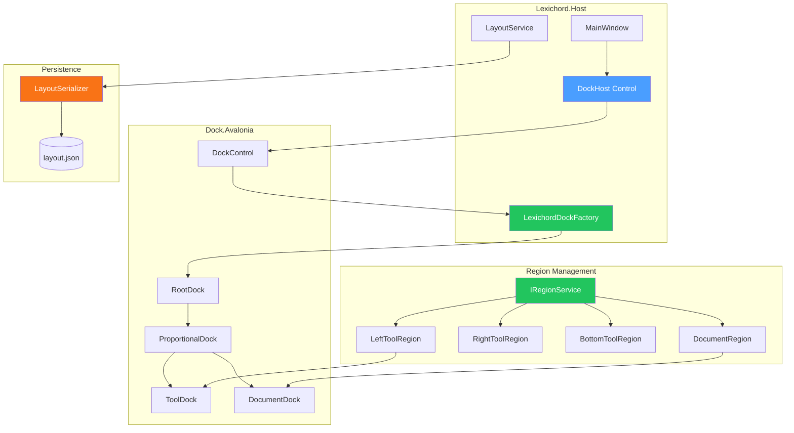
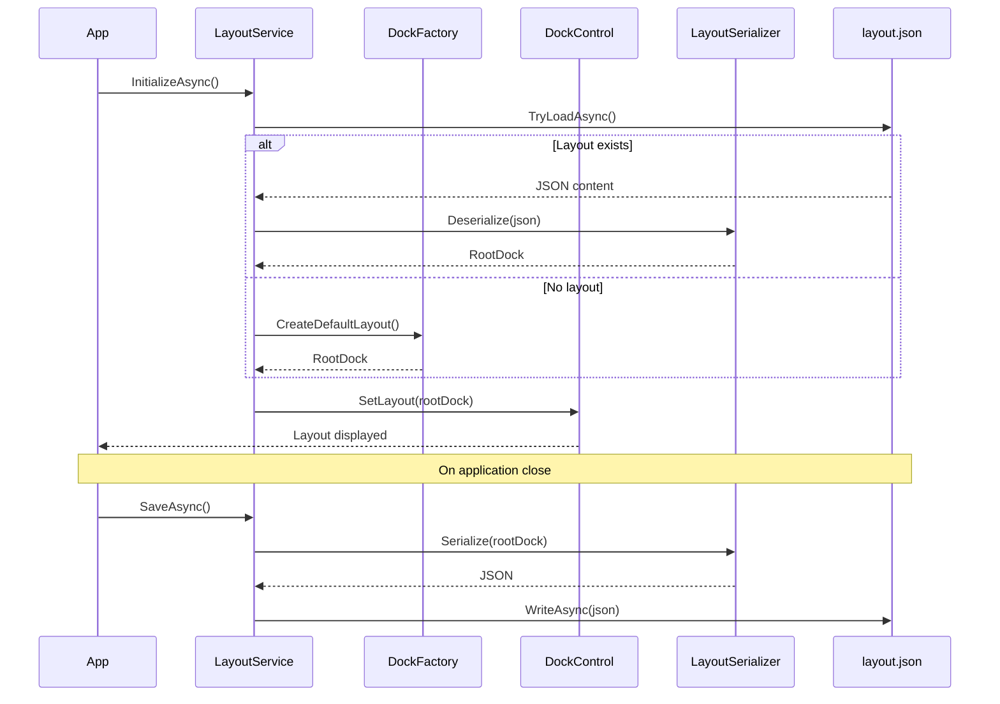

# LCS-DES-011: Design Specification Index — The Layout Engine (Docking System)

## Document Control

| Field                | Value                                       |
| :------------------- | :------------------------------------------ |
| **Document ID**      | LCS-DES-011-INDEX                           |
| **Feature ID**       | INF-011                                     |
| **Feature Name**     | The Layout Engine (Docking System)          |
| **Target Version**   | v0.1.1                                      |
| **Module Scope**     | Lexichord.Host / Lexichord.Abstractions     |
| **Swimlane**         | Infrastructure                              |
| **License Tier**     | Core                                        |
| **Feature Gate Key** | N/A                                         |
| **Status**           | Draft                                       |
| **Last Updated**     | 2026-01-27                                  |

---

## 1. Executive Summary

**v0.1.1** establishes the **dynamic docking system** that enables flexible, professional IDE-style layouts. This release implements Dock.Avalonia integration for resizable, draggable panels with persistent layout state.

### 1.1 The Problem

Lexichord requires a professional-grade interface that allows users to:

- Arrange panels (editor, navigator, properties) in custom layouts
- Dock, float, and tab documents like a modern IDE
- Persist layout preferences between sessions
- Split views horizontally and vertically

Without this infrastructure:

- Users are stuck with a fixed, inflexible layout
- Professional workflows requiring multiple views are hindered
- The application feels less polished than competing tools

### 1.2 The Solution

Implement a complete docking system with:

- **Dock Library Integration** — Install Dock.Avalonia and create dock factory
- **Region Injection Service** — Module view injection into dock regions
- **Layout Serialization** — JSON serialization of dock state with versioning
- **Tab Infrastructure** — Document tabs with dirty state, pinning, and drag

### 1.3 Business Value

| Value                   | Description                                           |
| :---------------------- | :---------------------------------------------------- |
| **Flexibility**         | Users arrange workspace to their preferences          |
| **Professional UX**     | IDE-style docking matches industry expectations       |
| **Persistence**         | Layouts survive restarts                              |
| **Productivity**        | Multi-panel workflows become possible                 |
| **Foundation**          | Enables document tabs and tool windows (v0.2.x+)      |

---

## 2. Related Documents

### 2.1 Scope Breakdown Document

The detailed scope breakdown for v0.1.1, including all sub-parts, implementation checklists, and acceptance criteria:

| Document                            | Description                                  |
| :---------------------------------- | :------------------------------------------- |
| **[LCS-SBD-011](./LCS-SBD-011.md)** | Scope Breakdown — The Layout Engine          |

### 2.2 Sub-Part Design Specifications

Each sub-part has its own detailed design specification following the LDS-01 template:

| Sub-Part | Document                              | Title                        | Description                              |
| :------- | :------------------------------------ | :--------------------------- | :--------------------------------------- |
| v0.1.1a  | **[LCS-DES-011a](./LCS-DES-011a.md)** | Dock Library Integration     | Dock.Avalonia setup and factory          |
| v0.1.1b  | **[LCS-DES-011b](./LCS-DES-011b.md)** | Region Injection Service     | Module view injection into regions       |
| v0.1.1c  | **[LCS-DES-011c](./LCS-DES-011c.md)** | Layout Serialization         | JSON state persistence with versioning   |
| v0.1.1d  | **[LCS-DES-011d](./LCS-DES-011d.md)** | Tab Infrastructure           | Document tabs with dirty state and drag  |

---

## 3. Architecture Overview

### 3.1 Component Diagram

### 3.2 Layout Lifecycle Sequence

---

## 4. Dependencies

### 4.1 Upstream Dependencies

| Dependency           | Source Version | Purpose                           |
| :------------------- | :------------- | :-------------------------------- |
| Avalonia Shell       | v0.0.2         | MainWindow hosting                |
| DI Container         | v0.0.3a        | Service registration              |
| Configuration        | v0.0.3d        | Layout file paths                 |
| Module System        | v0.0.4         | Module view registration          |

### 4.2 NuGet Packages

| Package                          | Version | Purpose                                 |
| :------------------------------- | :------ | :-------------------------------------- |
| `Dock.Avalonia`                  | 11.x    | Core docking framework                  |
| `Dock.Model.Avalonia`            | 11.x    | Dock model and serialization            |
| `Newtonsoft.Json`                | 13.x    | Layout JSON serialization               |

### 4.3 Downstream Consumers (Future)

| Version | Feature             | Uses From v0.1.1                          |
| :------ | :------------------ | :---------------------------------------- |
| v0.1.2  | Tool Windows        | ToolDock registration                     |
| v0.2.x  | Document Editor     | DocumentDock for editor tabs              |
| v0.3.x  | Style Panel         | ToolDock for style suggestions            |

---

## 5. License Gating Strategy

**N/A** — The layout engine is Core infrastructure required by all license tiers. No runtime gating is applied to docking functionality.

---

## 6. Key Interfaces Summary

| Interface                    | Defined In | Purpose                               |
| :--------------------------- | :--------- | :------------------------------------ |
| `ILayoutService`             | v0.1.1c    | Layout load/save operations           |
| `IRegionService`             | v0.1.1b    | Region registration and injection     |
| `IDockFactory`               | v0.1.1a    | Dock element creation                 |

| Record/DTO               | Defined In | Purpose                               |
| :----------------------- | :--------- | :------------------------------------ |
| `LayoutState`            | v0.1.1c    | Serialized layout data                |
| `RegionDefinition`       | v0.1.1b    | Region metadata                       |
| `TabState`               | v0.1.1d    | Tab dirty state and metadata          |

---

## 7. Implementation Checklist Summary

| Sub-Part  | Key Deliverables                                             | Est. Hours   | Status |
| :-------- | :----------------------------------------------------------- | :----------- | :----- |
| v0.1.1a   | Dock.Avalonia packages, LexichordDockFactory, default layout | 5            | [ ]    |
| v0.1.1b   | IRegionService, region definitions, view injection           | 5            | [ ]    |
| v0.1.1c   | LayoutSerializer, JSON persistence, version migration        | 4            | [ ]    |
| v0.1.1d   | Tab controls, dirty indicators, drag/drop, pinning           | 4            | [ ]    |
| **Total** |                                                              | **18 hours** |        |

See [LCS-SBD-011](./LCS-SBD-011.md) Section 3 for the detailed implementation checklist.

---

## 8. Success Criteria Summary

| Category        | Criterion                                              | Target |
| :-------------- | :----------------------------------------------------- | :----- |
| **Docking**     | Panels can be docked to left/right/bottom              | Pass   |
| **Floating**    | Panels can be floated as separate windows              | Pass   |
| **Splitting**   | Views can be split horizontally and vertically         | Pass   |
| **Tabs**        | Multiple documents appear as tabs                      | Pass   |
| **Persistence** | Layout survives application restart                    | Pass   |
| **Dirty State** | Modified documents show dirty indicator                | Pass   |
| **Drag/Drop**   | Tabs can be dragged to rearrange                       | Pass   |

See individual design specs for detailed acceptance criteria.

---

## 9. Test Coverage Summary

| Sub-Part | Unit Tests                                | Integration Tests                  |
| :------- | :---------------------------------------- | :--------------------------------- |
| v0.1.1a  | Factory creates valid dock elements       | Dock renders in MainWindow         |
| v0.1.1b  | Region registration, view injection       | Module views appear in regions     |
| v0.1.1c  | Serialization round-trip, migration       | Layout persists across restart     |
| v0.1.1d  | Tab state management, dirty tracking      | Tab interactions work correctly    |

See individual design specs for detailed test scenarios.

---

## 10. What This Enables

| Version | Feature             | Depends On v0.1.1                             |
| :------ | :------------------ | :-------------------------------------------- |
| v0.1.2  | Tool Windows        | ToolDock regions for panels                   |
| v0.2.x  | Document Editor     | DocumentDock for editor tabs                  |
| v0.3.x  | Style Panel         | Dockable style suggestions panel              |
| v0.4.x  | RAG Panel           | Dockable knowledge base browser               |

---

## 11. Risks & Mitigations

| Risk                                  | Impact | Mitigation                                        |
| :------------------------------------ | :----- | :------------------------------------------------ |
| Dock.Avalonia breaking changes        | High   | Pin to specific version, test upgrades carefully  |
| Layout corruption on version change   | Medium | Schema versioning with migration support          |
| Performance with many docked panels   | Medium | Lazy loading of panel contents                    |
| Complex drag/drop edge cases          | Low    | Comprehensive integration testing                 |

---

## Document History

| Version | Date       | Author           | Changes                                                   |
| :------ | :--------- | :--------------- | :-------------------------------------------------------- |
| 1.0     | 2026-01-27 | System Architect | Created INDEX from legacy LCS-INF-011 during standardization |
