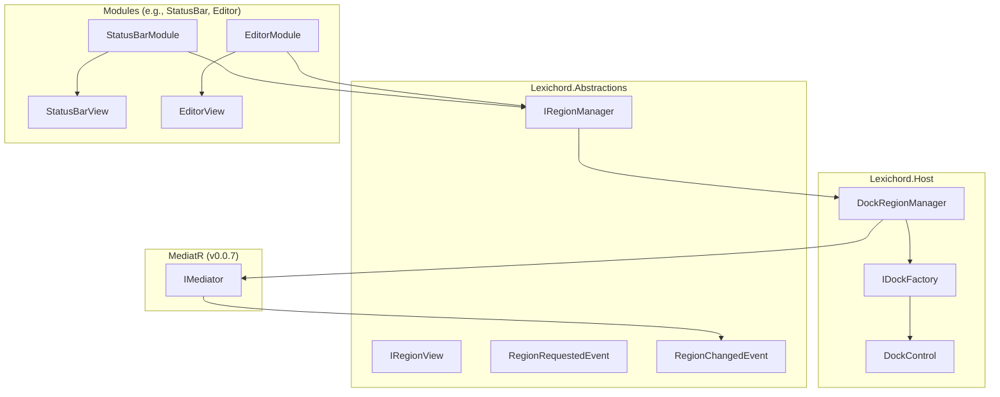
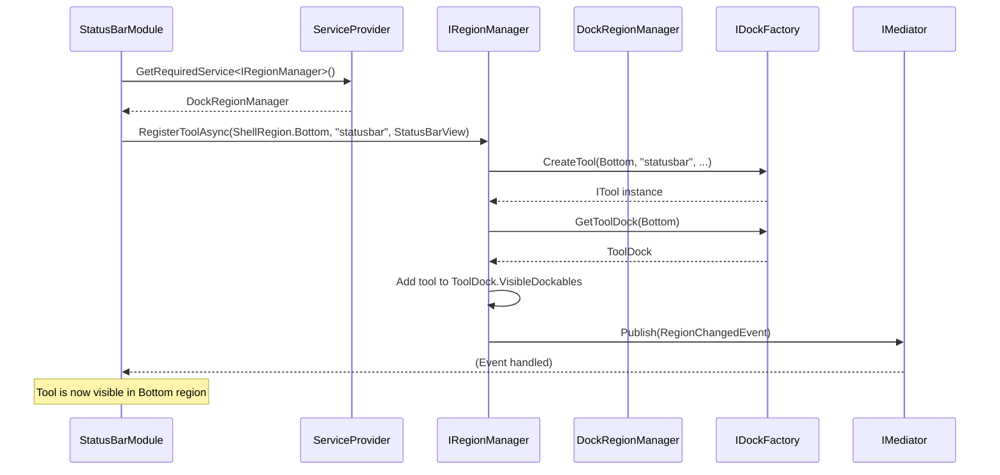
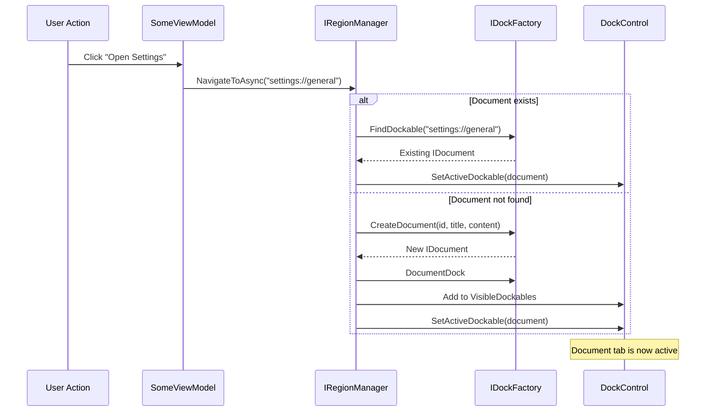

# LCS-DES-011b: Region Injection Service

## 1. Metadata & Categorization

| Field                | Value                                    | Description                                        |
| :------------------- | :--------------------------------------- | :------------------------------------------------- |
| **Feature ID**       | `INF-011b`                               | Infrastructure - Region Injection Service          |
| **Feature Name**     | Region Injection Service                 | Module view injection into dock regions            |
| **Target Version**   | `v0.1.1`                                 | Workspace Foundation Milestone                     |
| **Module Scope**     | `Lexichord.Abstractions` / `Lexichord.Host` | Core abstraction and implementation             |
| **Swimlane**         | `Infrastructure`                         | The Podium (Platform)                              |
| **License Tier**     | `Core`                                   | Foundation (Required for all tiers)                |
| **Feature Gate Key** | N/A                                      | No runtime gating for region injection             |
| **Author**           | System Architect                         |                                                    |
| **Status**           | **Draft**                                | Pending implementation                             |
| **Last Updated**     | 2026-01-26                               |                                                    |

---

## 2. Executive Summary

### 2.1 The Requirement

With Dock.Avalonia integrated (v0.1.1a), we need a **service layer** that allows modules to inject views without directly depending on the docking library. This is critical because:

- Modules must NOT reference Dock.Avalonia directly (only Lexichord.Abstractions).
- The v0.0.8 `IShellRegionView` pattern needs to evolve for dockable panels.
- Modules should be able to register tools, documents, and requests dynamically.
- View injection must support async initialization and dependency injection.

Without this abstraction:
- Modules would couple directly to Dock.Avalonia implementation.
- Changing dock libraries would break all modules.
- Module initialization order becomes fragile.
- Testing modules in isolation becomes difficult.

### 2.2 The Proposed Solution

We **SHALL** implement a Region Injection Service with:

1. **IRegionManager Interface** - Define in Lexichord.Abstractions for module use.
2. **DockRegionManager Implementation** - Implement in Lexichord.Host using IDockFactory.
3. **Registration Methods** - RegisterTool, RegisterDocument, NavigateTo operations.
4. **Event-Based Communication** - Use MediatR (v0.0.7) for region change notifications.

---

## 3. Architecture & Modular Strategy

### 3.1 High-Level Architecture



### 3.2 Module Registration Flow



### 3.3 Navigation Flow



### 3.4 Dependencies

**Lexichord.Abstractions Dependencies:**

| Package | Version | Purpose |
|:--------|:--------|:--------|
| `MediatR.Contracts` | 2.x | Event interfaces only |
| `Microsoft.Extensions.DependencyInjection.Abstractions` | 9.0.0 | DI interfaces |

**Lexichord.Host Dependencies:**

| Package | Version | Purpose |
|:--------|:--------|:--------|
| `MediatR` | 12.x | Event publishing (from v0.0.7) |
| `Dock.Avalonia` | 11.1.0.1 | Dock operations (from v0.1.1a) |

**Project References:**

| Project | Reference Direction |
|:--------|:--------------------|
| `Lexichord.Host` | -> `Lexichord.Abstractions` |
| `All Modules` | -> `Lexichord.Abstractions` only |

---

## 4. Decision Tree: Region Injection Operations

```text
START: "How do I add a view to a region?"
│
├── Is this a TOOL (auxiliary panel)?
│   ├── Know the target region? (Left/Right/Bottom)
│   │   └── YES → Call regionManager.RegisterToolAsync(region, id, view)
│   │       ├── Factory creates ITool wrapper
│   │       ├── Tool added to appropriate ToolDock
│   │       └── RegionChangedEvent published
│   │
│   └── Want to float it initially?
│       └── Call regionManager.RegisterToolAsync(..., floatingOptions)
│
├── Is this a DOCUMENT (main content)?
│   ├── Creating a new document?
│   │   └── Call regionManager.RegisterDocumentAsync(id, title, view)
│   │       ├── Factory creates IDocument wrapper
│   │       ├── Document added to DocumentDock
│   │       └── Becomes active tab
│   │
│   └── Opening an existing document?
│       └── Call regionManager.NavigateToAsync(id)
│           ├── If found: activate existing tab
│           └── If not found: request creation via event
│
├── Want to REMOVE a view?
│   ├── Temporary hide?
│   │   └── Call regionManager.HideAsync(id)
│   │       └── Removes from VisibleDockables (can restore)
│   │
│   └── Permanent close?
│       └── Call regionManager.CloseAsync(id)
│           ├── Calls CanCloseAsync on document
│           ├── Removes from dock entirely
│           └── Disposes if IDisposable
│
└── Want to FIND a view?
    └── Call regionManager.GetDockableAsync(id)
        └── Returns IDockable or null
```

---

## 5. Data Contracts

### 5.1 IRegionManager Interface

```csharp
namespace Lexichord.Abstractions.Layout;

/// <summary>
/// Service for managing shell region views in the dock layout.
/// </summary>
/// <remarks>
/// LOGIC: IRegionManager is the primary interface for modules to interact
/// with the dock layout. It abstracts away Dock.Avalonia specifics so
/// modules only depend on Lexichord.Abstractions.
///
/// Key Operations:
/// - RegisterToolAsync: Add tool panels to Left/Right/Bottom regions
/// - RegisterDocumentAsync: Add documents to center DocumentDock
/// - NavigateToAsync: Activate existing or request new document
/// - CloseAsync: Remove dockables with proper cleanup
///
/// Thread Safety:
/// - All methods are async and thread-safe
/// - UI operations are marshaled to the UI thread
/// </remarks>
public interface IRegionManager
{
    /// <summary>
    /// Registers a tool view in the specified shell region.
    /// </summary>
    /// <param name="region">Target region (Left, Right, or Bottom).</param>
    /// <param name="id">Unique identifier for the tool.</param>
    /// <param name="title">Display title for the tool pane.</param>
    /// <param name="viewFactory">Factory to create the view content.</param>
    /// <param name="options">Optional configuration for the tool.</param>
    /// <param name="cancellationToken">Cancellation token.</param>
    /// <returns>The created tool's ID, or null if registration failed.</returns>
    /// <remarks>
    /// LOGIC: Tools are auxiliary panels that complement the main document area.
    /// They can be collapsed, pinned to auto-hide, dragged to other regions,
    /// or floated as separate windows.
    ///
    /// The viewFactory is invoked on the UI thread to create the view.
    /// Use this pattern for views that need DI-resolved dependencies.
    /// </remarks>
    /// <example>
    /// <code>
    /// await regionManager.RegisterToolAsync(
    ///     ShellRegion.Left,
    ///     "explorer",
    ///     "Project Explorer",
    ///     sp => sp.GetRequiredService&lt;ProjectExplorerView&gt;()
    /// );
    /// </code>
    /// </example>
    Task<string?> RegisterToolAsync(
        ShellRegion region,
        string id,
        string title,
        Func<IServiceProvider, object> viewFactory,
        ToolRegistrationOptions? options = null,
        CancellationToken cancellationToken = default);

    /// <summary>
    /// Registers a document in the center document dock.
    /// </summary>
    /// <param name="id">Unique identifier for the document.</param>
    /// <param name="title">Display title for the document tab.</param>
    /// <param name="viewFactory">Factory to create the view content.</param>
    /// <param name="options">Optional configuration for the document.</param>
    /// <param name="cancellationToken">Cancellation token.</param>
    /// <returns>The created document's ID, or null if registration failed.</returns>
    /// <remarks>
    /// LOGIC: Documents are the primary content type (editors, viewers).
    /// They appear as tabs in the center DocumentDock and support:
    /// - Tab reordering via drag-and-drop
    /// - Tab tear-out to floating windows
    /// - Dirty state indicators (*)
    /// - Pinning to prevent accidental close
    /// </remarks>
    Task<string?> RegisterDocumentAsync(
        string id,
        string title,
        Func<IServiceProvider, object> viewFactory,
        DocumentRegistrationOptions? options = null,
        CancellationToken cancellationToken = default);

    /// <summary>
    /// Navigates to an existing dockable or requests its creation.
    /// </summary>
    /// <param name="id">The dockable ID to navigate to.</param>
    /// <param name="cancellationToken">Cancellation token.</param>
    /// <returns>True if navigation succeeded, false otherwise.</returns>
    /// <remarks>
    /// LOGIC: NavigateTo performs these steps:
    /// 1. Search for existing dockable by ID
    /// 2. If found: activate it (bring to front, select tab)
    /// 3. If not found: publish RegionNavigationRequestedEvent
    /// 4. Event handlers can create the dockable dynamically
    ///
    /// This enables lazy document loading - modules can respond to
    /// navigation requests without pre-creating all documents.
    /// </remarks>
    Task<bool> NavigateToAsync(string id, CancellationToken cancellationToken = default);

    /// <summary>
    /// Closes a dockable by its ID.
    /// </summary>
    /// <param name="id">The dockable ID to close.</param>
    /// <param name="force">Force close even if document has unsaved changes.</param>
    /// <param name="cancellationToken">Cancellation token.</param>
    /// <returns>True if closed, false if cancelled or not found.</returns>
    /// <remarks>
    /// LOGIC: Close performs these steps:
    /// 1. Find the dockable by ID
    /// 2. If IDocument: call CanCloseAsync() unless force=true
    /// 3. If CanClose returns false: abort
    /// 4. Remove from parent dock's VisibleDockables
    /// 5. Dispose if IDisposable
    /// 6. Publish RegionChangedEvent
    /// </remarks>
    Task<bool> CloseAsync(string id, bool force = false, CancellationToken cancellationToken = default);

    /// <summary>
    /// Closes all documents, optionally prompting for unsaved changes.
    /// </summary>
    /// <param name="force">Force close without save prompts.</param>
    /// <param name="cancellationToken">Cancellation token.</param>
    /// <returns>True if all closed, false if any cancelled.</returns>
    Task<bool> CloseAllDocumentsAsync(bool force = false, CancellationToken cancellationToken = default);

    /// <summary>
    /// Hides a dockable without disposing it.
    /// </summary>
    /// <param name="id">The dockable ID to hide.</param>
    /// <param name="cancellationToken">Cancellation token.</param>
    /// <returns>True if hidden, false if not found.</returns>
    /// <remarks>
    /// LOGIC: Hide removes from VisibleDockables but keeps reference.
    /// Use ShowAsync to restore the dockable later.
    /// </remarks>
    Task<bool> HideAsync(string id, CancellationToken cancellationToken = default);

    /// <summary>
    /// Shows a previously hidden dockable.
    /// </summary>
    /// <param name="id">The dockable ID to show.</param>
    /// <param name="cancellationToken">Cancellation token.</param>
    /// <returns>True if shown, false if not found.</returns>
    Task<bool> ShowAsync(string id, CancellationToken cancellationToken = default);

    /// <summary>
    /// Gets a dockable by its ID.
    /// </summary>
    /// <param name="id">The dockable ID to find.</param>
    /// <returns>The dockable, or null if not found.</returns>
    object? GetDockable(string id);

    /// <summary>
    /// Gets all registered dockables in a region.
    /// </summary>
    /// <param name="region">The shell region to query.</param>
    /// <returns>Enumerable of dockable IDs in the region.</returns>
    IEnumerable<string> GetDockablesInRegion(ShellRegion region);

    /// <summary>
    /// Gets the currently active document ID.
    /// </summary>
    /// <returns>The active document ID, or null if no document is active.</returns>
    string? GetActiveDocumentId();

    /// <summary>
    /// Event raised when a region's content changes.
    /// </summary>
    event EventHandler<RegionChangedEventArgs>? RegionChanged;

    /// <summary>
    /// Event raised when navigation to an unknown ID is requested.
    /// </summary>
    event EventHandler<RegionNavigationRequestedEventArgs>? NavigationRequested;
}
```

### 5.2 Registration Options

```csharp
namespace Lexichord.Abstractions.Layout;

/// <summary>
/// Options for registering a tool in a shell region.
/// </summary>
/// <param name="CanClose">Whether the user can close this tool. Default: true.</param>
/// <param name="CanFloat">Whether the tool can be floated. Default: true.</param>
/// <param name="CanPin">Whether the tool can be pinned to auto-hide. Default: true.</param>
/// <param name="StartCollapsed">Whether to start in collapsed/auto-hide state. Default: false.</param>
/// <param name="Tooltip">Tooltip text for the tool header.</param>
/// <param name="IconSource">Icon source path or resource key.</param>
/// <param name="Order">Sort order within the region (lower first). Default: 100.</param>
/// <remarks>
/// LOGIC: These options control the initial state and capabilities of a tool.
/// Users can override some settings via UI (like dragging to different region),
/// and those changes persist via ILayoutService (v0.1.1c).
/// </remarks>
public record ToolRegistrationOptions(
    bool CanClose = true,
    bool CanFloat = true,
    bool CanPin = true,
    bool StartCollapsed = false,
    string? Tooltip = null,
    string? IconSource = null,
    int Order = 100
);

/// <summary>
/// Options for registering a document in the center dock.
/// </summary>
/// <param name="CanClose">Whether the document can be closed. Default: true.</param>
/// <param name="CanFloat">Whether the document can be floated. Default: true.</param>
/// <param name="IsPinned">Whether to start as pinned tab. Default: false.</param>
/// <param name="ActivateOnCreate">Whether to activate immediately. Default: true.</param>
/// <param name="Tooltip">Tooltip text for the tab.</param>
/// <param name="IconSource">Icon source path or resource key.</param>
/// <remarks>
/// LOGIC: Document options control tab behavior. Pinned documents
/// appear first and are protected from "Close All" operations.
/// </remarks>
public record DocumentRegistrationOptions(
    bool CanClose = true,
    bool CanFloat = true,
    bool IsPinned = false,
    bool ActivateOnCreate = true,
    string? Tooltip = null,
    string? IconSource = null
);
```

### 5.3 Event Arguments

```csharp
namespace Lexichord.Abstractions.Layout;

/// <summary>
/// Event arguments for region content changes.
/// </summary>
/// <param name="Region">The region that changed.</param>
/// <param name="ChangeType">The type of change that occurred.</param>
/// <param name="DockableId">The affected dockable ID.</param>
/// <param name="DockableTitle">The affected dockable title.</param>
/// <remarks>
/// LOGIC: RegionChangedEvent is published via MediatR when dockables
/// are added, removed, or activated. Modules can subscribe to track
/// region state changes.
/// </remarks>
public record RegionChangedEventArgs(
    ShellRegion Region,
    RegionChangeType ChangeType,
    string DockableId,
    string? DockableTitle
);

/// <summary>
/// Types of region changes.
/// </summary>
public enum RegionChangeType
{
    /// <summary>A dockable was added to the region.</summary>
    Added,

    /// <summary>A dockable was removed from the region.</summary>
    Removed,

    /// <summary>A dockable was activated (brought to front).</summary>
    Activated,

    /// <summary>A dockable was hidden (collapsed/auto-hidden).</summary>
    Hidden,

    /// <summary>A dockable was shown (expanded from auto-hide).</summary>
    Shown
}

/// <summary>
/// Event arguments for navigation requests to unknown dockables.
/// </summary>
/// <param name="RequestedId">The requested dockable ID.</param>
/// <remarks>
/// LOGIC: This event is published when NavigateToAsync is called for
/// an ID that doesn't exist. Event handlers can create the dockable
/// dynamically based on the ID pattern.
///
/// ID conventions:
/// - "file://path/to/file.md" - File documents
/// - "settings://section" - Settings panels
/// - "tool://toolname" - Tool panels
/// </remarks>
public record RegionNavigationRequestedEventArgs(string RequestedId)
{
    /// <summary>
    /// Gets or sets whether the request was handled.
    /// </summary>
    /// <remarks>
    /// LOGIC: Handlers should set this to true after creating the dockable.
    /// If still false after all handlers, NavigateToAsync returns false.
    /// </remarks>
    public bool Handled { get; set; }

    /// <summary>
    /// Gets or sets the created dockable ID (may differ from requested).
    /// </summary>
    public string? CreatedId { get; set; }
}
```

### 5.4 MediatR Integration Events

```csharp
namespace Lexichord.Abstractions.Layout;

using MediatR;

/// <summary>
/// MediatR notification for region changes.
/// </summary>
/// <param name="Region">The region that changed.</param>
/// <param name="ChangeType">Type of change.</param>
/// <param name="DockableId">Affected dockable ID.</param>
/// <param name="DockableTitle">Affected dockable title.</param>
/// <remarks>
/// LOGIC: This notification enables cross-module communication about
/// layout changes. For example, a "Recent Documents" module could
/// track document activations.
/// </remarks>
public record RegionChangedNotification(
    ShellRegion Region,
    RegionChangeType ChangeType,
    string DockableId,
    string? DockableTitle
) : INotification;

/// <summary>
/// MediatR notification for navigation requests.
/// </summary>
/// <param name="RequestedId">The requested dockable ID.</param>
/// <remarks>
/// LOGIC: Published when navigation is requested for an unknown ID.
/// Modules should create the appropriate dockable if they recognize the ID.
/// </remarks>
public record RegionNavigationRequestNotification(string RequestedId) : INotification
{
    /// <summary>
    /// Gets or sets whether the request was handled.
    /// </summary>
    public bool Handled { get; set; }
}
```

---

## 6. Implementation Logic

### 6.1 DockRegionManager Implementation

```csharp
using Avalonia.Threading;
using Dock.Model.Core;
using Lexichord.Abstractions.Layout;
using MediatR;
using Microsoft.Extensions.Logging;

namespace Lexichord.Host.Layout;

/// <summary>
/// Implementation of IRegionManager using Dock.Avalonia.
/// </summary>
/// <remarks>
/// LOGIC: DockRegionManager bridges the abstraction layer (IRegionManager)
/// with the concrete dock implementation (IDockFactory). This separation:
///
/// 1. Keeps modules decoupled from Dock.Avalonia
/// 2. Allows mocking IRegionManager in tests
/// 3. Enables swapping dock libraries without module changes
/// 4. Centralizes dock manipulation logic
///
/// Thread Safety:
/// - All dock operations are marshaled to the UI thread
/// - The hidden dockables dictionary uses ConcurrentDictionary
/// - Event handlers are invoked synchronously on UI thread
/// </remarks>
public sealed class DockRegionManager(
    IDockFactory dockFactory,
    IServiceProvider serviceProvider,
    IMediator mediator,
    ILogger<DockRegionManager> logger) : IRegionManager
{
    /// <summary>
    /// LOGIC: Track hidden dockables for Show/Hide operations.
    /// Key: dockable ID, Value: (dockable, parent dock ID)
    /// </summary>
    private readonly Dictionary<string, (object Dockable, string ParentId)> _hiddenDockables = new();

    /// <summary>
    /// LOGIC: Track registered tools by ID for quick lookup.
    /// </summary>
    private readonly Dictionary<string, ITool> _registeredTools = new();

    /// <summary>
    /// LOGIC: Track registered documents by ID.
    /// </summary>
    private readonly Dictionary<string, IDocument> _registeredDocuments = new();

    /// <inheritdoc/>
    public event EventHandler<RegionChangedEventArgs>? RegionChanged;

    /// <inheritdoc/>
    public event EventHandler<RegionNavigationRequestedEventArgs>? NavigationRequested;

    /// <inheritdoc/>
    public async Task<string?> RegisterToolAsync(
        ShellRegion region,
        string id,
        string title,
        Func<IServiceProvider, object> viewFactory,
        ToolRegistrationOptions? options = null,
        CancellationToken cancellationToken = default)
    {
        logger.LogDebug(
            "Registering tool: {Id} - {Title} in region {Region}",
            id, title, region);

        // LOGIC: Validate region - tools can only go to side/bottom regions
        if (region == ShellRegion.Center || region == ShellRegion.Top)
        {
            logger.LogWarning(
                "Cannot register tool in {Region} region. Use RegisterDocumentAsync for Center.",
                region);
            return null;
        }

        // LOGIC: Check for duplicate ID
        if (_registeredTools.ContainsKey(id) || _registeredDocuments.ContainsKey(id))
        {
            logger.LogWarning("Dockable with ID {Id} already registered", id);
            return null;
        }

        try
        {
            // LOGIC: Create view on UI thread
            object? view = null;
            await Dispatcher.UIThread.InvokeAsync(() =>
            {
                view = viewFactory(serviceProvider);
            });

            if (view is null)
            {
                logger.LogError("View factory returned null for tool {Id}", id);
                return null;
            }

            // LOGIC: Create tool wrapper
            var tool = dockFactory.CreateTool(region, id, title, view);

            // Apply options
            if (options is not null && tool is LexichordTool lexTool)
            {
                lexTool.CanClose = options.CanClose;
                lexTool.CanFloat = options.CanFloat;
                lexTool.CanPin = options.CanPin;
            }

            // LOGIC: Add to appropriate ToolDock
            await Dispatcher.UIThread.InvokeAsync(() =>
            {
                var toolDock = dockFactory.GetToolDock(region);
                if (toolDock is IDock dock && dock.VisibleDockables is not null)
                {
                    dock.VisibleDockables.Add((IDockable)tool);
                }
            });

            // Track registration
            _registeredTools[id] = tool;

            // Publish event
            await PublishRegionChangedAsync(region, RegionChangeType.Added, id, title);

            logger.LogInformation(
                "Tool {Id} registered successfully in {Region}",
                id, region);

            return id;
        }
        catch (Exception ex)
        {
            logger.LogError(ex, "Failed to register tool {Id}", id);
            return null;
        }
    }

    /// <inheritdoc/>
    public async Task<string?> RegisterDocumentAsync(
        string id,
        string title,
        Func<IServiceProvider, object> viewFactory,
        DocumentRegistrationOptions? options = null,
        CancellationToken cancellationToken = default)
    {
        logger.LogDebug("Registering document: {Id} - {Title}", id, title);

        // LOGIC: Check for duplicate ID
        if (_registeredDocuments.ContainsKey(id) || _registeredTools.ContainsKey(id))
        {
            logger.LogWarning("Dockable with ID {Id} already registered", id);
            return null;
        }

        try
        {
            // LOGIC: Create view on UI thread
            object? view = null;
            await Dispatcher.UIThread.InvokeAsync(() =>
            {
                view = viewFactory(serviceProvider);
            });

            if (view is null)
            {
                logger.LogError("View factory returned null for document {Id}", id);
                return null;
            }

            // LOGIC: Create document wrapper
            var document = dockFactory.CreateDocument(id, title, view);

            // Apply options
            if (options is not null && document is LexichordDocument lexDoc)
            {
                lexDoc.CanClose = options.CanClose;
                lexDoc.CanFloat = options.CanFloat;
                lexDoc.IsPinned = options.IsPinned;
            }

            // LOGIC: Add to DocumentDock
            await Dispatcher.UIThread.InvokeAsync(() =>
            {
                var docDock = dockFactory.DocumentDock;
                if (docDock is IDock dock && dock.VisibleDockables is not null)
                {
                    dock.VisibleDockables.Add((IDockable)document);

                    // Activate if requested
                    if (options?.ActivateOnCreate != false)
                    {
                        dock.ActiveDockable = (IDockable)document;
                    }
                }
            });

            // Track registration
            _registeredDocuments[id] = document;

            // Publish event
            await PublishRegionChangedAsync(
                ShellRegion.Center,
                RegionChangeType.Added,
                id,
                title);

            logger.LogInformation("Document {Id} registered successfully", id);

            return id;
        }
        catch (Exception ex)
        {
            logger.LogError(ex, "Failed to register document {Id}", id);
            return null;
        }
    }

    /// <inheritdoc/>
    public async Task<bool> NavigateToAsync(string id, CancellationToken cancellationToken = default)
    {
        logger.LogDebug("Navigating to dockable: {Id}", id);

        // LOGIC: First, try to find existing dockable
        var existing = dockFactory.FindDockable(id);

        if (existing is not null)
        {
            // LOGIC: Activate the existing dockable
            await Dispatcher.UIThread.InvokeAsync(() =>
            {
                if (existing.Owner is IDock parentDock)
                {
                    parentDock.ActiveDockable = existing;
                }
            });

            var region = GetDockableRegion(id);
            await PublishRegionChangedAsync(
                region,
                RegionChangeType.Activated,
                id,
                existing.Title);

            logger.LogDebug("Activated existing dockable: {Id}", id);
            return true;
        }

        // LOGIC: Dockable not found - raise navigation request
        logger.LogDebug(
            "Dockable {Id} not found, publishing navigation request",
            id);

        var args = new RegionNavigationRequestedEventArgs(id);
        NavigationRequested?.Invoke(this, args);

        // Also publish via MediatR for module handlers
        var notification = new RegionNavigationRequestNotification(id);
        await mediator.Publish(notification, cancellationToken);

        if (notification.Handled)
        {
            logger.LogDebug("Navigation request for {Id} was handled", id);
            return true;
        }

        logger.LogWarning("Navigation request for {Id} was not handled", id);
        return false;
    }

    /// <inheritdoc/>
    public async Task<bool> CloseAsync(
        string id,
        bool force = false,
        CancellationToken cancellationToken = default)
    {
        logger.LogDebug("Closing dockable: {Id} (force={Force})", id, force);

        var dockable = dockFactory.FindDockable(id);
        if (dockable is null)
        {
            logger.LogWarning("Cannot close - dockable {Id} not found", id);
            return false;
        }

        // LOGIC: If document, check CanCloseAsync
        if (!force && _registeredDocuments.TryGetValue(id, out var document))
        {
            var canClose = await document.CanCloseAsync();
            if (!canClose)
            {
                logger.LogDebug("Close cancelled by document {Id}", id);
                return false;
            }
        }

        // LOGIC: Remove from parent dock
        var region = GetDockableRegion(id);
        await Dispatcher.UIThread.InvokeAsync(() =>
        {
            if (dockable.Owner is IDock parentDock &&
                parentDock.VisibleDockables is not null)
            {
                parentDock.VisibleDockables.Remove(dockable);
            }
        });

        // LOGIC: Clean up
        _registeredTools.Remove(id);
        _registeredDocuments.Remove(id);
        _hiddenDockables.Remove(id);

        // Dispose if needed
        if (dockable is IDisposable disposable)
        {
            disposable.Dispose();
        }

        // Publish event
        await PublishRegionChangedAsync(
            region,
            RegionChangeType.Removed,
            id,
            dockable.Title);

        logger.LogInformation("Dockable {Id} closed", id);
        return true;
    }

    /// <inheritdoc/>
    public async Task<bool> CloseAllDocumentsAsync(
        bool force = false,
        CancellationToken cancellationToken = default)
    {
        logger.LogDebug("Closing all documents (force={Force})", force);

        // LOGIC: Get list of document IDs (not pinned unless force)
        var documentIds = _registeredDocuments
            .Where(kvp => force || !kvp.Value.IsPinned)
            .Select(kvp => kvp.Key)
            .ToList();

        foreach (var id in documentIds)
        {
            var closed = await CloseAsync(id, force, cancellationToken);
            if (!closed && !force)
            {
                logger.LogDebug("CloseAll aborted at document {Id}", id);
                return false;
            }
        }

        logger.LogInformation("Closed {Count} documents", documentIds.Count);
        return true;
    }

    /// <inheritdoc/>
    public async Task<bool> HideAsync(string id, CancellationToken cancellationToken = default)
    {
        logger.LogDebug("Hiding dockable: {Id}", id);

        var dockable = dockFactory.FindDockable(id);
        if (dockable is null)
        {
            logger.LogWarning("Cannot hide - dockable {Id} not found", id);
            return false;
        }

        if (_hiddenDockables.ContainsKey(id))
        {
            logger.LogDebug("Dockable {Id} already hidden", id);
            return true;
        }

        // LOGIC: Track parent before removing
        var parentId = dockable.Owner?.Id ?? string.Empty;

        await Dispatcher.UIThread.InvokeAsync(() =>
        {
            if (dockable.Owner is IDock parentDock &&
                parentDock.VisibleDockables is not null)
            {
                parentDock.VisibleDockables.Remove(dockable);
            }
        });

        _hiddenDockables[id] = (dockable, parentId);

        var region = GetDockableRegion(id);
        await PublishRegionChangedAsync(
            region,
            RegionChangeType.Hidden,
            id,
            dockable.Title);

        logger.LogInformation("Dockable {Id} hidden", id);
        return true;
    }

    /// <inheritdoc/>
    public async Task<bool> ShowAsync(string id, CancellationToken cancellationToken = default)
    {
        logger.LogDebug("Showing dockable: {Id}", id);

        if (!_hiddenDockables.TryGetValue(id, out var hidden))
        {
            logger.LogWarning("Cannot show - dockable {Id} not in hidden list", id);
            return false;
        }

        var (dockable, parentId) = hidden;

        // LOGIC: Find parent dock and add back
        await Dispatcher.UIThread.InvokeAsync(() =>
        {
            var parentDock = dockFactory.FindDockable(parentId) as IDock;
            if (parentDock?.VisibleDockables is not null &&
                dockable is IDockable dock)
            {
                parentDock.VisibleDockables.Add(dock);
            }
        });

        _hiddenDockables.Remove(id);

        var region = GetDockableRegion(id);
        var title = (dockable as IDockable)?.Title;
        await PublishRegionChangedAsync(
            region,
            RegionChangeType.Shown,
            id,
            title);

        logger.LogInformation("Dockable {Id} shown", id);
        return true;
    }

    /// <inheritdoc/>
    public object? GetDockable(string id)
    {
        return dockFactory.FindDockable(id);
    }

    /// <inheritdoc/>
    public IEnumerable<string> GetDockablesInRegion(ShellRegion region)
    {
        // LOGIC: Query tools for side regions, documents for center
        if (region == ShellRegion.Center)
        {
            return _registeredDocuments.Keys;
        }

        return _registeredTools
            .Where(kvp => kvp.Value.PreferredRegion == region)
            .Select(kvp => kvp.Key);
    }

    /// <inheritdoc/>
    public string? GetActiveDocumentId()
    {
        var docDock = dockFactory.DocumentDock;
        if (docDock is IDock dock)
        {
            return dock.ActiveDockable?.Id;
        }
        return null;
    }

    /// <summary>
    /// Determines the region of a dockable by its ID.
    /// </summary>
    private ShellRegion GetDockableRegion(string id)
    {
        if (_registeredDocuments.ContainsKey(id))
            return ShellRegion.Center;

        if (_registeredTools.TryGetValue(id, out var tool))
            return tool.PreferredRegion;

        return ShellRegion.Center;
    }

    /// <summary>
    /// Publishes region changed event via both direct event and MediatR.
    /// </summary>
    private async Task PublishRegionChangedAsync(
        ShellRegion region,
        RegionChangeType changeType,
        string id,
        string? title)
    {
        var args = new RegionChangedEventArgs(region, changeType, id, title);

        // Direct event
        RegionChanged?.Invoke(this, args);

        // MediatR notification
        var notification = new RegionChangedNotification(
            region,
            changeType,
            id,
            title);
        await mediator.Publish(notification);
    }
}
```

### 6.2 Module Integration Example

```csharp
using Lexichord.Abstractions.Contracts;
using Lexichord.Abstractions.Layout;
using Lexichord.Modules.StatusBar.Views;
using Lexichord.Modules.StatusBar.ViewModels;
using Microsoft.Extensions.DependencyInjection;
using Microsoft.Extensions.Logging;

namespace Lexichord.Modules.StatusBar;

/// <summary>
/// StatusBar module with IRegionManager integration.
/// </summary>
/// <remarks>
/// LOGIC: This module demonstrates the v0.1.1b pattern for registering
/// views in shell regions. Modules should:
/// 1. Resolve IRegionManager in InitializeAsync (not RegisterServices)
/// 2. Use RegisterToolAsync for side/bottom panels
/// 3. Use RegisterDocumentAsync for main content
/// </remarks>
public class StatusBarModule : IModule
{
    /// <inheritdoc/>
    public ModuleInfo Info => new(
        Id: "statusbar",
        Name: "Status Bar",
        Version: new Version(0, 1, 1),
        Author: "Lexichord Team",
        Description: "System status bar displaying health, vault, and event status"
    );

    /// <inheritdoc/>
    public void RegisterServices(IServiceCollection services)
    {
        // LOGIC: Register views and viewmodels for DI
        services.AddTransient<StatusBarView>();
        services.AddTransient<StatusBarViewModel>();
    }

    /// <inheritdoc/>
    public async Task InitializeAsync(IServiceProvider provider)
    {
        var logger = provider.GetRequiredService<ILogger<StatusBarModule>>();
        logger.LogInformation("Initializing {ModuleName} module", Info.Name);

        // LOGIC: Get IRegionManager for view injection
        var regionManager = provider.GetRequiredService<IRegionManager>();

        // LOGIC: Register status bar in bottom region
        var toolId = await regionManager.RegisterToolAsync(
            region: ShellRegion.Bottom,
            id: "statusbar.main",
            title: "Status Bar",
            viewFactory: sp =>
            {
                var view = sp.GetRequiredService<StatusBarView>();
                view.DataContext = sp.GetRequiredService<StatusBarViewModel>();
                return view;
            },
            options: new ToolRegistrationOptions(
                CanClose: false,          // Cannot be closed
                CanFloat: false,          // Cannot be floated
                CanPin: false,            // Cannot be pinned to auto-hide
                StartCollapsed: false,
                Order: 1000               // Appear last in bottom region
            )
        );

        if (toolId is null)
        {
            logger.LogError("Failed to register status bar view");
            return;
        }

        logger.LogInformation(
            "{ModuleName} module initialized, tool ID: {ToolId}",
            Info.Name,
            toolId);
    }
}
```

### 6.3 Service Registration

```csharp
// In HostServices.cs - Add to ConfigureServices method

/// <summary>
/// Registers region management services.
/// </summary>
/// <remarks>
/// LOGIC: IRegionManager is registered as singleton because it maintains
/// tracking dictionaries for registered dockables.
/// </remarks>
public static IServiceCollection AddRegionServices(
    this IServiceCollection services)
{
    // Region Manager
    services.AddSingleton<IRegionManager, DockRegionManager>();

    return services;
}
```

---

## 7. Use Cases & User Stories

### 7.1 User Stories

| ID | Role | Story | Acceptance Criteria |
|:---|:-----|:------|:--------------------|
| US-01 | Developer | As a module developer, I want to register tool views without depending on Dock.Avalonia. | IRegionManager is in Abstractions only. |
| US-02 | Developer | As a module developer, I want to inject documents dynamically at runtime. | RegisterDocumentAsync adds tabs to center region. |
| US-03 | Developer | As a module developer, I want to navigate to documents by ID. | NavigateToAsync activates existing or creates new. |
| US-04 | User | As a user, I want tool panels to appear in their designated regions. | Tools appear in Left/Right/Bottom as registered. |
| US-05 | User | As a user, I want to be prompted before closing unsaved documents. | CloseAsync calls CanCloseAsync on documents. |
| US-06 | Developer | As a module developer, I want events when region content changes. | RegionChanged event is raised on add/remove/activate. |

### 7.2 Use Cases

#### UC-01: Module Registers Tool on Startup

**Preconditions:**
- Module implements IModule.
- IRegionManager is available via DI.

**Flow:**
1. Host calls module.InitializeAsync(provider).
2. Module resolves IRegionManager from provider.
3. Module calls RegisterToolAsync(Left, "explorer", "Explorer", viewFactory).
4. DockRegionManager invokes viewFactory on UI thread.
5. DockRegionManager calls dockFactory.CreateTool().
6. DockRegionManager adds tool to Left ToolDock.
7. RegionChangedEvent is published via MediatR.
8. Tool appears in Left region.

**Postconditions:**
- Tool is visible in Left region.
- Tool is tracked in _registeredTools.
- Other modules received RegionChangedNotification.

---

#### UC-02: Navigate to Document

**Preconditions:**
- Document "file://readme.md" may or may not exist.
- IRegionManager is available.

**Flow:**
1. User clicks "Open readme.md" in file explorer.
2. Explorer module calls regionManager.NavigateToAsync("file://readme.md").
3. DockRegionManager searches for existing dockable.

**Flow A - Document exists:**
4. Dockable found with ID "file://readme.md".
5. DockRegionManager sets it as ActiveDockable.
6. RegionChangedEvent(Activated) is published.
7. Document tab is now active.

**Flow B - Document doesn't exist:**
4. Dockable not found.
5. RegionNavigationRequestNotification is published.
6. Editor module receives notification, recognizes "file://" pattern.
7. Editor module calls RegisterDocumentAsync() to create editor.
8. Editor module sets notification.Handled = true.
9. Document appears and is activated.

---

#### UC-03: Close Document with Unsaved Changes

**Preconditions:**
- Document "file://draft.md" is open with IsDirty = true.

**Flow:**
1. User clicks X on document tab.
2. Tab close triggers regionManager.CloseAsync("file://draft.md").
3. DockRegionManager finds document, calls CanCloseAsync().
4. Document shows "Save changes?" dialog.

**Flow A - User saves:**
5. User clicks "Save".
6. Document saves, returns true from CanCloseAsync.
7. Document is closed.

**Flow B - User discards:**
5. User clicks "Don't Save".
6. Document returns true from CanCloseAsync.
7. Document is closed without saving.

**Flow C - User cancels:**
5. User clicks "Cancel".
6. Document returns false from CanCloseAsync.
7. Close operation is aborted.
8. Document remains open.

---

## 8. Observability & Logging

### 8.1 Log Events

| Level | Context | Message Template |
|:------|:--------|:-----------------|
| Debug | DockRegionManager | `Registering tool: {Id} - {Title} in region {Region}` |
| Warning | DockRegionManager | `Cannot register tool in {Region} region. Use RegisterDocumentAsync for Center.` |
| Warning | DockRegionManager | `Dockable with ID {Id} already registered` |
| Error | DockRegionManager | `View factory returned null for tool {Id}` |
| Information | DockRegionManager | `Tool {Id} registered successfully in {Region}` |
| Error | DockRegionManager | `Failed to register tool {Id}` |
| Debug | DockRegionManager | `Registering document: {Id} - {Title}` |
| Information | DockRegionManager | `Document {Id} registered successfully` |
| Debug | DockRegionManager | `Navigating to dockable: {Id}` |
| Debug | DockRegionManager | `Activated existing dockable: {Id}` |
| Debug | DockRegionManager | `Dockable {Id} not found, publishing navigation request` |
| Debug | DockRegionManager | `Navigation request for {Id} was handled` |
| Warning | DockRegionManager | `Navigation request for {Id} was not handled` |
| Debug | DockRegionManager | `Closing dockable: {Id} (force={Force})` |
| Debug | DockRegionManager | `Close cancelled by document {Id}` |
| Information | DockRegionManager | `Dockable {Id} closed` |
| Debug | DockRegionManager | `Hiding dockable: {Id}` |
| Information | DockRegionManager | `Dockable {Id} hidden` |
| Information | DockRegionManager | `Dockable {Id} shown` |

---

## 9. Unit Testing Requirements

### 9.1 DockRegionManager Tests

```csharp
using Lexichord.Abstractions.Layout;
using Lexichord.Host.Layout;
using MediatR;
using Microsoft.Extensions.DependencyInjection;
using Microsoft.Extensions.Logging;
using Moq;
using NUnit.Framework;

namespace Lexichord.Tests.Layout;

[TestFixture]
[Category("Unit")]
public class DockRegionManagerTests
{
    private Mock<IDockFactory> _mockFactory = null!;
    private Mock<IMediator> _mockMediator = null!;
    private Mock<ILogger<DockRegionManager>> _mockLogger = null!;
    private IServiceProvider _serviceProvider = null!;
    private DockRegionManager _sut = null!;

    [SetUp]
    public void SetUp()
    {
        _mockFactory = new Mock<IDockFactory>();
        _mockMediator = new Mock<IMediator>();
        _mockLogger = new Mock<ILogger<DockRegionManager>>();

        var services = new ServiceCollection();
        services.AddSingleton(_mockFactory.Object);
        _serviceProvider = services.BuildServiceProvider();

        _sut = new DockRegionManager(
            _mockFactory.Object,
            _serviceProvider,
            _mockMediator.Object,
            _mockLogger.Object);
    }

    [Test]
    public async Task RegisterToolAsync_ValidRegion_ReturnsId()
    {
        // Arrange
        var mockTool = new Mock<ITool>();
        mockTool.Setup(t => t.Id).Returns("test-tool");

        var mockToolDock = new Mock<IToolDock>();
        var dockables = new ObservableCollection<IDockable>();
        mockToolDock.As<IDock>().Setup(d => d.VisibleDockables).Returns(dockables);

        _mockFactory.Setup(f => f.CreateTool(
            ShellRegion.Left, "test-tool", "Test", It.IsAny<object>()))
            .Returns(mockTool.Object);
        _mockFactory.Setup(f => f.GetToolDock(ShellRegion.Left))
            .Returns(mockToolDock.Object);

        // Act
        var result = await _sut.RegisterToolAsync(
            ShellRegion.Left,
            "test-tool",
            "Test",
            sp => new object());

        // Assert
        Assert.That(result, Is.EqualTo("test-tool"));
    }

    [Test]
    public async Task RegisterToolAsync_CenterRegion_ReturnsNull()
    {
        // Act
        var result = await _sut.RegisterToolAsync(
            ShellRegion.Center,
            "test-tool",
            "Test",
            sp => new object());

        // Assert
        Assert.That(result, Is.Null);
    }

    [Test]
    public async Task RegisterToolAsync_DuplicateId_ReturnsNull()
    {
        // Arrange - First registration
        var mockTool = new Mock<ITool>();
        mockTool.Setup(t => t.Id).Returns("duplicate");

        var mockToolDock = new Mock<IToolDock>();
        var dockables = new ObservableCollection<IDockable>();
        mockToolDock.As<IDock>().Setup(d => d.VisibleDockables).Returns(dockables);

        _mockFactory.Setup(f => f.CreateTool(
            It.IsAny<ShellRegion>(), "duplicate", It.IsAny<string>(), It.IsAny<object>()))
            .Returns(mockTool.Object);
        _mockFactory.Setup(f => f.GetToolDock(It.IsAny<ShellRegion>()))
            .Returns(mockToolDock.Object);

        await _sut.RegisterToolAsync(ShellRegion.Left, "duplicate", "First", sp => new object());

        // Act - Second registration with same ID
        var result = await _sut.RegisterToolAsync(
            ShellRegion.Left,
            "duplicate",
            "Second",
            sp => new object());

        // Assert
        Assert.That(result, Is.Null);
    }

    [Test]
    public async Task RegisterDocumentAsync_ValidParams_ReturnsId()
    {
        // Arrange
        var mockDoc = new Mock<IDocument>();
        mockDoc.Setup(d => d.Id).Returns("test-doc");

        var mockDocDock = new Mock<IDocumentDock>();
        var dockables = new ObservableCollection<IDockable>();
        mockDocDock.As<IDock>().Setup(d => d.VisibleDockables).Returns(dockables);

        _mockFactory.Setup(f => f.CreateDocument("test-doc", "Test", It.IsAny<object>()))
            .Returns(mockDoc.Object);
        _mockFactory.Setup(f => f.DocumentDock).Returns(mockDocDock.Object);

        // Act
        var result = await _sut.RegisterDocumentAsync(
            "test-doc",
            "Test",
            sp => new object());

        // Assert
        Assert.That(result, Is.EqualTo("test-doc"));
    }

    [Test]
    public async Task NavigateToAsync_ExistingDockable_ReturnsTrue()
    {
        // Arrange
        var mockDockable = new Mock<IDockable>();
        mockDockable.Setup(d => d.Id).Returns("existing");

        var mockParent = new Mock<IDock>();
        mockDockable.Setup(d => d.Owner).Returns(mockParent.Object);

        _mockFactory.Setup(f => f.FindDockable("existing")).Returns(mockDockable.Object);

        // Act
        var result = await _sut.NavigateToAsync("existing");

        // Assert
        Assert.That(result, Is.True);
    }

    [Test]
    public async Task NavigateToAsync_NonExisting_RaisesEvent()
    {
        // Arrange
        _mockFactory.Setup(f => f.FindDockable("nonexistent")).Returns((IDockable?)null);

        var eventRaised = false;
        _sut.NavigationRequested += (_, args) =>
        {
            eventRaised = true;
            Assert.That(args.RequestedId, Is.EqualTo("nonexistent"));
        };

        // Act
        await _sut.NavigateToAsync("nonexistent");

        // Assert
        Assert.That(eventRaised, Is.True);
    }

    [Test]
    public async Task CloseAsync_WithCanCloseTrue_ReturnsTrue()
    {
        // Arrange - Set up a registered document
        var mockDoc = new Mock<IDocument>();
        mockDoc.Setup(d => d.Id).Returns("closable");
        mockDoc.Setup(d => d.CanCloseAsync()).ReturnsAsync(true);

        var mockDocDock = new Mock<IDocumentDock>();
        var dockables = new ObservableCollection<IDockable> { (IDockable)mockDoc.Object };
        mockDocDock.As<IDock>().Setup(d => d.VisibleDockables).Returns(dockables);
        mockDoc.Setup(d => d.Owner).Returns((IDock)mockDocDock.Object);

        _mockFactory.Setup(f => f.CreateDocument("closable", "Test", It.IsAny<object>()))
            .Returns(mockDoc.Object);
        _mockFactory.Setup(f => f.DocumentDock).Returns(mockDocDock.Object);
        _mockFactory.Setup(f => f.FindDockable("closable")).Returns((IDockable)mockDoc.Object);

        await _sut.RegisterDocumentAsync("closable", "Test", sp => new object());

        // Act
        var result = await _sut.CloseAsync("closable");

        // Assert
        Assert.That(result, Is.True);
    }

    [Test]
    public async Task CloseAsync_WithCanCloseFalse_ReturnsFalse()
    {
        // Arrange
        var mockDoc = new Mock<IDocument>();
        mockDoc.Setup(d => d.Id).Returns("not-closable");
        mockDoc.Setup(d => d.CanCloseAsync()).ReturnsAsync(false);

        var mockDocDock = new Mock<IDocumentDock>();
        var dockables = new ObservableCollection<IDockable> { (IDockable)mockDoc.Object };
        mockDocDock.As<IDock>().Setup(d => d.VisibleDockables).Returns(dockables);

        _mockFactory.Setup(f => f.CreateDocument("not-closable", "Test", It.IsAny<object>()))
            .Returns(mockDoc.Object);
        _mockFactory.Setup(f => f.DocumentDock).Returns(mockDocDock.Object);
        _mockFactory.Setup(f => f.FindDockable("not-closable")).Returns((IDockable)mockDoc.Object);

        await _sut.RegisterDocumentAsync("not-closable", "Test", sp => new object());

        // Act
        var result = await _sut.CloseAsync("not-closable", force: false);

        // Assert
        Assert.That(result, Is.False);
    }

    [Test]
    public async Task HideAsync_ShowAsync_RoundTrip()
    {
        // Arrange
        var mockTool = new Mock<ITool>();
        mockTool.Setup(t => t.Id).Returns("hideable");
        mockTool.Setup(t => t.PreferredRegion).Returns(ShellRegion.Left);

        var mockToolDock = new Mock<IToolDock>();
        mockToolDock.Setup(d => d.Id).Returns("left-tools");
        var dockables = new ObservableCollection<IDockable> { (IDockable)mockTool.Object };
        mockToolDock.As<IDock>().Setup(d => d.VisibleDockables).Returns(dockables);
        mockTool.Setup(t => t.Owner).Returns((IDock)mockToolDock.Object);

        _mockFactory.Setup(f => f.CreateTool(
            ShellRegion.Left, "hideable", "Test", It.IsAny<object>()))
            .Returns(mockTool.Object);
        _mockFactory.Setup(f => f.GetToolDock(ShellRegion.Left)).Returns(mockToolDock.Object);
        _mockFactory.Setup(f => f.FindDockable("hideable")).Returns((IDockable)mockTool.Object);
        _mockFactory.Setup(f => f.FindDockable("left-tools")).Returns((IDockable)mockToolDock.Object);

        await _sut.RegisterToolAsync(ShellRegion.Left, "hideable", "Test", sp => new object());

        // Act - Hide
        var hideResult = await _sut.HideAsync("hideable");
        Assert.That(hideResult, Is.True);
        Assert.That(dockables, Has.Count.EqualTo(0));

        // Act - Show
        var showResult = await _sut.ShowAsync("hideable");
        Assert.That(showResult, Is.True);
        Assert.That(dockables, Has.Count.EqualTo(1));
    }

    [Test]
    public void GetActiveDocumentId_NoActive_ReturnsNull()
    {
        // Arrange
        var mockDocDock = new Mock<IDocumentDock>();
        mockDocDock.As<IDock>().Setup(d => d.ActiveDockable).Returns((IDockable?)null);
        _mockFactory.Setup(f => f.DocumentDock).Returns(mockDocDock.Object);

        // Act
        var result = _sut.GetActiveDocumentId();

        // Assert
        Assert.That(result, Is.Null);
    }

    [Test]
    public async Task RegionChanged_Event_IsFiredOnRegister()
    {
        // Arrange
        var mockTool = new Mock<ITool>();
        mockTool.Setup(t => t.Id).Returns("event-test");

        var mockToolDock = new Mock<IToolDock>();
        var dockables = new ObservableCollection<IDockable>();
        mockToolDock.As<IDock>().Setup(d => d.VisibleDockables).Returns(dockables);

        _mockFactory.Setup(f => f.CreateTool(
            ShellRegion.Left, "event-test", "Test", It.IsAny<object>()))
            .Returns(mockTool.Object);
        _mockFactory.Setup(f => f.GetToolDock(ShellRegion.Left)).Returns(mockToolDock.Object);

        RegionChangedEventArgs? receivedArgs = null;
        _sut.RegionChanged += (_, args) => receivedArgs = args;

        // Act
        await _sut.RegisterToolAsync(ShellRegion.Left, "event-test", "Test", sp => new object());

        // Assert
        Assert.That(receivedArgs, Is.Not.Null);
        Assert.That(receivedArgs!.Region, Is.EqualTo(ShellRegion.Left));
        Assert.That(receivedArgs.ChangeType, Is.EqualTo(RegionChangeType.Added));
        Assert.That(receivedArgs.DockableId, Is.EqualTo("event-test"));
    }
}
```

---

## 10. Security & Safety

### 10.1 View Factory Execution

> [!WARNING]
> View factories are executed on the UI thread. Ensure factories
> do not perform long-running operations that block the UI.

### 10.2 Event Handler Safety

> [!NOTE]
> RegionChanged events are fired synchronously. Event handlers
> should not throw exceptions or perform heavy processing.

---

## 11. Risks & Mitigations

| Risk | Impact | Mitigation |
|:-----|:-------|:-----------|
| View factory throws exception | High | Wrap in try/catch, log error, return null |
| Module registers duplicate ID | Medium | Check dictionary before adding, log warning |
| UI thread deadlock | High | Use Dispatcher.UIThread.InvokeAsync, not Invoke |
| Memory leak from hidden dockables | Medium | Clear _hiddenDockables on application shutdown |
| Event handlers throw exceptions | Medium | Wrap event invocation in try/catch |

---

## 12. Acceptance Criteria (QA)

| # | Category | Criterion |
|:--|:---------|:----------|
| 1 | **[Interface]** | IRegionManager interface is in Lexichord.Abstractions |
| 2 | **[Implementation]** | DockRegionManager is in Lexichord.Host |
| 3 | **[Registration]** | RegisterToolAsync adds tools to Left/Right/Bottom regions |
| 4 | **[Registration]** | RegisterDocumentAsync adds documents to center DocumentDock |
| 5 | **[Navigation]** | NavigateToAsync activates existing dockables |
| 6 | **[Navigation]** | NavigateToAsync raises event for unknown IDs |
| 7 | **[Close]** | CloseAsync respects CanCloseAsync result |
| 8 | **[Close]** | CloseAsync with force=true bypasses CanCloseAsync |
| 9 | **[Hide/Show]** | HideAsync removes from VisibleDockables |
| 10 | **[Hide/Show]** | ShowAsync restores to parent dock |
| 11 | **[Events]** | RegionChanged event fires on add/remove/activate |
| 12 | **[MediatR]** | RegionChangedNotification is published |
| 13 | **[Module]** | StatusBar module can register via IRegionManager |

---

## 13. Verification Commands

```bash
# 1. Build all projects
dotnet build

# 2. Verify IRegionManager is in Abstractions
grep -r "interface IRegionManager" src/Lexichord.Abstractions/
# Expected: File found

# 3. Verify implementation is in Host
grep -r "class DockRegionManager" src/Lexichord.Host/
# Expected: File found

# 4. Run application and verify status bar appears
dotnet run --project src/Lexichord.Host
# Expected: Status bar visible in bottom region

# 5. Run unit tests for region manager
dotnet test --filter "FullyQualifiedName~DockRegionManager"

# 6. Verify modules can compile without Dock.Avalonia reference
dotnet list src/Lexichord.Modules.StatusBar package | grep Dock
# Expected: No results

# 7. Verify MediatR events are published (check logs)
dotnet run --project src/Lexichord.Host -- --debug-mode
# Expected: Logs show "RegionChangedNotification" being published
```

---

## 14. Deliverable Checklist

| Step | Description | Status |
|:-----|:------------|:-------|
| 1 | Define IRegionManager interface in Lexichord.Abstractions | [ ] |
| 2 | Define ToolRegistrationOptions record | [ ] |
| 3 | Define DocumentRegistrationOptions record | [ ] |
| 4 | Define RegionChangedEventArgs record | [ ] |
| 5 | Define RegionNavigationRequestedEventArgs record | [ ] |
| 6 | Define RegionChangedNotification for MediatR | [ ] |
| 7 | Define RegionNavigationRequestNotification for MediatR | [ ] |
| 8 | Implement DockRegionManager in Lexichord.Host | [ ] |
| 9 | Implement RegisterToolAsync method | [ ] |
| 10 | Implement RegisterDocumentAsync method | [ ] |
| 11 | Implement NavigateToAsync method | [ ] |
| 12 | Implement CloseAsync method | [ ] |
| 13 | Implement HideAsync/ShowAsync methods | [ ] |
| 14 | Implement GetDockable and GetDockablesInRegion | [ ] |
| 15 | Register DockRegionManager in HostServices | [ ] |
| 16 | Update StatusBar module to use IRegionManager | [ ] |
| 17 | Unit tests for DockRegionManager | [ ] |
| 18 | Verify module compilation without Dock.Avalonia | [ ] |
