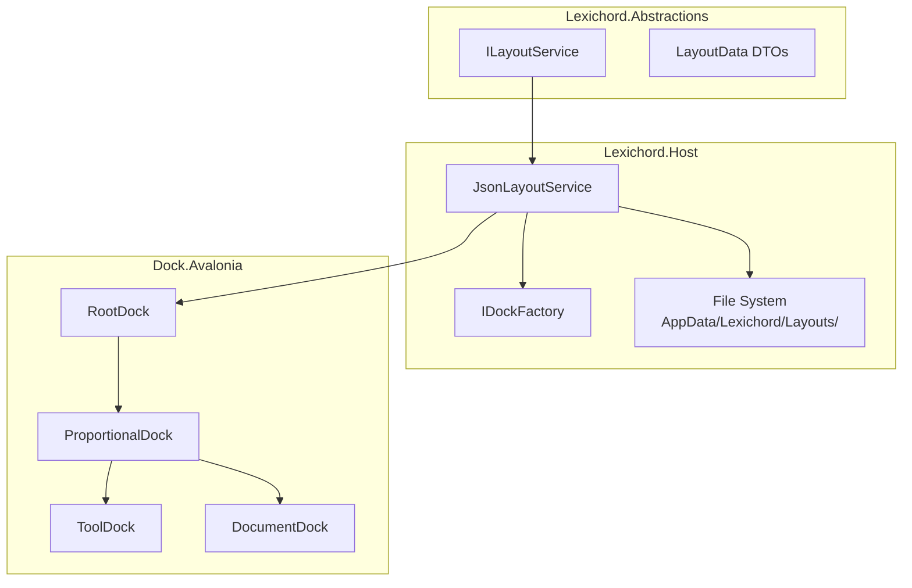
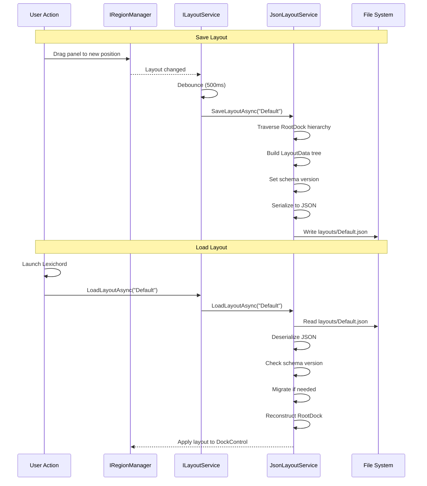
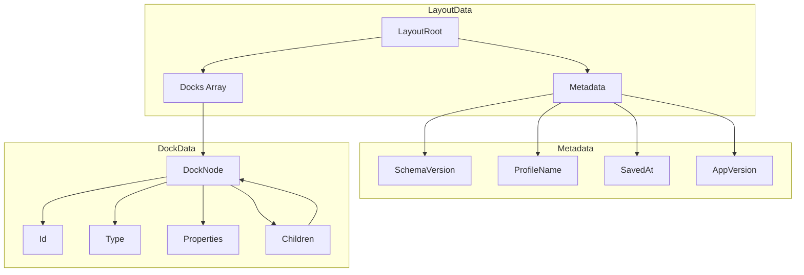

# LCS-DES-011c: Layout Serialization

## 1. Metadata & Categorization

| Field                | Value                                    | Description                                        |
| :------------------- | :--------------------------------------- | :------------------------------------------------- |
| **Feature ID**       | `INF-011c`                               | Infrastructure - Layout Serialization              |
| **Feature Name**     | Layout Serialization                     | JSON serialization of dock state with versioning   |
| **Target Version**   | `v0.1.1`                                 | Workspace Foundation Milestone                     |
| **Module Scope**     | `Lexichord.Abstractions` / `Lexichord.Host` | Core abstraction and implementation             |
| **Swimlane**         | `Infrastructure`                         | The Podium (Platform)                              |
| **License Tier**     | `Core`                                   | Foundation (Required for all tiers)                |
| **Feature Gate Key** | N/A                                      | No runtime gating for layout persistence           |
| **Author**           | System Architect                         |                                                    |
| **Status**           | **Draft**                                | Pending implementation                             |
| **Last Updated**     | 2026-01-26                               |                                                    |

---

## 2. Executive Summary

### 2.1 The Requirement

With the dock layout system (v0.1.1a) and region injection (v0.1.1b) in place, users need their workspace arrangements to **persist across sessions**. This requires:

- **JSON serialization** of the entire dock hierarchy (positions, sizes, visibility).
- **Schema versioning** for forward compatibility as the layout format evolves.
- **Named profiles** so users can save and switch between different workspace arrangements.
- **Auto-save** to prevent loss of layout changes on crash.

Without layout persistence:
- Users must manually rearrange panels every session.
- Professional workflow customization is lost.
- "Reset to Default" has no meaning without a saved default.
- Future multi-profile feature (WriterPro) has no foundation.

### 2.2 The Proposed Solution

We **SHALL** implement Layout Serialization with:

1. **ILayoutService Interface** - Define in Lexichord.Abstractions for persistence operations.
2. **JsonLayoutService Implementation** - Implement in Lexichord.Host using System.Text.Json.
3. **Schema Versioning** - Include version in JSON for migration support.
4. **Profile Management** - Save/load named layout profiles (default: "Default").
5. **Auto-Save** - Debounced auto-save on layout changes.

---

## 3. Architecture & Modular Strategy

### 3.1 High-Level Architecture



### 3.2 Serialization Flow



### 3.3 JSON Schema Structure



### 3.4 Dependencies

**NuGet Packages:**

| Package | Version | Purpose |
|:--------|:--------|:--------|
| `System.Text.Json` | 9.0.0 | JSON serialization (built-in) |

**Project References:**

| Project | Reference Direction |
|:--------|:--------------------|
| `Lexichord.Host` | -> `Lexichord.Abstractions` |
| `Lexichord.Host` | -> `Dock.Avalonia` (from v0.1.1a) |

---

## 4. Decision Tree: Layout Operations

```text
START: "How do I handle layout state?"
│
├── Application Startup
│   ├── Is there a saved layout?
│   │   └── Check: File.Exists(DefaultLayoutPath)
│   │       ├── YES → LoadLayoutAsync("Default")
│   │       │   ├── Deserialize JSON
│   │       │   ├── Check schema version
│   │       │   ├── Migrate if necessary
│   │       │   └── Apply to DockControl
│   │       │
│   │       └── NO → CreateDefaultLayout()
│   │           └── Save as "Default" profile
│   │
│   └── Load failed?
│       └── Log error, use default layout
│
├── User Changes Layout
│   ├── Panel dragged/resized
│   │   └── Debounced auto-save (500ms)
│   │       ├── Serialize current state
│   │       └── Write to current profile
│   │
│   └── User saves explicitly (Ctrl+Shift+S)
│       └── SaveLayoutAsync(currentProfile)
│
├── User Switches Profile
│   ├── Save current to current profile
│   ├── LoadLayoutAsync(newProfile)
│   └── Update currentProfile
│
├── User Resets Layout
│   └── LoadDefaultLayoutAsync()
│       ├── Delete current profile file
│       ├── CreateDefaultLayout()
│       └── Save as current profile
│
└── Schema Migration
    ├── Version 1 → 2 migration
    │   └── Transform dock node properties
    └── Unknown version
        └── Log warning, attempt best-effort load
```

---

## 5. Data Contracts

### 5.1 ILayoutService Interface

```csharp
namespace Lexichord.Abstractions.Layout;

/// <summary>
/// Service for persisting and restoring dock layouts.
/// </summary>
/// <remarks>
/// LOGIC: ILayoutService provides a high-level API for layout persistence.
/// It abstracts the serialization format (JSON) and storage location (AppData).
///
/// Key Features:
/// - Named profiles for multiple workspace arrangements
/// - Schema versioning for forward compatibility
/// - Auto-save support via debouncing
/// - Migration path for schema changes
///
/// Storage Location: {AppData}/Lexichord/Layouts/{ProfileName}.json
/// </remarks>
public interface ILayoutService
{
    /// <summary>
    /// Saves the current layout to a named profile.
    /// </summary>
    /// <param name="profileName">Name of the profile (e.g., "Default", "Writing", "Editing").</param>
    /// <param name="cancellationToken">Cancellation token.</param>
    /// <returns>True if save succeeded, false otherwise.</returns>
    /// <remarks>
    /// LOGIC: Saves serialize the entire dock hierarchy including:
    /// - Dock structure (which docks contain which children)
    /// - Proportional sizes of each dock
    /// - Collapsed/expanded state
    /// - Active/selected dockable in each dock
    ///
    /// Does NOT save:
    /// - Document content (editors save their own state)
    /// - Tool-specific state (tools save their own state)
    /// </remarks>
    Task<bool> SaveLayoutAsync(
        string profileName = "Default",
        CancellationToken cancellationToken = default);

    /// <summary>
    /// Loads a layout from a named profile.
    /// </summary>
    /// <param name="profileName">Name of the profile to load.</param>
    /// <param name="cancellationToken">Cancellation token.</param>
    /// <returns>True if load succeeded, false if profile not found or load failed.</returns>
    /// <remarks>
    /// LOGIC: Load deserializes the JSON and reconstructs the dock hierarchy.
    /// Missing dockables are skipped (they'll be re-added by modules).
    /// Extra dockables in the saved layout that no longer exist are ignored.
    /// </remarks>
    Task<bool> LoadLayoutAsync(
        string profileName = "Default",
        CancellationToken cancellationToken = default);

    /// <summary>
    /// Deletes a layout profile.
    /// </summary>
    /// <param name="profileName">Name of the profile to delete.</param>
    /// <param name="cancellationToken">Cancellation token.</param>
    /// <returns>True if deleted, false if not found.</returns>
    Task<bool> DeleteLayoutAsync(
        string profileName,
        CancellationToken cancellationToken = default);

    /// <summary>
    /// Gets all available profile names.
    /// </summary>
    /// <param name="cancellationToken">Cancellation token.</param>
    /// <returns>Enumerable of profile names.</returns>
    Task<IEnumerable<string>> GetProfileNamesAsync(
        CancellationToken cancellationToken = default);

    /// <summary>
    /// Checks if a profile exists.
    /// </summary>
    /// <param name="profileName">Name of the profile to check.</param>
    /// <param name="cancellationToken">Cancellation token.</param>
    /// <returns>True if profile exists.</returns>
    Task<bool> ProfileExistsAsync(
        string profileName,
        CancellationToken cancellationToken = default);

    /// <summary>
    /// Resets to the default layout, discarding all customizations.
    /// </summary>
    /// <param name="cancellationToken">Cancellation token.</param>
    /// <returns>True if reset succeeded.</returns>
    /// <remarks>
    /// LOGIC: This creates a fresh default layout from IDockFactory
    /// and saves it as the current profile, overwriting any customizations.
    /// </remarks>
    Task<bool> ResetToDefaultAsync(CancellationToken cancellationToken = default);

    /// <summary>
    /// Exports a layout to a file (for sharing/backup).
    /// </summary>
    /// <param name="profileName">Profile to export.</param>
    /// <param name="filePath">Destination file path.</param>
    /// <param name="cancellationToken">Cancellation token.</param>
    /// <returns>True if export succeeded.</returns>
    Task<bool> ExportLayoutAsync(
        string profileName,
        string filePath,
        CancellationToken cancellationToken = default);

    /// <summary>
    /// Imports a layout from a file.
    /// </summary>
    /// <param name="filePath">Source file path.</param>
    /// <param name="profileName">Name for the imported profile.</param>
    /// <param name="cancellationToken">Cancellation token.</param>
    /// <returns>True if import succeeded.</returns>
    Task<bool> ImportLayoutAsync(
        string filePath,
        string profileName,
        CancellationToken cancellationToken = default);

    /// <summary>
    /// Gets the currently active profile name.
    /// </summary>
    string CurrentProfileName { get; }

    /// <summary>
    /// Gets the directory where layouts are stored.
    /// </summary>
    string LayoutDirectory { get; }

    /// <summary>
    /// Event raised when auto-save completes.
    /// </summary>
    event EventHandler<LayoutSavedEventArgs>? LayoutSaved;

    /// <summary>
    /// Event raised when layout is loaded.
    /// </summary>
    event EventHandler<LayoutLoadedEventArgs>? LayoutLoaded;
}
```

### 5.2 Layout Data DTOs

```csharp
namespace Lexichord.Abstractions.Layout;

using System.Text.Json.Serialization;

/// <summary>
/// Root data transfer object for serialized layouts.
/// </summary>
/// <param name="Metadata">Layout metadata including version.</param>
/// <param name="Root">The root dock node.</param>
/// <remarks>
/// LOGIC: LayoutData is the top-level container for serialized layouts.
/// It contains metadata for versioning and the complete dock tree.
/// </remarks>
public record LayoutData(
    LayoutMetadata Metadata,
    DockNodeData Root
);

/// <summary>
/// Metadata for a serialized layout.
/// </summary>
/// <param name="SchemaVersion">Version of the layout schema.</param>
/// <param name="ProfileName">Name of this layout profile.</param>
/// <param name="SavedAt">UTC timestamp when saved.</param>
/// <param name="AppVersion">Lexichord version that saved this layout.</param>
/// <remarks>
/// LOGIC: Metadata enables:
/// - Schema migration when format changes
/// - Profile identification
/// - Debugging (when was this saved, by what version)
/// </remarks>
public record LayoutMetadata(
    int SchemaVersion,
    string ProfileName,
    DateTime SavedAt,
    string AppVersion
)
{
    /// <summary>
    /// Current schema version for new layouts.
    /// </summary>
    /// <remarks>
    /// LOGIC: Increment this when making breaking changes to the layout format.
    /// Always add migration code for old versions.
    /// </remarks>
    public const int CurrentSchemaVersion = 1;
}

/// <summary>
/// Serialized data for a single dock node.
/// </summary>
/// <param name="Id">Unique identifier for the dock.</param>
/// <param name="Type">Type of dock (Root, Proportional, Tool, Document).</param>
/// <param name="Properties">Type-specific properties.</param>
/// <param name="Children">Child dock nodes.</param>
/// <remarks>
/// LOGIC: DockNodeData is a recursive structure that mirrors the dock tree.
/// Each node type has different Properties based on Type.
/// </remarks>
public record DockNodeData(
    string Id,
    DockNodeType Type,
    DockNodeProperties Properties,
    IReadOnlyList<DockNodeData>? Children = null
);

/// <summary>
/// Type of dock node.
/// </summary>
[JsonConverter(typeof(JsonStringEnumConverter))]
public enum DockNodeType
{
    /// <summary>Root dock container.</summary>
    Root,

    /// <summary>Proportional dock with horizontal or vertical orientation.</summary>
    Proportional,

    /// <summary>Tool dock for auxiliary panels.</summary>
    Tool,

    /// <summary>Document dock for tabbed content.</summary>
    Document,

    /// <summary>Splitter between docks.</summary>
    Splitter,

    /// <summary>Individual dockable item.</summary>
    Dockable
}

/// <summary>
/// Properties for a dock node, varies by type.
/// </summary>
/// <param name="Title">Display title.</param>
/// <param name="Proportion">Size proportion (for ProportionalDock children).</param>
/// <param name="Orientation">Horizontal or Vertical (for ProportionalDock).</param>
/// <param name="Alignment">Left/Right/Top/Bottom (for ToolDock).</param>
/// <param name="IsCollapsed">Whether the dock is collapsed.</param>
/// <param name="IsActive">Whether this is the active dockable in parent.</param>
/// <param name="ActiveChildId">ID of the active child dockable.</param>
/// <param name="CanClose">Whether the dockable can be closed.</param>
/// <param name="CanFloat">Whether the dockable can be floated.</param>
/// <remarks>
/// LOGIC: Not all properties apply to all node types.
/// The serializer includes only non-null values.
/// </remarks>
public record DockNodeProperties(
    string? Title = null,
    double? Proportion = null,
    DockOrientation? Orientation = null,
    DockAlignment? Alignment = null,
    bool? IsCollapsed = null,
    bool? IsActive = null,
    string? ActiveChildId = null,
    bool? CanClose = null,
    bool? CanFloat = null
);

/// <summary>
/// Dock orientation for proportional docks.
/// </summary>
[JsonConverter(typeof(JsonStringEnumConverter))]
public enum DockOrientation
{
    /// <summary>Children arranged horizontally.</summary>
    Horizontal,

    /// <summary>Children arranged vertically.</summary>
    Vertical
}

/// <summary>
/// Dock alignment for tool docks.
/// </summary>
[JsonConverter(typeof(JsonStringEnumConverter))]
public enum DockAlignment
{
    /// <summary>Aligned to left side.</summary>
    Left,

    /// <summary>Aligned to right side.</summary>
    Right,

    /// <summary>Aligned to top.</summary>
    Top,

    /// <summary>Aligned to bottom.</summary>
    Bottom
}
```

### 5.3 Event Arguments

```csharp
namespace Lexichord.Abstractions.Layout;

/// <summary>
/// Event arguments for layout saved events.
/// </summary>
/// <param name="ProfileName">Name of the saved profile.</param>
/// <param name="FilePath">Path where layout was saved.</param>
/// <param name="WasAutoSave">Whether this was an auto-save.</param>
public record LayoutSavedEventArgs(
    string ProfileName,
    string FilePath,
    bool WasAutoSave
);

/// <summary>
/// Event arguments for layout loaded events.
/// </summary>
/// <param name="ProfileName">Name of the loaded profile.</param>
/// <param name="SchemaVersion">Schema version of the loaded layout.</param>
/// <param name="WasMigrated">Whether schema migration was performed.</param>
public record LayoutLoadedEventArgs(
    string ProfileName,
    int SchemaVersion,
    bool WasMigrated
);
```

---

## 6. Implementation Logic

### 6.1 JsonLayoutService Implementation

```csharp
using System.Text.Json;
using System.Text.Json.Serialization;
using Dock.Model.Core;
using Dock.Model.Avalonia.Controls;
using Lexichord.Abstractions.Layout;
using Microsoft.Extensions.Logging;
using System.Reflection;

namespace Lexichord.Host.Layout;

/// <summary>
/// JSON-based layout persistence service.
/// </summary>
/// <remarks>
/// LOGIC: JsonLayoutService handles all layout persistence operations:
/// - Serializes dock hierarchy to JSON with schema versioning
/// - Deserializes and reconstructs dock hierarchy
/// - Supports named profiles for workspace arrangements
/// - Provides auto-save with debouncing
///
/// File Storage:
/// - Location: {AppData}/Lexichord/Layouts/{ProfileName}.json
/// - Encoding: UTF-8 with indentation for readability
/// - Atomic writes: Write to temp file, then rename
/// </remarks>
public sealed class JsonLayoutService : ILayoutService, IDisposable
{
    private readonly IDockFactory _dockFactory;
    private readonly ILogger<JsonLayoutService> _logger;
    private readonly string _layoutDir;
    private readonly Timer _autoSaveTimer;
    private readonly object _autoSaveLock = new();

    private string _currentProfile = "Default";
    private bool _autoSavePending;
    private bool _disposed;

    /// <summary>
    /// LOGIC: Auto-save debounce interval (500ms).
    /// This prevents excessive disk writes during rapid layout changes.
    /// </summary>
    private const int AutoSaveDebounceMs = 500;

    /// <summary>
    /// JSON serialization options.
    /// </summary>
    private static readonly JsonSerializerOptions JsonOptions = new()
    {
        WriteIndented = true,
        PropertyNamingPolicy = JsonNamingPolicy.CamelCase,
        DefaultIgnoreCondition = JsonIgnoreCondition.WhenWritingNull,
        Converters = { new JsonStringEnumConverter(JsonNamingPolicy.CamelCase) }
    };

    /// <summary>
    /// Initializes a new instance of JsonLayoutService.
    /// </summary>
    /// <param name="dockFactory">The dock factory for layout operations.</param>
    /// <param name="logger">Logger instance.</param>
    /// <remarks>
    /// LOGIC: Constructor sets up the layout directory and auto-save timer.
    /// The timer starts disabled and is enabled on first layout change.
    /// </remarks>
    public JsonLayoutService(
        IDockFactory dockFactory,
        ILogger<JsonLayoutService> logger)
    {
        _dockFactory = dockFactory;
        _logger = logger;

        // LOGIC: Store layouts in user's AppData
        var appData = Environment.GetFolderPath(Environment.SpecialFolder.ApplicationData);
        _layoutDir = Path.Combine(appData, "Lexichord", "Layouts");
        Directory.CreateDirectory(_layoutDir);

        // LOGIC: Auto-save timer with debouncing
        _autoSaveTimer = new Timer(
            AutoSaveCallback,
            null,
            Timeout.Infinite,
            Timeout.Infinite);

        _logger.LogDebug("Layout service initialized. Directory: {Dir}", _layoutDir);
    }

    /// <inheritdoc/>
    public string CurrentProfileName => _currentProfile;

    /// <inheritdoc/>
    public string LayoutDirectory => _layoutDir;

    /// <inheritdoc/>
    public event EventHandler<LayoutSavedEventArgs>? LayoutSaved;

    /// <inheritdoc/>
    public event EventHandler<LayoutLoadedEventArgs>? LayoutLoaded;

    /// <inheritdoc/>
    public async Task<bool> SaveLayoutAsync(
        string profileName = "Default",
        CancellationToken cancellationToken = default)
    {
        _logger.LogDebug("Saving layout to profile: {Profile}", profileName);

        try
        {
            var root = _dockFactory.RootDock;
            if (root is null)
            {
                _logger.LogWarning("Cannot save layout - RootDock is null");
                return false;
            }

            // LOGIC: Build layout data from dock hierarchy
            var layoutData = BuildLayoutData(root, profileName);

            // LOGIC: Serialize to JSON
            var json = JsonSerializer.Serialize(layoutData, JsonOptions);

            // LOGIC: Atomic write (temp file + rename)
            var filePath = GetProfilePath(profileName);
            var tempPath = filePath + ".tmp";

            await File.WriteAllTextAsync(tempPath, json, cancellationToken);
            File.Move(tempPath, filePath, overwrite: true);

            _logger.LogInformation(
                "Layout saved to {Profile} ({Size} bytes)",
                profileName,
                json.Length);

            LayoutSaved?.Invoke(this, new LayoutSavedEventArgs(
                profileName, filePath, WasAutoSave: false));

            return true;
        }
        catch (Exception ex)
        {
            _logger.LogError(ex, "Failed to save layout to {Profile}", profileName);
            return false;
        }
    }

    /// <inheritdoc/>
    public async Task<bool> LoadLayoutAsync(
        string profileName = "Default",
        CancellationToken cancellationToken = default)
    {
        _logger.LogDebug("Loading layout from profile: {Profile}", profileName);

        var filePath = GetProfilePath(profileName);
        if (!File.Exists(filePath))
        {
            _logger.LogWarning("Layout profile not found: {Profile}", profileName);
            return false;
        }

        try
        {
            // LOGIC: Read and deserialize JSON
            var json = await File.ReadAllTextAsync(filePath, cancellationToken);
            var layoutData = JsonSerializer.Deserialize<LayoutData>(json, JsonOptions);

            if (layoutData is null)
            {
                _logger.LogError("Failed to deserialize layout: {Profile}", profileName);
                return false;
            }

            // LOGIC: Check schema version and migrate if needed
            var wasMigrated = false;
            if (layoutData.Metadata.SchemaVersion < LayoutMetadata.CurrentSchemaVersion)
            {
                _logger.LogInformation(
                    "Migrating layout from schema v{Old} to v{New}",
                    layoutData.Metadata.SchemaVersion,
                    LayoutMetadata.CurrentSchemaVersion);

                layoutData = MigrateLayout(layoutData);
                wasMigrated = true;
            }

            // LOGIC: Apply layout to dock factory
            ApplyLayoutData(layoutData);

            _currentProfile = profileName;

            _logger.LogInformation(
                "Layout loaded from {Profile} (schema v{Version})",
                profileName,
                layoutData.Metadata.SchemaVersion);

            LayoutLoaded?.Invoke(this, new LayoutLoadedEventArgs(
                profileName,
                layoutData.Metadata.SchemaVersion,
                wasMigrated));

            return true;
        }
        catch (Exception ex)
        {
            _logger.LogError(ex, "Failed to load layout from {Profile}", profileName);
            return false;
        }
    }

    /// <inheritdoc/>
    public Task<bool> DeleteLayoutAsync(
        string profileName,
        CancellationToken cancellationToken = default)
    {
        var filePath = GetProfilePath(profileName);
        if (!File.Exists(filePath))
        {
            _logger.LogWarning("Cannot delete - profile not found: {Profile}", profileName);
            return Task.FromResult(false);
        }

        try
        {
            File.Delete(filePath);
            _logger.LogInformation("Deleted layout profile: {Profile}", profileName);
            return Task.FromResult(true);
        }
        catch (Exception ex)
        {
            _logger.LogError(ex, "Failed to delete profile: {Profile}", profileName);
            return Task.FromResult(false);
        }
    }

    /// <inheritdoc/>
    public Task<IEnumerable<string>> GetProfileNamesAsync(
        CancellationToken cancellationToken = default)
    {
        var files = Directory.GetFiles(_layoutDir, "*.json");
        var names = files
            .Select(f => Path.GetFileNameWithoutExtension(f))
            .Where(n => !string.IsNullOrEmpty(n))
            .Cast<string>();

        return Task.FromResult(names);
    }

    /// <inheritdoc/>
    public Task<bool> ProfileExistsAsync(
        string profileName,
        CancellationToken cancellationToken = default)
    {
        var exists = File.Exists(GetProfilePath(profileName));
        return Task.FromResult(exists);
    }

    /// <inheritdoc/>
    public async Task<bool> ResetToDefaultAsync(CancellationToken cancellationToken = default)
    {
        _logger.LogInformation("Resetting to default layout");

        try
        {
            // LOGIC: Delete existing profile
            await DeleteLayoutAsync(_currentProfile, cancellationToken);

            // LOGIC: Create fresh default layout
            var root = _dockFactory.CreateDefaultLayout();

            // LOGIC: Save as current profile
            return await SaveLayoutAsync(_currentProfile, cancellationToken);
        }
        catch (Exception ex)
        {
            _logger.LogError(ex, "Failed to reset to default layout");
            return false;
        }
    }

    /// <inheritdoc/>
    public async Task<bool> ExportLayoutAsync(
        string profileName,
        string filePath,
        CancellationToken cancellationToken = default)
    {
        var sourcePath = GetProfilePath(profileName);
        if (!File.Exists(sourcePath))
        {
            _logger.LogWarning("Cannot export - profile not found: {Profile}", profileName);
            return false;
        }

        try
        {
            File.Copy(sourcePath, filePath, overwrite: true);
            _logger.LogInformation("Exported {Profile} to {Path}", profileName, filePath);
            return true;
        }
        catch (Exception ex)
        {
            _logger.LogError(ex, "Failed to export {Profile}", profileName);
            return false;
        }
    }

    /// <inheritdoc/>
    public async Task<bool> ImportLayoutAsync(
        string filePath,
        string profileName,
        CancellationToken cancellationToken = default)
    {
        if (!File.Exists(filePath))
        {
            _logger.LogWarning("Cannot import - file not found: {Path}", filePath);
            return false;
        }

        try
        {
            // LOGIC: Validate JSON before importing
            var json = await File.ReadAllTextAsync(filePath, cancellationToken);
            var layoutData = JsonSerializer.Deserialize<LayoutData>(json, JsonOptions);

            if (layoutData is null)
            {
                _logger.LogError("Invalid layout file: {Path}", filePath);
                return false;
            }

            // LOGIC: Copy to profiles directory
            var destPath = GetProfilePath(profileName);
            File.Copy(filePath, destPath, overwrite: true);

            _logger.LogInformation("Imported layout as {Profile}", profileName);
            return true;
        }
        catch (Exception ex)
        {
            _logger.LogError(ex, "Failed to import layout from {Path}", filePath);
            return false;
        }
    }

    /// <summary>
    /// Triggers a debounced auto-save.
    /// </summary>
    /// <remarks>
    /// LOGIC: Called by IRegionManager when layout changes.
    /// Resets the debounce timer to prevent excessive saves.
    /// </remarks>
    public void TriggerAutoSave()
    {
        if (_disposed) return;

        lock (_autoSaveLock)
        {
            _autoSavePending = true;
            _autoSaveTimer.Change(AutoSaveDebounceMs, Timeout.Infinite);
        }
    }

    /// <summary>
    /// Auto-save timer callback.
    /// </summary>
    private async void AutoSaveCallback(object? state)
    {
        lock (_autoSaveLock)
        {
            if (!_autoSavePending) return;
            _autoSavePending = false;
        }

        try
        {
            await SaveLayoutAsync(_currentProfile);
            LayoutSaved?.Invoke(this, new LayoutSavedEventArgs(
                _currentProfile,
                GetProfilePath(_currentProfile),
                WasAutoSave: true));
        }
        catch (Exception ex)
        {
            _logger.LogError(ex, "Auto-save failed");
        }
    }

    /// <summary>
    /// Gets the file path for a profile.
    /// </summary>
    private string GetProfilePath(string profileName)
    {
        // LOGIC: Sanitize profile name to prevent path traversal
        var safeName = Path.GetFileName(profileName);
        return Path.Combine(_layoutDir, $"{safeName}.json");
    }

    /// <summary>
    /// Builds LayoutData from the current dock hierarchy.
    /// </summary>
    private LayoutData BuildLayoutData(IRootDock root, string profileName)
    {
        var version = Assembly.GetExecutingAssembly().GetName().Version?.ToString() ?? "0.0.0";

        var metadata = new LayoutMetadata(
            SchemaVersion: LayoutMetadata.CurrentSchemaVersion,
            ProfileName: profileName,
            SavedAt: DateTime.UtcNow,
            AppVersion: version);

        var rootNode = SerializeDock(root);

        return new LayoutData(metadata, rootNode);
    }

    /// <summary>
    /// Recursively serializes a dock to DockNodeData.
    /// </summary>
    private DockNodeData SerializeDock(IDockable dockable)
    {
        var type = GetDockNodeType(dockable);
        var properties = GetDockProperties(dockable);

        List<DockNodeData>? children = null;
        if (dockable is IDock dock && dock.VisibleDockables?.Count > 0)
        {
            children = dock.VisibleDockables
                .Select(SerializeDock)
                .ToList();
        }

        return new DockNodeData(
            Id: dockable.Id ?? string.Empty,
            Type: type,
            Properties: properties,
            Children: children);
    }

    /// <summary>
    /// Determines the DockNodeType for a dockable.
    /// </summary>
    private static DockNodeType GetDockNodeType(IDockable dockable) => dockable switch
    {
        RootDock => DockNodeType.Root,
        ProportionalDock => DockNodeType.Proportional,
        ProportionalDockSplitter => DockNodeType.Splitter,
        ToolDock => DockNodeType.Tool,
        DocumentDock => DockNodeType.Document,
        _ => DockNodeType.Dockable
    };

    /// <summary>
    /// Extracts properties from a dockable.
    /// </summary>
    private static DockNodeProperties GetDockProperties(IDockable dockable)
    {
        var props = new DockNodeProperties(
            Title: dockable.Title,
            CanClose: dockable.CanClose,
            CanFloat: dockable.CanFloat);

        // LOGIC: Extract type-specific properties
        if (dockable is ProportionalDock propDock)
        {
            props = props with
            {
                Orientation = propDock.Orientation == Dock.Model.Core.Orientation.Horizontal
                    ? DockOrientation.Horizontal
                    : DockOrientation.Vertical
            };
        }

        if (dockable is IDock dock)
        {
            props = props with
            {
                Proportion = dock.Proportion,
                ActiveChildId = dock.ActiveDockable?.Id,
                IsCollapsed = dock.IsCollapsable && dockable is ToolDock td ? td.IsExpanded == false : null
            };
        }

        if (dockable is ToolDock toolDock)
        {
            props = props with
            {
                Alignment = toolDock.Alignment switch
                {
                    Dock.Model.Core.Alignment.Left => DockAlignment.Left,
                    Dock.Model.Core.Alignment.Right => DockAlignment.Right,
                    Dock.Model.Core.Alignment.Top => DockAlignment.Top,
                    Dock.Model.Core.Alignment.Bottom => DockAlignment.Bottom,
                    _ => null
                }
            };
        }

        return props;
    }

    /// <summary>
    /// Applies layout data to reconstruct the dock hierarchy.
    /// </summary>
    private void ApplyLayoutData(LayoutData layoutData)
    {
        // LOGIC: For v0.1.1, we apply proportions and state to existing docks
        // Full reconstruction is complex and deferred to future versions

        ApplyNodeData(_dockFactory.RootDock, layoutData.Root);
    }

    /// <summary>
    /// Recursively applies node data to existing docks.
    /// </summary>
    private void ApplyNodeData(IDockable? dockable, DockNodeData nodeData)
    {
        if (dockable is null) return;

        // LOGIC: Apply properties if IDs match
        if (dockable.Id == nodeData.Id)
        {
            // Apply proportion
            if (dockable is IDock dock && nodeData.Properties.Proportion.HasValue)
            {
                dock.Proportion = nodeData.Properties.Proportion.Value;
            }

            // Apply collapsed state
            if (dockable is ToolDock toolDock && nodeData.Properties.IsCollapsed.HasValue)
            {
                toolDock.IsExpanded = !nodeData.Properties.IsCollapsed.Value;
            }

            // Apply active child
            if (dockable is IDock parentDock &&
                nodeData.Properties.ActiveChildId is not null &&
                parentDock.VisibleDockables is not null)
            {
                var activeChild = parentDock.VisibleDockables
                    .FirstOrDefault(d => d.Id == nodeData.Properties.ActiveChildId);
                if (activeChild is not null)
                {
                    parentDock.ActiveDockable = activeChild;
                }
            }
        }

        // LOGIC: Recurse into children
        if (dockable is IDock dock2 &&
            dock2.VisibleDockables is not null &&
            nodeData.Children is not null)
        {
            foreach (var childData in nodeData.Children)
            {
                var childDock = dock2.VisibleDockables
                    .FirstOrDefault(d => d.Id == childData.Id);
                ApplyNodeData(childDock, childData);
            }
        }
    }

    /// <summary>
    /// Migrates layout data from old schema versions.
    /// </summary>
    private LayoutData MigrateLayout(LayoutData oldLayout)
    {
        // LOGIC: Currently only version 1 exists.
        // Add migration logic here when schema changes.

        // Example migration from hypothetical v1 to v2:
        // if (oldLayout.Metadata.SchemaVersion == 1)
        // {
        //     // Transform v1 format to v2 format
        //     return MigrateV1ToV2(oldLayout);
        // }

        _logger.LogWarning(
            "Unknown schema version {Version}, attempting best-effort load",
            oldLayout.Metadata.SchemaVersion);

        return oldLayout;
    }

    /// <inheritdoc/>
    public void Dispose()
    {
        if (_disposed) return;
        _disposed = true;

        _autoSaveTimer.Dispose();
    }
}
```

### 6.2 Example Layout JSON

```json
{
  "metadata": {
    "schemaVersion": 1,
    "profileName": "Default",
    "savedAt": "2026-01-26T14:30:00Z",
    "appVersion": "0.1.1"
  },
  "root": {
    "id": "Lexichord.Root",
    "type": "root",
    "properties": {
      "title": "Root"
    },
    "children": [
      {
        "id": "Lexichord.MainLayout",
        "type": "proportional",
        "properties": {
          "orientation": "horizontal"
        },
        "children": [
          {
            "id": "Lexichord.LeftTools",
            "type": "tool",
            "properties": {
              "title": "Explorer",
              "proportion": 200,
              "alignment": "left",
              "isCollapsed": false
            },
            "children": [
              {
                "id": "explorer",
                "type": "dockable",
                "properties": {
                  "title": "Project Explorer",
                  "canClose": false
                }
              }
            ]
          },
          {
            "id": "splitter-1",
            "type": "splitter",
            "properties": {}
          },
          {
            "id": "Lexichord.CenterLayout",
            "type": "proportional",
            "properties": {
              "orientation": "vertical"
            },
            "children": [
              {
                "id": "Lexichord.Documents",
                "type": "document",
                "properties": {
                  "title": "Documents",
                  "activeChildId": "file://readme.md"
                },
                "children": [
                  {
                    "id": "file://readme.md",
                    "type": "dockable",
                    "properties": {
                      "title": "readme.md",
                      "canClose": true
                    }
                  }
                ]
              },
              {
                "id": "splitter-2",
                "type": "splitter",
                "properties": {}
              },
              {
                "id": "Lexichord.BottomTools",
                "type": "tool",
                "properties": {
                  "title": "Output",
                  "proportion": 200,
                  "alignment": "bottom",
                  "isCollapsed": true
                }
              }
            ]
          },
          {
            "id": "splitter-3",
            "type": "splitter",
            "properties": {}
          },
          {
            "id": "Lexichord.RightTools",
            "type": "tool",
            "properties": {
              "title": "Properties",
              "proportion": 250,
              "alignment": "right",
              "isCollapsed": false
            }
          }
        ]
      }
    ]
  }
}
```

### 6.3 Service Registration

```csharp
// In HostServices.cs - Add to ConfigureServices method

/// <summary>
/// Registers layout persistence services.
/// </summary>
/// <remarks>
/// LOGIC: ILayoutService is registered as singleton because it maintains
/// state (current profile, auto-save timer).
/// </remarks>
public static IServiceCollection AddLayoutServices(
    this IServiceCollection services)
{
    // Layout Service
    services.AddSingleton<ILayoutService, JsonLayoutService>();

    return services;
}
```

### 6.4 Startup Integration

```csharp
// In App.axaml.cs - Add to OnFrameworkInitializationCompleted

/// <summary>
/// Loads saved layout on startup.
/// </summary>
private async Task InitializeLayoutAsync()
{
    var layoutService = _services!.GetRequiredService<ILayoutService>();
    var logger = _services.GetRequiredService<ILogger<App>>();

    // LOGIC: Try to load saved layout, fall back to default
    var loaded = await layoutService.LoadLayoutAsync("Default");

    if (!loaded)
    {
        logger.LogInformation("No saved layout found, using default");

        // Create default layout
        var dockFactory = _services.GetRequiredService<IDockFactory>();
        dockFactory.CreateDefaultLayout();

        // Save as default profile
        await layoutService.SaveLayoutAsync("Default");
    }
}
```

---

## 7. Use Cases & User Stories

### 7.1 User Stories

| ID | Role | Story | Acceptance Criteria |
|:---|:-----|:------|:--------------------|
| US-01 | User | As a user, I want my layout to persist when I close and reopen Lexichord. | Layout is identical after restart. |
| US-02 | User | As a user, I want to reset my layout to default. | "Reset Layout" restores original layout. |
| US-03 | User | As a user, I want multiple layout profiles for different workflows. | Can save/load named profiles. |
| US-04 | User | As a user, I want my layout saved automatically so I don't lose changes. | Auto-save on panel changes. |
| US-05 | Developer | As a developer, I want schema versioning so old layouts can be migrated. | Version in JSON, migration code runs. |
| US-06 | User | As a user, I want to export/import layouts for sharing. | Export to file, import from file works. |

### 7.2 Use Cases

#### UC-01: Application Startup with Saved Layout

**Preconditions:**
- Lexichord has been used before.
- Layout file exists at ~/AppData/Lexichord/Layouts/Default.json.

**Flow:**
1. User launches Lexichord.
2. App.OnFrameworkInitializationCompleted calls InitializeLayoutAsync.
3. ILayoutService.LoadLayoutAsync("Default") is called.
4. JsonLayoutService reads Default.json.
5. JSON is deserialized to LayoutData.
6. Schema version is checked (matches current).
7. ApplyLayoutData reconstructs dock proportions/state.
8. User sees their customized layout.

**Postconditions:**
- Layout matches what was saved.
- LayoutLoaded event is raised.

---

#### UC-02: Auto-Save on Layout Change

**Preconditions:**
- Lexichord is running with Default profile.
- User has made no changes.

**Flow:**
1. User drags left panel from 200px to 250px.
2. Dock.Avalonia updates proportions.
3. IRegionManager detects change, calls layoutService.TriggerAutoSave().
4. JsonLayoutService starts debounce timer (500ms).
5. User drags again to 275px.
6. Timer is reset (500ms from now).
7. User stops dragging.
8. 500ms passes, timer fires.
9. AutoSaveCallback calls SaveLayoutAsync("Default").
10. Layout JSON is written atomically.

**Postconditions:**
- Default.json contains proportion 275.
- LayoutSaved event raised with WasAutoSave=true.

---

#### UC-03: Reset to Default Layout

**Preconditions:**
- User has heavily customized their layout.
- User wants to start fresh.

**Flow:**
1. User selects View > Reset Layout.
2. Handler calls layoutService.ResetToDefaultAsync().
3. JsonLayoutService deletes current profile file.
4. dockFactory.CreateDefaultLayout() is called.
5. New default layout is applied.
6. SaveLayoutAsync saves new default.
7. User sees original default layout.

**Postconditions:**
- Layout matches factory default.
- Previous customizations are lost.

---

## 8. Observability & Logging

### 8.1 Log Events

| Level | Context | Message Template |
|:------|:--------|:-----------------|
| Debug | JsonLayoutService | `Layout service initialized. Directory: {Dir}` |
| Debug | JsonLayoutService | `Saving layout to profile: {Profile}` |
| Warning | JsonLayoutService | `Cannot save layout - RootDock is null` |
| Information | JsonLayoutService | `Layout saved to {Profile} ({Size} bytes)` |
| Error | JsonLayoutService | `Failed to save layout to {Profile}` |
| Debug | JsonLayoutService | `Loading layout from profile: {Profile}` |
| Warning | JsonLayoutService | `Layout profile not found: {Profile}` |
| Error | JsonLayoutService | `Failed to deserialize layout: {Profile}` |
| Information | JsonLayoutService | `Migrating layout from schema v{Old} to v{New}` |
| Information | JsonLayoutService | `Layout loaded from {Profile} (schema v{Version})` |
| Error | JsonLayoutService | `Failed to load layout from {Profile}` |
| Information | JsonLayoutService | `Resetting to default layout` |
| Information | JsonLayoutService | `Deleted layout profile: {Profile}` |
| Information | JsonLayoutService | `Exported {Profile} to {Path}` |
| Information | JsonLayoutService | `Imported layout as {Profile}` |
| Error | JsonLayoutService | `Auto-save failed` |
| Warning | JsonLayoutService | `Unknown schema version {Version}, attempting best-effort load` |

---

## 9. Unit Testing Requirements

### 9.1 JsonLayoutService Tests

```csharp
using Lexichord.Abstractions.Layout;
using Lexichord.Host.Layout;
using Microsoft.Extensions.Logging;
using Moq;
using NUnit.Framework;
using System.Text.Json;

namespace Lexichord.Tests.Layout;

[TestFixture]
[Category("Unit")]
public class JsonLayoutServiceTests
{
    private Mock<IDockFactory> _mockFactory = null!;
    private Mock<ILogger<JsonLayoutService>> _mockLogger = null!;
    private JsonLayoutService _sut = null!;
    private string _tempDir = null!;

    [SetUp]
    public void SetUp()
    {
        _mockFactory = new Mock<IDockFactory>();
        _mockLogger = new Mock<ILogger<JsonLayoutService>>();

        _tempDir = Path.Combine(Path.GetTempPath(), Guid.NewGuid().ToString());
        Directory.CreateDirectory(_tempDir);

        // LOGIC: Create service with temp directory for testing
        _sut = new JsonLayoutService(_mockFactory.Object, _mockLogger.Object);

        // Override layout directory via reflection for testing
        var field = typeof(JsonLayoutService)
            .GetField("_layoutDir", System.Reflection.BindingFlags.NonPublic | System.Reflection.BindingFlags.Instance);
        field?.SetValue(_sut, _tempDir);
    }

    [TearDown]
    public void TearDown()
    {
        _sut.Dispose();
        if (Directory.Exists(_tempDir))
            Directory.Delete(_tempDir, recursive: true);
    }

    [Test]
    public async Task SaveLayoutAsync_NullRootDock_ReturnsFalse()
    {
        // Arrange
        _mockFactory.Setup(f => f.RootDock).Returns((IRootDock?)null);

        // Act
        var result = await _sut.SaveLayoutAsync("Test");

        // Assert
        Assert.That(result, Is.False);
    }

    [Test]
    public async Task SaveLayoutAsync_ValidRoot_CreatesFile()
    {
        // Arrange
        var mockRoot = CreateMockRootDock();
        _mockFactory.Setup(f => f.RootDock).Returns(mockRoot);

        // Act
        var result = await _sut.SaveLayoutAsync("Test");

        // Assert
        Assert.That(result, Is.True);
        Assert.That(File.Exists(Path.Combine(_tempDir, "Test.json")), Is.True);
    }

    [Test]
    public async Task SaveLayoutAsync_ContainsSchemaVersion()
    {
        // Arrange
        var mockRoot = CreateMockRootDock();
        _mockFactory.Setup(f => f.RootDock).Returns(mockRoot);

        // Act
        await _sut.SaveLayoutAsync("Test");

        // Assert
        var json = await File.ReadAllTextAsync(Path.Combine(_tempDir, "Test.json"));
        var layout = JsonSerializer.Deserialize<LayoutData>(json, new JsonSerializerOptions
        {
            PropertyNameCaseInsensitive = true
        });

        Assert.That(layout, Is.Not.Null);
        Assert.That(layout!.Metadata.SchemaVersion, Is.EqualTo(LayoutMetadata.CurrentSchemaVersion));
    }

    [Test]
    public async Task LoadLayoutAsync_NonExistentFile_ReturnsFalse()
    {
        // Act
        var result = await _sut.LoadLayoutAsync("NonExistent");

        // Assert
        Assert.That(result, Is.False);
    }

    [Test]
    public async Task LoadLayoutAsync_ValidFile_ReturnsTrue()
    {
        // Arrange - Create a valid layout file
        var layoutData = new LayoutData(
            new LayoutMetadata(1, "Test", DateTime.UtcNow, "0.1.1"),
            new DockNodeData("root", DockNodeType.Root, new DockNodeProperties())
        );

        var json = JsonSerializer.Serialize(layoutData, new JsonSerializerOptions
        {
            PropertyNamingPolicy = JsonNamingPolicy.CamelCase
        });
        await File.WriteAllTextAsync(Path.Combine(_tempDir, "Test.json"), json);

        _mockFactory.Setup(f => f.RootDock).Returns(CreateMockRootDock());

        // Act
        var result = await _sut.LoadLayoutAsync("Test");

        // Assert
        Assert.That(result, Is.True);
    }

    [Test]
    public async Task LoadLayoutAsync_RaisesLayoutLoadedEvent()
    {
        // Arrange
        var layoutData = new LayoutData(
            new LayoutMetadata(1, "Test", DateTime.UtcNow, "0.1.1"),
            new DockNodeData("root", DockNodeType.Root, new DockNodeProperties())
        );

        var json = JsonSerializer.Serialize(layoutData, new JsonSerializerOptions
        {
            PropertyNamingPolicy = JsonNamingPolicy.CamelCase
        });
        await File.WriteAllTextAsync(Path.Combine(_tempDir, "Test.json"), json);

        _mockFactory.Setup(f => f.RootDock).Returns(CreateMockRootDock());

        LayoutLoadedEventArgs? receivedArgs = null;
        _sut.LayoutLoaded += (_, args) => receivedArgs = args;

        // Act
        await _sut.LoadLayoutAsync("Test");

        // Assert
        Assert.That(receivedArgs, Is.Not.Null);
        Assert.That(receivedArgs!.ProfileName, Is.EqualTo("Test"));
    }

    [Test]
    public async Task GetProfileNamesAsync_ReturnsFileNames()
    {
        // Arrange
        await File.WriteAllTextAsync(Path.Combine(_tempDir, "Profile1.json"), "{}");
        await File.WriteAllTextAsync(Path.Combine(_tempDir, "Profile2.json"), "{}");

        // Act
        var names = await _sut.GetProfileNamesAsync();

        // Assert
        Assert.That(names, Does.Contain("Profile1"));
        Assert.That(names, Does.Contain("Profile2"));
    }

    [Test]
    public async Task ProfileExistsAsync_ExistingProfile_ReturnsTrue()
    {
        // Arrange
        await File.WriteAllTextAsync(Path.Combine(_tempDir, "Exists.json"), "{}");

        // Act
        var exists = await _sut.ProfileExistsAsync("Exists");

        // Assert
        Assert.That(exists, Is.True);
    }

    [Test]
    public async Task ProfileExistsAsync_NonExistingProfile_ReturnsFalse()
    {
        // Act
        var exists = await _sut.ProfileExistsAsync("DoesNotExist");

        // Assert
        Assert.That(exists, Is.False);
    }

    [Test]
    public async Task DeleteLayoutAsync_ExistingProfile_DeletesFile()
    {
        // Arrange
        var filePath = Path.Combine(_tempDir, "ToDelete.json");
        await File.WriteAllTextAsync(filePath, "{}");

        // Act
        var result = await _sut.DeleteLayoutAsync("ToDelete");

        // Assert
        Assert.That(result, Is.True);
        Assert.That(File.Exists(filePath), Is.False);
    }

    [Test]
    public async Task ExportLayoutAsync_CopiesFile()
    {
        // Arrange
        var sourcePath = Path.Combine(_tempDir, "Source.json");
        var destPath = Path.Combine(_tempDir, "Exported.json");
        await File.WriteAllTextAsync(sourcePath, "{\"test\": true}");

        // Act
        var result = await _sut.ExportLayoutAsync("Source", destPath);

        // Assert
        Assert.That(result, Is.True);
        Assert.That(File.Exists(destPath), Is.True);
        Assert.That(await File.ReadAllTextAsync(destPath), Is.EqualTo("{\"test\": true}"));
    }

    [Test]
    public async Task ImportLayoutAsync_ValidFile_ImportsSuccessfully()
    {
        // Arrange
        var sourceFile = Path.Combine(_tempDir, "External.json");
        var layoutData = new LayoutData(
            new LayoutMetadata(1, "External", DateTime.UtcNow, "0.1.1"),
            new DockNodeData("root", DockNodeType.Root, new DockNodeProperties())
        );
        var json = JsonSerializer.Serialize(layoutData, new JsonSerializerOptions
        {
            PropertyNamingPolicy = JsonNamingPolicy.CamelCase
        });
        await File.WriteAllTextAsync(sourceFile, json);

        // Act
        var result = await _sut.ImportLayoutAsync(sourceFile, "Imported");

        // Assert
        Assert.That(result, Is.True);
        Assert.That(await _sut.ProfileExistsAsync("Imported"), Is.True);
    }

    [Test]
    public void CurrentProfileName_DefaultIsDefault()
    {
        // Assert
        Assert.That(_sut.CurrentProfileName, Is.EqualTo("Default"));
    }

    private static IRootDock CreateMockRootDock()
    {
        var mockRoot = new Mock<IRootDock>();
        mockRoot.Setup(r => r.Id).Returns("Lexichord.Root");
        mockRoot.Setup(r => r.Title).Returns("Root");
        mockRoot.Setup(r => r.VisibleDockables).Returns((IList<IDockable>?)null);
        return mockRoot.Object;
    }
}
```

### 9.2 LayoutData Serialization Tests

```csharp
[TestFixture]
[Category("Unit")]
public class LayoutDataSerializationTests
{
    private static readonly JsonSerializerOptions Options = new()
    {
        PropertyNamingPolicy = JsonNamingPolicy.CamelCase,
        WriteIndented = true
    };

    [Test]
    public void LayoutData_RoundTrip_PreservesData()
    {
        // Arrange
        var original = new LayoutData(
            new LayoutMetadata(1, "Test", DateTime.UtcNow, "0.1.1"),
            new DockNodeData(
                "root",
                DockNodeType.Root,
                new DockNodeProperties(Title: "Root"),
                new List<DockNodeData>
                {
                    new("child", DockNodeType.Tool, new DockNodeProperties(
                        Title: "Tool",
                        Proportion: 200,
                        Alignment: DockAlignment.Left))
                }));

        // Act
        var json = JsonSerializer.Serialize(original, Options);
        var restored = JsonSerializer.Deserialize<LayoutData>(json, Options);

        // Assert
        Assert.That(restored, Is.Not.Null);
        Assert.That(restored!.Metadata.SchemaVersion, Is.EqualTo(1));
        Assert.That(restored.Metadata.ProfileName, Is.EqualTo("Test"));
        Assert.That(restored.Root.Id, Is.EqualTo("root"));
        Assert.That(restored.Root.Children, Has.Count.EqualTo(1));
        Assert.That(restored.Root.Children![0].Properties.Proportion, Is.EqualTo(200));
    }

    [Test]
    public void DockNodeType_SerializesAsString()
    {
        // Arrange
        var node = new DockNodeData("test", DockNodeType.Document, new DockNodeProperties());

        // Act
        var json = JsonSerializer.Serialize(node, Options);

        // Assert
        Assert.That(json, Does.Contain("\"type\": \"document\""));
    }

    [Test]
    public void DockNodeProperties_NullValuesOmitted()
    {
        // Arrange
        var props = new DockNodeProperties(Title: "Test");

        // Act
        var json = JsonSerializer.Serialize(props, new JsonSerializerOptions
        {
            PropertyNamingPolicy = JsonNamingPolicy.CamelCase,
            DefaultIgnoreCondition = System.Text.Json.Serialization.JsonIgnoreCondition.WhenWritingNull
        });

        // Assert
        Assert.That(json, Does.Contain("\"title\""));
        Assert.That(json, Does.Not.Contain("\"proportion\""));
        Assert.That(json, Does.Not.Contain("\"alignment\""));
    }
}
```

---

## 10. Security & Safety

### 10.1 File System Safety

> [!IMPORTANT]
> Profile names are sanitized via Path.GetFileName to prevent path traversal attacks.
> Never accept user-provided paths without validation.

### 10.2 Atomic Writes

> [!NOTE]
> Layout saves use atomic writes (write temp file, then rename) to prevent
> corruption if the application crashes during save.

### 10.3 Schema Migration

> [!WARNING]
> Always test schema migrations with production layout files before release.
> Keep backups of layout files during development.

---

## 11. Risks & Mitigations

| Risk | Impact | Mitigation |
|:-----|:-------|:-----------|
| Layout file corruption | High | Atomic writes; backup before overwrite |
| Schema migration failure | High | Validate migrations in tests; log warnings |
| Disk full during save | Medium | Check disk space; handle IOException |
| Concurrent access | Medium | Lock file or debounce saves |
| Very large layout files | Low | Set size limits; compress if needed |

---

## 12. Acceptance Criteria (QA)

| # | Category | Criterion |
|:--|:---------|:----------|
| 1 | **[Interface]** | ILayoutService interface is in Lexichord.Abstractions |
| 2 | **[Implementation]** | JsonLayoutService is in Lexichord.Host |
| 3 | **[Save]** | SaveLayoutAsync writes JSON to AppData/Lexichord/Layouts/ |
| 4 | **[Save]** | Saved JSON contains schemaVersion field |
| 5 | **[Load]** | LoadLayoutAsync restores layout from JSON |
| 6 | **[Load]** | Layout is restored correctly after app restart |
| 7 | **[AutoSave]** | TriggerAutoSave debounces and saves |
| 8 | **[Profiles]** | Multiple profiles can be saved and loaded |
| 9 | **[Reset]** | ResetToDefaultAsync restores factory default |
| 10 | **[Export]** | ExportLayoutAsync copies file to destination |
| 11 | **[Import]** | ImportLayoutAsync validates and copies file |
| 12 | **[Events]** | LayoutSaved and LayoutLoaded events fire |
| 13 | **[Migration]** | Old schema versions are migrated |

---

## 13. Verification Commands

```bash
# 1. Build all projects
dotnet build

# 2. Run application, customize layout, close
dotnet run --project src/Lexichord.Host
# Drag panels, resize, close app

# 3. Verify layout file was created
# Windows:
dir "%APPDATA%\Lexichord\Layouts"
# macOS/Linux:
ls -la ~/.config/Lexichord/Layouts/

# 4. Verify JSON contains schema version
# Windows:
type "%APPDATA%\Lexichord\Layouts\Default.json" | findstr schemaVersion
# macOS/Linux:
cat ~/.config/Lexichord/Layouts/Default.json | grep schemaVersion

# 5. Restart application, verify layout restored
dotnet run --project src/Lexichord.Host
# Layout should match what was saved

# 6. Run unit tests
dotnet test --filter "FullyQualifiedName~JsonLayoutService"

# 7. Test export/import
# Export: Window > Export Layout
# Import: Window > Import Layout
```

---

## 14. Deliverable Checklist

| Step | Description | Status |
|:-----|:------------|:-------|
| 1 | Define ILayoutService interface in Lexichord.Abstractions | [ ] |
| 2 | Define LayoutData record | [ ] |
| 3 | Define LayoutMetadata record with SchemaVersion | [ ] |
| 4 | Define DockNodeData record | [ ] |
| 5 | Define DockNodeProperties record | [ ] |
| 6 | Define DockNodeType enum | [ ] |
| 7 | Define LayoutSavedEventArgs record | [ ] |
| 8 | Define LayoutLoadedEventArgs record | [ ] |
| 9 | Implement JsonLayoutService | [ ] |
| 10 | Implement SaveLayoutAsync with atomic write | [ ] |
| 11 | Implement LoadLayoutAsync with schema check | [ ] |
| 12 | Implement TriggerAutoSave with debouncing | [ ] |
| 13 | Implement profile management (GetProfileNames, Delete) | [ ] |
| 14 | Implement ResetToDefaultAsync | [ ] |
| 15 | Implement Export/Import | [ ] |
| 16 | Add startup integration in App.axaml.cs | [ ] |
| 17 | Register JsonLayoutService in HostServices | [ ] |
| 18 | Unit tests for JsonLayoutService | [ ] |
| 19 | Unit tests for LayoutData serialization | [ ] |
| 20 | Verify round-trip persistence works | [ ] |
