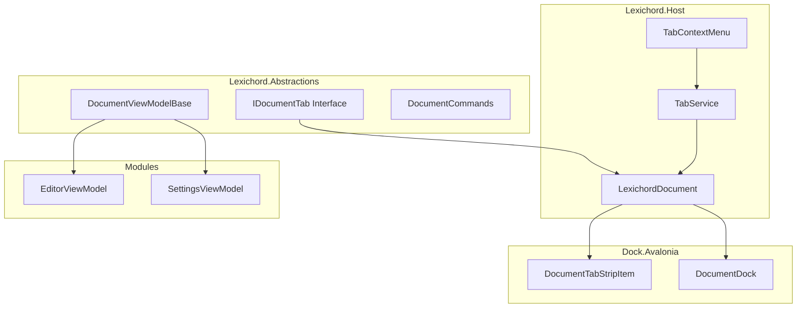
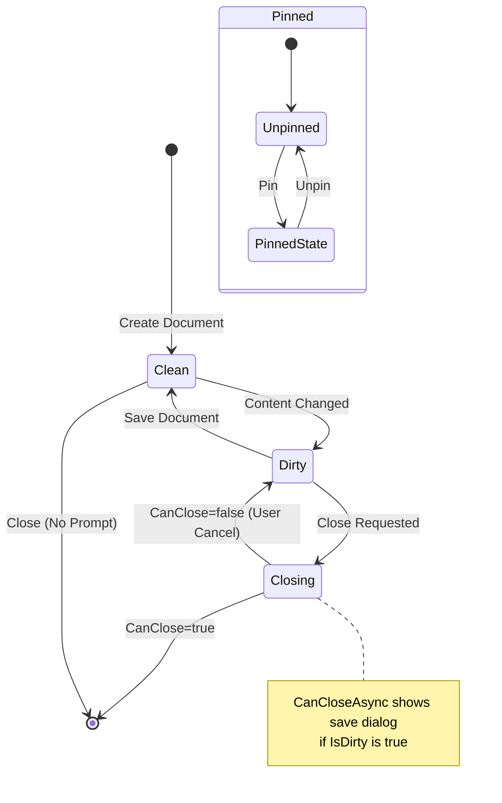
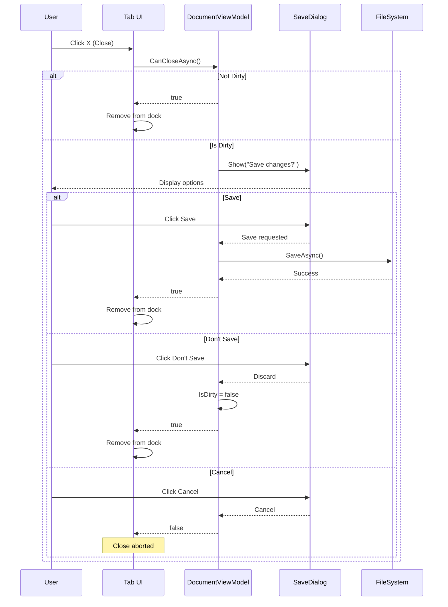

# LCS-DES-011d: Tab Infrastructure

## 1. Metadata & Categorization

| Field                | Value                                    | Description                                        |
| :------------------- | :--------------------------------------- | :------------------------------------------------- |
| **Feature ID**       | `INF-011d`                               | Infrastructure - Tab Infrastructure                |
| **Feature Name**     | Tab Infrastructure                       | Document tabs with dirty state, pinning, and drag  |
| **Target Version**   | `v0.1.1`                                 | Workspace Foundation Milestone                     |
| **Module Scope**     | `Lexichord.Abstractions` / `Lexichord.Host` | Core abstraction and implementation             |
| **Swimlane**         | `Infrastructure`                         | The Podium (Platform)                              |
| **License Tier**     | `Core`                                   | Foundation (Required for all tiers)                |
| **Feature Gate Key** | N/A                                      | No runtime gating for tab infrastructure           |
| **Author**           | System Architect                         |                                                    |
| **Status**           | **Draft**                                | Pending implementation                             |
| **Last Updated**     | 2026-01-26                               |                                                    |

---

## 2. Executive Summary

### 2.1 The Requirement

The v0.1.1a dock system provides basic document tabs, but professional text editors require **rich tab behaviors**:

- **Dirty State Indicators** - Show "*" on tabs with unsaved changes.
- **Tab Pinning** - Pin important tabs to prevent accidental closure.
- **Close Confirmation** - Prompt before closing dirty documents.
- **Tab Drag/Drop** - Reorder tabs within the dock.
- **Tab Tear-Out** - Drag tabs out to create floating windows.
- **Tab Context Menu** - Close, Close All, Close Others, Pin/Unpin.

Without these features:
- Users lose work by accidentally closing unsaved documents.
- Important documents get lost among many tabs.
- Workflow is inefficient compared to VS Code/Rider.
- Professional users won't adopt the application.

### 2.2 The Proposed Solution

We **SHALL** implement Tab Infrastructure with:

1. **DocumentViewModel Base Class** - Abstract base for all document ViewModels with IsDirty, IsPinned.
2. **IDocumentTab Interface** - Contract for document behavior in Abstractions.
3. **CanCloseAsync Pattern** - Async close confirmation with save prompts.
4. **Tab Styling** - Visual indicators for dirty and pinned state.
5. **Context Menu Integration** - Standard tab context menu actions.
6. **Drag/Drop/Tear-Out** - Full Dock.Avalonia drag functionality.

---

## 3. Architecture & Modular Strategy

### 3.1 High-Level Architecture



### 3.2 Tab State Diagram



### 3.3 Close Confirmation Flow



### 3.4 Dependencies

**NuGet Packages:**

| Package | Version | Purpose |
|:--------|:--------|:--------|
| `CommunityToolkit.Mvvm` | 8.4.0 | Observable base class |
| `Dock.Avalonia` | 11.1.0.1 | Tab control (from v0.1.1a) |

**Project References:**

| Project | Reference Direction |
|:--------|:--------------------|
| `Lexichord.Host` | -> `Lexichord.Abstractions` |
| `All Modules` | -> `Lexichord.Abstractions` only |

**Internal Dependencies:**

| Feature ID | Dependency | Purpose |
|:-----------|:-----------|:--------|
| v0.0.7 | MediatR | Publish close/save events |
| v0.0.3 | Serilog | Logging |
| v0.1.1a | IDockFactory | Document creation |
| v0.1.1b | IRegionManager | Document registration |

---

## 4. Decision Tree: Tab Operations

```text
START: "How do I handle tab operations?"
│
├── Create New Document Tab
│   ├── Create DocumentViewModel subclass
│   │   ├── Inherit from DocumentViewModelBase
│   │   ├── Set Title (filename or identifier)
│   │   └── Override CanCloseAsync if custom logic needed
│   │
│   └── Register with IRegionManager
│       └── RegisterDocumentAsync(id, title, viewFactory)
│
├── User Edits Document
│   ├── Content changed?
│   │   └── YES → Set IsDirty = true
│   │       ├── Title shows "*" indicator
│   │       └── CanCloseAsync will prompt
│   │
│   └── User saves?
│       └── Call SaveAsync()
│           ├── Perform save operation
│           └── Set IsDirty = false
│
├── User Closes Tab
│   ├── Is IsDirty true?
│   │   ├── YES → CanCloseAsync shows dialog
│   │   │   ├── Save → Save, then close
│   │   │   ├── Don't Save → Close without save
│   │   │   └── Cancel → Abort close
│   │   │
│   │   └── NO → Close immediately
│   │
│   └── Is IsPinned true?
│       └── Protected from Close All (unless force)
│
├── User Right-Clicks Tab
│   └── Show Context Menu
│       ├── Close
│       ├── Close All
│       ├── Close All But This
│       ├── Close to the Right
│       ├── Pin/Unpin
│       ├── Copy Path (if file)
│       └── Reveal in Explorer (if file)
│
├── User Drags Tab
│   ├── Within same dock?
│   │   └── Reorder tabs
│   │
│   ├── To different document dock?
│   │   └── Move to new dock
│   │
│   └── To empty space?
│       └── Create floating window (tear-out)
│
└── User Closes All
    ├── Skip pinned tabs
    ├── Prompt for each dirty document
    └── Stop if any cancelled
```

---

## 5. Data Contracts

### 5.1 IDocumentTab Interface

```csharp
namespace Lexichord.Abstractions.Layout;

/// <summary>
/// Interface for documents that can be displayed as tabs.
/// </summary>
/// <remarks>
/// LOGIC: IDocumentTab defines the contract for document behavior:
/// - Dirty state tracking for unsaved changes
/// - Pinning to prevent accidental closure
/// - Async close confirmation for save prompts
///
/// All document ViewModels should inherit from DocumentViewModelBase
/// which implements this interface.
/// </remarks>
public interface IDocumentTab
{
    /// <summary>
    /// Gets the unique identifier for this document.
    /// </summary>
    /// <remarks>
    /// LOGIC: Used for layout persistence and navigation.
    /// Format conventions:
    /// - Files: "file://{absolute_path}"
    /// - Settings: "settings://{section}"
    /// - Temporary: "temp://{guid}"
    /// </remarks>
    string DocumentId { get; }

    /// <summary>
    /// Gets the display title for the tab.
    /// </summary>
    /// <remarks>
    /// LOGIC: This is the base title without dirty indicator.
    /// The full display title includes "*" when dirty.
    /// </remarks>
    string Title { get; }

    /// <summary>
    /// Gets the full display title including dirty indicator.
    /// </summary>
    /// <remarks>
    /// LOGIC: Returns "{Title}*" when IsDirty, otherwise just Title.
    /// Used for tab header display.
    /// </remarks>
    string DisplayTitle { get; }

    /// <summary>
    /// Gets or sets whether the document has unsaved changes.
    /// </summary>
    /// <remarks>
    /// LOGIC: When true:
    /// - Tab title shows "*" suffix
    /// - Close action triggers save confirmation
    /// - Application close prompts for all dirty documents
    ///
    /// Document content should set this true on any change.
    /// Save operations should set this false on success.
    /// </remarks>
    bool IsDirty { get; set; }

    /// <summary>
    /// Gets or sets whether the tab is pinned.
    /// </summary>
    /// <remarks>
    /// LOGIC: Pinned tabs:
    /// - Appear first in tab order (before unpinned)
    /// - Are excluded from "Close All" (unless force)
    /// - Show pin icon in tab header
    /// - Persist across sessions
    /// </remarks>
    bool IsPinned { get; set; }

    /// <summary>
    /// Gets whether this document can be closed by the user.
    /// </summary>
    /// <remarks>
    /// LOGIC: Some documents (like Welcome tab) may not be closable.
    /// This is separate from CanCloseAsync which handles dirty state.
    /// </remarks>
    bool CanClose { get; }

    /// <summary>
    /// Determines whether the document can be closed, with save prompt if needed.
    /// </summary>
    /// <returns>True if close should proceed, false to cancel.</returns>
    /// <remarks>
    /// LOGIC: Default implementation:
    /// 1. If not dirty, return true
    /// 2. If dirty, show save confirmation dialog
    /// 3. Based on user choice:
    ///    - Save: await SaveAsync(), return true
    ///    - Don't Save: return true (discard changes)
    ///    - Cancel: return false (abort close)
    ///
    /// Subclasses can override for custom behavior.
    /// </remarks>
    Task<bool> CanCloseAsync();

    /// <summary>
    /// Saves the document content.
    /// </summary>
    /// <returns>True if save succeeded, false otherwise.</returns>
    /// <remarks>
    /// LOGIC: Implementations should:
    /// 1. Persist content to storage (file, database, etc.)
    /// 2. Set IsDirty = false on success
    /// 3. Update Title if needed (e.g., new file gets name)
    /// </remarks>
    Task<bool> SaveAsync();

    /// <summary>
    /// Event raised when document state changes.
    /// </summary>
    /// <remarks>
    /// LOGIC: Raised when IsDirty, IsPinned, or Title changes.
    /// Used by tab UI to update display.
    /// </remarks>
    event EventHandler<DocumentStateChangedEventArgs>? StateChanged;
}

/// <summary>
/// Event arguments for document state changes.
/// </summary>
/// <param name="PropertyName">Name of the changed property.</param>
/// <param name="OldValue">Previous value.</param>
/// <param name="NewValue">New value.</param>
public record DocumentStateChangedEventArgs(
    string PropertyName,
    object? OldValue,
    object? NewValue
);
```

### 5.2 DocumentViewModelBase

```csharp
namespace Lexichord.Abstractions.ViewModels;

using CommunityToolkit.Mvvm.ComponentModel;
using CommunityToolkit.Mvvm.Input;
using Lexichord.Abstractions.Layout;
using Microsoft.Extensions.Logging;

/// <summary>
/// Base class for document ViewModels with tab functionality.
/// </summary>
/// <remarks>
/// LOGIC: DocumentViewModelBase provides standard implementation of IDocumentTab:
/// - Observable properties for MVVM binding
/// - Default CanCloseAsync with save dialog
/// - State change event propagation
/// - Common commands (Save, Close, Pin)
///
/// Module developers should inherit from this class for all document ViewModels.
///
/// Primary constructor pattern is used for dependency injection.
/// </remarks>
/// <example>
/// <code>
/// public class EditorViewModel : DocumentViewModelBase
/// {
///     public EditorViewModel(ILogger&lt;EditorViewModel&gt; logger)
///         : base("file://untitled.md", "Untitled", logger)
///     {
///     }
///
///     // Override SaveAsync for actual file saving
///     public override async Task&lt;bool&gt; SaveAsync()
///     {
///         // Save logic here
///         return await base.SaveAsync();
///     }
/// }
/// </code>
/// </example>
public abstract partial class DocumentViewModelBase : ObservableObject, IDocumentTab
{
    private readonly ILogger _logger;

    /// <summary>
    /// Initializes a new instance of DocumentViewModelBase.
    /// </summary>
    /// <param name="documentId">Unique identifier for the document.</param>
    /// <param name="title">Display title for the tab.</param>
    /// <param name="logger">Logger instance.</param>
    /// <remarks>
    /// LOGIC: The primary constructor takes all required dependencies.
    /// Subclasses should use primary constructor syntax for clean DI.
    /// </remarks>
    protected DocumentViewModelBase(
        string documentId,
        string title,
        ILogger logger)
    {
        DocumentId = documentId;
        _title = title;
        _logger = logger;
    }

    /// <inheritdoc/>
    public string DocumentId { get; }

    [ObservableProperty]
    [NotifyPropertyChangedFor(nameof(DisplayTitle))]
    private string _title;

    [ObservableProperty]
    [NotifyPropertyChangedFor(nameof(DisplayTitle))]
    private bool _isDirty;

    [ObservableProperty]
    private bool _isPinned;

    [ObservableProperty]
    private bool _canClose = true;

    /// <inheritdoc/>
    public string DisplayTitle => IsDirty ? $"{Title}*" : Title;

    /// <inheritdoc/>
    public event EventHandler<DocumentStateChangedEventArgs>? StateChanged;

    /// <summary>
    /// Called when IsDirty property changes.
    /// </summary>
    partial void OnIsDirtyChanged(bool oldValue, bool newValue)
    {
        _logger.LogDebug(
            "Document {Id} dirty state changed: {OldValue} -> {NewValue}",
            DocumentId, oldValue, newValue);

        OnStateChanged(nameof(IsDirty), oldValue, newValue);
    }

    /// <summary>
    /// Called when IsPinned property changes.
    /// </summary>
    partial void OnIsPinnedChanged(bool oldValue, bool newValue)
    {
        _logger.LogDebug(
            "Document {Id} pinned state changed: {OldValue} -> {NewValue}",
            DocumentId, oldValue, newValue);

        OnStateChanged(nameof(IsPinned), oldValue, newValue);
    }

    /// <summary>
    /// Called when Title property changes.
    /// </summary>
    partial void OnTitleChanged(string? oldValue, string newValue)
    {
        _logger.LogDebug(
            "Document {Id} title changed: {OldValue} -> {NewValue}",
            DocumentId, oldValue, newValue);

        OnStateChanged(nameof(Title), oldValue, newValue);
    }

    /// <summary>
    /// Raises the StateChanged event.
    /// </summary>
    protected virtual void OnStateChanged(string propertyName, object? oldValue, object? newValue)
    {
        StateChanged?.Invoke(this, new DocumentStateChangedEventArgs(
            propertyName, oldValue, newValue));
    }

    /// <inheritdoc/>
    /// <remarks>
    /// LOGIC: Default implementation shows save dialog if dirty.
    /// Subclasses can override for custom close behavior.
    ///
    /// The dialog service is obtained via the DialogService property.
    /// If no dialog service is available, returns true (allow close).
    /// </remarks>
    public virtual async Task<bool> CanCloseAsync()
    {
        if (!IsDirty)
        {
            _logger.LogDebug("Document {Id} is clean, allowing close", DocumentId);
            return true;
        }

        _logger.LogDebug("Document {Id} is dirty, prompting for save", DocumentId);

        // LOGIC: Get dialog result - subclasses should implement ShowSaveDialog
        var dialogResult = await ShowSaveDialogAsync();

        return dialogResult switch
        {
            SaveDialogResult.Save => await SaveAndCloseAsync(),
            SaveDialogResult.DontSave => DiscardAndClose(),
            SaveDialogResult.Cancel => CancelClose(),
            _ => CancelClose()
        };
    }

    /// <summary>
    /// Shows the save confirmation dialog.
    /// </summary>
    /// <returns>The user's choice.</returns>
    /// <remarks>
    /// LOGIC: Subclasses should override to show actual dialog.
    /// Default returns DontSave for headless operation.
    /// </remarks>
    protected virtual Task<SaveDialogResult> ShowSaveDialogAsync()
    {
        // Default: allow close without save for testing
        return Task.FromResult(SaveDialogResult.DontSave);
    }

    /// <summary>
    /// Saves the document and allows close.
    /// </summary>
    private async Task<bool> SaveAndCloseAsync()
    {
        var saved = await SaveAsync();
        if (saved)
        {
            _logger.LogInformation("Document {Id} saved, allowing close", DocumentId);
            return true;
        }

        _logger.LogWarning("Document {Id} save failed, cancelling close", DocumentId);
        return false;
    }

    /// <summary>
    /// Discards changes and allows close.
    /// </summary>
    private bool DiscardAndClose()
    {
        _logger.LogInformation("Document {Id} changes discarded, allowing close", DocumentId);
        IsDirty = false;
        return true;
    }

    /// <summary>
    /// Cancels the close operation.
    /// </summary>
    private bool CancelClose()
    {
        _logger.LogDebug("Document {Id} close cancelled by user", DocumentId);
        return false;
    }

    /// <inheritdoc/>
    /// <remarks>
    /// LOGIC: Default implementation just clears dirty flag.
    /// Subclasses MUST override to perform actual save operation.
    /// </remarks>
    public virtual Task<bool> SaveAsync()
    {
        _logger.LogDebug("Base SaveAsync called for {Id} - subclass should override", DocumentId);
        IsDirty = false;
        return Task.FromResult(true);
    }

    /// <summary>
    /// Command to save the document.
    /// </summary>
    [RelayCommand]
    private async Task SaveDocumentAsync()
    {
        await SaveAsync();
    }

    /// <summary>
    /// Command to toggle pinned state.
    /// </summary>
    [RelayCommand]
    private void TogglePin()
    {
        IsPinned = !IsPinned;
    }

    /// <summary>
    /// Marks the document as dirty.
    /// </summary>
    /// <remarks>
    /// LOGIC: Call this method when content changes.
    /// It's a convenience method that ensures proper logging.
    /// </remarks>
    protected void MarkDirty()
    {
        if (!IsDirty)
        {
            IsDirty = true;
        }
    }

    /// <summary>
    /// Marks the document as clean (saved).
    /// </summary>
    /// <remarks>
    /// LOGIC: Call this method after successful save.
    /// It's a convenience method that ensures proper logging.
    /// </remarks>
    protected void MarkClean()
    {
        if (IsDirty)
        {
            IsDirty = false;
        }
    }
}

/// <summary>
/// Result from save confirmation dialog.
/// </summary>
public enum SaveDialogResult
{
    /// <summary>User wants to save before closing.</summary>
    Save,

    /// <summary>User wants to discard changes and close.</summary>
    DontSave,

    /// <summary>User cancelled the close operation.</summary>
    Cancel
}
```

### 5.3 Tab Context Menu Commands

```csharp
namespace Lexichord.Abstractions.Layout;

using MediatR;

/// <summary>
/// Command to close a specific document.
/// </summary>
/// <param name="DocumentId">The document to close.</param>
/// <param name="Force">Force close without save prompt.</param>
public record CloseDocumentCommand(string DocumentId, bool Force = false) : IRequest<bool>;

/// <summary>
/// Command to close all documents.
/// </summary>
/// <param name="Force">Force close without save prompts.</param>
public record CloseAllDocumentsCommand(bool Force = false) : IRequest<bool>;

/// <summary>
/// Command to close all documents except the specified one.
/// </summary>
/// <param name="ExceptDocumentId">The document to keep open.</param>
/// <param name="Force">Force close without save prompts.</param>
public record CloseAllButThisCommand(string ExceptDocumentId, bool Force = false) : IRequest<bool>;

/// <summary>
/// Command to close all documents to the right of the specified one.
/// </summary>
/// <param name="DocumentId">Close documents after this one.</param>
/// <param name="Force">Force close without save prompts.</param>
public record CloseToTheRightCommand(string DocumentId, bool Force = false) : IRequest<bool>;

/// <summary>
/// Command to pin or unpin a document tab.
/// </summary>
/// <param name="DocumentId">The document to pin/unpin.</param>
/// <param name="Pin">True to pin, false to unpin.</param>
public record PinDocumentCommand(string DocumentId, bool Pin) : IRequest;

/// <summary>
/// Command to copy the file path of a document.
/// </summary>
/// <param name="DocumentId">The document whose path to copy.</param>
public record CopyPathCommand(string DocumentId) : IRequest;

/// <summary>
/// Command to reveal a document in the file explorer.
/// </summary>
/// <param name="DocumentId">The document to reveal.</param>
public record RevealInExplorerCommand(string DocumentId) : IRequest;

/// <summary>
/// Notification raised when a document is about to close.
/// </summary>
/// <param name="DocumentId">The closing document.</param>
/// <param name="IsDirty">Whether the document had unsaved changes.</param>
public record DocumentClosingNotification(string DocumentId, bool IsDirty) : INotification;

/// <summary>
/// Notification raised when a document has closed.
/// </summary>
/// <param name="DocumentId">The closed document.</param>
public record DocumentClosedNotification(string DocumentId) : INotification;
```

### 5.4 Tab Service Interface

```csharp
namespace Lexichord.Abstractions.Layout;

/// <summary>
/// Service for managing document tabs.
/// </summary>
/// <remarks>
/// LOGIC: ITabService provides high-level operations on document tabs:
/// - Close operations (single, all, selective)
/// - Tab ordering (pinned first, then by position)
/// - Tab activation
///
/// This service coordinates between IRegionManager and individual documents.
/// </remarks>
public interface ITabService
{
    /// <summary>
    /// Closes a document by ID with save prompt if dirty.
    /// </summary>
    /// <param name="documentId">The document to close.</param>
    /// <param name="force">Force close without prompt.</param>
    /// <param name="cancellationToken">Cancellation token.</param>
    /// <returns>True if closed, false if cancelled.</returns>
    Task<bool> CloseDocumentAsync(
        string documentId,
        bool force = false,
        CancellationToken cancellationToken = default);

    /// <summary>
    /// Closes all documents with save prompts.
    /// </summary>
    /// <param name="force">Force close without prompts.</param>
    /// <param name="cancellationToken">Cancellation token.</param>
    /// <returns>True if all closed, false if any cancelled.</returns>
    Task<bool> CloseAllDocumentsAsync(
        bool force = false,
        CancellationToken cancellationToken = default);

    /// <summary>
    /// Closes all documents except the specified one.
    /// </summary>
    /// <param name="exceptDocumentId">Document to keep open.</param>
    /// <param name="force">Force close without prompts.</param>
    /// <param name="cancellationToken">Cancellation token.</param>
    /// <returns>True if all closed, false if any cancelled.</returns>
    Task<bool> CloseAllButThisAsync(
        string exceptDocumentId,
        bool force = false,
        CancellationToken cancellationToken = default);

    /// <summary>
    /// Closes all documents to the right of the specified one.
    /// </summary>
    /// <param name="documentId">Close after this document.</param>
    /// <param name="force">Force close without prompts.</param>
    /// <param name="cancellationToken">Cancellation token.</param>
    /// <returns>True if all closed, false if any cancelled.</returns>
    Task<bool> CloseToTheRightAsync(
        string documentId,
        bool force = false,
        CancellationToken cancellationToken = default);

    /// <summary>
    /// Pins or unpins a document tab.
    /// </summary>
    /// <param name="documentId">Document to pin/unpin.</param>
    /// <param name="pin">True to pin, false to unpin.</param>
    Task PinDocumentAsync(string documentId, bool pin);

    /// <summary>
    /// Gets all open document IDs in tab order.
    /// </summary>
    /// <returns>Document IDs in display order (pinned first).</returns>
    IEnumerable<string> GetOpenDocumentIds();

    /// <summary>
    /// Gets the ID of the active (focused) document.
    /// </summary>
    /// <returns>Active document ID, or null if none.</returns>
    string? GetActiveDocumentId();

    /// <summary>
    /// Activates a document (brings to front).
    /// </summary>
    /// <param name="documentId">Document to activate.</param>
    Task ActivateDocumentAsync(string documentId);

    /// <summary>
    /// Gets all dirty (unsaved) document IDs.
    /// </summary>
    /// <returns>IDs of documents with unsaved changes.</returns>
    IEnumerable<string> GetDirtyDocumentIds();

    /// <summary>
    /// Checks if any documents have unsaved changes.
    /// </summary>
    /// <returns>True if any document is dirty.</returns>
    bool HasUnsavedChanges();
}
```

---

## 6. Implementation Logic

### 6.1 TabService Implementation

```csharp
using Lexichord.Abstractions.Layout;
using MediatR;
using Microsoft.Extensions.Logging;

namespace Lexichord.Host.Layout;

/// <summary>
/// Implementation of tab management service.
/// </summary>
/// <remarks>
/// LOGIC: TabService orchestrates document tab operations:
/// - Coordinates with IRegionManager for actual close operations
/// - Handles pinned document logic
/// - Manages tab ordering
/// - Publishes events via MediatR
///
/// All operations respect the CanCloseAsync pattern for save prompts.
/// </remarks>
public sealed class TabService(
    IRegionManager regionManager,
    IMediator mediator,
    ILogger<TabService> logger) : ITabService
{
    /// <summary>
    /// LOGIC: Track documents and their ViewModels for state access.
    /// This is populated by IRegionManager during document registration.
    /// </summary>
    private readonly Dictionary<string, IDocumentTab> _documents = new();

    /// <summary>
    /// LOGIC: Track tab order for "Close to the Right" operations.
    /// Updated when tabs are reordered via drag.
    /// </summary>
    private readonly List<string> _tabOrder = new();

    /// <inheritdoc/>
    public async Task<bool> CloseDocumentAsync(
        string documentId,
        bool force = false,
        CancellationToken cancellationToken = default)
    {
        logger.LogDebug("CloseDocument: {Id}, force={Force}", documentId, force);

        if (!_documents.TryGetValue(documentId, out var document))
        {
            logger.LogWarning("Document not found: {Id}", documentId);
            return false;
        }

        // LOGIC: Check if document allows close
        if (!document.CanClose)
        {
            logger.LogDebug("Document {Id} is not closable", documentId);
            return false;
        }

        // LOGIC: Publish closing notification
        await mediator.Publish(
            new DocumentClosingNotification(documentId, document.IsDirty),
            cancellationToken);

        // LOGIC: Check CanCloseAsync unless force
        if (!force)
        {
            var canClose = await document.CanCloseAsync();
            if (!canClose)
            {
                logger.LogDebug("Document {Id} close cancelled by user", documentId);
                return false;
            }
        }

        // LOGIC: Perform close via region manager
        var closed = await regionManager.CloseAsync(documentId, force, cancellationToken);

        if (closed)
        {
            _documents.Remove(documentId);
            _tabOrder.Remove(documentId);

            await mediator.Publish(
                new DocumentClosedNotification(documentId),
                cancellationToken);

            logger.LogInformation("Document {Id} closed", documentId);
        }

        return closed;
    }

    /// <inheritdoc/>
    public async Task<bool> CloseAllDocumentsAsync(
        bool force = false,
        CancellationToken cancellationToken = default)
    {
        logger.LogDebug("CloseAllDocuments: force={Force}", force);

        // LOGIC: Get documents to close (skip pinned unless force)
        var documentsToClose = _documents
            .Where(kvp => force || !kvp.Value.IsPinned)
            .Select(kvp => kvp.Key)
            .ToList();

        logger.LogDebug(
            "Closing {Count} documents (skipping {Pinned} pinned)",
            documentsToClose.Count,
            _documents.Count - documentsToClose.Count);

        // LOGIC: Close each in reverse order (last opened first)
        for (var i = documentsToClose.Count - 1; i >= 0; i--)
        {
            var docId = documentsToClose[i];
            var closed = await CloseDocumentAsync(docId, force, cancellationToken);

            if (!closed && !force)
            {
                logger.LogDebug("CloseAll stopped at {Id}", docId);
                return false;
            }
        }

        return true;
    }

    /// <inheritdoc/>
    public async Task<bool> CloseAllButThisAsync(
        string exceptDocumentId,
        bool force = false,
        CancellationToken cancellationToken = default)
    {
        logger.LogDebug("CloseAllButThis: except={Id}, force={Force}", exceptDocumentId, force);

        var documentsToClose = _documents.Keys
            .Where(id => id != exceptDocumentId)
            .Where(id => force || !_documents[id].IsPinned)
            .ToList();

        foreach (var docId in documentsToClose)
        {
            var closed = await CloseDocumentAsync(docId, force, cancellationToken);
            if (!closed && !force)
            {
                return false;
            }
        }

        return true;
    }

    /// <inheritdoc/>
    public async Task<bool> CloseToTheRightAsync(
        string documentId,
        bool force = false,
        CancellationToken cancellationToken = default)
    {
        logger.LogDebug("CloseToTheRight: after={Id}, force={Force}", documentId, force);

        var index = _tabOrder.IndexOf(documentId);
        if (index < 0)
        {
            logger.LogWarning("Document not in tab order: {Id}", documentId);
            return false;
        }

        // LOGIC: Get documents to the right
        var documentsToClose = _tabOrder
            .Skip(index + 1)
            .Where(id => force || !_documents[id].IsPinned)
            .ToList();

        // LOGIC: Close from right to left
        for (var i = documentsToClose.Count - 1; i >= 0; i--)
        {
            var docId = documentsToClose[i];
            var closed = await CloseDocumentAsync(docId, force, cancellationToken);
            if (!closed && !force)
            {
                return false;
            }
        }

        return true;
    }

    /// <inheritdoc/>
    public Task PinDocumentAsync(string documentId, bool pin)
    {
        logger.LogDebug("PinDocument: {Id}, pin={Pin}", documentId, pin);

        if (_documents.TryGetValue(documentId, out var document))
        {
            document.IsPinned = pin;

            // LOGIC: Reorder tabs - pinned go first
            ReorderTabs();
        }

        return Task.CompletedTask;
    }

    /// <inheritdoc/>
    public IEnumerable<string> GetOpenDocumentIds()
    {
        // LOGIC: Return in display order (pinned first)
        return _tabOrder.ToList();
    }

    /// <inheritdoc/>
    public string? GetActiveDocumentId()
    {
        return regionManager.GetActiveDocumentId();
    }

    /// <inheritdoc/>
    public async Task ActivateDocumentAsync(string documentId)
    {
        logger.LogDebug("ActivateDocument: {Id}", documentId);
        await regionManager.NavigateToAsync(documentId);
    }

    /// <inheritdoc/>
    public IEnumerable<string> GetDirtyDocumentIds()
    {
        return _documents
            .Where(kvp => kvp.Value.IsDirty)
            .Select(kvp => kvp.Key)
            .ToList();
    }

    /// <inheritdoc/>
    public bool HasUnsavedChanges()
    {
        return _documents.Values.Any(d => d.IsDirty);
    }

    /// <summary>
    /// Registers a document for tab management.
    /// </summary>
    /// <remarks>
    /// LOGIC: Called by IRegionManager when documents are registered.
    /// This allows TabService to track all documents and their state.
    /// </remarks>
    internal void RegisterDocument(string documentId, IDocumentTab document)
    {
        _documents[documentId] = document;
        _tabOrder.Add(documentId);
        ReorderTabs();

        logger.LogDebug("Document registered: {Id}", documentId);
    }

    /// <summary>
    /// Unregisters a document from tab management.
    /// </summary>
    internal void UnregisterDocument(string documentId)
    {
        _documents.Remove(documentId);
        _tabOrder.Remove(documentId);

        logger.LogDebug("Document unregistered: {Id}", documentId);
    }

    /// <summary>
    /// Reorders tabs with pinned first.
    /// </summary>
    private void ReorderTabs()
    {
        // LOGIC: Sort: pinned first, then by original order
        _tabOrder.Sort((a, b) =>
        {
            var aPinned = _documents.TryGetValue(a, out var aDoc) && aDoc.IsPinned;
            var bPinned = _documents.TryGetValue(b, out var bDoc) && bDoc.IsPinned;

            if (aPinned && !bPinned) return -1;
            if (!aPinned && bPinned) return 1;
            return 0; // Preserve relative order
        });
    }
}
```

### 6.2 Tab Context Menu

```xml
<!-- TabContextMenu.axaml -->
<MenuFlyout xmlns="https://github.com/avaloniaui"
            xmlns:x="http://schemas.microsoft.com/winfx/2006/xaml"
            x:Class="Lexichord.Host.Views.TabContextMenu">

    <MenuItem Header="Close"
              Command="{Binding CloseCommand}"
              InputGesture="Ctrl+W">
        <MenuItem.Icon>
            <PathIcon Data="{StaticResource CloseIcon}"/>
        </MenuItem.Icon>
    </MenuItem>

    <MenuItem Header="Close All"
              Command="{Binding CloseAllCommand}"/>

    <MenuItem Header="Close All But This"
              Command="{Binding CloseAllButThisCommand}"/>

    <MenuItem Header="Close to the Right"
              Command="{Binding CloseToTheRightCommand}"/>

    <Separator/>

    <MenuItem Header="{Binding PinMenuText}"
              Command="{Binding TogglePinCommand}">
        <MenuItem.Icon>
            <PathIcon Data="{Binding PinIcon}"/>
        </MenuItem.Icon>
    </MenuItem>

    <Separator/>

    <MenuItem Header="Copy Path"
              Command="{Binding CopyPathCommand}"
              IsVisible="{Binding IsFileBased}">
        <MenuItem.Icon>
            <PathIcon Data="{StaticResource CopyIcon}"/>
        </MenuItem.Icon>
    </MenuItem>

    <MenuItem Header="Reveal in Explorer"
              Command="{Binding RevealInExplorerCommand}"
              IsVisible="{Binding IsFileBased}">
        <MenuItem.Icon>
            <PathIcon Data="{StaticResource FolderIcon}"/>
        </MenuItem.Icon>
    </MenuItem>

</MenuFlyout>
```

### 6.3 Tab Styling

```xml
<!-- App.axaml - Tab styles -->
<Application.Styles>
    <!-- Document tab with dirty indicator -->
    <Style Selector="dock|DocumentTabStripItem">
        <Setter Property="FontFamily" Value="{StaticResource InterFont}"/>
        <Setter Property="FontSize" Value="12"/>
        <Setter Property="Padding" Value="8,4"/>
    </Style>

    <!-- Dirty indicator (asterisk in title) -->
    <Style Selector="dock|DocumentTabStripItem.dirty">
        <Setter Property="FontWeight" Value="SemiBold"/>
    </Style>

    <!-- Pinned tab indicator -->
    <Style Selector="dock|DocumentTabStripItem.pinned">
        <Setter Property="Background" Value="{DynamicResource SystemControlBackgroundChromeMediumBrush}"/>
    </Style>

    <Style Selector="dock|DocumentTabStripItem.pinned PathIcon.pin-icon">
        <Setter Property="IsVisible" Value="True"/>
        <Setter Property="Width" Value="12"/>
        <Setter Property="Height" Value="12"/>
        <Setter Property="Margin" Value="0,0,4,0"/>
    </Style>

    <!-- Tab close button -->
    <Style Selector="dock|DocumentTabStripItem Button.close-button">
        <Setter Property="Width" Value="16"/>
        <Setter Property="Height" Value="16"/>
        <Setter Property="Margin" Value="4,0,0,0"/>
        <Setter Property="Opacity" Value="0.6"/>
    </Style>

    <Style Selector="dock|DocumentTabStripItem Button.close-button:pointerover">
        <Setter Property="Opacity" Value="1"/>
        <Setter Property="Background" Value="{DynamicResource SystemControlBackgroundChromeMediumHighBrush}"/>
    </Style>

    <!-- Hide close button on non-closable tabs -->
    <Style Selector="dock|DocumentTabStripItem.no-close Button.close-button">
        <Setter Property="IsVisible" Value="False"/>
    </Style>
</Application.Styles>
```

### 6.4 Save Confirmation Dialog

```csharp
using Avalonia.Controls;
using Lexichord.Abstractions.ViewModels;

namespace Lexichord.Host.Views;

/// <summary>
/// Dialog for save confirmation on document close.
/// </summary>
/// <remarks>
/// LOGIC: This dialog is shown when closing a dirty document.
/// It offers three options: Save, Don't Save, Cancel.
/// </remarks>
public partial class SaveConfirmationDialog : Window
{
    public SaveConfirmationDialog()
    {
        InitializeComponent();
    }

    /// <summary>
    /// Shows the save confirmation dialog.
    /// </summary>
    /// <param name="parent">Parent window.</param>
    /// <param name="documentTitle">Title of the document being closed.</param>
    /// <returns>The user's choice.</returns>
    public static async Task<SaveDialogResult> ShowAsync(
        Window parent,
        string documentTitle)
    {
        var dialog = new SaveConfirmationDialog
        {
            Title = "Unsaved Changes",
            DataContext = new SaveConfirmationViewModel(documentTitle)
        };

        var result = await dialog.ShowDialog<SaveDialogResult?>(parent);
        return result ?? SaveDialogResult.Cancel;
    }
}

/// <summary>
/// ViewModel for save confirmation dialog.
/// </summary>
public class SaveConfirmationViewModel
{
    public SaveConfirmationViewModel(string documentTitle)
    {
        Message = $"Do you want to save changes to \"{documentTitle}\"?";
    }

    public string Message { get; }

    public string SaveText => "Save";
    public string DontSaveText => "Don't Save";
    public string CancelText => "Cancel";
}
```

### 6.5 Service Registration

```csharp
// In HostServices.cs - Add to ConfigureServices method

/// <summary>
/// Registers tab management services.
/// </summary>
/// <remarks>
/// LOGIC: ITabService is registered as singleton to maintain
/// consistent tab state across the application.
/// </remarks>
public static IServiceCollection AddTabServices(
    this IServiceCollection services)
{
    // Tab Service
    services.AddSingleton<ITabService, TabService>();

    return services;
}
```

---

## 7. Use Cases & User Stories

### 7.1 User Stories

| ID | Role | Story | Acceptance Criteria |
|:---|:-----|:------|:--------------------|
| US-01 | User | As a user, I want to see "*" on tabs with unsaved changes. | Tab title shows asterisk when dirty. |
| US-02 | User | As a user, I want to be prompted before closing unsaved documents. | Save dialog appears on close. |
| US-03 | User | As a user, I want to pin important tabs. | Pinned tabs appear first. |
| US-04 | User | As a user, I want "Close All" to skip pinned tabs. | Pinned tabs remain after Close All. |
| US-05 | User | As a user, I want a context menu with close options. | Right-click shows Close, Close All, etc. |
| US-06 | User | As a user, I want to drag tabs to reorder them. | Drag-drop changes tab order. |
| US-07 | User | As a user, I want to tear out tabs to floating windows. | Drag outside creates float. |

### 7.2 Use Cases

#### UC-01: Close Dirty Document

**Preconditions:**
- Document "readme.md" is open with unsaved changes (IsDirty=true).

**Flow:**
1. User clicks X on document tab.
2. TabService.CloseDocumentAsync("file://readme.md") is called.
3. Document.CanCloseAsync() is invoked.
4. DocumentViewModelBase shows save dialog.
5. Dialog shows "Do you want to save changes to readme.md?"

**Flow A - User saves:**
6. User clicks "Save".
7. Document.SaveAsync() is called.
8. File is written to disk.
9. IsDirty set to false.
10. CanCloseAsync returns true.
11. Document is closed.

**Flow B - User discards:**
6. User clicks "Don't Save".
7. IsDirty set to false.
8. CanCloseAsync returns true.
9. Document is closed (changes lost).

**Flow C - User cancels:**
6. User clicks "Cancel".
7. CanCloseAsync returns false.
8. Document remains open with changes.

---

#### UC-02: Pin/Unpin Tab

**Preconditions:**
- Three documents are open: A, B, C (in that order).

**Flow:**
1. User right-clicks on tab B.
2. Context menu appears.
3. User clicks "Pin".
4. TabService.PinDocumentAsync("B", true) is called.
5. Document B's IsPinned set to true.
6. Tabs reorder: B, A, C (pinned first).
7. Tab B shows pin icon.

**To Unpin:**
8. User right-clicks on pinned tab B.
9. Menu shows "Unpin".
10. User clicks "Unpin".
11. Document B's IsPinned set to false.
12. Tabs reorder: A, B, C (original order).

---

#### UC-03: Close All But This

**Preconditions:**
- Documents A (clean), B (dirty), C (clean), D (pinned) are open.
- User is viewing document B.

**Flow:**
1. User right-clicks tab B.
2. User selects "Close All But This".
3. TabService.CloseAllButThisAsync("B") is called.
4. Document A: clean, closes immediately.
5. Document C: clean, closes immediately.
6. Document D: pinned, skipped.
7. Result: B and D remain open.

---

## 8. Observability & Logging

### 8.1 Log Events

| Level | Context | Message Template |
|:------|:--------|:-----------------|
| Debug | DocumentViewModelBase | `Document {Id} dirty state changed: {OldValue} -> {NewValue}` |
| Debug | DocumentViewModelBase | `Document {Id} pinned state changed: {OldValue} -> {NewValue}` |
| Debug | DocumentViewModelBase | `Document {Id} is clean, allowing close` |
| Debug | DocumentViewModelBase | `Document {Id} is dirty, prompting for save` |
| Information | DocumentViewModelBase | `Document {Id} saved, allowing close` |
| Warning | DocumentViewModelBase | `Document {Id} save failed, cancelling close` |
| Information | DocumentViewModelBase | `Document {Id} changes discarded, allowing close` |
| Debug | DocumentViewModelBase | `Document {Id} close cancelled by user` |
| Debug | TabService | `CloseDocument: {Id}, force={Force}` |
| Warning | TabService | `Document not found: {Id}` |
| Debug | TabService | `Document {Id} is not closable` |
| Debug | TabService | `Document {Id} close cancelled by user` |
| Information | TabService | `Document {Id} closed` |
| Debug | TabService | `CloseAllDocuments: force={Force}` |
| Debug | TabService | `Closing {Count} documents (skipping {Pinned} pinned)` |
| Debug | TabService | `CloseAll stopped at {Id}` |
| Debug | TabService | `PinDocument: {Id}, pin={Pin}` |
| Debug | TabService | `ActivateDocument: {Id}` |
| Debug | TabService | `Document registered: {Id}` |
| Debug | TabService | `Document unregistered: {Id}` |

---

## 9. Unit Testing Requirements

### 9.1 DocumentViewModelBase Tests

```csharp
using Lexichord.Abstractions.ViewModels;
using Microsoft.Extensions.Logging;
using Moq;
using NUnit.Framework;

namespace Lexichord.Tests.ViewModels;

[TestFixture]
[Category("Unit")]
public class DocumentViewModelBaseTests
{
    private Mock<ILogger<TestDocumentViewModel>> _mockLogger = null!;

    [SetUp]
    public void SetUp()
    {
        _mockLogger = new Mock<ILogger<TestDocumentViewModel>>();
    }

    [Test]
    public void DisplayTitle_NotDirty_ReturnsTitle()
    {
        // Arrange
        var vm = new TestDocumentViewModel("test", "Test Doc", _mockLogger.Object);

        // Assert
        Assert.That(vm.DisplayTitle, Is.EqualTo("Test Doc"));
    }

    [Test]
    public void DisplayTitle_IsDirty_ReturnsTitleWithStar()
    {
        // Arrange
        var vm = new TestDocumentViewModel("test", "Test Doc", _mockLogger.Object)
        {
            IsDirty = true
        };

        // Assert
        Assert.That(vm.DisplayTitle, Is.EqualTo("Test Doc*"));
    }

    [Test]
    public async Task CanCloseAsync_NotDirty_ReturnsTrue()
    {
        // Arrange
        var vm = new TestDocumentViewModel("test", "Test", _mockLogger.Object);

        // Act
        var result = await vm.CanCloseAsync();

        // Assert
        Assert.That(result, Is.True);
    }

    [Test]
    public async Task CanCloseAsync_DirtyWithSave_SavesAndReturnsTrue()
    {
        // Arrange
        var vm = new TestDocumentViewModel("test", "Test", _mockLogger.Object)
        {
            IsDirty = true,
            DialogResult = SaveDialogResult.Save
        };

        // Act
        var result = await vm.CanCloseAsync();

        // Assert
        Assert.That(result, Is.True);
        Assert.That(vm.SaveCalled, Is.True);
        Assert.That(vm.IsDirty, Is.False);
    }

    [Test]
    public async Task CanCloseAsync_DirtyWithDontSave_DiscardsAndReturnsTrue()
    {
        // Arrange
        var vm = new TestDocumentViewModel("test", "Test", _mockLogger.Object)
        {
            IsDirty = true,
            DialogResult = SaveDialogResult.DontSave
        };

        // Act
        var result = await vm.CanCloseAsync();

        // Assert
        Assert.That(result, Is.True);
        Assert.That(vm.SaveCalled, Is.False);
        Assert.That(vm.IsDirty, Is.False);
    }

    [Test]
    public async Task CanCloseAsync_DirtyWithCancel_ReturnsFalse()
    {
        // Arrange
        var vm = new TestDocumentViewModel("test", "Test", _mockLogger.Object)
        {
            IsDirty = true,
            DialogResult = SaveDialogResult.Cancel
        };

        // Act
        var result = await vm.CanCloseAsync();

        // Assert
        Assert.That(result, Is.False);
        Assert.That(vm.SaveCalled, Is.False);
        Assert.That(vm.IsDirty, Is.True);
    }

    [Test]
    public void MarkDirty_SetsIsDirtyTrue()
    {
        // Arrange
        var vm = new TestDocumentViewModel("test", "Test", _mockLogger.Object);

        // Act
        vm.TestMarkDirty();

        // Assert
        Assert.That(vm.IsDirty, Is.True);
    }

    [Test]
    public void StateChanged_FiresOnDirtyChange()
    {
        // Arrange
        var vm = new TestDocumentViewModel("test", "Test", _mockLogger.Object);
        DocumentStateChangedEventArgs? receivedArgs = null;
        vm.StateChanged += (_, args) => receivedArgs = args;

        // Act
        vm.IsDirty = true;

        // Assert
        Assert.That(receivedArgs, Is.Not.Null);
        Assert.That(receivedArgs!.PropertyName, Is.EqualTo("IsDirty"));
        Assert.That(receivedArgs.OldValue, Is.False);
        Assert.That(receivedArgs.NewValue, Is.True);
    }

    [Test]
    public void StateChanged_FiresOnPinnedChange()
    {
        // Arrange
        var vm = new TestDocumentViewModel("test", "Test", _mockLogger.Object);
        DocumentStateChangedEventArgs? receivedArgs = null;
        vm.StateChanged += (_, args) => receivedArgs = args;

        // Act
        vm.IsPinned = true;

        // Assert
        Assert.That(receivedArgs, Is.Not.Null);
        Assert.That(receivedArgs!.PropertyName, Is.EqualTo("IsPinned"));
    }

    /// <summary>
    /// Test implementation of DocumentViewModelBase.
    /// </summary>
    private class TestDocumentViewModel : DocumentViewModelBase
    {
        public TestDocumentViewModel(string id, string title, ILogger logger)
            : base(id, title, logger)
        {
        }

        public SaveDialogResult DialogResult { get; set; } = SaveDialogResult.Cancel;
        public bool SaveCalled { get; private set; }

        protected override Task<SaveDialogResult> ShowSaveDialogAsync()
        {
            return Task.FromResult(DialogResult);
        }

        public override Task<bool> SaveAsync()
        {
            SaveCalled = true;
            return base.SaveAsync();
        }

        public void TestMarkDirty() => MarkDirty();
    }
}
```

### 9.2 TabService Tests

```csharp
using Lexichord.Abstractions.Layout;
using Lexichord.Host.Layout;
using MediatR;
using Microsoft.Extensions.Logging;
using Moq;
using NUnit.Framework;

namespace Lexichord.Tests.Layout;

[TestFixture]
[Category("Unit")]
public class TabServiceTests
{
    private Mock<IRegionManager> _mockRegionManager = null!;
    private Mock<IMediator> _mockMediator = null!;
    private Mock<ILogger<TabService>> _mockLogger = null!;
    private TabService _sut = null!;

    [SetUp]
    public void SetUp()
    {
        _mockRegionManager = new Mock<IRegionManager>();
        _mockMediator = new Mock<IMediator>();
        _mockLogger = new Mock<ILogger<TabService>>();

        _sut = new TabService(
            _mockRegionManager.Object,
            _mockMediator.Object,
            _mockLogger.Object);
    }

    [Test]
    public async Task CloseDocumentAsync_UnknownDocument_ReturnsFalse()
    {
        // Act
        var result = await _sut.CloseDocumentAsync("unknown");

        // Assert
        Assert.That(result, Is.False);
    }

    [Test]
    public async Task CloseDocumentAsync_CleanDocument_ClosesImmediately()
    {
        // Arrange
        var mockDoc = new Mock<IDocumentTab>();
        mockDoc.Setup(d => d.CanClose).Returns(true);
        mockDoc.Setup(d => d.IsDirty).Returns(false);
        mockDoc.Setup(d => d.CanCloseAsync()).ReturnsAsync(true);

        _sut.RegisterDocument("clean", mockDoc.Object);

        _mockRegionManager.Setup(r => r.CloseAsync("clean", false, default))
            .ReturnsAsync(true);

        // Act
        var result = await _sut.CloseDocumentAsync("clean");

        // Assert
        Assert.That(result, Is.True);
        mockDoc.Verify(d => d.CanCloseAsync(), Times.Once);
    }

    [Test]
    public async Task CloseDocumentAsync_DirtyDocumentCancelled_ReturnsFalse()
    {
        // Arrange
        var mockDoc = new Mock<IDocumentTab>();
        mockDoc.Setup(d => d.CanClose).Returns(true);
        mockDoc.Setup(d => d.IsDirty).Returns(true);
        mockDoc.Setup(d => d.CanCloseAsync()).ReturnsAsync(false);

        _sut.RegisterDocument("dirty", mockDoc.Object);

        // Act
        var result = await _sut.CloseDocumentAsync("dirty");

        // Assert
        Assert.That(result, Is.False);
        _mockRegionManager.Verify(r => r.CloseAsync(It.IsAny<string>(), It.IsAny<bool>(), default), Times.Never);
    }

    [Test]
    public async Task CloseDocumentAsync_ForceClose_SkipsCanCloseAsync()
    {
        // Arrange
        var mockDoc = new Mock<IDocumentTab>();
        mockDoc.Setup(d => d.CanClose).Returns(true);
        mockDoc.Setup(d => d.IsDirty).Returns(true);

        _sut.RegisterDocument("dirty", mockDoc.Object);

        _mockRegionManager.Setup(r => r.CloseAsync("dirty", true, default))
            .ReturnsAsync(true);

        // Act
        var result = await _sut.CloseDocumentAsync("dirty", force: true);

        // Assert
        Assert.That(result, Is.True);
        mockDoc.Verify(d => d.CanCloseAsync(), Times.Never);
    }

    [Test]
    public async Task CloseAllDocumentsAsync_SkipsPinnedDocuments()
    {
        // Arrange
        var cleanDoc = new Mock<IDocumentTab>();
        cleanDoc.Setup(d => d.CanClose).Returns(true);
        cleanDoc.Setup(d => d.IsPinned).Returns(false);
        cleanDoc.Setup(d => d.CanCloseAsync()).ReturnsAsync(true);

        var pinnedDoc = new Mock<IDocumentTab>();
        pinnedDoc.Setup(d => d.CanClose).Returns(true);
        pinnedDoc.Setup(d => d.IsPinned).Returns(true);

        _sut.RegisterDocument("clean", cleanDoc.Object);
        _sut.RegisterDocument("pinned", pinnedDoc.Object);

        _mockRegionManager.Setup(r => r.CloseAsync("clean", false, default))
            .ReturnsAsync(true);

        // Act
        var result = await _sut.CloseAllDocumentsAsync();

        // Assert
        Assert.That(result, Is.True);
        pinnedDoc.Verify(d => d.CanCloseAsync(), Times.Never);
    }

    [Test]
    public async Task PinDocumentAsync_SetsPinnedAndReordersTabs()
    {
        // Arrange
        var docA = new Mock<IDocumentTab>();
        var docB = new Mock<IDocumentTab>();

        _sut.RegisterDocument("a", docA.Object);
        _sut.RegisterDocument("b", docB.Object);

        // Act
        await _sut.PinDocumentAsync("b", true);

        // Assert
        docB.VerifySet(d => d.IsPinned = true, Times.Once);

        var order = _sut.GetOpenDocumentIds().ToList();
        Assert.That(order[0], Is.EqualTo("b")); // Pinned first
    }

    [Test]
    public void GetDirtyDocumentIds_ReturnsDirtyOnly()
    {
        // Arrange
        var cleanDoc = new Mock<IDocumentTab>();
        cleanDoc.Setup(d => d.IsDirty).Returns(false);

        var dirtyDoc = new Mock<IDocumentTab>();
        dirtyDoc.Setup(d => d.IsDirty).Returns(true);

        _sut.RegisterDocument("clean", cleanDoc.Object);
        _sut.RegisterDocument("dirty", dirtyDoc.Object);

        // Act
        var dirtyIds = _sut.GetDirtyDocumentIds().ToList();

        // Assert
        Assert.That(dirtyIds, Has.Count.EqualTo(1));
        Assert.That(dirtyIds[0], Is.EqualTo("dirty"));
    }

    [Test]
    public void HasUnsavedChanges_WithDirtyDocument_ReturnsTrue()
    {
        // Arrange
        var dirtyDoc = new Mock<IDocumentTab>();
        dirtyDoc.Setup(d => d.IsDirty).Returns(true);

        _sut.RegisterDocument("dirty", dirtyDoc.Object);

        // Act
        var result = _sut.HasUnsavedChanges();

        // Assert
        Assert.That(result, Is.True);
    }

    [Test]
    public void HasUnsavedChanges_NoDocuments_ReturnsFalse()
    {
        // Act
        var result = _sut.HasUnsavedChanges();

        // Assert
        Assert.That(result, Is.False);
    }

    [Test]
    public async Task CloseDocumentAsync_PublishesNotifications()
    {
        // Arrange
        var mockDoc = new Mock<IDocumentTab>();
        mockDoc.Setup(d => d.CanClose).Returns(true);
        mockDoc.Setup(d => d.IsDirty).Returns(false);
        mockDoc.Setup(d => d.CanCloseAsync()).ReturnsAsync(true);

        _sut.RegisterDocument("doc", mockDoc.Object);

        _mockRegionManager.Setup(r => r.CloseAsync("doc", false, default))
            .ReturnsAsync(true);

        // Act
        await _sut.CloseDocumentAsync("doc");

        // Assert
        _mockMediator.Verify(m => m.Publish(
            It.IsAny<DocumentClosingNotification>(),
            It.IsAny<CancellationToken>()), Times.Once);

        _mockMediator.Verify(m => m.Publish(
            It.IsAny<DocumentClosedNotification>(),
            It.IsAny<CancellationToken>()), Times.Once);
    }
}
```

---

## 10. Security & Safety

### 10.1 Data Loss Prevention

> [!IMPORTANT]
> Always respect CanCloseAsync results. Never force-close dirty documents
> without explicit user action (like "Discard All").

### 10.2 Save Operation Safety

> [!WARNING]
> SaveAsync implementations must handle errors gracefully.
> Failed saves should NOT clear IsDirty flag.

---

## 11. Risks & Mitigations

| Risk | Impact | Mitigation |
|:-----|:-------|:-----------|
| User loses unsaved work | Critical | Always prompt via CanCloseAsync |
| Save dialog blocks UI | Medium | Use async dialogs; show progress |
| Pinned tabs forgotten | Low | Visual pin indicator; persist state |
| Context menu conflicts | Low | Test keyboard shortcuts thoroughly |
| Drag-drop misfire | Medium | Clear drop targets; undo support |

---

## 12. Acceptance Criteria (QA)

| # | Category | Criterion |
|:--|:---------|:----------|
| 1 | **[Interface]** | IDocumentTab interface is in Lexichord.Abstractions |
| 2 | **[BaseClass]** | DocumentViewModelBase is in Lexichord.Abstractions |
| 3 | **[DirtyState]** | Tab shows "*" when IsDirty is true |
| 4 | **[DirtyState]** | Save dialog appears when closing dirty document |
| 5 | **[DirtyState]** | "Save" option saves and closes |
| 6 | **[DirtyState]** | "Don't Save" option closes without save |
| 7 | **[DirtyState]** | "Cancel" option keeps document open |
| 8 | **[Pinning]** | Pin icon shows on pinned tabs |
| 9 | **[Pinning]** | Pinned tabs appear first |
| 10 | **[Pinning]** | Close All skips pinned tabs |
| 11 | **[ContextMenu]** | Right-click shows context menu |
| 12 | **[ContextMenu]** | Close, Close All, Close All But This work |
| 13 | **[DragDrop]** | Tabs can be reordered via drag |
| 14 | **[TearOut]** | Tabs can be torn out to floating windows |
| 15 | **[Events]** | StateChanged fires on IsDirty/IsPinned change |

---

## 13. Verification Commands

```bash
# 1. Build all projects
dotnet build

# 2. Run application
dotnet run --project src/Lexichord.Host

# 3. Test dirty state
# - Create new document
# - Type some text
# - Verify tab shows "*"
# - Click X to close
# - Verify save dialog appears

# 4. Test pinning
# - Open multiple documents
# - Right-click tab, select "Pin"
# - Verify pin icon appears
# - Verify pinned tab moves first

# 5. Test Close All
# - Open multiple documents (some pinned)
# - Run View > Close All
# - Verify pinned tabs remain

# 6. Run unit tests
dotnet test --filter "FullyQualifiedName~DocumentViewModelBase"
dotnet test --filter "FullyQualifiedName~TabService"

# 7. Test drag and drop
# - Open multiple documents
# - Drag tab to reorder
# - Drag tab outside to float
```

---

## 14. Deliverable Checklist

| Step | Description | Status |
|:-----|:------------|:-------|
| 1 | Define IDocumentTab interface in Lexichord.Abstractions | [ ] |
| 2 | Define DocumentStateChangedEventArgs record | [ ] |
| 3 | Define SaveDialogResult enum | [ ] |
| 4 | Implement DocumentViewModelBase abstract class | [ ] |
| 5 | Implement IsDirty property with change notification | [ ] |
| 6 | Implement IsPinned property with change notification | [ ] |
| 7 | Implement DisplayTitle computed property | [ ] |
| 8 | Implement CanCloseAsync with dialog support | [ ] |
| 9 | Implement SaveAsync virtual method | [ ] |
| 10 | Define ITabService interface | [ ] |
| 11 | Define tab command records (Close, CloseAll, etc.) | [ ] |
| 12 | Implement TabService | [ ] |
| 13 | Implement SaveConfirmationDialog | [ ] |
| 14 | Create tab context menu | [ ] |
| 15 | Create tab styles (dirty, pinned indicators) | [ ] |
| 16 | Register TabService in HostServices | [ ] |
| 17 | Unit tests for DocumentViewModelBase | [ ] |
| 18 | Unit tests for TabService | [ ] |
| 19 | Integration tests for save dialog | [ ] |
| 20 | Verify drag/drop/tear-out functionality | [ ] |
