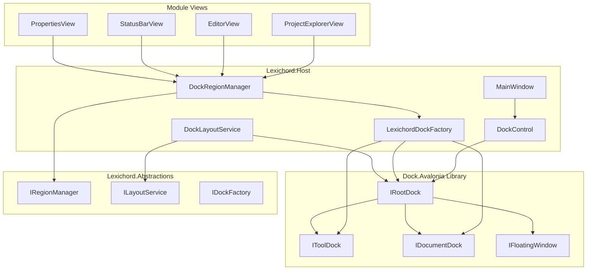
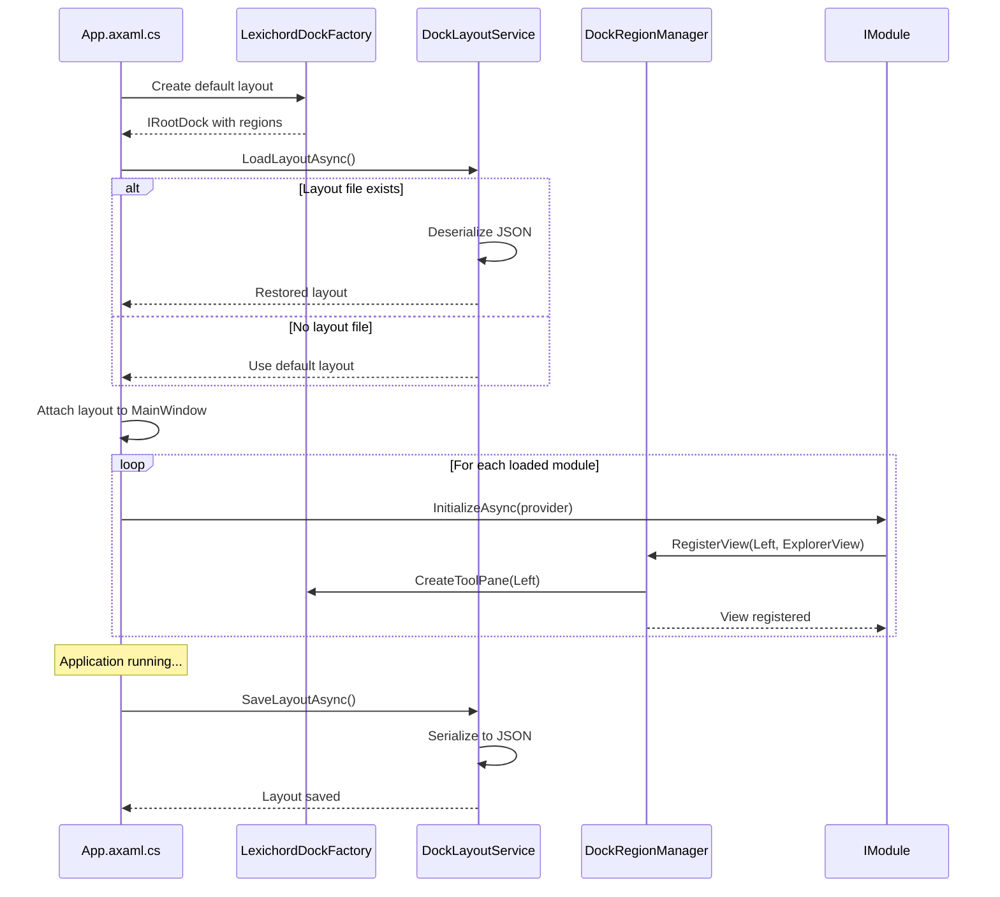

# LCS-INF-011: Feature Design Specification — The Layout Engine

## 1. Metadata & Categorization

| Field                | Value                                    | Description                                           |
| :------------------- | :--------------------------------------- | :---------------------------------------------------- |
| **Feature ID**       | `INF-011`                                | Infrastructure - Layout Engine                        |
| **Feature Name**     | The Layout Engine (Docking System)       | Dynamic, resizable docking interface                  |
| **Target Version**   | `v0.1.1`                                 | Workspace Foundation Milestone                        |
| **Module Scope**     | `Lexichord.Host`                         | Core shell infrastructure                             |
| **Swimlane**         | `Infrastructure`                         | The Podium (Platform)                                 |
| **License Tier**     | `Core`                                   | Foundation (Required for all tiers)                   |
| **Feature Gate Key** | N/A                                      | No runtime gating for layout engine                   |
| **Author**           | System Architect                         |                                                       |
| **Status**           | **Draft**                                | Pending implementation                                |
| **Last Updated**     | 2026-01-26                               |                                                       |

---

## 2. Executive Summary

### 2.1 The Requirement

The v0.0.2 Host Shell uses a **static grid layout** that cannot be resized or rearranged by users. This limitation prevents:

- Users from customizing their workspace to match their workflow
- Modules from dynamically contributing UI panels
- Layout persistence across application restarts
- Professional-grade UX expected in modern writing tools

Writers and developers expect the flexibility of Visual Studio, VS Code, or JetBrains IDEs where panels can be docked, floated, resized, and tabbed.

### 2.2 The Proposed Solution

We **SHALL** implement a complete docking system with:

1. **v0.1.1a: Dock Library Integration** — Replace the static grid with `Dock.Avalonia`.
2. **v0.1.1b: Region Injection Service** — Allow modules to inject views without dock coupling.
3. **v0.1.1c: Layout Serialization** — Persist and restore layout state across sessions.
4. **v0.1.1d: Tab Infrastructure** — Professional tab behaviors: drag, tear-out, pin.

---

## 3. Architecture & Modular Strategy

### 3.1 High-Level Architecture



### 3.2 Layout Lifecycle Sequence



### 3.3 Dependencies

**NuGet Packages:**

| Package | Version | Purpose |
|:--------|:--------|:--------|
| `Dock.Avalonia` | 11.x | Core docking library |
| `Dock.Model.Avalonia` | 11.x | Dock model definitions |
| `Dock.Serializer.Json` | 11.x | JSON serialization support |

**Project References:**

| Project | Reference Direction |
|:--------|:--------------------|
| `Lexichord.Host` | → `Lexichord.Abstractions` |
| `Lexichord.Host` | → `Dock.Avalonia` (NuGet) |
| All Modules | → `Lexichord.Abstractions` |

### 3.4 Licensing Behavior

- **N/A for Layout Engine:** Core infrastructure available to all tiers.
- Layout profiles (multiple saved layouts) may be gated to WriterPro in future.

---

## 4. Decision Tree: Layout Operations

```text
START: "How should this layout operation proceed?"
│
├── Application Startup
│   ├── Does layout file exist?
│   │   ├── YES → Attempt to load and deserialize
│   │   │   ├── Valid JSON → Apply restored layout
│   │   │   └── Invalid/Corrupt → Log warning, use default
│   │   └── NO → Use default layout from factory
│   └── Continue with module initialization
│
├── Module Registers View
│   ├── Is target region available?
│   │   ├── YES → Add view to region
│   │   │   ├── Is region collapsed? → Expand region
│   │   │   └── Region visible → Add as tab
│   │   └── NO → Queue for later, log warning
│   └── Publish ViewRegisteredEvent
│
├── User Drags Tab
│   ├── Drag within same dock?
│   │   └── YES → Reorder tabs
│   ├── Drag to different dock region?
│   │   └── YES → Move tab to new region
│   ├── Drag outside window?
│   │   └── YES → Create floating window
│   └── Update layout state
│
├── User Closes Tab
│   ├── Is document dirty?
│   │   ├── YES → Show save confirmation
│   │   │   ├── Save → Save and close
│   │   │   ├── Discard → Close without save
│   │   │   └── Cancel → Keep tab open
│   │   └── NO → Close immediately
│   └── Update layout state
│
├── Application Shutdown
│   ├── Any dirty documents?
│   │   ├── YES → Show bulk save dialog
│   │   └── NO → Continue
│   └── Save layout to file
│
└── END
```

---

## 5. Data Contracts

### 5.1 IDockFactory Interface

```csharp
namespace Lexichord.Abstractions.Contracts;

/// <summary>
/// Factory for creating and managing dock layouts.
/// </summary>
/// <remarks>
/// LOGIC: The dock factory abstracts the Dock.Avalonia library from modules.
/// Modules interact with IRegionManager, which internally uses IDockFactory.
/// This separation allows swapping dock implementations without module changes.
/// </remarks>
public interface IDockFactory
{
    /// <summary>
    /// Creates the default application layout.
    /// </summary>
    /// <returns>The root dock containing all default regions.</returns>
    /// <remarks>
    /// LOGIC: Default layout structure:
    /// - Top: Empty (reserved for toolbar)
    /// - Left: Tool region (Project Explorer)
    /// - Center: Document region (Editors)
    /// - Right: Tool region (Properties, RAG)
    /// - Bottom: Tool region (Output, Status)
    /// </remarks>
    IRootDock CreateDefaultLayout();

    /// <summary>
    /// Creates a document dockable for the center region.
    /// </summary>
    /// <param name="id">Unique identifier for the document.</param>
    /// <param name="title">Display title for the tab.</param>
    /// <param name="content">The view content to display.</param>
    /// <returns>A dockable document.</returns>
    IDocument CreateDocument(string id, string title, object content);

    /// <summary>
    /// Creates a tool pane for a side region.
    /// </summary>
    /// <param name="region">The target shell region.</param>
    /// <param name="id">Unique identifier for the tool.</param>
    /// <param name="title">Display title for the tool.</param>
    /// <param name="content">The view content to display.</param>
    /// <returns>A dockable tool.</returns>
    ITool CreateTool(ShellRegion region, string id, string title, object content);
}

/// <summary>
/// Represents a dockable document in the center region.
/// </summary>
public interface IDocument : IDockable
{
    /// <summary>
    /// Gets whether the document has unsaved changes.
    /// </summary>
    bool IsDirty { get; }

    /// <summary>
    /// Gets or sets whether the tab is pinned.
    /// </summary>
    bool IsPinned { get; set; }

    /// <summary>
    /// Called before the document is closed.
    /// </summary>
    /// <returns>True if the document can be closed.</returns>
    Task<bool> CanCloseAsync();
}

/// <summary>
/// Represents a dockable tool in a side region.
/// </summary>
public interface ITool : IDockable
{
    /// <summary>
    /// Gets the preferred region for this tool.
    /// </summary>
    ShellRegion PreferredRegion { get; }

    /// <summary>
    /// Gets the minimum width for this tool pane.
    /// </summary>
    double MinWidth { get; }

    /// <summary>
    /// Gets the minimum height for this tool pane.
    /// </summary>
    double MinHeight { get; }
}
```

### 5.2 IRegionManager Interface

```csharp
namespace Lexichord.Abstractions.Contracts;

/// <summary>
/// Manages view registration and activation in dock regions.
/// </summary>
/// <remarks>
/// LOGIC: IRegionManager is the primary interface for modules to contribute UI.
/// It abstracts the underlying dock implementation so modules don't couple to
/// Dock.Avalonia directly. This supports the modular monolith architecture.
///
/// View Registration Flow:
/// 1. Module calls RegisterView during InitializeAsync
/// 2. RegionManager creates dockable wrapper
/// 3. View is added to appropriate dock region
/// 4. ViewChanged event is published
/// </remarks>
public interface IRegionManager
{
    /// <summary>
    /// Registers a view type for a specific region.
    /// </summary>
    /// <typeparam name="TView">The view type to register.</typeparam>
    /// <param name="region">The target shell region.</param>
    /// <param name="options">Optional registration options.</param>
    /// <remarks>
    /// LOGIC: View is not instantiated until the region is activated.
    /// This supports lazy loading of module views.
    /// </remarks>
    void RegisterView<TView>(ShellRegion region, RegionViewOptions? options = null)
        where TView : class;

    /// <summary>
    /// Registers a pre-created view instance.
    /// </summary>
    /// <param name="region">The target shell region.</param>
    /// <param name="view">The view instance to register.</param>
    /// <param name="options">Optional registration options.</param>
    void RegisterViewInstance(ShellRegion region, object view, RegionViewOptions? options = null);

    /// <summary>
    /// Activates a view in the specified region.
    /// </summary>
    /// <typeparam name="TView">The view type to activate.</typeparam>
    /// <param name="region">The region containing the view.</param>
    /// <returns>True if the view was activated successfully.</returns>
    Task<bool> ActivateViewAsync<TView>(ShellRegion region) where TView : class;

    /// <summary>
    /// Gets all views registered in a region.
    /// </summary>
    /// <param name="region">The region to query.</param>
    /// <returns>List of registered views.</returns>
    IReadOnlyList<RegionViewInfo> GetViews(ShellRegion region);

    /// <summary>
    /// Removes a view from a region.
    /// </summary>
    /// <typeparam name="TView">The view type to remove.</typeparam>
    /// <param name="region">The region containing the view.</param>
    /// <returns>True if the view was removed.</returns>
    bool RemoveView<TView>(ShellRegion region) where TView : class;

    /// <summary>
    /// Collapses or expands a dock region.
    /// </summary>
    /// <param name="region">The region to toggle.</param>
    /// <param name="collapsed">True to collapse, false to expand.</param>
    void SetRegionCollapsed(ShellRegion region, bool collapsed);

    /// <summary>
    /// Event raised when a view is added, removed, or activated.
    /// </summary>
    event EventHandler<RegionViewChangedEventArgs> ViewChanged;
}

/// <summary>
/// Options for view registration.
/// </summary>
/// <param name="Title">Display title in the tab/header.</param>
/// <param name="Order">Sort order within the region (lower = first).</param>
/// <param name="CanClose">Whether the view can be closed by the user.</param>
/// <param name="IsInitiallyVisible">Whether the view is visible on first load.</param>
/// <param name="Icon">Optional icon for the tab.</param>
public record RegionViewOptions(
    string Title,
    int Order = 0,
    bool CanClose = true,
    bool IsInitiallyVisible = true,
    string? Icon = null
);

/// <summary>
/// Information about a registered view.
/// </summary>
/// <param name="ViewType">The type of the view.</param>
/// <param name="Region">The region containing the view.</param>
/// <param name="Options">The registration options.</param>
/// <param name="IsActive">Whether the view is currently active/focused.</param>
public record RegionViewInfo(
    Type ViewType,
    ShellRegion Region,
    RegionViewOptions Options,
    bool IsActive
);

/// <summary>
/// Event args for region view changes.
/// </summary>
public class RegionViewChangedEventArgs : EventArgs
{
    public required ShellRegion Region { get; init; }
    public required Type ViewType { get; init; }
    public required RegionViewChangeType ChangeType { get; init; }
}

/// <summary>
/// Types of region view changes.
/// </summary>
public enum RegionViewChangeType
{
    Added,
    Removed,
    Activated,
    Deactivated
}
```

### 5.3 ILayoutService Interface

```csharp
namespace Lexichord.Abstractions.Contracts;

/// <summary>
/// Service for persisting and restoring dock layout state.
/// </summary>
/// <remarks>
/// LOGIC: Layout state is serialized to JSON and stored in the user's config directory.
/// The service supports multiple layout profiles (e.g., "Writing", "Editing", "Review")
/// but this feature may be gated to WriterPro tier.
///
/// Serialization Strategy:
/// - Use Dock.Avalonia's built-in serialization
/// - Add schema version for migration support
/// - Store view type names for recreation on load
/// </remarks>
public interface ILayoutService
{
    /// <summary>
    /// Saves the current layout to the default profile.
    /// </summary>
    /// <returns>True if save was successful.</returns>
    Task<bool> SaveLayoutAsync();

    /// <summary>
    /// Saves the current layout to a named profile.
    /// </summary>
    /// <param name="profileName">The profile name.</param>
    /// <returns>True if save was successful.</returns>
    Task<bool> SaveLayoutAsync(string profileName);

    /// <summary>
    /// Loads the default layout profile.
    /// </summary>
    /// <returns>True if load was successful.</returns>
    Task<bool> LoadLayoutAsync();

    /// <summary>
    /// Loads a named layout profile.
    /// </summary>
    /// <param name="profileName">The profile name.</param>
    /// <returns>True if load was successful.</returns>
    Task<bool> LoadLayoutAsync(string profileName);

    /// <summary>
    /// Resets the layout to factory defaults.
    /// </summary>
    Task ResetToDefaultAsync();

    /// <summary>
    /// Gets the list of available layout profiles.
    /// </summary>
    /// <returns>List of profile names.</returns>
    IReadOnlyList<string> GetLayoutProfiles();

    /// <summary>
    /// Deletes a layout profile.
    /// </summary>
    /// <param name="profileName">The profile to delete.</param>
    /// <returns>True if deleted successfully.</returns>
    Task<bool> DeleteProfileAsync(string profileName);

    /// <summary>
    /// Gets the current layout schema version.
    /// </summary>
    int SchemaVersion { get; }

    /// <summary>
    /// Event raised when layout changes.
    /// </summary>
    event EventHandler<LayoutChangedEventArgs> LayoutChanged;
}

/// <summary>
/// Event args for layout changes.
/// </summary>
public class LayoutChangedEventArgs : EventArgs
{
    public required LayoutChangeType ChangeType { get; init; }
    public string? ProfileName { get; init; }
}

/// <summary>
/// Types of layout changes.
/// </summary>
public enum LayoutChangeType
{
    Saved,
    Loaded,
    Reset,
    ProfileDeleted
}
```

### 5.4 DocumentViewModel Base Class

```csharp
namespace Lexichord.Abstractions.ViewModels;

using CommunityToolkit.Mvvm.ComponentModel;
using CommunityToolkit.Mvvm.Input;

/// <summary>
/// Base class for document view models in the center dock region.
/// </summary>
/// <remarks>
/// LOGIC: DocumentViewModel provides the foundation for all tabbed documents:
/// - Dirty state tracking (unsaved changes indicator)
/// - Tab pinning support
/// - Close confirmation workflow
/// - Unique identification for serialization
///
/// All editor-type views (Markdown, Code, Settings) should inherit from this.
/// </remarks>
public abstract partial class DocumentViewModel : ObservableObject, IDocument
{
    /// <summary>
    /// Gets the unique identifier for this document.
    /// </summary>
    /// <remarks>
    /// LOGIC: Used for layout serialization and document lookup.
    /// Should be stable across sessions for the same document.
    /// Example: "file://C:/docs/readme.md" or "settings://editor"
    /// </remarks>
    public abstract string Id { get; }

    /// <summary>
    /// Gets the display title for the tab.
    /// </summary>
    /// <remarks>
    /// LOGIC: Should be concise. If IsDirty, the UI will append "*".
    /// Example: "readme.md" or "Settings"
    /// </remarks>
    public abstract string Title { get; }

    /// <summary>
    /// Gets the tooltip text for the tab.
    /// </summary>
    /// <remarks>
    /// LOGIC: Can be longer than Title. Shows on hover.
    /// Example: "C:\Users\Writer\Documents\readme.md"
    /// </remarks>
    public virtual string ToolTip => Title;

    /// <summary>
    /// Gets the icon for the tab.
    /// </summary>
    /// <remarks>
    /// LOGIC: Material Icon name or path to icon resource.
    /// Example: "FileDocument", "Settings", "Code"
    /// </remarks>
    public virtual string? Icon => null;

    /// <summary>
    /// Gets whether this document can be closed.
    /// </summary>
    /// <remarks>
    /// LOGIC: Some documents (like Welcome tab) may not be closable.
    /// </remarks>
    public virtual bool CanClose => true;

    [ObservableProperty]
    [NotifyPropertyChangedFor(nameof(DisplayTitle))]
    private bool _isDirty;

    [ObservableProperty]
    private bool _isPinned;

    /// <summary>
    /// Gets the display title with dirty indicator.
    /// </summary>
    public string DisplayTitle => IsDirty ? $"{Title}*" : Title;

    /// <summary>
    /// Called to determine if the document can be closed.
    /// </summary>
    /// <returns>True if the document can be closed.</returns>
    /// <remarks>
    /// LOGIC: Override to implement save confirmation dialogs.
    /// Default implementation returns true if not dirty.
    /// </remarks>
    public virtual async Task<bool> CanCloseAsync()
    {
        if (!IsDirty)
            return true;

        // Subclasses should show save dialog and return based on user choice
        return await OnSaveConfirmationAsync();
    }

    /// <summary>
    /// Called when the user needs to confirm saving before close.
    /// </summary>
    /// <returns>True if close should proceed.</returns>
    protected virtual Task<bool> OnSaveConfirmationAsync()
    {
        // Default: allow close without saving
        return Task.FromResult(true);
    }

    /// <summary>
    /// Called before the document is closed.
    /// </summary>
    /// <remarks>
    /// LOGIC: Override to perform cleanup, save state, etc.
    /// </remarks>
    public virtual Task OnClosingAsync()
    {
        return Task.CompletedTask;
    }

    /// <summary>
    /// Called when the document becomes the active tab.
    /// </summary>
    public virtual Task OnActivatedAsync()
    {
        return Task.CompletedTask;
    }

    /// <summary>
    /// Called when the document is no longer the active tab.
    /// </summary>
    public virtual Task OnDeactivatedAsync()
    {
        return Task.CompletedTask;
    }

    /// <summary>
    /// Marks the document as dirty.
    /// </summary>
    protected void SetDirty()
    {
        IsDirty = true;
    }

    /// <summary>
    /// Clears the dirty flag.
    /// </summary>
    protected void ClearDirty()
    {
        IsDirty = false;
    }

    /// <summary>
    /// Command to close this document.
    /// </summary>
    [RelayCommand(CanExecute = nameof(CanClose))]
    private async Task CloseAsync()
    {
        if (await CanCloseAsync())
        {
            await OnClosingAsync();
            // The dock system handles actual removal
        }
    }
}
```

### 5.5 Layout Events

```csharp
namespace Lexichord.Abstractions.Events;

using MediatR;

/// <summary>
/// Event published when a view is registered in a region.
/// </summary>
/// <param name="Region">The target region.</param>
/// <param name="ViewType">The type of view registered.</param>
/// <param name="Options">The registration options.</param>
public record ViewRegisteredEvent(
    ShellRegion Region,
    Type ViewType,
    RegionViewOptions Options
) : INotification;

/// <summary>
/// Event published when a view is activated.
/// </summary>
/// <param name="Region">The region containing the view.</param>
/// <param name="ViewType">The type of view activated.</param>
public record ViewActivatedEvent(
    ShellRegion Region,
    Type ViewType
) : INotification;

/// <summary>
/// Event published when layout is saved or loaded.
/// </summary>
/// <param name="ProfileName">The layout profile name.</param>
/// <param name="Operation">Save or Load.</param>
public record LayoutPersistedEvent(
    string ProfileName,
    LayoutOperation Operation
) : INotification;

/// <summary>
/// Layout persistence operations.
/// </summary>
public enum LayoutOperation
{
    Saved,
    Loaded,
    Reset
}

/// <summary>
/// Event published when a document's dirty state changes.
/// </summary>
/// <param name="DocumentId">The document identifier.</param>
/// <param name="IsDirty">Whether the document is now dirty.</param>
public record DocumentDirtyChangedEvent(
    string DocumentId,
    bool IsDirty
) : INotification;
```

---

## 6. Implementation Logic

### 6.1 LexichordDockFactory Implementation

```csharp
using Dock.Avalonia.Controls;
using Dock.Model.Avalonia.Controls;
using Dock.Model.Core;
using Lexichord.Abstractions.Contracts;
using Microsoft.Extensions.Logging;

namespace Lexichord.Host.Services;

/// <summary>
/// Factory for creating Lexichord's default dock layout.
/// </summary>
/// <remarks>
/// LOGIC: This factory encapsulates all Dock.Avalonia-specific code.
/// The rest of the application interacts with abstractions (IRegionManager).
///
/// Default Layout Structure:
/// ┌─────────────────────────────────────────────────────┐
/// │                      Top Toolbar                     │
/// ├────────────┬─────────────────────────┬──────────────┤
/// │            │                         │              │
/// │   Left     │      Center (Docs)      │    Right     │
/// │   200px    │                         │    250px     │
/// │            │                         │              │
/// ├────────────┴─────────────────────────┴──────────────┤
/// │                   Bottom (200px)                     │
/// └─────────────────────────────────────────────────────┘
/// </remarks>
public sealed class LexichordDockFactory(
    ILogger<LexichordDockFactory> logger) : Factory, IDockFactory
{
    private const double LeftPaneWidth = 200;
    private const double RightPaneWidth = 250;
    private const double BottomPaneHeight = 200;

    /// <inheritdoc/>
    public IRootDock CreateDefaultLayout()
    {
        logger.LogInformation("Creating default dock layout");

        // Create document dock (center)
        var documentDock = new DocumentDock
        {
            Id = "Documents",
            Title = "Documents",
            Proportion = double.NaN,
            IsCollapsable = false,
            CanCreateDocument = true
        };

        // Create left tool dock
        var leftToolDock = new ToolDock
        {
            Id = "LeftTools",
            Title = "Explorer",
            Proportion = LeftPaneWidth,
            Alignment = Alignment.Left,
            GripMode = GripMode.Visible
        };

        // Create right tool dock
        var rightToolDock = new ToolDock
        {
            Id = "RightTools",
            Title = "Properties",
            Proportion = RightPaneWidth,
            Alignment = Alignment.Right,
            GripMode = GripMode.Visible
        };

        // Create bottom tool dock
        var bottomToolDock = new ToolDock
        {
            Id = "BottomTools",
            Title = "Output",
            Proportion = BottomPaneHeight,
            Alignment = Alignment.Bottom,
            GripMode = GripMode.Visible
        };

        // Assemble layout
        var mainLayout = new ProportionalDock
        {
            Id = "MainLayout",
            Orientation = Orientation.Horizontal,
            VisibleDockables = CreateList<IDockable>(
                leftToolDock,
                new ProportionalDockSplitter(),
                new ProportionalDock
                {
                    Id = "CenterLayout",
                    Orientation = Orientation.Vertical,
                    VisibleDockables = CreateList<IDockable>(
                        documentDock,
                        new ProportionalDockSplitter(),
                        bottomToolDock
                    )
                },
                new ProportionalDockSplitter(),
                rightToolDock
            )
        };

        // Create root dock
        var rootDock = new RootDock
        {
            Id = "Root",
            Title = "Root",
            ActiveDockable = mainLayout,
            DefaultDockable = mainLayout,
            VisibleDockables = CreateList<IDockable>(mainLayout)
        };

        logger.LogDebug("Default layout created with regions: Left, Center, Right, Bottom");

        return rootDock;
    }

    /// <inheritdoc/>
    public IDocument CreateDocument(string id, string title, object content)
    {
        logger.LogDebug("Creating document: {Id} - {Title}", id, title);

        var document = new DocumentControl
        {
            Id = id,
            Title = title,
            Content = content
        };

        return document;
    }

    /// <inheritdoc/>
    public ITool CreateTool(ShellRegion region, string id, string title, object content)
    {
        logger.LogDebug("Creating tool: {Id} - {Title} for region {Region}", id, title, region);

        var tool = new ToolControl
        {
            Id = id,
            Title = title,
            Content = content
        };

        return tool;
    }

    private static IList<T> CreateList<T>(params T[] items) => new List<T>(items);
}
```

### 6.2 DockRegionManager Implementation

```csharp
using Dock.Model.Core;
using Lexichord.Abstractions.Contracts;
using Lexichord.Abstractions.Events;
using MediatR;
using Microsoft.Extensions.DependencyInjection;
using Microsoft.Extensions.Logging;

namespace Lexichord.Host.Services;

/// <summary>
/// Manages view registration and activation in dock regions.
/// </summary>
/// <remarks>
/// LOGIC: This class bridges modules to the dock system. Modules register views
/// without knowing about Dock.Avalonia. The RegionManager handles:
/// - View instantiation via DI
/// - Dock placement based on region
/// - Event publishing for layout changes
/// </remarks>
public sealed class DockRegionManager(
    IServiceProvider serviceProvider,
    IDockFactory dockFactory,
    IMediator mediator,
    ILogger<DockRegionManager> logger) : IRegionManager
{
    private readonly Dictionary<ShellRegion, List<RegionViewRegistration>> _registrations = new();
    private readonly object _lock = new();
    private IRootDock? _rootDock;

    /// <inheritdoc/>
    public event EventHandler<RegionViewChangedEventArgs>? ViewChanged;

    /// <summary>
    /// Initializes the region manager with the root dock.
    /// </summary>
    /// <param name="rootDock">The root dock from the factory.</param>
    public void Initialize(IRootDock rootDock)
    {
        _rootDock = rootDock;
        logger.LogInformation("Region manager initialized with root dock");
    }

    /// <inheritdoc/>
    public void RegisterView<TView>(ShellRegion region, RegionViewOptions? options = null)
        where TView : class
    {
        options ??= new RegionViewOptions(typeof(TView).Name);

        logger.LogInformation(
            "Registering view {ViewType} in region {Region} with title {Title}",
            typeof(TView).Name, region, options.Title);

        lock (_lock)
        {
            if (!_registrations.ContainsKey(region))
                _registrations[region] = [];

            var registration = new RegionViewRegistration(
                ViewType: typeof(TView),
                Options: options,
                Instance: null // Lazy instantiation
            );

            _registrations[region].Add(registration);
        }

        // Materialize view if region is ready
        if (_rootDock is not null && options.IsInitiallyVisible)
        {
            MaterializeView<TView>(region, options);
        }

        // Publish event
        _ = mediator.Publish(new ViewRegisteredEvent(region, typeof(TView), options));

        ViewChanged?.Invoke(this, new RegionViewChangedEventArgs
        {
            Region = region,
            ViewType = typeof(TView),
            ChangeType = RegionViewChangeType.Added
        });
    }

    /// <inheritdoc/>
    public void RegisterViewInstance(ShellRegion region, object view, RegionViewOptions? options = null)
    {
        var viewType = view.GetType();
        options ??= new RegionViewOptions(viewType.Name);

        logger.LogInformation(
            "Registering view instance {ViewType} in region {Region}",
            viewType.Name, region);

        lock (_lock)
        {
            if (!_registrations.ContainsKey(region))
                _registrations[region] = [];

            var registration = new RegionViewRegistration(
                ViewType: viewType,
                Options: options,
                Instance: view
            );

            _registrations[region].Add(registration);
        }

        // Add to dock immediately since instance is provided
        if (_rootDock is not null)
        {
            AddViewToDock(region, view, options);
        }

        _ = mediator.Publish(new ViewRegisteredEvent(region, viewType, options));
    }

    /// <inheritdoc/>
    public async Task<bool> ActivateViewAsync<TView>(ShellRegion region) where TView : class
    {
        logger.LogDebug("Activating view {ViewType} in region {Region}", typeof(TView).Name, region);

        lock (_lock)
        {
            if (!_registrations.TryGetValue(region, out var views))
                return false;

            var registration = views.FirstOrDefault(r => r.ViewType == typeof(TView));
            if (registration is null)
                return false;

            // TODO: Activate the dockable in Dock.Avalonia
            // This requires finding the dockable and calling SetActiveDockable
        }

        await mediator.Publish(new ViewActivatedEvent(region, typeof(TView)));

        ViewChanged?.Invoke(this, new RegionViewChangedEventArgs
        {
            Region = region,
            ViewType = typeof(TView),
            ChangeType = RegionViewChangeType.Activated
        });

        return true;
    }

    /// <inheritdoc/>
    public IReadOnlyList<RegionViewInfo> GetViews(ShellRegion region)
    {
        lock (_lock)
        {
            if (!_registrations.TryGetValue(region, out var views))
                return [];

            return views.Select(r => new RegionViewInfo(
                r.ViewType,
                region,
                r.Options,
                IsActive: false // TODO: Check actual active state
            )).ToList();
        }
    }

    /// <inheritdoc/>
    public bool RemoveView<TView>(ShellRegion region) where TView : class
    {
        logger.LogInformation("Removing view {ViewType} from region {Region}", typeof(TView).Name, region);

        lock (_lock)
        {
            if (!_registrations.TryGetValue(region, out var views))
                return false;

            var registration = views.FirstOrDefault(r => r.ViewType == typeof(TView));
            if (registration is null)
                return false;

            views.Remove(registration);

            // TODO: Remove from Dock.Avalonia
        }

        ViewChanged?.Invoke(this, new RegionViewChangedEventArgs
        {
            Region = region,
            ViewType = typeof(TView),
            ChangeType = RegionViewChangeType.Removed
        });

        return true;
    }

    /// <inheritdoc/>
    public void SetRegionCollapsed(ShellRegion region, bool collapsed)
    {
        logger.LogDebug("Setting region {Region} collapsed: {Collapsed}", region, collapsed);

        // TODO: Find the tool dock for this region and toggle IsCollapsed
    }

    private void MaterializeView<TView>(ShellRegion region, RegionViewOptions options)
        where TView : class
    {
        var view = serviceProvider.GetRequiredService<TView>();
        AddViewToDock(region, view, options);
    }

    private void AddViewToDock(ShellRegion region, object view, RegionViewOptions options)
    {
        // LOGIC: Map ShellRegion to actual dock container and add the view
        var dockId = region switch
        {
            ShellRegion.Left => "LeftTools",
            ShellRegion.Right => "RightTools",
            ShellRegion.Bottom => "BottomTools",
            ShellRegion.Center => "Documents",
            ShellRegion.Top => "TopTools",
            _ => throw new ArgumentOutOfRangeException(nameof(region))
        };

        if (region == ShellRegion.Center)
        {
            var document = dockFactory.CreateDocument(
                id: view.GetType().FullName!,
                title: options.Title,
                content: view);
            // TODO: Add to document dock
        }
        else
        {
            var tool = dockFactory.CreateTool(
                region: region,
                id: view.GetType().FullName!,
                title: options.Title,
                content: view);
            // TODO: Add to tool dock
        }

        logger.LogDebug("View {ViewType} added to dock region {DockId}", view.GetType().Name, dockId);
    }

    private record RegionViewRegistration(
        Type ViewType,
        RegionViewOptions Options,
        object? Instance
    );
}
```

### 6.3 DockLayoutService Implementation

```csharp
using System.Text.Json;
using Dock.Model.Core;
using Dock.Serializer;
using Lexichord.Abstractions.Contracts;
using Lexichord.Abstractions.Events;
using MediatR;
using Microsoft.Extensions.Logging;

namespace Lexichord.Host.Services;

/// <summary>
/// Service for persisting and restoring dock layout state.
/// </summary>
/// <remarks>
/// LOGIC: Layout state is serialized to JSON using Dock.Avalonia's built-in
/// serialization. We wrap it with metadata (schema version, timestamp) for
/// migration support.
///
/// File Format:
/// {
///   "schemaVersion": 1,
///   "savedAt": "2026-01-26T10:30:00Z",
///   "layout": { ... Dock.Avalonia format ... }
/// }
/// </remarks>
public sealed class DockLayoutService(
    IDockFactory dockFactory,
    IMediator mediator,
    ILogger<DockLayoutService> logger) : ILayoutService
{
    private const int CurrentSchemaVersion = 1;
    private const string DefaultProfileName = "default";

    private readonly string _layoutsPath = GetLayoutsPath();
    private IRootDock? _rootDock;

    /// <inheritdoc/>
    public int SchemaVersion => CurrentSchemaVersion;

    /// <inheritdoc/>
    public event EventHandler<LayoutChangedEventArgs>? LayoutChanged;

    /// <summary>
    /// Initializes the service with the root dock.
    /// </summary>
    public void Initialize(IRootDock rootDock)
    {
        _rootDock = rootDock;
        EnsureLayoutsDirectory();
    }

    /// <inheritdoc/>
    public Task<bool> SaveLayoutAsync() => SaveLayoutAsync(DefaultProfileName);

    /// <inheritdoc/>
    public async Task<bool> SaveLayoutAsync(string profileName)
    {
        if (_rootDock is null)
        {
            logger.LogWarning("Cannot save layout: root dock not initialized");
            return false;
        }

        var filePath = GetProfilePath(profileName);
        logger.LogInformation("Saving layout to {FilePath}", filePath);

        try
        {
            var wrapper = new LayoutWrapper
            {
                SchemaVersion = CurrentSchemaVersion,
                SavedAt = DateTime.UtcNow,
                Layout = _rootDock
            };

            var serializer = new DockSerializer(typeof(List<>));
            var json = serializer.Serialize(wrapper);

            await File.WriteAllTextAsync(filePath, json);

            await mediator.Publish(new LayoutPersistedEvent(profileName, LayoutOperation.Saved));

            LayoutChanged?.Invoke(this, new LayoutChangedEventArgs
            {
                ChangeType = LayoutChangeType.Saved,
                ProfileName = profileName
            });

            logger.LogInformation("Layout saved successfully to profile {Profile}", profileName);
            return true;
        }
        catch (Exception ex)
        {
            logger.LogError(ex, "Failed to save layout to {FilePath}", filePath);
            return false;
        }
    }

    /// <inheritdoc/>
    public Task<bool> LoadLayoutAsync() => LoadLayoutAsync(DefaultProfileName);

    /// <inheritdoc/>
    public async Task<bool> LoadLayoutAsync(string profileName)
    {
        var filePath = GetProfilePath(profileName);
        logger.LogInformation("Loading layout from {FilePath}", filePath);

        if (!File.Exists(filePath))
        {
            logger.LogDebug("Layout file not found, using default layout");
            return false;
        }

        try
        {
            var json = await File.ReadAllTextAsync(filePath);

            var serializer = new DockSerializer(typeof(List<>));
            var wrapper = serializer.Deserialize<LayoutWrapper>(json);

            if (wrapper is null)
            {
                logger.LogWarning("Failed to deserialize layout file");
                return false;
            }

            // Check for schema migration
            if (wrapper.SchemaVersion < CurrentSchemaVersion)
            {
                logger.LogInformation(
                    "Migrating layout from schema {Old} to {New}",
                    wrapper.SchemaVersion, CurrentSchemaVersion);
                // TODO: Implement migration logic
            }

            _rootDock = wrapper.Layout;

            await mediator.Publish(new LayoutPersistedEvent(profileName, LayoutOperation.Loaded));

            LayoutChanged?.Invoke(this, new LayoutChangedEventArgs
            {
                ChangeType = LayoutChangeType.Loaded,
                ProfileName = profileName
            });

            logger.LogInformation("Layout loaded successfully from profile {Profile}", profileName);
            return true;
        }
        catch (Exception ex)
        {
            logger.LogError(ex, "Failed to load layout from {FilePath}", filePath);
            return false;
        }
    }

    /// <inheritdoc/>
    public async Task ResetToDefaultAsync()
    {
        logger.LogInformation("Resetting layout to defaults");

        _rootDock = dockFactory.CreateDefaultLayout();

        await mediator.Publish(new LayoutPersistedEvent(DefaultProfileName, LayoutOperation.Reset));

        LayoutChanged?.Invoke(this, new LayoutChangedEventArgs
        {
            ChangeType = LayoutChangeType.Reset
        });
    }

    /// <inheritdoc/>
    public IReadOnlyList<string> GetLayoutProfiles()
    {
        EnsureLayoutsDirectory();

        return Directory.GetFiles(_layoutsPath, "*.json")
            .Select(Path.GetFileNameWithoutExtension)
            .Where(name => name is not null)
            .Cast<string>()
            .ToList();
    }

    /// <inheritdoc/>
    public async Task<bool> DeleteProfileAsync(string profileName)
    {
        if (profileName == DefaultProfileName)
        {
            logger.LogWarning("Cannot delete the default profile");
            return false;
        }

        var filePath = GetProfilePath(profileName);

        if (!File.Exists(filePath))
            return false;

        try
        {
            File.Delete(filePath);

            LayoutChanged?.Invoke(this, new LayoutChangedEventArgs
            {
                ChangeType = LayoutChangeType.ProfileDeleted,
                ProfileName = profileName
            });

            return true;
        }
        catch (Exception ex)
        {
            logger.LogError(ex, "Failed to delete profile {Profile}", profileName);
            return false;
        }
    }

    private string GetProfilePath(string profileName)
        => Path.Combine(_layoutsPath, $"{profileName}.json");

    private void EnsureLayoutsDirectory()
    {
        if (!Directory.Exists(_layoutsPath))
            Directory.CreateDirectory(_layoutsPath);
    }

    private static string GetLayoutsPath()
    {
        var appData = Environment.GetFolderPath(Environment.SpecialFolder.ApplicationData);
        return Path.Combine(appData, "Lexichord", "layouts");
    }

    private record LayoutWrapper
    {
        public int SchemaVersion { get; init; }
        public DateTime SavedAt { get; init; }
        public IRootDock? Layout { get; init; }
    }
}
```

---

## 7. Use Cases & User Stories

### 7.1 User Stories

| ID | Role | Story | Acceptance Criteria |
|:---|:-----|:------|:--------------------|
| US-01 | Writer | As a writer, I want to resize panels to focus on my content. | Panels resize by dragging splitters. |
| US-02 | Writer | As a writer, I want my layout saved between sessions. | Layout persists after restart. |
| US-03 | Writer | As a writer, I want to drag tabs to rearrange my workspace. | Tabs can be dragged within and between regions. |
| US-04 | Writer | As a writer, I want to tear out a tab into a floating window. | Dragging tab outside creates floating window. |
| US-05 | Writer | As a writer, I want to pin important tabs so they don't close accidentally. | Pinned tabs have lock icon and skip close. |
| US-06 | Developer | As a module developer, I want to register views in specific regions. | IRegionManager.RegisterView works from modules. |
| US-07 | Developer | As a developer, I want layout changes logged for debugging. | Serilog captures all layout operations. |

### 7.2 Use Cases

#### UC-01: First Launch (No Saved Layout)

**Preconditions:**
- Fresh Lexichord installation.
- No layout file exists.

**Flow:**
1. User launches Lexichord.
2. LayoutService attempts to load default profile.
3. No file found, returns false.
4. DockFactory creates default layout.
5. MainWindow displays default layout:
   - Left panel: 200px (collapsed initially)
   - Center: Full document area
   - Right panel: 250px (collapsed initially)
   - Bottom: 200px (collapsed initially)
6. User sees clean workspace.

**Postconditions:**
- Default layout is active.
- No layout file exists yet (saved on exit).

---

#### UC-02: Layout Persistence

**Preconditions:**
- User has customized layout.
- Application is running.

**Flow:**
1. User resizes left panel to 300px.
2. User opens Properties panel on right.
3. User drags Output panel to right side.
4. User closes application.
5. Shutdown hook calls LayoutService.SaveLayoutAsync().
6. Layout serialized to JSON file.
7. Application exits.
8. User relaunches application.
9. LayoutService.LoadLayoutAsync() succeeds.
10. Restored layout shows:
    - Left panel: 300px
    - Right panel: Properties + Output tabs
    - Same positions as before exit.

**Postconditions:**
- Layout exactly matches saved state.
- User's customizations preserved.

---

#### UC-03: Module Registers View

**Preconditions:**
- Lexichord is starting up.
- ProjectExplorerModule is being initialized.

**Flow:**
1. Host calls module.InitializeAsync(provider).
2. Module resolves IRegionManager from DI.
3. Module calls:
   ```csharp
   regionManager.RegisterView<ProjectExplorerView>(
       ShellRegion.Left,
       new RegionViewOptions("Explorer", Order: 0, Icon: "FolderOpen"));
   ```
4. RegionManager creates ProjectExplorerView via DI.
5. RegionManager adds view to Left tool dock.
6. ViewRegisteredEvent published via MediatR.
7. Left panel expands if collapsed.
8. Project Explorer tab appears.

**Postconditions:**
- Project Explorer visible in Left region.
- Tab shows "Explorer" title with folder icon.
- Other modules can register in same region (tabbed).

---

## 8. Observability & Logging

### 8.1 Log Events

| Level | Context | Message Template |
|:------|:--------|:-----------------|
| Information | LexichordDockFactory | `Creating default dock layout` |
| Debug | LexichordDockFactory | `Default layout created with regions: {Regions}` |
| Debug | LexichordDockFactory | `Creating document: {Id} - {Title}` |
| Debug | LexichordDockFactory | `Creating tool: {Id} - {Title} for region {Region}` |
| Information | DockRegionManager | `Region manager initialized with root dock` |
| Information | DockRegionManager | `Registering view {ViewType} in region {Region} with title {Title}` |
| Debug | DockRegionManager | `Activating view {ViewType} in region {Region}` |
| Information | DockRegionManager | `Removing view {ViewType} from region {Region}` |
| Debug | DockRegionManager | `Setting region {Region} collapsed: {Collapsed}` |
| Debug | DockRegionManager | `View {ViewType} added to dock region {DockId}` |
| Information | DockLayoutService | `Saving layout to {FilePath}` |
| Information | DockLayoutService | `Layout saved successfully to profile {Profile}` |
| Error | DockLayoutService | `Failed to save layout to {FilePath}` |
| Information | DockLayoutService | `Loading layout from {FilePath}` |
| Debug | DockLayoutService | `Layout file not found, using default layout` |
| Warning | DockLayoutService | `Failed to deserialize layout file` |
| Information | DockLayoutService | `Migrating layout from schema {Old} to {New}` |
| Information | DockLayoutService | `Layout loaded successfully from profile {Profile}` |
| Error | DockLayoutService | `Failed to load layout from {FilePath}` |
| Information | DockLayoutService | `Resetting layout to defaults` |
| Warning | DockLayoutService | `Cannot delete the default profile` |

---

## 9. Unit Testing Requirements

### 9.1 DockFactory Tests

```csharp
[TestFixture]
[Category("Unit")]
public class LexichordDockFactoryTests
{
    private Mock<ILogger<LexichordDockFactory>> _mockLogger = null!;
    private LexichordDockFactory _sut = null!;

    [SetUp]
    public void SetUp()
    {
        _mockLogger = new Mock<ILogger<LexichordDockFactory>>();
        _sut = new LexichordDockFactory(_mockLogger.Object);
    }

    [Test]
    public void CreateDefaultLayout_ReturnsRootDock()
    {
        // Act
        var result = _sut.CreateDefaultLayout();

        // Assert
        Assert.That(result, Is.Not.Null);
        Assert.That(result, Is.InstanceOf<IRootDock>());
    }

    [Test]
    public void CreateDefaultLayout_ContainsAllRegions()
    {
        // Act
        var root = _sut.CreateDefaultLayout();

        // Assert
        Assert.That(root.VisibleDockables, Is.Not.Empty);
        // Verify Left, Center, Right, Bottom docks exist
    }

    [Test]
    public void CreateDocument_ReturnsDocumentWithCorrectProperties()
    {
        // Arrange
        var id = "test-doc";
        var title = "Test Document";
        var content = new object();

        // Act
        var result = _sut.CreateDocument(id, title, content);

        // Assert
        Assert.Multiple(() =>
        {
            Assert.That(result.Id, Is.EqualTo(id));
            Assert.That(result.Title, Is.EqualTo(title));
        });
    }

    [Test]
    public void CreateTool_ReturnsToolWithCorrectRegion()
    {
        // Arrange
        var region = ShellRegion.Left;
        var id = "test-tool";
        var title = "Test Tool";
        var content = new object();

        // Act
        var result = _sut.CreateTool(region, id, title, content);

        // Assert
        Assert.Multiple(() =>
        {
            Assert.That(result.Id, Is.EqualTo(id));
            Assert.That(result.Title, Is.EqualTo(title));
            Assert.That(result.PreferredRegion, Is.EqualTo(region));
        });
    }
}
```

### 9.2 RegionManager Tests

```csharp
[TestFixture]
[Category("Unit")]
public class DockRegionManagerTests
{
    private Mock<IServiceProvider> _mockProvider = null!;
    private Mock<IDockFactory> _mockFactory = null!;
    private Mock<IMediator> _mockMediator = null!;
    private Mock<ILogger<DockRegionManager>> _mockLogger = null!;
    private DockRegionManager _sut = null!;

    [SetUp]
    public void SetUp()
    {
        _mockProvider = new Mock<IServiceProvider>();
        _mockFactory = new Mock<IDockFactory>();
        _mockMediator = new Mock<IMediator>();
        _mockLogger = new Mock<ILogger<DockRegionManager>>();

        _sut = new DockRegionManager(
            _mockProvider.Object,
            _mockFactory.Object,
            _mockMediator.Object,
            _mockLogger.Object);
    }

    [Test]
    public void RegisterView_AddsToRegistrations()
    {
        // Arrange
        var options = new RegionViewOptions("Test", IsInitiallyVisible: false);

        // Act
        _sut.RegisterView<TestView>(ShellRegion.Left, options);

        // Assert
        var views = _sut.GetViews(ShellRegion.Left);
        Assert.That(views, Has.Count.EqualTo(1));
        Assert.That(views[0].ViewType, Is.EqualTo(typeof(TestView)));
    }

    [Test]
    public void RegisterView_PublishesEvent()
    {
        // Arrange
        var options = new RegionViewOptions("Test", IsInitiallyVisible: false);

        // Act
        _sut.RegisterView<TestView>(ShellRegion.Left, options);

        // Assert
        _mockMediator.Verify(m => m.Publish(
            It.Is<ViewRegisteredEvent>(e =>
                e.Region == ShellRegion.Left &&
                e.ViewType == typeof(TestView)),
            It.IsAny<CancellationToken>()), Times.Once);
    }

    [Test]
    public void RegisterView_RaisesViewChangedEvent()
    {
        // Arrange
        var eventRaised = false;
        _sut.ViewChanged += (s, e) => eventRaised = true;
        var options = new RegionViewOptions("Test", IsInitiallyVisible: false);

        // Act
        _sut.RegisterView<TestView>(ShellRegion.Left, options);

        // Assert
        Assert.That(eventRaised, Is.True);
    }

    [Test]
    public void GetViews_EmptyRegion_ReturnsEmptyList()
    {
        // Act
        var views = _sut.GetViews(ShellRegion.Right);

        // Assert
        Assert.That(views, Is.Empty);
    }

    [Test]
    public void RemoveView_ExistingView_ReturnsTrue()
    {
        // Arrange
        _sut.RegisterView<TestView>(ShellRegion.Left,
            new RegionViewOptions("Test", IsInitiallyVisible: false));

        // Act
        var result = _sut.RemoveView<TestView>(ShellRegion.Left);

        // Assert
        Assert.That(result, Is.True);
        Assert.That(_sut.GetViews(ShellRegion.Left), Is.Empty);
    }

    private class TestView { }
}
```

### 9.3 LayoutService Tests

```csharp
[TestFixture]
[Category("Unit")]
public class DockLayoutServiceTests
{
    private Mock<IDockFactory> _mockFactory = null!;
    private Mock<IMediator> _mockMediator = null!;
    private Mock<ILogger<DockLayoutService>> _mockLogger = null!;
    private string _tempDir = null!;
    private DockLayoutService _sut = null!;

    [SetUp]
    public void SetUp()
    {
        _mockFactory = new Mock<IDockFactory>();
        _mockMediator = new Mock<IMediator>();
        _mockLogger = new Mock<ILogger<DockLayoutService>>();
        _tempDir = Path.Combine(Path.GetTempPath(), Guid.NewGuid().ToString());

        _sut = new DockLayoutService(
            _mockFactory.Object,
            _mockMediator.Object,
            _mockLogger.Object);
    }

    [TearDown]
    public void TearDown()
    {
        if (Directory.Exists(_tempDir))
            Directory.Delete(_tempDir, true);
    }

    [Test]
    public async Task SaveLayoutAsync_NoRootDock_ReturnsFalse()
    {
        // Act (no Initialize called)
        var result = await _sut.SaveLayoutAsync();

        // Assert
        Assert.That(result, Is.False);
    }

    [Test]
    public async Task LoadLayoutAsync_FileNotExists_ReturnsFalse()
    {
        // Act
        var result = await _sut.LoadLayoutAsync();

        // Assert
        Assert.That(result, Is.False);
    }

    [Test]
    public void GetLayoutProfiles_EmptyDirectory_ReturnsEmptyList()
    {
        // Act
        var profiles = _sut.GetLayoutProfiles();

        // Assert
        Assert.That(profiles, Is.Empty.Or.Contains("default").Only);
    }

    [Test]
    public async Task ResetToDefaultAsync_CallsFactory()
    {
        // Arrange
        var mockDock = new Mock<IRootDock>();
        _mockFactory.Setup(f => f.CreateDefaultLayout()).Returns(mockDock.Object);

        // Act
        await _sut.ResetToDefaultAsync();

        // Assert
        _mockFactory.Verify(f => f.CreateDefaultLayout(), Times.Once);
    }

    [Test]
    public async Task DeleteProfileAsync_DefaultProfile_ReturnsFalse()
    {
        // Act
        var result = await _sut.DeleteProfileAsync("default");

        // Assert
        Assert.That(result, Is.False);
    }
}
```

### 9.4 DocumentViewModel Tests

```csharp
[TestFixture]
[Category("Unit")]
public class DocumentViewModelTests
{
    private TestDocumentViewModel _sut = null!;

    [SetUp]
    public void SetUp()
    {
        _sut = new TestDocumentViewModel();
    }

    [Test]
    public void DisplayTitle_NotDirty_ReturnsTitle()
    {
        // Assert
        Assert.That(_sut.DisplayTitle, Is.EqualTo("Test Document"));
    }

    [Test]
    public void DisplayTitle_IsDirty_ReturnsTitleWithStar()
    {
        // Arrange
        _sut.SetDirtyPublic();

        // Assert
        Assert.That(_sut.DisplayTitle, Is.EqualTo("Test Document*"));
    }

    [Test]
    public async Task CanCloseAsync_NotDirty_ReturnsTrue()
    {
        // Act
        var result = await _sut.CanCloseAsync();

        // Assert
        Assert.That(result, Is.True);
    }

    [Test]
    public void IsPinned_DefaultIsFalse()
    {
        // Assert
        Assert.That(_sut.IsPinned, Is.False);
    }

    [Test]
    public void IsPinned_CanBeSet()
    {
        // Act
        _sut.IsPinned = true;

        // Assert
        Assert.That(_sut.IsPinned, Is.True);
    }

    private class TestDocumentViewModel : DocumentViewModel
    {
        public override string Id => "test-doc";
        public override string Title => "Test Document";

        public void SetDirtyPublic() => SetDirty();
    }
}
```

---

## 10. Security & Safety

### 10.1 Layout File Security

> [!NOTE]
> Layout files contain only UI configuration (panel sizes, positions).
> No sensitive data (API keys, user content) is stored in layout files.

### 10.2 View Injection Security

> [!WARNING]
> Only registered modules can inject views. The IRegionManager requires
> DI resolution, which is controlled by the module loader's license checks.

---

## 11. Risks & Mitigations

| Risk | Impact | Mitigation |
|:-----|:-------|:-----------|
| Dock.Avalonia breaking changes | High | Pin version in Directory.Build.props; test before upgrade |
| Layout file corruption | Medium | Validate JSON before deserialize; fallback to default |
| Performance with many panels | Medium | Virtualize tab headers; lazy load view content |
| Memory leaks from views | Medium | Implement IDisposable on views; clean up on tab close |
| Multi-monitor issues | Low | Test floating windows across monitors; graceful fallback |

---

## 12. Acceptance Criteria (QA)

| # | Category | Criterion |
|:--|:---------|:----------|
| 1 | **[Dock]** | DockControl replaces static grid in MainWindow |
| 2 | **[Dock]** | Five regions available: Top, Left, Center, Right, Bottom |
| 3 | **[Dock]** | Panels can be resized by dragging splitters |
| 4 | **[Region]** | Modules can register views via IRegionManager |
| 5 | **[Region]** | Views appear in specified regions |
| 6 | **[Region]** | Multiple views in same region show as tabs |
| 7 | **[Layout]** | Layout saves on application exit |
| 8 | **[Layout]** | Layout restores on application start |
| 9 | **[Layout]** | "Reset Layout" restores defaults |
| 10 | **[Tabs]** | Tabs can be dragged to reorder |
| 11 | **[Tabs]** | Tabs can be torn out to floating windows |
| 12 | **[Tabs]** | Dirty documents show "*" in tab title |
| 13 | **[Tabs]** | Closing dirty document prompts for save |
| 14 | **[Tabs]** | Pinned tabs have visual indicator |
| 15 | **[Logging]** | All layout operations logged with appropriate levels |

---

## 13. Verification Commands

```bash
# 1. Build all projects
dotnet build

# 2. Run application and verify dock layout appears
dotnet run --project src/Lexichord.Host

# 3. Verify layout file is created on exit
ls ~/.config/Lexichord/layouts/
# Expected: default.json

# 4. View layout file contents
cat ~/.config/Lexichord/layouts/default.json | jq .

# 5. Run unit tests for layout components
dotnet test --filter "FullyQualifiedName~Layout"

# 6. Run unit tests for region manager
dotnet test --filter "FullyQualifiedName~Region"

# 7. Run unit tests for dock factory
dotnet test --filter "FullyQualifiedName~Dock"

# 8. Check for memory leaks (requires profiler)
# dotMemory attach to Lexichord.Host process
# Open/close multiple tabs, verify no orphaned views
```

---

## 14. Deliverable Checklist

| Step | Description | Status |
|:-----|:------------|:-------|
| 1 | Install Dock.Avalonia NuGet packages | [ ] |
| 2 | Define IDockFactory interface in Abstractions | [ ] |
| 3 | Implement LexichordDockFactory in Host | [ ] |
| 4 | Replace MainWindow grid with DockControl | [ ] |
| 5 | Define IRegionManager interface in Abstractions | [ ] |
| 6 | Implement DockRegionManager in Host | [ ] |
| 7 | Define ILayoutService interface in Abstractions | [ ] |
| 8 | Implement DockLayoutService in Host | [ ] |
| 9 | Create DocumentViewModel base class | [ ] |
| 10 | Wire up tab drag-and-drop | [ ] |
| 11 | Implement tab tear-out to floating windows | [ ] |
| 12 | Implement tab pinning | [ ] |
| 13 | Add layout save on shutdown | [ ] |
| 14 | Add layout load on startup | [ ] |
| 15 | Add "Reset Layout" command | [ ] |
| 16 | Define MediatR events for layout changes | [ ] |
| 17 | Unit tests for LexichordDockFactory | [ ] |
| 18 | Unit tests for DockRegionManager | [ ] |
| 19 | Unit tests for DockLayoutService | [ ] |
| 20 | Unit tests for DocumentViewModel | [ ] |
| 21 | Integration tests for layout persistence | [ ] |
| 22 | Update CHANGELOG.md | [ ] |
