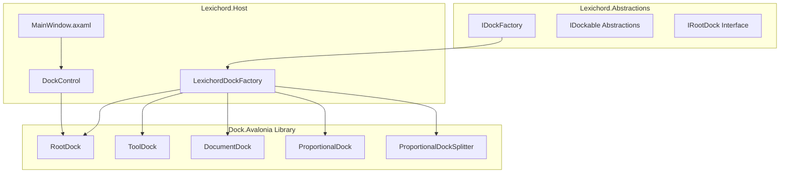
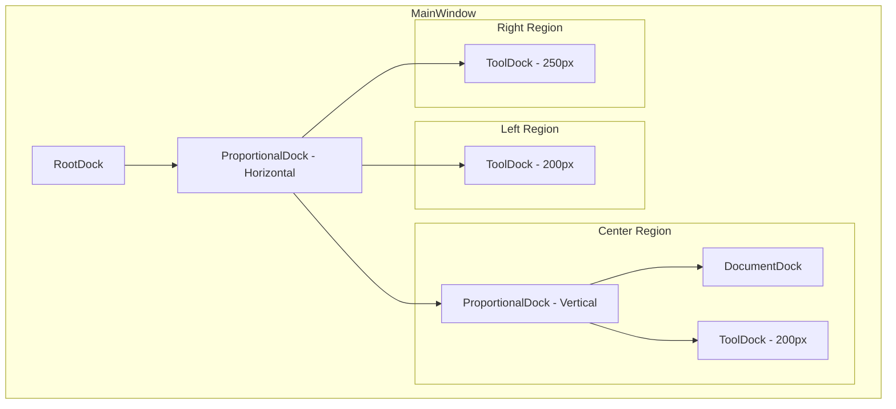
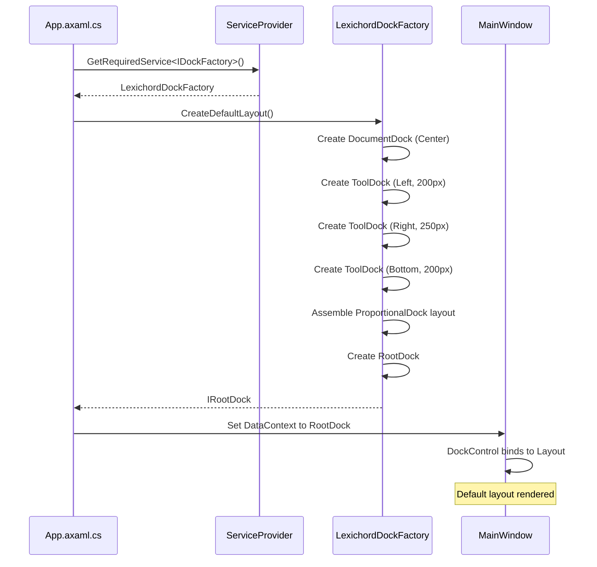

# LCS-INF-011a: Dock Library Integration

## 1. Metadata & Categorization

| Field                | Value                                    | Description                                        |
| :------------------- | :--------------------------------------- | :------------------------------------------------- |
| **Feature ID**       | `INF-011a`                               | Infrastructure - Dock Library Setup                |
| **Feature Name**     | Dock Library Integration                 | Install Dock.Avalonia and create dock factory      |
| **Target Version**   | `v0.1.1`                                 | Workspace Foundation Milestone                     |
| **Module Scope**     | `Lexichord.Host`                         | Core shell infrastructure                          |
| **Swimlane**         | `Infrastructure`                         | The Podium (Platform)                              |
| **License Tier**     | `Core`                                   | Foundation (Required for all tiers)                |
| **Feature Gate Key** | N/A                                      | No runtime gating for dock infrastructure          |
| **Author**           | System Architect                         |                                                    |
| **Status**           | **Draft**                                | Pending implementation                             |
| **Last Updated**     | 2026-01-26                               |                                                    |

---

## 2. Executive Summary

### 2.1 The Requirement

The v0.0.2 Host Shell uses a **static grid layout** that cannot be resized or rearranged by users. To transform Lexichord into a professional writing environment, we need:

- A **docking system** that supports resizable panels like Visual Studio or VS Code.
- A **factory pattern** to create the default layout with five distinct regions.
- **Abstraction layer** so modules don't couple directly to Dock.Avalonia.
- **MainWindow integration** replacing the static grid with a DockControl.

Without this foundation:
- Users cannot customize their workspace.
- Future modules cannot inject views dynamically.
- Layout persistence (v0.1.1c) has nothing to serialize.
- Professional UX expectations cannot be met.

### 2.2 The Proposed Solution

We **SHALL** implement Dock.Avalonia integration with:

1. **Install NuGet Packages** - Add Dock.Avalonia, Dock.Model.Avalonia dependencies.
2. **Define IDockFactory** - Abstraction for creating dock layouts in Lexichord.Abstractions.
3. **Implement LexichordDockFactory** - Create default layout with 5 regions (Top, Left, Center, Right, Bottom).
4. **Update MainWindow** - Replace static grid with DockControl from the factory.

---

## 3. Architecture & Modular Strategy

### 3.1 High-Level Architecture



### 3.2 Default Layout Structure



### 3.3 Factory Creation Sequence



### 3.4 Dependencies

**NuGet Packages:**

| Package | Version | Purpose |
|:--------|:--------|:--------|
| `Dock.Avalonia` | 11.1.0.1 | Core docking library for Avalonia |
| `Dock.Model.Avalonia` | 11.1.0.1 | Dock model definitions and controls |
| `Dock.Model.Mvvm` | 11.1.0.1 | MVVM integration for dock models |

**Project References:**

| Project | Reference Direction |
|:--------|:--------------------|
| `Lexichord.Host` | -> `Lexichord.Abstractions` |
| `Lexichord.Host` | -> `Dock.Avalonia` (NuGet) |
| All Modules | -> `Lexichord.Abstractions` only |

### 3.5 Licensing Behavior

- **N/A:** Dock infrastructure is Core foundation required by all tiers.
- Multiple saved layout profiles may be gated to WriterPro in future.

---

## 4. Decision Tree: Dock Factory Operations

```text
START: "How should the dock layout be created?"
│
├── Application Startup
│   ├── Is this first launch?
│   │   └── YES → Call factory.CreateDefaultLayout()
│   │       ├── Create DocumentDock for center
│   │       ├── Create ToolDocks for Left (200px), Right (250px), Bottom (200px)
│   │       ├── Assemble ProportionalDock hierarchy
│   │       └── Return IRootDock
│   │
│   └── Saved layout exists?
│       └── YES → v0.1.1c handles restoration
│
├── Factory.CreateDocument()
│   ├── Generate unique ID for document
│   ├── Create Document wrapper with content
│   ├── Set title and tooltip
│   └── Return IDocument
│
├── Factory.CreateTool()
│   ├── Map ShellRegion to dock ID
│   ├── Create Tool wrapper with content
│   ├── Set preferred region
│   └── Return ITool
│
└── Factory.GetDockById()
    ├── Search RootDock hierarchy
    ├── Find matching dock by ID
    └── Return IDockable or null
```

---

## 5. Data Contracts

### 5.1 IDockFactory Interface

```csharp
namespace Lexichord.Abstractions.Layout;

using Dock.Model.Core;

/// <summary>
/// Factory for creating and managing dock layouts in Lexichord.
/// </summary>
/// <remarks>
/// LOGIC: The dock factory abstracts the Dock.Avalonia library from modules.
/// Modules interact with IRegionManager (v0.1.1b), which internally uses IDockFactory.
/// This separation allows swapping dock implementations without module changes.
///
/// Key Design Decisions:
/// - Factory creates default layout with 5 regions
/// - Documents go in center DocumentDock
/// - Tools go in ToolDocks based on ShellRegion
/// - All dockables have unique IDs for serialization
/// </remarks>
public interface IDockFactory
{
    /// <summary>
    /// Creates the default application layout with all standard regions.
    /// </summary>
    /// <returns>The root dock containing all default regions.</returns>
    /// <remarks>
    /// LOGIC: Default layout structure:
    /// - Left: ToolDock (200px) - Project Explorer, Outline
    /// - Center: DocumentDock - Editors, Documents
    /// - Right: ToolDock (250px) - Properties, RAG, Style
    /// - Bottom: ToolDock (200px) - Output, Problems, Terminal
    ///
    /// Top region is reserved but not created by default (for future toolbar).
    /// </remarks>
    IRootDock CreateDefaultLayout();

    /// <summary>
    /// Creates a document dockable for the center region.
    /// </summary>
    /// <param name="id">Unique identifier for the document.</param>
    /// <param name="title">Display title for the tab.</param>
    /// <param name="content">The view content to display.</param>
    /// <returns>A dockable document that can be added to DocumentDock.</returns>
    /// <remarks>
    /// LOGIC: Documents are the primary content type - editors, viewers, settings.
    /// They support tabbing, drag-drop, and tear-out to floating windows.
    /// </remarks>
    IDocument CreateDocument(string id, string title, object content);

    /// <summary>
    /// Creates a tool pane for a side region.
    /// </summary>
    /// <param name="region">The target shell region (Left, Right, Bottom).</param>
    /// <param name="id">Unique identifier for the tool.</param>
    /// <param name="title">Display title for the tool.</param>
    /// <param name="content">The view content to display.</param>
    /// <returns>A dockable tool that can be added to ToolDock.</returns>
    /// <remarks>
    /// LOGIC: Tools are auxiliary panels - explorers, properties, output.
    /// They can be collapsed, pinned to auto-hide, or floated.
    /// </remarks>
    ITool CreateTool(ShellRegion region, string id, string title, object content);

    /// <summary>
    /// Finds a dockable by its unique identifier.
    /// </summary>
    /// <param name="id">The dock ID to search for.</param>
    /// <returns>The dockable if found, null otherwise.</returns>
    /// <remarks>
    /// LOGIC: Used for programmatic navigation and activation.
    /// Searches the entire dock hierarchy starting from root.
    /// </remarks>
    IDockable? FindDockable(string id);

    /// <summary>
    /// Gets the root dock for the current layout.
    /// </summary>
    /// <remarks>
    /// LOGIC: The root dock is created once and persists for the application lifetime.
    /// It's set after CreateDefaultLayout or LoadLayout.
    /// </remarks>
    IRootDock? RootDock { get; }

    /// <summary>
    /// Gets the document dock in the center region.
    /// </summary>
    IDocumentDock? DocumentDock { get; }

    /// <summary>
    /// Gets the tool dock for a specific region.
    /// </summary>
    /// <param name="region">The shell region.</param>
    /// <returns>The tool dock for that region, or null if not found.</returns>
    IToolDock? GetToolDock(ShellRegion region);
}
```

### 5.2 Dock Region Configuration

```csharp
namespace Lexichord.Abstractions.Layout;

/// <summary>
/// Configuration for a dock region's default dimensions and behavior.
/// </summary>
/// <param name="Region">The shell region this configuration applies to.</param>
/// <param name="DefaultWidth">Default width in pixels (for Left/Right regions).</param>
/// <param name="DefaultHeight">Default height in pixels (for Top/Bottom regions).</param>
/// <param name="MinWidth">Minimum width constraint.</param>
/// <param name="MinHeight">Minimum height constraint.</param>
/// <param name="IsCollapsible">Whether the region can be collapsed.</param>
/// <param name="DefaultCollapsed">Whether the region starts collapsed.</param>
/// <remarks>
/// LOGIC: These configurations define the default behavior of each region.
/// Users can override via drag-and-drop, and settings persist via ILayoutService.
/// </remarks>
public record DockRegionConfig(
    ShellRegion Region,
    double DefaultWidth = double.NaN,
    double DefaultHeight = double.NaN,
    double MinWidth = 150,
    double MinHeight = 100,
    bool IsCollapsible = true,
    bool DefaultCollapsed = false
)
{
    /// <summary>
    /// Default configuration for the Left region.
    /// </summary>
    public static readonly DockRegionConfig Left = new(
        Region: ShellRegion.Left,
        DefaultWidth: 200,
        MinWidth: 150,
        IsCollapsible: true,
        DefaultCollapsed: false
    );

    /// <summary>
    /// Default configuration for the Right region.
    /// </summary>
    public static readonly DockRegionConfig Right = new(
        Region: ShellRegion.Right,
        DefaultWidth: 250,
        MinWidth: 180,
        IsCollapsible: true,
        DefaultCollapsed: true
    );

    /// <summary>
    /// Default configuration for the Bottom region.
    /// </summary>
    public static readonly DockRegionConfig Bottom = new(
        Region: ShellRegion.Bottom,
        DefaultHeight: 200,
        MinHeight: 100,
        IsCollapsible: true,
        DefaultCollapsed: true
    );

    /// <summary>
    /// Default configuration for the Center region.
    /// </summary>
    public static readonly DockRegionConfig Center = new(
        Region: ShellRegion.Center,
        IsCollapsible: false
    );
}
```

### 5.3 Document and Tool Interfaces

```csharp
namespace Lexichord.Abstractions.Layout;

using Dock.Model.Core;

/// <summary>
/// Extended interface for document dockables with Lexichord-specific properties.
/// </summary>
/// <remarks>
/// LOGIC: IDocument extends Dock.Avalonia's IDockable with properties
/// needed for document management: dirty state, pinning, and close confirmation.
/// </remarks>
public interface IDocument : IDockable
{
    /// <summary>
    /// Gets whether the document has unsaved changes.
    /// </summary>
    /// <remarks>
    /// LOGIC: When true, tab title shows "*" suffix and close confirmation is required.
    /// </remarks>
    bool IsDirty { get; }

    /// <summary>
    /// Gets or sets whether the tab is pinned.
    /// </summary>
    /// <remarks>
    /// LOGIC: Pinned tabs appear first and cannot be closed accidentally.
    /// They persist across "Close All" operations.
    /// </remarks>
    bool IsPinned { get; set; }

    /// <summary>
    /// Gets the document identifier for serialization.
    /// </summary>
    /// <remarks>
    /// LOGIC: Stable ID format like "file://path/to/file.md" or "settings://editor".
    /// Used for layout persistence and document lookup.
    /// </remarks>
    string DocumentId { get; }

    /// <summary>
    /// Called before the document is closed to allow cancellation.
    /// </summary>
    /// <returns>True if the document can be closed, false to cancel.</returns>
    /// <remarks>
    /// LOGIC: Implementations should check IsDirty and prompt for save.
    /// Return false to prevent the close operation.
    /// </remarks>
    Task<bool> CanCloseAsync();
}

/// <summary>
/// Extended interface for tool dockables with Lexichord-specific properties.
/// </summary>
/// <remarks>
/// LOGIC: ITool extends IDockable with region preference and size constraints.
/// Tools are the auxiliary panels around the document area.
/// </remarks>
public interface ITool : IDockable
{
    /// <summary>
    /// Gets the preferred shell region for this tool.
    /// </summary>
    /// <remarks>
    /// LOGIC: When the tool is first created, it goes to this region.
    /// Users can drag it elsewhere, and the new position persists.
    /// </remarks>
    ShellRegion PreferredRegion { get; }

    /// <summary>
    /// Gets the minimum width for this tool pane.
    /// </summary>
    double MinWidth { get; }

    /// <summary>
    /// Gets the minimum height for this tool pane.
    /// </summary>
    double MinHeight { get; }

    /// <summary>
    /// Gets whether this tool can be closed by the user.
    /// </summary>
    /// <remarks>
    /// LOGIC: Some tools (like Project Explorer) may be non-closable.
    /// They can be collapsed/hidden but not removed from layout.
    /// </remarks>
    bool CanClose { get; }
}
```

---

## 6. Implementation Logic

### 6.1 LexichordDockFactory Implementation

```csharp
using Dock.Avalonia.Controls;
using Dock.Model.Avalonia.Controls;
using Dock.Model.Core;
using Dock.Model.Mvvm.Controls;
using Lexichord.Abstractions.Layout;
using Microsoft.Extensions.Logging;

namespace Lexichord.Host.Layout;

/// <summary>
/// Factory for creating Lexichord's default dock layout.
/// </summary>
/// <remarks>
/// LOGIC: This factory encapsulates all Dock.Avalonia-specific code.
/// Modules interact with IRegionManager (v0.1.1b), not directly with this factory.
///
/// Default Layout Structure:
/// ┌─────────────────────────────────────────────────────┐
/// │                   MainWindow                         │
/// ├────────────┬─────────────────────────┬──────────────┤
/// │            │                         │              │
/// │   Left     │      Center (Docs)      │    Right     │
/// │   200px    │       (flexible)        │    250px     │
/// │            │                         │              │
/// │            ├─────────────────────────┤              │
/// │            │     Bottom (200px)      │              │
/// ├────────────┴─────────────────────────┴──────────────┤
/// └─────────────────────────────────────────────────────┘
/// </remarks>
public sealed class LexichordDockFactory(
    ILogger<LexichordDockFactory> logger) : Factory, IDockFactory
{
    /// <summary>
    /// LOGIC: Standard region IDs used for lookup and serialization.
    /// These IDs are stable across sessions for layout persistence.
    /// </summary>
    private const string RootId = "Lexichord.Root";
    private const string MainLayoutId = "Lexichord.MainLayout";
    private const string CenterLayoutId = "Lexichord.CenterLayout";
    private const string DocumentsId = "Lexichord.Documents";
    private const string LeftToolsId = "Lexichord.LeftTools";
    private const string RightToolsId = "Lexichord.RightTools";
    private const string BottomToolsId = "Lexichord.BottomTools";

    private IRootDock? _rootDock;
    private IDocumentDock? _documentDock;
    private readonly Dictionary<ShellRegion, IToolDock> _toolDocks = new();

    /// <inheritdoc/>
    public IRootDock? RootDock => _rootDock;

    /// <inheritdoc/>
    public IDocumentDock? DocumentDock => _documentDock;

    /// <inheritdoc/>
    public IRootDock CreateDefaultLayout()
    {
        logger.LogInformation("Creating default dock layout");

        // LOGIC: Create document dock (center region for editors/content)
        _documentDock = new DocumentDock
        {
            Id = DocumentsId,
            Title = "Documents",
            Proportion = double.NaN, // Fill available space
            IsCollapsable = false,
            CanCreateDocument = true,
            CanFloat = true
        };

        // LOGIC: Create left tool dock (Project Explorer, Outline)
        var leftToolDock = new ToolDock
        {
            Id = LeftToolsId,
            Title = "Explorer",
            Proportion = DockRegionConfig.Left.DefaultWidth,
            Alignment = Alignment.Left,
            GripMode = GripMode.Visible,
            IsCollapsable = DockRegionConfig.Left.IsCollapsible,
            CanFloat = true,
            CanPin = true
        };
        _toolDocks[ShellRegion.Left] = leftToolDock;

        // LOGIC: Create right tool dock (Properties, RAG Panel)
        var rightToolDock = new ToolDock
        {
            Id = RightToolsId,
            Title = "Properties",
            Proportion = DockRegionConfig.Right.DefaultWidth,
            Alignment = Alignment.Right,
            GripMode = GripMode.Visible,
            IsCollapsable = DockRegionConfig.Right.IsCollapsible,
            CanFloat = true,
            CanPin = true
        };
        _toolDocks[ShellRegion.Right] = rightToolDock;

        // LOGIC: Create bottom tool dock (Output, Problems)
        var bottomToolDock = new ToolDock
        {
            Id = BottomToolsId,
            Title = "Output",
            Proportion = DockRegionConfig.Bottom.DefaultHeight,
            Alignment = Alignment.Bottom,
            GripMode = GripMode.Visible,
            IsCollapsable = DockRegionConfig.Bottom.IsCollapsible,
            CanFloat = true,
            CanPin = true
        };
        _toolDocks[ShellRegion.Bottom] = bottomToolDock;

        // LOGIC: Assemble center layout (documents + bottom panel)
        var centerLayout = new ProportionalDock
        {
            Id = CenterLayoutId,
            Orientation = Orientation.Vertical,
            Proportion = double.NaN,
            VisibleDockables = CreateList<IDockable>(
                _documentDock,
                CreateSplitter(),
                bottomToolDock
            )
        };

        // LOGIC: Assemble main layout (left + center + right)
        var mainLayout = new ProportionalDock
        {
            Id = MainLayoutId,
            Orientation = Orientation.Horizontal,
            VisibleDockables = CreateList<IDockable>(
                leftToolDock,
                CreateSplitter(),
                centerLayout,
                CreateSplitter(),
                rightToolDock
            )
        };

        // LOGIC: Create root dock wrapping the main layout
        _rootDock = new RootDock
        {
            Id = RootId,
            Title = "Root",
            IsCollapsable = false,
            ActiveDockable = mainLayout,
            DefaultDockable = mainLayout,
            VisibleDockables = CreateList<IDockable>(mainLayout)
        };

        // LOGIC: Set factory reference for dock operations
        InitLayout(_rootDock);

        logger.LogDebug(
            "Default layout created with regions: Left ({LeftWidth}px), Right ({RightWidth}px), Bottom ({BottomHeight}px)",
            DockRegionConfig.Left.DefaultWidth,
            DockRegionConfig.Right.DefaultWidth,
            DockRegionConfig.Bottom.DefaultHeight);

        return _rootDock;
    }

    /// <inheritdoc/>
    public IDocument CreateDocument(string id, string title, object content)
    {
        logger.LogDebug("Creating document: {Id} - {Title}", id, title);

        // LOGIC: Create Document wrapper with Lexichord-specific properties
        var document = new LexichordDocument
        {
            Id = id,
            Title = title,
            Content = content,
            CanClose = true,
            CanFloat = true,
            CanPin = true
        };

        return document;
    }

    /// <inheritdoc/>
    public ITool CreateTool(ShellRegion region, string id, string title, object content)
    {
        logger.LogDebug("Creating tool: {Id} - {Title} for region {Region}", id, title, region);

        // LOGIC: Create Tool wrapper with region-specific settings
        var config = GetRegionConfig(region);
        var tool = new LexichordTool
        {
            Id = id,
            Title = title,
            Content = content,
            PreferredRegion = region,
            MinWidth = config.MinWidth,
            MinHeight = config.MinHeight,
            CanClose = true,
            CanFloat = true,
            CanPin = true
        };

        return tool;
    }

    /// <inheritdoc/>
    public IDockable? FindDockable(string id)
    {
        if (_rootDock is null)
            return null;

        return FindDockableRecursive(_rootDock, id);
    }

    /// <inheritdoc/>
    public IToolDock? GetToolDock(ShellRegion region)
    {
        return _toolDocks.TryGetValue(region, out var dock) ? dock : null;
    }

    /// <summary>
    /// Creates a proportional dock splitter.
    /// </summary>
    private static ProportionalDockSplitter CreateSplitter()
    {
        return new ProportionalDockSplitter();
    }

    /// <summary>
    /// Creates a list of dockables for the VisibleDockables property.
    /// </summary>
    private static IList<IDockable> CreateList<T>(params T[] items) where T : IDockable
    {
        return new ObservableCollection<IDockable>(items);
    }

    /// <summary>
    /// Recursively searches for a dockable by ID.
    /// </summary>
    private static IDockable? FindDockableRecursive(IDockable dockable, string id)
    {
        if (dockable.Id == id)
            return dockable;

        if (dockable is IDock dock && dock.VisibleDockables is not null)
        {
            foreach (var child in dock.VisibleDockables)
            {
                var found = FindDockableRecursive(child, id);
                if (found is not null)
                    return found;
            }
        }

        return null;
    }

    /// <summary>
    /// Gets the configuration for a shell region.
    /// </summary>
    private static DockRegionConfig GetRegionConfig(ShellRegion region) => region switch
    {
        ShellRegion.Left => DockRegionConfig.Left,
        ShellRegion.Right => DockRegionConfig.Right,
        ShellRegion.Bottom => DockRegionConfig.Bottom,
        ShellRegion.Center => DockRegionConfig.Center,
        _ => DockRegionConfig.Center
    };
}
```

### 6.2 LexichordDocument Implementation

```csharp
using CommunityToolkit.Mvvm.ComponentModel;
using Dock.Model.Mvvm.Controls;
using Lexichord.Abstractions.Layout;

namespace Lexichord.Host.Layout;

/// <summary>
/// Document dockable implementation for Lexichord.
/// </summary>
/// <remarks>
/// LOGIC: Extends Dock.Model.Mvvm.Controls.Document with IDocument interface
/// for Lexichord-specific functionality like dirty state and pinning.
/// </remarks>
public partial class LexichordDocument : Document, IDocument
{
    [ObservableProperty]
    [NotifyPropertyChangedFor(nameof(DisplayTitle))]
    private bool _isDirty;

    [ObservableProperty]
    private bool _isPinned;

    /// <summary>
    /// Gets the document identifier for serialization.
    /// </summary>
    /// <remarks>
    /// LOGIC: Uses the dock Id as the document ID.
    /// Should be set to a stable identifier like "file://path" or "settings://key".
    /// </remarks>
    public string DocumentId => Id ?? string.Empty;

    /// <summary>
    /// Gets the display title including dirty indicator.
    /// </summary>
    public string DisplayTitle => IsDirty ? $"{Title}*" : Title ?? string.Empty;

    /// <inheritdoc/>
    public virtual async Task<bool> CanCloseAsync()
    {
        // LOGIC: Default implementation allows close if not dirty.
        // Override in specific document types to show save dialog.
        if (!IsDirty)
            return true;

        // Subclasses should override to show save confirmation
        return await Task.FromResult(true);
    }

    /// <inheritdoc/>
    public override bool OnClose()
    {
        // LOGIC: Synchronous close check - async check happens before this
        return !IsDirty || base.OnClose();
    }
}
```

### 6.3 LexichordTool Implementation

```csharp
using CommunityToolkit.Mvvm.ComponentModel;
using Dock.Model.Mvvm.Controls;
using Lexichord.Abstractions.Layout;

namespace Lexichord.Host.Layout;

/// <summary>
/// Tool dockable implementation for Lexichord.
/// </summary>
/// <remarks>
/// LOGIC: Extends Dock.Model.Mvvm.Controls.Tool with ITool interface
/// for Lexichord-specific functionality like region preference.
/// </remarks>
public partial class LexichordTool : Tool, ITool
{
    [ObservableProperty]
    private ShellRegion _preferredRegion = ShellRegion.Left;

    [ObservableProperty]
    private double _minWidth = 150;

    [ObservableProperty]
    private double _minHeight = 100;

    /// <summary>
    /// Gets whether this tool can be closed by the user.
    /// </summary>
    /// <remarks>
    /// LOGIC: Most tools are closable, but some core tools may override.
    /// </remarks>
    public new bool CanClose
    {
        get => base.CanClose;
        set => base.CanClose = value;
    }
}
```

### 6.4 MainWindow Integration

```xml
<!-- MainWindow.axaml - Updated dock section -->
<Window xmlns="https://github.com/avaloniaui"
        xmlns:x="http://schemas.microsoft.com/winfx/2006/xaml"
        xmlns:dock="https://github.com/avaloniaui/dock.avalonia"
        xmlns:vm="using:Lexichord.Host.ViewModels"
        x:Class="Lexichord.Host.Views.MainWindow"
        Title="Lexichord"
        Width="1280" Height="800"
        MinWidth="800" MinHeight="600">

    <Grid RowDefinitions="Auto,*">
        <!-- Title Bar / Menu (existing) -->
        <Grid Grid.Row="0" Height="32">
            <!-- Existing title bar content -->
        </Grid>

        <!-- LOGIC: DockControl replaces the static grid layout.
             Layout binding comes from the factory's RootDock. -->
        <dock:DockControl Grid.Row="1"
                          Layout="{Binding Layout}"
                          InitializeFactory="True"
                          InitializeLayout="True">
            <!-- LOGIC: These styles customize the dock appearance
                 to match Lexichord's design system. -->
            <dock:DockControl.Styles>
                <Style Selector="dock|ToolChromeControl">
                    <Setter Property="Background" Value="{DynamicResource SystemControlBackgroundChromeMediumBrush}"/>
                </Style>
                <Style Selector="dock|DocumentTabStripItem">
                    <Setter Property="FontFamily" Value="{StaticResource InterFont}"/>
                </Style>
            </dock:DockControl.Styles>
        </dock:DockControl>
    </Grid>
</Window>
```

### 6.5 MainWindowViewModel Integration

```csharp
using CommunityToolkit.Mvvm.ComponentModel;
using Dock.Model.Core;
using Lexichord.Abstractions.Layout;
using Microsoft.Extensions.Logging;

namespace Lexichord.Host.ViewModels;

/// <summary>
/// ViewModel for the main application window.
/// </summary>
/// <remarks>
/// LOGIC: The MainWindowViewModel holds the dock layout and coordinates
/// with the factory for layout operations.
/// </remarks>
public partial class MainWindowViewModel(
    IDockFactory dockFactory,
    ILogger<MainWindowViewModel> logger) : ObservableObject
{
    [ObservableProperty]
    private IRootDock? _layout;

    /// <summary>
    /// Initializes the dock layout.
    /// </summary>
    /// <remarks>
    /// LOGIC: Called during startup to create or restore the layout.
    /// Layout restoration from persistence is handled in v0.1.1c.
    /// </remarks>
    public void InitializeLayout()
    {
        logger.LogInformation("Initializing dock layout");

        // LOGIC: Create default layout (v0.1.1c will add persistence)
        Layout = dockFactory.CreateDefaultLayout();

        logger.LogDebug("Dock layout initialized with root: {RootId}", Layout?.Id);
    }
}
```

### 6.6 Service Registration

```csharp
// In HostServices.cs - Add to ConfigureServices method

/// <summary>
/// Registers dock layout services.
/// </summary>
/// <remarks>
/// LOGIC: The dock factory is registered as singleton because it maintains
/// the root dock reference throughout the application lifetime.
/// </remarks>
public static IServiceCollection AddDockServices(
    this IServiceCollection services)
{
    // Dock Factory
    services.AddSingleton<IDockFactory, LexichordDockFactory>();

    // Main Window ViewModel (needs factory)
    services.AddSingleton<MainWindowViewModel>();

    return services;
}
```

---

## 7. Use Cases & User Stories

### 7.1 User Stories

| ID | Role | Story | Acceptance Criteria |
|:---|:-----|:------|:--------------------|
| US-01 | Developer | As a developer, I want the dock library installed so layout features can be built. | Dock.Avalonia packages are in project references. |
| US-02 | Developer | As a developer, I want an IDockFactory abstraction so modules don't couple to Dock.Avalonia. | IDockFactory is in Abstractions, implementation in Host. |
| US-03 | User | As a user, I want to see a default layout with distinct regions when I first launch. | MainWindow shows Left, Center, Right, Bottom regions. |
| US-04 | User | As a user, I want to resize panels by dragging splitters. | Splitters between regions are draggable. |
| US-05 | Developer | As a developer, I want unique IDs for all dockables for serialization. | All docks have stable IDs like "Lexichord.Documents". |

### 7.2 Use Cases

#### UC-01: Application First Launch

**Preconditions:**
- Fresh Lexichord installation.
- No saved layout exists.

**Flow:**
1. User launches Lexichord.
2. App.axaml.cs resolves IDockFactory from DI.
3. MainWindowViewModel.InitializeLayout() is called.
4. Factory.CreateDefaultLayout() executes:
   - Creates DocumentDock for center.
   - Creates ToolDock for Left (200px).
   - Creates ToolDock for Right (250px).
   - Creates ToolDock for Bottom (200px).
   - Assembles ProportionalDock hierarchy.
   - Returns RootDock.
5. MainWindow binds DockControl.Layout to RootDock.
6. User sees default layout with empty regions.

**Postconditions:**
- Default layout is displayed.
- All regions are accessible.
- Splitters are draggable.

---

#### UC-02: Create Document via Factory

**Preconditions:**
- Dock layout is initialized.
- Module wants to add an editor document.

**Flow:**
1. Module resolves IDockFactory.
2. Module calls factory.CreateDocument("file://readme.md", "readme.md", editorView).
3. Factory creates LexichordDocument with ID and content.
4. Factory returns IDocument.
5. Module gets DocumentDock via factory.DocumentDock.
6. Module adds document to DocumentDock.VisibleDockables.
7. Document appears as tab in center region.

**Postconditions:**
- Document tab is visible.
- Document content is displayed.
- Tab can be closed/dragged.

---

## 8. Observability & Logging

### 8.1 Log Events

| Level | Context | Message Template |
|:------|:--------|:-----------------|
| Information | LexichordDockFactory | `Creating default dock layout` |
| Debug | LexichordDockFactory | `Default layout created with regions: Left ({LeftWidth}px), Right ({RightWidth}px), Bottom ({BottomHeight}px)` |
| Debug | LexichordDockFactory | `Creating document: {Id} - {Title}` |
| Debug | LexichordDockFactory | `Creating tool: {Id} - {Title} for region {Region}` |
| Information | MainWindowViewModel | `Initializing dock layout` |
| Debug | MainWindowViewModel | `Dock layout initialized with root: {RootId}` |

---

## 9. Unit Testing Requirements

### 9.1 DockFactory Tests

```csharp
using Lexichord.Abstractions.Layout;
using Lexichord.Host.Layout;
using Microsoft.Extensions.Logging;
using Moq;
using NUnit.Framework;

namespace Lexichord.Tests.Layout;

[TestFixture]
[Category("Unit")]
public class LexichordDockFactoryTests
{
    private Mock<ILogger<LexichordDockFactory>> _mockLogger = null!;
    private LexichordDockFactory _sut = null!;

    [SetUp]
    public void SetUp()
    {
        _mockLogger = new Mock<ILogger<LexichordDockFactory>>();
        _sut = new LexichordDockFactory(_mockLogger.Object);
    }

    [Test]
    public void CreateDefaultLayout_ReturnsRootDock()
    {
        // Act
        var result = _sut.CreateDefaultLayout();

        // Assert
        Assert.That(result, Is.Not.Null);
        Assert.That(result.Id, Is.EqualTo("Lexichord.Root"));
    }

    [Test]
    public void CreateDefaultLayout_HasDocumentDock()
    {
        // Act
        _sut.CreateDefaultLayout();

        // Assert
        Assert.That(_sut.DocumentDock, Is.Not.Null);
        Assert.That(_sut.DocumentDock!.Id, Is.EqualTo("Lexichord.Documents"));
    }

    [Test]
    public void CreateDefaultLayout_HasAllToolDocks()
    {
        // Act
        _sut.CreateDefaultLayout();

        // Assert
        Assert.Multiple(() =>
        {
            Assert.That(_sut.GetToolDock(ShellRegion.Left), Is.Not.Null);
            Assert.That(_sut.GetToolDock(ShellRegion.Right), Is.Not.Null);
            Assert.That(_sut.GetToolDock(ShellRegion.Bottom), Is.Not.Null);
        });
    }

    [Test]
    public void CreateDefaultLayout_ToolDocksHaveCorrectIds()
    {
        // Act
        _sut.CreateDefaultLayout();

        // Assert
        Assert.Multiple(() =>
        {
            Assert.That(_sut.GetToolDock(ShellRegion.Left)!.Id, Is.EqualTo("Lexichord.LeftTools"));
            Assert.That(_sut.GetToolDock(ShellRegion.Right)!.Id, Is.EqualTo("Lexichord.RightTools"));
            Assert.That(_sut.GetToolDock(ShellRegion.Bottom)!.Id, Is.EqualTo("Lexichord.BottomTools"));
        });
    }

    [Test]
    public void CreateDocument_ReturnsDocumentWithCorrectProperties()
    {
        // Arrange
        var id = "test://document";
        var title = "Test Document";
        var content = new object();

        // Act
        var result = _sut.CreateDocument(id, title, content);

        // Assert
        Assert.Multiple(() =>
        {
            Assert.That(result, Is.InstanceOf<IDocument>());
            Assert.That(result.Id, Is.EqualTo(id));
            Assert.That(result.Title, Is.EqualTo(title));
        });
    }

    [Test]
    public void CreateTool_ReturnsToolWithCorrectRegion()
    {
        // Arrange
        var region = ShellRegion.Left;
        var id = "test://tool";
        var title = "Test Tool";
        var content = new object();

        // Act
        var result = _sut.CreateTool(region, id, title, content);

        // Assert
        Assert.Multiple(() =>
        {
            Assert.That(result, Is.InstanceOf<ITool>());
            Assert.That(result.Id, Is.EqualTo(id));
            Assert.That(((ITool)result).PreferredRegion, Is.EqualTo(region));
        });
    }

    [Test]
    public void FindDockable_ExistingId_ReturnsDockable()
    {
        // Arrange
        _sut.CreateDefaultLayout();

        // Act
        var result = _sut.FindDockable("Lexichord.Documents");

        // Assert
        Assert.That(result, Is.Not.Null);
        Assert.That(result!.Id, Is.EqualTo("Lexichord.Documents"));
    }

    [Test]
    public void FindDockable_NonExistingId_ReturnsNull()
    {
        // Arrange
        _sut.CreateDefaultLayout();

        // Act
        var result = _sut.FindDockable("NonExistent");

        // Assert
        Assert.That(result, Is.Null);
    }

    [Test]
    public void RootDock_BeforeCreate_ReturnsNull()
    {
        // Assert
        Assert.That(_sut.RootDock, Is.Null);
    }

    [Test]
    public void RootDock_AfterCreate_ReturnsCreatedDock()
    {
        // Act
        var created = _sut.CreateDefaultLayout();

        // Assert
        Assert.That(_sut.RootDock, Is.SameAs(created));
    }
}
```

### 9.2 Document Tests

```csharp
[TestFixture]
[Category("Unit")]
public class LexichordDocumentTests
{
    [Test]
    public void DisplayTitle_NotDirty_ReturnsTitle()
    {
        // Arrange
        var doc = new LexichordDocument { Title = "Test" };

        // Assert
        Assert.That(doc.DisplayTitle, Is.EqualTo("Test"));
    }

    [Test]
    public void DisplayTitle_IsDirty_ReturnsTitleWithStar()
    {
        // Arrange
        var doc = new LexichordDocument { Title = "Test", IsDirty = true };

        // Assert
        Assert.That(doc.DisplayTitle, Is.EqualTo("Test*"));
    }

    [Test]
    public async Task CanCloseAsync_NotDirty_ReturnsTrue()
    {
        // Arrange
        var doc = new LexichordDocument { IsDirty = false };

        // Act
        var result = await doc.CanCloseAsync();

        // Assert
        Assert.That(result, Is.True);
    }

    [Test]
    public void DocumentId_ReturnsId()
    {
        // Arrange
        var doc = new LexichordDocument { Id = "file://test.md" };

        // Assert
        Assert.That(doc.DocumentId, Is.EqualTo("file://test.md"));
    }

    [Test]
    public void IsPinned_DefaultIsFalse()
    {
        // Arrange
        var doc = new LexichordDocument();

        // Assert
        Assert.That(doc.IsPinned, Is.False);
    }
}
```

---

## 10. Security & Safety

### 10.1 Layout State

> [!NOTE]
> The dock factory creates only UI configuration.
> No user data, credentials, or PII is handled by the dock system.

### 10.2 Content Injection

> [!WARNING]
> Document and tool content is provided by callers.
> The factory does not validate content - callers must ensure safety.

---

## 11. Risks & Mitigations

| Risk | Impact | Mitigation |
|:-----|:-------|:-----------|
| Dock.Avalonia version incompatibility | High | Pin specific version in Directory.Build.props |
| Memory leaks from orphaned dockables | Medium | Implement IDisposable pattern on documents/tools |
| Default proportions don't fit small screens | Medium | Use responsive proportions; test on 1024x768 |
| Factory accessed before initialization | Low | Null checks on RootDock; clear error messages |

---

## 12. Acceptance Criteria (QA)

| # | Category | Criterion |
|:--|:---------|:----------|
| 1 | **[Package]** | Dock.Avalonia packages are installed in Lexichord.Host |
| 2 | **[Interface]** | IDockFactory interface exists in Lexichord.Abstractions |
| 3 | **[Factory]** | LexichordDockFactory creates RootDock with valid structure |
| 4 | **[Layout]** | Default layout has Left (200px), Right (250px), Bottom (200px) regions |
| 5 | **[Layout]** | Center region contains DocumentDock |
| 6 | **[MainWindow]** | DockControl is bound to layout in MainWindow |
| 7 | **[Splitter]** | Splitters between regions are draggable |
| 8 | **[IDs]** | All dockables have unique, stable IDs |
| 9 | **[CreateDocument]** | CreateDocument returns valid IDocument |
| 10 | **[CreateTool]** | CreateTool returns valid ITool with correct region |
| 11 | **[FindDockable]** | FindDockable locates dockables by ID |
| 12 | **[Logging]** | Factory operations are logged |

---

## 13. Verification Commands

```bash
# 1. Verify Dock.Avalonia packages are installed
dotnet list src/Lexichord.Host package | grep Dock
# Expected: Dock.Avalonia, Dock.Model.Avalonia, Dock.Model.Mvvm

# 2. Build all projects
dotnet build

# 3. Run application and verify dock layout appears
dotnet run --project src/Lexichord.Host

# 4. Verify splitters are draggable
# Manual: Drag splitter between Left and Center regions
# Expected: Left region resizes smoothly

# 5. Run unit tests for dock factory
dotnet test --filter "FullyQualifiedName~DockFactory"

# 6. Verify IDockFactory is in Abstractions (not Host)
grep -r "interface IDockFactory" src/Lexichord.Abstractions/
# Expected: File found

# 7. Verify implementation is in Host
grep -r "class LexichordDockFactory" src/Lexichord.Host/
# Expected: File found
```

---

## 14. Deliverable Checklist

| Step | Description | Status |
|:-----|:------------|:-------|
| 1 | Install Dock.Avalonia NuGet packages to Lexichord.Host | [ ] |
| 2 | Install Dock.Model.Avalonia package | [ ] |
| 3 | Install Dock.Model.Mvvm package | [ ] |
| 4 | Define IDockFactory interface in Lexichord.Abstractions | [ ] |
| 5 | Define IDocument interface in Lexichord.Abstractions | [ ] |
| 6 | Define ITool interface in Lexichord.Abstractions | [ ] |
| 7 | Define DockRegionConfig record with defaults | [ ] |
| 8 | Implement LexichordDockFactory in Lexichord.Host | [ ] |
| 9 | Implement LexichordDocument class | [ ] |
| 10 | Implement LexichordTool class | [ ] |
| 11 | Update MainWindow.axaml with DockControl | [ ] |
| 12 | Create MainWindowViewModel with layout binding | [ ] |
| 13 | Register dock services in HostServices | [ ] |
| 14 | Unit tests for LexichordDockFactory | [ ] |
| 15 | Unit tests for LexichordDocument | [ ] |
| 16 | Unit tests for LexichordTool | [ ] |
| 17 | Verify default layout displays correctly | [ ] |
| 18 | Verify splitters are functional | [ ] |
