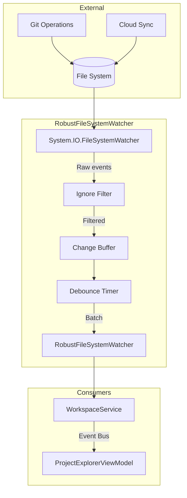
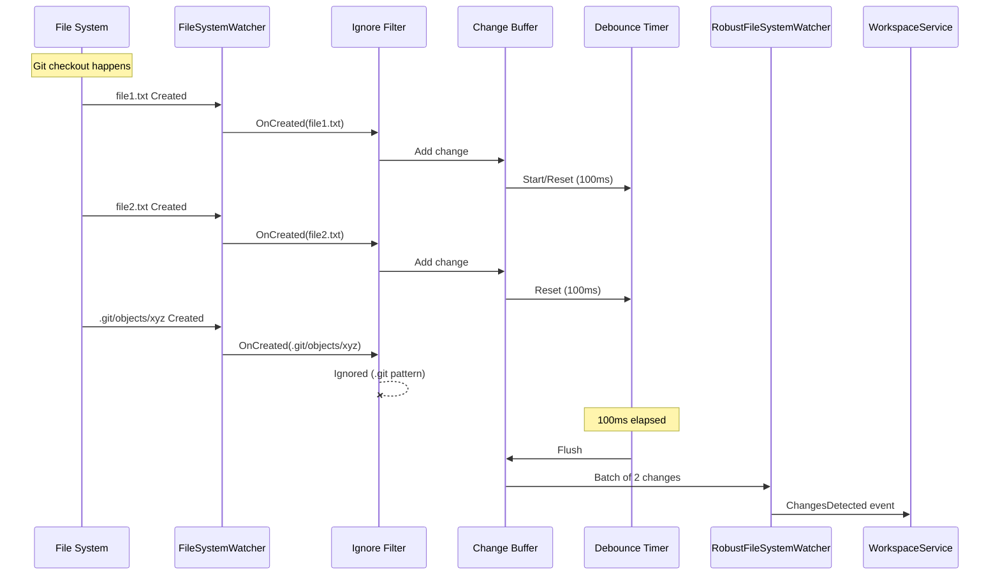
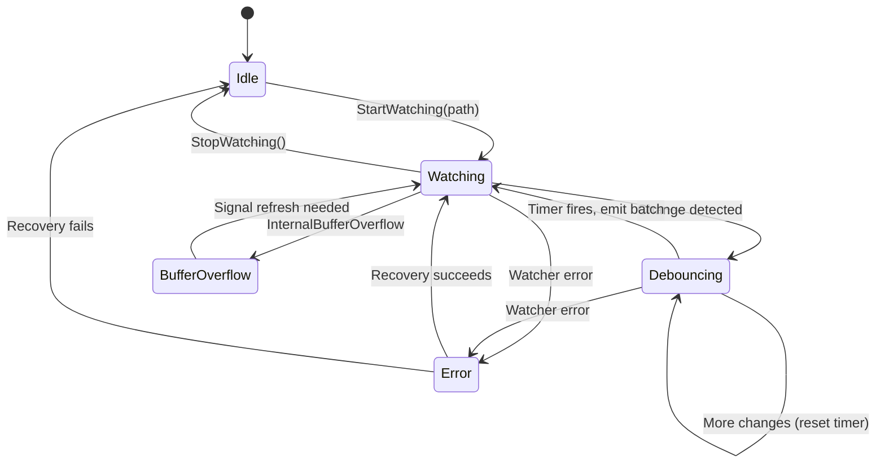

# LCS-DES-012b: File System Watcher Specification

## 1. Metadata & Categorization

| Field                | Value                                    | Description                                           |
| :------------------- | :--------------------------------------- | :---------------------------------------------------- |
| **Feature ID**       | `INF-012b`                               | File System Watcher                                   |
| **Feature Name**     | Robust File System Watcher               | Wrapper for detecting external file changes           |
| **Target Version**   | `v0.1.2b`                                | Second sub-part of Explorer                           |
| **Module Scope**     | `Lexichord.Modules.Workspace`            | Workspace module                                      |
| **Swimlane**         | `Infrastructure`                         | The Podium (Platform)                                 |
| **License Tier**     | `Core`                                   | Foundation (Required for all tiers)                   |
| **Feature Gate Key** | N/A                                      | No runtime gating                                     |
| **Author**           | System Architect                         |                                                       |
| **Status**           | **Draft**                                | Pending implementation                                |
| **Last Updated**     | 2026-01-26                               |                                                       |

---

## 2. Executive Summary

### 2.1 The Requirement

When users work with external tools (Git, cloud sync, other editors), files in the workspace change outside of Lexichord. The application must:

- Detect file creations, modifications, deletions, and renames
- Handle high-frequency changes (git checkout creates many files rapidly)
- Recover gracefully from watcher failures (buffer overflow)
- Filter noise (ignore .git folder, node_modules, etc.)
- Batch changes for efficient UI updates

### 2.2 The Problem with System.IO.FileSystemWatcher

The built-in `FileSystemWatcher` has known issues:

| Issue | Impact | Our Solution |
|:------|:-------|:-------------|
| Buffer overflow on rapid changes | Events lost | Increase buffer, detect overflow, trigger full refresh |
| Duplicate events for single change | UI flicker | Debounce with configurable delay |
| Different behavior per OS | Inconsistent UX | Normalize behavior in wrapper |
| No batching | Performance | Accumulate events, emit batches |
| No pattern filtering | .git noise | Implement ignore patterns |

### 2.3 The Proposed Solution

We **SHALL** implement `RobustFileSystemWatcher` that wraps `FileSystemWatcher` with:

1. **Debouncing** — Accumulate changes for 100ms before emitting
2. **Batching** — Emit multiple changes as single event
3. **Buffer overflow handling** — Detect and recover with manual refresh signal
4. **Ignore patterns** — Filter out .git, node_modules, etc.
5. **Error recovery** — Restart watcher on failures
6. **Cross-platform normalization** — Consistent behavior on Windows, macOS, Linux

---

## 3. Architecture

### 3.1 Component Diagram



### 3.2 Event Flow Sequence



### 3.3 State Machine



---

## 4. Decision Tree

```text
START: "File system event received"
│
├── Is path in ignore patterns?
│   ├── YES (e.g., .git/objects/abc) → Discard event
│   └── NO → Continue
│
├── Is this a duplicate of recent event?
│   ├── YES (same path, same type, within 50ms) → Discard
│   └── NO → Continue
│
├── Add to change buffer
│
├── Is debounce timer running?
│   ├── YES → Reset timer to full duration
│   └── NO → Start timer (default 100ms)
│
└── Wait for timer

---

START: "Debounce timer fires"
│
├── Is change buffer empty?
│   ├── YES → No-op
│   └── NO → Continue
│
├── Create batch from buffer
│
├── Clear buffer
│
├── Raise ChangesDetected event with batch
│
└── Publish ExternalFileChangesEvent via MediatR

---

START: "FileSystemWatcher error occurs"
│
├── Is error InternalBufferOverflow?
│   ├── YES → Log warning
│   │   ├── Raise BufferOverflow flag
│   │   ├── Signal that full refresh is needed
│   │   └── Continue watching
│   └── NO → Continue
│
├── Is error recoverable?
│   ├── YES → Log and continue
│   └── NO → Attempt restart
│       ├── Stop current watcher
│       ├── Wait brief delay (100ms)
│       ├── Create new watcher
│       ├── Start new watcher
│       ├── Success? → Continue
│       └── Failure? → Raise Error event (IsRecoverable=false)
```

---

## 5. Data Contracts

### 5.1 IFileSystemWatcher Interface

```csharp
namespace Lexichord.Abstractions.Contracts;

/// <summary>
/// Robust file system watcher with debouncing, batching, and error recovery.
/// </summary>
/// <remarks>
/// LOGIC: This interface abstracts the complexity of file system watching:
/// - Wraps System.IO.FileSystemWatcher
/// - Debounces rapid changes (git operations, cloud sync)
/// - Batches changes for efficient processing
/// - Handles buffer overflow gracefully
/// - Supports ignore patterns (.git, node_modules)
/// - Recovers from watcher failures
///
/// Design decisions:
/// - Events are batched, not individual (reduces UI thrashing)
/// - Debounce is configurable (default 100ms)
/// - Ignore patterns use glob-style matching
/// - Buffer overflow signals need for full refresh
/// </remarks>
public interface IFileSystemWatcher : IDisposable
{
    /// <summary>
    /// Gets the path currently being watched, or null if not watching.
    /// </summary>
    string? WatchPath { get; }

    /// <summary>
    /// Gets whether the watcher is currently active.
    /// </summary>
    bool IsWatching { get; }

    /// <summary>
    /// Gets or sets the debounce delay in milliseconds.
    /// </summary>
    /// <remarks>
    /// LOGIC: Changes within this window are accumulated into a single batch.
    /// Default: 100ms. Higher values = fewer events but more latency.
    /// Lower values = more responsive but more UI updates.
    /// </remarks>
    int DebounceDelayMs { get; set; }

    /// <summary>
    /// Gets the collection of ignore patterns.
    /// </summary>
    /// <remarks>
    /// LOGIC: Patterns use simple glob-style matching:
    /// - ".git" matches any path containing ".git" segment
    /// - "*.tmp" matches files ending in .tmp
    /// - "node_modules" matches the node_modules folder
    ///
    /// Default patterns: .git, .svn, .hg, node_modules, __pycache__, .DS_Store
    /// </remarks>
    IList<string> IgnorePatterns { get; }

    /// <summary>
    /// Starts watching a directory for changes.
    /// </summary>
    /// <param name="path">Directory path to watch.</param>
    /// <param name="filter">File filter pattern (default: all files).</param>
    /// <param name="includeSubdirectories">Watch subdirectories (default: true).</param>
    /// <remarks>
    /// LOGIC: If already watching, stops current watcher first.
    /// Monitors: Created, Changed, Deleted, Renamed events.
    /// Subdirectory watching is recursive by default.
    /// </remarks>
    void StartWatching(string path, string filter = "*.*", bool includeSubdirectories = true);

    /// <summary>
    /// Stops watching the current directory.
    /// </summary>
    /// <remarks>
    /// LOGIC: Stops the watcher and flushes any pending changes.
    /// Idempotent - calling when not watching is a no-op.
    /// </remarks>
    void StopWatching();

    /// <summary>
    /// Event raised when file system changes are detected.
    /// </summary>
    /// <remarks>
    /// LOGIC: Raised after debounce window with accumulated changes.
    /// May contain multiple changes from different files/operations.
    /// </remarks>
    event EventHandler<FileSystemChangeBatchEventArgs>? ChangesDetected;

    /// <summary>
    /// Event raised when a buffer overflow occurs.
    /// </summary>
    /// <remarks>
    /// LOGIC: Indicates some events may have been lost.
    /// Consumers should trigger a full refresh of their state.
    /// </remarks>
    event EventHandler<EventArgs>? BufferOverflow;

    /// <summary>
    /// Event raised when an error occurs in the watcher.
    /// </summary>
    /// <remarks>
    /// LOGIC: IsRecoverable indicates if watcher is still functional.
    /// If not recoverable, consumer should handle gracefully.
    /// </remarks>
    event EventHandler<FileSystemWatcherErrorEventArgs>? Error;
}
```

### 5.2 Event Arguments

```csharp
namespace Lexichord.Abstractions.Contracts;

/// <summary>
/// Batch of file system changes detected by the watcher.
/// </summary>
public class FileSystemChangeBatchEventArgs : EventArgs
{
    /// <summary>
    /// Gets the collection of changes in this batch.
    /// </summary>
    public required IReadOnlyList<FileSystemChangeInfo> Changes { get; init; }

    /// <summary>
    /// Gets the timestamp when the batch was created.
    /// </summary>
    public DateTimeOffset Timestamp { get; init; } = DateTimeOffset.UtcNow;
}

/// <summary>
/// Information about a single file system change.
/// </summary>
/// <param name="ChangeType">The type of change (Created, Changed, Deleted, Renamed).</param>
/// <param name="FullPath">Full path to the affected file or directory.</param>
/// <param name="OldPath">For renames, the previous path. Null for other change types.</param>
/// <param name="IsDirectory">True if the change affects a directory.</param>
/// <remarks>
/// LOGIC: FileSystemChangeInfo is immutable (record).
/// For Renamed changes, OldPath contains the previous path.
/// IsDirectory is determined at event time (may be stale for deletes).
/// </remarks>
public record FileSystemChangeInfo(
    FileSystemChangeType ChangeType,
    string FullPath,
    string? OldPath,
    bool IsDirectory
)
{
    /// <summary>
    /// Gets the file or directory name (without path).
    /// </summary>
    public string Name => Path.GetFileName(FullPath) ?? FullPath;

    /// <summary>
    /// Gets the parent directory path.
    /// </summary>
    public string? ParentPath => Path.GetDirectoryName(FullPath);
}

/// <summary>
/// Types of file system changes.
/// </summary>
public enum FileSystemChangeType
{
    /// <summary>File or directory was created.</summary>
    Created,

    /// <summary>File content was modified.</summary>
    Changed,

    /// <summary>File or directory was deleted.</summary>
    Deleted,

    /// <summary>File or directory was renamed.</summary>
    Renamed
}

/// <summary>
/// Error information from the file system watcher.
/// </summary>
public class FileSystemWatcherErrorEventArgs : EventArgs
{
    /// <summary>
    /// Gets the exception that occurred.
    /// </summary>
    public required Exception Exception { get; init; }

    /// <summary>
    /// Gets whether the watcher is still functional.
    /// </summary>
    /// <remarks>
    /// LOGIC: If false, the watcher has stopped and needs manual restart.
    /// </remarks>
    public required bool IsRecoverable { get; init; }
}
```

### 5.3 MediatR Event

```csharp
namespace Lexichord.Abstractions.Events;

using MediatR;

/// <summary>
/// Event published when external file changes are detected in the workspace.
/// </summary>
/// <param name="Changes">The batch of changes detected.</param>
/// <remarks>
/// LOGIC: Published by WorkspaceService when file watcher detects changes.
/// Handlers can update their state (e.g., ProjectExplorerViewModel updates tree).
/// </remarks>
public record ExternalFileChangesEvent(
    IReadOnlyList<FileSystemChangeInfo> Changes
) : INotification;
```

---

## 6. Implementation Logic

### 6.1 RobustFileSystemWatcher Implementation

```csharp
using Lexichord.Abstractions.Contracts;
using Microsoft.Extensions.Logging;
using System.Collections.Concurrent;
using System.Timers;

namespace Lexichord.Modules.Workspace.Services;

/// <summary>
/// Robust wrapper around FileSystemWatcher with debouncing and error handling.
/// </summary>
/// <remarks>
/// LOGIC: This class addresses the common issues with FileSystemWatcher:
///
/// 1. DEBOUNCING: Git checkout creates hundreds of events in milliseconds.
///    We accumulate changes and emit once after a quiet period.
///
/// 2. DUPLICATE SUPPRESSION: Some operations trigger multiple events for one
///    logical change. We deduplicate within a short window.
///
/// 3. BUFFER OVERFLOW: Large operations can overflow the internal buffer.
///    We detect this and signal that a full refresh is needed.
///
/// 4. IGNORE PATTERNS: .git, node_modules, etc. generate noise.
///    We filter these before they enter the pipeline.
///
/// 5. ERROR RECOVERY: Watcher failures are caught and recovered when possible.
/// </remarks>
public sealed class RobustFileSystemWatcher : IFileSystemWatcher
{
    private const int DefaultDebounceMs = 100;
    private const int DefaultBufferSize = 64 * 1024; // 64KB
    private const int DuplicateWindowMs = 50;

    private readonly ILogger<RobustFileSystemWatcher> _logger;
    private readonly ConcurrentDictionary<string, FileSystemChangeInfo> _changeBuffer = new();
    private readonly object _lock = new();

    private FileSystemWatcher? _innerWatcher;
    private System.Timers.Timer? _debounceTimer;
    private bool _disposed;

    /// <summary>
    /// Default ignore patterns for common non-project directories.
    /// </summary>
    private static readonly string[] DefaultIgnorePatterns = new[]
    {
        ".git",
        ".svn",
        ".hg",
        "node_modules",
        "__pycache__",
        ".DS_Store",
        "Thumbs.db",
        "*.tmp",
        "*.temp",
        "~$*" // Office temp files
    };

    public RobustFileSystemWatcher(ILogger<RobustFileSystemWatcher> logger)
    {
        _logger = logger ?? throw new ArgumentNullException(nameof(logger));

        // Initialize ignore patterns with defaults
        IgnorePatterns = new List<string>(DefaultIgnorePatterns);
        DebounceDelayMs = DefaultDebounceMs;
    }

    /// <inheritdoc/>
    public string? WatchPath { get; private set; }

    /// <inheritdoc/>
    public bool IsWatching { get; private set; }

    /// <inheritdoc/>
    public int DebounceDelayMs { get; set; }

    /// <inheritdoc/>
    public IList<string> IgnorePatterns { get; }

    /// <inheritdoc/>
    public event EventHandler<FileSystemChangeBatchEventArgs>? ChangesDetected;

    /// <inheritdoc/>
    public event EventHandler<EventArgs>? BufferOverflow;

    /// <inheritdoc/>
    public event EventHandler<FileSystemWatcherErrorEventArgs>? Error;

    /// <inheritdoc/>
    public void StartWatching(string path, string filter = "*.*", bool includeSubdirectories = true)
    {
        ArgumentException.ThrowIfNullOrWhiteSpace(path, nameof(path));

        lock (_lock)
        {
            // Stop existing watcher if any
            StopWatchingInternal();

            _logger.LogDebug("Starting file watcher on: {Path}", path);

            try
            {
                // Create inner watcher
                _innerWatcher = new FileSystemWatcher(path, filter)
                {
                    IncludeSubdirectories = includeSubdirectories,
                    InternalBufferSize = DefaultBufferSize,
                    NotifyFilter = NotifyFilters.FileName
                                 | NotifyFilters.DirectoryName
                                 | NotifyFilters.LastWrite
                                 | NotifyFilters.CreationTime
                };

                // Wire up events
                _innerWatcher.Created += OnInnerCreated;
                _innerWatcher.Changed += OnInnerChanged;
                _innerWatcher.Deleted += OnInnerDeleted;
                _innerWatcher.Renamed += OnInnerRenamed;
                _innerWatcher.Error += OnInnerError;

                // Create debounce timer
                _debounceTimer = new System.Timers.Timer(DebounceDelayMs)
                {
                    AutoReset = false
                };
                _debounceTimer.Elapsed += OnDebounceTimerElapsed;

                // Start watching
                _innerWatcher.EnableRaisingEvents = true;

                WatchPath = path;
                IsWatching = true;

                _logger.LogInformation("File watcher started on: {Path}", path);
            }
            catch (Exception ex)
            {
                _logger.LogError(ex, "Failed to start file watcher on: {Path}", path);
                CleanupWatcher();
                throw;
            }
        }
    }

    /// <inheritdoc/>
    public void StopWatching()
    {
        lock (_lock)
        {
            StopWatchingInternal();
        }
    }

    private void StopWatchingInternal()
    {
        if (!IsWatching)
            return;

        _logger.LogDebug("Stopping file watcher");

        // Flush any pending changes
        FlushChanges();

        // Cleanup
        CleanupWatcher();

        WatchPath = null;
        IsWatching = false;

        _logger.LogInformation("File watcher stopped");
    }

    private void CleanupWatcher()
    {
        if (_innerWatcher is not null)
        {
            _innerWatcher.EnableRaisingEvents = false;
            _innerWatcher.Created -= OnInnerCreated;
            _innerWatcher.Changed -= OnInnerChanged;
            _innerWatcher.Deleted -= OnInnerDeleted;
            _innerWatcher.Renamed -= OnInnerRenamed;
            _innerWatcher.Error -= OnInnerError;
            _innerWatcher.Dispose();
            _innerWatcher = null;
        }

        if (_debounceTimer is not null)
        {
            _debounceTimer.Stop();
            _debounceTimer.Elapsed -= OnDebounceTimerElapsed;
            _debounceTimer.Dispose();
            _debounceTimer = null;
        }

        _changeBuffer.Clear();
    }

    #region Inner Watcher Event Handlers

    private void OnInnerCreated(object sender, FileSystemEventArgs e)
    {
        ProcessChange(FileSystemChangeType.Created, e.FullPath, null);
    }

    private void OnInnerChanged(object sender, FileSystemEventArgs e)
    {
        ProcessChange(FileSystemChangeType.Changed, e.FullPath, null);
    }

    private void OnInnerDeleted(object sender, FileSystemEventArgs e)
    {
        ProcessChange(FileSystemChangeType.Deleted, e.FullPath, null);
    }

    private void OnInnerRenamed(object sender, RenamedEventArgs e)
    {
        ProcessChange(FileSystemChangeType.Renamed, e.FullPath, e.OldFullPath);
    }

    private void OnInnerError(object sender, ErrorEventArgs e)
    {
        var exception = e.GetException();

        // LOGIC: Check for buffer overflow specifically
        if (exception is InternalBufferOverflowException)
        {
            _logger.LogWarning(
                "Buffer overflow in file watcher - some events may have been lost. " +
                "Consider triggering a full refresh.");

            BufferOverflow?.Invoke(this, EventArgs.Empty);
            return;
        }

        _logger.LogError(exception, "File watcher error occurred");

        // Attempt recovery
        var isRecoverable = TryRecoverWatcher();

        Error?.Invoke(this, new FileSystemWatcherErrorEventArgs
        {
            Exception = exception,
            IsRecoverable = isRecoverable
        });
    }

    #endregion

    #region Change Processing

    private void ProcessChange(FileSystemChangeType changeType, string fullPath, string? oldPath)
    {
        // LOGIC: Filter ignored patterns first (before any processing)
        if (ShouldIgnore(fullPath) || (oldPath is not null && ShouldIgnore(oldPath)))
        {
            _logger.LogTrace("Ignoring change to: {Path}", fullPath);
            return;
        }

        // Determine if directory (may fail for deletes)
        var isDirectory = changeType != FileSystemChangeType.Deleted
            && Directory.Exists(fullPath);

        var change = new FileSystemChangeInfo(changeType, fullPath, oldPath, isDirectory);

        // LOGIC: Use path as key for deduplication
        // Later changes to same path overwrite earlier ones
        var key = $"{changeType}:{fullPath}";
        _changeBuffer.AddOrUpdate(key, change, (k, existing) => change);

        // Reset debounce timer
        ResetDebounceTimer();
    }

    private bool ShouldIgnore(string path)
    {
        // LOGIC: Check each segment of the path against ignore patterns
        var segments = path.Split(Path.DirectorySeparatorChar, Path.AltDirectorySeparatorChar);

        foreach (var pattern in IgnorePatterns)
        {
            // Direct segment match (e.g., ".git", "node_modules")
            if (segments.Any(s => MatchPattern(s, pattern)))
                return true;

            // Full path match for extension patterns (e.g., "*.tmp")
            if (pattern.StartsWith("*") && MatchPattern(Path.GetFileName(path), pattern))
                return true;

            // Prefix match (e.g., "~$*" for Office temp files)
            if (pattern.EndsWith("*") && Path.GetFileName(path).StartsWith(
                pattern.TrimEnd('*'), StringComparison.OrdinalIgnoreCase))
                return true;
        }

        return false;
    }

    private static bool MatchPattern(string input, string pattern)
    {
        // Simple glob matching
        if (pattern.StartsWith("*") && pattern.Length > 1)
        {
            var suffix = pattern[1..];
            return input.EndsWith(suffix, StringComparison.OrdinalIgnoreCase);
        }

        return input.Equals(pattern, StringComparison.OrdinalIgnoreCase);
    }

    private void ResetDebounceTimer()
    {
        lock (_lock)
        {
            if (_debounceTimer is null)
                return;

            _debounceTimer.Stop();
            _debounceTimer.Interval = DebounceDelayMs;
            _debounceTimer.Start();
        }
    }

    private void OnDebounceTimerElapsed(object? sender, ElapsedEventArgs e)
    {
        FlushChanges();
    }

    private void FlushChanges()
    {
        if (_changeBuffer.IsEmpty)
            return;

        // LOGIC: Atomically extract all changes
        var changes = new List<FileSystemChangeInfo>();
        while (_changeBuffer.TryRemove(out var kvp))
        {
            changes.Add(kvp.Value);
        }

        if (changes.Count == 0)
            return;

        _logger.LogDebug("Flushing {Count} file system changes", changes.Count);

        // Raise event
        ChangesDetected?.Invoke(this, new FileSystemChangeBatchEventArgs
        {
            Changes = changes.AsReadOnly(),
            Timestamp = DateTimeOffset.UtcNow
        });
    }

    #endregion

    #region Error Recovery

    private bool TryRecoverWatcher()
    {
        if (WatchPath is null)
            return false;

        var path = WatchPath;

        _logger.LogWarning("Attempting to recover file watcher for: {Path}", path);

        try
        {
            // Stop and clean up current watcher
            CleanupWatcher();

            // Brief delay to allow system to stabilize
            Thread.Sleep(100);

            // Restart
            StartWatching(path);

            _logger.LogInformation("File watcher recovered successfully for: {Path}", path);
            return true;
        }
        catch (Exception ex)
        {
            _logger.LogError(ex, "Failed to recover file watcher for: {Path}", path);
            return false;
        }
    }

    #endregion

    /// <inheritdoc/>
    public void Dispose()
    {
        if (_disposed)
            return;

        lock (_lock)
        {
            StopWatchingInternal();
            _disposed = true;
        }
    }
}
```

---

## 7. Use Cases

### 7.1 UC-01: Git Checkout

**Preconditions:**
- Workspace is open
- User runs `git checkout feature-branch` in terminal
- Branch has 50 different files from current branch

**Flow:**
1. Git creates/modifies/deletes 50+ files rapidly
2. FileSystemWatcher raises 50+ Created/Changed/Deleted events
3. Each event passes through ignore filter (.git/* filtered out)
4. Valid changes added to buffer
5. Debounce timer resets on each change
6. After 100ms quiet period, timer fires
7. Batch of ~30 changes emitted (after .git filtering)
8. WorkspaceService publishes ExternalFileChangesEvent
9. ProjectExplorerViewModel updates affected tree nodes

**Postconditions:**
- Tree view shows new file state
- Single batch update (no flicker)
- .git folder changes ignored

---

### 7.2 UC-02: Buffer Overflow

**Preconditions:**
- Workspace is open
- External process creates 10,000 files instantly

**Flow:**
1. FileSystemWatcher internal buffer overflows
2. OnInnerError receives InternalBufferOverflowException
3. BufferOverflow event is raised
4. WorkspaceService receives overflow signal
5. WorkspaceService triggers full tree refresh
6. ProjectExplorerViewModel reloads entire tree

**Postconditions:**
- Tree is consistent with disk
- User may not see individual changes
- No data loss

---

### 7.3 UC-03: Watcher Failure Recovery

**Preconditions:**
- Workspace is open
- Network drive disconnects briefly

**Flow:**
1. FileSystemWatcher raises error
2. OnInnerError logs error
3. TryRecoverWatcher is called
4. Current watcher is cleaned up
5. New watcher is created
6. Watching resumes
7. Error event raised with IsRecoverable=true

**Postconditions:**
- Watching continues
- Consumers notified of temporary issue

---

## 8. Observability & Logging

### 8.1 Log Events

| Level | Message Template | When |
|:------|:-----------------|:-----|
| Debug | `Starting file watcher on: {Path}` | StartWatching called |
| Information | `File watcher started on: {Path}` | Watcher started successfully |
| Error | `Failed to start file watcher on: {Path}` | Startup failure |
| Debug | `Stopping file watcher` | StopWatching called |
| Information | `File watcher stopped` | Watcher stopped |
| Trace | `Ignoring change to: {Path}` | Filtered by ignore pattern |
| Debug | `Flushing {Count} file system changes` | Debounce timer fires |
| Warning | `Buffer overflow in file watcher...` | Buffer overflow detected |
| Error | `File watcher error occurred` | Other watcher errors |
| Warning | `Attempting to recover file watcher for: {Path}` | Recovery attempt |
| Information | `File watcher recovered successfully for: {Path}` | Recovery succeeded |
| Error | `Failed to recover file watcher for: {Path}` | Recovery failed |

---

## 9. Unit Testing Requirements

### 9.1 Test Cases

```csharp
[TestFixture]
[Category("Unit")]
public class RobustFileSystemWatcherTests
{
    private Mock<ILogger<RobustFileSystemWatcher>> _mockLogger = null!;
    private RobustFileSystemWatcher _sut = null!;
    private string _testDir = null!;

    [SetUp]
    public void SetUp()
    {
        _mockLogger = new Mock<ILogger<RobustFileSystemWatcher>>();
        _sut = new RobustFileSystemWatcher(_mockLogger.Object);

        _testDir = Path.Combine(Path.GetTempPath(), $"fswatcher_test_{Guid.NewGuid()}");
        Directory.CreateDirectory(_testDir);
    }

    [TearDown]
    public void TearDown()
    {
        _sut.Dispose();
        if (Directory.Exists(_testDir))
            Directory.Delete(_testDir, recursive: true);
    }

    [Test]
    public void IsWatching_Initially_IsFalse()
    {
        Assert.That(_sut.IsWatching, Is.False);
    }

    [Test]
    public void WatchPath_Initially_IsNull()
    {
        Assert.That(_sut.WatchPath, Is.Null);
    }

    [Test]
    public void StartWatching_ValidPath_SetsIsWatching()
    {
        _sut.StartWatching(_testDir);

        Assert.Multiple(() =>
        {
            Assert.That(_sut.IsWatching, Is.True);
            Assert.That(_sut.WatchPath, Is.EqualTo(_testDir));
        });
    }

    [Test]
    public void StartWatching_InvalidPath_Throws()
    {
        Assert.Throws<ArgumentException>(() =>
            _sut.StartWatching("/nonexistent/path/12345"));
    }

    [Test]
    public void StopWatching_WhenWatching_ClearsState()
    {
        _sut.StartWatching(_testDir);
        _sut.StopWatching();

        Assert.Multiple(() =>
        {
            Assert.That(_sut.IsWatching, Is.False);
            Assert.That(_sut.WatchPath, Is.Null);
        });
    }

    [Test]
    public void StopWatching_WhenNotWatching_IsNoOp()
    {
        Assert.DoesNotThrow(() => _sut.StopWatching());
    }

    [Test]
    public async Task FileCreation_RaisesChangesDetected()
    {
        var eventReceived = new TaskCompletionSource<FileSystemChangeBatchEventArgs>();
        _sut.ChangesDetected += (s, e) => eventReceived.TrySetResult(e);
        _sut.DebounceDelayMs = 50;

        _sut.StartWatching(_testDir);

        // Create a file
        var filePath = Path.Combine(_testDir, "test.txt");
        await File.WriteAllTextAsync(filePath, "content");

        // Wait for event
        var args = await eventReceived.Task.WaitAsync(TimeSpan.FromSeconds(2));

        Assert.That(args.Changes, Has.Some.Matches<FileSystemChangeInfo>(
            c => c.ChangeType == FileSystemChangeType.Created &&
                 c.FullPath == filePath));
    }

    [Test]
    public async Task FileDeletion_RaisesChangesDetected()
    {
        var filePath = Path.Combine(_testDir, "todelete.txt");
        await File.WriteAllTextAsync(filePath, "content");

        var eventReceived = new TaskCompletionSource<FileSystemChangeBatchEventArgs>();
        _sut.ChangesDetected += (s, e) => eventReceived.TrySetResult(e);
        _sut.DebounceDelayMs = 50;

        _sut.StartWatching(_testDir);

        // Delete the file
        File.Delete(filePath);

        // Wait for event
        var args = await eventReceived.Task.WaitAsync(TimeSpan.FromSeconds(2));

        Assert.That(args.Changes, Has.Some.Matches<FileSystemChangeInfo>(
            c => c.ChangeType == FileSystemChangeType.Deleted));
    }

    [Test]
    public async Task FileRename_RaisesChangesDetectedWithOldPath()
    {
        var oldPath = Path.Combine(_testDir, "old.txt");
        var newPath = Path.Combine(_testDir, "new.txt");
        await File.WriteAllTextAsync(oldPath, "content");

        var eventReceived = new TaskCompletionSource<FileSystemChangeBatchEventArgs>();
        _sut.ChangesDetected += (s, e) => eventReceived.TrySetResult(e);
        _sut.DebounceDelayMs = 50;

        _sut.StartWatching(_testDir);

        // Rename the file
        File.Move(oldPath, newPath);

        // Wait for event
        var args = await eventReceived.Task.WaitAsync(TimeSpan.FromSeconds(2));

        Assert.That(args.Changes, Has.Some.Matches<FileSystemChangeInfo>(
            c => c.ChangeType == FileSystemChangeType.Renamed &&
                 c.OldPath == oldPath));
    }

    [Test]
    public async Task IgnoredFile_DoesNotRaiseEvent()
    {
        var eventReceived = new TaskCompletionSource<bool>();
        _sut.ChangesDetected += (s, e) => eventReceived.TrySetResult(true);
        _sut.DebounceDelayMs = 50;
        _sut.IgnorePatterns.Add("*.ignored");

        _sut.StartWatching(_testDir);

        // Create ignored file
        var filePath = Path.Combine(_testDir, "test.ignored");
        await File.WriteAllTextAsync(filePath, "content");

        // Wait briefly - event should NOT fire
        var eventFired = await Task.WhenAny(
            eventReceived.Task,
            Task.Delay(200)) == eventReceived.Task;

        Assert.That(eventFired, Is.False);
    }

    [Test]
    public void IgnorePatterns_ContainsDefaults()
    {
        Assert.That(_sut.IgnorePatterns, Contains.Item(".git"));
        Assert.That(_sut.IgnorePatterns, Contains.Item("node_modules"));
    }

    [Test]
    public async Task Debouncing_BatchesMultipleChanges()
    {
        var events = new List<FileSystemChangeBatchEventArgs>();
        _sut.ChangesDetected += (s, e) => events.Add(e);
        _sut.DebounceDelayMs = 100;

        _sut.StartWatching(_testDir);

        // Create multiple files rapidly
        for (int i = 0; i < 5; i++)
        {
            var filePath = Path.Combine(_testDir, $"file{i}.txt");
            await File.WriteAllTextAsync(filePath, "content");
        }

        // Wait for debounce
        await Task.Delay(200);

        // Should receive single batch with multiple changes
        Assert.That(events, Has.Count.EqualTo(1));
        Assert.That(events[0].Changes.Count, Is.GreaterThanOrEqualTo(5));
    }

    [Test]
    public void Dispose_StopsWatching()
    {
        _sut.StartWatching(_testDir);
        _sut.Dispose();

        Assert.That(_sut.IsWatching, Is.False);
    }
}
```

### 9.2 Ignore Pattern Tests

```csharp
[TestFixture]
[Category("Unit")]
public class IgnorePatternTests
{
    private RobustFileSystemWatcher _sut = null!;

    [SetUp]
    public void SetUp()
    {
        _sut = new RobustFileSystemWatcher(Mock.Of<ILogger<RobustFileSystemWatcher>>());
    }

    [TearDown]
    public void TearDown()
    {
        _sut.Dispose();
    }

    [TestCase(".git", "/project/.git/objects/abc", true)]
    [TestCase(".git", "/project/src/file.cs", false)]
    [TestCase("node_modules", "/project/node_modules/lodash/index.js", true)]
    [TestCase("*.tmp", "/project/file.tmp", true)]
    [TestCase("*.tmp", "/project/file.txt", false)]
    [TestCase("~$*", "/project/~$document.docx", true)]
    [TestCase("~$*", "/project/document.docx", false)]
    public void ShouldIgnore_ReturnsExpectedResult(string pattern, string path, bool expected)
    {
        _sut.IgnorePatterns.Clear();
        _sut.IgnorePatterns.Add(pattern);

        // Use reflection to test private method
        var method = typeof(RobustFileSystemWatcher).GetMethod(
            "ShouldIgnore",
            System.Reflection.BindingFlags.NonPublic | System.Reflection.BindingFlags.Instance);

        var result = (bool)method!.Invoke(_sut, new object[] { path })!;

        Assert.That(result, Is.EqualTo(expected));
    }
}
```

---

## 10. Security & Safety

### 10.1 Path Validation

> [!WARNING]
> Paths from FileSystemWatcher events should be validated:
> - Normalize paths before processing
> - Verify paths are within watched directory
> - Handle invalid characters gracefully

### 10.2 Resource Management

> [!NOTE]
> FileSystemWatcher uses system resources:
> - Dispose properly to release handles
> - Limit buffer size to prevent memory issues
> - Stop watching when not needed

---

## 11. Risks & Mitigations

| Risk | Impact | Mitigation |
|:-----|:-------|:-----------|
| Buffer overflow loses events | High | Detect and signal for full refresh |
| High CPU from many events | Medium | Debouncing, ignore patterns |
| Watcher stops unexpectedly | Medium | Error detection, recovery attempt |
| Path encoding issues | Low | Use System.IO.Path for all path operations |
| Thread safety issues | Medium | Lock around state changes |

---

## 12. Acceptance Criteria

| # | Criterion |
|:--|:----------|
| 1 | IFileSystemWatcher interface defined in Abstractions |
| 2 | RobustFileSystemWatcher implements IFileSystemWatcher |
| 3 | File creation raises ChangesDetected event |
| 4 | File deletion raises ChangesDetected event |
| 5 | File rename raises ChangesDetected with OldPath |
| 6 | Multiple rapid changes are batched |
| 7 | .git changes are filtered out |
| 8 | Custom ignore patterns work |
| 9 | Buffer overflow raises BufferOverflow event |
| 10 | Watcher errors attempt recovery |
| 11 | All unit tests pass |

---

## 13. Verification Commands

```bash
# 1. Run unit tests
dotnet test --filter "FullyQualifiedName~FileSystemWatcher"

# 2. Manual test - file creation
# Start app with workspace open
# In terminal: touch /path/to/workspace/newfile.txt
# Verify tree updates

# 3. Manual test - git operations
# In workspace: git checkout different-branch
# Verify tree updates without flicker

# 4. Manual test - buffer overflow
# Create script to generate many files:
# for i in {1..10000}; do touch "file$i.txt"; done
# Verify app handles gracefully

# 5. Performance test
# Monitor CPU during rapid file changes
# Should stay below 10% with debouncing
```

---

## 14. Deliverable Checklist

| Step | Description | Status |
|:-----|:------------|:-------|
| 1 | Define IFileSystemWatcher interface | [ ] |
| 2 | Define FileSystemChangeBatchEventArgs | [ ] |
| 3 | Define FileSystemChangeInfo record | [ ] |
| 4 | Define FileSystemChangeType enum | [ ] |
| 5 | Define FileSystemWatcherErrorEventArgs | [ ] |
| 6 | Define ExternalFileChangesEvent | [ ] |
| 7 | Implement RobustFileSystemWatcher | [ ] |
| 8 | Implement debouncing logic | [ ] |
| 9 | Implement ignore pattern filtering | [ ] |
| 10 | Implement buffer overflow handling | [ ] |
| 11 | Implement error recovery | [ ] |
| 12 | Wire into WorkspaceService | [ ] |
| 13 | Unit tests for watcher | [ ] |
| 14 | Unit tests for ignore patterns | [ ] |
