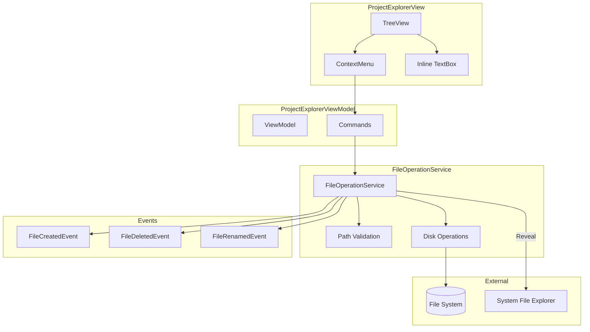
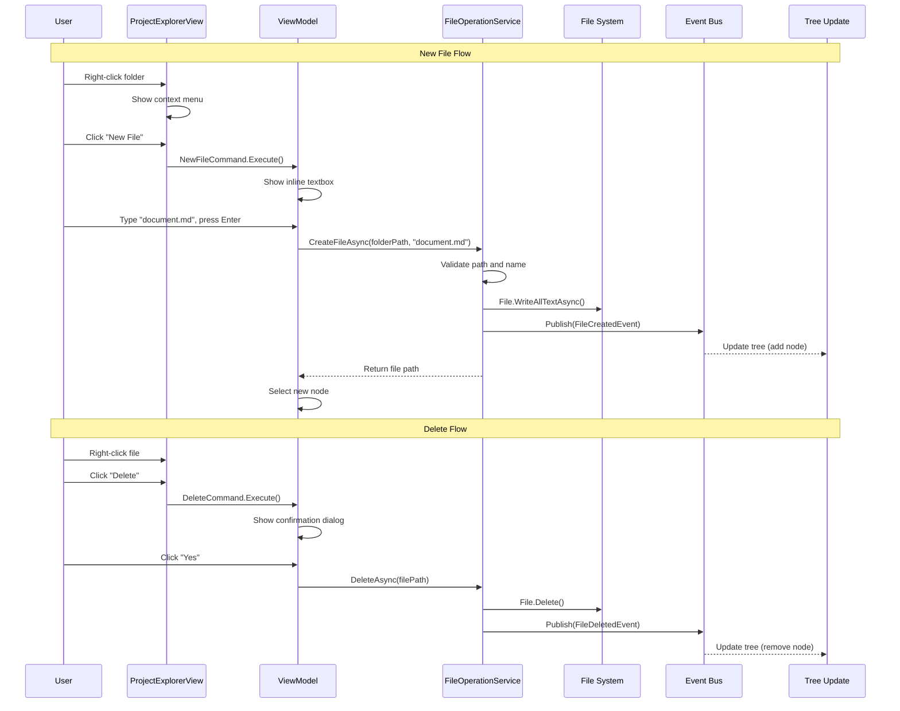

# LCS-DES-012d: Context Menu Actions Specification

## 1. Metadata & Categorization

| Field                | Value                                    | Description                                           |
| :------------------- | :--------------------------------------- | :---------------------------------------------------- |
| **Feature ID**       | `INF-012d`                               | Context Menu Actions                                  |
| **Feature Name**     | File Context Menu Actions                | New File, New Folder, Rename, Delete, Reveal          |
| **Target Version**   | `v0.1.2d`                                | Fourth sub-part of Explorer                           |
| **Module Scope**     | `Lexichord.Modules.Workspace`            | Workspace module                                      |
| **Swimlane**         | `Infrastructure`                         | The Podium (Platform)                                 |
| **License Tier**     | `Core`                                   | Foundation (Required for all tiers)                   |
| **Feature Gate Key** | N/A                                      | No runtime gating                                     |
| **Author**           | System Architect                         |                                                       |
| **Status**           | **Draft**                                | Pending implementation                                |
| **Last Updated**     | 2026-01-26                               |                                                       |

---

## 2. Executive Summary

### 2.1 The Requirement

Users need to manage files directly from the Project Explorer:

- **New File** — Create a new file in selected folder
- **New Folder** — Create a new subfolder
- **Rename (F2)** — Rename the selected file/folder inline
- **Delete** — Delete with confirmation dialog
- **Reveal in Explorer** — Open system file manager at location

### 2.2 The Proposed Solution

We **SHALL** implement:

1. **`IFileOperationService`** — Interface for file operations
2. **`FileOperationService`** — Implementation with event publishing
3. **Context Menu** — Right-click menu in ProjectExplorerView
4. **Keyboard Shortcuts** — F2 for rename, Delete for delete
5. **Inline Editing** — TextBox for rename operations
6. **Events** — FileCreatedEvent, FileDeletedEvent, FileRenamedEvent

---

## 3. Architecture

### 3.1 Component Diagram



### 3.2 Context Menu Actions Sequence



### 3.3 Keyboard Shortcuts

| Key | Action | Condition |
|:----|:-------|:----------|
| F2 | Begin rename | Item selected |
| Delete | Delete selected | Item selected |
| Enter | Commit rename | In edit mode |
| Escape | Cancel rename | In edit mode |
| Ctrl+Shift+N | New folder | Any |
| Ctrl+N | New file | Any |

---

## 4. Decision Tree

```text
START: "Context menu action requested"
│
├── New File
│   ├── Get target folder:
│   │   ├── If file selected → use parent folder
│   │   ├── If folder selected → use that folder
│   │   └── If nothing selected → use workspace root
│   │
│   ├── Generate unique name ("untitled.md", "untitled (1).md", etc.)
│   │
│   ├── Create node with IsEditing=true
│   │
│   ├── User enters name and presses Enter:
│   │   ├── Validate name:
│   │   │   ├── Empty → Show error, keep editing
│   │   │   ├── Invalid chars → Show error, keep editing
│   │   │   ├── Already exists → Show error, keep editing
│   │   │   └── Valid → Continue
│   │   ├── Call FileOperationService.CreateFileAsync()
│   │   ├── Success → Update node, select it
│   │   └── Failure → Show error, remove placeholder
│   │
│   └── User presses Escape → Remove placeholder node
│
├── New Folder
│   ├── (Same flow as New File, but CreateFolderAsync)
│   └── Default name: "New Folder"
│
├── Rename (F2)
│   ├── Verify item is renamable (not root, not system)
│   │
│   ├── Set node.IsEditing = true
│   │
│   ├── Focus textbox with full name selected
│   │
│   ├── User edits and presses Enter:
│   │   ├── Validate new name:
│   │   │   ├── Same as old → Cancel (no-op)
│   │   │   ├── Invalid → Show error, keep editing
│   │   │   ├── Exists → Show error, keep editing
│   │   │   └── Valid → Continue
│   │   ├── Call FileOperationService.RenameAsync()
│   │   ├── Success → Update node properties
│   │   └── Failure → Show error, revert to original
│   │
│   └── User presses Escape → Cancel, revert name
│
├── Delete
│   ├── Is this a protected item?
│   │   ├── YES (.git, workspace root) → Show warning, abort
│   │   └── NO → Continue
│   │
│   ├── Is it a non-empty folder?
│   │   ├── YES → Show warning about recursive delete
│   │   └── NO → Standard confirmation
│   │
│   ├── Show confirmation dialog:
│   │   └── "Delete '{name}'? This cannot be undone."
│   │
│   ├── User confirms:
│   │   ├── Call FileOperationService.DeleteAsync()
│   │   ├── Success → Remove node from tree
│   │   └── Failure → Show error
│   │
│   └── User cancels → No-op
│
└── Reveal in Explorer
    ├── Get selected item path
    │
    ├── Determine OS:
    │   ├── Windows → Process.Start("explorer.exe", "/select," + path)
    │   ├── macOS → Process.Start("open", "-R " + path)
    │   └── Linux → Process.Start("xdg-open", parentFolder)
    │
    └── Handle errors gracefully
```

---

## 5. Data Contracts

### 5.1 IFileOperationService Interface

```csharp
namespace Lexichord.Abstractions.Contracts;

/// <summary>
/// Service for performing file operations with validation and event publishing.
/// </summary>
/// <remarks>
/// LOGIC: FileOperationService centralizes all file modifications to:
/// - Validate operations before execution
/// - Publish events via MediatR for UI updates
/// - Handle errors consistently
/// - Support future undo functionality
///
/// All operations:
/// 1. Validate inputs (path exists, name valid, etc.)
/// 2. Perform disk operation
/// 3. Publish event on success
/// 4. Return result/error
/// </remarks>
public interface IFileOperationService
{
    /// <summary>
    /// Creates a new file in the specified directory.
    /// </summary>
    /// <param name="parentPath">Directory to create file in.</param>
    /// <param name="fileName">Name for the new file.</param>
    /// <param name="content">Initial file content (default: empty).</param>
    /// <returns>Full path to created file, or null if failed.</returns>
    /// <remarks>
    /// LOGIC: Workflow:
    /// 1. Validate parentPath exists and is a directory
    /// 2. Validate fileName is valid (no illegal chars)
    /// 3. Check file doesn't already exist
    /// 4. Create file with content
    /// 5. Publish FileCreatedEvent
    /// 6. Return full path
    ///
    /// Returns null if:
    /// - Parent doesn't exist
    /// - Name is invalid
    /// - File already exists
    /// - Write permission denied
    /// </remarks>
    Task<FileOperationResult> CreateFileAsync(string parentPath, string fileName, string content = "");

    /// <summary>
    /// Creates a new folder in the specified directory.
    /// </summary>
    /// <param name="parentPath">Directory to create folder in.</param>
    /// <param name="folderName">Name for the new folder.</param>
    /// <returns>Full path to created folder, or null if failed.</returns>
    Task<FileOperationResult> CreateFolderAsync(string parentPath, string folderName);

    /// <summary>
    /// Renames a file or folder.
    /// </summary>
    /// <param name="path">Full path to the item to rename.</param>
    /// <param name="newName">New name (not full path, just the name).</param>
    /// <returns>Result with new path if successful.</returns>
    /// <remarks>
    /// LOGIC: Workflow:
    /// 1. Validate path exists
    /// 2. Validate newName is valid
    /// 3. Check new name doesn't conflict
    /// 4. Rename on disk
    /// 5. Publish FileRenamedEvent
    /// 6. Return new full path
    /// </remarks>
    Task<FileOperationResult> RenameAsync(string path, string newName);

    /// <summary>
    /// Deletes a file or folder.
    /// </summary>
    /// <param name="path">Full path to the item to delete.</param>
    /// <param name="recursive">For folders, delete contents recursively.</param>
    /// <returns>Result indicating success or failure.</returns>
    /// <remarks>
    /// LOGIC: Workflow:
    /// 1. Validate path exists
    /// 2. Check not protected (workspace root, .git)
    /// 3. If folder and not empty, require recursive=true
    /// 4. Delete from disk
    /// 5. Publish FileDeletedEvent
    /// 6. Return success
    /// </remarks>
    Task<FileOperationResult> DeleteAsync(string path, bool recursive = false);

    /// <summary>
    /// Opens the system file explorer to reveal the specified path.
    /// </summary>
    /// <param name="path">Path to reveal (file or folder).</param>
    /// <remarks>
    /// LOGIC: Cross-platform implementation:
    /// - Windows: explorer.exe /select,"path"
    /// - macOS: open -R "path"
    /// - Linux: xdg-open "parent-folder"
    /// </remarks>
    Task RevealInExplorerAsync(string path);

    /// <summary>
    /// Generates a unique file name in the specified directory.
    /// </summary>
    /// <param name="parentPath">Directory to check for conflicts.</param>
    /// <param name="baseName">Base name (e.g., "untitled.md").</param>
    /// <returns>Unique name (e.g., "untitled (2).md").</returns>
    string GenerateUniqueName(string parentPath, string baseName);

    /// <summary>
    /// Validates a file or folder name.
    /// </summary>
    /// <param name="name">Name to validate.</param>
    /// <returns>Validation result with error message if invalid.</returns>
    NameValidationResult ValidateName(string name);
}

/// <summary>
/// Result of a file operation.
/// </summary>
public record FileOperationResult
{
    /// <summary>
    /// Gets whether the operation succeeded.
    /// </summary>
    public bool Success { get; init; }

    /// <summary>
    /// Gets the resulting path (for create/rename operations).
    /// </summary>
    public string? ResultPath { get; init; }

    /// <summary>
    /// Gets the error message if operation failed.
    /// </summary>
    public string? ErrorMessage { get; init; }

    /// <summary>
    /// Gets the error type for categorization.
    /// </summary>
    public FileOperationError? Error { get; init; }

    /// <summary>
    /// Creates a success result.
    /// </summary>
    public static FileOperationResult Succeeded(string? resultPath = null)
        => new() { Success = true, ResultPath = resultPath };

    /// <summary>
    /// Creates a failure result.
    /// </summary>
    public static FileOperationResult Failed(FileOperationError error, string message)
        => new() { Success = false, Error = error, ErrorMessage = message };
}

/// <summary>
/// Types of file operation errors.
/// </summary>
public enum FileOperationError
{
    PathNotFound,
    AlreadyExists,
    InvalidName,
    AccessDenied,
    DirectoryNotEmpty,
    ProtectedPath,
    Unknown
}

/// <summary>
/// Result of name validation.
/// </summary>
public record NameValidationResult(
    bool IsValid,
    string? ErrorMessage = null
);
```

### 5.2 File Operation Events

```csharp
namespace Lexichord.Abstractions.Events;

using MediatR;

/// <summary>
/// Event published when a file or folder is created.
/// </summary>
/// <param name="FilePath">Full path to the created item.</param>
/// <param name="FileName">Name of the created item.</param>
/// <param name="IsDirectory">True if a folder was created.</param>
/// <remarks>
/// LOGIC: Published after successful disk write.
/// Handlers should update their state (tree view, indexing, etc.).
/// </remarks>
public record FileCreatedEvent(
    string FilePath,
    string FileName,
    bool IsDirectory
) : INotification;

/// <summary>
/// Event published when a file or folder is deleted.
/// </summary>
/// <param name="FilePath">Full path to the deleted item.</param>
/// <param name="FileName">Name of the deleted item.</param>
/// <param name="IsDirectory">True if a folder was deleted.</param>
/// <remarks>
/// LOGIC: Published after successful deletion.
/// The path no longer exists when this event is published.
/// </remarks>
public record FileDeletedEvent(
    string FilePath,
    string FileName,
    bool IsDirectory
) : INotification;

/// <summary>
/// Event published when a file or folder is renamed.
/// </summary>
/// <param name="OldPath">Previous full path.</param>
/// <param name="NewPath">New full path.</param>
/// <param name="OldName">Previous name.</param>
/// <param name="NewName">New name.</param>
/// <param name="IsDirectory">True if a folder was renamed.</param>
/// <remarks>
/// LOGIC: Published after successful rename.
/// Both old and new paths are provided for handlers that track paths.
/// </remarks>
public record FileRenamedEvent(
    string OldPath,
    string NewPath,
    string OldName,
    string NewName,
    bool IsDirectory
) : INotification;
```

### 5.3 Context Menu Commands in ViewModel

```csharp
namespace Lexichord.Modules.Workspace.ViewModels;

// Add to ProjectExplorerViewModel partial class

public partial class ProjectExplorerViewModel
{
    private readonly IFileOperationService _fileOperationService;

    /// <summary>
    /// Command to create a new file.
    /// </summary>
    [RelayCommand]
    private async Task NewFileAsync()
    {
        var targetFolder = GetTargetFolder();
        if (targetFolder is null)
            return;

        _logger.LogDebug("Creating new file in: {Path}", targetFolder);

        // Generate unique name
        var baseName = "untitled.md";
        var uniqueName = _fileOperationService.GenerateUniqueName(targetFolder, baseName);

        // Create placeholder node in edit mode
        var parentNode = FindNodeByPath(targetFolder);
        var newNode = new FileTreeNode
        {
            Name = uniqueName,
            FullPath = Path.Combine(targetFolder, uniqueName),
            IsDirectory = false,
            Parent = parentNode
        };
        newNode.BeginEdit();

        if (parentNode is not null)
        {
            InsertNodeSorted(parentNode.Children, newNode);
        }
        else
        {
            InsertNodeSorted(RootNodes, newNode);
        }

        SelectedNode = newNode;
        _pendingNewFile = newNode;
    }

    /// <summary>
    /// Command to create a new folder.
    /// </summary>
    [RelayCommand]
    private async Task NewFolderAsync()
    {
        var targetFolder = GetTargetFolder();
        if (targetFolder is null)
            return;

        _logger.LogDebug("Creating new folder in: {Path}", targetFolder);

        var baseName = "New Folder";
        var uniqueName = _fileOperationService.GenerateUniqueName(targetFolder, baseName);

        var parentNode = FindNodeByPath(targetFolder);
        var newNode = new FileTreeNode
        {
            Name = uniqueName,
            FullPath = Path.Combine(targetFolder, uniqueName),
            IsDirectory = true,
            Parent = parentNode
        };
        newNode.BeginEdit();

        if (parentNode is not null)
        {
            InsertNodeSorted(parentNode.Children, newNode);
        }
        else
        {
            InsertNodeSorted(RootNodes, newNode);
        }

        SelectedNode = newNode;
        _pendingNewFolder = newNode;
    }

    /// <summary>
    /// Command to rename the selected item.
    /// </summary>
    [RelayCommand(CanExecute = nameof(CanRename))]
    private void Rename()
    {
        if (SelectedNode is null)
            return;

        _logger.LogDebug("Starting rename for: {Path}", SelectedNode.FullPath);
        SelectedNode.BeginEdit();
    }

    private bool CanRename() => SelectedNode is not null && !IsProtectedPath(SelectedNode.FullPath);

    /// <summary>
    /// Command to delete the selected item.
    /// </summary>
    [RelayCommand(CanExecute = nameof(CanDelete))]
    private async Task DeleteAsync()
    {
        if (SelectedNode is null)
            return;

        var node = SelectedNode;
        _logger.LogDebug("Delete requested for: {Path}", node.FullPath);

        // Show confirmation
        var message = node.IsDirectory
            ? $"Delete folder '{node.Name}' and all its contents?"
            : $"Delete '{node.Name}'?";

        var confirmed = await ShowConfirmationDialogAsync(
            "Confirm Delete",
            message,
            "This action cannot be undone.");

        if (!confirmed)
            return;

        var result = await _fileOperationService.DeleteAsync(node.FullPath, recursive: node.IsDirectory);

        if (!result.Success)
        {
            await ShowErrorDialogAsync("Delete Failed", result.ErrorMessage ?? "Unknown error");
            return;
        }

        _logger.LogInformation("Deleted: {Path}", node.FullPath);
    }

    private bool CanDelete() => SelectedNode is not null && !IsProtectedPath(SelectedNode.FullPath);

    /// <summary>
    /// Command to reveal item in system file explorer.
    /// </summary>
    [RelayCommand]
    private async Task RevealInExplorerAsync()
    {
        var path = SelectedNode?.FullPath ?? _workspaceService.CurrentWorkspace?.RootPath;
        if (path is null)
            return;

        _logger.LogDebug("Revealing in explorer: {Path}", path);
        await _fileOperationService.RevealInExplorerAsync(path);
    }

    /// <summary>
    /// Commits a rename operation.
    /// </summary>
    public async Task CommitRenameAsync(FileTreeNode node, string newName)
    {
        node.CancelEdit();

        // Handle pending new file/folder
        if (node == _pendingNewFile)
        {
            _pendingNewFile = null;
            await CommitNewFileAsync(node, newName);
            return;
        }

        if (node == _pendingNewFolder)
        {
            _pendingNewFolder = null;
            await CommitNewFolderAsync(node, newName);
            return;
        }

        // Existing item rename
        if (newName == node.Name)
            return;

        var validation = _fileOperationService.ValidateName(newName);
        if (!validation.IsValid)
        {
            await ShowErrorDialogAsync("Invalid Name", validation.ErrorMessage ?? "Invalid name");
            return;
        }

        var result = await _fileOperationService.RenameAsync(node.FullPath, newName);

        if (!result.Success)
        {
            await ShowErrorDialogAsync("Rename Failed", result.ErrorMessage ?? "Unknown error");
        }
    }

    /// <summary>
    /// Cancels a rename/new operation.
    /// </summary>
    public void CancelEdit(FileTreeNode node)
    {
        node.CancelEdit();

        // Remove pending new items
        if (node == _pendingNewFile || node == _pendingNewFolder)
        {
            RemoveNode(node);
            _pendingNewFile = null;
            _pendingNewFolder = null;
        }
    }

    #region Private Helpers

    private FileTreeNode? _pendingNewFile;
    private FileTreeNode? _pendingNewFolder;

    private string? GetTargetFolder()
    {
        if (SelectedNode is not null)
        {
            return SelectedNode.IsDirectory
                ? SelectedNode.FullPath
                : Path.GetDirectoryName(SelectedNode.FullPath);
        }

        return _workspaceService.CurrentWorkspace?.RootPath;
    }

    private bool IsProtectedPath(string path)
    {
        // Don't allow operations on workspace root
        if (path == _workspaceService.CurrentWorkspace?.RootPath)
            return true;

        // Don't allow operations on .git folder
        var segments = path.Split(Path.DirectorySeparatorChar);
        if (segments.Any(s => s.Equals(".git", StringComparison.OrdinalIgnoreCase)))
            return true;

        return false;
    }

    private async Task CommitNewFileAsync(FileTreeNode node, string name)
    {
        var validation = _fileOperationService.ValidateName(name);
        if (!validation.IsValid)
        {
            await ShowErrorDialogAsync("Invalid Name", validation.ErrorMessage ?? "Invalid name");
            RemoveNode(node);
            return;
        }

        var parentPath = node.Parent?.FullPath ?? _workspaceService.CurrentWorkspace?.RootPath;
        if (parentPath is null)
        {
            RemoveNode(node);
            return;
        }

        var result = await _fileOperationService.CreateFileAsync(parentPath, name);

        if (!result.Success)
        {
            await ShowErrorDialogAsync("Create Failed", result.ErrorMessage ?? "Unknown error");
            RemoveNode(node);
        }
        // Success case: FileCreatedEvent will trigger tree update via external change handler
    }

    private async Task CommitNewFolderAsync(FileTreeNode node, string name)
    {
        var validation = _fileOperationService.ValidateName(name);
        if (!validation.IsValid)
        {
            await ShowErrorDialogAsync("Invalid Name", validation.ErrorMessage ?? "Invalid name");
            RemoveNode(node);
            return;
        }

        var parentPath = node.Parent?.FullPath ?? _workspaceService.CurrentWorkspace?.RootPath;
        if (parentPath is null)
        {
            RemoveNode(node);
            return;
        }

        var result = await _fileOperationService.CreateFolderAsync(parentPath, name);

        if (!result.Success)
        {
            await ShowErrorDialogAsync("Create Failed", result.ErrorMessage ?? "Unknown error");
            RemoveNode(node);
        }
    }

    private void RemoveNode(FileTreeNode node)
    {
        if (node.Parent is not null)
        {
            node.Parent.Children.Remove(node);
        }
        else
        {
            RootNodes.Remove(node);
        }

        if (SelectedNode == node)
        {
            SelectedNode = null;
        }
    }

    #endregion
}
```

---

## 6. Implementation Logic

### 6.1 FileOperationService Implementation

```csharp
using Lexichord.Abstractions.Contracts;
using Lexichord.Abstractions.Events;
using MediatR;
using Microsoft.Extensions.Logging;
using System.Diagnostics;
using System.Runtime.InteropServices;
using System.Text.RegularExpressions;

namespace Lexichord.Modules.Workspace.Services;

/// <summary>
/// Implementation of file operations with validation and event publishing.
/// </summary>
/// <remarks>
/// LOGIC: FileOperationService is the single point for file modifications.
/// Benefits:
/// - Consistent validation across all operations
/// - Single place for event publishing
/// - Easier to add undo support in future
/// - Centralized error handling and logging
/// </remarks>
public sealed class FileOperationService : IFileOperationService
{
    private readonly IMediator _mediator;
    private readonly ILogger<FileOperationService> _logger;

    /// <summary>
    /// Characters not allowed in file names (cross-platform).
    /// </summary>
    private static readonly char[] InvalidNameChars = Path.GetInvalidFileNameChars();

    /// <summary>
    /// Reserved names on Windows.
    /// </summary>
    private static readonly string[] ReservedNames = new[]
    {
        "CON", "PRN", "AUX", "NUL",
        "COM1", "COM2", "COM3", "COM4", "COM5", "COM6", "COM7", "COM8", "COM9",
        "LPT1", "LPT2", "LPT3", "LPT4", "LPT5", "LPT6", "LPT7", "LPT8", "LPT9"
    };

    public FileOperationService(IMediator mediator, ILogger<FileOperationService> logger)
    {
        _mediator = mediator ?? throw new ArgumentNullException(nameof(mediator));
        _logger = logger ?? throw new ArgumentNullException(nameof(logger));
    }

    /// <inheritdoc/>
    public async Task<FileOperationResult> CreateFileAsync(string parentPath, string fileName, string content = "")
    {
        _logger.LogDebug("CreateFile: {Parent}/{Name}", parentPath, fileName);

        // Validate parent exists
        if (!Directory.Exists(parentPath))
        {
            _logger.LogWarning("CreateFile failed: parent not found: {Path}", parentPath);
            return FileOperationResult.Failed(FileOperationError.PathNotFound, "Parent folder not found");
        }

        // Validate name
        var nameValidation = ValidateName(fileName);
        if (!nameValidation.IsValid)
        {
            return FileOperationResult.Failed(FileOperationError.InvalidName, nameValidation.ErrorMessage!);
        }

        var fullPath = Path.Combine(parentPath, fileName);

        // Check doesn't exist
        if (File.Exists(fullPath) || Directory.Exists(fullPath))
        {
            _logger.LogWarning("CreateFile failed: already exists: {Path}", fullPath);
            return FileOperationResult.Failed(FileOperationError.AlreadyExists, "A file or folder with this name already exists");
        }

        try
        {
            await File.WriteAllTextAsync(fullPath, content);

            _logger.LogInformation("Created file: {Path}", fullPath);

            // Publish event
            await _mediator.Publish(new FileCreatedEvent(fullPath, fileName, IsDirectory: false));

            return FileOperationResult.Succeeded(fullPath);
        }
        catch (UnauthorizedAccessException ex)
        {
            _logger.LogError(ex, "CreateFile failed: access denied: {Path}", fullPath);
            return FileOperationResult.Failed(FileOperationError.AccessDenied, "Access denied");
        }
        catch (Exception ex)
        {
            _logger.LogError(ex, "CreateFile failed: {Path}", fullPath);
            return FileOperationResult.Failed(FileOperationError.Unknown, ex.Message);
        }
    }

    /// <inheritdoc/>
    public async Task<FileOperationResult> CreateFolderAsync(string parentPath, string folderName)
    {
        _logger.LogDebug("CreateFolder: {Parent}/{Name}", parentPath, folderName);

        if (!Directory.Exists(parentPath))
        {
            return FileOperationResult.Failed(FileOperationError.PathNotFound, "Parent folder not found");
        }

        var nameValidation = ValidateName(folderName);
        if (!nameValidation.IsValid)
        {
            return FileOperationResult.Failed(FileOperationError.InvalidName, nameValidation.ErrorMessage!);
        }

        var fullPath = Path.Combine(parentPath, folderName);

        if (File.Exists(fullPath) || Directory.Exists(fullPath))
        {
            return FileOperationResult.Failed(FileOperationError.AlreadyExists, "A file or folder with this name already exists");
        }

        try
        {
            Directory.CreateDirectory(fullPath);

            _logger.LogInformation("Created folder: {Path}", fullPath);

            await _mediator.Publish(new FileCreatedEvent(fullPath, folderName, IsDirectory: true));

            return FileOperationResult.Succeeded(fullPath);
        }
        catch (UnauthorizedAccessException ex)
        {
            _logger.LogError(ex, "CreateFolder failed: access denied: {Path}", fullPath);
            return FileOperationResult.Failed(FileOperationError.AccessDenied, "Access denied");
        }
        catch (Exception ex)
        {
            _logger.LogError(ex, "CreateFolder failed: {Path}", fullPath);
            return FileOperationResult.Failed(FileOperationError.Unknown, ex.Message);
        }
    }

    /// <inheritdoc/>
    public async Task<FileOperationResult> RenameAsync(string path, string newName)
    {
        _logger.LogDebug("Rename: {Path} -> {NewName}", path, newName);

        var isDirectory = Directory.Exists(path);
        var isFile = File.Exists(path);

        if (!isDirectory && !isFile)
        {
            return FileOperationResult.Failed(FileOperationError.PathNotFound, "File or folder not found");
        }

        var nameValidation = ValidateName(newName);
        if (!nameValidation.IsValid)
        {
            return FileOperationResult.Failed(FileOperationError.InvalidName, nameValidation.ErrorMessage!);
        }

        var parentPath = Path.GetDirectoryName(path);
        if (parentPath is null)
        {
            return FileOperationResult.Failed(FileOperationError.Unknown, "Cannot determine parent folder");
        }

        var newPath = Path.Combine(parentPath, newName);
        var oldName = Path.GetFileName(path);

        // Check new path doesn't exist (unless it's the same path with different case)
        if ((File.Exists(newPath) || Directory.Exists(newPath)) &&
            !path.Equals(newPath, StringComparison.OrdinalIgnoreCase))
        {
            return FileOperationResult.Failed(FileOperationError.AlreadyExists, "A file or folder with this name already exists");
        }

        try
        {
            if (isDirectory)
            {
                Directory.Move(path, newPath);
            }
            else
            {
                File.Move(path, newPath);
            }

            _logger.LogInformation("Renamed: {OldPath} -> {NewPath}", path, newPath);

            await _mediator.Publish(new FileRenamedEvent(path, newPath, oldName, newName, isDirectory));

            return FileOperationResult.Succeeded(newPath);
        }
        catch (UnauthorizedAccessException ex)
        {
            _logger.LogError(ex, "Rename failed: access denied: {Path}", path);
            return FileOperationResult.Failed(FileOperationError.AccessDenied, "Access denied");
        }
        catch (Exception ex)
        {
            _logger.LogError(ex, "Rename failed: {Path}", path);
            return FileOperationResult.Failed(FileOperationError.Unknown, ex.Message);
        }
    }

    /// <inheritdoc/>
    public async Task<FileOperationResult> DeleteAsync(string path, bool recursive = false)
    {
        _logger.LogDebug("Delete: {Path} (recursive: {Recursive})", path, recursive);

        var isDirectory = Directory.Exists(path);
        var isFile = File.Exists(path);

        if (!isDirectory && !isFile)
        {
            return FileOperationResult.Failed(FileOperationError.PathNotFound, "File or folder not found");
        }

        var name = Path.GetFileName(path);

        try
        {
            if (isDirectory)
            {
                // Check if directory is empty
                var hasContents = Directory.EnumerateFileSystemEntries(path).Any();
                if (hasContents && !recursive)
                {
                    return FileOperationResult.Failed(
                        FileOperationError.DirectoryNotEmpty,
                        "Folder is not empty. Use recursive delete to remove contents.");
                }

                Directory.Delete(path, recursive);
            }
            else
            {
                File.Delete(path);
            }

            _logger.LogInformation("Deleted: {Path}", path);

            await _mediator.Publish(new FileDeletedEvent(path, name, isDirectory));

            return FileOperationResult.Succeeded();
        }
        catch (UnauthorizedAccessException ex)
        {
            _logger.LogError(ex, "Delete failed: access denied: {Path}", path);
            return FileOperationResult.Failed(FileOperationError.AccessDenied, "Access denied");
        }
        catch (Exception ex)
        {
            _logger.LogError(ex, "Delete failed: {Path}", path);
            return FileOperationResult.Failed(FileOperationError.Unknown, ex.Message);
        }
    }

    /// <inheritdoc/>
    public Task RevealInExplorerAsync(string path)
    {
        _logger.LogDebug("Reveal in explorer: {Path}", path);

        try
        {
            if (RuntimeInformation.IsOSPlatform(OSPlatform.Windows))
            {
                // Windows: explorer.exe /select,"path"
                Process.Start("explorer.exe", $"/select,\"{path}\"");
            }
            else if (RuntimeInformation.IsOSPlatform(OSPlatform.OSX))
            {
                // macOS: open -R "path"
                Process.Start("open", $"-R \"{path}\"");
            }
            else
            {
                // Linux: xdg-open parent folder
                var folder = File.Exists(path) ? Path.GetDirectoryName(path) : path;
                if (folder is not null)
                {
                    Process.Start("xdg-open", folder);
                }
            }
        }
        catch (Exception ex)
        {
            _logger.LogError(ex, "Failed to reveal in explorer: {Path}", path);
        }

        return Task.CompletedTask;
    }

    /// <inheritdoc/>
    public string GenerateUniqueName(string parentPath, string baseName)
    {
        var name = baseName;
        var extension = Path.GetExtension(baseName);
        var nameWithoutExt = Path.GetFileNameWithoutExtension(baseName);

        var counter = 1;
        while (File.Exists(Path.Combine(parentPath, name)) ||
               Directory.Exists(Path.Combine(parentPath, name)))
        {
            name = string.IsNullOrEmpty(extension)
                ? $"{nameWithoutExt} ({counter})"
                : $"{nameWithoutExt} ({counter}){extension}";
            counter++;
        }

        return name;
    }

    /// <inheritdoc/>
    public NameValidationResult ValidateName(string name)
    {
        if (string.IsNullOrWhiteSpace(name))
        {
            return new NameValidationResult(false, "Name cannot be empty");
        }

        if (name.Trim() != name)
        {
            return new NameValidationResult(false, "Name cannot start or end with spaces");
        }

        if (name.IndexOfAny(InvalidNameChars) >= 0)
        {
            return new NameValidationResult(false, "Name contains invalid characters");
        }

        if (name.EndsWith('.') || name.EndsWith(' '))
        {
            return new NameValidationResult(false, "Name cannot end with a period or space");
        }

        // Check Windows reserved names
        var nameUpper = Path.GetFileNameWithoutExtension(name).ToUpperInvariant();
        if (ReservedNames.Contains(nameUpper))
        {
            return new NameValidationResult(false, $"'{name}' is a reserved name");
        }

        if (name.Length > 255)
        {
            return new NameValidationResult(false, "Name is too long (max 255 characters)");
        }

        return new NameValidationResult(true);
    }
}
```

### 6.2 Context Menu AXAML

```xml
<!-- Add to ProjectExplorerView.axaml inside TreeView -->
<TreeView.ContextMenu>
    <ContextMenu>
        <MenuItem Header="New File"
                  Command="{Binding NewFileCommand}"
                  InputGesture="Ctrl+N">
            <MenuItem.Icon>
                <mi:MaterialIcon Kind="FilePlus" Width="16" Height="16"/>
            </MenuItem.Icon>
        </MenuItem>

        <MenuItem Header="New Folder"
                  Command="{Binding NewFolderCommand}"
                  InputGesture="Ctrl+Shift+N">
            <MenuItem.Icon>
                <mi:MaterialIcon Kind="FolderPlus" Width="16" Height="16"/>
            </MenuItem.Icon>
        </MenuItem>

        <Separator/>

        <MenuItem Header="Rename"
                  Command="{Binding RenameCommand}"
                  InputGesture="F2">
            <MenuItem.Icon>
                <mi:MaterialIcon Kind="RenameBox" Width="16" Height="16"/>
            </MenuItem.Icon>
        </MenuItem>

        <MenuItem Header="Delete"
                  Command="{Binding DeleteCommand}"
                  InputGesture="Delete">
            <MenuItem.Icon>
                <mi:MaterialIcon Kind="Delete" Width="16" Height="16"/>
            </MenuItem.Icon>
        </MenuItem>

        <Separator/>

        <MenuItem Header="Reveal in Explorer"
                  Command="{Binding RevealInExplorerCommand}">
            <MenuItem.Icon>
                <mi:MaterialIcon Kind="FolderSearch" Width="16" Height="16"/>
            </MenuItem.Icon>
        </MenuItem>
    </ContextMenu>
</TreeView.ContextMenu>
```

---

## 7. Use Cases

### 7.1 UC-01: Create New File

**Preconditions:**
- Workspace is open
- Folder selected or nothing selected

**Flow:**
1. User right-clicks and selects "New File"
2. New node appears with name "untitled.md" in edit mode
3. User types "chapter-1.md" and presses Enter
4. FileOperationService.CreateFileAsync() is called
5. File is created on disk
6. FileCreatedEvent is published
7. Tree updates (node already visible from placeholder)
8. New file is selected

**Postconditions:**
- File exists at workspace/chapter-1.md
- File is selected in tree

---

### 7.2 UC-02: Rename with F2

**Preconditions:**
- File selected in tree

**Flow:**
1. User presses F2
2. Node enters edit mode, textbox appears
3. User changes name to "introduction.md"
4. User presses Enter
5. RenameAsync() validates new name
6. File is renamed on disk
7. FileRenamedEvent is published
8. Node updates with new name

**Postconditions:**
- File renamed on disk
- Tree reflects new name

---

### 7.3 UC-03: Delete with Confirmation

**Preconditions:**
- Non-empty folder selected

**Flow:**
1. User right-clicks and selects "Delete"
2. Confirmation dialog appears: "Delete folder 'old-drafts' and all its contents?"
3. User clicks "Yes"
4. DeleteAsync(recursive: true) is called
5. Folder and contents deleted from disk
6. FileDeletedEvent is published
7. Node removed from tree

**Postconditions:**
- Folder no longer exists
- Node removed from tree

---

## 8. Observability & Logging

| Level | Message Template | When |
|:------|:-----------------|:-----|
| Debug | `CreateFile: {Parent}/{Name}` | CreateFileAsync start |
| Warning | `CreateFile failed: parent not found: {Path}` | Invalid parent |
| Warning | `CreateFile failed: already exists: {Path}` | File exists |
| Information | `Created file: {Path}` | Success |
| Error | `CreateFile failed: access denied: {Path}` | Permission error |
| Debug | `CreateFolder: {Parent}/{Name}` | CreateFolderAsync start |
| Information | `Created folder: {Path}` | Success |
| Debug | `Rename: {Path} -> {NewName}` | RenameAsync start |
| Information | `Renamed: {OldPath} -> {NewPath}` | Success |
| Debug | `Delete: {Path} (recursive: {Recursive})` | DeleteAsync start |
| Information | `Deleted: {Path}` | Success |
| Debug | `Reveal in explorer: {Path}` | RevealInExplorerAsync |
| Error | `Failed to reveal in explorer: {Path}` | Process start failed |

---

## 9. Unit Testing Requirements

```csharp
[TestFixture]
[Category("Unit")]
public class FileOperationServiceTests
{
    private Mock<IMediator> _mockMediator = null!;
    private Mock<ILogger<FileOperationService>> _mockLogger = null!;
    private FileOperationService _sut = null!;
    private string _testDir = null!;

    [SetUp]
    public void SetUp()
    {
        _mockMediator = new Mock<IMediator>();
        _mockLogger = new Mock<ILogger<FileOperationService>>();
        _sut = new FileOperationService(_mockMediator.Object, _mockLogger.Object);

        _testDir = Path.Combine(Path.GetTempPath(), $"fileop_test_{Guid.NewGuid()}");
        Directory.CreateDirectory(_testDir);
    }

    [TearDown]
    public void TearDown()
    {
        if (Directory.Exists(_testDir))
            Directory.Delete(_testDir, recursive: true);
    }

    #region CreateFileAsync Tests

    [Test]
    public async Task CreateFileAsync_ValidInput_CreatesFile()
    {
        var result = await _sut.CreateFileAsync(_testDir, "test.txt", "content");

        Assert.Multiple(() =>
        {
            Assert.That(result.Success, Is.True);
            Assert.That(File.Exists(result.ResultPath), Is.True);
            Assert.That(File.ReadAllText(result.ResultPath!), Is.EqualTo("content"));
        });
    }

    [Test]
    public async Task CreateFileAsync_PublishesEvent()
    {
        await _sut.CreateFileAsync(_testDir, "test.txt");

        _mockMediator.Verify(m => m.Publish(
            It.Is<FileCreatedEvent>(e => e.FileName == "test.txt" && !e.IsDirectory),
            It.IsAny<CancellationToken>()), Times.Once);
    }

    [Test]
    public async Task CreateFileAsync_FileExists_ReturnsFailed()
    {
        var filePath = Path.Combine(_testDir, "existing.txt");
        await File.WriteAllTextAsync(filePath, "");

        var result = await _sut.CreateFileAsync(_testDir, "existing.txt");

        Assert.Multiple(() =>
        {
            Assert.That(result.Success, Is.False);
            Assert.That(result.Error, Is.EqualTo(FileOperationError.AlreadyExists));
        });
    }

    [Test]
    public async Task CreateFileAsync_InvalidName_ReturnsFailed()
    {
        var result = await _sut.CreateFileAsync(_testDir, "file<name>.txt");

        Assert.Multiple(() =>
        {
            Assert.That(result.Success, Is.False);
            Assert.That(result.Error, Is.EqualTo(FileOperationError.InvalidName));
        });
    }

    #endregion

    #region RenameAsync Tests

    [Test]
    public async Task RenameAsync_ValidInput_RenamesFile()
    {
        var originalPath = Path.Combine(_testDir, "original.txt");
        await File.WriteAllTextAsync(originalPath, "content");

        var result = await _sut.RenameAsync(originalPath, "renamed.txt");

        Assert.Multiple(() =>
        {
            Assert.That(result.Success, Is.True);
            Assert.That(File.Exists(originalPath), Is.False);
            Assert.That(File.Exists(result.ResultPath), Is.True);
        });
    }

    [Test]
    public async Task RenameAsync_PublishesEvent()
    {
        var originalPath = Path.Combine(_testDir, "original.txt");
        await File.WriteAllTextAsync(originalPath, "");

        await _sut.RenameAsync(originalPath, "renamed.txt");

        _mockMediator.Verify(m => m.Publish(
            It.Is<FileRenamedEvent>(e =>
                e.OldName == "original.txt" &&
                e.NewName == "renamed.txt"),
            It.IsAny<CancellationToken>()), Times.Once);
    }

    #endregion

    #region DeleteAsync Tests

    [Test]
    public async Task DeleteAsync_File_DeletesFile()
    {
        var filePath = Path.Combine(_testDir, "todelete.txt");
        await File.WriteAllTextAsync(filePath, "");

        var result = await _sut.DeleteAsync(filePath);

        Assert.Multiple(() =>
        {
            Assert.That(result.Success, Is.True);
            Assert.That(File.Exists(filePath), Is.False);
        });
    }

    [Test]
    public async Task DeleteAsync_NonEmptyFolder_WithoutRecursive_Fails()
    {
        var folderPath = Path.Combine(_testDir, "nonempty");
        Directory.CreateDirectory(folderPath);
        await File.WriteAllTextAsync(Path.Combine(folderPath, "file.txt"), "");

        var result = await _sut.DeleteAsync(folderPath, recursive: false);

        Assert.Multiple(() =>
        {
            Assert.That(result.Success, Is.False);
            Assert.That(result.Error, Is.EqualTo(FileOperationError.DirectoryNotEmpty));
        });
    }

    [Test]
    public async Task DeleteAsync_NonEmptyFolder_WithRecursive_Succeeds()
    {
        var folderPath = Path.Combine(_testDir, "nonempty");
        Directory.CreateDirectory(folderPath);
        await File.WriteAllTextAsync(Path.Combine(folderPath, "file.txt"), "");

        var result = await _sut.DeleteAsync(folderPath, recursive: true);

        Assert.Multiple(() =>
        {
            Assert.That(result.Success, Is.True);
            Assert.That(Directory.Exists(folderPath), Is.False);
        });
    }

    #endregion

    #region ValidateName Tests

    [TestCase("", false)]
    [TestCase("  ", false)]
    [TestCase(" name", false)]
    [TestCase("name ", false)]
    [TestCase("name.", false)]
    [TestCase("file<name>.txt", false)]
    [TestCase("file:name.txt", false)]
    [TestCase("CON", false)]
    [TestCase("CON.txt", false)]
    [TestCase("valid.txt", true)]
    [TestCase("valid name.txt", true)]
    [TestCase("valid-name_123.txt", true)]
    public void ValidateName_ReturnsExpected(string name, bool expectedValid)
    {
        var result = _sut.ValidateName(name);
        Assert.That(result.IsValid, Is.EqualTo(expectedValid));
    }

    #endregion

    #region GenerateUniqueName Tests

    [Test]
    public void GenerateUniqueName_NoConflict_ReturnsBaseName()
    {
        var result = _sut.GenerateUniqueName(_testDir, "test.txt");
        Assert.That(result, Is.EqualTo("test.txt"));
    }

    [Test]
    public async Task GenerateUniqueName_WithConflict_ReturnsNumbered()
    {
        await File.WriteAllTextAsync(Path.Combine(_testDir, "test.txt"), "");

        var result = _sut.GenerateUniqueName(_testDir, "test.txt");

        Assert.That(result, Is.EqualTo("test (1).txt"));
    }

    [Test]
    public async Task GenerateUniqueName_MultipleConflicts_IncrementsNumber()
    {
        await File.WriteAllTextAsync(Path.Combine(_testDir, "test.txt"), "");
        await File.WriteAllTextAsync(Path.Combine(_testDir, "test (1).txt"), "");
        await File.WriteAllTextAsync(Path.Combine(_testDir, "test (2).txt"), "");

        var result = _sut.GenerateUniqueName(_testDir, "test.txt");

        Assert.That(result, Is.EqualTo("test (3).txt"));
    }

    #endregion
}
```

---

## 10. Security & Safety

### 10.1 Path Validation

> [!WARNING]
> All file operations must validate:
> - Path is within workspace
> - Name doesn't contain path separators
> - No directory traversal (../)

### 10.2 Protected Paths

> [!IMPORTANT]
> Do not allow operations on:
> - Workspace root (cannot delete)
> - .git folder and contents
> - System files (.DS_Store, etc.)

### 10.3 Confirmation Dialogs

> [!NOTE]
> Delete operations always require confirmation.
> For non-empty folders, show explicit warning about recursive delete.

---

## 11. Risks & Mitigations

| Risk | Impact | Mitigation |
|:-----|:-------|:-----------|
| Accidental data loss | High | Confirmation dialogs, protected paths |
| Race condition with watcher | Medium | Events published after disk operation |
| Cross-platform path issues | Medium | Use Path.Combine, normalize separators |
| Reserved name conflicts | Low | Validate against Windows reserved names |

---

## 12. Acceptance Criteria

| # | Criterion |
|:--|:----------|
| 1 | Right-click shows context menu |
| 2 | "New File" creates file with inline editing |
| 3 | "New Folder" creates folder with inline editing |
| 4 | F2 starts inline rename |
| 5 | Enter commits rename |
| 6 | Escape cancels rename |
| 7 | Delete shows confirmation dialog |
| 8 | Delete removes file/folder from disk |
| 9 | Reveal in Explorer opens system file manager |
| 10 | FileCreatedEvent published on create |
| 11 | FileDeletedEvent published on delete |
| 12 | FileRenamedEvent published on rename |
| 13 | Invalid names show error message |
| 14 | Protected paths cannot be deleted |

---

## 13. Verification Commands

```bash
# 1. Run unit tests
dotnet test --filter "FullyQualifiedName~FileOperation"

# 2. Manual test - create file
# Right-click folder, "New File", type name, Enter

# 3. Manual test - rename
# Select file, press F2, change name, Enter

# 4. Manual test - delete
# Select file, right-click, "Delete", confirm

# 5. Manual test - reveal
# Select file, right-click, "Reveal in Explorer"
# Verify system file manager opens

# 6. Verify events published
# Check logs for "Published FileCreatedEvent", etc.
```

---

## 14. Deliverable Checklist

| Step | Description | Status |
|:-----|:------------|:-------|
| 1 | Define IFileOperationService interface | [ ] |
| 2 | Define FileOperationResult record | [ ] |
| 3 | Define FileOperationError enum | [ ] |
| 4 | Define NameValidationResult record | [ ] |
| 5 | Define FileCreatedEvent | [ ] |
| 6 | Define FileDeletedEvent | [ ] |
| 7 | Define FileRenamedEvent | [ ] |
| 8 | Implement FileOperationService | [ ] |
| 9 | Implement name validation | [ ] |
| 10 | Implement unique name generation | [ ] |
| 11 | Implement cross-platform reveal | [ ] |
| 12 | Add context menu to ProjectExplorerView | [ ] |
| 13 | Implement NewFileCommand | [ ] |
| 14 | Implement NewFolderCommand | [ ] |
| 15 | Implement RenameCommand | [ ] |
| 16 | Implement DeleteCommand | [ ] |
| 17 | Implement RevealInExplorerCommand | [ ] |
| 18 | Add inline editing TextBox | [ ] |
| 19 | Add keyboard shortcuts (F2, Delete) | [ ] |
| 20 | Add confirmation dialog | [ ] |
| 21 | Unit tests for FileOperationService | [ ] |
| 22 | Unit tests for name validation | [ ] |
