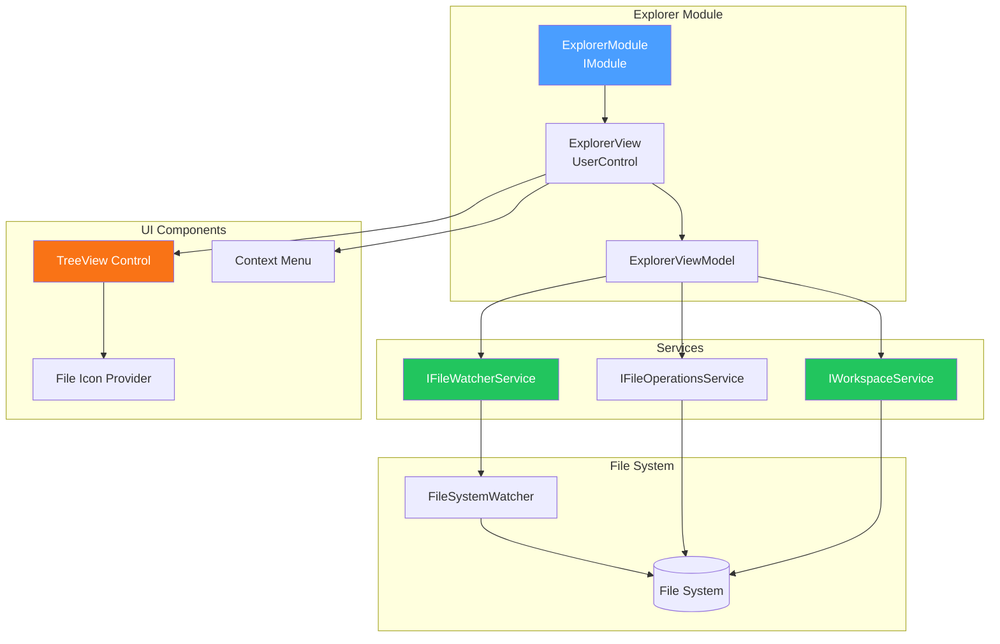
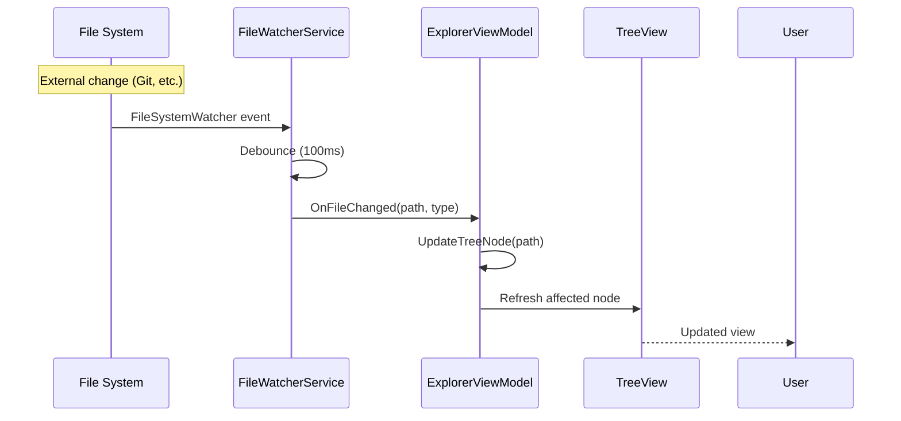

# LCS-DES-012: Design Specification Index — The Explorer (Project Management)

## Document Control

| Field                | Value                                       |
| :------------------- | :------------------------------------------ |
| **Document ID**      | LCS-DES-012-INDEX                           |
| **Feature ID**       | INF-012                                     |
| **Feature Name**     | The Explorer (Project Management)           |
| **Target Version**   | v0.1.2                                      |
| **Module Scope**     | Lexichord.Modules.Explorer                  |
| **Swimlane**         | Infrastructure                              |
| **License Tier**     | Core                                        |
| **Feature Gate Key** | N/A                                         |
| **Status**           | Draft                                       |
| **Last Updated**     | 2026-01-27                                  |

---

## 1. Executive Summary

**v0.1.2** establishes the **workspace-aware file navigation system** that enables users to browse and manage project files. This release implements a VS Code-style project explorer with file system watching, tree view, and context menu actions.

### 1.1 The Problem

Lexichord users need to work with project files:

- Navigate folder structures to find documents
- Create, rename, and delete files and folders
- Detect when files change externally (e.g., Git operations)
- Open files in the document editor

Without this infrastructure:

- Users must use external file managers
- No awareness of project context
- Cannot detect external file modifications
- Workflow disruption switching between applications

### 1.2 The Solution

Implement a complete project explorer with:

- **Workspace Service** — IWorkspaceService with current open folder state
- **File System Watcher** — Robust wrapper for detecting external changes
- **Tree View UI** — Recursive folder tree with file icons
- **Context Menu Actions** — New File, New Folder, Rename, Delete, Reveal

### 1.3 Business Value

| Value                   | Description                                           |
| :---------------------- | :---------------------------------------------------- |
| **Productivity**        | Navigate files without leaving the application        |
| **Awareness**           | Detect external file changes automatically            |
| **Convenience**         | Create/rename/delete files in context                 |
| **Professional UX**     | VS Code-style explorer matches expectations           |
| **Foundation**          | Enables document opening and project features         |

---

## 2. Related Documents

### 2.1 Scope Breakdown Document

The detailed scope breakdown for v0.1.2, including all sub-parts, implementation checklists, and acceptance criteria:

| Document                            | Description                                  |
| :---------------------------------- | :------------------------------------------- |
| **[LCS-SBD-012](./LCS-SBD-012.md)** | Scope Breakdown — The Explorer               |

### 2.2 Sub-Part Design Specifications

Each sub-part has its own detailed design specification following the LDS-01 template:

| Sub-Part | Document                              | Title                        | Description                              |
| :------- | :------------------------------------ | :--------------------------- | :--------------------------------------- |
| v0.1.2a  | **[LCS-DES-012a](./LCS-DES-012a.md)** | Workspace Service            | IWorkspaceService with folder state      |
| v0.1.2b  | **[LCS-DES-012b](./LCS-DES-012b.md)** | File System Watcher          | Robust external change detection         |
| v0.1.2c  | **[LCS-DES-012c](./LCS-DES-012c.md)** | Tree View UI                 | Recursive folder tree with icons         |
| v0.1.2d  | **[LCS-DES-012d](./LCS-DES-012d.md)** | Context Menu Actions         | File/folder CRUD operations              |

---

## 3. Architecture Overview

### 3.1 Component Diagram

### 3.2 File Change Detection Sequence

---

## 4. Dependencies

### 4.1 Upstream Dependencies

| Dependency           | Source Version | Purpose                           |
| :------------------- | :------------- | :-------------------------------- |
| Module System        | v0.0.4         | ExplorerModule registration       |
| Layout Engine        | v0.1.1         | Docking in left tool region       |
| DI Container         | v0.0.3a        | Service registration              |
| MediatR              | v0.0.7         | File change events                |

### 4.2 NuGet Packages

| Package                          | Version | Purpose                                 |
| :------------------------------- | :------ | :-------------------------------------- |
| `Avalonia`                       | 11.2.x  | TreeView and context menu controls      |
| `CommunityToolkit.Mvvm`          | 8.x     | ViewModel base and commands             |

### 4.3 Downstream Consumers (Future)

| Version | Feature             | Uses From v0.1.2                          |
| :------ | :------------------ | :---------------------------------------- |
| v0.2.x  | Document Editor     | File opening from explorer                |
| v0.3.x  | Style Module        | Style file management                     |
| v0.4.x  | RAG Module          | Knowledge base file browsing              |

---

## 5. License Gating Strategy

**N/A** — The project explorer is Core infrastructure required by all license tiers. No runtime gating is applied.

---

## 6. Key Interfaces Summary

| Interface                    | Defined In | Purpose                               |
| :--------------------------- | :--------- | :------------------------------------ |
| `IWorkspaceService`          | v0.1.2a    | Current workspace/folder management   |
| `IFileWatcherService`        | v0.1.2b    | File system change monitoring         |
| `IFileOperationsService`     | v0.1.2d    | File/folder CRUD operations           |

| Record/DTO               | Defined In | Purpose                               |
| :----------------------- | :--------- | :------------------------------------ |
| `WorkspaceInfo`          | v0.1.2a    | Current workspace metadata            |
| `FileChangeEvent`        | v0.1.2b    | File change notification              |
| `FileTreeNode`           | v0.1.2c    | Tree view node data                   |

---

## 7. Implementation Checklist Summary

| Sub-Part  | Key Deliverables                                             | Est. Hours   | Status |
| :-------- | :----------------------------------------------------------- | :----------- | :----- |
| v0.1.2a   | IWorkspaceService, workspace state, recent folders           | 4            | [ ]    |
| v0.1.2b   | FileWatcherService, debouncing, error recovery               | 5            | [ ]    |
| v0.1.2c   | TreeView, lazy loading, file icons, selection                | 5            | [ ]    |
| v0.1.2d   | Context menu, New/Rename/Delete dialogs, Reveal in Explorer  | 4            | [ ]    |
| **Total** |                                                              | **18 hours** |        |

See [LCS-SBD-012](./LCS-SBD-012.md) Section 3 for the detailed implementation checklist.

---

## 8. Success Criteria Summary

| Category        | Criterion                                              | Target |
| :-------------- | :----------------------------------------------------- | :----- |
| **Workspace**   | Can open folder as workspace                           | Pass   |
| **Tree View**   | Folders expand to show contents                        | Pass   |
| **Icons**       | Files show appropriate type icons                      | Pass   |
| **Watching**    | External changes reflected in tree                     | Pass   |
| **Create**      | Can create new files and folders                       | Pass   |
| **Rename**      | Can rename files and folders                           | Pass   |
| **Delete**      | Can delete with confirmation                           | Pass   |
| **Reveal**      | Can reveal in system file manager                      | Pass   |

See individual design specs for detailed acceptance criteria.

---

## 9. Test Coverage Summary

| Sub-Part | Unit Tests                                | Integration Tests                  |
| :------- | :---------------------------------------- | :--------------------------------- |
| v0.1.2a  | Workspace state management                | Folder open/close cycle            |
| v0.1.2b  | Debouncing, event coalescing              | Real file system changes           |
| v0.1.2c  | Tree node creation, lazy loading          | Full tree rendering                |
| v0.1.2d  | Operation validation, path handling       | CRUD operations on temp files      |

See individual design specs for detailed test scenarios.

---

## 10. What This Enables

| Version | Feature             | Depends On v0.1.2                             |
| :------ | :------------------ | :-------------------------------------------- |
| v0.2.x  | Document Editor     | Double-click to open files                    |
| v0.3.x  | Style Module        | Browse and select style files                 |
| v0.4.x  | RAG Module          | Select files for knowledge base               |
| v0.5.x  | Git Integration     | File status indicators in tree                |

---

## 11. Risks & Mitigations

| Risk                                  | Impact | Mitigation                                        |
| :------------------------------------ | :----- | :------------------------------------------------ |
| FileSystemWatcher reliability         | High   | Wrapper with error recovery and reconnection      |
| Large folder performance              | Medium | Lazy loading and virtualization                   |
| File permission errors                | Medium | Graceful error handling with user feedback        |
| Race conditions on rapid changes      | Low    | Debouncing and coalescing of events               |

---

## Document History

| Version | Date       | Author           | Changes                                                   |
| :------ | :--------- | :--------------- | :-------------------------------------------------------- |
| 1.0     | 2026-01-27 | System Architect | Created INDEX from legacy LCS-INF-012 during standardization |
