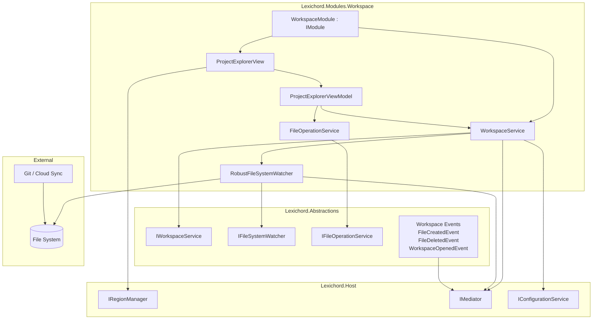
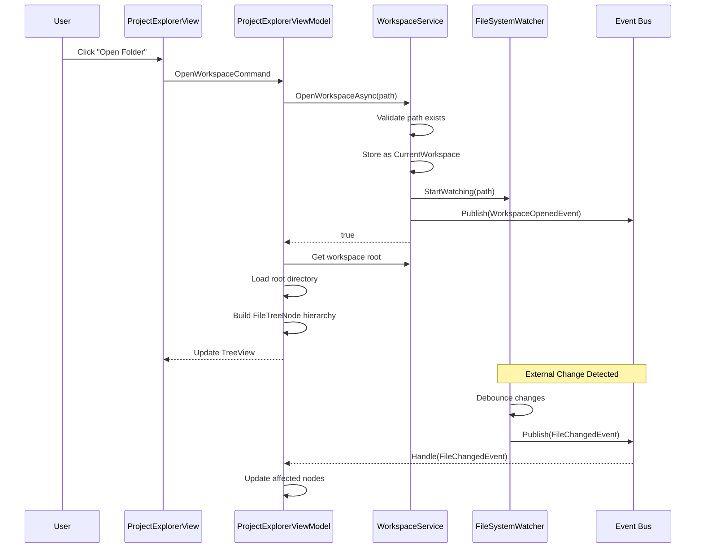
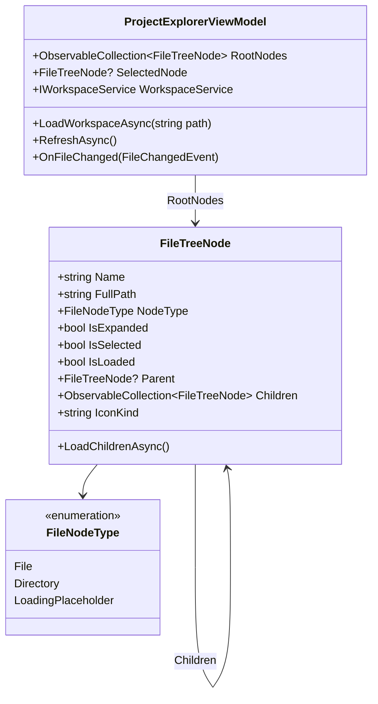

# LCS-INF-012: Feature Design Specification — Explorer (Project Management)

## 1. Metadata & Categorization

| Field                | Value                                    | Description                                           |
| :------------------- | :--------------------------------------- | :---------------------------------------------------- |
| **Feature ID**       | `INF-012`                                | Infrastructure - Explorer (Project Management)        |
| **Feature Name**     | Explorer (Project Management)            | Workspace-aware file navigation system                |
| **Target Version**   | `v0.1.2`                                 | Workspace Foundation Milestone                        |
| **Module Scope**     | `Lexichord.Modules.Workspace`            | First feature module                                  |
| **Swimlane**         | `Infrastructure`                         | The Podium (Platform)                                 |
| **License Tier**     | `Core`                                   | Foundation (Required for all tiers)                   |
| **Feature Gate Key** | N/A                                      | No runtime gating for workspace functionality         |
| **Author**           | System Architect                         |                                                       |
| **Status**           | **Draft**                                | Pending implementation                                |
| **Last Updated**     | 2026-01-26                               |                                                       |

---

## 2. Executive Summary

### 2.1 The Requirement

Writers need to work with **multi-file projects**—novels with chapters, research documents, notes, and outlines. The current application lacks:

- A way to open a folder as a "project" or "workspace"
- Navigation between files in the project
- Awareness of external changes (git, Dropbox, other editors)
- Basic file management (create, rename, delete)

Without this infrastructure:
- Writers must use File > Open for every individual file
- No project context for future AI features (RAG, suggestions)
- No visual overview of manuscript structure
- Poor integration with version control and cloud sync

### 2.2 The Proposed Solution

We **SHALL** implement a complete workspace management system with:

1. **v0.1.2a: Workspace Service** — `IWorkspaceService` holding current open folder state.
2. **v0.1.2b: File System Watcher** — Robust wrapper for detecting external file changes.
3. **v0.1.2c: Tree View UI** — `ProjectExplorerView` with recursive folders and file icons.
4. **v0.1.2d: Context Menu Actions** — New File, New Folder, Rename, Delete, Reveal.

---

## 3. Architecture & Modular Strategy

### 3.1 High-Level Architecture



### 3.2 Workspace Lifecycle Sequence



### 3.3 File Tree Structure



### 3.4 Dependencies

**NuGet Packages:**

| Package | Version | Purpose |
|:--------|:--------|:--------|
| `Material.Icons.Avalonia` | 2.x | File type icons |
| `CommunityToolkit.Mvvm` | 8.x | MVVM infrastructure (existing) |

**Project References:**

| Project | Reference Direction |
|:--------|:--------------------|
| `Lexichord.Modules.Workspace` | -> `Lexichord.Abstractions` |
| `Lexichord.Host` | -> `Lexichord.Abstractions` |
| `Lexichord.Host` | Discovers module DLL at runtime |

### 3.5 Licensing Behavior

- **N/A for Workspace Module:** Core infrastructure available to all tiers.
- Future: Multiple simultaneous workspaces may be gated to WriterPro tier.

---

## 4. Decision Tree: Workspace Operations

```text
START: "What workspace operation is requested?"
│
├── Open Workspace
│   ├── Is a workspace already open?
│   │   ├── YES → Close current workspace first
│   │   └── NO → Continue
│   ├── Does path exist?
│   │   ├── YES → Continue
│   │   └── NO → Show error, abort
│   ├── Is path a directory?
│   │   ├── YES → Continue
│   │   └── NO → Show error, abort
│   ├── Start file watcher
│   ├── Publish WorkspaceOpenedEvent
│   ├── Add to recent workspaces
│   └── Load root directory into tree
│
├── Close Workspace
│   ├── Is workspace open?
│   │   ├── YES → Continue
│   │   └── NO → No-op
│   ├── Stop file watcher
│   ├── Clear tree nodes
│   ├── Publish WorkspaceClosedEvent
│   └── Clear CurrentWorkspace
│
├── External File Change Detected
│   ├── Is change within workspace?
│   │   ├── YES → Continue
│   │   └── NO → Ignore
│   ├── Debounce window (100ms)
│   ├── Batch accumulated changes
│   ├── For each change:
│   │   ├── Created → Add node if parent visible
│   │   ├── Deleted → Remove node if exists
│   │   ├── Renamed → Update node name/path
│   │   └── Changed → Mark node as modified (future)
│   └── Publish appropriate events
│
├── User Creates File/Folder
│   ├── Is target path writable?
│   │   ├── YES → Continue
│   │   └── NO → Show permission error
│   ├── Does name conflict exist?
│   │   ├── YES → Prompt for different name
│   │   └── NO → Continue
│   ├── Create file/folder on disk
│   ├── Add node to tree
│   ├── Publish FileCreatedEvent
│   └── Select new node
│
└── User Deletes File/Folder
    ├── Show confirmation dialog
    ├── User confirms?
    │   ├── YES → Continue
    │   └── NO → Abort
    ├── Delete from disk
    ├── Remove node from tree
    └── Publish FileDeletedEvent
```

---

## 5. Data Contracts

### 5.1 IWorkspaceService Interface

```csharp
namespace Lexichord.Abstractions.Contracts;

/// <summary>
/// Service for managing the current workspace (open folder) state.
/// </summary>
/// <remarks>
/// LOGIC: The WorkspaceService is the source of truth for the currently
/// open project folder. It manages:
/// - Opening/closing workspaces
/// - File system watcher lifecycle
/// - Recent workspaces list persistence
/// - Publishing workspace events
///
/// Only ONE workspace can be open at a time (v0.1.2).
/// Multiple workspaces may be supported in future versions.
/// </remarks>
public interface IWorkspaceService
{
    /// <summary>
    /// Gets the currently open workspace, or null if no workspace is open.
    /// </summary>
    WorkspaceInfo? CurrentWorkspace { get; }

    /// <summary>
    /// Gets whether a workspace is currently open.
    /// </summary>
    bool IsWorkspaceOpen { get; }

    /// <summary>
    /// Opens a folder as the current workspace.
    /// </summary>
    /// <param name="folderPath">Absolute path to the folder.</param>
    /// <returns>True if opened successfully, false otherwise.</returns>
    /// <remarks>
    /// LOGIC: If a workspace is already open, it is closed first.
    /// Opening a workspace:
    /// 1. Validates the path exists and is a directory
    /// 2. Closes any existing workspace
    /// 3. Sets CurrentWorkspace
    /// 4. Starts file system watcher
    /// 5. Adds to recent workspaces
    /// 6. Publishes WorkspaceOpenedEvent
    /// </remarks>
    Task<bool> OpenWorkspaceAsync(string folderPath);

    /// <summary>
    /// Closes the current workspace.
    /// </summary>
    /// <remarks>
    /// LOGIC: Closing a workspace:
    /// 1. Stops file system watcher
    /// 2. Clears CurrentWorkspace
    /// 3. Publishes WorkspaceClosedEvent
    /// Does nothing if no workspace is open.
    /// </remarks>
    Task CloseWorkspaceAsync();

    /// <summary>
    /// Gets the list of recently opened workspaces.
    /// </summary>
    /// <returns>List of folder paths, most recent first.</returns>
    /// <remarks>
    /// LOGIC: Limited to 10 entries. Persisted via IConfigurationService.
    /// </remarks>
    IReadOnlyList<string> GetRecentWorkspaces();

    /// <summary>
    /// Clears the recent workspaces list.
    /// </summary>
    Task ClearRecentWorkspacesAsync();

    /// <summary>
    /// Event raised when the workspace changes.
    /// </summary>
    event EventHandler<WorkspaceChangedEventArgs>? WorkspaceChanged;
}

/// <summary>
/// Information about the current workspace.
/// </summary>
/// <param name="RootPath">Absolute path to the workspace root folder.</param>
/// <param name="Name">Display name (folder name).</param>
/// <param name="OpenedAt">When the workspace was opened.</param>
public record WorkspaceInfo(
    string RootPath,
    string Name,
    DateTimeOffset OpenedAt
);

/// <summary>
/// Event args for workspace changes.
/// </summary>
public class WorkspaceChangedEventArgs : EventArgs
{
    public required WorkspaceChangeType ChangeType { get; init; }
    public WorkspaceInfo? PreviousWorkspace { get; init; }
    public WorkspaceInfo? NewWorkspace { get; init; }
}

/// <summary>
/// Types of workspace changes.
/// </summary>
public enum WorkspaceChangeType
{
    Opened,
    Closed
}
```

### 5.2 IFileSystemWatcher Interface

```csharp
namespace Lexichord.Abstractions.Contracts;

/// <summary>
/// Robust file system watcher with debouncing and error recovery.
/// </summary>
/// <remarks>
/// LOGIC: Wraps System.IO.FileSystemWatcher with improvements:
/// - Debounces rapid changes (git operations trigger many events)
/// - Handles buffer overflow gracefully
/// - Recovers from watcher failures
/// - Filters ignored patterns (.git, node_modules, etc.)
/// - Batches changes for efficient processing
/// </remarks>
public interface IFileSystemWatcher : IDisposable
{
    /// <summary>
    /// Gets the path being watched.
    /// </summary>
    string? WatchPath { get; }

    /// <summary>
    /// Gets whether the watcher is currently active.
    /// </summary>
    bool IsWatching { get; }

    /// <summary>
    /// Starts watching a directory for changes.
    /// </summary>
    /// <param name="path">Directory path to watch.</param>
    /// <param name="filter">File filter pattern (default: all files).</param>
    /// <param name="includeSubdirectories">Watch subdirectories (default: true).</param>
    /// <remarks>
    /// LOGIC: Stops any existing watcher before starting new one.
    /// Sets up notifications for Created, Changed, Deleted, Renamed.
    /// </remarks>
    void StartWatching(string path, string filter = "*.*", bool includeSubdirectories = true);

    /// <summary>
    /// Stops watching the current directory.
    /// </summary>
    void StopWatching();

    /// <summary>
    /// Gets or sets the debounce delay in milliseconds.
    /// </summary>
    /// <remarks>
    /// LOGIC: Changes within this window are batched together.
    /// Default: 100ms. Higher values reduce event frequency but increase latency.
    /// </remarks>
    int DebounceDelayMs { get; set; }

    /// <summary>
    /// Gets or sets patterns to ignore (e.g., ".git", "node_modules").
    /// </summary>
    IList<string> IgnorePatterns { get; }

    /// <summary>
    /// Event raised when file system changes are detected.
    /// </summary>
    /// <remarks>
    /// LOGIC: Raised after debounce window with batched changes.
    /// </remarks>
    event EventHandler<FileSystemChangeBatchEventArgs>? ChangesDetected;

    /// <summary>
    /// Event raised when an error occurs in the watcher.
    /// </summary>
    event EventHandler<FileSystemWatcherErrorEventArgs>? Error;
}

/// <summary>
/// Batched file system changes.
/// </summary>
public class FileSystemChangeBatchEventArgs : EventArgs
{
    public required IReadOnlyList<FileSystemChangeInfo> Changes { get; init; }
}

/// <summary>
/// Information about a single file system change.
/// </summary>
/// <param name="ChangeType">Type of change.</param>
/// <param name="FullPath">Full path to the affected item.</param>
/// <param name="OldPath">Previous path for rename operations.</param>
/// <param name="IsDirectory">Whether the item is a directory.</param>
public record FileSystemChangeInfo(
    FileSystemChangeType ChangeType,
    string FullPath,
    string? OldPath,
    bool IsDirectory
);

/// <summary>
/// Types of file system changes.
/// </summary>
public enum FileSystemChangeType
{
    Created,
    Changed,
    Deleted,
    Renamed
}

/// <summary>
/// Error information from file system watcher.
/// </summary>
public class FileSystemWatcherErrorEventArgs : EventArgs
{
    public required Exception Exception { get; init; }
    public required bool IsRecoverable { get; init; }
}
```

### 5.3 IFileOperationService Interface

```csharp
namespace Lexichord.Abstractions.Contracts;

/// <summary>
/// Service for performing file operations in the workspace.
/// </summary>
/// <remarks>
/// LOGIC: Centralizes file operations to:
/// - Validate operations before execution
/// - Publish events via Event Bus
/// - Handle errors consistently
/// - Support undo in future versions
/// </remarks>
public interface IFileOperationService
{
    /// <summary>
    /// Creates a new file in the specified directory.
    /// </summary>
    /// <param name="parentPath">Directory to create file in.</param>
    /// <param name="fileName">Name for the new file.</param>
    /// <param name="content">Initial content (default: empty).</param>
    /// <returns>Full path to created file, or null if failed.</returns>
    /// <remarks>
    /// LOGIC: Creates file, publishes FileCreatedEvent.
    /// Returns null if file already exists or parent doesn't exist.
    /// </remarks>
    Task<string?> CreateFileAsync(string parentPath, string fileName, string content = "");

    /// <summary>
    /// Creates a new folder in the specified directory.
    /// </summary>
    /// <param name="parentPath">Directory to create folder in.</param>
    /// <param name="folderName">Name for the new folder.</param>
    /// <returns>Full path to created folder, or null if failed.</returns>
    Task<string?> CreateFolderAsync(string parentPath, string folderName);

    /// <summary>
    /// Renames a file or folder.
    /// </summary>
    /// <param name="path">Path to the item to rename.</param>
    /// <param name="newName">New name (not full path).</param>
    /// <returns>True if renamed successfully.</returns>
    /// <remarks>
    /// LOGIC: Renames item, publishes FileRenamedEvent.
    /// Returns false if new name conflicts or path doesn't exist.
    /// </remarks>
    Task<bool> RenameAsync(string path, string newName);

    /// <summary>
    /// Deletes a file or folder.
    /// </summary>
    /// <param name="path">Path to the item to delete.</param>
    /// <param name="recursive">For folders, delete contents recursively.</param>
    /// <returns>True if deleted successfully.</returns>
    /// <remarks>
    /// LOGIC: Deletes item, publishes FileDeletedEvent.
    /// For folders, recursive must be true to delete non-empty folders.
    /// </remarks>
    Task<bool> DeleteAsync(string path, bool recursive = false);

    /// <summary>
    /// Opens the containing folder in the system file explorer.
    /// </summary>
    /// <param name="path">Path to reveal.</param>
    /// <remarks>
    /// LOGIC: Cross-platform - uses Explorer (Windows), Finder (macOS),
    /// or xdg-open (Linux).
    /// </remarks>
    Task RevealInExplorerAsync(string path);

    /// <summary>
    /// Checks if a path exists and returns its type.
    /// </summary>
    /// <param name="path">Path to check.</param>
    /// <returns>File, Directory, or NotFound.</returns>
    FileExistsResult PathExists(string path);
}

/// <summary>
/// Result of path existence check.
/// </summary>
public enum FileExistsResult
{
    NotFound,
    File,
    Directory
}
```

### 5.4 Workspace Events

```csharp
namespace Lexichord.Abstractions.Events;

using MediatR;

/// <summary>
/// Event published when a workspace is opened.
/// </summary>
/// <param name="WorkspaceRootPath">Absolute path to the workspace root.</param>
/// <param name="WorkspaceName">Display name of the workspace.</param>
public record WorkspaceOpenedEvent(
    string WorkspaceRootPath,
    string WorkspaceName
) : INotification;

/// <summary>
/// Event published when a workspace is closed.
/// </summary>
/// <param name="WorkspaceRootPath">Path of the closed workspace.</param>
public record WorkspaceClosedEvent(
    string WorkspaceRootPath
) : INotification;

/// <summary>
/// Event published when a file is created in the workspace.
/// </summary>
/// <param name="FilePath">Full path to the created file.</param>
/// <param name="FileName">Name of the file.</param>
/// <param name="IsDirectory">True if a directory was created.</param>
public record FileCreatedEvent(
    string FilePath,
    string FileName,
    bool IsDirectory
) : INotification;

/// <summary>
/// Event published when a file is deleted from the workspace.
/// </summary>
/// <param name="FilePath">Full path to the deleted file.</param>
/// <param name="FileName">Name of the file.</param>
/// <param name="IsDirectory">True if a directory was deleted.</param>
public record FileDeletedEvent(
    string FilePath,
    string FileName,
    bool IsDirectory
) : INotification;

/// <summary>
/// Event published when a file is renamed in the workspace.
/// </summary>
/// <param name="OldPath">Previous full path.</param>
/// <param name="NewPath">New full path.</param>
/// <param name="OldName">Previous name.</param>
/// <param name="NewName">New name.</param>
/// <param name="IsDirectory">True if a directory was renamed.</param>
public record FileRenamedEvent(
    string OldPath,
    string NewPath,
    string OldName,
    string NewName,
    bool IsDirectory
) : INotification;

/// <summary>
/// Event published when external file changes are detected.
/// </summary>
/// <param name="Changes">Batched changes detected by file watcher.</param>
public record ExternalFileChangesEvent(
    IReadOnlyList<FileSystemChangeInfo> Changes
) : INotification;
```

### 5.5 FileTreeNode Model

```csharp
namespace Lexichord.Modules.Workspace.Models;

using CommunityToolkit.Mvvm.ComponentModel;
using System.Collections.ObjectModel;

/// <summary>
/// Represents a node in the project explorer tree.
/// </summary>
/// <remarks>
/// LOGIC: FileTreeNode is the fundamental building block of the tree view.
/// Key design decisions:
/// - Lazy loading: Children are loaded on first expansion
/// - Observable: Changes notify the UI automatically
/// - Sortable: Directories before files, then alphabetical
/// - Icon mapping: File extension -> Material icon
/// </remarks>
public partial class FileTreeNode : ObservableObject
{
    /// <summary>
    /// Gets the file or folder name.
    /// </summary>
    public required string Name { get; init; }

    /// <summary>
    /// Gets the full path to this item.
    /// </summary>
    public required string FullPath { get; init; }

    /// <summary>
    /// Gets whether this node represents a directory.
    /// </summary>
    public required bool IsDirectory { get; init; }

    /// <summary>
    /// Gets the parent node, or null for root nodes.
    /// </summary>
    public FileTreeNode? Parent { get; init; }

    /// <summary>
    /// Gets the child nodes.
    /// </summary>
    /// <remarks>
    /// LOGIC: For directories, initially contains a placeholder.
    /// Actual children are loaded when IsExpanded becomes true.
    /// </remarks>
    public ObservableCollection<FileTreeNode> Children { get; } = new();

    [ObservableProperty]
    private bool _isExpanded;

    [ObservableProperty]
    private bool _isSelected;

    [ObservableProperty]
    private bool _isEditing;

    [ObservableProperty]
    private string _editName = string.Empty;

    /// <summary>
    /// Gets whether children have been loaded.
    /// </summary>
    public bool IsLoaded { get; private set; }

    /// <summary>
    /// Gets the Material icon kind for this node.
    /// </summary>
    public string IconKind => IsDirectory
        ? (IsExpanded ? "FolderOpen" : "Folder")
        : GetFileIcon(Name);

    /// <summary>
    /// Gets the sort key for ordering nodes.
    /// </summary>
    /// <remarks>
    /// LOGIC: Directories sort before files, then alphabetically.
    /// </remarks>
    public string SortKey => $"{(IsDirectory ? "0" : "1")}_{Name.ToLowerInvariant()}";

    /// <summary>
    /// Loads children for this directory node.
    /// </summary>
    /// <param name="fileSystem">File system access.</param>
    public async Task LoadChildrenAsync(IFileSystemAccess fileSystem)
    {
        if (!IsDirectory || IsLoaded)
            return;

        Children.Clear();

        var entries = await fileSystem.GetDirectoryContentsAsync(FullPath);
        var sortedEntries = entries.OrderBy(e => e.SortKey);

        foreach (var entry in sortedEntries)
        {
            var childNode = new FileTreeNode
            {
                Name = entry.Name,
                FullPath = entry.FullPath,
                IsDirectory = entry.IsDirectory,
                Parent = this
            };

            if (entry.IsDirectory)
            {
                // Add placeholder for lazy loading indicator
                childNode.Children.Add(CreateLoadingPlaceholder());
            }

            Children.Add(childNode);
        }

        IsLoaded = true;
    }

    partial void OnIsExpandedChanged(bool value)
    {
        // Notify icon change (folder open/closed)
        OnPropertyChanged(nameof(IconKind));
    }

    private static FileTreeNode CreateLoadingPlaceholder()
    {
        return new FileTreeNode
        {
            Name = "Loading...",
            FullPath = string.Empty,
            IsDirectory = false,
            IsLoaded = true
        };
    }

    private static string GetFileIcon(string fileName)
    {
        var extension = Path.GetExtension(fileName).ToLowerInvariant();
        return extension switch
        {
            ".md" or ".markdown" => "FileDocumentOutline",
            ".txt" => "FileDocument",
            ".json" => "CodeJson",
            ".xml" => "Xml",
            ".yaml" or ".yml" => "FileCode",
            ".cs" => "LanguageCsharp",
            ".py" => "LanguagePython",
            ".js" or ".ts" => "LanguageJavascript",
            ".html" or ".htm" => "LanguageHtml5",
            ".css" or ".scss" => "LanguageCss3",
            ".png" or ".jpg" or ".jpeg" or ".gif" or ".svg" => "FileImage",
            ".pdf" => "FilePdfBox",
            ".zip" or ".tar" or ".gz" => "FolderZip",
            _ => "File"
        };
    }
}
```

---

## 6. Implementation Logic

### 6.1 WorkspaceModule Implementation

```csharp
using Lexichord.Abstractions.Contracts;
using Microsoft.Extensions.DependencyInjection;
using Microsoft.Extensions.Logging;

namespace Lexichord.Modules.Workspace;

/// <summary>
/// Module providing workspace management functionality.
/// </summary>
/// <remarks>
/// LOGIC: WorkspaceModule is the first feature module in Lexichord.
/// It demonstrates the module pattern:
/// - Implements IModule interface
/// - Registers services in DI container
/// - Registers views with IRegionManager
/// - References only Abstractions, not Host
/// </remarks>
public sealed class WorkspaceModule : IModule
{
    /// <inheritdoc/>
    public ModuleInfo Info => new()
    {
        Id = "Lexichord.Modules.Workspace",
        Name = "Workspace",
        Version = new Version(0, 1, 2),
        Description = "Project explorer and workspace management",
        Author = "Lexichord Team",
        Dependencies = Array.Empty<string>()
    };

    /// <inheritdoc/>
    public void RegisterServices(IServiceCollection services)
    {
        // Core services
        services.AddSingleton<IWorkspaceService, WorkspaceService>();
        services.AddSingleton<IFileSystemWatcher, RobustFileSystemWatcher>();
        services.AddScoped<IFileOperationService, FileOperationService>();

        // View models
        services.AddTransient<ProjectExplorerViewModel>();

        // Views
        services.AddTransient<ProjectExplorerView>();
    }

    /// <inheritdoc/>
    public async Task InitializeAsync(IServiceProvider serviceProvider)
    {
        var logger = serviceProvider.GetRequiredService<ILogger<WorkspaceModule>>();
        logger.LogInformation("Initializing Workspace module");

        // Register view in Left dock region
        var regionManager = serviceProvider.GetRequiredService<IRegionManager>();
        regionManager.RegisterView<ProjectExplorerView>(
            ShellRegion.Left,
            new RegionViewOptions(
                Title: "Explorer",
                Order: 0,
                Icon: "FolderOpen",
                CanClose: false,
                IsInitiallyVisible: true
            )
        );

        logger.LogInformation("Workspace module initialized");
        await Task.CompletedTask;
    }

    /// <inheritdoc/>
    public async Task ShutdownAsync()
    {
        // Cleanup handled by IDisposable services
        await Task.CompletedTask;
    }
}
```

### 6.2 WorkspaceService Implementation

```csharp
using Lexichord.Abstractions.Contracts;
using Lexichord.Abstractions.Events;
using MediatR;
using Microsoft.Extensions.Logging;

namespace Lexichord.Modules.Workspace.Services;

/// <summary>
/// Implementation of workspace state management.
/// </summary>
/// <remarks>
/// LOGIC: WorkspaceService is the source of truth for workspace state.
/// It coordinates between the file watcher, configuration, and event bus.
/// </remarks>
public sealed class WorkspaceService : IWorkspaceService, IDisposable
{
    private const int MaxRecentWorkspaces = 10;
    private const string RecentWorkspacesKey = "workspace:recent";

    private readonly IFileSystemWatcher _fileWatcher;
    private readonly IConfigurationService _configService;
    private readonly IMediator _mediator;
    private readonly ILogger<WorkspaceService> _logger;

    private WorkspaceInfo? _currentWorkspace;

    public WorkspaceService(
        IFileSystemWatcher fileWatcher,
        IConfigurationService configService,
        IMediator mediator,
        ILogger<WorkspaceService> logger)
    {
        _fileWatcher = fileWatcher;
        _configService = configService;
        _mediator = mediator;
        _logger = logger;

        // Subscribe to file watcher events
        _fileWatcher.ChangesDetected += OnFileChangesDetected;
        _fileWatcher.Error += OnFileWatcherError;
    }

    /// <inheritdoc/>
    public WorkspaceInfo? CurrentWorkspace => _currentWorkspace;

    /// <inheritdoc/>
    public bool IsWorkspaceOpen => _currentWorkspace is not null;

    /// <inheritdoc/>
    public event EventHandler<WorkspaceChangedEventArgs>? WorkspaceChanged;

    /// <inheritdoc/>
    public async Task<bool> OpenWorkspaceAsync(string folderPath)
    {
        _logger.LogInformation("Opening workspace: {Path}", folderPath);

        // Validate path
        if (!Directory.Exists(folderPath))
        {
            _logger.LogWarning("Workspace path does not exist: {Path}", folderPath);
            return false;
        }

        // Close existing workspace if open
        if (IsWorkspaceOpen)
        {
            await CloseWorkspaceAsync();
        }

        // Create workspace info
        var previous = _currentWorkspace;
        _currentWorkspace = new WorkspaceInfo(
            RootPath: Path.GetFullPath(folderPath),
            Name: Path.GetFileName(folderPath) ?? folderPath,
            OpenedAt: DateTimeOffset.UtcNow
        );

        // Start file watcher
        _fileWatcher.StartWatching(_currentWorkspace.RootPath);

        // Add to recent workspaces
        await AddToRecentWorkspacesAsync(_currentWorkspace.RootPath);

        // Publish event
        await _mediator.Publish(new WorkspaceOpenedEvent(
            _currentWorkspace.RootPath,
            _currentWorkspace.Name
        ));

        // Raise local event
        WorkspaceChanged?.Invoke(this, new WorkspaceChangedEventArgs
        {
            ChangeType = WorkspaceChangeType.Opened,
            PreviousWorkspace = previous,
            NewWorkspace = _currentWorkspace
        });

        _logger.LogInformation(
            "Workspace opened successfully: {Name} at {Path}",
            _currentWorkspace.Name,
            _currentWorkspace.RootPath);

        return true;
    }

    /// <inheritdoc/>
    public async Task CloseWorkspaceAsync()
    {
        if (!IsWorkspaceOpen)
            return;

        var previous = _currentWorkspace;
        _logger.LogInformation("Closing workspace: {Path}", previous?.RootPath);

        // Stop file watcher
        _fileWatcher.StopWatching();

        // Clear state
        _currentWorkspace = null;

        // Publish event
        if (previous is not null)
        {
            await _mediator.Publish(new WorkspaceClosedEvent(previous.RootPath));
        }

        // Raise local event
        WorkspaceChanged?.Invoke(this, new WorkspaceChangedEventArgs
        {
            ChangeType = WorkspaceChangeType.Closed,
            PreviousWorkspace = previous,
            NewWorkspace = null
        });

        _logger.LogInformation("Workspace closed");
    }

    /// <inheritdoc/>
    public IReadOnlyList<string> GetRecentWorkspaces()
    {
        var json = _configService.GetValue<string>(RecentWorkspacesKey);
        if (string.IsNullOrEmpty(json))
            return Array.Empty<string>();

        try
        {
            return System.Text.Json.JsonSerializer.Deserialize<List<string>>(json)
                ?? new List<string>();
        }
        catch
        {
            return Array.Empty<string>();
        }
    }

    /// <inheritdoc/>
    public async Task ClearRecentWorkspacesAsync()
    {
        await _configService.SetValueAsync(RecentWorkspacesKey, "[]");
        _logger.LogInformation("Recent workspaces cleared");
    }

    private async Task AddToRecentWorkspacesAsync(string path)
    {
        var recent = GetRecentWorkspaces().ToList();

        // Remove if already exists (will be re-added at top)
        recent.RemoveAll(p => p.Equals(path, StringComparison.OrdinalIgnoreCase));

        // Add at top
        recent.Insert(0, path);

        // Trim to max
        if (recent.Count > MaxRecentWorkspaces)
            recent = recent.Take(MaxRecentWorkspaces).ToList();

        // Persist
        var json = System.Text.Json.JsonSerializer.Serialize(recent);
        await _configService.SetValueAsync(RecentWorkspacesKey, json);
    }

    private async void OnFileChangesDetected(object? sender, FileSystemChangeBatchEventArgs e)
    {
        _logger.LogDebug("External file changes detected: {Count} changes", e.Changes.Count);

        // Publish event for other handlers
        await _mediator.Publish(new ExternalFileChangesEvent(e.Changes));
    }

    private void OnFileWatcherError(object? sender, FileSystemWatcherErrorEventArgs e)
    {
        _logger.LogError(e.Exception, "File watcher error (recoverable: {IsRecoverable})", e.IsRecoverable);

        if (!e.IsRecoverable && _currentWorkspace is not null)
        {
            _logger.LogWarning("Attempting to restart file watcher");
            _fileWatcher.StopWatching();
            _fileWatcher.StartWatching(_currentWorkspace.RootPath);
        }
    }

    public void Dispose()
    {
        _fileWatcher.ChangesDetected -= OnFileChangesDetected;
        _fileWatcher.Error -= OnFileWatcherError;
    }
}
```

---

## 7. Use Cases & User Stories

### 7.1 User Stories

| ID | Role | Story | Acceptance Criteria |
|:---|:-----|:------|:--------------------|
| US-01 | Writer | As a writer, I want to open a folder as a workspace to see all my project files. | Folder opens, tree shows contents. |
| US-02 | Writer | As a writer, I want to see my files in a familiar tree structure. | Tree shows folders and files with icons. |
| US-03 | Writer | As a writer, I want to create new files and folders from the explorer. | Right-click menu with New File/Folder. |
| US-04 | Writer | As a writer, I want to rename files by pressing F2. | F2 enters inline edit mode. |
| US-05 | Writer | As a writer, I want to delete files with confirmation. | Delete shows confirmation dialog. |
| US-06 | Writer | As a writer, I want changes from Git to appear automatically. | External changes update tree. |
| US-07 | Writer | As a writer, I want to quickly open recent projects. | Recent workspaces in menu. |
| US-08 | Developer | As a module developer, I want to react to workspace changes. | WorkspaceOpenedEvent published. |

### 7.2 Use Cases

#### UC-01: Open Workspace

**Preconditions:**
- Application is running.
- No workspace is currently open.

**Flow:**
1. User clicks "Open Folder" button or File > Open Folder.
2. System shows folder picker dialog.
3. User selects a folder.
4. WorkspaceService validates folder exists.
5. WorkspaceService sets CurrentWorkspace.
6. FileSystemWatcher starts watching folder.
7. WorkspaceOpenedEvent is published.
8. ProjectExplorerViewModel receives event.
9. ProjectExplorerViewModel loads root directory.
10. Tree view displays folder contents.

**Postconditions:**
- Workspace is open.
- Tree shows folder contents.
- File watcher is active.

---

#### UC-02: External File Creation (Git Checkout)

**Preconditions:**
- Workspace is open.
- User runs `git checkout` in terminal.
- Git creates new files.

**Flow:**
1. FileSystemWatcher detects Created events.
2. Debounce window accumulates events.
3. After 100ms, ChangesDetected event fires.
4. WorkspaceService publishes ExternalFileChangesEvent.
5. ProjectExplorerViewModel handles event.
6. For each created file:
   a. Find parent node in tree.
   b. If parent is expanded, add child node.
7. Tree view updates to show new files.

**Postconditions:**
- New files appear in tree.
- No user action required.

---

#### UC-03: Create New File

**Preconditions:**
- Workspace is open.
- User has a folder selected in tree.

**Flow:**
1. User right-clicks folder.
2. Context menu appears with "New File".
3. User clicks "New File".
4. New node appears with inline text box.
5. User types "chapter-3.md".
6. User presses Enter.
7. FileOperationService.CreateFileAsync() called.
8. File created on disk.
9. FileCreatedEvent published.
10. Node finalized in tree.
11. New file is selected.

**Postconditions:**
- File exists on disk.
- File appears in tree.
- File is selected.

---

## 8. Observability & Logging

### 8.1 Log Events

| Level | Context | Message Template |
|:------|:--------|:-----------------|
| Information | WorkspaceModule | `Initializing Workspace module` |
| Information | WorkspaceModule | `Workspace module initialized` |
| Information | WorkspaceService | `Opening workspace: {Path}` |
| Warning | WorkspaceService | `Workspace path does not exist: {Path}` |
| Information | WorkspaceService | `Workspace opened successfully: {Name} at {Path}` |
| Information | WorkspaceService | `Closing workspace: {Path}` |
| Information | WorkspaceService | `Workspace closed` |
| Information | WorkspaceService | `Recent workspaces cleared` |
| Debug | WorkspaceService | `External file changes detected: {Count} changes` |
| Error | WorkspaceService | `File watcher error (recoverable: {IsRecoverable})` |
| Warning | WorkspaceService | `Attempting to restart file watcher` |
| Debug | RobustFileSystemWatcher | `Starting file watcher on: {Path}` |
| Debug | RobustFileSystemWatcher | `File watcher stopped` |
| Warning | RobustFileSystemWatcher | `Buffer overflow in file watcher, some events may be missed` |
| Debug | RobustFileSystemWatcher | `Debounced {Count} changes` |
| Debug | FileOperationService | `Creating file: {Path}` |
| Debug | FileOperationService | `Creating folder: {Path}` |
| Debug | FileOperationService | `Renaming {OldPath} to {NewPath}` |
| Debug | FileOperationService | `Deleting: {Path}` |
| Warning | FileOperationService | `File operation failed: {Operation} on {Path}` |

---

## 9. Unit Testing Requirements

### 9.1 WorkspaceService Tests

```csharp
[TestFixture]
[Category("Unit")]
public class WorkspaceServiceTests
{
    private Mock<IFileSystemWatcher> _mockWatcher = null!;
    private Mock<IConfigurationService> _mockConfig = null!;
    private Mock<IMediator> _mockMediator = null!;
    private Mock<ILogger<WorkspaceService>> _mockLogger = null!;
    private WorkspaceService _sut = null!;
    private string _tempDir = null!;

    [SetUp]
    public void SetUp()
    {
        _mockWatcher = new Mock<IFileSystemWatcher>();
        _mockConfig = new Mock<IConfigurationService>();
        _mockMediator = new Mock<IMediator>();
        _mockLogger = new Mock<ILogger<WorkspaceService>>();

        _sut = new WorkspaceService(
            _mockWatcher.Object,
            _mockConfig.Object,
            _mockMediator.Object,
            _mockLogger.Object);

        _tempDir = Path.Combine(Path.GetTempPath(), Guid.NewGuid().ToString());
        Directory.CreateDirectory(_tempDir);
    }

    [TearDown]
    public void TearDown()
    {
        _sut.Dispose();
        if (Directory.Exists(_tempDir))
            Directory.Delete(_tempDir, true);
    }

    [Test]
    public async Task OpenWorkspaceAsync_ValidPath_ReturnsTrue()
    {
        // Act
        var result = await _sut.OpenWorkspaceAsync(_tempDir);

        // Assert
        Assert.Multiple(() =>
        {
            Assert.That(result, Is.True);
            Assert.That(_sut.IsWorkspaceOpen, Is.True);
            Assert.That(_sut.CurrentWorkspace?.RootPath, Is.EqualTo(_tempDir));
        });
    }

    [Test]
    public async Task OpenWorkspaceAsync_InvalidPath_ReturnsFalse()
    {
        // Arrange
        var invalidPath = "/nonexistent/path/12345";

        // Act
        var result = await _sut.OpenWorkspaceAsync(invalidPath);

        // Assert
        Assert.Multiple(() =>
        {
            Assert.That(result, Is.False);
            Assert.That(_sut.IsWorkspaceOpen, Is.False);
        });
    }

    [Test]
    public async Task OpenWorkspaceAsync_PublishesWorkspaceOpenedEvent()
    {
        // Act
        await _sut.OpenWorkspaceAsync(_tempDir);

        // Assert
        _mockMediator.Verify(m => m.Publish(
            It.Is<WorkspaceOpenedEvent>(e => e.WorkspaceRootPath == _tempDir),
            It.IsAny<CancellationToken>()), Times.Once);
    }

    [Test]
    public async Task OpenWorkspaceAsync_StartsFileWatcher()
    {
        // Act
        await _sut.OpenWorkspaceAsync(_tempDir);

        // Assert
        _mockWatcher.Verify(w => w.StartWatching(
            _tempDir,
            It.IsAny<string>(),
            It.IsAny<bool>()), Times.Once);
    }

    [Test]
    public async Task CloseWorkspaceAsync_StopsFileWatcher()
    {
        // Arrange
        await _sut.OpenWorkspaceAsync(_tempDir);

        // Act
        await _sut.CloseWorkspaceAsync();

        // Assert
        _mockWatcher.Verify(w => w.StopWatching(), Times.Once);
    }

    [Test]
    public async Task CloseWorkspaceAsync_PublishesWorkspaceClosedEvent()
    {
        // Arrange
        await _sut.OpenWorkspaceAsync(_tempDir);

        // Act
        await _sut.CloseWorkspaceAsync();

        // Assert
        _mockMediator.Verify(m => m.Publish(
            It.Is<WorkspaceClosedEvent>(e => e.WorkspaceRootPath == _tempDir),
            It.IsAny<CancellationToken>()), Times.Once);
    }

    [Test]
    public async Task OpenWorkspaceAsync_ClosesExistingWorkspace()
    {
        // Arrange
        var firstPath = _tempDir;
        var secondPath = Path.Combine(Path.GetTempPath(), Guid.NewGuid().ToString());
        Directory.CreateDirectory(secondPath);

        try
        {
            await _sut.OpenWorkspaceAsync(firstPath);

            // Act
            await _sut.OpenWorkspaceAsync(secondPath);

            // Assert
            _mockMediator.Verify(m => m.Publish(
                It.Is<WorkspaceClosedEvent>(e => e.WorkspaceRootPath == firstPath),
                It.IsAny<CancellationToken>()), Times.Once);
        }
        finally
        {
            Directory.Delete(secondPath, true);
        }
    }
}
```

### 9.2 RobustFileSystemWatcher Tests

```csharp
[TestFixture]
[Category("Unit")]
public class RobustFileSystemWatcherTests
{
    private string _tempDir = null!;
    private RobustFileSystemWatcher _sut = null!;

    [SetUp]
    public void SetUp()
    {
        _tempDir = Path.Combine(Path.GetTempPath(), Guid.NewGuid().ToString());
        Directory.CreateDirectory(_tempDir);
        _sut = new RobustFileSystemWatcher(Mock.Of<ILogger<RobustFileSystemWatcher>>());
    }

    [TearDown]
    public void TearDown()
    {
        _sut.Dispose();
        if (Directory.Exists(_tempDir))
            Directory.Delete(_tempDir, true);
    }

    [Test]
    public void StartWatching_SetsIsWatching()
    {
        // Act
        _sut.StartWatching(_tempDir);

        // Assert
        Assert.That(_sut.IsWatching, Is.True);
    }

    [Test]
    public void StopWatching_ClearsIsWatching()
    {
        // Arrange
        _sut.StartWatching(_tempDir);

        // Act
        _sut.StopWatching();

        // Assert
        Assert.That(_sut.IsWatching, Is.False);
    }

    [Test]
    public async Task FileCreation_RaisesChangesDetected()
    {
        // Arrange
        var eventRaised = new TaskCompletionSource<FileSystemChangeBatchEventArgs>();
        _sut.ChangesDetected += (s, e) => eventRaised.TrySetResult(e);
        _sut.DebounceDelayMs = 50;
        _sut.StartWatching(_tempDir);

        // Act
        var filePath = Path.Combine(_tempDir, "test.txt");
        await File.WriteAllTextAsync(filePath, "content");

        // Assert
        var args = await eventRaised.Task.WaitAsync(TimeSpan.FromSeconds(2));
        Assert.That(args.Changes, Has.Some.Matches<FileSystemChangeInfo>(
            c => c.ChangeType == FileSystemChangeType.Created));
    }

    [Test]
    public void IgnorePatterns_AreRespected()
    {
        // Arrange
        _sut.IgnorePatterns.Add(".git");

        // Act
        _sut.StartWatching(_tempDir);

        // Assert (indirect - .git folder changes should be ignored)
        Assert.That(_sut.IgnorePatterns, Contains.Item(".git"));
    }
}
```

### 9.3 FileOperationService Tests

```csharp
[TestFixture]
[Category("Unit")]
public class FileOperationServiceTests
{
    private Mock<IMediator> _mockMediator = null!;
    private Mock<ILogger<FileOperationService>> _mockLogger = null!;
    private FileOperationService _sut = null!;
    private string _tempDir = null!;

    [SetUp]
    public void SetUp()
    {
        _mockMediator = new Mock<IMediator>();
        _mockLogger = new Mock<ILogger<FileOperationService>>();
        _sut = new FileOperationService(_mockMediator.Object, _mockLogger.Object);

        _tempDir = Path.Combine(Path.GetTempPath(), Guid.NewGuid().ToString());
        Directory.CreateDirectory(_tempDir);
    }

    [TearDown]
    public void TearDown()
    {
        if (Directory.Exists(_tempDir))
            Directory.Delete(_tempDir, true);
    }

    [Test]
    public async Task CreateFileAsync_CreatesFile()
    {
        // Act
        var result = await _sut.CreateFileAsync(_tempDir, "test.txt");

        // Assert
        Assert.Multiple(() =>
        {
            Assert.That(result, Is.Not.Null);
            Assert.That(File.Exists(result), Is.True);
        });
    }

    [Test]
    public async Task CreateFileAsync_PublishesFileCreatedEvent()
    {
        // Act
        await _sut.CreateFileAsync(_tempDir, "test.txt");

        // Assert
        _mockMediator.Verify(m => m.Publish(
            It.Is<FileCreatedEvent>(e => e.FileName == "test.txt"),
            It.IsAny<CancellationToken>()), Times.Once);
    }

    [Test]
    public async Task CreateFolderAsync_CreatesFolder()
    {
        // Act
        var result = await _sut.CreateFolderAsync(_tempDir, "subfolder");

        // Assert
        Assert.Multiple(() =>
        {
            Assert.That(result, Is.Not.Null);
            Assert.That(Directory.Exists(result), Is.True);
        });
    }

    [Test]
    public async Task RenameAsync_RenamesFile()
    {
        // Arrange
        var originalPath = Path.Combine(_tempDir, "original.txt");
        await File.WriteAllTextAsync(originalPath, "content");

        // Act
        var result = await _sut.RenameAsync(originalPath, "renamed.txt");

        // Assert
        Assert.Multiple(() =>
        {
            Assert.That(result, Is.True);
            Assert.That(File.Exists(originalPath), Is.False);
            Assert.That(File.Exists(Path.Combine(_tempDir, "renamed.txt")), Is.True);
        });
    }

    [Test]
    public async Task DeleteAsync_DeletesFile()
    {
        // Arrange
        var filePath = Path.Combine(_tempDir, "todelete.txt");
        await File.WriteAllTextAsync(filePath, "content");

        // Act
        var result = await _sut.DeleteAsync(filePath);

        // Assert
        Assert.Multiple(() =>
        {
            Assert.That(result, Is.True);
            Assert.That(File.Exists(filePath), Is.False);
        });
    }

    [Test]
    public void PathExists_File_ReturnsFile()
    {
        // Arrange
        var filePath = Path.Combine(_tempDir, "exists.txt");
        File.WriteAllText(filePath, "content");

        // Act
        var result = _sut.PathExists(filePath);

        // Assert
        Assert.That(result, Is.EqualTo(FileExistsResult.File));
    }

    [Test]
    public void PathExists_Directory_ReturnsDirectory()
    {
        // Act
        var result = _sut.PathExists(_tempDir);

        // Assert
        Assert.That(result, Is.EqualTo(FileExistsResult.Directory));
    }

    [Test]
    public void PathExists_NotFound_ReturnsNotFound()
    {
        // Act
        var result = _sut.PathExists("/nonexistent/path/12345");

        // Assert
        Assert.That(result, Is.EqualTo(FileExistsResult.NotFound));
    }
}
```

---

## 10. Security & Safety

### 10.1 Path Traversal Protection

> [!WARNING]
> File operations must validate paths to prevent directory traversal attacks.
> All paths should be normalized and verified to be within the workspace.

```csharp
private bool IsPathWithinWorkspace(string path, string workspaceRoot)
{
    var normalizedPath = Path.GetFullPath(path);
    var normalizedRoot = Path.GetFullPath(workspaceRoot);
    return normalizedPath.StartsWith(normalizedRoot, StringComparison.OrdinalIgnoreCase);
}
```

### 10.2 File Permission Handling

> [!NOTE]
> File operations may fail due to permissions. All operations should handle
> `UnauthorizedAccessException` and provide user-friendly error messages.

### 10.3 Sensitive File Protection

> [!IMPORTANT]
> The explorer should warn before deleting:
> - `.git` directories (version control)
> - `.env` files (secrets)
> - Large numbers of files (bulk delete confirmation)

---

## 11. Risks & Mitigations

| Risk | Impact | Mitigation |
|:-----|:-------|:-----------|
| FileSystemWatcher buffer overflow | High | Increase buffer; implement full refresh on overflow |
| Large directory performance | Medium | Lazy loading; virtualized tree view |
| Path separator issues (cross-platform) | Medium | Use Path.Combine; Path.DirectorySeparatorChar |
| File locked by another process | Medium | Retry with delay; user notification |
| Network drives slow performance | Low | Async operations; timeout handling |
| Symlink infinite loops | Medium | Track visited paths; depth limit |

---

## 12. Acceptance Criteria (QA)

| # | Category | Criterion |
|:--|:---------|:----------|
| 1 | **[Workspace]** | Can open a folder as workspace |
| 2 | **[Workspace]** | Can close the current workspace |
| 3 | **[Workspace]** | Recent workspaces are remembered |
| 4 | **[Tree]** | Tree view shows folder structure |
| 5 | **[Tree]** | Folders expand to show contents |
| 6 | **[Tree]** | File icons match file types |
| 7 | **[Tree]** | Double-click file (placeholder for editor) |
| 8 | **[Watcher]** | External file creation shows in tree |
| 9 | **[Watcher]** | External file deletion removes from tree |
| 10 | **[Watcher]** | Git operations update tree correctly |
| 11 | **[Context]** | Right-click shows context menu |
| 12 | **[Context]** | "New File" creates file |
| 13 | **[Context]** | "New Folder" creates folder |
| 14 | **[Context]** | F2 renames selected item |
| 15 | **[Context]** | Delete shows confirmation |
| 16 | **[Context]** | "Reveal in Explorer" opens file manager |
| 17 | **[Events]** | WorkspaceOpenedEvent is published |
| 18 | **[Events]** | FileCreatedEvent is published |
| 19 | **[Events]** | FileDeletedEvent is published |
| 20 | **[Logging]** | All operations are logged |

---

## 13. Verification Commands

```bash
# 1. Build the solution including Workspace module
dotnet build

# 2. Verify Workspace module DLL is output
ls -la src/Modules/Lexichord.Modules.Workspace/bin/Debug/net8.0/
# Expected: Lexichord.Modules.Workspace.dll

# 3. Run application and verify Explorer panel appears
dotnet run --project src/Lexichord.Host

# 4. Open a test folder and verify tree loads
# (Manual: File > Open Folder, select folder)

# 5. Run unit tests for Workspace module
dotnet test --filter "FullyQualifiedName~Workspace"

# 6. Run unit tests for file watcher
dotnet test --filter "FullyQualifiedName~FileSystemWatcher"

# 7. Run unit tests for file operations
dotnet test --filter "FullyQualifiedName~FileOperation"

# 8. Test external file changes
# (In separate terminal, create file in workspace)
touch /path/to/workspace/newfile.txt
# Verify file appears in tree

# 9. Test file watcher recovery
# (Create many files rapidly to trigger buffer overflow)
for i in {1..1000}; do touch /path/to/workspace/file$i.txt; done
# Verify tree eventually shows all files

# 10. Verify no memory leaks
# (Profile with dotMemory during workspace open/close cycles)
```

---

## 14. Deliverable Checklist

| Step | Description | Status |
|:-----|:------------|:-------|
| 1 | Create Lexichord.Modules.Workspace project | [ ] |
| 2 | Define IWorkspaceService interface in Abstractions | [ ] |
| 3 | Define IFileSystemWatcher interface in Abstractions | [ ] |
| 4 | Define IFileOperationService interface in Abstractions | [ ] |
| 5 | Define workspace events in Abstractions | [ ] |
| 6 | Implement WorkspaceModule : IModule | [ ] |
| 7 | Implement WorkspaceService | [ ] |
| 8 | Implement RobustFileSystemWatcher | [ ] |
| 9 | Implement FileOperationService | [ ] |
| 10 | Create FileTreeNode model | [ ] |
| 11 | Create ProjectExplorerViewModel | [ ] |
| 12 | Create ProjectExplorerView AXAML | [ ] |
| 13 | Add Material.Icons.Avalonia package | [ ] |
| 14 | Implement file type icon mapping | [ ] |
| 15 | Implement lazy loading for directories | [ ] |
| 16 | Register view with IRegionManager | [ ] |
| 17 | Create context menu in AXAML | [ ] |
| 18 | Implement New File action | [ ] |
| 19 | Implement New Folder action | [ ] |
| 20 | Implement Rename with F2 shortcut | [ ] |
| 21 | Implement Delete with confirmation | [ ] |
| 22 | Implement Reveal in Explorer | [ ] |
| 23 | Unit tests for WorkspaceService | [ ] |
| 24 | Unit tests for RobustFileSystemWatcher | [ ] |
| 25 | Unit tests for FileOperationService | [ ] |
| 26 | Unit tests for ProjectExplorerViewModel | [ ] |
| 27 | Integration tests for module loading | [ ] |
| 28 | Update CHANGELOG.md | [ ] |
