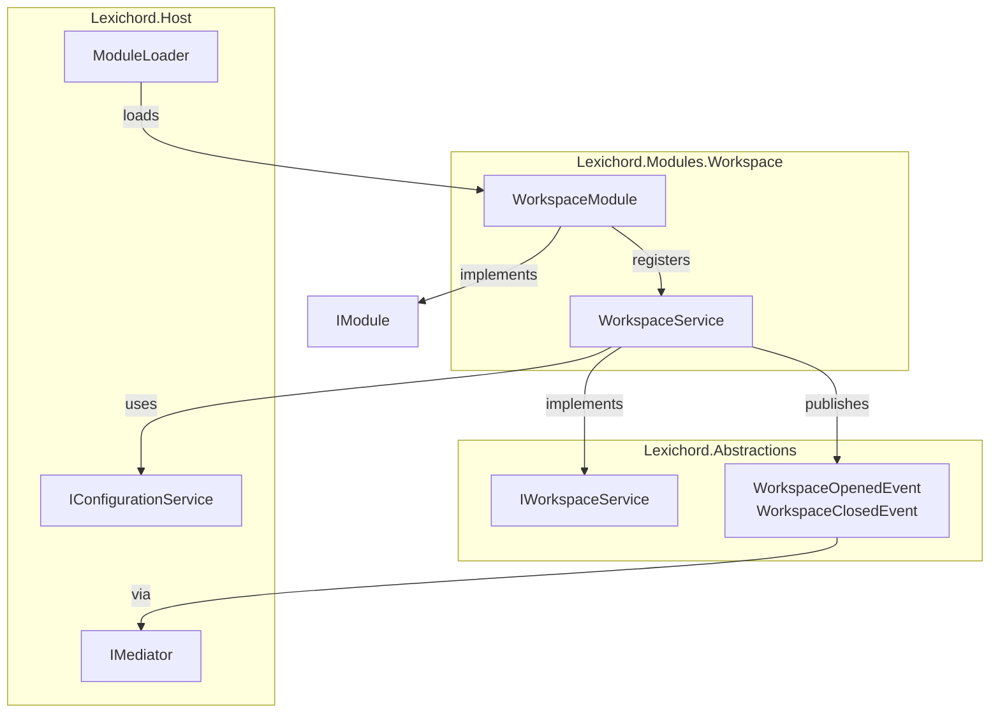
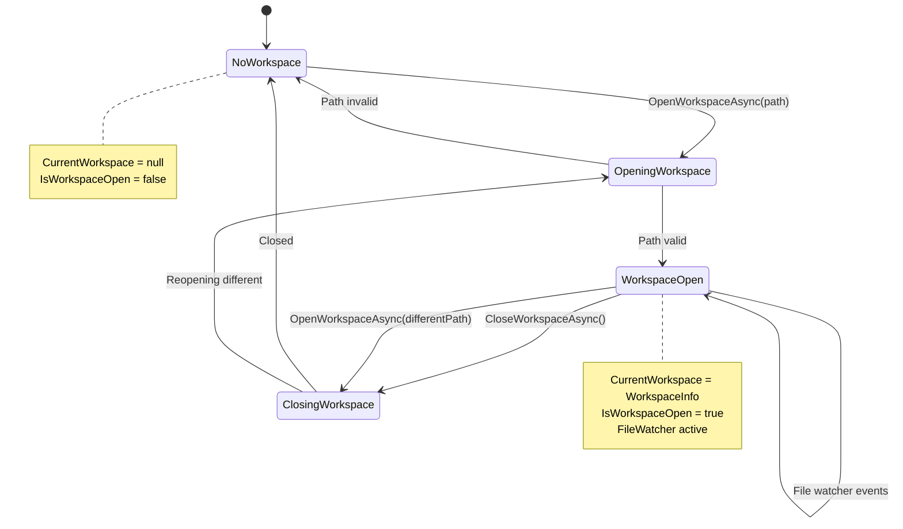
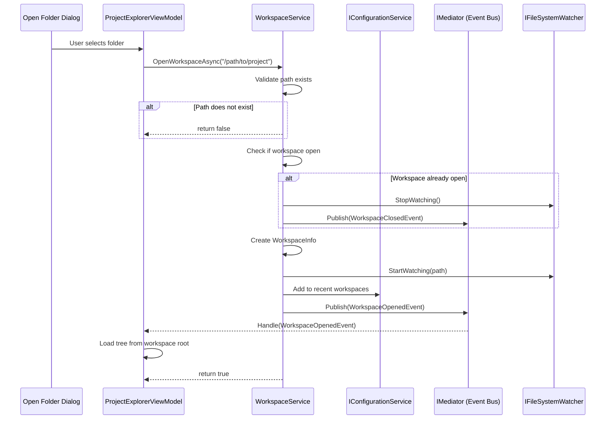

# LCS-INF-012a: Workspace Service Specification

## 1. Metadata & Categorization

| Field                | Value                                    | Description                                           |
| :------------------- | :--------------------------------------- | :---------------------------------------------------- |
| **Feature ID**       | `INF-012a`                               | Workspace Service                                     |
| **Feature Name**     | Workspace Service                        | IWorkspaceService with current open folder state      |
| **Target Version**   | `v0.1.2a`                                | First sub-part of Explorer                            |
| **Module Scope**     | `Lexichord.Modules.Workspace`            | New module project                                    |
| **Swimlane**         | `Infrastructure`                         | The Podium (Platform)                                 |
| **License Tier**     | `Core`                                   | Foundation (Required for all tiers)                   |
| **Feature Gate Key** | N/A                                      | No runtime gating                                     |
| **Author**           | System Architect                         |                                                       |
| **Status**           | **Draft**                                | Pending implementation                                |
| **Last Updated**     | 2026-01-26                               |                                                       |

---

## 2. Executive Summary

### 2.1 The Requirement

Lexichord needs to track which folder is currently open as the "workspace." This state drives:

- The Project Explorer tree view contents
- Context for future AI features (RAG will index workspace files)
- Recent workspaces menu for quick access
- File system watcher target path

Without centralized workspace state:
- Multiple components would track folder paths independently
- No single source of truth for "what is open"
- No coordination when workspace changes

### 2.2 The Proposed Solution

We **SHALL** implement:

1. **`Lexichord.Modules.Workspace`** — New module project implementing IModule
2. **`IWorkspaceService`** — Interface in Abstractions defining workspace operations
3. **`WorkspaceService`** — Implementation managing current folder state
4. **`WorkspaceInfo`** — Record holding workspace metadata
5. **Workspace Events** — `WorkspaceOpenedEvent`, `WorkspaceClosedEvent` via MediatR

---

## 3. Architecture

### 3.1 Component Diagram



### 3.2 State Machine



### 3.3 Sequence Diagram



---

## 4. Decision Tree

```text
START: "OpenWorkspaceAsync(path) called"
│
├── Does path exist?
│   ├── NO → Log warning, return false
│   └── YES → Continue
│
├── Is path a directory?
│   ├── NO → Log warning, return false
│   └── YES → Continue
│
├── Is a workspace already open?
│   ├── YES → Close existing workspace
│   │   ├── Stop file watcher
│   │   ├── Clear CurrentWorkspace
│   │   ├── Publish WorkspaceClosedEvent
│   │   └── Continue to open new
│   └── NO → Continue
│
├── Create WorkspaceInfo
│   ├── RootPath = Path.GetFullPath(path)
│   ├── Name = folder name
│   └── OpenedAt = DateTimeOffset.UtcNow
│
├── Set CurrentWorkspace
│
├── Start file watcher on path
│
├── Add path to recent workspaces
│   ├── Remove if already in list
│   ├── Insert at position 0
│   ├── Trim to max 10 entries
│   └── Persist via IConfigurationService
│
├── Publish WorkspaceOpenedEvent
│
├── Raise WorkspaceChanged event
│
└── Return true

---

START: "CloseWorkspaceAsync() called"
│
├── Is workspace open?
│   ├── NO → Return (no-op)
│   └── YES → Continue
│
├── Stop file watcher
│
├── Store previous workspace reference
│
├── Clear CurrentWorkspace (= null)
│
├── Publish WorkspaceClosedEvent
│
├── Raise WorkspaceChanged event
│
└── Return
```

---

## 5. Data Contracts

### 5.1 IWorkspaceService Interface

```csharp
namespace Lexichord.Abstractions.Contracts;

/// <summary>
/// Service for managing the current workspace (open folder) state.
/// </summary>
/// <remarks>
/// LOGIC: The WorkspaceService is the single source of truth for which folder
/// is currently open as the "workspace." This state drives:
/// - Project Explorer tree view
/// - File system watcher target
/// - RAG indexing context (future)
/// - Recent workspaces list
///
/// Design decisions:
/// - Only ONE workspace at a time (v0.1.2). Multi-workspace in future.
/// - Workspace = folder path. No project files or metadata.
/// - Events published via MediatR for loose coupling.
/// - Recent workspaces persisted via IConfigurationService.
/// </remarks>
public interface IWorkspaceService
{
    /// <summary>
    /// Gets the currently open workspace, or null if no workspace is open.
    /// </summary>
    /// <remarks>
    /// LOGIC: This is the primary property consumers check.
    /// Null indicates no folder is open.
    /// </remarks>
    WorkspaceInfo? CurrentWorkspace { get; }

    /// <summary>
    /// Gets whether a workspace is currently open.
    /// </summary>
    /// <remarks>
    /// LOGIC: Convenience property. Equivalent to CurrentWorkspace != null.
    /// </remarks>
    bool IsWorkspaceOpen { get; }

    /// <summary>
    /// Opens a folder as the current workspace.
    /// </summary>
    /// <param name="folderPath">Absolute path to the folder to open.</param>
    /// <returns>True if the workspace was opened successfully, false otherwise.</returns>
    /// <remarks>
    /// LOGIC: Opening a workspace involves:
    /// 1. Validate the path exists and is a directory
    /// 2. If a workspace is already open, close it first
    /// 3. Create WorkspaceInfo with normalized path
    /// 4. Start file system watcher
    /// 5. Add to recent workspaces list
    /// 6. Publish WorkspaceOpenedEvent
    ///
    /// Returns false if:
    /// - Path does not exist
    /// - Path is not a directory
    /// - An unexpected error occurs (logged)
    /// </remarks>
    Task<bool> OpenWorkspaceAsync(string folderPath);

    /// <summary>
    /// Closes the current workspace.
    /// </summary>
    /// <remarks>
    /// LOGIC: Closing a workspace involves:
    /// 1. Stop file system watcher
    /// 2. Clear CurrentWorkspace to null
    /// 3. Publish WorkspaceClosedEvent
    ///
    /// This method is idempotent - calling when no workspace is open is a no-op.
    /// </remarks>
    Task CloseWorkspaceAsync();

    /// <summary>
    /// Gets the list of recently opened workspaces.
    /// </summary>
    /// <returns>List of folder paths, most recent first. Maximum 10 entries.</returns>
    /// <remarks>
    /// LOGIC: Recent workspaces are persisted via IConfigurationService.
    /// Paths that no longer exist are NOT filtered out (they may exist again later).
    /// UI should check existence before offering "Open Recent."
    /// </remarks>
    IReadOnlyList<string> GetRecentWorkspaces();

    /// <summary>
    /// Clears the recent workspaces list.
    /// </summary>
    /// <remarks>
    /// LOGIC: Removes all entries from the recent workspaces list.
    /// Persists the empty list immediately.
    /// </remarks>
    Task ClearRecentWorkspacesAsync();

    /// <summary>
    /// Event raised when the workspace state changes.
    /// </summary>
    /// <remarks>
    /// LOGIC: Local event for components that need synchronous notification.
    /// For cross-module communication, use the MediatR events instead.
    /// </remarks>
    event EventHandler<WorkspaceChangedEventArgs>? WorkspaceChanged;
}
```

### 5.2 WorkspaceInfo Record

```csharp
namespace Lexichord.Abstractions.Contracts;

/// <summary>
/// Information about the current workspace.
/// </summary>
/// <param name="RootPath">Absolute, normalized path to the workspace root folder.</param>
/// <param name="Name">Display name for the workspace (folder name).</param>
/// <param name="OpenedAt">Timestamp when the workspace was opened.</param>
/// <remarks>
/// LOGIC: WorkspaceInfo is immutable. If workspace state changes (e.g., renamed),
/// a new WorkspaceInfo instance is created. This simplifies change detection.
///
/// RootPath is always:
/// - Absolute (not relative)
/// - Normalized via Path.GetFullPath()
/// - Uses platform-appropriate separators
/// </remarks>
public record WorkspaceInfo(
    string RootPath,
    string Name,
    DateTimeOffset OpenedAt
)
{
    /// <summary>
    /// Gets the root path as a DirectoryInfo.
    /// </summary>
    public DirectoryInfo Directory => new(RootPath);

    /// <summary>
    /// Checks if a given path is within this workspace.
    /// </summary>
    /// <param name="path">Path to check.</param>
    /// <returns>True if the path is within the workspace root.</returns>
    /// <remarks>
    /// LOGIC: Used for security validation and path filtering.
    /// Normalizes both paths before comparison.
    /// </remarks>
    public bool ContainsPath(string path)
    {
        var normalizedPath = Path.GetFullPath(path);
        var normalizedRoot = Path.GetFullPath(RootPath);

        // Ensure root ends with separator for correct prefix matching
        if (!normalizedRoot.EndsWith(Path.DirectorySeparatorChar))
            normalizedRoot += Path.DirectorySeparatorChar;

        return normalizedPath.StartsWith(normalizedRoot, StringComparison.OrdinalIgnoreCase)
            || normalizedPath.Equals(RootPath, StringComparison.OrdinalIgnoreCase);
    }
}
```

### 5.3 WorkspaceChangedEventArgs

```csharp
namespace Lexichord.Abstractions.Contracts;

/// <summary>
/// Event args for the WorkspaceChanged event.
/// </summary>
public class WorkspaceChangedEventArgs : EventArgs
{
    /// <summary>
    /// Gets the type of workspace change.
    /// </summary>
    public required WorkspaceChangeType ChangeType { get; init; }

    /// <summary>
    /// Gets the workspace that was open before the change, or null.
    /// </summary>
    public WorkspaceInfo? PreviousWorkspace { get; init; }

    /// <summary>
    /// Gets the workspace that is open after the change, or null.
    /// </summary>
    public WorkspaceInfo? NewWorkspace { get; init; }
}

/// <summary>
/// Types of workspace state changes.
/// </summary>
public enum WorkspaceChangeType
{
    /// <summary>
    /// A workspace was opened (possibly replacing another).
    /// </summary>
    Opened,

    /// <summary>
    /// The workspace was closed (no workspace now open).
    /// </summary>
    Closed
}
```

### 5.4 MediatR Events

```csharp
namespace Lexichord.Abstractions.Events;

using MediatR;

/// <summary>
/// Event published when a workspace is opened.
/// </summary>
/// <param name="WorkspaceRootPath">Absolute path to the workspace root.</param>
/// <param name="WorkspaceName">Display name of the workspace.</param>
/// <remarks>
/// LOGIC: Published after the workspace is fully opened:
/// - CurrentWorkspace is set
/// - File watcher is started
/// - Recent workspaces list is updated
///
/// Handlers can safely access IWorkspaceService.CurrentWorkspace.
/// </remarks>
public record WorkspaceOpenedEvent(
    string WorkspaceRootPath,
    string WorkspaceName
) : INotification;

/// <summary>
/// Event published when a workspace is closed.
/// </summary>
/// <param name="WorkspaceRootPath">Path of the workspace that was closed.</param>
/// <remarks>
/// LOGIC: Published after the workspace is closed:
/// - CurrentWorkspace is null
/// - File watcher is stopped
///
/// This event includes the path that WAS open (for reference by handlers).
/// After handling this event, IWorkspaceService.CurrentWorkspace is null.
/// </remarks>
public record WorkspaceClosedEvent(
    string WorkspaceRootPath
) : INotification;
```

### 5.5 Module Configuration

```csharp
namespace Lexichord.Modules.Workspace;

using Lexichord.Abstractions.Contracts;
using Microsoft.Extensions.DependencyInjection;
using Microsoft.Extensions.Logging;

/// <summary>
/// Module for workspace management functionality.
/// </summary>
/// <remarks>
/// LOGIC: WorkspaceModule is discovered and loaded by the Host's ModuleLoader.
/// It demonstrates the module pattern:
/// - Project references only Lexichord.Abstractions
/// - Implements IModule interface
/// - Registers services during RegisterServices phase
/// - Registers views during InitializeAsync phase
///
/// Output: ./Modules/Lexichord.Modules.Workspace.dll
/// </remarks>
[RequiresLicense(LicenseTier.Core)]
public sealed class WorkspaceModule : IModule
{
    /// <inheritdoc/>
    public ModuleInfo Info => new()
    {
        Id = "Lexichord.Modules.Workspace",
        Name = "Workspace",
        Version = new Version(0, 1, 2),
        Description = "Project explorer and workspace management for Lexichord",
        Author = "Lexichord Team",
        Dependencies = Array.Empty<string>()
    };

    /// <inheritdoc/>
    public void RegisterServices(IServiceCollection services)
    {
        // Workspace state management
        services.AddSingleton<IWorkspaceService, WorkspaceService>();

        // File system watcher (registered here, implemented in 012b)
        services.AddSingleton<IFileSystemWatcher, RobustFileSystemWatcher>();

        // File operations (registered here, implemented in 012d)
        services.AddScoped<IFileOperationService, FileOperationService>();

        // View models
        services.AddTransient<ProjectExplorerViewModel>();
    }

    /// <inheritdoc/>
    public async Task InitializeAsync(IServiceProvider serviceProvider)
    {
        var logger = serviceProvider.GetRequiredService<ILogger<WorkspaceModule>>();
        logger.LogInformation("Initializing Workspace module");

        // Register ProjectExplorerView in Left dock region
        var regionManager = serviceProvider.GetRequiredService<IRegionManager>();
        regionManager.RegisterView<ProjectExplorerView>(
            ShellRegion.Left,
            new RegionViewOptions(
                Title: "Explorer",
                Order: 0,
                Icon: "FolderOpen",
                CanClose: false,
                IsInitiallyVisible: true
            )
        );

        logger.LogInformation("Workspace module initialized - Explorer view registered");
        await Task.CompletedTask;
    }

    /// <inheritdoc/>
    public async Task ShutdownAsync()
    {
        // Services with IDisposable are cleaned up by DI container
        await Task.CompletedTask;
    }
}
```

---

## 6. Implementation Logic

### 6.1 WorkspaceService Implementation

```csharp
using Lexichord.Abstractions.Contracts;
using Lexichord.Abstractions.Events;
using MediatR;
using Microsoft.Extensions.Logging;
using System.Text.Json;

namespace Lexichord.Modules.Workspace.Services;

/// <summary>
/// Implementation of IWorkspaceService managing workspace state.
/// </summary>
/// <remarks>
/// LOGIC: WorkspaceService is the central coordinator for workspace state.
/// It owns:
/// - CurrentWorkspace property
/// - File watcher lifecycle (start/stop)
/// - Recent workspaces persistence
/// - Event publishing
///
/// Thread safety: All state changes are atomic. Events are published
/// after state changes complete.
/// </remarks>
public sealed class WorkspaceService : IWorkspaceService, IDisposable
{
    /// <summary>
    /// Maximum number of recent workspaces to remember.
    /// </summary>
    private const int MaxRecentWorkspaces = 10;

    /// <summary>
    /// Configuration key for recent workspaces storage.
    /// </summary>
    private const string RecentWorkspacesConfigKey = "workspace:recent";

    private readonly IFileSystemWatcher _fileWatcher;
    private readonly IConfigurationService _configService;
    private readonly IMediator _mediator;
    private readonly ILogger<WorkspaceService> _logger;
    private readonly object _stateLock = new();

    private WorkspaceInfo? _currentWorkspace;

    /// <summary>
    /// Initializes a new instance of WorkspaceService.
    /// </summary>
    public WorkspaceService(
        IFileSystemWatcher fileWatcher,
        IConfigurationService configService,
        IMediator mediator,
        ILogger<WorkspaceService> logger)
    {
        _fileWatcher = fileWatcher ?? throw new ArgumentNullException(nameof(fileWatcher));
        _configService = configService ?? throw new ArgumentNullException(nameof(configService));
        _mediator = mediator ?? throw new ArgumentNullException(nameof(mediator));
        _logger = logger ?? throw new ArgumentNullException(nameof(logger));

        // Wire up file watcher error handling
        _fileWatcher.Error += OnFileWatcherError;
    }

    /// <inheritdoc/>
    public WorkspaceInfo? CurrentWorkspace
    {
        get
        {
            lock (_stateLock)
            {
                return _currentWorkspace;
            }
        }
    }

    /// <inheritdoc/>
    public bool IsWorkspaceOpen => CurrentWorkspace is not null;

    /// <inheritdoc/>
    public event EventHandler<WorkspaceChangedEventArgs>? WorkspaceChanged;

    /// <inheritdoc/>
    public async Task<bool> OpenWorkspaceAsync(string folderPath)
    {
        ArgumentException.ThrowIfNullOrWhiteSpace(folderPath, nameof(folderPath));

        _logger.LogInformation("Opening workspace: {Path}", folderPath);

        // LOGIC: Validate path exists and is a directory
        if (!Directory.Exists(folderPath))
        {
            _logger.LogWarning("Cannot open workspace: path does not exist: {Path}", folderPath);
            return false;
        }

        WorkspaceInfo? previousWorkspace;
        WorkspaceInfo newWorkspace;

        // LOGIC: Perform state change atomically
        lock (_stateLock)
        {
            previousWorkspace = _currentWorkspace;

            // Create new workspace info with normalized path
            var normalizedPath = Path.GetFullPath(folderPath);
            var folderName = Path.GetFileName(normalizedPath);

            // Handle root paths (C:\ or /)
            if (string.IsNullOrEmpty(folderName))
            {
                folderName = normalizedPath;
            }

            newWorkspace = new WorkspaceInfo(
                RootPath: normalizedPath,
                Name: folderName,
                OpenedAt: DateTimeOffset.UtcNow
            );

            _currentWorkspace = newWorkspace;
        }

        // LOGIC: Close previous workspace if open (outside lock to avoid deadlock)
        if (previousWorkspace is not null)
        {
            _fileWatcher.StopWatching();

            await _mediator.Publish(new WorkspaceClosedEvent(previousWorkspace.RootPath));

            _logger.LogDebug("Previous workspace closed: {Path}", previousWorkspace.RootPath);
        }

        // LOGIC: Start file watcher on new workspace
        try
        {
            _fileWatcher.StartWatching(newWorkspace.RootPath);
        }
        catch (Exception ex)
        {
            _logger.LogError(ex, "Failed to start file watcher for workspace: {Path}", newWorkspace.RootPath);
            // Continue - workspace is still open, just without file watching
        }

        // LOGIC: Add to recent workspaces
        await AddToRecentWorkspacesAsync(newWorkspace.RootPath);

        // LOGIC: Publish MediatR event for cross-module notification
        await _mediator.Publish(new WorkspaceOpenedEvent(
            newWorkspace.RootPath,
            newWorkspace.Name
        ));

        // LOGIC: Raise local event for synchronous listeners
        WorkspaceChanged?.Invoke(this, new WorkspaceChangedEventArgs
        {
            ChangeType = WorkspaceChangeType.Opened,
            PreviousWorkspace = previousWorkspace,
            NewWorkspace = newWorkspace
        });

        _logger.LogInformation(
            "Workspace opened successfully: {Name} ({Path})",
            newWorkspace.Name,
            newWorkspace.RootPath);

        return true;
    }

    /// <inheritdoc/>
    public async Task CloseWorkspaceAsync()
    {
        WorkspaceInfo? previousWorkspace;

        // LOGIC: Perform state change atomically
        lock (_stateLock)
        {
            if (_currentWorkspace is null)
            {
                _logger.LogDebug("CloseWorkspaceAsync called but no workspace is open");
                return;
            }

            previousWorkspace = _currentWorkspace;
            _currentWorkspace = null;
        }

        _logger.LogInformation("Closing workspace: {Path}", previousWorkspace.RootPath);

        // LOGIC: Stop file watcher
        _fileWatcher.StopWatching();

        // LOGIC: Publish MediatR event
        await _mediator.Publish(new WorkspaceClosedEvent(previousWorkspace.RootPath));

        // LOGIC: Raise local event
        WorkspaceChanged?.Invoke(this, new WorkspaceChangedEventArgs
        {
            ChangeType = WorkspaceChangeType.Closed,
            PreviousWorkspace = previousWorkspace,
            NewWorkspace = null
        });

        _logger.LogInformation("Workspace closed: {Path}", previousWorkspace.RootPath);
    }

    /// <inheritdoc/>
    public IReadOnlyList<string> GetRecentWorkspaces()
    {
        try
        {
            var json = _configService.GetValue<string>(RecentWorkspacesConfigKey);

            if (string.IsNullOrWhiteSpace(json))
            {
                return Array.Empty<string>();
            }

            var workspaces = JsonSerializer.Deserialize<List<string>>(json);
            return workspaces ?? new List<string>();
        }
        catch (JsonException ex)
        {
            _logger.LogWarning(ex, "Failed to deserialize recent workspaces, returning empty list");
            return Array.Empty<string>();
        }
    }

    /// <inheritdoc/>
    public async Task ClearRecentWorkspacesAsync()
    {
        _logger.LogInformation("Clearing recent workspaces list");

        await _configService.SetValueAsync(RecentWorkspacesConfigKey, "[]");
    }

    /// <summary>
    /// Adds a path to the recent workspaces list.
    /// </summary>
    private async Task AddToRecentWorkspacesAsync(string path)
    {
        var recent = GetRecentWorkspaces().ToList();

        // LOGIC: Remove existing entry (if any) to move to top
        recent.RemoveAll(p => p.Equals(path, StringComparison.OrdinalIgnoreCase));

        // LOGIC: Insert at top (most recent)
        recent.Insert(0, path);

        // LOGIC: Trim to maximum entries
        if (recent.Count > MaxRecentWorkspaces)
        {
            recent = recent.Take(MaxRecentWorkspaces).ToList();
        }

        // LOGIC: Persist
        var json = JsonSerializer.Serialize(recent);
        await _configService.SetValueAsync(RecentWorkspacesConfigKey, json);

        _logger.LogDebug("Recent workspaces updated, now {Count} entries", recent.Count);
    }

    /// <summary>
    /// Handles file watcher errors.
    /// </summary>
    private void OnFileWatcherError(object? sender, FileSystemWatcherErrorEventArgs e)
    {
        _logger.LogError(
            e.Exception,
            "File watcher error (recoverable: {IsRecoverable})",
            e.IsRecoverable);

        if (!e.IsRecoverable && _currentWorkspace is not null)
        {
            _logger.LogWarning("Attempting to restart file watcher after unrecoverable error");

            try
            {
                _fileWatcher.StopWatching();
                _fileWatcher.StartWatching(_currentWorkspace.RootPath);
                _logger.LogInformation("File watcher restarted successfully");
            }
            catch (Exception restartEx)
            {
                _logger.LogError(restartEx, "Failed to restart file watcher");
            }
        }
    }

    /// <inheritdoc/>
    public void Dispose()
    {
        _fileWatcher.Error -= OnFileWatcherError;
    }
}
```

---

## 7. Use Cases

### 7.1 UC-01: Open Workspace via Menu

**Preconditions:**
- Application is running
- No workspace is currently open

**Flow:**
1. User clicks File > Open Folder
2. System shows folder picker dialog
3. User navigates to `/Users/writer/MyNovel` and clicks "Select"
4. WorkspaceService.OpenWorkspaceAsync("/Users/writer/MyNovel") is called
5. Service validates path exists
6. Service creates WorkspaceInfo
7. Service starts file watcher
8. Service adds to recent workspaces
9. Service publishes WorkspaceOpenedEvent
10. ProjectExplorerViewModel handles event
11. Tree view loads and displays folder contents

**Postconditions:**
- CurrentWorkspace.RootPath = "/Users/writer/MyNovel"
- CurrentWorkspace.Name = "MyNovel"
- IsWorkspaceOpen = true
- File watcher active
- Tree view shows folder contents

---

### 7.2 UC-02: Open Recent Workspace

**Preconditions:**
- Recent workspaces list contains entries
- One entry path no longer exists

**Flow:**
1. User clicks File > Open Recent
2. System shows list from GetRecentWorkspaces()
3. User selects "/Users/writer/OldProject" (which no longer exists)
4. OpenWorkspaceAsync returns false
5. System shows error: "Folder not found"
6. User selects "/Users/writer/CurrentProject" (exists)
7. OpenWorkspaceAsync returns true
8. Workspace opens normally

**Postconditions:**
- Workspace is open
- OldProject is NOT removed from recent list (it may return)

---

### 7.3 UC-03: Switch Workspaces

**Preconditions:**
- Workspace A is currently open

**Flow:**
1. User clicks File > Open Folder
2. User selects Workspace B folder
3. OpenWorkspaceAsync is called with B's path
4. Service detects workspace A is open
5. Service closes A (stops watcher, publishes WorkspaceClosedEvent)
6. ProjectExplorerViewModel clears tree
7. Service opens B (normal flow)
8. Tree view shows B's contents

**Postconditions:**
- CurrentWorkspace = WorkspaceInfo for B
- A's file watcher is stopped
- B's file watcher is active

---

## 8. Observability & Logging

### 8.1 Log Events

| Level | Message Template | When |
|:------|:-----------------|:-----|
| Information | `Opening workspace: {Path}` | OpenWorkspaceAsync called |
| Warning | `Cannot open workspace: path does not exist: {Path}` | Invalid path |
| Debug | `Previous workspace closed: {Path}` | When switching workspaces |
| Error | `Failed to start file watcher for workspace: {Path}` | Watcher startup fails |
| Information | `Workspace opened successfully: {Name} ({Path})` | Success |
| Debug | `CloseWorkspaceAsync called but no workspace is open` | Idempotent close |
| Information | `Closing workspace: {Path}` | CloseWorkspaceAsync start |
| Information | `Workspace closed: {Path}` | CloseWorkspaceAsync complete |
| Warning | `Failed to deserialize recent workspaces, returning empty list` | Corrupt config |
| Information | `Clearing recent workspaces list` | Clear recent called |
| Debug | `Recent workspaces updated, now {Count} entries` | After add |
| Error | `File watcher error (recoverable: {IsRecoverable})` | Watcher error |
| Warning | `Attempting to restart file watcher after unrecoverable error` | Recovery attempt |
| Information | `File watcher restarted successfully` | Recovery success |
| Error | `Failed to restart file watcher` | Recovery failed |

---

## 9. Unit Testing Requirements

### 9.1 Test Cases

```csharp
[TestFixture]
[Category("Unit")]
public class WorkspaceServiceTests
{
    private Mock<IFileSystemWatcher> _mockWatcher = null!;
    private Mock<IConfigurationService> _mockConfig = null!;
    private Mock<IMediator> _mockMediator = null!;
    private Mock<ILogger<WorkspaceService>> _mockLogger = null!;
    private WorkspaceService _sut = null!;
    private string _testDir = null!;

    [SetUp]
    public void SetUp()
    {
        _mockWatcher = new Mock<IFileSystemWatcher>();
        _mockConfig = new Mock<IConfigurationService>();
        _mockMediator = new Mock<IMediator>();
        _mockLogger = new Mock<ILogger<WorkspaceService>>();

        _sut = new WorkspaceService(
            _mockWatcher.Object,
            _mockConfig.Object,
            _mockMediator.Object,
            _mockLogger.Object);

        _testDir = Path.Combine(Path.GetTempPath(), $"workspace_test_{Guid.NewGuid()}");
        Directory.CreateDirectory(_testDir);
    }

    [TearDown]
    public void TearDown()
    {
        _sut.Dispose();
        if (Directory.Exists(_testDir))
            Directory.Delete(_testDir, recursive: true);
    }

    [Test]
    public void CurrentWorkspace_Initially_IsNull()
    {
        Assert.That(_sut.CurrentWorkspace, Is.Null);
    }

    [Test]
    public void IsWorkspaceOpen_Initially_IsFalse()
    {
        Assert.That(_sut.IsWorkspaceOpen, Is.False);
    }

    [Test]
    public async Task OpenWorkspaceAsync_ValidPath_ReturnsTrue()
    {
        var result = await _sut.OpenWorkspaceAsync(_testDir);
        Assert.That(result, Is.True);
    }

    [Test]
    public async Task OpenWorkspaceAsync_ValidPath_SetsCurrentWorkspace()
    {
        await _sut.OpenWorkspaceAsync(_testDir);

        Assert.Multiple(() =>
        {
            Assert.That(_sut.CurrentWorkspace, Is.Not.Null);
            Assert.That(_sut.CurrentWorkspace!.RootPath, Is.EqualTo(Path.GetFullPath(_testDir)));
            Assert.That(_sut.IsWorkspaceOpen, Is.True);
        });
    }

    [Test]
    public async Task OpenWorkspaceAsync_InvalidPath_ReturnsFalse()
    {
        var result = await _sut.OpenWorkspaceAsync("/nonexistent/path/12345");
        Assert.That(result, Is.False);
    }

    [Test]
    public async Task OpenWorkspaceAsync_InvalidPath_DoesNotSetWorkspace()
    {
        await _sut.OpenWorkspaceAsync("/nonexistent/path/12345");
        Assert.That(_sut.CurrentWorkspace, Is.Null);
    }

    [Test]
    public async Task OpenWorkspaceAsync_StartsFileWatcher()
    {
        await _sut.OpenWorkspaceAsync(_testDir);

        _mockWatcher.Verify(w => w.StartWatching(
            It.Is<string>(s => s == Path.GetFullPath(_testDir)),
            It.IsAny<string>(),
            It.IsAny<bool>()), Times.Once);
    }

    [Test]
    public async Task OpenWorkspaceAsync_PublishesWorkspaceOpenedEvent()
    {
        await _sut.OpenWorkspaceAsync(_testDir);

        _mockMediator.Verify(m => m.Publish(
            It.Is<WorkspaceOpenedEvent>(e => e.WorkspaceRootPath == Path.GetFullPath(_testDir)),
            It.IsAny<CancellationToken>()), Times.Once);
    }

    [Test]
    public async Task OpenWorkspaceAsync_RaisesWorkspaceChangedEvent()
    {
        WorkspaceChangedEventArgs? eventArgs = null;
        _sut.WorkspaceChanged += (s, e) => eventArgs = e;

        await _sut.OpenWorkspaceAsync(_testDir);

        Assert.Multiple(() =>
        {
            Assert.That(eventArgs, Is.Not.Null);
            Assert.That(eventArgs!.ChangeType, Is.EqualTo(WorkspaceChangeType.Opened));
            Assert.That(eventArgs.PreviousWorkspace, Is.Null);
            Assert.That(eventArgs.NewWorkspace, Is.Not.Null);
        });
    }

    [Test]
    public async Task OpenWorkspaceAsync_WithExistingWorkspace_ClosesFirst()
    {
        var secondDir = Path.Combine(Path.GetTempPath(), $"workspace_test_{Guid.NewGuid()}");
        Directory.CreateDirectory(secondDir);

        try
        {
            await _sut.OpenWorkspaceAsync(_testDir);
            await _sut.OpenWorkspaceAsync(secondDir);

            _mockMediator.Verify(m => m.Publish(
                It.Is<WorkspaceClosedEvent>(e => e.WorkspaceRootPath == Path.GetFullPath(_testDir)),
                It.IsAny<CancellationToken>()), Times.Once);
        }
        finally
        {
            Directory.Delete(secondDir, recursive: true);
        }
    }

    [Test]
    public async Task CloseWorkspaceAsync_WhenOpen_ClearsWorkspace()
    {
        await _sut.OpenWorkspaceAsync(_testDir);
        await _sut.CloseWorkspaceAsync();

        Assert.Multiple(() =>
        {
            Assert.That(_sut.CurrentWorkspace, Is.Null);
            Assert.That(_sut.IsWorkspaceOpen, Is.False);
        });
    }

    [Test]
    public async Task CloseWorkspaceAsync_WhenOpen_StopsFileWatcher()
    {
        await _sut.OpenWorkspaceAsync(_testDir);
        await _sut.CloseWorkspaceAsync();

        _mockWatcher.Verify(w => w.StopWatching(), Times.Once);
    }

    [Test]
    public async Task CloseWorkspaceAsync_WhenNotOpen_IsNoOp()
    {
        await _sut.CloseWorkspaceAsync();

        _mockWatcher.Verify(w => w.StopWatching(), Times.Never);
    }

    [Test]
    public void GetRecentWorkspaces_EmptyConfig_ReturnsEmptyList()
    {
        _mockConfig.Setup(c => c.GetValue<string>(It.IsAny<string>())).Returns((string?)null);

        var result = _sut.GetRecentWorkspaces();

        Assert.That(result, Is.Empty);
    }

    [Test]
    public void GetRecentWorkspaces_WithEntries_ReturnsList()
    {
        _mockConfig.Setup(c => c.GetValue<string>(It.IsAny<string>()))
            .Returns("[\"path1\",\"path2\"]");

        var result = _sut.GetRecentWorkspaces();

        Assert.That(result, Has.Count.EqualTo(2));
    }

    [Test]
    public async Task ClearRecentWorkspacesAsync_SetsEmptyList()
    {
        await _sut.ClearRecentWorkspacesAsync();

        _mockConfig.Verify(c => c.SetValueAsync(
            It.IsAny<string>(),
            "[]"), Times.Once);
    }
}
```

### 9.2 WorkspaceInfo Tests

```csharp
[TestFixture]
[Category("Unit")]
public class WorkspaceInfoTests
{
    [Test]
    public void ContainsPath_PathInWorkspace_ReturnsTrue()
    {
        var info = new WorkspaceInfo("/workspace", "workspace", DateTimeOffset.UtcNow);

        var result = info.ContainsPath("/workspace/subfolder/file.txt");

        Assert.That(result, Is.True);
    }

    [Test]
    public void ContainsPath_PathIsRoot_ReturnsTrue()
    {
        var info = new WorkspaceInfo("/workspace", "workspace", DateTimeOffset.UtcNow);

        var result = info.ContainsPath("/workspace");

        Assert.That(result, Is.True);
    }

    [Test]
    public void ContainsPath_PathOutsideWorkspace_ReturnsFalse()
    {
        var info = new WorkspaceInfo("/workspace", "workspace", DateTimeOffset.UtcNow);

        var result = info.ContainsPath("/other/file.txt");

        Assert.That(result, Is.False);
    }

    [Test]
    public void ContainsPath_PathWithSimilarPrefix_ReturnsFalse()
    {
        // LOGIC: "/workspace-other" should NOT be considered inside "/workspace"
        var info = new WorkspaceInfo("/workspace", "workspace", DateTimeOffset.UtcNow);

        var result = info.ContainsPath("/workspace-other/file.txt");

        Assert.That(result, Is.False);
    }
}
```

---

## 10. Security & Safety

### 10.1 Path Validation

> [!WARNING]
> All paths must be validated before use:
> - Normalize with Path.GetFullPath()
> - Verify path exists
> - Check path is within workspace (ContainsPath)

### 10.2 Configuration Injection

> [!NOTE]
> Recent workspaces are stored as JSON. Malicious JSON could cause issues:
> - Use JsonSerializer with default options (no arbitrary type handling)
> - Catch and log deserialization exceptions
> - Return empty list on error (fail-safe)

---

## 11. Risks & Mitigations

| Risk | Impact | Mitigation |
|:-----|:-------|:-----------|
| Race condition in state changes | High | Lock around state changes |
| File watcher fails to start | Medium | Log error, continue without watching |
| Config service unavailable | Medium | Return empty recent list |
| Path normalization differs by OS | Medium | Use Path.GetFullPath consistently |

---

## 12. Acceptance Criteria

| # | Criterion |
|:--|:----------|
| 1 | Lexichord.Modules.Workspace project exists |
| 2 | Project references only Lexichord.Abstractions |
| 3 | IWorkspaceService is defined in Abstractions |
| 4 | WorkspaceService implements IWorkspaceService |
| 5 | OpenWorkspaceAsync returns true for valid paths |
| 6 | OpenWorkspaceAsync returns false for invalid paths |
| 7 | CloseWorkspaceAsync clears CurrentWorkspace |
| 8 | WorkspaceOpenedEvent is published on open |
| 9 | WorkspaceClosedEvent is published on close |
| 10 | Recent workspaces are persisted |
| 11 | Recent workspaces max 10 entries |
| 12 | All unit tests pass |

---

## 13. Verification Commands

```bash
# 1. Verify project structure
ls -la src/Modules/Lexichord.Modules.Workspace/

# 2. Verify project references
dotnet list src/Modules/Lexichord.Modules.Workspace reference
# Should show only Lexichord.Abstractions

# 3. Build module
dotnet build src/Modules/Lexichord.Modules.Workspace

# 4. Verify DLL output
ls -la src/Modules/Lexichord.Modules.Workspace/bin/Debug/net8.0/

# 5. Run unit tests
dotnet test --filter "FullyQualifiedName~WorkspaceService"

# 6. Run integration test - module loads
dotnet run --project src/Lexichord.Host
# Verify log: "Loaded Module: Workspace"
```

---

## 14. Deliverable Checklist

| Step | Description | Status |
|:-----|:------------|:-------|
| 1 | Create Lexichord.Modules.Workspace project | [ ] |
| 2 | Add project reference to Lexichord.Abstractions only | [ ] |
| 3 | Configure output to ./Modules/ directory | [ ] |
| 4 | Define IWorkspaceService in Abstractions | [ ] |
| 5 | Define WorkspaceInfo record | [ ] |
| 6 | Define WorkspaceChangedEventArgs | [ ] |
| 7 | Define WorkspaceOpenedEvent | [ ] |
| 8 | Define WorkspaceClosedEvent | [ ] |
| 9 | Implement WorkspaceService | [ ] |
| 10 | Implement WorkspaceModule : IModule | [ ] |
| 11 | Write unit tests for WorkspaceService | [ ] |
| 12 | Write unit tests for WorkspaceInfo | [ ] |
| 13 | Verify module loads in Host | [ ] |
