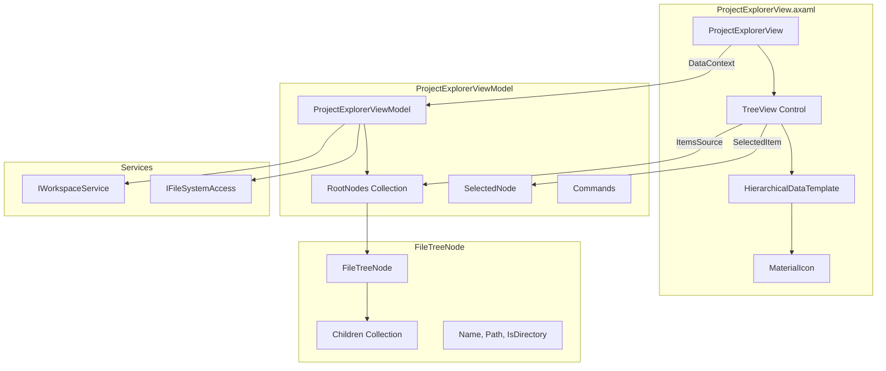
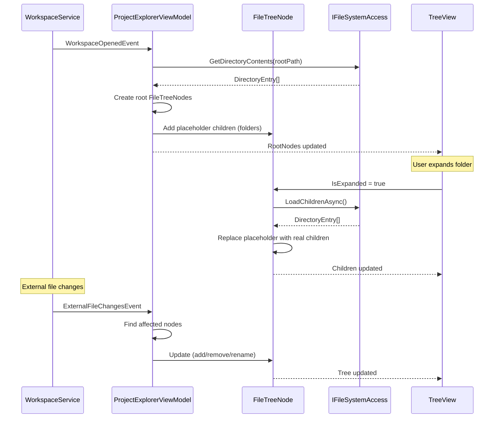
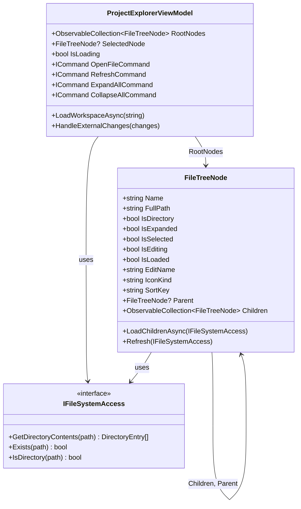

# LCS-INF-012c: Tree View UI Specification

## 1. Metadata & Categorization

| Field                | Value                                    | Description                                           |
| :------------------- | :--------------------------------------- | :---------------------------------------------------- |
| **Feature ID**       | `INF-012c`                               | Tree View UI                                          |
| **Feature Name**     | Project Explorer Tree View               | Recursive folder tree with file icons                 |
| **Target Version**   | `v0.1.2c`                                | Third sub-part of Explorer                            |
| **Module Scope**     | `Lexichord.Modules.Workspace`            | Workspace module                                      |
| **Swimlane**         | `Infrastructure`                         | The Podium (Platform)                                 |
| **License Tier**     | `Core`                                   | Foundation (Required for all tiers)                   |
| **Feature Gate Key** | N/A                                      | No runtime gating                                     |
| **Author**           | System Architect                         |                                                       |
| **Status**           | **Draft**                                | Pending implementation                                |
| **Last Updated**     | 2026-01-26                               |                                                       |

---

## 2. Executive Summary

### 2.1 The Requirement

Users need a visual representation of their workspace files:

- Hierarchical tree showing folders and files
- Familiar icons indicating file types
- Expandable/collapsible folder nodes
- Performance with large directories (lazy loading)
- Responsive to external file changes

### 2.2 The Proposed Solution

We **SHALL** implement:

1. **`ProjectExplorerView`** — Avalonia UserControl with TreeView
2. **`ProjectExplorerViewModel`** — MVVM view model managing tree state
3. **`FileTreeNode`** — Model representing nodes in the tree
4. **File Icons** — Material.Icons.Avalonia for file type visualization
5. **Lazy Loading** — Load directory contents on demand
6. **Region Registration** — Register in Left dock region via IRegionManager

---

## 3. Architecture

### 3.1 Component Diagram



### 3.2 Data Flow Sequence



### 3.3 FileTreeNode Class Diagram



---

## 4. Decision Tree

```text
START: "How to load/display tree node?"
│
├── Is node a directory?
│   ├── NO (file) → Display with file icon, no children
│   └── YES (directory) →
│       ├── Is node expanded?
│       │   ├── NO → Show folder icon, placeholder child (enables expand arrow)
│       │   └── YES → Show open folder icon
│       │       ├── Is node loaded?
│       │       │   ├── NO → Load children async
│       │       │   │   ├── Get directory contents
│       │       │   │   ├── Sort: directories first, then alphabetical
│       │       │   │   ├── Create child nodes
│       │       │   │   ├── Mark as loaded
│       │       │   │   └── Update Children collection
│       │       │   └── YES → Display cached children
│       └── Continue

---

START: "Which icon to show for file?"
│
├── Is directory?
│   ├── YES, expanded → "FolderOpen"
│   └── YES, collapsed → "Folder"
│
├── Get file extension
│
├── Map extension to icon:
│   ├── .md, .markdown → "FileDocumentOutline"
│   ├── .txt → "FileDocument"
│   ├── .json → "CodeJson"
│   ├── .xml → "Xml"
│   ├── .yaml, .yml → "FileCode"
│   ├── .cs → "LanguageCsharp"
│   ├── .py → "LanguagePython"
│   ├── .js, .ts → "LanguageJavascript"
│   ├── .html, .htm → "LanguageHtml5"
│   ├── .css, .scss → "LanguageCss3"
│   ├── .png, .jpg, .gif, .svg → "FileImage"
│   ├── .pdf → "FilePdfBox"
│   ├── .zip, .tar, .gz → "FolderZip"
│   └── (default) → "File"

---

START: "External file change detected"
│
├── What type of change?
│   │
│   ├── Created
│   │   ├── Find parent node by path
│   │   ├── Is parent expanded/loaded?
│   │   │   ├── NO → Ignore (will load when expanded)
│   │   │   └── YES → Create new node, insert sorted
│   │
│   ├── Deleted
│   │   ├── Find node by path
│   │   ├── Node exists?
│   │   │   ├── NO → Ignore (already gone)
│   │   │   └── YES → Remove from parent's Children
│   │
│   ├── Renamed
│   │   ├── Find node by old path
│   │   ├── Node exists?
│   │   │   ├── NO → Treat as Created
│   │   │   └── YES → Update Name and FullPath
│   │
│   └── Changed (content modified)
│       └── Ignore (tree doesn't show content)
```

---

## 5. Data Contracts

### 5.1 FileTreeNode Model

```csharp
namespace Lexichord.Modules.Workspace.Models;

using CommunityToolkit.Mvvm.ComponentModel;
using System.Collections.ObjectModel;

/// <summary>
/// Represents a node in the project explorer tree.
/// </summary>
/// <remarks>
/// LOGIC: FileTreeNode is the core data model for the tree view. Key features:
///
/// 1. LAZY LOADING: Directories initially have a placeholder child. When expanded,
///    the placeholder is replaced with actual children. This prevents loading
///    the entire file system tree upfront.
///
/// 2. OBSERVABLE: Inherits from ObservableObject so property changes notify the UI.
///
/// 3. SORTABLE: SortKey ensures directories appear before files, then alphabetical.
///
/// 4. ICON MAPPING: IconKind property maps file extensions to Material icons.
/// </remarks>
public partial class FileTreeNode : ObservableObject
{
    /// <summary>
    /// Special name for the loading placeholder node.
    /// </summary>
    public const string LoadingPlaceholderName = "__loading__";

    /// <summary>
    /// Gets the display name of this file or folder.
    /// </summary>
    public required string Name { get; init; }

    /// <summary>
    /// Gets the full absolute path to this file or folder.
    /// </summary>
    public required string FullPath { get; init; }

    /// <summary>
    /// Gets whether this node represents a directory.
    /// </summary>
    public required bool IsDirectory { get; init; }

    /// <summary>
    /// Gets the parent node, or null for root nodes.
    /// </summary>
    public FileTreeNode? Parent { get; init; }

    /// <summary>
    /// Gets the child nodes collection.
    /// </summary>
    /// <remarks>
    /// LOGIC: For directories, initially contains a loading placeholder.
    /// Actual children loaded when IsExpanded becomes true.
    /// </remarks>
    public ObservableCollection<FileTreeNode> Children { get; } = new();

    /// <summary>
    /// Gets or sets whether this folder is expanded in the tree.
    /// </summary>
    [ObservableProperty]
    [NotifyPropertyChangedFor(nameof(IconKind))]
    private bool _isExpanded;

    /// <summary>
    /// Gets or sets whether this node is selected.
    /// </summary>
    [ObservableProperty]
    private bool _isSelected;

    /// <summary>
    /// Gets or sets whether this node is in edit mode (renaming).
    /// </summary>
    [ObservableProperty]
    private bool _isEditing;

    /// <summary>
    /// Gets or sets the name being edited during rename.
    /// </summary>
    [ObservableProperty]
    private string _editName = string.Empty;

    /// <summary>
    /// Gets whether the children have been loaded from disk.
    /// </summary>
    public bool IsLoaded { get; private set; }

    /// <summary>
    /// Gets whether this is a loading placeholder node.
    /// </summary>
    public bool IsPlaceholder => Name == LoadingPlaceholderName;

    /// <summary>
    /// Gets the Material icon name for this node.
    /// </summary>
    /// <remarks>
    /// LOGIC: Icon changes based on:
    /// - IsDirectory + IsExpanded → folder open/closed
    /// - File extension → specific file type icon
    /// </remarks>
    public string IconKind
    {
        get
        {
            if (IsPlaceholder)
                return "Loading";

            if (IsDirectory)
                return IsExpanded ? "FolderOpen" : "Folder";

            return GetFileIcon(Name);
        }
    }

    /// <summary>
    /// Gets the sort key for ordering nodes.
    /// </summary>
    /// <remarks>
    /// LOGIC: Directories sort before files (0 vs 1), then alphabetical.
    /// </remarks>
    public string SortKey => $"{(IsDirectory ? "0" : "1")}_{Name.ToLowerInvariant()}";

    /// <summary>
    /// Gets the depth of this node in the tree (0 for root).
    /// </summary>
    public int Depth
    {
        get
        {
            var depth = 0;
            var current = Parent;
            while (current is not null)
            {
                depth++;
                current = current.Parent;
            }
            return depth;
        }
    }

    /// <summary>
    /// Loads children for this directory node.
    /// </summary>
    /// <param name="fileSystem">File system access for reading directory contents.</param>
    /// <remarks>
    /// LOGIC: Called when directory is expanded for the first time.
    /// Replaces placeholder with actual children.
    /// </remarks>
    public async Task LoadChildrenAsync(IFileSystemAccess fileSystem)
    {
        if (!IsDirectory || IsLoaded || IsPlaceholder)
            return;

        // Clear placeholder
        Children.Clear();

        try
        {
            var entries = await fileSystem.GetDirectoryContentsAsync(FullPath);
            var sortedEntries = entries.OrderBy(e => e.IsDirectory ? 0 : 1)
                                       .ThenBy(e => e.Name, StringComparer.OrdinalIgnoreCase);

            foreach (var entry in sortedEntries)
            {
                var childNode = new FileTreeNode
                {
                    Name = entry.Name,
                    FullPath = entry.FullPath,
                    IsDirectory = entry.IsDirectory,
                    Parent = this
                };

                // Add placeholder for directories to enable expand arrow
                if (entry.IsDirectory)
                {
                    childNode.Children.Add(CreateLoadingPlaceholder());
                }

                Children.Add(childNode);
            }
        }
        catch (UnauthorizedAccessException)
        {
            // Add error indicator node
            Children.Add(new FileTreeNode
            {
                Name = "(Access Denied)",
                FullPath = FullPath,
                IsDirectory = false,
                Parent = this
            });
        }
        catch (DirectoryNotFoundException)
        {
            // Directory was deleted while loading
        }

        IsLoaded = true;
    }

    /// <summary>
    /// Refreshes the children from disk.
    /// </summary>
    /// <param name="fileSystem">File system access.</param>
    public async Task RefreshAsync(IFileSystemAccess fileSystem)
    {
        IsLoaded = false;
        await LoadChildrenAsync(fileSystem);
    }

    /// <summary>
    /// Finds a descendant node by path.
    /// </summary>
    /// <param name="path">Full path to find.</param>
    /// <returns>The node if found, null otherwise.</returns>
    public FileTreeNode? FindByPath(string path)
    {
        if (FullPath.Equals(path, StringComparison.OrdinalIgnoreCase))
            return this;

        foreach (var child in Children)
        {
            var found = child.FindByPath(path);
            if (found is not null)
                return found;
        }

        return null;
    }

    /// <summary>
    /// Begins rename mode for this node.
    /// </summary>
    public void BeginEdit()
    {
        EditName = Name;
        IsEditing = true;
    }

    /// <summary>
    /// Cancels rename mode.
    /// </summary>
    public void CancelEdit()
    {
        IsEditing = false;
        EditName = string.Empty;
    }

    /// <summary>
    /// Creates a loading placeholder node.
    /// </summary>
    public static FileTreeNode CreateLoadingPlaceholder()
    {
        return new FileTreeNode
        {
            Name = LoadingPlaceholderName,
            FullPath = string.Empty,
            IsDirectory = false
        };
    }

    /// <summary>
    /// Maps file extensions to Material icon names.
    /// </summary>
    private static string GetFileIcon(string fileName)
    {
        var extension = Path.GetExtension(fileName).ToLowerInvariant();

        return extension switch
        {
            // Documents
            ".md" or ".markdown" => "FileDocumentOutline",
            ".txt" => "FileDocument",
            ".rtf" => "FileDocumentOutline",
            ".doc" or ".docx" => "FileWord",
            ".pdf" => "FilePdfBox",

            // Code - Data
            ".json" => "CodeJson",
            ".xml" => "Xml",
            ".yaml" or ".yml" => "FileCode",
            ".toml" => "FileCode",
            ".csv" => "FileDelimited",

            // Code - Languages
            ".cs" => "LanguageCsharp",
            ".py" => "LanguagePython",
            ".js" => "LanguageJavascript",
            ".ts" => "LanguageTypescript",
            ".jsx" or ".tsx" => "React",
            ".html" or ".htm" => "LanguageHtml5",
            ".css" => "LanguageCss3",
            ".scss" or ".sass" => "Sass",
            ".java" => "LanguageJava",
            ".go" => "LanguageGo",
            ".rs" => "LanguageRust",
            ".rb" => "LanguageRuby",
            ".php" => "LanguagePhp",
            ".swift" => "LanguageSwift",
            ".kt" or ".kts" => "LanguageKotlin",
            ".c" or ".h" => "LanguageC",
            ".cpp" or ".hpp" or ".cc" => "LanguageCpp",
            ".sql" => "Database",

            // Images
            ".png" or ".jpg" or ".jpeg" or ".gif" or ".bmp" or ".ico" => "FileImage",
            ".svg" => "Svg",
            ".webp" => "FileImage",

            // Media
            ".mp3" or ".wav" or ".ogg" or ".flac" => "FileMusic",
            ".mp4" or ".avi" or ".mkv" or ".mov" => "FileVideo",

            // Archives
            ".zip" or ".tar" or ".gz" or ".rar" or ".7z" => "FolderZip",

            // Config
            ".gitignore" => "Git",
            ".env" => "KeyVariant",
            ".config" => "Cog",

            // Default
            _ => "File"
        };
    }
}
```

### 5.2 IFileSystemAccess Interface

```csharp
namespace Lexichord.Abstractions.Contracts;

/// <summary>
/// Abstraction for file system access operations.
/// </summary>
/// <remarks>
/// LOGIC: Separates file system operations from the tree view for:
/// - Testability (can mock file system)
/// - Async operations (UI doesn't block)
/// - Future features (virtual file systems, remote files)
/// </remarks>
public interface IFileSystemAccess
{
    /// <summary>
    /// Gets the contents of a directory.
    /// </summary>
    /// <param name="path">Directory path.</param>
    /// <returns>List of entries (files and subdirectories).</returns>
    Task<IReadOnlyList<DirectoryEntry>> GetDirectoryContentsAsync(string path);

    /// <summary>
    /// Checks if a path exists.
    /// </summary>
    /// <param name="path">Path to check.</param>
    /// <returns>True if exists.</returns>
    bool Exists(string path);

    /// <summary>
    /// Checks if a path is a directory.
    /// </summary>
    /// <param name="path">Path to check.</param>
    /// <returns>True if directory.</returns>
    bool IsDirectory(string path);
}

/// <summary>
/// Represents an entry in a directory listing.
/// </summary>
/// <param name="Name">File or folder name.</param>
/// <param name="FullPath">Full absolute path.</param>
/// <param name="IsDirectory">True if directory.</param>
public record DirectoryEntry(
    string Name,
    string FullPath,
    bool IsDirectory
);
```

### 5.3 ProjectExplorerViewModel

```csharp
namespace Lexichord.Modules.Workspace.ViewModels;

using CommunityToolkit.Mvvm.ComponentModel;
using CommunityToolkit.Mvvm.Input;
using Lexichord.Abstractions.Contracts;
using Lexichord.Abstractions.Events;
using Lexichord.Modules.Workspace.Models;
using MediatR;
using Microsoft.Extensions.Logging;
using System.Collections.ObjectModel;

/// <summary>
/// View model for the Project Explorer panel.
/// </summary>
/// <remarks>
/// LOGIC: ProjectExplorerViewModel coordinates between:
/// - IWorkspaceService (workspace state)
/// - IFileSystemAccess (file operations)
/// - FileTreeNode hierarchy (tree data)
/// - View binding (ObservableCollections)
///
/// It handles:
/// - Loading workspace into tree
/// - Responding to external file changes
/// - Selection management
/// - Commands (refresh, expand/collapse)
/// </remarks>
public partial class ProjectExplorerViewModel : ObservableObject,
    INotificationHandler<WorkspaceOpenedEvent>,
    INotificationHandler<WorkspaceClosedEvent>,
    INotificationHandler<ExternalFileChangesEvent>
{
    private readonly IWorkspaceService _workspaceService;
    private readonly IFileSystemAccess _fileSystemAccess;
    private readonly IMediator _mediator;
    private readonly ILogger<ProjectExplorerViewModel> _logger;

    /// <summary>
    /// Initializes a new instance of ProjectExplorerViewModel.
    /// </summary>
    public ProjectExplorerViewModel(
        IWorkspaceService workspaceService,
        IFileSystemAccess fileSystemAccess,
        IMediator mediator,
        ILogger<ProjectExplorerViewModel> logger)
    {
        _workspaceService = workspaceService ?? throw new ArgumentNullException(nameof(workspaceService));
        _fileSystemAccess = fileSystemAccess ?? throw new ArgumentNullException(nameof(fileSystemAccess));
        _mediator = mediator ?? throw new ArgumentNullException(nameof(mediator));
        _logger = logger ?? throw new ArgumentNullException(nameof(logger));

        // Load current workspace if already open
        if (_workspaceService.IsWorkspaceOpen)
        {
            _ = LoadWorkspaceAsync(_workspaceService.CurrentWorkspace!.RootPath);
        }
    }

    /// <summary>
    /// Gets the root nodes of the tree.
    /// </summary>
    public ObservableCollection<FileTreeNode> RootNodes { get; } = new();

    /// <summary>
    /// Gets or sets the currently selected node.
    /// </summary>
    [ObservableProperty]
    private FileTreeNode? _selectedNode;

    /// <summary>
    /// Gets or sets whether the tree is loading.
    /// </summary>
    [ObservableProperty]
    private bool _isLoading;

    /// <summary>
    /// Gets or sets the status message.
    /// </summary>
    [ObservableProperty]
    private string _statusMessage = "No folder open";

    /// <summary>
    /// Gets whether a workspace is open.
    /// </summary>
    public bool HasWorkspace => _workspaceService.IsWorkspaceOpen;

    /// <summary>
    /// Loads a workspace into the tree.
    /// </summary>
    /// <param name="rootPath">Root path of the workspace.</param>
    [RelayCommand]
    public async Task LoadWorkspaceAsync(string rootPath)
    {
        _logger.LogDebug("Loading workspace into tree: {Path}", rootPath);

        IsLoading = true;
        StatusMessage = "Loading...";

        try
        {
            RootNodes.Clear();

            var entries = await _fileSystemAccess.GetDirectoryContentsAsync(rootPath);
            var sortedEntries = entries.OrderBy(e => e.IsDirectory ? 0 : 1)
                                       .ThenBy(e => e.Name, StringComparer.OrdinalIgnoreCase);

            foreach (var entry in sortedEntries)
            {
                var node = new FileTreeNode
                {
                    Name = entry.Name,
                    FullPath = entry.FullPath,
                    IsDirectory = entry.IsDirectory,
                    Parent = null
                };

                if (entry.IsDirectory)
                {
                    node.Children.Add(FileTreeNode.CreateLoadingPlaceholder());
                }

                // Wire up expansion handler
                node.PropertyChanged += OnNodePropertyChanged;

                RootNodes.Add(node);
            }

            var itemCount = entries.Count;
            StatusMessage = $"{itemCount} item{(itemCount == 1 ? "" : "s")}";

            _logger.LogInformation("Workspace loaded: {Count} root items", itemCount);
        }
        catch (Exception ex)
        {
            _logger.LogError(ex, "Failed to load workspace: {Path}", rootPath);
            StatusMessage = "Error loading folder";
        }
        finally
        {
            IsLoading = false;
        }
    }

    /// <summary>
    /// Refreshes the entire tree.
    /// </summary>
    [RelayCommand]
    public async Task RefreshAsync()
    {
        if (!_workspaceService.IsWorkspaceOpen)
            return;

        _logger.LogDebug("Refreshing tree");
        await LoadWorkspaceAsync(_workspaceService.CurrentWorkspace!.RootPath);
    }

    /// <summary>
    /// Expands all nodes in the tree.
    /// </summary>
    [RelayCommand]
    public async Task ExpandAllAsync()
    {
        foreach (var node in RootNodes)
        {
            await ExpandNodeRecursiveAsync(node);
        }
    }

    /// <summary>
    /// Collapses all nodes in the tree.
    /// </summary>
    [RelayCommand]
    public void CollapseAll()
    {
        foreach (var node in RootNodes)
        {
            CollapseNodeRecursive(node);
        }
    }

    /// <summary>
    /// Opens the selected file.
    /// </summary>
    [RelayCommand]
    public async Task OpenSelectedFileAsync()
    {
        if (SelectedNode is null || SelectedNode.IsDirectory)
            return;

        _logger.LogDebug("Opening file: {Path}", SelectedNode.FullPath);

        // Publish event for editor to handle
        await _mediator.Publish(new FileOpenRequestedEvent(SelectedNode.FullPath));
    }

    #region Event Handlers

    /// <summary>
    /// Handles workspace opened event.
    /// </summary>
    public async Task Handle(WorkspaceOpenedEvent notification, CancellationToken cancellationToken)
    {
        _logger.LogDebug("Handling WorkspaceOpenedEvent: {Path}", notification.WorkspaceRootPath);
        await LoadWorkspaceAsync(notification.WorkspaceRootPath);
        OnPropertyChanged(nameof(HasWorkspace));
    }

    /// <summary>
    /// Handles workspace closed event.
    /// </summary>
    public Task Handle(WorkspaceClosedEvent notification, CancellationToken cancellationToken)
    {
        _logger.LogDebug("Handling WorkspaceClosedEvent");
        RootNodes.Clear();
        SelectedNode = null;
        StatusMessage = "No folder open";
        OnPropertyChanged(nameof(HasWorkspace));
        return Task.CompletedTask;
    }

    /// <summary>
    /// Handles external file changes event.
    /// </summary>
    public Task Handle(ExternalFileChangesEvent notification, CancellationToken cancellationToken)
    {
        _logger.LogDebug("Handling {Count} external file changes", notification.Changes.Count);

        foreach (var change in notification.Changes)
        {
            ProcessExternalChange(change);
        }

        return Task.CompletedTask;
    }

    #endregion

    #region Private Methods

    private void OnNodePropertyChanged(object? sender, PropertyChangedEventArgs e)
    {
        if (sender is not FileTreeNode node)
            return;

        // Handle expansion
        if (e.PropertyName == nameof(FileTreeNode.IsExpanded) && node.IsExpanded)
        {
            _ = LoadNodeChildrenAsync(node);
        }
    }

    private async Task LoadNodeChildrenAsync(FileTreeNode node)
    {
        if (node.IsLoaded || !node.IsDirectory)
            return;

        _logger.LogTrace("Loading children for: {Path}", node.FullPath);

        await node.LoadChildrenAsync(_fileSystemAccess);

        // Wire up children for expansion handling
        foreach (var child in node.Children)
        {
            child.PropertyChanged += OnNodePropertyChanged;
        }
    }

    private async Task ExpandNodeRecursiveAsync(FileTreeNode node)
    {
        if (!node.IsDirectory)
            return;

        node.IsExpanded = true;
        await LoadNodeChildrenAsync(node);

        foreach (var child in node.Children)
        {
            await ExpandNodeRecursiveAsync(child);
        }
    }

    private void CollapseNodeRecursive(FileTreeNode node)
    {
        node.IsExpanded = false;

        foreach (var child in node.Children)
        {
            CollapseNodeRecursive(child);
        }
    }

    private void ProcessExternalChange(FileSystemChangeInfo change)
    {
        switch (change.ChangeType)
        {
            case FileSystemChangeType.Created:
                HandleFileCreated(change);
                break;

            case FileSystemChangeType.Deleted:
                HandleFileDeleted(change);
                break;

            case FileSystemChangeType.Renamed:
                HandleFileRenamed(change);
                break;

            case FileSystemChangeType.Changed:
                // Content changes don't affect tree structure
                break;
        }
    }

    private void HandleFileCreated(FileSystemChangeInfo change)
    {
        var parentPath = Path.GetDirectoryName(change.FullPath);
        if (parentPath is null)
            return;

        // Find parent node
        FileTreeNode? parentNode = null;
        foreach (var root in RootNodes)
        {
            parentNode = root.FindByPath(parentPath);
            if (parentNode is not null)
                break;
        }

        // Check if this is a root-level addition
        if (parentNode is null && _workspaceService.CurrentWorkspace?.RootPath == parentPath)
        {
            // Add to root
            var newNode = CreateNodeFromChange(change, null);
            InsertNodeSorted(RootNodes, newNode);
            return;
        }

        // If parent not found or not expanded, ignore (will load when expanded)
        if (parentNode is null || !parentNode.IsLoaded)
            return;

        var childNode = CreateNodeFromChange(change, parentNode);
        InsertNodeSorted(parentNode.Children, childNode);
    }

    private void HandleFileDeleted(FileSystemChangeInfo change)
    {
        FileTreeNode? node = null;

        foreach (var root in RootNodes)
        {
            node = root.FindByPath(change.FullPath);
            if (node is not null)
                break;
        }

        if (node is null)
            return;

        if (node.Parent is not null)
        {
            node.Parent.Children.Remove(node);
        }
        else
        {
            RootNodes.Remove(node);
        }

        // Clear selection if deleted node was selected
        if (SelectedNode == node)
        {
            SelectedNode = null;
        }
    }

    private void HandleFileRenamed(FileSystemChangeInfo change)
    {
        if (change.OldPath is null)
            return;

        FileTreeNode? node = null;

        foreach (var root in RootNodes)
        {
            node = root.FindByPath(change.OldPath);
            if (node is not null)
                break;
        }

        if (node is null)
        {
            // Treat as new file
            HandleFileCreated(change);
            return;
        }

        // Create new node with updated info (nodes are immutable)
        var parent = node.Parent;
        var collection = parent?.Children ?? RootNodes;
        var index = collection.IndexOf(node);

        if (index >= 0)
        {
            collection.RemoveAt(index);
            var newNode = new FileTreeNode
            {
                Name = Path.GetFileName(change.FullPath),
                FullPath = change.FullPath,
                IsDirectory = change.IsDirectory,
                Parent = parent
            };

            if (change.IsDirectory)
            {
                newNode.Children.Add(FileTreeNode.CreateLoadingPlaceholder());
            }

            InsertNodeSorted(collection, newNode);
        }
    }

    private FileTreeNode CreateNodeFromChange(FileSystemChangeInfo change, FileTreeNode? parent)
    {
        var node = new FileTreeNode
        {
            Name = Path.GetFileName(change.FullPath),
            FullPath = change.FullPath,
            IsDirectory = change.IsDirectory,
            Parent = parent
        };

        if (change.IsDirectory)
        {
            node.Children.Add(FileTreeNode.CreateLoadingPlaceholder());
        }

        node.PropertyChanged += OnNodePropertyChanged;
        return node;
    }

    private static void InsertNodeSorted(ObservableCollection<FileTreeNode> collection, FileTreeNode node)
    {
        var insertIndex = 0;
        for (var i = 0; i < collection.Count; i++)
        {
            if (string.Compare(collection[i].SortKey, node.SortKey, StringComparison.Ordinal) > 0)
            {
                insertIndex = i;
                break;
            }
            insertIndex = i + 1;
        }

        collection.Insert(insertIndex, node);
    }

    #endregion
}

/// <summary>
/// Event requesting a file to be opened in the editor.
/// </summary>
/// <param name="FilePath">Path to the file to open.</param>
public record FileOpenRequestedEvent(string FilePath) : INotification;
```

### 5.4 ProjectExplorerView AXAML

```xml
<!-- ProjectExplorerView.axaml -->
<UserControl xmlns="https://github.com/avaloniaui"
             xmlns:x="http://schemas.microsoft.com/winfx/2006/xaml"
             xmlns:d="http://schemas.microsoft.com/expression/blend/2008"
             xmlns:mc="http://schemas.openxmlformats.org/markup-compatibility/2006"
             xmlns:mi="clr-namespace:Material.Icons.Avalonia;assembly=Material.Icons.Avalonia"
             xmlns:vm="using:Lexichord.Modules.Workspace.ViewModels"
             xmlns:models="using:Lexichord.Modules.Workspace.Models"
             mc:Ignorable="d" d:DesignWidth="250" d:DesignHeight="400"
             x:Class="Lexichord.Modules.Workspace.Views.ProjectExplorerView"
             x:DataType="vm:ProjectExplorerViewModel">

    <UserControl.Resources>
        <!-- Converters -->
        <BoolConverters x:Key="BoolConverters"/>
    </UserControl.Resources>

    <Grid RowDefinitions="Auto,*,Auto">
        <!-- Toolbar -->
        <Border Grid.Row="0"
                Background="{DynamicResource SystemControlBackgroundChromeMediumLowBrush}"
                Padding="4">
            <StackPanel Orientation="Horizontal" Spacing="4">
                <Button ToolTip.Tip="Refresh"
                        Command="{Binding RefreshCommand}"
                        Padding="4">
                    <mi:MaterialIcon Kind="Refresh" Width="16" Height="16"/>
                </Button>
                <Button ToolTip.Tip="Collapse All"
                        Command="{Binding CollapseAllCommand}"
                        Padding="4">
                    <mi:MaterialIcon Kind="CollapseAll" Width="16" Height="16"/>
                </Button>
            </StackPanel>
        </Border>

        <!-- Tree View -->
        <TreeView Grid.Row="1"
                  ItemsSource="{Binding RootNodes}"
                  SelectedItem="{Binding SelectedNode, Mode=TwoWay}"
                  IsVisible="{Binding HasWorkspace}"
                  DoubleTapped="OnTreeViewDoubleTapped">

            <TreeView.ItemTemplate>
                <TreeDataTemplate ItemsSource="{Binding Children}"
                                  x:DataType="models:FileTreeNode">
                    <Grid ColumnDefinitions="Auto,*"
                          IsVisible="{Binding !IsPlaceholder}">

                        <!-- Icon -->
                        <mi:MaterialIcon Grid.Column="0"
                                         Kind="{Binding IconKind}"
                                         Width="16" Height="16"
                                         Margin="0,0,6,0"
                                         VerticalAlignment="Center"/>

                        <!-- Name or Edit TextBox -->
                        <Panel Grid.Column="1">
                            <!-- Display Name -->
                            <TextBlock Text="{Binding Name}"
                                       VerticalAlignment="Center"
                                       IsVisible="{Binding !IsEditing}"
                                       TextTrimming="CharacterEllipsis"/>

                            <!-- Edit TextBox -->
                            <TextBox Text="{Binding EditName, Mode=TwoWay}"
                                     IsVisible="{Binding IsEditing}"
                                     Padding="2"
                                     MinWidth="100"
                                     LostFocus="OnEditTextBoxLostFocus"
                                     KeyDown="OnEditTextBoxKeyDown"/>
                        </Panel>
                    </Grid>
                </TreeDataTemplate>
            </TreeView.ItemTemplate>

            <TreeView.Styles>
                <Style Selector="TreeViewItem">
                    <Setter Property="IsExpanded" Value="{Binding IsExpanded, Mode=TwoWay}"/>
                    <Setter Property="IsSelected" Value="{Binding IsSelected, Mode=TwoWay}"/>
                </Style>
            </TreeView.Styles>
        </TreeView>

        <!-- Empty State -->
        <StackPanel Grid.Row="1"
                    VerticalAlignment="Center"
                    HorizontalAlignment="Center"
                    IsVisible="{Binding !HasWorkspace}"
                    Spacing="8">
            <mi:MaterialIcon Kind="FolderOpen" Width="48" Height="48" Opacity="0.5"/>
            <TextBlock Text="No folder open"
                       HorizontalAlignment="Center"
                       Opacity="0.7"/>
            <Button Content="Open Folder"
                    HorizontalAlignment="Center"
                    Command="{Binding OpenFolderCommand}"/>
        </StackPanel>

        <!-- Loading Indicator -->
        <Border Grid.Row="1"
                IsVisible="{Binding IsLoading}"
                Background="{DynamicResource SystemControlBackgroundAltMediumHighBrush}"
                Opacity="0.8">
            <StackPanel VerticalAlignment="Center" HorizontalAlignment="Center">
                <ProgressBar IsIndeterminate="True" Width="100"/>
                <TextBlock Text="Loading..." HorizontalAlignment="Center" Margin="0,8,0,0"/>
            </StackPanel>
        </Border>

        <!-- Status Bar -->
        <Border Grid.Row="2"
                Background="{DynamicResource SystemControlBackgroundChromeMediumLowBrush}"
                Padding="8,4">
            <TextBlock Text="{Binding StatusMessage}"
                       FontSize="11"
                       Opacity="0.7"/>
        </Border>
    </Grid>
</UserControl>
```

### 5.5 ProjectExplorerView Code-Behind

```csharp
using Avalonia.Controls;
using Avalonia.Input;
using Avalonia.Interactivity;
using Lexichord.Modules.Workspace.Models;
using Lexichord.Modules.Workspace.ViewModels;

namespace Lexichord.Modules.Workspace.Views;

/// <summary>
/// Code-behind for ProjectExplorerView.
/// </summary>
/// <remarks>
/// LOGIC: Minimal code-behind handles UI-specific interactions:
/// - Double-click to open file
/// - Edit textbox keyboard handling
/// - Focus management
/// </remarks>
public partial class ProjectExplorerView : UserControl
{
    public ProjectExplorerView()
    {
        InitializeComponent();
    }

    /// <summary>
    /// Handles double-click on tree item to open file.
    /// </summary>
    private void OnTreeViewDoubleTapped(object? sender, TappedEventArgs e)
    {
        if (DataContext is not ProjectExplorerViewModel viewModel)
            return;

        if (viewModel.SelectedNode is not null && !viewModel.SelectedNode.IsDirectory)
        {
            viewModel.OpenSelectedFileCommand.Execute(null);
        }
    }

    /// <summary>
    /// Handles key down in edit textbox.
    /// </summary>
    private void OnEditTextBoxKeyDown(object? sender, KeyEventArgs e)
    {
        if (sender is not TextBox textBox)
            return;

        if (textBox.DataContext is not FileTreeNode node)
            return;

        switch (e.Key)
        {
            case Key.Enter:
                // Commit rename
                CommitRename(node, textBox.Text ?? string.Empty);
                e.Handled = true;
                break;

            case Key.Escape:
                // Cancel rename
                node.CancelEdit();
                e.Handled = true;
                break;
        }
    }

    /// <summary>
    /// Handles lost focus on edit textbox.
    /// </summary>
    private void OnEditTextBoxLostFocus(object? sender, RoutedEventArgs e)
    {
        if (sender is not TextBox textBox)
            return;

        if (textBox.DataContext is not FileTreeNode node)
            return;

        if (node.IsEditing)
        {
            // Commit on focus loss
            CommitRename(node, textBox.Text ?? string.Empty);
        }
    }

    private void CommitRename(FileTreeNode node, string newName)
    {
        node.CancelEdit(); // End edit mode

        if (string.IsNullOrWhiteSpace(newName) || newName == node.Name)
            return;

        // Delegate to view model / command
        if (DataContext is ProjectExplorerViewModel viewModel)
        {
            // Rename command would be wired here
            // viewModel.RenameCommand.Execute((node, newName));
        }
    }
}
```

---

## 6. Use Cases

### 6.1 UC-01: Initial Workspace Load

**Preconditions:**
- User opens a workspace folder

**Flow:**
1. WorkspaceOpenedEvent is published
2. ProjectExplorerViewModel handles event
3. IsLoading set to true, "Loading..." shown
4. Root directory contents fetched via IFileSystemAccess
5. FileTreeNode created for each entry
6. Directories get placeholder children
7. Nodes sorted (directories first, then alphabetically)
8. RootNodes collection updated
9. IsLoading set to false
10. Status shows item count

**Postconditions:**
- Tree displays root contents
- Directories show expand arrow
- Files show appropriate icons

---

### 6.2 UC-02: Expand Directory

**Preconditions:**
- Workspace is loaded
- Directory node is collapsed

**Flow:**
1. User clicks expand arrow
2. IsExpanded property changes to true
3. PropertyChanged event triggers LoadNodeChildrenAsync
4. If not already loaded:
   a. Directory contents fetched
   b. Placeholder removed
   c. Child nodes created and added
5. Children now visible in tree

**Postconditions:**
- Directory shows contents
- Subdirectories have expand arrows
- IsLoaded is true (won't reload on collapse/expand)

---

### 6.3 UC-03: External File Created

**Preconditions:**
- Workspace is loaded
- User creates file externally (terminal, git, etc.)

**Flow:**
1. FileSystemWatcher detects creation
2. ExternalFileChangesEvent published
3. ViewModel handles event
4. HandleFileCreated finds parent node
5. If parent is loaded/expanded:
   a. New FileTreeNode created
   b. Inserted in sorted position
6. Tree updates to show new file

**Postconditions:**
- New file appears in tree
- Sorting maintained
- No full refresh needed

---

## 7. Observability & Logging

| Level | Message Template | When |
|:------|:-----------------|:-----|
| Debug | `Loading workspace into tree: {Path}` | LoadWorkspaceAsync start |
| Information | `Workspace loaded: {Count} root items` | LoadWorkspaceAsync complete |
| Error | `Failed to load workspace: {Path}` | Load failure |
| Debug | `Refreshing tree` | RefreshAsync called |
| Debug | `Handling WorkspaceOpenedEvent: {Path}` | Event received |
| Debug | `Handling WorkspaceClosedEvent` | Event received |
| Debug | `Handling {Count} external file changes` | Changes received |
| Trace | `Loading children for: {Path}` | Directory expansion |
| Debug | `Opening file: {Path}` | Double-click file |

---

## 8. Unit Testing Requirements

```csharp
[TestFixture]
[Category("Unit")]
public class FileTreeNodeTests
{
    [Test]
    public void IconKind_Directory_ReturnsFolder()
    {
        var node = new FileTreeNode
        {
            Name = "folder",
            FullPath = "/folder",
            IsDirectory = true
        };

        Assert.That(node.IconKind, Is.EqualTo("Folder"));
    }

    [Test]
    public void IconKind_ExpandedDirectory_ReturnsFolderOpen()
    {
        var node = new FileTreeNode
        {
            Name = "folder",
            FullPath = "/folder",
            IsDirectory = true,
            IsExpanded = true
        };

        // Need to set via property for notification
        Assert.That(node.IconKind, Is.EqualTo("FolderOpen"));
    }

    [Test]
    public void IconKind_MarkdownFile_ReturnsFileDocumentOutline()
    {
        var node = new FileTreeNode
        {
            Name = "readme.md",
            FullPath = "/readme.md",
            IsDirectory = false
        };

        Assert.That(node.IconKind, Is.EqualTo("FileDocumentOutline"));
    }

    [Test]
    public void SortKey_DirectoryBeforeFile()
    {
        var dir = new FileTreeNode { Name = "zfolder", FullPath = "/z", IsDirectory = true };
        var file = new FileTreeNode { Name = "afile.txt", FullPath = "/a", IsDirectory = false };

        Assert.That(string.Compare(dir.SortKey, file.SortKey), Is.LessThan(0));
    }

    [Test]
    public void FindByPath_ExistingPath_ReturnsNode()
    {
        var root = new FileTreeNode { Name = "root", FullPath = "/root", IsDirectory = true };
        var child = new FileTreeNode { Name = "child", FullPath = "/root/child", IsDirectory = false, Parent = root };
        root.Children.Add(child);

        var found = root.FindByPath("/root/child");

        Assert.That(found, Is.EqualTo(child));
    }

    [Test]
    public void FindByPath_NonExistingPath_ReturnsNull()
    {
        var root = new FileTreeNode { Name = "root", FullPath = "/root", IsDirectory = true };

        var found = root.FindByPath("/other");

        Assert.That(found, Is.Null);
    }
}

[TestFixture]
[Category("Unit")]
public class ProjectExplorerViewModelTests
{
    private Mock<IWorkspaceService> _mockWorkspace = null!;
    private Mock<IFileSystemAccess> _mockFileSystem = null!;
    private Mock<IMediator> _mockMediator = null!;
    private Mock<ILogger<ProjectExplorerViewModel>> _mockLogger = null!;
    private ProjectExplorerViewModel _sut = null!;

    [SetUp]
    public void SetUp()
    {
        _mockWorkspace = new Mock<IWorkspaceService>();
        _mockFileSystem = new Mock<IFileSystemAccess>();
        _mockMediator = new Mock<IMediator>();
        _mockLogger = new Mock<ILogger<ProjectExplorerViewModel>>();

        _sut = new ProjectExplorerViewModel(
            _mockWorkspace.Object,
            _mockFileSystem.Object,
            _mockMediator.Object,
            _mockLogger.Object);
    }

    [Test]
    public async Task LoadWorkspaceAsync_LoadsRootNodes()
    {
        // Arrange
        var entries = new List<DirectoryEntry>
        {
            new("file.txt", "/root/file.txt", false),
            new("folder", "/root/folder", true)
        };
        _mockFileSystem.Setup(f => f.GetDirectoryContentsAsync("/root"))
            .ReturnsAsync(entries);

        // Act
        await _sut.LoadWorkspaceAsync("/root");

        // Assert
        Assert.That(_sut.RootNodes, Has.Count.EqualTo(2));
    }

    [Test]
    public async Task LoadWorkspaceAsync_SortsDirectoriesFirst()
    {
        // Arrange
        var entries = new List<DirectoryEntry>
        {
            new("afile.txt", "/root/afile.txt", false),
            new("zfolder", "/root/zfolder", true)
        };
        _mockFileSystem.Setup(f => f.GetDirectoryContentsAsync("/root"))
            .ReturnsAsync(entries);

        // Act
        await _sut.LoadWorkspaceAsync("/root");

        // Assert
        Assert.That(_sut.RootNodes[0].IsDirectory, Is.True);
        Assert.That(_sut.RootNodes[1].IsDirectory, Is.False);
    }

    [Test]
    public async Task Handle_WorkspaceOpenedEvent_LoadsWorkspace()
    {
        // Arrange
        _mockFileSystem.Setup(f => f.GetDirectoryContentsAsync(It.IsAny<string>()))
            .ReturnsAsync(new List<DirectoryEntry>());

        var evt = new WorkspaceOpenedEvent("/root", "root");

        // Act
        await _sut.Handle(evt, CancellationToken.None);

        // Assert
        _mockFileSystem.Verify(f => f.GetDirectoryContentsAsync("/root"), Times.Once);
    }

    [Test]
    public async Task Handle_WorkspaceClosedEvent_ClearsNodes()
    {
        // Arrange - first load something
        _mockFileSystem.Setup(f => f.GetDirectoryContentsAsync("/root"))
            .ReturnsAsync(new List<DirectoryEntry> { new("file.txt", "/file.txt", false) });
        await _sut.LoadWorkspaceAsync("/root");

        var evt = new WorkspaceClosedEvent("/root");

        // Act
        await _sut.Handle(evt, CancellationToken.None);

        // Assert
        Assert.That(_sut.RootNodes, Is.Empty);
    }
}
```

---

## 9. Security & Safety

> [!WARNING]
> Path handling must prevent directory traversal:
> - Always use full paths from workspace
> - Validate paths are within workspace root

> [!NOTE]
> File system access is read-only in tree view.
> Write operations handled by FileOperationService (012d).

---

## 10. Risks & Mitigations

| Risk | Impact | Mitigation |
|:-----|:-------|:-----------|
| Large directories slow UI | High | Lazy loading, virtualization |
| Deep recursion stack overflow | Medium | Iterative expand, depth limit |
| Icon package missing | Low | Fallback to generic "File" icon |
| Memory leak from event handlers | Medium | Unsubscribe on node removal |

---

## 11. Acceptance Criteria

| # | Criterion |
|:--|:----------|
| 1 | ProjectExplorerView displays in Left dock region |
| 2 | Tree shows workspace folder structure |
| 3 | Folders can be expanded/collapsed |
| 4 | Files show type-appropriate icons |
| 5 | Directories show folder icons |
| 6 | Sorting: directories first, then alphabetical |
| 7 | External file changes update tree |
| 8 | Double-click file triggers open event |
| 9 | Empty state shown when no workspace |
| 10 | Loading indicator during load |
| 11 | Status bar shows item count |

---

## 12. Verification Commands

```bash
# 1. Verify Material.Icons.Avalonia installed
dotnet list package | grep Material.Icons

# 2. Run application, verify Explorer panel visible
dotnet run --project src/Lexichord.Host

# 3. Open folder, verify tree loads
# Manual: File > Open Folder

# 4. Expand folder, verify lazy loading
# Manual: Click expand arrow

# 5. Create file externally, verify tree updates
touch /path/to/workspace/newfile.txt

# 6. Run unit tests
dotnet test --filter "FullyQualifiedName~ProjectExplorer"
```

---

## 13. Deliverable Checklist

| Step | Description | Status |
|:-----|:------------|:-------|
| 1 | Add Material.Icons.Avalonia NuGet package | [ ] |
| 2 | Define IFileSystemAccess interface | [ ] |
| 3 | Implement FileSystemAccess service | [ ] |
| 4 | Create FileTreeNode model | [ ] |
| 5 | Create ProjectExplorerViewModel | [ ] |
| 6 | Create ProjectExplorerView.axaml | [ ] |
| 7 | Implement icon mapping | [ ] |
| 8 | Implement lazy loading | [ ] |
| 9 | Handle external file changes | [ ] |
| 10 | Register view in Left region | [ ] |
| 11 | Unit tests for FileTreeNode | [ ] |
| 12 | Unit tests for ProjectExplorerViewModel | [ ] |
