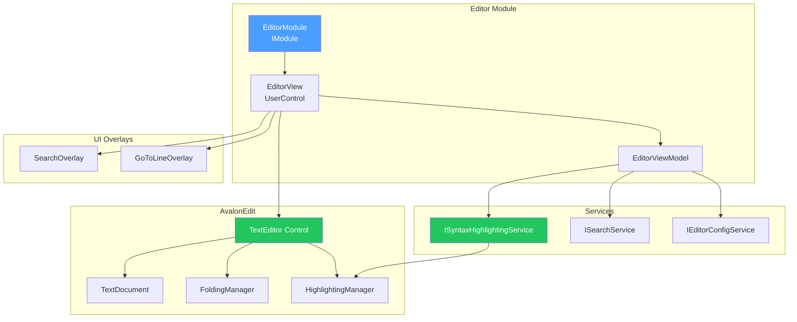
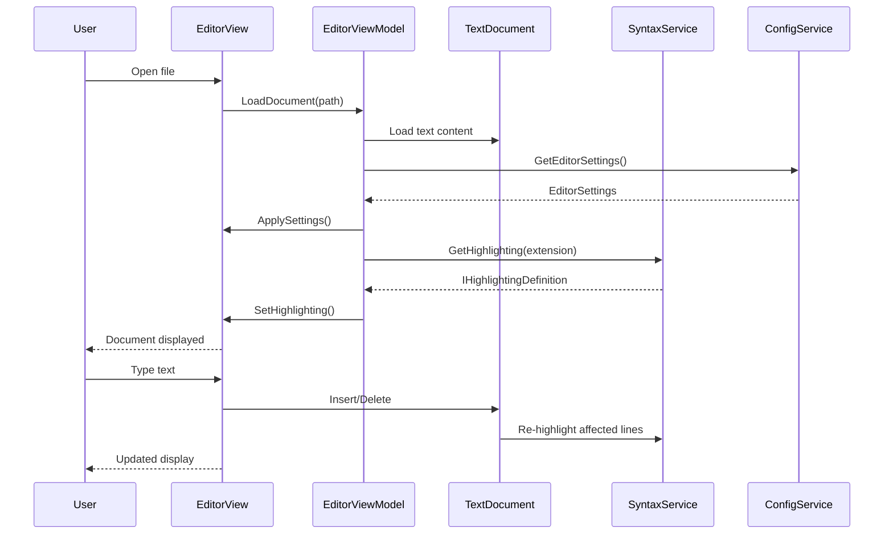

# LCS-DES-013: Design Specification Index — The Manuscript (Editor Module)

## Document Control

| Field                | Value                          |
| :------------------- | :----------------------------- |
| **Document ID**      | LCS-DES-013-INDEX              |
| **Feature ID**       | INF-013                        |
| **Feature Name**     | The Manuscript (Editor Module) |
| **Target Version**   | v0.1.3                         |
| **Module Scope**     | Lexichord.Modules.Editor       |
| **Swimlane**         | Infrastructure                 |
| **License Tier**     | Core                           |
| **Feature Gate Key** | N/A                            |
| **Status**           | Draft                          |
| **Last Updated**     | 2026-01-27                     |

---

## 1. Executive Summary

**v0.1.3** establishes the **core text editing experience** that is the heart of Lexichord. This release implements a high-performance text editor using AvalonEdit with syntax highlighting, search/replace, and configurable editor settings.

### 1.1 The Problem

Lexichord is a writing tool — without a capable text editor:

- Users cannot write or edit their manuscripts
- No syntax highlighting for Markdown or prose
- No search and replace functionality
- No configurable editor preferences (font, line spacing, etc.)

### 1.2 The Solution

Implement a complete editor module with:

- **AvalonEdit Integration** — High-performance text editing control
- **Syntax Highlighting Service** — Markdown and prose highlighting
- **Search & Replace Overlay** — Find/replace with regex support
- **Editor Configuration** — Font, theme, line numbers, word wrap settings

### 1.3 Business Value

| Value             | Description                                    |
| :---------------- | :--------------------------------------------- |
| **Core Feature**  | The primary writing experience for users       |
| **Performance**   | AvalonEdit handles large documents efficiently |
| **Productivity**  | Search/replace accelerates editing workflows   |
| **Customization** | Users configure editor to their preferences    |
| **Foundation**    | Enables style analysis integration (v0.3.x)    |

---

## 2. Related Documents

### 2.1 Scope Breakdown Document

The detailed scope breakdown for v0.1.3, including all sub-parts, implementation checklists, and acceptance criteria:

| Document                            | Description                      |
| :---------------------------------- | :------------------------------- |
| **[LCS-SBD-013](./LCS-SBD-013.md)** | Scope Breakdown — The Manuscript |

### 2.2 Sub-Part Design Specifications

Each sub-part has its own detailed design specification following the LDS-01 template:

| Sub-Part | Document                              | Title                       | Description                           |
| :------- | :------------------------------------ | :-------------------------- | :------------------------------------ |
| v0.1.3a  | **[LCS-DES-013a](./LCS-DES-013a.md)** | AvalonEdit Integration      | High-performance text editing control |
| v0.1.3b  | **[LCS-DES-013b](./LCS-DES-013b.md)** | Syntax Highlighting Service | Markdown and prose highlighting       |
| v0.1.3c  | **[LCS-DES-013c](./LCS-DES-013c.md)** | Search & Replace Overlay    | Find/replace with regex support       |
| v0.1.3d  | **[LCS-DES-013d](./LCS-DES-013d.md)** | Editor Configuration        | Font, theme, and display settings     |

---

## 3. Architecture Overview

### 3.1 Component Diagram



### 3.2 Document Editing Flow



---

## 4. Dependencies

### 4.1 Upstream Dependencies

| Dependency    | Source Version | Purpose                       |
| :------------ | :------------- | :---------------------------- |
| Module System | v0.0.4         | EditorModule registration     |
| Layout Engine | v0.1.1         | Document dock for editor tabs |
| Explorer      | v0.1.2         | File opening integration      |
| DI Container  | v0.0.3a        | Service registration          |

### 4.2 NuGet Packages

| Package                 | Version | Purpose                           |
| :---------------------- | :------ | :-------------------------------- |
| `AvaloniaEdit`          | 11.x    | Text editing control for Avalonia |
| `CommunityToolkit.Mvvm` | 8.x     | ViewModel base and commands       |

### 4.3 Downstream Consumers (Future)

| Version | Feature             | Uses From v0.1.3               |
| :------ | :------------------ | :----------------------------- |
| v0.1.4  | Document Management | Editor for document content    |
| v0.3.x  | Style Module        | Text analysis hooks in editor  |
| v0.4.x  | RAG Module          | Content extraction from editor |

---

## 5. License Gating Strategy

**N/A** — The core editor is Core infrastructure required by all license tiers. Advanced features like AI-assisted editing may be gated in future versions.

---

## 6. Key Interfaces Summary

| Interface                    | Defined In | Purpose                        |
| :--------------------------- | :--------- | :----------------------------- |
| `ISyntaxHighlightingService` | v0.1.3b    | Syntax highlighting management |
| `ISearchService`             | v0.1.3c    | Search and replace operations  |
| `IEditorConfigService`       | v0.1.3d    | Editor settings management     |

| Record/DTO       | Defined In | Purpose                   |
| :--------------- | :--------- | :------------------------ |
| `EditorSettings` | v0.1.3d    | Editor configuration data |
| `SearchOptions`  | v0.1.3c    | Search parameters         |
| `SearchResult`   | v0.1.3c    | Search match information  |

---

## 7. Implementation Checklist Summary

| Sub-Part  | Key Deliverables                                        | Est. Hours   | Status |
| :-------- | :------------------------------------------------------ | :----------- | :----- |
| v0.1.3a   | AvalonEdit package, EditorView, document binding        | 5            | [ ]    |
| v0.1.3b   | Markdown highlighting, prose mode, custom definitions   | 5            | [ ]    |
| v0.1.3c   | Search overlay, find/replace, regex support, navigation | 5            | [ ]    |
| v0.1.3d   | Settings UI, font selection, theme, persistence         | 4            | [ ]    |
| **Total** |                                                         | **19 hours** |        |

See [LCS-SBD-013](./LCS-SBD-013.md) Section 3 for the detailed implementation checklist.

---

## 8. Success Criteria Summary

| Category         | Criterion                                | Target |
| :--------------- | :--------------------------------------- | :----- |
| **Editing**      | Can type and edit text smoothly          | Pass   |
| **Performance**  | No lag with documents up to 100K lines   | Pass   |
| **Highlighting** | Markdown syntax highlighted correctly    | Pass   |
| **Search**       | Find text with Ctrl+F                    | Pass   |
| **Replace**      | Replace text with Ctrl+H                 | Pass   |
| **Regex**        | Regex search works correctly             | Pass   |
| **Settings**     | Font and theme changes apply immediately | Pass   |
| **Persistence**  | Settings survive application restart     | Pass   |

See individual design specs for detailed acceptance criteria.

---

## 9. Test Coverage Summary

| Sub-Part | Unit Tests                         | Integration Tests                |
| :------- | :--------------------------------- | :------------------------------- |
| v0.1.3a  | Document binding, text operations  | Full editor rendering            |
| v0.1.3b  | Highlighting rules, token parsing  | Visual highlighting verification |
| v0.1.3c  | Search algorithm, regex matching   | Search overlay interaction       |
| v0.1.3d  | Settings serialization, validation | Settings UI round-trip           |

See individual design specs for detailed test scenarios.

---

## 10. What This Enables

| Version | Feature             | Depends On v0.1.3                     |
| :------ | :------------------ | :------------------------------------ |
| v0.1.4  | Document Management | Editor component for document viewing |
| v0.3.x  | Style Module        | Real-time style analysis in editor    |
| v0.4.x  | RAG Module          | Content extraction for embeddings     |
| v0.5.x  | AI Assistance       | Inline suggestions in editor          |

---

## 11. Risks & Mitigations

| Risk                               | Impact | Mitigation                                   |
| :--------------------------------- | :----- | :------------------------------------------- |
| AvalonEdit Avalonia port stability | High   | Pin to stable version, comprehensive testing |
| Performance with very large files  | Medium | Virtual scrolling, lazy line rendering       |
| Custom highlighting complexity     | Medium | Start with standard Markdown, iterate        |
| Search performance on large docs   | Low    | Background search with cancellation          |

---

## 12. Future Compatibility

> [!WARNING]
> **CRDT Architecture Decision Required**
>
> Future Horizons item **[COL-01] Real-Time Sync** requires CRDT-based text storage for collaborative editing. The current direct text binding is incompatible with CRDTs.

### 12.1 Design Decision: ITextBuffer Abstraction

Per **[ADR-002](../../architecture/decisions/ADR-002-text-buffer-abstraction.md)**, v0.1.3 introduces an `ITextBuffer` abstraction:

```csharp
public interface ITextBuffer
{
    string GetText();
    void ApplyOperation(TextOperation operation);
    IObservable<TextChange> Changes { get; }
    int Length { get; }
}
```

This allows swapping the underlying text representation (AvalonEdit → CRDT) without rewriting ViewModel consumers.

### 12.2 v0.1.3 Implementation

- **Default:** `AvalonEditTextBuffer` wraps `TextDocument`
- **Future (v2.0+):** `CrdtTextBuffer` wraps Yjs/Loro
- **ViewModel:** Interacts only with `ITextBuffer`, never raw strings

---

## Document History

| Version | Date       | Author           | Changes                                                      |
| :------ | :--------- | :--------------- | :----------------------------------------------------------- |
| 1.0     | 2026-01-27 | System Architect | Created INDEX from legacy LCS-INF-013 during standardization |
