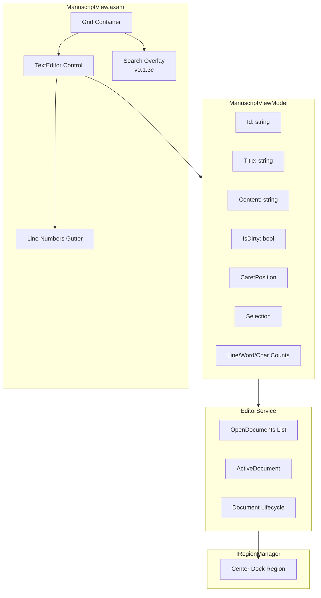
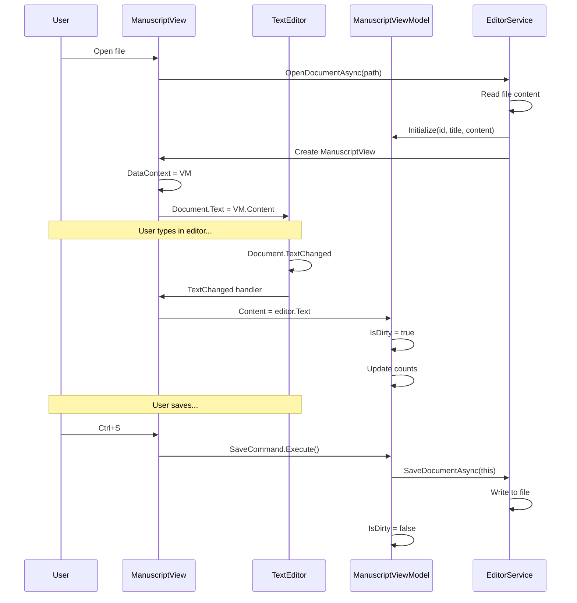

# LCS-DES-013a: AvalonEdit Integration

## 1. Metadata & Categorization

| Field                | Value                                | Description                                      |
| :------------------- | :----------------------------------- | :----------------------------------------------- |
| **Feature ID**       | `INF-013a`                           | Sub-part A of Editor Module                      |
| **Feature Name**     | AvalonEdit Integration               | TextEditor control with core features            |
| **Target Version**   | `v0.1.3a`                            | First sub-part of v0.1.3                         |
| **Module Scope**     | `Lexichord.Modules.Editor`           | Standalone editor module                         |
| **Swimlane**         | `Product`                            | Core User-Facing Feature                         |
| **License Tier**     | `Core`                               | Foundation (Available in Free tier)              |
| **Author**           | System Architect                     |                                                  |
| **Status**           | **Draft**                            | Pending implementation                           |
| **Last Updated**     | 2026-01-26                           |                                                  |

---

## 2. Executive Summary

### 2.1 The Requirement

Lexichord needs a high-performance text editor component capable of:

- Handling large files (100K+ lines) without lag.
- Displaying line numbers in the gutter.
- Supporting word wrap toggle.
- Providing a foundation for syntax highlighting and search features.
- Integrating with the docking system from v0.1.1.

### 2.2 The Proposed Solution

We **SHALL** integrate AvaloniaEdit (the Avalonia port of AvalonEdit) with:

1. **ManuscriptView** — Avalonia UserControl wrapping TextEditor.
2. **ManuscriptViewModel** — ViewModel extending DocumentViewModel.
3. **EditorService** — Service for document lifecycle management.
4. **Line numbers and word wrap** — Configurable from settings.

---

## 3. Architecture

### 3.1 Component Structure



### 3.2 View-ViewModel Binding Flow



---

## 4. Decision Tree: TextEditor Initialization

```text
START: "Initialize TextEditor control"
│
├── Set Base Properties
│   ├── ShowLineNumbers = Settings.ShowLineNumbers
│   ├── WordWrap = Settings.WordWrap
│   ├── FontFamily = Settings.FontFamily (with fallback)
│   ├── FontSize = Settings.FontSize
│   └── TabSize = Settings.TabSize
│
├── Configure Document
│   ├── Create TextDocument
│   ├── Bind Text to ViewModel.Content
│   └── Subscribe to TextChanged
│
├── Configure Caret/Selection
│   ├── Subscribe to CaretPositionChanged
│   ├── Subscribe to SelectionChanged
│   └── Update ViewModel on change
│
├── Configure Visual Options
│   ├── HighlightCurrentLine = Settings.HighlightCurrentLine
│   ├── ShowEndOfLine = Settings.ShowEndOfLine
│   ├── ShowTabs = Settings.ShowWhitespace
│   └── ShowSpaces = Settings.ShowWhitespace
│
└── END
```

---

## 5. Data Contracts

### 5.1 ManuscriptView.axaml

```xml
<UserControl xmlns="https://github.com/avaloniaui"
             xmlns:x="http://schemas.microsoft.com/winfx/2006/xaml"
             xmlns:ae="https://github.com/avaloniaui/avaloniaedit"
             xmlns:vm="using:Lexichord.Modules.Editor.ViewModels"
             x:Class="Lexichord.Modules.Editor.Views.ManuscriptView"
             x:DataType="vm:ManuscriptViewModel">

    <!-- LOGIC: Grid allows overlay to float above editor -->
    <Grid>
        <!-- Main Text Editor -->
        <ae:TextEditor x:Name="TextEditor"
                       ShowLineNumbers="{Binding ShowLineNumbers}"
                       WordWrap="{Binding WordWrap}"
                       FontFamily="{Binding FontFamily}"
                       FontSize="{Binding FontSize}"
                       HorizontalScrollBarVisibility="Auto"
                       VerticalScrollBarVisibility="Auto"
                       Padding="8">
            <ae:TextEditor.Options>
                <ae:TextEditorOptions
                    HighlightCurrentLine="{Binding HighlightCurrentLine}"
                    ShowEndOfLine="{Binding ShowEndOfLine}"
                    ShowTabs="{Binding ShowWhitespace}"
                    ShowSpaces="{Binding ShowWhitespace}"
                    EnableHyperlinks="True"
                    RequireControlModifierForHyperlinkClick="True"
                    ConvertTabsToSpaces="{Binding UseSpacesForTabs}"
                    IndentationSize="{Binding IndentSize}"
                    CutCopyWholeLine="True"
                    AllowScrollBelowDocument="True" />
            </ae:TextEditor.Options>
        </ae:TextEditor>

        <!-- Search Overlay (v0.1.3c) - positioned at top right -->
        <ContentControl x:Name="SearchOverlayHost"
                        Content="{Binding SearchOverlay}"
                        HorizontalAlignment="Right"
                        VerticalAlignment="Top"
                        Margin="0,8,24,0"
                        IsVisible="{Binding IsSearchVisible}" />
    </Grid>
</UserControl>
```

### 5.2 ManuscriptView.axaml.cs

```csharp
using Avalonia.Controls;
using Avalonia.Input;
using AvaloniaEdit;
using AvaloniaEdit.Document;
using AvaloniaEdit.Highlighting;
using Lexichord.Modules.Editor.ViewModels;
using Microsoft.Extensions.Logging;

namespace Lexichord.Modules.Editor.Views;

/// <summary>
/// View for editing manuscript documents.
/// </summary>
/// <remarks>
/// LOGIC: ManuscriptView wraps AvaloniaEdit's TextEditor control and
/// provides two-way binding to ManuscriptViewModel. It handles:
/// - Text synchronization between editor and ViewModel
/// - Caret and selection tracking
/// - Keyboard shortcuts (Ctrl+S, Ctrl+F, etc.)
/// - Syntax highlighting application
/// </remarks>
public partial class ManuscriptView : UserControl
{
    private ManuscriptViewModel? _viewModel;
    private bool _isUpdatingFromViewModel;
    private bool _isUpdatingFromEditor;

    public ManuscriptView()
    {
        InitializeComponent();

        // LOGIC: Subscribe to DataContext changes to wire up ViewModel
        DataContextChanged += OnDataContextChanged;

        // LOGIC: Wire up editor events
        TextEditor.TextChanged += OnEditorTextChanged;
        TextEditor.TextArea.Caret.PositionChanged += OnCaretPositionChanged;
        TextEditor.TextArea.SelectionChanged += OnSelectionChanged;

        // LOGIC: Handle keyboard shortcuts
        KeyDown += OnKeyDown;
    }

    /// <summary>
    /// Sets the syntax highlighting definition.
    /// </summary>
    /// <param name="highlighting">The highlighting definition, or null for plain text.</param>
    public void SetHighlighting(IHighlightingDefinition? highlighting)
    {
        TextEditor.SyntaxHighlighting = highlighting;
    }

    /// <summary>
    /// Scrolls to and selects the specified text range.
    /// </summary>
    public void SelectAndScrollTo(int offset, int length)
    {
        TextEditor.Select(offset, length);
        TextEditor.TextArea.Caret.Offset = offset;
        TextEditor.ScrollToLine(TextEditor.Document.GetLineByOffset(offset).LineNumber);
    }

    /// <summary>
    /// Gets the current text content.
    /// </summary>
    public string Text
    {
        get => TextEditor.Text;
        set
        {
            if (TextEditor.Text != value)
            {
                _isUpdatingFromViewModel = true;
                TextEditor.Text = value;
                _isUpdatingFromViewModel = false;
            }
        }
    }

    private void OnDataContextChanged(object? sender, EventArgs e)
    {
        // LOGIC: Unsubscribe from old ViewModel
        if (_viewModel is not null)
        {
            _viewModel.PropertyChanged -= OnViewModelPropertyChanged;
        }

        // LOGIC: Subscribe to new ViewModel
        _viewModel = DataContext as ManuscriptViewModel;
        if (_viewModel is not null)
        {
            _viewModel.PropertyChanged += OnViewModelPropertyChanged;

            // LOGIC: Initialize editor with ViewModel content
            _isUpdatingFromViewModel = true;
            TextEditor.Text = _viewModel.Content;
            _isUpdatingFromViewModel = false;
        }
    }

    private void OnViewModelPropertyChanged(object? sender, PropertyChangedEventArgs e)
    {
        if (_isUpdatingFromEditor)
            return;

        switch (e.PropertyName)
        {
            case nameof(ManuscriptViewModel.Content):
                _isUpdatingFromViewModel = true;
                if (TextEditor.Text != _viewModel!.Content)
                {
                    TextEditor.Text = _viewModel.Content;
                }
                _isUpdatingFromViewModel = false;
                break;

            case nameof(ManuscriptViewModel.CaretPosition):
                var pos = _viewModel!.CaretPosition;
                if (TextEditor.TextArea.Caret.Offset != pos.Offset)
                {
                    TextEditor.TextArea.Caret.Offset = pos.Offset;
                }
                break;
        }
    }

    private void OnEditorTextChanged(object? sender, EventArgs e)
    {
        if (_isUpdatingFromViewModel || _viewModel is null)
            return;

        _isUpdatingFromEditor = true;
        _viewModel.Content = TextEditor.Text;
        _isUpdatingFromEditor = false;
    }

    private void OnCaretPositionChanged(object? sender, EventArgs e)
    {
        if (_viewModel is null)
            return;

        var caret = TextEditor.TextArea.Caret;
        _viewModel.UpdateCaretPosition(
            caret.Line,
            caret.Column,
            caret.Offset);
    }

    private void OnSelectionChanged(object? sender, EventArgs e)
    {
        if (_viewModel is null)
            return;

        var selection = TextEditor.TextArea.Selection;
        if (selection.IsEmpty)
        {
            _viewModel.UpdateSelection(0, 0);
        }
        else
        {
            var segments = selection.Segments.ToList();
            if (segments.Count > 0)
            {
                var start = segments.Min(s => s.StartOffset);
                var end = segments.Max(s => s.EndOffset);
                _viewModel.UpdateSelection(start, end);
            }
        }
    }

    private void OnKeyDown(object? sender, KeyEventArgs e)
    {
        // LOGIC: Handle global shortcuts
        if (e.KeyModifiers.HasFlag(KeyModifiers.Control))
        {
            switch (e.Key)
            {
                case Key.S:
                    // Save document
                    if (_viewModel?.SaveCommand.CanExecute(null) == true)
                    {
                        _viewModel.SaveCommand.Execute(null);
                    }
                    e.Handled = true;
                    break;

                case Key.F:
                    // Show search overlay (v0.1.3c)
                    _viewModel?.ShowSearchCommand?.Execute(null);
                    e.Handled = true;
                    break;

                case Key.G:
                    // Go to line
                    _viewModel?.GoToLineCommand?.Execute(null);
                    e.Handled = true;
                    break;
            }
        }
    }

    /// <summary>
    /// Focuses the text editor.
    /// </summary>
    public void FocusEditor()
    {
        TextEditor.Focus();
    }
}
```

### 5.3 ManuscriptViewModel (Extended)

```csharp
using System.Text;
using System.Text.RegularExpressions;
using System.Windows.Input;
using Avalonia.Media;
using CommunityToolkit.Mvvm.ComponentModel;
using CommunityToolkit.Mvvm.Input;
using Lexichord.Abstractions.Contracts;
using Lexichord.Abstractions.ViewModels;
using Microsoft.Extensions.Logging;

namespace Lexichord.Modules.Editor.ViewModels;

/// <summary>
/// ViewModel for a manuscript document with editor bindings.
/// </summary>
/// <remarks>
/// LOGIC: ManuscriptViewModel extends DocumentViewModel with:
/// - Two-way text content binding
/// - Caret and selection tracking
/// - Editor settings bindings (font, line numbers, etc.)
/// - Commands for save, search, go-to-line
///
/// Settings are read from IEditorConfigurationService and update
/// when the service raises SettingsChanged.
/// </remarks>
public partial class ManuscriptViewModel : DocumentViewModel, IManuscriptViewModel
{
    private readonly IEditorService _editorService;
    private readonly IEditorConfigurationService _configService;
    private readonly ILogger<ManuscriptViewModel> _logger;

    private string _id = string.Empty;
    private string _title = "Untitled";
    private string? _filePath;
    private string _content = string.Empty;
    private Encoding _encoding = Encoding.UTF8;

    public ManuscriptViewModel(
        IEditorService editorService,
        IEditorConfigurationService configService,
        ILogger<ManuscriptViewModel> logger)
    {
        _editorService = editorService;
        _configService = configService;
        _logger = logger;

        // LOGIC: Subscribe to settings changes
        _configService.SettingsChanged += OnSettingsChanged;
    }

    #region Document Properties

    /// <inheritdoc/>
    public override string Id => _id;

    /// <inheritdoc/>
    public override string Title => _title;

    /// <inheritdoc/>
    public string? FilePath
    {
        get => _filePath;
        set => SetProperty(ref _filePath, value);
    }

    /// <inheritdoc/>
    public string FileExtension =>
        FilePath is not null
            ? Path.GetExtension(FilePath).ToLowerInvariant()
            : string.Empty;

    /// <inheritdoc/>
    public string Content
    {
        get => _content;
        set
        {
            if (SetProperty(ref _content, value))
            {
                SetDirty();
                OnPropertyChanged(nameof(LineCount));
                OnPropertyChanged(nameof(CharacterCount));
                OnPropertyChanged(nameof(WordCount));
            }
        }
    }

    /// <inheritdoc/>
    public Encoding Encoding
    {
        get => _encoding;
        private set => SetProperty(ref _encoding, value);
    }

    [ObservableProperty]
    private CaretPosition _caretPosition = new(1, 1, 0);

    [ObservableProperty]
    private TextSelection _selection = new(0, 0, 0, string.Empty);

    /// <inheritdoc/>
    public int LineCount => string.IsNullOrEmpty(Content) ? 1 : Content.Split('\n').Length;

    /// <inheritdoc/>
    public int CharacterCount => Content?.Length ?? 0;

    /// <inheritdoc/>
    public int WordCount => CountWords(Content);

    #endregion

    #region Editor Settings Bindings

    /// <summary>
    /// Gets whether to show line numbers.
    /// </summary>
    public bool ShowLineNumbers => _configService.GetSettings().ShowLineNumbers;

    /// <summary>
    /// Gets whether word wrap is enabled.
    /// </summary>
    public bool WordWrap => _configService.GetSettings().WordWrap;

    /// <summary>
    /// Gets the editor font family.
    /// </summary>
    public FontFamily FontFamily => new(_configService.GetSettings().FontFamily);

    /// <summary>
    /// Gets the editor font size.
    /// </summary>
    public double FontSize => _configService.GetSettings().FontSize;

    /// <summary>
    /// Gets whether to highlight the current line.
    /// </summary>
    public bool HighlightCurrentLine => _configService.GetSettings().HighlightCurrentLine;

    /// <summary>
    /// Gets whether to show whitespace characters.
    /// </summary>
    public bool ShowWhitespace => _configService.GetSettings().ShowWhitespace;

    /// <summary>
    /// Gets whether to show end-of-line markers.
    /// </summary>
    public bool ShowEndOfLine => _configService.GetSettings().ShowEndOfLine;

    /// <summary>
    /// Gets whether to use spaces instead of tabs.
    /// </summary>
    public bool UseSpacesForTabs => _configService.GetSettings().UseSpacesForTabs;

    /// <summary>
    /// Gets the indentation size.
    /// </summary>
    public int IndentSize => _configService.GetSettings().IndentSize;

    #endregion

    #region Search Integration (v0.1.3c)

    [ObservableProperty]
    private bool _isSearchVisible;

    [ObservableProperty]
    private object? _searchOverlay;

    [RelayCommand]
    private void ShowSearch()
    {
        IsSearchVisible = true;
        // Search overlay activated - SearchOverlayViewModel handles focus
    }

    [RelayCommand]
    private void HideSearch()
    {
        IsSearchVisible = false;
    }

    #endregion

    #region Commands

    /// <summary>
    /// Command to save the document.
    /// </summary>
    [RelayCommand(CanExecute = nameof(CanSave))]
    private async Task SaveAsync()
    {
        _logger.LogDebug("Save command executed for {Title}", Title);

        if (FilePath is not null)
        {
            await _editorService.SaveDocumentAsync(this);
        }
        else
        {
            // TODO: Show Save As dialog
            _logger.LogDebug("No file path, Save As required");
        }
    }

    private bool CanSave() => IsDirty;

    /// <summary>
    /// Command to go to a specific line.
    /// </summary>
    [RelayCommand]
    private void GoToLine()
    {
        // TODO: Show Go To Line dialog
        _logger.LogDebug("Go to line command executed");
    }

    #endregion

    #region Initialization

    /// <summary>
    /// Initializes the view model with document data.
    /// </summary>
    public void Initialize(
        string id,
        string title,
        string? filePath,
        string content,
        Encoding encoding)
    {
        _id = id;
        _title = title;
        _filePath = filePath;
        _content = content;
        _encoding = encoding;

        // LOGIC: Don't mark as dirty on initial load
        ClearDirty();

        NotifyAllPropertiesChanged();
    }

    #endregion

    #region Public Methods

    /// <inheritdoc/>
    public void Select(int startOffset, int length)
    {
        var endOffset = startOffset + length;
        var selectedText = startOffset >= 0 && endOffset <= Content.Length
            ? Content.Substring(startOffset, length)
            : string.Empty;
        Selection = new TextSelection(startOffset, endOffset, length, selectedText);
    }

    /// <inheritdoc/>
    public void ScrollToLine(int line)
    {
        var offset = CalculateOffsetForLine(line);
        CaretPosition = new CaretPosition(line, 1, offset);
    }

    /// <inheritdoc/>
    public void InsertText(string text)
    {
        var offset = CaretPosition.Offset;
        Content = Content.Insert(offset, text);

        var newOffset = offset + text.Length;
        var (newLine, newColumn) = CalculatePositionFromOffset(newOffset);
        CaretPosition = new CaretPosition(newLine, newColumn, newOffset);
    }

    /// <summary>
    /// Updates caret position from editor.
    /// </summary>
    public void UpdateCaretPosition(int line, int column, int offset)
    {
        CaretPosition = new CaretPosition(line, column, offset);
    }

    /// <summary>
    /// Updates selection from editor.
    /// </summary>
    public void UpdateSelection(int startOffset, int endOffset)
    {
        var length = endOffset - startOffset;
        var selectedText = length > 0 && startOffset >= 0 && endOffset <= Content.Length
            ? Content.Substring(startOffset, length)
            : string.Empty;
        Selection = new TextSelection(startOffset, endOffset, length, selectedText);
    }

    /// <summary>
    /// Clears the dirty flag (called after save).
    /// </summary>
    public new void ClearDirty() => base.ClearDirty();

    #endregion

    #region Private Methods

    private void OnSettingsChanged(object? sender, EditorSettingsChangedEventArgs e)
    {
        // LOGIC: Notify UI of settings changes
        OnPropertyChanged(nameof(ShowLineNumbers));
        OnPropertyChanged(nameof(WordWrap));
        OnPropertyChanged(nameof(FontFamily));
        OnPropertyChanged(nameof(FontSize));
        OnPropertyChanged(nameof(HighlightCurrentLine));
        OnPropertyChanged(nameof(ShowWhitespace));
        OnPropertyChanged(nameof(ShowEndOfLine));
        OnPropertyChanged(nameof(UseSpacesForTabs));
        OnPropertyChanged(nameof(IndentSize));
    }

    private void NotifyAllPropertiesChanged()
    {
        OnPropertyChanged(nameof(Id));
        OnPropertyChanged(nameof(Title));
        OnPropertyChanged(nameof(FilePath));
        OnPropertyChanged(nameof(Content));
        OnPropertyChanged(nameof(Encoding));
        OnPropertyChanged(nameof(FileExtension));
        OnPropertyChanged(nameof(LineCount));
        OnPropertyChanged(nameof(CharacterCount));
        OnPropertyChanged(nameof(WordCount));
    }

    private int CalculateOffsetForLine(int line)
    {
        var lines = Content.Split('\n');
        var offset = 0;

        for (var i = 0; i < line - 1 && i < lines.Length; i++)
        {
            offset += lines[i].Length + 1; // +1 for newline
        }

        return offset;
    }

    private (int Line, int Column) CalculatePositionFromOffset(int offset)
    {
        var line = 1;
        var column = 1;
        var currentOffset = 0;

        foreach (var ch in Content)
        {
            if (currentOffset >= offset)
                break;

            if (ch == '\n')
            {
                line++;
                column = 1;
            }
            else
            {
                column++;
            }
            currentOffset++;
        }

        return (line, column);
    }

    private static int CountWords(string? text)
    {
        if (string.IsNullOrWhiteSpace(text))
            return 0;

        return Regex.Matches(text, @"\b\w+\b").Count;
    }

    #endregion
}
```

---

## 6. Implementation Logic

### 6.1 Project Setup

**File:** `src/Lexichord.Modules.Editor/Lexichord.Modules.Editor.csproj`

```xml
<Project Sdk="Microsoft.NET.Sdk">

  <PropertyGroup>
    <TargetFramework>net9.0</TargetFramework>
    <ImplicitUsings>enable</ImplicitUsings>
    <Nullable>enable</Nullable>
    <RootNamespace>Lexichord.Modules.Editor</RootNamespace>
  </PropertyGroup>

  <ItemGroup>
    <!-- AvaloniaEdit for high-performance text editing -->
    <PackageReference Include="AvaloniaEdit" Version="11.1.0" />

    <!-- MVVM Toolkit for commands and observables -->
    <PackageReference Include="CommunityToolkit.Mvvm" Version="8.3.2" />
  </ItemGroup>

  <ItemGroup>
    <ProjectReference Include="..\Lexichord.Abstractions\Lexichord.Abstractions.csproj" />
  </ItemGroup>

  <!-- Embed XSHD syntax highlighting files -->
  <ItemGroup>
    <EmbeddedResource Include="Resources\Highlighting\*.xshd" />
  </ItemGroup>

</Project>
```

### 6.2 Module Folder Structure

```text
src/Lexichord.Modules.Editor/
├── EditorModule.cs
├── Lexichord.Modules.Editor.csproj
├── Resources/
│   └── Highlighting/
│       ├── Markdown.xshd
│       ├── JSON.xshd
│       ├── YAML.xshd
│       └── XML.xshd
├── Services/
│   ├── EditorService.cs
│   ├── SearchService.cs
│   ├── XshdHighlightingService.cs
│   └── EditorConfigurationService.cs
├── ViewModels/
│   ├── ManuscriptViewModel.cs
│   └── SearchOverlayViewModel.cs
└── Views/
    ├── ManuscriptView.axaml
    ├── ManuscriptView.axaml.cs
    ├── SearchOverlayView.axaml
    └── SearchOverlayView.axaml.cs
```

### 6.3 EditorModule Registration

```csharp
using Lexichord.Abstractions.Contracts;
using Microsoft.Extensions.DependencyInjection;
using Microsoft.Extensions.Logging;

namespace Lexichord.Modules.Editor;

/// <summary>
/// Module registration for the Editor module.
/// </summary>
public class EditorModule : IModule
{
    public string Name => "Editor";
    public string Description => "High-performance text editor with syntax highlighting";
    public Version Version => new(0, 1, 3);
    public LicenseTier RequiredTier => LicenseTier.Core;

    private ILogger<EditorModule>? _logger;

    public void ConfigureServices(IServiceCollection services)
    {
        // LOGIC: Register all editor services
        services.AddSingleton<IEditorService, EditorService>();
        services.AddSingleton<ISyntaxHighlightingService, XshdHighlightingService>();
        services.AddSingleton<ISearchService, SearchService>();
        services.AddSingleton<IEditorConfigurationService, EditorConfigurationService>();

        // LOGIC: Register views and view models as transient (new instance per document)
        services.AddTransient<ManuscriptView>();
        services.AddTransient<ManuscriptViewModel>();
        services.AddTransient<SearchOverlayView>();
        services.AddTransient<SearchOverlayViewModel>();
    }

    public async Task InitializeAsync(IServiceProvider services)
    {
        _logger = services.GetRequiredService<ILogger<EditorModule>>();
        _logger.LogInformation("Initializing Editor module v{Version}", Version);

        // LOGIC: Load syntax highlighting definitions
        var highlightingService = services.GetRequiredService<ISyntaxHighlightingService>();
        await highlightingService.LoadDefinitionsAsync();

        // LOGIC: Load editor configuration
        var configService = services.GetRequiredService<IEditorConfigurationService>();
        await configService.LoadSettingsAsync();

        _logger.LogInformation("Editor module initialized successfully");
    }

    public Task ShutdownAsync()
    {
        _logger?.LogInformation("Editor module shutting down");
        return Task.CompletedTask;
    }
}
```

---

## 7. Use Cases

### UC-01: Open File from Project Explorer

**Preconditions:**
- Project Explorer shows file tree.
- User double-clicks a .md file.

**Flow:**
1. Project Explorer raises FileOpenRequested event.
2. Host calls EditorService.OpenDocumentAsync(filePath).
3. EditorService reads file, creates ManuscriptViewModel.
4. ManuscriptView created and registered in Center region.
5. Syntax highlighting applied based on .md extension.
6. Document appears in new tab.
7. Focus moves to editor.

**Postconditions:**
- File content displayed with line numbers.
- Markdown syntax highlighted.
- Tab title shows filename.

---

### UC-02: Create New Document

**Preconditions:**
- User wants a blank document.

**Flow:**
1. User presses Ctrl+N or clicks File > New.
2. Host calls EditorService.CreateDocumentAsync().
3. EditorService creates ManuscriptViewModel with empty content.
4. ManuscriptView registered in Center region.
5. Tab title shows "Untitled-1".
6. Subsequent new documents increment: "Untitled-2", etc.

**Postconditions:**
- Blank document ready for editing.
- Tab title indicates untitled status.

---

## 8. Observability & Logging

| Level | Context | Message Template |
|:------|:--------|:-----------------|
| Information | EditorModule | `Initializing Editor module v{Version}` |
| Information | EditorModule | `Editor module initialized successfully` |
| Debug | ManuscriptView | `DataContext changed to {ViewModelType}` |
| Debug | ManuscriptView | `Text synchronized from ViewModel ({Length} chars)` |
| Debug | ManuscriptView | `Caret position: Line {Line}, Column {Column}` |
| Debug | ManuscriptViewModel | `Save command executed for {Title}` |
| Debug | ManuscriptViewModel | `Content changed: {LineCount} lines, {WordCount} words` |

---

## 9. Unit Testing Requirements

### 9.1 ManuscriptView Tests

```csharp
[TestFixture]
[Category("Unit")]
public class ManuscriptViewTests
{
    [Test]
    public void SetHighlighting_AppliesDefinition()
    {
        // Arrange
        var view = new ManuscriptView();
        var highlighting = HighlightingManager.Instance.GetDefinition("Markdown");

        // Act
        view.SetHighlighting(highlighting);

        // Assert
        Assert.That(view.TextEditor.SyntaxHighlighting, Is.EqualTo(highlighting));
    }

    [Test]
    public void Text_WhenSet_UpdatesEditor()
    {
        // Arrange
        var view = new ManuscriptView();

        // Act
        view.Text = "Test content";

        // Assert
        Assert.That(view.TextEditor.Text, Is.EqualTo("Test content"));
    }

    [Test]
    public void SelectAndScrollTo_SelectsText()
    {
        // Arrange
        var view = new ManuscriptView();
        view.Text = "Hello World";

        // Act
        view.SelectAndScrollTo(0, 5);

        // Assert
        Assert.That(view.TextEditor.SelectedText, Is.EqualTo("Hello"));
    }
}
```

### 9.2 ViewModel Binding Tests

```csharp
[TestFixture]
[Category("Unit")]
public class ManuscriptViewModelBindingTests
{
    private Mock<IEditorService> _mockEditorService = null!;
    private Mock<IEditorConfigurationService> _mockConfigService = null!;
    private Mock<ILogger<ManuscriptViewModel>> _mockLogger = null!;
    private ManuscriptViewModel _sut = null!;

    [SetUp]
    public void SetUp()
    {
        _mockEditorService = new Mock<IEditorService>();
        _mockConfigService = new Mock<IEditorConfigurationService>();
        _mockLogger = new Mock<ILogger<ManuscriptViewModel>>();

        _mockConfigService
            .Setup(c => c.GetSettings())
            .Returns(new EditorSettings());

        _sut = new ManuscriptViewModel(
            _mockEditorService.Object,
            _mockConfigService.Object,
            _mockLogger.Object);

        _sut.Initialize("id", "test.md", "/path/test.md", "content", Encoding.UTF8);
    }

    [Test]
    public void ShowLineNumbers_ReturnsSettingsValue()
    {
        // Arrange
        _mockConfigService
            .Setup(c => c.GetSettings())
            .Returns(new EditorSettings { ShowLineNumbers = false });

        // Act & Assert
        Assert.That(_sut.ShowLineNumbers, Is.False);
    }

    [Test]
    public void FontFamily_ReturnsFontFromSettings()
    {
        // Arrange
        _mockConfigService
            .Setup(c => c.GetSettings())
            .Returns(new EditorSettings { FontFamily = "Consolas" });

        // Act
        var fontFamily = _sut.FontFamily;

        // Assert
        Assert.That(fontFamily.Name, Is.EqualTo("Consolas"));
    }

    [Test]
    public void SettingsChanged_NotifiesPropertyChanges()
    {
        // Arrange
        var propertyChangedCalled = false;
        _sut.PropertyChanged += (s, e) =>
        {
            if (e.PropertyName == nameof(ManuscriptViewModel.FontSize))
                propertyChangedCalled = true;
        };

        // Act
        _mockConfigService.Raise(
            c => c.SettingsChanged += null,
            new EditorSettingsChangedEventArgs());

        // Assert
        Assert.That(propertyChangedCalled, Is.True);
    }
}
```

---

## 10. Security & Safety

### 10.1 File Access

- **Read Permission:** User must have read access to open files.
- **Write Permission:** User must have write access for save operations.
- **No Code Execution:** TextEditor displays text only; no script execution.

### 10.2 Input Validation

- **Path Validation:** File paths validated before I/O operations.
- **Encoding Safety:** BOM detection prevents encoding corruption.

---

## 11. Risks & Mitigations

| Risk | Impact | Mitigation |
|:-----|:-------|:-----------|
| AvaloniaEdit version conflict | High | Pin exact version in csproj |
| Large file memory exhaustion | High | Implement file size warning (>50MB) |
| Font not available | Medium | Fallback chain to system monospace |
| Binding performance | Medium | Debounce text change notifications |

---

## 12. Acceptance Criteria (QA)

| # | Category | Criterion |
|:--|:---------|:----------|
| 1 | **[Project]** | Lexichord.Modules.Editor project builds |
| 2 | **[Module]** | EditorModule registers with Host |
| 3 | **[View]** | ManuscriptView displays TextEditor control |
| 4 | **[Binding]** | Text changes in editor update ViewModel |
| 5 | **[Binding]** | ViewModel content changes update editor |
| 6 | **[LineNum]** | Line numbers visible by default |
| 7 | **[WordWrap]** | Word wrap enabled by default |
| 8 | **[Caret]** | Caret position tracked in ViewModel |
| 9 | **[Selection]** | Selection tracked in ViewModel |
| 10 | **[Counts]** | Line/word/char counts update on change |

---

## 13. Verification Commands

```bash
# 1. Create the project
dotnet new classlib -n Lexichord.Modules.Editor -o src/Lexichord.Modules.Editor

# 2. Add AvaloniaEdit package
dotnet add src/Lexichord.Modules.Editor package AvaloniaEdit --version 11.1.0

# 3. Add project reference to Abstractions
dotnet add src/Lexichord.Modules.Editor reference src/Lexichord.Abstractions

# 4. Build the module
dotnet build src/Lexichord.Modules.Editor

# 5. Run unit tests
dotnet test --filter "FullyQualifiedName~ManuscriptView"
dotnet test --filter "FullyQualifiedName~ManuscriptViewModel"

# 6. Add module to Host
dotnet add src/Lexichord.Host reference src/Lexichord.Modules.Editor

# 7. Run application and verify editor appears
dotnet run --project src/Lexichord.Host
```

---

## 14. Deliverable Checklist

| Step | Description | Status |
|:-----|:------------|:-------|
| 1 | Create `Lexichord.Modules.Editor` project | [ ] |
| 2 | Add AvaloniaEdit NuGet package | [ ] |
| 3 | Create EditorModule.cs with IModule implementation | [ ] |
| 4 | Create ManuscriptView.axaml with TextEditor | [ ] |
| 5 | Create ManuscriptView.axaml.cs with event handlers | [ ] |
| 6 | Create ManuscriptViewModel with properties and commands | [ ] |
| 7 | Wire line numbers binding | [ ] |
| 8 | Wire word wrap binding | [ ] |
| 9 | Wire font settings binding | [ ] |
| 10 | Implement caret position tracking | [ ] |
| 11 | Implement selection tracking | [ ] |
| 12 | Implement line/word/char counts | [ ] |
| 13 | Add keyboard shortcuts (Ctrl+S, Ctrl+F) | [ ] |
| 14 | Unit tests for ManuscriptView | [ ] |
| 15 | Unit tests for ManuscriptViewModel bindings | [ ] |
