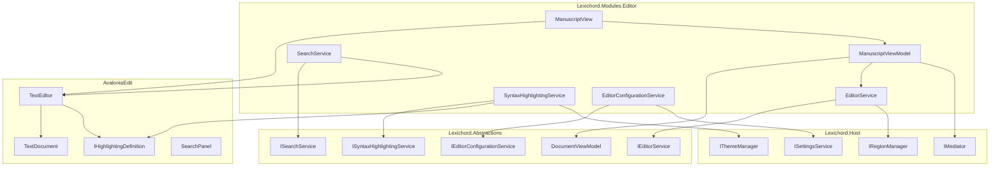
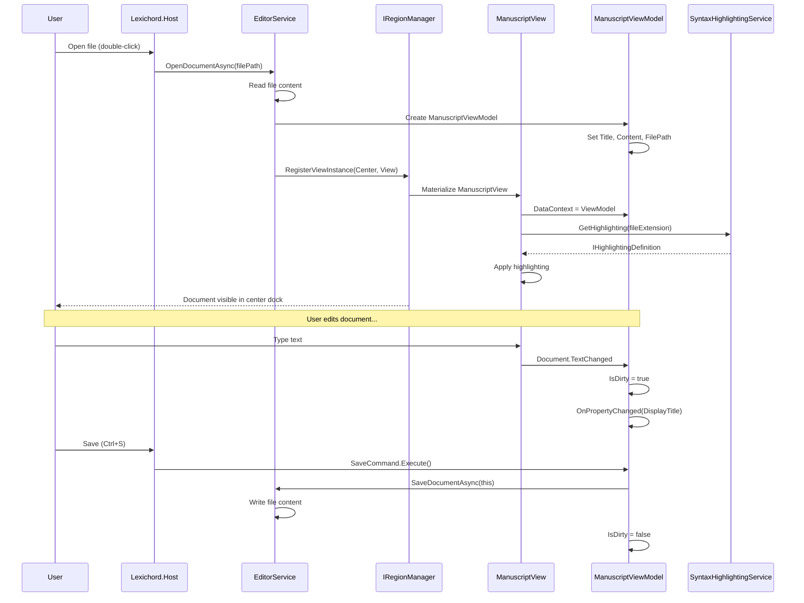

# LCS-INF-013: Feature Design Specification — The Manuscript (Editor Module)

## 1. Metadata & Categorization

| Field                | Value                                    | Description                                           |
| :------------------- | :--------------------------------------- | :---------------------------------------------------- |
| **Feature ID**       | `INF-013`                                | Infrastructure - Editor Module                        |
| **Feature Name**     | The Manuscript (Editor Module)           | High-performance text editor for writing              |
| **Target Version**   | `v0.1.3`                                 | Core Product Milestone                                |
| **Module Scope**     | `Lexichord.Modules.Editor`               | Standalone module for text editing                    |
| **Swimlane**         | `Product`                                | Core User-Facing Feature                              |
| **License Tier**     | `Core`                                   | Foundation (Available in Free tier)                   |
| **Feature Gate Key** | N/A                                      | No runtime gating for core editor                     |
| **Author**           | System Architect                         |                                                       |
| **Status**           | **Draft**                                | Pending implementation                                |
| **Last Updated**     | 2026-01-26                               |                                                       |

---

## 2. Executive Summary

### 2.1 The Requirement

Lexichord needs a **core text editing capability** that serves as the primary product for Free tier users:

- Writers need a reliable, fast editor for manuscripts and documents.
- Developers need syntax highlighting for configuration files (JSON, YAML, XML, Markdown).
- Users expect modern editor features: search/replace, line numbers, customizable fonts.
- The editor must integrate seamlessly with the docking system from v0.1.1.

Without this module, Lexichord has no core product — it's just an empty framework.

### 2.2 The Proposed Solution

We **SHALL** implement a complete Editor Module with:

1. **v0.1.3a: AvalonEdit Integration** — Embed high-performance TextEditor control.
2. **v0.1.3b: Syntax Highlighting Service** — XSHD-based highlighting with theme support.
3. **v0.1.3c: Search & Replace Overlay** — Inline search UI with Ctrl+F activation.
4. **v0.1.3d: Editor Configuration** — Font, zoom, Tab/Space settings with persistence.

---

## 3. Architecture & Modular Strategy

### 3.1 High-Level Architecture



### 3.2 Document Lifecycle Sequence



### 3.3 Dependencies

**NuGet Packages:**

| Package | Version | Purpose |
|:--------|:--------|:--------|
| `AvaloniaEdit` | 11.x | High-performance text editor |
| `AvaloniaEdit.TextMate` | 11.x | TextMate grammar support (optional) |

**Project References:**

| Project | Reference Direction |
|:--------|:--------------------|
| `Lexichord.Modules.Editor` | -> `Lexichord.Abstractions` |
| `Lexichord.Host` | -> `Lexichord.Modules.Editor` (module load) |

### 3.4 Licensing Behavior

- **Core License:** Full editor functionality available in Free tier.
- **WriterPro License:** Future AI features (v0.2.x) will be gated.
- **Enterprise License:** Custom syntax highlighting definitions (future).

---

## 4. Decision Tree: Editor Operations

```text
START: "What editor operation is requested?"
│
├── Open Document
│   ├── Is file path provided?
│   │   ├── YES → Read file, detect encoding, create VM
│   │   │   ├── File exists? → Load content
│   │   │   └── File not found → Show error, abort
│   │   └── NO → Create new untitled document
│   ├── Detect highlighting from extension
│   ├── Register view in Center region
│   └── Focus new tab
│
├── Save Document
│   ├── Is file path set?
│   │   ├── YES → Write to existing path
│   │   └── NO → Show Save As dialog
│   ├── Write content with detected encoding
│   ├── Clear dirty flag
│   └── Publish DocumentSavedEvent
│
├── Close Document
│   ├── Is document dirty?
│   │   ├── YES → Show save confirmation
│   │   │   ├── Save → Save then close
│   │   │   ├── Discard → Close without save
│   │   │   └── Cancel → Keep open
│   │   └── NO → Close immediately
│   └── Remove from open documents
│
├── Search
│   ├── Show search overlay
│   ├── User enters search text
│   ├── Execute search on Enter
│   │   ├── Match found → Scroll to match, highlight
│   │   └── No match → Show "No results" indicator
│   └── F3 for next, Shift+F3 for previous
│
├── Replace
│   ├── Find current match
│   ├── Replace → Substitute text, find next
│   └── Replace All → Substitute all matches, report count
│
├── Change Settings
│   ├── Font changed → Apply to all open editors
│   ├── Tab size changed → Apply to all open editors
│   ├── Theme changed → Reload highlighting colors
│   └── Persist via ISettingsService
│
└── END
```

---

## 5. Data Contracts

### 5.1 IEditorService Interface

```csharp
namespace Lexichord.Abstractions.Contracts;

/// <summary>
/// Service for managing text document editing operations.
/// </summary>
/// <remarks>
/// LOGIC: IEditorService is the primary entry point for document operations.
/// It coordinates between the file system, ViewModels, and the docking system.
/// All document lifecycle events flow through this service.
/// </remarks>
public interface IEditorService
{
    /// <summary>
    /// Opens a document from the file system.
    /// </summary>
    /// <param name="filePath">Absolute path to the file.</param>
    /// <param name="cancellationToken">Cancellation token.</param>
    /// <returns>The created ManuscriptViewModel, or null if failed.</returns>
    /// <remarks>
    /// LOGIC: If the file is already open, activates the existing tab.
    /// Otherwise, reads the file, detects encoding, and creates a new tab.
    /// </remarks>
    Task<IManuscriptViewModel?> OpenDocumentAsync(
        string filePath,
        CancellationToken cancellationToken = default);

    /// <summary>
    /// Creates a new untitled document.
    /// </summary>
    /// <param name="title">Optional title (default: "Untitled").</param>
    /// <returns>The created ManuscriptViewModel.</returns>
    Task<IManuscriptViewModel> CreateDocumentAsync(string? title = null);

    /// <summary>
    /// Saves a document to its current file path.
    /// </summary>
    /// <param name="document">The document to save.</param>
    /// <param name="cancellationToken">Cancellation token.</param>
    /// <returns>True if save succeeded.</returns>
    Task<bool> SaveDocumentAsync(
        IManuscriptViewModel document,
        CancellationToken cancellationToken = default);

    /// <summary>
    /// Saves a document to a new file path.
    /// </summary>
    /// <param name="document">The document to save.</param>
    /// <param name="filePath">The new file path.</param>
    /// <param name="cancellationToken">Cancellation token.</param>
    /// <returns>True if save succeeded.</returns>
    Task<bool> SaveDocumentAsAsync(
        IManuscriptViewModel document,
        string filePath,
        CancellationToken cancellationToken = default);

    /// <summary>
    /// Closes a document with optional save prompt.
    /// </summary>
    /// <param name="document">The document to close.</param>
    /// <param name="force">If true, close without save prompt.</param>
    /// <returns>True if document was closed.</returns>
    Task<bool> CloseDocumentAsync(IManuscriptViewModel document, bool force = false);

    /// <summary>
    /// Gets all currently open documents.
    /// </summary>
    IReadOnlyList<IManuscriptViewModel> OpenDocuments { get; }

    /// <summary>
    /// Gets the currently active document.
    /// </summary>
    IManuscriptViewModel? ActiveDocument { get; }

    /// <summary>
    /// Event raised when a document is opened.
    /// </summary>
    event EventHandler<DocumentEventArgs> DocumentOpened;

    /// <summary>
    /// Event raised when a document is closed.
    /// </summary>
    event EventHandler<DocumentEventArgs> DocumentClosed;

    /// <summary>
    /// Event raised when the active document changes.
    /// </summary>
    event EventHandler<DocumentEventArgs> ActiveDocumentChanged;
}

/// <summary>
/// Event arguments for document events.
/// </summary>
/// <param name="Document">The affected document.</param>
public record DocumentEventArgs(IManuscriptViewModel Document);
```

### 5.2 IManuscriptViewModel Interface

```csharp
namespace Lexichord.Abstractions.Contracts;

/// <summary>
/// Interface for manuscript document view models.
/// </summary>
/// <remarks>
/// LOGIC: Extends DocumentViewModel with text-specific properties.
/// Provides access to document content, file path, and editing state.
/// </remarks>
public interface IManuscriptViewModel
{
    /// <summary>
    /// Gets the unique document identifier.
    /// </summary>
    string Id { get; }

    /// <summary>
    /// Gets the display title for the tab.
    /// </summary>
    string Title { get; }

    /// <summary>
    /// Gets the display title with dirty indicator.
    /// </summary>
    string DisplayTitle { get; }

    /// <summary>
    /// Gets or sets the file path (null for untitled documents).
    /// </summary>
    string? FilePath { get; set; }

    /// <summary>
    /// Gets the file extension (e.g., ".md", ".json").
    /// </summary>
    string FileExtension { get; }

    /// <summary>
    /// Gets or sets the document text content.
    /// </summary>
    string Content { get; set; }

    /// <summary>
    /// Gets whether the document has unsaved changes.
    /// </summary>
    bool IsDirty { get; }

    /// <summary>
    /// Gets or sets whether the tab is pinned.
    /// </summary>
    bool IsPinned { get; set; }

    /// <summary>
    /// Gets the detected file encoding.
    /// </summary>
    Encoding Encoding { get; }

    /// <summary>
    /// Gets the current cursor position.
    /// </summary>
    CaretPosition CaretPosition { get; }

    /// <summary>
    /// Gets the current selection.
    /// </summary>
    TextSelection Selection { get; }

    /// <summary>
    /// Gets the total line count.
    /// </summary>
    int LineCount { get; }

    /// <summary>
    /// Gets the total character count.
    /// </summary>
    int CharacterCount { get; }

    /// <summary>
    /// Gets the word count.
    /// </summary>
    int WordCount { get; }

    /// <summary>
    /// Selects text at the specified range.
    /// </summary>
    /// <param name="startOffset">Start offset in document.</param>
    /// <param name="length">Length of selection.</param>
    void Select(int startOffset, int length);

    /// <summary>
    /// Scrolls to the specified line.
    /// </summary>
    /// <param name="line">Line number (1-based).</param>
    void ScrollToLine(int line);

    /// <summary>
    /// Inserts text at the current caret position.
    /// </summary>
    /// <param name="text">Text to insert.</param>
    void InsertText(string text);
}

/// <summary>
/// Represents a caret position in the document.
/// </summary>
/// <param name="Line">Line number (1-based).</param>
/// <param name="Column">Column number (1-based).</param>
/// <param name="Offset">Character offset from document start.</param>
public record CaretPosition(int Line, int Column, int Offset);

/// <summary>
/// Represents a text selection in the document.
/// </summary>
/// <param name="StartOffset">Start offset of selection.</param>
/// <param name="EndOffset">End offset of selection.</param>
/// <param name="Length">Length of selection.</param>
/// <param name="SelectedText">The selected text content.</param>
public record TextSelection(int StartOffset, int EndOffset, int Length, string SelectedText);
```

### 5.3 Editor Events

```csharp
namespace Lexichord.Abstractions.Events;

using MediatR;

/// <summary>
/// Event published when a document is opened.
/// </summary>
/// <param name="DocumentId">Unique identifier of the document.</param>
/// <param name="FilePath">File path (null for untitled).</param>
/// <param name="Title">Document title.</param>
public record DocumentOpenedEvent(
    string DocumentId,
    string? FilePath,
    string Title
) : INotification;

/// <summary>
/// Event published when a document is saved.
/// </summary>
/// <param name="DocumentId">Unique identifier of the document.</param>
/// <param name="FilePath">File path where document was saved.</param>
public record DocumentSavedEvent(
    string DocumentId,
    string FilePath
) : INotification;

/// <summary>
/// Event published when a document is closed.
/// </summary>
/// <param name="DocumentId">Unique identifier of the document.</param>
/// <param name="WasDirty">Whether the document had unsaved changes.</param>
public record DocumentClosedEvent(
    string DocumentId,
    bool WasDirty
) : INotification;

/// <summary>
/// Event published when document content changes.
/// </summary>
/// <param name="DocumentId">Unique identifier of the document.</param>
/// <param name="ChangeType">Type of change (Insert, Delete, Replace).</param>
/// <param name="Offset">Offset where change occurred.</param>
/// <param name="Length">Length of change.</param>
public record DocumentChangedEvent(
    string DocumentId,
    DocumentChangeType ChangeType,
    int Offset,
    int Length
) : INotification;

/// <summary>
/// Types of document changes.
/// </summary>
public enum DocumentChangeType
{
    Insert,
    Delete,
    Replace
}

/// <summary>
/// Event published when search is executed.
/// </summary>
/// <param name="DocumentId">Document where search was performed.</param>
/// <param name="SearchText">The search query.</param>
/// <param name="MatchCount">Number of matches found.</param>
/// <param name="Options">Search options used.</param>
public record SearchExecutedEvent(
    string DocumentId,
    string SearchText,
    int MatchCount,
    SearchOptions Options
) : INotification;
```

### 5.4 EditorSettings Record

```csharp
namespace Lexichord.Abstractions.Contracts;

/// <summary>
/// Configuration settings for the text editor.
/// </summary>
/// <remarks>
/// LOGIC: These settings are persisted via ISettingsService and apply
/// to all open editor instances. Changes trigger immediate UI updates.
/// </remarks>
public record EditorSettings
{
    /// <summary>
    /// Settings section name for persistence.
    /// </summary>
    public const string SectionName = "Editor";

    /// <summary>
    /// Font family for editor text.
    /// </summary>
    /// <remarks>
    /// LOGIC: Defaults to "Cascadia Code" with fallback to system monospace.
    /// Supports any installed font family name.
    /// </remarks>
    public string FontFamily { get; init; } = "Cascadia Code";

    /// <summary>
    /// Font size in points.
    /// </summary>
    /// <remarks>
    /// LOGIC: Valid range is 8-72pt. Ctrl+Scroll adjusts within this range.
    /// </remarks>
    public double FontSize { get; init; } = 14.0;

    /// <summary>
    /// Minimum font size for zoom.
    /// </summary>
    public double MinFontSize { get; init; } = 8.0;

    /// <summary>
    /// Maximum font size for zoom.
    /// </summary>
    public double MaxFontSize { get; init; } = 72.0;

    /// <summary>
    /// Whether to show line numbers in the gutter.
    /// </summary>
    public bool ShowLineNumbers { get; init; } = true;

    /// <summary>
    /// Whether to wrap long lines.
    /// </summary>
    public bool WordWrap { get; init; } = true;

    /// <summary>
    /// Whether to use spaces instead of tabs.
    /// </summary>
    public bool UseSpacesForTabs { get; init; } = true;

    /// <summary>
    /// Number of spaces per tab stop.
    /// </summary>
    public int TabSize { get; init; } = 4;

    /// <summary>
    /// Number of spaces for auto-indent.
    /// </summary>
    public int IndentSize { get; init; } = 4;

    /// <summary>
    /// Whether to highlight the current line.
    /// </summary>
    public bool HighlightCurrentLine { get; init; } = true;

    /// <summary>
    /// Whether to show whitespace characters.
    /// </summary>
    public bool ShowWhitespace { get; init; } = false;

    /// <summary>
    /// Whether to show end-of-line markers.
    /// </summary>
    public bool ShowEndOfLine { get; init; } = false;

    /// <summary>
    /// Whether to enable auto-indent.
    /// </summary>
    public bool AutoIndent { get; init; } = true;

    /// <summary>
    /// Whether to enable bracket matching.
    /// </summary>
    public bool HighlightMatchingBrackets { get; init; } = true;

    /// <summary>
    /// Column position for the vertical ruler (0 to disable).
    /// </summary>
    public int VerticalRulerPosition { get; init; } = 80;

    /// <summary>
    /// Gets fallback font families in order of preference.
    /// </summary>
    public static IReadOnlyList<string> FallbackFonts { get; } = new[]
    {
        "Cascadia Code",
        "Cascadia Mono",
        "Fira Code",
        "JetBrains Mono",
        "Consolas",
        "Monaco",
        "Menlo",
        "DejaVu Sans Mono",
        "monospace"
    };
}
```

---

## 6. Implementation Logic

### 6.1 EditorModule Registration

```csharp
using Lexichord.Abstractions.Contracts;
using Microsoft.Extensions.DependencyInjection;
using Microsoft.Extensions.Logging;

namespace Lexichord.Modules.Editor;

/// <summary>
/// Module registration for the Editor module.
/// </summary>
/// <remarks>
/// LOGIC: This module is loaded by the Host and registers all editor services.
/// It injects views into the Center dock region for document editing.
/// </remarks>
public class EditorModule : IModule
{
    public string Name => "Editor";
    public string Description => "High-performance text editor with syntax highlighting";
    public Version Version => new(0, 1, 3);
    public LicenseTier RequiredTier => LicenseTier.Core;

    private ILogger<EditorModule>? _logger;

    public void ConfigureServices(IServiceCollection services)
    {
        // Register editor services
        services.AddSingleton<IEditorService, EditorService>();
        services.AddSingleton<ISyntaxHighlightingService, XshdHighlightingService>();
        services.AddSingleton<ISearchService, SearchService>();
        services.AddSingleton<IEditorConfigurationService, EditorConfigurationService>();

        // Register views for DI
        services.AddTransient<ManuscriptView>();
        services.AddTransient<ManuscriptViewModel>();
        services.AddTransient<SearchOverlayView>();
        services.AddTransient<SearchOverlayViewModel>();
    }

    public async Task InitializeAsync(IServiceProvider services)
    {
        _logger = services.GetRequiredService<ILogger<EditorModule>>();
        _logger.LogInformation("Initializing Editor module v{Version}", Version);

        // Initialize syntax highlighting definitions
        var highlightingService = services.GetRequiredService<ISyntaxHighlightingService>();
        await highlightingService.LoadDefinitionsAsync();

        // Load editor settings
        var configService = services.GetRequiredService<IEditorConfigurationService>();
        await configService.LoadSettingsAsync();

        _logger.LogInformation("Editor module initialized successfully");
    }

    public Task ShutdownAsync()
    {
        _logger?.LogInformation("Editor module shutting down");
        return Task.CompletedTask;
    }
}
```

### 6.2 EditorService Implementation

```csharp
using System.Text;
using Lexichord.Abstractions.Contracts;
using Lexichord.Abstractions.Events;
using MediatR;
using Microsoft.Extensions.DependencyInjection;
using Microsoft.Extensions.Logging;

namespace Lexichord.Modules.Editor.Services;

/// <summary>
/// Service for managing document editing operations.
/// </summary>
/// <remarks>
/// LOGIC: EditorService is the central coordinator for all document operations.
/// It manages the collection of open documents, handles file I/O, and
/// coordinates with the docking system for tab management.
///
/// Thread Safety:
/// - OpenDocuments is thread-safe via lock
/// - File I/O is async and non-blocking
/// - Events are published after successful operations
/// </remarks>
public sealed class EditorService(
    IServiceProvider serviceProvider,
    IRegionManager regionManager,
    ISyntaxHighlightingService highlightingService,
    IMediator mediator,
    ILogger<EditorService> logger) : IEditorService
{
    private readonly List<IManuscriptViewModel> _openDocuments = [];
    private readonly object _lock = new();
    private IManuscriptViewModel? _activeDocument;

    /// <inheritdoc/>
    public IReadOnlyList<IManuscriptViewModel> OpenDocuments
    {
        get
        {
            lock (_lock)
            {
                return _openDocuments.ToList();
            }
        }
    }

    /// <inheritdoc/>
    public IManuscriptViewModel? ActiveDocument
    {
        get => _activeDocument;
        private set
        {
            if (_activeDocument != value)
            {
                _activeDocument = value;
                if (value is not null)
                {
                    ActiveDocumentChanged?.Invoke(this, new DocumentEventArgs(value));
                }
            }
        }
    }

    /// <inheritdoc/>
    public event EventHandler<DocumentEventArgs>? DocumentOpened;
    /// <inheritdoc/>
    public event EventHandler<DocumentEventArgs>? DocumentClosed;
    /// <inheritdoc/>
    public event EventHandler<DocumentEventArgs>? ActiveDocumentChanged;

    /// <inheritdoc/>
    public async Task<IManuscriptViewModel?> OpenDocumentAsync(
        string filePath,
        CancellationToken cancellationToken = default)
    {
        logger.LogInformation("Opening document: {FilePath}", filePath);

        // LOGIC: Check if already open - activate existing tab
        var existing = FindOpenDocument(filePath);
        if (existing is not null)
        {
            logger.LogDebug("Document already open, activating existing tab");
            await ActivateDocumentAsync(existing);
            return existing;
        }

        // LOGIC: Validate file exists
        if (!File.Exists(filePath))
        {
            logger.LogWarning("File not found: {FilePath}", filePath);
            return null;
        }

        try
        {
            // LOGIC: Read file with encoding detection
            var (content, encoding) = await ReadFileAsync(filePath, cancellationToken);

            // LOGIC: Create ViewModel
            var viewModel = serviceProvider.GetRequiredService<ManuscriptViewModel>();
            viewModel.Initialize(
                id: Guid.NewGuid().ToString(),
                title: Path.GetFileName(filePath),
                filePath: filePath,
                content: content,
                encoding: encoding
            );

            // LOGIC: Get syntax highlighting
            var highlighting = highlightingService.GetHighlighting(
                Path.GetExtension(filePath));

            // LOGIC: Register view in center dock
            var view = serviceProvider.GetRequiredService<ManuscriptView>();
            view.DataContext = viewModel;
            view.SetHighlighting(highlighting);

            regionManager.RegisterViewInstance(
                ShellRegion.Center,
                view,
                new RegionViewOptions(viewModel.Title, CanClose: true));

            lock (_lock)
            {
                _openDocuments.Add(viewModel);
            }

            ActiveDocument = viewModel;

            // LOGIC: Publish event
            await mediator.Publish(new DocumentOpenedEvent(
                viewModel.Id,
                filePath,
                viewModel.Title
            ), cancellationToken);

            DocumentOpened?.Invoke(this, new DocumentEventArgs(viewModel));

            logger.LogInformation(
                "Document opened: {Title} ({LineCount} lines, {Encoding})",
                viewModel.Title, viewModel.LineCount, encoding.EncodingName);

            return viewModel;
        }
        catch (Exception ex)
        {
            logger.LogError(ex, "Failed to open document: {FilePath}", filePath);
            return null;
        }
    }

    /// <inheritdoc/>
    public async Task<IManuscriptViewModel> CreateDocumentAsync(string? title = null)
    {
        var untitledNumber = GetNextUntitledNumber();
        var documentTitle = title ?? $"Untitled-{untitledNumber}";

        logger.LogInformation("Creating new document: {Title}", documentTitle);

        var viewModel = serviceProvider.GetRequiredService<ManuscriptViewModel>();
        viewModel.Initialize(
            id: Guid.NewGuid().ToString(),
            title: documentTitle,
            filePath: null,
            content: string.Empty,
            encoding: Encoding.UTF8
        );

        var view = serviceProvider.GetRequiredService<ManuscriptView>();
        view.DataContext = viewModel;

        regionManager.RegisterViewInstance(
            ShellRegion.Center,
            view,
            new RegionViewOptions(viewModel.Title, CanClose: true));

        lock (_lock)
        {
            _openDocuments.Add(viewModel);
        }

        ActiveDocument = viewModel;

        await mediator.Publish(new DocumentOpenedEvent(
            viewModel.Id,
            null,
            viewModel.Title
        ));

        DocumentOpened?.Invoke(this, new DocumentEventArgs(viewModel));

        return viewModel;
    }

    /// <inheritdoc/>
    public async Task<bool> SaveDocumentAsync(
        IManuscriptViewModel document,
        CancellationToken cancellationToken = default)
    {
        if (document.FilePath is null)
        {
            logger.LogWarning("Cannot save document without file path: {Title}", document.Title);
            return false;
        }

        return await SaveDocumentAsAsync(document, document.FilePath, cancellationToken);
    }

    /// <inheritdoc/>
    public async Task<bool> SaveDocumentAsAsync(
        IManuscriptViewModel document,
        string filePath,
        CancellationToken cancellationToken = default)
    {
        logger.LogInformation("Saving document to: {FilePath}", filePath);

        try
        {
            // LOGIC: Write with original encoding
            await File.WriteAllTextAsync(
                filePath,
                document.Content,
                document.Encoding,
                cancellationToken);

            // LOGIC: Update document state
            if (document is ManuscriptViewModel vm)
            {
                vm.FilePath = filePath;
                vm.ClearDirty();
            }

            await mediator.Publish(new DocumentSavedEvent(
                document.Id,
                filePath
            ), cancellationToken);

            logger.LogInformation("Document saved: {FilePath}", filePath);
            return true;
        }
        catch (Exception ex)
        {
            logger.LogError(ex, "Failed to save document: {FilePath}", filePath);
            return false;
        }
    }

    /// <inheritdoc/>
    public async Task<bool> CloseDocumentAsync(IManuscriptViewModel document, bool force = false)
    {
        logger.LogDebug("Closing document: {Title} (force={Force})", document.Title, force);

        if (!force && document.IsDirty)
        {
            // LOGIC: Prompt handled by DocumentViewModel.CanCloseAsync
            if (document is ManuscriptViewModel vm)
            {
                if (!await vm.CanCloseAsync())
                {
                    logger.LogDebug("Close cancelled by user for dirty document");
                    return false;
                }
            }
        }

        lock (_lock)
        {
            _openDocuments.Remove(document);
        }

        // LOGIC: Remove from dock
        // (Dock system handles view removal via its close mechanism)

        await mediator.Publish(new DocumentClosedEvent(
            document.Id,
            document.IsDirty
        ));

        DocumentClosed?.Invoke(this, new DocumentEventArgs(document));

        // LOGIC: Activate next document if this was active
        if (ActiveDocument == document)
        {
            ActiveDocument = OpenDocuments.FirstOrDefault();
        }

        logger.LogInformation("Document closed: {Title}", document.Title);
        return true;
    }

    private IManuscriptViewModel? FindOpenDocument(string filePath)
    {
        lock (_lock)
        {
            return _openDocuments.FirstOrDefault(d =>
                string.Equals(d.FilePath, filePath, StringComparison.OrdinalIgnoreCase));
        }
    }

    private async Task ActivateDocumentAsync(IManuscriptViewModel document)
    {
        // LOGIC: Request dock to activate the tab
        await regionManager.ActivateViewAsync<ManuscriptView>(ShellRegion.Center);
        ActiveDocument = document;
    }

    private int GetNextUntitledNumber()
    {
        lock (_lock)
        {
            var maxNumber = _openDocuments
                .Where(d => d.FilePath is null && d.Title.StartsWith("Untitled-"))
                .Select(d =>
                {
                    var numPart = d.Title["Untitled-".Length..];
                    return int.TryParse(numPart, out var n) ? n : 0;
                })
                .DefaultIfEmpty(0)
                .Max();

            return maxNumber + 1;
        }
    }

    private static async Task<(string Content, Encoding Encoding)> ReadFileAsync(
        string filePath,
        CancellationToken cancellationToken)
    {
        // LOGIC: Detect encoding from BOM or default to UTF-8
        await using var stream = new FileStream(
            filePath,
            FileMode.Open,
            FileAccess.Read,
            FileShare.Read,
            bufferSize: 4096,
            useAsync: true);

        using var reader = new StreamReader(stream, detectEncodingFromByteOrderMarks: true);
        var content = await reader.ReadToEndAsync(cancellationToken);
        var encoding = reader.CurrentEncoding;

        return (content, encoding);
    }
}
```

### 6.3 ManuscriptViewModel Implementation

```csharp
using System.Text;
using System.Text.RegularExpressions;
using CommunityToolkit.Mvvm.ComponentModel;
using CommunityToolkit.Mvvm.Input;
using Lexichord.Abstractions.Contracts;
using Lexichord.Abstractions.ViewModels;

namespace Lexichord.Modules.Editor.ViewModels;

/// <summary>
/// ViewModel for a manuscript document.
/// </summary>
/// <remarks>
/// LOGIC: ManuscriptViewModel extends DocumentViewModel with text-specific
/// features like line/word count, encoding, and selection tracking.
///
/// The Content property is bound to TextEditor.Text and triggers dirty
/// state when modified.
/// </remarks>
public partial class ManuscriptViewModel : DocumentViewModel, IManuscriptViewModel
{
    private string _id = string.Empty;
    private string _title = "Untitled";
    private string? _filePath;
    private string _content = string.Empty;
    private Encoding _encoding = Encoding.UTF8;

    /// <inheritdoc/>
    public override string Id => _id;

    /// <inheritdoc/>
    public override string Title => _title;

    /// <inheritdoc/>
    public string? FilePath
    {
        get => _filePath;
        set => SetProperty(ref _filePath, value);
    }

    /// <inheritdoc/>
    public string FileExtension =>
        FilePath is not null
            ? Path.GetExtension(FilePath).ToLowerInvariant()
            : string.Empty;

    /// <inheritdoc/>
    public string Content
    {
        get => _content;
        set
        {
            if (SetProperty(ref _content, value))
            {
                SetDirty();
                OnPropertyChanged(nameof(LineCount));
                OnPropertyChanged(nameof(CharacterCount));
                OnPropertyChanged(nameof(WordCount));
            }
        }
    }

    /// <inheritdoc/>
    public Encoding Encoding
    {
        get => _encoding;
        private set => SetProperty(ref _encoding, value);
    }

    [ObservableProperty]
    private CaretPosition _caretPosition = new(1, 1, 0);

    [ObservableProperty]
    private TextSelection _selection = new(0, 0, 0, string.Empty);

    /// <inheritdoc/>
    public int LineCount => string.IsNullOrEmpty(Content)
        ? 1
        : Content.Split('\n').Length;

    /// <inheritdoc/>
    public int CharacterCount => Content?.Length ?? 0;

    /// <inheritdoc/>
    public int WordCount => CountWords(Content);

    /// <inheritdoc/>
    public override string ToolTip => FilePath ?? Title;

    /// <inheritdoc/>
    public override string? Icon => FileExtension switch
    {
        ".md" or ".markdown" => "FileDocumentOutline",
        ".json" => "CodeJson",
        ".yaml" or ".yml" => "FileCode",
        ".xml" => "FileXmlBox",
        ".txt" => "FileDocument",
        _ => "FileOutline"
    };

    /// <summary>
    /// Initializes the view model with document data.
    /// </summary>
    public void Initialize(
        string id,
        string title,
        string? filePath,
        string content,
        Encoding encoding)
    {
        _id = id;
        _title = title;
        _filePath = filePath;
        _content = content;
        _encoding = encoding;

        // LOGIC: Don't mark as dirty on initial load
        ClearDirty();

        OnPropertyChanged(nameof(Id));
        OnPropertyChanged(nameof(Title));
        OnPropertyChanged(nameof(FilePath));
        OnPropertyChanged(nameof(Content));
        OnPropertyChanged(nameof(Encoding));
        OnPropertyChanged(nameof(FileExtension));
        OnPropertyChanged(nameof(LineCount));
        OnPropertyChanged(nameof(CharacterCount));
        OnPropertyChanged(nameof(WordCount));
    }

    /// <inheritdoc/>
    public void Select(int startOffset, int length)
    {
        var endOffset = startOffset + length;
        var selectedText = Content.Substring(startOffset, length);
        Selection = new TextSelection(startOffset, endOffset, length, selectedText);
    }

    /// <inheritdoc/>
    public void ScrollToLine(int line)
    {
        // LOGIC: View handles actual scrolling via binding
        var (_, _, offset) = CalculatePosition(line, 1);
        CaretPosition = new CaretPosition(line, 1, offset);
    }

    /// <inheritdoc/>
    public void InsertText(string text)
    {
        var offset = CaretPosition.Offset;
        Content = Content.Insert(offset, text);

        // LOGIC: Move caret after inserted text
        var newOffset = offset + text.Length;
        var (line, column, _) = CalculatePositionFromOffset(newOffset);
        CaretPosition = new CaretPosition(line, column, newOffset);
    }

    /// <summary>
    /// Updates caret position from editor.
    /// </summary>
    public void UpdateCaretPosition(int line, int column, int offset)
    {
        CaretPosition = new CaretPosition(line, column, offset);
    }

    /// <summary>
    /// Updates selection from editor.
    /// </summary>
    public void UpdateSelection(int startOffset, int endOffset)
    {
        var length = endOffset - startOffset;
        var selectedText = length > 0 && startOffset >= 0 && endOffset <= Content.Length
            ? Content.Substring(startOffset, length)
            : string.Empty;
        Selection = new TextSelection(startOffset, endOffset, length, selectedText);
    }

    /// <summary>
    /// Clears the dirty flag (called after save).
    /// </summary>
    public new void ClearDirty() => base.ClearDirty();

    private (int Line, int Column, int Offset) CalculatePosition(int line, int column)
    {
        var lines = Content.Split('\n');
        var offset = 0;

        for (var i = 0; i < line - 1 && i < lines.Length; i++)
        {
            offset += lines[i].Length + 1; // +1 for newline
        }

        offset += column - 1;
        return (line, column, offset);
    }

    private (int Line, int Column, int Offset) CalculatePositionFromOffset(int offset)
    {
        var line = 1;
        var column = 1;
        var currentOffset = 0;

        foreach (var ch in Content)
        {
            if (currentOffset >= offset)
                break;

            if (ch == '\n')
            {
                line++;
                column = 1;
            }
            else
            {
                column++;
            }
            currentOffset++;
        }

        return (line, column, offset);
    }

    private static int CountWords(string? text)
    {
        if (string.IsNullOrWhiteSpace(text))
            return 0;

        // LOGIC: Count word boundaries using regex
        return Regex.Matches(text, @"\b\w+\b").Count;
    }
}
```

---

## 7. Use Cases & User Stories

### 7.1 User Stories

| ID | Role | Story | Acceptance Criteria |
|:---|:-----|:------|:--------------------|
| US-01 | Writer | As a writer, I want to open text files for editing. | File opens in new tab with content displayed. |
| US-02 | Writer | As a writer, I want to see line numbers. | Line numbers visible in gutter by default. |
| US-03 | Writer | As a writer, I want to search for text with Ctrl+F. | Search overlay appears, finds matches. |
| US-04 | Writer | As a writer, I want to replace text. | Replace replaces current match; Replace All counts replacements. |
| US-05 | Writer | As a writer, I want to zoom text with Ctrl+Scroll. | Font size increases/decreases smoothly. |
| US-06 | Writer | As a writer, I want dirty documents to prompt for save on close. | Dirty documents show save dialog. |
| US-07 | Developer | As a developer, I want JSON/YAML syntax highlighting. | Code is colored according to syntax. |
| US-08 | Developer | As a developer, I want to configure Tab/Space behavior. | Settings panel allows Tab/Space toggle. |

### 7.2 Use Cases

#### UC-01: Open and Edit a Document

**Preconditions:**
- Lexichord is running with Editor module loaded.
- A markdown file exists on disk.

**Flow:**
1. User double-clicks a .md file in Project Explorer (or File > Open).
2. EditorService.OpenDocumentAsync is called with file path.
3. File content is read with encoding detection.
4. ManuscriptViewModel is created with content.
5. ManuscriptView is registered in Center region.
6. Syntax highlighting for Markdown is applied.
7. Document appears in a new tab.
8. User types text changes.
9. Document.IsDirty becomes true.
10. Tab title shows asterisk (*).

**Postconditions:**
- Document is open and editable.
- Changes are tracked.
- Syntax highlighting is active.

---

#### UC-02: Search and Replace

**Preconditions:**
- A document is open in the editor.
- User wants to find and replace text.

**Flow:**
1. User presses Ctrl+F.
2. Search overlay slides into view.
3. User types "TODO" in search field.
4. User presses Enter.
5. First "TODO" is highlighted and scrolled into view.
6. Status shows "1 of 5 matches".
7. User clicks "Replace" or presses Ctrl+H.
8. Replace field becomes visible.
9. User types "DONE" in replace field.
10. User clicks "Replace All".
11. All 5 instances are replaced.
12. Status shows "5 replacements made".
13. Document is marked dirty.

**Postconditions:**
- All matches replaced.
- Document modified.
- User can undo.

---

#### UC-03: Configure Editor Settings

**Preconditions:**
- Lexichord is running.
- User wants larger font size.

**Flow:**
1. User opens Settings (Ctrl+,).
2. User navigates to Editor section.
3. User changes font size slider from 14 to 16.
4. All open editors update immediately.
5. User changes "Use Spaces for Tabs" to true.
6. Tab key now inserts spaces.
7. User closes Settings.
8. Settings are persisted automatically.
9. On next launch, settings are restored.

**Postconditions:**
- Settings applied to all editors.
- Settings persisted.

---

## 8. Observability & Logging

### 8.1 Log Events

| Level | Context | Message Template |
|:------|:--------|:-----------------|
| Information | EditorModule | `Initializing Editor module v{Version}` |
| Information | EditorModule | `Editor module initialized successfully` |
| Information | EditorService | `Opening document: {FilePath}` |
| Debug | EditorService | `Document already open, activating existing tab` |
| Warning | EditorService | `File not found: {FilePath}` |
| Information | EditorService | `Document opened: {Title} ({LineCount} lines, {Encoding})` |
| Information | EditorService | `Creating new document: {Title}` |
| Information | EditorService | `Saving document to: {FilePath}` |
| Information | EditorService | `Document saved: {FilePath}` |
| Error | EditorService | `Failed to save document: {FilePath}` |
| Debug | EditorService | `Closing document: {Title} (force={Force})` |
| Debug | EditorService | `Close cancelled by user for dirty document` |
| Information | EditorService | `Document closed: {Title}` |
| Debug | SyntaxHighlightingService | `Loading highlighting definition: {Name}` |
| Warning | SyntaxHighlightingService | `Highlighting definition not found for extension: {Extension}` |
| Debug | SearchService | `Search executed: {Query} ({MatchCount} matches)` |
| Debug | SearchService | `Replace all: {Count} replacements` |
| Information | EditorConfigurationService | `Editor settings loaded` |
| Information | EditorConfigurationService | `Editor settings saved` |

---

## 9. Unit Testing Requirements

### 9.1 ManuscriptViewModel Tests

```csharp
[TestFixture]
[Category("Unit")]
public class ManuscriptViewModelTests
{
    private ManuscriptViewModel _sut = null!;

    [SetUp]
    public void SetUp()
    {
        _sut = new ManuscriptViewModel();
        _sut.Initialize(
            id: "test-id",
            title: "test.md",
            filePath: "/path/to/test.md",
            content: "Line 1\nLine 2\nLine 3",
            encoding: Encoding.UTF8
        );
    }

    [Test]
    public void Initialize_SetsAllProperties()
    {
        Assert.Multiple(() =>
        {
            Assert.That(_sut.Id, Is.EqualTo("test-id"));
            Assert.That(_sut.Title, Is.EqualTo("test.md"));
            Assert.That(_sut.FilePath, Is.EqualTo("/path/to/test.md"));
            Assert.That(_sut.Content, Is.EqualTo("Line 1\nLine 2\nLine 3"));
            Assert.That(_sut.IsDirty, Is.False);
        });
    }

    [Test]
    public void LineCount_ReturnsCorrectCount()
    {
        Assert.That(_sut.LineCount, Is.EqualTo(3));
    }

    [Test]
    public void CharacterCount_ReturnsCorrectCount()
    {
        Assert.That(_sut.CharacterCount, Is.EqualTo(20)); // Including newlines
    }

    [Test]
    public void WordCount_ReturnsCorrectCount()
    {
        Assert.That(_sut.WordCount, Is.EqualTo(6)); // "Line", "1", "Line", "2", "Line", "3"
    }

    [Test]
    public void Content_WhenChanged_MarksDirty()
    {
        // Act
        _sut.Content = "Modified content";

        // Assert
        Assert.That(_sut.IsDirty, Is.True);
    }

    [Test]
    public void DisplayTitle_WhenDirty_ShowsAsterisk()
    {
        // Arrange
        _sut.Content = "Modified";

        // Assert
        Assert.That(_sut.DisplayTitle, Is.EqualTo("test.md*"));
    }

    [Test]
    public void FileExtension_ReturnsLowercaseExtension()
    {
        Assert.That(_sut.FileExtension, Is.EqualTo(".md"));
    }

    [Test]
    public void FileExtension_WhenNoFilePath_ReturnsEmpty()
    {
        // Arrange
        _sut.FilePath = null;

        // Assert
        Assert.That(_sut.FileExtension, Is.Empty);
    }

    [Test]
    public void Select_UpdatesSelectionProperty()
    {
        // Act
        _sut.Select(0, 6); // "Line 1"

        // Assert
        Assert.Multiple(() =>
        {
            Assert.That(_sut.Selection.StartOffset, Is.EqualTo(0));
            Assert.That(_sut.Selection.EndOffset, Is.EqualTo(6));
            Assert.That(_sut.Selection.Length, Is.EqualTo(6));
            Assert.That(_sut.Selection.SelectedText, Is.EqualTo("Line 1"));
        });
    }

    [Test]
    public void InsertText_InsertsAtCaretPosition()
    {
        // Arrange
        _sut.UpdateCaretPosition(1, 1, 0);

        // Act
        _sut.InsertText("NEW ");

        // Assert
        Assert.That(_sut.Content, Does.StartWith("NEW Line 1"));
        Assert.That(_sut.IsDirty, Is.True);
    }

    [Test]
    public void ClearDirty_ResetsDirtyFlag()
    {
        // Arrange
        _sut.Content = "Modified";
        Assert.That(_sut.IsDirty, Is.True);

        // Act
        _sut.ClearDirty();

        // Assert
        Assert.That(_sut.IsDirty, Is.False);
    }
}
```

### 9.2 EditorService Tests

```csharp
[TestFixture]
[Category("Unit")]
public class EditorServiceTests
{
    private Mock<IServiceProvider> _mockProvider = null!;
    private Mock<IRegionManager> _mockRegionManager = null!;
    private Mock<ISyntaxHighlightingService> _mockHighlighting = null!;
    private Mock<IMediator> _mockMediator = null!;
    private Mock<ILogger<EditorService>> _mockLogger = null!;
    private EditorService _sut = null!;
    private string _tempDir = null!;

    [SetUp]
    public void SetUp()
    {
        _mockProvider = new Mock<IServiceProvider>();
        _mockRegionManager = new Mock<IRegionManager>();
        _mockHighlighting = new Mock<ISyntaxHighlightingService>();
        _mockMediator = new Mock<IMediator>();
        _mockLogger = new Mock<ILogger<EditorService>>();

        _mockProvider
            .Setup(p => p.GetService(typeof(ManuscriptViewModel)))
            .Returns(new ManuscriptViewModel());
        _mockProvider
            .Setup(p => p.GetService(typeof(ManuscriptView)))
            .Returns(new ManuscriptView());

        _sut = new EditorService(
            _mockProvider.Object,
            _mockRegionManager.Object,
            _mockHighlighting.Object,
            _mockMediator.Object,
            _mockLogger.Object);

        _tempDir = Path.Combine(Path.GetTempPath(), Guid.NewGuid().ToString());
        Directory.CreateDirectory(_tempDir);
    }

    [TearDown]
    public void TearDown()
    {
        if (Directory.Exists(_tempDir))
            Directory.Delete(_tempDir, true);
    }

    [Test]
    public async Task OpenDocumentAsync_FileNotFound_ReturnsNull()
    {
        // Act
        var result = await _sut.OpenDocumentAsync("/nonexistent/file.txt");

        // Assert
        Assert.That(result, Is.Null);
    }

    [Test]
    public async Task OpenDocumentAsync_ValidFile_ReturnsViewModel()
    {
        // Arrange
        var filePath = Path.Combine(_tempDir, "test.txt");
        await File.WriteAllTextAsync(filePath, "Test content");

        // Act
        var result = await _sut.OpenDocumentAsync(filePath);

        // Assert
        Assert.That(result, Is.Not.Null);
        Assert.That(result!.Content, Is.EqualTo("Test content"));
    }

    [Test]
    public async Task OpenDocumentAsync_AlreadyOpen_ActivatesExisting()
    {
        // Arrange
        var filePath = Path.Combine(_tempDir, "test.txt");
        await File.WriteAllTextAsync(filePath, "Test content");
        var first = await _sut.OpenDocumentAsync(filePath);

        // Act
        var second = await _sut.OpenDocumentAsync(filePath);

        // Assert
        Assert.That(second, Is.SameAs(first));
        Assert.That(_sut.OpenDocuments, Has.Count.EqualTo(1));
    }

    [Test]
    public async Task CreateDocumentAsync_CreatesUntitledDocument()
    {
        // Act
        var result = await _sut.CreateDocumentAsync();

        // Assert
        Assert.Multiple(() =>
        {
            Assert.That(result.Title, Does.StartWith("Untitled-"));
            Assert.That(result.FilePath, Is.Null);
            Assert.That(result.Content, Is.Empty);
        });
    }

    [Test]
    public async Task CreateDocumentAsync_IncrementsUntitledNumber()
    {
        // Act
        var first = await _sut.CreateDocumentAsync();
        var second = await _sut.CreateDocumentAsync();

        // Assert
        Assert.That(first.Title, Is.EqualTo("Untitled-1"));
        Assert.That(second.Title, Is.EqualTo("Untitled-2"));
    }

    [Test]
    public async Task CloseDocumentAsync_RemovesFromOpenDocuments()
    {
        // Arrange
        var doc = await _sut.CreateDocumentAsync();

        // Act
        await _sut.CloseDocumentAsync(doc, force: true);

        // Assert
        Assert.That(_sut.OpenDocuments, Is.Empty);
    }

    [Test]
    public async Task OpenDocuments_IsThreadSafe()
    {
        // Arrange
        var tasks = Enumerable.Range(0, 10)
            .Select(_ => _sut.CreateDocumentAsync())
            .ToArray();

        // Act
        await Task.WhenAll(tasks);

        // Assert
        Assert.That(_sut.OpenDocuments, Has.Count.EqualTo(10));
    }
}
```

---

## 10. Security & Safety

### 10.1 File System Security

> [!NOTE]
> The Editor module reads and writes files to the user's file system.
> Standard file permission checks apply.

- **Read Access:** User must have read permission on opened files.
- **Write Access:** User must have write permission for save operations.
- **Path Validation:** File paths are validated to prevent directory traversal.

### 10.2 Content Security

> [!WARNING]
> The Editor displays user content as-is. It does not execute any code.

- **No Code Execution:** Syntax highlighting is visual only.
- **Encoding Detection:** Proper encoding prevents display corruption.
- **Large File Protection:** Files >100MB prompt for confirmation.

---

## 11. Risks & Mitigations

| Risk | Impact | Mitigation |
|:-----|:-------|:-----------|
| AvaloniaEdit version incompatibility | High | Pin specific version; test before upgrade |
| Large file causes memory exhaustion | High | Implement file size limits; streaming for very large files |
| Font not installed on system | Medium | Fallback font chain; bundle Cascadia Code |
| Encoding detection fails | Medium | Default to UTF-8; allow manual encoding selection |
| Search regex causes ReDoS | Medium | Timeout regex execution; limit pattern length |
| Theme change crashes highlighting | Low | Catch exceptions; fallback to plain text |

---

## 12. Acceptance Criteria (QA)

| # | Category | Criterion |
|:--|:---------|:----------|
| 1 | **[Module]** | Editor module loads without errors |
| 2 | **[Open]** | Double-clicking file opens in new tab |
| 3 | **[Open]** | Already-open file activates existing tab |
| 4 | **[Edit]** | Text changes update document content |
| 5 | **[Edit]** | Line/word/character counts update on change |
| 6 | **[Dirty]** | Modified documents show asterisk in title |
| 7 | **[Save]** | Ctrl+S saves document to disk |
| 8 | **[Save]** | Save clears dirty flag |
| 9 | **[Close]** | Dirty documents prompt for save |
| 10 | **[Highlight]** | Markdown files have syntax highlighting |
| 11 | **[Highlight]** | JSON files have syntax highlighting |
| 12 | **[Highlight]** | YAML files have syntax highlighting |
| 13 | **[Highlight]** | XML files have syntax highlighting |
| 14 | **[Search]** | Ctrl+F opens search overlay |
| 15 | **[Search]** | Enter finds next match |
| 16 | **[Search]** | Match count displayed |
| 17 | **[Replace]** | Replace substitutes current match |
| 18 | **[Replace]** | Replace All counts replacements |
| 19 | **[Settings]** | Font size adjustable |
| 20 | **[Settings]** | Ctrl+Scroll zooms |
| 21 | **[Settings]** | Tab/Space configurable |
| 22 | **[Settings]** | Line numbers toggleable |
| 23 | **[Settings]** | Word wrap toggleable |
| 24 | **[Persist]** | Settings persist across sessions |
| 25 | **[Theme]** | Highlighting colors match app theme |

---

## 13. Verification Commands

```bash
# 1. Build the Editor module
dotnet build src/Lexichord.Modules.Editor

# 2. Run unit tests for Editor module
dotnet test --filter "FullyQualifiedName~Editor"

# 3. Run application and verify editor loads
dotnet run --project src/Lexichord.Host

# 4. Test commands in running application:
# - File > New (Ctrl+N) - creates untitled document
# - File > Open (Ctrl+O) - opens file picker
# - Edit > Find (Ctrl+F) - opens search overlay
# - View > Settings (Ctrl+,) - opens settings with Editor section

# 5. Verify syntax highlighting files exist
ls src/Lexichord.Modules.Editor/Resources/Highlighting/

# 6. Verify settings are persisted
cat ~/.config/Lexichord/settings.json | jq '.Editor'

# 7. Memory profile with large file
# Open a 10MB text file and verify memory stays under 50MB

# 8. Performance test search
# Open 100K line file, search for common term, verify <100ms
```

---

## 14. Deliverable Checklist

| Step | Description | Status |
|:-----|:------------|:-------|
| 1 | Create `Lexichord.Modules.Editor` project | [ ] |
| 2 | Install AvaloniaEdit NuGet package | [ ] |
| 3 | Define IEditorService interface in Abstractions | [ ] |
| 4 | Define IManuscriptViewModel interface | [ ] |
| 5 | Define ISyntaxHighlightingService interface | [ ] |
| 6 | Define ISearchService interface | [ ] |
| 7 | Define IEditorConfigurationService interface | [ ] |
| 8 | Define EditorSettings record | [ ] |
| 9 | Define editor events (DocumentOpened, etc.) | [ ] |
| 10 | Implement ManuscriptView.axaml | [ ] |
| 11 | Implement ManuscriptViewModel | [ ] |
| 12 | Implement EditorService | [ ] |
| 13 | Implement XshdHighlightingService | [ ] |
| 14 | Create Markdown.xshd | [ ] |
| 15 | Create JSON.xshd | [ ] |
| 16 | Create YAML.xshd | [ ] |
| 17 | Create XML.xshd | [ ] |
| 18 | Implement SearchOverlayView | [ ] |
| 19 | Implement SearchService | [ ] |
| 20 | Implement EditorConfigurationService | [ ] |
| 21 | Wire Ctrl+F to show search | [ ] |
| 22 | Wire Ctrl+Scroll for zoom | [ ] |
| 23 | Implement Tab/Space configuration | [ ] |
| 24 | Implement font fallback chain | [ ] |
| 25 | Register Editor module with Host | [ ] |
| 26 | Unit tests for ManuscriptViewModel | [ ] |
| 27 | Unit tests for EditorService | [ ] |
| 28 | Unit tests for SearchService | [ ] |
| 29 | Unit tests for HighlightingService | [ ] |
| 30 | Integration tests for Editor module | [ ] |
| 31 | Update CHANGELOG.md | [ ] |
