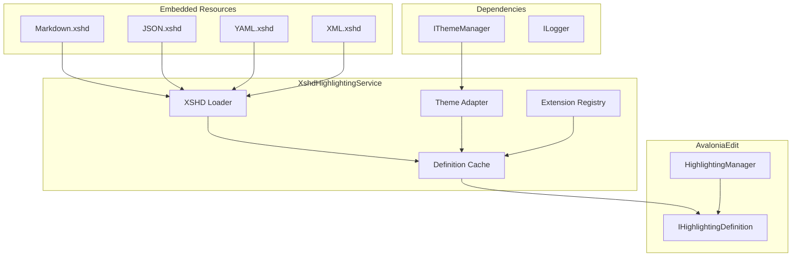
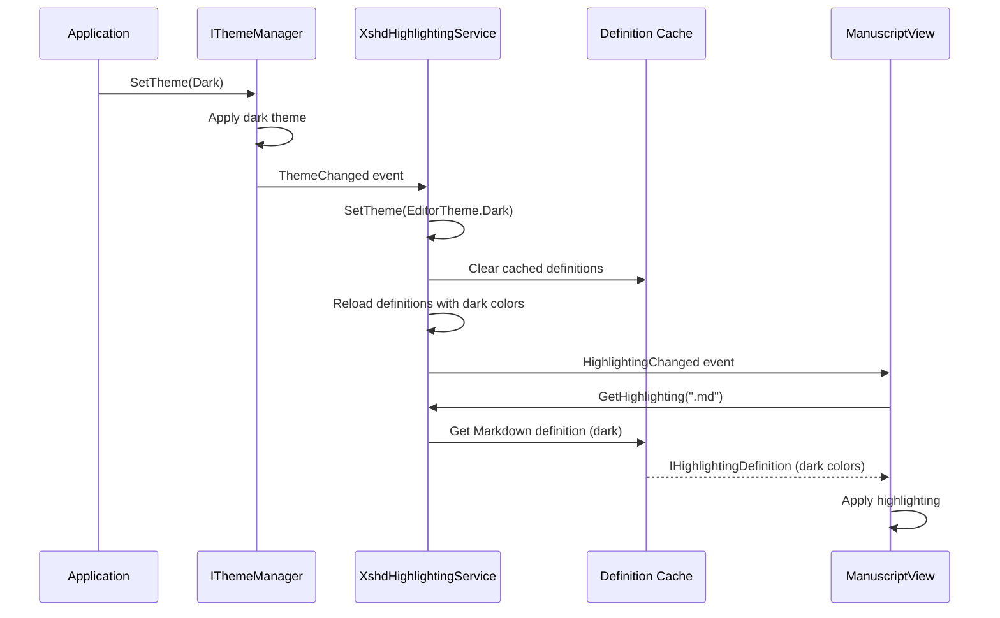

# LCS-INF-013b: Syntax Highlighting Service

## 1. Metadata & Categorization

| Field                | Value                                | Description                                      |
| :------------------- | :----------------------------------- | :----------------------------------------------- |
| **Feature ID**       | `INF-013b`                           | Sub-part B of Editor Module                      |
| **Feature Name**     | Syntax Highlighting Service          | XSHD definition loader with theme support        |
| **Target Version**   | `v0.1.3b`                            | Second sub-part of v0.1.3                        |
| **Module Scope**     | `Lexichord.Modules.Editor`           | Standalone editor module                         |
| **Swimlane**         | `Product`                            | Core User-Facing Feature                         |
| **License Tier**     | `Core`                               | Foundation (Available in Free tier)              |
| **Author**           | System Architect                     |                                                  |
| **Status**           | **Draft**                            | Pending implementation                           |
| **Last Updated**     | 2026-01-26                           |                                                  |

---

## 2. Executive Summary

### 2.1 The Requirement

Writers and developers need syntax highlighting for common file formats:

- **Markdown** — The primary format for manuscript writing.
- **JSON** — Configuration files and data.
- **YAML** — Configuration and front matter.
- **XML** — Structured data and configuration.

Highlighting must adapt to the application theme (light/dark) to maintain readability.

### 2.2 The Proposed Solution

We **SHALL** implement an XSHD-based syntax highlighting service with:

1. **XshdHighlightingService** — Load and manage highlighting definitions.
2. **Theme-aware colors** — Light and dark variants for each language.
3. **Auto-detection** — Map file extensions to highlighting modes.
4. **Embedded resources** — Bundle XSHD files with the module.

---

## 3. Architecture

### 3.1 Service Structure



### 3.2 Theme Color Adaptation Flow



---

## 4. Decision Tree: Highlighting Selection

```text
START: "Which highlighting definition to apply?"
│
├── Is file extension provided?
│   ├── NO → Return null (plain text)
│   └── YES → Continue
│
├── Normalize extension (lowercase, with dot)
│
├── Check extension registry
│   ├── .md, .markdown → "Markdown"
│   ├── .json → "JSON"
│   ├── .yaml, .yml → "YAML"
│   ├── .xml, .xshd, .csproj, .axaml → "XML"
│   ├── .txt → null (plain text)
│   └── Unknown → null (plain text)
│
├── Is definition cached?
│   ├── YES → Return cached definition
│   └── NO → Load from embedded resource
│
├── Apply current theme colors
│
└── Return IHighlightingDefinition
```

---

## 5. Data Contracts

### 5.1 ISyntaxHighlightingService Interface

```csharp
namespace Lexichord.Abstractions.Contracts;

using AvaloniaEdit.Highlighting;

/// <summary>
/// Service for managing syntax highlighting definitions.
/// </summary>
/// <remarks>
/// LOGIC: ISyntaxHighlightingService abstracts highlighting from the editor.
/// It provides theme-aware definitions that update when the app theme changes.
///
/// Definition Loading:
/// 1. XSHD files are embedded as resources in the module assembly.
/// 2. Definitions are loaded lazily on first request.
/// 3. Theme changes invalidate the cache and reload definitions.
/// </remarks>
public interface ISyntaxHighlightingService
{
    /// <summary>
    /// Gets the highlighting definition for a file extension.
    /// </summary>
    /// <param name="fileExtension">File extension including the dot (e.g., ".md").</param>
    /// <returns>The highlighting definition, or null for unsupported extensions.</returns>
    /// <remarks>
    /// LOGIC: Returns null for unsupported extensions (plain text mode).
    /// Extensions are case-insensitive.
    /// </remarks>
    IHighlightingDefinition? GetHighlighting(string fileExtension);

    /// <summary>
    /// Gets a highlighting definition by name.
    /// </summary>
    /// <param name="name">The definition name (e.g., "Markdown", "JSON").</param>
    /// <returns>The highlighting definition, or null if not found.</returns>
    IHighlightingDefinition? GetHighlightingByName(string name);

    /// <summary>
    /// Registers a custom highlighting definition.
    /// </summary>
    /// <param name="name">Unique name for the definition.</param>
    /// <param name="extensions">File extensions to associate.</param>
    /// <param name="definition">The highlighting definition.</param>
    /// <remarks>
    /// LOGIC: Custom definitions override built-in ones with the same name.
    /// This allows modules or plugins to extend highlighting support.
    /// </remarks>
    void RegisterHighlighting(
        string name,
        IReadOnlyList<string> extensions,
        IHighlightingDefinition definition);

    /// <summary>
    /// Registers a highlighting definition from an XSHD stream.
    /// </summary>
    /// <param name="name">Unique name for the definition.</param>
    /// <param name="extensions">File extensions to associate.</param>
    /// <param name="xshdStream">Stream containing XSHD content.</param>
    void RegisterHighlightingFromXshd(
        string name,
        IReadOnlyList<string> extensions,
        Stream xshdStream);

    /// <summary>
    /// Sets the active theme for highlighting colors.
    /// </summary>
    /// <param name="theme">The editor theme to use.</param>
    /// <remarks>
    /// LOGIC: Invalidates cached definitions and reloads with new colors.
    /// Open editors should refresh their highlighting after this call.
    /// </remarks>
    void SetTheme(EditorTheme theme);

    /// <summary>
    /// Gets the current editor theme.
    /// </summary>
    EditorTheme CurrentTheme { get; }

    /// <summary>
    /// Gets the list of available highlighting names.
    /// </summary>
    /// <returns>List of registered highlighting names.</returns>
    IReadOnlyList<string> GetAvailableHighlightings();

    /// <summary>
    /// Gets the file extensions supported by a highlighting definition.
    /// </summary>
    /// <param name="name">The highlighting name.</param>
    /// <returns>List of supported extensions.</returns>
    IReadOnlyList<string> GetExtensionsForHighlighting(string name);

    /// <summary>
    /// Loads all embedded highlighting definitions.
    /// </summary>
    /// <returns>Task completing when all definitions are loaded.</returns>
    Task LoadDefinitionsAsync();

    /// <summary>
    /// Event raised when highlighting definitions change (e.g., theme change).
    /// </summary>
    event EventHandler<HighlightingChangedEventArgs> HighlightingChanged;
}

/// <summary>
/// Editor theme for syntax highlighting colors.
/// </summary>
public enum EditorTheme
{
    /// <summary>Light theme with dark text on light background.</summary>
    Light,

    /// <summary>Dark theme with light text on dark background.</summary>
    Dark
}

/// <summary>
/// Event arguments for highlighting changes.
/// </summary>
public class HighlightingChangedEventArgs : EventArgs
{
    /// <summary>
    /// The reason for the highlighting change.
    /// </summary>
    public required HighlightingChangeReason Reason { get; init; }

    /// <summary>
    /// The name of the affected highlighting (null for all).
    /// </summary>
    public string? HighlightingName { get; init; }
}

/// <summary>
/// Reasons for highlighting definition changes.
/// </summary>
public enum HighlightingChangeReason
{
    ThemeChanged,
    DefinitionRegistered,
    DefinitionUnregistered,
    DefinitionsReloaded
}
```

### 5.2 XshdHighlightingService Implementation

```csharp
using System.Reflection;
using System.Xml;
using AvaloniaEdit.Highlighting;
using AvaloniaEdit.Highlighting.Xshd;
using Lexichord.Abstractions.Contracts;
using Microsoft.Extensions.Logging;

namespace Lexichord.Modules.Editor.Services;

/// <summary>
/// XSHD-based syntax highlighting service with theme support.
/// </summary>
/// <remarks>
/// LOGIC: This service manages syntax highlighting definitions loaded from
/// embedded XSHD resources. It supports:
///
/// - Lazy loading of definitions on first use
/// - Theme-aware color schemes (light/dark)
/// - Extension mapping for auto-detection
/// - Custom definition registration
///
/// Built-in Highlightings:
/// - Markdown (.md, .markdown)
/// - JSON (.json)
/// - YAML (.yaml, .yml)
/// - XML (.xml, .xshd, .csproj, .axaml)
/// </remarks>
public sealed class XshdHighlightingService : ISyntaxHighlightingService
{
    private readonly IThemeManager _themeManager;
    private readonly ILogger<XshdHighlightingService> _logger;
    private readonly Dictionary<string, IHighlightingDefinition> _definitionCache = new();
    private readonly Dictionary<string, string> _extensionMapping = new(StringComparer.OrdinalIgnoreCase);
    private readonly Dictionary<string, List<string>> _highlightingExtensions = new();
    private readonly object _lock = new();

    private EditorTheme _currentTheme = EditorTheme.Light;

    /// <summary>
    /// Built-in highlighting definitions and their extensions.
    /// </summary>
    private static readonly Dictionary<string, string[]> BuiltInHighlightings = new()
    {
        ["Markdown"] = [".md", ".markdown", ".mdown", ".mkd"],
        ["JSON"] = [".json", ".jsonc"],
        ["YAML"] = [".yaml", ".yml"],
        ["XML"] = [".xml", ".xshd", ".csproj", ".fsproj", ".vbproj", ".axaml", ".xaml", ".svg"]
    };

    public XshdHighlightingService(
        IThemeManager themeManager,
        ILogger<XshdHighlightingService> logger)
    {
        _themeManager = themeManager;
        _logger = logger;

        // LOGIC: Initialize extension mapping
        foreach (var (name, extensions) in BuiltInHighlightings)
        {
            _highlightingExtensions[name] = extensions.ToList();
            foreach (var ext in extensions)
            {
                _extensionMapping[ext] = name;
            }
        }

        // LOGIC: Subscribe to theme changes
        _themeManager.ThemeChanged += OnThemeChanged;
    }

    /// <inheritdoc/>
    public EditorTheme CurrentTheme => _currentTheme;

    /// <inheritdoc/>
    public event EventHandler<HighlightingChangedEventArgs>? HighlightingChanged;

    /// <inheritdoc/>
    public IHighlightingDefinition? GetHighlighting(string fileExtension)
    {
        if (string.IsNullOrEmpty(fileExtension))
            return null;

        // LOGIC: Normalize extension
        var ext = fileExtension.StartsWith('.')
            ? fileExtension.ToLowerInvariant()
            : $".{fileExtension.ToLowerInvariant()}";

        // LOGIC: Look up highlighting name from extension
        if (!_extensionMapping.TryGetValue(ext, out var highlightingName))
        {
            _logger.LogDebug("No highlighting for extension: {Extension}", ext);
            return null;
        }

        return GetHighlightingByName(highlightingName);
    }

    /// <inheritdoc/>
    public IHighlightingDefinition? GetHighlightingByName(string name)
    {
        lock (_lock)
        {
            // LOGIC: Check cache first
            if (_definitionCache.TryGetValue(name, out var cached))
            {
                return cached;
            }

            // LOGIC: Try to load from embedded resource
            var definition = LoadDefinitionFromResource(name);
            if (definition is not null)
            {
                _definitionCache[name] = definition;
            }

            return definition;
        }
    }

    /// <inheritdoc/>
    public void RegisterHighlighting(
        string name,
        IReadOnlyList<string> extensions,
        IHighlightingDefinition definition)
    {
        lock (_lock)
        {
            _logger.LogInformation(
                "Registering highlighting: {Name} for extensions {Extensions}",
                name, string.Join(", ", extensions));

            _definitionCache[name] = definition;
            _highlightingExtensions[name] = extensions.ToList();

            foreach (var ext in extensions)
            {
                var normalizedExt = ext.StartsWith('.')
                    ? ext.ToLowerInvariant()
                    : $".{ext.ToLowerInvariant()}";
                _extensionMapping[normalizedExt] = name;
            }
        }

        HighlightingChanged?.Invoke(this, new HighlightingChangedEventArgs
        {
            Reason = HighlightingChangeReason.DefinitionRegistered,
            HighlightingName = name
        });
    }

    /// <inheritdoc/>
    public void RegisterHighlightingFromXshd(
        string name,
        IReadOnlyList<string> extensions,
        Stream xshdStream)
    {
        var definition = LoadFromXshdStream(xshdStream);
        if (definition is not null)
        {
            RegisterHighlighting(name, extensions, definition);
        }
    }

    /// <inheritdoc/>
    public void SetTheme(EditorTheme theme)
    {
        if (_currentTheme == theme)
            return;

        _logger.LogInformation("Setting editor theme to {Theme}", theme);
        _currentTheme = theme;

        // LOGIC: Clear cache to force reload with new colors
        lock (_lock)
        {
            _definitionCache.Clear();
        }

        HighlightingChanged?.Invoke(this, new HighlightingChangedEventArgs
        {
            Reason = HighlightingChangeReason.ThemeChanged
        });
    }

    /// <inheritdoc/>
    public IReadOnlyList<string> GetAvailableHighlightings()
    {
        lock (_lock)
        {
            return _highlightingExtensions.Keys.ToList();
        }
    }

    /// <inheritdoc/>
    public IReadOnlyList<string> GetExtensionsForHighlighting(string name)
    {
        lock (_lock)
        {
            return _highlightingExtensions.TryGetValue(name, out var extensions)
                ? extensions
                : [];
        }
    }

    /// <inheritdoc/>
    public Task LoadDefinitionsAsync()
    {
        _logger.LogInformation("Loading embedded highlighting definitions");

        // LOGIC: Pre-load all built-in definitions
        foreach (var name in BuiltInHighlightings.Keys)
        {
            var definition = GetHighlightingByName(name);
            if (definition is null)
            {
                _logger.LogWarning("Failed to load highlighting: {Name}", name);
            }
            else
            {
                _logger.LogDebug("Loaded highlighting: {Name}", name);
            }
        }

        return Task.CompletedTask;
    }

    private IHighlightingDefinition? LoadDefinitionFromResource(string name)
    {
        // LOGIC: Determine resource name based on theme
        var resourceName = _currentTheme == EditorTheme.Dark
            ? $"Lexichord.Modules.Editor.Resources.Highlighting.{name}.Dark.xshd"
            : $"Lexichord.Modules.Editor.Resources.Highlighting.{name}.xshd";

        // LOGIC: Try theme-specific first, fall back to base
        var assembly = Assembly.GetExecutingAssembly();
        var stream = assembly.GetManifestResourceStream(resourceName);

        if (stream is null)
        {
            // Try base resource without theme suffix
            resourceName = $"Lexichord.Modules.Editor.Resources.Highlighting.{name}.xshd";
            stream = assembly.GetManifestResourceStream(resourceName);
        }

        if (stream is null)
        {
            _logger.LogWarning("Highlighting resource not found: {Name}", name);
            return null;
        }

        using (stream)
        {
            return LoadFromXshdStream(stream);
        }
    }

    private IHighlightingDefinition? LoadFromXshdStream(Stream stream)
    {
        try
        {
            using var reader = XmlReader.Create(stream);
            var xshd = HighlightingLoader.LoadXshd(reader);
            return HighlightingLoader.Load(xshd, HighlightingManager.Instance);
        }
        catch (Exception ex)
        {
            _logger.LogError(ex, "Failed to load XSHD definition");
            return null;
        }
    }

    private void OnThemeChanged(object? sender, ThemeChangedEventArgs e)
    {
        // LOGIC: Map app theme to editor theme
        var editorTheme = e.NewTheme switch
        {
            AppTheme.Dark => EditorTheme.Dark,
            _ => EditorTheme.Light
        };

        SetTheme(editorTheme);
    }
}
```

---

## 6. XSHD Definition Files

### 6.1 Markdown.xshd

```xml
<?xml version="1.0" encoding="utf-8"?>
<!-- Markdown syntax highlighting for Lexichord (Light Theme) -->
<SyntaxDefinition name="Markdown"
                  xmlns="http://icsharpcode.net/sharpdevelop/syntaxdefinition/2008">

  <!-- LOGIC: Colors optimized for light backgrounds -->
  <Color name="Heading" foreground="#0550AE" fontWeight="bold" />
  <Color name="Bold" foreground="#24292F" fontWeight="bold" />
  <Color name="Italic" foreground="#24292F" fontStyle="italic" />
  <Color name="Code" foreground="#0A3069" background="#F6F8FA" fontFamily="Cascadia Code" />
  <Color name="CodeBlock" foreground="#0A3069" background="#F6F8FA" fontFamily="Cascadia Code" />
  <Color name="Link" foreground="#0969DA" />
  <Color name="LinkUrl" foreground="#6E7781" />
  <Color name="Image" foreground="#8250DF" />
  <Color name="Quote" foreground="#57606A" fontStyle="italic" />
  <Color name="List" foreground="#CF222E" fontWeight="bold" />
  <Color name="HorizontalRule" foreground="#D0D7DE" />
  <Color name="HTMLTag" foreground="#116329" />

  <RuleSet ignoreCase="false">

    <!-- Headings: # through ###### -->
    <Rule color="Heading">
      ^#{1,6}\s.*$
    </Rule>

    <!-- Code blocks: ``` or ~~~ -->
    <Span color="CodeBlock" multiline="true">
      <Begin>^```</Begin>
      <End>^```</End>
    </Span>

    <Span color="CodeBlock" multiline="true">
      <Begin>^~~~</Begin>
      <End>^~~~</End>
    </Span>

    <!-- Inline code: `code` -->
    <Span color="Code">
      <Begin>`</Begin>
      <End>`</End>
    </Span>

    <!-- Bold: **text** or __text__ -->
    <Span color="Bold">
      <Begin>\*\*</Begin>
      <End>\*\*</End>
    </Span>

    <Span color="Bold">
      <Begin>__</Begin>
      <End>__</End>
    </Span>

    <!-- Italic: *text* or _text_ -->
    <Span color="Italic">
      <Begin>(?&lt;!\*)\*(?!\*)</Begin>
      <End>(?&lt;!\*)\*(?!\*)</End>
    </Span>

    <Span color="Italic">
      <Begin>(?&lt;!_)_(?!_)</Begin>
      <End>(?&lt;!_)_(?!_)</End>
    </Span>

    <!-- Block quotes -->
    <Rule color="Quote">
      ^>\s.*$
    </Rule>

    <!-- Lists: - or * or + or 1. -->
    <Rule color="List">
      ^[\s]*[-\*\+]\s
    </Rule>

    <Rule color="List">
      ^[\s]*\d+\.\s
    </Rule>

    <!-- Links: [text](url) -->
    <Span color="Link">
      <Begin>\[</Begin>
      <End>\]</End>
    </Span>

    <Span color="LinkUrl">
      <Begin>\((?=https?://|/|\.)</Begin>
      <End>\)</End>
    </Span>

    <!-- Images:  -->
    <Rule color="Image">
      !\[.*?\]\(.*?\)
    </Rule>

    <!-- Horizontal rules -->
    <Rule color="HorizontalRule">
      ^[\s]*[-\*_]{3,}[\s]*$
    </Rule>

    <!-- HTML tags -->
    <Span color="HTMLTag">
      <Begin>&lt;</Begin>
      <End>&gt;</End>
    </Span>

  </RuleSet>
</SyntaxDefinition>
```

### 6.2 Markdown.Dark.xshd

```xml
<?xml version="1.0" encoding="utf-8"?>
<!-- Markdown syntax highlighting for Lexichord (Dark Theme) -->
<SyntaxDefinition name="Markdown"
                  xmlns="http://icsharpcode.net/sharpdevelop/syntaxdefinition/2008">

  <!-- LOGIC: Colors optimized for dark backgrounds -->
  <Color name="Heading" foreground="#79C0FF" fontWeight="bold" />
  <Color name="Bold" foreground="#C9D1D9" fontWeight="bold" />
  <Color name="Italic" foreground="#C9D1D9" fontStyle="italic" />
  <Color name="Code" foreground="#A5D6FF" background="#161B22" fontFamily="Cascadia Code" />
  <Color name="CodeBlock" foreground="#A5D6FF" background="#161B22" fontFamily="Cascadia Code" />
  <Color name="Link" foreground="#58A6FF" />
  <Color name="LinkUrl" foreground="#8B949E" />
  <Color name="Image" foreground="#D2A8FF" />
  <Color name="Quote" foreground="#8B949E" fontStyle="italic" />
  <Color name="List" foreground="#FF7B72" fontWeight="bold" />
  <Color name="HorizontalRule" foreground="#30363D" />
  <Color name="HTMLTag" foreground="#7EE787" />

  <RuleSet ignoreCase="false">
    <!-- Same rules as light theme, different colors -->
    <Rule color="Heading">^#{1,6}\s.*$</Rule>

    <Span color="CodeBlock" multiline="true">
      <Begin>^```</Begin>
      <End>^```</End>
    </Span>

    <Span color="Code">
      <Begin>`</Begin>
      <End>`</End>
    </Span>

    <Span color="Bold">
      <Begin>\*\*</Begin>
      <End>\*\*</End>
    </Span>

    <Span color="Italic">
      <Begin>(?&lt;!\*)\*(?!\*)</Begin>
      <End>(?&lt;!\*)\*(?!\*)</End>
    </Span>

    <Rule color="Quote">^>\s.*$</Rule>
    <Rule color="List">^[\s]*[-\*\+]\s</Rule>
    <Rule color="List">^[\s]*\d+\.\s</Rule>

    <Span color="Link">
      <Begin>\[</Begin>
      <End>\]</End>
    </Span>

    <Rule color="Image">!\[.*?\]\(.*?\)</Rule>
    <Rule color="HorizontalRule">^[\s]*[-\*_]{3,}[\s]*$</Rule>

    <Span color="HTMLTag">
      <Begin>&lt;</Begin>
      <End>&gt;</End>
    </Span>
  </RuleSet>
</SyntaxDefinition>
```

### 6.3 JSON.xshd

```xml
<?xml version="1.0" encoding="utf-8"?>
<!-- JSON syntax highlighting for Lexichord (Light Theme) -->
<SyntaxDefinition name="JSON"
                  xmlns="http://icsharpcode.net/sharpdevelop/syntaxdefinition/2008">

  <Color name="PropertyKey" foreground="#0550AE" />
  <Color name="String" foreground="#0A3069" />
  <Color name="Number" foreground="#0550AE" />
  <Color name="Boolean" foreground="#CF222E" fontWeight="bold" />
  <Color name="Null" foreground="#CF222E" fontWeight="bold" />
  <Color name="Punctuation" foreground="#24292F" />

  <RuleSet ignoreCase="false">

    <!-- Property keys (before colon) -->
    <Span color="PropertyKey">
      <Begin>"</Begin>
      <End>"(?=\s*:)</End>
    </Span>

    <!-- String values -->
    <Span color="String">
      <Begin>"</Begin>
      <End>"</End>
      <RuleSet>
        <Rule foreground="#116329">\\.</Rule>
      </RuleSet>
    </Span>

    <!-- Numbers -->
    <Rule color="Number">
      -?\d+\.?\d*([eE][+-]?\d+)?
    </Rule>

    <!-- Boolean and null -->
    <Keywords color="Boolean">
      <Word>true</Word>
      <Word>false</Word>
    </Keywords>

    <Keywords color="Null">
      <Word>null</Word>
    </Keywords>

    <!-- Punctuation -->
    <Rule color="Punctuation">
      [\[\]\{\}:,]
    </Rule>

  </RuleSet>
</SyntaxDefinition>
```

### 6.4 YAML.xshd

```xml
<?xml version="1.0" encoding="utf-8"?>
<!-- YAML syntax highlighting for Lexichord (Light Theme) -->
<SyntaxDefinition name="YAML"
                  xmlns="http://icsharpcode.net/sharpdevelop/syntaxdefinition/2008">

  <Color name="Key" foreground="#0550AE" />
  <Color name="String" foreground="#0A3069" />
  <Color name="Number" foreground="#0550AE" />
  <Color name="Boolean" foreground="#CF222E" fontWeight="bold" />
  <Color name="Null" foreground="#CF222E" fontWeight="bold" />
  <Color name="Comment" foreground="#57606A" fontStyle="italic" />
  <Color name="Anchor" foreground="#8250DF" />
  <Color name="Tag" foreground="#116329" />
  <Color name="Directive" foreground="#CF222E" />

  <RuleSet ignoreCase="false">

    <!-- Comments -->
    <Span color="Comment">
      <Begin>\#</Begin>
    </Span>

    <!-- Directives -->
    <Rule color="Directive">
      ^%.*$
    </Rule>

    <!-- Anchors and aliases -->
    <Rule color="Anchor">
      [&amp;\*][a-zA-Z_][a-zA-Z0-9_]*
    </Rule>

    <!-- Tags -->
    <Rule color="Tag">
      ![a-zA-Z_][a-zA-Z0-9_]*
    </Rule>

    <!-- Keys (word followed by colon) -->
    <Rule color="Key">
      ^[\s]*[a-zA-Z_][a-zA-Z0-9_]*(?=\s*:)
    </Rule>

    <!-- Quoted strings -->
    <Span color="String">
      <Begin>"</Begin>
      <End>"</End>
    </Span>

    <Span color="String">
      <Begin>'</Begin>
      <End>'</End>
    </Span>

    <!-- Numbers -->
    <Rule color="Number">
      (?&lt;=:\s)-?\d+\.?\d*
    </Rule>

    <!-- Boolean -->
    <Rule color="Boolean">
      (?&lt;=:\s)(true|false|yes|no|on|off)(?=\s|$)
    </Rule>

    <!-- Null -->
    <Rule color="Null">
      (?&lt;=:\s)(null|~)(?=\s|$)
    </Rule>

  </RuleSet>
</SyntaxDefinition>
```

### 6.5 XML.xshd

```xml
<?xml version="1.0" encoding="utf-8"?>
<!-- XML syntax highlighting for Lexichord (Light Theme) -->
<SyntaxDefinition name="XML"
                  xmlns="http://icsharpcode.net/sharpdevelop/syntaxdefinition/2008">

  <Color name="Comment" foreground="#57606A" fontStyle="italic" />
  <Color name="CData" foreground="#0A3069" background="#F6F8FA" />
  <Color name="Declaration" foreground="#CF222E" />
  <Color name="Tag" foreground="#116329" />
  <Color name="AttributeName" foreground="#0550AE" />
  <Color name="AttributeValue" foreground="#0A3069" />
  <Color name="Entity" foreground="#CF222E" />
  <Color name="DocType" foreground="#8250DF" />

  <RuleSet ignoreCase="false">

    <!-- XML Declaration -->
    <Span color="Declaration" multiline="false">
      <Begin>&lt;\?xml</Begin>
      <End>\?&gt;</End>
    </Span>

    <!-- DOCTYPE -->
    <Span color="DocType" multiline="false">
      <Begin>&lt;!DOCTYPE</Begin>
      <End>&gt;</End>
    </Span>

    <!-- Comments -->
    <Span color="Comment" multiline="true">
      <Begin>&lt;!--</Begin>
      <End>--&gt;</End>
    </Span>

    <!-- CDATA -->
    <Span color="CData" multiline="true">
      <Begin>&lt;!\[CDATA\[</Begin>
      <End>\]\]&gt;</End>
    </Span>

    <!-- Processing Instructions -->
    <Span color="Declaration" multiline="false">
      <Begin>&lt;\?</Begin>
      <End>\?&gt;</End>
    </Span>

    <!-- Tags with attributes -->
    <Span color="Tag" multiline="true">
      <Begin>&lt;</Begin>
      <End>&gt;</End>
      <RuleSet>
        <!-- Attribute name -->
        <Rule color="AttributeName">
          [\w:]+(?=\s*=)
        </Rule>
        <!-- Attribute value -->
        <Span color="AttributeValue">
          <Begin>"</Begin>
          <End>"</End>
        </Span>
        <Span color="AttributeValue">
          <Begin>'</Begin>
          <End>'</End>
        </Span>
      </RuleSet>
    </Span>

    <!-- Entities -->
    <Rule color="Entity">
      &amp;[a-zA-Z]+;
    </Rule>
    <Rule color="Entity">
      &amp;#\d+;
    </Rule>
    <Rule color="Entity">
      &amp;#x[0-9a-fA-F]+;
    </Rule>

  </RuleSet>
</SyntaxDefinition>
```

---

## 7. Use Cases

### UC-01: Auto-Detect Highlighting on File Open

**Preconditions:**
- User opens a .json file.

**Flow:**
1. EditorService calls GetHighlighting(".json").
2. Service maps .json to "JSON" highlighting.
3. Service checks cache - not found.
4. Service loads JSON.xshd from embedded resources.
5. Service applies current theme colors.
6. Definition cached for future use.
7. ManuscriptView applies highlighting.
8. JSON content is colorized.

**Postconditions:**
- JSON syntax highlighted.
- Definition cached.

---

### UC-02: Theme Change Updates Highlighting

**Preconditions:**
- Documents open with light theme highlighting.
- User switches to dark theme.

**Flow:**
1. IThemeManager raises ThemeChanged event.
2. XshdHighlightingService.OnThemeChanged called.
3. Service sets CurrentTheme to Dark.
4. Service clears definition cache.
5. Service raises HighlightingChanged event.
6. Each ManuscriptView receives event.
7. Views re-request highlighting definitions.
8. Service loads Dark variants of XSHD files.
9. Views apply new highlighting.

**Postconditions:**
- All editors show dark theme colors.
- Cache contains dark definitions.

---

## 8. Observability & Logging

| Level | Context | Message Template |
|:------|:--------|:-----------------|
| Information | XshdHighlightingService | `Loading embedded highlighting definitions` |
| Debug | XshdHighlightingService | `Loaded highlighting: {Name}` |
| Warning | XshdHighlightingService | `Failed to load highlighting: {Name}` |
| Debug | XshdHighlightingService | `No highlighting for extension: {Extension}` |
| Information | XshdHighlightingService | `Registering highlighting: {Name} for extensions {Extensions}` |
| Information | XshdHighlightingService | `Setting editor theme to {Theme}` |
| Error | XshdHighlightingService | `Failed to load XSHD definition` |

---

## 9. Unit Testing Requirements

### 9.1 Highlighting Service Tests

```csharp
[TestFixture]
[Category("Unit")]
public class XshdHighlightingServiceTests
{
    private Mock<IThemeManager> _mockThemeManager = null!;
    private Mock<ILogger<XshdHighlightingService>> _mockLogger = null!;
    private XshdHighlightingService _sut = null!;

    [SetUp]
    public void SetUp()
    {
        _mockThemeManager = new Mock<IThemeManager>();
        _mockLogger = new Mock<ILogger<XshdHighlightingService>>();

        _sut = new XshdHighlightingService(
            _mockThemeManager.Object,
            _mockLogger.Object);
    }

    [Test]
    public async Task LoadDefinitionsAsync_LoadsAllBuiltInDefinitions()
    {
        // Act
        await _sut.LoadDefinitionsAsync();

        // Assert
        var available = _sut.GetAvailableHighlightings();
        Assert.Multiple(() =>
        {
            Assert.That(available, Does.Contain("Markdown"));
            Assert.That(available, Does.Contain("JSON"));
            Assert.That(available, Does.Contain("YAML"));
            Assert.That(available, Does.Contain("XML"));
        });
    }

    [Test]
    public void GetHighlighting_KnownExtension_ReturnsDefinition()
    {
        // Act
        var result = _sut.GetHighlighting(".md");

        // Assert
        Assert.That(result, Is.Not.Null);
    }

    [Test]
    public void GetHighlighting_UnknownExtension_ReturnsNull()
    {
        // Act
        var result = _sut.GetHighlighting(".xyz");

        // Assert
        Assert.That(result, Is.Null);
    }

    [Test]
    [TestCase(".md", "Markdown")]
    [TestCase(".markdown", "Markdown")]
    [TestCase(".json", "JSON")]
    [TestCase(".yaml", "YAML")]
    [TestCase(".yml", "YAML")]
    [TestCase(".xml", "XML")]
    [TestCase(".csproj", "XML")]
    public void GetHighlighting_MapsExtensionCorrectly(string extension, string expectedName)
    {
        // Act
        var result = _sut.GetHighlighting(extension);

        // Assert
        Assert.That(result?.Name, Is.EqualTo(expectedName));
    }

    [Test]
    public void GetHighlighting_CaseInsensitive()
    {
        // Act
        var lower = _sut.GetHighlighting(".md");
        var upper = _sut.GetHighlighting(".MD");
        var mixed = _sut.GetHighlighting(".Md");

        // Assert
        Assert.Multiple(() =>
        {
            Assert.That(lower, Is.Not.Null);
            Assert.That(upper, Is.Not.Null);
            Assert.That(mixed, Is.Not.Null);
        });
    }

    [Test]
    public void SetTheme_ClearsCacheAndRaisesEvent()
    {
        // Arrange
        var eventRaised = false;
        _sut.HighlightingChanged += (s, e) =>
        {
            if (e.Reason == HighlightingChangeReason.ThemeChanged)
                eventRaised = true;
        };

        // Pre-populate cache
        _ = _sut.GetHighlighting(".md");

        // Act
        _sut.SetTheme(EditorTheme.Dark);

        // Assert
        Assert.Multiple(() =>
        {
            Assert.That(_sut.CurrentTheme, Is.EqualTo(EditorTheme.Dark));
            Assert.That(eventRaised, Is.True);
        });
    }

    [Test]
    public void GetExtensionsForHighlighting_ReturnsCorrectExtensions()
    {
        // Act
        var extensions = _sut.GetExtensionsForHighlighting("Markdown");

        // Assert
        Assert.Multiple(() =>
        {
            Assert.That(extensions, Does.Contain(".md"));
            Assert.That(extensions, Does.Contain(".markdown"));
        });
    }

    [Test]
    public void RegisterHighlighting_AddsNewDefinition()
    {
        // Arrange
        var mockDefinition = new Mock<IHighlightingDefinition>();
        mockDefinition.Setup(d => d.Name).Returns("Custom");

        // Act
        _sut.RegisterHighlighting("Custom", [".cust"], mockDefinition.Object);

        // Assert
        var result = _sut.GetHighlighting(".cust");
        Assert.That(result, Is.EqualTo(mockDefinition.Object));
    }
}
```

---

## 10. Security & Safety

### 10.1 Resource Safety

- **Embedded Only:** Built-in definitions are embedded in the assembly.
- **No External Loading:** User cannot load arbitrary XSHD files (future feature).
- **XML Parsing:** XSHD loading uses standard XML reader with no external entities.

### 10.2 Regex Safety

- **Pattern Validation:** XSHD regex patterns are pre-tested for performance.
- **No User Input:** Users cannot define custom regex patterns (future feature with validation).

---

## 11. Risks & Mitigations

| Risk | Impact | Mitigation |
|:-----|:-------|:-----------|
| XSHD parsing errors | Medium | Catch exceptions, fall back to plain text |
| Regex performance (ReDoS) | Medium | Pre-test all patterns; timeout on load |
| Missing theme variant | Low | Fall back to base XSHD file |
| Assembly resource not found | Medium | Log warning, return null (plain text) |

---

## 12. Acceptance Criteria (QA)

| # | Category | Criterion |
|:--|:---------|:----------|
| 1 | **[Load]** | All built-in definitions load without error |
| 2 | **[Markdown]** | Headings, code, bold, italic, links highlighted |
| 3 | **[JSON]** | Keys, strings, numbers, booleans highlighted |
| 4 | **[YAML]** | Keys, strings, comments highlighted |
| 5 | **[XML]** | Tags, attributes, comments highlighted |
| 6 | **[Extension]** | .md maps to Markdown highlighting |
| 7 | **[Extension]** | .json maps to JSON highlighting |
| 8 | **[Theme]** | Theme change updates highlighting colors |
| 9 | **[Cache]** | Definitions are cached after first load |
| 10 | **[Unknown]** | Unknown extensions show plain text (no errors) |

---

## 13. Verification Commands

```bash
# 1. Verify XSHD files are embedded
dotnet build src/Lexichord.Modules.Editor
ildasm bin/Debug/net9.0/Lexichord.Modules.Editor.dll /text | grep "Highlighting"

# 2. Run unit tests for highlighting service
dotnet test --filter "FullyQualifiedName~Highlighting"

# 3. Manual test: Open each file type and verify colors
# - Open .md file - verify headings are blue, code is highlighted
# - Open .json file - verify keys and strings have different colors
# - Open .yaml file - verify keys and comments are colored
# - Open .xml file - verify tags and attributes are colored

# 4. Manual test: Switch theme and verify colors change
# - Switch to dark theme
# - All highlighting colors should update

# 5. Verify no highlighting for unknown extensions
# - Open .xyz file
# - Should display as plain text (no colors, no errors)
```

---

## 14. Deliverable Checklist

| Step | Description | Status |
|:-----|:------------|:-------|
| 1 | Define ISyntaxHighlightingService interface | [ ] |
| 2 | Implement XshdHighlightingService | [ ] |
| 3 | Create Markdown.xshd (light theme) | [ ] |
| 4 | Create Markdown.Dark.xshd | [ ] |
| 5 | Create JSON.xshd (light theme) | [ ] |
| 6 | Create JSON.Dark.xshd | [ ] |
| 7 | Create YAML.xshd (light theme) | [ ] |
| 8 | Create YAML.Dark.xshd | [ ] |
| 9 | Create XML.xshd (light theme) | [ ] |
| 10 | Create XML.Dark.xshd | [ ] |
| 11 | Embed XSHD files as resources | [ ] |
| 12 | Wire theme change subscription | [ ] |
| 13 | Implement extension-to-name mapping | [ ] |
| 14 | Implement definition caching | [ ] |
| 15 | Unit tests for highlighting service | [ ] |
