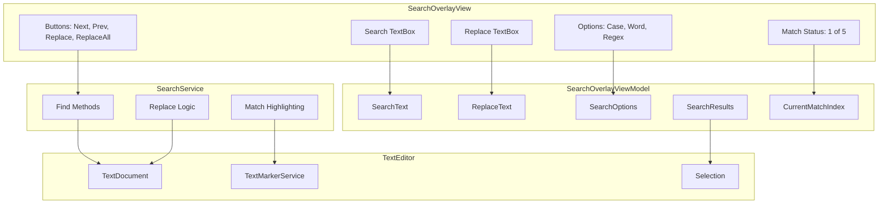
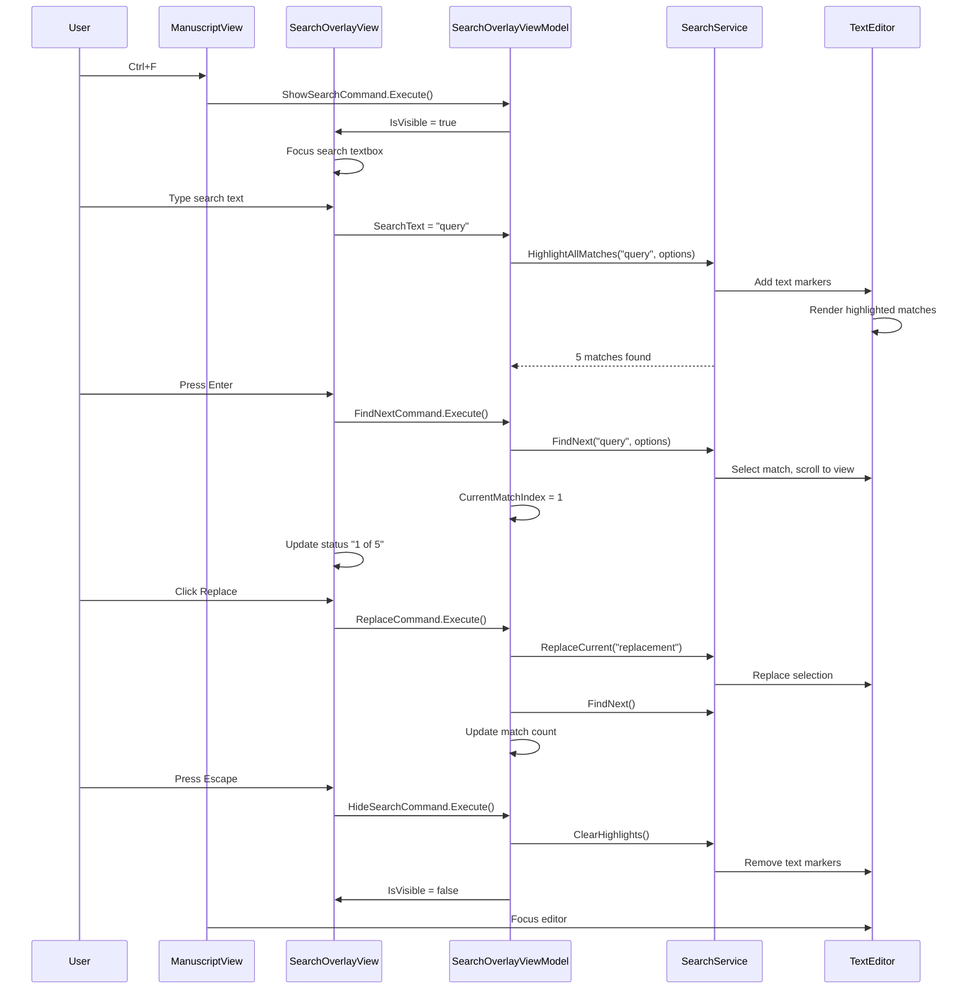

# LCS-INF-013c: Search & Replace Overlay

## 1. Metadata & Categorization

| Field                | Value                                | Description                                      |
| :------------------- | :----------------------------------- | :----------------------------------------------- |
| **Feature ID**       | `INF-013c`                           | Sub-part C of Editor Module                      |
| **Feature Name**     | Search & Replace Overlay             | Inline search UI with AvalonEdit integration     |
| **Target Version**   | `v0.1.3c`                            | Third sub-part of v0.1.3                         |
| **Module Scope**     | `Lexichord.Modules.Editor`           | Standalone editor module                         |
| **Swimlane**         | `Product`                            | Core User-Facing Feature                         |
| **License Tier**     | `Core`                               | Foundation (Available in Free tier)              |
| **Author**           | System Architect                     |                                                  |
| **Status**           | **Draft**                            | Pending implementation                           |
| **Last Updated**     | 2026-01-26                           |                                                  |

---

## 2. Executive Summary

### 2.1 The Requirement

Users need to search and replace text within documents. The experience should be:

- **Inline:** Search UI overlays the editor (not a popup window).
- **Keyboard-driven:** Ctrl+F to open, Enter/F3 to find next, Escape to close.
- **Visual feedback:** All matches highlighted in the document.
- **Replace support:** Single replace and Replace All functionality.
- **Options:** Case sensitivity, whole word, regex mode.

### 2.2 The Proposed Solution

We **SHALL** implement a custom search overlay with:

1. **SearchOverlayView** — Inline panel that slides in from the top-right.
2. **SearchService** — Uses AvalonEdit's search APIs for finding matches.
3. **Match highlighting** — Highlights all matches in the document background.
4. **Keyboard shortcuts** — Standard shortcuts (Ctrl+F, F3, Ctrl+H, Escape).

---

## 3. Architecture

### 3.1 Component Structure



### 3.2 Search Interaction Flow



---

## 4. Decision Tree: Search Operations

```text
START: "User initiates search action"
│
├── Ctrl+F pressed
│   ├── Search overlay not visible → Show overlay, focus search box
│   └── Search overlay visible → Select all text in search box
│
├── User types in search box
│   ├── Text length >= 1 → Highlight all matches
│   └── Text empty → Clear highlights
│
├── Enter or F3 pressed (Find Next)
│   ├── Matches exist?
│   │   ├── YES → Select next match, scroll into view
│   │   │   ├── At last match → Wrap to first match
│   │   │   └── Not at last → Select next
│   │   └── NO → Show "No results" indicator
│   └── Continue
│
├── Shift+F3 pressed (Find Previous)
│   ├── Matches exist?
│   │   ├── YES → Select previous match, scroll into view
│   │   │   ├── At first match → Wrap to last match
│   │   │   └── Not at first → Select previous
│   │   └── NO → Show "No results" indicator
│   └── Continue
│
├── Replace clicked
│   ├── Current selection matches search?
│   │   ├── YES → Replace selection, find next
│   │   └── NO → Find next (don't replace)
│   └── Update match count
│
├── Replace All clicked
│   ├── Matches exist?
│   │   ├── YES → Replace all, show count "5 replacements"
│   │   └── NO → Show "No matches to replace"
│   └── Clear highlights, mark document dirty
│
├── Escape pressed
│   └── Hide overlay, clear highlights, focus editor
│
└── END
```

---

## 5. Data Contracts

### 5.1 ISearchService Interface

```csharp
namespace Lexichord.Abstractions.Contracts;

/// <summary>
/// Service for searching and replacing text in documents.
/// </summary>
/// <remarks>
/// LOGIC: ISearchService provides search functionality using AvalonEdit's
/// built-in search infrastructure. It supports:
///
/// - Text search with options (case, whole word, regex)
/// - Match highlighting in document
/// - Find next/previous navigation
/// - Replace and Replace All operations
///
/// The service is scoped to a single document/editor instance.
/// </remarks>
public interface ISearchService
{
    /// <summary>
    /// Shows the search overlay.
    /// </summary>
    void ShowSearch();

    /// <summary>
    /// Hides the search overlay.
    /// </summary>
    void HideSearch();

    /// <summary>
    /// Gets whether the search overlay is currently visible.
    /// </summary>
    bool IsSearchVisible { get; }

    /// <summary>
    /// Finds the next match from the current caret position.
    /// </summary>
    /// <param name="searchText">Text to search for.</param>
    /// <param name="options">Search options.</param>
    /// <returns>The search result, or null if no match found.</returns>
    SearchResult? FindNext(string searchText, SearchOptions options);

    /// <summary>
    /// Finds the previous match from the current caret position.
    /// </summary>
    /// <param name="searchText">Text to search for.</param>
    /// <param name="options">Search options.</param>
    /// <returns>The search result, or null if no match found.</returns>
    SearchResult? FindPrevious(string searchText, SearchOptions options);

    /// <summary>
    /// Finds all matches in the document.
    /// </summary>
    /// <param name="searchText">Text to search for.</param>
    /// <param name="options">Search options.</param>
    /// <returns>All matches found.</returns>
    IReadOnlyList<SearchResult> FindAll(string searchText, SearchOptions options);

    /// <summary>
    /// Replaces the current selection if it matches the search text.
    /// </summary>
    /// <param name="searchText">The search text to match.</param>
    /// <param name="replaceText">The replacement text.</param>
    /// <param name="options">Search options.</param>
    /// <returns>True if replacement was made.</returns>
    bool ReplaceCurrent(string searchText, string replaceText, SearchOptions options);

    /// <summary>
    /// Replaces all matches in the document.
    /// </summary>
    /// <param name="searchText">Text to search for.</param>
    /// <param name="replaceText">The replacement text.</param>
    /// <param name="options">Search options.</param>
    /// <returns>Number of replacements made.</returns>
    int ReplaceAll(string searchText, string replaceText, SearchOptions options);

    /// <summary>
    /// Highlights all matches in the document.
    /// </summary>
    /// <param name="searchText">Text to search for.</param>
    /// <param name="options">Search options.</param>
    /// <returns>Number of matches highlighted.</returns>
    int HighlightAllMatches(string searchText, SearchOptions options);

    /// <summary>
    /// Clears all search highlights from the document.
    /// </summary>
    void ClearHighlights();

    /// <summary>
    /// Gets the current match index (1-based).
    /// </summary>
    int CurrentMatchIndex { get; }

    /// <summary>
    /// Gets the total match count.
    /// </summary>
    int TotalMatchCount { get; }

    /// <summary>
    /// Event raised when search results change.
    /// </summary>
    event EventHandler<SearchResultsChangedEventArgs> ResultsChanged;
}

/// <summary>
/// Options for search operations.
/// </summary>
/// <param name="MatchCase">Whether to match case exactly.</param>
/// <param name="WholeWord">Whether to match whole words only.</param>
/// <param name="UseRegex">Whether to interpret search text as regex.</param>
public record SearchOptions(
    bool MatchCase = false,
    bool WholeWord = false,
    bool UseRegex = false
)
{
    /// <summary>
    /// Default search options (case-insensitive, partial match, no regex).
    /// </summary>
    public static SearchOptions Default { get; } = new();
}

/// <summary>
/// Represents a single search match.
/// </summary>
/// <param name="StartOffset">Start position in document.</param>
/// <param name="Length">Length of matched text.</param>
/// <param name="MatchedText">The matched text content.</param>
/// <param name="Line">Line number (1-based).</param>
/// <param name="Column">Column number (1-based).</param>
public record SearchResult(
    int StartOffset,
    int Length,
    string MatchedText,
    int Line,
    int Column
);

/// <summary>
/// Event arguments for search results changes.
/// </summary>
public class SearchResultsChangedEventArgs : EventArgs
{
    /// <summary>
    /// Total number of matches.
    /// </summary>
    public required int TotalMatches { get; init; }

    /// <summary>
    /// Current match index (1-based), or 0 if no current match.
    /// </summary>
    public required int CurrentIndex { get; init; }

    /// <summary>
    /// The current search text.
    /// </summary>
    public string? SearchText { get; init; }
}
```

### 5.2 SearchOverlayView.axaml

```xml
<UserControl xmlns="https://github.com/avaloniaui"
             xmlns:x="http://schemas.microsoft.com/winfx/2006/xaml"
             xmlns:vm="using:Lexichord.Modules.Editor.ViewModels"
             x:Class="Lexichord.Modules.Editor.Views.SearchOverlayView"
             x:DataType="vm:SearchOverlayViewModel"
             MinWidth="350"
             MaxWidth="450">

    <UserControl.Styles>
        <!-- LOGIC: Subtle shadow and border for overlay appearance -->
        <Style Selector="Border.overlay">
            <Setter Property="Background" Value="{DynamicResource SystemControlBackgroundChromeMediumBrush}" />
            <Setter Property="BorderBrush" Value="{DynamicResource SystemControlForegroundBaseMediumLowBrush}" />
            <Setter Property="BorderThickness" Value="1" />
            <Setter Property="CornerRadius" Value="4" />
            <Setter Property="Padding" Value="12" />
            <Setter Property="BoxShadow" Value="0 2 8 0 #40000000" />
        </Style>

        <Style Selector="TextBox.search">
            <Setter Property="Padding" Value="8,6" />
            <Setter Property="FontSize" Value="13" />
        </Style>

        <Style Selector="Button.icon">
            <Setter Property="Padding" Value="6" />
            <Setter Property="MinWidth" Value="28" />
            <Setter Property="MinHeight" Value="28" />
        </Style>
    </UserControl.Styles>

    <Border Classes="overlay">
        <StackPanel Spacing="8">

            <!-- Search Row -->
            <Grid ColumnDefinitions="*, Auto">
                <TextBox x:Name="SearchTextBox"
                         Classes="search"
                         Text="{Binding SearchText}"
                         Watermark="Find..."
                         Grid.Column="0">
                    <TextBox.KeyBindings>
                        <KeyBinding Gesture="Enter" Command="{Binding FindNextCommand}" />
                        <KeyBinding Gesture="Escape" Command="{Binding HideCommand}" />
                    </TextBox.KeyBindings>
                </TextBox>

                <StackPanel Orientation="Horizontal" Grid.Column="1" Margin="8,0,0,0" Spacing="2">
                    <!-- Match Status -->
                    <TextBlock Text="{Binding MatchStatus}"
                               VerticalAlignment="Center"
                               Margin="0,0,8,0"
                               FontSize="12"
                               Foreground="{DynamicResource SystemControlForegroundBaseMediumBrush}" />

                    <!-- Previous -->
                    <Button Classes="icon"
                            Command="{Binding FindPreviousCommand}"
                            ToolTip.Tip="Previous (Shift+F3)">
                        <PathIcon Data="{StaticResource ChevronUpRegular}" Width="12" Height="12" />
                    </Button>

                    <!-- Next -->
                    <Button Classes="icon"
                            Command="{Binding FindNextCommand}"
                            ToolTip.Tip="Next (F3)">
                        <PathIcon Data="{StaticResource ChevronDownRegular}" Width="12" Height="12" />
                    </Button>

                    <!-- Toggle Replace -->
                    <Button Classes="icon"
                            Command="{Binding ToggleReplaceCommand}"
                            ToolTip.Tip="Toggle Replace (Ctrl+H)">
                        <PathIcon Data="{StaticResource ArrowSwapRegular}" Width="12" Height="12" />
                    </Button>

                    <!-- Close -->
                    <Button Classes="icon"
                            Command="{Binding HideCommand}"
                            ToolTip.Tip="Close (Escape)">
                        <PathIcon Data="{StaticResource DismissRegular}" Width="12" Height="12" />
                    </Button>
                </StackPanel>
            </Grid>

            <!-- Replace Row (Collapsible) -->
            <Grid ColumnDefinitions="*, Auto"
                  IsVisible="{Binding IsReplaceVisible}">
                <TextBox Classes="search"
                         Text="{Binding ReplaceText}"
                         Watermark="Replace..."
                         Grid.Column="0">
                    <TextBox.KeyBindings>
                        <KeyBinding Gesture="Enter" Command="{Binding ReplaceNextCommand}" />
                        <KeyBinding Gesture="Escape" Command="{Binding HideCommand}" />
                    </TextBox.KeyBindings>
                </TextBox>

                <StackPanel Orientation="Horizontal" Grid.Column="1" Margin="8,0,0,0" Spacing="2">
                    <!-- Replace -->
                    <Button Content="Replace"
                            Command="{Binding ReplaceNextCommand}"
                            ToolTip.Tip="Replace current match"
                            Padding="8,4" />

                    <!-- Replace All -->
                    <Button Content="All"
                            Command="{Binding ReplaceAllCommand}"
                            ToolTip.Tip="Replace all matches"
                            Padding="8,4" />
                </StackPanel>
            </Grid>

            <!-- Options Row -->
            <StackPanel Orientation="Horizontal" Spacing="12">
                <CheckBox Content="Aa"
                          IsChecked="{Binding MatchCase}"
                          ToolTip.Tip="Match Case"
                          FontSize="12" />

                <CheckBox Content="W"
                          IsChecked="{Binding WholeWord}"
                          ToolTip.Tip="Whole Word"
                          FontSize="12" />

                <CheckBox Content=".*"
                          IsChecked="{Binding UseRegex}"
                          ToolTip.Tip="Use Regular Expression"
                          FontSize="12" />
            </StackPanel>

        </StackPanel>
    </Border>
</UserControl>
```

### 5.3 SearchOverlayViewModel

```csharp
using System.Text.RegularExpressions;
using CommunityToolkit.Mvvm.ComponentModel;
using CommunityToolkit.Mvvm.Input;
using Lexichord.Abstractions.Contracts;
using Lexichord.Abstractions.Events;
using MediatR;
using Microsoft.Extensions.Logging;

namespace Lexichord.Modules.Editor.ViewModels;

/// <summary>
/// ViewModel for the search and replace overlay.
/// </summary>
/// <remarks>
/// LOGIC: SearchOverlayViewModel manages the search UI state and coordinates
/// with ISearchService for actual search operations. It supports:
///
/// - Live search as user types (debounced)
/// - Find next/previous navigation
/// - Replace and Replace All
/// - Search options (case, whole word, regex)
///
/// The ViewModel is scoped to a single ManuscriptViewModel instance.
/// </remarks>
public partial class SearchOverlayViewModel : ObservableObject
{
    private readonly ISearchService _searchService;
    private readonly IMediator _mediator;
    private readonly ILogger<SearchOverlayViewModel> _logger;

    private CancellationTokenSource? _debounceTokenSource;
    private const int DebounceDelayMs = 150;

    public SearchOverlayViewModel(
        ISearchService searchService,
        IMediator mediator,
        ILogger<SearchOverlayViewModel> logger)
    {
        _searchService = searchService;
        _mediator = mediator;
        _logger = logger;

        // LOGIC: Subscribe to search results changes
        _searchService.ResultsChanged += OnSearchResultsChanged;
    }

    #region Search Properties

    [ObservableProperty]
    [NotifyCanExecuteChangedFor(nameof(FindNextCommand))]
    [NotifyCanExecuteChangedFor(nameof(FindPreviousCommand))]
    [NotifyCanExecuteChangedFor(nameof(ReplaceNextCommand))]
    [NotifyCanExecuteChangedFor(nameof(ReplaceAllCommand))]
    private string _searchText = string.Empty;

    [ObservableProperty]
    private string _replaceText = string.Empty;

    [ObservableProperty]
    [NotifyPropertyChangedFor(nameof(SearchOptions))]
    private bool _matchCase;

    [ObservableProperty]
    [NotifyPropertyChangedFor(nameof(SearchOptions))]
    private bool _wholeWord;

    [ObservableProperty]
    [NotifyPropertyChangedFor(nameof(SearchOptions))]
    private bool _useRegex;

    [ObservableProperty]
    private bool _isReplaceVisible;

    [ObservableProperty]
    private string _matchStatus = string.Empty;

    [ObservableProperty]
    private bool _hasNoResults;

    /// <summary>
    /// Gets the current search options.
    /// </summary>
    public SearchOptions SearchOptions => new(MatchCase, WholeWord, UseRegex);

    #endregion

    #region Commands

    /// <summary>
    /// Command to find the next match.
    /// </summary>
    [RelayCommand(CanExecute = nameof(CanSearch))]
    private void FindNext()
    {
        _logger.LogDebug("Find next: {SearchText}", SearchText);

        var result = _searchService.FindNext(SearchText, SearchOptions);
        HasNoResults = result is null;

        if (result is null)
        {
            _logger.LogDebug("No matches found");
        }
    }

    /// <summary>
    /// Command to find the previous match.
    /// </summary>
    [RelayCommand(CanExecute = nameof(CanSearch))]
    private void FindPrevious()
    {
        _logger.LogDebug("Find previous: {SearchText}", SearchText);

        var result = _searchService.FindPrevious(SearchText, SearchOptions);
        HasNoResults = result is null;
    }

    /// <summary>
    /// Command to replace the current match and find next.
    /// </summary>
    [RelayCommand(CanExecute = nameof(CanSearch))]
    private void ReplaceNext()
    {
        _logger.LogDebug("Replace: {SearchText} -> {ReplaceText}", SearchText, ReplaceText);

        var replaced = _searchService.ReplaceCurrent(SearchText, ReplaceText, SearchOptions);
        if (replaced)
        {
            // Find next match after replacement
            _searchService.FindNext(SearchText, SearchOptions);
        }
    }

    /// <summary>
    /// Command to replace all matches.
    /// </summary>
    [RelayCommand(CanExecute = nameof(CanSearch))]
    private async Task ReplaceAllAsync()
    {
        _logger.LogDebug("Replace all: {SearchText} -> {ReplaceText}", SearchText, ReplaceText);

        var count = _searchService.ReplaceAll(SearchText, ReplaceText, SearchOptions);

        _logger.LogInformation("Replaced {Count} matches", count);

        // LOGIC: Publish event for analytics/logging
        await _mediator.Publish(new SearchExecutedEvent(
            DocumentId: string.Empty, // Will be set by handler
            SearchText: SearchText,
            MatchCount: count,
            Options: SearchOptions
        ));
    }

    /// <summary>
    /// Command to toggle replace panel visibility.
    /// </summary>
    [RelayCommand]
    private void ToggleReplace()
    {
        IsReplaceVisible = !IsReplaceVisible;
    }

    /// <summary>
    /// Command to hide the search overlay.
    /// </summary>
    [RelayCommand]
    private void Hide()
    {
        _logger.LogDebug("Hiding search overlay");
        _searchService.ClearHighlights();
        _searchService.HideSearch();
    }

    private bool CanSearch() => !string.IsNullOrEmpty(SearchText);

    #endregion

    #region Search Text Change Handling

    partial void OnSearchTextChanged(string value)
    {
        // LOGIC: Debounce search to avoid excessive updates while typing
        _debounceTokenSource?.Cancel();
        _debounceTokenSource = new CancellationTokenSource();

        _ = DebounceSearchAsync(value, _debounceTokenSource.Token);
    }

    private async Task DebounceSearchAsync(string searchText, CancellationToken cancellationToken)
    {
        try
        {
            await Task.Delay(DebounceDelayMs, cancellationToken);

            if (string.IsNullOrEmpty(searchText))
            {
                _searchService.ClearHighlights();
                MatchStatus = string.Empty;
                HasNoResults = false;
            }
            else
            {
                var count = _searchService.HighlightAllMatches(searchText, SearchOptions);
                HasNoResults = count == 0;
            }
        }
        catch (OperationCanceledException)
        {
            // Debounce cancelled, ignore
        }
    }

    partial void OnMatchCaseChanged(bool value) => RefreshSearch();
    partial void OnWholeWordChanged(bool value) => RefreshSearch();
    partial void OnUseRegexChanged(bool value) => RefreshSearch();

    private void RefreshSearch()
    {
        if (!string.IsNullOrEmpty(SearchText))
        {
            var count = _searchService.HighlightAllMatches(SearchText, SearchOptions);
            HasNoResults = count == 0;
        }
    }

    #endregion

    #region Event Handlers

    private void OnSearchResultsChanged(object? sender, SearchResultsChangedEventArgs e)
    {
        // LOGIC: Update match status display
        if (e.TotalMatches == 0)
        {
            MatchStatus = "No results";
        }
        else if (e.CurrentIndex == 0)
        {
            MatchStatus = $"{e.TotalMatches} matches";
        }
        else
        {
            MatchStatus = $"{e.CurrentIndex} of {e.TotalMatches}";
        }
    }

    #endregion

    /// <summary>
    /// Focuses the search text box.
    /// </summary>
    public void FocusSearchBox()
    {
        // LOGIC: View calls this when overlay becomes visible
        // Handled via attached behavior or code-behind
    }
}
```

### 5.4 SearchService Implementation

```csharp
using System.Text.RegularExpressions;
using AvaloniaEdit;
using AvaloniaEdit.Document;
using AvaloniaEdit.Rendering;
using Lexichord.Abstractions.Contracts;
using Microsoft.Extensions.Logging;

namespace Lexichord.Modules.Editor.Services;

/// <summary>
/// Service for searching and replacing text in the editor.
/// </summary>
/// <remarks>
/// LOGIC: SearchService wraps AvalonEdit's search functionality and provides:
///
/// - Pattern matching with options (case, whole word, regex)
/// - Text marker-based highlighting for all matches
/// - Navigation between matches
/// - Replace operations with undo support
///
/// The service maintains state for the current search session.
/// </remarks>
public sealed class SearchService : ISearchService
{
    private readonly ILogger<SearchService> _logger;
    private TextEditor? _editor;
    private TextDocument? _document;
    private ITextMarkerService? _markerService;

    private List<SearchResult> _matches = [];
    private int _currentMatchIndex;
    private string _lastSearchText = string.Empty;
    private SearchOptions _lastOptions = SearchOptions.Default;

    public SearchService(ILogger<SearchService> logger)
    {
        _logger = logger;
    }

    /// <summary>
    /// Attaches the service to an editor instance.
    /// </summary>
    /// <param name="editor">The TextEditor control.</param>
    public void AttachToEditor(TextEditor editor)
    {
        _editor = editor;
        _document = editor.Document;

        // LOGIC: Get or create text marker service for highlighting
        _markerService = editor.TextArea.TextView.Services.GetService(typeof(ITextMarkerService))
            as ITextMarkerService;

        if (_markerService is null)
        {
            _markerService = new TextMarkerService(_document);
            editor.TextArea.TextView.BackgroundRenderers.Add(_markerService);
            editor.TextArea.TextView.Services.AddService(typeof(ITextMarkerService), _markerService);
        }

        _logger.LogDebug("SearchService attached to editor");
    }

    /// <inheritdoc/>
    public bool IsSearchVisible { get; private set; }

    /// <inheritdoc/>
    public int CurrentMatchIndex => _currentMatchIndex;

    /// <inheritdoc/>
    public int TotalMatchCount => _matches.Count;

    /// <inheritdoc/>
    public event EventHandler<SearchResultsChangedEventArgs>? ResultsChanged;

    /// <inheritdoc/>
    public void ShowSearch()
    {
        IsSearchVisible = true;
    }

    /// <inheritdoc/>
    public void HideSearch()
    {
        IsSearchVisible = false;
        ClearHighlights();
    }

    /// <inheritdoc/>
    public SearchResult? FindNext(string searchText, SearchOptions options)
    {
        EnsureMatchesUpdated(searchText, options);

        if (_matches.Count == 0)
            return null;

        // LOGIC: Find next match after current caret position
        var caretOffset = _editor?.CaretOffset ?? 0;

        var nextIndex = _matches.FindIndex(m => m.StartOffset > caretOffset);
        if (nextIndex == -1)
        {
            // Wrap to first match
            nextIndex = 0;
        }

        _currentMatchIndex = nextIndex + 1; // 1-based
        var match = _matches[nextIndex];

        SelectMatch(match);
        RaiseResultsChanged();

        return match;
    }

    /// <inheritdoc/>
    public SearchResult? FindPrevious(string searchText, SearchOptions options)
    {
        EnsureMatchesUpdated(searchText, options);

        if (_matches.Count == 0)
            return null;

        // LOGIC: Find previous match before current caret position
        var caretOffset = _editor?.CaretOffset ?? 0;

        var prevIndex = _matches.FindLastIndex(m => m.StartOffset < caretOffset);
        if (prevIndex == -1)
        {
            // Wrap to last match
            prevIndex = _matches.Count - 1;
        }

        _currentMatchIndex = prevIndex + 1; // 1-based
        var match = _matches[prevIndex];

        SelectMatch(match);
        RaiseResultsChanged();

        return match;
    }

    /// <inheritdoc/>
    public IReadOnlyList<SearchResult> FindAll(string searchText, SearchOptions options)
    {
        _matches = FindMatches(searchText, options).ToList();
        _lastSearchText = searchText;
        _lastOptions = options;
        _currentMatchIndex = 0;

        RaiseResultsChanged();
        return _matches;
    }

    /// <inheritdoc/>
    public bool ReplaceCurrent(string searchText, string replaceText, SearchOptions options)
    {
        if (_editor is null || _document is null)
            return false;

        EnsureMatchesUpdated(searchText, options);

        // LOGIC: Check if current selection matches the search
        var selection = _editor.SelectedText;
        if (!IsMatch(selection, searchText, options))
        {
            _logger.LogDebug("Current selection does not match search text");
            return false;
        }

        // LOGIC: Replace selection
        var offset = _editor.SelectionStart;
        _document.Replace(offset, selection.Length, replaceText);

        _logger.LogDebug("Replaced '{Old}' with '{New}' at offset {Offset}",
            selection, replaceText, offset);

        // LOGIC: Update matches (some may be invalidated)
        RefreshMatches(searchText, options);

        return true;
    }

    /// <inheritdoc/>
    public int ReplaceAll(string searchText, string replaceText, SearchOptions options)
    {
        if (_document is null)
            return 0;

        var matches = FindMatches(searchText, options).ToList();
        if (matches.Count == 0)
            return 0;

        // LOGIC: Replace from end to start to preserve offsets
        _document.BeginUpdate();
        try
        {
            for (var i = matches.Count - 1; i >= 0; i--)
            {
                var match = matches[i];
                _document.Replace(match.StartOffset, match.Length, replaceText);
            }
        }
        finally
        {
            _document.EndUpdate();
        }

        _logger.LogInformation("Replaced {Count} occurrences of '{Search}' with '{Replace}'",
            matches.Count, searchText, replaceText);

        // Clear matches after replace all
        _matches.Clear();
        _currentMatchIndex = 0;
        ClearHighlights();
        RaiseResultsChanged();

        return matches.Count;
    }

    /// <inheritdoc/>
    public int HighlightAllMatches(string searchText, SearchOptions options)
    {
        ClearHighlights();

        if (string.IsNullOrEmpty(searchText) || _markerService is null)
            return 0;

        _matches = FindMatches(searchText, options).ToList();
        _lastSearchText = searchText;
        _lastOptions = options;
        _currentMatchIndex = 0;

        // LOGIC: Create text markers for each match
        foreach (var match in _matches)
        {
            var marker = _markerService.Create(match.StartOffset, match.Length);
            marker.MarkerTypes = TextMarkerTypes.SquigglyUnderline;
            marker.BackgroundColor = GetHighlightColor();
        }

        RaiseResultsChanged();

        _logger.LogDebug("Highlighted {Count} matches for '{Search}'", _matches.Count, searchText);

        return _matches.Count;
    }

    /// <inheritdoc/>
    public void ClearHighlights()
    {
        _markerService?.RemoveAll(_ => true);
        _matches.Clear();
        _currentMatchIndex = 0;
    }

    #region Private Methods

    private void EnsureMatchesUpdated(string searchText, SearchOptions options)
    {
        if (_lastSearchText != searchText || !_lastOptions.Equals(options))
        {
            FindAll(searchText, options);
        }
    }

    private void RefreshMatches(string searchText, SearchOptions options)
    {
        _matches = FindMatches(searchText, options).ToList();
        _lastSearchText = searchText;
        _lastOptions = options;

        // Re-highlight
        ClearHighlights();
        if (_markerService is not null)
        {
            foreach (var match in _matches)
            {
                var marker = _markerService.Create(match.StartOffset, match.Length);
                marker.BackgroundColor = GetHighlightColor();
            }
        }

        RaiseResultsChanged();
    }

    private IEnumerable<SearchResult> FindMatches(string searchText, SearchOptions options)
    {
        if (_document is null || string.IsNullOrEmpty(searchText))
            yield break;

        var text = _document.Text;
        Regex regex;

        try
        {
            regex = BuildSearchRegex(searchText, options);
        }
        catch (RegexParseException ex)
        {
            _logger.LogWarning(ex, "Invalid regex pattern: {Pattern}", searchText);
            yield break;
        }

        var matches = regex.Matches(text);
        foreach (Match match in matches)
        {
            var location = _document.GetLocation(match.Index);
            yield return new SearchResult(
                StartOffset: match.Index,
                Length: match.Length,
                MatchedText: match.Value,
                Line: location.Line,
                Column: location.Column
            );
        }
    }

    private static Regex BuildSearchRegex(string searchText, SearchOptions options)
    {
        var pattern = options.UseRegex
            ? searchText
            : Regex.Escape(searchText);

        if (options.WholeWord)
        {
            pattern = $@"\b{pattern}\b";
        }

        var regexOptions = RegexOptions.Compiled;
        if (!options.MatchCase)
        {
            regexOptions |= RegexOptions.IgnoreCase;
        }

        // LOGIC: Set timeout to prevent ReDoS
        return new Regex(pattern, regexOptions, TimeSpan.FromSeconds(1));
    }

    private bool IsMatch(string text, string searchText, SearchOptions options)
    {
        if (string.IsNullOrEmpty(text))
            return false;

        try
        {
            var regex = BuildSearchRegex(searchText, options);
            return regex.IsMatch(text) && regex.Match(text).Value == text;
        }
        catch (RegexParseException)
        {
            return false;
        }
    }

    private void SelectMatch(SearchResult match)
    {
        if (_editor is null)
            return;

        _editor.Select(match.StartOffset, match.Length);
        _editor.ScrollTo(match.Line, match.Column);
    }

    private void RaiseResultsChanged()
    {
        ResultsChanged?.Invoke(this, new SearchResultsChangedEventArgs
        {
            TotalMatches = _matches.Count,
            CurrentIndex = _currentMatchIndex,
            SearchText = _lastSearchText
        });
    }

    private static Avalonia.Media.Color GetHighlightColor()
    {
        // LOGIC: Use a semi-transparent yellow for match highlighting
        return Avalonia.Media.Color.FromArgb(80, 255, 255, 0);
    }

    #endregion
}

/// <summary>
/// Service for managing text markers in the editor.
/// </summary>
internal interface ITextMarkerService
{
    ITextMarker Create(int startOffset, int length);
    void Remove(ITextMarker marker);
    void RemoveAll(Predicate<ITextMarker> predicate);
}

/// <summary>
/// Represents a text marker for highlighting.
/// </summary>
internal interface ITextMarker
{
    int StartOffset { get; }
    int Length { get; }
    TextMarkerTypes MarkerTypes { get; set; }
    Avalonia.Media.Color? BackgroundColor { get; set; }
}

[Flags]
internal enum TextMarkerTypes
{
    None = 0,
    SquigglyUnderline = 1,
    Background = 2
}
```

---

## 6. Keyboard Shortcuts

| Shortcut | Action | Context |
|:---------|:-------|:--------|
| `Ctrl+F` | Open search overlay | Editor focused |
| `Ctrl+H` | Open search with replace visible | Editor focused |
| `F3` | Find next match | Search overlay visible |
| `Shift+F3` | Find previous match | Search overlay visible |
| `Enter` | Find next (in search box) | Search textbox focused |
| `Enter` | Replace and find next (in replace box) | Replace textbox focused |
| `Ctrl+Enter` | Replace all | Replace textbox focused |
| `Escape` | Close search overlay | Search overlay visible |
| `Alt+C` | Toggle Match Case | Search overlay visible |
| `Alt+W` | Toggle Whole Word | Search overlay visible |
| `Alt+R` | Toggle Regex | Search overlay visible |

---

## 7. Use Cases

### UC-01: Basic Text Search

**Preconditions:**
- Document is open with content.
- User wants to find specific text.

**Flow:**
1. User presses Ctrl+F.
2. Search overlay slides in from top-right.
3. Search textbox receives focus.
4. User types "TODO".
5. All "TODO" instances are highlighted in document.
6. Match status shows "5 matches".
7. User presses Enter.
8. First match is selected and scrolled into view.
9. Status shows "1 of 5".
10. User presses F3 to navigate through matches.
11. At last match, F3 wraps to first.
12. User presses Escape.
13. Overlay hides, highlights clear, editor focuses.

**Postconditions:**
- Search completed without document modification.
- Caret at last selected match position.

---

### UC-02: Replace All

**Preconditions:**
- Document contains multiple instances of "oldValue".
- User wants to replace all with "newValue".

**Flow:**
1. User presses Ctrl+H (or Ctrl+F then clicks replace toggle).
2. Search overlay shows with replace row visible.
3. User types "oldValue" in search box.
4. User types "newValue" in replace box.
5. User clicks "All" button.
6. All instances are replaced.
7. Status shows "5 replacements".
8. Document is marked dirty.
9. Single undo operation can revert all replacements.

**Postconditions:**
- All instances replaced.
- Document modified and dirty.
- Undo available.

---

## 8. Observability & Logging

| Level | Context | Message Template |
|:------|:--------|:-----------------|
| Debug | SearchService | `SearchService attached to editor` |
| Debug | SearchService | `Highlighted {Count} matches for '{Search}'` |
| Debug | SearchService | `Replaced '{Old}' with '{New}' at offset {Offset}` |
| Information | SearchService | `Replaced {Count} occurrences of '{Search}' with '{Replace}'` |
| Warning | SearchService | `Invalid regex pattern: {Pattern}` |
| Debug | SearchOverlayViewModel | `Find next: {SearchText}` |
| Debug | SearchOverlayViewModel | `Find previous: {SearchText}` |
| Debug | SearchOverlayViewModel | `Replace: {SearchText} -> {ReplaceText}` |
| Debug | SearchOverlayViewModel | `Replace all: {SearchText} -> {ReplaceText}` |
| Debug | SearchOverlayViewModel | `Hiding search overlay` |
| Debug | SearchOverlayViewModel | `No matches found` |

---

## 9. Unit Testing Requirements

### 9.1 SearchService Tests

```csharp
[TestFixture]
[Category("Unit")]
public class SearchServiceTests
{
    private Mock<ILogger<SearchService>> _mockLogger = null!;
    private SearchService _sut = null!;

    [SetUp]
    public void SetUp()
    {
        _mockLogger = new Mock<ILogger<SearchService>>();
        _sut = new SearchService(_mockLogger.Object);
    }

    [Test]
    public void FindAll_SimpleText_ReturnsAllMatches()
    {
        // Arrange
        var document = new TextDocument("hello world hello universe hello");
        // Attach to mock editor...

        // Act
        var results = _sut.FindAll("hello", SearchOptions.Default);

        // Assert
        Assert.That(results, Has.Count.EqualTo(3));
    }

    [Test]
    public void FindAll_CaseSensitive_RespectsCase()
    {
        // Arrange
        var document = new TextDocument("Hello hello HELLO");
        // Attach to mock editor...

        // Act
        var results = _sut.FindAll("hello", new SearchOptions(MatchCase: true));

        // Assert
        Assert.That(results, Has.Count.EqualTo(1));
        Assert.That(results[0].MatchedText, Is.EqualTo("hello"));
    }

    [Test]
    public void FindAll_WholeWord_MatchesOnlyWholeWords()
    {
        // Arrange
        var document = new TextDocument("test testing tested test");
        // Attach to mock editor...

        // Act
        var results = _sut.FindAll("test", new SearchOptions(WholeWord: true));

        // Assert
        Assert.That(results, Has.Count.EqualTo(2));
    }

    [Test]
    public void FindAll_Regex_SupportsPatterns()
    {
        // Arrange
        var document = new TextDocument("cat bat rat mat");
        // Attach to mock editor...

        // Act
        var results = _sut.FindAll("[cbr]at", new SearchOptions(UseRegex: true));

        // Assert
        Assert.That(results, Has.Count.EqualTo(3));
    }

    [Test]
    public void FindAll_InvalidRegex_ReturnsEmpty()
    {
        // Arrange
        var document = new TextDocument("test content");
        // Attach to mock editor...

        // Act
        var results = _sut.FindAll("[invalid(", new SearchOptions(UseRegex: true));

        // Assert
        Assert.That(results, Is.Empty);
    }

    [Test]
    public void ReplaceAll_ReplacesAllOccurrences()
    {
        // Arrange
        var document = new TextDocument("a a a");
        // Attach to mock editor...

        // Act
        var count = _sut.ReplaceAll("a", "b", SearchOptions.Default);

        // Assert
        Assert.That(count, Is.EqualTo(3));
        Assert.That(document.Text, Is.EqualTo("b b b"));
    }

    [Test]
    public void ReplaceAll_PreservesOtherText()
    {
        // Arrange
        var document = new TextDocument("hello world hello");
        // Attach to mock editor...

        // Act
        _sut.ReplaceAll("hello", "hi", SearchOptions.Default);

        // Assert
        Assert.That(document.Text, Is.EqualTo("hi world hi"));
    }

    [Test]
    public void HighlightAllMatches_ReturnsCorrectCount()
    {
        // Arrange
        var document = new TextDocument("test test test");
        // Attach to mock editor...

        // Act
        var count = _sut.HighlightAllMatches("test", SearchOptions.Default);

        // Assert
        Assert.That(count, Is.EqualTo(3));
        Assert.That(_sut.TotalMatchCount, Is.EqualTo(3));
    }

    [Test]
    public void ClearHighlights_ResetsMatchCount()
    {
        // Arrange
        _sut.HighlightAllMatches("test", SearchOptions.Default);

        // Act
        _sut.ClearHighlights();

        // Assert
        Assert.That(_sut.TotalMatchCount, Is.EqualTo(0));
    }
}
```

### 9.2 SearchOverlayViewModel Tests

```csharp
[TestFixture]
[Category("Unit")]
public class SearchOverlayViewModelTests
{
    private Mock<ISearchService> _mockSearchService = null!;
    private Mock<IMediator> _mockMediator = null!;
    private Mock<ILogger<SearchOverlayViewModel>> _mockLogger = null!;
    private SearchOverlayViewModel _sut = null!;

    [SetUp]
    public void SetUp()
    {
        _mockSearchService = new Mock<ISearchService>();
        _mockMediator = new Mock<IMediator>();
        _mockLogger = new Mock<ILogger<SearchOverlayViewModel>>();

        _sut = new SearchOverlayViewModel(
            _mockSearchService.Object,
            _mockMediator.Object,
            _mockLogger.Object);
    }

    [Test]
    public void FindNextCommand_CannotExecute_WhenSearchTextEmpty()
    {
        // Arrange
        _sut.SearchText = string.Empty;

        // Act & Assert
        Assert.That(_sut.FindNextCommand.CanExecute(null), Is.False);
    }

    [Test]
    public void FindNextCommand_CanExecute_WhenSearchTextNotEmpty()
    {
        // Arrange
        _sut.SearchText = "test";

        // Act & Assert
        Assert.That(_sut.FindNextCommand.CanExecute(null), Is.True);
    }

    [Test]
    public void ToggleReplace_TogglesVisibility()
    {
        // Arrange
        Assert.That(_sut.IsReplaceVisible, Is.False);

        // Act
        _sut.ToggleReplaceCommand.Execute(null);

        // Assert
        Assert.That(_sut.IsReplaceVisible, Is.True);

        // Act again
        _sut.ToggleReplaceCommand.Execute(null);

        // Assert
        Assert.That(_sut.IsReplaceVisible, Is.False);
    }

    [Test]
    public void Hide_CallsClearHighlightsAndHideSearch()
    {
        // Act
        _sut.HideCommand.Execute(null);

        // Assert
        _mockSearchService.Verify(s => s.ClearHighlights(), Times.Once);
        _mockSearchService.Verify(s => s.HideSearch(), Times.Once);
    }

    [Test]
    public void MatchStatus_UpdatesOnResultsChanged()
    {
        // Arrange
        _mockSearchService.Raise(
            s => s.ResultsChanged += null,
            new SearchResultsChangedEventArgs
            {
                TotalMatches = 5,
                CurrentIndex = 2,
                SearchText = "test"
            });

        // Assert
        Assert.That(_sut.MatchStatus, Is.EqualTo("2 of 5"));
    }

    [Test]
    public void MatchStatus_ShowsNoResults_WhenZeroMatches()
    {
        // Arrange
        _mockSearchService.Raise(
            s => s.ResultsChanged += null,
            new SearchResultsChangedEventArgs
            {
                TotalMatches = 0,
                CurrentIndex = 0,
                SearchText = "test"
            });

        // Assert
        Assert.That(_sut.MatchStatus, Is.EqualTo("No results"));
    }
}
```

---

## 10. Security & Safety

### 10.1 Regex Security

> [!WARNING]
> User-provided regex patterns can cause ReDoS (Regular Expression Denial of Service).

- **Timeout:** All regex operations have a 1-second timeout.
- **Pattern Validation:** Invalid patterns are caught and logged.
- **No Infinite Loops:** Regex.Matches is used instead of manual iteration.

### 10.2 Input Safety

- **Escape User Input:** Non-regex searches escape special characters.
- **Length Limits:** Very long search/replace strings should be handled gracefully.

---

## 11. Risks & Mitigations

| Risk | Impact | Mitigation |
|:-----|:-------|:-----------|
| ReDoS from complex regex | High | 1-second timeout on regex execution |
| Large document search performance | Medium | Progressive search with cancellation |
| Replace corrupts document | Medium | Single undo transaction for Replace All |
| Highlight markers memory | Low | Clear markers when closing overlay |

---

## 12. Acceptance Criteria (QA)

| # | Category | Criterion |
|:--|:---------|:----------|
| 1 | **[UI]** | Search overlay appears on Ctrl+F |
| 2 | **[UI]** | Overlay positioned at top-right of editor |
| 3 | **[Search]** | All matches highlighted while typing |
| 4 | **[Search]** | Match count displayed correctly |
| 5 | **[Search]** | Enter key finds next match |
| 6 | **[Search]** | F3 finds next, Shift+F3 finds previous |
| 7 | **[Search]** | Search wraps at document end/start |
| 8 | **[Options]** | Match Case option works |
| 9 | **[Options]** | Whole Word option works |
| 10 | **[Options]** | Regex option works |
| 11 | **[Replace]** | Replace button replaces current match |
| 12 | **[Replace]** | Replace All replaces all matches |
| 13 | **[Replace]** | Replace All can be undone |
| 14 | **[Close]** | Escape closes overlay |
| 15 | **[Close]** | Highlights cleared on close |

---

## 13. Verification Commands

```bash
# 1. Run unit tests for search service
dotnet test --filter "FullyQualifiedName~SearchService"

# 2. Run unit tests for search view model
dotnet test --filter "FullyQualifiedName~SearchOverlay"

# 3. Manual testing:
# - Open document with known text
# - Press Ctrl+F, verify overlay appears
# - Type search term, verify highlights
# - Press Enter/F3, verify navigation
# - Toggle options, verify behavior changes
# - Test Replace and Replace All
# - Press Escape, verify cleanup
```

---

## 14. Deliverable Checklist

| Step | Description | Status |
|:-----|:------------|:-------|
| 1 | Define ISearchService interface | [ ] |
| 2 | Implement SearchService | [ ] |
| 3 | Implement text marker service | [ ] |
| 4 | Create SearchOverlayView.axaml | [ ] |
| 5 | Create SearchOverlayViewModel | [ ] |
| 6 | Wire Ctrl+F to show overlay | [ ] |
| 7 | Implement Find Next (Enter, F3) | [ ] |
| 8 | Implement Find Previous (Shift+F3) | [ ] |
| 9 | Implement match highlighting | [ ] |
| 10 | Implement Replace current | [ ] |
| 11 | Implement Replace All | [ ] |
| 12 | Implement Match Case option | [ ] |
| 13 | Implement Whole Word option | [ ] |
| 14 | Implement Regex option | [ ] |
| 15 | Implement Escape to close | [ ] |
| 16 | Clear highlights on close | [ ] |
| 17 | Unit tests for SearchService | [ ] |
| 18 | Unit tests for SearchOverlayViewModel | [ ] |
