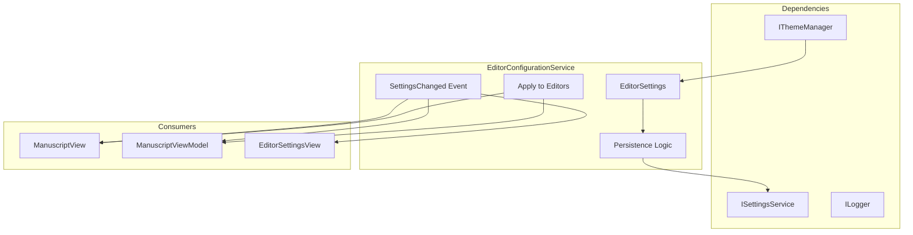
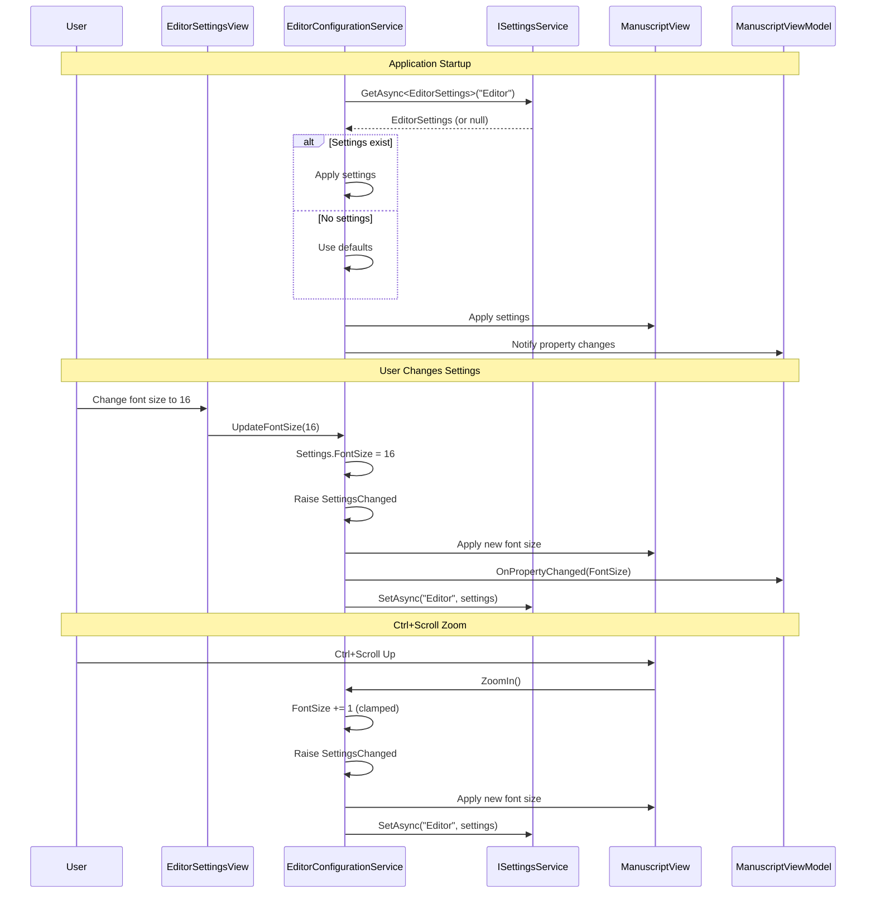

# LCS-INF-013d: Editor Configuration

## 1. Metadata & Categorization

| Field                | Value                                | Description                                      |
| :------------------- | :----------------------------------- | :----------------------------------------------- |
| **Feature ID**       | `INF-013d`                           | Sub-part D of Editor Module                      |
| **Feature Name**     | Editor Configuration                 | Font, zoom, Tab/Space settings with persistence  |
| **Target Version**   | `v0.1.3d`                            | Fourth sub-part of v0.1.3                        |
| **Module Scope**     | `Lexichord.Modules.Editor`           | Standalone editor module                         |
| **Swimlane**         | `Product`                            | Core User-Facing Feature                         |
| **License Tier**     | `Core`                               | Foundation (Available in Free tier)              |
| **Author**           | System Architect                     |                                                  |
| **Status**           | **Draft**                            | Pending implementation                           |
| **Last Updated**     | 2026-01-26                           |                                                  |

---

## 2. Executive Summary

### 2.1 The Requirement

Users need control over their editing experience:

- **Font Family:** Ability to choose a monospace font (default: Cascadia Code).
- **Font Size:** Adjustable via settings and Ctrl+Scroll zoom (8-72pt range).
- **Tab/Space:** Toggle between tabs and spaces, configurable tab width.
- **Visual Options:** Line numbers, word wrap, current line highlight.
- **Persistence:** Settings saved and restored across sessions.

### 2.2 The Proposed Solution

We **SHALL** implement editor configuration with:

1. **EditorSettings Record** — Strongly-typed settings with defaults.
2. **IEditorConfigurationService** — Load/save settings via ISettingsService.
3. **Ctrl+Scroll Zoom** — Real-time font size adjustment.
4. **EditorSettingsView** — Settings panel for the Settings module.
5. **Font Fallback Chain** — Graceful fallback if Cascadia Code unavailable.

---

## 3. Architecture

### 3.1 Service Structure



### 3.2 Settings Flow



---

## 4. Decision Tree: Settings Operations

```text
START: "Editor settings operation"
│
├── Application Startup
│   ├── Load settings from ISettingsService
│   │   ├── Settings exist → Deserialize EditorSettings
│   │   │   ├── Validate font family → Use if valid, fallback if not
│   │   │   └── Validate numeric ranges → Clamp to valid bounds
│   │   └── No settings → Use default EditorSettings
│   └── Apply settings to service state
│
├── User Changes Setting via UI
│   ├── Validate new value
│   │   ├── Invalid → Reject change, show error
│   │   └── Valid → Continue
│   ├── Update EditorSettings property
│   ├── Raise SettingsChanged event
│   ├── Apply to all open editors
│   └── Persist via ISettingsService
│
├── Ctrl+Scroll Zoom
│   ├── Calculate new font size
│   │   ├── Scroll up → FontSize + ZoomIncrement
│   │   └── Scroll down → FontSize - ZoomIncrement
│   ├── Clamp to MinFontSize..MaxFontSize
│   ├── Update EditorSettings.FontSize
│   ├── Raise SettingsChanged event
│   └── Persist (debounced to avoid excessive writes)
│
├── Font Family Change
│   ├── Validate font is installed
│   │   ├── Not installed → Use fallback chain
│   │   └── Installed → Use requested font
│   ├── Update EditorSettings.FontFamily
│   └── Apply to all editors
│
├── Tab/Space Setting Change
│   ├── Update UseSpacesForTabs
│   ├── Update TabSize/IndentSize
│   └── Apply to all editors (new input only, not existing tabs)
│
└── END
```

---

## 5. Data Contracts

### 5.1 EditorSettings Record (Extended)

```csharp
namespace Lexichord.Abstractions.Contracts;

using System.Text.Json.Serialization;

/// <summary>
/// Configuration settings for the text editor.
/// </summary>
/// <remarks>
/// LOGIC: EditorSettings is the single source of truth for all editor
/// configuration. It is:
///
/// - Serialized to JSON via ISettingsService
/// - Loaded at startup, saved on change
/// - Validated to ensure values are within acceptable ranges
/// - Observable via IEditorConfigurationService.SettingsChanged
///
/// Default values are designed for a comfortable writing experience:
/// - Cascadia Code at 14pt for readability
/// - Spaces instead of tabs (4 spaces) for consistency
/// - Line numbers and word wrap enabled
/// </remarks>
public record EditorSettings
{
    /// <summary>
    /// Settings section name for persistence.
    /// </summary>
    public const string SectionName = "Editor";

    #region Font Settings

    /// <summary>
    /// Font family for editor text.
    /// </summary>
    /// <remarks>
    /// LOGIC: Defaults to "Cascadia Code" with automatic fallback.
    /// If the specified font is not installed, the service uses the
    /// fallback chain defined in FallbackFonts.
    /// </remarks>
    public string FontFamily { get; init; } = "Cascadia Code";

    /// <summary>
    /// Font size in points.
    /// </summary>
    /// <remarks>
    /// LOGIC: Valid range is MinFontSize to MaxFontSize (8-72pt).
    /// Ctrl+Scroll adjusts by ZoomIncrement (default 2pt).
    /// </remarks>
    public double FontSize { get; init; } = 14.0;

    /// <summary>
    /// Minimum font size for zoom.
    /// </summary>
    public double MinFontSize { get; init; } = 8.0;

    /// <summary>
    /// Maximum font size for zoom.
    /// </summary>
    public double MaxFontSize { get; init; } = 72.0;

    /// <summary>
    /// Font size increment for Ctrl+Scroll zoom.
    /// </summary>
    public double ZoomIncrement { get; init; } = 2.0;

    #endregion

    #region Indentation Settings

    /// <summary>
    /// Whether to use spaces instead of tabs.
    /// </summary>
    /// <remarks>
    /// LOGIC: When true, pressing Tab inserts spaces.
    /// When false, pressing Tab inserts a tab character.
    /// </remarks>
    public bool UseSpacesForTabs { get; init; } = true;

    /// <summary>
    /// Number of spaces per tab stop.
    /// </summary>
    /// <remarks>
    /// LOGIC: Controls visual width of tab characters and
    /// number of spaces inserted when UseSpacesForTabs is true.
    /// </remarks>
    public int TabSize { get; init; } = 4;

    /// <summary>
    /// Number of spaces for auto-indent.
    /// </summary>
    /// <remarks>
    /// LOGIC: Used when auto-indenting after pressing Enter.
    /// Typically matches TabSize.
    /// </remarks>
    public int IndentSize { get; init; } = 4;

    /// <summary>
    /// Whether to enable automatic indentation.
    /// </summary>
    public bool AutoIndent { get; init; } = true;

    #endregion

    #region Display Settings

    /// <summary>
    /// Whether to show line numbers in the gutter.
    /// </summary>
    public bool ShowLineNumbers { get; init; } = true;

    /// <summary>
    /// Whether to wrap long lines.
    /// </summary>
    public bool WordWrap { get; init; } = true;

    /// <summary>
    /// Whether to highlight the current line.
    /// </summary>
    public bool HighlightCurrentLine { get; init; } = true;

    /// <summary>
    /// Whether to show whitespace characters (spaces, tabs).
    /// </summary>
    public bool ShowWhitespace { get; init; } = false;

    /// <summary>
    /// Whether to show end-of-line markers.
    /// </summary>
    public bool ShowEndOfLine { get; init; } = false;

    /// <summary>
    /// Whether to highlight matching brackets.
    /// </summary>
    public bool HighlightMatchingBrackets { get; init; } = true;

    /// <summary>
    /// Column position for the vertical ruler (0 to disable).
    /// </summary>
    /// <remarks>
    /// LOGIC: Shows a vertical line at the specified column.
    /// Useful for keeping lines within a maximum width (e.g., 80 columns).
    /// </remarks>
    public int VerticalRulerPosition { get; init; } = 80;

    /// <summary>
    /// Whether to show the vertical ruler.
    /// </summary>
    public bool ShowVerticalRuler { get; init; } = false;

    #endregion

    #region Behavior Settings

    /// <summary>
    /// Whether to enable smooth scrolling.
    /// </summary>
    public bool SmoothScrolling { get; init; } = true;

    /// <summary>
    /// Whether to enable blink cursor.
    /// </summary>
    public bool BlinkCursor { get; init; } = true;

    /// <summary>
    /// Cursor blink rate in milliseconds.
    /// </summary>
    public int CursorBlinkRate { get; init; } = 530;

    #endregion

    #region Font Fallback

    /// <summary>
    /// Gets fallback font families in order of preference.
    /// </summary>
    [JsonIgnore]
    public static IReadOnlyList<string> FallbackFonts { get; } = new[]
    {
        "Cascadia Code",
        "Cascadia Mono",
        "Fira Code",
        "JetBrains Mono",
        "Source Code Pro",
        "Consolas",
        "Monaco",
        "Menlo",
        "DejaVu Sans Mono",
        "Liberation Mono",
        "Ubuntu Mono",
        "monospace"  // Generic fallback
    };

    #endregion

    #region Validation

    /// <summary>
    /// Validates and clamps all values to acceptable ranges.
    /// </summary>
    /// <returns>A validated copy of the settings.</returns>
    public EditorSettings Validated()
    {
        return this with
        {
            FontSize = Math.Clamp(FontSize, MinFontSize, MaxFontSize),
            TabSize = Math.Clamp(TabSize, 1, 16),
            IndentSize = Math.Clamp(IndentSize, 1, 16),
            VerticalRulerPosition = Math.Clamp(VerticalRulerPosition, 0, 200),
            CursorBlinkRate = Math.Clamp(CursorBlinkRate, 100, 2000)
        };
    }

    #endregion
}
```

### 5.2 IEditorConfigurationService Interface

```csharp
namespace Lexichord.Abstractions.Contracts;

using AvaloniaEdit;

/// <summary>
/// Service for managing editor configuration.
/// </summary>
/// <remarks>
/// LOGIC: IEditorConfigurationService provides:
///
/// - Centralized access to EditorSettings
/// - Automatic persistence via ISettingsService
/// - Real-time updates to all open editors
/// - Font fallback handling
/// - Ctrl+Scroll zoom support
///
/// All changes are immediately applied to open editors and persisted.
/// </remarks>
public interface IEditorConfigurationService
{
    /// <summary>
    /// Gets the current editor settings.
    /// </summary>
    /// <returns>The current settings.</returns>
    EditorSettings GetSettings();

    /// <summary>
    /// Updates the editor settings.
    /// </summary>
    /// <param name="settings">The new settings.</param>
    /// <returns>Task completing when settings are saved.</returns>
    /// <remarks>
    /// LOGIC: Validates settings, raises SettingsChanged, and persists.
    /// </remarks>
    Task UpdateSettingsAsync(EditorSettings settings);

    /// <summary>
    /// Loads settings from storage.
    /// </summary>
    /// <returns>Task completing when settings are loaded.</returns>
    Task LoadSettingsAsync();

    /// <summary>
    /// Saves current settings to storage.
    /// </summary>
    /// <returns>Task completing when settings are saved.</returns>
    Task SaveSettingsAsync();

    /// <summary>
    /// Applies current settings to a TextEditor control.
    /// </summary>
    /// <param name="editor">The editor to configure.</param>
    void ApplySettings(TextEditor editor);

    /// <summary>
    /// Increases font size by ZoomIncrement.
    /// </summary>
    /// <remarks>
    /// LOGIC: Called by Ctrl+Scroll Up. Clamped to MaxFontSize.
    /// </remarks>
    void ZoomIn();

    /// <summary>
    /// Decreases font size by ZoomIncrement.
    /// </summary>
    /// <remarks>
    /// LOGIC: Called by Ctrl+Scroll Down. Clamped to MinFontSize.
    /// </remarks>
    void ZoomOut();

    /// <summary>
    /// Resets font size to default (14pt).
    /// </summary>
    /// <remarks>
    /// LOGIC: Called by Ctrl+0.
    /// </remarks>
    void ResetZoom();

    /// <summary>
    /// Gets the resolved font family (with fallback).
    /// </summary>
    /// <returns>The font family to use.</returns>
    /// <remarks>
    /// LOGIC: Returns the configured font if installed,
    /// otherwise returns the first available fallback font.
    /// </remarks>
    string GetResolvedFontFamily();

    /// <summary>
    /// Checks if a font family is installed on the system.
    /// </summary>
    /// <param name="fontFamily">The font family name.</param>
    /// <returns>True if the font is available.</returns>
    bool IsFontInstalled(string fontFamily);

    /// <summary>
    /// Gets the list of installed monospace fonts.
    /// </summary>
    /// <returns>List of installed monospace font family names.</returns>
    IReadOnlyList<string> GetInstalledMonospaceFonts();

    /// <summary>
    /// Event raised when settings change.
    /// </summary>
    event EventHandler<EditorSettingsChangedEventArgs> SettingsChanged;
}

/// <summary>
/// Event arguments for editor settings changes.
/// </summary>
public class EditorSettingsChangedEventArgs : EventArgs
{
    /// <summary>
    /// The property that changed (null for multiple/all properties).
    /// </summary>
    public string? PropertyName { get; init; }

    /// <summary>
    /// The old settings (before change).
    /// </summary>
    public EditorSettings? OldSettings { get; init; }

    /// <summary>
    /// The new settings (after change).
    /// </summary>
    public required EditorSettings NewSettings { get; init; }
}
```

### 5.3 EditorConfigurationService Implementation

```csharp
using Avalonia.Media;
using AvaloniaEdit;
using Lexichord.Abstractions.Contracts;
using Microsoft.Extensions.Logging;

namespace Lexichord.Modules.Editor.Services;

/// <summary>
/// Service for managing editor configuration with persistence.
/// </summary>
/// <remarks>
/// LOGIC: EditorConfigurationService provides centralized configuration
/// management for all editor instances. It:
///
/// - Loads settings at startup from ISettingsService
/// - Validates and applies font fallback
/// - Persists changes immediately (debounced for zoom)
/// - Notifies all subscribers of changes
///
/// Thread Safety:
/// - Settings access is thread-safe via lock
/// - Persistence is async and debounced
/// </remarks>
public sealed class EditorConfigurationService : IEditorConfigurationService
{
    private readonly ISettingsService _settingsService;
    private readonly ILogger<EditorConfigurationService> _logger;
    private readonly object _lock = new();
    private readonly HashSet<string> _installedFonts;

    private EditorSettings _settings = new();
    private string? _resolvedFontFamily;
    private CancellationTokenSource? _persistDebounceToken;
    private const int PersistDebounceMs = 500;

    public EditorConfigurationService(
        ISettingsService settingsService,
        ILogger<EditorConfigurationService> logger)
    {
        _settingsService = settingsService;
        _logger = logger;

        // LOGIC: Cache installed fonts at startup
        _installedFonts = GetSystemFonts();
    }

    /// <inheritdoc/>
    public event EventHandler<EditorSettingsChangedEventArgs>? SettingsChanged;

    /// <inheritdoc/>
    public EditorSettings GetSettings()
    {
        lock (_lock)
        {
            return _settings;
        }
    }

    /// <inheritdoc/>
    public async Task UpdateSettingsAsync(EditorSettings settings)
    {
        var oldSettings = _settings;
        var validatedSettings = settings.Validated();

        lock (_lock)
        {
            _settings = validatedSettings;
            _resolvedFontFamily = null; // Reset cached font
        }

        _logger.LogInformation("Editor settings updated");

        SettingsChanged?.Invoke(this, new EditorSettingsChangedEventArgs
        {
            OldSettings = oldSettings,
            NewSettings = validatedSettings
        });

        await SaveSettingsAsync();
    }

    /// <inheritdoc/>
    public async Task LoadSettingsAsync()
    {
        _logger.LogInformation("Loading editor settings");

        try
        {
            var settings = await _settingsService.GetAsync<EditorSettings>(EditorSettings.SectionName);

            lock (_lock)
            {
                _settings = settings?.Validated() ?? new EditorSettings();
                _resolvedFontFamily = null;
            }

            _logger.LogInformation(
                "Editor settings loaded: FontFamily={FontFamily}, FontSize={FontSize}",
                _settings.FontFamily, _settings.FontSize);
        }
        catch (Exception ex)
        {
            _logger.LogError(ex, "Failed to load editor settings, using defaults");

            lock (_lock)
            {
                _settings = new EditorSettings();
            }
        }
    }

    /// <inheritdoc/>
    public async Task SaveSettingsAsync()
    {
        _logger.LogDebug("Saving editor settings");

        try
        {
            EditorSettings settingsToSave;
            lock (_lock)
            {
                settingsToSave = _settings;
            }

            await _settingsService.SetAsync(EditorSettings.SectionName, settingsToSave);
            _logger.LogDebug("Editor settings saved");
        }
        catch (Exception ex)
        {
            _logger.LogError(ex, "Failed to save editor settings");
        }
    }

    /// <inheritdoc/>
    public void ApplySettings(TextEditor editor)
    {
        var settings = GetSettings();
        var fontFamily = GetResolvedFontFamily();

        _logger.LogDebug("Applying settings to editor: Font={Font}, Size={Size}",
            fontFamily, settings.FontSize);

        editor.FontFamily = new FontFamily(fontFamily);
        editor.FontSize = settings.FontSize;
        editor.ShowLineNumbers = settings.ShowLineNumbers;
        editor.WordWrap = settings.WordWrap;

        var options = editor.Options;
        options.HighlightCurrentLine = settings.HighlightCurrentLine;
        options.ShowEndOfLine = settings.ShowEndOfLine;
        options.ShowTabs = settings.ShowWhitespace;
        options.ShowSpaces = settings.ShowWhitespace;
        options.ConvertTabsToSpaces = settings.UseSpacesForTabs;
        options.IndentationSize = settings.IndentSize;
        options.EnableHyperlinks = true;
        options.RequireControlModifierForHyperlinkClick = true;
        options.CutCopyWholeLine = true;
        options.AllowScrollBelowDocument = true;
    }

    /// <inheritdoc/>
    public void ZoomIn()
    {
        var settings = GetSettings();
        var newSize = Math.Min(settings.FontSize + settings.ZoomIncrement, settings.MaxFontSize);

        if (Math.Abs(newSize - settings.FontSize) > 0.001)
        {
            UpdateFontSizeDebounced(newSize);
        }
    }

    /// <inheritdoc/>
    public void ZoomOut()
    {
        var settings = GetSettings();
        var newSize = Math.Max(settings.FontSize - settings.ZoomIncrement, settings.MinFontSize);

        if (Math.Abs(newSize - settings.FontSize) > 0.001)
        {
            UpdateFontSizeDebounced(newSize);
        }
    }

    /// <inheritdoc/>
    public void ResetZoom()
    {
        const double defaultSize = 14.0;
        UpdateFontSizeDebounced(defaultSize);
    }

    /// <inheritdoc/>
    public string GetResolvedFontFamily()
    {
        lock (_lock)
        {
            if (_resolvedFontFamily is not null)
                return _resolvedFontFamily;

            // LOGIC: Check if configured font is installed
            if (IsFontInstalled(_settings.FontFamily))
            {
                _resolvedFontFamily = _settings.FontFamily;
                return _resolvedFontFamily;
            }

            _logger.LogWarning(
                "Font '{Font}' not installed, using fallback",
                _settings.FontFamily);

            // LOGIC: Find first available fallback font
            foreach (var fallback in EditorSettings.FallbackFonts)
            {
                if (IsFontInstalled(fallback))
                {
                    _resolvedFontFamily = fallback;
                    _logger.LogInformation("Using fallback font: {Font}", fallback);
                    return _resolvedFontFamily;
                }
            }

            // Last resort: generic monospace
            _resolvedFontFamily = "monospace";
            return _resolvedFontFamily;
        }
    }

    /// <inheritdoc/>
    public bool IsFontInstalled(string fontFamily)
    {
        if (fontFamily == "monospace")
            return true; // Generic always available

        return _installedFonts.Contains(fontFamily);
    }

    /// <inheritdoc/>
    public IReadOnlyList<string> GetInstalledMonospaceFonts()
    {
        // LOGIC: Return fonts from fallback list that are installed
        return EditorSettings.FallbackFonts
            .Where(IsFontInstalled)
            .ToList();
    }

    private void UpdateFontSizeDebounced(double newSize)
    {
        var oldSettings = _settings;

        lock (_lock)
        {
            _settings = _settings with { FontSize = newSize };
        }

        _logger.LogDebug("Font size changed to {Size}", newSize);

        SettingsChanged?.Invoke(this, new EditorSettingsChangedEventArgs
        {
            PropertyName = nameof(EditorSettings.FontSize),
            OldSettings = oldSettings,
            NewSettings = _settings
        });

        // LOGIC: Debounce persistence to avoid excessive writes during scroll
        DebouncePersist();
    }

    private void DebouncePersist()
    {
        _persistDebounceToken?.Cancel();
        _persistDebounceToken = new CancellationTokenSource();

        _ = Task.Run(async () =>
        {
            try
            {
                await Task.Delay(PersistDebounceMs, _persistDebounceToken.Token);
                await SaveSettingsAsync();
            }
            catch (OperationCanceledException)
            {
                // Debounce cancelled, ignore
            }
        });
    }

    private static HashSet<string> GetSystemFonts()
    {
        // LOGIC: Get installed font families from Avalonia
        var fonts = new HashSet<string>(StringComparer.OrdinalIgnoreCase);

        try
        {
            foreach (var family in FontManager.Current.SystemFonts)
            {
                fonts.Add(family.Name);
            }
        }
        catch (Exception)
        {
            // Fallback: assume common fonts are available
            fonts.Add("Consolas");
            fonts.Add("Courier New");
        }

        return fonts;
    }
}
```

---

## 6. Settings UI

### 6.1 EditorSettingsView.axaml

```xml
<UserControl xmlns="https://github.com/avaloniaui"
             xmlns:x="http://schemas.microsoft.com/winfx/2006/xaml"
             xmlns:vm="using:Lexichord.Modules.Editor.ViewModels"
             x:Class="Lexichord.Modules.Editor.Views.EditorSettingsView"
             x:DataType="vm:EditorSettingsViewModel">

    <ScrollViewer HorizontalScrollBarVisibility="Disabled"
                  VerticalScrollBarVisibility="Auto">
        <StackPanel Spacing="24" Margin="24">

            <!-- Section: Font -->
            <StackPanel Spacing="12">
                <TextBlock Text="Font" FontWeight="SemiBold" FontSize="16" />

                <!-- Font Family -->
                <Grid ColumnDefinitions="150, *">
                    <TextBlock Text="Font Family"
                               VerticalAlignment="Center"
                               Grid.Column="0" />
                    <ComboBox ItemsSource="{Binding AvailableFonts}"
                              SelectedItem="{Binding FontFamily}"
                              Grid.Column="1"
                              MinWidth="200">
                        <ComboBox.ItemTemplate>
                            <DataTemplate>
                                <TextBlock Text="{Binding}"
                                           FontFamily="{Binding}" />
                            </DataTemplate>
                        </ComboBox.ItemTemplate>
                    </ComboBox>
                </Grid>

                <!-- Font Size -->
                <Grid ColumnDefinitions="150, *, Auto">
                    <TextBlock Text="Font Size"
                               VerticalAlignment="Center"
                               Grid.Column="0" />
                    <Slider Minimum="{Binding MinFontSize}"
                            Maximum="{Binding MaxFontSize}"
                            Value="{Binding FontSize}"
                            TickFrequency="2"
                            IsSnapToTickEnabled="True"
                            Grid.Column="1" />
                    <TextBlock Text="{Binding FontSize, StringFormat={}{0:F0} pt}"
                               VerticalAlignment="Center"
                               MinWidth="50"
                               Margin="8,0,0,0"
                               Grid.Column="2" />
                </Grid>

                <!-- Font Preview -->
                <Border Background="{DynamicResource SystemControlBackgroundAltHighBrush}"
                        BorderBrush="{DynamicResource SystemControlForegroundBaseMediumLowBrush}"
                        BorderThickness="1"
                        CornerRadius="4"
                        Padding="12"
                        Height="80">
                    <TextBlock Text="The quick brown fox jumps over the lazy dog. 0123456789"
                               FontFamily="{Binding ResolvedFontFamily}"
                               FontSize="{Binding FontSize}"
                               TextWrapping="Wrap"
                               VerticalAlignment="Center" />
                </Border>
            </StackPanel>

            <!-- Section: Indentation -->
            <StackPanel Spacing="12">
                <TextBlock Text="Indentation" FontWeight="SemiBold" FontSize="16" />

                <!-- Tab/Space Toggle -->
                <Grid ColumnDefinitions="150, *">
                    <TextBlock Text="Insert Spaces"
                               VerticalAlignment="Center"
                               Grid.Column="0" />
                    <ToggleSwitch IsChecked="{Binding UseSpacesForTabs}"
                                  OnContent="Spaces"
                                  OffContent="Tabs"
                                  Grid.Column="1" />
                </Grid>

                <!-- Tab Size -->
                <Grid ColumnDefinitions="150, *, Auto">
                    <TextBlock Text="Tab Size"
                               VerticalAlignment="Center"
                               Grid.Column="0" />
                    <Slider Minimum="1"
                            Maximum="8"
                            Value="{Binding TabSize}"
                            TickFrequency="1"
                            IsSnapToTickEnabled="True"
                            Grid.Column="1" />
                    <TextBlock Text="{Binding TabSize}"
                               VerticalAlignment="Center"
                               MinWidth="30"
                               Margin="8,0,0,0"
                               Grid.Column="2" />
                </Grid>

                <!-- Auto Indent -->
                <Grid ColumnDefinitions="150, *">
                    <TextBlock Text="Auto Indent"
                               VerticalAlignment="Center"
                               Grid.Column="0" />
                    <CheckBox IsChecked="{Binding AutoIndent}"
                              Grid.Column="1" />
                </Grid>
            </StackPanel>

            <!-- Section: Display -->
            <StackPanel Spacing="12">
                <TextBlock Text="Display" FontWeight="SemiBold" FontSize="16" />

                <!-- Line Numbers -->
                <Grid ColumnDefinitions="150, *">
                    <TextBlock Text="Show Line Numbers"
                               VerticalAlignment="Center"
                               Grid.Column="0" />
                    <CheckBox IsChecked="{Binding ShowLineNumbers}"
                              Grid.Column="1" />
                </Grid>

                <!-- Word Wrap -->
                <Grid ColumnDefinitions="150, *">
                    <TextBlock Text="Word Wrap"
                               VerticalAlignment="Center"
                               Grid.Column="0" />
                    <CheckBox IsChecked="{Binding WordWrap}"
                              Grid.Column="1" />
                </Grid>

                <!-- Highlight Current Line -->
                <Grid ColumnDefinitions="150, *">
                    <TextBlock Text="Highlight Current Line"
                               VerticalAlignment="Center"
                               Grid.Column="0" />
                    <CheckBox IsChecked="{Binding HighlightCurrentLine}"
                              Grid.Column="1" />
                </Grid>

                <!-- Show Whitespace -->
                <Grid ColumnDefinitions="150, *">
                    <TextBlock Text="Show Whitespace"
                               VerticalAlignment="Center"
                               Grid.Column="0" />
                    <CheckBox IsChecked="{Binding ShowWhitespace}"
                              Grid.Column="1" />
                </Grid>

                <!-- Matching Brackets -->
                <Grid ColumnDefinitions="150, *">
                    <TextBlock Text="Highlight Matching Brackets"
                               VerticalAlignment="Center"
                               Grid.Column="0" />
                    <CheckBox IsChecked="{Binding HighlightMatchingBrackets}"
                              Grid.Column="1" />
                </Grid>

                <!-- Vertical Ruler -->
                <Grid ColumnDefinitions="150, Auto, *, Auto">
                    <TextBlock Text="Vertical Ruler"
                               VerticalAlignment="Center"
                               Grid.Column="0" />
                    <CheckBox IsChecked="{Binding ShowVerticalRuler}"
                              Grid.Column="1" />
                    <Slider Minimum="40"
                            Maximum="120"
                            Value="{Binding VerticalRulerPosition}"
                            IsEnabled="{Binding ShowVerticalRuler}"
                            TickFrequency="10"
                            IsSnapToTickEnabled="True"
                            Margin="8,0,0,0"
                            Grid.Column="2" />
                    <TextBlock Text="{Binding VerticalRulerPosition, StringFormat=Column {0}}"
                               VerticalAlignment="Center"
                               IsEnabled="{Binding ShowVerticalRuler}"
                               MinWidth="70"
                               Margin="8,0,0,0"
                               Grid.Column="3" />
                </Grid>
            </StackPanel>

            <!-- Reset Button -->
            <Button Content="Reset to Defaults"
                    Command="{Binding ResetToDefaultsCommand}"
                    HorizontalAlignment="Left"
                    Margin="0,8,0,0" />

        </StackPanel>
    </ScrollViewer>
</UserControl>
```

### 6.2 EditorSettingsViewModel

```csharp
using Avalonia.Media;
using CommunityToolkit.Mvvm.ComponentModel;
using CommunityToolkit.Mvvm.Input;
using Lexichord.Abstractions.Contracts;
using Microsoft.Extensions.Logging;

namespace Lexichord.Modules.Editor.ViewModels;

/// <summary>
/// ViewModel for the editor settings panel.
/// </summary>
/// <remarks>
/// LOGIC: EditorSettingsViewModel provides two-way binding to
/// IEditorConfigurationService. Changes are immediately applied
/// and persisted.
/// </remarks>
public partial class EditorSettingsViewModel : ObservableObject
{
    private readonly IEditorConfigurationService _configService;
    private readonly ILogger<EditorSettingsViewModel> _logger;
    private bool _isUpdating;

    public EditorSettingsViewModel(
        IEditorConfigurationService configService,
        ILogger<EditorSettingsViewModel> logger)
    {
        _configService = configService;
        _logger = logger;

        // LOGIC: Initialize from current settings
        LoadFromSettings();

        // LOGIC: Subscribe to external changes
        _configService.SettingsChanged += OnSettingsChanged;
    }

    #region Font Properties

    [ObservableProperty]
    private string _fontFamily = "Cascadia Code";

    [ObservableProperty]
    private double _fontSize = 14.0;

    public double MinFontSize => 8.0;
    public double MaxFontSize => 72.0;

    public FontFamily ResolvedFontFamily => new(_configService.GetResolvedFontFamily());

    public IReadOnlyList<string> AvailableFonts => _configService.GetInstalledMonospaceFonts();

    #endregion

    #region Indentation Properties

    [ObservableProperty]
    private bool _useSpacesForTabs = true;

    [ObservableProperty]
    private int _tabSize = 4;

    [ObservableProperty]
    private bool _autoIndent = true;

    #endregion

    #region Display Properties

    [ObservableProperty]
    private bool _showLineNumbers = true;

    [ObservableProperty]
    private bool _wordWrap = true;

    [ObservableProperty]
    private bool _highlightCurrentLine = true;

    [ObservableProperty]
    private bool _showWhitespace = false;

    [ObservableProperty]
    private bool _highlightMatchingBrackets = true;

    [ObservableProperty]
    private bool _showVerticalRuler = false;

    [ObservableProperty]
    private int _verticalRulerPosition = 80;

    #endregion

    #region Property Change Handlers

    partial void OnFontFamilyChanged(string value) => SaveSetting();
    partial void OnFontSizeChanged(double value) => SaveSetting();
    partial void OnUseSpacesForTabsChanged(bool value) => SaveSetting();
    partial void OnTabSizeChanged(int value) => SaveSetting();
    partial void OnAutoIndentChanged(bool value) => SaveSetting();
    partial void OnShowLineNumbersChanged(bool value) => SaveSetting();
    partial void OnWordWrapChanged(bool value) => SaveSetting();
    partial void OnHighlightCurrentLineChanged(bool value) => SaveSetting();
    partial void OnShowWhitespaceChanged(bool value) => SaveSetting();
    partial void OnHighlightMatchingBracketsChanged(bool value) => SaveSetting();
    partial void OnShowVerticalRulerChanged(bool value) => SaveSetting();
    partial void OnVerticalRulerPositionChanged(int value) => SaveSetting();

    #endregion

    #region Commands

    /// <summary>
    /// Command to reset all settings to defaults.
    /// </summary>
    [RelayCommand]
    private async Task ResetToDefaultsAsync()
    {
        _logger.LogInformation("Resetting editor settings to defaults");

        await _configService.UpdateSettingsAsync(new EditorSettings());
        LoadFromSettings();
    }

    #endregion

    #region Private Methods

    private void LoadFromSettings()
    {
        _isUpdating = true;

        var settings = _configService.GetSettings();

        FontFamily = settings.FontFamily;
        FontSize = settings.FontSize;
        UseSpacesForTabs = settings.UseSpacesForTabs;
        TabSize = settings.TabSize;
        AutoIndent = settings.AutoIndent;
        ShowLineNumbers = settings.ShowLineNumbers;
        WordWrap = settings.WordWrap;
        HighlightCurrentLine = settings.HighlightCurrentLine;
        ShowWhitespace = settings.ShowWhitespace;
        HighlightMatchingBrackets = settings.HighlightMatchingBrackets;
        ShowVerticalRuler = settings.ShowVerticalRuler;
        VerticalRulerPosition = settings.VerticalRulerPosition;

        _isUpdating = false;

        OnPropertyChanged(nameof(ResolvedFontFamily));
    }

    private void SaveSetting()
    {
        if (_isUpdating)
            return;

        var settings = new EditorSettings
        {
            FontFamily = FontFamily,
            FontSize = FontSize,
            UseSpacesForTabs = UseSpacesForTabs,
            TabSize = TabSize,
            IndentSize = TabSize, // Keep in sync
            AutoIndent = AutoIndent,
            ShowLineNumbers = ShowLineNumbers,
            WordWrap = WordWrap,
            HighlightCurrentLine = HighlightCurrentLine,
            ShowWhitespace = ShowWhitespace,
            HighlightMatchingBrackets = HighlightMatchingBrackets,
            ShowVerticalRuler = ShowVerticalRuler,
            VerticalRulerPosition = VerticalRulerPosition
        };

        _ = _configService.UpdateSettingsAsync(settings);
    }

    private void OnSettingsChanged(object? sender, EditorSettingsChangedEventArgs e)
    {
        // LOGIC: Only reload if change came from elsewhere
        if (!_isUpdating)
        {
            LoadFromSettings();
        }
    }

    #endregion
}
```

---

## 7. Keyboard Shortcuts

| Shortcut | Action | Description |
|:---------|:-------|:------------|
| `Ctrl+Scroll Up` | Zoom in | Increase font size |
| `Ctrl+Scroll Down` | Zoom out | Decrease font size |
| `Ctrl+0` | Reset zoom | Reset to default font size (14pt) |
| `Ctrl++` | Zoom in | Alternative zoom in |
| `Ctrl+-` | Zoom out | Alternative zoom out |

---

## 8. Use Cases

### UC-01: First Launch with Missing Font

**Preconditions:**
- Cascadia Code is not installed on the system.
- User launches Lexichord for the first time.

**Flow:**
1. EditorConfigurationService.LoadSettingsAsync called.
2. No saved settings found, uses defaults.
3. GetResolvedFontFamily checks for "Cascadia Code".
4. Font not installed, checks fallback chain.
5. "Consolas" found and returned.
6. Log warning: "Font 'Cascadia Code' not installed, using fallback".
7. Editor displays with Consolas font.

**Postconditions:**
- Editor uses available fallback font.
- User can change font in settings.

---

### UC-02: Ctrl+Scroll Zoom

**Preconditions:**
- Document is open with 14pt font.
- User wants larger text.

**Flow:**
1. User holds Ctrl and scrolls mouse wheel up.
2. ManuscriptView captures PointerWheelChanged event.
3. View calls ConfigService.ZoomIn().
4. ConfigService increases FontSize by 2pt (to 16pt).
5. ConfigService raises SettingsChanged event.
6. View updates FontSize binding.
7. Text immediately appears larger.
8. After 500ms debounce, settings persisted.
9. User continues scrolling - repeats steps 3-7.
10. At MaxFontSize (72pt), zoom stops.

**Postconditions:**
- Font size increased and persisted.
- Next launch shows same font size.

---

### UC-03: Change Tab/Space Setting

**Preconditions:**
- User prefers tabs over spaces.
- Current setting is "Use Spaces".

**Flow:**
1. User opens Settings > Editor.
2. User toggles "Insert Spaces" to off ("Tabs").
3. EditorSettingsViewModel.UseSpacesForTabs = false.
4. ViewModel calls ConfigService.UpdateSettingsAsync.
5. ConfigService raises SettingsChanged.
6. All open editors update ConvertTabsToSpaces option.
7. User presses Tab in editor.
8. Tab character is inserted (not spaces).

**Postconditions:**
- Setting persisted.
- All editors use tabs for new input.
- Existing content unchanged.

---

## 9. Observability & Logging

| Level | Context | Message Template |
|:------|:--------|:-----------------|
| Information | EditorConfigurationService | `Loading editor settings` |
| Information | EditorConfigurationService | `Editor settings loaded: FontFamily={FontFamily}, FontSize={FontSize}` |
| Error | EditorConfigurationService | `Failed to load editor settings, using defaults` |
| Debug | EditorConfigurationService | `Saving editor settings` |
| Debug | EditorConfigurationService | `Editor settings saved` |
| Error | EditorConfigurationService | `Failed to save editor settings` |
| Information | EditorConfigurationService | `Editor settings updated` |
| Warning | EditorConfigurationService | `Font '{Font}' not installed, using fallback` |
| Information | EditorConfigurationService | `Using fallback font: {Font}` |
| Debug | EditorConfigurationService | `Applying settings to editor: Font={Font}, Size={Size}` |
| Debug | EditorConfigurationService | `Font size changed to {Size}` |
| Information | EditorSettingsViewModel | `Resetting editor settings to defaults` |

---

## 10. Unit Testing Requirements

### 10.1 EditorConfigurationService Tests

```csharp
[TestFixture]
[Category("Unit")]
public class EditorConfigurationServiceTests
{
    private Mock<ISettingsService> _mockSettingsService = null!;
    private Mock<ILogger<EditorConfigurationService>> _mockLogger = null!;
    private EditorConfigurationService _sut = null!;

    [SetUp]
    public void SetUp()
    {
        _mockSettingsService = new Mock<ISettingsService>();
        _mockLogger = new Mock<ILogger<EditorConfigurationService>>();

        _sut = new EditorConfigurationService(
            _mockSettingsService.Object,
            _mockLogger.Object);
    }

    [Test]
    public void GetSettings_ReturnsCurrentSettings()
    {
        // Act
        var settings = _sut.GetSettings();

        // Assert
        Assert.That(settings, Is.Not.Null);
        Assert.That(settings.FontSize, Is.EqualTo(14.0));
    }

    [Test]
    public async Task LoadSettingsAsync_LoadsFromStorage()
    {
        // Arrange
        var savedSettings = new EditorSettings { FontSize = 16.0 };
        _mockSettingsService
            .Setup(s => s.GetAsync<EditorSettings>(EditorSettings.SectionName))
            .ReturnsAsync(savedSettings);

        // Act
        await _sut.LoadSettingsAsync();

        // Assert
        Assert.That(_sut.GetSettings().FontSize, Is.EqualTo(16.0));
    }

    [Test]
    public async Task LoadSettingsAsync_UsesDefaults_WhenNoStoredSettings()
    {
        // Arrange
        _mockSettingsService
            .Setup(s => s.GetAsync<EditorSettings>(EditorSettings.SectionName))
            .ReturnsAsync((EditorSettings?)null);

        // Act
        await _sut.LoadSettingsAsync();

        // Assert
        var settings = _sut.GetSettings();
        Assert.That(settings.FontSize, Is.EqualTo(14.0));
        Assert.That(settings.FontFamily, Is.EqualTo("Cascadia Code"));
    }

    [Test]
    public async Task UpdateSettingsAsync_ValidatesAndSaves()
    {
        // Arrange
        var newSettings = new EditorSettings { FontSize = 100.0 }; // Over max

        // Act
        await _sut.UpdateSettingsAsync(newSettings);

        // Assert
        Assert.That(_sut.GetSettings().FontSize, Is.EqualTo(72.0)); // Clamped
    }

    [Test]
    public void ZoomIn_IncreasesFontSize()
    {
        // Arrange
        var initialSize = _sut.GetSettings().FontSize;

        // Act
        _sut.ZoomIn();

        // Assert
        Assert.That(_sut.GetSettings().FontSize, Is.EqualTo(initialSize + 2.0));
    }

    [Test]
    public void ZoomIn_ClampsToMax()
    {
        // Arrange
        _sut.UpdateSettingsAsync(new EditorSettings { FontSize = 71.0 }).Wait();

        // Act
        _sut.ZoomIn();

        // Assert
        Assert.That(_sut.GetSettings().FontSize, Is.EqualTo(72.0));
    }

    [Test]
    public void ZoomOut_DecreasesFontSize()
    {
        // Arrange
        var initialSize = _sut.GetSettings().FontSize;

        // Act
        _sut.ZoomOut();

        // Assert
        Assert.That(_sut.GetSettings().FontSize, Is.EqualTo(initialSize - 2.0));
    }

    [Test]
    public void ZoomOut_ClampsToMin()
    {
        // Arrange
        _sut.UpdateSettingsAsync(new EditorSettings { FontSize = 9.0 }).Wait();

        // Act
        _sut.ZoomOut();

        // Assert
        Assert.That(_sut.GetSettings().FontSize, Is.EqualTo(8.0));
    }

    [Test]
    public void ResetZoom_SetsToDefault()
    {
        // Arrange
        _sut.UpdateSettingsAsync(new EditorSettings { FontSize = 24.0 }).Wait();

        // Act
        _sut.ResetZoom();

        // Assert
        Assert.That(_sut.GetSettings().FontSize, Is.EqualTo(14.0));
    }

    [Test]
    public async Task UpdateSettingsAsync_RaisesSettingsChangedEvent()
    {
        // Arrange
        var eventRaised = false;
        _sut.SettingsChanged += (s, e) => eventRaised = true;

        // Act
        await _sut.UpdateSettingsAsync(new EditorSettings { FontSize = 18.0 });

        // Assert
        Assert.That(eventRaised, Is.True);
    }
}
```

### 10.2 EditorSettings Tests

```csharp
[TestFixture]
[Category("Unit")]
public class EditorSettingsTests
{
    [Test]
    public void Validated_ClampsFontSize()
    {
        // Arrange
        var settings = new EditorSettings { FontSize = 100.0 };

        // Act
        var validated = settings.Validated();

        // Assert
        Assert.That(validated.FontSize, Is.EqualTo(72.0));
    }

    [Test]
    public void Validated_ClampsTabSize()
    {
        // Arrange
        var settings = new EditorSettings { TabSize = 50 };

        // Act
        var validated = settings.Validated();

        // Assert
        Assert.That(validated.TabSize, Is.EqualTo(16));
    }

    [Test]
    public void Validated_PreservesValidValues()
    {
        // Arrange
        var settings = new EditorSettings
        {
            FontSize = 16.0,
            TabSize = 4,
            ShowLineNumbers = false
        };

        // Act
        var validated = settings.Validated();

        // Assert
        Assert.Multiple(() =>
        {
            Assert.That(validated.FontSize, Is.EqualTo(16.0));
            Assert.That(validated.TabSize, Is.EqualTo(4));
            Assert.That(validated.ShowLineNumbers, Is.False);
        });
    }

    [Test]
    public void DefaultValues_AreCorrect()
    {
        // Act
        var settings = new EditorSettings();

        // Assert
        Assert.Multiple(() =>
        {
            Assert.That(settings.FontFamily, Is.EqualTo("Cascadia Code"));
            Assert.That(settings.FontSize, Is.EqualTo(14.0));
            Assert.That(settings.UseSpacesForTabs, Is.True);
            Assert.That(settings.TabSize, Is.EqualTo(4));
            Assert.That(settings.ShowLineNumbers, Is.True);
            Assert.That(settings.WordWrap, Is.True);
        });
    }
}
```

---

## 11. Security & Safety

### 11.1 Settings Validation

- **Range Clamping:** All numeric values are clamped to valid ranges.
- **Font Validation:** Invalid font names fallback gracefully.
- **No Code Execution:** Settings are data only, no executable content.

### 11.2 Storage Security

- **Local Storage:** Settings stored in user's AppData/config directory.
- **No Sensitive Data:** Editor settings contain no sensitive information.

---

## 12. Risks & Mitigations

| Risk | Impact | Mitigation |
|:-----|:-------|:-----------|
| Font not installed | Medium | Comprehensive fallback chain |
| Settings corruption | Low | Validation on load, defaults on error |
| Zoom debounce timing | Low | 500ms delay balances responsiveness and persistence |
| Settings file locked | Low | Graceful error handling, retry logic |

---

## 13. Acceptance Criteria (QA)

| # | Category | Criterion |
|:--|:---------|:----------|
| 1 | **[Font]** | Cascadia Code used when installed |
| 2 | **[Font]** | Fallback font used when Cascadia Code missing |
| 3 | **[Font]** | Font family dropdown shows installed fonts |
| 4 | **[Zoom]** | Ctrl+Scroll Up increases font size |
| 5 | **[Zoom]** | Ctrl+Scroll Down decreases font size |
| 6 | **[Zoom]** | Ctrl+0 resets to default size |
| 7 | **[Zoom]** | Zoom clamped to 8-72pt range |
| 8 | **[Tab]** | Tab key inserts spaces when enabled |
| 9 | **[Tab]** | Tab key inserts tab when disabled |
| 10 | **[Tab]** | Tab size affects visual width |
| 11 | **[Display]** | Line numbers can be toggled |
| 12 | **[Display]** | Word wrap can be toggled |
| 13 | **[Display]** | Whitespace visibility toggles |
| 14 | **[Persist]** | Settings saved on change |
| 15 | **[Persist]** | Settings restored on startup |
| 16 | **[Reset]** | "Reset to Defaults" works |

---

## 14. Verification Commands

```bash
# 1. Run unit tests for configuration service
dotnet test --filter "FullyQualifiedName~EditorConfiguration"

# 2. Run unit tests for settings validation
dotnet test --filter "FullyQualifiedName~EditorSettings"

# 3. Manual testing:
# - Open Settings > Editor
# - Change font family, verify preview updates
# - Change font size, verify all editors update
# - Toggle Tab/Space, verify behavior in editor
# - Press Ctrl+Scroll, verify zoom works
# - Press Ctrl+0, verify zoom resets
# - Restart app, verify settings persist

# 4. Verify settings file
cat ~/.config/Lexichord/settings.json | jq '.Editor'

# 5. Test font fallback
# - Rename Cascadia Code font temporarily
# - Launch app, verify fallback font used
# - Check logs for fallback message
```

---

## 15. Deliverable Checklist

| Step | Description | Status |
|:-----|:------------|:-------|
| 1 | Define EditorSettings record with all properties | [ ] |
| 2 | Define IEditorConfigurationService interface | [ ] |
| 3 | Implement EditorConfigurationService | [ ] |
| 4 | Implement font fallback chain | [ ] |
| 5 | Implement ZoomIn/ZoomOut/ResetZoom | [ ] |
| 6 | Implement settings persistence | [ ] |
| 7 | Wire Ctrl+Scroll in ManuscriptView | [ ] |
| 8 | Wire Ctrl+0 for zoom reset | [ ] |
| 9 | Create EditorSettingsView.axaml | [ ] |
| 10 | Create EditorSettingsViewModel | [ ] |
| 11 | Register EditorSettingsView with Settings module | [ ] |
| 12 | Implement font family dropdown | [ ] |
| 13 | Implement font size slider with preview | [ ] |
| 14 | Implement Tab/Space toggle | [ ] |
| 15 | Implement display options checkboxes | [ ] |
| 16 | Implement "Reset to Defaults" button | [ ] |
| 17 | Unit tests for EditorConfigurationService | [ ] |
| 18 | Unit tests for EditorSettings validation | [ ] |
| 19 | Unit tests for EditorSettingsViewModel | [ ] |
