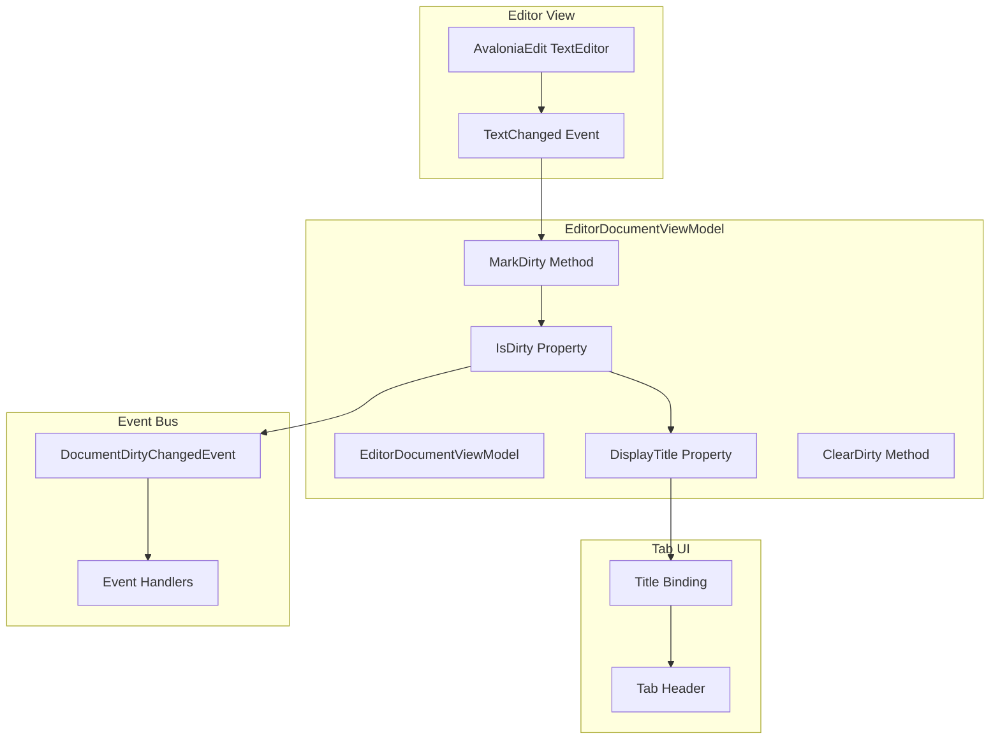
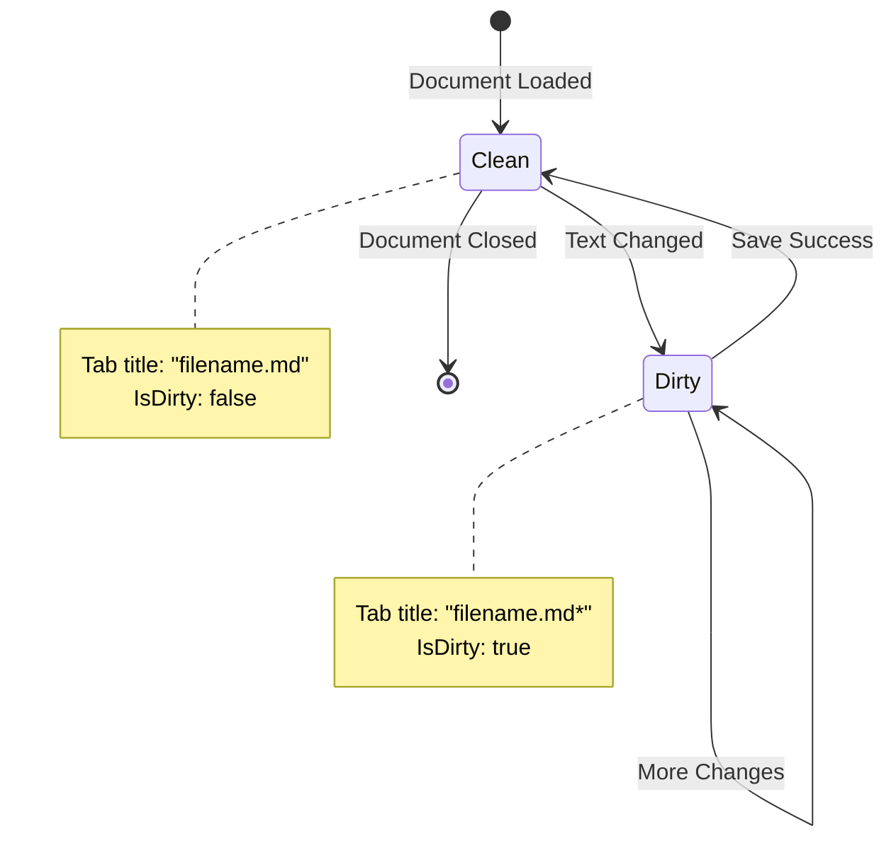
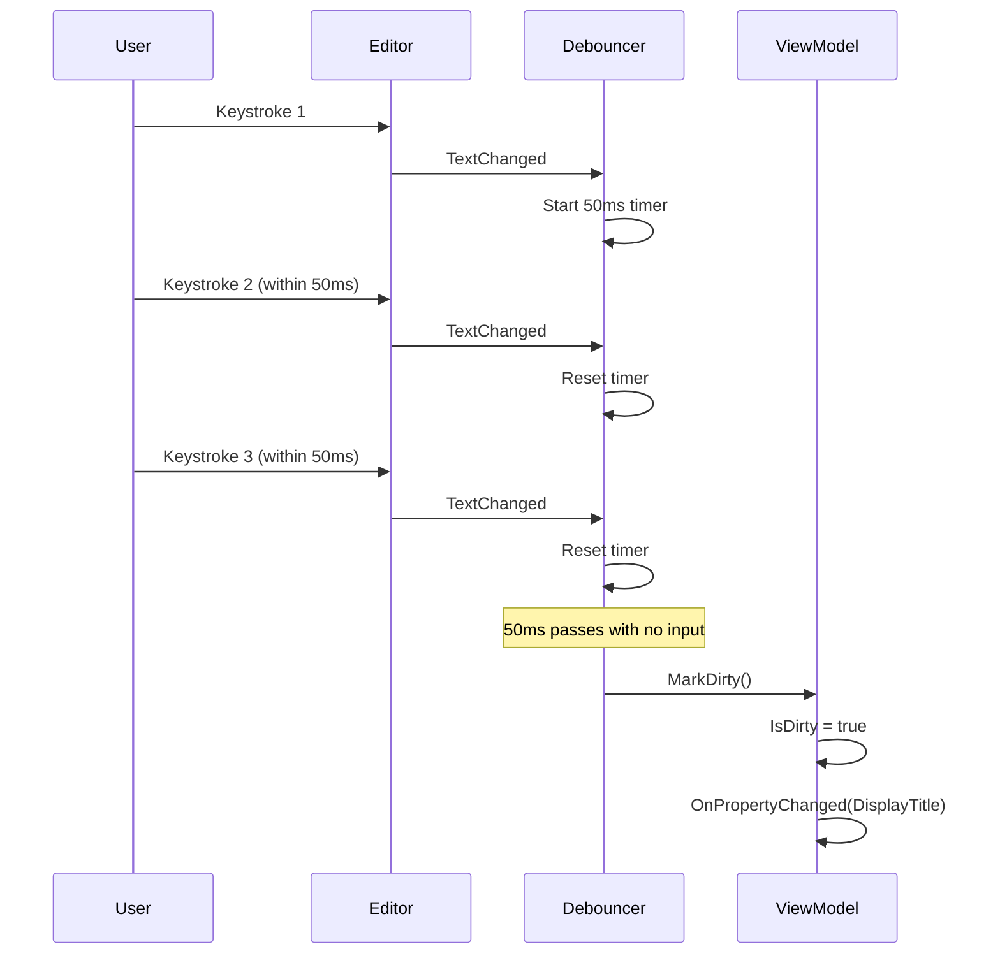

# LCS-DES-014a: Dirty State Tracking

## 1. Metadata & Categorization

| Field                | Value                                | Description                                  |
| :------------------- | :----------------------------------- | :------------------------------------------- |
| **Feature ID**       | `INF-014a`                           | Infrastructure - Dirty State Tracking        |
| **Feature Name**     | Dirty State Tracking                 | Visual indicator for unsaved changes         |
| **Target Version**   | `v0.1.4a`                            | First sub-part of v0.1.4                     |
| **Module Scope**     | `Lexichord.Modules.Editor`           | Editor module infrastructure                 |
| **Swimlane**         | `Infrastructure`                     | The Podium (Platform)                        |
| **License Tier**     | `Core`                               | Foundation (Required for all tiers)          |
| **Author**           | System Architect                     |                                              |
| **Status**           | **Draft**                            | Pending implementation                       |
| **Last Updated**     | 2026-01-26                           |                                              |

---

## 2. Executive Summary

### 2.1 The Requirement

Users need **immediate visual feedback** when their document has unsaved changes:

- Current state: No indication whether document needs saving
- Users may accidentally close without saving
- No way to distinguish saved from unsaved documents in tab bar
- Professional editors all show dirty state indicators

Without this feature:

- Data loss risk due to user uncertainty about document state
- Poor user experience compared to standard text editors
- No integration point for save confirmation workflows

### 2.2 The Proposed Solution

We **SHALL** implement dirty state tracking with:

1. **IsDirty Property** — Boolean property on EditorDocumentViewModel
2. **TextChanged Binding** — Bind editor TextChanged event to MarkDirty()
3. **Visual Indicator** — Tab title shows "*" suffix when dirty
4. **Event Publishing** — DocumentDirtyChangedEvent via event bus

---

## 3. Architecture & Modular Strategy

### 3.1 Dirty State Flow



### 3.2 State Transition Diagram



### 3.3 Debouncing Strategy



---

## 4. Decision Tree: Dirty State Operations

```text
START: "What caused the dirty state check?"
|
+-- TextChanged event fired
|   +-- Is debounce timer active?
|   |   +-- YES -> Reset timer (don't process yet)
|   |   +-- NO -> Start 50ms timer
|   |       +-- Timer expires
|   |           +-- Is document already dirty?
|   |           |   +-- YES -> No action (already dirty)
|   |           |   +-- NO -> MarkDirty()
|   |           |       +-- Set IsDirty = true
|   |           |       +-- Update DisplayTitle
|   |           |       +-- Publish DocumentDirtyChangedEvent
|   +-- END
|
+-- Save operation completed
|   +-- Was save successful?
|   |   +-- YES -> ClearDirty()
|   |   |   +-- Set IsDirty = false
|   |   |   +-- Update DisplayTitle
|   |   |   +-- Publish DocumentDirtyChangedEvent
|   |   +-- NO -> Keep dirty state
|   +-- END
|
+-- Undo operation (future)
|   +-- Has document returned to last saved state?
|   |   +-- YES -> ClearDirty() (content matches saved)
|   |   +-- NO -> Keep dirty state
|   +-- END
|
+-- END
```

---

## 5. Data Contracts

### 5.1 IDirtyStateTracker Interface

```csharp
namespace Lexichord.Abstractions.Contracts;

/// <summary>
/// Tracks dirty (unsaved changes) state for a document.
/// </summary>
/// <remarks>
/// LOGIC: This interface is implemented by document view models to track
/// whether the document has unsaved changes. The dirty state affects:
/// - Tab title display (adds "*" suffix)
/// - Save command enabled state
/// - Close confirmation workflow
///
/// Implementation Guidelines:
/// - Use debouncing to avoid excessive state changes on rapid input
/// - Clear dirty state only after confirmed successful save
/// - Publish events for cross-module awareness
/// </remarks>
public interface IDirtyStateTracker
{
    /// <summary>
    /// Gets whether the document has unsaved changes.
    /// </summary>
    /// <remarks>
    /// LOGIC: True when content differs from last saved state.
    /// UI binds to this property to show visual indicators.
    /// </remarks>
    bool IsDirty { get; }

    /// <summary>
    /// Gets the hash of the last saved content.
    /// </summary>
    /// <remarks>
    /// LOGIC: Used to detect if undo operations return to saved state.
    /// Stored as SHA256 hash for memory efficiency.
    /// </remarks>
    string? LastSavedContentHash { get; }

    /// <summary>
    /// Marks the document as having unsaved changes.
    /// </summary>
    /// <remarks>
    /// LOGIC: Called when document content changes.
    /// Implementation should debounce rapid calls.
    /// Raises DirtyStateChanged event.
    /// </remarks>
    void MarkDirty();

    /// <summary>
    /// Clears the dirty state after successful save.
    /// </summary>
    /// <remarks>
    /// LOGIC: Called after FileService.SaveAsync returns success.
    /// Updates LastSavedContentHash with current content hash.
    /// Raises DirtyStateChanged event.
    /// </remarks>
    void ClearDirty();

    /// <summary>
    /// Clears the dirty state and updates the saved content hash.
    /// </summary>
    /// <param name="contentHash">Hash of the saved content.</param>
    /// <remarks>
    /// LOGIC: Used when saving to update the comparison baseline.
    /// </remarks>
    void ClearDirty(string contentHash);

    /// <summary>
    /// Event raised when dirty state changes.
    /// </summary>
    event EventHandler<DirtyStateChangedEventArgs>? DirtyStateChanged;
}

/// <summary>
/// Event args for dirty state changes.
/// </summary>
public class DirtyStateChangedEventArgs : EventArgs
{
    /// <summary>
    /// Gets the document ID.
    /// </summary>
    public required string DocumentId { get; init; }

    /// <summary>
    /// Gets the file path, if the document has been saved.
    /// </summary>
    public string? FilePath { get; init; }

    /// <summary>
    /// Gets the new dirty state.
    /// </summary>
    public required bool IsDirty { get; init; }

    /// <summary>
    /// Gets the timestamp of the state change.
    /// </summary>
    public DateTimeOffset ChangedAt { get; init; } = DateTimeOffset.UtcNow;
}
```

### 5.2 DocumentDirtyChangedEvent

```csharp
namespace Lexichord.Abstractions.Events;

using MediatR;

/// <summary>
/// Event published when a document's dirty state changes.
/// </summary>
/// <remarks>
/// LOGIC: Published via MediatR when IsDirty transitions between true/false.
/// Subscribers can use this for:
/// - Auto-save triggers
/// - Status bar updates
/// - Window title updates
/// - Save confirmation workflows
/// </remarks>
/// <param name="DocumentId">Unique identifier for the document.</param>
/// <param name="FilePath">File path if document has been saved, null for new documents.</param>
/// <param name="IsDirty">The new dirty state (true = has unsaved changes).</param>
/// <param name="OccurredAt">When the state change occurred.</param>
public record DocumentDirtyChangedEvent(
    string DocumentId,
    string? FilePath,
    bool IsDirty,
    DateTimeOffset OccurredAt
) : INotification;
```

### 5.3 EditorDocumentViewModel Updates

```csharp
namespace Lexichord.Modules.Editor.ViewModels;

using System.Security.Cryptography;
using System.Text;
using CommunityToolkit.Mvvm.ComponentModel;
using CommunityToolkit.Mvvm.Input;
using Lexichord.Abstractions.Contracts;
using Lexichord.Abstractions.Events;
using Lexichord.Abstractions.ViewModels;
using MediatR;

/// <summary>
/// View model for a text editor document with dirty state tracking.
/// </summary>
/// <remarks>
/// LOGIC: Extends DocumentViewModel with dirty state management.
/// Binds to AvaloniaEdit TextChanged event to track modifications.
/// Implements debouncing to avoid excessive state changes during rapid typing.
/// </remarks>
public partial class EditorDocumentViewModel : DocumentViewModel, IDirtyStateTracker
{
    private readonly IMediator _mediator;
    private readonly System.Timers.Timer _debounceTimer;
    private bool _pendingDirty;

    private const int DebounceDelayMs = 50;

    /// <summary>
    /// Creates a new editor document view model.
    /// </summary>
    /// <param name="mediator">MediatR mediator for event publishing.</param>
    public EditorDocumentViewModel(IMediator mediator)
    {
        _mediator = mediator;

        // LOGIC: Debounce timer prevents excessive IsDirty updates
        // during rapid typing. Timer fires 50ms after last change.
        _debounceTimer = new System.Timers.Timer(DebounceDelayMs);
        _debounceTimer.AutoReset = false;
        _debounceTimer.Elapsed += OnDebounceTimerElapsed;
    }

    /// <summary>
    /// Gets the unique document ID.
    /// </summary>
    public override string Id { get; } = Guid.NewGuid().ToString();

    /// <summary>
    /// Gets the document title (filename).
    /// </summary>
    [ObservableProperty]
    [NotifyPropertyChangedFor(nameof(DisplayTitle))]
    private string _title = "Untitled";

    /// <summary>
    /// Gets the file path, or null if not yet saved.
    /// </summary>
    [ObservableProperty]
    private string? _filePath;

    /// <summary>
    /// Gets the document content.
    /// </summary>
    [ObservableProperty]
    private string _content = string.Empty;

    /// <summary>
    /// Gets whether the document has unsaved changes.
    /// </summary>
    [ObservableProperty]
    [NotifyPropertyChangedFor(nameof(DisplayTitle))]
    [NotifyCanExecuteChangedFor(nameof(SaveCommand))]
    private bool _isDirty;

    /// <summary>
    /// Gets the hash of the last saved content.
    /// </summary>
    public string? LastSavedContentHash { get; private set; }

    /// <summary>
    /// Gets the display title with dirty indicator.
    /// </summary>
    /// <remarks>
    /// LOGIC: Returns "Title*" when dirty, "Title" when clean.
    /// This is what the tab header binds to.
    /// </remarks>
    public override string DisplayTitle => IsDirty ? $"{Title}*" : Title;

    /// <summary>
    /// Event raised when dirty state changes.
    /// </summary>
    public event EventHandler<DirtyStateChangedEventArgs>? DirtyStateChanged;

    /// <summary>
    /// Marks the document as having unsaved changes.
    /// </summary>
    /// <remarks>
    /// LOGIC: Implements debouncing - actual state change is delayed
    /// until 50ms after the last call to this method.
    /// </remarks>
    public void MarkDirty()
    {
        _pendingDirty = true;
        _debounceTimer.Stop();
        _debounceTimer.Start();
    }

    /// <summary>
    /// Clears the dirty state after successful save.
    /// </summary>
    public void ClearDirty()
    {
        ClearDirty(ComputeContentHash(Content));
    }

    /// <summary>
    /// Clears the dirty state with specified content hash.
    /// </summary>
    /// <param name="contentHash">Hash of the saved content.</param>
    public void ClearDirty(string contentHash)
    {
        if (!IsDirty)
            return;

        IsDirty = false;
        LastSavedContentHash = contentHash;
        _pendingDirty = false;

        RaiseDirtyStateChanged();
    }

    /// <summary>
    /// Handles content changes from the editor.
    /// </summary>
    /// <remarks>
    /// LOGIC: Called when the editor's TextChanged event fires.
    /// This is the entry point for dirty state tracking.
    /// </remarks>
    public void OnContentChanged()
    {
        MarkDirty();
    }

    /// <summary>
    /// Checks if current content matches the last saved content.
    /// </summary>
    /// <returns>True if content matches last saved state.</returns>
    /// <remarks>
    /// LOGIC: Used to potentially clear dirty state after undo operations.
    /// Compares content hashes for efficiency.
    /// </remarks>
    public bool ContentMatchesLastSaved()
    {
        if (LastSavedContentHash is null)
            return false;

        var currentHash = ComputeContentHash(Content);
        return currentHash == LastSavedContentHash;
    }

    private void OnDebounceTimerElapsed(object? sender, System.Timers.ElapsedEventArgs e)
    {
        // LOGIC: Timer elapsed - apply the pending dirty state
        if (_pendingDirty && !IsDirty)
        {
            // Marshal to UI thread if needed
            Avalonia.Threading.Dispatcher.UIThread.Post(() =>
            {
                if (!IsDirty)
                {
                    IsDirty = true;
                    RaiseDirtyStateChanged();
                }
            });
        }
    }

    private void RaiseDirtyStateChanged()
    {
        var args = new DirtyStateChangedEventArgs
        {
            DocumentId = Id,
            FilePath = FilePath,
            IsDirty = IsDirty
        };

        DirtyStateChanged?.Invoke(this, args);

        // Publish to event bus
        _ = _mediator.Publish(new DocumentDirtyChangedEvent(
            Id,
            FilePath,
            IsDirty,
            DateTimeOffset.UtcNow));
    }

    private static string ComputeContentHash(string content)
    {
        var bytes = Encoding.UTF8.GetBytes(content);
        var hash = SHA256.HashData(bytes);
        return Convert.ToBase64String(hash);
    }

    /// <summary>
    /// Command to save the document.
    /// </summary>
    [RelayCommand(CanExecute = nameof(CanSave))]
    private async Task SaveAsync()
    {
        // Implementation in FileService integration
        // On success, call ClearDirty()
    }

    private bool CanSave() => IsDirty && FilePath is not null;

    /// <inheritdoc/>
    protected override void Dispose(bool disposing)
    {
        if (disposing)
        {
            _debounceTimer.Stop();
            _debounceTimer.Dispose();
        }

        base.Dispose(disposing);
    }
}
```

---

## 6. Implementation Logic

### 6.1 View-ViewModel Binding (AXAML)

```xml
<!-- EditorView.axaml -->
<UserControl xmlns="https://github.com/avaloniaui"
             xmlns:x="http://schemas.microsoft.com/winfx/2006/xaml"
             xmlns:ae="clr-namespace:AvaloniaEdit;assembly=AvaloniaEdit"
             xmlns:vm="using:Lexichord.Modules.Editor.ViewModels"
             x:Class="Lexichord.Modules.Editor.Views.EditorView"
             x:DataType="vm:EditorDocumentViewModel">

    <ae:TextEditor x:Name="Editor"
                   Document="{Binding Document}"
                   FontFamily="Cascadia Code,Consolas,monospace"
                   FontSize="14"
                   ShowLineNumbers="True"/>

</UserControl>
```

```csharp
// EditorView.axaml.cs
namespace Lexichord.Modules.Editor.Views;

using Avalonia.Controls;
using AvaloniaEdit;
using Lexichord.Modules.Editor.ViewModels;

public partial class EditorView : UserControl
{
    private EditorDocumentViewModel? _viewModel;

    public EditorView()
    {
        InitializeComponent();

        // LOGIC: Wire up TextChanged event to ViewModel
        Editor.TextChanged += OnEditorTextChanged;

        DataContextChanged += OnDataContextChanged;
    }

    private void OnDataContextChanged(object? sender, EventArgs e)
    {
        _viewModel = DataContext as EditorDocumentViewModel;
    }

    private void OnEditorTextChanged(object? sender, EventArgs e)
    {
        // LOGIC: Notify ViewModel that content has changed
        // ViewModel handles debouncing and dirty state
        _viewModel?.OnContentChanged();
    }
}
```

### 6.2 Tab Header Binding

```xml
<!-- DocumentTab.axaml (in Dock.Avalonia context) -->
<DataTemplate x:Key="DocumentTabTemplate"
              x:DataType="vm:EditorDocumentViewModel">
    <StackPanel Orientation="Horizontal" Spacing="4">
        <!-- Document icon -->
        <PathIcon Data="{StaticResource DocumentIcon}"
                  Width="16" Height="16"/>

        <!-- Title with dirty indicator -->
        <TextBlock Text="{Binding DisplayTitle}"
                   VerticalAlignment="Center"/>

        <!-- Close button -->
        <Button Command="{Binding CloseCommand}"
                Classes="CloseTab"
                IsVisible="{Binding CanClose}">
            <PathIcon Data="{StaticResource CloseIcon}"
                      Width="10" Height="10"/>
        </Button>
    </StackPanel>
</DataTemplate>
```

### 6.3 Dirty State Handler Example

```csharp
namespace Lexichord.Host.Handlers;

using Lexichord.Abstractions.Events;
using MediatR;
using Microsoft.Extensions.Logging;

/// <summary>
/// Handles DocumentDirtyChangedEvent to update status bar.
/// </summary>
/// <remarks>
/// LOGIC: This handler demonstrates subscribing to dirty state changes.
/// Could update window title, status bar, or trigger auto-save.
/// </remarks>
public class DirtyStateStatusHandler(
    ILogger<DirtyStateStatusHandler> logger) : INotificationHandler<DocumentDirtyChangedEvent>
{
    public Task Handle(DocumentDirtyChangedEvent notification, CancellationToken cancellationToken)
    {
        logger.LogDebug(
            "Document {DocumentId} dirty state changed to {IsDirty}",
            notification.DocumentId,
            notification.IsDirty);

        // Could update status bar, window title, etc.

        return Task.CompletedTask;
    }
}
```

---

## 7. Use Cases & User Stories

### 7.1 User Stories

| ID | Role | Story | Acceptance Criteria |
|:---|:-----|:------|:--------------------|
| US-01 | Writer | As a writer, I want to see "*" when my document has unsaved changes. | Tab shows "*" after typing. |
| US-02 | Writer | As a writer, I want "*" to disappear after saving. | Tab shows no "*" after Ctrl+S. |
| US-03 | Writer | As a writer, I want immediate feedback when I make changes. | "*" appears within 100ms of typing. |
| US-04 | Developer | As a developer, I want dirty state events for integration. | DocumentDirtyChangedEvent published. |

### 7.2 Use Cases

#### UC-01: Make First Edit

**Preconditions:**
- New or opened document displayed
- Document is clean (no "*" in title)

**Flow:**
1. User types character in editor
2. TextChanged event fires
3. MarkDirty() called
4. Debounce timer starts (50ms)
5. User types more characters
6. Timer resets with each keystroke
7. User pauses typing
8. Timer expires after 50ms
9. IsDirty set to true
10. DisplayTitle updates to "filename.md*"
11. DocumentDirtyChangedEvent published

**Postconditions:**
- Tab title shows "*"
- IsDirty is true
- Event handlers notified

---

#### UC-02: Save Clears Dirty State

**Preconditions:**
- Document has unsaved changes
- Tab shows "*"

**Flow:**
1. User presses Ctrl+S
2. SaveCommand executes
3. FileService.SaveAsync() called
4. Save completes successfully
5. ClearDirty() called
6. IsDirty set to false
7. DisplayTitle updates to "filename.md"
8. DocumentDirtyChangedEvent published

**Postconditions:**
- Tab title has no "*"
- IsDirty is false
- Content hash updated

---

## 8. Observability & Logging

### 8.1 Log Events

| Level | Context | Message Template |
|:------|:--------|:-----------------|
| Debug | EditorDocumentViewModel | `Document {DocumentId} marked dirty` |
| Debug | EditorDocumentViewModel | `Document {DocumentId} dirty state cleared` |
| Debug | EditorDocumentViewModel | `Debounce timer elapsed for {DocumentId}` |
| Debug | DirtyStateStatusHandler | `Document {DocumentId} dirty state changed to {IsDirty}` |

### 8.2 Metrics (Future)

| Metric | Type | Description |
|:-------|:-----|:------------|
| `editor_dirty_state_changes` | Counter | Number of dirty state transitions |
| `editor_debounce_delay_ms` | Histogram | Time from first change to dirty state |
| `editor_typing_sessions` | Counter | Number of typing sessions (debounce cycles) |

---

## 9. Unit Testing Requirements

### 9.1 EditorDocumentViewModel Dirty State Tests

```csharp
[TestFixture]
[Category("Unit")]
public class EditorDocumentViewModelDirtyStateTests
{
    private Mock<IMediator> _mockMediator = null!;
    private EditorDocumentViewModel _sut = null!;

    [SetUp]
    public void SetUp()
    {
        _mockMediator = new Mock<IMediator>();
        _sut = new EditorDocumentViewModel(_mockMediator.Object);
    }

    [TearDown]
    public void TearDown()
    {
        _sut.Dispose();
    }

    [Test]
    public void IsDirty_InitialState_IsFalse()
    {
        // Assert
        Assert.That(_sut.IsDirty, Is.False);
    }

    [Test]
    public void DisplayTitle_WhenClean_HasNoStar()
    {
        // Arrange
        _sut.Title = "test.md";

        // Assert
        Assert.That(_sut.DisplayTitle, Is.EqualTo("test.md"));
    }

    [Test]
    public async Task MarkDirty_SetsIsDirtyAfterDebounce()
    {
        // Arrange
        _sut.Title = "test.md";

        // Act
        _sut.MarkDirty();

        // Wait for debounce
        await Task.Delay(100);

        // Assert
        Assert.That(_sut.IsDirty, Is.True);
    }

    [Test]
    public async Task DisplayTitle_WhenDirty_HasStar()
    {
        // Arrange
        _sut.Title = "test.md";
        _sut.MarkDirty();
        await Task.Delay(100);

        // Assert
        Assert.That(_sut.DisplayTitle, Is.EqualTo("test.md*"));
    }

    [Test]
    public async Task ClearDirty_SetsIsDirtyFalse()
    {
        // Arrange
        _sut.MarkDirty();
        await Task.Delay(100);
        Assert.That(_sut.IsDirty, Is.True); // Precondition

        // Act
        _sut.ClearDirty();

        // Assert
        Assert.That(_sut.IsDirty, Is.False);
    }

    [Test]
    public async Task MarkDirty_PublishesEvent()
    {
        // Act
        _sut.MarkDirty();
        await Task.Delay(100);

        // Assert
        _mockMediator.Verify(m => m.Publish(
            It.Is<DocumentDirtyChangedEvent>(e => e.IsDirty == true),
            It.IsAny<CancellationToken>()), Times.Once);
    }

    [Test]
    public async Task ClearDirty_PublishesEvent()
    {
        // Arrange
        _sut.MarkDirty();
        await Task.Delay(100);

        // Act
        _sut.ClearDirty();

        // Assert
        _mockMediator.Verify(m => m.Publish(
            It.Is<DocumentDirtyChangedEvent>(e => e.IsDirty == false),
            It.IsAny<CancellationToken>()), Times.Once);
    }

    [Test]
    public async Task DirtyStateChanged_EventRaised()
    {
        // Arrange
        var eventRaised = false;
        _sut.DirtyStateChanged += (s, e) => eventRaised = true;

        // Act
        _sut.MarkDirty();
        await Task.Delay(100);

        // Assert
        Assert.That(eventRaised, Is.True);
    }

    [Test]
    public async Task MarkDirty_WhenAlreadyDirty_DoesNotRePublish()
    {
        // Arrange
        _sut.MarkDirty();
        await Task.Delay(100);

        // Clear invocation count
        _mockMediator.Invocations.Clear();

        // Act - mark dirty again
        _sut.MarkDirty();
        await Task.Delay(100);

        // Assert - should not publish again since already dirty
        _mockMediator.Verify(m => m.Publish(
            It.IsAny<DocumentDirtyChangedEvent>(),
            It.IsAny<CancellationToken>()), Times.Never);
    }

    [Test]
    public void MarkDirty_WithinDebounceWindow_DoesNotSetDirtyImmediately()
    {
        // Act
        _sut.MarkDirty();

        // Assert - should not be dirty yet (within debounce window)
        Assert.That(_sut.IsDirty, Is.False);
    }

    [Test]
    public async Task LastSavedContentHash_UpdatedOnClearDirty()
    {
        // Arrange
        _sut.Content = "Test content";

        // Act
        _sut.ClearDirty();

        // Assert
        Assert.That(_sut.LastSavedContentHash, Is.Not.Null);
    }

    [Test]
    public void ContentMatchesLastSaved_WhenNoHashStored_ReturnsFalse()
    {
        // Assert
        Assert.That(_sut.ContentMatchesLastSaved(), Is.False);
    }

    [Test]
    public void ContentMatchesLastSaved_WhenContentMatches_ReturnsTrue()
    {
        // Arrange
        _sut.Content = "Test content";
        _sut.ClearDirty();

        // Assert
        Assert.That(_sut.ContentMatchesLastSaved(), Is.True);
    }

    [Test]
    public void ContentMatchesLastSaved_WhenContentDiffers_ReturnsFalse()
    {
        // Arrange
        _sut.Content = "Original content";
        _sut.ClearDirty();
        _sut.Content = "Modified content";

        // Assert
        Assert.That(_sut.ContentMatchesLastSaved(), Is.False);
    }
}
```

### 9.2 Debounce Behavior Tests

```csharp
[TestFixture]
[Category("Unit")]
public class DebounceBehaviorTests
{
    private Mock<IMediator> _mockMediator = null!;
    private EditorDocumentViewModel _sut = null!;

    [SetUp]
    public void SetUp()
    {
        _mockMediator = new Mock<IMediator>();
        _sut = new EditorDocumentViewModel(_mockMediator.Object);
    }

    [TearDown]
    public void TearDown()
    {
        _sut.Dispose();
    }

    [Test]
    public async Task RapidMarkDirty_OnlyTriggersOnce()
    {
        // Act - simulate rapid typing
        for (int i = 0; i < 10; i++)
        {
            _sut.MarkDirty();
            await Task.Delay(10); // Less than debounce delay
        }

        // Wait for debounce to complete
        await Task.Delay(100);

        // Assert - should only publish once
        _mockMediator.Verify(m => m.Publish(
            It.IsAny<DocumentDirtyChangedEvent>(),
            It.IsAny<CancellationToken>()), Times.Once);
    }

    [Test]
    public async Task MarkDirty_AfterDebounce_CanTriggerAgain()
    {
        // First dirty cycle
        _sut.MarkDirty();
        await Task.Delay(100);
        _sut.ClearDirty();

        // Second dirty cycle
        _sut.MarkDirty();
        await Task.Delay(100);

        // Assert - should have published dirty twice (once per cycle)
        _mockMediator.Verify(m => m.Publish(
            It.Is<DocumentDirtyChangedEvent>(e => e.IsDirty == true),
            It.IsAny<CancellationToken>()), Times.Exactly(2));
    }
}
```

---

## 10. Security & Safety

### 10.1 Thread Safety

> [!IMPORTANT]
> Dirty state changes may originate from non-UI threads.
> Always marshal property changes to the UI thread.

```csharp
// CORRECT: Marshal to UI thread
Avalonia.Threading.Dispatcher.UIThread.Post(() =>
{
    IsDirty = true;
});

// WRONG: Direct property change from timer thread
IsDirty = true; // May cause cross-thread exception
```

### 10.2 Memory Safety

> [!NOTE]
> Content hashing creates temporary byte arrays.
> For large documents, consider streaming hash computation.

---

## 11. Risks & Mitigations

| Risk | Impact | Mitigation |
|:-----|:-------|:-----------|
| Debounce too short | Low | Excessive state changes; adjust to 50-100ms |
| Debounce too long | Low | User perceives delay; keep under 100ms |
| UI thread blocking | Medium | Async hash computation; marshal carefully |
| Memory leak from timer | Medium | Dispose timer in ViewModel.Dispose() |
| Event handler not unsubscribed | Low | Use weak events or explicit unsubscribe |

---

## 12. Acceptance Criteria (QA)

| # | Category | Criterion |
|:--|:---------|:----------|
| 1 | **[Display]** | Tab title shows "*" when document is dirty |
| 2 | **[Display]** | Tab title has no "*" when document is clean |
| 3 | **[Timing]** | "*" appears within 100ms of typing |
| 4 | **[Save]** | "*" disappears after successful save |
| 5 | **[Event]** | DocumentDirtyChangedEvent published on state change |
| 6 | **[Debounce]** | Rapid typing triggers single dirty state change |
| 7 | **[Property]** | IsDirty property correctly reflects state |
| 8 | **[Dispose]** | Timer disposed when view model disposed |

---

## 13. Verification Commands

```bash
# 1. Run unit tests for dirty state
dotnet test --filter "FullyQualifiedName~DirtyState"

# 2. Run debounce behavior tests
dotnet test --filter "FullyQualifiedName~Debounce"

# 3. Run the application and verify:
# - Open a document
# - Type a character
# - Verify "*" appears in tab title within 100ms
# - Press Ctrl+S
# - Verify "*" disappears
# - Type another character
# - Verify "*" reappears

# 4. Verify event publishing
dotnet test --filter "FullyQualifiedName~DocumentDirtyChangedEvent"
```

---

## 14. Deliverable Checklist

| Step | Description | Status |
|:-----|:------------|:-------|
| 1 | Define IDirtyStateTracker interface in Abstractions | [ ] |
| 2 | Implement dirty state in EditorDocumentViewModel | [ ] |
| 3 | Add debounce timer for MarkDirty | [ ] |
| 4 | Bind DisplayTitle with "*" indicator | [ ] |
| 5 | Wire TextChanged to OnContentChanged | [ ] |
| 6 | Define DocumentDirtyChangedEvent | [ ] |
| 7 | Publish event on state change | [ ] |
| 8 | Implement LastSavedContentHash | [ ] |
| 9 | Implement ContentMatchesLastSaved | [ ] |
| 10 | Unit tests for dirty state | [ ] |
| 11 | Unit tests for debounce behavior | [ ] |
| 12 | Integration test with UI | [ ] |
