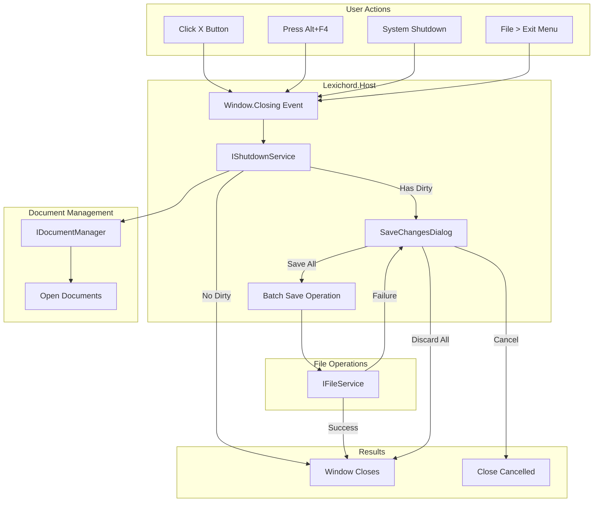
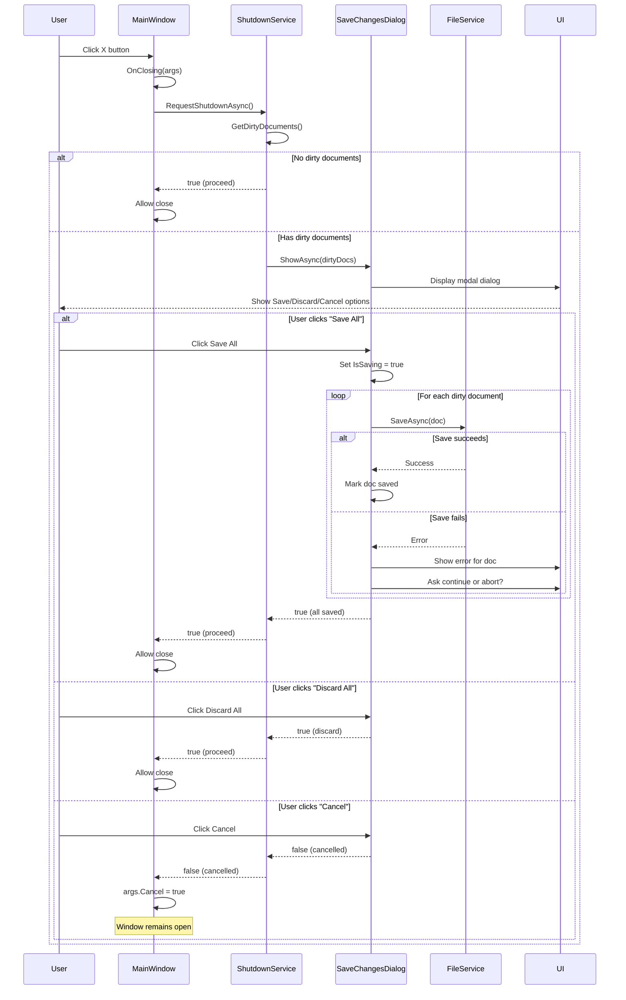
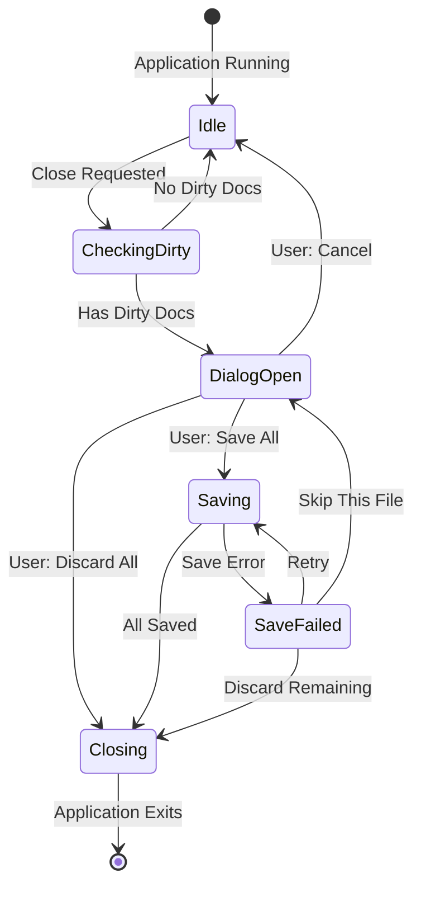

# LCS-DES-014c: Safe Close Workflow

## 1. Metadata & Categorization

| Field                | Value                                | Description                                  |
| :------------------- | :----------------------------------- | :------------------------------------------- |
| **Feature ID**       | `INF-014c`                           | Infrastructure - Safe Close Workflow         |
| **Feature Name**     | Safe Close Workflow                  | Save confirmation on application exit        |
| **Target Version**   | `v0.1.4c`                            | Third sub-part of v0.1.4                     |
| **Module Scope**     | `Lexichord.Host`                     | Host application shell                       |
| **Swimlane**         | `Infrastructure`                     | The Podium (Platform)                        |
| **License Tier**     | `Core`                               | Foundation (Required for all tiers)          |
| **Author**           | System Architect                     |                                              |
| **Status**           | **Draft**                            | Pending implementation                       |
| **Last Updated**     | 2026-01-26                           |                                              |

---

## 2. Executive Summary

### 2.1 The Requirement

Users must be protected from **accidental data loss** when closing the application:

- Clicking the X button with unsaved changes should prompt for confirmation
- Alt+F4 should also trigger the confirmation workflow
- System shutdown/restart should allow saving before exit
- Multiple dirty documents should be handled in a single dialog

Without this feature:

- Users may lose hours of work with a single click
- No opportunity to save before shutdown
- Inconsistent behavior compared to professional applications

### 2.2 The Proposed Solution

We **SHALL** implement a safe close workflow with:

1. **IShutdownService** — Central service for shutdown coordination
2. **Window.Closing Interception** — Capture close events before they complete
3. **SaveChangesDialog** — Modal dialog with Save All/Discard All/Cancel options
4. **Batch Save Operations** — Save multiple documents efficiently

---

## 3. Architecture & Modular Strategy

### 3.1 Safe Close Flow



### 3.2 Dialog Interaction Sequence



### 3.3 State Machine



---

## 4. Decision Tree: Close Operations

```text
START: "How should close request be handled?"
|
+-- User requests close (X, Alt+F4, File>Exit, System shutdown)
|   |
|   +-- Check for dirty documents
|   |   |
|   |   +-- Any documents dirty?
|   |   |   +-- NO -> Allow close immediately
|   |   |   +-- YES -> Show SaveChangesDialog
|   |   |       |
|   |   |       +-- User clicks "Save All"
|   |   |       |   +-- For each dirty document:
|   |   |       |   |   +-- Save document
|   |   |       |   |   +-- Success? Mark saved, continue
|   |   |       |   |   +-- Failure?
|   |   |       |   |       +-- Show error
|   |   |       |   |       +-- User choice: Retry / Skip / Abort
|   |   |       |   +-- All saved? -> Allow close
|   |   |       |
|   |   |       +-- User clicks "Discard All"
|   |   |       |   +-- Confirm destructive action?
|   |   |       |   |   +-- YES -> Allow close (data lost)
|   |   |       |   |   +-- NO -> Return to dialog
|   |   |       |
|   |   |       +-- User clicks "Cancel"
|   |   |           +-- Cancel close operation
|   |   |           +-- Window remains open
|   |
|   +-- END
```

---

## 5. Data Contracts

### 5.1 IShutdownService Interface

```csharp
namespace Lexichord.Abstractions.Contracts;

/// <summary>
/// Service for managing application shutdown with dirty document handling.
/// </summary>
/// <remarks>
/// LOGIC: The shutdown service acts as the central coordinator for application exit.
/// It intercepts close requests, checks for unsaved work, and ensures users have
/// the opportunity to save before closing.
///
/// Integration Points:
/// - MainWindow.Closing event handler
/// - IDocumentManager for document enumeration
/// - IFileService for save operations
/// - SaveChangesDialog for user interaction
///
/// Thread Safety:
/// - All operations must be safe to call from UI thread
/// - Async methods marshal back to UI thread as needed
/// </remarks>
public interface IShutdownService
{
    /// <summary>
    /// Requests application shutdown, handling dirty documents.
    /// </summary>
    /// <returns>True if shutdown should proceed, false if cancelled by user.</returns>
    /// <remarks>
    /// LOGIC: Call this from Window.Closing event handler.
    /// If dirty documents exist, shows confirmation dialog.
    /// Returns false if user cancels, true otherwise.
    /// </remarks>
    Task<bool> RequestShutdownAsync();

    /// <summary>
    /// Registers a document for shutdown tracking.
    /// </summary>
    /// <param name="document">The document to track.</param>
    /// <remarks>
    /// LOGIC: Called when a document is opened.
    /// Document will be included in dirty checks on shutdown.
    /// </remarks>
    void RegisterDocument(DocumentViewModel document);

    /// <summary>
    /// Unregisters a document from shutdown tracking.
    /// </summary>
    /// <param name="document">The document to unregister.</param>
    /// <remarks>
    /// LOGIC: Called when a document is closed.
    /// Document will no longer be checked on shutdown.
    /// </remarks>
    void UnregisterDocument(DocumentViewModel document);

    /// <summary>
    /// Gets all documents currently registered for tracking.
    /// </summary>
    /// <returns>All registered documents.</returns>
    IReadOnlyList<DocumentViewModel> GetRegisteredDocuments();

    /// <summary>
    /// Gets all documents with unsaved changes.
    /// </summary>
    /// <returns>List of dirty documents.</returns>
    IReadOnlyList<DocumentViewModel> GetDirtyDocuments();

    /// <summary>
    /// Gets whether there are any dirty documents.
    /// </summary>
    bool HasDirtyDocuments { get; }

    /// <summary>
    /// Gets whether a shutdown is currently in progress.
    /// </summary>
    bool IsShuttingDown { get; }

    /// <summary>
    /// Event raised when shutdown is requested.
    /// </summary>
    /// <remarks>
    /// LOGIC: Subscribers can use this to perform cleanup
    /// or add additional documents to the dirty list.
    /// Set Cancel = true on args to prevent shutdown.
    /// </remarks>
    event EventHandler<ShutdownRequestedEventArgs>? ShutdownRequested;

    /// <summary>
    /// Event raised when shutdown is about to proceed.
    /// </summary>
    /// <remarks>
    /// LOGIC: Final notification before application exits.
    /// Cannot be cancelled at this point.
    /// </remarks>
    event EventHandler<ShutdownProceedingEventArgs>? ShutdownProceeding;
}

/// <summary>
/// Event args for shutdown request.
/// </summary>
public class ShutdownRequestedEventArgs : EventArgs
{
    /// <summary>
    /// Gets the list of dirty documents at shutdown time.
    /// </summary>
    public required IReadOnlyList<DocumentViewModel> DirtyDocuments { get; init; }

    /// <summary>
    /// Gets or sets whether the shutdown should be cancelled.
    /// </summary>
    public bool Cancel { get; set; }

    /// <summary>
    /// Gets the reason for the shutdown request.
    /// </summary>
    public ShutdownReason Reason { get; init; } = ShutdownReason.UserRequested;
}

/// <summary>
/// Event args for shutdown proceeding notification.
/// </summary>
public class ShutdownProceedingEventArgs : EventArgs
{
    /// <summary>
    /// Gets the documents that were saved.
    /// </summary>
    public required IReadOnlyList<DocumentViewModel> SavedDocuments { get; init; }

    /// <summary>
    /// Gets the documents that were discarded.
    /// </summary>
    public required IReadOnlyList<DocumentViewModel> DiscardedDocuments { get; init; }
}

/// <summary>
/// Reason for shutdown request.
/// </summary>
public enum ShutdownReason
{
    /// <summary>User clicked close or File > Exit.</summary>
    UserRequested,

    /// <summary>System is shutting down or restarting.</summary>
    SystemShutdown,

    /// <summary>Session is ending (logout).</summary>
    SessionEnding,

    /// <summary>Application is restarting (e.g., after update).</summary>
    ApplicationRestart
}
```

### 5.2 Dialog Result Types

```csharp
namespace Lexichord.Host.ViewModels;

/// <summary>
/// Result from the SaveChangesDialog.
/// </summary>
public record SaveChangesDialogResult
{
    /// <summary>
    /// The action chosen by the user.
    /// </summary>
    public required SaveChangesAction Action { get; init; }

    /// <summary>
    /// Documents that were successfully saved (if Save was chosen).
    /// </summary>
    public IReadOnlyList<DocumentViewModel> SavedDocuments { get; init; } = [];

    /// <summary>
    /// Documents that failed to save.
    /// </summary>
    public IReadOnlyList<SaveFailure> FailedDocuments { get; init; } = [];

    /// <summary>
    /// Whether all documents were handled successfully.
    /// </summary>
    public bool AllSucceeded => FailedDocuments.Count == 0;
}

/// <summary>
/// User action in save changes dialog.
/// </summary>
public enum SaveChangesAction
{
    /// <summary>Save all dirty documents.</summary>
    SaveAll,

    /// <summary>Discard all changes and close.</summary>
    DiscardAll,

    /// <summary>Cancel the close operation.</summary>
    Cancel
}

/// <summary>
/// Information about a failed save.
/// </summary>
/// <param name="Document">The document that failed to save.</param>
/// <param name="Error">The error details.</param>
public record SaveFailure(
    DocumentViewModel Document,
    SaveError Error
);
```

### 5.3 SaveChangesDialog ViewModel

```csharp
namespace Lexichord.Host.ViewModels;

using CommunityToolkit.Mvvm.ComponentModel;
using CommunityToolkit.Mvvm.Input;
using Lexichord.Abstractions.Contracts;
using Lexichord.Abstractions.ViewModels;

/// <summary>
/// View model for the SaveChangesDialog.
/// </summary>
/// <remarks>
/// LOGIC: Displays a list of dirty documents and offers three choices:
/// - Save All: Save each document, then close
/// - Discard All: Close without saving
/// - Cancel: Abort close, return to editing
///
/// During save, shows progress and handles errors per-document.
/// </remarks>
public partial class SaveChangesDialogViewModel : ViewModelBase
{
    private readonly IFileService _fileService;
    private TaskCompletionSource<SaveChangesDialogResult>? _resultSource;

    /// <summary>
    /// Creates a new SaveChangesDialogViewModel.
    /// </summary>
    public SaveChangesDialogViewModel(IFileService fileService)
    {
        _fileService = fileService;
    }

    /// <summary>
    /// Gets or sets the dirty documents to display.
    /// </summary>
    [ObservableProperty]
    private IReadOnlyList<DocumentViewModel> _dirtyDocuments = [];

    /// <summary>
    /// Gets whether a save operation is in progress.
    /// </summary>
    [ObservableProperty]
    [NotifyCanExecuteChangedFor(nameof(SaveAllCommand))]
    [NotifyCanExecuteChangedFor(nameof(DiscardAllCommand))]
    [NotifyCanExecuteChangedFor(nameof(CancelCommand))]
    private bool _isSaving;

    /// <summary>
    /// Gets the current save progress (0-100).
    /// </summary>
    [ObservableProperty]
    private int _saveProgress;

    /// <summary>
    /// Gets the current status message.
    /// </summary>
    [ObservableProperty]
    private string _statusMessage = "The following documents have unsaved changes:";

    /// <summary>
    /// Gets the currently saving document name.
    /// </summary>
    [ObservableProperty]
    private string? _currentlySaving;

    /// <summary>
    /// Gets any error message to display.
    /// </summary>
    [ObservableProperty]
    private string? _errorMessage;

    /// <summary>
    /// Shows the dialog and returns the result.
    /// </summary>
    /// <param name="dirtyDocuments">The dirty documents.</param>
    /// <returns>The dialog result.</returns>
    public Task<SaveChangesDialogResult> ShowAsync(IReadOnlyList<DocumentViewModel> dirtyDocuments)
    {
        DirtyDocuments = dirtyDocuments;
        IsSaving = false;
        SaveProgress = 0;
        ErrorMessage = null;
        StatusMessage = dirtyDocuments.Count == 1
            ? "The following document has unsaved changes:"
            : "The following documents have unsaved changes:";

        _resultSource = new TaskCompletionSource<SaveChangesDialogResult>();
        return _resultSource.Task;
    }

    /// <summary>
    /// Command to save all documents.
    /// </summary>
    [RelayCommand(CanExecute = nameof(CanExecuteActions))]
    private async Task SaveAllAsync()
    {
        IsSaving = true;
        StatusMessage = "Saving documents...";

        var saved = new List<DocumentViewModel>();
        var failed = new List<SaveFailure>();

        for (int i = 0; i < DirtyDocuments.Count; i++)
        {
            var doc = DirtyDocuments[i];
            CurrentlySaving = doc.Title;
            SaveProgress = (int)((i / (float)DirtyDocuments.Count) * 100);

            // Check if document has a file path
            if (string.IsNullOrEmpty(doc.FilePath))
            {
                // TODO: Show SaveAs dialog for new documents
                failed.Add(new SaveFailure(doc, new SaveError(
                    SaveErrorCode.InvalidPath,
                    "Document has not been saved before. Use Save As.",
                    RecoveryHint: "Click Cancel and use File > Save As")));
                continue;
            }

            var result = await _fileService.SaveAsync(
                doc.FilePath,
                doc.Content ?? string.Empty);

            if (result.Success)
            {
                doc.ClearDirty();
                saved.Add(doc);
            }
            else
            {
                failed.Add(new SaveFailure(doc, result.Error!));

                // Show error and ask user what to do
                ErrorMessage = $"Failed to save {doc.Title}: {result.Error!.Message}";

                // For now, continue with remaining documents
                // Future: Show per-document error dialog
            }
        }

        SaveProgress = 100;
        IsSaving = false;

        if (failed.Count == 0)
        {
            _resultSource?.SetResult(new SaveChangesDialogResult
            {
                Action = SaveChangesAction.SaveAll,
                SavedDocuments = saved
            });
        }
        else if (saved.Count > 0)
        {
            // Partial success - some saved, some failed
            StatusMessage = $"Saved {saved.Count} of {DirtyDocuments.Count} documents.";
            ErrorMessage = $"{failed.Count} document(s) could not be saved.";

            _resultSource?.SetResult(new SaveChangesDialogResult
            {
                Action = SaveChangesAction.SaveAll,
                SavedDocuments = saved,
                FailedDocuments = failed
            });
        }
        else
        {
            // All failed
            StatusMessage = "Could not save documents.";
            ErrorMessage = failed[0].Error.Message;
            // Don't complete - let user try again or cancel
        }
    }

    /// <summary>
    /// Command to discard all changes.
    /// </summary>
    [RelayCommand(CanExecute = nameof(CanExecuteActions))]
    private void DiscardAll()
    {
        // Optionally show "Are you sure?" for destructive action
        _resultSource?.SetResult(new SaveChangesDialogResult
        {
            Action = SaveChangesAction.DiscardAll
        });
    }

    /// <summary>
    /// Command to cancel the close operation.
    /// </summary>
    [RelayCommand(CanExecute = nameof(CanExecuteActions))]
    private void Cancel()
    {
        _resultSource?.SetResult(new SaveChangesDialogResult
        {
            Action = SaveChangesAction.Cancel
        });
    }

    private bool CanExecuteActions() => !IsSaving;
}
```

---

## 6. Implementation Logic

### 6.1 ShutdownService Implementation

```csharp
using Lexichord.Abstractions.Contracts;
using Lexichord.Abstractions.ViewModels;
using Microsoft.Extensions.Logging;

namespace Lexichord.Host.Services;

/// <summary>
/// Service for managing application shutdown with dirty document handling.
/// </summary>
/// <remarks>
/// LOGIC: Maintains a registry of open documents and intercepts shutdown
/// requests to ensure users can save their work.
///
/// Thread Safety:
/// - Document list is protected by lock
/// - All public methods are safe to call from any thread
/// </remarks>
public sealed class ShutdownService(
    ILogger<ShutdownService> logger) : IShutdownService
{
    private readonly List<DocumentViewModel> _documents = [];
    private readonly object _lock = new();
    private bool _isShuttingDown;

    /// <inheritdoc/>
    public event EventHandler<ShutdownRequestedEventArgs>? ShutdownRequested;

    /// <inheritdoc/>
    public event EventHandler<ShutdownProceedingEventArgs>? ShutdownProceeding;

    /// <inheritdoc/>
    public bool HasDirtyDocuments => GetDirtyDocuments().Count > 0;

    /// <inheritdoc/>
    public bool IsShuttingDown => _isShuttingDown;

    /// <inheritdoc/>
    public async Task<bool> RequestShutdownAsync()
    {
        if (_isShuttingDown)
        {
            logger.LogWarning("Shutdown already in progress");
            return false;
        }

        _isShuttingDown = true;
        logger.LogInformation("Shutdown requested");

        try
        {
            var dirtyDocuments = GetDirtyDocuments();

            // Raise ShutdownRequested event
            var args = new ShutdownRequestedEventArgs
            {
                DirtyDocuments = dirtyDocuments,
                Reason = ShutdownReason.UserRequested
            };

            ShutdownRequested?.Invoke(this, args);

            if (args.Cancel)
            {
                logger.LogInformation("Shutdown cancelled by event handler");
                return false;
            }

            // Re-check dirty documents after event (handlers may have changed state)
            dirtyDocuments = GetDirtyDocuments();

            if (dirtyDocuments.Count == 0)
            {
                logger.LogDebug("No dirty documents, proceeding with shutdown");
                OnShutdownProceeding([], []);
                return true;
            }

            logger.LogInformation(
                "Found {Count} dirty documents, dialog will be shown",
                dirtyDocuments.Count);

            // The actual dialog is shown by the caller (MainWindow)
            // This method just performs the check
            // Return value indicates whether there are dirty documents

            // For now, return true and let the UI layer handle the dialog
            // In a real implementation, we'd inject a dialog service here
            return await Task.FromResult(true);
        }
        finally
        {
            if (!HasDirtyDocuments)
            {
                // Reset if we're allowing shutdown
            }
            _isShuttingDown = false;
        }
    }

    /// <inheritdoc/>
    public void RegisterDocument(DocumentViewModel document)
    {
        ArgumentNullException.ThrowIfNull(document);

        lock (_lock)
        {
            if (!_documents.Contains(document))
            {
                _documents.Add(document);
                logger.LogDebug(
                    "Registered document: {Title} ({Id})",
                    document.Title, document.Id);
            }
        }
    }

    /// <inheritdoc/>
    public void UnregisterDocument(DocumentViewModel document)
    {
        ArgumentNullException.ThrowIfNull(document);

        lock (_lock)
        {
            if (_documents.Remove(document))
            {
                logger.LogDebug(
                    "Unregistered document: {Title} ({Id})",
                    document.Title, document.Id);
            }
        }
    }

    /// <inheritdoc/>
    public IReadOnlyList<DocumentViewModel> GetRegisteredDocuments()
    {
        lock (_lock)
        {
            return _documents.ToList();
        }
    }

    /// <inheritdoc/>
    public IReadOnlyList<DocumentViewModel> GetDirtyDocuments()
    {
        lock (_lock)
        {
            return _documents.Where(d => d.IsDirty).ToList();
        }
    }

    private void OnShutdownProceeding(
        IReadOnlyList<DocumentViewModel> saved,
        IReadOnlyList<DocumentViewModel> discarded)
    {
        ShutdownProceeding?.Invoke(this, new ShutdownProceedingEventArgs
        {
            SavedDocuments = saved,
            DiscardedDocuments = discarded
        });
    }
}
```

### 6.2 MainWindow Integration

```csharp
namespace Lexichord.Host.Views;

using Avalonia.Controls;
using Lexichord.Abstractions.Contracts;
using Lexichord.Host.ViewModels;
using Microsoft.Extensions.DependencyInjection;

public partial class MainWindow : Window
{
    private readonly IShutdownService _shutdownService;
    private readonly IServiceProvider _services;

    public MainWindow()
    {
        InitializeComponent();

        // Get services from DI
        _services = App.Current.Services;
        _shutdownService = _services.GetRequiredService<IShutdownService>();

        // LOGIC: Wire up the Closing event to intercept close requests
        Closing += OnWindowClosing;
    }

    private async void OnWindowClosing(object? sender, WindowClosingEventArgs e)
    {
        // LOGIC: Check for dirty documents and potentially show dialog
        if (_shutdownService.HasDirtyDocuments)
        {
            // Cancel the close - we'll handle it async
            e.Cancel = true;

            // Get dirty documents
            var dirtyDocs = _shutdownService.GetDirtyDocuments();

            // Show the dialog
            var dialog = new SaveChangesDialog
            {
                DataContext = new SaveChangesDialogViewModel(
                    _services.GetRequiredService<IFileService>())
            };

            var result = await dialog.ShowDialog<SaveChangesDialogResult>(this);

            if (result is null)
            {
                // Dialog was closed without a result - treat as cancel
                return;
            }

            switch (result.Action)
            {
                case SaveChangesAction.SaveAll:
                    if (result.AllSucceeded)
                    {
                        // All saved, close the window
                        Close();
                    }
                    else
                    {
                        // Some failed - stay open
                        // Error already shown in dialog
                    }
                    break;

                case SaveChangesAction.DiscardAll:
                    // User chose to discard - close without saving
                    // Detach the handler to prevent re-entering
                    Closing -= OnWindowClosing;
                    Close();
                    break;

                case SaveChangesAction.Cancel:
                    // User cancelled - do nothing, window stays open
                    break;
            }
        }
    }
}
```

### 6.3 SaveChangesDialog View

```xml
<!-- SaveChangesDialog.axaml -->
<Window xmlns="https://github.com/avaloniaui"
        xmlns:x="http://schemas.microsoft.com/winfx/2006/xaml"
        xmlns:vm="using:Lexichord.Host.ViewModels"
        x:Class="Lexichord.Host.Views.SaveChangesDialog"
        x:DataType="vm:SaveChangesDialogViewModel"
        Title="Save Changes?"
        Width="450"
        Height="350"
        WindowStartupLocation="CenterOwner"
        CanResize="False"
        ShowInTaskbar="False">

    <Grid RowDefinitions="Auto,*,Auto,Auto">

        <!-- Header -->
        <StackPanel Grid.Row="0" Margin="20,20,20,10">
            <TextBlock Text="{Binding StatusMessage}"
                       FontWeight="SemiBold"
                       FontSize="14"
                       TextWrapping="Wrap"/>
        </StackPanel>

        <!-- Document List -->
        <Border Grid.Row="1"
                Margin="20,0"
                BorderBrush="{DynamicResource SystemControlForegroundBaseMediumBrush}"
                BorderThickness="1"
                CornerRadius="4">
            <ListBox ItemsSource="{Binding DirtyDocuments}"
                     Padding="5">
                <ListBox.ItemTemplate>
                    <DataTemplate>
                        <StackPanel Orientation="Horizontal" Spacing="8">
                            <PathIcon Data="{StaticResource DocumentIcon}"
                                      Width="16" Height="16"/>
                            <TextBlock Text="{Binding Title}"
                                       VerticalAlignment="Center"/>
                            <TextBlock Text="{Binding FilePath}"
                                       Foreground="{DynamicResource SystemControlForegroundBaseMediumBrush}"
                                       FontSize="11"
                                       VerticalAlignment="Center"/>
                        </StackPanel>
                    </DataTemplate>
                </ListBox.ItemTemplate>
            </ListBox>
        </Border>

        <!-- Progress and Error -->
        <StackPanel Grid.Row="2" Margin="20,10">
            <!-- Progress Bar (visible during save) -->
            <ProgressBar Value="{Binding SaveProgress}"
                         Maximum="100"
                         IsVisible="{Binding IsSaving}"
                         Height="8"/>

            <!-- Currently Saving -->
            <TextBlock Text="{Binding CurrentlySaving, StringFormat='Saving {0}...'}"
                       IsVisible="{Binding IsSaving}"
                       FontSize="12"
                       Margin="0,5,0,0"/>

            <!-- Error Message -->
            <TextBlock Text="{Binding ErrorMessage}"
                       Foreground="{DynamicResource SystemControlErrorTextForegroundBrush}"
                       TextWrapping="Wrap"
                       IsVisible="{Binding ErrorMessage, Converter={x:Static StringConverters.IsNotNullOrEmpty}}"
                       Margin="0,5,0,0"/>
        </StackPanel>

        <!-- Buttons -->
        <StackPanel Grid.Row="3"
                    Orientation="Horizontal"
                    HorizontalAlignment="Right"
                    Spacing="10"
                    Margin="20">

            <Button Content="Save All"
                    Command="{Binding SaveAllCommand}"
                    IsDefault="True"
                    Width="100"/>

            <Button Content="Discard All"
                    Command="{Binding DiscardAllCommand}"
                    Width="100"/>

            <Button Content="Cancel"
                    Command="{Binding CancelCommand}"
                    IsCancel="True"
                    Width="100"/>
        </StackPanel>

    </Grid>
</Window>
```

---

## 7. Use Cases & User Stories

### 7.1 User Stories

| ID | Role | Story | Acceptance Criteria |
|:---|:-----|:------|:--------------------|
| US-01 | Writer | As a writer, I want to be warned before closing with unsaved changes. | Dialog appears with dirty document list. |
| US-02 | Writer | As a writer, I want to save all documents with one click. | "Save All" saves all dirty documents. |
| US-03 | Writer | As a writer, I want to cancel close if I change my mind. | "Cancel" keeps app open with changes. |
| US-04 | Writer | As a writer, I want clear feedback during batch save. | Progress bar and current file shown. |

### 7.2 Use Cases

#### UC-01: Close with Save All

**Preconditions:**
- Multiple documents open
- At least one has unsaved changes

**Flow:**
1. User clicks X button
2. Dialog appears showing dirty documents
3. User clicks "Save All"
4. Progress bar appears
5. Each document is saved
6. On success, window closes

**Postconditions:**
- All documents saved
- Application closed

---

#### UC-02: Close with Discard

**Preconditions:**
- Document has unsaved changes

**Flow:**
1. User clicks X button
2. Dialog appears
3. User clicks "Discard All"
4. Window closes without saving

**Postconditions:**
- Changes lost
- Application closed

---

#### UC-03: Cancel Close

**Preconditions:**
- Document has unsaved changes

**Flow:**
1. User clicks X button
2. Dialog appears
3. User clicks "Cancel"
4. Dialog closes
5. Window remains open

**Postconditions:**
- Document still dirty
- User can continue editing

---

## 8. Observability & Logging

### 8.1 Log Events

| Level | Context | Message Template |
|:------|:--------|:-----------------|
| Information | ShutdownService | `Shutdown requested` |
| Debug | ShutdownService | `No dirty documents, proceeding with shutdown` |
| Information | ShutdownService | `Found {Count} dirty documents, dialog will be shown` |
| Information | ShutdownService | `Shutdown cancelled by user` |
| Debug | ShutdownService | `Registered document: {Title} ({Id})` |
| Debug | ShutdownService | `Unregistered document: {Title} ({Id})` |
| Information | SaveChangesDialog | `Saving {Count} dirty documents` |
| Debug | SaveChangesDialog | `Saved: {Title}` |
| Warning | SaveChangesDialog | `Failed to save: {Title} - {Error}` |
| Information | SaveChangesDialog | `User discarded {Count} unsaved documents` |

---

## 9. Unit Testing Requirements

### 9.1 ShutdownService Tests

```csharp
[TestFixture]
[Category("Unit")]
public class ShutdownServiceTests
{
    private Mock<ILogger<ShutdownService>> _mockLogger = null!;
    private ShutdownService _sut = null!;

    [SetUp]
    public void SetUp()
    {
        _mockLogger = new Mock<ILogger<ShutdownService>>();
        _sut = new ShutdownService(_mockLogger.Object);
    }

    [Test]
    public void HasDirtyDocuments_NoDocuments_ReturnsFalse()
    {
        Assert.That(_sut.HasDirtyDocuments, Is.False);
    }

    [Test]
    public void HasDirtyDocuments_WithDirtyDocument_ReturnsTrue()
    {
        // Arrange
        var doc = CreateMockDocument(isDirty: true);
        _sut.RegisterDocument(doc);

        // Assert
        Assert.That(_sut.HasDirtyDocuments, Is.True);
    }

    [Test]
    public void HasDirtyDocuments_WithCleanDocument_ReturnsFalse()
    {
        // Arrange
        var doc = CreateMockDocument(isDirty: false);
        _sut.RegisterDocument(doc);

        // Assert
        Assert.That(_sut.HasDirtyDocuments, Is.False);
    }

    [Test]
    public void RegisterDocument_AddsToList()
    {
        // Arrange
        var doc = CreateMockDocument();

        // Act
        _sut.RegisterDocument(doc);

        // Assert
        Assert.That(_sut.GetRegisteredDocuments(), Contains.Item(doc));
    }

    [Test]
    public void RegisterDocument_SameDocumentTwice_OnlyOnce()
    {
        // Arrange
        var doc = CreateMockDocument();

        // Act
        _sut.RegisterDocument(doc);
        _sut.RegisterDocument(doc);

        // Assert
        Assert.That(_sut.GetRegisteredDocuments().Count, Is.EqualTo(1));
    }

    [Test]
    public void UnregisterDocument_RemovesFromList()
    {
        // Arrange
        var doc = CreateMockDocument();
        _sut.RegisterDocument(doc);

        // Act
        _sut.UnregisterDocument(doc);

        // Assert
        Assert.That(_sut.GetRegisteredDocuments(), Does.Not.Contain(doc));
    }

    [Test]
    public void GetDirtyDocuments_ReturnsOnlyDirty()
    {
        // Arrange
        var dirtyDoc = CreateMockDocument(isDirty: true);
        var cleanDoc = CreateMockDocument(isDirty: false);
        _sut.RegisterDocument(dirtyDoc);
        _sut.RegisterDocument(cleanDoc);

        // Act
        var dirty = _sut.GetDirtyDocuments();

        // Assert
        Assert.Multiple(() =>
        {
            Assert.That(dirty, Has.Count.EqualTo(1));
            Assert.That(dirty, Contains.Item(dirtyDoc));
            Assert.That(dirty, Does.Not.Contain(cleanDoc));
        });
    }

    [Test]
    public async Task RequestShutdownAsync_NoDirty_ReturnsTrue()
    {
        // Act
        var result = await _sut.RequestShutdownAsync();

        // Assert
        Assert.That(result, Is.True);
    }

    [Test]
    public void ShutdownRequested_EventRaised()
    {
        // Arrange
        var eventRaised = false;
        _sut.ShutdownRequested += (s, e) => eventRaised = true;

        // Act
        _ = _sut.RequestShutdownAsync();

        // Assert
        Assert.That(eventRaised, Is.True);
    }

    [Test]
    public async Task RequestShutdownAsync_EventHandlerCancels_ReturnsFalse()
    {
        // Arrange
        _sut.ShutdownRequested += (s, e) => e.Cancel = true;

        // Act
        var result = await _sut.RequestShutdownAsync();

        // Assert
        Assert.That(result, Is.False);
    }

    private static DocumentViewModel CreateMockDocument(bool isDirty = false)
    {
        var mock = new Mock<DocumentViewModel>();
        mock.SetupGet(d => d.Id).Returns(Guid.NewGuid().ToString());
        mock.SetupGet(d => d.Title).Returns("Test Document");
        mock.SetupGet(d => d.IsDirty).Returns(isDirty);
        return mock.Object;
    }
}
```

### 9.2 SaveChangesDialogViewModel Tests

```csharp
[TestFixture]
[Category("Unit")]
public class SaveChangesDialogViewModelTests
{
    private Mock<IFileService> _mockFileService = null!;
    private SaveChangesDialogViewModel _sut = null!;

    [SetUp]
    public void SetUp()
    {
        _mockFileService = new Mock<IFileService>();
        _sut = new SaveChangesDialogViewModel(_mockFileService.Object);
    }

    [Test]
    public void ShowAsync_SetsDirtyDocuments()
    {
        // Arrange
        var docs = new List<DocumentViewModel>
        {
            CreateMockDocument("Doc1"),
            CreateMockDocument("Doc2")
        };

        // Act
        _ = _sut.ShowAsync(docs);

        // Assert
        Assert.That(_sut.DirtyDocuments, Is.EqualTo(docs));
    }

    [Test]
    public void ShowAsync_ResetsState()
    {
        // Arrange
        var docs = new List<DocumentViewModel> { CreateMockDocument() };

        // Act
        _ = _sut.ShowAsync(docs);

        // Assert
        Assert.Multiple(() =>
        {
            Assert.That(_sut.IsSaving, Is.False);
            Assert.That(_sut.SaveProgress, Is.EqualTo(0));
            Assert.That(_sut.ErrorMessage, Is.Null);
        });
    }

    [Test]
    public void DiscardAllCommand_ReturnsDiscardResult()
    {
        // Arrange
        var docs = new List<DocumentViewModel> { CreateMockDocument() };
        var task = _sut.ShowAsync(docs);

        // Act
        _sut.DiscardAllCommand.Execute(null);

        // Assert
        Assert.That(task.Result.Action, Is.EqualTo(SaveChangesAction.DiscardAll));
    }

    [Test]
    public void CancelCommand_ReturnsCancelResult()
    {
        // Arrange
        var docs = new List<DocumentViewModel> { CreateMockDocument() };
        var task = _sut.ShowAsync(docs);

        // Act
        _sut.CancelCommand.Execute(null);

        // Assert
        Assert.That(task.Result.Action, Is.EqualTo(SaveChangesAction.Cancel));
    }

    [Test]
    public async Task SaveAllCommand_SetsIsSaving()
    {
        // Arrange
        var doc = CreateMockDocument(filePath: "/test.md");
        _mockFileService.Setup(f => f.SaveAsync(
                It.IsAny<string>(),
                It.IsAny<string>(),
                It.IsAny<Encoding>(),
                It.IsAny<CancellationToken>()))
            .ReturnsAsync(SaveResult.Succeeded("/test.md", 100, TimeSpan.Zero));

        var docs = new List<DocumentViewModel> { doc };
        _ = _sut.ShowAsync(docs);

        // Capture IsSaving during execution
        var wasSaving = false;
        var originalIsSaving = _sut.IsSaving;

        // Act
        await _sut.SaveAllCommand.ExecuteAsync(null);

        // Assert - IsSaving should be false after completion
        Assert.That(_sut.IsSaving, Is.False);
    }

    private static DocumentViewModel CreateMockDocument(
        string title = "Test",
        string? filePath = null)
    {
        var mock = new Mock<DocumentViewModel>();
        mock.SetupGet(d => d.Id).Returns(Guid.NewGuid().ToString());
        mock.SetupGet(d => d.Title).Returns(title);
        mock.SetupGet(d => d.FilePath).Returns(filePath);
        mock.SetupGet(d => d.Content).Returns("Content");
        mock.SetupGet(d => d.IsDirty).Returns(true);
        return mock.Object;
    }
}
```

---

## 10. Security & Safety

### 10.1 Data Loss Prevention

> [!IMPORTANT]
> The dialog must be shown for ALL close pathways:
> - X button click
> - Alt+F4
> - File > Exit
> - System shutdown
> - Session logout

### 10.2 Dialog Modal Behavior

The dialog is modal - users cannot interact with the main window while it's open. This prevents:
- Accidentally closing documents during decision
- Making more changes that won't be reflected in the list

### 10.3 Progress Feedback

During batch save, provide clear progress feedback to prevent user confusion or impatience leading to force-quit.

---

## 11. Risks & Mitigations

| Risk | Impact | Mitigation |
|:-----|:-------|:-----------|
| Dialog not shown on system shutdown | High | Handle SystemEvents.SessionEnding |
| Save fails for some but not all | Medium | Show per-document status; allow retry |
| Dialog dismissed without choice | Low | Treat as Cancel; keep app open |
| Long save operation | Low | Show progress; allow cancel of save |
| User clicks X repeatedly | Low | Track shutdown state; ignore duplicates |

---

## 12. Acceptance Criteria (QA)

| # | Category | Criterion |
|:--|:---------|:----------|
| 1 | **[Dialog]** | Dialog appears when closing with dirty documents |
| 2 | **[Dialog]** | Dialog lists all dirty documents |
| 3 | **[Save]** | "Save All" saves all documents and closes |
| 4 | **[Save]** | Progress shown during batch save |
| 5 | **[Save]** | Failed save shows error message |
| 6 | **[Discard]** | "Discard All" closes without saving |
| 7 | **[Cancel]** | "Cancel" keeps window open |
| 8 | **[Close]** | X button triggers dialog |
| 9 | **[Close]** | Alt+F4 triggers dialog |
| 10 | **[Close]** | File > Exit triggers dialog |
| 11 | **[Clean]** | Clean documents close immediately |

---

## 13. Verification Commands

```bash
# 1. Run ShutdownService tests
dotnet test --filter "FullyQualifiedName~ShutdownService"

# 2. Run SaveChangesDialog tests
dotnet test --filter "FullyQualifiedName~SaveChangesDialog"

# 3. Manual test: Close with dirty document
# - Open a document
# - Make changes
# - Click X
# - Verify dialog appears

# 4. Manual test: Save All
# - Open multiple documents
# - Make changes to each
# - Click X
# - Click "Save All"
# - Verify all saved and window closes

# 5. Manual test: Discard All
# - Open document, make changes
# - Click X
# - Click "Discard All"
# - Verify window closes without saving

# 6. Manual test: Cancel
# - Open document, make changes
# - Click X
# - Click "Cancel"
# - Verify window stays open
```

---

## 14. Deliverable Checklist

| Step | Description | Status |
|:-----|:------------|:-------|
| 1 | Define IShutdownService interface in Abstractions | [ ] |
| 2 | Define ShutdownRequestedEventArgs | [ ] |
| 3 | Define ShutdownProceedingEventArgs | [ ] |
| 4 | Define SaveChangesAction enum | [ ] |
| 5 | Define SaveChangesDialogResult record | [ ] |
| 6 | Implement ShutdownService | [ ] |
| 7 | Create SaveChangesDialogViewModel | [ ] |
| 8 | Create SaveChangesDialog.axaml view | [ ] |
| 9 | Wire up MainWindow.Closing event | [ ] |
| 10 | Handle Alt+F4 | [ ] |
| 11 | Handle File > Exit | [ ] |
| 12 | Unit tests for ShutdownService | [ ] |
| 13 | Unit tests for SaveChangesDialogViewModel | [ ] |
| 14 | Integration tests for close workflow | [ ] |
