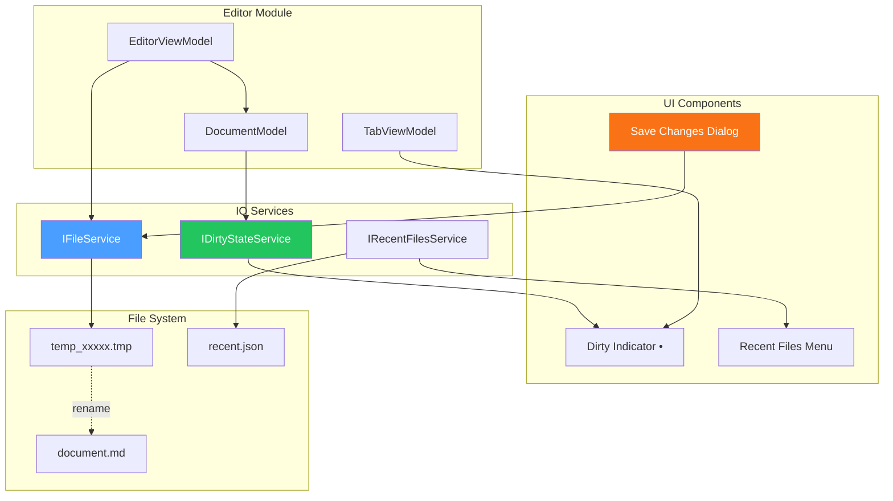
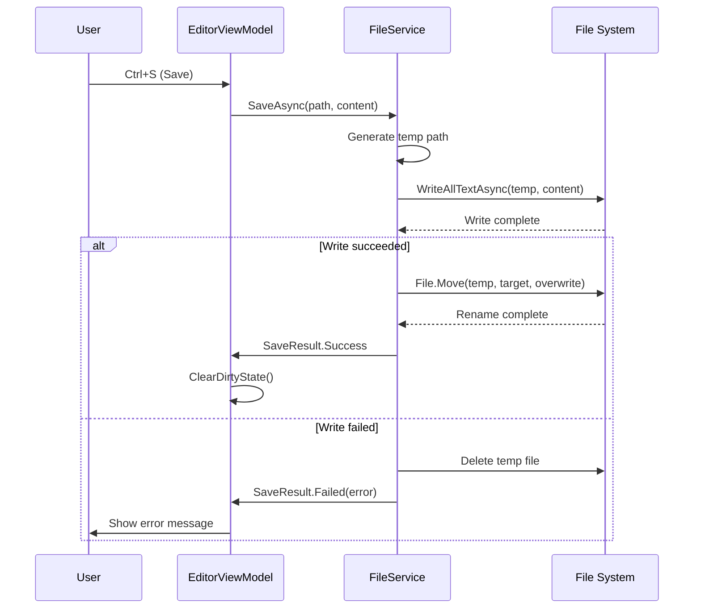

# LCS-DES-014: Design Specification Index — The Scribe (IO & Persistence)

## Document Control

| Field                | Value                                       |
| :------------------- | :------------------------------------------ |
| **Document ID**      | LCS-DES-014-INDEX                           |
| **Feature ID**       | INF-014                                     |
| **Feature Name**     | The Scribe (IO & Persistence)               |
| **Target Version**   | v0.1.4                                      |
| **Module Scope**     | Lexichord.Modules.Editor                    |
| **Swimlane**         | Infrastructure                              |
| **License Tier**     | Core                                        |
| **Feature Gate Key** | N/A                                         |
| **Status**           | Draft                                       |
| **Last Updated**     | 2026-01-27                                  |

---

## 1. Executive Summary

**v0.1.4** establishes the **file operations and persistence layer** that ensures user work is never lost. This release implements dirty state tracking, atomic saves, safe close workflows, and recent files history.

### 1.1 The Problem

Users need confidence that their work is safe:

- No indication when a document has unsaved changes
- Risk of data loss during save operations (power failure, crash)
- No warning when closing unsaved documents
- No way to quickly reopen recently edited files

### 1.2 The Solution

Implement a complete IO and persistence layer with:

- **Dirty State Tracking** — Visual indicator and state management for unsaved changes
- **Atomic Saves** — Write to temp file, then rename to prevent corruption
- **Safe Close Workflow** — Prompt to save, discard, or cancel on close
- **Recent Files History** — Persistent list of recently opened files

### 1.3 Business Value

| Value                   | Description                                           |
| :---------------------- | :---------------------------------------------------- |
| **Data Safety**         | Atomic saves prevent file corruption                  |
| **User Confidence**     | Clear dirty indicators show save status               |
| **Workflow Protection** | Save prompts prevent accidental data loss             |
| **Productivity**        | Recent files enable quick access to prior work        |
| **Professional UX**     | Standard file handling matches user expectations      |

---

## 2. Related Documents

### 2.1 Scope Breakdown Document

The detailed scope breakdown for v0.1.4, including all sub-parts, implementation checklists, and acceptance criteria:

| Document                            | Description                                  |
| :---------------------------------- | :------------------------------------------- |
| **[LCS-SBD-014](./LCS-SBD-014.md)** | Scope Breakdown — The Scribe                 |

### 2.2 Sub-Part Design Specifications

Each sub-part has its own detailed design specification following the LDS-01 template:

| Sub-Part | Document                              | Title                        | Description                              |
| :------- | :------------------------------------ | :--------------------------- | :--------------------------------------- |
| v0.1.4a  | **[LCS-DES-014a](./LCS-DES-014a.md)** | Dirty State Tracking         | Unsaved changes indicator and state      |
| v0.1.4b  | **[LCS-DES-014b](./LCS-DES-014b.md)** | Atomic Saves                 | Safe file writing with temp+rename       |
| v0.1.4c  | **[LCS-DES-014c](./LCS-DES-014c.md)** | Safe Close Workflow          | Save/discard/cancel dialog on close      |
| v0.1.4d  | **[LCS-DES-014d](./LCS-DES-014d.md)** | Recent Files History         | Persistent recent files list             |

---

## 3. Architecture Overview

### 3.1 Component Diagram

### 3.2 Atomic Save Sequence

---

## 4. Dependencies

### 4.1 Upstream Dependencies

| Dependency           | Source Version | Purpose                           |
| :------------------- | :------------- | :-------------------------------- |
| Editor Module        | v0.1.3         | Document editing integration      |
| Layout Engine        | v0.1.1         | Tab dirty indicators              |
| Configuration        | v0.0.3d        | Recent files storage path         |
| MediatR              | v0.0.7         | Document saved events             |

### 4.2 NuGet Packages

| Package                          | Version | Purpose                                 |
| :------------------------------- | :------ | :-------------------------------------- |
| `System.IO.Abstractions`         | 21.x    | Testable file system operations         |
| `Newtonsoft.Json`                | 13.x    | Recent files JSON persistence           |

### 4.3 Downstream Consumers (Future)

| Version | Feature             | Uses From v0.1.4                          |
| :------ | :------------------ | :---------------------------------------- |
| v0.1.5  | Auto-Save           | Builds on dirty tracking and atomic saves |
| v0.2.x  | Document Management | File operations for documents             |
| v0.5.x  | Cloud Sync          | Extends save workflow for cloud           |

---

## 5. License Gating Strategy

**N/A** — File operations are Core infrastructure required by all license tiers. No runtime gating is applied.

---

## 6. Key Interfaces Summary

| Interface                    | Defined In | Purpose                               |
| :--------------------------- | :--------- | :------------------------------------ |
| `IFileService`               | v0.1.4b    | Atomic file read/write operations     |
| `IDirtyStateService`         | v0.1.4a    | Document dirty state management       |
| `IRecentFilesService`        | v0.1.4d    | Recent files list management          |

| Record/DTO               | Defined In | Purpose                               |
| :----------------------- | :--------- | :------------------------------------ |
| `SaveResult`             | v0.1.4b    | Save operation result with status     |
| `RecentFileEntry`        | v0.1.4d    | Recent file metadata                  |
| `CloseAction`            | v0.1.4c    | User's close decision (save/discard)  |

---

## 7. Implementation Checklist Summary

| Sub-Part  | Key Deliverables                                             | Est. Hours   | Status |
| :-------- | :----------------------------------------------------------- | :----------- | :----- |
| v0.1.4a   | IDirtyStateService, dirty indicator UI, tab integration      | 4            | [ ]    |
| v0.1.4b   | IFileService, atomic write, error handling                   | 4            | [ ]    |
| v0.1.4c   | Close dialog, save/discard/cancel flow, app close handling   | 4            | [ ]    |
| v0.1.4d   | IRecentFilesService, JSON persistence, recent menu           | 4            | [ ]    |
| **Total** |                                                              | **16 hours** |        |

See [LCS-SBD-014](./LCS-SBD-014.md) Section 3 for the detailed implementation checklist.

---

## 8. Success Criteria Summary

| Category        | Criterion                                              | Target |
| :-------------- | :----------------------------------------------------- | :----- |
| **Dirty State** | Modified documents show dirty indicator                | Pass   |
| **Dirty State** | Saving clears dirty indicator                          | Pass   |
| **Atomic Save** | File not corrupted on simulated crash                  | Pass   |
| **Atomic Save** | Original preserved if write fails                      | Pass   |
| **Safe Close**  | Closing dirty doc shows save prompt                    | Pass   |
| **Safe Close**  | App close checks all dirty documents                   | Pass   |
| **Recent Files**| Opened files appear in recent list                     | Pass   |
| **Recent Files**| Recent list persists across restarts                   | Pass   |

See individual design specs for detailed acceptance criteria.

---

## 9. Test Coverage Summary

| Sub-Part | Unit Tests                                | Integration Tests                  |
| :------- | :---------------------------------------- | :--------------------------------- |
| v0.1.4a  | State transitions, event firing           | UI indicator updates               |
| v0.1.4b  | Atomic write logic, error scenarios       | Real file system operations        |
| v0.1.4c  | Dialog result handling                    | Full close workflow                |
| v0.1.4d  | List management, JSON serialization       | Persistence across restart         |

See individual design specs for detailed test scenarios.

---

## 10. What This Enables

| Version | Feature             | Depends On v0.1.4                             |
| :------ | :------------------ | :-------------------------------------------- |
| v0.1.5  | Auto-Save           | Dirty tracking triggers auto-save             |
| v0.2.x  | Document Management | File operations for document CRUD             |
| v0.3.x  | Style Module        | Save triggers style re-analysis               |
| v0.5.x  | Cloud Sync          | Extends atomic save for cloud backup          |

---

## 11. Risks & Mitigations

| Risk                                  | Impact | Mitigation                                        |
| :------------------------------------ | :----- | :------------------------------------------------ |
| Temp file left behind on crash        | Low    | Cleanup orphaned temp files on startup            |
| File locked by another process        | Medium | Retry with backoff, clear error message           |
| Recent files list grows unbounded     | Low    | Limit to 10-20 entries, LRU eviction              |
| Permission denied on save             | Medium | Check permissions early, suggest alternate path   |

---

## Document History

| Version | Date       | Author           | Changes                                                   |
| :------ | :--------- | :--------------- | :-------------------------------------------------------- |
| 1.0     | 2026-01-27 | System Architect | Created INDEX from legacy LCS-INF-014 during standardization |
