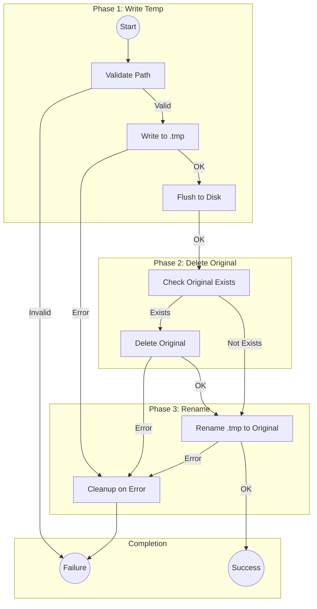
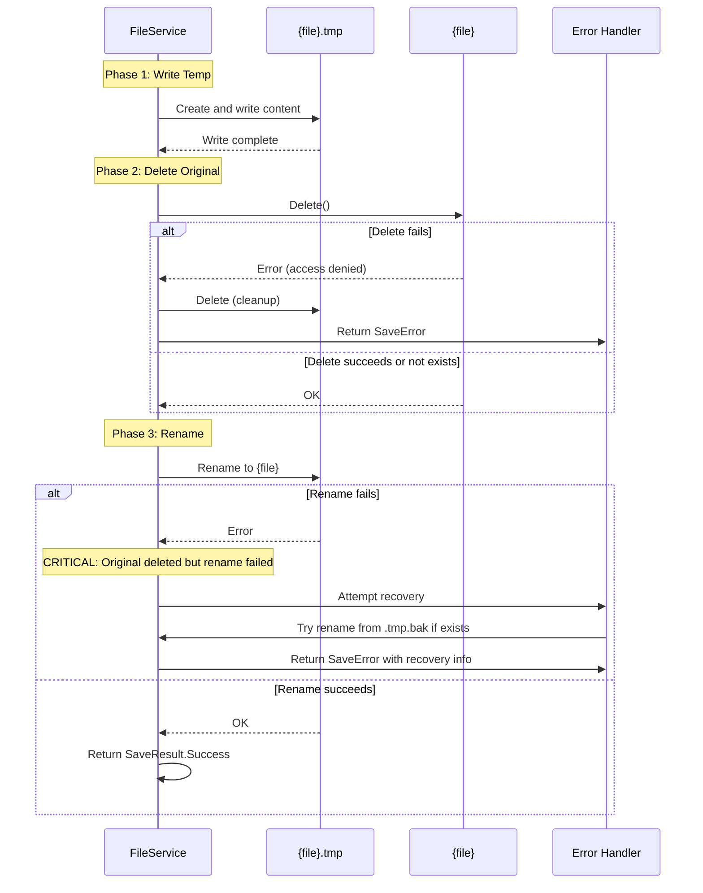
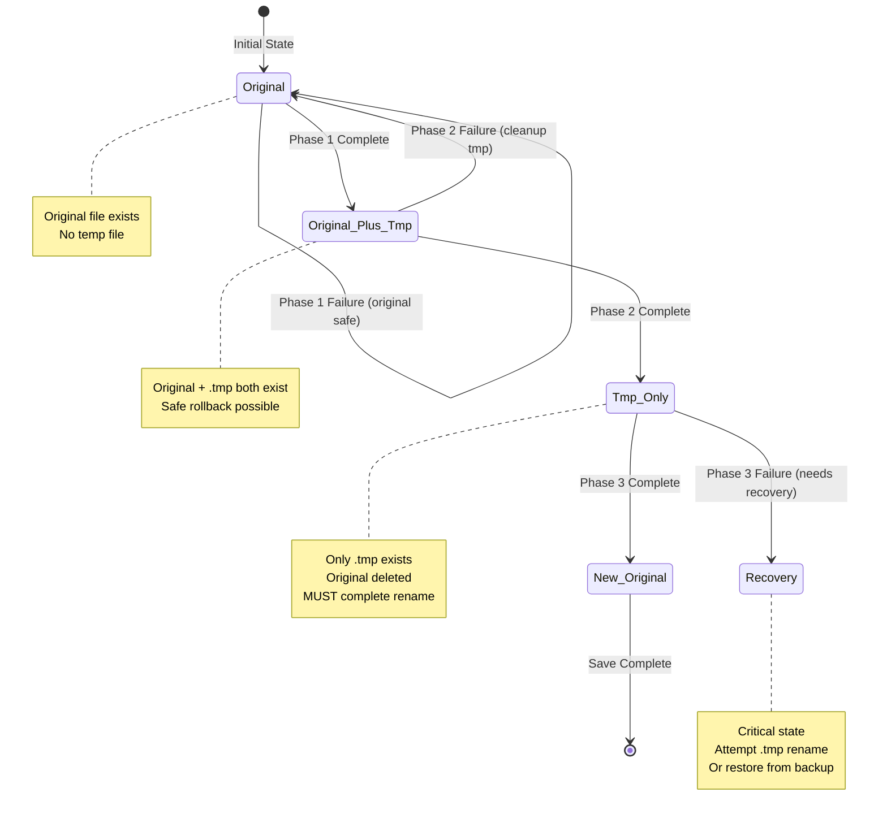

# LCS-INF-014b: Atomic Saves

## 1. Metadata & Categorization

| Field                | Value                                | Description                                  |
| :------------------- | :----------------------------------- | :------------------------------------------- |
| **Feature ID**       | `INF-014b`                           | Infrastructure - Atomic Saves                |
| **Feature Name**     | Atomic Saves                         | Corruption-proof file write strategy         |
| **Target Version**   | `v0.1.4b`                            | Second sub-part of v0.1.4                    |
| **Module Scope**     | `Lexichord.Modules.Editor`           | Editor module infrastructure                 |
| **Swimlane**         | `Infrastructure`                     | The Podium (Platform)                        |
| **License Tier**     | `Core`                               | Foundation (Required for all tiers)          |
| **Author**           | System Architect                     |                                              |
| **Status**           | **Draft**                            | Pending implementation                       |
| **Last Updated**     | 2026-01-26                           |                                              |

---

## 2. Executive Summary

### 2.1 The Requirement

File saves must be **atomic** to prevent data corruption:

- System crash during save can leave file in inconsistent state
- Power failure can cause partial writes
- Disk full conditions must not corrupt existing data
- Network file systems may have additional failure modes

A naive `File.WriteAllText()` can result in:

- Truncated files (partially written)
- Empty files (write started but failed)
- Corrupted files (interrupted mid-write)

### 2.2 The Proposed Solution

We **SHALL** implement atomic saves using a **Write-Temp-Delete-Rename** strategy:

1. **Write** content to `{filename}.tmp` temporary file
2. **Delete** the original `{filename}` (if exists)
3. **Rename** `{filename}.tmp` to `{filename}`

This strategy ensures:

- Original file preserved until new content fully written
- Rename is atomic on POSIX systems (single inode operation)
- On Windows, rename is atomic within same volume
- Failed operation leaves original file intact

---

## 3. Architecture & Modular Strategy

### 3.1 Atomic Save Phases



### 3.2 Error Recovery Sequence



### 3.3 File States During Save



---

## 4. Decision Tree: Save Operations

```text
START: "How should this save proceed?"
|
+-- Validate file path
|   +-- Path empty or null?
|   |   +-- YES -> Return InvalidPath error
|   +-- Path contains invalid characters?
|   |   +-- YES -> Return InvalidPath error
|   +-- Directory exists?
|   |   +-- NO -> Return DirectoryNotFound error
|   +-- Continue
|
+-- Phase 1: Write to temp file
|   +-- Can write to directory?
|   |   +-- NO -> Return AccessDenied error
|   +-- Write content to {file}.tmp
|   +-- Write succeeded?
|   |   +-- NO -> Cleanup and return IoError
|   +-- Flush to disk (fsync)
|   +-- Continue
|
+-- Phase 2: Delete original
|   +-- Original file exists?
|   |   +-- NO -> Skip to Phase 3
|   +-- Original read-only?
|   |   +-- YES -> Return ReadOnly error (cleanup tmp)
|   +-- Delete original
|   +-- Delete succeeded?
|   |   +-- NO -> Cleanup tmp and return IoError
|   +-- Continue
|
+-- Phase 3: Rename temp to original
|   +-- Rename {file}.tmp to {file}
|   +-- Rename succeeded?
|   |   +-- YES -> Return Success
|   |   +-- NO -> Attempt recovery
|   |       +-- Recovery succeeded?
|   |           +-- YES -> Return Success with warning
|   |           +-- NO -> Return IoError with recovery guidance
|
+-- END
```

---

## 5. Data Contracts

### 5.1 IFileService Interface

```csharp
namespace Lexichord.Abstractions.Contracts;

using System.Text;

/// <summary>
/// Service for file system operations with atomic save support.
/// </summary>
/// <remarks>
/// LOGIC: All write operations use atomic save strategy to prevent corruption.
///
/// Atomic Save Strategy (Write-Temp-Delete-Rename):
/// 1. Write content to {filename}.tmp
/// 2. Flush stream to ensure data on disk
/// 3. Delete original {filename} (if exists)
/// 4. Rename {filename}.tmp to {filename}
///
/// This guarantees:
/// - Original file preserved until new content fully written
/// - No partial writes visible to other processes
/// - On failure, original file remains intact
///
/// Platform Notes:
/// - POSIX: rename() is atomic within same filesystem
/// - Windows: MoveFileEx is atomic within same volume
/// - Network/cloud drives may have additional latency
/// </remarks>
public interface IFileService
{
    /// <summary>
    /// Saves content to the specified file path using atomic write.
    /// </summary>
    /// <param name="filePath">The target file path.</param>
    /// <param name="content">The content to save.</param>
    /// <param name="encoding">Text encoding (default: UTF-8 without BOM).</param>
    /// <param name="cancellationToken">Cancellation token.</param>
    /// <returns>Result indicating success or failure with details.</returns>
    /// <remarks>
    /// LOGIC: Uses three-phase atomic write strategy.
    /// On success, clears dirty state via published event.
    /// </remarks>
    Task<SaveResult> SaveAsync(
        string filePath,
        string content,
        Encoding? encoding = null,
        CancellationToken cancellationToken = default);

    /// <summary>
    /// Saves content to a new file path (Save As operation).
    /// </summary>
    /// <param name="filePath">The new target file path.</param>
    /// <param name="content">The content to save.</param>
    /// <param name="encoding">Text encoding (default: UTF-8 without BOM).</param>
    /// <param name="cancellationToken">Cancellation token.</param>
    /// <returns>Result indicating success or failure with details.</returns>
    /// <remarks>
    /// LOGIC: Same atomic strategy as SaveAsync.
    /// Does not require original file to exist.
    /// </remarks>
    Task<SaveResult> SaveAsAsync(
        string filePath,
        string content,
        Encoding? encoding = null,
        CancellationToken cancellationToken = default);

    /// <summary>
    /// Loads content from the specified file path.
    /// </summary>
    /// <param name="filePath">The source file path.</param>
    /// <param name="encoding">Text encoding (null = auto-detect).</param>
    /// <param name="cancellationToken">Cancellation token.</param>
    /// <returns>Result containing content or error details.</returns>
    Task<LoadResult> LoadAsync(
        string filePath,
        Encoding? encoding = null,
        CancellationToken cancellationToken = default);

    /// <summary>
    /// Checks if the specified file can be written to.
    /// </summary>
    /// <param name="filePath">The file path to check.</param>
    /// <returns>True if writable, false if read-only or inaccessible.</returns>
    /// <remarks>
    /// LOGIC: Checks:
    /// - Directory exists and writable
    /// - File not read-only (if exists)
    /// - File not locked by another process
    /// </remarks>
    bool CanWrite(string filePath);

    /// <summary>
    /// Checks if the specified file exists.
    /// </summary>
    bool Exists(string filePath);

    /// <summary>
    /// Gets file information without loading content.
    /// </summary>
    /// <param name="filePath">The file path.</param>
    /// <returns>File information or null if not exists.</returns>
    FileMetadata? GetMetadata(string filePath);
}

/// <summary>
/// Result of a save operation.
/// </summary>
/// <param name="Success">Whether the save succeeded.</param>
/// <param name="FilePath">The path where the file was saved.</param>
/// <param name="BytesWritten">Number of bytes written.</param>
/// <param name="Duration">Time taken for the save operation.</param>
/// <param name="Error">Error details if save failed.</param>
public record SaveResult(
    bool Success,
    string FilePath,
    long BytesWritten = 0,
    TimeSpan Duration = default,
    SaveError? Error = null
)
{
    /// <summary>
    /// Creates a successful save result.
    /// </summary>
    public static SaveResult Succeeded(string filePath, long bytes, TimeSpan duration)
        => new(true, filePath, bytes, duration);

    /// <summary>
    /// Creates a failed save result.
    /// </summary>
    public static SaveResult Failed(string filePath, SaveError error)
        => new(false, filePath, Error: error);
}

/// <summary>
/// Error details for a failed save operation.
/// </summary>
/// <param name="Code">Error code for programmatic handling.</param>
/// <param name="Message">Human-readable error message.</param>
/// <param name="Exception">The underlying exception, if any.</param>
/// <param name="RecoveryHint">Suggestion for recovery, if applicable.</param>
public record SaveError(
    SaveErrorCode Code,
    string Message,
    Exception? Exception = null,
    string? RecoveryHint = null
);

/// <summary>
/// Error codes for save operations.
/// </summary>
public enum SaveErrorCode
{
    /// <summary>Unknown error.</summary>
    Unknown,

    /// <summary>File is in use by another process.</summary>
    FileInUse,

    /// <summary>Access denied to file or directory.</summary>
    AccessDenied,

    /// <summary>File path exceeds maximum length.</summary>
    PathTooLong,

    /// <summary>Not enough disk space.</summary>
    DiskFull,

    /// <summary>File is marked read-only.</summary>
    ReadOnly,

    /// <summary>Target directory does not exist.</summary>
    DirectoryNotFound,

    /// <summary>File path contains invalid characters.</summary>
    InvalidPath,

    /// <summary>General I/O error during write.</summary>
    IoError,

    /// <summary>Save was cancelled by user.</summary>
    Cancelled,

    /// <summary>Failed during temp file write phase.</summary>
    TempWriteFailed,

    /// <summary>Failed during original delete phase.</summary>
    DeleteFailed,

    /// <summary>Failed during rename phase (critical).</summary>
    RenameFailed
}

/// <summary>
/// Metadata about a file.
/// </summary>
/// <param name="FilePath">Full path to the file.</param>
/// <param name="FileName">File name without path.</param>
/// <param name="SizeBytes">File size in bytes.</param>
/// <param name="IsReadOnly">Whether the file is read-only.</param>
/// <param name="LastModifiedUtc">Last modification time.</param>
/// <param name="CreatedUtc">Creation time.</param>
public record FileMetadata(
    string FilePath,
    string FileName,
    long SizeBytes,
    bool IsReadOnly,
    DateTime LastModifiedUtc,
    DateTime CreatedUtc
);
```

### 5.2 Domain Events

```csharp
namespace Lexichord.Abstractions.Events;

using MediatR;

/// <summary>
/// Event published when a document is saved.
/// </summary>
/// <param name="DocumentId">Unique identifier for the document.</param>
/// <param name="FilePath">The saved file path.</param>
/// <param name="BytesWritten">Number of bytes written.</param>
/// <param name="Duration">Time taken for the save.</param>
/// <param name="SavedAt">When the save completed.</param>
public record DocumentSavedEvent(
    string DocumentId,
    string FilePath,
    long BytesWritten,
    TimeSpan Duration,
    DateTimeOffset SavedAt
) : INotification;

/// <summary>
/// Event published when a save operation fails.
/// </summary>
/// <param name="DocumentId">Unique identifier for the document.</param>
/// <param name="FilePath">The attempted file path.</param>
/// <param name="ErrorCode">The error code.</param>
/// <param name="ErrorMessage">The error message.</param>
/// <param name="FailedAt">When the failure occurred.</param>
public record DocumentSaveFailedEvent(
    string DocumentId,
    string FilePath,
    SaveErrorCode ErrorCode,
    string ErrorMessage,
    DateTimeOffset FailedAt
) : INotification;
```

---

## 6. Implementation Logic

### 6.1 FileService Implementation

```csharp
using System.Diagnostics;
using System.Text;
using Lexichord.Abstractions.Contracts;
using Lexichord.Abstractions.Events;
using MediatR;
using Microsoft.Extensions.Logging;

namespace Lexichord.Modules.Editor.Services;

/// <summary>
/// File service with atomic save support.
/// </summary>
/// <remarks>
/// LOGIC: Implements three-phase atomic write:
/// 1. Write to temp file (.tmp extension)
/// 2. Delete original file
/// 3. Rename temp to original
///
/// Error Handling:
/// - Phase 1 failure: Clean up temp, original untouched
/// - Phase 2 failure: Clean up temp, original preserved
/// - Phase 3 failure: Critical - attempt recovery, report to user
/// </remarks>
public sealed class FileService(
    IMediator mediator,
    ILogger<FileService> logger) : IFileService
{
    private const string TempExtension = ".tmp";
    private const string BackupExtension = ".bak";
    private const int MaxFileSizeBytes = 100 * 1024 * 1024; // 100 MB
    private const int BufferSize = 65536; // 64 KB write buffer

    /// <inheritdoc/>
    public async Task<SaveResult> SaveAsync(
        string filePath,
        string content,
        Encoding? encoding = null,
        CancellationToken cancellationToken = default)
    {
        var stopwatch = Stopwatch.StartNew();
        encoding ??= new UTF8Encoding(encoderShouldEmitUTF8Identifier: false);

        logger.LogInformation("Starting atomic save: {FilePath}", filePath);

        try
        {
            // PHASE 0: Validation
            var validationError = ValidatePath(filePath);
            if (validationError is not null)
            {
                return SaveResult.Failed(filePath, validationError);
            }

            var tempPath = filePath + TempExtension;
            var bytes = encoding.GetBytes(content);

            // PHASE 1: Write to temp file
            logger.LogDebug("Phase 1: Writing {Bytes} bytes to temp file: {TempPath}", bytes.Length, tempPath);

            try
            {
                await WriteWithFlushAsync(tempPath, bytes, cancellationToken);
            }
            catch (Exception ex)
            {
                logger.LogError(ex, "Phase 1 failed: Could not write temp file");
                CleanupTempFile(tempPath);

                return SaveResult.Failed(filePath, CreateSaveError(ex, SaveErrorCode.TempWriteFailed,
                    "Failed to write temporary file. Your original file is preserved."));
            }

            // PHASE 2: Delete original (if exists)
            if (File.Exists(filePath))
            {
                logger.LogDebug("Phase 2: Deleting original file: {FilePath}", filePath);

                try
                {
                    // Check for read-only
                    var attributes = File.GetAttributes(filePath);
                    if ((attributes & FileAttributes.ReadOnly) != 0)
                    {
                        CleanupTempFile(tempPath);
                        return SaveResult.Failed(filePath, new SaveError(
                            SaveErrorCode.ReadOnly,
                            "File is read-only and cannot be overwritten.",
                            RecoveryHint: "Use Save As to save to a different location."));
                    }

                    File.Delete(filePath);
                }
                catch (Exception ex)
                {
                    logger.LogError(ex, "Phase 2 failed: Could not delete original file");
                    CleanupTempFile(tempPath);

                    return SaveResult.Failed(filePath, CreateSaveError(ex, SaveErrorCode.DeleteFailed,
                        "Could not replace original file. Your original file is preserved."));
                }
            }

            // PHASE 3: Rename temp to original
            logger.LogDebug("Phase 3: Renaming {TempPath} to {FilePath}", tempPath, filePath);

            try
            {
                File.Move(tempPath, filePath);
            }
            catch (Exception ex)
            {
                logger.LogError(ex, "Phase 3 CRITICAL: Rename failed");

                // CRITICAL: Original deleted but rename failed
                // Attempt recovery
                var recovered = await AttemptRecoveryAsync(tempPath, filePath, cancellationToken);

                if (!recovered)
                {
                    return SaveResult.Failed(filePath, new SaveError(
                        SaveErrorCode.RenameFailed,
                        "Critical error during save. Your content is preserved in a temporary file.",
                        ex,
                        $"Recovery: Your file may be at {tempPath}"));
                }

                logger.LogWarning("Recovery successful after rename failure");
            }

            stopwatch.Stop();

            logger.LogInformation(
                "Atomic save completed: {FilePath} ({Bytes} bytes in {Duration}ms)",
                filePath, bytes.Length, stopwatch.ElapsedMilliseconds);

            // Publish success event
            await mediator.Publish(new DocumentSavedEvent(
                DocumentId: filePath, // Or actual document ID
                FilePath: filePath,
                BytesWritten: bytes.Length,
                Duration: stopwatch.Elapsed,
                SavedAt: DateTimeOffset.UtcNow
            ), cancellationToken);

            return SaveResult.Succeeded(filePath, bytes.Length, stopwatch.Elapsed);
        }
        catch (OperationCanceledException)
        {
            logger.LogInformation("Save cancelled: {FilePath}", filePath);
            return SaveResult.Failed(filePath, new SaveError(
                SaveErrorCode.Cancelled,
                "Save operation was cancelled."));
        }
        catch (Exception ex)
        {
            logger.LogError(ex, "Unexpected error during save: {FilePath}", filePath);

            await mediator.Publish(new DocumentSaveFailedEvent(
                DocumentId: filePath,
                FilePath: filePath,
                ErrorCode: SaveErrorCode.Unknown,
                ErrorMessage: ex.Message,
                FailedAt: DateTimeOffset.UtcNow
            ), cancellationToken);

            return SaveResult.Failed(filePath, CreateSaveError(ex, SaveErrorCode.Unknown,
                "An unexpected error occurred during save."));
        }
    }

    /// <inheritdoc/>
    public Task<SaveResult> SaveAsAsync(
        string filePath,
        string content,
        Encoding? encoding = null,
        CancellationToken cancellationToken = default)
    {
        // SaveAs uses the same atomic strategy
        return SaveAsync(filePath, content, encoding, cancellationToken);
    }

    /// <inheritdoc/>
    public async Task<LoadResult> LoadAsync(
        string filePath,
        Encoding? encoding = null,
        CancellationToken cancellationToken = default)
    {
        logger.LogInformation("Loading file: {FilePath}", filePath);

        try
        {
            if (!File.Exists(filePath))
            {
                logger.LogWarning("File not found: {FilePath}", filePath);
                return new LoadResult(false, filePath, Error: new LoadError(
                    LoadErrorCode.FileNotFound,
                    $"File not found: {filePath}"));
            }

            var fileInfo = new FileInfo(filePath);
            if (fileInfo.Length > MaxFileSizeBytes)
            {
                logger.LogWarning("File too large: {FilePath} ({Size} bytes)", filePath, fileInfo.Length);
                return new LoadResult(false, filePath, Error: new LoadError(
                    LoadErrorCode.FileTooLarge,
                    $"File exceeds maximum size ({MaxFileSizeBytes / 1024 / 1024} MB)"));
            }

            // Auto-detect encoding if not specified
            encoding ??= await DetectEncodingAsync(filePath, cancellationToken);

            var content = await File.ReadAllTextAsync(filePath, encoding, cancellationToken);

            logger.LogInformation(
                "File loaded: {FilePath} ({Length} chars, {Encoding})",
                filePath, content.Length, encoding.EncodingName);

            return new LoadResult(true, filePath, content, encoding);
        }
        catch (UnauthorizedAccessException ex)
        {
            logger.LogError(ex, "Access denied: {FilePath}", filePath);
            return new LoadResult(false, filePath, Error: new LoadError(
                LoadErrorCode.AccessDenied,
                $"Access denied: {filePath}",
                ex));
        }
        catch (IOException ex)
        {
            logger.LogError(ex, "IO error loading: {FilePath}", filePath);
            return new LoadResult(false, filePath, Error: new LoadError(
                LoadErrorCode.IoError,
                ex.Message,
                ex));
        }
    }

    /// <inheritdoc/>
    public bool CanWrite(string filePath)
    {
        try
        {
            var directory = Path.GetDirectoryName(filePath);
            if (string.IsNullOrEmpty(directory))
                return false;

            if (!Directory.Exists(directory))
                return false;

            // Check if file exists and is read-only
            if (File.Exists(filePath))
            {
                var attributes = File.GetAttributes(filePath);
                if ((attributes & FileAttributes.ReadOnly) != 0)
                    return false;

                // Try to open for write to check lock
                try
                {
                    using var fs = new FileStream(filePath, FileMode.Open, FileAccess.Write, FileShare.None);
                    return true;
                }
                catch (IOException)
                {
                    return false; // File is locked
                }
            }

            // For new file, check directory writability
            var testFile = Path.Combine(directory, $".lexichord_write_test_{Guid.NewGuid()}");
            try
            {
                File.WriteAllText(testFile, "test");
                File.Delete(testFile);
                return true;
            }
            catch
            {
                return false;
            }
        }
        catch
        {
            return false;
        }
    }

    /// <inheritdoc/>
    public bool Exists(string filePath) => File.Exists(filePath);

    /// <inheritdoc/>
    public FileMetadata? GetMetadata(string filePath)
    {
        if (!File.Exists(filePath))
            return null;

        var info = new FileInfo(filePath);
        return new FileMetadata(
            info.FullName,
            info.Name,
            info.Length,
            info.IsReadOnly,
            info.LastWriteTimeUtc,
            info.CreationTimeUtc);
    }

    #region Private Methods

    private SaveError? ValidatePath(string filePath)
    {
        if (string.IsNullOrWhiteSpace(filePath))
        {
            return new SaveError(SaveErrorCode.InvalidPath, "File path cannot be empty.");
        }

        var invalidChars = Path.GetInvalidPathChars();
        if (filePath.IndexOfAny(invalidChars) >= 0)
        {
            return new SaveError(SaveErrorCode.InvalidPath, "File path contains invalid characters.");
        }

        try
        {
            var fullPath = Path.GetFullPath(filePath);
            var directory = Path.GetDirectoryName(fullPath);

            if (!string.IsNullOrEmpty(directory) && !Directory.Exists(directory))
            {
                return new SaveError(
                    SaveErrorCode.DirectoryNotFound,
                    $"Directory does not exist: {directory}",
                    RecoveryHint: "Create the directory or choose a different location.");
            }
        }
        catch (PathTooLongException)
        {
            return new SaveError(SaveErrorCode.PathTooLong, "File path exceeds maximum length.");
        }

        return null;
    }

    private async Task WriteWithFlushAsync(string path, byte[] content, CancellationToken cancellationToken)
    {
        // LOGIC: Write with explicit flush to ensure data is on disk
        // FileOptions.WriteThrough bypasses OS cache for durability
        await using var stream = new FileStream(
            path,
            FileMode.Create,
            FileAccess.Write,
            FileShare.None,
            BufferSize,
            FileOptions.WriteThrough | FileOptions.Asynchronous);

        await stream.WriteAsync(content, cancellationToken);
        await stream.FlushAsync(cancellationToken);
    }

    private void CleanupTempFile(string filePath)
    {
        var tempPath = filePath.EndsWith(TempExtension)
            ? filePath
            : filePath + TempExtension;

        try
        {
            if (File.Exists(tempPath))
            {
                File.Delete(tempPath);
                logger.LogDebug("Cleaned up temp file: {TempPath}", tempPath);
            }
        }
        catch (Exception ex)
        {
            logger.LogWarning(ex, "Failed to clean up temp file: {TempPath}", tempPath);
        }
    }

    private async Task<bool> AttemptRecoveryAsync(
        string tempPath,
        string targetPath,
        CancellationToken cancellationToken)
    {
        // LOGIC: If rename failed, try alternative approaches
        logger.LogWarning("Attempting recovery: {TempPath} -> {TargetPath}", tempPath, targetPath);

        // Approach 1: Simple retry
        for (int i = 0; i < 3; i++)
        {
            await Task.Delay(100 * (i + 1), cancellationToken);
            try
            {
                File.Move(tempPath, targetPath);
                return true;
            }
            catch
            {
                // Continue to next attempt
            }
        }

        // Approach 2: Copy and delete
        try
        {
            File.Copy(tempPath, targetPath, overwrite: true);
            File.Delete(tempPath);
            return true;
        }
        catch (Exception ex)
        {
            logger.LogError(ex, "Recovery failed");
            return false;
        }
    }

    private static async Task<Encoding> DetectEncodingAsync(string filePath, CancellationToken cancellationToken)
    {
        var buffer = new byte[4];
        await using var fs = File.OpenRead(filePath);
        var bytesRead = await fs.ReadAsync(buffer, cancellationToken);

        // Check for BOM (Byte Order Mark)
        if (bytesRead >= 3 && buffer[0] == 0xEF && buffer[1] == 0xBB && buffer[2] == 0xBF)
            return Encoding.UTF8;

        if (bytesRead >= 2 && buffer[0] == 0xFF && buffer[1] == 0xFE)
            return Encoding.Unicode; // UTF-16 LE

        if (bytesRead >= 2 && buffer[0] == 0xFE && buffer[1] == 0xFF)
            return Encoding.BigEndianUnicode; // UTF-16 BE

        // Default to UTF-8 without BOM
        return new UTF8Encoding(encoderShouldEmitUTF8Identifier: false);
    }

    private static SaveError CreateSaveError(Exception ex, SaveErrorCode defaultCode, string defaultMessage)
    {
        return ex switch
        {
            UnauthorizedAccessException => new SaveError(
                SaveErrorCode.AccessDenied,
                "Access denied. The file may be open in another application.",
                ex,
                "Close any other applications that may have the file open."),

            DirectoryNotFoundException => new SaveError(
                SaveErrorCode.DirectoryNotFound,
                "The directory does not exist.",
                ex,
                "Check the file path or create the directory."),

            PathTooLongException => new SaveError(
                SaveErrorCode.PathTooLong,
                "The file path is too long.",
                ex,
                "Choose a shorter file name or path."),

            IOException ioEx when ioEx.HResult == -2147024816 => new SaveError(
                SaveErrorCode.DiskFull,
                "Not enough disk space.",
                ex,
                "Free up disk space and try again."),

            IOException ioEx when ioEx.Message.Contains("being used") => new SaveError(
                SaveErrorCode.FileInUse,
                "The file is in use by another process.",
                ex,
                "Close the file in other applications and try again."),

            _ => new SaveError(defaultCode, defaultMessage, ex)
        };
    }

    #endregion
}
```

---

## 7. Use Cases & User Stories

### 7.1 User Stories

| ID | Role | Story | Acceptance Criteria |
|:---|:-----|:------|:--------------------|
| US-01 | Writer | As a writer, I want my saves to be reliable. | No data loss on save operations. |
| US-02 | Writer | As a writer, I want clear error messages on save failure. | Error message explains problem and suggests fix. |
| US-03 | Writer | As a writer, I want my original file preserved if save fails. | Original untouched on any save error. |
| US-04 | Developer | As a developer, I want detailed logging of save operations. | All three phases logged with timing. |

### 7.2 Use Cases

#### UC-01: Normal Save

**Preconditions:**
- Document has unsaved changes
- Target file exists and is writable

**Flow:**
1. User presses Ctrl+S
2. FileService.SaveAsync() called
3. Phase 1: Write to .tmp completes
4. Phase 2: Delete original completes
5. Phase 3: Rename completes
6. DocumentSavedEvent published
7. Dirty state cleared

**Postconditions:**
- File contains new content
- No .tmp file remains
- Success logged

---

#### UC-02: Save to Read-Only File

**Preconditions:**
- Document has unsaved changes
- Target file is marked read-only

**Flow:**
1. User presses Ctrl+S
2. FileService.SaveAsync() called
3. Phase 1: Write to .tmp completes
4. Phase 2: Check attributes detects read-only
5. Cleanup: .tmp deleted
6. SaveResult.Failed returned with ReadOnly error

**Postconditions:**
- Original file unchanged
- User sees error with "Use Save As" hint
- No .tmp file remains

---

#### UC-03: Disk Full During Save

**Preconditions:**
- Document has unsaved changes
- Disk is nearly full

**Flow:**
1. User presses Ctrl+S
2. FileService.SaveAsync() called
3. Phase 1: Write to .tmp fails (disk full)
4. Cleanup: Attempt to delete partial .tmp
5. SaveResult.Failed returned with DiskFull error

**Postconditions:**
- Original file unchanged
- User sees disk full error
- No or minimal .tmp file

---

## 8. Observability & Logging

### 8.1 Log Events

| Level | Context | Message Template |
|:------|:--------|:-----------------|
| Information | FileService | `Starting atomic save: {FilePath}` |
| Debug | FileService | `Phase 1: Writing {Bytes} bytes to temp file: {TempPath}` |
| Debug | FileService | `Phase 2: Deleting original file: {FilePath}` |
| Debug | FileService | `Phase 3: Renaming {TempPath} to {FilePath}` |
| Information | FileService | `Atomic save completed: {FilePath} ({Bytes} bytes in {Duration}ms)` |
| Error | FileService | `Phase 1 failed: Could not write temp file` |
| Error | FileService | `Phase 2 failed: Could not delete original file` |
| Error | FileService | `Phase 3 CRITICAL: Rename failed` |
| Warning | FileService | `Attempting recovery: {TempPath} -> {TargetPath}` |
| Warning | FileService | `Recovery successful after rename failure` |
| Debug | FileService | `Cleaned up temp file: {TempPath}` |

### 8.2 Metrics (Future)

| Metric | Type | Description |
|:-------|:-----|:------------|
| `file_save_duration_ms` | Histogram | Save operation duration |
| `file_save_bytes` | Histogram | Bytes written per save |
| `file_save_success_total` | Counter | Successful saves |
| `file_save_failure_total` | Counter | Failed saves by error code |
| `file_save_recovery_total` | Counter | Recovery attempts |

---

## 9. Unit Testing Requirements

### 9.1 FileService Save Tests

```csharp
[TestFixture]
[Category("Unit")]
public class FileServiceAtomicSaveTests
{
    private Mock<IMediator> _mockMediator = null!;
    private Mock<ILogger<FileService>> _mockLogger = null!;
    private FileService _sut = null!;
    private string _tempDir = null!;

    [SetUp]
    public void SetUp()
    {
        _mockMediator = new Mock<IMediator>();
        _mockLogger = new Mock<ILogger<FileService>>();
        _sut = new FileService(_mockMediator.Object, _mockLogger.Object);
        _tempDir = Path.Combine(Path.GetTempPath(), $"FileServiceTests_{Guid.NewGuid()}");
        Directory.CreateDirectory(_tempDir);
    }

    [TearDown]
    public void TearDown()
    {
        if (Directory.Exists(_tempDir))
            Directory.Delete(_tempDir, true);
    }

    [Test]
    public async Task SaveAsync_NewFile_CreatesFile()
    {
        // Arrange
        var filePath = Path.Combine(_tempDir, "new.md");
        var content = "Hello, World!";

        // Act
        var result = await _sut.SaveAsync(filePath, content);

        // Assert
        Assert.Multiple(() =>
        {
            Assert.That(result.Success, Is.True);
            Assert.That(File.Exists(filePath), Is.True);
            Assert.That(File.ReadAllText(filePath), Is.EqualTo(content));
            Assert.That(File.Exists(filePath + ".tmp"), Is.False, "Temp file should be cleaned up");
        });
    }

    [Test]
    public async Task SaveAsync_ExistingFile_OverwritesContent()
    {
        // Arrange
        var filePath = Path.Combine(_tempDir, "existing.md");
        await File.WriteAllTextAsync(filePath, "Original content");
        var newContent = "New content";

        // Act
        var result = await _sut.SaveAsync(filePath, newContent);

        // Assert
        Assert.Multiple(() =>
        {
            Assert.That(result.Success, Is.True);
            Assert.That(File.ReadAllText(filePath), Is.EqualTo(newContent));
        });
    }

    [Test]
    public async Task SaveAsync_ReturnsCorrectByteCount()
    {
        // Arrange
        var filePath = Path.Combine(_tempDir, "bytes.md");
        var content = "Test content with UTF-8: cafe";

        // Act
        var result = await _sut.SaveAsync(filePath, content);

        // Assert
        Assert.That(result.BytesWritten, Is.EqualTo(Encoding.UTF8.GetByteCount(content)));
    }

    [Test]
    public async Task SaveAsync_ReturnsDuration()
    {
        // Arrange
        var filePath = Path.Combine(_tempDir, "duration.md");

        // Act
        var result = await _sut.SaveAsync(filePath, "content");

        // Assert
        Assert.That(result.Duration, Is.GreaterThan(TimeSpan.Zero));
    }

    [Test]
    public async Task SaveAsync_EmptyPath_ReturnsInvalidPathError()
    {
        // Act
        var result = await _sut.SaveAsync("", "content");

        // Assert
        Assert.Multiple(() =>
        {
            Assert.That(result.Success, Is.False);
            Assert.That(result.Error?.Code, Is.EqualTo(SaveErrorCode.InvalidPath));
        });
    }

    [Test]
    public async Task SaveAsync_NonExistentDirectory_ReturnsDirectoryNotFoundError()
    {
        // Arrange
        var filePath = Path.Combine(_tempDir, "nonexistent", "dir", "file.md");

        // Act
        var result = await _sut.SaveAsync(filePath, "content");

        // Assert
        Assert.Multiple(() =>
        {
            Assert.That(result.Success, Is.False);
            Assert.That(result.Error?.Code, Is.EqualTo(SaveErrorCode.DirectoryNotFound));
        });
    }

    [Test]
    public async Task SaveAsync_PublishesDocumentSavedEvent()
    {
        // Arrange
        var filePath = Path.Combine(_tempDir, "event.md");

        // Act
        await _sut.SaveAsync(filePath, "content");

        // Assert
        _mockMediator.Verify(m => m.Publish(
            It.Is<DocumentSavedEvent>(e => e.FilePath == filePath),
            It.IsAny<CancellationToken>()), Times.Once);
    }

    [Test]
    public async Task SaveAsync_OnFailure_PublishesFailedEvent()
    {
        // Arrange - path that will fail
        var filePath = Path.Combine(_tempDir, "nonexistent", "fail.md");

        // Act
        await _sut.SaveAsync(filePath, "content");

        // Assert - Note: depending on error type, event may or may not be published
        // This test verifies error handling path
    }

    [Test]
    public async Task SaveAsync_Cancellation_ReturnsCancel()
    {
        // Arrange
        var filePath = Path.Combine(_tempDir, "cancel.md");
        var cts = new CancellationTokenSource();
        cts.Cancel();

        // Act
        var result = await _sut.SaveAsync(filePath, "content", cancellationToken: cts.Token);

        // Assert
        Assert.Multiple(() =>
        {
            Assert.That(result.Success, Is.False);
            Assert.That(result.Error?.Code, Is.EqualTo(SaveErrorCode.Cancelled));
        });
    }
}
```

### 9.2 Atomic Behavior Tests

```csharp
[TestFixture]
[Category("Unit")]
public class FileServiceAtomicBehaviorTests
{
    private Mock<IMediator> _mockMediator = null!;
    private Mock<ILogger<FileService>> _mockLogger = null!;
    private FileService _sut = null!;
    private string _tempDir = null!;

    [SetUp]
    public void SetUp()
    {
        _mockMediator = new Mock<IMediator>();
        _mockLogger = new Mock<ILogger<FileService>>();
        _sut = new FileService(_mockMediator.Object, _mockLogger.Object);
        _tempDir = Path.Combine(Path.GetTempPath(), $"AtomicTests_{Guid.NewGuid()}");
        Directory.CreateDirectory(_tempDir);
    }

    [TearDown]
    public void TearDown()
    {
        if (Directory.Exists(_tempDir))
            Directory.Delete(_tempDir, true);
    }

    [Test]
    public async Task SaveAsync_OriginalPreservedOnTempWriteFailure()
    {
        // This test requires simulating a write failure
        // In practice, we'd use a mock file system
        // For now, verify the principle with a read-only directory test

        // Skip this test in CI without proper file system mocking
        Assert.Pass("Requires file system mocking for proper testing");
    }

    [Test]
    public async Task SaveAsync_NoTempFileRemains_OnSuccess()
    {
        // Arrange
        var filePath = Path.Combine(_tempDir, "cleanup.md");

        // Act
        await _sut.SaveAsync(filePath, "content");

        // Assert
        Assert.That(File.Exists(filePath + ".tmp"), Is.False);
    }

    [Test]
    public async Task SaveAsync_LargeFile_Succeeds()
    {
        // Arrange
        var filePath = Path.Combine(_tempDir, "large.md");
        var content = new string('x', 1024 * 1024); // 1 MB

        // Act
        var result = await _sut.SaveAsync(filePath, content);

        // Assert
        Assert.Multiple(() =>
        {
            Assert.That(result.Success, Is.True);
            Assert.That(result.BytesWritten, Is.EqualTo(content.Length));
        });
    }

    [Test]
    public async Task SaveAsync_UTF8_PreservesSpecialCharacters()
    {
        // Arrange
        var filePath = Path.Combine(_tempDir, "utf8.md");
        var content = "Hello cafe World - Japanese: konnichiwa - Emoji: smile";

        // Act
        await _sut.SaveAsync(filePath, content);

        // Assert
        Assert.That(File.ReadAllText(filePath), Is.EqualTo(content));
    }
}
```

---

## 10. Security & Safety

### 10.1 Path Traversal Prevention

> [!WARNING]
> Always validate file paths to prevent path traversal attacks.

```csharp
// CORRECT: Validate path is within expected directory
var fullPath = Path.GetFullPath(filePath);
if (!fullPath.StartsWith(allowedDirectory))
{
    throw new SecurityException("Path traversal attempt detected");
}

// WRONG: Accept any path without validation
await File.WriteAllTextAsync(userPath, content);
```

### 10.2 Temp File Security

> [!NOTE]
> Temp files are created in the same directory as the target file to ensure
> atomic rename works (same filesystem/volume). This exposes temp files
> momentarily but ensures data integrity.

### 10.3 File Permissions

The service respects file system permissions:
- Read-only files cannot be overwritten
- Directory permissions are checked before write
- User-level permissions apply (no elevation)

---

## 11. Risks & Mitigations

| Risk | Impact | Mitigation |
|:-----|:-------|:-----------|
| Rename not atomic on network drives | High | Detect network paths; use copy+delete fallback |
| Disk full between phases | Medium | Check available space before write |
| Process crash between delete and rename | High | Recovery checks for .tmp files on startup |
| Concurrent saves to same file | Medium | File locking during operation |
| Large file write timeout | Low | Increase timeout for files > 10MB |
| Encoding detection failure | Low | Default to UTF-8; preserve original encoding |

---

## 12. Acceptance Criteria (QA)

| # | Category | Criterion |
|:--|:---------|:----------|
| 1 | **[Atomic]** | Save creates file atomically (no partial writes visible) |
| 2 | **[Atomic]** | Original file preserved if save fails at any phase |
| 3 | **[Atomic]** | No .tmp file remains after successful save |
| 4 | **[Error]** | Clear error message for access denied |
| 5 | **[Error]** | Clear error message for disk full |
| 6 | **[Error]** | Clear error message for read-only file |
| 7 | **[Error]** | Recovery hint provided where applicable |
| 8 | **[Event]** | DocumentSavedEvent published on success |
| 9 | **[Event]** | DocumentSaveFailedEvent published on failure |
| 10 | **[Logging]** | All phases logged with appropriate levels |
| 11 | **[Encoding]** | UTF-8 without BOM is default |
| 12 | **[Encoding]** | Special characters preserved correctly |

---

## 13. Verification Commands

```bash
# 1. Run atomic save tests
dotnet test --filter "FullyQualifiedName~AtomicSave"

# 2. Run atomic behavior tests
dotnet test --filter "FullyQualifiedName~AtomicBehavior"

# 3. Manual test: Normal save
# - Open a document
# - Make changes
# - Press Ctrl+S
# - Verify file saved correctly

# 4. Manual test: Read-only file
# - Create a file and mark read-only
# - Open in Lexichord
# - Try to save
# - Verify error message shown

# 5. Manual test: Large file
# - Create a 10MB document
# - Save it
# - Verify no timeout or corruption

# 6. Verify no leftover temp files
find /path/to/documents -name "*.tmp" -type f
```

---

## 14. Deliverable Checklist

| Step | Description | Status |
|:-----|:------------|:-------|
| 1 | Define IFileService interface in Abstractions | [ ] |
| 2 | Define SaveResult, SaveError, SaveErrorCode | [ ] |
| 3 | Define LoadResult, LoadError, LoadErrorCode | [ ] |
| 4 | Define FileMetadata record | [ ] |
| 5 | Implement FileService with atomic save | [ ] |
| 6 | Implement three-phase write strategy | [ ] |
| 7 | Implement error recovery logic | [ ] |
| 8 | Implement encoding detection | [ ] |
| 9 | Define DocumentSavedEvent | [ ] |
| 10 | Define DocumentSaveFailedEvent | [ ] |
| 11 | Unit tests for normal save | [ ] |
| 12 | Unit tests for error conditions | [ ] |
| 13 | Unit tests for atomic behavior | [ ] |
| 14 | Integration tests with file system | [ ] |
