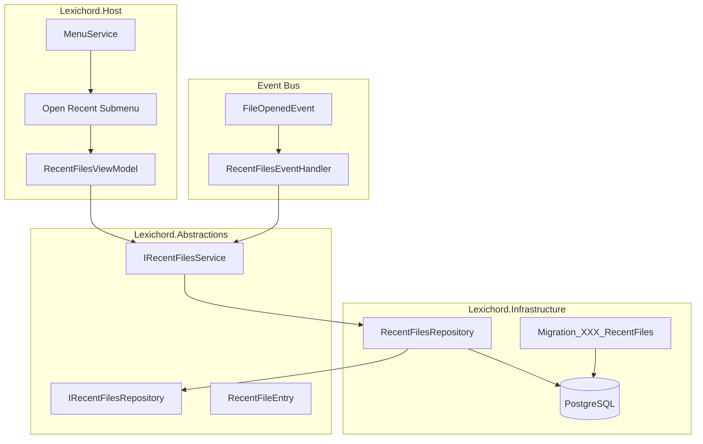
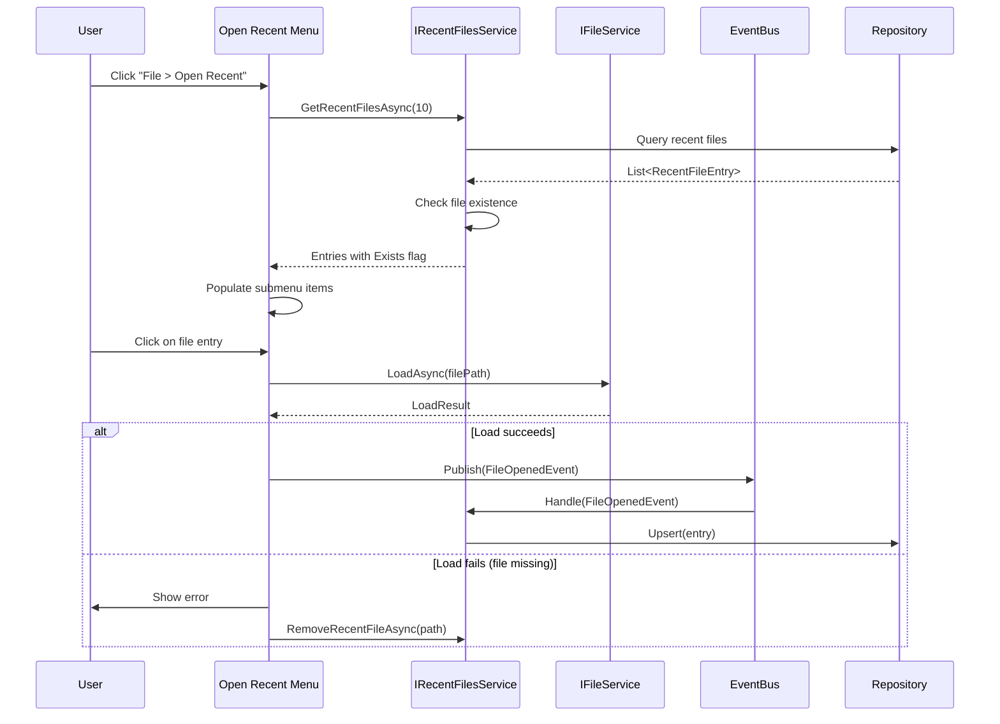
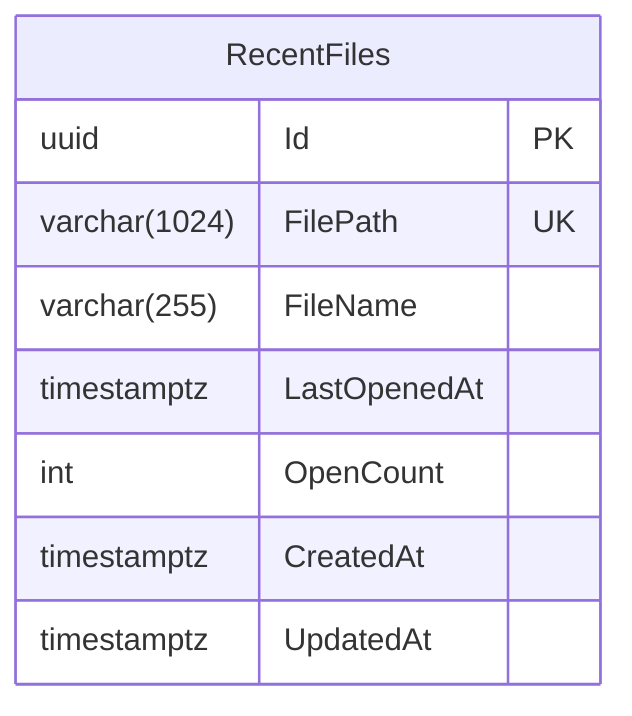

# LCS-INF-014d: Recent Files History

## 1. Metadata & Categorization

| Field                | Value                                         | Description                                  |
| :------------------- | :-------------------------------------------- | :------------------------------------------- |
| **Feature ID**       | `INF-014d`                                    | Infrastructure - Recent Files History        |
| **Feature Name**     | Recent Files History                          | MRU list with database persistence           |
| **Target Version**   | `v0.1.4d`                                     | Fourth sub-part of v0.1.4                    |
| **Module Scope**     | `Lexichord.Host`, `Lexichord.Modules.Editor`  | Host shell and editor integration            |
| **Swimlane**         | `Infrastructure`                              | The Podium (Platform)                        |
| **License Tier**     | `Core`                                        | Foundation (Required for all tiers)          |
| **Author**           | System Architect                              |                                              |
| **Status**           | **Draft**                                     | Pending implementation                       |
| **Last Updated**     | 2026-01-26                                    |                                              |

---

## 2. Executive Summary

### 2.1 The Requirement

Users need **quick access to recently opened files**:

- "File > Open Recent" menu is expected in all modern editors
- Quickly resume work on previous documents
- Track frequently edited files
- Handle renamed/deleted files gracefully

Without this feature:

- Users must navigate file system for every open operation
- No memory of previous editing sessions
- Reduced productivity for multi-document workflows

### 2.2 The Proposed Solution

We **SHALL** implement a Most Recently Used (MRU) list with:

1. **Database Persistence** — Store history in PostgreSQL via repository pattern
2. **IRecentFilesService** — Service interface for MRU management
3. **Dynamic Menu** — Populate "File > Open Recent" on startup
4. **Event Integration** — Auto-add files via FileOpenedEvent handler
5. **Graceful Handling** — Gray out or remove missing files

---

## 3. Architecture & Modular Strategy

### 3.1 Recent Files Architecture



### 3.2 File Open Flow



### 3.3 Database Schema



---

## 4. Decision Tree: Recent Files Operations

```text
START: "What recent files operation is needed?"
|
+-- Application Startup
|   +-- Load recent files from database
|   +-- Check each file exists
|   +-- Mark missing files (Exists = false)
|   +-- Populate Open Recent menu
|   +-- Optional: Prune missing files after N days
|
+-- File Opened
|   +-- Receive FileOpenedEvent
|   +-- File already in recent list?
|   |   +-- YES -> Update LastOpenedAt, increment OpenCount
|   |   +-- NO -> Insert new entry
|   +-- Trim list to max entries (default: 10)
|   +-- Raise RecentFilesChanged event
|
+-- User clicks Recent File
|   +-- File exists?
|   |   +-- YES -> Open file, update recent list
|   |   +-- NO -> Show "File not found" error
|   |       +-- Remove from list? (configurable)
|   |       +-- Or keep as placeholder?
|
+-- Clear History
|   +-- User clicks "Clear Recent Files"
|   +-- Confirm action?
|   +-- Delete all entries from database
|   +-- Clear menu
|
+-- Prune Invalid
|   +-- Check all entries for file existence
|   +-- Remove entries where file missing
|   +-- Raise RecentFilesChanged event
|
+-- END
```

---

## 5. Data Contracts

### 5.1 IRecentFilesService Interface

```csharp
namespace Lexichord.Abstractions.Contracts;

/// <summary>
/// Service for managing recently opened files history.
/// </summary>
/// <remarks>
/// LOGIC: Maintains a Most Recently Used (MRU) list of files persisted to database.
/// Automatically updated when files are opened via FileOpenedEvent handler.
/// Used to populate the "File > Open Recent" menu.
///
/// Behavior:
/// - Maximum entries configurable (default: 10)
/// - Entries sorted by LastOpenedAt descending
/// - Missing files tracked with Exists = false
/// - OpenCount tracks access frequency for potential "Most Used" feature
/// </remarks>
public interface IRecentFilesService
{
    /// <summary>
    /// Gets the list of recently opened files.
    /// </summary>
    /// <param name="maxCount">Maximum number of files to return (default: 10).</param>
    /// <param name="cancellationToken">Cancellation token.</param>
    /// <returns>List of recent files, ordered by last opened time descending.</returns>
    /// <remarks>
    /// LOGIC: Returns entries from database, checking file existence.
    /// Missing files have Exists = false but are still returned.
    /// UI should handle missing files appropriately (gray out, icon change).
    /// </remarks>
    Task<IReadOnlyList<RecentFileEntry>> GetRecentFilesAsync(
        int maxCount = 10,
        CancellationToken cancellationToken = default);

    /// <summary>
    /// Adds or updates a file in the recent files list.
    /// </summary>
    /// <param name="filePath">The file path to add.</param>
    /// <param name="cancellationToken">Cancellation token.</param>
    /// <remarks>
    /// LOGIC: Upsert operation:
    /// - If file exists in list: Update LastOpenedAt, increment OpenCount
    /// - If file doesn't exist: Insert new entry
    /// After insert, trims list to max entries by deleting oldest.
    /// </remarks>
    Task AddRecentFileAsync(
        string filePath,
        CancellationToken cancellationToken = default);

    /// <summary>
    /// Removes a file from the recent files list.
    /// </summary>
    /// <param name="filePath">The file path to remove.</param>
    /// <param name="cancellationToken">Cancellation token.</param>
    Task RemoveRecentFileAsync(
        string filePath,
        CancellationToken cancellationToken = default);

    /// <summary>
    /// Clears all recent files history.
    /// </summary>
    /// <param name="cancellationToken">Cancellation token.</param>
    Task ClearHistoryAsync(CancellationToken cancellationToken = default);

    /// <summary>
    /// Removes entries for files that no longer exist.
    /// </summary>
    /// <param name="cancellationToken">Cancellation token.</param>
    /// <returns>List of file paths that were removed.</returns>
    Task<IReadOnlyList<string>> PruneInvalidEntriesAsync(
        CancellationToken cancellationToken = default);

    /// <summary>
    /// Gets the maximum number of entries to keep.
    /// </summary>
    int MaxEntries { get; }

    /// <summary>
    /// Event raised when the recent files list changes.
    /// </summary>
    event EventHandler<RecentFilesChangedEventArgs>? RecentFilesChanged;
}

/// <summary>
/// Entry in the recent files list.
/// </summary>
/// <param name="FilePath">Full path to the file.</param>
/// <param name="FileName">Display name (file name only, without path).</param>
/// <param name="LastOpenedAt">When the file was last opened.</param>
/// <param name="OpenCount">Number of times the file has been opened.</param>
/// <param name="Exists">Whether the file currently exists on disk.</param>
public record RecentFileEntry(
    string FilePath,
    string FileName,
    DateTimeOffset LastOpenedAt,
    int OpenCount,
    bool Exists
)
{
    /// <summary>
    /// Gets the directory containing the file.
    /// </summary>
    public string Directory => Path.GetDirectoryName(FilePath) ?? string.Empty;

    /// <summary>
    /// Gets the file extension.
    /// </summary>
    public string Extension => Path.GetExtension(FilePath);

    /// <summary>
    /// Gets a display-friendly path (truncated if too long).
    /// </summary>
    /// <param name="maxLength">Maximum length for display.</param>
    public string GetDisplayPath(int maxLength = 50)
    {
        if (FilePath.Length <= maxLength)
            return FilePath;

        var fileName = Path.GetFileName(FilePath);
        var available = maxLength - fileName.Length - 4; // "...\\"

        if (available <= 0)
            return $"...\\{fileName}";

        var dir = Path.GetDirectoryName(FilePath) ?? "";
        if (dir.Length <= available)
            return FilePath;

        return $"...{dir[^available..]}\\{fileName}";
    }
}

/// <summary>
/// Event args for recent files list changes.
/// </summary>
public class RecentFilesChangedEventArgs : EventArgs
{
    /// <summary>
    /// Gets the type of change.
    /// </summary>
    public required RecentFilesChangeType ChangeType { get; init; }

    /// <summary>
    /// Gets the affected file path, if applicable.
    /// </summary>
    public string? FilePath { get; init; }

    /// <summary>
    /// Gets the updated entry, if applicable.
    /// </summary>
    public RecentFileEntry? Entry { get; init; }
}

/// <summary>
/// Types of recent files list changes.
/// </summary>
public enum RecentFilesChangeType
{
    /// <summary>A file was added to the list.</summary>
    Added,

    /// <summary>A file was removed from the list.</summary>
    Removed,

    /// <summary>An existing entry was updated.</summary>
    Updated,

    /// <summary>The entire list was cleared.</summary>
    Cleared,

    /// <summary>Invalid entries were pruned.</summary>
    Pruned
}
```

### 5.2 IRecentFilesRepository Interface

```csharp
namespace Lexichord.Abstractions.Contracts;

/// <summary>
/// Repository for recent files persistence.
/// </summary>
/// <remarks>
/// LOGIC: Low-level data access for RecentFiles table.
/// Used by IRecentFilesService for database operations.
/// Implementations use Dapper for data access.
/// </remarks>
public interface IRecentFilesRepository
{
    /// <summary>
    /// Gets recent files ordered by LastOpenedAt descending.
    /// </summary>
    /// <param name="maxCount">Maximum number of entries to return.</param>
    /// <param name="cancellationToken">Cancellation token.</param>
    /// <returns>Recent file entries.</returns>
    Task<IReadOnlyList<RecentFileEntry>> GetRecentFilesAsync(
        int maxCount,
        CancellationToken cancellationToken = default);

    /// <summary>
    /// Gets a specific entry by file path.
    /// </summary>
    /// <param name="filePath">The file path to look up.</param>
    /// <param name="cancellationToken">Cancellation token.</param>
    /// <returns>The entry, or null if not found.</returns>
    Task<RecentFileEntry?> GetByFilePathAsync(
        string filePath,
        CancellationToken cancellationToken = default);

    /// <summary>
    /// Inserts or updates a recent file entry.
    /// </summary>
    /// <param name="entry">The entry to upsert.</param>
    /// <param name="cancellationToken">Cancellation token.</param>
    Task UpsertAsync(
        RecentFileEntry entry,
        CancellationToken cancellationToken = default);

    /// <summary>
    /// Deletes an entry by file path.
    /// </summary>
    /// <param name="filePath">The file path to delete.</param>
    /// <param name="cancellationToken">Cancellation token.</param>
    /// <returns>True if entry was deleted, false if not found.</returns>
    Task<bool> DeleteAsync(
        string filePath,
        CancellationToken cancellationToken = default);

    /// <summary>
    /// Deletes all entries.
    /// </summary>
    /// <param name="cancellationToken">Cancellation token.</param>
    Task ClearAllAsync(CancellationToken cancellationToken = default);

    /// <summary>
    /// Deletes oldest entries beyond the specified count.
    /// </summary>
    /// <param name="keepCount">Number of entries to keep.</param>
    /// <param name="cancellationToken">Cancellation token.</param>
    /// <returns>Number of entries deleted.</returns>
    Task<int> TrimToCountAsync(
        int keepCount,
        CancellationToken cancellationToken = default);

    /// <summary>
    /// Gets the total count of entries.
    /// </summary>
    /// <param name="cancellationToken">Cancellation token.</param>
    /// <returns>Total entry count.</returns>
    Task<int> GetCountAsync(CancellationToken cancellationToken = default);
}
```

### 5.3 Database Entity

```csharp
namespace Lexichord.Abstractions.Entities;

using Dapper.Contrib.Extensions;

/// <summary>
/// Database entity for recent files.
/// </summary>
[Table("RecentFiles")]
public record RecentFileEntity
{
    /// <summary>
    /// Unique identifier.
    /// </summary>
    [Key]
    public Guid Id { get; init; } = Guid.NewGuid();

    /// <summary>
    /// Full file path (unique constraint).
    /// </summary>
    public required string FilePath { get; init; }

    /// <summary>
    /// File name without path.
    /// </summary>
    public required string FileName { get; init; }

    /// <summary>
    /// When the file was last opened.
    /// </summary>
    public DateTimeOffset LastOpenedAt { get; init; } = DateTimeOffset.UtcNow;

    /// <summary>
    /// Number of times the file has been opened.
    /// </summary>
    public int OpenCount { get; init; } = 1;

    /// <summary>
    /// When the entry was created.
    /// </summary>
    public DateTimeOffset CreatedAt { get; init; } = DateTimeOffset.UtcNow;

    /// <summary>
    /// When the entry was last updated.
    /// </summary>
    public DateTimeOffset UpdatedAt { get; init; } = DateTimeOffset.UtcNow;
}
```

### 5.4 Domain Events

```csharp
namespace Lexichord.Abstractions.Events;

using MediatR;

/// <summary>
/// Event published when a file is opened.
/// </summary>
/// <remarks>
/// LOGIC: Published by file open operations (menu, recent files, drag-drop).
/// RecentFilesService subscribes to add opened files to history.
/// </remarks>
/// <param name="FilePath">The opened file path.</param>
/// <param name="OpenedAt">When the file was opened.</param>
/// <param name="Source">How the file was opened.</param>
public record FileOpenedEvent(
    string FilePath,
    DateTimeOffset OpenedAt,
    FileOpenSource Source = FileOpenSource.Menu
) : INotification;

/// <summary>
/// Source of a file open operation.
/// </summary>
public enum FileOpenSource
{
    /// <summary>File > Open menu.</summary>
    Menu,

    /// <summary>File > Open Recent menu.</summary>
    RecentFiles,

    /// <summary>Drag and drop.</summary>
    DragDrop,

    /// <summary>Command line argument.</summary>
    CommandLine,

    /// <summary>Double-click in file explorer.</summary>
    ShellAssociation
}
```

---

## 6. Implementation Logic

### 6.1 Database Migration

```csharp
using FluentMigrator;

namespace Lexichord.Infrastructure.Migrations;

/// <summary>
/// Creates the RecentFiles table for MRU history.
/// </summary>
[Migration(20260126001, "Create RecentFiles table")]
public class Migration_20260126001_CreateRecentFiles : Migration
{
    public override void Up()
    {
        Create.Table("RecentFiles")
            .WithColumn("Id").AsGuid().PrimaryKey()
            .WithColumn("FilePath").AsString(1024).NotNullable().Unique()
            .WithColumn("FileName").AsString(255).NotNullable()
            .WithColumn("LastOpenedAt").AsDateTimeOffset().NotNullable()
            .WithColumn("OpenCount").AsInt32().NotNullable().WithDefaultValue(1)
            .WithColumn("CreatedAt").AsDateTimeOffset().NotNullable()
            .WithColumn("UpdatedAt").AsDateTimeOffset().NotNullable();

        Create.Index("IX_RecentFiles_LastOpenedAt")
            .OnTable("RecentFiles")
            .OnColumn("LastOpenedAt")
            .Descending();
    }

    public override void Down()
    {
        Delete.Index("IX_RecentFiles_LastOpenedAt").OnTable("RecentFiles");
        Delete.Table("RecentFiles");
    }
}
```

### 6.2 RecentFilesRepository Implementation

```csharp
using Dapper;
using Lexichord.Abstractions.Contracts;
using Lexichord.Abstractions.Entities;
using Microsoft.Extensions.Logging;

namespace Lexichord.Infrastructure.Repositories;

/// <summary>
/// Repository for recent files persistence using Dapper.
/// </summary>
public sealed class RecentFilesRepository(
    IDbConnectionFactory connectionFactory,
    ILogger<RecentFilesRepository> logger) : IRecentFilesRepository
{
    /// <inheritdoc/>
    public async Task<IReadOnlyList<RecentFileEntry>> GetRecentFilesAsync(
        int maxCount,
        CancellationToken cancellationToken = default)
    {
        await using var connection = await connectionFactory.CreateConnectionAsync(cancellationToken);

        var sql = @"
            SELECT ""FilePath"", ""FileName"", ""LastOpenedAt"", ""OpenCount""
            FROM ""RecentFiles""
            ORDER BY ""LastOpenedAt"" DESC
            LIMIT @MaxCount";

        var entities = await connection.QueryAsync<RecentFileEntity>(
            new CommandDefinition(sql, new { MaxCount = maxCount }, cancellationToken: cancellationToken));

        // Map to RecentFileEntry (Exists will be set by service layer)
        return entities.Select(e => new RecentFileEntry(
            e.FilePath,
            e.FileName,
            e.LastOpenedAt,
            e.OpenCount,
            Exists: true // Service layer will update this
        )).ToList();
    }

    /// <inheritdoc/>
    public async Task<RecentFileEntry?> GetByFilePathAsync(
        string filePath,
        CancellationToken cancellationToken = default)
    {
        await using var connection = await connectionFactory.CreateConnectionAsync(cancellationToken);

        var sql = @"
            SELECT ""FilePath"", ""FileName"", ""LastOpenedAt"", ""OpenCount""
            FROM ""RecentFiles""
            WHERE ""FilePath"" = @FilePath";

        var entity = await connection.QueryFirstOrDefaultAsync<RecentFileEntity>(
            new CommandDefinition(sql, new { FilePath = filePath }, cancellationToken: cancellationToken));

        if (entity is null)
            return null;

        return new RecentFileEntry(
            entity.FilePath,
            entity.FileName,
            entity.LastOpenedAt,
            entity.OpenCount,
            Exists: true);
    }

    /// <inheritdoc/>
    public async Task UpsertAsync(
        RecentFileEntry entry,
        CancellationToken cancellationToken = default)
    {
        await using var connection = await connectionFactory.CreateConnectionAsync(cancellationToken);

        var sql = @"
            INSERT INTO ""RecentFiles"" (""Id"", ""FilePath"", ""FileName"", ""LastOpenedAt"", ""OpenCount"", ""CreatedAt"", ""UpdatedAt"")
            VALUES (@Id, @FilePath, @FileName, @LastOpenedAt, @OpenCount, @CreatedAt, @UpdatedAt)
            ON CONFLICT (""FilePath"") DO UPDATE SET
                ""LastOpenedAt"" = @LastOpenedAt,
                ""OpenCount"" = ""RecentFiles"".""OpenCount"" + 1,
                ""UpdatedAt"" = @UpdatedAt";

        var now = DateTimeOffset.UtcNow;

        await connection.ExecuteAsync(new CommandDefinition(sql, new
        {
            Id = Guid.NewGuid(),
            entry.FilePath,
            entry.FileName,
            LastOpenedAt = now,
            entry.OpenCount,
            CreatedAt = now,
            UpdatedAt = now
        }, cancellationToken: cancellationToken));

        logger.LogDebug("Upserted recent file: {FilePath}", entry.FilePath);
    }

    /// <inheritdoc/>
    public async Task<bool> DeleteAsync(
        string filePath,
        CancellationToken cancellationToken = default)
    {
        await using var connection = await connectionFactory.CreateConnectionAsync(cancellationToken);

        var sql = @"DELETE FROM ""RecentFiles"" WHERE ""FilePath"" = @FilePath";

        var affected = await connection.ExecuteAsync(
            new CommandDefinition(sql, new { FilePath = filePath }, cancellationToken: cancellationToken));

        logger.LogDebug("Deleted recent file: {FilePath} (affected: {Count})", filePath, affected);

        return affected > 0;
    }

    /// <inheritdoc/>
    public async Task ClearAllAsync(CancellationToken cancellationToken = default)
    {
        await using var connection = await connectionFactory.CreateConnectionAsync(cancellationToken);

        var sql = @"DELETE FROM ""RecentFiles""";

        var affected = await connection.ExecuteAsync(
            new CommandDefinition(sql, cancellationToken: cancellationToken));

        logger.LogInformation("Cleared all recent files ({Count} entries)", affected);
    }

    /// <inheritdoc/>
    public async Task<int> TrimToCountAsync(
        int keepCount,
        CancellationToken cancellationToken = default)
    {
        await using var connection = await connectionFactory.CreateConnectionAsync(cancellationToken);

        // Delete all entries except the most recent N
        var sql = @"
            DELETE FROM ""RecentFiles""
            WHERE ""Id"" NOT IN (
                SELECT ""Id"" FROM ""RecentFiles""
                ORDER BY ""LastOpenedAt"" DESC
                LIMIT @KeepCount
            )";

        var affected = await connection.ExecuteAsync(
            new CommandDefinition(sql, new { KeepCount = keepCount }, cancellationToken: cancellationToken));

        if (affected > 0)
        {
            logger.LogDebug("Trimmed {Count} old recent file entries", affected);
        }

        return affected;
    }

    /// <inheritdoc/>
    public async Task<int> GetCountAsync(CancellationToken cancellationToken = default)
    {
        await using var connection = await connectionFactory.CreateConnectionAsync(cancellationToken);

        var sql = @"SELECT COUNT(*) FROM ""RecentFiles""";

        return await connection.ExecuteScalarAsync<int>(
            new CommandDefinition(sql, cancellationToken: cancellationToken));
    }
}
```

### 6.3 RecentFilesService Implementation

```csharp
using Lexichord.Abstractions.Contracts;
using Lexichord.Abstractions.Events;
using MediatR;
using Microsoft.Extensions.Logging;
using Microsoft.Extensions.Options;

namespace Lexichord.Host.Services;

/// <summary>
/// Service for managing recently opened files history.
/// </summary>
public sealed class RecentFilesService(
    IRecentFilesRepository repository,
    IOptions<RecentFilesOptions> options,
    ILogger<RecentFilesService> logger) : IRecentFilesService, INotificationHandler<FileOpenedEvent>
{
    private readonly RecentFilesOptions _options = options.Value;

    /// <inheritdoc/>
    public event EventHandler<RecentFilesChangedEventArgs>? RecentFilesChanged;

    /// <inheritdoc/>
    public int MaxEntries => _options.MaxEntries;

    /// <inheritdoc/>
    public async Task<IReadOnlyList<RecentFileEntry>> GetRecentFilesAsync(
        int maxCount = 10,
        CancellationToken cancellationToken = default)
    {
        logger.LogDebug("Getting recent files (max: {MaxCount})", maxCount);

        var entries = await repository.GetRecentFilesAsync(
            Math.Min(maxCount, _options.MaxEntries),
            cancellationToken);

        // Check file existence for each entry
        var results = entries.Select(e => e with
        {
            Exists = File.Exists(e.FilePath)
        }).ToList();

        var existingCount = results.Count(r => r.Exists);
        logger.LogDebug(
            "Retrieved {Total} recent files ({Existing} exist)",
            results.Count, existingCount);

        return results;
    }

    /// <inheritdoc/>
    public async Task AddRecentFileAsync(
        string filePath,
        CancellationToken cancellationToken = default)
    {
        logger.LogInformation("Adding to recent files: {FilePath}", filePath);

        var fileName = Path.GetFileName(filePath);
        var entry = new RecentFileEntry(
            filePath,
            fileName,
            DateTimeOffset.UtcNow,
            OpenCount: 1,
            Exists: true);

        await repository.UpsertAsync(entry, cancellationToken);

        // Trim to max entries
        await repository.TrimToCountAsync(_options.MaxEntries, cancellationToken);

        RaiseChanged(RecentFilesChangeType.Added, filePath, entry);
    }

    /// <inheritdoc/>
    public async Task RemoveRecentFileAsync(
        string filePath,
        CancellationToken cancellationToken = default)
    {
        logger.LogInformation("Removing from recent files: {FilePath}", filePath);

        var deleted = await repository.DeleteAsync(filePath, cancellationToken);

        if (deleted)
        {
            RaiseChanged(RecentFilesChangeType.Removed, filePath);
        }
    }

    /// <inheritdoc/>
    public async Task ClearHistoryAsync(CancellationToken cancellationToken = default)
    {
        logger.LogInformation("Clearing recent files history");

        await repository.ClearAllAsync(cancellationToken);

        RaiseChanged(RecentFilesChangeType.Cleared);
    }

    /// <inheritdoc/>
    public async Task<IReadOnlyList<string>> PruneInvalidEntriesAsync(
        CancellationToken cancellationToken = default)
    {
        logger.LogInformation("Pruning invalid recent files entries");

        var entries = await repository.GetRecentFilesAsync(100, cancellationToken);
        var removed = new List<string>();

        foreach (var entry in entries)
        {
            if (!File.Exists(entry.FilePath))
            {
                await repository.DeleteAsync(entry.FilePath, cancellationToken);
                removed.Add(entry.FilePath);
                logger.LogDebug("Pruned missing file: {FilePath}", entry.FilePath);
            }
        }

        if (removed.Count > 0)
        {
            RaiseChanged(RecentFilesChangeType.Pruned);
            logger.LogInformation("Pruned {Count} invalid entries", removed.Count);
        }

        return removed;
    }

    /// <summary>
    /// Handles FileOpenedEvent to automatically track opened files.
    /// </summary>
    public async Task Handle(FileOpenedEvent notification, CancellationToken cancellationToken)
    {
        logger.LogDebug(
            "Handling FileOpenedEvent: {FilePath} (source: {Source})",
            notification.FilePath, notification.Source);

        await AddRecentFileAsync(notification.FilePath, cancellationToken);
    }

    private void RaiseChanged(
        RecentFilesChangeType changeType,
        string? filePath = null,
        RecentFileEntry? entry = null)
    {
        RecentFilesChanged?.Invoke(this, new RecentFilesChangedEventArgs
        {
            ChangeType = changeType,
            FilePath = filePath,
            Entry = entry
        });
    }
}

/// <summary>
/// Configuration options for recent files.
/// </summary>
public record RecentFilesOptions
{
    /// <summary>
    /// Maximum number of recent files to keep (default: 10).
    /// </summary>
    public int MaxEntries { get; init; } = 10;

    /// <summary>
    /// Whether to automatically prune missing files on startup.
    /// </summary>
    public bool AutoPruneOnStartup { get; init; } = false;

    /// <summary>
    /// Whether to show file paths in the menu.
    /// </summary>
    public bool ShowFilePaths { get; init; } = true;
}
```

### 6.4 Menu Integration

```csharp
namespace Lexichord.Host.ViewModels;

using System.Collections.ObjectModel;
using CommunityToolkit.Mvvm.ComponentModel;
using CommunityToolkit.Mvvm.Input;
using Lexichord.Abstractions.Contracts;
using Lexichord.Abstractions.Events;
using MediatR;

/// <summary>
/// View model for the Open Recent submenu.
/// </summary>
public partial class OpenRecentMenuViewModel : ViewModelBase
{
    private readonly IRecentFilesService _recentFilesService;
    private readonly IFileService _fileService;
    private readonly IMediator _mediator;

    public OpenRecentMenuViewModel(
        IRecentFilesService recentFilesService,
        IFileService fileService,
        IMediator mediator)
    {
        _recentFilesService = recentFilesService;
        _fileService = fileService;
        _mediator = mediator;

        _recentFilesService.RecentFilesChanged += OnRecentFilesChanged;

        // Load initial data
        _ = RefreshAsync();
    }

    /// <summary>
    /// Gets the recent files for display.
    /// </summary>
    [ObservableProperty]
    private ObservableCollection<RecentFileMenuItemViewModel> _recentFiles = [];

    /// <summary>
    /// Gets whether the menu should be enabled.
    /// </summary>
    public bool HasRecentFiles => RecentFiles.Count > 0;

    /// <summary>
    /// Refreshes the recent files list.
    /// </summary>
    public async Task RefreshAsync()
    {
        var entries = await _recentFilesService.GetRecentFilesAsync();

        RecentFiles.Clear();

        foreach (var entry in entries)
        {
            RecentFiles.Add(new RecentFileMenuItemViewModel(entry, OpenFileCommand));
        }

        OnPropertyChanged(nameof(HasRecentFiles));
    }

    /// <summary>
    /// Command to open a recent file.
    /// </summary>
    [RelayCommand]
    private async Task OpenFileAsync(RecentFileEntry entry)
    {
        if (!entry.Exists)
        {
            // File doesn't exist - show error and optionally remove
            // TODO: Show dialog "File not found. Remove from list?"
            await _recentFilesService.RemoveRecentFileAsync(entry.FilePath);
            return;
        }

        var result = await _fileService.LoadAsync(entry.FilePath);

        if (result.Success)
        {
            // Publish event for document manager to handle
            await _mediator.Publish(new FileOpenedEvent(
                entry.FilePath,
                DateTimeOffset.UtcNow,
                FileOpenSource.RecentFiles));
        }
        else
        {
            // Show error
            // TODO: Error dialog
        }
    }

    /// <summary>
    /// Command to clear recent files history.
    /// </summary>
    [RelayCommand]
    private async Task ClearHistoryAsync()
    {
        await _recentFilesService.ClearHistoryAsync();
    }

    private void OnRecentFilesChanged(object? sender, RecentFilesChangedEventArgs e)
    {
        // Refresh the menu when list changes
        _ = RefreshAsync();
    }
}

/// <summary>
/// View model for a single recent file menu item.
/// </summary>
public partial class RecentFileMenuItemViewModel : ViewModelBase
{
    public RecentFileMenuItemViewModel(
        RecentFileEntry entry,
        IRelayCommand<RecentFileEntry> openCommand)
    {
        Entry = entry;
        OpenCommand = openCommand;
    }

    /// <summary>
    /// Gets the recent file entry.
    /// </summary>
    public RecentFileEntry Entry { get; }

    /// <summary>
    /// Gets the display text (file name).
    /// </summary>
    public string DisplayText => Entry.FileName;

    /// <summary>
    /// Gets the tooltip (full path).
    /// </summary>
    public string Tooltip => Entry.FilePath;

    /// <summary>
    /// Gets whether the file exists.
    /// </summary>
    public bool Exists => Entry.Exists;

    /// <summary>
    /// Gets the command to open this file.
    /// </summary>
    public IRelayCommand<RecentFileEntry> OpenCommand { get; }
}
```

---

## 7. Use Cases & User Stories

### 7.1 User Stories

| ID | Role | Story | Acceptance Criteria |
|:---|:-----|:------|:--------------------|
| US-01 | Writer | As a writer, I want to see my recent files in a menu. | File > Open Recent shows last 10 files. |
| US-02 | Writer | As a writer, I want to open a recent file with one click. | Clicking menu item opens the file. |
| US-03 | Writer | As a writer, I want to see if a recent file is missing. | Missing files shown grayed out. |
| US-04 | Writer | As a writer, I want to clear my recent files history. | "Clear History" option available. |

### 7.2 Use Cases

#### UC-01: View Recent Files

**Preconditions:**
- User has previously opened files
- Files exist in recent files database

**Flow:**
1. User clicks File menu
2. User hovers over "Open Recent"
3. Submenu appears with recent files
4. Each entry shows file name and path
5. Missing files appear grayed

**Postconditions:**
- Recent files visible in menu
- Menu sorted by last opened date

---

#### UC-02: Open Recent File

**Preconditions:**
- Recent file exists on disk

**Flow:**
1. User clicks File > Open Recent
2. User clicks on a file entry
3. FileService.LoadAsync() called
4. File opens in editor
5. FileOpenedEvent published
6. Recent list updated (file moves to top)

**Postconditions:**
- File open in editor
- Entry at top of recent list

---

## 8. Observability & Logging

### 8.1 Log Events

| Level | Context | Message Template |
|:------|:--------|:-----------------|
| Debug | RecentFilesService | `Getting recent files (max: {MaxCount})` |
| Debug | RecentFilesService | `Retrieved {Total} recent files ({Existing} exist)` |
| Information | RecentFilesService | `Adding to recent files: {FilePath}` |
| Information | RecentFilesService | `Removing from recent files: {FilePath}` |
| Information | RecentFilesService | `Clearing recent files history` |
| Information | RecentFilesService | `Pruning invalid recent files entries` |
| Debug | RecentFilesService | `Pruned missing file: {FilePath}` |
| Information | RecentFilesService | `Pruned {Count} invalid entries` |
| Debug | RecentFilesRepository | `Upserted recent file: {FilePath}` |
| Debug | RecentFilesRepository | `Deleted recent file: {FilePath}` |
| Information | RecentFilesRepository | `Cleared all recent files ({Count} entries)` |
| Debug | RecentFilesRepository | `Trimmed {Count} old recent file entries` |

---

## 9. Unit Testing Requirements

### 9.1 RecentFilesService Tests

```csharp
[TestFixture]
[Category("Unit")]
public class RecentFilesServiceTests
{
    private Mock<IRecentFilesRepository> _mockRepo = null!;
    private Mock<ILogger<RecentFilesService>> _mockLogger = null!;
    private RecentFilesService _sut = null!;
    private string _tempDir = null!;

    [SetUp]
    public void SetUp()
    {
        _mockRepo = new Mock<IRecentFilesRepository>();
        _mockLogger = new Mock<ILogger<RecentFilesService>>();

        var options = Options.Create(new RecentFilesOptions { MaxEntries = 10 });

        _sut = new RecentFilesService(
            _mockRepo.Object,
            options,
            _mockLogger.Object);

        _tempDir = Path.Combine(Path.GetTempPath(), Guid.NewGuid().ToString());
        Directory.CreateDirectory(_tempDir);
    }

    [TearDown]
    public void TearDown()
    {
        if (Directory.Exists(_tempDir))
            Directory.Delete(_tempDir, true);
    }

    [Test]
    public async Task GetRecentFilesAsync_ReturnsFromRepository()
    {
        // Arrange
        var filePath = Path.Combine(_tempDir, "test.md");
        File.WriteAllText(filePath, "test");

        var entries = new List<RecentFileEntry>
        {
            new(filePath, "test.md", DateTimeOffset.UtcNow, 1, true)
        };

        _mockRepo.Setup(r => r.GetRecentFilesAsync(10, It.IsAny<CancellationToken>()))
            .ReturnsAsync(entries);

        // Act
        var result = await _sut.GetRecentFilesAsync();

        // Assert
        Assert.That(result, Has.Count.EqualTo(1));
        Assert.That(result[0].Exists, Is.True);
    }

    [Test]
    public async Task GetRecentFilesAsync_MarksNonExistentFiles()
    {
        // Arrange
        var entries = new List<RecentFileEntry>
        {
            new("/nonexistent/file.md", "file.md", DateTimeOffset.UtcNow, 1, true)
        };

        _mockRepo.Setup(r => r.GetRecentFilesAsync(10, It.IsAny<CancellationToken>()))
            .ReturnsAsync(entries);

        // Act
        var result = await _sut.GetRecentFilesAsync();

        // Assert
        Assert.That(result[0].Exists, Is.False);
    }

    [Test]
    public async Task AddRecentFileAsync_CallsUpsert()
    {
        // Arrange
        var filePath = Path.Combine(_tempDir, "test.md");

        // Act
        await _sut.AddRecentFileAsync(filePath);

        // Assert
        _mockRepo.Verify(r => r.UpsertAsync(
            It.Is<RecentFileEntry>(e => e.FilePath == filePath),
            It.IsAny<CancellationToken>()), Times.Once);
    }

    [Test]
    public async Task AddRecentFileAsync_TrimsToMaxEntries()
    {
        // Arrange
        var filePath = Path.Combine(_tempDir, "test.md");

        // Act
        await _sut.AddRecentFileAsync(filePath);

        // Assert
        _mockRepo.Verify(r => r.TrimToCountAsync(10, It.IsAny<CancellationToken>()), Times.Once);
    }

    [Test]
    public async Task RemoveRecentFileAsync_CallsDelete()
    {
        // Arrange
        var filePath = "/test/file.md";
        _mockRepo.Setup(r => r.DeleteAsync(filePath, It.IsAny<CancellationToken>()))
            .ReturnsAsync(true);

        // Act
        await _sut.RemoveRecentFileAsync(filePath);

        // Assert
        _mockRepo.Verify(r => r.DeleteAsync(filePath, It.IsAny<CancellationToken>()), Times.Once);
    }

    [Test]
    public async Task ClearHistoryAsync_CallsClearAll()
    {
        // Act
        await _sut.ClearHistoryAsync();

        // Assert
        _mockRepo.Verify(r => r.ClearAllAsync(It.IsAny<CancellationToken>()), Times.Once);
    }

    [Test]
    public async Task AddRecentFileAsync_RaisesEvent()
    {
        // Arrange
        var filePath = Path.Combine(_tempDir, "test.md");
        var eventRaised = false;
        _sut.RecentFilesChanged += (s, e) => eventRaised = true;

        // Act
        await _sut.AddRecentFileAsync(filePath);

        // Assert
        Assert.That(eventRaised, Is.True);
    }

    [Test]
    public async Task Handle_FileOpenedEvent_AddsToRecent()
    {
        // Arrange
        var notification = new FileOpenedEvent(
            Path.Combine(_tempDir, "opened.md"),
            DateTimeOffset.UtcNow);

        // Act
        await _sut.Handle(notification, CancellationToken.None);

        // Assert
        _mockRepo.Verify(r => r.UpsertAsync(
            It.Is<RecentFileEntry>(e => e.FilePath == notification.FilePath),
            It.IsAny<CancellationToken>()), Times.Once);
    }
}
```

### 9.2 RecentFilesRepository Tests

```csharp
[TestFixture]
[Category("Integration")]
public class RecentFilesRepositoryTests
{
    private IDbConnectionFactory _connectionFactory = null!;
    private RecentFilesRepository _sut = null!;
    private Mock<ILogger<RecentFilesRepository>> _mockLogger = null!;

    [SetUp]
    public async Task SetUp()
    {
        var options = Options.Create(new DatabaseOptions
        {
            ConnectionString = GetTestConnectionString()
        });

        var factoryLogger = new Mock<ILogger<NpgsqlConnectionFactory>>();
        _connectionFactory = new NpgsqlConnectionFactory(options, factoryLogger.Object);
        _mockLogger = new Mock<ILogger<RecentFilesRepository>>();

        _sut = new RecentFilesRepository(_connectionFactory, _mockLogger.Object);

        // Clean up test data
        await _sut.ClearAllAsync();
    }

    [Test]
    public async Task UpsertAsync_NewEntry_Inserts()
    {
        // Arrange
        var entry = new RecentFileEntry(
            "/test/file.md",
            "file.md",
            DateTimeOffset.UtcNow,
            1,
            true);

        // Act
        await _sut.UpsertAsync(entry);
        var result = await _sut.GetByFilePathAsync(entry.FilePath);

        // Assert
        Assert.That(result, Is.Not.Null);
        Assert.That(result!.FileName, Is.EqualTo("file.md"));
    }

    [Test]
    public async Task UpsertAsync_ExistingEntry_IncrementsCount()
    {
        // Arrange
        var entry = new RecentFileEntry(
            "/test/file.md",
            "file.md",
            DateTimeOffset.UtcNow,
            1,
            true);

        await _sut.UpsertAsync(entry);

        // Act - upsert again
        await _sut.UpsertAsync(entry);
        var result = await _sut.GetByFilePathAsync(entry.FilePath);

        // Assert
        Assert.That(result!.OpenCount, Is.EqualTo(2));
    }

    [Test]
    public async Task TrimToCountAsync_RemovesOldest()
    {
        // Arrange - add 5 entries
        for (int i = 0; i < 5; i++)
        {
            var entry = new RecentFileEntry(
                $"/test/file{i}.md",
                $"file{i}.md",
                DateTimeOffset.UtcNow.AddMinutes(i),
                1,
                true);
            await _sut.UpsertAsync(entry);
        }

        // Act - trim to 3
        var deleted = await _sut.TrimToCountAsync(3);

        // Assert
        Assert.That(deleted, Is.EqualTo(2));
        Assert.That(await _sut.GetCountAsync(), Is.EqualTo(3));
    }

    private static string GetTestConnectionString()
    {
        return Environment.GetEnvironmentVariable("LEXICHORD_TEST_DB")
            ?? "Host=localhost;Port=5432;Database=lexichord_test;Username=lexichord;Password=lexichord_dev";
    }
}
```

---

## 10. Security & Safety

### 10.1 File Path Storage

> [!NOTE]
> File paths are stored as-is in the database. On case-insensitive systems,
> duplicate entries for same file with different casing are possible.
> Consider normalizing paths on insert.

### 10.2 Path Length

File paths are limited to 1024 characters in the database schema. This accommodates most paths but may truncate extremely long paths on some systems.

### 10.3 Privacy Considerations

> [!WARNING]
> Recent files history reveals document names and paths.
> Consider providing "Clear History" option prominently.
> In shared environments, users may want to disable this feature.

---

## 11. Risks & Mitigations

| Risk | Impact | Mitigation |
|:-----|:-------|:-----------|
| Database unavailable | Medium | Graceful degradation - empty menu |
| Path too long for DB | Low | Validate/truncate on insert |
| Case sensitivity issues | Low | Normalize paths per platform |
| Many deleted files | Low | Periodic pruning; manual clear |
| Performance with large history | Low | Index on LastOpenedAt; limit queries |

---

## 12. Acceptance Criteria (QA)

| # | Category | Criterion |
|:--|:---------|:----------|
| 1 | **[Menu]** | File > Open Recent submenu exists |
| 2 | **[Menu]** | Menu shows last 10 opened files |
| 3 | **[Menu]** | Files ordered by last opened (newest first) |
| 4 | **[Open]** | Clicking entry opens the file |
| 5 | **[Open]** | Opening file updates recent list |
| 6 | **[Missing]** | Missing files shown differently (grayed) |
| 7 | **[Missing]** | Clicking missing file shows error |
| 8 | **[Clear]** | "Clear History" removes all entries |
| 9 | **[Persist]** | History survives application restart |
| 10 | **[Event]** | FileOpenedEvent adds to recent files |

---

## 13. Verification Commands

```bash
# 1. Run database migration
dotnet run --project src/Lexichord.Host -- --migrate

# 2. Verify table exists
psql -h localhost -U lexichord -c "\d \"RecentFiles\""

# 3. Run unit tests
dotnet test --filter "FullyQualifiedName~RecentFiles"

# 4. Run integration tests (requires database)
dotnet test --filter "Category=Integration" --filter "FullyQualifiedName~RecentFiles"

# 5. Manual test: Open files and verify menu
# - Open several files
# - Check File > Open Recent shows them
# - Close and reopen app
# - Verify files still in menu

# 6. Check database content
psql -h localhost -U lexichord -c "SELECT * FROM \"RecentFiles\" ORDER BY \"LastOpenedAt\" DESC;"

# 7. Manual test: Missing file handling
# - Open a file
# - Delete the file externally
# - Check menu shows file as unavailable
# - Click on it - verify error shown
```

---

## 14. Deliverable Checklist

| Step | Description | Status |
|:-----|:------------|:-------|
| 1 | Create Migration_YYYYMMDD_CreateRecentFiles | [ ] |
| 2 | Define RecentFileEntity in Abstractions | [ ] |
| 3 | Define IRecentFilesRepository interface | [ ] |
| 4 | Implement RecentFilesRepository with Dapper | [ ] |
| 5 | Define IRecentFilesService interface | [ ] |
| 6 | Define RecentFileEntry record | [ ] |
| 7 | Define RecentFilesChangedEventArgs | [ ] |
| 8 | Implement RecentFilesService | [ ] |
| 9 | Define FileOpenedEvent | [ ] |
| 10 | Implement FileOpenedEvent handler | [ ] |
| 11 | Create OpenRecentMenuViewModel | [ ] |
| 12 | Create RecentFileMenuItemViewModel | [ ] |
| 13 | Wire up File > Open Recent menu in AXAML | [ ] |
| 14 | Add "Clear History" menu item | [ ] |
| 15 | Register services in DI container | [ ] |
| 16 | Unit tests for RecentFilesService | [ ] |
| 17 | Integration tests for RecentFilesRepository | [ ] |
| 18 | Manual testing of menu integration | [ ] |
