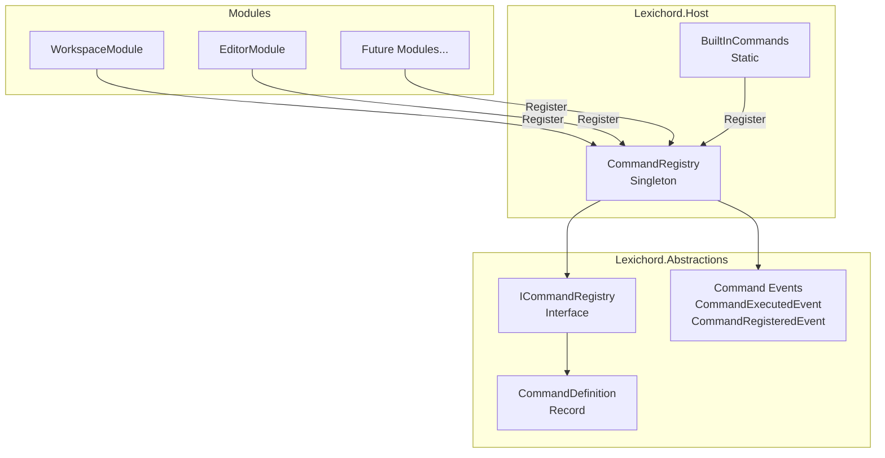
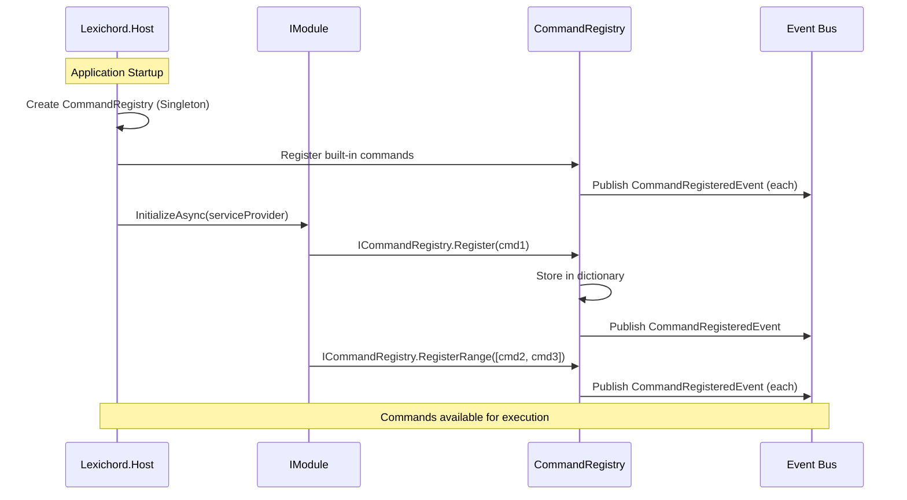
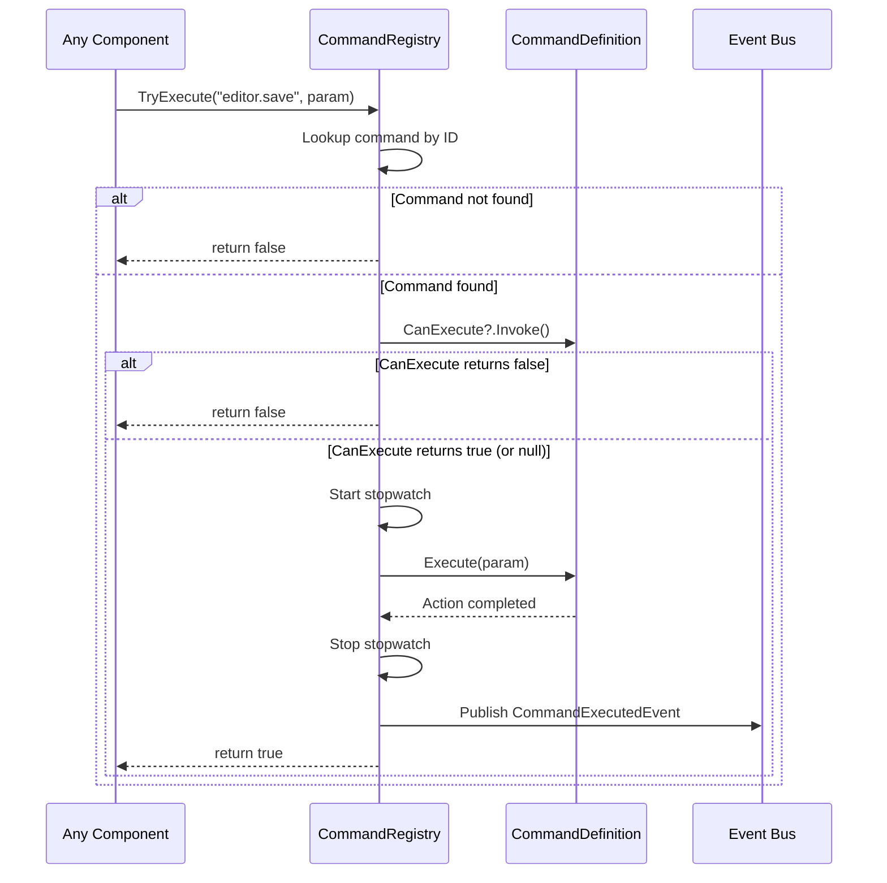

# LCS-DES-015a: Command Registry

## 1. Metadata & Categorization

| Field              | Value                                       | Description                               |
| :----------------- | :------------------------------------------ | :---------------------------------------- |
| **Document ID**    | LCS-DES-015a                                | Design Specification v0.1.5a              |
| **Feature ID**     | INF-015a                                    | Sub-part A of Command Palette             |
| **Feature Name**   | Command Registry                            | Central registry for application commands |
| **Target Version** | `v0.1.5a`                                   | First sub-part of v0.1.5                  |
| **Module Scope**   | `Lexichord.Host` / `Lexichord.Abstractions` | Core infrastructure                       |
| **Swimlane**       | `Infrastructure`                            | The Podium (Platform)                     |
| **License Tier**   | `Core`                                      | Foundation (Available in Free tier)       |
| **Author**         | System Architect                            |                                           |
| **Status**         | **Draft**                                   | Pending implementation                    |
| **Last Updated**   | 2026-01-27                                  |                                           |

---

## 2. Executive Summary

### 2.1 The Requirement

Lexichord needs a centralized command system that:

- Allows modules to register their actions (commands) with the application.
- Provides metadata (title, category, icon, shortcut) for each command.
- Enables execution of commands by ID from anywhere in the application.
- Supports canExecute predicates for enabling/disabling commands.
- Publishes events for command registration and execution.

### 2.2 The Proposed Solution

We **SHALL** implement:

1. **CommandDefinition** — Record containing all command metadata.
2. **ICommandRegistry** — Interface in Abstractions for command registration and lookup.
3. **CommandRegistry** — Singleton implementation in Host.
4. **Command Events** — MediatR notifications for registration and execution.

---

## 3. Architecture

### 3.1 Component Structure



### 3.2 Registration Flow



### 3.3 Execution Flow



---

## 4. Decision Tree: Command Registration

```text
START: "Register a command"
|
+-- Is command null?
|   +-- YES --> Throw ArgumentNullException
|   +-- NO --> Continue
|
+-- Is command.Id null or empty?
|   +-- YES --> Throw ArgumentException
|   +-- NO --> Continue
|
+-- Does command.Id already exist?
|   +-- YES --> Throw ArgumentException (duplicate)
|   +-- NO --> Continue
|
+-- Add to internal dictionary
+-- Raise CommandRegistered event
+-- Publish CommandRegisteredEvent to Event Bus
+-- END
```

---

## 5. Data Contracts

### 5.1 CommandDefinition Record

```csharp
namespace Lexichord.Abstractions.Contracts;

using Avalonia.Input;

/// <summary>
/// Defines a command that can be registered with the Command Registry.
/// </summary>
/// <remarks>
/// LOGIC: CommandDefinition is the fundamental unit of the command system.
/// It uses a record type for immutability and value-based equality.
///
/// Command ID Conventions:
/// - Format: "module.action" (e.g., "editor.save", "workspace.openFolder")
/// - Lowercase with dots as separators
/// - Module prefix should match the registering module's name
/// - Action should be a verb describing the operation
///
/// Category Conventions:
/// - Use standard categories: "File", "Edit", "View", "Selection", "Go", "Help"
/// - Custom categories allowed but should be documented
/// - Used for grouping in Command Palette and menus
///
/// Icon Conventions:
/// - Use Material Design icon names from Material.Icons.Avalonia
/// - Examples: "ContentSave", "FolderOpen", "Magnify", "Undo"
/// - Null means no icon (text only display)
/// </remarks>
/// <param name="Id">Unique identifier following "module.action" convention.</param>
/// <param name="Title">Display title shown in Command Palette and menus.</param>
/// <param name="Category">Category for grouping (e.g., "File", "Edit", "View").</param>
/// <param name="DefaultShortcut">Default keyboard shortcut (user can override).</param>
/// <param name="Execute">Action to execute when command is invoked.</param>
public record CommandDefinition(
    string Id,
    string Title,
    string Category,
    KeyGesture? DefaultShortcut,
    Action<object?> Execute
)
{
    /// <summary>
    /// Gets or sets the command description for tooltips and documentation.
    /// </summary>
    /// <remarks>
    /// LOGIC: Should be a complete sentence describing what the command does.
    /// Example: "Save the current document to disk."
    /// </remarks>
    public string? Description { get; init; }

    /// <summary>
    /// Gets or sets the Material icon kind for display.
    /// </summary>
    /// <remarks>
    /// LOGIC: Icon names from Material.Icons.Avalonia package.
    /// Reference: https://pictogrammers.com/library/mdi/
    /// Examples: "ContentSave", "FolderOpen", "Magnify"
    /// </remarks>
    public string? IconKind { get; init; }

    /// <summary>
    /// Gets or sets the predicate to determine if command can execute.
    /// </summary>
    /// <remarks>
    /// LOGIC: Evaluated before execution. If returns false, command is
    /// considered disabled and will not execute.
    ///
    /// Common patterns:
    /// - Check if active document exists
    /// - Check if document is dirty
    /// - Check if selection exists
    /// - Check if workspace is open
    ///
    /// If null, command is always executable.
    /// </remarks>
    public Func<bool>? CanExecute { get; init; }

    /// <summary>
    /// Gets or sets the context in which this command is available.
    /// </summary>
    /// <remarks>
    /// LOGIC: Contexts allow commands to be active only in specific
    /// parts of the UI. Used by KeyBindingService to filter which
    /// commands can be triggered by keyboard shortcuts.
    ///
    /// Standard contexts:
    /// - null: Global (always available)
    /// - "editorFocus": Active when text editor has focus
    /// - "explorerFocus": Active when file explorer has focus
    /// - "searchFocus": Active when search input has focus
    /// - "paletteOpen": Active when command palette is visible
    ///
    /// Custom contexts can be defined by modules.
    /// </remarks>
    public string? Context { get; init; }

    /// <summary>
    /// Gets or sets additional tags for search enhancement.
    /// </summary>
    /// <remarks>
    /// LOGIC: Alternative search terms that match this command.
    /// Improves discoverability in Command Palette.
    ///
    /// Example for "Save" command:
    /// Tags = ["write", "store", "persist", "disk"]
    ///
    /// User typing "disk" would find "Save" command.
    /// </remarks>
    public IReadOnlyList<string>? Tags { get; init; }

    /// <summary>
    /// Gets or sets whether the command should appear in menus.
    /// </summary>
    /// <remarks>
    /// LOGIC: Some commands are internal or palette-only.
    /// Default true for most commands.
    /// </remarks>
    public bool ShowInMenu { get; init; } = true;

    /// <summary>
    /// Gets or sets whether the command should appear in the Command Palette.
    /// </summary>
    /// <remarks>
    /// LOGIC: Some commands are menu-only or internal.
    /// Default true for most commands.
    /// </remarks>
    public bool ShowInPalette { get; init; } = true;

    /// <summary>
    /// Validates the command definition.
    /// </summary>
    /// <returns>List of validation errors, or empty if valid.</returns>
    public IReadOnlyList<string> Validate()
    {
        var errors = new List<string>();

        if (string.IsNullOrWhiteSpace(Id))
            errors.Add("Command Id is required.");

        if (!Id.Contains('.'))
            errors.Add("Command Id should follow 'module.action' convention.");

        if (string.IsNullOrWhiteSpace(Title))
            errors.Add("Command Title is required.");

        if (string.IsNullOrWhiteSpace(Category))
            errors.Add("Command Category is required.");

        if (Execute is null)
            errors.Add("Command Execute action is required.");

        return errors;
    }
}
```

### 5.2 ICommandRegistry Interface

```csharp
namespace Lexichord.Abstractions.Contracts;

/// <summary>
/// Central registry for all application commands.
/// </summary>
/// <remarks>
/// LOGIC: The CommandRegistry is a singleton service that:
///
/// 1. **Stores Commands**: Maintains a dictionary of CommandDefinitions
///    keyed by their unique ID.
///
/// 2. **Provides Lookup**: Allows retrieval of commands by ID, category,
///    or as a complete list.
///
/// 3. **Handles Execution**: Executes commands with parameter passing,
///    CanExecute checking, and error handling.
///
/// 4. **Publishes Events**: Notifies subscribers when commands are
///    registered, unregistered, or executed.
///
/// Registration Timing:
/// - Built-in commands registered during Host startup
/// - Module commands registered during IModule.InitializeAsync()
/// - Dynamic commands can be registered/unregistered at runtime
///
/// Thread Safety:
/// - Uses ConcurrentDictionary for thread-safe access
/// - Event handlers may be invoked on any thread
/// </remarks>
public interface ICommandRegistry
{
    /// <summary>
    /// Registers a new command with the registry.
    /// </summary>
    /// <param name="command">The command definition to register.</param>
    /// <exception cref="ArgumentNullException">Thrown if command is null.</exception>
    /// <exception cref="ArgumentException">Thrown if command ID is empty or duplicate.</exception>
    /// <remarks>
    /// LOGIC: Registration flow:
    /// 1. Validate command is not null
    /// 2. Validate command.Id is not empty
    /// 3. Check for duplicate ID (throws if exists)
    /// 4. Add to internal dictionary
    /// 5. Raise CommandRegistered event
    /// 6. Publish CommandRegisteredEvent to MediatR
    /// </remarks>
    void Register(CommandDefinition command);

    /// <summary>
    /// Registers multiple commands at once.
    /// </summary>
    /// <param name="commands">The commands to register.</param>
    /// <exception cref="ArgumentNullException">Thrown if commands is null.</exception>
    /// <exception cref="ArgumentException">Thrown if any command fails validation.</exception>
    /// <remarks>
    /// LOGIC: Convenience method for registering multiple commands.
    /// All-or-nothing: if any command fails, none are registered.
    /// </remarks>
    void RegisterRange(IEnumerable<CommandDefinition> commands);

    /// <summary>
    /// Removes a command from the registry.
    /// </summary>
    /// <param name="commandId">The ID of the command to remove.</param>
    /// <returns>True if command was found and removed, false otherwise.</returns>
    /// <remarks>
    /// LOGIC: Used for dynamic command management.
    /// Raises CommandUnregistered event on success.
    /// </remarks>
    bool Unregister(string commandId);

    /// <summary>
    /// Gets all registered commands.
    /// </summary>
    /// <returns>Read-only list of all commands, ordered by category then title.</returns>
    /// <remarks>
    /// LOGIC: Returns a snapshot of current commands.
    /// Safe to enumerate while other operations occur.
    /// </remarks>
    IReadOnlyList<CommandDefinition> GetAllCommands();

    /// <summary>
    /// Gets commands filtered by category.
    /// </summary>
    /// <param name="category">The category to filter by (case-insensitive).</param>
    /// <returns>Commands in the specified category, ordered by title.</returns>
    IReadOnlyList<CommandDefinition> GetCommandsByCategory(string category);

    /// <summary>
    /// Gets all unique categories.
    /// </summary>
    /// <returns>List of category names, alphabetically sorted.</returns>
    IReadOnlyList<string> GetCategories();

    /// <summary>
    /// Gets a specific command by ID.
    /// </summary>
    /// <param name="commandId">The command ID to look up.</param>
    /// <returns>The command, or null if not found.</returns>
    CommandDefinition? GetCommand(string commandId);

    /// <summary>
    /// Checks if a command with the given ID exists.
    /// </summary>
    /// <param name="commandId">The command ID to check.</param>
    /// <returns>True if command exists.</returns>
    bool HasCommand(string commandId);

    /// <summary>
    /// Attempts to execute a command by ID.
    /// </summary>
    /// <param name="commandId">The command ID to execute.</param>
    /// <param name="parameter">Optional parameter to pass to the command.</param>
    /// <returns>True if command was found and executed successfully.</returns>
    /// <remarks>
    /// LOGIC: Execution flow:
    /// 1. Look up command by ID
    /// 2. If not found, log warning and return false
    /// 3. Check CanExecute (if defined)
    /// 4. If CanExecute returns false, return false
    /// 5. Start timing
    /// 6. Execute command (wrapped in try/catch)
    /// 7. Stop timing
    /// 8. Raise CommandExecuted event
    /// 9. Publish CommandExecutedEvent to MediatR
    /// 10. Return true (or false if exception thrown)
    ///
    /// Exception Handling:
    /// - Exceptions from Execute are caught and logged
    /// - Exception stored in CommandExecutedEventArgs
    /// - Method returns false on exception
    /// </remarks>
    bool TryExecute(string commandId, object? parameter = null);

    /// <summary>
    /// Checks if a command can currently execute.
    /// </summary>
    /// <param name="commandId">The command ID to check.</param>
    /// <returns>True if command exists and can execute.</returns>
    /// <remarks>
    /// LOGIC: Returns false if:
    /// - Command doesn't exist
    /// - Command.CanExecute returns false
    /// </remarks>
    bool CanExecute(string commandId);

    /// <summary>
    /// Gets the total count of registered commands.
    /// </summary>
    int CommandCount { get; }

    /// <summary>
    /// Event raised when a command is registered.
    /// </summary>
    event EventHandler<CommandRegisteredEventArgs>? CommandRegistered;

    /// <summary>
    /// Event raised when a command is unregistered.
    /// </summary>
    event EventHandler<CommandUnregisteredEventArgs>? CommandUnregistered;

    /// <summary>
    /// Event raised when a command is executed.
    /// </summary>
    event EventHandler<CommandExecutedEventArgs>? CommandExecuted;
}

/// <summary>
/// Event args for command registration.
/// </summary>
public class CommandRegisteredEventArgs : EventArgs
{
    /// <summary>
    /// Gets the registered command.
    /// </summary>
    public required CommandDefinition Command { get; init; }
}

/// <summary>
/// Event args for command unregistration.
/// </summary>
public class CommandUnregisteredEventArgs : EventArgs
{
    /// <summary>
    /// Gets the ID of the unregistered command.
    /// </summary>
    public required string CommandId { get; init; }
}

/// <summary>
/// Event args for command execution.
/// </summary>
public class CommandExecutedEventArgs : EventArgs
{
    /// <summary>
    /// Gets the executed command ID.
    /// </summary>
    public required string CommandId { get; init; }

    /// <summary>
    /// Gets the command title.
    /// </summary>
    public required string CommandTitle { get; init; }

    /// <summary>
    /// Gets the parameter passed to the command.
    /// </summary>
    public object? Parameter { get; init; }

    /// <summary>
    /// Gets whether execution succeeded.
    /// </summary>
    public required bool Success { get; init; }

    /// <summary>
    /// Gets the exception if execution failed.
    /// </summary>
    public Exception? Exception { get; init; }

    /// <summary>
    /// Gets the execution duration.
    /// </summary>
    public required TimeSpan Duration { get; init; }
}
```

### 5.3 Command Events (MediatR)

```csharp
namespace Lexichord.Abstractions.Events;

using MediatR;

/// <summary>
/// Event published when a command is registered.
/// </summary>
/// <param name="CommandId">The registered command ID.</param>
/// <param name="CommandTitle">The command display title.</param>
/// <param name="Category">The command category.</param>
public record CommandRegisteredMediatREvent(
    string CommandId,
    string CommandTitle,
    string Category
) : INotification;

/// <summary>
/// Event published when a command is executed.
/// </summary>
/// <param name="CommandId">The executed command ID.</param>
/// <param name="CommandTitle">The command display title.</param>
/// <param name="Source">How the command was invoked.</param>
/// <param name="DurationMs">Execution duration in milliseconds.</param>
/// <param name="Success">Whether execution succeeded.</param>
public record CommandExecutedMediatREvent(
    string CommandId,
    string CommandTitle,
    CommandSource Source,
    double DurationMs,
    bool Success
) : INotification;

/// <summary>
/// Source of command execution.
/// </summary>
public enum CommandSource
{
    /// <summary>Command executed via Command Palette.</summary>
    CommandPalette,

    /// <summary>Command executed via keyboard shortcut.</summary>
    KeyboardShortcut,

    /// <summary>Command executed via menu item.</summary>
    MenuItem,

    /// <summary>Command executed via context menu.</summary>
    ContextMenu,

    /// <summary>Command executed programmatically.</summary>
    Programmatic,

    /// <summary>Command executed via toolbar button.</summary>
    Toolbar
}
```

---

## 6. Implementation Logic

### 6.1 CommandRegistry Implementation

```csharp
using System.Collections.Concurrent;
using System.Diagnostics;
using Lexichord.Abstractions.Contracts;
using Lexichord.Abstractions.Events;
using MediatR;
using Microsoft.Extensions.Logging;

namespace Lexichord.Host.Services;

/// <summary>
/// Central registry for all application commands.
/// </summary>
/// <remarks>
/// LOGIC: CommandRegistry is a singleton service that provides:
///
/// Thread Safety:
/// - ConcurrentDictionary for atomic operations
/// - Snapshot copies for enumeration
/// - Lock-free reads for performance
///
/// Performance:
/// - O(1) lookup by command ID
/// - O(n) for GetAll/GetByCategory (n = command count)
/// - Minimal allocation during TryExecute
///
/// Error Handling:
/// - All exceptions from Execute are caught
/// - Errors logged with full context
/// - Callers receive boolean success indication
/// </remarks>
public sealed class CommandRegistry : ICommandRegistry
{
    private readonly ConcurrentDictionary<string, CommandDefinition> _commands = new(StringComparer.OrdinalIgnoreCase);
    private readonly IMediator _mediator;
    private readonly ILogger<CommandRegistry> _logger;

    /// <summary>
    /// Creates a new CommandRegistry instance.
    /// </summary>
    public CommandRegistry(IMediator mediator, ILogger<CommandRegistry> logger)
    {
        _mediator = mediator ?? throw new ArgumentNullException(nameof(mediator));
        _logger = logger ?? throw new ArgumentNullException(nameof(logger));
    }

    /// <inheritdoc/>
    public void Register(CommandDefinition command)
    {
        ArgumentNullException.ThrowIfNull(command);

        if (string.IsNullOrWhiteSpace(command.Id))
        {
            throw new ArgumentException("Command Id cannot be null or empty.", nameof(command));
        }

        // LOGIC: Validate command before registration
        var errors = command.Validate();
        if (errors.Count > 0)
        {
            throw new ArgumentException(
                $"Command validation failed: {string.Join("; ", errors)}", nameof(command));
        }

        // LOGIC: Atomic add-or-fail
        if (!_commands.TryAdd(command.Id, command))
        {
            throw new ArgumentException(
                $"Command '{command.Id}' is already registered.", nameof(command));
        }

        _logger.LogDebug(
            "Command registered: {CommandId} ({Title}) in category {Category}",
            command.Id, command.Title, command.Category);

        // LOGIC: Raise synchronous event
        CommandRegistered?.Invoke(this, new CommandRegisteredEventArgs { Command = command });

        // LOGIC: Publish to MediatR (fire-and-forget)
        _ = PublishRegisteredEventAsync(command);
    }

    /// <inheritdoc/>
    public void RegisterRange(IEnumerable<CommandDefinition> commands)
    {
        ArgumentNullException.ThrowIfNull(commands);

        // LOGIC: Validate all before registering any
        var commandList = commands.ToList();
        foreach (var command in commandList)
        {
            if (command is null)
            {
                throw new ArgumentException("Commands collection contains null.", nameof(commands));
            }

            var errors = command.Validate();
            if (errors.Count > 0)
            {
                throw new ArgumentException(
                    $"Command '{command.Id}' validation failed: {string.Join("; ", errors)}", nameof(commands));
            }

            if (_commands.ContainsKey(command.Id))
            {
                throw new ArgumentException(
                    $"Command '{command.Id}' is already registered.", nameof(commands));
            }
        }

        // LOGIC: All validation passed, register all
        foreach (var command in commandList)
        {
            Register(command);
        }
    }

    /// <inheritdoc/>
    public bool Unregister(string commandId)
    {
        if (string.IsNullOrWhiteSpace(commandId))
            return false;

        if (_commands.TryRemove(commandId, out var removed))
        {
            _logger.LogDebug("Command unregistered: {CommandId}", commandId);

            CommandUnregistered?.Invoke(this, new CommandUnregisteredEventArgs
            {
                CommandId = commandId
            });

            return true;
        }

        return false;
    }

    /// <inheritdoc/>
    public IReadOnlyList<CommandDefinition> GetAllCommands()
    {
        // LOGIC: Return snapshot sorted by category, then title
        return _commands.Values
            .OrderBy(c => c.Category, StringComparer.OrdinalIgnoreCase)
            .ThenBy(c => c.Title, StringComparer.OrdinalIgnoreCase)
            .ToList();
    }

    /// <inheritdoc/>
    public IReadOnlyList<CommandDefinition> GetCommandsByCategory(string category)
    {
        if (string.IsNullOrWhiteSpace(category))
            return Array.Empty<CommandDefinition>();

        return _commands.Values
            .Where(c => c.Category.Equals(category, StringComparison.OrdinalIgnoreCase))
            .OrderBy(c => c.Title, StringComparer.OrdinalIgnoreCase)
            .ToList();
    }

    /// <inheritdoc/>
    public IReadOnlyList<string> GetCategories()
    {
        return _commands.Values
            .Select(c => c.Category)
            .Distinct(StringComparer.OrdinalIgnoreCase)
            .OrderBy(c => c, StringComparer.OrdinalIgnoreCase)
            .ToList();
    }

    /// <inheritdoc/>
    public CommandDefinition? GetCommand(string commandId)
    {
        if (string.IsNullOrWhiteSpace(commandId))
            return null;

        return _commands.TryGetValue(commandId, out var command) ? command : null;
    }

    /// <inheritdoc/>
    public bool HasCommand(string commandId)
    {
        if (string.IsNullOrWhiteSpace(commandId))
            return false;

        return _commands.ContainsKey(commandId);
    }

    /// <inheritdoc/>
    public bool TryExecute(string commandId, object? parameter = null)
    {
        // LOGIC: Look up command
        if (!_commands.TryGetValue(commandId, out var command))
        {
            _logger.LogWarning("Command not found: {CommandId}", commandId);
            return false;
        }

        // LOGIC: Check CanExecute predicate
        if (command.CanExecute is not null)
        {
            try
            {
                if (!command.CanExecute())
                {
                    _logger.LogDebug(
                        "Command cannot execute (CanExecute returned false): {CommandId}",
                        commandId);
                    return false;
                }
            }
            catch (Exception ex)
            {
                _logger.LogWarning(ex,
                    "CanExecute threw exception for command: {CommandId}", commandId);
                return false;
            }
        }

        // LOGIC: Execute with timing
        var stopwatch = Stopwatch.StartNew();
        Exception? exception = null;
        var success = true;

        try
        {
            _logger.LogDebug("Executing command: {CommandId} with parameter: {Parameter}",
                commandId, parameter);

            command.Execute(parameter);
        }
        catch (Exception ex)
        {
            exception = ex;
            success = false;
            _logger.LogError(ex, "Command execution failed: {CommandId}", commandId);
        }
        finally
        {
            stopwatch.Stop();

            // LOGIC: Raise synchronous event
            var eventArgs = new CommandExecutedEventArgs
            {
                CommandId = commandId,
                CommandTitle = command.Title,
                Parameter = parameter,
                Success = success,
                Exception = exception,
                Duration = stopwatch.Elapsed
            };

            CommandExecuted?.Invoke(this, eventArgs);

            // LOGIC: Publish to MediatR for telemetry
            _ = PublishExecutedEventAsync(command, stopwatch.Elapsed, success);
        }

        if (success)
        {
            _logger.LogDebug("Command executed successfully: {CommandId} in {Duration}ms",
                commandId, stopwatch.Elapsed.TotalMilliseconds);
        }

        return success;
    }

    /// <inheritdoc/>
    public bool CanExecute(string commandId)
    {
        if (!_commands.TryGetValue(commandId, out var command))
            return false;

        if (command.CanExecute is null)
            return true;

        try
        {
            return command.CanExecute();
        }
        catch
        {
            return false;
        }
    }

    /// <inheritdoc/>
    public int CommandCount => _commands.Count;

    /// <inheritdoc/>
    public event EventHandler<CommandRegisteredEventArgs>? CommandRegistered;

    /// <inheritdoc/>
    public event EventHandler<CommandUnregisteredEventArgs>? CommandUnregistered;

    /// <inheritdoc/>
    public event EventHandler<CommandExecutedEventArgs>? CommandExecuted;

    private async Task PublishRegisteredEventAsync(CommandDefinition command)
    {
        try
        {
            await _mediator.Publish(new CommandRegisteredMediatREvent(
                command.Id,
                command.Title,
                command.Category
            ));
        }
        catch (Exception ex)
        {
            _logger.LogWarning(ex, "Failed to publish CommandRegisteredMediatREvent");
        }
    }

    private async Task PublishExecutedEventAsync(CommandDefinition command, TimeSpan duration, bool success)
    {
        try
        {
            await _mediator.Publish(new CommandExecutedMediatREvent(
                command.Id,
                command.Title,
                CommandSource.Programmatic, // Caller should update if known
                duration.TotalMilliseconds,
                success
            ));
        }
        catch (Exception ex)
        {
            _logger.LogWarning(ex, "Failed to publish CommandExecutedMediatREvent");
        }
    }
}
```

### 6.2 Service Registration

```csharp
// In Lexichord.Host/HostServices.cs

public static IServiceCollection ConfigureServices(
    this IServiceCollection services,
    IConfiguration configuration)
{
    // ... existing services ...

    // LOGIC: Register CommandRegistry as singleton
    services.AddSingleton<ICommandRegistry, CommandRegistry>();

    return services;
}
```

### 6.3 Module Command Registration Example

```csharp
// Example: How EditorModule registers its commands

public class EditorModule : IModule
{
    public async Task InitializeAsync(IServiceProvider services)
    {
        var registry = services.GetRequiredService<ICommandRegistry>();
        var editorService = services.GetRequiredService<IEditorService>();

        // LOGIC: Register editor-specific commands
        registry.RegisterRange(new[]
        {
            new CommandDefinition(
                Id: "editor.save",
                Title: "Save",
                Category: "File",
                DefaultShortcut: new KeyGesture(Key.S, KeyModifiers.Control),
                Execute: _ => editorService.SaveActiveDocumentAsync()
            )
            {
                Description = "Save the current document",
                IconKind = "ContentSave",
                CanExecute = () => editorService.ActiveDocument?.IsDirty == true,
                Context = "editorFocus",
                Tags = new[] { "write", "disk", "persist" }
            },

            new CommandDefinition(
                Id: "editor.find",
                Title: "Find",
                Category: "Edit",
                DefaultShortcut: new KeyGesture(Key.F, KeyModifiers.Control),
                Execute: _ => editorService.ShowSearchOverlay()
            )
            {
                Description = "Find text in the current document",
                IconKind = "Magnify",
                Context = "editorFocus",
                Tags = new[] { "search", "locate" }
            }
        });

        await Task.CompletedTask;
    }
}
```

---

## 7. Use Cases

### UC-01: Module Registers Commands at Startup

**Preconditions:**

- Application is starting up.
- Module loader has discovered the module.

**Flow:**

1. Host creates CommandRegistry singleton.
2. Host registers built-in commands.
3. ModuleLoader calls module.InitializeAsync().
4. Module obtains ICommandRegistry from DI.
5. Module calls registry.RegisterRange() with its commands.
6. Registry validates each command.
7. Registry stores commands in dictionary.
8. Registry raises CommandRegistered events.
9. Commands available for palette and shortcuts.

**Postconditions:**

- All module commands registered.
- Commands discoverable via GetAllCommands().

---

### UC-02: Execute Command by ID

**Preconditions:**

- Command "editor.save" is registered.
- A dirty document is open.

**Flow:**

1. Component calls registry.TryExecute("editor.save").
2. Registry looks up command by ID.
3. Registry calls CanExecute predicate.
4. Predicate returns true (document is dirty).
5. Registry starts stopwatch.
6. Registry calls command.Execute(null).
7. EditorService saves the document.
8. Registry stops stopwatch.
9. Registry raises CommandExecuted event.
10. Registry publishes CommandExecutedMediatREvent.
11. Method returns true.

**Postconditions:**

- Document saved.
- Execution logged and tracked.

---

## 8. Observability & Logging

| Level   | Context         | Message Template                                                   |
| :------ | :-------------- | :----------------------------------------------------------------- |
| Debug   | CommandRegistry | `Command registered: {CommandId} ({Title}) in category {Category}` |
| Debug   | CommandRegistry | `Command unregistered: {CommandId}`                                |
| Debug   | CommandRegistry | `Executing command: {CommandId} with parameter: {Parameter}`       |
| Debug   | CommandRegistry | `Command executed successfully: {CommandId} in {Duration}ms`       |
| Debug   | CommandRegistry | `Command cannot execute (CanExecute returned false): {CommandId}`  |
| Warning | CommandRegistry | `Command not found: {CommandId}`                                   |
| Warning | CommandRegistry | `CanExecute threw exception for command: {CommandId}`              |
| Error   | CommandRegistry | `Command execution failed: {CommandId}`                            |
| Warning | CommandRegistry | `Failed to publish CommandRegisteredMediatREvent`                  |
| Warning | CommandRegistry | `Failed to publish CommandExecutedMediatREvent`                    |

---

## 9. Unit Testing Requirements

### 9.1 CommandDefinition Tests

```csharp
[TestFixture]
[Category("Unit")]
public class CommandDefinitionTests
{
    [Test]
    public void Validate_ValidCommand_ReturnsEmptyList()
    {
        // Arrange
        var command = new CommandDefinition(
            "module.action",
            "Test Command",
            "Test",
            null,
            _ => { }
        );

        // Act
        var errors = command.Validate();

        // Assert
        Assert.That(errors, Is.Empty);
    }

    [Test]
    public void Validate_EmptyId_ReturnsError()
    {
        // Arrange
        var command = new CommandDefinition(
            "",
            "Test Command",
            "Test",
            null,
            _ => { }
        );

        // Act
        var errors = command.Validate();

        // Assert
        Assert.That(errors, Has.Some.Contains("Id"));
    }

    [Test]
    public void Validate_IdWithoutDot_ReturnsError()
    {
        // Arrange
        var command = new CommandDefinition(
            "commandwithoutdot",
            "Test Command",
            "Test",
            null,
            _ => { }
        );

        // Act
        var errors = command.Validate();

        // Assert
        Assert.That(errors, Has.Some.Contains("module.action"));
    }

    [Test]
    public void Validate_NullExecute_ReturnsError()
    {
        // Arrange
        var command = new CommandDefinition(
            "module.action",
            "Test Command",
            "Test",
            null,
            null!
        );

        // Act
        var errors = command.Validate();

        // Assert
        Assert.That(errors, Has.Some.Contains("Execute"));
    }

    [Test]
    public void CommandDefinition_WithAllProperties_CreatesCorrectly()
    {
        // Arrange & Act
        var command = new CommandDefinition(
            "editor.save",
            "Save",
            "File",
            new KeyGesture(Key.S, KeyModifiers.Control),
            _ => { }
        )
        {
            Description = "Save the document",
            IconKind = "ContentSave",
            CanExecute = () => true,
            Context = "editorFocus",
            Tags = new[] { "write", "disk" }
        };

        // Assert
        Assert.Multiple(() =>
        {
            Assert.That(command.Id, Is.EqualTo("editor.save"));
            Assert.That(command.Title, Is.EqualTo("Save"));
            Assert.That(command.Category, Is.EqualTo("File"));
            Assert.That(command.DefaultShortcut?.Key, Is.EqualTo(Key.S));
            Assert.That(command.Description, Is.EqualTo("Save the document"));
            Assert.That(command.IconKind, Is.EqualTo("ContentSave"));
            Assert.That(command.CanExecute?.Invoke(), Is.True);
            Assert.That(command.Context, Is.EqualTo("editorFocus"));
            Assert.That(command.Tags, Contains.Item("write"));
        });
    }
}
```

### 9.2 CommandRegistry Tests

```csharp
[TestFixture]
[Category("Unit")]
public class CommandRegistryTests
{
    private Mock<IMediator> _mockMediator = null!;
    private Mock<ILogger<CommandRegistry>> _mockLogger = null!;
    private CommandRegistry _sut = null!;

    [SetUp]
    public void SetUp()
    {
        _mockMediator = new Mock<IMediator>();
        _mockLogger = new Mock<ILogger<CommandRegistry>>();
        _sut = new CommandRegistry(_mockMediator.Object, _mockLogger.Object);
    }

    [Test]
    public void Register_ValidCommand_AddsToRegistry()
    {
        // Arrange
        var command = CreateTestCommand("test.command");

        // Act
        _sut.Register(command);

        // Assert
        Assert.That(_sut.GetCommand("test.command"), Is.EqualTo(command));
    }

    [Test]
    public void Register_NullCommand_ThrowsArgumentNullException()
    {
        // Act & Assert
        Assert.Throws<ArgumentNullException>(() => _sut.Register(null!));
    }

    [Test]
    public void Register_DuplicateId_ThrowsArgumentException()
    {
        // Arrange
        _sut.Register(CreateTestCommand("test.command"));

        // Act & Assert
        var ex = Assert.Throws<ArgumentException>(() =>
            _sut.Register(CreateTestCommand("test.command")));
        Assert.That(ex.Message, Does.Contain("already registered"));
    }

    [Test]
    public void Register_RaisesCommandRegisteredEvent()
    {
        // Arrange
        CommandRegisteredEventArgs? eventArgs = null;
        _sut.CommandRegistered += (s, e) => eventArgs = e;
        var command = CreateTestCommand("test.command");

        // Act
        _sut.Register(command);

        // Assert
        Assert.That(eventArgs?.Command, Is.EqualTo(command));
    }

    [Test]
    public void RegisterRange_MultipleCommands_RegistersAll()
    {
        // Arrange
        var commands = new[]
        {
            CreateTestCommand("test.one"),
            CreateTestCommand("test.two"),
            CreateTestCommand("test.three")
        };

        // Act
        _sut.RegisterRange(commands);

        // Assert
        Assert.That(_sut.CommandCount, Is.EqualTo(3));
    }

    [Test]
    public void RegisterRange_WithDuplicate_ThrowsAndRegistersNone()
    {
        // Arrange
        _sut.Register(CreateTestCommand("existing.command"));
        var commands = new[]
        {
            CreateTestCommand("new.one"),
            CreateTestCommand("existing.command"), // Duplicate
            CreateTestCommand("new.two")
        };

        // Act & Assert
        Assert.Throws<ArgumentException>(() => _sut.RegisterRange(commands));
        Assert.That(_sut.CommandCount, Is.EqualTo(1)); // Only original
    }

    [Test]
    public void Unregister_ExistingCommand_RemovesAndReturnsTrue()
    {
        // Arrange
        _sut.Register(CreateTestCommand("test.command"));

        // Act
        var result = _sut.Unregister("test.command");

        // Assert
        Assert.Multiple(() =>
        {
            Assert.That(result, Is.True);
            Assert.That(_sut.GetCommand("test.command"), Is.Null);
        });
    }

    [Test]
    public void Unregister_NonExistingCommand_ReturnsFalse()
    {
        // Act
        var result = _sut.Unregister("nonexistent.command");

        // Assert
        Assert.That(result, Is.False);
    }

    [Test]
    public void GetAllCommands_ReturnsOrderedByCategory()
    {
        // Arrange
        _sut.Register(CreateTestCommand("z.cmd", category: "Zebra"));
        _sut.Register(CreateTestCommand("a.cmd", category: "Alpha"));
        _sut.Register(CreateTestCommand("m.cmd", category: "Middle"));

        // Act
        var commands = _sut.GetAllCommands();

        // Assert
        Assert.That(commands[0].Category, Is.EqualTo("Alpha"));
        Assert.That(commands[1].Category, Is.EqualTo("Middle"));
        Assert.That(commands[2].Category, Is.EqualTo("Zebra"));
    }

    [Test]
    public void GetCommandsByCategory_ReturnsMatchingCommands()
    {
        // Arrange
        _sut.Register(CreateTestCommand("file.one", category: "File"));
        _sut.Register(CreateTestCommand("file.two", category: "File"));
        _sut.Register(CreateTestCommand("edit.one", category: "Edit"));

        // Act
        var fileCommands = _sut.GetCommandsByCategory("File");

        // Assert
        Assert.That(fileCommands, Has.Count.EqualTo(2));
        Assert.That(fileCommands.All(c => c.Category == "File"), Is.True);
    }

    [Test]
    public void GetCategories_ReturnsUniqueCategories()
    {
        // Arrange
        _sut.Register(CreateTestCommand("file.one", category: "File"));
        _sut.Register(CreateTestCommand("file.two", category: "File"));
        _sut.Register(CreateTestCommand("edit.one", category: "Edit"));

        // Act
        var categories = _sut.GetCategories();

        // Assert
        Assert.That(categories, Is.EquivalentTo(new[] { "Edit", "File" }));
    }

    [Test]
    public void TryExecute_ExistingCommand_ExecutesAndReturnsTrue()
    {
        // Arrange
        var executed = false;
        var command = new CommandDefinition(
            "test.command",
            "Test",
            "Test",
            null,
            _ => executed = true
        );
        _sut.Register(command);

        // Act
        var result = _sut.TryExecute("test.command");

        // Assert
        Assert.Multiple(() =>
        {
            Assert.That(result, Is.True);
            Assert.That(executed, Is.True);
        });
    }

    [Test]
    public void TryExecute_NonExistingCommand_ReturnsFalse()
    {
        // Act
        var result = _sut.TryExecute("nonexistent.command");

        // Assert
        Assert.That(result, Is.False);
    }

    [Test]
    public void TryExecute_CanExecuteFalse_ReturnsFalse()
    {
        // Arrange
        var executed = false;
        var command = new CommandDefinition(
            "test.command",
            "Test",
            "Test",
            null,
            _ => executed = true
        )
        {
            CanExecute = () => false
        };
        _sut.Register(command);

        // Act
        var result = _sut.TryExecute("test.command");

        // Assert
        Assert.Multiple(() =>
        {
            Assert.That(result, Is.False);
            Assert.That(executed, Is.False);
        });
    }

    [Test]
    public void TryExecute_WithParameter_PassesParameter()
    {
        // Arrange
        object? receivedParam = null;
        var command = new CommandDefinition(
            "test.command",
            "Test",
            "Test",
            null,
            p => receivedParam = p
        );
        _sut.Register(command);

        // Act
        _sut.TryExecute("test.command", "test-param");

        // Assert
        Assert.That(receivedParam, Is.EqualTo("test-param"));
    }

    [Test]
    public void TryExecute_ExecuteThrows_ReturnsFalseAndLogError()
    {
        // Arrange
        var command = new CommandDefinition(
            "test.command",
            "Test",
            "Test",
            null,
            _ => throw new InvalidOperationException("Test exception")
        );
        _sut.Register(command);

        // Act
        var result = _sut.TryExecute("test.command");

        // Assert
        Assert.That(result, Is.False);
    }

    [Test]
    public void TryExecute_RaisesCommandExecutedEvent()
    {
        // Arrange
        CommandExecutedEventArgs? eventArgs = null;
        _sut.CommandExecuted += (s, e) => eventArgs = e;
        _sut.Register(CreateTestCommand("test.command"));

        // Act
        _sut.TryExecute("test.command");

        // Assert
        Assert.Multiple(() =>
        {
            Assert.That(eventArgs, Is.Not.Null);
            Assert.That(eventArgs!.CommandId, Is.EqualTo("test.command"));
            Assert.That(eventArgs.Success, Is.True);
        });
    }

    [Test]
    public void CanExecute_CommandExists_ReturnsPredicateResult()
    {
        // Arrange
        var command = new CommandDefinition(
            "test.command",
            "Test",
            "Test",
            null,
            _ => { }
        )
        {
            CanExecute = () => false
        };
        _sut.Register(command);

        // Act
        var result = _sut.CanExecute("test.command");

        // Assert
        Assert.That(result, Is.False);
    }

    [Test]
    public void CanExecute_NoPredicateDefined_ReturnsTrue()
    {
        // Arrange
        _sut.Register(CreateTestCommand("test.command"));

        // Act
        var result = _sut.CanExecute("test.command");

        // Assert
        Assert.That(result, Is.True);
    }

    [Test]
    public void HasCommand_ExistingCommand_ReturnsTrue()
    {
        // Arrange
        _sut.Register(CreateTestCommand("test.command"));

        // Act & Assert
        Assert.That(_sut.HasCommand("test.command"), Is.True);
    }

    [Test]
    public void HasCommand_NonExistingCommand_ReturnsFalse()
    {
        // Act & Assert
        Assert.That(_sut.HasCommand("nonexistent.command"), Is.False);
    }

    private static CommandDefinition CreateTestCommand(
        string id,
        string title = "Test",
        string category = "Test")
    {
        return new CommandDefinition(id, title, category, null, _ => { });
    }
}
```

---

## 10. Security & Safety

### 10.1 Command Execution Security

> [!NOTE]
> Commands execute with full application permissions.
> There is no sandboxing of command actions.

- **Validation:** Command definitions validated at registration time.
- **Exception Handling:** All execution wrapped in try/catch.
- **No Injection:** Command IDs are validated strings, not arbitrary code.

### 10.2 Module Trust

> [!WARNING]
> Modules can register any command. Only load trusted modules.

- Modules have full DI access during initialization.
- Registered commands can perform any application action.
- Future: Consider command capability restrictions for untrusted modules.

---

## 11. Risks & Mitigations

| Risk                           | Impact | Mitigation                               |
| :----------------------------- | :----- | :--------------------------------------- |
| Duplicate command IDs          | Medium | Throws exception; fail fast              |
| Long-running execute blocks UI | High   | Document async patterns; future: timeout |
| CanExecute performance         | Medium | Should be fast; no I/O in predicates     |
| Event handler exceptions       | Low    | Catch and log; don't affect execution    |
| Memory growth from commands    | Low    | Commands are small; unlikely issue       |

---

## 12. Acceptance Criteria (QA)

| #   | Category         | Criterion                                 |
| :-- | :--------------- | :---------------------------------------- |
| 1   | **[Register]**   | Register adds command to registry         |
| 2   | **[Register]**   | Duplicate ID throws ArgumentException     |
| 3   | **[Register]**   | Invalid command throws ArgumentException  |
| 4   | **[Register]**   | CommandRegistered event is raised         |
| 5   | **[Unregister]** | Unregister removes command                |
| 6   | **[Unregister]** | Unregister returns false for non-existent |
| 7   | **[Lookup]**     | GetCommand returns correct command        |
| 8   | **[Lookup]**     | GetAllCommands returns ordered list       |
| 9   | **[Lookup]**     | GetCommandsByCategory filters correctly   |
| 10  | **[Lookup]**     | GetCategories returns unique categories   |
| 11  | **[Execute]**    | TryExecute executes action                |
| 12  | **[Execute]**    | TryExecute respects CanExecute            |
| 13  | **[Execute]**    | TryExecute passes parameter               |
| 14  | **[Execute]**    | TryExecute handles exceptions             |
| 15  | **[Execute]**    | CommandExecuted event is raised           |
| 16  | **[Events]**     | MediatR events are published              |

---

## 13. Verification Commands

```bash
# 1. Build the solution
dotnet build

# 2. Run CommandRegistry unit tests
dotnet test --filter "FullyQualifiedName~CommandRegistry"

# 3. Run CommandDefinition unit tests
dotnet test --filter "FullyQualifiedName~CommandDefinition"

# 4. Run application and verify commands register
dotnet run --project src/Lexichord.Host
# Check logs for "Command registered:" messages

# 5. Verify built-in commands are available
# (Use command palette or debugger to inspect registry)
```

---

## 14. Deliverable Checklist

| Step | Description                                       | Status |
| :--- | :------------------------------------------------ | :----- |
| 1    | Define CommandDefinition record in Abstractions   | [ ]    |
| 2    | Add Validate() method to CommandDefinition        | [ ]    |
| 3    | Define ICommandRegistry interface in Abstractions | [ ]    |
| 4    | Define CommandRegisteredEventArgs                 | [ ]    |
| 5    | Define CommandUnregisteredEventArgs               | [ ]    |
| 6    | Define CommandExecutedEventArgs                   | [ ]    |
| 7    | Define CommandRegisteredMediatREvent              | [ ]    |
| 8    | Define CommandExecutedMediatREvent                | [ ]    |
| 9    | Define CommandSource enum                         | [ ]    |
| 10   | Implement CommandRegistry in Host                 | [ ]    |
| 11   | Register CommandRegistry as singleton             | [ ]    |
| 12   | Create BuiltInCommands registration               | [ ]    |
| 13   | Unit tests for CommandDefinition                  | [ ]    |
| 14   | Unit tests for CommandRegistry                    | [ ]    |
| 15   | Update Editor module to register commands         | [ ]    |
| 16   | Update Workspace module to register commands      | [ ]    |
