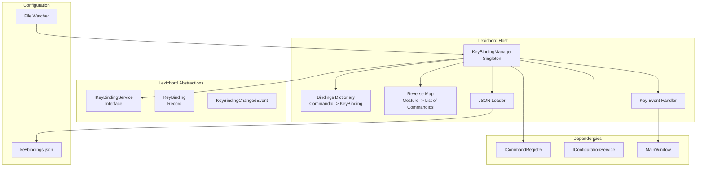
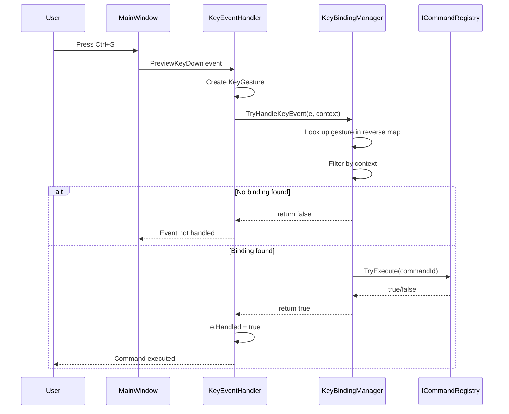
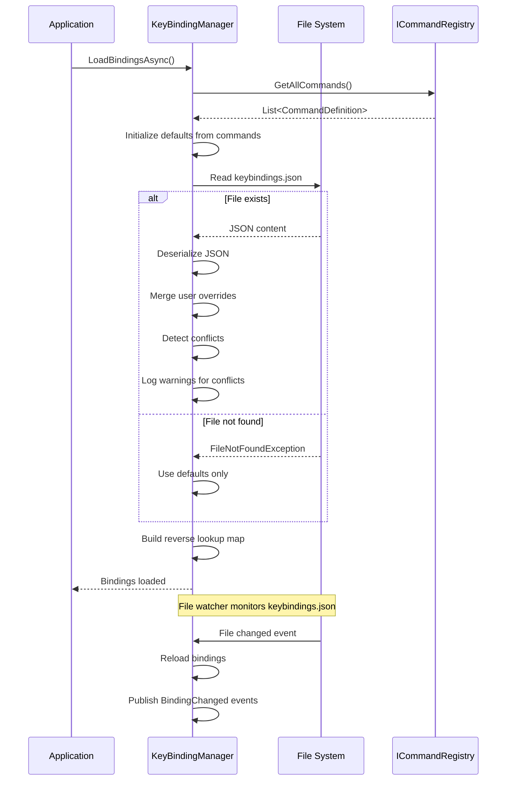

# LCS-DES-015d: Keybinding Service

## 1. Metadata & Categorization

| Field              | Value              | Description                         |
| :----------------- | :----------------- | :---------------------------------- |
| **Document ID**    | LCS-DES-015d       | Design Specification v0.1.5d        |
| **Feature ID**     | INF-015d           | Sub-part D of Command Palette       |
| **Feature Name**   | Keybinding Service | Customizable keyboard shortcuts     |
| **Target Version** | `v0.1.5d`          | Fourth sub-part of v0.1.5           |
| **Module Scope**   | `Lexichord.Host`   | Core infrastructure                 |
| **Swimlane**       | `Infrastructure`   | The Podium (Platform)               |
| **License Tier**   | `Core`             | Foundation (Available in Free tier) |
| **Author**         | System Architect   |                                     |
| **Status**         | **Draft**          | Pending implementation              |
| **Last Updated**   | 2026-01-27         |                                     |

---

## 2. Executive Summary

### 2.1 The Requirement

Lexichord needs a keybinding system that provides:

- Mapping keyboard shortcuts to commands.
- User-customizable shortcuts via `keybindings.json`.
- Default shortcuts from CommandDefinition.
- Conflict detection when multiple commands share a shortcut.
- Context-aware bindings (e.g., "editorFocus" vs global).
- Hot-reload when keybindings.json changes.
- Display of shortcuts in Command Palette and menus.

### 2.2 The Proposed Solution

We **SHALL** implement:

1. **IKeyBindingService** — Interface in Abstractions for keybinding management.
2. **KeyBindingManager** — Implementation in Host.
3. **KeyBinding** — Record for command-to-shortcut mapping.
4. **keybindings.json** — User configuration file.
5. **Key Event Routing** — Hook into main window to dispatch shortcuts.

---

## 3. Architecture

### 3.1 Component Structure



### 3.2 Key Event Processing Flow



### 3.3 Keybindings.json Loading Flow



---

## 4. Decision Tree: Key Event Handling

```text
START: "Handle keyboard event"
|
+-- Is event already handled?
|   +-- YES --> Return false
|   +-- NO --> Continue
|
+-- Can we create a KeyGesture from the event?
|   +-- NO (just modifier key) --> Return false
|   +-- YES --> Continue
|
+-- Look up gesture in reverse map
|   +-- Not found --> Return false
|   +-- Found --> Get list of command IDs
|
+-- Filter by context
|   +-- For each command binding:
|       +-- Is binding.When null (global)?
|       |   +-- YES --> Include in candidates
|       +-- Does context match binding.When?
|           +-- YES --> Include in candidates
|           +-- NO --> Skip
|
+-- Any candidates remaining?
|   +-- NO --> Return false
|   +-- YES --> Continue
|
+-- Select first candidate (priority: specific context > global)
|
+-- Check command CanExecute
|   +-- Returns false --> Return false
|   +-- Returns true --> Continue
|
+-- Execute command via ICommandRegistry
|
+-- Return true (event handled)
|
+-- END
```

---

## 5. Data Contracts

### 5.1 IKeyBindingService Interface

```csharp
namespace Lexichord.Abstractions.Contracts;

using Avalonia.Input;

/// <summary>
/// Service for managing keyboard shortcuts.
/// </summary>
/// <remarks>
/// LOGIC: KeyBindingService manages the mapping between keyboard shortcuts
/// and commands. The binding resolution order is:
///
/// 1. User overrides from keybindings.json (highest priority)
/// 2. Command defaults from CommandDefinition.DefaultShortcut
///
/// Context-Aware Bindings:
/// - Bindings can specify a "when" context condition
/// - Context is provided by the component handling the key event
/// - Examples: "editorFocus", "explorerFocus", "paletteOpen"
/// - Global bindings (when=null) work in all contexts
///
/// Conflict Resolution:
/// - Multiple commands can theoretically share a gesture
/// - Context filtering usually resolves conflicts
/// - Same-context conflicts are warned, first registered wins
///
/// Thread Safety:
/// - Read operations are thread-safe
/// - Write operations (SetBinding) lock internally
/// - Hot-reload debounced to prevent rapid updates
/// </remarks>
public interface IKeyBindingService
{
    /// <summary>
    /// Gets the effective binding for a command.
    /// </summary>
    /// <param name="commandId">The command ID.</param>
    /// <returns>The key gesture, or null if no binding.</returns>
    /// <remarks>
    /// LOGIC: Returns user override if set, otherwise command default.
    /// Returns null if command is explicitly unbound.
    /// </remarks>
    KeyGesture? GetBinding(string commandId);

    /// <summary>
    /// Gets the full binding information for a command.
    /// </summary>
    /// <param name="commandId">The command ID.</param>
    /// <returns>The key binding, or null if not bound.</returns>
    KeyBinding? GetFullBinding(string commandId);

    /// <summary>
    /// Gets all active key bindings.
    /// </summary>
    /// <returns>List of all bindings.</returns>
    IReadOnlyList<KeyBinding> GetAllBindings();

    /// <summary>
    /// Gets bindings that conflict with a gesture.
    /// </summary>
    /// <param name="gesture">The gesture to check.</param>
    /// <param name="context">Optional context to filter by.</param>
    /// <returns>Command IDs bound to this gesture.</returns>
    IReadOnlyList<string> GetConflicts(KeyGesture gesture, string? context = null);

    /// <summary>
    /// Checks if a gesture is available (not bound).
    /// </summary>
    /// <param name="gesture">The gesture to check.</param>
    /// <param name="context">Optional context.</param>
    /// <param name="excludeCommandId">Command to exclude from conflict check.</param>
    /// <returns>True if gesture is not bound to another command.</returns>
    bool IsGestureAvailable(KeyGesture gesture, string? context = null, string? excludeCommandId = null);

    /// <summary>
    /// Sets a custom binding for a command.
    /// </summary>
    /// <param name="commandId">The command ID.</param>
    /// <param name="gesture">The new gesture, or null to unbind.</param>
    /// <param name="when">Optional context condition.</param>
    /// <remarks>
    /// LOGIC: Overrides default binding. Pass null gesture to unbind.
    /// Changes are persisted to keybindings.json.
    /// Raises BindingChanged event.
    /// </remarks>
    void SetBinding(string commandId, KeyGesture? gesture, string? when = null);

    /// <summary>
    /// Removes a custom binding, reverting to default.
    /// </summary>
    /// <param name="commandId">The command ID.</param>
    void ResetBinding(string commandId);

    /// <summary>
    /// Resets all bindings to defaults.
    /// </summary>
    void ResetToDefaults();

    /// <summary>
    /// Loads bindings from keybindings.json.
    /// </summary>
    Task LoadBindingsAsync();

    /// <summary>
    /// Saves current bindings to keybindings.json.
    /// </summary>
    Task SaveBindingsAsync();

    /// <summary>
    /// Attempts to handle a key event.
    /// </summary>
    /// <param name="e">The key event args.</param>
    /// <param name="context">Current context (e.g., "editorFocus").</param>
    /// <returns>True if a command was executed.</returns>
    /// <remarks>
    /// LOGIC: Matches key gesture against bindings.
    /// Respects "when" context conditions.
    /// Executes matched command via ICommandRegistry.
    /// Sets e.Handled = true if command executed.
    /// </remarks>
    bool TryHandleKeyEvent(KeyEventArgs e, string? context = null);

    /// <summary>
    /// Formats a key gesture for display.
    /// </summary>
    /// <param name="gesture">The gesture to format.</param>
    /// <returns>Display string (e.g., "Ctrl+Shift+P").</returns>
    /// <remarks>
    /// LOGIC: Platform-aware formatting:
    /// - Windows/Linux: "Ctrl+Shift+P"
    /// - macOS: "Cmd+Shift+P" (future)
    /// </remarks>
    string FormatGesture(KeyGesture gesture);

    /// <summary>
    /// Parses a key gesture from string.
    /// </summary>
    /// <param name="gestureString">String like "Ctrl+S" or "Cmd+Shift+P".</param>
    /// <returns>Parsed gesture, or null if invalid.</returns>
    /// <remarks>
    /// LOGIC: Supports various formats:
    /// - "Ctrl+S", "Control+S"
    /// - "Cmd+S", "Command+S" (maps to Ctrl on non-Mac)
    /// - "Alt+F4", "Option+F4"
    /// - "Shift+Enter"
    /// - Case-insensitive
    /// </remarks>
    KeyGesture? ParseGesture(string gestureString);

    /// <summary>
    /// Gets the path to keybindings.json.
    /// </summary>
    string KeybindingsFilePath { get; }

    /// <summary>
    /// Gets whether keybindings file exists.
    /// </summary>
    bool HasCustomBindings { get; }

    /// <summary>
    /// Event raised when a binding changes.
    /// </summary>
    event EventHandler<KeyBindingChangedEventArgs>? BindingChanged;

    /// <summary>
    /// Event raised when bindings are reloaded.
    /// </summary>
    event EventHandler? BindingsReloaded;
}

/// <summary>
/// Represents a key binding configuration.
/// </summary>
/// <param name="CommandId">The command this binding triggers.</param>
/// <param name="Gesture">The keyboard shortcut.</param>
public record KeyBinding(
    string CommandId,
    KeyGesture Gesture
)
{
    /// <summary>
    /// Gets or sets the context condition for this binding.
    /// </summary>
    /// <remarks>
    /// LOGIC: Binding only active when context matches.
    /// Standard contexts:
    /// - null: Global (always available)
    /// - "editorFocus": Active when text editor has focus
    /// - "explorerFocus": Active when file explorer has focus
    /// - "searchFocus": Active when search input has focus
    /// - "paletteOpen": Active when command palette is visible
    ///
    /// Custom contexts can be defined by modules.
    /// </remarks>
    public string? When { get; init; }

    /// <summary>
    /// Gets whether this is a user-defined binding (vs default).
    /// </summary>
    public bool IsUserDefined { get; init; }

    /// <summary>
    /// Gets whether this binding is explicitly disabled.
    /// </summary>
    /// <remarks>
    /// LOGIC: User can set gesture to "-" to disable a binding.
    /// </remarks>
    public bool IsDisabled { get; init; }
}

/// <summary>
/// Event args for key binding changes.
/// </summary>
public class KeyBindingChangedEventArgs : EventArgs
{
    /// <summary>
    /// Gets the affected command ID.
    /// </summary>
    public required string CommandId { get; init; }

    /// <summary>
    /// Gets the previous gesture (null if was unbound).
    /// </summary>
    public KeyGesture? OldGesture { get; init; }

    /// <summary>
    /// Gets the new gesture (null if now unbound).
    /// </summary>
    public KeyGesture? NewGesture { get; init; }

    /// <summary>
    /// Gets whether this was a user-initiated change.
    /// </summary>
    public bool IsUserChange { get; init; }
}
```

### 5.2 keybindings.json Schema

```csharp
namespace Lexichord.Host.Configuration;

/// <summary>
/// Schema for keybindings.json file.
/// </summary>
/// <remarks>
/// LOGIC: JSON file structure for user keybindings.
///
/// Example keybindings.json:
/// {
///   "bindings": [
///     {
///       "command": "file.save",
///       "key": "Ctrl+S"
///     },
///     {
///       "command": "editor.find",
///       "key": "Ctrl+F",
///       "when": "editorFocus"
///     },
///     {
///       "command": "file.new",
///       "key": "-"  // Disabled
///     }
///   ]
/// }
/// </remarks>
public record KeybindingsFile
{
    /// <summary>
    /// Gets or sets the list of key bindings.
    /// </summary>
    [JsonPropertyName("bindings")]
    public List<KeybindingEntry> Bindings { get; init; } = new();
}

/// <summary>
/// Single entry in keybindings.json.
/// </summary>
public record KeybindingEntry
{
    /// <summary>
    /// Gets the command ID.
    /// </summary>
    [JsonPropertyName("command")]
    public required string Command { get; init; }

    /// <summary>
    /// Gets the key gesture string.
    /// </summary>
    /// <remarks>
    /// LOGIC: Examples:
    /// - "Ctrl+S"
    /// - "Ctrl+Shift+P"
    /// - "Alt+Enter"
    /// - "F5"
    /// - "-" (disabled)
    /// </remarks>
    [JsonPropertyName("key")]
    public required string Key { get; init; }

    /// <summary>
    /// Gets the optional context condition.
    /// </summary>
    [JsonPropertyName("when")]
    public string? When { get; init; }
}
```

### 5.3 KeybindingsChangedEvent

```csharp
namespace Lexichord.Abstractions.Events;

using MediatR;

/// <summary>
/// Event published when keybindings are reloaded.
/// </summary>
/// <param name="TotalBindings">Total number of active bindings.</param>
/// <param name="UserOverrides">Number of user-defined overrides.</param>
/// <param name="ConflictCount">Number of detected conflicts.</param>
public record KeybindingsReloadedEvent(
    int TotalBindings,
    int UserOverrides,
    int ConflictCount
) : INotification;

/// <summary>
/// Event published when a specific binding changes.
/// </summary>
/// <param name="CommandId">The affected command.</param>
/// <param name="OldGesture">Previous gesture string.</param>
/// <param name="NewGesture">New gesture string.</param>
public record KeybindingChangedMediatREvent(
    string CommandId,
    string? OldGesture,
    string? NewGesture
) : INotification;
```

---

## 6. Implementation Logic

### 6.1 KeyBindingManager Implementation

```csharp
using System.Collections.Concurrent;
using System.Text.Json;
using Avalonia.Input;
using Lexichord.Abstractions.Contracts;
using Lexichord.Abstractions.Events;
using MediatR;
using Microsoft.Extensions.Logging;
using Microsoft.Extensions.Options;

namespace Lexichord.Host.Services;

/// <summary>
/// Service for managing keyboard shortcuts.
/// </summary>
/// <remarks>
/// LOGIC: KeyBindingManager maintains two data structures:
///
/// 1. _bindings: CommandId -> KeyBinding
///    - Primary lookup for "what shortcut does this command have?"
///    - Contains both defaults and user overrides
///
/// 2. _reverseMap: KeyGesture -> List of CommandIds
///    - Reverse lookup for "what commands use this shortcut?"
///    - Used for conflict detection and key event handling
///    - KeyGesture comparison is case-insensitive
///
/// Thread Safety:
/// - ConcurrentDictionary for _bindings
/// - Lock on _reverseLock for _reverseMap updates
/// - Debounced file watcher prevents rapid reloads
/// </remarks>
public sealed class KeyBindingManager : IKeyBindingService, IDisposable
{
    private readonly ConcurrentDictionary<string, KeyBinding> _bindings = new(StringComparer.OrdinalIgnoreCase);
    private readonly Dictionary<string, List<string>> _reverseMap = new();
    private readonly object _reverseLock = new();

    private readonly ICommandRegistry _commandRegistry;
    private readonly IConfigurationService _configService;
    private readonly IMediator _mediator;
    private readonly ILogger<KeyBindingManager> _logger;

    private FileSystemWatcher? _fileWatcher;
    private CancellationTokenSource? _debounceCts;
    private readonly SemaphoreSlim _loadLock = new(1, 1);

    /// <summary>
    /// Creates a new KeyBindingManager.
    /// </summary>
    public KeyBindingManager(
        ICommandRegistry commandRegistry,
        IConfigurationService configService,
        IMediator mediator,
        ILogger<KeyBindingManager> logger)
    {
        _commandRegistry = commandRegistry;
        _configService = configService;
        _mediator = mediator;
        _logger = logger;

        // LOGIC: Subscribe to command registration for dynamic bindings
        _commandRegistry.CommandRegistered += OnCommandRegistered;
    }

    /// <inheritdoc/>
    public string KeybindingsFilePath =>
        Path.Combine(_configService.ConfigurationDirectory, "keybindings.json");

    /// <inheritdoc/>
    public bool HasCustomBindings => File.Exists(KeybindingsFilePath);

    /// <inheritdoc/>
    public event EventHandler<KeyBindingChangedEventArgs>? BindingChanged;

    /// <inheritdoc/>
    public event EventHandler? BindingsReloaded;

    /// <inheritdoc/>
    public KeyGesture? GetBinding(string commandId)
    {
        if (_bindings.TryGetValue(commandId, out var binding))
        {
            return binding.IsDisabled ? null : binding.Gesture;
        }
        return null;
    }

    /// <inheritdoc/>
    public KeyBinding? GetFullBinding(string commandId)
    {
        return _bindings.TryGetValue(commandId, out var binding) ? binding : null;
    }

    /// <inheritdoc/>
    public IReadOnlyList<KeyBinding> GetAllBindings()
    {
        return _bindings.Values
            .Where(b => !b.IsDisabled)
            .OrderBy(b => b.CommandId)
            .ToList();
    }

    /// <inheritdoc/>
    public IReadOnlyList<string> GetConflicts(KeyGesture gesture, string? context = null)
    {
        var gestureKey = NormalizeGestureKey(gesture);

        lock (_reverseLock)
        {
            if (!_reverseMap.TryGetValue(gestureKey, out var commandIds))
                return Array.Empty<string>();

            return context is null
                ? commandIds.ToList()
                : commandIds
                    .Where(id => _bindings.TryGetValue(id, out var b) &&
                                (b.When is null || b.When == context))
                    .ToList();
        }
    }

    /// <inheritdoc/>
    public bool IsGestureAvailable(KeyGesture gesture, string? context = null, string? excludeCommandId = null)
    {
        var conflicts = GetConflicts(gesture, context);

        if (excludeCommandId is not null)
        {
            conflicts = conflicts.Where(id => id != excludeCommandId).ToList();
        }

        return conflicts.Count == 0;
    }

    /// <inheritdoc/>
    public void SetBinding(string commandId, KeyGesture? gesture, string? when = null)
    {
        var oldBinding = _bindings.TryGetValue(commandId, out var existing) ? existing : null;
        var oldGesture = oldBinding?.Gesture;

        KeyBinding newBinding;

        if (gesture is null)
        {
            // LOGIC: Disable the binding
            newBinding = new KeyBinding(commandId, null!)
            {
                When = when,
                IsUserDefined = true,
                IsDisabled = true
            };
        }
        else
        {
            newBinding = new KeyBinding(commandId, gesture)
            {
                When = when,
                IsUserDefined = true,
                IsDisabled = false
            };
        }

        _bindings.AddOrUpdate(commandId, newBinding, (_, _) => newBinding);

        // LOGIC: Update reverse map
        lock (_reverseLock)
        {
            // Remove old mapping
            if (oldGesture is not null)
            {
                var oldKey = NormalizeGestureKey(oldGesture);
                if (_reverseMap.TryGetValue(oldKey, out var oldList))
                {
                    oldList.Remove(commandId);
                    if (oldList.Count == 0)
                        _reverseMap.Remove(oldKey);
                }
            }

            // Add new mapping
            if (gesture is not null)
            {
                var newKey = NormalizeGestureKey(gesture);
                if (!_reverseMap.TryGetValue(newKey, out var newList))
                {
                    newList = new List<string>();
                    _reverseMap[newKey] = newList;
                }
                if (!newList.Contains(commandId))
                    newList.Add(commandId);
            }
        }

        _logger.LogDebug(
            "Keybinding set: {CommandId} = {Gesture} (when: {When})",
            commandId, gesture is not null ? FormatGesture(gesture) : "disabled", when);

        BindingChanged?.Invoke(this, new KeyBindingChangedEventArgs
        {
            CommandId = commandId,
            OldGesture = oldGesture,
            NewGesture = gesture,
            IsUserChange = true
        });
    }

    /// <inheritdoc/>
    public void ResetBinding(string commandId)
    {
        if (!_bindings.TryGetValue(commandId, out var current))
            return;

        // LOGIC: Revert to command default
        var command = _commandRegistry.GetCommand(commandId);
        if (command?.DefaultShortcut is null)
        {
            _bindings.TryRemove(commandId, out _);
        }
        else
        {
            SetBinding(commandId, command.DefaultShortcut, command.Context);
        }

        _logger.LogDebug("Keybinding reset to default: {CommandId}", commandId);
    }

    /// <inheritdoc/>
    public void ResetToDefaults()
    {
        _bindings.Clear();

        lock (_reverseLock)
        {
            _reverseMap.Clear();
        }

        // LOGIC: Reload defaults from commands
        foreach (var command in _commandRegistry.GetAllCommands())
        {
            if (command.DefaultShortcut is not null)
            {
                var binding = new KeyBinding(command.Id, command.DefaultShortcut)
                {
                    When = command.Context,
                    IsUserDefined = false,
                    IsDisabled = false
                };

                _bindings.TryAdd(command.Id, binding);
                AddToReverseMap(command.Id, command.DefaultShortcut);
            }
        }

        // LOGIC: Delete user file
        if (File.Exists(KeybindingsFilePath))
        {
            File.Delete(KeybindingsFilePath);
        }

        _logger.LogInformation("All keybindings reset to defaults");
        BindingsReloaded?.Invoke(this, EventArgs.Empty);
    }

    /// <inheritdoc/>
    public async Task LoadBindingsAsync()
    {
        await _loadLock.WaitAsync();
        try
        {
            _logger.LogInformation("Loading keybindings from {Path}", KeybindingsFilePath);

            // LOGIC: First, load defaults from all registered commands
            foreach (var command in _commandRegistry.GetAllCommands())
            {
                if (command.DefaultShortcut is not null)
                {
                    var binding = new KeyBinding(command.Id, command.DefaultShortcut)
                    {
                        When = command.Context,
                        IsUserDefined = false,
                        IsDisabled = false
                    };

                    _bindings.TryAdd(command.Id, binding);
                    AddToReverseMap(command.Id, command.DefaultShortcut);
                }
            }

            // LOGIC: Then, overlay user overrides
            if (File.Exists(KeybindingsFilePath))
            {
                var json = await File.ReadAllTextAsync(KeybindingsFilePath);
                var file = JsonSerializer.Deserialize<KeybindingsFile>(json, new JsonSerializerOptions
                {
                    PropertyNameCaseInsensitive = true
                });

                if (file?.Bindings is not null)
                {
                    foreach (var entry in file.Bindings)
                    {
                        ApplyUserBinding(entry);
                    }
                }
            }

            // LOGIC: Detect and log conflicts
            var conflicts = DetectConflicts();
            foreach (var conflict in conflicts)
            {
                _logger.LogWarning(
                    "Keybinding conflict: {Gesture} bound to commands: {Commands}",
                    conflict.Gesture, string.Join(", ", conflict.CommandIds));
            }

            // LOGIC: Set up file watcher
            SetupFileWatcher();

            _logger.LogInformation(
                "Keybindings loaded: {Total} bindings, {UserOverrides} user overrides, {Conflicts} conflicts",
                _bindings.Count,
                _bindings.Values.Count(b => b.IsUserDefined),
                conflicts.Count);

            await _mediator.Publish(new KeybindingsReloadedEvent(
                _bindings.Count,
                _bindings.Values.Count(b => b.IsUserDefined),
                conflicts.Count
            ));

            BindingsReloaded?.Invoke(this, EventArgs.Empty);
        }
        finally
        {
            _loadLock.Release();
        }
    }

    /// <inheritdoc/>
    public async Task SaveBindingsAsync()
    {
        var userBindings = _bindings.Values
            .Where(b => b.IsUserDefined)
            .Select(b => new KeybindingEntry
            {
                Command = b.CommandId,
                Key = b.IsDisabled ? "-" : FormatGesture(b.Gesture),
                When = b.When
            })
            .ToList();

        var file = new KeybindingsFile { Bindings = userBindings };
        var json = JsonSerializer.Serialize(file, new JsonSerializerOptions
        {
            WriteIndented = true
        });

        var directory = Path.GetDirectoryName(KeybindingsFilePath);
        if (!string.IsNullOrEmpty(directory) && !Directory.Exists(directory))
        {
            Directory.CreateDirectory(directory);
        }

        await File.WriteAllTextAsync(KeybindingsFilePath, json);
        _logger.LogInformation("Keybindings saved to {Path}", KeybindingsFilePath);
    }

    /// <inheritdoc/>
    public bool TryHandleKeyEvent(KeyEventArgs e, string? context = null)
    {
        if (e.Handled)
            return false;

        // LOGIC: Extract key gesture from event
        var gesture = CreateGestureFromEvent(e);
        if (gesture is null)
            return false;

        var gestureKey = NormalizeGestureKey(gesture);

        // LOGIC: Look up commands bound to this gesture
        List<string> candidateCommandIds;
        lock (_reverseLock)
        {
            if (!_reverseMap.TryGetValue(gestureKey, out candidateCommandIds!))
                return false;

            candidateCommandIds = candidateCommandIds.ToList(); // Copy for safe iteration
        }

        // LOGIC: Filter by context and find best match
        string? bestCommandId = null;
        bool hasSpecificMatch = false;

        foreach (var commandId in candidateCommandIds)
        {
            if (!_bindings.TryGetValue(commandId, out var binding) || binding.IsDisabled)
                continue;

            // Check context match
            if (binding.When is null)
            {
                // Global binding - use if no specific match found
                if (bestCommandId is null)
                    bestCommandId = commandId;
            }
            else if (binding.When == context)
            {
                // Specific context match - takes priority
                bestCommandId = commandId;
                hasSpecificMatch = true;
                break;
            }
        }

        if (bestCommandId is null)
            return false;

        // LOGIC: Execute the command
        _logger.LogDebug(
            "Key event handled: {Gesture} -> {CommandId} (context: {Context})",
            FormatGesture(gesture), bestCommandId, context ?? "global");

        if (_commandRegistry.TryExecute(bestCommandId))
        {
            e.Handled = true;
            return true;
        }

        return false;
    }

    /// <inheritdoc/>
    public string FormatGesture(KeyGesture gesture)
    {
        var parts = new List<string>();

        if (gesture.KeyModifiers.HasFlag(KeyModifiers.Control))
            parts.Add("Ctrl");
        if (gesture.KeyModifiers.HasFlag(KeyModifiers.Alt))
            parts.Add("Alt");
        if (gesture.KeyModifiers.HasFlag(KeyModifiers.Shift))
            parts.Add("Shift");
        if (gesture.KeyModifiers.HasFlag(KeyModifiers.Meta))
            parts.Add("Win");

        parts.Add(FormatKey(gesture.Key));

        return string.Join("+", parts);
    }

    /// <inheritdoc/>
    public KeyGesture? ParseGesture(string gestureString)
    {
        if (string.IsNullOrWhiteSpace(gestureString) || gestureString == "-")
            return null;

        var parts = gestureString.Split('+', StringSplitOptions.RemoveEmptyEntries);
        if (parts.Length == 0)
            return null;

        var modifiers = KeyModifiers.None;
        Key? key = null;

        foreach (var part in parts)
        {
            var normalized = part.Trim().ToLowerInvariant();

            switch (normalized)
            {
                case "ctrl":
                case "control":
                case "cmd":
                case "command":
                    modifiers |= KeyModifiers.Control;
                    break;
                case "alt":
                case "option":
                    modifiers |= KeyModifiers.Alt;
                    break;
                case "shift":
                    modifiers |= KeyModifiers.Shift;
                    break;
                case "win":
                case "windows":
                case "meta":
                case "super":
                    modifiers |= KeyModifiers.Meta;
                    break;
                default:
                    // Try to parse as key
                    if (Enum.TryParse<Key>(part.Trim(), ignoreCase: true, out var parsedKey))
                    {
                        key = parsedKey;
                    }
                    break;
            }
        }

        if (key is null)
            return null;

        return new KeyGesture(key.Value, modifiers);
    }

    private static string FormatKey(Key key)
    {
        return key switch
        {
            Key.OemPlus => "+",
            Key.OemMinus => "-",
            Key.OemComma => ",",
            Key.OemPeriod => ".",
            Key.OemQuestion => "/",
            Key.OemOpenBrackets => "[",
            Key.OemCloseBrackets => "]",
            Key.OemBackslash => "\\",
            Key.OemSemicolon => ";",
            Key.OemQuotes => "'",
            Key.OemTilde => "`",
            _ => key.ToString()
        };
    }

    private static KeyGesture? CreateGestureFromEvent(KeyEventArgs e)
    {
        // LOGIC: Don't create gesture for modifier-only events
        if (IsModifierKey(e.Key))
            return null;

        return new KeyGesture(e.Key, e.KeyModifiers);
    }

    private static bool IsModifierKey(Key key)
    {
        return key is Key.LeftCtrl or Key.RightCtrl
            or Key.LeftAlt or Key.RightAlt
            or Key.LeftShift or Key.RightShift
            or Key.LWin or Key.RWin;
    }

    private static string NormalizeGestureKey(KeyGesture gesture)
    {
        // LOGIC: Create consistent string key for gesture lookup
        return $"{(int)gesture.KeyModifiers}:{gesture.Key}";
    }

    private void AddToReverseMap(string commandId, KeyGesture gesture)
    {
        var gestureKey = NormalizeGestureKey(gesture);

        lock (_reverseLock)
        {
            if (!_reverseMap.TryGetValue(gestureKey, out var list))
            {
                list = new List<string>();
                _reverseMap[gestureKey] = list;
            }

            if (!list.Contains(commandId))
                list.Add(commandId);
        }
    }

    private void ApplyUserBinding(KeybindingEntry entry)
    {
        var gesture = ParseGesture(entry.Key);
        var isDisabled = entry.Key == "-";

        if (gesture is null && !isDisabled)
        {
            _logger.LogWarning(
                "Invalid keybinding gesture for {Command}: {Key}",
                entry.Command, entry.Key);
            return;
        }

        // LOGIC: Remove old reverse map entry if overwriting
        if (_bindings.TryGetValue(entry.Command, out var existing) && existing.Gesture is not null)
        {
            var oldKey = NormalizeGestureKey(existing.Gesture);
            lock (_reverseLock)
            {
                if (_reverseMap.TryGetValue(oldKey, out var list))
                {
                    list.Remove(entry.Command);
                    if (list.Count == 0)
                        _reverseMap.Remove(oldKey);
                }
            }
        }

        var binding = new KeyBinding(entry.Command, gesture!)
        {
            When = entry.When,
            IsUserDefined = true,
            IsDisabled = isDisabled
        };

        _bindings.AddOrUpdate(entry.Command, binding, (_, _) => binding);

        if (gesture is not null && !isDisabled)
        {
            AddToReverseMap(entry.Command, gesture);
        }
    }

    private List<(string Gesture, List<string> CommandIds)> DetectConflicts()
    {
        var conflicts = new List<(string, List<string>)>();

        lock (_reverseLock)
        {
            foreach (var (gestureKey, commandIds) in _reverseMap)
            {
                // LOGIC: Group by context to find real conflicts
                var byContext = commandIds
                    .Select(id => (Id: id, Binding: _bindings.TryGetValue(id, out var b) ? b : null))
                    .Where(x => x.Binding is not null && !x.Binding!.IsDisabled)
                    .GroupBy(x => x.Binding!.When)
                    .Where(g => g.Count() > 1)
                    .ToList();

                foreach (var group in byContext)
                {
                    var conflictingIds = group.Select(x => x.Id).ToList();
                    var gesture = _bindings.TryGetValue(conflictingIds[0], out var b)
                        ? FormatGesture(b.Gesture)
                        : gestureKey;

                    conflicts.Add((gesture, conflictingIds));
                }
            }
        }

        return conflicts;
    }

    private void SetupFileWatcher()
    {
        _fileWatcher?.Dispose();

        var directory = Path.GetDirectoryName(KeybindingsFilePath);
        if (string.IsNullOrEmpty(directory) || !Directory.Exists(directory))
            return;

        _fileWatcher = new FileSystemWatcher(directory, "keybindings.json")
        {
            NotifyFilter = NotifyFilters.LastWrite | NotifyFilters.CreationTime
        };

        _fileWatcher.Changed += OnFileChanged;
        _fileWatcher.Created += OnFileChanged;
        _fileWatcher.EnableRaisingEvents = true;
    }

    private void OnFileChanged(object sender, FileSystemEventArgs e)
    {
        // LOGIC: Debounce rapid changes
        _debounceCts?.Cancel();
        _debounceCts = new CancellationTokenSource();

        _ = Task.Run(async () =>
        {
            try
            {
                await Task.Delay(300, _debounceCts.Token);
                _logger.LogInformation("Keybindings file changed, reloading...");
                await LoadBindingsAsync();
            }
            catch (TaskCanceledException)
            {
                // Debounced away
            }
        });
    }

    private void OnCommandRegistered(object? sender, CommandRegisteredEventArgs e)
    {
        // LOGIC: Add default binding for new command
        if (e.Command.DefaultShortcut is not null && !_bindings.ContainsKey(e.Command.Id))
        {
            var binding = new KeyBinding(e.Command.Id, e.Command.DefaultShortcut)
            {
                When = e.Command.Context,
                IsUserDefined = false,
                IsDisabled = false
            };

            if (_bindings.TryAdd(e.Command.Id, binding))
            {
                AddToReverseMap(e.Command.Id, e.Command.DefaultShortcut);
            }
        }
    }

    public void Dispose()
    {
        _fileWatcher?.Dispose();
        _debounceCts?.Dispose();
        _loadLock.Dispose();
        _commandRegistry.CommandRegistered -= OnCommandRegistered;
    }
}
```

### 6.2 Default keybindings.json Template

```json
{
    "$schema": "./keybindings.schema.json",
    "bindings": [
        {
            "command": "file.new",
            "key": "Ctrl+N"
        },
        {
            "command": "file.open",
            "key": "Ctrl+O"
        },
        {
            "command": "file.save",
            "key": "Ctrl+S"
        },
        {
            "command": "file.saveAs",
            "key": "Ctrl+Shift+S"
        },
        {
            "command": "file.close",
            "key": "Ctrl+W"
        },
        {
            "command": "edit.undo",
            "key": "Ctrl+Z"
        },
        {
            "command": "edit.redo",
            "key": "Ctrl+Y"
        },
        {
            "command": "edit.find",
            "key": "Ctrl+F",
            "when": "editorFocus"
        },
        {
            "command": "edit.replace",
            "key": "Ctrl+H",
            "when": "editorFocus"
        },
        {
            "command": "view.commandPalette",
            "key": "Ctrl+Shift+P"
        },
        {
            "command": "view.quickOpen",
            "key": "Ctrl+P"
        },
        {
            "command": "view.goToLine",
            "key": "Ctrl+G",
            "when": "editorFocus"
        }
    ]
}
```

---

## 7. Use Cases

### UC-01: Default Shortcut Execution

**Preconditions:**

- Application is running.
- Default keybindings loaded.

**Flow:**

1. User presses Ctrl+S.
2. MainWindow receives KeyDown event.
3. KeyBindingManager.TryHandleKeyEvent called.
4. Manager looks up Ctrl+S in reverse map.
5. Finds "file.save" command.
6. Calls ICommandRegistry.TryExecute("file.save").
7. Document saves.
8. Event marked as handled.

**Postconditions:**

- Document saved.
- No other components receive key event.

---

### UC-02: Customize Keybinding

**Preconditions:**

- User wants Ctrl+D for "Duplicate Line".

**Flow:**

1. User opens Settings > Keybindings.
2. User searches for "Duplicate Line".
3. Current binding shown (or "Unbound").
4. User clicks to edit.
5. User presses Ctrl+D.
6. System checks for conflicts.
7. Warning: "Ctrl+D is bound to Delete Line. Override?"
8. User confirms.
9. KeyBindingManager.SetBinding called.
10. keybindings.json updated.
11. New binding active immediately.

**Postconditions:**

- Ctrl+D now triggers "Duplicate Line".
- keybindings.json contains override.

---

### UC-03: Context-Aware Binding

**Preconditions:**

- Ctrl+F bound to "Find" with context "editorFocus".
- Ctrl+F bound to "Filter" with context "explorerFocus".

**Flow:**

1. User focuses text editor.
2. User presses Ctrl+F.
3. KeyBindingManager receives context="editorFocus".
4. Manager finds both bindings for Ctrl+F.
5. Filters to "Find" (matches context).
6. "Find" command executed.
7. Search overlay appears.

**Alternative Flow:**

1. User focuses file explorer.
2. User presses Ctrl+F.
3. Manager receives context="explorerFocus".
4. Filters to "Filter" (matches context).
5. "Filter" command executed.
6. Explorer filter input appears.

**Postconditions:**

- Correct command executed based on context.

---

## 8. Observability & Logging

| Level       | Context           | Message Template                                                                              |
| :---------- | :---------------- | :-------------------------------------------------------------------------------------------- |
| Information | KeyBindingManager | `Loading keybindings from {Path}`                                                             |
| Information | KeyBindingManager | `Keybindings loaded: {Total} bindings, {UserOverrides} user overrides, {Conflicts} conflicts` |
| Information | KeyBindingManager | `Keybindings saved to {Path}`                                                                 |
| Information | KeyBindingManager | `Keybindings file changed, reloading...`                                                      |
| Information | KeyBindingManager | `All keybindings reset to defaults`                                                           |
| Debug       | KeyBindingManager | `Keybinding set: {CommandId} = {Gesture} (when: {When})`                                      |
| Debug       | KeyBindingManager | `Keybinding reset to default: {CommandId}`                                                    |
| Debug       | KeyBindingManager | `Key event handled: {Gesture} -> {CommandId} (context: {Context})`                            |
| Warning     | KeyBindingManager | `Invalid keybinding gesture for {Command}: {Key}`                                             |
| Warning     | KeyBindingManager | `Keybinding conflict: {Gesture} bound to commands: {Commands}`                                |

---

## 9. Unit Testing Requirements

### 9.1 KeyBindingManager Tests

```csharp
[TestFixture]
[Category("Unit")]
public class KeyBindingManagerTests
{
    private Mock<ICommandRegistry> _mockRegistry = null!;
    private Mock<IConfigurationService> _mockConfig = null!;
    private Mock<IMediator> _mockMediator = null!;
    private Mock<ILogger<KeyBindingManager>> _mockLogger = null!;
    private KeyBindingManager _sut = null!;
    private string _tempDir = null!;

    [SetUp]
    public void SetUp()
    {
        _mockRegistry = new Mock<ICommandRegistry>();
        _mockConfig = new Mock<IConfigurationService>();
        _mockMediator = new Mock<IMediator>();
        _mockLogger = new Mock<ILogger<KeyBindingManager>>();

        _tempDir = Path.Combine(Path.GetTempPath(), Guid.NewGuid().ToString());
        Directory.CreateDirectory(_tempDir);

        _mockConfig.Setup(c => c.ConfigurationDirectory).Returns(_tempDir);

        _mockRegistry.Setup(r => r.GetAllCommands()).Returns(new List<CommandDefinition>
        {
            new("file.save", "Save", "File",
                new KeyGesture(Key.S, KeyModifiers.Control), _ => { }),
            new("file.open", "Open", "File",
                new KeyGesture(Key.O, KeyModifiers.Control), _ => { }),
            new("edit.find", "Find", "Edit",
                new KeyGesture(Key.F, KeyModifiers.Control), _ => { })
            { Context = "editorFocus" }
        });

        _sut = new KeyBindingManager(
            _mockRegistry.Object,
            _mockConfig.Object,
            _mockMediator.Object,
            _mockLogger.Object
        );
    }

    [TearDown]
    public void TearDown()
    {
        _sut.Dispose();
        if (Directory.Exists(_tempDir))
            Directory.Delete(_tempDir, true);
    }

    [Test]
    public async Task LoadBindingsAsync_LoadsDefaultsFromCommands()
    {
        // Act
        await _sut.LoadBindingsAsync();

        // Assert
        Assert.Multiple(() =>
        {
            Assert.That(_sut.GetBinding("file.save"), Is.Not.Null);
            Assert.That(_sut.GetBinding("file.save")!.Key, Is.EqualTo(Key.S));
            Assert.That(_sut.GetBinding("file.open")!.Key, Is.EqualTo(Key.O));
        });
    }

    [Test]
    public async Task LoadBindingsAsync_OverridesWithUserBindings()
    {
        // Arrange
        var keybindingsJson = @"{
            ""bindings"": [
                { ""command"": ""file.save"", ""key"": ""Ctrl+Shift+S"" }
            ]
        }";
        await File.WriteAllTextAsync(Path.Combine(_tempDir, "keybindings.json"), keybindingsJson);

        // Act
        await _sut.LoadBindingsAsync();

        // Assert
        var binding = _sut.GetBinding("file.save");
        Assert.That(binding!.KeyModifiers, Is.EqualTo(KeyModifiers.Control | KeyModifiers.Shift));
    }

    [Test]
    public void SetBinding_UpdatesBinding()
    {
        // Arrange
        var newGesture = new KeyGesture(Key.D, KeyModifiers.Control);

        // Act
        _sut.SetBinding("file.save", newGesture);

        // Assert
        var binding = _sut.GetBinding("file.save");
        Assert.That(binding!.Key, Is.EqualTo(Key.D));
    }

    [Test]
    public void SetBinding_RaisesBindingChangedEvent()
    {
        // Arrange
        KeyBindingChangedEventArgs? eventArgs = null;
        _sut.BindingChanged += (s, e) => eventArgs = e;

        // Act
        _sut.SetBinding("file.save", new KeyGesture(Key.D, KeyModifiers.Control));

        // Assert
        Assert.Multiple(() =>
        {
            Assert.That(eventArgs, Is.Not.Null);
            Assert.That(eventArgs!.CommandId, Is.EqualTo("file.save"));
            Assert.That(eventArgs.NewGesture!.Key, Is.EqualTo(Key.D));
        });
    }

    [Test]
    public void SetBinding_NullGesture_DisablesBinding()
    {
        // Arrange
        _sut.SetBinding("file.save", new KeyGesture(Key.S, KeyModifiers.Control));

        // Act
        _sut.SetBinding("file.save", null);

        // Assert
        Assert.That(_sut.GetBinding("file.save"), Is.Null);
    }

    [Test]
    public async Task GetConflicts_ReturnsConflictingCommands()
    {
        // Arrange
        await _sut.LoadBindingsAsync();
        _sut.SetBinding("custom.command", new KeyGesture(Key.S, KeyModifiers.Control));

        // Act
        var conflicts = _sut.GetConflicts(new KeyGesture(Key.S, KeyModifiers.Control));

        // Assert
        Assert.That(conflicts, Has.Count.EqualTo(2));
        Assert.That(conflicts, Contains.Item("file.save"));
        Assert.That(conflicts, Contains.Item("custom.command"));
    }

    [Test]
    public void IsGestureAvailable_NoConflict_ReturnsTrue()
    {
        // Act
        var available = _sut.IsGestureAvailable(new KeyGesture(Key.Q, KeyModifiers.Control));

        // Assert
        Assert.That(available, Is.True);
    }

    [Test]
    public async Task IsGestureAvailable_HasConflict_ReturnsFalse()
    {
        // Arrange
        await _sut.LoadBindingsAsync();

        // Act
        var available = _sut.IsGestureAvailable(new KeyGesture(Key.S, KeyModifiers.Control));

        // Assert
        Assert.That(available, Is.False);
    }

    [Test]
    public async Task TryHandleKeyEvent_MatchingBinding_ExecutesCommand()
    {
        // Arrange
        await _sut.LoadBindingsAsync();
        _mockRegistry.Setup(r => r.TryExecute("file.save", null)).Returns(true);

        var e = new KeyEventArgs
        {
            Key = Key.S,
            KeyModifiers = KeyModifiers.Control
        };

        // Act
        var result = _sut.TryHandleKeyEvent(e, null);

        // Assert
        Assert.Multiple(() =>
        {
            Assert.That(result, Is.True);
            Assert.That(e.Handled, Is.True);
        });
        _mockRegistry.Verify(r => r.TryExecute("file.save", null), Times.Once);
    }

    [Test]
    public async Task TryHandleKeyEvent_NoMatchingBinding_ReturnsFalse()
    {
        // Arrange
        await _sut.LoadBindingsAsync();
        var e = new KeyEventArgs
        {
            Key = Key.Q,
            KeyModifiers = KeyModifiers.Control
        };

        // Act
        var result = _sut.TryHandleKeyEvent(e, null);

        // Assert
        Assert.Multiple(() =>
        {
            Assert.That(result, Is.False);
            Assert.That(e.Handled, Is.False);
        });
    }

    [Test]
    public async Task TryHandleKeyEvent_ContextFiltering_SelectsCorrectBinding()
    {
        // Arrange
        await _sut.LoadBindingsAsync();
        _mockRegistry.Setup(r => r.TryExecute("edit.find", null)).Returns(true);

        var e = new KeyEventArgs
        {
            Key = Key.F,
            KeyModifiers = KeyModifiers.Control
        };

        // Act
        var result = _sut.TryHandleKeyEvent(e, "editorFocus");

        // Assert
        Assert.That(result, Is.True);
        _mockRegistry.Verify(r => r.TryExecute("edit.find", null), Times.Once);
    }

    [Test]
    public void FormatGesture_FormatsCorrectly()
    {
        // Arrange
        var gesture = new KeyGesture(Key.P, KeyModifiers.Control | KeyModifiers.Shift);

        // Act
        var formatted = _sut.FormatGesture(gesture);

        // Assert
        Assert.That(formatted, Is.EqualTo("Ctrl+Shift+P"));
    }

    [TestCase("Ctrl+S", Key.S, KeyModifiers.Control)]
    [TestCase("ctrl+s", Key.S, KeyModifiers.Control)]
    [TestCase("Control+S", Key.S, KeyModifiers.Control)]
    [TestCase("Ctrl+Shift+P", Key.P, KeyModifiers.Control | KeyModifiers.Shift)]
    [TestCase("Alt+F4", Key.F4, KeyModifiers.Alt)]
    [TestCase("F5", Key.F5, KeyModifiers.None)]
    public void ParseGesture_ParsesCorrectly(string input, Key expectedKey, KeyModifiers expectedModifiers)
    {
        // Act
        var gesture = _sut.ParseGesture(input);

        // Assert
        Assert.Multiple(() =>
        {
            Assert.That(gesture, Is.Not.Null);
            Assert.That(gesture!.Key, Is.EqualTo(expectedKey));
            Assert.That(gesture.KeyModifiers, Is.EqualTo(expectedModifiers));
        });
    }

    [TestCase("")]
    [TestCase("-")]
    [TestCase("invalid")]
    public void ParseGesture_InvalidInput_ReturnsNull(string input)
    {
        // Act
        var gesture = _sut.ParseGesture(input);

        // Assert
        Assert.That(gesture, Is.Null);
    }
}
```

---

## 10. Security & Safety

### 10.1 Configuration File Security

> [!NOTE]
> keybindings.json is user-editable. Invalid entries are ignored.

- **Schema Validation:** JSON validated against expected structure.
- **Invalid Gestures:** Malformed entries logged and skipped.
- **No Code Execution:** Bindings map to registered command IDs only.

### 10.2 Command Execution Security

> [!WARNING]
> Key events can trigger any registered command.

- Only registered commands can be executed.
- Command CanExecute is always checked.
- No arbitrary code injection via keybindings.

---

## 11. Risks & Mitigations

| Risk                        | Impact | Mitigation                           |
| :-------------------------- | :----- | :----------------------------------- |
| Conflicting keybindings     | Medium | Clear warnings; log conflicts        |
| Hot-reload race condition   | Low    | Debounce; lock during load           |
| Platform key differences    | High   | Abstract gestures; Cmd=Ctrl on macOS |
| Invalid JSON crashes app    | Medium | Try/catch; fallback to defaults      |
| File watcher misses changes | Low    | Manual reload option                 |

---

## 12. Acceptance Criteria (QA)

| #   | Category        | Criterion                                   |
| :-- | :-------------- | :------------------------------------------ |
| 1   | **[Load]**      | Default bindings loaded from commands       |
| 2   | **[Load]**      | User overrides loaded from keybindings.json |
| 3   | **[Load]**      | Invalid entries skipped with warning        |
| 4   | **[Execute]**   | Shortcuts trigger correct commands          |
| 5   | **[Execute]**   | Context filtering works                     |
| 6   | **[Execute]**   | CanExecute is respected                     |
| 7   | **[Set]**       | SetBinding updates binding                  |
| 8   | **[Set]**       | SetBinding with null disables binding       |
| 9   | **[Set]**       | Changes persisted to keybindings.json       |
| 10  | **[Conflict]**  | Conflicts detected and warned               |
| 11  | **[Conflict]**  | Same-context conflicts logged               |
| 12  | **[Reset]**     | ResetBinding reverts to default             |
| 13  | **[Reset]**     | ResetToDefaults clears all user bindings    |
| 14  | **[HotReload]** | File changes trigger reload                 |
| 15  | **[Format]**    | FormatGesture produces readable string      |
| 16  | **[Parse]**     | ParseGesture handles various formats        |
| 17  | **[Display]**   | Shortcuts shown in Command Palette          |

---

## 13. Verification Commands

```bash
# 1. Build the solution
dotnet build

# 2. Run unit tests
dotnet test --filter "FullyQualifiedName~KeyBinding"

# 3. Run application
dotnet run --project src/Lexichord.Host

# 4. Test default shortcuts:
# - Ctrl+S should save
# - Ctrl+Shift+P should open palette

# 5. Test custom keybinding:
# Create ~/.config/Lexichord/keybindings.json with:
# { "bindings": [{ "command": "file.save", "key": "Ctrl+Shift+S" }] }
# Verify Ctrl+Shift+S now saves, Ctrl+S does nothing

# 6. Test hot-reload:
# Modify keybindings.json while app is running
# Verify changes take effect without restart

# 7. Test conflict detection:
# Bind two commands to same shortcut
# Check logs for conflict warning

# 8. Test context-aware binding:
# Bind different commands to same key with different contexts
# Verify correct command executes in each context
```

---

## 14. Deliverable Checklist

| Step | Description                                         | Status |
| :--- | :-------------------------------------------------- | :----- |
| 1    | Define IKeyBindingService interface in Abstractions | [ ]    |
| 2    | Define KeyBinding record                            | [ ]    |
| 3    | Define KeyBindingChangedEventArgs                   | [ ]    |
| 4    | Define KeybindingsFile schema                       | [ ]    |
| 5    | Define KeybindingEntry record                       | [ ]    |
| 6    | Implement KeyBindingManager in Host                 | [ ]    |
| 7    | Implement binding storage and lookup                | [ ]    |
| 8    | Implement reverse map for key lookup                | [ ]    |
| 9    | Implement JSON loading                              | [ ]    |
| 10   | Implement JSON saving                               | [ ]    |
| 11   | Implement conflict detection                        | [ ]    |
| 12   | Implement context filtering                         | [ ]    |
| 13   | Implement TryHandleKeyEvent                         | [ ]    |
| 14   | Implement FormatGesture                             | [ ]    |
| 15   | Implement ParseGesture                              | [ ]    |
| 16   | Implement file watcher for hot-reload               | [ ]    |
| 17   | Wire key event handler to MainWindow                | [ ]    |
| 18   | Register KeyBindingManager as singleton             | [ ]    |
| 19   | Create default keybindings.json template            | [ ]    |
| 20   | Unit tests for KeyBindingManager                    | [ ]    |
| 21   | Integration tests for key handling                  | [ ]    |
