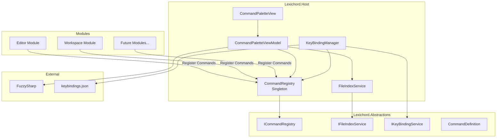
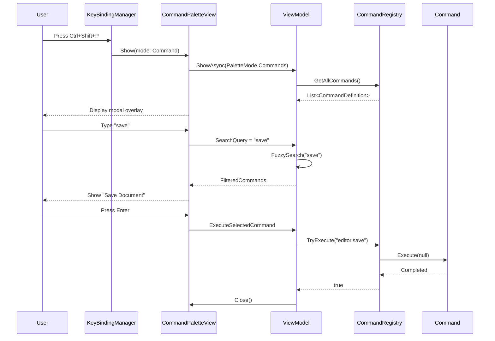

# LCS-DES-015: Design Specification Index — Command Palette (Conductor's Baton)

## Document Control

| Field              | Value                               |
| :----------------- | :---------------------------------- |
| **Document ID**    | LCS-DES-015-INDEX                   |
| **Feature ID**     | INF-015                             |
| **Feature Name**   | Command Palette (Conductor's Baton) |
| **Target Version** | v0.1.5                              |
| **Status**         | Draft                               |
| **Last Updated**   | 2026-01-27                          |

---

## Executive Summary

The Command Palette (Conductor's Baton) transforms Lexichord into a **keyboard-centric powerhouse**. Like VS Code's Ctrl+P or Sublime Text's Command Palette, this feature provides instant access to every application action through a single, unified interface.

**Business Value:**

- **Efficiency:** Expert users can perform any action in 2-3 keystrokes
- **Discoverability:** Searchable commands expose features users didn't know existed
- **Customization:** Users can remap shortcuts to match their muscle memory
- **Extensibility:** Modules register their own commands, enabling plugin-like capabilities
- **Accessibility:** Keyboard-first design benefits users who cannot use a mouse

---

## Related Documents

| Document Type       | Document ID  | Title                 | Path                |
| :------------------ | :----------- | :-------------------- | :------------------ |
| **Scope Breakdown** | LCS-SBD-015  | Command Palette Scope | `./LCS-SBD-015.md`  |
| **Sub-Part 015a**   | LCS-DES-015a | Command Registry      | `./LCS-DES-015a.md` |
| **Sub-Part 015b**   | LCS-DES-015b | Palette UI            | `./LCS-DES-015b.md` |
| **Sub-Part 015c**   | LCS-DES-015c | File Jumper           | `./LCS-DES-015c.md` |
| **Sub-Part 015d**   | LCS-DES-015d | Keybinding Service    | `./LCS-DES-015d.md` |

---

## Architecture Overview

### High-Level Component Diagram

### Data Flow: Command Execution

---

## Dependencies

### Upstream Dependencies

| Component             | Source Version | Usage                                            |
| :-------------------- | :------------- | :----------------------------------------------- |
| IModule               | v0.0.4         | Modules register commands via ICommandRegistry   |
| IWorkspaceService     | v0.1.2         | File Jumper indexes files from current workspace |
| IRegionManager        | v0.1.1         | Palette overlays the main window                 |
| IConfigurationService | v0.0.3d        | Store keybindings.json path                      |
| IMediator             | v0.0.7         | Publish CommandExecutedEvent for observability   |
| Serilog               | v0.0.3b        | Log command execution and search operations      |

### NuGet Packages

| Package                   | Version | Purpose                                       |
| :------------------------ | :------ | :-------------------------------------------- |
| `FuzzySharp`              | 2.x     | Fuzzy string matching for command/file search |
| `Material.Icons.Avalonia` | 2.x     | Command and file type icons                   |
| `CommunityToolkit.Mvvm`   | 8.x     | MVVM infrastructure (existing)                |

### Downstream Consumers

Future modules will consume:

- `ICommandRegistry` to register their own commands
- `IKeyBindingService` to provide default keybindings
- `CommandExecutedEvent` for analytics/telemetry

---

## License Gating Strategy

**Command Palette Core:** Available to all tiers (Free, Writer, WriterPro)

**Future Gating:**

- Custom palette themes → WriterPro tier
- Command history/frecency sorting → Writer tier (potential)
- Advanced context conditions → WriterPro tier (potential)

---

## Key Interfaces Summary

### ICommandRegistry (v0.1.5a)

Central registry for all application commands. Modules call `Register()` during initialization. Supports command execution, categorization, and eventing.

**See:** `LCS-DES-015a.md` for full specification

### IFileIndexService (v0.1.5c)

Service for indexing and searching workspace files. Maintains in-memory index rebuilt on workspace open and updated incrementally via file watchers.

**See:** `LCS-DES-015c.md` for full specification

### IKeyBindingService (v0.1.5d)

Manages keyboard shortcut mappings. Loads user bindings from `keybindings.json`, falls back to command defaults, handles conflict detection.

**See:** `LCS-DES-015d.md` for full specification

---

## Implementation Checklist Summary

| Sub-Part    | Est. Hours | Key Deliverables                                                    |
| :---------- | :--------- | :------------------------------------------------------------------ |
| **v0.1.5a** | 10h        | CommandRegistry, CommandDefinition, Events, Unit Tests              |
| **v0.1.5b** | 17.5h      | CommandPaletteView, ViewModel, FuzzySharp Integration, Keyboard Nav |
| **v0.1.5c** | 10h        | FileIndexService, Workspace Integration, Ctrl+P Activation          |
| **v0.1.5d** | 17.5h      | KeyBindingManager, keybindings.json, Settings UI, Hot-Reload        |
| **Total**   | **55h**    | Complete keyboard-centric command system                            |

**See:** `LCS-SBD-015.md` for detailed task breakdown

---

## Success Criteria Summary

### Performance Targets

| Metric                     | Target           | Rationale                                   |
| :------------------------- | :--------------- | :------------------------------------------ |
| Palette open time          | < 50ms           | Must feel instant, no perceived lag         |
| Search responsiveness      | < 16ms/keystroke | Must maintain 60fps during typing           |
| File indexing (1000 files) | < 2s             | Acceptable workspace open delay             |
| Command execution latency  | < 10ms           | Command should execute immediately          |
| Memory per command         | < 1KB            | Support thousands of commands without bloat |

### Functional Requirements

- ✅ All application commands accessible via Ctrl+Shift+P
- ✅ All workspace files accessible via Ctrl+P
- ✅ Fuzzy search matches partial terms in any order
- ✅ Keyboard navigation (Up/Down/Enter/Escape)
- ✅ User-customizable keybindings via JSON
- ✅ Conflict detection for duplicate keybindings
- ✅ Context-aware command availability

---

## Test Coverage Summary

### Unit Testing

| Component               | Coverage Target | Key Tests                                 |
| :---------------------- | :-------------- | :---------------------------------------- |
| CommandRegistry         | 100%            | Register, unregister, execute, events     |
| CommandPaletteViewModel | 95%             | Search, filter, selection, execution      |
| FileIndexService        | 100%            | Index rebuild, incremental update, search |
| KeyBindingManager       | 100%            | Load, save, conflict detection, parsing   |

### Integration Testing

- Command registration from modules
- Palette activation via keybindings
- File navigation opening in editor
- Keybinding JSON persistence round-trip

**See:** Individual sub-part specifications for detailed test requirements

---

## What This Enables

After v0.1.5, Lexichord will support:

1. **Keyboard-Centric Workflow**
    - All actions accessible without mouse
    - Instant file navigation with Ctrl+P
    - Unified command access with Ctrl+Shift+P

2. **User Customization**
    - Remap any keyboard shortcut
    - Preserve muscle memory from other apps
    - Context-aware keybindings

3. **Extensibility Foundation**
    - Modules contribute commands dynamically
    - Plugin-like command registration
    - Foundation for future vim-mode plugin
    - Foundation for command history and frecency sorting

4. **Accessibility**
    - Complete keyboard-only operation
    - Screen reader compatible modal interface
    - Clear focus management

---

## Risks & Mitigations

| Risk                                      | Impact | Mitigation                                 |
| :---------------------------------------- | :----- | :----------------------------------------- |
| FuzzySharp performance with many commands | Medium | Limit results; cache command list          |
| Large workspace indexing slow             | Medium | Background indexing; incremental updates   |
| Keybinding conflicts confuse users        | Medium | Clear conflict warnings; visual indicators |
| Platform-specific key differences         | High   | Abstract KeyGesture; platform detection    |
| Modal overlay accessibility issues        | Medium | Proper focus management; ARIA support      |

---

## Document History

| Version | Date       | Author           | Changes                                                      |
| :------ | :--------- | :--------------- | :----------------------------------------------------------- |
| 1.0     | 2026-01-27 | System Architect | Created INDEX from legacy LCS-INF-015 during standardization |
