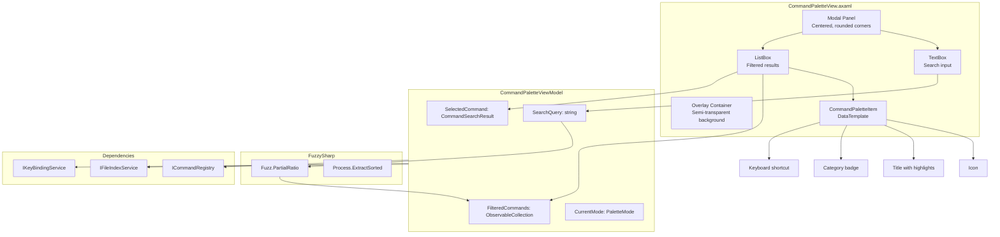
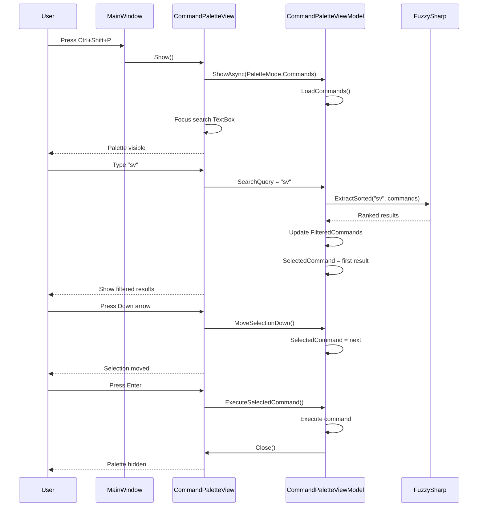

# LCS-DES-015b: Palette UI

## 1. Metadata & Categorization

| Field              | Value            | Description                         |
| :----------------- | :--------------- | :---------------------------------- |
| **Document ID**    | LCS-DES-015b     | Design Specification v0.1.5b        |
| **Feature ID**     | INF-015b         | Sub-part B of Command Palette       |
| **Feature Name**   | Palette UI       | Modal overlay with fuzzy search     |
| **Target Version** | `v0.1.5b`        | Second sub-part of v0.1.5           |
| **Module Scope**   | `Lexichord.Host` | Core infrastructure                 |
| **Swimlane**       | `Infrastructure` | The Podium (Platform)               |
| **License Tier**   | `Core`           | Foundation (Available in Free tier) |
| **Author**         | System Architect |                                     |
| **Status**         | **Draft**        | Pending implementation              |
| **Last Updated**   | 2026-01-27       |                                     |

---

## 2. Executive Summary

### 2.1 The Requirement

Lexichord needs a Command Palette UI that provides:

- Modal overlay centered in the main window.
- Text input for search queries.
- Fuzzy search filtering using FuzzySharp library.
- Keyboard navigation (Up/Down/Enter/Escape).
- Display of command metadata (icon, title, category, shortcut).
- Match highlighting to show why results matched.
- Fast, responsive filtering on each keystroke.

### 2.2 The Proposed Solution

We **SHALL** implement:

1. **CommandPaletteView** — Avalonia UserControl as modal overlay.
2. **CommandPaletteViewModel** — MVVM ViewModel with search and selection logic.
3. **CommandSearchResult** — Model for ranked search results with match positions.
4. **FuzzySharp Integration** — Efficient fuzzy string matching.
5. **Keyboard Navigation** — Full keyboard control without mouse.

---

## 3. Architecture

### 3.1 Component Structure



### 3.2 Palette Interaction Flow



### 3.3 Visual Layout

```text
+-------------------------------------------------------------------+
|                      [Semi-transparent overlay]                    |
|                                                                    |
|         +-----------------------------------------------+          |
|         |  > Search commands or files...         [Esc]  |          |
|         +-----------------------------------------------+          |
|         |                                               |          |
|         |  [icon] Save                          Ctrl+S  |          |
|         |         File                                  |          |
|         |                                               |          |
|         |  [icon] Save As...                Ctrl+Shift+S|  <--     |
|         |         File                                  |selected  |
|         |                                               |          |
|         |  [icon] Save All                              |          |
|         |         File                                  |          |
|         |                                               |          |
|         |  [icon] Settings                      Ctrl+,  |          |
|         |         View                                  |          |
|         |                                               |          |
|         +-----------------------------------------------+          |
|                                                                    |
+-------------------------------------------------------------------+
```

---

## 4. Decision Tree: Palette Behavior

```text
START: "User interacts with palette"
|
+-- Open palette (Ctrl+Shift+P or Ctrl+P)
|   +-- Is palette already open?
|   |   +-- YES --> Close current, open with new mode
|   |   +-- NO --> Show overlay, focus input
|   +-- Which shortcut?
|       +-- Ctrl+P --> Mode = Files, placeholder "filename..."
|       +-- Ctrl+Shift+P --> Mode = Commands, placeholder "> command..."
|
+-- User types in search input
|   +-- Is query empty?
|   |   +-- YES
|   |   |   +-- Mode = Files --> Show recent files
|   |   |   +-- Mode = Commands --> Show all commands by category
|   |   +-- NO
|   |       +-- Does query start with ">"?
|   |       |   +-- YES --> Switch to Commands mode, strip ">"
|   |       |   +-- NO --> Continue with current mode
|   |       +-- Run fuzzy search
|   |       +-- Update FilteredCommands
|   |       +-- Select first result
|
+-- User presses navigation key
|   +-- Up arrow --> Move selection up (wrap to bottom)
|   +-- Down arrow --> Move selection down (wrap to top)
|   +-- Page Up --> Move selection up by page
|   +-- Page Down --> Move selection down by page
|   +-- Home --> Select first result
|   +-- End --> Select last result
|
+-- User presses action key
|   +-- Enter
|   |   +-- Is something selected?
|   |   |   +-- YES --> Execute selected, close palette
|   |   |   +-- NO --> Do nothing
|   +-- Escape --> Close palette without action
|   +-- Tab --> Next mode (future: Commands -> Symbols -> Lines)
|
+-- User clicks outside palette
|   +-- Close palette without action
|
+-- User clicks on result
|   +-- Execute clicked item, close palette
|
+-- END
```

---

## 5. Data Contracts

### 5.1 CommandSearchResult Record

```csharp
namespace Lexichord.Host.ViewModels;

/// <summary>
/// Represents a search result in the Command Palette.
/// </summary>
/// <remarks>
/// LOGIC: CommandSearchResult wraps a CommandDefinition with:
/// - Fuzzy match score for ranking
/// - Match positions for highlighting
/// - Display-ready properties
///
/// Results are sorted by score (descending), then by title.
/// Higher scores indicate better matches.
/// </remarks>
public record CommandSearchResult
{
    /// <summary>
    /// Gets the underlying command definition.
    /// </summary>
    public required CommandDefinition Command { get; init; }

    /// <summary>
    /// Gets the fuzzy match score (0-100).
    /// </summary>
    /// <remarks>
    /// LOGIC: Score from FuzzySharp.
    /// 100 = exact match
    /// 0 = no match
    /// Typical threshold for display: >= 50
    /// </remarks>
    public int Score { get; init; }

    /// <summary>
    /// Gets the positions of matched characters in the title.
    /// </summary>
    /// <remarks>
    /// LOGIC: Used for highlight rendering.
    /// Each MatchPosition indicates a range of characters that matched.
    /// </remarks>
    public IReadOnlyList<MatchPosition> TitleMatches { get; init; } = Array.Empty<MatchPosition>();

    /// <summary>
    /// Gets the positions of matched characters in the category.
    /// </summary>
    public IReadOnlyList<MatchPosition> CategoryMatches { get; init; } = Array.Empty<MatchPosition>();

    /// <summary>
    /// Gets the formatted keyboard shortcut string.
    /// </summary>
    /// <remarks>
    /// LOGIC: Pre-formatted for display (e.g., "Ctrl+S").
    /// Null if no shortcut assigned.
    /// </remarks>
    public string? ShortcutDisplay { get; init; }

    /// <summary>
    /// Gets the icon kind for display.
    /// </summary>
    public string IconKind => Command.IconKind ?? "ConsoleLine";

    /// <summary>
    /// Gets the title for display.
    /// </summary>
    public string Title => Command.Title;

    /// <summary>
    /// Gets the category for display.
    /// </summary>
    public string Category => Command.Category;

    /// <summary>
    /// Gets the description for tooltip.
    /// </summary>
    public string? Description => Command.Description;
}

/// <summary>
/// Represents a range of matched characters.
/// </summary>
/// <param name="Start">Start index (inclusive).</param>
/// <param name="Length">Number of characters matched.</param>
public record MatchPosition(int Start, int Length);
```

### 5.2 FileSearchResult Record

```csharp
namespace Lexichord.Host.ViewModels;

/// <summary>
/// Represents a file search result in the Command Palette.
/// </summary>
/// <remarks>
/// LOGIC: FileSearchResult wraps a FileIndexEntry with:
/// - Fuzzy match score for ranking
/// - Match positions for highlighting
/// - Computed properties for display
/// </remarks>
public record FileSearchResult
{
    /// <summary>
    /// Gets the underlying file entry.
    /// </summary>
    public required FileIndexEntry File { get; init; }

    /// <summary>
    /// Gets the fuzzy match score (0-100).
    /// </summary>
    public int Score { get; init; }

    /// <summary>
    /// Gets the positions of matched characters in the filename.
    /// </summary>
    public IReadOnlyList<MatchPosition> FileNameMatches { get; init; } = Array.Empty<MatchPosition>();

    /// <summary>
    /// Gets the icon kind based on file extension.
    /// </summary>
    public string IconKind => File.IconKind;

    /// <summary>
    /// Gets the filename for display.
    /// </summary>
    public string FileName => File.FileName;

    /// <summary>
    /// Gets the relative path for display.
    /// </summary>
    public string RelativePath => File.RelativePath;

    /// <summary>
    /// Gets the full path for opening.
    /// </summary>
    public string FullPath => File.FullPath;
}
```

### 5.3 PaletteMode Enum

```csharp
namespace Lexichord.Host.ViewModels;

/// <summary>
/// Modes of the Command Palette.
/// </summary>
public enum PaletteMode
{
    /// <summary>
    /// Show commands from ICommandRegistry.
    /// </summary>
    Commands,

    /// <summary>
    /// Show files from IFileIndexService.
    /// </summary>
    Files,

    /// <summary>
    /// Show symbols in current document (future).
    /// </summary>
    Symbols,

    /// <summary>
    /// Go to specific line number (future).
    /// </summary>
    GoToLine
}
```

### 5.4 ICommandPaletteService Interface

```csharp
namespace Lexichord.Abstractions.Contracts;

/// <summary>
/// Service for controlling the Command Palette.
/// </summary>
/// <remarks>
/// LOGIC: ICommandPaletteService provides a programmatic API for:
/// - Opening the palette in different modes
/// - Closing the palette
/// - Checking if palette is visible
///
/// Used by keyboard shortcuts and menu commands.
/// </remarks>
public interface ICommandPaletteService
{
    /// <summary>
    /// Shows the Command Palette.
    /// </summary>
    /// <param name="mode">The mode to open in.</param>
    /// <param name="initialQuery">Optional initial search query.</param>
    Task ShowAsync(PaletteMode mode = PaletteMode.Commands, string? initialQuery = null);

    /// <summary>
    /// Hides the Command Palette.
    /// </summary>
    void Hide();

    /// <summary>
    /// Toggles the Command Palette visibility.
    /// </summary>
    /// <param name="mode">The mode to open in if showing.</param>
    Task ToggleAsync(PaletteMode mode = PaletteMode.Commands);

    /// <summary>
    /// Gets whether the palette is currently visible.
    /// </summary>
    bool IsVisible { get; }

    /// <summary>
    /// Gets the current palette mode.
    /// </summary>
    PaletteMode CurrentMode { get; }

    /// <summary>
    /// Event raised when palette visibility changes.
    /// </summary>
    event EventHandler<PaletteVisibilityChangedEventArgs>? VisibilityChanged;
}

/// <summary>
/// Event args for palette visibility changes.
/// </summary>
public class PaletteVisibilityChangedEventArgs : EventArgs
{
    public required bool IsVisible { get; init; }
    public required PaletteMode Mode { get; init; }
}
```

---

## 6. Implementation Logic

### 6.1 CommandPaletteViewModel

```csharp
using System.Collections.ObjectModel;
using Avalonia.Input;
using CommunityToolkit.Mvvm.ComponentModel;
using CommunityToolkit.Mvvm.Input;
using FuzzySharp;
using Lexichord.Abstractions.Contracts;
using Lexichord.Abstractions.Events;
using MediatR;
using Microsoft.Extensions.Logging;

namespace Lexichord.Host.ViewModels;

/// <summary>
/// ViewModel for the Command Palette.
/// </summary>
/// <remarks>
/// LOGIC: CommandPaletteViewModel manages:
///
/// Search Logic:
/// - Empty query shows all items (commands by category, files by recent)
/// - Non-empty query triggers fuzzy search via FuzzySharp
/// - Results are ranked by score, filtered above threshold
/// - Match positions calculated for highlighting
///
/// Navigation:
/// - Selected item tracks current highlight
/// - Up/Down wrap around list ends
/// - Enter executes selected, Escape closes
///
/// Modes:
/// - Commands: Shows commands from ICommandRegistry
/// - Files: Shows files from IFileIndexService
/// - Future: Symbols, GoToLine
/// </remarks>
public partial class CommandPaletteViewModel : ObservableObject
{
    private const int MinScoreThreshold = 40;
    private const int MaxResults = 50;

    private readonly ICommandRegistry _commandRegistry;
    private readonly IFileIndexService _fileIndexService;
    private readonly IKeyBindingService _keyBindingService;
    private readonly IEditorService _editorService;
    private readonly IMediator _mediator;
    private readonly ILogger<CommandPaletteViewModel> _logger;

    private List<CommandDefinition> _allCommands = new();
    private List<FileIndexEntry> _allFiles = new();

    [ObservableProperty]
    [NotifyPropertyChangedFor(nameof(Placeholder))]
    private PaletteMode _currentMode = PaletteMode.Commands;

    [ObservableProperty]
    private string _searchQuery = string.Empty;

    [ObservableProperty]
    private bool _isVisible;

    [ObservableProperty]
    private object? _selectedItem;

    public ObservableCollection<object> FilteredItems { get; } = new();

    /// <summary>
    /// Creates a new CommandPaletteViewModel.
    /// </summary>
    public CommandPaletteViewModel(
        ICommandRegistry commandRegistry,
        IFileIndexService fileIndexService,
        IKeyBindingService keyBindingService,
        IEditorService editorService,
        IMediator mediator,
        ILogger<CommandPaletteViewModel> logger)
    {
        _commandRegistry = commandRegistry;
        _fileIndexService = fileIndexService;
        _keyBindingService = keyBindingService;
        _editorService = editorService;
        _mediator = mediator;
        _logger = logger;
    }

    /// <summary>
    /// Gets the placeholder text based on current mode.
    /// </summary>
    public string Placeholder => CurrentMode switch
    {
        PaletteMode.Commands => "Type a command name...",
        PaletteMode.Files => "Type a filename...",
        PaletteMode.Symbols => "Type a symbol name...",
        PaletteMode.GoToLine => "Enter line number...",
        _ => "Search..."
    };

    /// <summary>
    /// Shows the palette in the specified mode.
    /// </summary>
    public async Task ShowAsync(PaletteMode mode, string? initialQuery = null)
    {
        _logger.LogInformation("Opening Command Palette in {Mode} mode", mode);

        CurrentMode = mode;
        SearchQuery = initialQuery ?? string.Empty;
        IsVisible = true;

        // LOGIC: Load data based on mode
        switch (mode)
        {
            case PaletteMode.Commands:
                _allCommands = _commandRegistry.GetAllCommands()
                    .Where(c => c.ShowInPalette)
                    .ToList();
                break;

            case PaletteMode.Files:
                _allFiles = _fileIndexService.GetRecentFiles(MaxResults).ToList();
                break;
        }

        UpdateFilteredItems();

        await _mediator.Publish(new CommandPaletteOpenedEvent(mode));
    }

    /// <summary>
    /// Hides the palette.
    /// </summary>
    [RelayCommand]
    public void Hide()
    {
        _logger.LogDebug("Closing Command Palette");
        IsVisible = false;
        SearchQuery = string.Empty;
        FilteredItems.Clear();
    }

    /// <summary>
    /// Executes the currently selected item.
    /// </summary>
    [RelayCommand]
    public async Task ExecuteSelectedAsync()
    {
        if (SelectedItem is null)
            return;

        switch (SelectedItem)
        {
            case CommandSearchResult commandResult:
                _logger.LogInformation(
                    "Executing command from palette: {CommandId}",
                    commandResult.Command.Id);

                Hide();
                _commandRegistry.TryExecute(commandResult.Command.Id);

                await _mediator.Publish(new CommandExecutedMediatREvent(
                    commandResult.Command.Id,
                    commandResult.Command.Title,
                    CommandSource.CommandPalette,
                    0,
                    true
                ));
                break;

            case FileSearchResult fileResult:
                _logger.LogInformation(
                    "Opening file from palette: {FilePath}",
                    fileResult.FullPath);

                Hide();
                await _editorService.OpenDocumentAsync(fileResult.FullPath);
                _fileIndexService.RecordFileAccess(fileResult.FullPath);
                break;
        }
    }

    /// <summary>
    /// Moves selection to the next item.
    /// </summary>
    [RelayCommand]
    public void MoveSelectionDown()
    {
        if (FilteredItems.Count == 0)
            return;

        var currentIndex = FilteredItems.IndexOf(SelectedItem!);
        var nextIndex = (currentIndex + 1) % FilteredItems.Count;
        SelectedItem = FilteredItems[nextIndex];
    }

    /// <summary>
    /// Moves selection to the previous item.
    /// </summary>
    [RelayCommand]
    public void MoveSelectionUp()
    {
        if (FilteredItems.Count == 0)
            return;

        var currentIndex = FilteredItems.IndexOf(SelectedItem!);
        var prevIndex = currentIndex <= 0 ? FilteredItems.Count - 1 : currentIndex - 1;
        SelectedItem = FilteredItems[prevIndex];
    }

    /// <summary>
    /// Moves selection down by a page.
    /// </summary>
    [RelayCommand]
    public void MoveSelectionPageDown()
    {
        if (FilteredItems.Count == 0)
            return;

        var currentIndex = FilteredItems.IndexOf(SelectedItem!);
        var nextIndex = Math.Min(currentIndex + 10, FilteredItems.Count - 1);
        SelectedItem = FilteredItems[nextIndex];
    }

    /// <summary>
    /// Moves selection up by a page.
    /// </summary>
    [RelayCommand]
    public void MoveSelectionPageUp()
    {
        if (FilteredItems.Count == 0)
            return;

        var currentIndex = FilteredItems.IndexOf(SelectedItem!);
        var prevIndex = Math.Max(currentIndex - 10, 0);
        SelectedItem = FilteredItems[prevIndex];
    }

    /// <summary>
    /// Selects the first item.
    /// </summary>
    [RelayCommand]
    public void SelectFirst()
    {
        if (FilteredItems.Count > 0)
            SelectedItem = FilteredItems[0];
    }

    /// <summary>
    /// Selects the last item.
    /// </summary>
    [RelayCommand]
    public void SelectLast()
    {
        if (FilteredItems.Count > 0)
            SelectedItem = FilteredItems[^1];
    }

    partial void OnSearchQueryChanged(string value)
    {
        _logger.LogDebug("Search query changed: \"{Query}\"", value);

        // LOGIC: Check for mode switch prefix
        if (CurrentMode == PaletteMode.Files && value.StartsWith(">"))
        {
            CurrentMode = PaletteMode.Commands;
            SearchQuery = value[1..].TrimStart();
            _allCommands = _commandRegistry.GetAllCommands()
                .Where(c => c.ShowInPalette)
                .ToList();
            return;
        }

        UpdateFilteredItems();
    }

    private void UpdateFilteredItems()
    {
        FilteredItems.Clear();

        var items = CurrentMode switch
        {
            PaletteMode.Commands => SearchCommands(SearchQuery),
            PaletteMode.Files => SearchFiles(SearchQuery),
            _ => Enumerable.Empty<object>()
        };

        foreach (var item in items.Take(MaxResults))
        {
            FilteredItems.Add(item);
        }

        // LOGIC: Auto-select first result
        SelectedItem = FilteredItems.FirstOrDefault();

        _logger.LogDebug(
            "Filtered items: {Count} results for query \"{Query}\"",
            FilteredItems.Count, SearchQuery);
    }

    private IEnumerable<CommandSearchResult> SearchCommands(string query)
    {
        if (string.IsNullOrWhiteSpace(query))
        {
            // LOGIC: Empty query shows all commands grouped by category
            return _allCommands
                .OrderBy(c => c.Category)
                .ThenBy(c => c.Title)
                .Select(c => CreateCommandResult(c, 100, Array.Empty<MatchPosition>()));
        }

        // LOGIC: Fuzzy search using FuzzySharp
        var results = new List<CommandSearchResult>();

        foreach (var command in _allCommands)
        {
            // Search against title, category, and tags
            var titleScore = Fuzz.PartialRatio(query, command.Title);
            var categoryScore = Fuzz.PartialRatio(query, command.Category);
            var tagScore = command.Tags?.Max(t => Fuzz.PartialRatio(query, t)) ?? 0;

            var maxScore = Math.Max(titleScore, Math.Max(categoryScore, tagScore));

            if (maxScore >= MinScoreThreshold)
            {
                var matches = CalculateMatchPositions(command.Title, query);
                results.Add(CreateCommandResult(command, maxScore, matches));
            }
        }

        return results.OrderByDescending(r => r.Score).ThenBy(r => r.Title);
    }

    private IEnumerable<FileSearchResult> SearchFiles(string query)
    {
        if (string.IsNullOrWhiteSpace(query))
        {
            // LOGIC: Empty query shows recent files
            return _allFiles
                .Select(f => new FileSearchResult
                {
                    File = f,
                    Score = 100
                });
        }

        // LOGIC: Search indexed files
        var searchResults = _fileIndexService.Search(query, MaxResults);

        return searchResults.Select(f =>
        {
            var score = Fuzz.PartialRatio(query, f.FileName);
            var matches = CalculateMatchPositions(f.FileName, query);

            return new FileSearchResult
            {
                File = f,
                Score = score,
                FileNameMatches = matches
            };
        });
    }

    private CommandSearchResult CreateCommandResult(
        CommandDefinition command,
        int score,
        IReadOnlyList<MatchPosition> matches)
    {
        var shortcut = _keyBindingService.GetBinding(command.Id);
        var shortcutDisplay = shortcut is not null
            ? _keyBindingService.FormatGesture(shortcut)
            : null;

        return new CommandSearchResult
        {
            Command = command,
            Score = score,
            TitleMatches = matches,
            ShortcutDisplay = shortcutDisplay
        };
    }

    private static IReadOnlyList<MatchPosition> CalculateMatchPositions(string text, string query)
    {
        // LOGIC: Simple substring matching for highlighting
        // Future: Use more sophisticated algorithm for fuzzy match positions

        var positions = new List<MatchPosition>();
        var textLower = text.ToLowerInvariant();
        var queryLower = query.ToLowerInvariant();

        var index = textLower.IndexOf(queryLower, StringComparison.Ordinal);
        if (index >= 0)
        {
            positions.Add(new MatchPosition(index, query.Length));
        }

        return positions;
    }
}
```

### 6.2 CommandPaletteView.axaml

```xml
<UserControl xmlns="https://github.com/avaloniaui"
             xmlns:x="http://schemas.microsoft.com/winfx/2006/xaml"
             xmlns:vm="using:Lexichord.Host.ViewModels"
             xmlns:mi="clr-namespace:Material.Icons.Avalonia;assembly=Material.Icons.Avalonia"
             x:Class="Lexichord.Host.Views.CommandPaletteView"
             x:DataType="vm:CommandPaletteViewModel"
             IsVisible="{Binding IsVisible}">

    <UserControl.Styles>
        <!-- Overlay background style -->
        <Style Selector="Border.overlay">
            <Setter Property="Background" Value="#80000000"/>
        </Style>

        <!-- Modal panel style -->
        <Style Selector="Border.modal">
            <Setter Property="Background" Value="{DynamicResource SystemAltHighColor}"/>
            <Setter Property="BorderBrush" Value="{DynamicResource SystemBaseMediumColor}"/>
            <Setter Property="BorderThickness" Value="1"/>
            <Setter Property="CornerRadius" Value="8"/>
            <Setter Property="BoxShadow" Value="0 8 32 0 #40000000"/>
            <Setter Property="Width" Value="600"/>
            <Setter Property="MaxHeight" Value="400"/>
        </Style>

        <!-- Search input style -->
        <Style Selector="TextBox.search">
            <Setter Property="BorderThickness" Value="0"/>
            <Setter Property="Background" Value="Transparent"/>
            <Setter Property="FontSize" Value="16"/>
            <Setter Property="Padding" Value="12"/>
        </Style>

        <!-- Result item styles -->
        <Style Selector="ListBoxItem">
            <Setter Property="Padding" Value="8,6"/>
        </Style>

        <Style Selector="ListBoxItem:selected /template/ ContentPresenter">
            <Setter Property="Background" Value="{DynamicResource SystemAccentColor}"/>
        </Style>

        <!-- Highlighted text style -->
        <Style Selector="Run.highlight">
            <Setter Property="Foreground" Value="{DynamicResource SystemAccentColor}"/>
            <Setter Property="FontWeight" Value="Bold"/>
        </Style>
    </UserControl.Styles>

    <!-- LOGIC: Full-window overlay that captures clicks outside modal -->
    <Border Classes="overlay"
            PointerPressed="OnOverlayPointerPressed">
        <Grid HorizontalAlignment="Center"
              VerticalAlignment="Top"
              Margin="0,100,0,0">

            <!-- LOGIC: Modal panel doesn't propagate click to overlay -->
            <Border Classes="modal"
                    PointerPressed="OnModalPointerPressed">
                <Grid RowDefinitions="Auto,*">

                    <!-- Search Input Row -->
                    <Grid Grid.Row="0" ColumnDefinitions="Auto,*,Auto">

                        <!-- Mode indicator -->
                        <TextBlock Grid.Column="0"
                                   Text=">"
                                   FontSize="16"
                                   FontWeight="Bold"
                                   Margin="12,12,0,12"
                                   Foreground="{DynamicResource SystemAccentColor}"
                                   IsVisible="{Binding CurrentMode, Converter={StaticResource EqualityConverter}, ConverterParameter=Commands}"/>

                        <!-- Search TextBox -->
                        <TextBox Grid.Column="1"
                                 x:Name="SearchInput"
                                 Classes="search"
                                 Text="{Binding SearchQuery, Mode=TwoWay}"
                                 Watermark="{Binding Placeholder}"
                                 KeyDown="OnSearchInputKeyDown"/>

                        <!-- Escape hint -->
                        <Border Grid.Column="2"
                                Background="{DynamicResource SystemBaseLowColor}"
                                CornerRadius="4"
                                Padding="6,2"
                                Margin="0,0,12,0"
                                VerticalAlignment="Center">
                            <TextBlock Text="Esc"
                                       FontSize="11"
                                       Foreground="{DynamicResource SystemBaseMediumColor}"/>
                        </Border>
                    </Grid>

                    <!-- Separator -->
                    <Rectangle Grid.Row="0"
                               VerticalAlignment="Bottom"
                               Height="1"
                               Fill="{DynamicResource SystemBaseMediumLowColor}"/>

                    <!-- Results List -->
                    <ListBox Grid.Row="1"
                             x:Name="ResultsList"
                             ItemsSource="{Binding FilteredItems}"
                             SelectedItem="{Binding SelectedItem, Mode=TwoWay}"
                             ScrollViewer.HorizontalScrollBarVisibility="Disabled"
                             DoubleTapped="OnResultDoubleTapped">
                        <ListBox.ItemTemplate>
                            <DataTemplate>
                                <!-- LOGIC: Template selector based on item type -->
                                <ContentControl Content="{Binding}">
                                    <ContentControl.DataTemplates>

                                        <!-- Command Result Template -->
                                        <DataTemplate DataType="vm:CommandSearchResult">
                                            <Grid ColumnDefinitions="Auto,*,Auto,Auto">
                                                <!-- Icon -->
                                                <mi:MaterialIcon Grid.Column="0"
                                                                 Kind="{Binding IconKind}"
                                                                 Width="20"
                                                                 Height="20"
                                                                 Margin="0,0,12,0"
                                                                 Foreground="{DynamicResource SystemBaseMediumHighColor}"/>

                                                <!-- Title and Category -->
                                                <StackPanel Grid.Column="1">
                                                    <TextBlock Text="{Binding Title}"
                                                               FontSize="14"/>
                                                    <TextBlock Text="{Binding Category}"
                                                               FontSize="11"
                                                               Foreground="{DynamicResource SystemBaseMediumColor}"/>
                                                </StackPanel>

                                                <!-- Shortcut Badge -->
                                                <Border Grid.Column="3"
                                                        IsVisible="{Binding ShortcutDisplay, Converter={x:Static ObjectConverters.IsNotNull}}"
                                                        Background="{DynamicResource SystemBaseLowColor}"
                                                        CornerRadius="4"
                                                        Padding="6,2"
                                                        VerticalAlignment="Center"
                                                        Margin="8,0,0,0">
                                                    <TextBlock Text="{Binding ShortcutDisplay}"
                                                               FontSize="11"
                                                               FontFamily="Cascadia Code, Consolas, monospace"
                                                               Foreground="{DynamicResource SystemBaseMediumHighColor}"/>
                                                </Border>
                                            </Grid>
                                        </DataTemplate>

                                        <!-- File Result Template -->
                                        <DataTemplate DataType="vm:FileSearchResult">
                                            <Grid ColumnDefinitions="Auto,*">
                                                <!-- Icon -->
                                                <mi:MaterialIcon Grid.Column="0"
                                                                 Kind="{Binding IconKind}"
                                                                 Width="20"
                                                                 Height="20"
                                                                 Margin="0,0,12,0"
                                                                 Foreground="{DynamicResource SystemBaseMediumHighColor}"/>

                                                <!-- Filename and Path -->
                                                <StackPanel Grid.Column="1">
                                                    <TextBlock Text="{Binding FileName}"
                                                               FontSize="14"/>
                                                    <TextBlock Text="{Binding RelativePath}"
                                                               FontSize="11"
                                                               Foreground="{DynamicResource SystemBaseMediumColor}"
                                                               TextTrimming="CharacterEllipsis"/>
                                                </StackPanel>
                                            </Grid>
                                        </DataTemplate>

                                    </ContentControl.DataTemplates>
                                </ContentControl>
                            </DataTemplate>
                        </ListBox.ItemTemplate>
                    </ListBox>

                    <!-- Empty state -->
                    <TextBlock Grid.Row="1"
                               Text="No results found"
                               HorizontalAlignment="Center"
                               VerticalAlignment="Center"
                               Foreground="{DynamicResource SystemBaseMediumColor}"
                               IsVisible="{Binding FilteredItems.Count, Converter={StaticResource EqualityConverter}, ConverterParameter=0}"/>
                </Grid>
            </Border>
        </Grid>
    </Border>
</UserControl>
```

### 6.3 CommandPaletteView.axaml.cs

```csharp
using Avalonia.Controls;
using Avalonia.Input;
using Avalonia.Interactivity;

namespace Lexichord.Host.Views;

/// <summary>
/// Code-behind for CommandPaletteView.
/// </summary>
/// <remarks>
/// LOGIC: Handles keyboard navigation and focus management.
/// Most logic is in ViewModel; this handles Avalonia-specific input.
/// </remarks>
public partial class CommandPaletteView : UserControl
{
    public CommandPaletteView()
    {
        InitializeComponent();

        // LOGIC: Focus search input when palette becomes visible
        PropertyChanged += (s, e) =>
        {
            if (e.Property.Name == nameof(IsVisible) && IsVisible)
            {
                SearchInput.Focus();
                SearchInput.SelectAll();
            }
        };
    }

    private void OnSearchInputKeyDown(object? sender, KeyEventArgs e)
    {
        var vm = DataContext as CommandPaletteViewModel;
        if (vm is null) return;

        switch (e.Key)
        {
            case Key.Down:
                vm.MoveSelectionDownCommand.Execute(null);
                e.Handled = true;
                break;

            case Key.Up:
                vm.MoveSelectionUpCommand.Execute(null);
                e.Handled = true;
                break;

            case Key.PageDown:
                vm.MoveSelectionPageDownCommand.Execute(null);
                e.Handled = true;
                break;

            case Key.PageUp:
                vm.MoveSelectionPageUpCommand.Execute(null);
                e.Handled = true;
                break;

            case Key.Home when e.KeyModifiers == KeyModifiers.Control:
                vm.SelectFirstCommand.Execute(null);
                e.Handled = true;
                break;

            case Key.End when e.KeyModifiers == KeyModifiers.Control:
                vm.SelectLastCommand.Execute(null);
                e.Handled = true;
                break;

            case Key.Enter:
                vm.ExecuteSelectedCommand.Execute(null);
                e.Handled = true;
                break;

            case Key.Escape:
                vm.HideCommand.Execute(null);
                e.Handled = true;
                break;

            case Key.Tab:
                // Future: Cycle through modes
                e.Handled = true;
                break;
        }
    }

    private void OnResultDoubleTapped(object? sender, TappedEventArgs e)
    {
        var vm = DataContext as CommandPaletteViewModel;
        vm?.ExecuteSelectedCommand.Execute(null);
    }

    private void OnOverlayPointerPressed(object? sender, PointerPressedEventArgs e)
    {
        // LOGIC: Click outside modal closes palette
        var vm = DataContext as CommandPaletteViewModel;
        vm?.HideCommand.Execute(null);
        e.Handled = true;
    }

    private void OnModalPointerPressed(object? sender, PointerPressedEventArgs e)
    {
        // LOGIC: Prevent clicks on modal from closing palette
        e.Handled = true;
    }
}
```

### 6.4 FuzzySharp Integration

```csharp
// FuzzySharp is a .NET port of the Python fuzzywuzzy library
// Install: dotnet add package FuzzySharp

// Usage examples from the implementation:

// 1. Simple partial ratio (used for search)
var score = Fuzz.PartialRatio("sv", "Save"); // Returns ~80

// 2. Extract sorted (alternative approach)
var results = Process.ExtractSorted(
    query: "sv",
    choices: commands.Select(c => c.Title),
    scorer: ScorerCache.Get<DefaultRatioScorer>(),
    cutoff: 40
);

// 3. Token set ratio (for multi-word queries)
var score = Fuzz.TokenSetRatio("save document", "Save the Document");
```

---

## 7. Use Cases

### UC-01: Open Palette and Execute Command

**Preconditions:**

- Application is running.
- Commands are registered.

**Flow:**

1. User presses Ctrl+Shift+P.
2. Palette appears centered in window.
3. Search input is focused.
4. All commands shown grouped by category.
5. User types "sv".
6. Results filter to "Save", "Save As...".
7. "Save" is highlighted.
8. User presses Enter.
9. Palette closes.
10. Save command executes.

**Postconditions:**

- Document saved.
- Palette hidden.

---

### UC-02: Navigate Results with Keyboard

**Preconditions:**

- Palette is open with results.

**Flow:**

1. User types "file".
2. Multiple file commands shown.
3. First result is selected.
4. User presses Down arrow 3 times.
5. Fourth result is now selected.
6. User presses Up arrow once.
7. Third result is now selected.
8. User presses Enter.
9. Third command executes.

**Postconditions:**

- Correct command executed.
- Selection tracking worked.

---

### UC-03: Close Without Action

**Preconditions:**

- Palette is open.

**Flow:**

1. User types "something".
2. Results shown.
3. User presses Escape.
4. Palette closes.
5. No command executed.

**Alternative Flow (click outside):** 3. User clicks on overlay (outside modal). 4. Palette closes. 5. No command executed.

**Postconditions:**

- Palette hidden.
- No side effects.

---

## 8. Observability & Logging

| Level       | Context                 | Message Template                                      |
| :---------- | :---------------------- | :---------------------------------------------------- |
| Information | CommandPaletteViewModel | `Opening Command Palette in {Mode} mode`              |
| Debug       | CommandPaletteViewModel | `Search query changed: "{Query}"`                     |
| Debug       | CommandPaletteViewModel | `Filtered items: {Count} results for query "{Query}"` |
| Information | CommandPaletteViewModel | `Executing command from palette: {CommandId}`         |
| Information | CommandPaletteViewModel | `Opening file from palette: {FilePath}`               |
| Debug       | CommandPaletteViewModel | `Closing Command Palette`                             |

---

## 9. Unit Testing Requirements

### 9.1 CommandPaletteViewModel Tests

```csharp
[TestFixture]
[Category("Unit")]
public class CommandPaletteViewModelTests
{
    private Mock<ICommandRegistry> _mockRegistry = null!;
    private Mock<IFileIndexService> _mockFileIndex = null!;
    private Mock<IKeyBindingService> _mockKeyBinding = null!;
    private Mock<IEditorService> _mockEditor = null!;
    private Mock<IMediator> _mockMediator = null!;
    private Mock<ILogger<CommandPaletteViewModel>> _mockLogger = null!;
    private CommandPaletteViewModel _sut = null!;

    [SetUp]
    public void SetUp()
    {
        _mockRegistry = new Mock<ICommandRegistry>();
        _mockFileIndex = new Mock<IFileIndexService>();
        _mockKeyBinding = new Mock<IKeyBindingService>();
        _mockEditor = new Mock<IEditorService>();
        _mockMediator = new Mock<IMediator>();
        _mockLogger = new Mock<ILogger<CommandPaletteViewModel>>();

        _mockRegistry.Setup(r => r.GetAllCommands()).Returns(new List<CommandDefinition>
        {
            new("file.save", "Save", "File", null, _ => { }) { ShowInPalette = true },
            new("file.saveAs", "Save As...", "File", null, _ => { }) { ShowInPalette = true },
            new("edit.undo", "Undo", "Edit", null, _ => { }) { ShowInPalette = true },
            new("edit.redo", "Redo", "Edit", null, _ => { }) { ShowInPalette = true },
        });

        _mockKeyBinding.Setup(k => k.GetBinding(It.IsAny<string>())).Returns((KeyGesture?)null);
        _mockKeyBinding.Setup(k => k.FormatGesture(It.IsAny<KeyGesture>())).Returns("Ctrl+S");

        _sut = new CommandPaletteViewModel(
            _mockRegistry.Object,
            _mockFileIndex.Object,
            _mockKeyBinding.Object,
            _mockEditor.Object,
            _mockMediator.Object,
            _mockLogger.Object
        );
    }

    [Test]
    public async Task ShowAsync_CommandMode_LoadsCommands()
    {
        // Act
        await _sut.ShowAsync(PaletteMode.Commands);

        // Assert
        Assert.Multiple(() =>
        {
            Assert.That(_sut.IsVisible, Is.True);
            Assert.That(_sut.CurrentMode, Is.EqualTo(PaletteMode.Commands));
            Assert.That(_sut.FilteredItems.Count, Is.EqualTo(4));
        });
    }

    [Test]
    public async Task SearchQuery_EmptyInCommandMode_ShowsAllCommands()
    {
        // Arrange
        await _sut.ShowAsync(PaletteMode.Commands);

        // Act
        _sut.SearchQuery = "";

        // Assert
        Assert.That(_sut.FilteredItems.Count, Is.EqualTo(4));
    }

    [Test]
    public async Task SearchQuery_FuzzyMatch_FiltersResults()
    {
        // Arrange
        await _sut.ShowAsync(PaletteMode.Commands);

        // Act
        _sut.SearchQuery = "sv";

        // Assert - Should match "Save" and "Save As"
        Assert.That(_sut.FilteredItems.Count, Is.EqualTo(2));
        Assert.That(_sut.FilteredItems.Cast<CommandSearchResult>().All(
            r => r.Title.Contains("Save", StringComparison.OrdinalIgnoreCase)), Is.True);
    }

    [Test]
    public async Task SearchQuery_NoMatch_ReturnsEmpty()
    {
        // Arrange
        await _sut.ShowAsync(PaletteMode.Commands);

        // Act
        _sut.SearchQuery = "xyz123nonexistent";

        // Assert
        Assert.That(_sut.FilteredItems.Count, Is.EqualTo(0));
    }

    [Test]
    public async Task SearchQuery_GreaterThanPrefix_SwitchesToCommandMode()
    {
        // Arrange
        await _sut.ShowAsync(PaletteMode.Files);
        Assert.That(_sut.CurrentMode, Is.EqualTo(PaletteMode.Files));

        // Act
        _sut.SearchQuery = ">sv";

        // Assert
        Assert.That(_sut.CurrentMode, Is.EqualTo(PaletteMode.Commands));
    }

    [Test]
    public async Task MoveSelectionDown_WrapsAround()
    {
        // Arrange
        await _sut.ShowAsync(PaletteMode.Commands);
        _sut.SelectedItem = _sut.FilteredItems.Last();

        // Act
        _sut.MoveSelectionDownCommand.Execute(null);

        // Assert - Should wrap to first item
        Assert.That(_sut.SelectedItem, Is.EqualTo(_sut.FilteredItems[0]));
    }

    [Test]
    public async Task MoveSelectionUp_WrapsAround()
    {
        // Arrange
        await _sut.ShowAsync(PaletteMode.Commands);
        _sut.SelectedItem = _sut.FilteredItems[0];

        // Act
        _sut.MoveSelectionUpCommand.Execute(null);

        // Assert - Should wrap to last item
        Assert.That(_sut.SelectedItem, Is.EqualTo(_sut.FilteredItems.Last()));
    }

    [Test]
    public async Task ExecuteSelected_CallsRegistryTryExecute()
    {
        // Arrange
        await _sut.ShowAsync(PaletteMode.Commands);
        _sut.SearchQuery = "save";
        var selected = _sut.SelectedItem as CommandSearchResult;
        _mockRegistry.Setup(r => r.TryExecute(selected!.Command.Id, null)).Returns(true);

        // Act
        await _sut.ExecuteSelectedAsync();

        // Assert
        _mockRegistry.Verify(r => r.TryExecute(selected!.Command.Id, null), Times.Once);
        Assert.That(_sut.IsVisible, Is.False);
    }

    [Test]
    public void Hide_ClearsStateAndClosePalette()
    {
        // Arrange
        _sut.IsVisible = true;
        _sut.SearchQuery = "something";

        // Act
        _sut.HideCommand.Execute(null);

        // Assert
        Assert.Multiple(() =>
        {
            Assert.That(_sut.IsVisible, Is.False);
            Assert.That(_sut.SearchQuery, Is.Empty);
            Assert.That(_sut.FilteredItems.Count, Is.EqualTo(0));
        });
    }

    [Test]
    public async Task SelectedItem_DefaultsToFirstResult()
    {
        // Act
        await _sut.ShowAsync(PaletteMode.Commands);

        // Assert
        Assert.That(_sut.SelectedItem, Is.EqualTo(_sut.FilteredItems[0]));
    }
}
```

### 9.2 FuzzySearch Tests

```csharp
[TestFixture]
[Category("Unit")]
public class FuzzySearchTests
{
    [TestCase("sv", "Save", true)]
    [TestCase("sva", "Save As", true)]
    [TestCase("und", "Undo", true)]
    [TestCase("xyz", "Save", false)]
    public void PartialRatio_MatchesExpected(string query, string target, bool shouldMatch)
    {
        // Arrange
        const int threshold = 40;

        // Act
        var score = Fuzz.PartialRatio(query, target);

        // Assert
        Assert.That(score >= threshold, Is.EqualTo(shouldMatch));
    }

    [Test]
    public void SearchCommands_OrdersByScore()
    {
        // Arrange
        var commands = new List<string> { "Save All", "Save", "Save As..." };
        var query = "sav";

        // Act
        var results = commands
            .Select(c => (Command: c, Score: Fuzz.PartialRatio(query, c)))
            .OrderByDescending(r => r.Score)
            .ToList();

        // Assert - "Save" should rank highest (exact prefix match)
        Assert.That(results[0].Command, Is.EqualTo("Save"));
    }
}
```

---

## 10. Security & Safety

### 10.1 Input Handling

> [!NOTE]
> Search queries are text only. No code execution.

- **No Injection:** Search is fuzzy string matching, not evaluated code.
- **Length Limits:** Maximum query length to prevent DoS.
- **Safe Comparison:** Case-insensitive comparison, no regex by default.

### 10.2 Focus Management

> [!WARNING]
> Palette steals focus when opened. Must restore focus on close.

- Track previous focused element.
- Restore focus to previous element on close.
- Handle edge case where previous element no longer exists.

---

## 11. Risks & Mitigations

| Risk                                 | Impact | Mitigation                                |
| :----------------------------------- | :----- | :---------------------------------------- |
| Fuzzy search slow with many commands | Medium | Limit results; cache command list         |
| Memory allocation per keystroke      | Medium | Reuse collections; avoid LINQ in hot path |
| Focus issues on close                | Medium | Track and restore focus explicitly        |
| Overlay blocks interaction           | Low    | Click-through on overlay area             |
| Results list performance             | Low    | Virtualization; limit visible items       |

---

## 12. Acceptance Criteria (QA)

| #   | Category          | Criterion                                  |
| :-- | :---------------- | :----------------------------------------- |
| 1   | **[Open]**        | Ctrl+Shift+P opens palette in command mode |
| 2   | **[Open]**        | Ctrl+P opens palette in file mode          |
| 3   | **[Focus]**       | Search input is focused on open            |
| 4   | **[Search]**      | Typing filters results                     |
| 5   | **[Search]**      | Fuzzy matching works ("sv" -> "Save")      |
| 6   | **[Search]**      | Empty query shows all items                |
| 7   | **[Navigation]**  | Up arrow moves selection up                |
| 8   | **[Navigation]**  | Down arrow moves selection down            |
| 9   | **[Navigation]**  | Selection wraps at list ends               |
| 10  | **[Execute]**     | Enter executes selected command            |
| 11  | **[Execute]**     | Double-click executes clicked item         |
| 12  | **[Close]**       | Escape closes palette                      |
| 13  | **[Close]**       | Click outside closes palette               |
| 14  | **[Display]**     | Icon shown for each command                |
| 15  | **[Display]**     | Shortcut badge shown when available        |
| 16  | **[Display]**     | Category shown below title                 |
| 17  | **[Mode]**        | ">" prefix switches to command mode        |
| 18  | **[Performance]** | Palette opens in < 50ms                    |
| 19  | **[Performance]** | Search responds in < 16ms                  |

---

## 13. Verification Commands

```bash
# 1. Install FuzzySharp package
dotnet add src/Lexichord.Host package FuzzySharp

# 2. Build the solution
dotnet build

# 3. Run unit tests
dotnet test --filter "FullyQualifiedName~CommandPalette"
dotnet test --filter "FullyQualifiedName~FuzzySearch"

# 4. Run application
dotnet run --project src/Lexichord.Host

# 5. Manual testing:
# - Press Ctrl+Shift+P - palette should open
# - Type "save" - should filter to save commands
# - Press Down - selection should move
# - Press Enter - command should execute
# - Press Escape - palette should close

# 6. Performance test:
# Register 100 commands, measure palette open time
# Type rapidly, ensure no lag
```

---

## 14. Deliverable Checklist

| Step | Description                             | Status |
| :--- | :-------------------------------------- | :----- |
| 1    | Install FuzzySharp NuGet package        | [ ]    |
| 2    | Define PaletteMode enum                 | [ ]    |
| 3    | Define CommandSearchResult record       | [ ]    |
| 4    | Define FileSearchResult record          | [ ]    |
| 5    | Define MatchPosition record             | [ ]    |
| 6    | Define ICommandPaletteService interface | [ ]    |
| 7    | Create CommandPaletteViewModel          | [ ]    |
| 8    | Implement fuzzy search with FuzzySharp  | [ ]    |
| 9    | Implement selection navigation          | [ ]    |
| 10   | Implement mode switching                | [ ]    |
| 11   | Create CommandPaletteView.axaml         | [ ]    |
| 12   | Create command result DataTemplate      | [ ]    |
| 13   | Create file result DataTemplate         | [ ]    |
| 14   | Implement keyboard event handling       | [ ]    |
| 15   | Implement overlay click handling        | [ ]    |
| 16   | Register Ctrl+Shift+P shortcut          | [ ]    |
| 17   | Register Ctrl+P shortcut                | [ ]    |
| 18   | Unit tests for ViewModel                | [ ]    |
| 19   | Unit tests for fuzzy search             | [ ]    |
| 20   | Integration tests for palette           | [ ]    |
