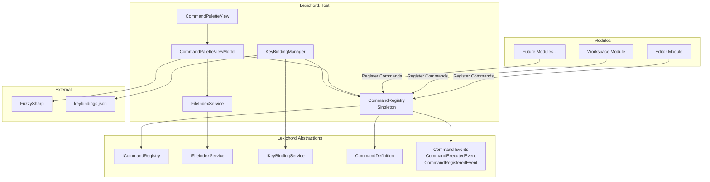
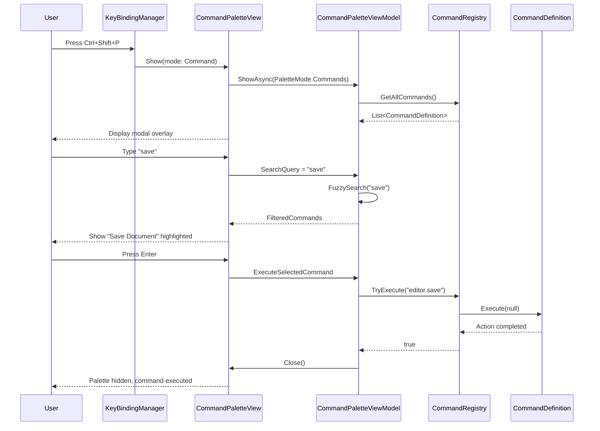
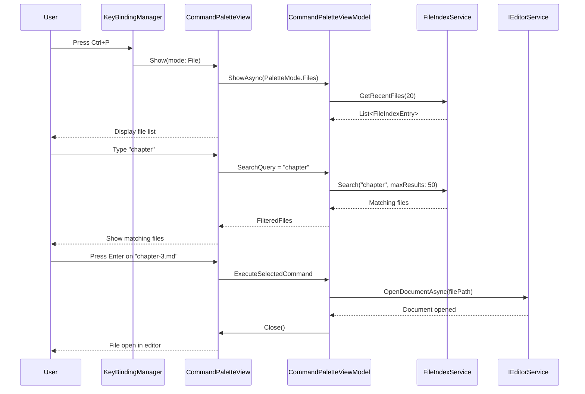
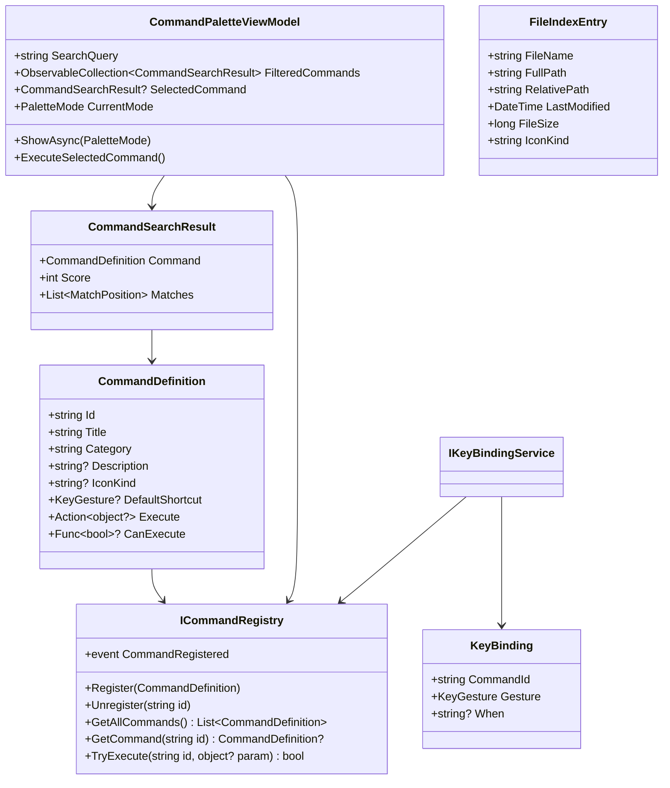

# LCS-INF-015: Feature Design Specification — Command Palette (Conductor's Baton)

## 1. Metadata & Categorization

| Field                | Value                                    | Description                                           |
| :------------------- | :--------------------------------------- | :---------------------------------------------------- |
| **Feature ID**       | `INF-015`                                | Infrastructure - Command Palette                      |
| **Feature Name**     | Command Palette (Conductor's Baton)      | Keyboard-centric command execution system             |
| **Target Version**   | `v0.1.5`                                 | Productivity Enhancement Milestone                    |
| **Module Scope**     | `Lexichord.Host`                         | Core infrastructure in Host                           |
| **Swimlane**         | `Infrastructure`                         | The Podium (Platform)                                 |
| **License Tier**     | `Core`                                   | Foundation (Available in Free tier)                   |
| **Feature Gate Key** | N/A                                      | No runtime gating for core palette                    |
| **Author**           | System Architect                         |                                                       |
| **Status**           | **Draft**                                | Pending implementation                                |
| **Last Updated**     | 2026-01-26                               |                                                       |

---

## 2. Executive Summary

### 2.1 The Requirement

Lexichord needs a **unified command interface** that enables:

- Keyboard-first interaction with all application features.
- Quick file navigation without touching the mouse.
- Discoverable access to all registered commands.
- User-customizable keyboard shortcuts.
- Extensibility for module-contributed actions.

Without this infrastructure:
- Users must navigate menus for every action.
- No keyboard-centric workflow for power users.
- No unified way to discover available features.
- No ability to customize keyboard shortcuts.
- Modules cannot contribute searchable actions.

### 2.2 The Proposed Solution

We **SHALL** implement a complete Command Palette system with:

1. **v0.1.5a: Command Registry** — `ICommandRegistry` allowing modules to register Actions with metadata.
2. **v0.1.5b: Palette UI** — Modal overlay with FuzzySharp fuzzy search filtering.
3. **v0.1.5c: File Jumper** — Index workspace files for instant navigation.
4. **v0.1.5d: Keybinding Service** — `KeyBindingManager` with keybindings.json configuration.

---

## 3. Architecture & Modular Strategy

### 3.1 High-Level Architecture



### 3.2 Command Execution Sequence



### 3.3 File Navigation Sequence



### 3.4 Class Diagram



### 3.5 Dependencies

**NuGet Packages:**

| Package | Version | Purpose |
|:--------|:--------|:--------|
| `FuzzySharp` | 2.x | Fuzzy string matching |
| `Material.Icons.Avalonia` | 2.x | Command/file icons |
| `CommunityToolkit.Mvvm` | 8.x | MVVM infrastructure (existing) |

**Project References:**

| Project | Reference Direction |
|:--------|:--------------------|
| `Lexichord.Host` | -> `Lexichord.Abstractions` |
| `Lexichord.Modules.*` | -> `Lexichord.Abstractions` (for ICommandRegistry) |

### 3.6 Licensing Behavior

- **N/A for Command Palette:** Core infrastructure available to all tiers.
- Future: Custom command palette themes may be gated to WriterPro tier.

---

## 4. Decision Tree: Command Palette Operations

```text
START: "User invokes Command Palette"
|
+-- Which keyboard shortcut?
|   +-- Ctrl+P --> Open in File mode
|   +-- Ctrl+Shift+P --> Open in Command mode
|   +-- Escape (while open) --> Close palette
|
+-- What is the search query?
|   +-- Empty query
|   |   +-- File mode --> Show recent files
|   |   +-- Command mode --> Show all commands by category
|   +-- Starts with ">"
|   |   --> Switch to Command mode, search without ">"
|   +-- Starts with "@"
|   |   --> Future: Symbol search
|   +-- Starts with ":"
|   |   --> Go to line number (if in editor)
|   +-- Other text
|   |   +-- File mode --> Fuzzy search files
|   |   +-- Command mode --> Fuzzy search commands
|
+-- User navigates results
|   +-- Up/Down arrow --> Move selection
|   +-- Page Up/Down --> Move selection by page
|   +-- Home/End --> First/last result
|   +-- Enter --> Execute selected
|   +-- Click on result --> Execute clicked
|
+-- Execute selected item
|   +-- Is it a command?
|   |   +-- YES --> ICommandRegistry.TryExecute(id)
|   |   |   +-- Success --> Close palette
|   |   |   +-- Failure --> Show error toast
|   |   +-- NO --> Is it a file?
|   |       +-- YES --> IEditorService.OpenDocumentAsync(path)
|   |       +-- NO --> No-op
|
+-- END
```

---

## 5. Data Contracts

### 5.1 CommandDefinition Record

```csharp
namespace Lexichord.Abstractions.Contracts;

using Avalonia.Input;

/// <summary>
/// Defines a command that can be registered with the Command Registry.
/// </summary>
/// <remarks>
/// LOGIC: CommandDefinition is the fundamental unit of the command system.
/// Each command has:
/// - A unique ID (following convention: "module.action", e.g., "editor.save")
/// - A human-readable title for display in the palette
/// - An optional category for grouping
/// - An optional default keyboard shortcut
/// - An execute action that performs the command
/// - An optional canExecute predicate for enabling/disabling
///
/// Commands are registered by modules during initialization and
/// remain available for the lifetime of the application.
/// </remarks>
/// <param name="Id">Unique identifier (e.g., "editor.save", "workspace.openFolder").</param>
/// <param name="Title">Display title in Command Palette.</param>
/// <param name="Category">Category for grouping (e.g., "File", "Edit", "View").</param>
/// <param name="DefaultShortcut">Default keyboard shortcut (user can override).</param>
/// <param name="Execute">Action to execute when command is invoked.</param>
public record CommandDefinition(
    string Id,
    string Title,
    string Category,
    KeyGesture? DefaultShortcut,
    Action<object?> Execute
)
{
    /// <summary>
    /// Gets or sets the command description for tooltips.
    /// </summary>
    public string? Description { get; init; }

    /// <summary>
    /// Gets or sets the Material icon kind for display.
    /// </summary>
    /// <remarks>
    /// LOGIC: Icon names from Material.Icons.Avalonia package.
    /// Examples: "ContentSave", "FolderOpen", "Magnify"
    /// </remarks>
    public string? IconKind { get; init; }

    /// <summary>
    /// Gets or sets the predicate to determine if command can execute.
    /// </summary>
    /// <remarks>
    /// LOGIC: If null, command is always executable.
    /// Used to disable commands based on current state
    /// (e.g., "Save" disabled when no document is open).
    /// </remarks>
    public Func<bool>? CanExecute { get; init; }

    /// <summary>
    /// Gets or sets the context in which this command is available.
    /// </summary>
    /// <remarks>
    /// LOGIC: Contexts like "editorFocus", "explorerFocus" allow
    /// commands to only be active in specific parts of the UI.
    /// </remarks>
    public string? Context { get; init; }

    /// <summary>
    /// Gets or sets additional tags for search enhancement.
    /// </summary>
    /// <remarks>
    /// LOGIC: Alternative search terms that match this command.
    /// Example: "Save" command might have tags ["write", "store", "persist"]
    /// </remarks>
    public IReadOnlyList<string>? Tags { get; init; }
}
```

### 5.2 ICommandRegistry Interface

```csharp
namespace Lexichord.Abstractions.Contracts;

/// <summary>
/// Central registry for all application commands.
/// </summary>
/// <remarks>
/// LOGIC: The CommandRegistry is a singleton in Lexichord.Host that:
/// - Stores all registered CommandDefinitions
/// - Provides search and lookup functionality
/// - Handles command execution with parameter passing
/// - Publishes events for observability
///
/// Modules register commands during IModule.InitializeAsync().
/// The registry survives the entire application lifetime.
/// </remarks>
public interface ICommandRegistry
{
    /// <summary>
    /// Registers a new command with the registry.
    /// </summary>
    /// <param name="command">The command definition to register.</param>
    /// <exception cref="ArgumentException">Thrown if command ID already exists.</exception>
    /// <remarks>
    /// LOGIC: Command IDs must be unique. Duplicate registration throws.
    /// Use Unregister first if replacing a command.
    /// </remarks>
    void Register(CommandDefinition command);

    /// <summary>
    /// Registers multiple commands at once.
    /// </summary>
    /// <param name="commands">The commands to register.</param>
    void RegisterRange(IEnumerable<CommandDefinition> commands);

    /// <summary>
    /// Removes a command from the registry.
    /// </summary>
    /// <param name="commandId">The ID of the command to remove.</param>
    /// <returns>True if command was found and removed.</returns>
    bool Unregister(string commandId);

    /// <summary>
    /// Gets all registered commands.
    /// </summary>
    /// <returns>Read-only list of all commands.</returns>
    IReadOnlyList<CommandDefinition> GetAllCommands();

    /// <summary>
    /// Gets commands filtered by category.
    /// </summary>
    /// <param name="category">The category to filter by.</param>
    /// <returns>Commands in the specified category.</returns>
    IReadOnlyList<CommandDefinition> GetCommandsByCategory(string category);

    /// <summary>
    /// Gets all unique categories.
    /// </summary>
    /// <returns>List of category names.</returns>
    IReadOnlyList<string> GetCategories();

    /// <summary>
    /// Gets a specific command by ID.
    /// </summary>
    /// <param name="commandId">The command ID to look up.</param>
    /// <returns>The command, or null if not found.</returns>
    CommandDefinition? GetCommand(string commandId);

    /// <summary>
    /// Attempts to execute a command by ID.
    /// </summary>
    /// <param name="commandId">The command ID to execute.</param>
    /// <param name="parameter">Optional parameter to pass to the command.</param>
    /// <returns>True if command was found and executed successfully.</returns>
    /// <remarks>
    /// LOGIC: Checks CanExecute before execution.
    /// Publishes CommandExecutedEvent on success.
    /// Catches and logs exceptions from Execute.
    /// </remarks>
    bool TryExecute(string commandId, object? parameter = null);

    /// <summary>
    /// Gets the total count of registered commands.
    /// </summary>
    int CommandCount { get; }

    /// <summary>
    /// Event raised when a command is registered.
    /// </summary>
    event EventHandler<CommandRegisteredEventArgs>? CommandRegistered;

    /// <summary>
    /// Event raised when a command is unregistered.
    /// </summary>
    event EventHandler<CommandUnregisteredEventArgs>? CommandUnregistered;

    /// <summary>
    /// Event raised when a command is executed.
    /// </summary>
    event EventHandler<CommandExecutedEventArgs>? CommandExecuted;
}

/// <summary>
/// Event args for command registration.
/// </summary>
public class CommandRegisteredEventArgs : EventArgs
{
    public required CommandDefinition Command { get; init; }
}

/// <summary>
/// Event args for command unregistration.
/// </summary>
public class CommandUnregisteredEventArgs : EventArgs
{
    public required string CommandId { get; init; }
}

/// <summary>
/// Event args for command execution.
/// </summary>
public class CommandExecutedEventArgs : EventArgs
{
    public required string CommandId { get; init; }
    public object? Parameter { get; init; }
    public required bool Success { get; init; }
    public Exception? Exception { get; init; }
    public required TimeSpan Duration { get; init; }
}
```

### 5.3 IFileIndexService Interface

```csharp
namespace Lexichord.Abstractions.Contracts;

/// <summary>
/// Service for indexing and searching workspace files.
/// </summary>
/// <remarks>
/// LOGIC: FileIndexService provides fast file lookup for the Command Palette.
/// It maintains an in-memory index of all files in the workspace:
/// - Rebuilt when workspace opens
/// - Updated incrementally on file watcher events
/// - Supports fuzzy search by filename
/// - Tracks file metadata (size, modified time)
/// </remarks>
public interface IFileIndexService
{
    /// <summary>
    /// Rebuilds the entire file index from scratch.
    /// </summary>
    /// <param name="workspaceRoot">Root path of the workspace.</param>
    /// <param name="cancellationToken">Cancellation token.</param>
    /// <remarks>
    /// LOGIC: Called when a workspace is opened.
    /// Walks directory tree recursively.
    /// Respects ignore patterns (.git, node_modules, etc.)
    /// </remarks>
    Task RebuildIndexAsync(string workspaceRoot, CancellationToken cancellationToken = default);

    /// <summary>
    /// Updates the index for a single file.
    /// </summary>
    /// <param name="filePath">Path to the file.</param>
    /// <param name="action">What happened to the file.</param>
    /// <remarks>
    /// LOGIC: Called by file watcher handler.
    /// More efficient than full rebuild for single file changes.
    /// </remarks>
    void UpdateFile(string filePath, FileIndexAction action);

    /// <summary>
    /// Clears the file index.
    /// </summary>
    /// <remarks>
    /// LOGIC: Called when workspace is closed.
    /// </remarks>
    void Clear();

    /// <summary>
    /// Searches for files matching the query.
    /// </summary>
    /// <param name="query">Search query (filename or partial match).</param>
    /// <param name="maxResults">Maximum results to return.</param>
    /// <returns>Matching files sorted by relevance.</returns>
    IReadOnlyList<FileIndexEntry> Search(string query, int maxResults = 50);

    /// <summary>
    /// Gets recently accessed files.
    /// </summary>
    /// <param name="maxResults">Maximum results to return.</param>
    /// <returns>Recently opened files.</returns>
    IReadOnlyList<FileIndexEntry> GetRecentFiles(int maxResults = 20);

    /// <summary>
    /// Records that a file was opened (for recent files tracking).
    /// </summary>
    /// <param name="filePath">Path of the opened file.</param>
    void RecordFileAccess(string filePath);

    /// <summary>
    /// Gets the number of indexed files.
    /// </summary>
    int IndexedFileCount { get; }

    /// <summary>
    /// Gets whether an index is currently being built.
    /// </summary>
    bool IsIndexing { get; }

    /// <summary>
    /// Event raised when the index changes.
    /// </summary>
    event EventHandler<FileIndexChangedEventArgs>? IndexChanged;
}

/// <summary>
/// Types of file index actions.
/// </summary>
public enum FileIndexAction
{
    Created,
    Modified,
    Deleted,
    Renamed
}

/// <summary>
/// Entry in the file index.
/// </summary>
/// <param name="FileName">Name of the file without path.</param>
/// <param name="FullPath">Absolute path to the file.</param>
/// <param name="RelativePath">Path relative to workspace root.</param>
/// <param name="LastModified">Last modification time.</param>
/// <param name="FileSize">Size in bytes.</param>
public record FileIndexEntry(
    string FileName,
    string FullPath,
    string RelativePath,
    DateTime LastModified,
    long FileSize
)
{
    /// <summary>
    /// Gets the Material icon kind based on file extension.
    /// </summary>
    public string IconKind => GetIconForExtension(Path.GetExtension(FileName));

    /// <summary>
    /// Gets the file extension (lowercase).
    /// </summary>
    public string Extension => Path.GetExtension(FileName).ToLowerInvariant();

    private static string GetIconForExtension(string extension) => extension.ToLowerInvariant() switch
    {
        ".md" or ".markdown" => "LanguageMarkdown",
        ".txt" => "FileDocument",
        ".json" => "CodeJson",
        ".xml" => "FileXmlBox",
        ".yaml" or ".yml" => "FileCode",
        ".cs" => "LanguageCsharp",
        ".js" or ".ts" => "LanguageJavascript",
        ".py" => "LanguagePython",
        ".html" or ".htm" => "LanguageHtml5",
        ".css" or ".scss" => "LanguageCss3",
        ".png" or ".jpg" or ".jpeg" or ".gif" or ".svg" => "FileImage",
        ".pdf" => "FilePdfBox",
        _ => "File"
    };
}

/// <summary>
/// Event args for file index changes.
/// </summary>
public class FileIndexChangedEventArgs : EventArgs
{
    public required FileIndexChangeType ChangeType { get; init; }
    public int TotalFileCount { get; init; }
}

/// <summary>
/// Types of file index changes.
/// </summary>
public enum FileIndexChangeType
{
    Rebuilt,
    FileAdded,
    FileRemoved,
    FileModified,
    Cleared
}
```

### 5.4 IKeyBindingService Interface

```csharp
namespace Lexichord.Abstractions.Contracts;

using Avalonia.Input;

/// <summary>
/// Service for managing keyboard shortcuts.
/// </summary>
/// <remarks>
/// LOGIC: KeyBindingService manages the mapping between keyboard shortcuts
/// and commands. It:
/// - Loads user bindings from keybindings.json
/// - Falls back to command defaults if no user binding
/// - Handles key event routing to commands
/// - Supports context-aware bindings
/// - Detects and warns about conflicts
/// </remarks>
public interface IKeyBindingService
{
    /// <summary>
    /// Gets the effective binding for a command.
    /// </summary>
    /// <param name="commandId">The command ID.</param>
    /// <returns>The key gesture, or null if no binding.</returns>
    /// <remarks>
    /// LOGIC: Returns user override if set, otherwise command default.
    /// </remarks>
    KeyGesture? GetBinding(string commandId);

    /// <summary>
    /// Gets all active key bindings.
    /// </summary>
    /// <returns>List of all bindings.</returns>
    IReadOnlyList<KeyBinding> GetAllBindings();

    /// <summary>
    /// Gets bindings that conflict with a gesture.
    /// </summary>
    /// <param name="gesture">The gesture to check.</param>
    /// <returns>Commands bound to this gesture.</returns>
    IReadOnlyList<string> GetConflicts(KeyGesture gesture);

    /// <summary>
    /// Sets a custom binding for a command.
    /// </summary>
    /// <param name="commandId">The command ID.</param>
    /// <param name="gesture">The new gesture, or null to unbind.</param>
    /// <remarks>
    /// LOGIC: Overrides default binding. Pass null to remove binding.
    /// Changes are persisted to keybindings.json.
    /// </remarks>
    void SetBinding(string commandId, KeyGesture? gesture);

    /// <summary>
    /// Resets all bindings to defaults.
    /// </summary>
    void ResetToDefaults();

    /// <summary>
    /// Resets a single binding to default.
    /// </summary>
    /// <param name="commandId">The command ID.</param>
    void ResetBinding(string commandId);

    /// <summary>
    /// Loads bindings from keybindings.json.
    /// </summary>
    Task LoadBindingsAsync();

    /// <summary>
    /// Saves current bindings to keybindings.json.
    /// </summary>
    Task SaveBindingsAsync();

    /// <summary>
    /// Attempts to handle a key event.
    /// </summary>
    /// <param name="e">The key event args.</param>
    /// <param name="context">Current context (e.g., "editorFocus").</param>
    /// <returns>True if a command was executed.</returns>
    /// <remarks>
    /// LOGIC: Matches key gesture against bindings.
    /// Respects "when" context conditions.
    /// Executes matched command via ICommandRegistry.
    /// </remarks>
    bool TryHandleKeyEvent(KeyEventArgs e, string? context = null);

    /// <summary>
    /// Formats a key gesture for display.
    /// </summary>
    /// <param name="gesture">The gesture to format.</param>
    /// <returns>Display string (e.g., "Ctrl+Shift+P").</returns>
    string FormatGesture(KeyGesture gesture);

    /// <summary>
    /// Parses a key gesture from string.
    /// </summary>
    /// <param name="gestureString">String like "Ctrl+S" or "Cmd+Shift+P".</param>
    /// <returns>Parsed gesture, or null if invalid.</returns>
    KeyGesture? ParseGesture(string gestureString);

    /// <summary>
    /// Event raised when a binding changes.
    /// </summary>
    event EventHandler<KeyBindingChangedEventArgs>? BindingChanged;
}

/// <summary>
/// Represents a key binding configuration.
/// </summary>
/// <param name="CommandId">The command this binding triggers.</param>
/// <param name="Gesture">The keyboard shortcut.</param>
public record KeyBinding(
    string CommandId,
    KeyGesture Gesture
)
{
    /// <summary>
    /// Gets or sets the context condition for this binding.
    /// </summary>
    /// <remarks>
    /// LOGIC: Binding only active when context matches.
    /// Examples: "editorFocus", "explorerFocus", "searchFocus"
    /// Null means binding is global.
    /// </remarks>
    public string? When { get; init; }

    /// <summary>
    /// Gets whether this is a user-defined binding (vs default).
    /// </summary>
    public bool IsUserDefined { get; init; }
}

/// <summary>
/// Event args for key binding changes.
/// </summary>
public class KeyBindingChangedEventArgs : EventArgs
{
    public required string CommandId { get; init; }
    public KeyGesture? OldGesture { get; init; }
    public KeyGesture? NewGesture { get; init; }
}
```

### 5.5 Command Events

```csharp
namespace Lexichord.Abstractions.Events;

using MediatR;

/// <summary>
/// Event published when a command is executed.
/// </summary>
/// <param name="CommandId">The executed command ID.</param>
/// <param name="CommandTitle">The command display title.</param>
/// <param name="Source">How the command was invoked.</param>
/// <param name="DurationMs">Execution duration in milliseconds.</param>
public record CommandExecutedEvent(
    string CommandId,
    string CommandTitle,
    CommandSource Source,
    double DurationMs
) : INotification;

/// <summary>
/// Source of command execution.
/// </summary>
public enum CommandSource
{
    CommandPalette,
    KeyboardShortcut,
    MenuItem,
    ContextMenu,
    Programmatic
}

/// <summary>
/// Event published when palette is opened.
/// </summary>
/// <param name="Mode">The palette mode.</param>
public record CommandPaletteOpenedEvent(
    PaletteMode Mode
) : INotification;

/// <summary>
/// Palette display modes.
/// </summary>
public enum PaletteMode
{
    Commands,
    Files,
    Symbols,
    GoToLine
}

/// <summary>
/// Event published when file index is rebuilt.
/// </summary>
/// <param name="FileCount">Number of indexed files.</param>
/// <param name="DurationMs">Indexing duration in milliseconds.</param>
public record FileIndexRebuiltEvent(
    int FileCount,
    double DurationMs
) : INotification;
```

---

## 6. Implementation Logic

### 6.1 CommandRegistry Implementation

```csharp
using System.Collections.Concurrent;
using System.Diagnostics;
using Lexichord.Abstractions.Contracts;
using Lexichord.Abstractions.Events;
using MediatR;
using Microsoft.Extensions.Logging;

namespace Lexichord.Host.Services;

/// <summary>
/// Central registry for all application commands.
/// </summary>
/// <remarks>
/// LOGIC: CommandRegistry is a singleton that stores all CommandDefinitions.
/// Key design decisions:
/// - ConcurrentDictionary for thread-safe access
/// - Commands indexed by ID for O(1) lookup
/// - Category grouping computed on demand
/// - Execution wraps action in try/catch with logging
/// - Events published for UI updates and telemetry
/// </remarks>
public sealed class CommandRegistry(
    IMediator mediator,
    ILogger<CommandRegistry> logger) : ICommandRegistry
{
    private readonly ConcurrentDictionary<string, CommandDefinition> _commands = new();

    /// <inheritdoc/>
    public void Register(CommandDefinition command)
    {
        ArgumentNullException.ThrowIfNull(command);

        if (!_commands.TryAdd(command.Id, command))
        {
            throw new ArgumentException(
                $"Command '{command.Id}' is already registered.", nameof(command));
        }

        logger.LogDebug(
            "Command registered: {CommandId} ({Title}) in category {Category}",
            command.Id, command.Title, command.Category);

        CommandRegistered?.Invoke(this, new CommandRegisteredEventArgs { Command = command });
    }

    /// <inheritdoc/>
    public void RegisterRange(IEnumerable<CommandDefinition> commands)
    {
        foreach (var command in commands)
        {
            Register(command);
        }
    }

    /// <inheritdoc/>
    public bool Unregister(string commandId)
    {
        if (_commands.TryRemove(commandId, out _))
        {
            logger.LogDebug("Command unregistered: {CommandId}", commandId);
            CommandUnregistered?.Invoke(this, new CommandUnregisteredEventArgs { CommandId = commandId });
            return true;
        }
        return false;
    }

    /// <inheritdoc/>
    public IReadOnlyList<CommandDefinition> GetAllCommands()
    {
        return _commands.Values
            .OrderBy(c => c.Category)
            .ThenBy(c => c.Title)
            .ToList();
    }

    /// <inheritdoc/>
    public IReadOnlyList<CommandDefinition> GetCommandsByCategory(string category)
    {
        return _commands.Values
            .Where(c => c.Category.Equals(category, StringComparison.OrdinalIgnoreCase))
            .OrderBy(c => c.Title)
            .ToList();
    }

    /// <inheritdoc/>
    public IReadOnlyList<string> GetCategories()
    {
        return _commands.Values
            .Select(c => c.Category)
            .Distinct(StringComparer.OrdinalIgnoreCase)
            .OrderBy(c => c)
            .ToList();
    }

    /// <inheritdoc/>
    public CommandDefinition? GetCommand(string commandId)
    {
        return _commands.TryGetValue(commandId, out var command) ? command : null;
    }

    /// <inheritdoc/>
    public bool TryExecute(string commandId, object? parameter = null)
    {
        if (!_commands.TryGetValue(commandId, out var command))
        {
            logger.LogWarning("Command not found: {CommandId}", commandId);
            return false;
        }

        // LOGIC: Check CanExecute predicate
        if (command.CanExecute is not null && !command.CanExecute())
        {
            logger.LogDebug("Command cannot execute: {CommandId}", commandId);
            return false;
        }

        var stopwatch = Stopwatch.StartNew();
        Exception? exception = null;

        try
        {
            logger.LogDebug("Executing command: {CommandId}", commandId);
            command.Execute(parameter);
        }
        catch (Exception ex)
        {
            exception = ex;
            logger.LogError(ex, "Command execution failed: {CommandId}", commandId);
        }
        finally
        {
            stopwatch.Stop();

            var eventArgs = new CommandExecutedEventArgs
            {
                CommandId = commandId,
                Parameter = parameter,
                Success = exception is null,
                Exception = exception,
                Duration = stopwatch.Elapsed
            };

            CommandExecuted?.Invoke(this, eventArgs);

            // LOGIC: Publish to Event Bus for telemetry
            _ = mediator.Publish(new CommandExecutedEvent(
                commandId,
                command.Title,
                CommandSource.Programmatic,
                stopwatch.Elapsed.TotalMilliseconds
            ));
        }

        return exception is null;
    }

    /// <inheritdoc/>
    public int CommandCount => _commands.Count;

    /// <inheritdoc/>
    public event EventHandler<CommandRegisteredEventArgs>? CommandRegistered;
    /// <inheritdoc/>
    public event EventHandler<CommandUnregisteredEventArgs>? CommandUnregistered;
    /// <inheritdoc/>
    public event EventHandler<CommandExecutedEventArgs>? CommandExecuted;
}
```

### 6.2 Built-in Commands Registration

```csharp
using Avalonia.Input;
using Lexichord.Abstractions.Contracts;

namespace Lexichord.Host.Commands;

/// <summary>
/// Registers built-in commands during application startup.
/// </summary>
/// <remarks>
/// LOGIC: BuiltInCommands provides common commands that are always available.
/// Modules can register additional commands during their initialization.
/// </remarks>
public static class BuiltInCommands
{
    public static void RegisterAll(
        ICommandRegistry registry,
        IEditorService editorService,
        IWorkspaceService workspaceService,
        ICommandPaletteService paletteService)
    {
        // File Commands
        registry.RegisterRange(new[]
        {
            new CommandDefinition(
                Id: "file.new",
                Title: "New File",
                Category: "File",
                DefaultShortcut: new KeyGesture(Key.N, KeyModifiers.Control),
                Execute: _ => editorService.CreateDocumentAsync()
            )
            {
                Description = "Create a new untitled document",
                IconKind = "FileDocumentPlus"
            },

            new CommandDefinition(
                Id: "file.open",
                Title: "Open File...",
                Category: "File",
                DefaultShortcut: new KeyGesture(Key.O, KeyModifiers.Control),
                Execute: _ => editorService.ShowOpenDialogAsync()
            )
            {
                Description = "Open a file from disk",
                IconKind = "FolderOpen"
            },

            new CommandDefinition(
                Id: "file.save",
                Title: "Save",
                Category: "File",
                DefaultShortcut: new KeyGesture(Key.S, KeyModifiers.Control),
                Execute: _ => editorService.SaveActiveDocumentAsync()
            )
            {
                Description = "Save the current document",
                IconKind = "ContentSave",
                CanExecute = () => editorService.ActiveDocument?.IsDirty == true
            },

            new CommandDefinition(
                Id: "file.saveAs",
                Title: "Save As...",
                Category: "File",
                DefaultShortcut: new KeyGesture(Key.S, KeyModifiers.Control | KeyModifiers.Shift),
                Execute: _ => editorService.ShowSaveAsDialogAsync()
            )
            {
                Description = "Save the current document with a new name",
                IconKind = "ContentSaveEdit"
            },

            new CommandDefinition(
                Id: "file.close",
                Title: "Close",
                Category: "File",
                DefaultShortcut: new KeyGesture(Key.W, KeyModifiers.Control),
                Execute: _ => editorService.CloseActiveDocumentAsync()
            )
            {
                Description = "Close the current document",
                IconKind = "Close",
                CanExecute = () => editorService.ActiveDocument is not null
            }
        });

        // Workspace Commands
        registry.RegisterRange(new[]
        {
            new CommandDefinition(
                Id: "workspace.openFolder",
                Title: "Open Folder...",
                Category: "File",
                DefaultShortcut: new KeyGesture(Key.O, KeyModifiers.Control | KeyModifiers.Shift),
                Execute: _ => workspaceService.ShowOpenFolderDialogAsync()
            )
            {
                Description = "Open a folder as workspace",
                IconKind = "FolderOpen"
            },

            new CommandDefinition(
                Id: "workspace.closeFolder",
                Title: "Close Folder",
                Category: "File",
                DefaultShortcut: null,
                Execute: _ => workspaceService.CloseWorkspaceAsync()
            )
            {
                Description = "Close the current workspace",
                IconKind = "FolderRemove",
                CanExecute = () => workspaceService.IsWorkspaceOpen
            }
        });

        // View Commands
        registry.RegisterRange(new[]
        {
            new CommandDefinition(
                Id: "view.commandPalette",
                Title: "Command Palette",
                Category: "View",
                DefaultShortcut: new KeyGesture(Key.P, KeyModifiers.Control | KeyModifiers.Shift),
                Execute: _ => paletteService.ShowAsync(PaletteMode.Commands)
            )
            {
                Description = "Open the command palette",
                IconKind = "ConsoleLine"
            },

            new CommandDefinition(
                Id: "view.quickOpen",
                Title: "Quick Open",
                Category: "View",
                DefaultShortcut: new KeyGesture(Key.P, KeyModifiers.Control),
                Execute: _ => paletteService.ShowAsync(PaletteMode.Files)
            )
            {
                Description = "Quickly open a file by name",
                IconKind = "FileSearch"
            },

            new CommandDefinition(
                Id: "view.goToLine",
                Title: "Go to Line...",
                Category: "View",
                DefaultShortcut: new KeyGesture(Key.G, KeyModifiers.Control),
                Execute: _ => paletteService.ShowAsync(PaletteMode.GoToLine)
            )
            {
                Description = "Go to a specific line number",
                IconKind = "FormatListNumbered"
            }
        });

        // Edit Commands
        registry.RegisterRange(new[]
        {
            new CommandDefinition(
                Id: "edit.undo",
                Title: "Undo",
                Category: "Edit",
                DefaultShortcut: new KeyGesture(Key.Z, KeyModifiers.Control),
                Execute: _ => { /* Handled by editor control */ }
            )
            {
                Description = "Undo the last action",
                IconKind = "Undo"
            },

            new CommandDefinition(
                Id: "edit.redo",
                Title: "Redo",
                Category: "Edit",
                DefaultShortcut: new KeyGesture(Key.Y, KeyModifiers.Control),
                Execute: _ => { /* Handled by editor control */ }
            )
            {
                Description = "Redo the last undone action",
                IconKind = "Redo"
            },

            new CommandDefinition(
                Id: "edit.find",
                Title: "Find",
                Category: "Edit",
                DefaultShortcut: new KeyGesture(Key.F, KeyModifiers.Control),
                Execute: _ => editorService.ShowSearchOverlay()
            )
            {
                Description = "Find text in the current document",
                IconKind = "Magnify",
                Context = "editorFocus"
            },

            new CommandDefinition(
                Id: "edit.replace",
                Title: "Find and Replace",
                Category: "Edit",
                DefaultShortcut: new KeyGesture(Key.H, KeyModifiers.Control),
                Execute: _ => editorService.ShowReplaceOverlay()
            )
            {
                Description = "Find and replace text",
                IconKind = "FindReplace",
                Context = "editorFocus"
            }
        });
    }
}
```

---

## 7. Use Cases & User Stories

### 7.1 User Stories

| ID | Role | Story | Acceptance Criteria |
|:---|:-----|:------|:--------------------|
| US-01 | Writer | As a writer, I want to invoke any command with keyboard. | Ctrl+Shift+P shows all commands. |
| US-02 | Writer | As a writer, I want to quickly open files by name. | Ctrl+P shows files, typing filters. |
| US-03 | Writer | As a writer, I want fuzzy search for commands. | "sv" matches "Save". |
| US-04 | Power User | As a power user, I want to customize shortcuts. | keybindings.json is respected. |
| US-05 | Power User | As a power user, I want to see current shortcuts. | Palette shows shortcuts next to commands. |
| US-06 | Developer | As a module developer, I want to register commands. | ICommandRegistry.Register() works. |
| US-07 | Developer | As a module developer, I want commands grouped by category. | Commands display with category headers. |
| US-08 | Writer | As a writer, I want keyboard navigation in palette. | Up/Down/Enter work as expected. |

### 7.2 Use Cases

#### UC-01: Execute Command via Palette

**Preconditions:**
- Application is running.
- User is in any state.

**Flow:**
1. User presses Ctrl+Shift+P.
2. Command Palette appears centered in window.
3. Search input is focused.
4. All commands displayed grouped by category.
5. User types "save".
6. Results filter to show "Save", "Save As...", etc.
7. "Save" is highlighted (top match).
8. User presses Enter.
9. Palette closes.
10. Save command executes.

**Postconditions:**
- Document saved.
- Palette hidden.

---

#### UC-02: Quick Open File

**Preconditions:**
- Workspace is open with multiple files.
- File index is populated.

**Flow:**
1. User presses Ctrl+P.
2. Command Palette appears in file mode.
3. Recent files displayed by default.
4. User types "chapter".
5. Files matching "chapter" shown.
6. "chapter-3.md" highlighted.
7. User presses Enter.
8. Palette closes.
9. File opens in editor.

**Postconditions:**
- File open in editor.
- File added to recent files.

---

#### UC-03: Customize Keybinding

**Preconditions:**
- User wants Ctrl+D for "Duplicate Line" instead of default.

**Flow:**
1. User opens Settings.
2. User navigates to Keybindings section.
3. User searches for "Duplicate".
4. User clicks on current shortcut.
5. User presses Ctrl+D.
6. System warns if conflict exists.
7. User confirms change.
8. keybindings.json updated.
9. New shortcut immediately active.

**Postconditions:**
- Ctrl+D now triggers "Duplicate Line".
- Previous command on Ctrl+D has no shortcut.

---

## 8. Observability & Logging

### 8.1 Log Events

| Level | Context | Message Template |
|:------|:--------|:-----------------|
| Debug | CommandRegistry | `Command registered: {CommandId} ({Title}) in category {Category}` |
| Debug | CommandRegistry | `Command unregistered: {CommandId}` |
| Debug | CommandRegistry | `Executing command: {CommandId}` |
| Warning | CommandRegistry | `Command not found: {CommandId}` |
| Debug | CommandRegistry | `Command cannot execute: {CommandId}` |
| Error | CommandRegistry | `Command execution failed: {CommandId}` |
| Information | CommandPaletteViewModel | `Palette opened in {Mode} mode` |
| Debug | CommandPaletteViewModel | `Search query: "{Query}" ({ResultCount} results)` |
| Information | CommandPaletteViewModel | `Command selected: {CommandId}` |
| Information | FileIndexService | `Rebuilding file index for {WorkspaceRoot}` |
| Information | FileIndexService | `File index rebuilt: {FileCount} files in {Duration}ms` |
| Debug | FileIndexService | `File index updated: {Action} {FilePath}` |
| Information | KeyBindingManager | `Loading keybindings from {FilePath}` |
| Warning | KeyBindingManager | `Keybinding conflict: {Gesture} bound to both {Command1} and {Command2}` |
| Debug | KeyBindingManager | `Keybinding set: {CommandId} = {Gesture}` |
| Debug | KeyBindingManager | `Key event handled: {Gesture} -> {CommandId}` |

---

## 9. Unit Testing Requirements

### 9.1 CommandRegistry Tests

```csharp
[TestFixture]
[Category("Unit")]
public class CommandRegistryTests
{
    private Mock<IMediator> _mockMediator = null!;
    private Mock<ILogger<CommandRegistry>> _mockLogger = null!;
    private CommandRegistry _sut = null!;

    [SetUp]
    public void SetUp()
    {
        _mockMediator = new Mock<IMediator>();
        _mockLogger = new Mock<ILogger<CommandRegistry>>();
        _sut = new CommandRegistry(_mockMediator.Object, _mockLogger.Object);
    }

    [Test]
    public void Register_ValidCommand_AddsToRegistry()
    {
        // Arrange
        var command = CreateTestCommand("test.command");

        // Act
        _sut.Register(command);

        // Assert
        Assert.That(_sut.GetCommand("test.command"), Is.EqualTo(command));
        Assert.That(_sut.CommandCount, Is.EqualTo(1));
    }

    [Test]
    public void Register_DuplicateId_ThrowsArgumentException()
    {
        // Arrange
        var command1 = CreateTestCommand("test.command");
        var command2 = CreateTestCommand("test.command");
        _sut.Register(command1);

        // Act & Assert
        Assert.Throws<ArgumentException>(() => _sut.Register(command2));
    }

    [Test]
    public void Unregister_ExistingCommand_RemovesFromRegistry()
    {
        // Arrange
        var command = CreateTestCommand("test.command");
        _sut.Register(command);

        // Act
        var result = _sut.Unregister("test.command");

        // Assert
        Assert.Multiple(() =>
        {
            Assert.That(result, Is.True);
            Assert.That(_sut.GetCommand("test.command"), Is.Null);
        });
    }

    [Test]
    public void GetAllCommands_ReturnsOrderedByCategory()
    {
        // Arrange
        _sut.Register(CreateTestCommand("z.command", category: "Zebra"));
        _sut.Register(CreateTestCommand("a.command", category: "Alpha"));
        _sut.Register(CreateTestCommand("m.command", category: "Middle"));

        // Act
        var commands = _sut.GetAllCommands();

        // Assert
        Assert.That(commands[0].Category, Is.EqualTo("Alpha"));
        Assert.That(commands[1].Category, Is.EqualTo("Middle"));
        Assert.That(commands[2].Category, Is.EqualTo("Zebra"));
    }

    [Test]
    public void TryExecute_ExistingCommand_ExecutesAction()
    {
        // Arrange
        var executed = false;
        var command = new CommandDefinition(
            "test.command",
            "Test",
            "Test",
            null,
            _ => executed = true
        );
        _sut.Register(command);

        // Act
        var result = _sut.TryExecute("test.command");

        // Assert
        Assert.Multiple(() =>
        {
            Assert.That(result, Is.True);
            Assert.That(executed, Is.True);
        });
    }

    [Test]
    public void TryExecute_CanExecuteFalse_DoesNotExecute()
    {
        // Arrange
        var executed = false;
        var command = new CommandDefinition(
            "test.command",
            "Test",
            "Test",
            null,
            _ => executed = true
        )
        {
            CanExecute = () => false
        };
        _sut.Register(command);

        // Act
        var result = _sut.TryExecute("test.command");

        // Assert
        Assert.Multiple(() =>
        {
            Assert.That(result, Is.False);
            Assert.That(executed, Is.False);
        });
    }

    [Test]
    public void TryExecute_PublishesEvent()
    {
        // Arrange
        var command = CreateTestCommand("test.command");
        _sut.Register(command);

        // Act
        _sut.TryExecute("test.command");

        // Assert
        _mockMediator.Verify(m => m.Publish(
            It.Is<CommandExecutedEvent>(e => e.CommandId == "test.command"),
            It.IsAny<CancellationToken>()), Times.Once);
    }

    [Test]
    public void Register_RaisesCommandRegisteredEvent()
    {
        // Arrange
        CommandRegisteredEventArgs? eventArgs = null;
        _sut.CommandRegistered += (s, e) => eventArgs = e;
        var command = CreateTestCommand("test.command");

        // Act
        _sut.Register(command);

        // Assert
        Assert.That(eventArgs?.Command, Is.EqualTo(command));
    }

    private static CommandDefinition CreateTestCommand(
        string id,
        string title = "Test",
        string category = "Test")
    {
        return new CommandDefinition(id, title, category, null, _ => { });
    }
}
```

### 9.2 CommandPaletteViewModel Tests

```csharp
[TestFixture]
[Category("Unit")]
public class CommandPaletteViewModelTests
{
    private Mock<ICommandRegistry> _mockRegistry = null!;
    private Mock<IFileIndexService> _mockFileIndex = null!;
    private Mock<IEditorService> _mockEditor = null!;
    private CommandPaletteViewModel _sut = null!;

    [SetUp]
    public void SetUp()
    {
        _mockRegistry = new Mock<ICommandRegistry>();
        _mockFileIndex = new Mock<IFileIndexService>();
        _mockEditor = new Mock<IEditorService>();

        _mockRegistry
            .Setup(r => r.GetAllCommands())
            .Returns(new List<CommandDefinition>
            {
                new("file.save", "Save", "File", null, _ => { }),
                new("file.saveAs", "Save As...", "File", null, _ => { }),
                new("edit.undo", "Undo", "Edit", null, _ => { }),
            });

        _sut = new CommandPaletteViewModel(
            _mockRegistry.Object,
            _mockFileIndex.Object,
            _mockEditor.Object
        );
    }

    [Test]
    public void SearchQuery_Empty_ShowsAllCommands()
    {
        // Arrange
        _sut.SearchQuery = "";

        // Assert
        Assert.That(_sut.FilteredCommands, Has.Count.EqualTo(3));
    }

    [Test]
    public void SearchQuery_FuzzyMatch_FiltersResults()
    {
        // Act
        _sut.SearchQuery = "sv";

        // Assert
        Assert.That(_sut.FilteredCommands, Has.Count.EqualTo(2)); // Save, Save As
        Assert.That(_sut.FilteredCommands[0].Command.Id, Is.EqualTo("file.save"));
    }

    [Test]
    public void SearchQuery_NoMatch_ShowsEmpty()
    {
        // Act
        _sut.SearchQuery = "xyz123";

        // Assert
        Assert.That(_sut.FilteredCommands, Is.Empty);
    }

    [Test]
    public void SelectedCommand_DefaultsToFirstResult()
    {
        // Act
        _sut.SearchQuery = "save";

        // Assert
        Assert.That(_sut.SelectedCommand?.Command.Id, Is.EqualTo("file.save"));
    }

    [Test]
    public void ExecuteSelectedCommand_CallsRegistryTryExecute()
    {
        // Arrange
        _sut.SearchQuery = "save";
        _mockRegistry.Setup(r => r.TryExecute("file.save", null)).Returns(true);

        // Act
        _sut.ExecuteSelectedCommand.Execute(null);

        // Assert
        _mockRegistry.Verify(r => r.TryExecute("file.save", null), Times.Once);
    }
}
```

---

## 10. Security & Safety

### 10.1 Command Execution Security

> [!NOTE]
> Commands execute with the same permissions as the application.
> There is no sandboxing of command execution.

- **Input Validation:** Command IDs are validated for existence.
- **Exception Handling:** All command execution wrapped in try/catch.
- **No Arbitrary Code:** Users cannot inject custom code via palette.

### 10.2 Keybinding Security

> [!WARNING]
> keybindings.json is user-editable. Invalid entries are logged and ignored.

- **Schema Validation:** JSON is validated against expected schema.
- **Invalid Gestures:** Malformed key gestures are skipped with warning.
- **No Code Execution:** Bindings map to registered command IDs only.

---

## 11. Risks & Mitigations

| Risk | Impact | Mitigation |
|:-----|:-------|:-----------|
| FuzzySharp performance | Medium | Cache command list; limit results to 50 |
| Large workspace indexing | Medium | Background indexing; incremental updates |
| Keybinding conflicts | Medium | Clear warnings; last-write-wins |
| Platform key differences | High | Abstract gestures; Cmd=Ctrl on macOS |
| Modal focus issues | Medium | Explicit focus management |
| Hot-reload race conditions | Low | Debounce file watcher; lock on reload |

---

## 12. Acceptance Criteria (QA)

| # | Category | Criterion |
|:--|:---------|:----------|
| 1 | **[Registry]** | Commands can be registered by modules |
| 2 | **[Registry]** | Duplicate command IDs throw exception |
| 3 | **[Registry]** | Commands can be executed by ID |
| 4 | **[Registry]** | CanExecute is respected |
| 5 | **[Palette]** | Ctrl+Shift+P opens command palette |
| 6 | **[Palette]** | Ctrl+P opens file palette |
| 7 | **[Palette]** | Typing filters results |
| 8 | **[Palette]** | Fuzzy matching works ("sv" -> "Save") |
| 9 | **[Palette]** | Up/Down navigate results |
| 10 | **[Palette]** | Enter executes selected |
| 11 | **[Palette]** | Escape closes palette |
| 12 | **[Palette]** | Shortcuts shown next to commands |
| 13 | **[Files]** | Workspace files are indexed |
| 14 | **[Files]** | File changes update index |
| 15 | **[Files]** | Recent files shown by default |
| 16 | **[Keybind]** | Default shortcuts work |
| 17 | **[Keybind]** | keybindings.json overrides defaults |
| 18 | **[Keybind]** | Conflicts are warned |
| 19 | **[Keybind]** | Hot-reload works |
| 20 | **[Events]** | CommandExecutedEvent is published |

---

## 13. Verification Commands

```bash
# 1. Build the solution
dotnet build

# 2. Run unit tests for Command Palette
dotnet test --filter "FullyQualifiedName~CommandRegistry"
dotnet test --filter "FullyQualifiedName~CommandPalette"
dotnet test --filter "FullyQualifiedName~FileIndex"
dotnet test --filter "FullyQualifiedName~KeyBinding"

# 3. Run application
dotnet run --project src/Lexichord.Host

# 4. Test keyboard shortcuts:
# - Ctrl+Shift+P should open command palette
# - Ctrl+P should open file palette (if workspace open)
# - Typing should filter results
# - Enter should execute selected command

# 5. Test keybindings.json:
# Create ~/.config/Lexichord/keybindings.json with custom binding
# Verify shortcut changes immediately

# 6. Test file indexing:
# Open a workspace
# Verify Ctrl+P shows files
# Create a new file externally
# Verify file appears in palette

# 7. Performance test:
# Register 1000 commands
# Verify palette opens in <50ms
# Verify search responds in <16ms per keystroke
```

---

## 14. Deliverable Checklist

| Step | Description | Status |
|:-----|:------------|:-------|
| 1 | Define CommandDefinition record in Abstractions | [ ] |
| 2 | Define ICommandRegistry interface in Abstractions | [ ] |
| 3 | Implement CommandRegistry in Host | [ ] |
| 4 | Define command events in Abstractions | [ ] |
| 5 | Register built-in commands | [ ] |
| 6 | Install FuzzySharp NuGet package | [ ] |
| 7 | Create CommandPaletteView.axaml | [ ] |
| 8 | Create CommandPaletteViewModel | [ ] |
| 9 | Implement fuzzy search with FuzzySharp | [ ] |
| 10 | Implement keyboard navigation | [ ] |
| 11 | Implement match highlighting | [ ] |
| 12 | Add Ctrl+Shift+P activation | [ ] |
| 13 | Define IFileIndexService interface | [ ] |
| 14 | Implement FileIndexService | [ ] |
| 15 | Implement incremental index updates | [ ] |
| 16 | Integrate file mode with palette | [ ] |
| 17 | Add Ctrl+P activation for file mode | [ ] |
| 18 | Define IKeyBindingService interface | [ ] |
| 19 | Implement KeyBindingManager | [ ] |
| 20 | Define keybindings.json schema | [ ] |
| 21 | Implement JSON serialization | [ ] |
| 22 | Implement conflict detection | [ ] |
| 23 | Implement "when" context conditions | [ ] |
| 24 | Add keybindings UI in Settings | [ ] |
| 25 | Implement hot-reload for keybindings | [ ] |
| 26 | Unit tests for CommandRegistry | [ ] |
| 27 | Unit tests for CommandPaletteViewModel | [ ] |
| 28 | Unit tests for FileIndexService | [ ] |
| 29 | Unit tests for KeyBindingManager | [ ] |
| 30 | Integration tests for command execution | [ ] |
| 31 | Update CHANGELOG.md | [ ] |
