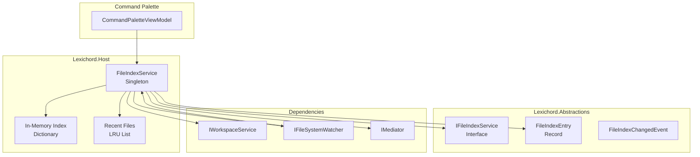
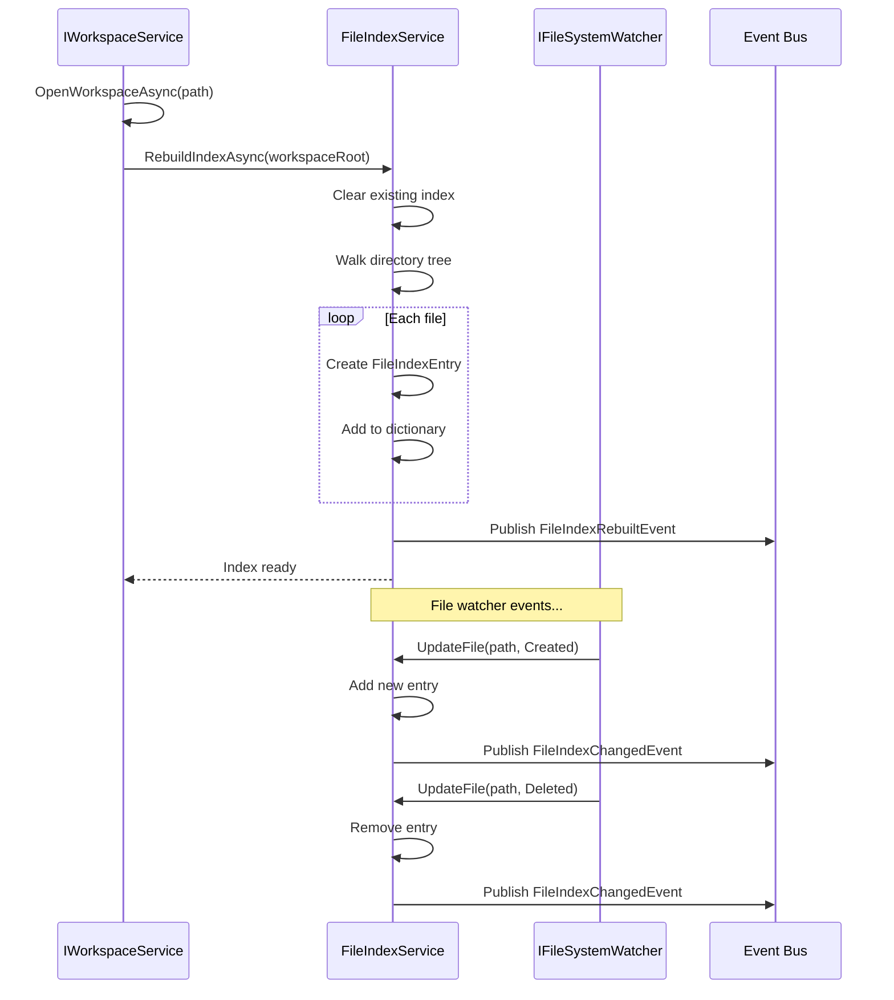
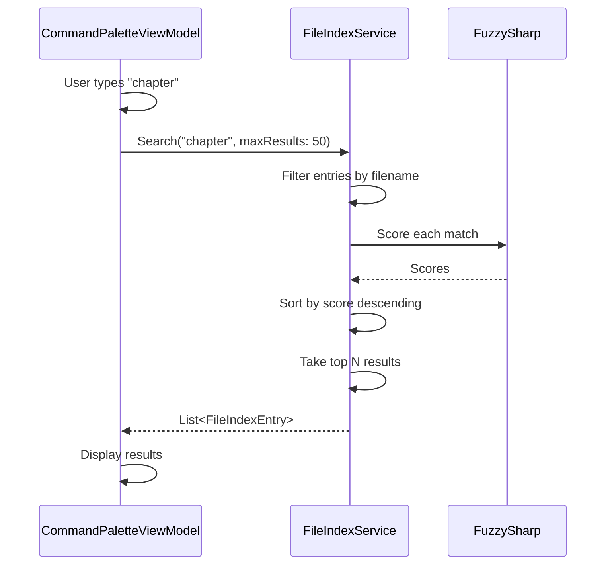

# LCS-INF-015c: File Jumper

## 1. Metadata & Categorization

| Field                | Value                                | Description                                      |
| :------------------- | :----------------------------------- | :----------------------------------------------- |
| **Feature ID**       | `INF-015c`                           | Sub-part C of Command Palette                    |
| **Feature Name**     | File Jumper                          | Quick file navigation via palette                |
| **Target Version**   | `v0.1.5c`                            | Third sub-part of v0.1.5                         |
| **Module Scope**     | `Lexichord.Host`                     | Core infrastructure                              |
| **Swimlane**         | `Infrastructure`                     | The Podium (Platform)                            |
| **License Tier**     | `Core`                               | Foundation (Available in Free tier)              |
| **Author**           | System Architect                     |                                                  |
| **Status**           | **Draft**                            | Pending implementation                           |
| **Last Updated**     | 2026-01-26                           |                                                  |

---

## 2. Executive Summary

### 2.1 The Requirement

Lexichord needs a file navigation system that provides:

- Index all files in the current workspace for fast lookup.
- Fuzzy search by filename in the Command Palette.
- Instant navigation when user presses Ctrl+P and types a filename.
- Incremental index updates when files are created, modified, or deleted.
- Recent files tracking for empty-query display.
- Support for ignore patterns (.git, node_modules, etc.).

### 2.2 The Proposed Solution

We **SHALL** implement:

1. **IFileIndexService** — Interface in Abstractions for file indexing and search.
2. **FileIndexService** — Implementation in Host that walks the workspace.
3. **FileIndexEntry** — Record containing file metadata.
4. **Integration with Palette** — File mode displays file search results.
5. **File Watcher Integration** — Incremental updates via IFileSystemWatcher.

---

## 3. Architecture

### 3.1 Component Structure



### 3.2 Indexing Flow



### 3.3 Search Flow



---

## 4. Decision Tree: File Indexing

```text
START: "Index a file"
|
+-- Should file be indexed?
|   +-- Is it a directory? --> NO, skip
|   +-- Matches ignore pattern? --> NO, skip
|   +-- Is it a hidden file (starts with .)?
|   |   +-- Include hidden files setting? --> Include or skip
|   +-- Is it a binary file?
|   |   +-- Index binary files setting? --> Include or skip (default: skip)
|   +-- File size > max size threshold?
|   |   +-- YES --> Skip (default: 50MB limit)
|   +-- Otherwise --> YES, index
|
+-- Create FileIndexEntry
|   +-- Extract filename
|   +-- Calculate relative path
|   +-- Get file size
|   +-- Get last modified time
|   +-- Determine icon kind from extension
|
+-- Add to index dictionary
|   +-- Key = full path (normalized)
|   +-- Value = FileIndexEntry
|
+-- END
```

---

## 5. Data Contracts

### 5.1 IFileIndexService Interface

```csharp
namespace Lexichord.Abstractions.Contracts;

/// <summary>
/// Service for indexing and searching workspace files.
/// </summary>
/// <remarks>
/// LOGIC: FileIndexService maintains an in-memory index of workspace files:
///
/// Index Structure:
/// - Dictionary keyed by normalized full path
/// - Values are FileIndexEntry records
/// - Enables O(1) lookup by path, O(n) search by filename
///
/// Indexing Strategy:
/// - Full rebuild when workspace opens
/// - Incremental updates from file watcher
/// - Respects ignore patterns (configurable)
/// - Tracks recent file access for empty-query display
///
/// Search Algorithm:
/// - Fuzzy search on filename using FuzzySharp
/// - Scores above threshold included in results
/// - Results sorted by score descending
/// - Limited to maxResults for performance
///
/// Thread Safety:
/// - Index dictionary is ConcurrentDictionary
/// - Rebuild is async but blocks new updates
/// - Search returns snapshot (safe to enumerate)
/// </remarks>
public interface IFileIndexService
{
    /// <summary>
    /// Rebuilds the entire file index from scratch.
    /// </summary>
    /// <param name="workspaceRoot">Root path of the workspace.</param>
    /// <param name="cancellationToken">Cancellation token.</param>
    /// <returns>Number of files indexed.</returns>
    /// <remarks>
    /// LOGIC: Called when a workspace is opened.
    /// - Clears existing index
    /// - Walks directory tree recursively
    /// - Respects ignore patterns
    /// - Reports progress via events
    /// </remarks>
    Task<int> RebuildIndexAsync(string workspaceRoot, CancellationToken cancellationToken = default);

    /// <summary>
    /// Updates the index for a single file.
    /// </summary>
    /// <param name="filePath">Full path to the file.</param>
    /// <param name="action">What happened to the file.</param>
    /// <remarks>
    /// LOGIC: Called by file watcher handler.
    /// More efficient than full rebuild for single file changes.
    /// </remarks>
    void UpdateFile(string filePath, FileIndexAction action);

    /// <summary>
    /// Updates the index for a renamed file.
    /// </summary>
    /// <param name="oldPath">Previous file path.</param>
    /// <param name="newPath">New file path.</param>
    void UpdateFileRenamed(string oldPath, string newPath);

    /// <summary>
    /// Clears the file index.
    /// </summary>
    /// <remarks>
    /// LOGIC: Called when workspace is closed.
    /// Clears both index and recent files.
    /// </remarks>
    void Clear();

    /// <summary>
    /// Searches for files matching the query.
    /// </summary>
    /// <param name="query">Search query (filename or partial match).</param>
    /// <param name="maxResults">Maximum results to return.</param>
    /// <returns>Matching files sorted by relevance.</returns>
    /// <remarks>
    /// LOGIC: Uses fuzzy search on filename.
    /// - Empty query returns empty (use GetRecentFiles instead)
    /// - Results scored and sorted by best match
    /// - Limited to maxResults for performance
    /// </remarks>
    IReadOnlyList<FileIndexEntry> Search(string query, int maxResults = 50);

    /// <summary>
    /// Gets recently accessed files.
    /// </summary>
    /// <param name="maxResults">Maximum results to return.</param>
    /// <returns>Recently opened files, most recent first.</returns>
    /// <remarks>
    /// LOGIC: Maintained as LRU list.
    /// Updated when RecordFileAccess is called.
    /// Persisted across sessions (future).
    /// </remarks>
    IReadOnlyList<FileIndexEntry> GetRecentFiles(int maxResults = 20);

    /// <summary>
    /// Records that a file was opened.
    /// </summary>
    /// <param name="filePath">Full path of the opened file.</param>
    /// <remarks>
    /// LOGIC: Moves file to front of recent list.
    /// Called by EditorService when document opens.
    /// </remarks>
    void RecordFileAccess(string filePath);

    /// <summary>
    /// Gets a file entry by path.
    /// </summary>
    /// <param name="filePath">Full path to the file.</param>
    /// <returns>The file entry, or null if not indexed.</returns>
    FileIndexEntry? GetFile(string filePath);

    /// <summary>
    /// Checks if a file is in the index.
    /// </summary>
    /// <param name="filePath">Full path to the file.</param>
    /// <returns>True if file is indexed.</returns>
    bool ContainsFile(string filePath);

    /// <summary>
    /// Gets all indexed files.
    /// </summary>
    /// <returns>All file entries in the index.</returns>
    IReadOnlyList<FileIndexEntry> GetAllFiles();

    /// <summary>
    /// Gets the number of indexed files.
    /// </summary>
    int IndexedFileCount { get; }

    /// <summary>
    /// Gets whether an index is currently being built.
    /// </summary>
    bool IsIndexing { get; }

    /// <summary>
    /// Gets the workspace root currently being indexed.
    /// </summary>
    string? WorkspaceRoot { get; }

    /// <summary>
    /// Event raised when the index changes.
    /// </summary>
    event EventHandler<FileIndexChangedEventArgs>? IndexChanged;

    /// <summary>
    /// Event raised when indexing progress updates.
    /// </summary>
    event EventHandler<FileIndexProgressEventArgs>? IndexProgress;
}

/// <summary>
/// Types of file index actions.
/// </summary>
public enum FileIndexAction
{
    /// <summary>File was created.</summary>
    Created,

    /// <summary>File was modified.</summary>
    Modified,

    /// <summary>File was deleted.</summary>
    Deleted
}

/// <summary>
/// Event args for file index changes.
/// </summary>
public class FileIndexChangedEventArgs : EventArgs
{
    /// <summary>
    /// Gets the type of change.
    /// </summary>
    public required FileIndexChangeType ChangeType { get; init; }

    /// <summary>
    /// Gets the affected file path (if single file change).
    /// </summary>
    public string? FilePath { get; init; }

    /// <summary>
    /// Gets the total file count after the change.
    /// </summary>
    public int TotalFileCount { get; init; }
}

/// <summary>
/// Types of file index changes.
/// </summary>
public enum FileIndexChangeType
{
    /// <summary>Index was completely rebuilt.</summary>
    Rebuilt,

    /// <summary>Single file was added.</summary>
    FileAdded,

    /// <summary>Single file was removed.</summary>
    FileRemoved,

    /// <summary>Single file was modified.</summary>
    FileModified,

    /// <summary>File was renamed.</summary>
    FileRenamed,

    /// <summary>Index was cleared.</summary>
    Cleared
}

/// <summary>
/// Event args for indexing progress.
/// </summary>
public class FileIndexProgressEventArgs : EventArgs
{
    /// <summary>
    /// Gets the number of files indexed so far.
    /// </summary>
    public int FilesIndexed { get; init; }

    /// <summary>
    /// Gets the current directory being indexed.
    /// </summary>
    public string? CurrentDirectory { get; init; }
}
```

### 5.2 FileIndexEntry Record

```csharp
namespace Lexichord.Abstractions.Contracts;

/// <summary>
/// Entry in the file index.
/// </summary>
/// <remarks>
/// LOGIC: FileIndexEntry contains all metadata needed for:
/// - Display in Command Palette (filename, icon, path)
/// - Opening the file (full path)
/// - Search ranking (filename for fuzzy match)
///
/// Immutable record for thread safety in concurrent index.
/// </remarks>
/// <param name="FileName">Name of the file without path.</param>
/// <param name="FullPath">Absolute path to the file.</param>
/// <param name="RelativePath">Path relative to workspace root.</param>
/// <param name="LastModified">Last modification time.</param>
/// <param name="FileSize">Size in bytes.</param>
public record FileIndexEntry(
    string FileName,
    string FullPath,
    string RelativePath,
    DateTime LastModified,
    long FileSize
)
{
    /// <summary>
    /// Gets the file extension (lowercase, including dot).
    /// </summary>
    public string Extension => Path.GetExtension(FileName).ToLowerInvariant();

    /// <summary>
    /// Gets the Material icon kind based on file extension.
    /// </summary>
    /// <remarks>
    /// LOGIC: Maps common extensions to Material Design icons.
    /// Default to generic file icon for unknown extensions.
    /// </remarks>
    public string IconKind => GetIconForExtension(Extension);

    /// <summary>
    /// Gets the parent directory name.
    /// </summary>
    public string DirectoryName => Path.GetDirectoryName(RelativePath) ?? string.Empty;

    /// <summary>
    /// Gets a display-friendly file size.
    /// </summary>
    public string FileSizeDisplay => FormatFileSize(FileSize);

    private static string GetIconForExtension(string extension) => extension switch
    {
        // Documents
        ".md" or ".markdown" => "LanguageMarkdown",
        ".txt" => "FileDocument",
        ".rtf" => "FileDocument",
        ".doc" or ".docx" => "FileWord",
        ".pdf" => "FilePdfBox",

        // Data formats
        ".json" => "CodeJson",
        ".xml" => "FileXmlBox",
        ".yaml" or ".yml" => "FileCode",
        ".csv" => "FileDelimited",
        ".toml" => "FileCode",

        // Programming languages
        ".cs" => "LanguageCsharp",
        ".js" or ".mjs" or ".cjs" => "LanguageJavascript",
        ".ts" or ".tsx" => "LanguageTypescript",
        ".py" => "LanguagePython",
        ".java" => "LanguageJava",
        ".go" => "LanguageGo",
        ".rs" => "LanguageRust",
        ".rb" => "LanguageRuby",
        ".php" => "LanguagePhp",
        ".swift" => "LanguageSwift",
        ".kt" or ".kts" => "LanguageKotlin",
        ".c" or ".h" => "LanguageC",
        ".cpp" or ".cc" or ".cxx" or ".hpp" => "LanguageCpp",

        // Web
        ".html" or ".htm" => "LanguageHtml5",
        ".css" or ".scss" or ".sass" or ".less" => "LanguageCss3",
        ".vue" => "Vuejs",
        ".svelte" => "Svelte",

        // Config
        ".gitignore" => "Git",
        ".env" => "Cog",
        ".editorconfig" => "Cog",
        "dockerfile" => "Docker",

        // Images
        ".png" or ".jpg" or ".jpeg" or ".gif" or ".webp" or ".bmp" => "FileImage",
        ".svg" => "Svg",
        ".ico" => "FileImage",

        // Other
        ".zip" or ".tar" or ".gz" or ".7z" or ".rar" => "FolderZip",
        ".exe" or ".dll" or ".so" => "Application",
        ".sh" or ".bash" or ".zsh" => "Console",
        ".ps1" => "Powershell",
        ".sql" => "Database",

        _ => "File"
    };

    private static string FormatFileSize(long bytes)
    {
        string[] suffixes = { "B", "KB", "MB", "GB", "TB" };
        int order = 0;
        double size = bytes;

        while (size >= 1024 && order < suffixes.Length - 1)
        {
            order++;
            size /= 1024;
        }

        return $"{size:0.##} {suffixes[order]}";
    }
}
```

### 5.3 FileIndexSettings

```csharp
namespace Lexichord.Abstractions.Contracts;

/// <summary>
/// Configuration settings for file indexing.
/// </summary>
/// <remarks>
/// LOGIC: These settings control what files are indexed.
/// Defaults are reasonable for most workspaces.
/// User can customize via settings file.
/// </remarks>
public record FileIndexSettings
{
    /// <summary>
    /// Settings section name for persistence.
    /// </summary>
    public const string SectionName = "FileIndex";

    /// <summary>
    /// Patterns to ignore during indexing.
    /// </summary>
    /// <remarks>
    /// LOGIC: Glob patterns relative to workspace root.
    /// Common version control and build directories excluded.
    /// </remarks>
    public IReadOnlyList<string> IgnorePatterns { get; init; } = new[]
    {
        ".git/**",
        ".svn/**",
        ".hg/**",
        "node_modules/**",
        "bin/**",
        "obj/**",
        "dist/**",
        "build/**",
        ".idea/**",
        ".vs/**",
        ".vscode/**",
        "__pycache__/**",
        "*.pyc",
        "*.pyo",
        ".DS_Store",
        "Thumbs.db"
    };

    /// <summary>
    /// Whether to include hidden files (starting with .).
    /// </summary>
    public bool IncludeHiddenFiles { get; init; } = false;

    /// <summary>
    /// Maximum file size to index (in bytes).
    /// </summary>
    /// <remarks>
    /// LOGIC: Files larger than this are skipped.
    /// Prevents indexing huge log files or binaries.
    /// </remarks>
    public long MaxFileSizeBytes { get; init; } = 50 * 1024 * 1024; // 50 MB

    /// <summary>
    /// File extensions to treat as binary (skip).
    /// </summary>
    public IReadOnlyList<string> BinaryExtensions { get; init; } = new[]
    {
        ".exe", ".dll", ".so", ".dylib",
        ".zip", ".tar", ".gz", ".7z", ".rar",
        ".png", ".jpg", ".jpeg", ".gif", ".bmp", ".ico", ".webp",
        ".mp3", ".mp4", ".wav", ".avi", ".mkv", ".mov",
        ".pdf", ".doc", ".docx", ".xls", ".xlsx", ".ppt", ".pptx",
        ".pdb", ".obj", ".o", ".a"
    };

    /// <summary>
    /// Maximum number of recent files to track.
    /// </summary>
    public int MaxRecentFiles { get; init; } = 50;

    /// <summary>
    /// Whether to index files in subdirectories.
    /// </summary>
    public bool Recursive { get; init; } = true;

    /// <summary>
    /// Maximum directory depth to index.
    /// </summary>
    /// <remarks>
    /// LOGIC: 0 means unlimited depth.
    /// Helps prevent runaway indexing in deep hierarchies.
    /// </remarks>
    public int MaxDepth { get; init; } = 0;

    /// <summary>
    /// Debounce delay for file watcher events (milliseconds).
    /// </summary>
    public int FileWatcherDebounceMs { get; init; } = 300;
}
```

---

## 6. Implementation Logic

### 6.1 FileIndexService Implementation

```csharp
using System.Collections.Concurrent;
using System.Diagnostics;
using FuzzySharp;
using Lexichord.Abstractions.Contracts;
using Lexichord.Abstractions.Events;
using MediatR;
using Microsoft.Extensions.Logging;
using Microsoft.Extensions.Options;

namespace Lexichord.Host.Services;

/// <summary>
/// Service for indexing and searching workspace files.
/// </summary>
/// <remarks>
/// LOGIC: FileIndexService maintains an in-memory file index:
///
/// Data Structures:
/// - _index: ConcurrentDictionary for thread-safe file storage
/// - _recentFiles: LinkedList for LRU recent files
/// - _recentFilesSet: HashSet for O(1) contains check
///
/// Performance Characteristics:
/// - Index: O(1) lookup by path, O(n) for full scan
/// - Search: O(n) fuzzy match, limited by maxResults
/// - Recent: O(1) add to front, O(n) trim to max
///
/// Thread Safety:
/// - ConcurrentDictionary for index
/// - Lock on _recentLock for recent files list
/// - Rebuild sets IsIndexing to prevent concurrent rebuilds
/// </remarks>
public sealed class FileIndexService : IFileIndexService, IDisposable
{
    private const int MinFuzzyScore = 40;

    private readonly ConcurrentDictionary<string, FileIndexEntry> _index = new(StringComparer.OrdinalIgnoreCase);
    private readonly LinkedList<string> _recentFiles = new();
    private readonly HashSet<string> _recentFilesSet = new(StringComparer.OrdinalIgnoreCase);
    private readonly object _recentLock = new();

    private readonly IWorkspaceService _workspaceService;
    private readonly IMediator _mediator;
    private readonly ILogger<FileIndexService> _logger;
    private readonly FileIndexSettings _settings;

    private string? _workspaceRoot;
    private bool _isIndexing;
    private CancellationTokenSource? _indexingCts;

    /// <summary>
    /// Creates a new FileIndexService.
    /// </summary>
    public FileIndexService(
        IWorkspaceService workspaceService,
        IMediator mediator,
        IOptions<FileIndexSettings> settings,
        ILogger<FileIndexService> logger)
    {
        _workspaceService = workspaceService;
        _mediator = mediator;
        _settings = settings.Value;
        _logger = logger;

        // LOGIC: Subscribe to workspace events
        _workspaceService.WorkspaceOpened += OnWorkspaceOpened;
        _workspaceService.WorkspaceClosed += OnWorkspaceClosed;
        _workspaceService.FileChanged += OnFileChanged;
    }

    /// <inheritdoc/>
    public int IndexedFileCount => _index.Count;

    /// <inheritdoc/>
    public bool IsIndexing => _isIndexing;

    /// <inheritdoc/>
    public string? WorkspaceRoot => _workspaceRoot;

    /// <inheritdoc/>
    public event EventHandler<FileIndexChangedEventArgs>? IndexChanged;

    /// <inheritdoc/>
    public event EventHandler<FileIndexProgressEventArgs>? IndexProgress;

    /// <inheritdoc/>
    public async Task<int> RebuildIndexAsync(string workspaceRoot, CancellationToken cancellationToken = default)
    {
        if (_isIndexing)
        {
            _logger.LogWarning("Index rebuild already in progress, cancelling previous");
            _indexingCts?.Cancel();
        }

        _isIndexing = true;
        _indexingCts = CancellationTokenSource.CreateLinkedTokenSource(cancellationToken);
        var token = _indexingCts.Token;

        var stopwatch = Stopwatch.StartNew();
        _logger.LogInformation("Starting file index rebuild for {WorkspaceRoot}", workspaceRoot);

        try
        {
            _workspaceRoot = workspaceRoot;
            _index.Clear();

            var filesIndexed = 0;
            var ignoreMatcher = new IgnorePatternMatcher(_settings.IgnorePatterns);

            await Task.Run(() =>
            {
                var options = new EnumerationOptions
                {
                    RecurseSubdirectories = _settings.Recursive,
                    IgnoreInaccessible = true,
                    AttributesToSkip = FileAttributes.System
                };

                if (!_settings.IncludeHiddenFiles)
                {
                    options.AttributesToSkip |= FileAttributes.Hidden;
                }

                foreach (var filePath in Directory.EnumerateFiles(workspaceRoot, "*", options))
                {
                    token.ThrowIfCancellationRequested();

                    var relativePath = Path.GetRelativePath(workspaceRoot, filePath);

                    // LOGIC: Check ignore patterns
                    if (ignoreMatcher.IsIgnored(relativePath))
                        continue;

                    // LOGIC: Check file size and binary extension
                    if (!ShouldIndexFile(filePath))
                        continue;

                    var entry = CreateFileEntry(filePath, workspaceRoot);
                    _index.TryAdd(entry.FullPath, entry);
                    filesIndexed++;

                    // LOGIC: Report progress periodically
                    if (filesIndexed % 100 == 0)
                    {
                        IndexProgress?.Invoke(this, new FileIndexProgressEventArgs
                        {
                            FilesIndexed = filesIndexed,
                            CurrentDirectory = Path.GetDirectoryName(relativePath)
                        });
                    }
                }
            }, token);

            stopwatch.Stop();
            _logger.LogInformation(
                "File index rebuilt: {FileCount} files in {Duration}ms",
                filesIndexed, stopwatch.ElapsedMilliseconds);

            IndexChanged?.Invoke(this, new FileIndexChangedEventArgs
            {
                ChangeType = FileIndexChangeType.Rebuilt,
                TotalFileCount = filesIndexed
            });

            await _mediator.Publish(new FileIndexRebuiltEvent(
                filesIndexed,
                stopwatch.ElapsedMilliseconds
            ), CancellationToken.None);

            return filesIndexed;
        }
        catch (OperationCanceledException)
        {
            _logger.LogInformation("File index rebuild cancelled");
            return _index.Count;
        }
        finally
        {
            _isIndexing = false;
            _indexingCts = null;
        }
    }

    /// <inheritdoc/>
    public void UpdateFile(string filePath, FileIndexAction action)
    {
        if (string.IsNullOrWhiteSpace(_workspaceRoot))
            return;

        var normalizedPath = Path.GetFullPath(filePath);

        switch (action)
        {
            case FileIndexAction.Created:
            case FileIndexAction.Modified:
                if (ShouldIndexFile(normalizedPath))
                {
                    var entry = CreateFileEntry(normalizedPath, _workspaceRoot);
                    _index.AddOrUpdate(normalizedPath, entry, (_, _) => entry);

                    _logger.LogDebug("File index updated: {Action} {FilePath}", action, normalizedPath);

                    IndexChanged?.Invoke(this, new FileIndexChangedEventArgs
                    {
                        ChangeType = action == FileIndexAction.Created
                            ? FileIndexChangeType.FileAdded
                            : FileIndexChangeType.FileModified,
                        FilePath = normalizedPath,
                        TotalFileCount = _index.Count
                    });
                }
                break;

            case FileIndexAction.Deleted:
                if (_index.TryRemove(normalizedPath, out _))
                {
                    _logger.LogDebug("File removed from index: {FilePath}", normalizedPath);

                    // LOGIC: Also remove from recent files
                    lock (_recentLock)
                    {
                        if (_recentFilesSet.Remove(normalizedPath))
                        {
                            _recentFiles.Remove(normalizedPath);
                        }
                    }

                    IndexChanged?.Invoke(this, new FileIndexChangedEventArgs
                    {
                        ChangeType = FileIndexChangeType.FileRemoved,
                        FilePath = normalizedPath,
                        TotalFileCount = _index.Count
                    });
                }
                break;
        }
    }

    /// <inheritdoc/>
    public void UpdateFileRenamed(string oldPath, string newPath)
    {
        var normalizedOld = Path.GetFullPath(oldPath);
        var normalizedNew = Path.GetFullPath(newPath);

        if (_index.TryRemove(normalizedOld, out _))
        {
            if (ShouldIndexFile(normalizedNew) && _workspaceRoot is not null)
            {
                var entry = CreateFileEntry(normalizedNew, _workspaceRoot);
                _index.TryAdd(normalizedNew, entry);
            }

            // LOGIC: Update recent files list
            lock (_recentLock)
            {
                if (_recentFilesSet.Remove(normalizedOld))
                {
                    var node = _recentFiles.Find(normalizedOld);
                    if (node is not null)
                    {
                        node.Value = normalizedNew;
                        _recentFilesSet.Add(normalizedNew);
                    }
                }
            }

            _logger.LogDebug("File renamed in index: {OldPath} -> {NewPath}", normalizedOld, normalizedNew);

            IndexChanged?.Invoke(this, new FileIndexChangedEventArgs
            {
                ChangeType = FileIndexChangeType.FileRenamed,
                FilePath = normalizedNew,
                TotalFileCount = _index.Count
            });
        }
    }

    /// <inheritdoc/>
    public void Clear()
    {
        _index.Clear();
        _workspaceRoot = null;

        lock (_recentLock)
        {
            _recentFiles.Clear();
            _recentFilesSet.Clear();
        }

        _logger.LogDebug("File index cleared");

        IndexChanged?.Invoke(this, new FileIndexChangedEventArgs
        {
            ChangeType = FileIndexChangeType.Cleared,
            TotalFileCount = 0
        });
    }

    /// <inheritdoc/>
    public IReadOnlyList<FileIndexEntry> Search(string query, int maxResults = 50)
    {
        if (string.IsNullOrWhiteSpace(query))
            return Array.Empty<FileIndexEntry>();

        var results = new List<(FileIndexEntry Entry, int Score)>();

        foreach (var entry in _index.Values)
        {
            var score = Fuzz.PartialRatio(query, entry.FileName);

            // LOGIC: Also match against relative path for better results
            var pathScore = Fuzz.PartialRatio(query, entry.RelativePath);
            score = Math.Max(score, pathScore);

            if (score >= MinFuzzyScore)
            {
                results.Add((entry, score));
            }
        }

        return results
            .OrderByDescending(r => r.Score)
            .ThenBy(r => r.Entry.FileName)
            .Take(maxResults)
            .Select(r => r.Entry)
            .ToList();
    }

    /// <inheritdoc/>
    public IReadOnlyList<FileIndexEntry> GetRecentFiles(int maxResults = 20)
    {
        lock (_recentLock)
        {
            return _recentFiles
                .Take(maxResults)
                .Select(path => _index.TryGetValue(path, out var entry) ? entry : null)
                .Where(entry => entry is not null)
                .Cast<FileIndexEntry>()
                .ToList();
        }
    }

    /// <inheritdoc/>
    public void RecordFileAccess(string filePath)
    {
        var normalizedPath = Path.GetFullPath(filePath);

        lock (_recentLock)
        {
            // LOGIC: Move to front if already present
            if (_recentFilesSet.Contains(normalizedPath))
            {
                _recentFiles.Remove(normalizedPath);
            }
            else
            {
                _recentFilesSet.Add(normalizedPath);
            }

            _recentFiles.AddFirst(normalizedPath);

            // LOGIC: Trim to max size
            while (_recentFiles.Count > _settings.MaxRecentFiles)
            {
                var last = _recentFiles.Last!.Value;
                _recentFiles.RemoveLast();
                _recentFilesSet.Remove(last);
            }
        }

        _logger.LogDebug("Recorded file access: {FilePath}", normalizedPath);
    }

    /// <inheritdoc/>
    public FileIndexEntry? GetFile(string filePath)
    {
        var normalizedPath = Path.GetFullPath(filePath);
        return _index.TryGetValue(normalizedPath, out var entry) ? entry : null;
    }

    /// <inheritdoc/>
    public bool ContainsFile(string filePath)
    {
        var normalizedPath = Path.GetFullPath(filePath);
        return _index.ContainsKey(normalizedPath);
    }

    /// <inheritdoc/>
    public IReadOnlyList<FileIndexEntry> GetAllFiles()
    {
        return _index.Values.ToList();
    }

    private bool ShouldIndexFile(string filePath)
    {
        try
        {
            var fileInfo = new FileInfo(filePath);

            // Check file size
            if (fileInfo.Length > _settings.MaxFileSizeBytes)
                return false;

            // Check binary extension
            var extension = fileInfo.Extension.ToLowerInvariant();
            if (_settings.BinaryExtensions.Contains(extension))
                return false;

            // Check hidden file
            if (!_settings.IncludeHiddenFiles &&
                fileInfo.Name.StartsWith('.'))
                return false;

            return true;
        }
        catch
        {
            return false;
        }
    }

    private static FileIndexEntry CreateFileEntry(string filePath, string workspaceRoot)
    {
        var fileInfo = new FileInfo(filePath);
        var relativePath = Path.GetRelativePath(workspaceRoot, filePath);

        return new FileIndexEntry(
            FileName: fileInfo.Name,
            FullPath: fileInfo.FullName,
            RelativePath: relativePath,
            LastModified: fileInfo.LastWriteTimeUtc,
            FileSize: fileInfo.Length
        );
    }

    private void OnWorkspaceOpened(object? sender, WorkspaceEventArgs e)
    {
        _ = RebuildIndexAsync(e.WorkspacePath);
    }

    private void OnWorkspaceClosed(object? sender, EventArgs e)
    {
        Clear();
    }

    private void OnFileChanged(object? sender, FileSystemEventArgs e)
    {
        var action = e.ChangeType switch
        {
            WatcherChangeTypes.Created => FileIndexAction.Created,
            WatcherChangeTypes.Changed => FileIndexAction.Modified,
            WatcherChangeTypes.Deleted => FileIndexAction.Deleted,
            _ => (FileIndexAction?)null
        };

        if (action.HasValue)
        {
            UpdateFile(e.FullPath, action.Value);
        }
        else if (e is RenamedEventArgs renamed)
        {
            UpdateFileRenamed(renamed.OldFullPath, renamed.FullPath);
        }
    }

    public void Dispose()
    {
        _indexingCts?.Cancel();
        _indexingCts?.Dispose();
        _workspaceService.WorkspaceOpened -= OnWorkspaceOpened;
        _workspaceService.WorkspaceClosed -= OnWorkspaceClosed;
        _workspaceService.FileChanged -= OnFileChanged;
    }
}

/// <summary>
/// Helper class for matching ignore patterns.
/// </summary>
internal class IgnorePatternMatcher
{
    private readonly List<Regex> _patterns;

    public IgnorePatternMatcher(IEnumerable<string> patterns)
    {
        _patterns = patterns
            .Select(ConvertGlobToRegex)
            .Select(p => new Regex(p, RegexOptions.IgnoreCase | RegexOptions.Compiled))
            .ToList();
    }

    public bool IsIgnored(string relativePath)
    {
        var normalizedPath = relativePath.Replace('\\', '/');
        return _patterns.Any(p => p.IsMatch(normalizedPath));
    }

    private static string ConvertGlobToRegex(string glob)
    {
        var regex = new StringBuilder("^");

        foreach (var c in glob)
        {
            switch (c)
            {
                case '*':
                    if (glob.IndexOf("**", StringComparison.Ordinal) >= 0)
                        regex.Append(".*");
                    else
                        regex.Append("[^/]*");
                    break;
                case '?':
                    regex.Append("[^/]");
                    break;
                case '.':
                case '(':
                case ')':
                case '+':
                case '|':
                case '^':
                case '$':
                case '@':
                case '%':
                    regex.Append('\\').Append(c);
                    break;
                default:
                    regex.Append(c);
                    break;
            }
        }

        regex.Append('$');
        return regex.ToString();
    }
}
```

---

## 7. Use Cases

### UC-01: Index Workspace on Open

**Preconditions:**
- User opens a workspace folder.

**Flow:**
1. WorkspaceService raises WorkspaceOpened event.
2. FileIndexService receives event.
3. FileIndexService calls RebuildIndexAsync.
4. Service walks directory tree.
5. Ignore patterns filter out .git, node_modules, etc.
6. Valid files added to index.
7. FileIndexRebuiltEvent published.
8. Index ready for search.

**Postconditions:**
- All workspace files indexed.
- Palette can search files.

---

### UC-02: Quick Open File via Ctrl+P

**Preconditions:**
- Workspace is open with files indexed.
- User wants to open "chapter-3.md".

**Flow:**
1. User presses Ctrl+P.
2. Palette opens in file mode.
3. Recent files displayed.
4. User types "chap3".
5. Fuzzy search filters to "chapter-3.md".
6. User presses Enter.
7. Palette closes.
8. File opens in editor.
9. RecordFileAccess called.

**Postconditions:**
- File open in editor.
- File added to recent list.

---

### UC-03: Incremental Index Update

**Preconditions:**
- Workspace is indexed.
- User creates new file externally.

**Flow:**
1. File system watcher detects new file.
2. Workspace raises FileChanged event.
3. FileIndexService receives event.
4. UpdateFile called with Created action.
5. New file entry added to index.
6. FileIndexChangedEvent raised.
7. Next Ctrl+P search includes new file.

**Postconditions:**
- New file searchable immediately.
- No full reindex needed.

---

## 8. Observability & Logging

| Level | Context | Message Template |
|:------|:--------|:-----------------|
| Information | FileIndexService | `Starting file index rebuild for {WorkspaceRoot}` |
| Information | FileIndexService | `File index rebuilt: {FileCount} files in {Duration}ms` |
| Information | FileIndexService | `File index rebuild cancelled` |
| Debug | FileIndexService | `File index updated: {Action} {FilePath}` |
| Debug | FileIndexService | `File removed from index: {FilePath}` |
| Debug | FileIndexService | `File renamed in index: {OldPath} -> {NewPath}` |
| Debug | FileIndexService | `File index cleared` |
| Debug | FileIndexService | `Recorded file access: {FilePath}` |
| Warning | FileIndexService | `Index rebuild already in progress, cancelling previous` |

---

## 9. Unit Testing Requirements

### 9.1 FileIndexService Tests

```csharp
[TestFixture]
[Category("Unit")]
public class FileIndexServiceTests
{
    private Mock<IWorkspaceService> _mockWorkspace = null!;
    private Mock<IMediator> _mockMediator = null!;
    private Mock<ILogger<FileIndexService>> _mockLogger = null!;
    private FileIndexService _sut = null!;
    private string _tempDir = null!;

    [SetUp]
    public void SetUp()
    {
        _mockWorkspace = new Mock<IWorkspaceService>();
        _mockMediator = new Mock<IMediator>();
        _mockLogger = new Mock<ILogger<FileIndexService>>();

        var settings = Options.Create(new FileIndexSettings());

        _sut = new FileIndexService(
            _mockWorkspace.Object,
            _mockMediator.Object,
            settings,
            _mockLogger.Object
        );

        // Create temp directory with test files
        _tempDir = Path.Combine(Path.GetTempPath(), Guid.NewGuid().ToString());
        Directory.CreateDirectory(_tempDir);
        File.WriteAllText(Path.Combine(_tempDir, "test.txt"), "content");
        File.WriteAllText(Path.Combine(_tempDir, "readme.md"), "# Readme");
        Directory.CreateDirectory(Path.Combine(_tempDir, "src"));
        File.WriteAllText(Path.Combine(_tempDir, "src", "main.cs"), "class Main {}");
    }

    [TearDown]
    public void TearDown()
    {
        _sut.Dispose();
        if (Directory.Exists(_tempDir))
            Directory.Delete(_tempDir, true);
    }

    [Test]
    public async Task RebuildIndexAsync_IndexesAllFiles()
    {
        // Act
        var count = await _sut.RebuildIndexAsync(_tempDir);

        // Assert
        Assert.That(count, Is.EqualTo(3));
        Assert.That(_sut.IndexedFileCount, Is.EqualTo(3));
    }

    [Test]
    public async Task RebuildIndexAsync_RaisesIndexChangedEvent()
    {
        // Arrange
        FileIndexChangedEventArgs? eventArgs = null;
        _sut.IndexChanged += (s, e) => eventArgs = e;

        // Act
        await _sut.RebuildIndexAsync(_tempDir);

        // Assert
        Assert.Multiple(() =>
        {
            Assert.That(eventArgs, Is.Not.Null);
            Assert.That(eventArgs!.ChangeType, Is.EqualTo(FileIndexChangeType.Rebuilt));
            Assert.That(eventArgs.TotalFileCount, Is.EqualTo(3));
        });
    }

    [Test]
    public async Task RebuildIndexAsync_IgnoresGitDirectory()
    {
        // Arrange
        var gitDir = Path.Combine(_tempDir, ".git");
        Directory.CreateDirectory(gitDir);
        File.WriteAllText(Path.Combine(gitDir, "config"), "git config");

        // Act
        var count = await _sut.RebuildIndexAsync(_tempDir);

        // Assert
        Assert.That(count, Is.EqualTo(3)); // Excludes .git/config
    }

    [Test]
    public async Task Search_FindsMatchingFiles()
    {
        // Arrange
        await _sut.RebuildIndexAsync(_tempDir);

        // Act
        var results = _sut.Search("test");

        // Assert
        Assert.That(results, Has.Count.EqualTo(1));
        Assert.That(results[0].FileName, Is.EqualTo("test.txt"));
    }

    [Test]
    public async Task Search_FuzzyMatchWorks()
    {
        // Arrange
        await _sut.RebuildIndexAsync(_tempDir);

        // Act
        var results = _sut.Search("rdme");

        // Assert
        Assert.That(results, Has.Count.EqualTo(1));
        Assert.That(results[0].FileName, Is.EqualTo("readme.md"));
    }

    [Test]
    public async Task Search_EmptyQuery_ReturnsEmpty()
    {
        // Arrange
        await _sut.RebuildIndexAsync(_tempDir);

        // Act
        var results = _sut.Search("");

        // Assert
        Assert.That(results, Is.Empty);
    }

    [Test]
    public async Task UpdateFile_Created_AddsToIndex()
    {
        // Arrange
        await _sut.RebuildIndexAsync(_tempDir);
        var newFile = Path.Combine(_tempDir, "new.txt");
        File.WriteAllText(newFile, "new content");

        // Act
        _sut.UpdateFile(newFile, FileIndexAction.Created);

        // Assert
        Assert.That(_sut.IndexedFileCount, Is.EqualTo(4));
        Assert.That(_sut.ContainsFile(newFile), Is.True);
    }

    [Test]
    public async Task UpdateFile_Deleted_RemovesFromIndex()
    {
        // Arrange
        await _sut.RebuildIndexAsync(_tempDir);
        var testFile = Path.Combine(_tempDir, "test.txt");

        // Act
        _sut.UpdateFile(testFile, FileIndexAction.Deleted);

        // Assert
        Assert.That(_sut.IndexedFileCount, Is.EqualTo(2));
        Assert.That(_sut.ContainsFile(testFile), Is.False);
    }

    [Test]
    public async Task RecordFileAccess_AddsToRecentFiles()
    {
        // Arrange
        await _sut.RebuildIndexAsync(_tempDir);
        var testFile = Path.Combine(_tempDir, "test.txt");

        // Act
        _sut.RecordFileAccess(testFile);
        var recent = _sut.GetRecentFiles();

        // Assert
        Assert.That(recent, Has.Count.EqualTo(1));
        Assert.That(recent[0].FullPath, Is.EqualTo(testFile));
    }

    [Test]
    public async Task RecordFileAccess_MovesToFrontIfExists()
    {
        // Arrange
        await _sut.RebuildIndexAsync(_tempDir);
        var file1 = Path.Combine(_tempDir, "test.txt");
        var file2 = Path.Combine(_tempDir, "readme.md");
        _sut.RecordFileAccess(file1);
        _sut.RecordFileAccess(file2);

        // Act
        _sut.RecordFileAccess(file1); // Move file1 back to front
        var recent = _sut.GetRecentFiles();

        // Assert
        Assert.That(recent[0].FullPath, Is.EqualTo(file1));
    }

    [Test]
    public void Clear_ClearsAllData()
    {
        // Act
        _sut.Clear();

        // Assert
        Assert.Multiple(() =>
        {
            Assert.That(_sut.IndexedFileCount, Is.EqualTo(0));
            Assert.That(_sut.GetRecentFiles(), Is.Empty);
            Assert.That(_sut.WorkspaceRoot, Is.Null);
        });
    }

    [Test]
    public async Task GetFile_ReturnsCorrectEntry()
    {
        // Arrange
        await _sut.RebuildIndexAsync(_tempDir);
        var testFile = Path.Combine(_tempDir, "test.txt");

        // Act
        var entry = _sut.GetFile(testFile);

        // Assert
        Assert.Multiple(() =>
        {
            Assert.That(entry, Is.Not.Null);
            Assert.That(entry!.FileName, Is.EqualTo("test.txt"));
            Assert.That(entry.FullPath, Is.EqualTo(testFile));
        });
    }
}
```

### 9.2 FileIndexEntry Tests

```csharp
[TestFixture]
[Category("Unit")]
public class FileIndexEntryTests
{
    [TestCase(".md", "LanguageMarkdown")]
    [TestCase(".json", "CodeJson")]
    [TestCase(".cs", "LanguageCsharp")]
    [TestCase(".unknown", "File")]
    public void IconKind_ReturnsCorrectIcon(string extension, string expectedIcon)
    {
        // Arrange
        var entry = new FileIndexEntry(
            $"test{extension}",
            $"/path/test{extension}",
            $"test{extension}",
            DateTime.UtcNow,
            100
        );

        // Assert
        Assert.That(entry.IconKind, Is.EqualTo(expectedIcon));
    }

    [Test]
    public void Extension_ReturnsLowercase()
    {
        // Arrange
        var entry = new FileIndexEntry(
            "Test.TXT",
            "/path/Test.TXT",
            "Test.TXT",
            DateTime.UtcNow,
            100
        );

        // Assert
        Assert.That(entry.Extension, Is.EqualTo(".txt"));
    }

    [TestCase(500L, "500 B")]
    [TestCase(1024L, "1 KB")]
    [TestCase(1536L, "1.5 KB")]
    [TestCase(1048576L, "1 MB")]
    public void FileSizeDisplay_FormatsCorrectly(long bytes, string expected)
    {
        // Arrange
        var entry = new FileIndexEntry(
            "test.txt",
            "/path/test.txt",
            "test.txt",
            DateTime.UtcNow,
            bytes
        );

        // Assert
        Assert.That(entry.FileSizeDisplay, Is.EqualTo(expected));
    }
}
```

---

## 10. Security & Safety

### 10.1 File System Access

> [!NOTE]
> FileIndexService reads file metadata only, not file contents.

- **Read-Only:** Index only reads names, sizes, and timestamps.
- **Permission Errors:** Inaccessible files are silently skipped.
- **Path Validation:** All paths normalized to prevent traversal.

### 10.2 Resource Limits

> [!WARNING]
> Large workspaces can have thousands of files.

- **Memory Limit:** ~1KB per file entry; 100K files = ~100MB.
- **Indexing Timeout:** Cancellable; UI remains responsive.
- **Size Threshold:** Skip files > 50MB by default.

---

## 11. Risks & Mitigations

| Risk | Impact | Mitigation |
|:-----|:-------|:-----------|
| Large workspace slow to index | Medium | Background indexing; progress reporting |
| Memory usage for huge workspaces | Medium | Size limits; file count warning |
| File watcher events flood | Medium | Debounce updates; batch processing |
| Ignore patterns miss directories | Low | Sensible defaults; user configurable |
| Network drives slow | Medium | Detect and warn; optional timeout |

---

## 12. Acceptance Criteria (QA)

| # | Category | Criterion |
|:--|:---------|:----------|
| 1 | **[Index]** | Workspace files are indexed on open |
| 2 | **[Index]** | .git directory is ignored |
| 3 | **[Index]** | node_modules is ignored |
| 4 | **[Index]** | Custom ignore patterns work |
| 5 | **[Index]** | Index count reported correctly |
| 6 | **[Search]** | Fuzzy search finds files |
| 7 | **[Search]** | Search is case-insensitive |
| 8 | **[Search]** | Results sorted by relevance |
| 9 | **[Search]** | Results limited to maxResults |
| 10 | **[Recent]** | Opened files added to recent |
| 11 | **[Recent]** | Most recent file is first |
| 12 | **[Recent]** | Recent files display on empty query |
| 13 | **[Update]** | New files appear in search |
| 14 | **[Update]** | Deleted files disappear from search |
| 15 | **[Update]** | Renamed files update correctly |
| 16 | **[Clear]** | Workspace close clears index |
| 17 | **[Performance]** | 1000 files indexed in < 2s |
| 18 | **[Performance]** | Search responds in < 50ms |

---

## 13. Verification Commands

```bash
# 1. Build the solution
dotnet build

# 2. Run unit tests
dotnet test --filter "FullyQualifiedName~FileIndex"

# 3. Run application
dotnet run --project src/Lexichord.Host

# 4. Test indexing:
# - Open a workspace folder
# - Check logs for "File index rebuilt: X files"

# 5. Test search:
# - Press Ctrl+P
# - Type part of a filename
# - Verify results appear

# 6. Test incremental update:
# - Create a new file in workspace externally
# - Press Ctrl+P, search for new file
# - Should appear without reopening workspace

# 7. Performance test:
# - Open workspace with 1000+ files
# - Measure index time from logs
# - Verify < 2 seconds

# 8. Test recent files:
# - Open several files
# - Press Ctrl+P with empty query
# - Recently opened files should appear
```

---

## 14. Deliverable Checklist

| Step | Description | Status |
|:-----|:------------|:-------|
| 1 | Define IFileIndexService interface in Abstractions | [ ] |
| 2 | Define FileIndexEntry record in Abstractions | [ ] |
| 3 | Define FileIndexSettings record | [ ] |
| 4 | Define FileIndexAction enum | [ ] |
| 5 | Define FileIndexChangedEventArgs | [ ] |
| 6 | Define FileIndexProgressEventArgs | [ ] |
| 7 | Implement FileIndexService in Host | [ ] |
| 8 | Implement IgnorePatternMatcher | [ ] |
| 9 | Implement directory walking | [ ] |
| 10 | Implement fuzzy search | [ ] |
| 11 | Implement recent files tracking | [ ] |
| 12 | Implement file watcher integration | [ ] |
| 13 | Integrate with CommandPaletteViewModel | [ ] |
| 14 | Register FileIndexService as singleton | [ ] |
| 15 | Unit tests for FileIndexService | [ ] |
| 16 | Unit tests for FileIndexEntry | [ ] |
| 17 | Integration tests for file mode palette | [ ] |
