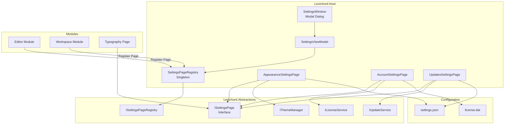
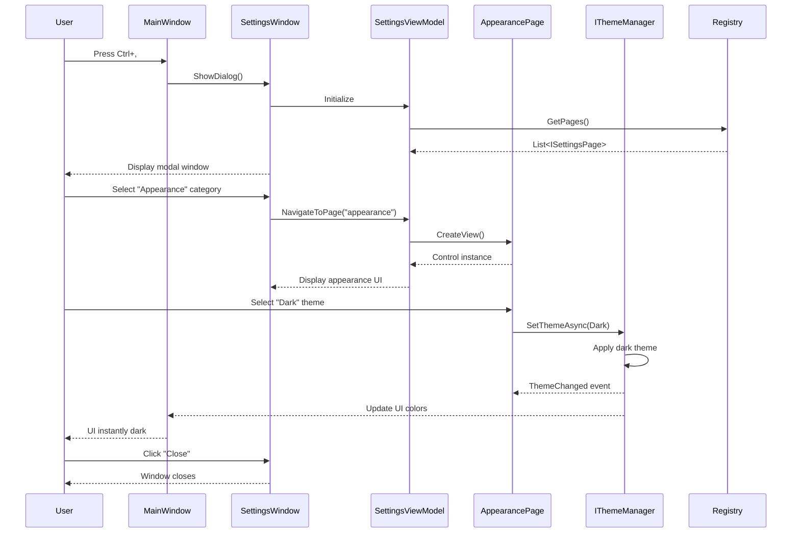

# LCS-DES-016: Design Specification Index — Tuning Room (Settings & Preferences)

## Document Control

| Field              | Value                                |
| :----------------- | :----------------------------------- |
| **Document ID**    | LCS-DES-016-INDEX                    |
| **Feature ID**     | INF-016                              |
| **Feature Name**   | Tuning Room (Settings & Preferences) |
| **Target Version** | v0.1.6                               |
| **Status**         | Draft                                |
| **Last Updated**   | 2026-01-27                           |

---

## Executive Summary

The **Tuning Room** provides a centralized, extensible settings experience for Lexichord. It introduces a modal Settings dialog with tabbed navigation, allowing both the Host and individual modules to contribute settings pages. This architecture enables a cohesive user experience while maintaining modular separation of concerns.

**Business Value:**

- **Unified Experience:** Single location for all application settings improves discoverability
- **Module Extensibility:** Modules can inject custom settings tabs via `ISettingsPage` interface
- **Live Preview:** Theme changes apply instantly without restart, reducing friction
- **License Management:** Users can view and manage their subscription tier directly in settings
- **Update Control:** Power users can opt into Insider builds for early access to features
- **Professional Polish:** Settings dialogs are expected in production-quality desktop applications

---

## Related Documents

| Document Type       | Document ID  | Title                     | Path                |
| :------------------ | :----------- | :------------------------ | :------------------ |
| **Scope Breakdown** | LCS-SBD-016  | Tuning Room Scope         | `./LCS-SBD-016.md`  |
| **Sub-Part 016a**   | LCS-DES-016a | Settings Dialog Framework | `./LCS-DES-016a.md` |
| **Sub-Part 016b**   | LCS-DES-016b | Live Theme Preview        | `./LCS-DES-016b.md` |
| **Sub-Part 016c**   | LCS-DES-016c | License Management UI     | `./LCS-DES-016c.md` |
| **Sub-Part 016d**   | LCS-DES-016d | Update Channel Selector   | `./LCS-DES-016d.md` |

---

## Architecture Overview

### High-Level Component Diagram

### Settings Dialog User Journey

---

## Dependencies

### Upstream Dependencies

| Component                   | Source Version | Usage                                               |
| :-------------------------- | :------------- | :-------------------------------------------------- |
| IModule                     | v0.0.4         | Modules implement `ISettingsPage` for tab injection |
| ILicenseContext             | v0.0.4c        | License validation and tier display                 |
| IThemeManager               | v0.0.2c        | Theme switching with live preview                   |
| IConfigurationService       | v0.0.3d        | Persist settings to JSON storage                    |
| IEditorConfigurationService | v0.1.3d        | Editor module contributes Typography tab            |

### NuGet Packages

| Package                 | Version | Purpose                          |
| :---------------------- | :------ | :------------------------------- |
| `Avalonia`              | 11.x    | UI framework for settings dialog |
| `CommunityToolkit.Mvvm` | 8.x     | MVVM infrastructure (existing)   |
| `System.Text.Json`      | 8.x     | Settings serialization           |

### Downstream Consumers

Future modules will consume:

- `ISettingsPageRegistry` to register their own settings pages
- `ISettingsPage` interface to create settings UI panels
- `IThemeManager` for theme-aware components

---

## License Gating Strategy

**Settings Dialog Core:** Available to all tiers (Free, Writer, WriterPro)

**Gating Considerations:**

- Theme customization → All tiers
- Advanced theme editing → WriterPro tier (future)
- License activation UI → All tiers (shows current tier)
- Update channel selection → All tiers (Insider requires Pro)

---

## Key Interfaces Summary

### ISettingsPage (v0.1.6a)

Interface for module-contributed settings pages. Each module can register one or more pages that appear as tabs in the settings dialog.

**See:** `LCS-DES-016a.md` for full specification

### IThemeManager (v0.1.6b)

Manages application theme (Light/Dark/System). Provides live theme switching without restart.

**See:** `LCS-DES-016b.md` for full specification

### ILicenseService (v0.1.6c)

Handles license key validation, activation, and tier management. Integrates with activation server.

**See:** `LCS-DES-016c.md` for full specification

### IUpdateService (v0.1.6d)

Manages update channel selection (Stable/Insider) and version information. Foundation for future auto-update.

**See:** `LCS-DES-016d.md` for full specification

---

## Implementation Checklist Summary

| Sub-Part    | Est. Hours | Key Deliverables                                                      |
| :---------- | :--------- | :-------------------------------------------------------------------- |
| **v0.1.6a** | 10h        | SettingsWindow, ISettingsPage, Registry, Ctrl+, Shortcut              |
| **v0.1.6b** | 8h         | AppearanceSettingsPage, Live Theme Preview, IThemeManager Integration |
| **v0.1.6c** | 11h        | AccountSettingsPage, ILicenseService, Activation Logic                |
| **v0.1.6d** | 8.5h       | UpdatesSettingsPage, Channel Selector, Version Display                |
| **Total**   | **40h**    | Complete extensible settings system                                   |

**See:** `LCS-SBD-016.md` for detailed task breakdown

---

## Success Criteria Summary

### Performance Targets

| Metric                      | Target  | Rationale                                |
| :-------------------------- | :------ | :--------------------------------------- |
| Settings window open time   | < 100ms | Must feel instant, no perceived lag      |
| Theme switch response       | < 50ms  | Live preview requires immediate feedback |
| License validation response | < 2s    | Acceptable for network operation         |
| Page navigation response    | < 16ms  | Must maintain 60fps during tab switching |
| Memory overhead             | < 5MB   | Settings dialog should be lightweight    |

### Functional Requirements

- ✅ All settings accessible via Ctrl+, or menu
- ✅ Modules can inject custom settings pages
- ✅ Theme changes apply instantly without restart
- ✅ System theme following on macOS/Windows
- ✅ License activation with online validation
- ✅ Tier-based feature availability display
- ✅ Update channel switching (Stable/Insider)

---

## Test Coverage Summary

### Unit Testing

| Component                   | Coverage Target | Key Tests                                    |
| :-------------------------- | :-------------- | :------------------------------------------- |
| SettingsPageRegistry        | 100%            | Register, retrieve, duplicate handling       |
| SettingsViewModel           | 95%             | Page navigation, category selection          |
| AppearanceSettingsViewModel | 95%             | Theme selection, live preview                |
| AccountSettingsViewModel    | 100%            | License validation, activation, deactivation |
| UpdatesSettingsViewModel    | 95%             | Channel switching, version display           |

### Integration Testing

- Settings dialog opens from keyboard shortcut
- Module settings pages load correctly
- Theme changes apply to all open windows
- License activation persists across restarts
- Update channel preference persists

**See:** Individual sub-part specifications for detailed test requirements

---

## What This Enables

After v0.1.6, Lexichord will support:

1. **Centralized Settings Management**
    - Single location for all application settings
    - Extensible architecture for module contributions
    - Professional desktop application experience

2. **Module Integration**
    - Editor module contributes Typography settings
    - Workspace module can add Project settings
    - Future modules auto-integrate into settings

3. **User Customization**
    - Live theme switching (Light/Dark/System)
    - License tier management
    - Update channel control

4. **Foundation for Future Features**
    - v0.2.x: Advanced theme editor
    - v0.2.x: Auto-update functionality
    - v0.2.x: Cloud sync preferences
    - Plugin settings pages

---

## Risks & Mitigations

| Risk                                | Impact | Mitigation                                            |
| :---------------------------------- | :----- | :---------------------------------------------------- |
| Theme switch causes visual glitches | Medium | Test all views on theme change; use dynamic resources |
| License validation requires network | Medium | Implement offline grace period; cache validation      |
| Module settings pages conflict      | Low    | Use unique CategoryId; validate on registration       |
| Insider builds are unstable         | Medium | Clear warnings; easy rollback mechanism               |
| Settings window blocks main UI      | Low    | Use proper modal dialog pattern                       |

---

## Document History

| Version | Date       | Author           | Changes                                                      |
| :------ | :--------- | :--------------- | :----------------------------------------------------------- |
| 1.0     | 2026-01-27 | System Architect | Created INDEX from legacy LCS-INF-016 during standardization |
