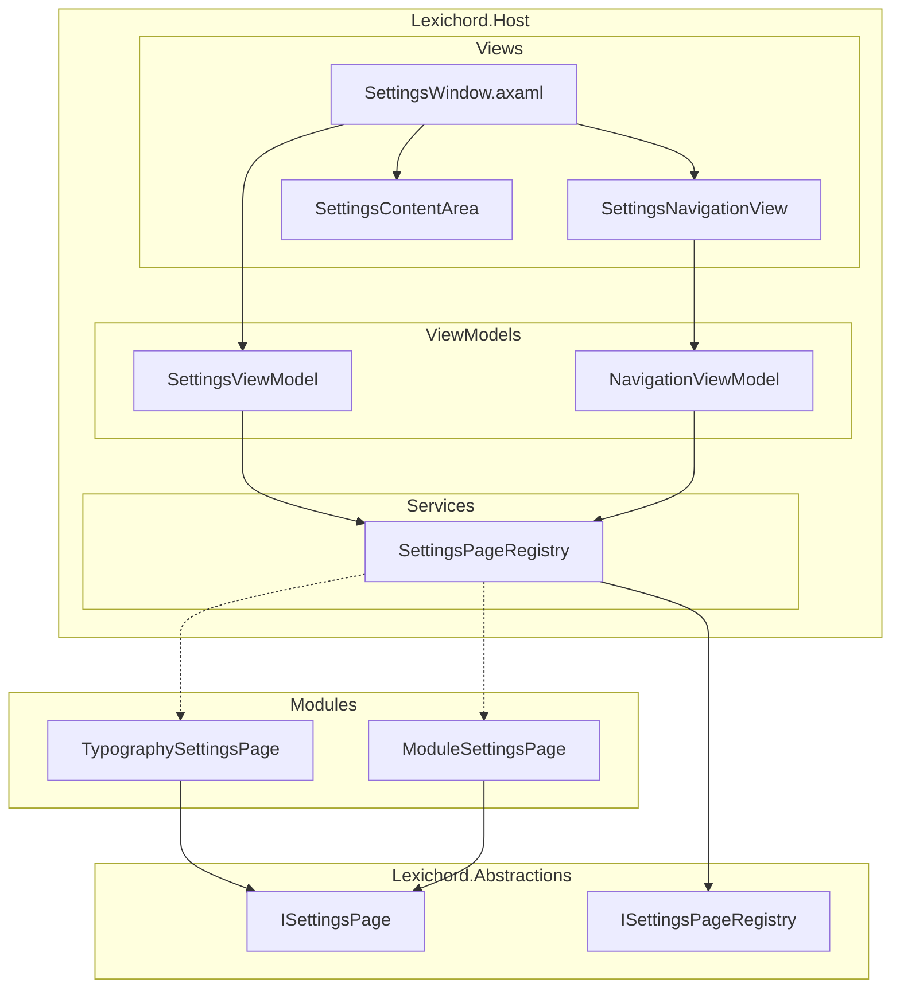
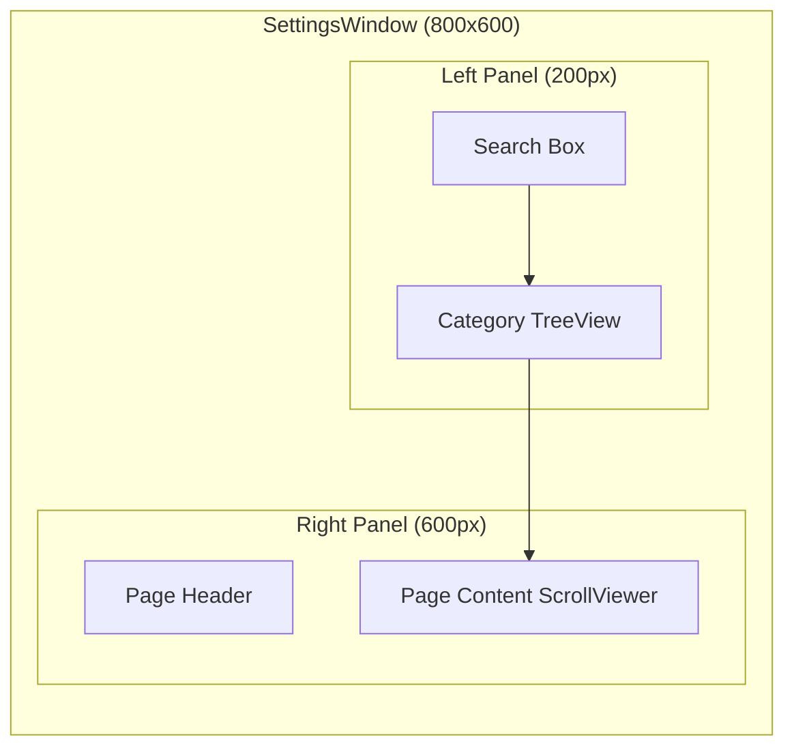
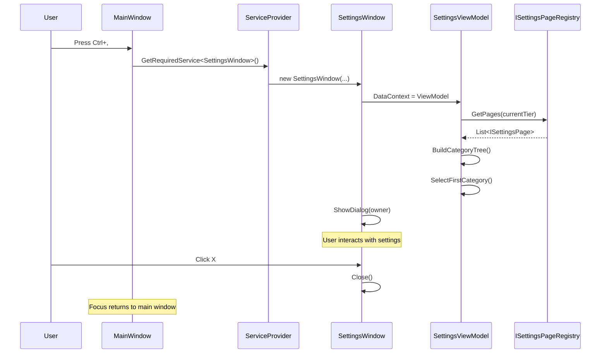
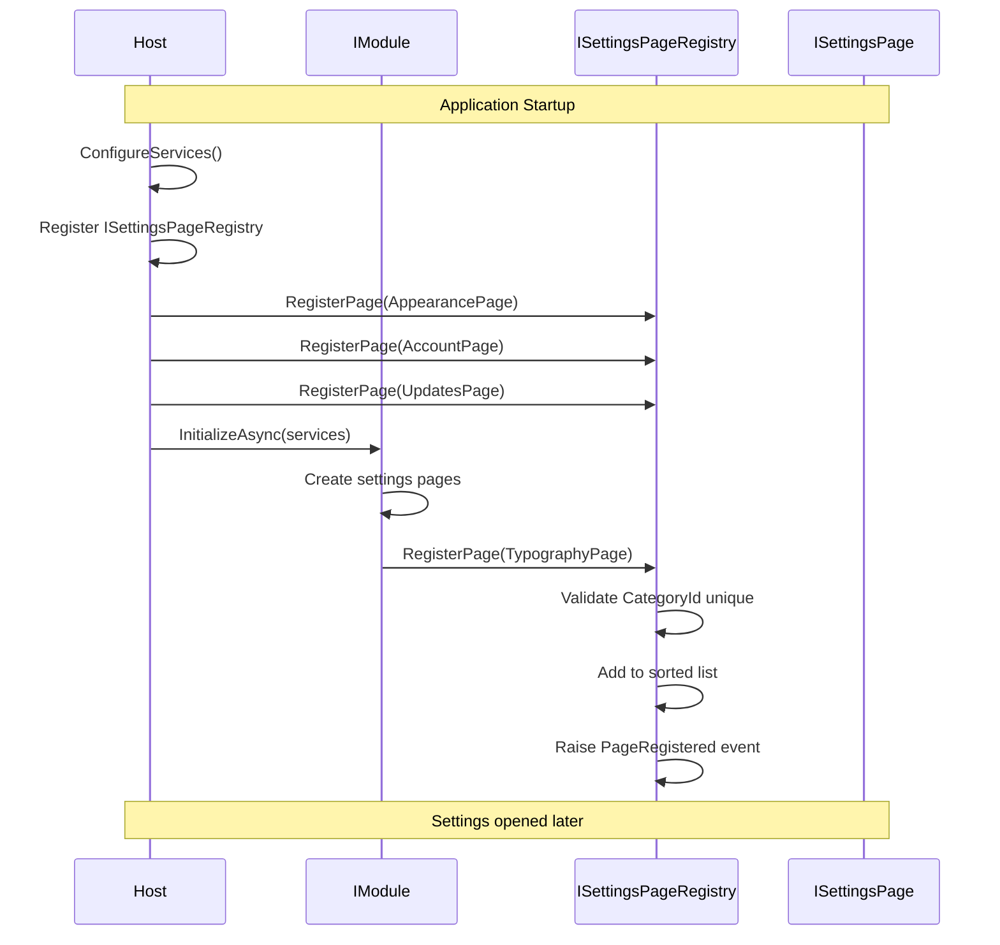

# LCS-DES-016a: Settings Dialog Framework

## 1. Metadata & Categorization

| Field                | Value                     | Description                                 |
| :------------------- | :------------------------ | :------------------------------------------ |
| **Document ID**      | LCS-DES-016a              | Design Specification v0.1.6a                |
| **Feature ID**       | INF-016a                  | Settings Dialog Framework                   |
| **Feature Name**     | Settings Dialog Framework | Modal window with ISettingsPage for modules |
| **Target Version**   | `v0.1.6`                  | Settings Foundation Milestone               |
| **Module Scope**     | `Lexichord.Host`          | Core shell infrastructure                   |
| **Swimlane**         | `Infrastructure`          | The Podium (Platform)                       |
| **License Tier**     | `Core`                    | Foundation (Available in Free tier)         |
| **Feature Gate Key** | N/A                       | No runtime gating                           |
| **Author**           | System Architect          |                                             |
| **Status**           | **Draft**                 | Pending implementation                      |
| **Last Updated**     | 2026-01-27                |                                             |

---

## 2. Executive Summary

### 2.1 The Requirement

Lexichord requires a **centralized settings infrastructure** that:

- Provides a modal dialog for application settings
- Supports left-hand navigation with category tree
- Allows modules to inject custom settings pages
- Follows VS Code / JetBrains IDE settings UX patterns
- Auto-saves settings without requiring "Apply" button

### 2.2 The Proposed Solution

We **SHALL** implement:

1. **SettingsWindow** — Modal dialog with split-panel layout
2. **ISettingsPage interface** — Contract for module-contributed pages
3. **ISettingsPageRegistry** — Central registry for page discovery
4. **SettingsViewModel** — Navigation and page management logic
5. **Keyboard shortcut** — Ctrl+, to open settings (VS Code convention)

---

## 3. Architecture

### 3.1 Component Architecture



### 3.2 Window Layout



### 3.3 Settings Window Open Sequence



### 3.4 Module Page Registration Sequence



---

## 4. Decision Tree

```text
START: "How to handle settings window operations?"
|
+-- User triggers "Open Settings"
|   +-- Source?
|   |   +-- Ctrl+, -> Open immediately
|   |   +-- Menu: Edit > Settings -> Open immediately
|   |   +-- Menu: Tools > Options -> Open immediately (alias)
|   +-- Settings already open?
|   |   +-- YES -> Focus existing window
|   |   +-- NO -> Create new SettingsWindow
|   +-- Get pages from registry
|   +-- Build navigation tree
|   +-- Show as modal dialog
|   +-- END
|
+-- Module wants to register page
|   +-- Validate ISettingsPage implementation
|   |   +-- CategoryId non-empty? -> Continue
|   |   +-- DisplayName non-empty? -> Continue
|   |   +-- CreateView() non-null? -> Continue
|   |   +-- Validation fails? -> Throw ArgumentException
|   +-- CategoryId already registered?
|   |   +-- YES -> Throw InvalidOperationException
|   |   +-- NO -> Add to registry
|   +-- Sort pages by (ParentCategoryId, SortOrder)
|   +-- Raise PageRegistered event
|   +-- END
|
+-- User navigates to category
|   +-- Get ISettingsPage from registry
|   +-- Call page.CreateView()
|   +-- Success?
|   |   +-- YES -> Display view in content area
|   |   +-- NO -> Display error message
|   +-- Update selected state in navigation
|   +-- END
|
+-- User closes Settings
|   +-- No explicit save needed (auto-save)
|   +-- Close dialog
|   +-- Return focus to parent window
|   +-- END
|
+-- END
```

---

## 5. Data Contracts

### 5.1 ISettingsPage Interface

```csharp
namespace Lexichord.Abstractions.Contracts;

using Avalonia.Controls;

/// <summary>
/// Defines a settings page that can be contributed by modules.
/// </summary>
/// <remarks>
/// LOGIC: ISettingsPage is the primary extension point for modules
/// to contribute settings to the centralized Settings dialog.
///
/// Implementation Guidelines:
/// 1. CategoryId must be globally unique (use "{module}-{feature}" pattern)
/// 2. DisplayName should be localization-friendly
/// 3. CreateView() should return a new instance each time
/// 4. ParentCategoryId creates hierarchical navigation
/// 5. SortOrder controls position within siblings
///
/// Thread Safety:
/// - CreateView() may be called from UI thread only
/// - Other properties should be thread-safe (typically read-only)
/// </remarks>
/// <example>
/// <code>
/// public sealed class TypographySettingsPage : ISettingsPage
/// {
///     private readonly IServiceProvider _services;
///
///     public TypographySettingsPage(IServiceProvider services)
///     {
///         _services = services;
///     }
///
///     public string CategoryId => "editor-typography";
///     public string DisplayName => "Typography";
///     public string? ParentCategoryId => "editor";
///     public string? Icon => "FormatFont";
///     public int SortOrder => 10;
///     public LicenseTier RequiredTier => LicenseTier.Core;
///
///     public Control CreateView()
///     {
///         var vm = _services.GetRequiredService&lt;TypographySettingsViewModel&gt;();
///         return new TypographySettingsView { DataContext = vm };
///     }
/// }
/// </code>
/// </example>
public interface ISettingsPage
{
    /// <summary>
    /// Gets the unique identifier for this settings page.
    /// </summary>
    /// <remarks>
    /// LOGIC: CategoryId serves as:
    /// - Unique key in registry
    /// - Navigation target for deep linking
    /// - Persistence key for "last viewed page"
    ///
    /// Format: lowercase, hyphenated
    /// Convention: "{module}-{feature}" for module pages
    /// Examples: "appearance", "editor-typography", "git-credentials"
    /// </remarks>
    string CategoryId { get; }

    /// <summary>
    /// Gets the display name shown in the navigation tree.
    /// </summary>
    /// <remarks>
    /// LOGIC: This is the user-facing name.
    /// Should be concise (1-2 words).
    /// May be localized in future versions.
    /// </remarks>
    string DisplayName { get; }

    /// <summary>
    /// Gets the parent category ID for hierarchical organization.
    /// </summary>
    /// <remarks>
    /// LOGIC: Creates parent-child relationships in navigation.
    /// - null: This is a root category
    /// - "editor": This appears under the "editor" category
    ///
    /// If parent doesn't exist, page is treated as root.
    /// </remarks>
    string? ParentCategoryId { get; }

    /// <summary>
    /// Gets the Material Design icon name for this category.
    /// </summary>
    /// <remarks>
    /// LOGIC: Icon displayed next to DisplayName in navigation.
    /// Use Material Design icon names: "Cog", "Palette", "FormatFont"
    /// If null, no icon is shown.
    ///
    /// See: https://materialdesignicons.com/
    /// </remarks>
    string? Icon { get; }

    /// <summary>
    /// Gets the sort order within the parent category.
    /// </summary>
    /// <remarks>
    /// LOGIC: Lower numbers appear first.
    ///
    /// Convention:
    /// - 0: First/Primary (e.g., "General" within a category)
    /// - 1-9: Core features
    /// - 10-99: Additional features
    /// - 100+: Advanced/Developer features
    ///
    /// Built-in pages use:
    /// - Appearance: 0
    /// - Account: 1
    /// - Updates: 2
    /// </remarks>
    int SortOrder { get; }

    /// <summary>
    /// Gets the minimum license tier required to view this page.
    /// </summary>
    /// <remarks>
    /// LOGIC: Pages with tier > user's tier are:
    /// - Option 1: Hidden from navigation (current implementation)
    /// - Option 2: Shown but disabled with upgrade prompt (future)
    ///
    /// Default: Core (visible to all users)
    /// </remarks>
    LicenseTier RequiredTier => LicenseTier.Core;

    /// <summary>
    /// Gets optional keywords for search functionality.
    /// </summary>
    /// <remarks>
    /// LOGIC: Additional terms that help users find this page.
    /// The search also matches DisplayName and CategoryId.
    ///
    /// Example: Theme page might include ["dark", "light", "colors"]
    /// </remarks>
    IReadOnlyList<string> SearchKeywords => Array.Empty<string>();

    /// <summary>
    /// Creates the view control for this settings page.
    /// </summary>
    /// <returns>The Avalonia control to display.</returns>
    /// <remarks>
    /// LOGIC: Called each time user navigates to this page.
    /// Should create a new Control instance with ViewModel as DataContext.
    ///
    /// Best Practices:
    /// - Use DI to resolve dependencies
    /// - ViewModel should load settings on construction
    /// - ViewModel should save settings on property change (auto-save)
    /// - Return same type of control each time
    ///
    /// Error Handling:
    /// - If CreateView throws, Settings dialog shows error message
    /// - Exception is logged for debugging
    /// </remarks>
    Control CreateView();
}
```

### 5.2 ISettingsPageRegistry Interface

```csharp
namespace Lexichord.Abstractions.Contracts;

/// <summary>
/// Registry for settings pages contributed by host and modules.
/// </summary>
/// <remarks>
/// LOGIC: Central point of collection for all settings pages.
///
/// Registration Flow:
/// 1. Host registers built-in pages during ConfigureServices
/// 2. Modules register pages during InitializeAsync
/// 3. SettingsViewModel queries registry when opened
///
/// Thread Safety:
/// - All methods are thread-safe
/// - GetPages() returns a snapshot
///
/// Lifetime:
/// - Singleton service
/// - Lives for application duration
/// </remarks>
public interface ISettingsPageRegistry
{
    /// <summary>
    /// Registers a settings page.
    /// </summary>
    /// <param name="page">The page to register.</param>
    /// <exception cref="ArgumentNullException">Page is null.</exception>
    /// <exception cref="ArgumentException">CategoryId is empty.</exception>
    /// <exception cref="InvalidOperationException">CategoryId already registered.</exception>
    /// <remarks>
    /// LOGIC: Validates page and adds to sorted collection.
    /// Raises PageRegistered event after successful registration.
    /// </remarks>
    void RegisterPage(ISettingsPage page);

    /// <summary>
    /// Unregisters a settings page by category ID.
    /// </summary>
    /// <param name="categoryId">The category ID to remove.</param>
    /// <returns>True if found and removed, false otherwise.</returns>
    /// <remarks>
    /// LOGIC: Used when module unloads or for testing.
    /// Raises PageUnregistered event if page was removed.
    /// </remarks>
    bool UnregisterPage(string categoryId);

    /// <summary>
    /// Gets all registered settings pages.
    /// </summary>
    /// <returns>Immutable list of pages sorted by hierarchy and order.</returns>
    /// <remarks>
    /// LOGIC: Returns snapshot at call time.
    /// Sort order: Root pages first (by SortOrder), then children (by parent, then SortOrder).
    /// </remarks>
    IReadOnlyList<ISettingsPage> GetPages();

    /// <summary>
    /// Gets settings pages filtered by license tier.
    /// </summary>
    /// <param name="tier">Maximum tier to include.</param>
    /// <returns>Pages where RequiredTier &lt;= tier.</returns>
    IReadOnlyList<ISettingsPage> GetPages(LicenseTier tier);

    /// <summary>
    /// Gets a specific page by category ID.
    /// </summary>
    /// <param name="categoryId">The category ID to find.</param>
    /// <returns>The page, or null if not found.</returns>
    ISettingsPage? GetPage(string categoryId);

    /// <summary>
    /// Gets child pages for a specific parent.
    /// </summary>
    /// <param name="parentCategoryId">Parent ID, or null for root pages.</param>
    /// <returns>List of child pages sorted by SortOrder.</returns>
    IReadOnlyList<ISettingsPage> GetChildPages(string? parentCategoryId);

    /// <summary>
    /// Searches pages by query string.
    /// </summary>
    /// <param name="query">Search query.</param>
    /// <param name="tier">Maximum tier to include.</param>
    /// <returns>Matching pages ranked by relevance.</returns>
    /// <remarks>
    /// LOGIC: Matches against:
    /// - DisplayName (highest priority)
    /// - CategoryId
    /// - SearchKeywords
    ///
    /// Case-insensitive matching.
    /// </remarks>
    IReadOnlyList<ISettingsPage> SearchPages(string query, LicenseTier tier);

    /// <summary>
    /// Event raised when a page is registered.
    /// </summary>
    event EventHandler<SettingsPageEventArgs>? PageRegistered;

    /// <summary>
    /// Event raised when a page is unregistered.
    /// </summary>
    event EventHandler<SettingsPageEventArgs>? PageUnregistered;
}

/// <summary>
/// Event args for page registration events.
/// </summary>
public sealed class SettingsPageEventArgs : EventArgs
{
    /// <summary>
    /// Gets the affected settings page.
    /// </summary>
    public required ISettingsPage Page { get; init; }
}
```

### 5.3 SettingsWindow Data Contracts

```csharp
namespace Lexichord.Host.ViewModels;

/// <summary>
/// Represents a node in the settings navigation tree.
/// </summary>
/// <param name="Page">The settings page.</param>
/// <param name="Children">Child category nodes.</param>
public sealed record SettingsCategoryNode(
    ISettingsPage Page,
    IReadOnlyList<SettingsCategoryNode> Children
)
{
    /// <summary>
    /// Gets the category ID.
    /// </summary>
    public string CategoryId => Page.CategoryId;

    /// <summary>
    /// Gets the display name.
    /// </summary>
    public string DisplayName => Page.DisplayName;

    /// <summary>
    /// Gets the icon name.
    /// </summary>
    public string? Icon => Page.Icon;

    /// <summary>
    /// Gets whether this node has children.
    /// </summary>
    public bool HasChildren => Children.Count > 0;

    /// <summary>
    /// Gets whether this node is expanded in the tree.
    /// </summary>
    public bool IsExpanded { get; set; } = true;
}

/// <summary>
/// Options for opening the settings window.
/// </summary>
/// <param name="InitialCategoryId">Category to select on open.</param>
/// <param name="SearchQuery">Initial search query.</param>
public record SettingsWindowOptions(
    string? InitialCategoryId = null,
    string? SearchQuery = null
);
```

---

## 6. Implementation Logic

### 6.1 SettingsPageRegistry Implementation

```csharp
using System.Collections.Concurrent;
using Lexichord.Abstractions.Contracts;
using Microsoft.Extensions.Logging;

namespace Lexichord.Host.Services;

/// <summary>
/// Thread-safe registry for settings pages.
/// </summary>
/// <remarks>
/// LOGIC: Uses lock-based synchronization for registration
/// and returns snapshots for iteration to avoid concurrency issues.
/// </remarks>
public sealed class SettingsPageRegistry : ISettingsPageRegistry
{
    private readonly List<ISettingsPage> _pages = [];
    private readonly object _lock = new();
    private readonly ILogger<SettingsPageRegistry> _logger;

    public SettingsPageRegistry(ILogger<SettingsPageRegistry> logger)
    {
        _logger = logger;
    }

    /// <inheritdoc/>
    public event EventHandler<SettingsPageEventArgs>? PageRegistered;

    /// <inheritdoc/>
    public event EventHandler<SettingsPageEventArgs>? PageUnregistered;

    /// <inheritdoc/>
    public void RegisterPage(ISettingsPage page)
    {
        ArgumentNullException.ThrowIfNull(page);

        if (string.IsNullOrWhiteSpace(page.CategoryId))
        {
            throw new ArgumentException(
                "CategoryId cannot be null or empty.",
                nameof(page));
        }

        if (string.IsNullOrWhiteSpace(page.DisplayName))
        {
            throw new ArgumentException(
                "DisplayName cannot be null or empty.",
                nameof(page));
        }

        lock (_lock)
        {
            // LOGIC: Check for duplicate CategoryId
            if (_pages.Any(p => p.CategoryId.Equals(
                page.CategoryId, StringComparison.OrdinalIgnoreCase)))
            {
                throw new InvalidOperationException(
                    $"Settings page with CategoryId '{page.CategoryId}' " +
                    "is already registered.");
            }

            _pages.Add(page);
            SortPages();

            _logger.LogInformation(
                "Registered settings page: {CategoryId} " +
                "(DisplayName: {DisplayName}, Parent: {ParentId}, Order: {Order})",
                page.CategoryId,
                page.DisplayName,
                page.ParentCategoryId ?? "(root)",
                page.SortOrder);
        }

        // LOGIC: Raise event outside lock to prevent deadlocks
        PageRegistered?.Invoke(this, new SettingsPageEventArgs { Page = page });
    }

    /// <inheritdoc/>
    public bool UnregisterPage(string categoryId)
    {
        ArgumentNullException.ThrowIfNull(categoryId);

        ISettingsPage? removed = null;

        lock (_lock)
        {
            var page = _pages.FirstOrDefault(p =>
                p.CategoryId.Equals(categoryId, StringComparison.OrdinalIgnoreCase));

            if (page is not null)
            {
                _pages.Remove(page);
                removed = page;

                _logger.LogInformation(
                    "Unregistered settings page: {CategoryId}",
                    categoryId);
            }
        }

        if (removed is not null)
        {
            PageUnregistered?.Invoke(this, new SettingsPageEventArgs { Page = removed });
            return true;
        }

        return false;
    }

    /// <inheritdoc/>
    public IReadOnlyList<ISettingsPage> GetPages()
    {
        lock (_lock)
        {
            return _pages.ToList();
        }
    }

    /// <inheritdoc/>
    public IReadOnlyList<ISettingsPage> GetPages(LicenseTier tier)
    {
        lock (_lock)
        {
            return _pages
                .Where(p => p.RequiredTier <= tier)
                .ToList();
        }
    }

    /// <inheritdoc/>
    public ISettingsPage? GetPage(string categoryId)
    {
        lock (_lock)
        {
            return _pages.FirstOrDefault(p =>
                p.CategoryId.Equals(categoryId, StringComparison.OrdinalIgnoreCase));
        }
    }

    /// <inheritdoc/>
    public IReadOnlyList<ISettingsPage> GetChildPages(string? parentCategoryId)
    {
        lock (_lock)
        {
            return _pages
                .Where(p => string.Equals(
                    p.ParentCategoryId,
                    parentCategoryId,
                    StringComparison.OrdinalIgnoreCase))
                .OrderBy(p => p.SortOrder)
                .ToList();
        }
    }

    /// <inheritdoc/>
    public IReadOnlyList<ISettingsPage> SearchPages(string query, LicenseTier tier)
    {
        if (string.IsNullOrWhiteSpace(query))
        {
            return GetPages(tier);
        }

        var queryLower = query.ToLowerInvariant();

        lock (_lock)
        {
            return _pages
                .Where(p => p.RequiredTier <= tier)
                .Select(p => new
                {
                    Page = p,
                    Score = CalculateSearchScore(p, queryLower)
                })
                .Where(x => x.Score > 0)
                .OrderByDescending(x => x.Score)
                .ThenBy(x => x.Page.SortOrder)
                .Select(x => x.Page)
                .ToList();
        }
    }

    private static int CalculateSearchScore(ISettingsPage page, string queryLower)
    {
        var score = 0;

        // LOGIC: DisplayName match is highest priority
        if (page.DisplayName.ToLowerInvariant().Contains(queryLower))
        {
            score += 100;
            if (page.DisplayName.ToLowerInvariant().StartsWith(queryLower))
            {
                score += 50;
            }
        }

        // LOGIC: CategoryId match
        if (page.CategoryId.ToLowerInvariant().Contains(queryLower))
        {
            score += 50;
        }

        // LOGIC: Keyword match
        foreach (var keyword in page.SearchKeywords)
        {
            if (keyword.ToLowerInvariant().Contains(queryLower))
            {
                score += 25;
            }
        }

        return score;
    }

    private void SortPages()
    {
        // LOGIC: Sort by:
        // 1. Root pages first (ParentCategoryId is null)
        // 2. Within each level, by SortOrder
        _pages.Sort((a, b) =>
        {
            // Root categories first
            var aIsRoot = a.ParentCategoryId is null;
            var bIsRoot = b.ParentCategoryId is null;

            if (aIsRoot && !bIsRoot) return -1;
            if (!aIsRoot && bIsRoot) return 1;

            // If both are roots, sort by SortOrder
            if (aIsRoot && bIsRoot)
            {
                return a.SortOrder.CompareTo(b.SortOrder);
            }

            // If same parent, sort by SortOrder
            if (string.Equals(a.ParentCategoryId, b.ParentCategoryId,
                StringComparison.OrdinalIgnoreCase))
            {
                return a.SortOrder.CompareTo(b.SortOrder);
            }

            // Different parents, sort by parent name then SortOrder
            var parentCompare = string.Compare(
                a.ParentCategoryId,
                b.ParentCategoryId,
                StringComparison.OrdinalIgnoreCase);

            return parentCompare != 0
                ? parentCompare
                : a.SortOrder.CompareTo(b.SortOrder);
        });
    }
}
```

### 6.2 SettingsWindow XAML

```xml
<!-- SettingsWindow.axaml -->
<Window xmlns="https://github.com/avaloniaui"
        xmlns:x="http://schemas.microsoft.com/winfx/2006/xaml"
        xmlns:vm="using:Lexichord.Host.ViewModels"
        x:Class="Lexichord.Host.Views.SettingsWindow"
        x:DataType="vm:SettingsViewModel"
        Title="Settings"
        Width="800"
        Height="600"
        MinWidth="600"
        MinHeight="400"
        WindowStartupLocation="CenterOwner"
        CanResize="True">

    <Window.KeyBindings>
        <KeyBinding Gesture="Escape" Command="{Binding CloseCommand}"/>
    </Window.KeyBindings>

    <Grid ColumnDefinitions="220,*">
        <!-- Left Panel: Navigation -->
        <Border Grid.Column="0"
                BorderBrush="{DynamicResource SeparatorBrush}"
                BorderThickness="0,0,1,0"
                Background="{DynamicResource NavigationBackgroundBrush}">
            <DockPanel>
                <!-- Search Box -->
                <TextBox DockPanel.Dock="Top"
                         Text="{Binding SearchQuery}"
                         Watermark="Search settings..."
                         Margin="8"
                         Classes="search">
                    <TextBox.InnerLeftContent>
                        <PathIcon Data="{StaticResource SearchIcon}"
                                  Width="14" Height="14"
                                  Margin="4,0,0,0"/>
                    </TextBox.InnerLeftContent>
                </TextBox>

                <!-- Category Tree -->
                <TreeView ItemsSource="{Binding Categories}"
                          SelectedItem="{Binding SelectedCategory}"
                          Margin="0,0,0,8">
                    <TreeView.ItemTemplate>
                        <TreeDataTemplate ItemsSource="{Binding Children}">
                            <StackPanel Orientation="Horizontal"
                                        Spacing="8"
                                        Margin="4">
                                <PathIcon Data="{Binding Icon, Converter={StaticResource IconConverter}}"
                                          Width="16" Height="16"
                                          IsVisible="{Binding Icon, Converter={x:Static ObjectConverters.IsNotNull}}"/>
                                <TextBlock Text="{Binding DisplayName}"
                                           VerticalAlignment="Center"/>
                            </StackPanel>
                        </TreeDataTemplate>
                    </TreeView.ItemTemplate>
                </TreeView>
            </DockPanel>
        </Border>

        <!-- Right Panel: Content -->
        <DockPanel Grid.Column="1">
            <!-- Page Header -->
            <Border DockPanel.Dock="Top"
                    BorderBrush="{DynamicResource SeparatorBrush}"
                    BorderThickness="0,0,0,1"
                    Padding="16,12">
                <StackPanel>
                    <TextBlock Text="{Binding SelectedPage.DisplayName}"
                               Classes="h2"
                               FontWeight="SemiBold"/>
                    <TextBlock Text="{Binding SelectedPage.CategoryId}"
                               Classes="caption"
                               Foreground="{DynamicResource SecondaryTextBrush}"
                               Margin="0,4,0,0"/>
                </StackPanel>
            </Border>

            <!-- Page Content -->
            <ScrollViewer HorizontalScrollBarVisibility="Disabled"
                          VerticalScrollBarVisibility="Auto"
                          Padding="16">
                <ContentControl Content="{Binding CurrentPageContent}"/>
            </ScrollViewer>
        </DockPanel>
    </Grid>
</Window>
```

### 6.3 SettingsViewModel Implementation

```csharp
using Avalonia.Controls;
using CommunityToolkit.Mvvm.ComponentModel;
using CommunityToolkit.Mvvm.Input;
using Lexichord.Abstractions.Contracts;
using Lexichord.Abstractions.Events;
using MediatR;
using Microsoft.Extensions.Logging;

namespace Lexichord.Host.ViewModels;

/// <summary>
/// ViewModel for the Settings window.
/// </summary>
/// <remarks>
/// LOGIC: Manages navigation between settings pages.
/// Auto-selects first category on load.
/// Supports search filtering.
/// </remarks>
public sealed partial class SettingsViewModel : ObservableObject
{
    private readonly ISettingsPageRegistry _registry;
    private readonly ILicenseContext _licenseContext;
    private readonly IMediator _mediator;
    private readonly ILogger<SettingsViewModel> _logger;
    private readonly Func<Window> _closeWindow;

    [ObservableProperty]
    private string _searchQuery = string.Empty;

    [ObservableProperty]
    private IReadOnlyList<SettingsCategoryNode> _categories = [];

    [ObservableProperty]
    private SettingsCategoryNode? _selectedCategory;

    [ObservableProperty]
    private ISettingsPage? _selectedPage;

    [ObservableProperty]
    private Control? _currentPageContent;

    public SettingsViewModel(
        ISettingsPageRegistry registry,
        ILicenseContext licenseContext,
        IMediator mediator,
        ILogger<SettingsViewModel> logger,
        Func<Window> closeWindow)
    {
        _registry = registry;
        _licenseContext = licenseContext;
        _mediator = mediator;
        _logger = logger;
        _closeWindow = closeWindow;

        BuildCategoryTree();

        _logger.LogDebug("SettingsViewModel initialized with {Count} categories",
            Categories.Count);
    }

    /// <summary>
    /// Initializes with options for deep linking.
    /// </summary>
    public void Initialize(SettingsWindowOptions? options = null)
    {
        if (options?.SearchQuery is not null)
        {
            SearchQuery = options.SearchQuery;
        }

        if (options?.InitialCategoryId is not null)
        {
            NavigateTo(options.InitialCategoryId);
        }
        else if (Categories.Count > 0)
        {
            SelectedCategory = Categories[0];
        }
    }

    partial void OnSearchQueryChanged(string value)
    {
        // LOGIC: Rebuild tree with search filter
        if (string.IsNullOrWhiteSpace(value))
        {
            BuildCategoryTree();
        }
        else
        {
            BuildSearchResults(value);
        }
    }

    partial void OnSelectedCategoryChanged(SettingsCategoryNode? value)
    {
        if (value is null)
        {
            SelectedPage = null;
            return;
        }

        SelectedPage = value.Page;
    }

    partial void OnSelectedPageChanged(ISettingsPage? value)
    {
        if (value is null)
        {
            CurrentPageContent = null;
            return;
        }

        _logger.LogDebug("Navigating to settings page: {CategoryId}", value.CategoryId);

        try
        {
            CurrentPageContent = value.CreateView();
        }
        catch (Exception ex)
        {
            _logger.LogError(ex, "Failed to create view for settings page: {CategoryId}",
                value.CategoryId);
            CurrentPageContent = CreateErrorView(value.CategoryId, ex.Message);
        }
    }

    /// <summary>
    /// Navigates to a specific category by ID.
    /// </summary>
    [RelayCommand]
    public void NavigateTo(string categoryId)
    {
        var node = FindNode(Categories, categoryId);
        if (node is not null)
        {
            SelectedCategory = node;
            _logger.LogDebug("Navigated to category: {CategoryId}", categoryId);
        }
        else
        {
            _logger.LogWarning("Category not found: {CategoryId}", categoryId);
        }
    }

    /// <summary>
    /// Closes the settings window.
    /// </summary>
    [RelayCommand]
    public async Task CloseAsync()
    {
        await _mediator.Publish(new SettingsClosedEvent());
        _closeWindow().Close();
    }

    private void BuildCategoryTree()
    {
        var tier = _licenseContext.GetCurrentTier();
        var pages = _registry.GetPages(tier);
        Categories = BuildTree(pages, null);

        _logger.LogDebug("Built category tree: {RootCount} root categories",
            Categories.Count);
    }

    private void BuildSearchResults(string query)
    {
        var tier = _licenseContext.GetCurrentTier();
        var matches = _registry.SearchPages(query, tier);

        // LOGIC: Flatten search results (no hierarchy)
        Categories = matches
            .Select(p => new SettingsCategoryNode(p, []))
            .ToList();

        _logger.LogDebug("Search '{Query}' returned {Count} results",
            query, Categories.Count);

        // LOGIC: Auto-select first result
        if (Categories.Count > 0)
        {
            SelectedCategory = Categories[0];
        }
    }

    private IReadOnlyList<SettingsCategoryNode> BuildTree(
        IReadOnlyList<ISettingsPage> pages,
        string? parentId)
    {
        return pages
            .Where(p => string.Equals(p.ParentCategoryId, parentId,
                StringComparison.OrdinalIgnoreCase))
            .OrderBy(p => p.SortOrder)
            .Select(p => new SettingsCategoryNode(
                p,
                BuildTree(pages, p.CategoryId)))
            .ToList();
    }

    private static SettingsCategoryNode? FindNode(
        IReadOnlyList<SettingsCategoryNode> nodes,
        string categoryId)
    {
        foreach (var node in nodes)
        {
            if (node.CategoryId.Equals(categoryId, StringComparison.OrdinalIgnoreCase))
            {
                return node;
            }

            var childMatch = FindNode(node.Children, categoryId);
            if (childMatch is not null)
            {
                return childMatch;
            }
        }

        return null;
    }

    private static Control CreateErrorView(string categoryId, string errorMessage)
    {
        return new StackPanel
        {
            Margin = new Avalonia.Thickness(16),
            Spacing = 8,
            Children =
            {
                new TextBlock
                {
                    Text = $"Error loading settings page: {categoryId}",
                    Foreground = Avalonia.Media.Brushes.Red,
                    FontWeight = Avalonia.Media.FontWeight.Bold
                },
                new TextBlock
                {
                    Text = errorMessage,
                    TextWrapping = Avalonia.Media.TextWrapping.Wrap
                }
            }
        };
    }
}
```

### 6.4 Keyboard Shortcut Registration

```csharp
// In MainWindow.axaml.cs or a KeyBindingService
using Avalonia.Input;
using Microsoft.Extensions.DependencyInjection;

/// <summary>
/// Registers global keyboard shortcuts.
/// </summary>
public sealed class KeyBindingService : IKeyBindingService
{
    private readonly IServiceProvider _services;
    private readonly ILogger<KeyBindingService> _logger;

    public KeyBindingService(
        IServiceProvider services,
        ILogger<KeyBindingService> logger)
    {
        _services = services;
        _logger = logger;
    }

    /// <summary>
    /// Handles global key press events.
    /// </summary>
    public void HandleKeyDown(object? sender, KeyEventArgs e)
    {
        // LOGIC: Ctrl+, opens Settings (VS Code convention)
        if (e.KeyModifiers.HasFlag(KeyModifiers.Control) &&
            e.Key == Key.OemComma)
        {
            _logger.LogDebug("Settings shortcut triggered (Ctrl+,)");
            OpenSettings();
            e.Handled = true;
        }
    }

    private void OpenSettings()
    {
        try
        {
            var window = _services.GetRequiredService<SettingsWindow>();
            var mainWindow = _services.GetRequiredService<MainWindow>();
            window.ShowDialog(mainWindow);
        }
        catch (Exception ex)
        {
            _logger.LogError(ex, "Failed to open settings window");
        }
    }
}
```

---

## 7. Use Cases

### UC-01: Open Settings via Keyboard

**Preconditions:**

- Application is running.
- Main window has focus.

**Flow:**

1. User presses Ctrl+, (comma key with Control modifier).
2. KeyBindingService intercepts keypress.
3. SettingsWindow created via DI.
4. SettingsViewModel loads pages from registry.
5. Category tree built from registered pages.
6. First category selected by default.
7. Settings window shows as modal dialog.
8. Main window is disabled until Settings closes.

**Postconditions:**

- Settings window is visible.
- User can navigate categories.

---

### UC-02: Module Registers Settings Page

**Preconditions:**

- Application is starting.
- Editor module is being initialized.

**Flow:**

1. Host calls EditorModule.InitializeAsync().
2. Module creates TypographySettingsPage instance.
3. Module calls registry.RegisterPage(typographyPage).
4. Registry validates CategoryId is unique.
5. Registry adds page to sorted collection.
6. Registry logs registration.
7. Registry raises PageRegistered event.
8. Later, user opens Settings.
9. Typography page appears under "Editor" category.

**Postconditions:**

- Module settings integrated into dialog.
- User can access Editor > Typography.

---

## 8. Observability & Logging

| Level       | Context              | Message Template                                                                                          |
| :---------- | :------------------- | :-------------------------------------------------------------------------------------------------------- |
| Information | SettingsPageRegistry | `Registered settings page: {CategoryId} (DisplayName: {DisplayName}, Parent: {ParentId}, Order: {Order})` |
| Information | SettingsPageRegistry | `Unregistered settings page: {CategoryId}`                                                                |
| Debug       | SettingsViewModel    | `SettingsViewModel initialized with {Count} categories`                                                   |
| Debug       | SettingsViewModel    | `Navigating to settings page: {CategoryId}`                                                               |
| Debug       | SettingsViewModel    | `Built category tree: {RootCount} root categories`                                                        |
| Debug       | SettingsViewModel    | `Search '{Query}' returned {Count} results`                                                               |
| Debug       | SettingsViewModel    | `Navigated to category: {CategoryId}`                                                                     |
| Warning     | SettingsViewModel    | `Category not found: {CategoryId}`                                                                        |
| Error       | SettingsViewModel    | `Failed to create view for settings page: {CategoryId}`                                                   |
| Debug       | KeyBindingService    | `Settings shortcut triggered (Ctrl+,)`                                                                    |
| Error       | KeyBindingService    | `Failed to open settings window`                                                                          |

---

## 9. Unit Testing Requirements

### 9.1 SettingsPageRegistry Tests

```csharp
[TestFixture]
[Category("Unit")]
public class SettingsPageRegistryTests
{
    private Mock<ILogger<SettingsPageRegistry>> _mockLogger = null!;
    private SettingsPageRegistry _sut = null!;

    [SetUp]
    public void SetUp()
    {
        _mockLogger = new Mock<ILogger<SettingsPageRegistry>>();
        _sut = new SettingsPageRegistry(_mockLogger.Object);
    }

    [Test]
    public void RegisterPage_ValidPage_AddsToRegistry()
    {
        // Arrange
        var page = CreatePage("test", "Test");

        // Act
        _sut.RegisterPage(page);

        // Assert
        Assert.That(_sut.GetPages(), Has.Count.EqualTo(1));
        Assert.That(_sut.GetPage("test"), Is.Not.Null);
    }

    [Test]
    public void RegisterPage_NullPage_ThrowsArgumentNullException()
    {
        // Act & Assert
        Assert.Throws<ArgumentNullException>(() => _sut.RegisterPage(null!));
    }

    [Test]
    public void RegisterPage_EmptyCategoryId_ThrowsArgumentException()
    {
        // Arrange
        var page = CreatePage("", "Test");

        // Act & Assert
        Assert.Throws<ArgumentException>(() => _sut.RegisterPage(page));
    }

    [Test]
    public void RegisterPage_DuplicateCategoryId_ThrowsInvalidOperationException()
    {
        // Arrange
        var page1 = CreatePage("test", "Test 1");
        var page2 = CreatePage("test", "Test 2");
        _sut.RegisterPage(page1);

        // Act & Assert
        Assert.Throws<InvalidOperationException>(() => _sut.RegisterPage(page2));
    }

    [Test]
    public void GetPages_ReturnsSortedBySortOrder()
    {
        // Arrange
        _sut.RegisterPage(CreatePage("c", "C", sortOrder: 30));
        _sut.RegisterPage(CreatePage("a", "A", sortOrder: 10));
        _sut.RegisterPage(CreatePage("b", "B", sortOrder: 20));

        // Act
        var pages = _sut.GetPages();

        // Assert
        Assert.That(pages[0].CategoryId, Is.EqualTo("a"));
        Assert.That(pages[1].CategoryId, Is.EqualTo("b"));
        Assert.That(pages[2].CategoryId, Is.EqualTo("c"));
    }

    [Test]
    public void GetPages_WithTierFilter_ExcludesHigherTierPages()
    {
        // Arrange
        _sut.RegisterPage(CreatePage("core", "Core", tier: LicenseTier.Core));
        _sut.RegisterPage(CreatePage("pro", "Pro", tier: LicenseTier.WriterPro));

        // Act
        var corePages = _sut.GetPages(LicenseTier.Core);
        var proPages = _sut.GetPages(LicenseTier.WriterPro);

        // Assert
        Assert.That(corePages, Has.Count.EqualTo(1));
        Assert.That(proPages, Has.Count.EqualTo(2));
    }

    [Test]
    public void GetChildPages_ReturnsOnlyDirectChildren()
    {
        // Arrange
        _sut.RegisterPage(CreatePage("parent", "Parent"));
        _sut.RegisterPage(CreatePage("child1", "Child 1", parentId: "parent"));
        _sut.RegisterPage(CreatePage("child2", "Child 2", parentId: "parent"));
        _sut.RegisterPage(CreatePage("grandchild", "Grandchild", parentId: "child1"));

        // Act
        var children = _sut.GetChildPages("parent");

        // Assert
        Assert.That(children, Has.Count.EqualTo(2));
        Assert.That(children.Select(c => c.CategoryId),
            Is.EquivalentTo(new[] { "child1", "child2" }));
    }

    [Test]
    public void SearchPages_MatchesDisplayName()
    {
        // Arrange
        _sut.RegisterPage(CreatePage("appearance", "Appearance"));
        _sut.RegisterPage(CreatePage("account", "Account"));

        // Act
        var results = _sut.SearchPages("App", LicenseTier.Core);

        // Assert
        Assert.That(results, Has.Count.EqualTo(1));
        Assert.That(results[0].CategoryId, Is.EqualTo("appearance"));
    }

    [Test]
    public void UnregisterPage_ExistingPage_RemovesAndReturnsTrue()
    {
        // Arrange
        _sut.RegisterPage(CreatePage("test", "Test"));

        // Act
        var result = _sut.UnregisterPage("test");

        // Assert
        Assert.That(result, Is.True);
        Assert.That(_sut.GetPage("test"), Is.Null);
    }

    [Test]
    public void RegisterPage_RaisesPageRegisteredEvent()
    {
        // Arrange
        ISettingsPage? eventPage = null;
        _sut.PageRegistered += (s, e) => eventPage = e.Page;

        var page = CreatePage("test", "Test");

        // Act
        _sut.RegisterPage(page);

        // Assert
        Assert.That(eventPage, Is.EqualTo(page));
    }

    private static ISettingsPage CreatePage(
        string categoryId,
        string displayName,
        string? parentId = null,
        int sortOrder = 0,
        LicenseTier tier = LicenseTier.Core)
    {
        var mock = new Mock<ISettingsPage>();
        mock.SetupGet(p => p.CategoryId).Returns(categoryId);
        mock.SetupGet(p => p.DisplayName).Returns(displayName);
        mock.SetupGet(p => p.ParentCategoryId).Returns(parentId);
        mock.SetupGet(p => p.SortOrder).Returns(sortOrder);
        mock.SetupGet(p => p.RequiredTier).Returns(tier);
        mock.SetupGet(p => p.SearchKeywords).Returns(Array.Empty<string>());
        mock.Setup(p => p.CreateView()).Returns(new TextBlock());
        return mock.Object;
    }
}
```

---

## 10. Security & Safety

### 10.1 Page Isolation

> [!NOTE]
> Settings pages run with full trust but are isolated by try/catch.

- **Error Containment:** CreateView() exceptions don't crash dialog.
- **UI Thread:** All page creation on UI thread.
- **Memory:** Pages disposed when Settings closes.

### 10.2 Registry Validation

> [!IMPORTANT]
> Registry validates all inputs to prevent injection attacks.

- **CategoryId:** Must be non-empty, validated format.
- **DisplayName:** Must be non-empty.
- **Uniqueness:** Duplicate CategoryIds rejected.

---

## 11. Acceptance Criteria

| #   | Category         | Criterion                             |
| :-- | :--------------- | :------------------------------------ |
| 1   | **[Shortcut]**   | Ctrl+, opens Settings window          |
| 2   | **[Window]**     | Settings opens as modal dialog        |
| 3   | **[Window]**     | Window is resizable                   |
| 4   | **[Window]**     | Escape key closes window              |
| 5   | **[Navigation]** | Left panel shows category tree        |
| 6   | **[Navigation]** | Clicking category shows content       |
| 7   | **[Navigation]** | Child categories nested under parents |
| 8   | **[Search]**     | Search box filters categories         |
| 9   | **[Search]**     | Clearing search restores full tree    |
| 10  | **[Module]**     | Module pages appear in navigation     |
| 11  | **[Module]**     | Module pages sorted by SortOrder      |
| 12  | **[Error]**      | Page errors show message, not crash   |

---

## 12. Verification Commands

```bash
# 1. Build project
dotnet build

# 2. Run unit tests
dotnet test --filter "FullyQualifiedName~SettingsPageRegistry"

# 3. Run application
dotnet run --project src/Lexichord.Host

# 4. Manual verification:
# - Press Ctrl+, - Settings window opens
# - Click categories - Content changes
# - Type in search box - Categories filter
# - Press Escape - Window closes
# - Check Edit menu for Settings item

# 5. Verify module registration
# - Check for Editor > Typography in navigation
```

---

## 13. Deliverable Checklist

| Step | Description                                  | Status |
| :--- | :------------------------------------------- | :----- |
| 1    | Define ISettingsPage interface               | [ ]    |
| 2    | Define ISettingsPageRegistry interface       | [ ]    |
| 3    | Implement SettingsPageRegistry               | [ ]    |
| 4    | Create SettingsWindow.axaml                  | [ ]    |
| 5    | Create SettingsWindow.axaml.cs (code-behind) | [ ]    |
| 6    | Implement SettingsViewModel                  | [ ]    |
| 7    | Create SettingsCategoryNode record           | [ ]    |
| 8    | Register Ctrl+, keyboard shortcut            | [ ]    |
| 9    | Add Edit > Settings menu item                | [ ]    |
| 10   | Register registry as singleton in DI         | [ ]    |
| 11   | Unit tests for SettingsPageRegistry          | [ ]    |
| 12   | Unit tests for SettingsViewModel             | [ ]    |
| 13   | Integration test for opening Settings        | [ ]    |
