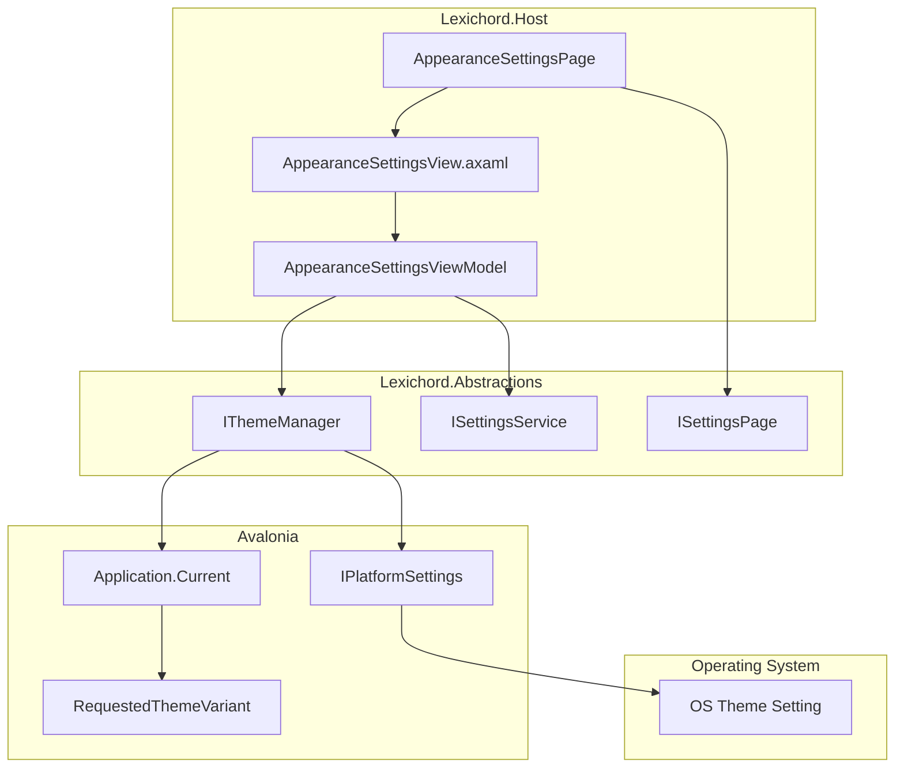
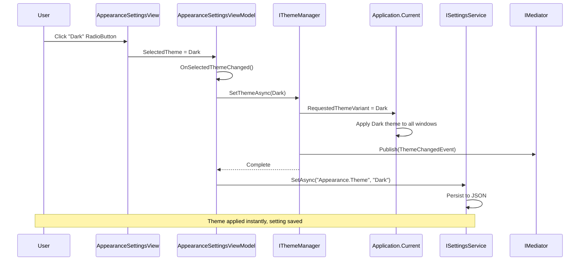
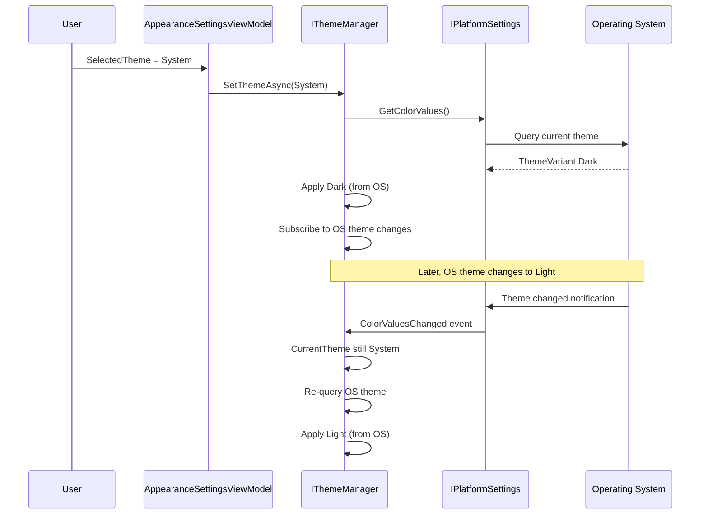

# LCS-DES-016b: Live Theme Preview

## 1. Metadata & Categorization

| Field                | Value              | Description                                 |
| :------------------- | :----------------- | :------------------------------------------ |
| **Document ID**      | LCS-DES-016b       | Design Specification v0.1.6b                |
| **Feature ID**       | INF-016b           | Live Theme Preview                          |
| **Feature Name**     | Live Theme Preview | Appearance tab with instant theme switching |
| **Target Version**   | `v0.1.6`           | Settings Foundation Milestone               |
| **Module Scope**     | `Lexichord.Host`   | Core shell infrastructure                   |
| **Swimlane**         | `Infrastructure`   | The Podium (Platform)                       |
| **License Tier**     | `Core`             | Foundation (Available in Free tier)         |
| **Feature Gate Key** | N/A                | No runtime gating                           |
| **Author**           | System Architect   |                                             |
| **Status**           | **Draft**          | Pending implementation                      |
| **Last Updated**     | 2026-01-27         |                                             |

---

## 2. Executive Summary

### 2.1 The Requirement

Users expect **instant visual feedback** when changing application theme:

- Theme changes should apply immediately without restart
- Light, Dark, and System (follow OS) options required
- Preview should affect entire application, including Settings dialog
- Theme preference must persist across sessions
- No "Apply" or "OK" button needed - selection is immediate

### 2.2 The Proposed Solution

We **SHALL** implement:

1. **AppearanceSettingsPage** — Settings page implementing `ISettingsPage`
2. **Theme RadioButtons** — Light, Dark, System options
3. **IThemeManager integration** — Real-time theme application
4. **Settings persistence** — Theme preference saved immediately
5. **OS theme detection** — System option follows Windows/macOS/Linux theme

---

## 3. Architecture

### 3.1 Component Architecture



### 3.2 Theme Change Sequence



### 3.3 System Theme Detection Sequence



---

## 4. Decision Tree

```text
START: "How to handle theme selection?"
|
+-- User selects theme option
|   +-- Which option?
|   |   +-- Light -> Apply Light theme directly
|   |   +-- Dark -> Apply Dark theme directly
|   |   +-- System -> Query OS, apply matching theme
|   +-- IThemeManager.SetThemeAsync(selected)
|   +-- Theme applied to Application.Current
|   +-- All windows update immediately
|   +-- Persist setting to ISettingsService
|   +-- Publish ThemeChangedEvent
|   +-- END
|
+-- Application starts
|   +-- Load theme from ISettingsService
|   +-- Default to "System" if not set
|   +-- Apply theme via IThemeManager
|   +-- If System: query OS theme, apply it
|   +-- Subscribe to OS theme changes (if System selected)
|   +-- END
|
+-- OS theme changes (while in System mode)
|   +-- Is current selection "System"?
|   |   +-- YES -> Re-query OS theme, apply it
|   |   +-- NO -> Ignore (user has explicit preference)
|   +-- END
|
+-- END
```

---

## 5. Data Contracts

### 5.1 IThemeManager Interface

```csharp
namespace Lexichord.Abstractions.Contracts;

/// <summary>
/// Manages application theme (Light/Dark/System).
/// </summary>
/// <remarks>
/// LOGIC: IThemeManager is responsible for:
/// - Applying theme changes to Application.Current
/// - Detecting OS theme when "System" is selected
/// - Subscribing to OS theme change notifications
/// - Publishing ThemeChangedEvent for observers
///
/// Implementation uses Avalonia's RequestedThemeVariant property
/// which cascades to all windows and controls.
///
/// Thread Safety:
/// - All methods must be called from UI thread
/// - Events raised on UI thread
/// </remarks>
public interface IThemeManager
{
    /// <summary>
    /// Gets the currently selected theme mode.
    /// </summary>
    /// <remarks>
    /// LOGIC: This is the user's selection, not the effective theme.
    /// If "System" is selected, the actual appearance depends on OS.
    /// </remarks>
    ThemeMode CurrentTheme { get; }

    /// <summary>
    /// Gets the effective theme currently being displayed.
    /// </summary>
    /// <remarks>
    /// LOGIC: For Light/Dark, same as CurrentTheme.
    /// For System, this reflects the current OS theme.
    /// </remarks>
    ThemeVariant EffectiveTheme { get; }

    /// <summary>
    /// Sets the application theme.
    /// </summary>
    /// <param name="theme">The theme to apply.</param>
    /// <returns>Task completing when theme is applied.</returns>
    /// <remarks>
    /// LOGIC: Applies theme immediately to all windows.
    /// If theme is System, queries OS and applies matching variant.
    /// Does NOT persist the setting - caller is responsible.
    /// </remarks>
    Task SetThemeAsync(ThemeMode theme);

    /// <summary>
    /// Gets the current OS theme preference.
    /// </summary>
    /// <returns>Light or Dark based on OS setting.</returns>
    ThemeVariant GetSystemTheme();

    /// <summary>
    /// Event raised when theme changes.
    /// </summary>
    /// <remarks>
    /// LOGIC: Raised after theme is applied to Application.
    /// Includes both old and new theme values.
    /// </remarks>
    event EventHandler<ThemeChangedEventArgs>? ThemeChanged;
}

/// <summary>
/// Theme mode options.
/// </summary>
public enum ThemeMode
{
    /// <summary>
    /// Light theme (light background, dark text).
    /// </summary>
    Light,

    /// <summary>
    /// Dark theme (dark background, light text).
    /// </summary>
    Dark,

    /// <summary>
    /// Follow operating system theme preference.
    /// </summary>
    System
}

/// <summary>
/// Actual theme variant being displayed.
/// </summary>
public enum ThemeVariant
{
    /// <summary>
    /// Light theme is active.
    /// </summary>
    Light,

    /// <summary>
    /// Dark theme is active.
    /// </summary>
    Dark
}

/// <summary>
/// Event args for theme changes.
/// </summary>
public sealed class ThemeChangedEventArgs : EventArgs
{
    /// <summary>
    /// Gets the previous theme mode.
    /// </summary>
    public required ThemeMode OldTheme { get; init; }

    /// <summary>
    /// Gets the new theme mode.
    /// </summary>
    public required ThemeMode NewTheme { get; init; }

    /// <summary>
    /// Gets the effective theme variant being displayed.
    /// </summary>
    public required ThemeVariant EffectiveTheme { get; init; }
}
```

### 5.2 AppearanceSettings Record

```csharp
namespace Lexichord.Host.Settings;

/// <summary>
/// Settings for the Appearance section.
/// </summary>
/// <remarks>
/// LOGIC: Persisted via ISettingsService under "Appearance" section.
/// Default values used when settings file doesn't exist.
/// </remarks>
public sealed record AppearanceSettings
{
    /// <summary>
    /// Settings section name.
    /// </summary>
    public const string SectionName = "Appearance";

    /// <summary>
    /// Gets or sets the theme mode.
    /// </summary>
    /// <remarks>
    /// LOGIC: Stored as string for JSON serialization.
    /// Values: "Light", "Dark", "System"
    /// Default: "System" (follow OS)
    /// </remarks>
    public string Theme { get; init; } = "System";

    /// <summary>
    /// Gets or sets whether to use system accent color.
    /// </summary>
    /// <remarks>
    /// LOGIC: Future feature - allow OS accent color for highlights.
    /// </remarks>
    public bool UseSystemAccentColor { get; init; } = true;

    /// <summary>
    /// Gets or sets the UI scale factor.
    /// </summary>
    /// <remarks>
    /// LOGIC: Future feature - custom DPI scaling.
    /// Default: 1.0 (100%)
    /// </remarks>
    public double UiScale { get; init; } = 1.0;

    /// <summary>
    /// Parses theme string to ThemeMode enum.
    /// </summary>
    public ThemeMode GetThemeMode()
    {
        return Theme switch
        {
            "Light" => ThemeMode.Light,
            "Dark" => ThemeMode.Dark,
            _ => ThemeMode.System
        };
    }
}
```

### 5.3 Theme Domain Events

```csharp
namespace Lexichord.Abstractions.Events;

using MediatR;

/// <summary>
/// Event published when application theme changes.
/// </summary>
/// <param name="OldTheme">Previous theme mode.</param>
/// <param name="NewTheme">New theme mode.</param>
/// <param name="EffectiveTheme">Actual theme being displayed.</param>
public record ThemeChangedEvent(
    ThemeMode OldTheme,
    ThemeMode NewTheme,
    ThemeVariant EffectiveTheme
) : INotification;
```

---

## 6. Implementation Logic

### 6.1 ThemeManager Implementation

```csharp
using Avalonia;
using Avalonia.Styling;
using Avalonia.Platform;
using Lexichord.Abstractions.Contracts;
using Lexichord.Abstractions.Events;
using MediatR;
using Microsoft.Extensions.Logging;

namespace Lexichord.Host.Services;

/// <summary>
/// Manages application theme with live preview support.
/// </summary>
/// <remarks>
/// LOGIC: Uses Avalonia's RequestedThemeVariant for theme switching.
/// Subscribes to OS theme changes when in System mode.
///
/// Thread Safety:
/// - Must be called from UI thread
/// - Uses Dispatcher for OS callbacks
/// </remarks>
public sealed class ThemeManager : IThemeManager, IDisposable
{
    private readonly IMediator _mediator;
    private readonly ILogger<ThemeManager> _logger;
    private readonly IPlatformSettings? _platformSettings;
    private ThemeMode _currentTheme = ThemeMode.System;
    private bool _subscribedToOsChanges;

    public ThemeManager(
        IMediator mediator,
        ILogger<ThemeManager> logger)
    {
        _mediator = mediator;
        _logger = logger;

        // LOGIC: Get platform settings for OS theme detection
        _platformSettings = Application.Current?.PlatformSettings;

        _logger.LogDebug("ThemeManager initialized");
    }

    /// <inheritdoc/>
    public ThemeMode CurrentTheme => _currentTheme;

    /// <inheritdoc/>
    public ThemeVariant EffectiveTheme
    {
        get
        {
            var requested = Application.Current?.RequestedThemeVariant;
            return requested == Avalonia.Styling.ThemeVariant.Dark
                ? ThemeVariant.Dark
                : ThemeVariant.Light;
        }
    }

    /// <inheritdoc/>
    public event EventHandler<ThemeChangedEventArgs>? ThemeChanged;

    /// <inheritdoc/>
    public async Task SetThemeAsync(ThemeMode theme)
    {
        var oldTheme = _currentTheme;

        if (oldTheme == theme)
        {
            _logger.LogDebug("Theme already set to {Theme}, skipping", theme);
            return;
        }

        _logger.LogInformation("Setting theme: {OldTheme} -> {NewTheme}",
            oldTheme, theme);

        _currentTheme = theme;

        // LOGIC: Apply the theme to Avalonia
        ApplyTheme(theme);

        // LOGIC: Manage OS theme subscription
        ManageOsThemeSubscription(theme);

        // LOGIC: Raise events
        var effectiveTheme = EffectiveTheme;

        ThemeChanged?.Invoke(this, new ThemeChangedEventArgs
        {
            OldTheme = oldTheme,
            NewTheme = theme,
            EffectiveTheme = effectiveTheme
        });

        await _mediator.Publish(new ThemeChangedEvent(
            oldTheme,
            theme,
            effectiveTheme));

        _logger.LogInformation(
            "Theme applied: {Theme} (Effective: {Effective})",
            theme, effectiveTheme);
    }

    /// <inheritdoc/>
    public ThemeVariant GetSystemTheme()
    {
        if (_platformSettings is null)
        {
            _logger.LogWarning("Platform settings unavailable, defaulting to Light");
            return ThemeVariant.Light;
        }

        try
        {
            var colorValues = _platformSettings.GetColorValues();
            var isDark = colorValues.ThemeVariant == PlatformThemeVariant.Dark;

            _logger.LogDebug("System theme detected: {Theme}",
                isDark ? "Dark" : "Light");

            return isDark ? ThemeVariant.Dark : ThemeVariant.Light;
        }
        catch (Exception ex)
        {
            _logger.LogWarning(ex, "Failed to detect system theme, defaulting to Light");
            return ThemeVariant.Light;
        }
    }

    private void ApplyTheme(ThemeMode theme)
    {
        if (Application.Current is null)
        {
            _logger.LogWarning("Application.Current is null, cannot apply theme");
            return;
        }

        var avaloniaTheme = theme switch
        {
            ThemeMode.Light => Avalonia.Styling.ThemeVariant.Light,
            ThemeMode.Dark => Avalonia.Styling.ThemeVariant.Dark,
            ThemeMode.System => GetSystemTheme() == ThemeVariant.Dark
                ? Avalonia.Styling.ThemeVariant.Dark
                : Avalonia.Styling.ThemeVariant.Light,
            _ => Avalonia.Styling.ThemeVariant.Default
        };

        // LOGIC: This cascades to all windows and controls
        Application.Current.RequestedThemeVariant = avaloniaTheme;

        _logger.LogDebug("Applied Avalonia theme variant: {Variant}", avaloniaTheme);
    }

    private void ManageOsThemeSubscription(ThemeMode theme)
    {
        if (theme == ThemeMode.System)
        {
            // LOGIC: Subscribe to OS theme changes
            if (!_subscribedToOsChanges && _platformSettings is not null)
            {
                _platformSettings.ColorValuesChanged += OnOsThemeChanged;
                _subscribedToOsChanges = true;
                _logger.LogDebug("Subscribed to OS theme changes");
            }
        }
        else
        {
            // LOGIC: Unsubscribe from OS theme changes
            if (_subscribedToOsChanges && _platformSettings is not null)
            {
                _platformSettings.ColorValuesChanged -= OnOsThemeChanged;
                _subscribedToOsChanges = false;
                _logger.LogDebug("Unsubscribed from OS theme changes");
            }
        }
    }

    private void OnOsThemeChanged(object? sender, PlatformColorValues e)
    {
        // LOGIC: Only react if still in System mode
        if (_currentTheme != ThemeMode.System)
        {
            return;
        }

        _logger.LogInformation("OS theme changed, updating application theme");

        // LOGIC: Re-apply System theme to pick up new OS preference
        ApplyTheme(ThemeMode.System);

        // LOGIC: Notify listeners of effective theme change
        ThemeChanged?.Invoke(this, new ThemeChangedEventArgs
        {
            OldTheme = ThemeMode.System,
            NewTheme = ThemeMode.System,
            EffectiveTheme = EffectiveTheme
        });
    }

    /// <inheritdoc/>
    public void Dispose()
    {
        if (_subscribedToOsChanges && _platformSettings is not null)
        {
            _platformSettings.ColorValuesChanged -= OnOsThemeChanged;
            _subscribedToOsChanges = false;
        }
    }
}
```

### 6.2 AppearanceSettingsPage Implementation

```csharp
using Avalonia.Controls;
using Lexichord.Abstractions.Contracts;
using Microsoft.Extensions.DependencyInjection;

namespace Lexichord.Host.Settings.Pages;

/// <summary>
/// Settings page for appearance options (theme, colors, etc.).
/// </summary>
/// <remarks>
/// LOGIC: This is a built-in settings page registered by the Host.
/// It provides theme selection with live preview.
/// </remarks>
public sealed class AppearanceSettingsPage : ISettingsPage
{
    private readonly IServiceProvider _services;

    public AppearanceSettingsPage(IServiceProvider services)
    {
        _services = services;
    }

    /// <inheritdoc/>
    public string CategoryId => "appearance";

    /// <inheritdoc/>
    public string DisplayName => "Appearance";

    /// <inheritdoc/>
    public string? ParentCategoryId => null; // Root category

    /// <inheritdoc/>
    public string? Icon => "Palette";

    /// <inheritdoc/>
    public int SortOrder => 0; // First in list

    /// <inheritdoc/>
    public LicenseTier RequiredTier => LicenseTier.Core;

    /// <inheritdoc/>
    public IReadOnlyList<string> SearchKeywords => new[]
    {
        "theme", "dark", "light", "mode", "colors", "appearance", "style"
    };

    /// <inheritdoc/>
    public Control CreateView()
    {
        var viewModel = _services.GetRequiredService<AppearanceSettingsViewModel>();
        return new AppearanceSettingsView
        {
            DataContext = viewModel
        };
    }
}
```

### 6.3 AppearanceSettingsViewModel Implementation

```csharp
using CommunityToolkit.Mvvm.ComponentModel;
using CommunityToolkit.Mvvm.Input;
using Lexichord.Abstractions.Contracts;
using Microsoft.Extensions.Logging;

namespace Lexichord.Host.Settings.ViewModels;

/// <summary>
/// ViewModel for the Appearance settings page.
/// </summary>
/// <remarks>
/// LOGIC: Provides two-way binding for theme selection.
/// Changes apply immediately (live preview) and persist automatically.
/// </remarks>
public sealed partial class AppearanceSettingsViewModel : ObservableObject
{
    private readonly IThemeManager _themeManager;
    private readonly ISettingsService _settingsService;
    private readonly ILogger<AppearanceSettingsViewModel> _logger;

    [ObservableProperty]
    private ThemeMode _selectedTheme;

    [ObservableProperty]
    private bool _isLight;

    [ObservableProperty]
    private bool _isDark;

    [ObservableProperty]
    private bool _isSystem;

    public AppearanceSettingsViewModel(
        IThemeManager themeManager,
        ISettingsService settingsService,
        ILogger<AppearanceSettingsViewModel> logger)
    {
        _themeManager = themeManager;
        _settingsService = settingsService;
        _logger = logger;

        // LOGIC: Initialize from current theme
        LoadCurrentTheme();

        _logger.LogDebug("AppearanceSettingsViewModel initialized with theme: {Theme}",
            SelectedTheme);
    }

    /// <summary>
    /// Gets available theme options for display.
    /// </summary>
    public IReadOnlyList<ThemeOption> ThemeOptions { get; } = new[]
    {
        new ThemeOption(ThemeMode.Light, "Light", "Light background with dark text"),
        new ThemeOption(ThemeMode.Dark, "Dark", "Dark background with light text"),
        new ThemeOption(ThemeMode.System, "System", "Follow operating system preference")
    };

    partial void OnSelectedThemeChanged(ThemeMode value)
    {
        // LOGIC: Update individual boolean properties for RadioButton binding
        IsLight = value == ThemeMode.Light;
        IsDark = value == ThemeMode.Dark;
        IsSystem = value == ThemeMode.System;

        // LOGIC: Apply theme immediately (live preview)
        ApplyThemeAsync(value).ConfigureAwait(false);
    }

    partial void OnIsLightChanged(bool value)
    {
        if (value) SelectedTheme = ThemeMode.Light;
    }

    partial void OnIsDarkChanged(bool value)
    {
        if (value) SelectedTheme = ThemeMode.Dark;
    }

    partial void OnIsSystemChanged(bool value)
    {
        if (value) SelectedTheme = ThemeMode.System;
    }

    private void LoadCurrentTheme()
    {
        SelectedTheme = _themeManager.CurrentTheme;
    }

    private async Task ApplyThemeAsync(ThemeMode theme)
    {
        try
        {
            _logger.LogDebug("Applying theme: {Theme}", theme);

            // LOGIC: Apply to application
            await _themeManager.SetThemeAsync(theme);

            // LOGIC: Persist setting
            await _settingsService.SetAsync(
                AppearanceSettings.SectionName,
                nameof(AppearanceSettings.Theme),
                theme.ToString());

            _logger.LogInformation("Theme applied and saved: {Theme}", theme);
        }
        catch (Exception ex)
        {
            _logger.LogError(ex, "Failed to apply theme: {Theme}", theme);
        }
    }
}

/// <summary>
/// Represents a theme option for display.
/// </summary>
/// <param name="Mode">The theme mode.</param>
/// <param name="DisplayName">User-friendly name.</param>
/// <param name="Description">Description of the theme.</param>
public record ThemeOption(ThemeMode Mode, string DisplayName, string Description);
```

### 6.4 AppearanceSettingsView XAML

```xml
<!-- AppearanceSettingsView.axaml -->
<UserControl xmlns="https://github.com/avaloniaui"
             xmlns:x="http://schemas.microsoft.com/winfx/2006/xaml"
             xmlns:vm="using:Lexichord.Host.Settings.ViewModels"
             x:Class="Lexichord.Host.Settings.Views.AppearanceSettingsView"
             x:DataType="vm:AppearanceSettingsViewModel">

    <StackPanel Spacing="24">
        <!-- Theme Section -->
        <StackPanel Spacing="8">
            <TextBlock Text="Theme"
                       Classes="h3"
                       FontWeight="SemiBold"/>

            <TextBlock Text="Select the color theme for the application."
                       Classes="caption"
                       Foreground="{DynamicResource SecondaryTextBrush}"/>

            <StackPanel Spacing="8" Margin="0,8,0,0">
                <!-- Light Theme -->
                <RadioButton GroupName="Theme"
                             IsChecked="{Binding IsLight}">
                    <StackPanel Spacing="4">
                        <TextBlock Text="Light"
                                   FontWeight="Medium"/>
                        <TextBlock Text="Light background with dark text"
                                   Classes="caption"
                                   Foreground="{DynamicResource SecondaryTextBrush}"/>
                    </StackPanel>
                </RadioButton>

                <!-- Dark Theme -->
                <RadioButton GroupName="Theme"
                             IsChecked="{Binding IsDark}">
                    <StackPanel Spacing="4">
                        <TextBlock Text="Dark"
                                   FontWeight="Medium"/>
                        <TextBlock Text="Dark background with light text"
                                   Classes="caption"
                                   Foreground="{DynamicResource SecondaryTextBrush}"/>
                    </StackPanel>
                </RadioButton>

                <!-- System Theme -->
                <RadioButton GroupName="Theme"
                             IsChecked="{Binding IsSystem}">
                    <StackPanel Spacing="4">
                        <TextBlock Text="System"
                                   FontWeight="Medium"/>
                        <TextBlock Text="Follow operating system preference"
                                   Classes="caption"
                                   Foreground="{DynamicResource SecondaryTextBrush}"/>
                    </StackPanel>
                </RadioButton>
            </StackPanel>
        </StackPanel>

        <!-- Preview Note -->
        <Border Background="{DynamicResource InfoBackgroundBrush}"
                CornerRadius="4"
                Padding="12">
            <StackPanel Orientation="Horizontal" Spacing="8">
                <PathIcon Data="{StaticResource InformationIcon}"
                          Width="16" Height="16"
                          Foreground="{DynamicResource InfoForegroundBrush}"/>
                <TextBlock Text="Theme changes apply instantly - no restart required."
                           Foreground="{DynamicResource InfoForegroundBrush}"
                           VerticalAlignment="Center"/>
            </StackPanel>
        </Border>

        <!-- Future: Additional appearance settings -->
        <!--
        <StackPanel Spacing="8" Margin="0,16,0,0">
            <TextBlock Text="Additional Options"
                       Classes="h3"
                       FontWeight="SemiBold"/>

            <CheckBox Content="Use system accent color"
                      IsChecked="{Binding UseSystemAccentColor}"/>
        </StackPanel>
        -->
    </StackPanel>
</UserControl>
```

---

## 7. Use Cases

### UC-01: Change Theme to Dark

**Preconditions:**

- Settings window is open.
- Current theme is Light.
- Appearance category is selected.

**Flow:**

1. User sees three RadioButtons: Light (selected), Dark, System.
2. User clicks "Dark" RadioButton.
3. IsDark becomes true, triggering OnIsDarkChanged.
4. SelectedTheme changes to ThemeMode.Dark.
5. OnSelectedThemeChanged fires.
6. ThemeManager.SetThemeAsync(Dark) called.
7. Application.Current.RequestedThemeVariant = Dark.
8. All windows immediately update to dark theme.
9. Settings dialog itself turns dark.
10. ISettingsService persists "Appearance.Theme" = "Dark".
11. ThemeChangedEvent published.

**Postconditions:**

- Entire application is dark themed.
- Setting saved to disk.
- On next launch, dark theme loads.

---

### UC-02: Follow System Theme

**Preconditions:**

- OS theme is currently Dark.
- Application theme is Light.

**Flow:**

1. User opens Settings > Appearance.
2. User clicks "System" RadioButton.
3. ThemeManager.SetThemeAsync(System) called.
4. ThemeManager queries OS theme via IPlatformSettings.
5. OS reports "Dark".
6. Application.Current.RequestedThemeVariant = Dark.
7. Application turns dark (matching OS).
8. ThemeManager subscribes to ColorValuesChanged.
9. Later, user changes OS to Light.
10. ColorValuesChanged event fires.
11. ThemeManager re-queries OS, applies Light.
12. Application turns light automatically.

**Postconditions:**

- Application follows OS theme.
- Theme changes with OS setting.

---

## 8. Observability & Logging

| Level       | Context                     | Message Template                                              |
| :---------- | :-------------------------- | :------------------------------------------------------------ |
| Debug       | ThemeManager                | `ThemeManager initialized`                                    |
| Debug       | ThemeManager                | `Theme already set to {Theme}, skipping`                      |
| Information | ThemeManager                | `Setting theme: {OldTheme} -> {NewTheme}`                     |
| Information | ThemeManager                | `Theme applied: {Theme} (Effective: {Effective})`             |
| Debug       | ThemeManager                | `Applied Avalonia theme variant: {Variant}`                   |
| Debug       | ThemeManager                | `Subscribed to OS theme changes`                              |
| Debug       | ThemeManager                | `Unsubscribed from OS theme changes`                          |
| Information | ThemeManager                | `OS theme changed, updating application theme`                |
| Debug       | ThemeManager                | `System theme detected: {Theme}`                              |
| Warning     | ThemeManager                | `Platform settings unavailable, defaulting to Light`          |
| Warning     | ThemeManager                | `Failed to detect system theme, defaulting to Light`          |
| Warning     | ThemeManager                | `Application.Current is null, cannot apply theme`             |
| Debug       | AppearanceSettingsViewModel | `AppearanceSettingsViewModel initialized with theme: {Theme}` |
| Debug       | AppearanceSettingsViewModel | `Applying theme: {Theme}`                                     |
| Information | AppearanceSettingsViewModel | `Theme applied and saved: {Theme}`                            |
| Error       | AppearanceSettingsViewModel | `Failed to apply theme: {Theme}`                              |

---

## 9. Unit Testing Requirements

### 9.1 ThemeManager Tests

```csharp
[TestFixture]
[Category("Unit")]
public class ThemeManagerTests
{
    private Mock<IMediator> _mockMediator = null!;
    private Mock<ILogger<ThemeManager>> _mockLogger = null!;

    [SetUp]
    public void SetUp()
    {
        _mockMediator = new Mock<IMediator>();
        _mockLogger = new Mock<ILogger<ThemeManager>>();
    }

    [Test]
    public async Task SetThemeAsync_Light_SetsCurrentTheme()
    {
        // Arrange
        // Note: Full test requires Avalonia test infrastructure
        var sut = new ThemeManager(_mockMediator.Object, _mockLogger.Object);

        // Act
        await sut.SetThemeAsync(ThemeMode.Light);

        // Assert
        Assert.That(sut.CurrentTheme, Is.EqualTo(ThemeMode.Light));
    }

    [Test]
    public async Task SetThemeAsync_SameTheme_DoesNotRaiseEvent()
    {
        // Arrange
        var sut = new ThemeManager(_mockMediator.Object, _mockLogger.Object);
        await sut.SetThemeAsync(ThemeMode.Light);

        var eventRaised = false;
        sut.ThemeChanged += (s, e) => eventRaised = true;

        // Act
        await sut.SetThemeAsync(ThemeMode.Light);

        // Assert
        Assert.That(eventRaised, Is.False);
    }

    [Test]
    public async Task SetThemeAsync_DifferentTheme_RaisesThemeChangedEvent()
    {
        // Arrange
        var sut = new ThemeManager(_mockMediator.Object, _mockLogger.Object);
        await sut.SetThemeAsync(ThemeMode.Light);

        ThemeChangedEventArgs? eventArgs = null;
        sut.ThemeChanged += (s, e) => eventArgs = e;

        // Act
        await sut.SetThemeAsync(ThemeMode.Dark);

        // Assert
        Assert.That(eventArgs, Is.Not.Null);
        Assert.That(eventArgs!.OldTheme, Is.EqualTo(ThemeMode.Light));
        Assert.That(eventArgs.NewTheme, Is.EqualTo(ThemeMode.Dark));
    }

    [Test]
    public async Task SetThemeAsync_DifferentTheme_PublishesMediatrEvent()
    {
        // Arrange
        var sut = new ThemeManager(_mockMediator.Object, _mockLogger.Object);

        // Act
        await sut.SetThemeAsync(ThemeMode.Dark);

        // Assert
        _mockMediator.Verify(m => m.Publish(
            It.Is<ThemeChangedEvent>(e => e.NewTheme == ThemeMode.Dark),
            It.IsAny<CancellationToken>()), Times.Once);
    }

    [Test]
    public void GetSystemTheme_NoPlatformSettings_ReturnsLight()
    {
        // Arrange
        var sut = new ThemeManager(_mockMediator.Object, _mockLogger.Object);

        // Act
        var result = sut.GetSystemTheme();

        // Assert
        Assert.That(result, Is.EqualTo(ThemeVariant.Light));
    }
}
```

### 9.2 AppearanceSettingsViewModel Tests

```csharp
[TestFixture]
[Category("Unit")]
public class AppearanceSettingsViewModelTests
{
    private Mock<IThemeManager> _mockThemeManager = null!;
    private Mock<ISettingsService> _mockSettingsService = null!;
    private Mock<ILogger<AppearanceSettingsViewModel>> _mockLogger = null!;

    [SetUp]
    public void SetUp()
    {
        _mockThemeManager = new Mock<IThemeManager>();
        _mockSettingsService = new Mock<ISettingsService>();
        _mockLogger = new Mock<ILogger<AppearanceSettingsViewModel>>();

        _mockThemeManager.SetupGet(t => t.CurrentTheme).Returns(ThemeMode.System);
    }

    [Test]
    public void Constructor_LoadsCurrentTheme()
    {
        // Arrange
        _mockThemeManager.SetupGet(t => t.CurrentTheme).Returns(ThemeMode.Dark);

        // Act
        var sut = CreateSut();

        // Assert
        Assert.That(sut.SelectedTheme, Is.EqualTo(ThemeMode.Dark));
        Assert.That(sut.IsDark, Is.True);
    }

    [Test]
    public void SelectedTheme_WhenChanged_UpdatesBooleanProperties()
    {
        // Arrange
        var sut = CreateSut();

        // Act
        sut.SelectedTheme = ThemeMode.Light;

        // Assert
        Assert.Multiple(() =>
        {
            Assert.That(sut.IsLight, Is.True);
            Assert.That(sut.IsDark, Is.False);
            Assert.That(sut.IsSystem, Is.False);
        });
    }

    [Test]
    public void SelectedTheme_WhenChanged_AppliesTheme()
    {
        // Arrange
        var sut = CreateSut();

        // Act
        sut.SelectedTheme = ThemeMode.Dark;

        // Assert
        _mockThemeManager.Verify(t => t.SetThemeAsync(ThemeMode.Dark), Times.Once);
    }

    [Test]
    public void SelectedTheme_WhenChanged_PersistsToSettings()
    {
        // Arrange
        var sut = CreateSut();

        // Act
        sut.SelectedTheme = ThemeMode.Light;

        // Allow async operation to complete
        Task.Delay(100).Wait();

        // Assert
        _mockSettingsService.Verify(s => s.SetAsync(
            "Appearance",
            "Theme",
            "Light"), Times.Once);
    }

    [Test]
    public void IsLight_WhenSetToTrue_SetsSelectedTheme()
    {
        // Arrange
        var sut = CreateSut();

        // Act
        sut.IsLight = true;

        // Assert
        Assert.That(sut.SelectedTheme, Is.EqualTo(ThemeMode.Light));
    }

    private AppearanceSettingsViewModel CreateSut()
    {
        return new AppearanceSettingsViewModel(
            _mockThemeManager.Object,
            _mockSettingsService.Object,
            _mockLogger.Object);
    }
}
```

---

## 10. Security & Safety

### 10.1 Theme Application Safety

> [!NOTE]
> Theme changes are purely visual and do not affect data or security.

- **No Data Impact:** Theme switching only affects visuals.
- **Avalonia Built-in:** Uses Avalonia's proven theme system.
- **Exception Handling:** Errors in theme application are caught and logged.

### 10.2 Settings Persistence

> [!IMPORTANT]
> Theme setting is persisted automatically; ensure settings file integrity.

- **Atomic Writes:** Settings service uses atomic write pattern.
- **Validation:** Theme value validated before applying.
- **Fallback:** Invalid theme values default to "System".

---

## 11. Acceptance Criteria

| #   | Category      | Criterion                                       |
| :-- | :------------ | :---------------------------------------------- |
| 1   | **[Display]** | Appearance page shows theme options             |
| 2   | **[Display]** | Current theme is pre-selected                   |
| 3   | **[Light]**   | Clicking Light applies light theme instantly    |
| 4   | **[Dark]**    | Clicking Dark applies dark theme instantly      |
| 5   | **[System]**  | Clicking System follows OS theme                |
| 6   | **[System]**  | OS theme change updates app when in System mode |
| 7   | **[Preview]** | Settings dialog itself reflects theme change    |
| 8   | **[Persist]** | Theme preference saved automatically            |
| 9   | **[Persist]** | Theme preference loaded on startup              |
| 10  | **[Event]**   | ThemeChangedEvent published on change           |

---

## 12. Verification Commands

```bash
# 1. Build project
dotnet build

# 2. Run unit tests
dotnet test --filter "FullyQualifiedName~Theme"

# 3. Run application
dotnet run --project src/Lexichord.Host

# 4. Manual verification:
# - Open Settings (Ctrl+,)
# - Click Appearance category
# - Click Light radio button -> App turns light
# - Click Dark radio button -> App turns dark
# - Click System radio button -> App matches OS
# - Close and reopen app -> Theme persisted

# 5. Check settings file
cat ~/.config/Lexichord/settings.json | jq '.Appearance.Theme'

# 6. Test OS theme following (Windows):
# - Set app to System mode
# - Change Windows theme in Settings > Personalization > Colors
# - Verify app changes automatically

# 7. Test OS theme following (macOS):
# - Set app to System mode
# - Change macOS theme in System Preferences > General
# - Verify app changes automatically
```

---

## 13. Deliverable Checklist

| Step | Description                                | Status |
| :--- | :----------------------------------------- | :----- |
| 1    | Define IThemeManager interface             | [ ]    |
| 2    | Define ThemeMode and ThemeVariant enums    | [ ]    |
| 3    | Define ThemeChangedEventArgs               | [ ]    |
| 4    | Define ThemeChangedEvent (MediatR)         | [ ]    |
| 5    | Define AppearanceSettings record           | [ ]    |
| 6    | Implement ThemeManager service             | [ ]    |
| 7    | Implement OS theme detection               | [ ]    |
| 8    | Implement OS theme change subscription     | [ ]    |
| 9    | Create AppearanceSettingsPage              | [ ]    |
| 10   | Create AppearanceSettingsViewModel         | [ ]    |
| 11   | Create AppearanceSettingsView.axaml        | [ ]    |
| 12   | Register AppearanceSettingsPage in Host    | [ ]    |
| 13   | Register ThemeManager as singleton         | [ ]    |
| 14   | Load theme on application startup          | [ ]    |
| 15   | Unit tests for ThemeManager                | [ ]    |
| 16   | Unit tests for AppearanceSettingsViewModel | [ ]    |
| 17   | Integration test for theme switching       | [ ]    |
