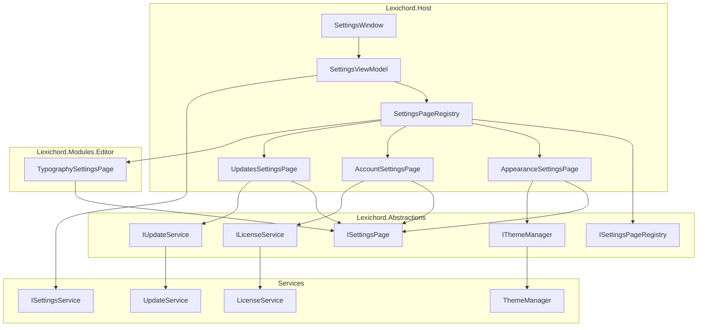
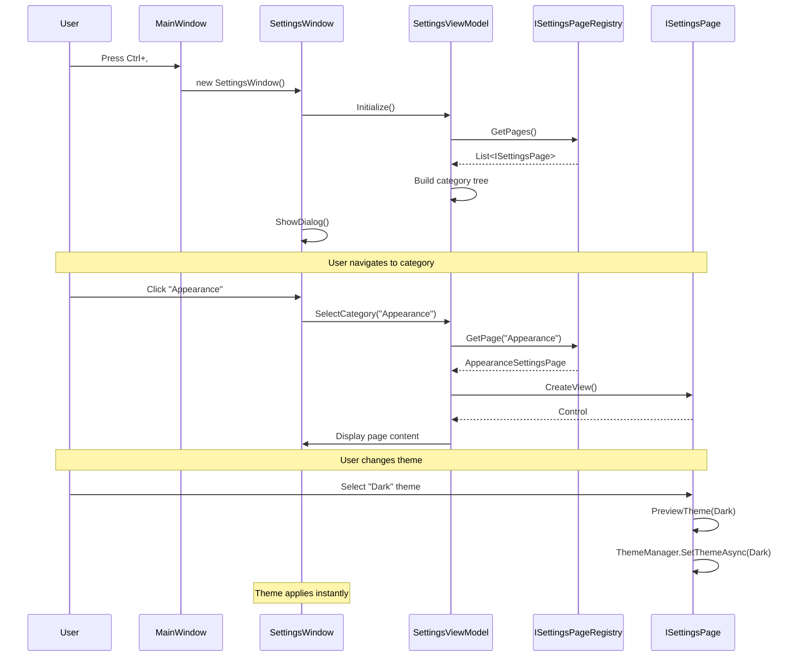
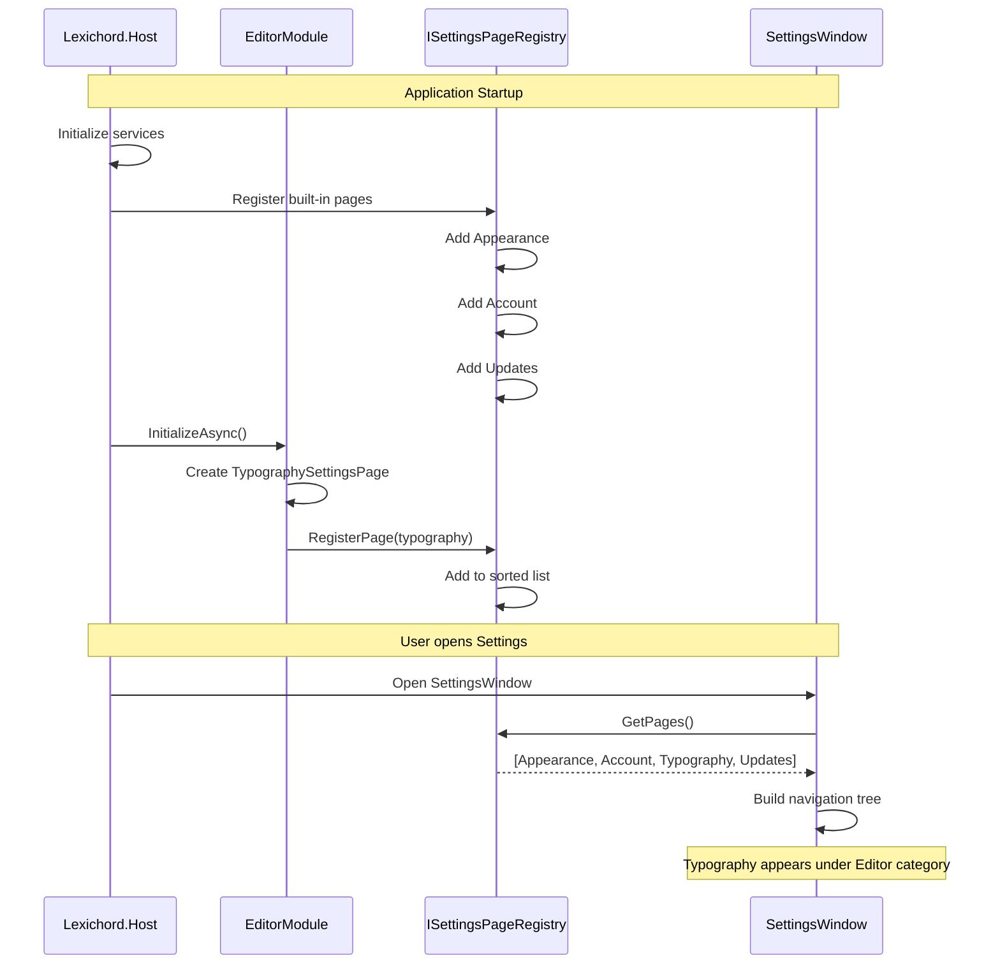

# LCS-INF-016: Feature Design Specification — Tuning Room (Settings & Preferences)

## 1. Metadata & Categorization

| Field                | Value                                         | Description                                        |
| :------------------- | :-------------------------------------------- | :------------------------------------------------- |
| **Feature ID**       | `INF-016`                                     | Infrastructure - Tuning Room                       |
| **Feature Name**     | Tuning Room (Settings & Preferences)          | Centralized settings management system             |
| **Target Version**   | `v0.1.6`                                      | Settings Foundation Milestone                      |
| **Module Scope**     | `Lexichord.Host`                              | Core shell infrastructure                          |
| **Swimlane**         | `Infrastructure`                              | The Podium (Platform)                              |
| **License Tier**     | `Core`                                        | Foundation (Available in Free tier)                |
| **Feature Gate Key** | N/A                                           | No runtime gating for settings infrastructure      |
| **Author**           | System Architect                              |                                                    |
| **Status**           | **Draft**                                     | Pending implementation                             |
| **Last Updated**     | 2026-01-26                                    |                                                    |

---

## 2. Executive Summary

### 2.1 The Requirement

Lexichord needs a **centralized settings experience** that:

- Provides a unified location for all application preferences
- Allows modules to contribute their own settings pages
- Supports live preview for visual settings (themes, fonts)
- Enables license management for tier upgrades
- Offers update channel control for power users

Without this infrastructure:

- Settings are scattered across multiple dialogs
- Modules cannot expose configuration to users
- Users must restart the application for theme changes
- License management requires external tools
- No mechanism for early access programs

### 2.2 The Proposed Solution

We **SHALL** implement a complete Settings infrastructure with:

1. **v0.1.6a: Settings Dialog Framework** — Modal window with `ISettingsPage` for module injection.
2. **v0.1.6b: Live Theme Preview** — Appearance tab with instant Light/Dark/System switching.
3. **v0.1.6c: License Management UI** — Account tab for license key entry and tier display.
4. **v0.1.6d: Update Channel Selector** — Stable vs Insider channel switching.

---

## 3. Architecture & Modular Strategy

### 3.1 High-Level Architecture



### 3.2 Settings Navigation Sequence



### 3.3 Module Settings Injection Sequence



### 3.4 Dependencies

**NuGet Packages:**

| Package | Version | Purpose |
|:--------|:--------|:--------|
| `CommunityToolkit.Mvvm` | 8.x | ObservableProperty, RelayCommand |
| `Avalonia.Controls` | 11.x | Window, Dialog, Controls |

**Project References:**

| Project | Reference Direction |
|:--------|:--------------------|
| `Lexichord.Host` | -> `Lexichord.Abstractions` |
| `Lexichord.Modules.Editor` | -> `Lexichord.Abstractions` |

### 3.5 Licensing Behavior

- **N/A for Settings Framework:** Core infrastructure available to all tiers.
- **License Management UI:** Shows tier-specific content based on current license.
- **Modules:** May contribute settings pages gated by license tier.

---

## 4. Decision Tree: Settings Operations

```text
START: "What settings operation is requested?"
|
+-- User opens Settings (Ctrl+,)
|   +-- Create SettingsWindow instance
|   +-- Initialize SettingsViewModel
|   +-- Query ISettingsPageRegistry for all pages
|   +-- Build category navigation tree
|   +-- Select first category by default
|   +-- Show as modal dialog
|   +-- END
|
+-- User selects category
|   +-- Get ISettingsPage from registry
|   +-- Call CreateView() to get control
|   +-- Display in content area
|   +-- END
|
+-- User changes setting
|   +-- Is it a preview setting (theme, font)?
|   |   +-- YES -> Apply immediately (live preview)
|   |   +-- NO -> Apply on change (auto-save)
|   +-- Persist via ISettingsService
|   +-- END
|
+-- User closes Settings
|   +-- Settings already persisted (no Apply button)
|   +-- Close window
|   +-- END
|
+-- Module registers settings page
|   +-- Validate ISettingsPage implementation
|   +-- Check CategoryId uniqueness
|   +-- Add to registry sorted by SortOrder
|   +-- END
|
+-- END
```

---

## 5. Data Contracts

### 5.1 ISettingsPage Interface

```csharp
namespace Lexichord.Abstractions.Contracts;

using Avalonia.Controls;

/// <summary>
/// Defines a settings page that can be contributed by modules.
/// </summary>
/// <remarks>
/// LOGIC: ISettingsPage allows modules to inject their own settings
/// into the centralized Settings dialog. Each page is identified by
/// a CategoryId and displayed in the navigation tree.
///
/// Page Registration:
/// 1. Module creates class implementing ISettingsPage
/// 2. Module calls ISettingsPageRegistry.RegisterPage during InitializeAsync
/// 3. SettingsWindow queries registry to build navigation
///
/// Design Guidelines:
/// - CategoryId should be lowercase, hyphenated (e.g., "editor-typography")
/// - DisplayName should be user-friendly (e.g., "Typography")
/// - Icon should be a Material Design icon name
/// - SortOrder controls position within parent category
/// </remarks>
/// <example>
/// <code>
/// public class TypographySettingsPage : ISettingsPage
/// {
///     public string CategoryId => "editor-typography";
///     public string DisplayName => "Typography";
///     public string? ParentCategoryId => "editor";
///     public string? Icon => "FormatFont";
///     public int SortOrder => 10;
///
///     public Control CreateView()
///     {
///         return new TypographySettingsView
///         {
///             DataContext = new TypographySettingsViewModel(...)
///         };
///     }
/// }
/// </code>
/// </example>
public interface ISettingsPage
{
    /// <summary>
    /// Gets the unique identifier for this settings page.
    /// </summary>
    /// <remarks>
    /// LOGIC: Used for navigation and persistence. Should be lowercase,
    /// hyphenated, and globally unique. Convention: "{module}-{feature}".
    /// </remarks>
    string CategoryId { get; }

    /// <summary>
    /// Gets the display name shown in the navigation tree.
    /// </summary>
    string DisplayName { get; }

    /// <summary>
    /// Gets the parent category ID for hierarchical organization.
    /// </summary>
    /// <remarks>
    /// LOGIC: If null, this is a root category. If set, this page
    /// appears as a child of the specified parent category.
    /// </remarks>
    string? ParentCategoryId { get; }

    /// <summary>
    /// Gets the Material Design icon name for this category.
    /// </summary>
    /// <remarks>
    /// LOGIC: Optional. If null, no icon is displayed.
    /// Use icon names from Material Design Icons (e.g., "Cog", "Palette").
    /// </remarks>
    string? Icon { get; }

    /// <summary>
    /// Gets the sort order within the parent category.
    /// </summary>
    /// <remarks>
    /// LOGIC: Lower numbers appear first. Default convention:
    /// - 0-9: Core system pages
    /// - 10-99: Module pages
    /// - 100+: Plugin pages
    /// </remarks>
    int SortOrder { get; }

    /// <summary>
    /// Gets the minimum license tier required to view this page.
    /// </summary>
    /// <remarks>
    /// LOGIC: If user's tier is below this, page is hidden or disabled.
    /// Default to Core for pages that should always be visible.
    /// </remarks>
    LicenseTier RequiredTier => LicenseTier.Core;

    /// <summary>
    /// Creates the view control for this settings page.
    /// </summary>
    /// <returns>The Avalonia control to display.</returns>
    /// <remarks>
    /// LOGIC: Called when user navigates to this category.
    /// Should create a new instance each time (not cached).
    /// The control typically has a ViewModel set as DataContext.
    /// </remarks>
    Control CreateView();
}
```

### 5.2 ISettingsPageRegistry Interface

```csharp
namespace Lexichord.Abstractions.Contracts;

/// <summary>
/// Registry for settings pages contributed by modules.
/// </summary>
/// <remarks>
/// LOGIC: Central registry that collects all ISettingsPage implementations.
/// The Host registers built-in pages (Appearance, Account, Updates).
/// Modules register their pages during InitializeAsync.
///
/// Thread Safety:
/// - Registration is thread-safe
/// - GetPages() returns a snapshot
///
/// Ordering:
/// - Pages are sorted by ParentCategoryId, then SortOrder
/// - Root categories (ParentCategoryId = null) appear first
/// </remarks>
public interface ISettingsPageRegistry
{
    /// <summary>
    /// Registers a settings page.
    /// </summary>
    /// <param name="page">The page to register.</param>
    /// <exception cref="InvalidOperationException">
    /// Thrown if a page with the same CategoryId already exists.
    /// </exception>
    void RegisterPage(ISettingsPage page);

    /// <summary>
    /// Unregisters a settings page.
    /// </summary>
    /// <param name="categoryId">The category ID to unregister.</param>
    /// <returns>True if the page was found and removed.</returns>
    bool UnregisterPage(string categoryId);

    /// <summary>
    /// Gets all registered settings pages.
    /// </summary>
    /// <returns>List of pages sorted by parent and sort order.</returns>
    IReadOnlyList<ISettingsPage> GetPages();

    /// <summary>
    /// Gets pages filtered by license tier.
    /// </summary>
    /// <param name="tier">The user's current license tier.</param>
    /// <returns>List of pages the user can access.</returns>
    IReadOnlyList<ISettingsPage> GetPages(LicenseTier tier);

    /// <summary>
    /// Gets a specific page by category ID.
    /// </summary>
    /// <param name="categoryId">The category ID to find.</param>
    /// <returns>The page, or null if not found.</returns>
    ISettingsPage? GetPage(string categoryId);

    /// <summary>
    /// Gets child pages for a parent category.
    /// </summary>
    /// <param name="parentCategoryId">The parent category ID.</param>
    /// <returns>List of child pages.</returns>
    IReadOnlyList<ISettingsPage> GetChildPages(string? parentCategoryId);

    /// <summary>
    /// Event raised when a page is registered.
    /// </summary>
    event EventHandler<SettingsPageEventArgs>? PageRegistered;

    /// <summary>
    /// Event raised when a page is unregistered.
    /// </summary>
    event EventHandler<SettingsPageEventArgs>? PageUnregistered;
}

/// <summary>
/// Event args for settings page registration events.
/// </summary>
public class SettingsPageEventArgs : EventArgs
{
    /// <summary>
    /// Gets the affected page.
    /// </summary>
    public required ISettingsPage Page { get; init; }
}
```

### 5.3 ILicenseService Interface

```csharp
namespace Lexichord.Abstractions.Contracts;

/// <summary>
/// Service for license validation and activation.
/// </summary>
/// <remarks>
/// LOGIC: ILicenseService extends ILicenseContext with mutation operations.
/// It handles:
/// - License key validation (format and server check)
/// - License activation (storing validated license)
/// - License deactivation (removing stored license)
///
/// The implementation may perform network calls for validation.
/// Offline operation should be supported via cached validation.
/// </remarks>
public interface ILicenseService : ILicenseContext
{
    /// <summary>
    /// Validates a license key without activating it.
    /// </summary>
    /// <param name="licenseKey">The license key to validate.</param>
    /// <param name="cancellationToken">Cancellation token.</param>
    /// <returns>Validation result with tier and error details.</returns>
    /// <remarks>
    /// LOGIC: Performs format validation and server verification.
    /// Does not modify current license state.
    /// </remarks>
    Task<LicenseValidationResult> ValidateLicenseKeyAsync(
        string licenseKey,
        CancellationToken cancellationToken = default);

    /// <summary>
    /// Activates a license key, making it the current license.
    /// </summary>
    /// <param name="licenseKey">The license key to activate.</param>
    /// <param name="cancellationToken">Cancellation token.</param>
    /// <returns>True if activation succeeded.</returns>
    /// <remarks>
    /// LOGIC: Validates the key, stores it, and updates ILicenseContext state.
    /// Triggers LicenseChanged event on success.
    /// </remarks>
    Task<bool> ActivateLicenseAsync(
        string licenseKey,
        CancellationToken cancellationToken = default);

    /// <summary>
    /// Deactivates the current license, reverting to Core tier.
    /// </summary>
    /// <param name="cancellationToken">Cancellation token.</param>
    /// <returns>True if deactivation succeeded.</returns>
    Task<bool> DeactivateLicenseAsync(CancellationToken cancellationToken = default);

    /// <summary>
    /// Gets detailed information about the current license.
    /// </summary>
    /// <returns>Current license information.</returns>
    LicenseInfo GetCurrentLicense();

    /// <summary>
    /// Event raised when license state changes.
    /// </summary>
    event EventHandler<LicenseChangedEventArgs>? LicenseChanged;
}

/// <summary>
/// Result of license key validation.
/// </summary>
/// <param name="IsValid">Whether the key is valid.</param>
/// <param name="Tier">The tier granted by this license.</param>
/// <param name="LicenseeName">Name of the licensee.</param>
/// <param name="ExpirationDate">When the license expires (null for perpetual).</param>
/// <param name="ErrorMessage">Error message if invalid.</param>
/// <param name="ErrorCode">Error code for programmatic handling.</param>
public record LicenseValidationResult(
    bool IsValid,
    LicenseTier Tier,
    string? LicenseeName,
    DateTime? ExpirationDate,
    string? ErrorMessage = null,
    LicenseErrorCode ErrorCode = LicenseErrorCode.None
);

/// <summary>
/// Error codes for license validation.
/// </summary>
public enum LicenseErrorCode
{
    None,
    InvalidFormat,
    InvalidSignature,
    Expired,
    Revoked,
    NetworkError,
    ServerError,
    AlreadyActivated
}

/// <summary>
/// Information about the current license.
/// </summary>
/// <param name="Tier">Current license tier.</param>
/// <param name="LicenseeName">Name of the licensee.</param>
/// <param name="ExpirationDate">Expiration date (null for perpetual).</param>
/// <param name="LicenseKey">The license key (masked for security).</param>
/// <param name="IsActivated">Whether a license is currently active.</param>
public record LicenseInfo(
    LicenseTier Tier,
    string? LicenseeName,
    DateTime? ExpirationDate,
    string? LicenseKey,
    bool IsActivated
);

/// <summary>
/// Event args for license state changes.
/// </summary>
public class LicenseChangedEventArgs : EventArgs
{
    /// <summary>
    /// Gets the previous tier.
    /// </summary>
    public required LicenseTier OldTier { get; init; }

    /// <summary>
    /// Gets the new tier.
    /// </summary>
    public required LicenseTier NewTier { get; init; }

    /// <summary>
    /// Gets the new license info.
    /// </summary>
    public required LicenseInfo LicenseInfo { get; init; }
}
```

### 5.4 IUpdateService Interface

```csharp
namespace Lexichord.Abstractions.Contracts;

/// <summary>
/// Service for managing application updates.
/// </summary>
/// <remarks>
/// LOGIC: IUpdateService manages update channels and version checking.
/// The actual update download and installation will be implemented
/// in a future version (v0.2.x).
///
/// Channels:
/// - Stable: Production-quality releases, tested extensively
/// - Insider: Early access builds, may have bugs
///
/// This interface is defined in v0.1.6 but fully implemented later.
/// </remarks>
public interface IUpdateService
{
    /// <summary>
    /// Gets the current update channel.
    /// </summary>
    UpdateChannel CurrentChannel { get; }

    /// <summary>
    /// Gets the current application version.
    /// </summary>
    string CurrentVersion { get; }

    /// <summary>
    /// Sets the update channel.
    /// </summary>
    /// <param name="channel">The channel to switch to.</param>
    /// <returns>Task completing when channel is set.</returns>
    Task SetChannelAsync(UpdateChannel channel);

    /// <summary>
    /// Checks for available updates.
    /// </summary>
    /// <param name="cancellationToken">Cancellation token.</param>
    /// <returns>Update info if available, null if up to date.</returns>
    Task<UpdateInfo?> CheckForUpdatesAsync(CancellationToken cancellationToken = default);

    /// <summary>
    /// Event raised when an update is available.
    /// </summary>
    event EventHandler<UpdateAvailableEventArgs>? UpdateAvailable;

    /// <summary>
    /// Event raised when channel changes.
    /// </summary>
    event EventHandler<UpdateChannelChangedEventArgs>? ChannelChanged;
}

/// <summary>
/// Update channel options.
/// </summary>
public enum UpdateChannel
{
    /// <summary>
    /// Stable releases only.
    /// </summary>
    Stable,

    /// <summary>
    /// Early access (Insider) builds.
    /// </summary>
    Insider
}

/// <summary>
/// Information about an available update.
/// </summary>
/// <param name="Version">The new version number.</param>
/// <param name="ReleaseNotes">Summary of changes.</param>
/// <param name="DownloadUrl">URL to download the update.</param>
/// <param name="ReleaseDate">When this version was released.</param>
/// <param name="IsCritical">Whether this is a critical security update.</param>
public record UpdateInfo(
    string Version,
    string ReleaseNotes,
    string DownloadUrl,
    DateTime ReleaseDate,
    bool IsCritical = false
);

/// <summary>
/// Event args for update availability.
/// </summary>
public class UpdateAvailableEventArgs : EventArgs
{
    /// <summary>
    /// Gets the update information.
    /// </summary>
    public required UpdateInfo UpdateInfo { get; init; }
}

/// <summary>
/// Event args for channel changes.
/// </summary>
public class UpdateChannelChangedEventArgs : EventArgs
{
    /// <summary>
    /// Gets the previous channel.
    /// </summary>
    public required UpdateChannel OldChannel { get; init; }

    /// <summary>
    /// Gets the new channel.
    /// </summary>
    public required UpdateChannel NewChannel { get; init; }
}
```

### 5.5 Settings Events

```csharp
namespace Lexichord.Abstractions.Events;

using MediatR;

/// <summary>
/// Event published when settings window is opened.
/// </summary>
/// <param name="SelectedCategoryId">Initially selected category.</param>
public record SettingsOpenedEvent(
    string? SelectedCategoryId
) : INotification;

/// <summary>
/// Event published when settings window is closed.
/// </summary>
public record SettingsClosedEvent : INotification;

/// <summary>
/// Event published when a setting value changes.
/// </summary>
/// <param name="Section">The settings section (e.g., "Appearance").</param>
/// <param name="Key">The setting key (e.g., "Theme").</param>
/// <param name="OldValue">The previous value.</param>
/// <param name="NewValue">The new value.</param>
public record SettingChangedEvent(
    string Section,
    string Key,
    object? OldValue,
    object? NewValue
) : INotification;

/// <summary>
/// Event published when theme changes.
/// </summary>
/// <param name="OldTheme">The previous theme.</param>
/// <param name="NewTheme">The new theme.</param>
public record ThemeChangedEvent(
    ThemeMode OldTheme,
    ThemeMode NewTheme
) : INotification;
```

---

## 6. Implementation Logic

### 6.1 SettingsPageRegistry Implementation

```csharp
using Lexichord.Abstractions.Contracts;
using Microsoft.Extensions.Logging;

namespace Lexichord.Host.Services;

/// <summary>
/// Registry for settings pages contributed by modules.
/// </summary>
/// <remarks>
/// LOGIC: Thread-safe registry that maintains a sorted list of settings pages.
/// Pages are sorted by:
/// 1. ParentCategoryId (null parents first)
/// 2. SortOrder within each category
///
/// The registry validates uniqueness of CategoryId on registration.
/// </remarks>
public sealed class SettingsPageRegistry(
    ILogger<SettingsPageRegistry> logger) : ISettingsPageRegistry
{
    private readonly List<ISettingsPage> _pages = [];
    private readonly object _lock = new();

    /// <inheritdoc/>
    public event EventHandler<SettingsPageEventArgs>? PageRegistered;

    /// <inheritdoc/>
    public event EventHandler<SettingsPageEventArgs>? PageUnregistered;

    /// <inheritdoc/>
    public void RegisterPage(ISettingsPage page)
    {
        ArgumentNullException.ThrowIfNull(page);

        lock (_lock)
        {
            // LOGIC: Validate uniqueness
            if (_pages.Any(p => p.CategoryId == page.CategoryId))
            {
                throw new InvalidOperationException(
                    $"Settings page with CategoryId '{page.CategoryId}' already registered.");
            }

            _pages.Add(page);
            SortPages();

            logger.LogInformation(
                "Registered settings page: {CategoryId} ({DisplayName})",
                page.CategoryId, page.DisplayName);
        }

        PageRegistered?.Invoke(this, new SettingsPageEventArgs { Page = page });
    }

    /// <inheritdoc/>
    public bool UnregisterPage(string categoryId)
    {
        ISettingsPage? removed = null;

        lock (_lock)
        {
            var page = _pages.FirstOrDefault(p => p.CategoryId == categoryId);
            if (page is not null)
            {
                _pages.Remove(page);
                removed = page;

                logger.LogInformation(
                    "Unregistered settings page: {CategoryId}",
                    categoryId);
            }
        }

        if (removed is not null)
        {
            PageUnregistered?.Invoke(this, new SettingsPageEventArgs { Page = removed });
            return true;
        }

        return false;
    }

    /// <inheritdoc/>
    public IReadOnlyList<ISettingsPage> GetPages()
    {
        lock (_lock)
        {
            return _pages.ToList();
        }
    }

    /// <inheritdoc/>
    public IReadOnlyList<ISettingsPage> GetPages(LicenseTier tier)
    {
        lock (_lock)
        {
            return _pages
                .Where(p => p.RequiredTier <= tier)
                .ToList();
        }
    }

    /// <inheritdoc/>
    public ISettingsPage? GetPage(string categoryId)
    {
        lock (_lock)
        {
            return _pages.FirstOrDefault(p => p.CategoryId == categoryId);
        }
    }

    /// <inheritdoc/>
    public IReadOnlyList<ISettingsPage> GetChildPages(string? parentCategoryId)
    {
        lock (_lock)
        {
            return _pages
                .Where(p => p.ParentCategoryId == parentCategoryId)
                .ToList();
        }
    }

    private void SortPages()
    {
        // LOGIC: Sort by parent (null first), then by sort order
        _pages.Sort((a, b) =>
        {
            // Root categories first
            var aIsRoot = a.ParentCategoryId is null;
            var bIsRoot = b.ParentCategoryId is null;

            if (aIsRoot != bIsRoot)
                return aIsRoot ? -1 : 1;

            // Then by parent category
            var parentCompare = string.Compare(
                a.ParentCategoryId,
                b.ParentCategoryId,
                StringComparison.Ordinal);

            if (parentCompare != 0)
                return parentCompare;

            // Then by sort order
            return a.SortOrder.CompareTo(b.SortOrder);
        });
    }
}
```

### 6.2 SettingsViewModel Implementation

```csharp
using Avalonia.Controls;
using CommunityToolkit.Mvvm.ComponentModel;
using CommunityToolkit.Mvvm.Input;
using Lexichord.Abstractions.Contracts;
using Microsoft.Extensions.Logging;

namespace Lexichord.Host.ViewModels;

/// <summary>
/// ViewModel for the Settings window.
/// </summary>
/// <remarks>
/// LOGIC: Manages navigation between settings pages and coordinates
/// with the ISettingsPageRegistry to build the category tree.
/// </remarks>
public partial class SettingsViewModel : ObservableObject
{
    private readonly ISettingsPageRegistry _registry;
    private readonly ILicenseContext _licenseContext;
    private readonly ILogger<SettingsViewModel> _logger;

    [ObservableProperty]
    private ISettingsPage? _selectedPage;

    [ObservableProperty]
    private Control? _currentPageContent;

    [ObservableProperty]
    private IReadOnlyList<SettingsCategoryNode> _categories = [];

    public SettingsViewModel(
        ISettingsPageRegistry registry,
        ILicenseContext licenseContext,
        ILogger<SettingsViewModel> logger)
    {
        _registry = registry;
        _licenseContext = licenseContext;
        _logger = logger;

        BuildCategoryTree();
    }

    partial void OnSelectedPageChanged(ISettingsPage? value)
    {
        if (value is null)
        {
            CurrentPageContent = null;
            return;
        }

        _logger.LogDebug("Navigating to settings page: {CategoryId}", value.CategoryId);

        try
        {
            CurrentPageContent = value.CreateView();
        }
        catch (Exception ex)
        {
            _logger.LogError(ex, "Failed to create settings page: {CategoryId}", value.CategoryId);
            CurrentPageContent = CreateErrorView(ex.Message);
        }
    }

    /// <summary>
    /// Navigates to a specific category by ID.
    /// </summary>
    /// <param name="categoryId">The category to navigate to.</param>
    [RelayCommand]
    public void NavigateTo(string categoryId)
    {
        var page = _registry.GetPage(categoryId);
        if (page is not null)
        {
            SelectedPage = page;
        }
    }

    /// <summary>
    /// Refreshes the category tree from the registry.
    /// </summary>
    [RelayCommand]
    public void RefreshCategories()
    {
        BuildCategoryTree();
    }

    private void BuildCategoryTree()
    {
        var currentTier = _licenseContext.GetCurrentTier();
        var pages = _registry.GetPages(currentTier);

        // LOGIC: Build hierarchical tree from flat list
        var rootCategories = new List<SettingsCategoryNode>();
        var lookup = pages.ToDictionary(p => p.CategoryId);

        foreach (var page in pages.Where(p => p.ParentCategoryId is null))
        {
            var node = CreateNode(page, pages);
            rootCategories.Add(node);
        }

        Categories = rootCategories;

        _logger.LogDebug(
            "Built category tree with {RootCount} root categories",
            rootCategories.Count);

        // LOGIC: Select first category if none selected
        if (SelectedPage is null && Categories.Count > 0)
        {
            SelectedPage = Categories[0].Page;
        }
    }

    private SettingsCategoryNode CreateNode(
        ISettingsPage page,
        IReadOnlyList<ISettingsPage> allPages)
    {
        var children = allPages
            .Where(p => p.ParentCategoryId == page.CategoryId)
            .Select(p => CreateNode(p, allPages))
            .ToList();

        return new SettingsCategoryNode(page, children);
    }

    private static Control CreateErrorView(string message)
    {
        return new TextBlock
        {
            Text = $"Error loading settings page: {message}",
            Foreground = Avalonia.Media.Brushes.Red
        };
    }
}

/// <summary>
/// Represents a node in the settings category tree.
/// </summary>
/// <param name="Page">The settings page.</param>
/// <param name="Children">Child category nodes.</param>
public record SettingsCategoryNode(
    ISettingsPage Page,
    IReadOnlyList<SettingsCategoryNode> Children
)
{
    /// <summary>
    /// Gets the category ID.
    /// </summary>
    public string CategoryId => Page.CategoryId;

    /// <summary>
    /// Gets the display name.
    /// </summary>
    public string DisplayName => Page.DisplayName;

    /// <summary>
    /// Gets the icon name.
    /// </summary>
    public string? Icon => Page.Icon;

    /// <summary>
    /// Gets whether this node has children.
    /// </summary>
    public bool HasChildren => Children.Count > 0;
}
```

---

## 7. Use Cases & User Stories

### 7.1 User Stories

| ID | Role | Story | Acceptance Criteria |
|:---|:-----|:------|:--------------------|
| US-01 | User | As a user, I want to open Settings with Ctrl+,. | Settings window appears as modal dialog. |
| US-02 | User | As a user, I want to navigate settings by category. | Clicking category shows its content. |
| US-03 | User | As a user, I want theme changes to apply immediately. | Dark theme applied without restart. |
| US-04 | User | As a user, I want to enter my license key. | License activates and tier updates. |
| US-05 | User | As a user, I want to see what tier features I have. | Feature list shown based on tier. |
| US-06 | User | As a user, I want to choose update channel. | Can switch between Stable and Insider. |
| US-07 | Developer | As a developer, I want my module to add settings. | Module settings page appears in dialog. |
| US-08 | Developer | As a developer, I want to check user's license tier. | Can query ILicenseContext for tier. |

### 7.2 Use Cases

#### UC-01: Open Settings and Change Theme

**Preconditions:**
- Application is running.
- Current theme is Light.

**Flow:**
1. User presses Ctrl+, (or clicks Edit > Settings).
2. SettingsWindow opens as modal dialog.
3. Category list shows: Appearance, Account, Updates, Editor.
4. Appearance is selected by default.
5. User sees theme options: Light (selected), Dark, System.
6. User clicks "Dark".
7. Theme immediately changes to dark.
8. User clicks X to close Settings.
9. Dark theme persists.

**Postconditions:**
- Theme is Dark.
- Setting saved to storage.
- Application remains in Dark theme.

---

#### UC-02: Activate License Key

**Preconditions:**
- User is on Core tier (free).
- User has purchased WriterPro license.

**Flow:**
1. User opens Settings (Ctrl+,).
2. User clicks "Account" category.
3. Account page shows: "Current Tier: Core (Free)".
4. User enters license key in text box.
5. User clicks "Activate" button.
6. Loading indicator shows.
7. License validated successfully.
8. Page updates to show: "Current Tier: WriterPro".
9. Licensee name and expiration displayed.
10. Feature list updates to show WriterPro features.

**Postconditions:**
- License tier is WriterPro.
- License key stored securely.
- WriterPro modules now accessible.

---

#### UC-03: Module Contributes Settings Page

**Preconditions:**
- Editor module is loaded.
- Module has TypographySettingsPage.

**Flow:**
1. Application starts.
2. Host initializes SettingsPageRegistry.
3. Host registers built-in pages (Appearance, Account, Updates).
4. Editor module InitializeAsync() called.
5. Module creates TypographySettingsPage.
6. Module calls registry.RegisterPage(typography).
7. Typography page added with ParentCategoryId = "editor".
8. User opens Settings.
9. Navigation shows "Editor" with child "Typography".
10. User clicks Typography.
11. Typography settings page displayed.

**Postconditions:**
- Module settings integrated into unified dialog.
- User can configure editor typography.

---

## 8. Observability & Logging

### 8.1 Log Events

| Level | Context | Message Template |
|:------|:--------|:-----------------|
| Information | SettingsPageRegistry | `Registered settings page: {CategoryId} ({DisplayName})` |
| Information | SettingsPageRegistry | `Unregistered settings page: {CategoryId}` |
| Debug | SettingsViewModel | `Navigating to settings page: {CategoryId}` |
| Error | SettingsViewModel | `Failed to create settings page: {CategoryId}` |
| Debug | SettingsViewModel | `Built category tree with {RootCount} root categories` |
| Information | ThemeManager | `Theme changed: {OldTheme} -> {NewTheme}` |
| Information | LicenseService | `License activation requested` |
| Information | LicenseService | `License activated successfully: {Tier}` |
| Warning | LicenseService | `License validation failed: {ErrorCode}` |
| Information | LicenseService | `License deactivated` |
| Information | UpdateService | `Update channel changed: {OldChannel} -> {NewChannel}` |
| Debug | UpdateService | `Checking for updates on {Channel} channel` |

---

## 9. Unit Testing Requirements

### 9.1 SettingsPageRegistry Tests

```csharp
[TestFixture]
[Category("Unit")]
public class SettingsPageRegistryTests
{
    private Mock<ILogger<SettingsPageRegistry>> _mockLogger = null!;
    private SettingsPageRegistry _sut = null!;

    [SetUp]
    public void SetUp()
    {
        _mockLogger = new Mock<ILogger<SettingsPageRegistry>>();
        _sut = new SettingsPageRegistry(_mockLogger.Object);
    }

    [Test]
    public void RegisterPage_ValidPage_AddsToRegistry()
    {
        // Arrange
        var page = CreateMockPage("test", "Test Page");

        // Act
        _sut.RegisterPage(page);

        // Assert
        Assert.That(_sut.GetPages(), Has.Count.EqualTo(1));
        Assert.That(_sut.GetPage("test"), Is.EqualTo(page));
    }

    [Test]
    public void RegisterPage_DuplicateCategoryId_ThrowsException()
    {
        // Arrange
        var page1 = CreateMockPage("test", "Test Page 1");
        var page2 = CreateMockPage("test", "Test Page 2");
        _sut.RegisterPage(page1);

        // Act & Assert
        Assert.Throws<InvalidOperationException>(() => _sut.RegisterPage(page2));
    }

    [Test]
    public void GetPages_ReturnsPagesSortedBySortOrder()
    {
        // Arrange
        var page1 = CreateMockPage("a", "A", sortOrder: 20);
        var page2 = CreateMockPage("b", "B", sortOrder: 10);
        var page3 = CreateMockPage("c", "C", sortOrder: 30);

        _sut.RegisterPage(page1);
        _sut.RegisterPage(page2);
        _sut.RegisterPage(page3);

        // Act
        var pages = _sut.GetPages();

        // Assert
        Assert.That(pages[0].CategoryId, Is.EqualTo("b"));
        Assert.That(pages[1].CategoryId, Is.EqualTo("a"));
        Assert.That(pages[2].CategoryId, Is.EqualTo("c"));
    }

    [Test]
    public void GetPages_WithTierFilter_ReturnsOnlyAccessiblePages()
    {
        // Arrange
        var corePage = CreateMockPage("core", "Core", tier: LicenseTier.Core);
        var proPage = CreateMockPage("pro", "Pro", tier: LicenseTier.WriterPro);

        _sut.RegisterPage(corePage);
        _sut.RegisterPage(proPage);

        // Act
        var corePages = _sut.GetPages(LicenseTier.Core);
        var proPages = _sut.GetPages(LicenseTier.WriterPro);

        // Assert
        Assert.That(corePages, Has.Count.EqualTo(1));
        Assert.That(proPages, Has.Count.EqualTo(2));
    }

    [Test]
    public void GetChildPages_ReturnsCorrectChildren()
    {
        // Arrange
        var parent = CreateMockPage("parent", "Parent");
        var child1 = CreateMockPage("child1", "Child 1", parentId: "parent");
        var child2 = CreateMockPage("child2", "Child 2", parentId: "parent");
        var other = CreateMockPage("other", "Other");

        _sut.RegisterPage(parent);
        _sut.RegisterPage(child1);
        _sut.RegisterPage(child2);
        _sut.RegisterPage(other);

        // Act
        var children = _sut.GetChildPages("parent");

        // Assert
        Assert.That(children, Has.Count.EqualTo(2));
        Assert.That(children.Select(c => c.CategoryId), Contains.Item("child1"));
        Assert.That(children.Select(c => c.CategoryId), Contains.Item("child2"));
    }

    [Test]
    public void UnregisterPage_ExistingPage_RemovesAndReturnsTrue()
    {
        // Arrange
        var page = CreateMockPage("test", "Test");
        _sut.RegisterPage(page);

        // Act
        var result = _sut.UnregisterPage("test");

        // Assert
        Assert.That(result, Is.True);
        Assert.That(_sut.GetPage("test"), Is.Null);
    }

    [Test]
    public void UnregisterPage_NonExistingPage_ReturnsFalse()
    {
        // Act
        var result = _sut.UnregisterPage("nonexistent");

        // Assert
        Assert.That(result, Is.False);
    }

    [Test]
    public void RegisterPage_RaisesPageRegisteredEvent()
    {
        // Arrange
        var page = CreateMockPage("test", "Test");
        var eventRaised = false;
        _sut.PageRegistered += (s, e) => eventRaised = true;

        // Act
        _sut.RegisterPage(page);

        // Assert
        Assert.That(eventRaised, Is.True);
    }

    private static ISettingsPage CreateMockPage(
        string categoryId,
        string displayName,
        string? parentId = null,
        int sortOrder = 0,
        LicenseTier tier = LicenseTier.Core)
    {
        var mock = new Mock<ISettingsPage>();
        mock.SetupGet(p => p.CategoryId).Returns(categoryId);
        mock.SetupGet(p => p.DisplayName).Returns(displayName);
        mock.SetupGet(p => p.ParentCategoryId).Returns(parentId);
        mock.SetupGet(p => p.SortOrder).Returns(sortOrder);
        mock.SetupGet(p => p.RequiredTier).Returns(tier);
        mock.Setup(p => p.CreateView()).Returns(new TextBlock());
        return mock.Object;
    }
}
```

### 9.2 SettingsViewModel Tests

```csharp
[TestFixture]
[Category("Unit")]
public class SettingsViewModelTests
{
    private Mock<ISettingsPageRegistry> _mockRegistry = null!;
    private Mock<ILicenseContext> _mockLicense = null!;
    private Mock<ILogger<SettingsViewModel>> _mockLogger = null!;
    private SettingsViewModel _sut = null!;

    [SetUp]
    public void SetUp()
    {
        _mockRegistry = new Mock<ISettingsPageRegistry>();
        _mockLicense = new Mock<ILicenseContext>();
        _mockLogger = new Mock<ILogger<SettingsViewModel>>();

        _mockLicense.Setup(l => l.GetCurrentTier()).Returns(LicenseTier.Core);
        _mockRegistry.Setup(r => r.GetPages(It.IsAny<LicenseTier>()))
            .Returns(new List<ISettingsPage>());
    }

    [Test]
    public void Constructor_BuildsCategoryTree()
    {
        // Arrange
        var pages = CreateTestPages();
        _mockRegistry.Setup(r => r.GetPages(LicenseTier.Core)).Returns(pages);

        // Act
        _sut = new SettingsViewModel(
            _mockRegistry.Object,
            _mockLicense.Object,
            _mockLogger.Object);

        // Assert
        Assert.That(_sut.Categories, Is.Not.Empty);
    }

    [Test]
    public void NavigateTo_ValidCategoryId_SelectsPage()
    {
        // Arrange
        var page = CreateMockPage("test", "Test");
        _mockRegistry.Setup(r => r.GetPage("test")).Returns(page);
        _mockRegistry.Setup(r => r.GetPages(LicenseTier.Core))
            .Returns(new List<ISettingsPage> { page });

        _sut = new SettingsViewModel(
            _mockRegistry.Object,
            _mockLicense.Object,
            _mockLogger.Object);

        // Act
        _sut.NavigateTo("test");

        // Assert
        Assert.That(_sut.SelectedPage, Is.EqualTo(page));
    }

    [Test]
    public void SelectedPage_WhenChanged_CreatesView()
    {
        // Arrange
        var expectedControl = new TextBlock { Text = "Test" };
        var page = new Mock<ISettingsPage>();
        page.Setup(p => p.CreateView()).Returns(expectedControl);
        page.SetupGet(p => p.CategoryId).Returns("test");

        _mockRegistry.Setup(r => r.GetPages(LicenseTier.Core))
            .Returns(new List<ISettingsPage> { page.Object });

        _sut = new SettingsViewModel(
            _mockRegistry.Object,
            _mockLicense.Object,
            _mockLogger.Object);

        // Act
        _sut.SelectedPage = page.Object;

        // Assert
        Assert.That(_sut.CurrentPageContent, Is.EqualTo(expectedControl));
    }

    private IReadOnlyList<ISettingsPage> CreateTestPages()
    {
        return new List<ISettingsPage>
        {
            CreateMockPage("appearance", "Appearance"),
            CreateMockPage("account", "Account"),
        };
    }

    private static ISettingsPage CreateMockPage(string categoryId, string displayName)
    {
        var mock = new Mock<ISettingsPage>();
        mock.SetupGet(p => p.CategoryId).Returns(categoryId);
        mock.SetupGet(p => p.DisplayName).Returns(displayName);
        mock.SetupGet(p => p.ParentCategoryId).Returns((string?)null);
        mock.SetupGet(p => p.SortOrder).Returns(0);
        mock.SetupGet(p => p.RequiredTier).Returns(LicenseTier.Core);
        mock.Setup(p => p.CreateView()).Returns(new TextBlock());
        return mock.Object;
    }
}
```

---

## 10. Security & Safety

### 10.1 License Key Security

> [!WARNING]
> License keys should be stored securely and never exposed in logs.

- **Storage:** License keys stored in encrypted settings file.
- **Logging:** License keys masked in all log output (show only last 4 chars).
- **Transmission:** Validation requests use HTTPS.
- **Memory:** Keys cleared from memory after validation.

### 10.2 Update Channel Security

> [!NOTE]
> Insider builds may contain experimental features. Users must acknowledge risks.

- **Warning Dialog:** Show warning when switching to Insider channel.
- **Signature Verification:** All updates must be code-signed.
- **Rollback:** Provide easy rollback to Stable if issues occur.

### 10.3 Settings Page Security

> [!NOTE]
> Module-contributed settings pages run with full trust.

- **Page Isolation:** Each page is a separate control instance.
- **Error Handling:** Exceptions in page creation don't crash Settings dialog.
- **License Gating:** Pages filtered by RequiredTier before display.

---

## 11. Risks & Mitigations

| Risk | Impact | Mitigation |
|:-----|:-------|:-----------|
| Theme change causes visual artifacts | Medium | Test all views; use only dynamic resources |
| License server unavailable | Medium | Offline grace period; cached validation |
| Module page crashes Settings | High | Try/catch in CreateView(); show error instead |
| Too many settings pages | Low | Hierarchical organization; search feature (future) |
| Update channel switch loses data | High | Backup settings before channel switch |
| Settings file corruption | Medium | Atomic writes; backup on change |

---

## 12. Acceptance Criteria (QA)

| # | Category | Criterion |
|:--|:---------|:----------|
| 1 | **[Dialog]** | Ctrl+, opens Settings window |
| 2 | **[Dialog]** | Settings is modal (blocks main window) |
| 3 | **[Navigation]** | Category list shows all registered pages |
| 4 | **[Navigation]** | Clicking category shows its content |
| 5 | **[Navigation]** | Child categories displayed under parents |
| 6 | **[Theme]** | Light theme option applies immediately |
| 7 | **[Theme]** | Dark theme option applies immediately |
| 8 | **[Theme]** | System theme follows OS setting |
| 9 | **[Theme]** | Theme preference persists across sessions |
| 10 | **[License]** | Current tier displayed correctly |
| 11 | **[License]** | Valid license key activates successfully |
| 12 | **[License]** | Invalid license key shows error message |
| 13 | **[License]** | Deactivate removes current license |
| 14 | **[License]** | Tier-specific features list displayed |
| 15 | **[Updates]** | Channel selection displayed |
| 16 | **[Updates]** | Switching to Insider shows warning |
| 17 | **[Updates]** | Channel preference persisted |
| 18 | **[Updates]** | Current version displayed |
| 19 | **[Module]** | Editor Typography page appears |
| 20 | **[Module]** | Module pages sorted correctly |

---

## 13. Verification Commands

```bash
# 1. Build all projects
dotnet build

# 2. Run unit tests for settings
dotnet test --filter "FullyQualifiedName~Settings"

# 3. Run unit tests for license service
dotnet test --filter "FullyQualifiedName~License"

# 4. Run unit tests for theme manager
dotnet test --filter "FullyQualifiedName~Theme"

# 5. Run application and verify:
# - Press Ctrl+, - Settings window opens
# - Click each category - Content changes
# - Toggle theme - UI updates immediately
# - Close and reopen - Theme persisted

# 6. Verify settings file
cat ~/.config/Lexichord/settings.json | jq '.Appearance'

# 7. Test license activation (with test key)
# Enter: TEST-XXXX-XXXX-XXXX
# Verify validation response

# 8. Test module injection
# Verify Editor > Typography appears in navigation
```

---

## 14. Deliverable Checklist

| Step | Description | Status |
|:-----|:------------|:-------|
| 1 | Define ISettingsPage interface in Abstractions | [ ] |
| 2 | Define ISettingsPageRegistry interface in Abstractions | [ ] |
| 3 | Implement SettingsPageRegistry in Host | [ ] |
| 4 | Create SettingsWindow.axaml with left-right layout | [ ] |
| 5 | Implement SettingsViewModel with navigation | [ ] |
| 6 | Wire Ctrl+, keyboard shortcut | [ ] |
| 7 | Add Edit > Settings menu item | [ ] |
| 8 | Create AppearanceSettingsPage | [ ] |
| 9 | Implement theme preview in Appearance page | [ ] |
| 10 | Wire theme to IThemeManager | [ ] |
| 11 | Define ILicenseService interface in Abstractions | [ ] |
| 12 | Implement LicenseService with validation | [ ] |
| 13 | Create AccountSettingsPage | [ ] |
| 14 | Implement license key entry and validation UI | [ ] |
| 15 | Display tier and feature list | [ ] |
| 16 | Define IUpdateService interface in Abstractions | [ ] |
| 17 | Create UpdatesSettingsPage | [ ] |
| 18 | Implement channel selection UI | [ ] |
| 19 | Display version information | [ ] |
| 20 | Register built-in pages in Host startup | [ ] |
| 21 | Editor module registers Typography page | [ ] |
| 22 | Unit tests for SettingsPageRegistry | [ ] |
| 23 | Unit tests for SettingsViewModel | [ ] |
| 24 | Unit tests for LicenseService | [ ] |
| 25 | Integration tests for Settings dialog | [ ] |
| 26 | Update CHANGELOG.md | [ ] |
