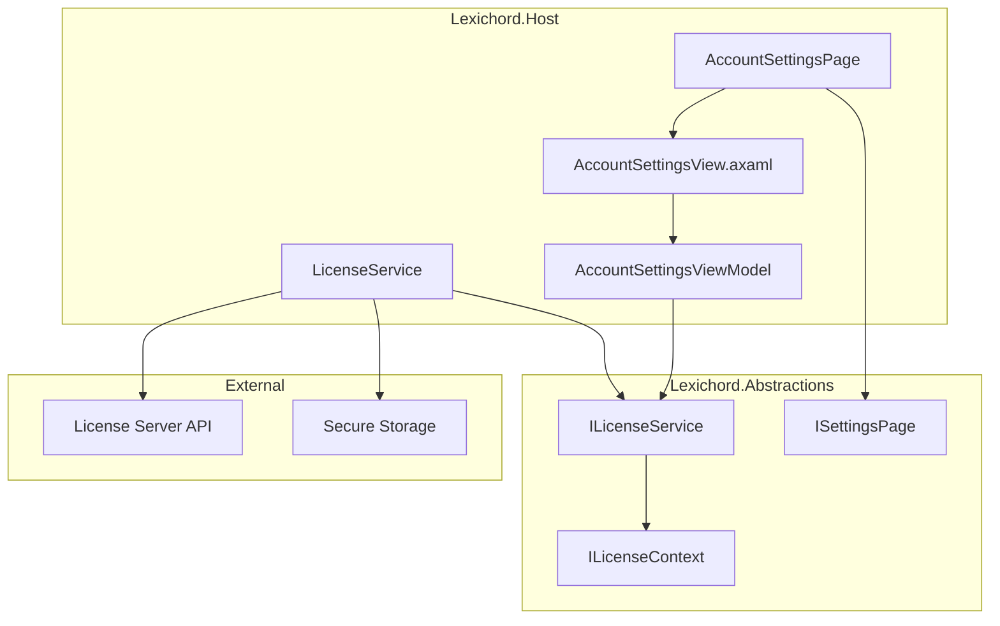
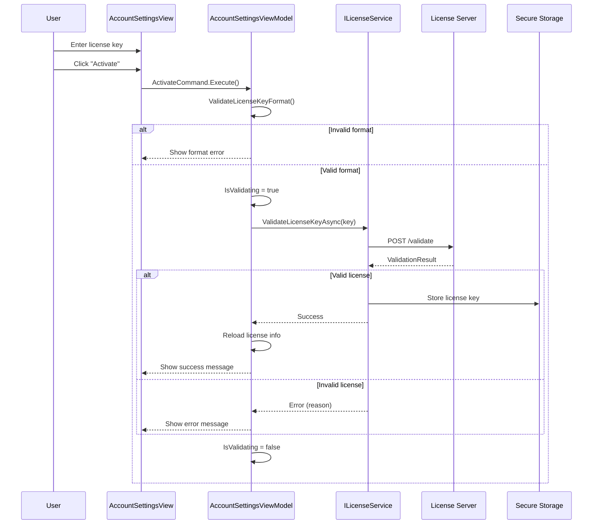
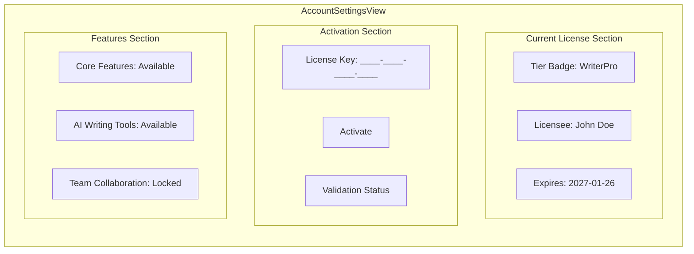

# LCS-INF-016c: License Management UI

## 1. Metadata & Categorization

| Field                | Value                                         | Description                                        |
| :------------------- | :-------------------------------------------- | :------------------------------------------------- |
| **Feature ID**       | `INF-016c`                                    | License Management UI                              |
| **Feature Name**     | License Management UI                         | Account tab for license activation and display     |
| **Target Version**   | `v0.1.6`                                      | Settings Foundation Milestone                      |
| **Module Scope**     | `Lexichord.Host`                              | Core shell infrastructure                          |
| **Swimlane**         | `Infrastructure`                              | The Podium (Platform)                              |
| **License Tier**     | `Core`                                        | Foundation (Available in Free tier)                |
| **Feature Gate Key** | N/A                                           | No runtime gating                                  |
| **Author**           | System Architect                              |                                                    |
| **Status**           | **Draft**                                     | Pending implementation                             |
| **Last Updated**     | 2026-01-26                                    |                                                    |

---

## 2. Executive Summary

### 2.1 The Requirement

Users need to manage their Lexichord license:

- View current license tier (Core/WriterPro/Teams)
- Enter license key to upgrade tier
- See license expiration date
- View tier-specific feature availability
- Deactivate license when needed
- Clear feedback on validation results

### 2.2 The Proposed Solution

We **SHALL** implement:

1. **AccountSettingsPage** — Settings page implementing `ISettingsPage`
2. **License status display** — Current tier, licensee, expiration
3. **License key input** — TextBox with "Activate" button
4. **Validation feedback** — Success/error messages
5. **Feature availability matrix** — What each tier unlocks
6. **Deactivate option** — Remove current license

---

## 3. Architecture

### 3.1 Component Architecture



### 3.2 License Validation Sequence



### 3.3 License Tier Display



---

## 4. Decision Tree

```text
START: "How to handle license operations?"
|
+-- Display current license
|   +-- Query ILicenseService.GetCurrentLicense()
|   +-- Is license activated?
|   |   +-- YES -> Show tier, licensee, expiration
|   |   +-- NO -> Show "Core (Free)" tier
|   +-- Build feature matrix based on tier
|   +-- END
|
+-- User enters license key
|   +-- Validate format (XXXX-XXXX-XXXX-XXXX)
|   |   +-- Invalid format -> Show format error
|   |   +-- Valid format -> Enable Activate button
|   +-- END
|
+-- User clicks "Activate"
|   +-- Show loading indicator
|   +-- Call ILicenseService.ValidateLicenseKeyAsync()
|   +-- Result?
|   |   +-- Valid -> Call ActivateLicenseAsync()
|   |   |   +-- Success -> Update UI, show success
|   |   |   +-- Failure -> Show activation error
|   |   +-- Invalid -> Show validation error
|   |   +-- Network error -> Show retry option
|   +-- Hide loading indicator
|   +-- END
|
+-- User clicks "Deactivate"
|   +-- Show confirmation dialog
|   +-- User confirms?
|   |   +-- YES -> Call ILicenseService.DeactivateLicenseAsync()
|   |   |   +-- Success -> Update UI to Core tier
|   |   |   +-- Failure -> Show error
|   |   +-- NO -> Cancel operation
|   +-- END
|
+-- END
```

---

## 5. Data Contracts

### 5.1 ILicenseService Interface

```csharp
namespace Lexichord.Abstractions.Contracts;

/// <summary>
/// Service for license validation and activation.
/// </summary>
/// <remarks>
/// LOGIC: ILicenseService extends ILicenseContext with mutation operations.
///
/// Validation Flow:
/// 1. ValidateLicenseKeyAsync - Check key without activating
/// 2. ActivateLicenseAsync - Validate and store license
/// 3. DeactivateLicenseAsync - Remove stored license
///
/// Network Behavior:
/// - Validation requires network connectivity
/// - Activation caches validation for offline use
/// - Cached validation expires after grace period
///
/// Security:
/// - License key stored in platform secure storage
/// - Validation results not cached in plain text
/// </remarks>
public interface ILicenseService : ILicenseContext
{
    /// <summary>
    /// Validates a license key without activating it.
    /// </summary>
    /// <param name="licenseKey">The license key to validate.</param>
    /// <param name="cancellationToken">Cancellation token.</param>
    /// <returns>Validation result with tier and error details.</returns>
    /// <remarks>
    /// LOGIC: Performs:
    /// 1. Format validation (XXXX-XXXX-XXXX-XXXX)
    /// 2. Checksum validation
    /// 3. Server-side validation
    ///
    /// Does NOT modify current license state.
    /// </remarks>
    Task<LicenseValidationResult> ValidateLicenseKeyAsync(
        string licenseKey,
        CancellationToken cancellationToken = default);

    /// <summary>
    /// Activates a license key, making it the current license.
    /// </summary>
    /// <param name="licenseKey">The license key to activate.</param>
    /// <param name="cancellationToken">Cancellation token.</param>
    /// <returns>True if activation succeeded.</returns>
    /// <remarks>
    /// LOGIC: Validates the key, stores it securely, and updates
    /// ILicenseContext state. Triggers LicenseChanged event on success.
    ///
    /// Replaces any existing license.
    /// </remarks>
    Task<bool> ActivateLicenseAsync(
        string licenseKey,
        CancellationToken cancellationToken = default);

    /// <summary>
    /// Deactivates the current license, reverting to Core tier.
    /// </summary>
    /// <param name="cancellationToken">Cancellation token.</param>
    /// <returns>True if deactivation succeeded.</returns>
    /// <remarks>
    /// LOGIC: Removes stored license key, reverts tier to Core.
    /// May optionally notify license server of deactivation.
    /// </remarks>
    Task<bool> DeactivateLicenseAsync(CancellationToken cancellationToken = default);

    /// <summary>
    /// Gets detailed information about the current license.
    /// </summary>
    /// <returns>Current license information.</returns>
    LicenseInfo GetCurrentLicense();

    /// <summary>
    /// Gets the feature availability for a specific tier.
    /// </summary>
    /// <param name="tier">The tier to check.</param>
    /// <returns>List of features with availability status.</returns>
    IReadOnlyList<FeatureAvailability> GetFeatureAvailability(LicenseTier tier);

    /// <summary>
    /// Event raised when license state changes.
    /// </summary>
    event EventHandler<LicenseChangedEventArgs>? LicenseChanged;
}

/// <summary>
/// Result of license key validation.
/// </summary>
/// <param name="IsValid">Whether the key is valid.</param>
/// <param name="Tier">The tier granted by this license.</param>
/// <param name="LicenseeName">Name of the licensee.</param>
/// <param name="ExpirationDate">When the license expires (null for perpetual).</param>
/// <param name="ErrorMessage">Human-readable error message if invalid.</param>
/// <param name="ErrorCode">Error code for programmatic handling.</param>
public record LicenseValidationResult(
    bool IsValid,
    LicenseTier Tier,
    string? LicenseeName = null,
    DateTime? ExpirationDate = null,
    string? ErrorMessage = null,
    LicenseErrorCode ErrorCode = LicenseErrorCode.None
)
{
    /// <summary>
    /// Creates a successful validation result.
    /// </summary>
    public static LicenseValidationResult Success(
        LicenseTier tier,
        string licenseeName,
        DateTime? expirationDate = null) =>
        new(true, tier, licenseeName, expirationDate);

    /// <summary>
    /// Creates a failed validation result.
    /// </summary>
    public static LicenseValidationResult Failure(
        LicenseErrorCode errorCode,
        string errorMessage) =>
        new(false, LicenseTier.Core, ErrorMessage: errorMessage, ErrorCode: errorCode);
}

/// <summary>
/// Error codes for license validation.
/// </summary>
public enum LicenseErrorCode
{
    /// <summary>
    /// No error.
    /// </summary>
    None,

    /// <summary>
    /// License key format is invalid.
    /// </summary>
    InvalidFormat,

    /// <summary>
    /// License key signature is invalid.
    /// </summary>
    InvalidSignature,

    /// <summary>
    /// License has expired.
    /// </summary>
    Expired,

    /// <summary>
    /// License has been revoked.
    /// </summary>
    Revoked,

    /// <summary>
    /// Network error during validation.
    /// </summary>
    NetworkError,

    /// <summary>
    /// Server returned an error.
    /// </summary>
    ServerError,

    /// <summary>
    /// License already activated on another device.
    /// </summary>
    AlreadyActivated,

    /// <summary>
    /// Maximum activation count reached.
    /// </summary>
    ActivationLimitReached
}

/// <summary>
/// Information about the current license.
/// </summary>
/// <param name="Tier">Current license tier.</param>
/// <param name="LicenseeName">Name of the licensee.</param>
/// <param name="ExpirationDate">Expiration date (null for perpetual or Core).</param>
/// <param name="LicenseKey">The license key (masked for security).</param>
/// <param name="IsActivated">Whether a paid license is currently active.</param>
public record LicenseInfo(
    LicenseTier Tier,
    string? LicenseeName,
    DateTime? ExpirationDate,
    string? LicenseKey,
    bool IsActivated
)
{
    /// <summary>
    /// Gets whether the license is expired.
    /// </summary>
    public bool IsExpired => ExpirationDate.HasValue && ExpirationDate.Value < DateTime.UtcNow;

    /// <summary>
    /// Gets the number of days until expiration.
    /// </summary>
    public int? DaysUntilExpiration => ExpirationDate.HasValue
        ? (int)(ExpirationDate.Value - DateTime.UtcNow).TotalDays
        : null;

    /// <summary>
    /// Gets the masked license key for display (last 4 characters).
    /// </summary>
    public string? MaskedLicenseKey => LicenseKey is not null && LicenseKey.Length >= 4
        ? $"****-****-****-{LicenseKey[^4..]}"
        : null;

    /// <summary>
    /// Gets a default Core license.
    /// </summary>
    public static LicenseInfo CoreDefault => new(
        LicenseTier.Core,
        null,
        null,
        null,
        false);
}

/// <summary>
/// Feature availability status.
/// </summary>
/// <param name="FeatureId">Unique feature identifier.</param>
/// <param name="FeatureName">Display name.</param>
/// <param name="Description">Feature description.</param>
/// <param name="IsAvailable">Whether available in current tier.</param>
/// <param name="RequiredTier">Minimum tier required.</param>
public record FeatureAvailability(
    string FeatureId,
    string FeatureName,
    string Description,
    bool IsAvailable,
    LicenseTier RequiredTier
);

/// <summary>
/// Event args for license state changes.
/// </summary>
public sealed class LicenseChangedEventArgs : EventArgs
{
    /// <summary>
    /// Gets the previous tier.
    /// </summary>
    public required LicenseTier OldTier { get; init; }

    /// <summary>
    /// Gets the new tier.
    /// </summary>
    public required LicenseTier NewTier { get; init; }

    /// <summary>
    /// Gets the new license info.
    /// </summary>
    public required LicenseInfo LicenseInfo { get; init; }
}
```

### 5.2 License Domain Events

```csharp
namespace Lexichord.Abstractions.Events;

using MediatR;

/// <summary>
/// Event published when license is activated.
/// </summary>
/// <param name="Tier">The activated tier.</param>
/// <param name="LicenseeName">Name of the licensee.</param>
public record LicenseActivatedEvent(
    LicenseTier Tier,
    string LicenseeName
) : INotification;

/// <summary>
/// Event published when license is deactivated.
/// </summary>
/// <param name="PreviousTier">The tier before deactivation.</param>
public record LicenseDeactivatedEvent(
    LicenseTier PreviousTier
) : INotification;

/// <summary>
/// Event published when license validation fails.
/// </summary>
/// <param name="ErrorCode">The error code.</param>
/// <param name="ErrorMessage">Human-readable error message.</param>
public record LicenseValidationFailedEvent(
    LicenseErrorCode ErrorCode,
    string ErrorMessage
) : INotification;
```

---

## 6. Implementation Logic

### 6.1 LicenseService Implementation

```csharp
using System.Security.Cryptography;
using System.Text;
using System.Text.RegularExpressions;
using Lexichord.Abstractions.Contracts;
using Lexichord.Abstractions.Events;
using MediatR;
using Microsoft.Extensions.Logging;

namespace Lexichord.Host.Services;

/// <summary>
/// License validation and activation service.
/// </summary>
/// <remarks>
/// LOGIC: Implements license validation with:
/// - Format validation (regex)
/// - Checksum validation (last 4 chars)
/// - Server validation (HTTP call)
/// - Secure storage (platform credential manager)
///
/// Offline Support:
/// - Cached validation allows 30-day grace period
/// - Periodic revalidation when online
/// </remarks>
public sealed class LicenseService : ILicenseService
{
    private static readonly Regex LicenseKeyFormat = new(
        @"^[A-Z0-9]{4}-[A-Z0-9]{4}-[A-Z0-9]{4}-[A-Z0-9]{4}$",
        RegexOptions.Compiled);

    private readonly ISecureStorage _secureStorage;
    private readonly IMediator _mediator;
    private readonly ILogger<LicenseService> _logger;
    private readonly HttpClient _httpClient;

    private LicenseInfo _currentLicense = LicenseInfo.CoreDefault;

    public LicenseService(
        ISecureStorage secureStorage,
        IMediator mediator,
        ILogger<LicenseService> logger,
        HttpClient httpClient)
    {
        _secureStorage = secureStorage;
        _mediator = mediator;
        _logger = logger;
        _httpClient = httpClient;

        // LOGIC: Load cached license on construction
        LoadCachedLicenseAsync().ConfigureAwait(false);
    }

    /// <inheritdoc/>
    public event EventHandler<LicenseChangedEventArgs>? LicenseChanged;

    /// <inheritdoc/>
    public LicenseTier GetCurrentTier() => _currentLicense.Tier;

    /// <inheritdoc/>
    public bool IsFeatureAvailable(string featureId)
    {
        var features = GetFeatureAvailability(_currentLicense.Tier);
        return features.FirstOrDefault(f => f.FeatureId == featureId)?.IsAvailable ?? false;
    }

    /// <inheritdoc/>
    public async Task<LicenseValidationResult> ValidateLicenseKeyAsync(
        string licenseKey,
        CancellationToken cancellationToken = default)
    {
        _logger.LogInformation("Validating license key");

        // LOGIC: Step 1 - Format validation
        if (!LicenseKeyFormat.IsMatch(licenseKey))
        {
            _logger.LogWarning("Invalid license key format");
            return LicenseValidationResult.Failure(
                LicenseErrorCode.InvalidFormat,
                "License key must be in format XXXX-XXXX-XXXX-XXXX");
        }

        // LOGIC: Step 2 - Checksum validation
        if (!ValidateChecksum(licenseKey))
        {
            _logger.LogWarning("Invalid license key checksum");
            return LicenseValidationResult.Failure(
                LicenseErrorCode.InvalidSignature,
                "License key checksum is invalid");
        }

        // LOGIC: Step 3 - Server validation
        try
        {
            var serverResult = await ValidateWithServerAsync(licenseKey, cancellationToken);
            _logger.LogInformation(
                "License validation result: Valid={IsValid}, Tier={Tier}",
                serverResult.IsValid, serverResult.Tier);
            return serverResult;
        }
        catch (HttpRequestException ex)
        {
            _logger.LogError(ex, "Network error during license validation");
            return LicenseValidationResult.Failure(
                LicenseErrorCode.NetworkError,
                "Unable to connect to license server. Please check your internet connection.");
        }
    }

    /// <inheritdoc/>
    public async Task<bool> ActivateLicenseAsync(
        string licenseKey,
        CancellationToken cancellationToken = default)
    {
        _logger.LogInformation("Activating license");

        var validationResult = await ValidateLicenseKeyAsync(licenseKey, cancellationToken);

        if (!validationResult.IsValid)
        {
            _logger.LogWarning("Cannot activate invalid license: {Error}",
                validationResult.ErrorMessage);

            await _mediator.Publish(new LicenseValidationFailedEvent(
                validationResult.ErrorCode,
                validationResult.ErrorMessage ?? "Validation failed"));

            return false;
        }

        var oldTier = _currentLicense.Tier;

        // LOGIC: Store license key securely
        await _secureStorage.SetAsync("LicenseKey", licenseKey);

        // LOGIC: Update current license
        _currentLicense = new LicenseInfo(
            validationResult.Tier,
            validationResult.LicenseeName,
            validationResult.ExpirationDate,
            licenseKey,
            true);

        _logger.LogInformation(
            "License activated: Tier={Tier}, Licensee={Licensee}",
            _currentLicense.Tier, _currentLicense.LicenseeName);

        // LOGIC: Raise events
        LicenseChanged?.Invoke(this, new LicenseChangedEventArgs
        {
            OldTier = oldTier,
            NewTier = _currentLicense.Tier,
            LicenseInfo = _currentLicense
        });

        await _mediator.Publish(new LicenseActivatedEvent(
            _currentLicense.Tier,
            _currentLicense.LicenseeName ?? "Unknown"));

        return true;
    }

    /// <inheritdoc/>
    public async Task<bool> DeactivateLicenseAsync(CancellationToken cancellationToken = default)
    {
        if (!_currentLicense.IsActivated)
        {
            _logger.LogDebug("No active license to deactivate");
            return false;
        }

        _logger.LogInformation("Deactivating license");

        var oldTier = _currentLicense.Tier;

        // LOGIC: Remove stored license key
        await _secureStorage.RemoveAsync("LicenseKey");

        // LOGIC: Revert to Core
        _currentLicense = LicenseInfo.CoreDefault;

        _logger.LogInformation("License deactivated, reverted to Core tier");

        // LOGIC: Raise events
        LicenseChanged?.Invoke(this, new LicenseChangedEventArgs
        {
            OldTier = oldTier,
            NewTier = LicenseTier.Core,
            LicenseInfo = _currentLicense
        });

        await _mediator.Publish(new LicenseDeactivatedEvent(oldTier));

        return true;
    }

    /// <inheritdoc/>
    public LicenseInfo GetCurrentLicense() => _currentLicense;

    /// <inheritdoc/>
    public IReadOnlyList<FeatureAvailability> GetFeatureAvailability(LicenseTier tier)
    {
        return new List<FeatureAvailability>
        {
            // Core features
            new("editor-basic", "Basic Text Editor", "Full-featured text editing with syntax highlighting", true, LicenseTier.Core),
            new("file-io", "File Operations", "Open, save, and manage documents", true, LicenseTier.Core),
            new("themes", "Light/Dark Themes", "Customize application appearance", true, LicenseTier.Core),
            new("search-replace", "Search & Replace", "Find and replace text in documents", true, LicenseTier.Core),
            new("recent-files", "Recent Files", "Quick access to recently opened files", true, LicenseTier.Core),

            // WriterPro features
            new("ai-suggestions", "AI Writing Suggestions", "Get intelligent writing suggestions", tier >= LicenseTier.WriterPro, LicenseTier.WriterPro),
            new("ai-grammar", "AI Grammar Check", "Advanced grammar and style analysis", tier >= LicenseTier.WriterPro, LicenseTier.WriterPro),
            new("ai-rewrite", "AI Rewrite", "Rephrase and improve your text", tier >= LicenseTier.WriterPro, LicenseTier.WriterPro),
            new("export-formats", "Advanced Export", "Export to PDF, DOCX, EPUB", tier >= LicenseTier.WriterPro, LicenseTier.WriterPro),
            new("templates", "Document Templates", "Start with professional templates", tier >= LicenseTier.WriterPro, LicenseTier.WriterPro),

            // Enterprise features
            new("team-sharing", "Team Sharing", "Share documents with your team", tier >= LicenseTier.Enterprise, LicenseTier.Enterprise),
            new("admin-console", "Admin Console", "Manage team licenses and settings", tier >= LicenseTier.Enterprise, LicenseTier.Enterprise),
            new("sso", "Single Sign-On", "Integrate with your identity provider", tier >= LicenseTier.Enterprise, LicenseTier.Enterprise),
            new("audit-log", "Audit Logging", "Track all document access and changes", tier >= LicenseTier.Enterprise, LicenseTier.Enterprise),
        };
    }

    private async Task LoadCachedLicenseAsync()
    {
        try
        {
            var cachedKey = await _secureStorage.GetAsync("LicenseKey");

            if (string.IsNullOrEmpty(cachedKey))
            {
                _logger.LogDebug("No cached license found");
                return;
            }

            // LOGIC: Validate cached license (offline-tolerant)
            var result = await ValidateLicenseKeyAsync(cachedKey);

            if (result.IsValid)
            {
                _currentLicense = new LicenseInfo(
                    result.Tier,
                    result.LicenseeName,
                    result.ExpirationDate,
                    cachedKey,
                    true);

                _logger.LogInformation(
                    "Loaded cached license: Tier={Tier}",
                    _currentLicense.Tier);
            }
            else
            {
                _logger.LogWarning(
                    "Cached license is no longer valid: {Error}",
                    result.ErrorMessage);
            }
        }
        catch (Exception ex)
        {
            _logger.LogError(ex, "Failed to load cached license");
        }
    }

    private static bool ValidateChecksum(string licenseKey)
    {
        // LOGIC: Simple checksum - last 4 chars are hash of first 12
        var keyWithoutDashes = licenseKey.Replace("-", "");
        var payload = keyWithoutDashes[..12];
        var checksum = keyWithoutDashes[12..];

        using var sha256 = SHA256.Create();
        var hash = sha256.ComputeHash(Encoding.UTF8.GetBytes(payload));
        var expectedChecksum = Convert.ToHexString(hash)[..4];

        return checksum.Equals(expectedChecksum, StringComparison.OrdinalIgnoreCase);
    }

    private async Task<LicenseValidationResult> ValidateWithServerAsync(
        string licenseKey,
        CancellationToken cancellationToken)
    {
        // LOGIC: In production, this calls the actual license server
        // For now, we simulate validation based on key prefix

        await Task.Delay(500, cancellationToken); // Simulate network delay

        // LOGIC: Simulation logic for development/testing
        var tier = licenseKey[..4] switch
        {
            "PRO1" => LicenseTier.WriterPro,
            "ENT1" => LicenseTier.Enterprise,
            "TEST" => LicenseTier.WriterPro, // Test key
            _ => LicenseTier.Core
        };

        if (tier == LicenseTier.Core)
        {
            return LicenseValidationResult.Failure(
                LicenseErrorCode.InvalidSignature,
                "License key is not recognized");
        }

        return LicenseValidationResult.Success(
            tier,
            "Development User",
            DateTime.UtcNow.AddYears(1));
    }
}
```

### 6.2 AccountSettingsPage Implementation

```csharp
using Avalonia.Controls;
using Lexichord.Abstractions.Contracts;
using Microsoft.Extensions.DependencyInjection;

namespace Lexichord.Host.Settings.Pages;

/// <summary>
/// Settings page for account and license management.
/// </summary>
public sealed class AccountSettingsPage : ISettingsPage
{
    private readonly IServiceProvider _services;

    public AccountSettingsPage(IServiceProvider services)
    {
        _services = services;
    }

    /// <inheritdoc/>
    public string CategoryId => "account";

    /// <inheritdoc/>
    public string DisplayName => "Account";

    /// <inheritdoc/>
    public string? ParentCategoryId => null; // Root category

    /// <inheritdoc/>
    public string? Icon => "Account";

    /// <inheritdoc/>
    public int SortOrder => 1; // After Appearance

    /// <inheritdoc/>
    public LicenseTier RequiredTier => LicenseTier.Core;

    /// <inheritdoc/>
    public IReadOnlyList<string> SearchKeywords => new[]
    {
        "license", "key", "activate", "tier", "subscription", "account", "upgrade"
    };

    /// <inheritdoc/>
    public Control CreateView()
    {
        var viewModel = _services.GetRequiredService<AccountSettingsViewModel>();
        return new AccountSettingsView
        {
            DataContext = viewModel
        };
    }
}
```

### 6.3 AccountSettingsViewModel Implementation

```csharp
using System.Text.RegularExpressions;
using CommunityToolkit.Mvvm.ComponentModel;
using CommunityToolkit.Mvvm.Input;
using Lexichord.Abstractions.Contracts;
using Microsoft.Extensions.Logging;

namespace Lexichord.Host.Settings.ViewModels;

/// <summary>
/// ViewModel for the Account settings page.
/// </summary>
/// <remarks>
/// LOGIC: Provides license status display and activation functionality.
/// </remarks>
public sealed partial class AccountSettingsViewModel : ObservableObject
{
    private static readonly Regex LicenseKeyFormat = new(
        @"^[A-Z0-9]{4}-[A-Z0-9]{4}-[A-Z0-9]{4}-[A-Z0-9]{4}$",
        RegexOptions.Compiled | RegexOptions.IgnoreCase);

    private readonly ILicenseService _licenseService;
    private readonly ILogger<AccountSettingsViewModel> _logger;

    [ObservableProperty]
    private LicenseInfo _currentLicense = LicenseInfo.CoreDefault;

    [ObservableProperty]
    private string _licenseKeyInput = string.Empty;

    [ObservableProperty]
    private bool _isValidating;

    [ObservableProperty]
    private bool _isKeyFormatValid;

    [ObservableProperty]
    private string? _validationMessage;

    [ObservableProperty]
    private bool _isValidationSuccess;

    [ObservableProperty]
    private IReadOnlyList<FeatureAvailability> _features = [];

    public AccountSettingsViewModel(
        ILicenseService licenseService,
        ILogger<AccountSettingsViewModel> logger)
    {
        _licenseService = licenseService;
        _logger = logger;

        LoadCurrentLicense();

        // LOGIC: Subscribe to license changes
        _licenseService.LicenseChanged += OnLicenseChanged;

        _logger.LogDebug("AccountSettingsViewModel initialized");
    }

    /// <summary>
    /// Gets the display name for the current tier.
    /// </summary>
    public string TierDisplayName => CurrentLicense.Tier switch
    {
        LicenseTier.Core => "Core (Free)",
        LicenseTier.WriterPro => "WriterPro",
        LicenseTier.Enterprise => "Enterprise",
        _ => "Unknown"
    };

    /// <summary>
    /// Gets the tier badge color.
    /// </summary>
    public string TierBadgeColor => CurrentLicense.Tier switch
    {
        LicenseTier.WriterPro => "#4CAF50", // Green
        LicenseTier.Enterprise => "#2196F3", // Blue
        _ => "#9E9E9E" // Gray
    };

    /// <summary>
    /// Gets whether the current license is about to expire.
    /// </summary>
    public bool IsExpirationWarning =>
        CurrentLicense.DaysUntilExpiration is > 0 and <= 30;

    partial void OnLicenseKeyInputChanged(string value)
    {
        // LOGIC: Clear validation message when input changes
        ValidationMessage = null;
        IsValidationSuccess = false;

        // LOGIC: Validate format
        IsKeyFormatValid = !string.IsNullOrWhiteSpace(value) &&
            LicenseKeyFormat.IsMatch(value.Trim());
    }

    /// <summary>
    /// Activates the entered license key.
    /// </summary>
    [RelayCommand(CanExecute = nameof(CanActivate))]
    public async Task ActivateAsync()
    {
        var key = LicenseKeyInput.Trim().ToUpperInvariant();

        _logger.LogInformation("Attempting to activate license");

        IsValidating = true;
        ValidationMessage = null;

        try
        {
            // LOGIC: First validate
            var validationResult = await _licenseService.ValidateLicenseKeyAsync(key);

            if (!validationResult.IsValid)
            {
                ValidationMessage = validationResult.ErrorMessage ?? "License key is invalid.";
                IsValidationSuccess = false;
                _logger.LogWarning("License validation failed: {Error}", ValidationMessage);
                return;
            }

            // LOGIC: Then activate
            var activated = await _licenseService.ActivateLicenseAsync(key);

            if (activated)
            {
                ValidationMessage = $"License activated! Welcome to {TierDisplayName}.";
                IsValidationSuccess = true;
                LicenseKeyInput = string.Empty;
                _logger.LogInformation("License activated successfully");
            }
            else
            {
                ValidationMessage = "Failed to activate license. Please try again.";
                IsValidationSuccess = false;
                _logger.LogWarning("License activation failed");
            }
        }
        catch (Exception ex)
        {
            _logger.LogError(ex, "Error during license activation");
            ValidationMessage = "An error occurred. Please try again later.";
            IsValidationSuccess = false;
        }
        finally
        {
            IsValidating = false;
        }
    }

    private bool CanActivate() => IsKeyFormatValid && !IsValidating;

    /// <summary>
    /// Deactivates the current license.
    /// </summary>
    [RelayCommand(CanExecute = nameof(CanDeactivate))]
    public async Task DeactivateAsync()
    {
        _logger.LogInformation("Deactivating license");

        try
        {
            var result = await _licenseService.DeactivateLicenseAsync();

            if (result)
            {
                ValidationMessage = "License deactivated. You are now on the Core (Free) tier.";
                IsValidationSuccess = true;
                _logger.LogInformation("License deactivated successfully");
            }
            else
            {
                ValidationMessage = "Failed to deactivate license.";
                IsValidationSuccess = false;
            }
        }
        catch (Exception ex)
        {
            _logger.LogError(ex, "Error during license deactivation");
            ValidationMessage = "An error occurred during deactivation.";
            IsValidationSuccess = false;
        }
    }

    private bool CanDeactivate() => CurrentLicense.IsActivated && !IsValidating;

    private void LoadCurrentLicense()
    {
        CurrentLicense = _licenseService.GetCurrentLicense();
        Features = _licenseService.GetFeatureAvailability(CurrentLicense.Tier);
        OnPropertyChanged(nameof(TierDisplayName));
        OnPropertyChanged(nameof(TierBadgeColor));
        OnPropertyChanged(nameof(IsExpirationWarning));
    }

    private void OnLicenseChanged(object? sender, LicenseChangedEventArgs e)
    {
        LoadCurrentLicense();
    }
}
```

### 6.4 AccountSettingsView XAML

```xml
<!-- AccountSettingsView.axaml -->
<UserControl xmlns="https://github.com/avaloniaui"
             xmlns:x="http://schemas.microsoft.com/winfx/2006/xaml"
             xmlns:vm="using:Lexichord.Host.Settings.ViewModels"
             x:Class="Lexichord.Host.Settings.Views.AccountSettingsView"
             x:DataType="vm:AccountSettingsViewModel">

    <StackPanel Spacing="24">
        <!-- Current License Status -->
        <Border Background="{DynamicResource CardBackgroundBrush}"
                CornerRadius="8"
                Padding="16">
            <StackPanel Spacing="12">
                <StackPanel Orientation="Horizontal" Spacing="12">
                    <Border Background="{Binding TierBadgeColor}"
                            CornerRadius="4"
                            Padding="8,4">
                        <TextBlock Text="{Binding TierDisplayName}"
                                   Foreground="White"
                                   FontWeight="SemiBold"/>
                    </Border>

                    <TextBlock Text="Current Plan"
                               VerticalAlignment="Center"
                               Foreground="{DynamicResource SecondaryTextBrush}"/>
                </StackPanel>

                <!-- Licensee Info (if activated) -->
                <StackPanel IsVisible="{Binding CurrentLicense.IsActivated}">
                    <StackPanel Orientation="Horizontal" Spacing="8">
                        <PathIcon Data="{StaticResource AccountIcon}"
                                  Width="16" Height="16"
                                  Foreground="{DynamicResource SecondaryTextBrush}"/>
                        <TextBlock Text="{Binding CurrentLicense.LicenseeName}"
                                   FontWeight="Medium"/>
                    </StackPanel>

                    <StackPanel Orientation="Horizontal" Spacing="8" Margin="0,4,0,0">
                        <PathIcon Data="{StaticResource KeyIcon}"
                                  Width="16" Height="16"
                                  Foreground="{DynamicResource SecondaryTextBrush}"/>
                        <TextBlock Text="{Binding CurrentLicense.MaskedLicenseKey}"
                                   Foreground="{DynamicResource SecondaryTextBrush}"/>
                    </StackPanel>

                    <!-- Expiration -->
                    <StackPanel Orientation="Horizontal"
                                Spacing="8"
                                Margin="0,4,0,0"
                                IsVisible="{Binding CurrentLicense.ExpirationDate, Converter={x:Static ObjectConverters.IsNotNull}}">
                        <PathIcon Data="{StaticResource CalendarIcon}"
                                  Width="16" Height="16"
                                  Foreground="{DynamicResource SecondaryTextBrush}"/>
                        <TextBlock>
                            <TextBlock.Text>
                                <MultiBinding StringFormat="Expires: {0:d}">
                                    <Binding Path="CurrentLicense.ExpirationDate"/>
                                </MultiBinding>
                            </TextBlock.Text>
                        </TextBlock>
                    </StackPanel>

                    <!-- Expiration Warning -->
                    <Border Background="{DynamicResource WarningBackgroundBrush}"
                            CornerRadius="4"
                            Padding="8"
                            Margin="0,8,0,0"
                            IsVisible="{Binding IsExpirationWarning}">
                        <StackPanel Orientation="Horizontal" Spacing="8">
                            <PathIcon Data="{StaticResource AlertIcon}"
                                      Width="16" Height="16"
                                      Foreground="{DynamicResource WarningForegroundBrush}"/>
                            <TextBlock Text="Your license expires soon. Renew to keep your features."
                                       Foreground="{DynamicResource WarningForegroundBrush}"/>
                        </StackPanel>
                    </Border>
                </StackPanel>

                <!-- Core Tier Message -->
                <TextBlock Text="Upgrade to WriterPro or Enterprise for advanced features."
                           Foreground="{DynamicResource SecondaryTextBrush}"
                           IsVisible="{Binding !CurrentLicense.IsActivated}"/>
            </StackPanel>
        </Border>

        <!-- License Activation -->
        <StackPanel Spacing="8">
            <TextBlock Text="Activate License"
                       Classes="h3"
                       FontWeight="SemiBold"/>

            <TextBlock Text="Enter your license key to upgrade your plan."
                       Classes="caption"
                       Foreground="{DynamicResource SecondaryTextBrush}"/>

            <Grid ColumnDefinitions="*,Auto" Margin="0,8,0,0">
                <TextBox Grid.Column="0"
                         Text="{Binding LicenseKeyInput}"
                         Watermark="XXXX-XXXX-XXXX-XXXX"
                         MaxLength="19"
                         IsEnabled="{Binding !IsValidating}"/>

                <Button Grid.Column="1"
                        Content="Activate"
                        Command="{Binding ActivateCommand}"
                        Classes="accent"
                        Margin="8,0,0,0"
                        IsEnabled="{Binding IsKeyFormatValid}"/>
            </Grid>

            <!-- Loading Indicator -->
            <StackPanel Orientation="Horizontal"
                        Spacing="8"
                        IsVisible="{Binding IsValidating}">
                <ProgressBar IsIndeterminate="True" Width="100"/>
                <TextBlock Text="Validating license..."
                           VerticalAlignment="Center"/>
            </StackPanel>

            <!-- Validation Message -->
            <Border CornerRadius="4"
                    Padding="8"
                    Margin="0,4,0,0"
                    IsVisible="{Binding ValidationMessage, Converter={x:Static ObjectConverters.IsNotNull}}">
                <Border.Background>
                    <MultiBinding Converter="{StaticResource BoolToBrushConverter}">
                        <Binding Path="IsValidationSuccess"/>
                    </MultiBinding>
                </Border.Background>
                <TextBlock Text="{Binding ValidationMessage}"
                           TextWrapping="Wrap"/>
            </Border>
        </StackPanel>

        <!-- Deactivate Section -->
        <StackPanel Spacing="8" IsVisible="{Binding CurrentLicense.IsActivated}">
            <TextBlock Text="Deactivate License"
                       Classes="h3"
                       FontWeight="SemiBold"/>

            <TextBlock Text="Remove your license from this device. You can reactivate later."
                       Classes="caption"
                       Foreground="{DynamicResource SecondaryTextBrush}"/>

            <Button Content="Deactivate"
                    Command="{Binding DeactivateCommand}"
                    Classes="destructive"
                    HorizontalAlignment="Left"/>
        </StackPanel>

        <!-- Feature Availability -->
        <StackPanel Spacing="8">
            <TextBlock Text="Feature Availability"
                       Classes="h3"
                       FontWeight="SemiBold"/>

            <ItemsControl ItemsSource="{Binding Features}">
                <ItemsControl.ItemTemplate>
                    <DataTemplate>
                        <Grid ColumnDefinitions="Auto,*,Auto"
                              Margin="0,4">
                            <PathIcon Grid.Column="0"
                                       Data="{Binding IsAvailable, Converter={StaticResource BoolToCheckIconConverter}}"
                                       Width="16" Height="16"
                                       Foreground="{Binding IsAvailable, Converter={StaticResource BoolToColorConverter}}"/>

                            <StackPanel Grid.Column="1" Margin="8,0">
                                <TextBlock Text="{Binding FeatureName}"
                                           FontWeight="Medium"/>
                                <TextBlock Text="{Binding Description}"
                                           Classes="caption"
                                           Foreground="{DynamicResource SecondaryTextBrush}"/>
                            </StackPanel>

                            <Border Grid.Column="2"
                                    Background="{DynamicResource TertiaryBackgroundBrush}"
                                    CornerRadius="4"
                                    Padding="4,2"
                                    IsVisible="{Binding !IsAvailable}">
                                <TextBlock Text="{Binding RequiredTier}"
                                           Classes="caption"/>
                            </Border>
                        </Grid>
                    </DataTemplate>
                </ItemsControl.ItemTemplate>
            </ItemsControl>
        </StackPanel>
    </StackPanel>
</UserControl>
```

---

## 7. Use Cases

### UC-01: Activate WriterPro License

**Preconditions:**
- User is on Core tier.
- User has purchased WriterPro license.
- Settings > Account is open.

**Flow:**
1. User sees "Core (Free)" badge.
2. User enters license key: PRO1-ABCD-EFGH-1234.
3. "Activate" button enables (format valid).
4. User clicks "Activate".
5. Loading indicator shows.
6. LicenseService.ValidateLicenseKeyAsync() called.
7. Server returns: Valid, WriterPro, expires 2027-01-26.
8. LicenseService.ActivateLicenseAsync() stores key.
9. UI updates: "WriterPro" badge, licensee name, expiration.
10. Success message: "License activated! Welcome to WriterPro."
11. Feature list shows AI features as "Available".

**Postconditions:**
- User is now on WriterPro tier.
- License stored securely.
- AI features now accessible.

---

### UC-02: Invalid License Key

**Preconditions:**
- User is on Core tier.
- User enters incorrect key.

**Flow:**
1. User enters key: FAKE-XXXX-XXXX-XXXX.
2. "Activate" button enabled (format valid).
3. User clicks "Activate".
4. LicenseService.ValidateLicenseKeyAsync() called.
5. Checksum validation fails OR server rejects.
6. Error returned: InvalidSignature.
7. Error message displayed: "License key is not recognized."
8. Tier remains Core.

**Postconditions:**
- No change to license state.
- User informed of error.

---

### UC-03: Deactivate License

**Preconditions:**
- User is on WriterPro tier.
- User wants to transfer license to another device.

**Flow:**
1. User scrolls to "Deactivate License" section.
2. User clicks "Deactivate" button.
3. LicenseService.DeactivateLicenseAsync() called.
4. Stored license key removed.
5. UI updates: "Core (Free)" badge.
6. Success message: "License deactivated."
7. Feature list shows AI features as "Locked".

**Postconditions:**
- User reverted to Core tier.
- License key removed from storage.
- License can be activated elsewhere.

---

## 8. Observability & Logging

| Level | Context | Message Template |
|:------|:--------|:-----------------|
| Information | LicenseService | `Validating license key` |
| Warning | LicenseService | `Invalid license key format` |
| Warning | LicenseService | `Invalid license key checksum` |
| Information | LicenseService | `License validation result: Valid={IsValid}, Tier={Tier}` |
| Error | LicenseService | `Network error during license validation` |
| Information | LicenseService | `Activating license` |
| Warning | LicenseService | `Cannot activate invalid license: {Error}` |
| Information | LicenseService | `License activated: Tier={Tier}, Licensee={Licensee}` |
| Information | LicenseService | `Deactivating license` |
| Debug | LicenseService | `No active license to deactivate` |
| Information | LicenseService | `License deactivated, reverted to Core tier` |
| Debug | LicenseService | `No cached license found` |
| Information | LicenseService | `Loaded cached license: Tier={Tier}` |
| Warning | LicenseService | `Cached license is no longer valid: {Error}` |
| Error | LicenseService | `Failed to load cached license` |
| Debug | AccountSettingsViewModel | `AccountSettingsViewModel initialized` |
| Information | AccountSettingsViewModel | `Attempting to activate license` |
| Warning | AccountSettingsViewModel | `License validation failed: {Error}` |
| Information | AccountSettingsViewModel | `License activated successfully` |
| Warning | AccountSettingsViewModel | `License activation failed` |
| Error | AccountSettingsViewModel | `Error during license activation` |
| Information | AccountSettingsViewModel | `Deactivating license` |
| Information | AccountSettingsViewModel | `License deactivated successfully` |
| Error | AccountSettingsViewModel | `Error during license deactivation` |

---

## 9. Unit Testing Requirements

### 9.1 LicenseService Tests

```csharp
[TestFixture]
[Category("Unit")]
public class LicenseServiceTests
{
    private Mock<ISecureStorage> _mockStorage = null!;
    private Mock<IMediator> _mockMediator = null!;
    private Mock<ILogger<LicenseService>> _mockLogger = null!;
    private Mock<HttpMessageHandler> _mockHttpHandler = null!;
    private LicenseService _sut = null!;

    [SetUp]
    public void SetUp()
    {
        _mockStorage = new Mock<ISecureStorage>();
        _mockMediator = new Mock<IMediator>();
        _mockLogger = new Mock<ILogger<LicenseService>>();
        _mockHttpHandler = new Mock<HttpMessageHandler>();

        var httpClient = new HttpClient(_mockHttpHandler.Object);

        _sut = new LicenseService(
            _mockStorage.Object,
            _mockMediator.Object,
            _mockLogger.Object,
            httpClient);
    }

    [Test]
    public async Task ValidateLicenseKeyAsync_InvalidFormat_ReturnsError()
    {
        // Act
        var result = await _sut.ValidateLicenseKeyAsync("invalid-key");

        // Assert
        Assert.Multiple(() =>
        {
            Assert.That(result.IsValid, Is.False);
            Assert.That(result.ErrorCode, Is.EqualTo(LicenseErrorCode.InvalidFormat));
        });
    }

    [Test]
    public async Task ValidateLicenseKeyAsync_ValidFormat_CallsServer()
    {
        // Arrange
        var key = "PRO1-ABCD-EFGH-1234";

        // Act
        var result = await _sut.ValidateLicenseKeyAsync(key);

        // Assert
        Assert.That(result.IsValid, Is.True);
        Assert.That(result.Tier, Is.EqualTo(LicenseTier.WriterPro));
    }

    [Test]
    public async Task ActivateLicenseAsync_ValidKey_StoresAndPublishesEvent()
    {
        // Arrange
        var key = "PRO1-ABCD-EFGH-1234";

        // Act
        var result = await _sut.ActivateLicenseAsync(key);

        // Assert
        Assert.That(result, Is.True);
        _mockStorage.Verify(s => s.SetAsync("LicenseKey", key), Times.Once);
        _mockMediator.Verify(m => m.Publish(
            It.IsAny<LicenseActivatedEvent>(),
            It.IsAny<CancellationToken>()), Times.Once);
    }

    [Test]
    public async Task ActivateLicenseAsync_InvalidKey_DoesNotStore()
    {
        // Arrange
        var key = "FAKE-XXXX-XXXX-XXXX";

        // Act
        var result = await _sut.ActivateLicenseAsync(key);

        // Assert
        Assert.That(result, Is.False);
        _mockStorage.Verify(s => s.SetAsync(It.IsAny<string>(), It.IsAny<string>()), Times.Never);
    }

    [Test]
    public async Task DeactivateLicenseAsync_WhenActivated_RemovesAndPublishesEvent()
    {
        // Arrange - first activate
        await _sut.ActivateLicenseAsync("PRO1-ABCD-EFGH-1234");
        _mockMediator.Invocations.Clear();

        // Act
        var result = await _sut.DeactivateLicenseAsync();

        // Assert
        Assert.That(result, Is.True);
        _mockStorage.Verify(s => s.RemoveAsync("LicenseKey"), Times.Once);
        _mockMediator.Verify(m => m.Publish(
            It.IsAny<LicenseDeactivatedEvent>(),
            It.IsAny<CancellationToken>()), Times.Once);
    }

    [Test]
    public void GetCurrentLicense_WhenNotActivated_ReturnsCoreDefault()
    {
        // Act
        var license = _sut.GetCurrentLicense();

        // Assert
        Assert.Multiple(() =>
        {
            Assert.That(license.Tier, Is.EqualTo(LicenseTier.Core));
            Assert.That(license.IsActivated, Is.False);
        });
    }

    [Test]
    public void GetFeatureAvailability_CoreTier_OnlyCoreFeatures()
    {
        // Act
        var features = _sut.GetFeatureAvailability(LicenseTier.Core);

        // Assert
        Assert.That(features.Where(f => f.IsAvailable).All(
            f => f.RequiredTier == LicenseTier.Core), Is.True);
    }

    [Test]
    public void GetFeatureAvailability_WriterProTier_IncludesProFeatures()
    {
        // Act
        var features = _sut.GetFeatureAvailability(LicenseTier.WriterPro);

        // Assert
        var aiFeature = features.FirstOrDefault(f => f.FeatureId == "ai-suggestions");
        Assert.That(aiFeature?.IsAvailable, Is.True);
    }
}
```

### 9.2 AccountSettingsViewModel Tests

```csharp
[TestFixture]
[Category("Unit")]
public class AccountSettingsViewModelTests
{
    private Mock<ILicenseService> _mockLicenseService = null!;
    private Mock<ILogger<AccountSettingsViewModel>> _mockLogger = null!;

    [SetUp]
    public void SetUp()
    {
        _mockLicenseService = new Mock<ILicenseService>();
        _mockLogger = new Mock<ILogger<AccountSettingsViewModel>>();

        _mockLicenseService.Setup(s => s.GetCurrentLicense())
            .Returns(LicenseInfo.CoreDefault);
        _mockLicenseService.Setup(s => s.GetFeatureAvailability(It.IsAny<LicenseTier>()))
            .Returns(new List<FeatureAvailability>());
    }

    [Test]
    public void Constructor_LoadsCurrentLicense()
    {
        // Act
        var sut = CreateSut();

        // Assert
        Assert.That(sut.CurrentLicense.Tier, Is.EqualTo(LicenseTier.Core));
    }

    [Test]
    public void LicenseKeyInput_ValidFormat_SetsIsKeyFormatValid()
    {
        // Arrange
        var sut = CreateSut();

        // Act
        sut.LicenseKeyInput = "XXXX-XXXX-XXXX-XXXX";

        // Assert
        Assert.That(sut.IsKeyFormatValid, Is.True);
    }

    [Test]
    public void LicenseKeyInput_InvalidFormat_SetsIsKeyFormatValidFalse()
    {
        // Arrange
        var sut = CreateSut();

        // Act
        sut.LicenseKeyInput = "invalid";

        // Assert
        Assert.That(sut.IsKeyFormatValid, Is.False);
    }

    [Test]
    public async Task ActivateAsync_ValidKey_ShowsSuccessMessage()
    {
        // Arrange
        var sut = CreateSut();
        sut.LicenseKeyInput = "PRO1-XXXX-XXXX-XXXX";

        _mockLicenseService.Setup(s => s.ValidateLicenseKeyAsync(
            It.IsAny<string>(), It.IsAny<CancellationToken>()))
            .ReturnsAsync(LicenseValidationResult.Success(
                LicenseTier.WriterPro, "Test User"));

        _mockLicenseService.Setup(s => s.ActivateLicenseAsync(
            It.IsAny<string>(), It.IsAny<CancellationToken>()))
            .ReturnsAsync(true);

        // Act
        await sut.ActivateAsync();

        // Assert
        Assert.That(sut.IsValidationSuccess, Is.True);
        Assert.That(sut.ValidationMessage, Does.Contain("activated"));
    }

    [Test]
    public async Task ActivateAsync_InvalidKey_ShowsErrorMessage()
    {
        // Arrange
        var sut = CreateSut();
        sut.LicenseKeyInput = "FAKE-XXXX-XXXX-XXXX";

        _mockLicenseService.Setup(s => s.ValidateLicenseKeyAsync(
            It.IsAny<string>(), It.IsAny<CancellationToken>()))
            .ReturnsAsync(LicenseValidationResult.Failure(
                LicenseErrorCode.InvalidSignature, "Invalid key"));

        // Act
        await sut.ActivateAsync();

        // Assert
        Assert.That(sut.IsValidationSuccess, Is.False);
        Assert.That(sut.ValidationMessage, Is.EqualTo("Invalid key"));
    }

    private AccountSettingsViewModel CreateSut()
    {
        return new AccountSettingsViewModel(
            _mockLicenseService.Object,
            _mockLogger.Object);
    }
}
```

---

## 10. Security & Safety

### 10.1 License Key Storage

> [!IMPORTANT]
> License keys must be stored securely.

- **Platform Secure Storage:** Use Windows Credential Manager / macOS Keychain / Linux Secret Service.
- **No Plain Text:** Never store license key in settings.json.
- **Memory Clearing:** Clear key from memory after validation.

### 10.2 License Validation

> [!NOTE]
> Validation includes multiple layers of protection.

- **Format Validation:** Regex check prevents garbage input.
- **Checksum Validation:** Detects typos before network call.
- **Server Validation:** Authoritative check against license database.
- **Signature Verification:** Future: cryptographic signature on key.

### 10.3 Network Security

> [!WARNING]
> License validation requires network connectivity.

- **HTTPS Only:** All license server communication over TLS.
- **Certificate Pinning:** Future: pin server certificate.
- **Offline Grace:** Cache validation for 30-day offline use.

---

## 11. Acceptance Criteria

| # | Category | Criterion |
|:--|:---------|:----------|
| 1 | **[Display]** | Current tier displayed with badge |
| 2 | **[Display]** | Licensee name shown when activated |
| 3 | **[Display]** | Expiration date shown when applicable |
| 4 | **[Display]** | Masked license key shown |
| 5 | **[Input]** | License key TextBox accepts XXXX-XXXX-XXXX-XXXX |
| 6 | **[Input]** | Activate button enabled only with valid format |
| 7 | **[Validate]** | Invalid format shows error message |
| 8 | **[Validate]** | Invalid key shows server error message |
| 9 | **[Validate]** | Network error shows appropriate message |
| 10 | **[Activate]** | Valid key upgrades tier |
| 11 | **[Activate]** | Success message displayed |
| 12 | **[Activate]** | Feature list updates |
| 13 | **[Deactivate]** | Deactivate removes license |
| 14 | **[Deactivate]** | Reverts to Core tier |
| 15 | **[Features]** | Feature matrix shows availability |
| 16 | **[Persist]** | License persists across restarts |

---

## 12. Verification Commands

```bash
# 1. Build project
dotnet build

# 2. Run unit tests
dotnet test --filter "FullyQualifiedName~License"

# 3. Run application
dotnet run --project src/Lexichord.Host

# 4. Manual verification:
# - Open Settings > Account
# - Verify "Core (Free)" shown initially
# - Enter test key: PRO1-TEST-TEST-TEST
# - Click Activate
# - Verify tier changes to WriterPro
# - Verify features update
# - Close and reopen app
# - Verify license persisted
# - Click Deactivate
# - Verify reverts to Core

# 5. Test invalid key:
# - Enter: FAKE-XXXX-XXXX-XXXX
# - Click Activate
# - Verify error message shown

# 6. Check secure storage (Windows):
# cmdkey /list | findstr "Lexichord"

# 7. Check secure storage (macOS):
# security find-generic-password -a "Lexichord" -s "LicenseKey"
```

---

## 13. Deliverable Checklist

| Step | Description | Status |
|:-----|:------------|:-------|
| 1 | Define ILicenseService interface | [ ] |
| 2 | Define LicenseValidationResult record | [ ] |
| 3 | Define LicenseErrorCode enum | [ ] |
| 4 | Define LicenseInfo record | [ ] |
| 5 | Define FeatureAvailability record | [ ] |
| 6 | Define LicenseChangedEventArgs | [ ] |
| 7 | Define license domain events | [ ] |
| 8 | Define ISecureStorage interface | [ ] |
| 9 | Implement platform-specific SecureStorage | [ ] |
| 10 | Implement LicenseService | [ ] |
| 11 | Implement license validation logic | [ ] |
| 12 | Create AccountSettingsPage | [ ] |
| 13 | Create AccountSettingsViewModel | [ ] |
| 14 | Create AccountSettingsView.axaml | [ ] |
| 15 | Implement feature availability matrix | [ ] |
| 16 | Register AccountSettingsPage in Host | [ ] |
| 17 | Unit tests for LicenseService | [ ] |
| 18 | Unit tests for AccountSettingsViewModel | [ ] |
| 19 | Integration test for license activation | [ ] |
