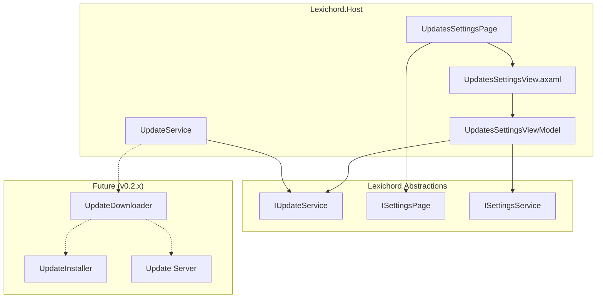
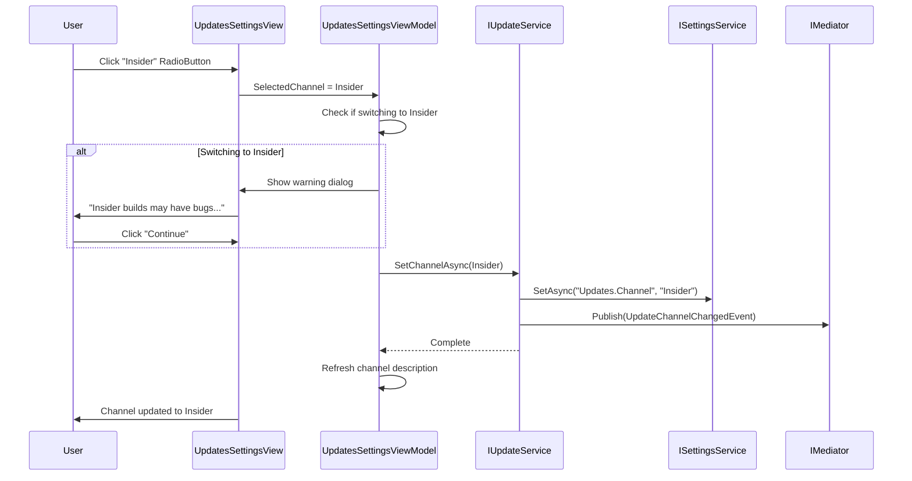
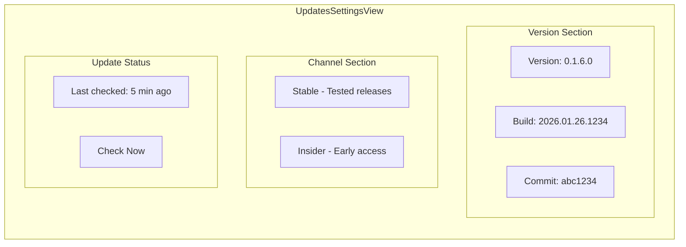

# LCS-INF-016d: Update Channel Selector

## 1. Metadata & Categorization

| Field                | Value                                         | Description                                        |
| :------------------- | :-------------------------------------------- | :------------------------------------------------- |
| **Feature ID**       | `INF-016d`                                    | Update Channel Selector                            |
| **Feature Name**     | Update Channel Selector                       | Stable vs Insider channel switching                |
| **Target Version**   | `v0.1.6`                                      | Settings Foundation Milestone                      |
| **Module Scope**     | `Lexichord.Host`                              | Core shell infrastructure                          |
| **Swimlane**         | `Infrastructure`                              | The Podium (Platform)                              |
| **License Tier**     | `Core`                                        | Foundation (Available in Free tier)                |
| **Feature Gate Key** | N/A                                           | No runtime gating                                  |
| **Author**           | System Architect                              |                                                    |
| **Status**           | **Draft**                                     | Pending implementation                             |
| **Last Updated**     | 2026-01-26                                    |                                                    |

---

## 2. Executive Summary

### 2.1 The Requirement

Users need control over their update experience:

- **Stable Channel:** Production-quality releases, thoroughly tested
- **Insider Channel:** Early access to new features, may have bugs
- Display current application version
- Show last update check time
- Foundation for future auto-update functionality (v0.2.x)

### 2.2 The Proposed Solution

We **SHALL** implement:

1. **UpdatesSettingsPage** — Settings page implementing `ISettingsPage`
2. **Channel RadioButtons** — Stable vs Insider selection
3. **IUpdateService interface** — Update channel management (stub)
4. **Version display** — Current version and build info
5. **Channel descriptions** — Clear explanation of each option
6. **Warning dialog** — Confirm switch to Insider channel

---

## 3. Architecture

### 3.1 Component Architecture



### 3.2 Channel Selection Sequence



### 3.3 Version Information Display



---

## 4. Decision Tree

```text
START: "How to handle update channel selection?"
|
+-- Display current version
|   +-- Read version from Assembly
|   +-- Read build timestamp
|   +-- Read Git commit (if available)
|   +-- Display in Version section
|   +-- END
|
+-- User selects channel
|   +-- Which channel?
|   |   +-- Stable (current is Insider) -> Switch without warning
|   |   +-- Insider (current is Stable) -> Show warning dialog
|   |       +-- User confirms? -> Proceed with switch
|   |       +-- User cancels? -> Revert selection
|   +-- Call IUpdateService.SetChannelAsync()
|   +-- Persist to ISettingsService
|   +-- Publish UpdateChannelChangedEvent
|   +-- END
|
+-- User clicks "Check for Updates"
|   +-- Call IUpdateService.CheckForUpdatesAsync()
|   +-- Show loading indicator
|   +-- Result?
|   |   +-- Update available -> Show update info (future)
|   |   +-- Up to date -> Show "You're up to date"
|   |   +-- Network error -> Show retry option
|   +-- Update last check timestamp
|   +-- END
|
+-- Application starts
|   +-- Load channel from settings
|   +-- Default to "Stable" if not set
|   +-- Initialize IUpdateService with channel
|   +-- END
|
+-- END
```

---

## 5. Data Contracts

### 5.1 IUpdateService Interface

```csharp
namespace Lexichord.Abstractions.Contracts;

/// <summary>
/// Service for managing application updates.
/// </summary>
/// <remarks>
/// LOGIC: IUpdateService manages update channels and version checking.
///
/// Channels:
/// - Stable: Production releases, tested for stability
/// - Insider: Early access builds, new features, potential bugs
///
/// Implementation Notes:
/// - v0.1.6: Interface and channel switching only
/// - v0.2.x: Full update download and installation
///
/// The service persists channel selection and provides version information.
/// </remarks>
public interface IUpdateService
{
    /// <summary>
    /// Gets the current update channel.
    /// </summary>
    UpdateChannel CurrentChannel { get; }

    /// <summary>
    /// Gets the current application version.
    /// </summary>
    string CurrentVersion { get; }

    /// <summary>
    /// Gets detailed version information.
    /// </summary>
    VersionInfo GetVersionInfo();

    /// <summary>
    /// Sets the update channel.
    /// </summary>
    /// <param name="channel">The channel to switch to.</param>
    /// <returns>Task completing when channel is set.</returns>
    /// <remarks>
    /// LOGIC: Persists channel selection to settings.
    /// Does not trigger immediate update check.
    /// </remarks>
    Task SetChannelAsync(UpdateChannel channel);

    /// <summary>
    /// Checks for available updates.
    /// </summary>
    /// <param name="cancellationToken">Cancellation token.</param>
    /// <returns>Update info if available, null if up to date.</returns>
    /// <remarks>
    /// LOGIC: Contacts update server for current channel.
    /// Returns null if already on latest version.
    /// In v0.1.6, this is a stub that always returns null.
    /// </remarks>
    Task<UpdateInfo?> CheckForUpdatesAsync(CancellationToken cancellationToken = default);

    /// <summary>
    /// Gets the last time updates were checked.
    /// </summary>
    DateTime? LastCheckTime { get; }

    /// <summary>
    /// Event raised when an update is available.
    /// </summary>
    event EventHandler<UpdateAvailableEventArgs>? UpdateAvailable;

    /// <summary>
    /// Event raised when channel changes.
    /// </summary>
    event EventHandler<UpdateChannelChangedEventArgs>? ChannelChanged;
}

/// <summary>
/// Update channel options.
/// </summary>
public enum UpdateChannel
{
    /// <summary>
    /// Stable releases only - production quality, thoroughly tested.
    /// </summary>
    Stable,

    /// <summary>
    /// Insider (early access) builds - new features, may contain bugs.
    /// </summary>
    Insider
}

/// <summary>
/// Detailed version information.
/// </summary>
/// <param name="Version">Semantic version (e.g., "0.1.6").</param>
/// <param name="FullVersion">Full version with build number (e.g., "0.1.6.1234").</param>
/// <param name="BuildDate">When this build was created.</param>
/// <param name="GitCommit">Git commit hash (short form).</param>
/// <param name="GitBranch">Git branch name.</param>
/// <param name="IsDebugBuild">Whether this is a debug build.</param>
/// <param name="RuntimeInfo">Runtime information (e.g., ".NET 8.0").</param>
public record VersionInfo(
    string Version,
    string FullVersion,
    DateTime BuildDate,
    string? GitCommit,
    string? GitBranch,
    bool IsDebugBuild,
    string RuntimeInfo
)
{
    /// <summary>
    /// Gets a formatted version string for display.
    /// </summary>
    public string DisplayVersion => IsDebugBuild
        ? $"{Version} (Debug)"
        : Version;

    /// <summary>
    /// Gets a detailed version string including commit.
    /// </summary>
    public string DetailedVersion => GitCommit is not null
        ? $"{FullVersion} ({GitCommit})"
        : FullVersion;
}

/// <summary>
/// Information about an available update.
/// </summary>
/// <param name="Version">The new version number.</param>
/// <param name="ReleaseNotes">Summary of changes (Markdown).</param>
/// <param name="DownloadUrl">URL to download the update.</param>
/// <param name="ReleaseDate">When this version was released.</param>
/// <param name="IsCritical">Whether this is a critical security update.</param>
/// <param name="DownloadSize">Size of the update in bytes.</param>
public record UpdateInfo(
    string Version,
    string ReleaseNotes,
    string DownloadUrl,
    DateTime ReleaseDate,
    bool IsCritical = false,
    long? DownloadSize = null
)
{
    /// <summary>
    /// Gets the download size formatted for display.
    /// </summary>
    public string? FormattedDownloadSize => DownloadSize switch
    {
        null => null,
        < 1024 => $"{DownloadSize} B",
        < 1024 * 1024 => $"{DownloadSize / 1024.0:F1} KB",
        < 1024 * 1024 * 1024 => $"{DownloadSize / 1024.0 / 1024.0:F1} MB",
        _ => $"{DownloadSize / 1024.0 / 1024.0 / 1024.0:F2} GB"
    };
}

/// <summary>
/// Event args for update availability.
/// </summary>
public sealed class UpdateAvailableEventArgs : EventArgs
{
    /// <summary>
    /// Gets the update information.
    /// </summary>
    public required UpdateInfo UpdateInfo { get; init; }
}

/// <summary>
/// Event args for channel changes.
/// </summary>
public sealed class UpdateChannelChangedEventArgs : EventArgs
{
    /// <summary>
    /// Gets the previous channel.
    /// </summary>
    public required UpdateChannel OldChannel { get; init; }

    /// <summary>
    /// Gets the new channel.
    /// </summary>
    public required UpdateChannel NewChannel { get; init; }
}
```

### 5.2 Update Settings Record

```csharp
namespace Lexichord.Host.Settings;

/// <summary>
/// Settings for the Updates section.
/// </summary>
public sealed record UpdateSettings
{
    /// <summary>
    /// Settings section name.
    /// </summary>
    public const string SectionName = "Updates";

    /// <summary>
    /// Gets or sets the update channel.
    /// </summary>
    /// <remarks>
    /// Values: "Stable", "Insider"
    /// Default: "Stable"
    /// </remarks>
    public string Channel { get; init; } = "Stable";

    /// <summary>
    /// Gets or sets whether to check for updates automatically.
    /// </summary>
    /// <remarks>
    /// Future feature - not implemented in v0.1.6.
    /// </remarks>
    public bool AutoCheck { get; init; } = true;

    /// <summary>
    /// Gets or sets the auto-check interval in hours.
    /// </summary>
    public int AutoCheckIntervalHours { get; init; } = 24;

    /// <summary>
    /// Gets or sets the last update check time.
    /// </summary>
    public DateTime? LastCheckTime { get; init; }

    /// <summary>
    /// Parses channel string to UpdateChannel enum.
    /// </summary>
    public UpdateChannel GetUpdateChannel()
    {
        return Channel switch
        {
            "Insider" => UpdateChannel.Insider,
            _ => UpdateChannel.Stable
        };
    }
}
```

### 5.3 Update Domain Events

```csharp
namespace Lexichord.Abstractions.Events;

using MediatR;

/// <summary>
/// Event published when update channel changes.
/// </summary>
/// <param name="OldChannel">Previous channel.</param>
/// <param name="NewChannel">New channel.</param>
public record UpdateChannelChangedEvent(
    UpdateChannel OldChannel,
    UpdateChannel NewChannel
) : INotification;

/// <summary>
/// Event published when an update is available.
/// </summary>
/// <param name="Version">The available version.</param>
/// <param name="IsCritical">Whether this is a critical update.</param>
public record UpdateAvailableEvent(
    string Version,
    bool IsCritical
) : INotification;

/// <summary>
/// Event published when update check completes.
/// </summary>
/// <param name="IsUpdateAvailable">Whether an update is available.</param>
/// <param name="Version">The latest version (null if check failed).</param>
public record UpdateCheckCompletedEvent(
    bool IsUpdateAvailable,
    string? Version
) : INotification;
```

---

## 6. Implementation Logic

### 6.1 UpdateService Implementation

```csharp
using System.Reflection;
using System.Runtime.InteropServices;
using Lexichord.Abstractions.Contracts;
using Lexichord.Abstractions.Events;
using MediatR;
using Microsoft.Extensions.Logging;

namespace Lexichord.Host.Services;

/// <summary>
/// Service for managing application updates.
/// </summary>
/// <remarks>
/// LOGIC: v0.1.6 implementation provides:
/// - Channel switching and persistence
/// - Version information
/// - Stub for update checking (always returns "up to date")
///
/// Full update functionality implemented in v0.2.x.
/// </remarks>
public sealed class UpdateService : IUpdateService
{
    private readonly ISettingsService _settingsService;
    private readonly IMediator _mediator;
    private readonly ILogger<UpdateService> _logger;
    private readonly VersionInfo _versionInfo;

    private UpdateChannel _currentChannel = UpdateChannel.Stable;
    private DateTime? _lastCheckTime;

    public UpdateService(
        ISettingsService settingsService,
        IMediator mediator,
        ILogger<UpdateService> logger)
    {
        _settingsService = settingsService;
        _mediator = mediator;
        _logger = logger;

        _versionInfo = BuildVersionInfo();

        // LOGIC: Load channel from settings
        LoadChannelAsync().ConfigureAwait(false);

        _logger.LogInformation(
            "UpdateService initialized: Version={Version}, Channel={Channel}",
            _versionInfo.Version, _currentChannel);
    }

    /// <inheritdoc/>
    public UpdateChannel CurrentChannel => _currentChannel;

    /// <inheritdoc/>
    public string CurrentVersion => _versionInfo.Version;

    /// <inheritdoc/>
    public DateTime? LastCheckTime => _lastCheckTime;

    /// <inheritdoc/>
    public event EventHandler<UpdateAvailableEventArgs>? UpdateAvailable;

    /// <inheritdoc/>
    public event EventHandler<UpdateChannelChangedEventArgs>? ChannelChanged;

    /// <inheritdoc/>
    public VersionInfo GetVersionInfo() => _versionInfo;

    /// <inheritdoc/>
    public async Task SetChannelAsync(UpdateChannel channel)
    {
        if (_currentChannel == channel)
        {
            _logger.LogDebug("Channel already set to {Channel}", channel);
            return;
        }

        var oldChannel = _currentChannel;
        _currentChannel = channel;

        _logger.LogInformation(
            "Update channel changed: {OldChannel} -> {NewChannel}",
            oldChannel, channel);

        // LOGIC: Persist to settings
        await _settingsService.SetAsync(
            UpdateSettings.SectionName,
            nameof(UpdateSettings.Channel),
            channel.ToString());

        // LOGIC: Raise events
        ChannelChanged?.Invoke(this, new UpdateChannelChangedEventArgs
        {
            OldChannel = oldChannel,
            NewChannel = channel
        });

        await _mediator.Publish(new UpdateChannelChangedEvent(oldChannel, channel));
    }

    /// <inheritdoc/>
    public async Task<UpdateInfo?> CheckForUpdatesAsync(
        CancellationToken cancellationToken = default)
    {
        _logger.LogInformation(
            "Checking for updates on {Channel} channel",
            _currentChannel);

        // LOGIC: v0.1.6 stub - always returns "up to date"
        // Full implementation in v0.2.x will contact update server

        await Task.Delay(500, cancellationToken); // Simulate network delay

        _lastCheckTime = DateTime.UtcNow;

        // LOGIC: Persist last check time
        await _settingsService.SetAsync(
            UpdateSettings.SectionName,
            nameof(UpdateSettings.LastCheckTime),
            _lastCheckTime.Value.ToString("O"));

        await _mediator.Publish(new UpdateCheckCompletedEvent(false, _versionInfo.Version));

        _logger.LogInformation(
            "Update check complete: Up to date (v{Version})",
            _versionInfo.Version);

        return null; // No update available (stub)
    }

    private async Task LoadChannelAsync()
    {
        try
        {
            var channelStr = await _settingsService.GetAsync<string>(
                UpdateSettings.SectionName,
                nameof(UpdateSettings.Channel));

            if (!string.IsNullOrEmpty(channelStr) &&
                Enum.TryParse<UpdateChannel>(channelStr, out var channel))
            {
                _currentChannel = channel;
                _logger.LogDebug("Loaded update channel: {Channel}", _currentChannel);
            }

            var lastCheckStr = await _settingsService.GetAsync<string>(
                UpdateSettings.SectionName,
                nameof(UpdateSettings.LastCheckTime));

            if (!string.IsNullOrEmpty(lastCheckStr) &&
                DateTime.TryParse(lastCheckStr, out var lastCheck))
            {
                _lastCheckTime = lastCheck;
            }
        }
        catch (Exception ex)
        {
            _logger.LogWarning(ex, "Failed to load update settings, using defaults");
        }
    }

    private static VersionInfo BuildVersionInfo()
    {
        var assembly = Assembly.GetExecutingAssembly();
        var version = assembly.GetName().Version ?? new Version(0, 0, 0, 0);

        // LOGIC: Try to get informational version (includes Git info)
        var infoVersion = assembly
            .GetCustomAttribute<AssemblyInformationalVersionAttribute>()?
            .InformationalVersion;

        // LOGIC: Parse Git commit from informational version
        // Format: "0.1.6+abc1234" or "0.1.6"
        string? gitCommit = null;
        if (infoVersion?.Contains('+') == true)
        {
            gitCommit = infoVersion.Split('+').LastOrDefault()?[..7];
        }

        // LOGIC: Get build date from assembly metadata
        var buildDate = GetBuildDate(assembly);

        // LOGIC: Detect debug build
        var isDebug = false;
#if DEBUG
        isDebug = true;
#endif

        // LOGIC: Get runtime info
        var runtime = $".NET {RuntimeInformation.FrameworkDescription}";

        return new VersionInfo(
            Version: $"{version.Major}.{version.Minor}.{version.Build}",
            FullVersion: version.ToString(),
            BuildDate: buildDate,
            GitCommit: gitCommit,
            GitBranch: null, // Could be set via MSBuild
            IsDebugBuild: isDebug,
            RuntimeInfo: runtime);
    }

    private static DateTime GetBuildDate(Assembly assembly)
    {
        // LOGIC: Try to get build timestamp from assembly metadata
        var attribute = assembly.GetCustomAttribute<AssemblyMetadataAttribute>();

        // Fallback to file timestamp
        var location = assembly.Location;
        if (!string.IsNullOrEmpty(location) && File.Exists(location))
        {
            return File.GetLastWriteTimeUtc(location);
        }

        return DateTime.UtcNow;
    }
}
```

### 6.2 UpdatesSettingsPage Implementation

```csharp
using Avalonia.Controls;
using Lexichord.Abstractions.Contracts;
using Microsoft.Extensions.DependencyInjection;

namespace Lexichord.Host.Settings.Pages;

/// <summary>
/// Settings page for update configuration.
/// </summary>
public sealed class UpdatesSettingsPage : ISettingsPage
{
    private readonly IServiceProvider _services;

    public UpdatesSettingsPage(IServiceProvider services)
    {
        _services = services;
    }

    /// <inheritdoc/>
    public string CategoryId => "updates";

    /// <inheritdoc/>
    public string DisplayName => "Updates";

    /// <inheritdoc/>
    public string? ParentCategoryId => null; // Root category

    /// <inheritdoc/>
    public string? Icon => "Update";

    /// <inheritdoc/>
    public int SortOrder => 2; // After Account

    /// <inheritdoc/>
    public LicenseTier RequiredTier => LicenseTier.Core;

    /// <inheritdoc/>
    public IReadOnlyList<string> SearchKeywords => new[]
    {
        "update", "version", "channel", "stable", "insider", "beta", "release"
    };

    /// <inheritdoc/>
    public Control CreateView()
    {
        var viewModel = _services.GetRequiredService<UpdatesSettingsViewModel>();
        return new UpdatesSettingsView
        {
            DataContext = viewModel
        };
    }
}
```

### 6.3 UpdatesSettingsViewModel Implementation

```csharp
using CommunityToolkit.Mvvm.ComponentModel;
using CommunityToolkit.Mvvm.Input;
using Lexichord.Abstractions.Contracts;
using Microsoft.Extensions.Logging;

namespace Lexichord.Host.Settings.ViewModels;

/// <summary>
/// ViewModel for the Updates settings page.
/// </summary>
/// <remarks>
/// LOGIC: Provides channel selection and version information display.
/// </remarks>
public sealed partial class UpdatesSettingsViewModel : ObservableObject
{
    private readonly IUpdateService _updateService;
    private readonly ILogger<UpdatesSettingsViewModel> _logger;

    [ObservableProperty]
    private UpdateChannel _selectedChannel;

    [ObservableProperty]
    private bool _isStable;

    [ObservableProperty]
    private bool _isInsider;

    [ObservableProperty]
    private VersionInfo _versionInfo = null!;

    [ObservableProperty]
    private bool _isCheckingForUpdates;

    [ObservableProperty]
    private string? _updateStatus;

    [ObservableProperty]
    private DateTime? _lastCheckTime;

    public UpdatesSettingsViewModel(
        IUpdateService updateService,
        ILogger<UpdatesSettingsViewModel> logger)
    {
        _updateService = updateService;
        _logger = logger;

        LoadCurrentState();

        _logger.LogDebug("UpdatesSettingsViewModel initialized");
    }

    /// <summary>
    /// Gets the description for the current channel.
    /// </summary>
    public string ChannelDescription => SelectedChannel switch
    {
        UpdateChannel.Stable => "You're on the Stable channel. " +
            "You'll receive thoroughly tested, production-quality updates.",
        UpdateChannel.Insider => "You're on the Insider channel. " +
            "You'll receive early access to new features. " +
            "These builds may contain bugs.",
        _ => string.Empty
    };

    /// <summary>
    /// Gets the last check time formatted for display.
    /// </summary>
    public string LastCheckDisplay
    {
        get
        {
            if (LastCheckTime is null)
                return "Never checked";

            var elapsed = DateTime.UtcNow - LastCheckTime.Value;

            return elapsed.TotalMinutes switch
            {
                < 1 => "Just now",
                < 60 => $"{(int)elapsed.TotalMinutes} minutes ago",
                < 1440 => $"{(int)elapsed.TotalHours} hours ago",
                _ => $"{(int)elapsed.TotalDays} days ago"
            };
        }
    }

    partial void OnSelectedChannelChanged(UpdateChannel value)
    {
        IsStable = value == UpdateChannel.Stable;
        IsInsider = value == UpdateChannel.Insider;
        OnPropertyChanged(nameof(ChannelDescription));
    }

    partial void OnIsStableChanged(bool value)
    {
        if (value && SelectedChannel != UpdateChannel.Stable)
        {
            SwitchToChannelAsync(UpdateChannel.Stable).ConfigureAwait(false);
        }
    }

    partial void OnIsInsiderChanged(bool value)
    {
        if (value && SelectedChannel != UpdateChannel.Insider)
        {
            // LOGIC: Show warning before switching to Insider
            // In actual implementation, show dialog first
            SwitchToChannelAsync(UpdateChannel.Insider).ConfigureAwait(false);
        }
    }

    /// <summary>
    /// Switches to the specified channel.
    /// </summary>
    private async Task SwitchToChannelAsync(UpdateChannel channel)
    {
        _logger.LogInformation("Switching to {Channel} channel", channel);

        try
        {
            await _updateService.SetChannelAsync(channel);
            SelectedChannel = channel;
            UpdateStatus = $"Switched to {channel} channel.";

            _logger.LogInformation("Successfully switched to {Channel} channel", channel);
        }
        catch (Exception ex)
        {
            _logger.LogError(ex, "Failed to switch channel");
            UpdateStatus = "Failed to switch channel. Please try again.";

            // Revert UI state
            LoadCurrentState();
        }
    }

    /// <summary>
    /// Checks for available updates.
    /// </summary>
    [RelayCommand]
    public async Task CheckForUpdatesAsync()
    {
        if (IsCheckingForUpdates)
            return;

        _logger.LogInformation("Checking for updates");

        IsCheckingForUpdates = true;
        UpdateStatus = "Checking for updates...";

        try
        {
            var updateInfo = await _updateService.CheckForUpdatesAsync();
            LastCheckTime = _updateService.LastCheckTime;
            OnPropertyChanged(nameof(LastCheckDisplay));

            if (updateInfo is not null)
            {
                UpdateStatus = $"Update available: {updateInfo.Version}";
                _logger.LogInformation("Update available: {Version}", updateInfo.Version);
            }
            else
            {
                UpdateStatus = "You're up to date!";
                _logger.LogInformation("No updates available");
            }
        }
        catch (Exception ex)
        {
            _logger.LogError(ex, "Failed to check for updates");
            UpdateStatus = "Failed to check for updates. Please try again later.";
        }
        finally
        {
            IsCheckingForUpdates = false;
        }
    }

    /// <summary>
    /// Shows warning dialog before switching to Insider.
    /// </summary>
    /// <returns>True if user confirms, false if cancelled.</returns>
    [RelayCommand]
    public async Task<bool> ConfirmInsiderSwitchAsync()
    {
        // LOGIC: In actual implementation, show confirmation dialog
        // For now, return true to proceed

        _logger.LogDebug("Insider switch confirmation requested");

        // TODO: Show dialog with warning:
        // "Insider builds contain new features but may be unstable.
        //  Are you sure you want to switch to the Insider channel?"

        await Task.CompletedTask;
        return true;
    }

    private void LoadCurrentState()
    {
        SelectedChannel = _updateService.CurrentChannel;
        VersionInfo = _updateService.GetVersionInfo();
        LastCheckTime = _updateService.LastCheckTime;
    }
}
```

### 6.4 UpdatesSettingsView XAML

```xml
<!-- UpdatesSettingsView.axaml -->
<UserControl xmlns="https://github.com/avaloniaui"
             xmlns:x="http://schemas.microsoft.com/winfx/2006/xaml"
             xmlns:vm="using:Lexichord.Host.Settings.ViewModels"
             x:Class="Lexichord.Host.Settings.Views.UpdatesSettingsView"
             x:DataType="vm:UpdatesSettingsViewModel">

    <StackPanel Spacing="24">
        <!-- Version Information -->
        <Border Background="{DynamicResource CardBackgroundBrush}"
                CornerRadius="8"
                Padding="16">
            <StackPanel Spacing="8">
                <TextBlock Text="Version Information"
                           Classes="h3"
                           FontWeight="SemiBold"/>

                <Grid ColumnDefinitions="Auto,*" RowDefinitions="Auto,Auto,Auto,Auto"
                      Margin="0,8,0,0">
                    <!-- Version -->
                    <TextBlock Grid.Row="0" Grid.Column="0"
                               Text="Version:"
                               Foreground="{DynamicResource SecondaryTextBrush}"
                               Margin="0,0,16,4"/>
                    <TextBlock Grid.Row="0" Grid.Column="1"
                               Text="{Binding VersionInfo.DisplayVersion}"
                               FontWeight="Medium"
                               Margin="0,0,0,4"/>

                    <!-- Full Version -->
                    <TextBlock Grid.Row="1" Grid.Column="0"
                               Text="Build:"
                               Foreground="{DynamicResource SecondaryTextBrush}"
                               Margin="0,0,16,4"/>
                    <TextBlock Grid.Row="1" Grid.Column="1"
                               Text="{Binding VersionInfo.DetailedVersion}"
                               Margin="0,0,0,4"/>

                    <!-- Build Date -->
                    <TextBlock Grid.Row="2" Grid.Column="0"
                               Text="Build Date:"
                               Foreground="{DynamicResource SecondaryTextBrush}"
                               Margin="0,0,16,4"/>
                    <TextBlock Grid.Row="2" Grid.Column="1"
                               Margin="0,0,0,4">
                        <TextBlock.Text>
                            <MultiBinding StringFormat="{}{0:yyyy-MM-dd HH:mm}">
                                <Binding Path="VersionInfo.BuildDate"/>
                            </MultiBinding>
                        </TextBlock.Text>
                    </TextBlock>

                    <!-- Runtime -->
                    <TextBlock Grid.Row="3" Grid.Column="0"
                               Text="Runtime:"
                               Foreground="{DynamicResource SecondaryTextBrush}"
                               Margin="0,0,16,0"/>
                    <TextBlock Grid.Row="3" Grid.Column="1"
                               Text="{Binding VersionInfo.RuntimeInfo}"/>
                </Grid>
            </StackPanel>
        </Border>

        <!-- Update Channel -->
        <StackPanel Spacing="8">
            <TextBlock Text="Update Channel"
                       Classes="h3"
                       FontWeight="SemiBold"/>

            <TextBlock Text="Choose which updates you want to receive."
                       Classes="caption"
                       Foreground="{DynamicResource SecondaryTextBrush}"/>

            <StackPanel Spacing="8" Margin="0,8,0,0">
                <!-- Stable Channel -->
                <RadioButton GroupName="Channel"
                             IsChecked="{Binding IsStable}">
                    <StackPanel>
                        <StackPanel Orientation="Horizontal" Spacing="8">
                            <TextBlock Text="Stable"
                                       FontWeight="Medium"/>
                            <Border Background="{DynamicResource SuccessBackgroundBrush}"
                                    CornerRadius="4"
                                    Padding="6,2">
                                <TextBlock Text="Recommended"
                                           Classes="caption"
                                           Foreground="{DynamicResource SuccessForegroundBrush}"/>
                            </Border>
                        </StackPanel>
                        <TextBlock Text="Thoroughly tested, production-quality updates."
                                   Classes="caption"
                                   Foreground="{DynamicResource SecondaryTextBrush}"
                                   Margin="0,4,0,0"/>
                    </StackPanel>
                </RadioButton>

                <!-- Insider Channel -->
                <RadioButton GroupName="Channel"
                             IsChecked="{Binding IsInsider}">
                    <StackPanel>
                        <StackPanel Orientation="Horizontal" Spacing="8">
                            <TextBlock Text="Insider"
                                       FontWeight="Medium"/>
                            <Border Background="{DynamicResource WarningBackgroundBrush}"
                                    CornerRadius="4"
                                    Padding="6,2">
                                <TextBlock Text="Early Access"
                                           Classes="caption"
                                           Foreground="{DynamicResource WarningForegroundBrush}"/>
                            </Border>
                        </StackPanel>
                        <TextBlock Text="Get early access to new features. May contain bugs."
                                   Classes="caption"
                                   Foreground="{DynamicResource SecondaryTextBrush}"
                                   Margin="0,4,0,0"/>
                    </StackPanel>
                </RadioButton>
            </StackPanel>

            <!-- Channel Status Message -->
            <Border Background="{DynamicResource InfoBackgroundBrush}"
                    CornerRadius="4"
                    Padding="12"
                    Margin="0,8,0,0">
                <StackPanel Orientation="Horizontal" Spacing="8">
                    <PathIcon Data="{StaticResource InformationIcon}"
                              Width="16" Height="16"
                              Foreground="{DynamicResource InfoForegroundBrush}"/>
                    <TextBlock Text="{Binding ChannelDescription}"
                               Foreground="{DynamicResource InfoForegroundBrush}"
                               TextWrapping="Wrap"/>
                </StackPanel>
            </Border>
        </StackPanel>

        <!-- Check for Updates -->
        <StackPanel Spacing="8">
            <TextBlock Text="Check for Updates"
                       Classes="h3"
                       FontWeight="SemiBold"/>

            <StackPanel Orientation="Horizontal" Spacing="16">
                <Button Content="Check Now"
                        Command="{Binding CheckForUpdatesCommand}"
                        IsEnabled="{Binding !IsCheckingForUpdates}"/>

                <StackPanel Orientation="Horizontal"
                            Spacing="8"
                            VerticalAlignment="Center"
                            IsVisible="{Binding IsCheckingForUpdates}">
                    <ProgressBar IsIndeterminate="True" Width="100"/>
                    <TextBlock Text="Checking..."
                               VerticalAlignment="Center"/>
                </StackPanel>
            </StackPanel>

            <TextBlock Text="{Binding LastCheckDisplay}"
                       Classes="caption"
                       Foreground="{DynamicResource SecondaryTextBrush}"
                       Margin="0,4,0,0"/>

            <!-- Update Status -->
            <Border Background="{DynamicResource CardBackgroundBrush}"
                    CornerRadius="4"
                    Padding="12"
                    Margin="0,8,0,0"
                    IsVisible="{Binding UpdateStatus, Converter={x:Static ObjectConverters.IsNotNull}}">
                <StackPanel Orientation="Horizontal" Spacing="8">
                    <PathIcon Data="{StaticResource CheckCircleIcon}"
                              Width="16" Height="16"
                              Foreground="{DynamicResource SuccessForegroundBrush}"/>
                    <TextBlock Text="{Binding UpdateStatus}"
                               VerticalAlignment="Center"/>
                </StackPanel>
            </Border>
        </StackPanel>

        <!-- Future: Auto-Update Settings -->
        <!--
        <StackPanel Spacing="8">
            <TextBlock Text="Automatic Updates"
                       Classes="h3"
                       FontWeight="SemiBold"/>

            <CheckBox Content="Automatically download and install updates"
                      IsChecked="{Binding AutoUpdate}"/>

            <CheckBox Content="Show notification when update is available"
                      IsChecked="{Binding ShowUpdateNotification}"/>
        </StackPanel>
        -->
    </StackPanel>
</UserControl>
```

---

## 7. Use Cases

### UC-01: Switch to Insider Channel

**Preconditions:**
- User is on Stable channel.
- Settings > Updates is open.

**Flow:**
1. User sees "Stable" RadioButton selected.
2. User clicks "Insider" RadioButton.
3. Warning dialog appears: "Insider builds may contain bugs..."
4. User clicks "Continue".
5. UpdateService.SetChannelAsync(Insider) called.
6. Channel persisted to settings.
7. ChannelChangedEvent published.
8. UI updates to show Insider description.
9. Status message: "Switched to Insider channel."

**Postconditions:**
- User is now on Insider channel.
- Future update checks will query Insider feed.

---

### UC-02: Check for Updates

**Preconditions:**
- User is on Settings > Updates.
- Network is available.

**Flow:**
1. User clicks "Check Now" button.
2. Button disabled, loading indicator shows.
3. UpdateService.CheckForUpdatesAsync() called.
4. (v0.1.6 stub returns null).
5. Status shows: "You're up to date!"
6. Last check time updates: "Just now".
7. Button re-enabled.

**Postconditions:**
- User knows they have the latest version.
- Last check time persisted.

---

### UC-03: View Version Information

**Preconditions:**
- User opens Settings > Updates.

**Flow:**
1. Version section displays:
   - Version: 0.1.6 (or "0.1.6 (Debug)" for debug builds)
   - Build: 0.1.6.1234 (abc1234)
   - Build Date: 2026-01-26 14:30
   - Runtime: .NET 8.0.1
2. Information is read from assembly metadata.

**Postconditions:**
- User can see detailed version information.
- Useful for support and bug reports.

---

## 8. Observability & Logging

| Level | Context | Message Template |
|:------|:--------|:-----------------|
| Information | UpdateService | `UpdateService initialized: Version={Version}, Channel={Channel}` |
| Debug | UpdateService | `Channel already set to {Channel}` |
| Information | UpdateService | `Update channel changed: {OldChannel} -> {NewChannel}` |
| Information | UpdateService | `Checking for updates on {Channel} channel` |
| Information | UpdateService | `Update check complete: Up to date (v{Version})` |
| Debug | UpdateService | `Loaded update channel: {Channel}` |
| Warning | UpdateService | `Failed to load update settings, using defaults` |
| Debug | UpdatesSettingsViewModel | `UpdatesSettingsViewModel initialized` |
| Information | UpdatesSettingsViewModel | `Switching to {Channel} channel` |
| Information | UpdatesSettingsViewModel | `Successfully switched to {Channel} channel` |
| Error | UpdatesSettingsViewModel | `Failed to switch channel` |
| Information | UpdatesSettingsViewModel | `Checking for updates` |
| Information | UpdatesSettingsViewModel | `Update available: {Version}` |
| Information | UpdatesSettingsViewModel | `No updates available` |
| Error | UpdatesSettingsViewModel | `Failed to check for updates` |
| Debug | UpdatesSettingsViewModel | `Insider switch confirmation requested` |

---

## 9. Unit Testing Requirements

### 9.1 UpdateService Tests

```csharp
[TestFixture]
[Category("Unit")]
public class UpdateServiceTests
{
    private Mock<ISettingsService> _mockSettingsService = null!;
    private Mock<IMediator> _mockMediator = null!;
    private Mock<ILogger<UpdateService>> _mockLogger = null!;
    private UpdateService _sut = null!;

    [SetUp]
    public void SetUp()
    {
        _mockSettingsService = new Mock<ISettingsService>();
        _mockMediator = new Mock<IMediator>();
        _mockLogger = new Mock<ILogger<UpdateService>>();

        _sut = new UpdateService(
            _mockSettingsService.Object,
            _mockMediator.Object,
            _mockLogger.Object);
    }

    [Test]
    public void CurrentVersion_ReturnsAssemblyVersion()
    {
        // Act
        var version = _sut.CurrentVersion;

        // Assert
        Assert.That(version, Is.Not.Null.And.Not.Empty);
        Assert.That(version, Does.Match(@"^\d+\.\d+\.\d+$"));
    }

    [Test]
    public async Task SetChannelAsync_ChangesCurrentChannel()
    {
        // Act
        await _sut.SetChannelAsync(UpdateChannel.Insider);

        // Assert
        Assert.That(_sut.CurrentChannel, Is.EqualTo(UpdateChannel.Insider));
    }

    [Test]
    public async Task SetChannelAsync_PersistsToSettings()
    {
        // Act
        await _sut.SetChannelAsync(UpdateChannel.Insider);

        // Assert
        _mockSettingsService.Verify(s => s.SetAsync(
            "Updates",
            "Channel",
            "Insider"), Times.Once);
    }

    [Test]
    public async Task SetChannelAsync_PublishesEvent()
    {
        // Act
        await _sut.SetChannelAsync(UpdateChannel.Insider);

        // Assert
        _mockMediator.Verify(m => m.Publish(
            It.Is<UpdateChannelChangedEvent>(e =>
                e.OldChannel == UpdateChannel.Stable &&
                e.NewChannel == UpdateChannel.Insider),
            It.IsAny<CancellationToken>()), Times.Once);
    }

    [Test]
    public async Task SetChannelAsync_SameChannel_DoesNotPublishEvent()
    {
        // Arrange
        await _sut.SetChannelAsync(UpdateChannel.Stable);
        _mockMediator.Invocations.Clear();

        // Act
        await _sut.SetChannelAsync(UpdateChannel.Stable);

        // Assert
        _mockMediator.Verify(m => m.Publish(
            It.IsAny<UpdateChannelChangedEvent>(),
            It.IsAny<CancellationToken>()), Times.Never);
    }

    [Test]
    public async Task CheckForUpdatesAsync_UpdatesLastCheckTime()
    {
        // Arrange
        var beforeCheck = DateTime.UtcNow;

        // Act
        await _sut.CheckForUpdatesAsync();

        // Assert
        Assert.That(_sut.LastCheckTime, Is.Not.Null);
        Assert.That(_sut.LastCheckTime, Is.GreaterThanOrEqualTo(beforeCheck));
    }

    [Test]
    public async Task CheckForUpdatesAsync_ReturnsNull_InStub()
    {
        // Act
        var result = await _sut.CheckForUpdatesAsync();

        // Assert
        Assert.That(result, Is.Null);
    }

    [Test]
    public void GetVersionInfo_ReturnsValidInfo()
    {
        // Act
        var info = _sut.GetVersionInfo();

        // Assert
        Assert.Multiple(() =>
        {
            Assert.That(info.Version, Is.Not.Null.And.Not.Empty);
            Assert.That(info.FullVersion, Is.Not.Null.And.Not.Empty);
            Assert.That(info.RuntimeInfo, Is.Not.Null.And.Not.Empty);
        });
    }
}
```

### 9.2 UpdatesSettingsViewModel Tests

```csharp
[TestFixture]
[Category("Unit")]
public class UpdatesSettingsViewModelTests
{
    private Mock<IUpdateService> _mockUpdateService = null!;
    private Mock<ILogger<UpdatesSettingsViewModel>> _mockLogger = null!;

    [SetUp]
    public void SetUp()
    {
        _mockUpdateService = new Mock<IUpdateService>();
        _mockLogger = new Mock<ILogger<UpdatesSettingsViewModel>>();

        _mockUpdateService.SetupGet(s => s.CurrentChannel)
            .Returns(UpdateChannel.Stable);
        _mockUpdateService.Setup(s => s.GetVersionInfo())
            .Returns(new VersionInfo(
                "0.1.6", "0.1.6.0", DateTime.UtcNow,
                "abc1234", null, false, ".NET 8.0"));
    }

    [Test]
    public void Constructor_LoadsCurrentChannel()
    {
        // Act
        var sut = CreateSut();

        // Assert
        Assert.That(sut.SelectedChannel, Is.EqualTo(UpdateChannel.Stable));
        Assert.That(sut.IsStable, Is.True);
    }

    [Test]
    public void Constructor_LoadsVersionInfo()
    {
        // Act
        var sut = CreateSut();

        // Assert
        Assert.That(sut.VersionInfo, Is.Not.Null);
        Assert.That(sut.VersionInfo.Version, Is.EqualTo("0.1.6"));
    }

    [Test]
    public async Task CheckForUpdatesAsync_ShowsUpToDate()
    {
        // Arrange
        var sut = CreateSut();
        _mockUpdateService.Setup(s => s.CheckForUpdatesAsync(It.IsAny<CancellationToken>()))
            .ReturnsAsync((UpdateInfo?)null);

        // Act
        await sut.CheckForUpdatesAsync();

        // Assert
        Assert.That(sut.UpdateStatus, Does.Contain("up to date"));
    }

    [Test]
    public void SelectedChannel_ChangesToInsider_UpdatesBooleanProperties()
    {
        // Arrange
        var sut = CreateSut();

        // Act
        sut.SelectedChannel = UpdateChannel.Insider;

        // Assert
        Assert.Multiple(() =>
        {
            Assert.That(sut.IsStable, Is.False);
            Assert.That(sut.IsInsider, Is.True);
        });
    }

    [Test]
    public void LastCheckDisplay_NeverChecked_ShowsNever()
    {
        // Arrange
        _mockUpdateService.SetupGet(s => s.LastCheckTime).Returns((DateTime?)null);

        // Act
        var sut = CreateSut();

        // Assert
        Assert.That(sut.LastCheckDisplay, Is.EqualTo("Never checked"));
    }

    [Test]
    public void LastCheckDisplay_RecentCheck_ShowsMinutes()
    {
        // Arrange
        _mockUpdateService.SetupGet(s => s.LastCheckTime)
            .Returns(DateTime.UtcNow.AddMinutes(-5));

        // Act
        var sut = CreateSut();

        // Assert
        Assert.That(sut.LastCheckDisplay, Does.Contain("5 minutes ago"));
    }

    private UpdatesSettingsViewModel CreateSut()
    {
        return new UpdatesSettingsViewModel(
            _mockUpdateService.Object,
            _mockLogger.Object);
    }
}
```

---

## 10. Security & Safety

### 10.1 Channel Switching Safety

> [!WARNING]
> Insider builds may be less stable than Stable builds.

- **Warning Dialog:** Show warning when switching to Insider.
- **Easy Rollback:** Switching back to Stable is always available.
- **Clear Labeling:** Insider builds clearly marked in version info.

### 10.2 Update Server Communication

> [!NOTE]
> Update checks communicate with Lexichord update servers.

- **HTTPS Only:** All communication over TLS.
- **No PII:** Only version and channel sent to server.
- **Signature Verification:** Future: verify update signatures.

### 10.3 Version Information

> [!NOTE]
> Version information is read from assembly metadata.

- **Build-Time:** Version embedded at build time.
- **Tamper Detection:** Future: signed assemblies prevent modification.

---

## 11. Acceptance Criteria

| # | Category | Criterion |
|:--|:---------|:----------|
| 1 | **[Display]** | Current version shown correctly |
| 2 | **[Display]** | Build date and commit shown |
| 3 | **[Display]** | Runtime info shown |
| 4 | **[Channel]** | Stable is default and recommended |
| 5 | **[Channel]** | Can switch to Insider channel |
| 6 | **[Channel]** | Warning shown when switching to Insider |
| 7 | **[Channel]** | Can switch back to Stable |
| 8 | **[Channel]** | Channel preference persisted |
| 9 | **[Check]** | "Check Now" button works |
| 10 | **[Check]** | Loading indicator during check |
| 11 | **[Check]** | "Up to date" message shown |
| 12 | **[Check]** | Last check time displayed |
| 13 | **[Check]** | Last check time persisted |

---

## 12. Verification Commands

```bash
# 1. Build project
dotnet build

# 2. Run unit tests
dotnet test --filter "FullyQualifiedName~Update"

# 3. Run application
dotnet run --project src/Lexichord.Host

# 4. Manual verification:
# - Open Settings > Updates
# - Verify version info displays correctly
# - Verify Stable is selected
# - Click Insider RadioButton
# - Verify warning (or proceeds in current implementation)
# - Click "Check Now"
# - Verify loading indicator
# - Verify "You're up to date!" message
# - Verify last check time updates
# - Close and reopen app
# - Verify channel selection persisted

# 5. Check settings file
cat ~/.config/Lexichord/settings.json | jq '.Updates'

# 6. Verify version in app
# Look for version in window title or About dialog
```

---

## 13. Deliverable Checklist

| Step | Description | Status |
|:-----|:------------|:-------|
| 1 | Define IUpdateService interface | [ ] |
| 2 | Define UpdateChannel enum | [ ] |
| 3 | Define VersionInfo record | [ ] |
| 4 | Define UpdateInfo record | [ ] |
| 5 | Define UpdateSettings record | [ ] |
| 6 | Define update domain events | [ ] |
| 7 | Implement UpdateService (stub) | [ ] |
| 8 | Implement version info extraction | [ ] |
| 9 | Create UpdatesSettingsPage | [ ] |
| 10 | Create UpdatesSettingsViewModel | [ ] |
| 11 | Create UpdatesSettingsView.axaml | [ ] |
| 12 | Implement channel switching with warning | [ ] |
| 13 | Implement "Check Now" functionality (stub) | [ ] |
| 14 | Register UpdatesSettingsPage in Host | [ ] |
| 15 | Register UpdateService as singleton | [ ] |
| 16 | Unit tests for UpdateService | [ ] |
| 17 | Unit tests for UpdatesSettingsViewModel | [ ] |
| 18 | Integration test for channel switching | [ ] |
