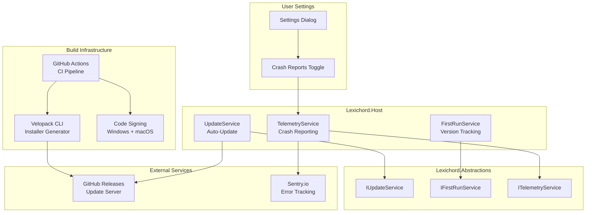
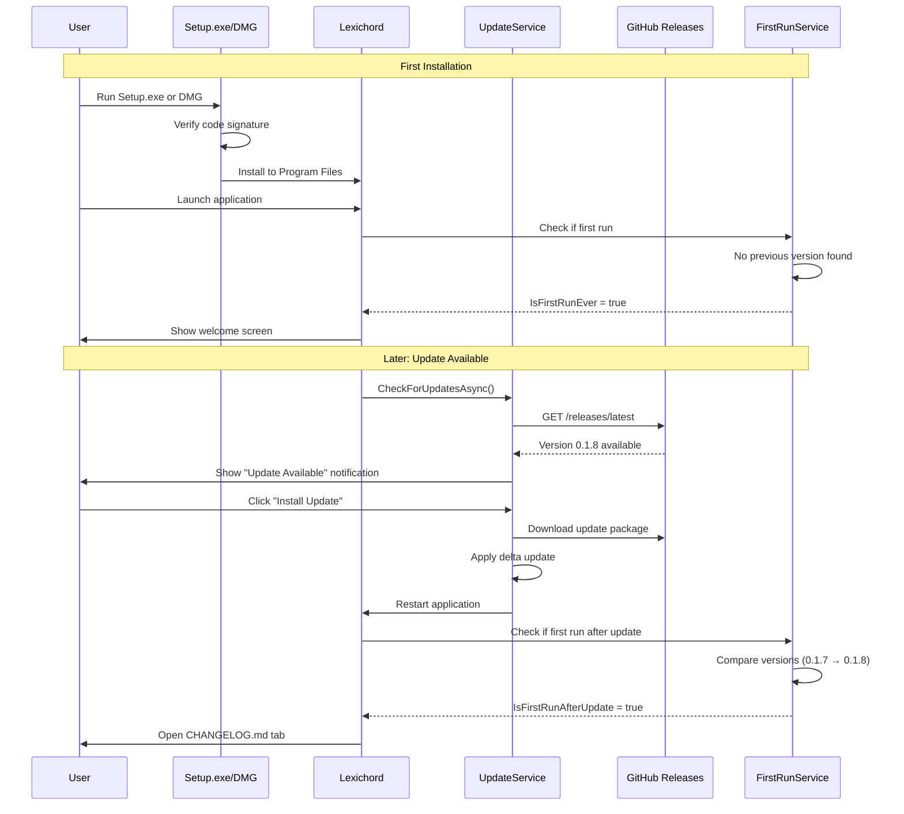
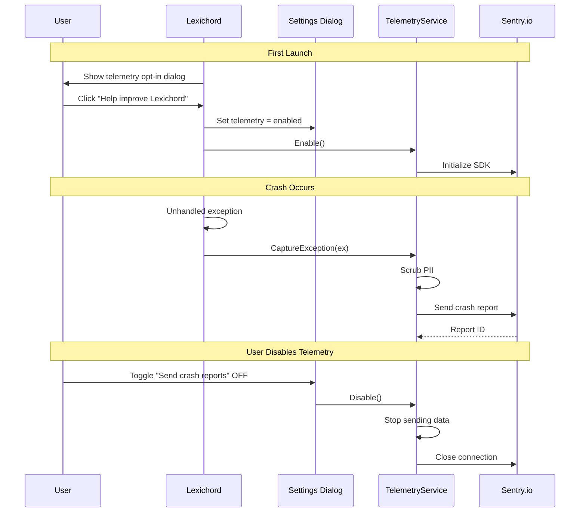

# LCS-DES-017: Design Specification Index — Distribution (Packaging)

## Document Control

| Field              | Value                    |
| :----------------- | :----------------------- |
| **Document ID**    | LCS-DES-017-INDEX        |
| **Feature ID**     | INF-017                  |
| **Feature Name**   | Distribution (Packaging) |
| **Target Version** | v0.1.7                   |
| **Status**         | Draft                    |
| **Last Updated**   | 2026-01-27               |

---

## Executive Summary

The **Distribution** module transforms Lexichord from a developer-only project into a **production-ready application** that can be installed on end-user machines. By implementing Velopack integration, code signing, first-run detection, and optional telemetry, users gain a professional installation experience while developers gain crash visibility—the final step before public release.

**Business Value:**

- **User Trust:** Code-signed installers avoid SmartScreen warnings on Windows and Gatekeeper warnings on macOS
- **Professional Experience:** Polished Setup.exe and .dmg installers match industry expectations
- **Update Awareness:** Release notes automatically shown after updates keep users informed
- **Crash Visibility:** Optional Sentry integration enables proactive bug identification
- **User Control:** Opt-out telemetry toggle respects user privacy while enabling product improvement

---

## Related Documents

| Document Type       | Document ID  | Title                  | Path                |
| :------------------ | :----------- | :--------------------- | :------------------ |
| **Scope Breakdown** | LCS-SBD-017  | Distribution Scope     | `./LCS-SBD-017.md`  |
| **Sub-Part 017a**   | LCS-DES-017a | Velopack Integration   | `./LCS-DES-017a.md` |
| **Sub-Part 017b**   | LCS-DES-017b | Signing Infrastructure | `./LCS-DES-017b.md` |
| **Sub-Part 017c**   | LCS-DES-017c | Release Notes Viewer   | `./LCS-DES-017c.md` |
| **Sub-Part 017d**   | LCS-DES-017d | Telemetry Hooks        | `./LCS-DES-017d.md` |

---

## Architecture Overview

### High-Level Component Diagram

### Installation and Update Flow

### Telemetry Privacy Flow

---

## Dependencies

### Upstream Dependencies

| Component             | Source Version | Usage                                          |
| :-------------------- | :------------- | :--------------------------------------------- |
| ISettingsService      | v0.1.6         | Persist telemetry opt-out and last run version |
| SettingsViewModel     | v0.1.6         | Add telemetry toggle to Settings UI            |
| Serilog Pipeline      | v0.0.3b        | Integrate Sentry as sink for crash reporting   |
| Editor Module         | v0.1.3         | Display CHANGELOG.md in read-only tab          |
| IEditorService        | v0.1.3a        | Open changelog file programmatically           |
| IConfigurationService | v0.0.3d        | Retrieve application data paths                |

### External Dependencies

| Package         | Version | Purpose                               |
| :-------------- | :------ | :------------------------------------ |
| `Velopack`      | Latest  | Installer generation and auto-updates |
| `Sentry`        | Latest  | Crash reporting and error tracking    |
| Windows SDK     | Latest  | SignTool.exe for code signing         |
| Xcode CLI Tools | Latest  | codesign and notarytool for macOS     |

### Build Infrastructure

| Tool               | Purpose                             |
| :----------------- | :---------------------------------- |
| GitHub Actions     | CI/CD pipeline with signing         |
| GitHub Releases    | Update server and installer hosting |
| PFX Certificate    | Windows code signing                |
| Apple Developer ID | macOS code signing and notarization |

---

## License Gating Strategy

**All Distribution Features:** Available to all tiers (Core, WriterPro, Enterprise)

**Rationale:**

- Professional installers are essential for user trust
- Code signing prevents security warnings
- Auto-updates ensure security patches reach all users
- Telemetry is opt-in and privacy-focused

---

## Key Interfaces Summary

### IUpdateService (v0.1.7a)

Manages automatic update checking and application. Integrates with Velopack for delta updates.

**See:** `LCS-DES-017a.md` for full specification

### ISigningService (v0.1.7b)

Handles code signing for Windows and macOS during build process. CI pipeline integration.

**See:** `LCS-DES-017b.md` for full specification

### IFirstRunService (v0.1.7c)

Detects first-run scenarios (fresh install vs update) and triggers appropriate welcome/changelog display.

**See:** `LCS-DES-017c.md` for full specification

### ITelemetryService (v0.1.7d)

Provides opt-in crash reporting and analytics. Integrates with Sentry while respecting user privacy.

**See:** `LCS-DES-017d.md` for full specification

---

## Implementation Checklist Summary

| Sub-Part    | Est. Hours | Key Deliverables                                        |
| :---------- | :--------- | :------------------------------------------------------ |
| **v0.1.7a** | 13.5h      | Velopack integration, IUpdateService, auto-update UI    |
| **v0.1.7b** | 11.5h      | Code signing (Windows + macOS), CI workflow updates     |
| **v0.1.7c** | 7.5h       | IFirstRunService, changelog viewer, version tracking    |
| **v0.1.7d** | 10.5h      | ITelemetryService, Sentry integration, privacy controls |
| **Total**   | **40h**    | Production-ready distribution system                    |

**See:** `LCS-SBD-017.md` for detailed task breakdown

---

## Success Criteria Summary

### Distribution Quality

| Metric                       | Target   | Rationale                                    |
| :--------------------------- | :------- | :------------------------------------------- |
| Windows SmartScreen bypass   | 100%     | No warnings on signed releases               |
| macOS Gatekeeper bypass      | 100%     | No warnings on notarized releases            |
| First run detection accuracy | 100%     | Correctly identifies update vs fresh install |
| Update check latency         | < 2s     | Must feel instant to user                    |
| Installer size (Windows)     | < 80 MB  | Reasonable download for end users            |
| Installer size (macOS)       | < 100 MB | Reasonable download for end users            |

### Privacy and Telemetry

| Metric                  | Target | Rationale                         |
| :---------------------- | :----- | :-------------------------------- |
| Telemetry opt-in rate   | > 30%  | Meaningful crash data collection  |
| Crash report submission | < 5s   | Fast enough to not block shutdown |
| PII scrubbing accuracy  | 100%   | No personal data in reports       |

---

## Test Coverage Summary

### Unit Testing

| Component            | Coverage Target | Key Tests                                        |
| :------------------- | :-------------- | :----------------------------------------------- |
| UpdateService        | 95%             | Check for updates, apply updates, delta handling |
| FirstRunService      | 100%            | Version tracking, first run detection            |
| TelemetryService     | 95%             | Enable/disable, PII scrubbing, exception capture |
| Signing verification | 100%            | Signature validity, certificate chain            |

### Integration Testing

- End-to-end installer creation and execution
- Code signature validation on Windows and macOS
- Update application from older version
- First-run changelog display after update
- Telemetry toggle in Settings persistence

### Manual Testing

- Install on clean Windows machine (verify no SmartScreen)
- Install on clean macOS machine (verify no Gatekeeper warning)
- Update existing installation
- Verify CHANGELOG opens after update
- Enable/disable telemetry and verify Sentry traffic

**See:** Individual sub-part specifications for detailed test requirements

---

## What This Enables

After v0.1.7, Lexichord will support:

1. **Professional Distribution**
    - Signed installers for Windows and macOS
    - No security warnings during installation
    - Industry-standard packaging with Velopack

2. **Automatic Updates**
    - Background update checking
    - Delta updates (smaller downloads)
    - User notification of available updates
    - One-click update installation

3. **User Onboarding**
    - First-run welcome experience
    - Automatic changelog display after updates
    - Version tracking for feature discovery

4. **Production Debugging**
    - Opt-in crash reporting via Sentry
    - Privacy-focused telemetry
    - Breadcrumb logging for context
    - User control over data sharing

5. **Foundation for Public Release**
    - Ready for v0.2.x public beta
    - Professional user experience
    - Crash visibility for proactive bug fixes
    - Trust signals for new users

---

## Risks & Mitigations

| Risk                                | Impact | Mitigation                                       |
| :---------------------------------- | :----- | :----------------------------------------------- |
| Certificate expires during release  | High   | Document renewal; set calendar reminders         |
| Notarization fails silently         | High   | Add explicit verification step in CI             |
| Sentry costs exceed budget          | Medium | Monitor usage; implement rate limiting           |
| Users disable telemetry entirely    | Low    | Expected; ensure core logging works offline      |
| Delta updates corrupt installation  | High   | Full installer fallback; verify after apply      |
| CHANGELOG.md missing from build     | Medium | Fail CI if resource not embedded                 |
| SmartScreen warning despite signing | High   | Build reputation over time; timestamp signatures |

---

## Document History

| Version | Date       | Author           | Changes                                                      |
| :------ | :--------- | :--------------- | :----------------------------------------------------------- |
| 1.0     | 2026-01-27 | System Architect | Created INDEX from legacy LCS-INF-017 during standardization |
