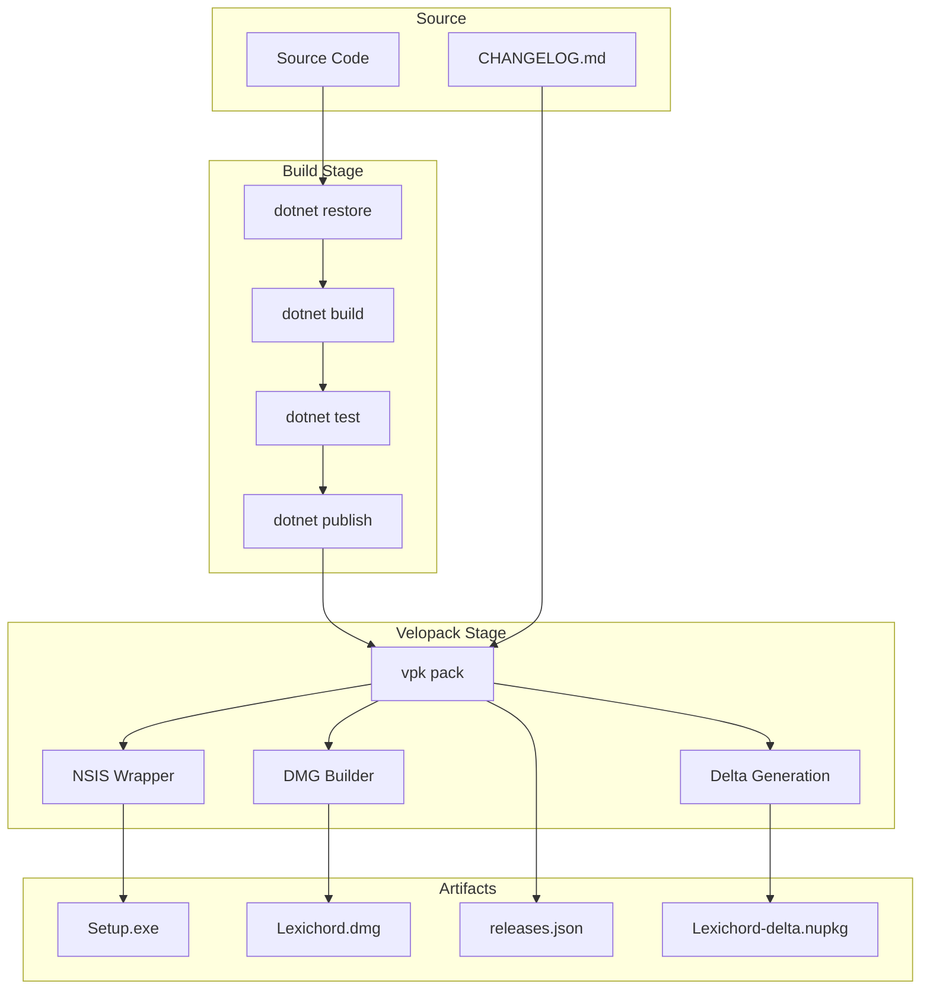
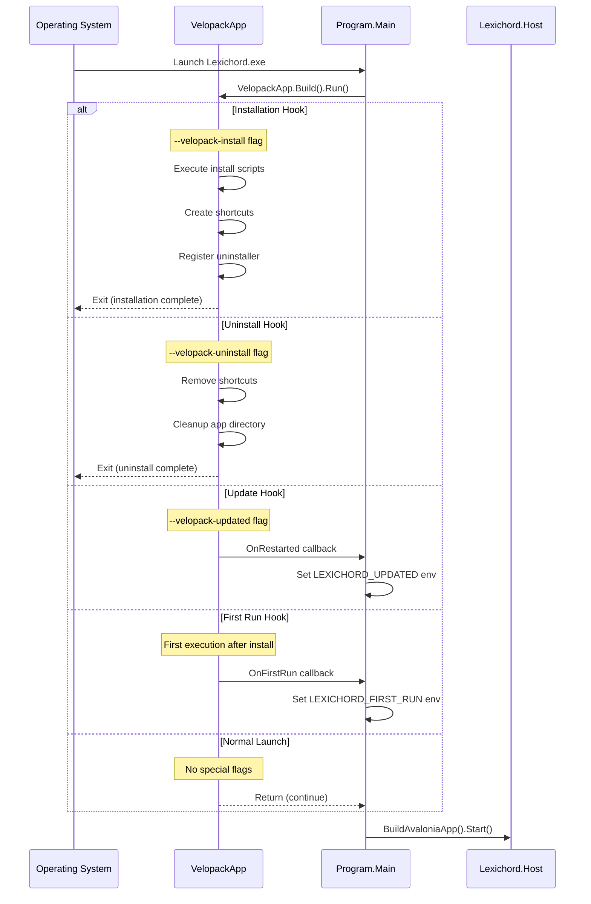
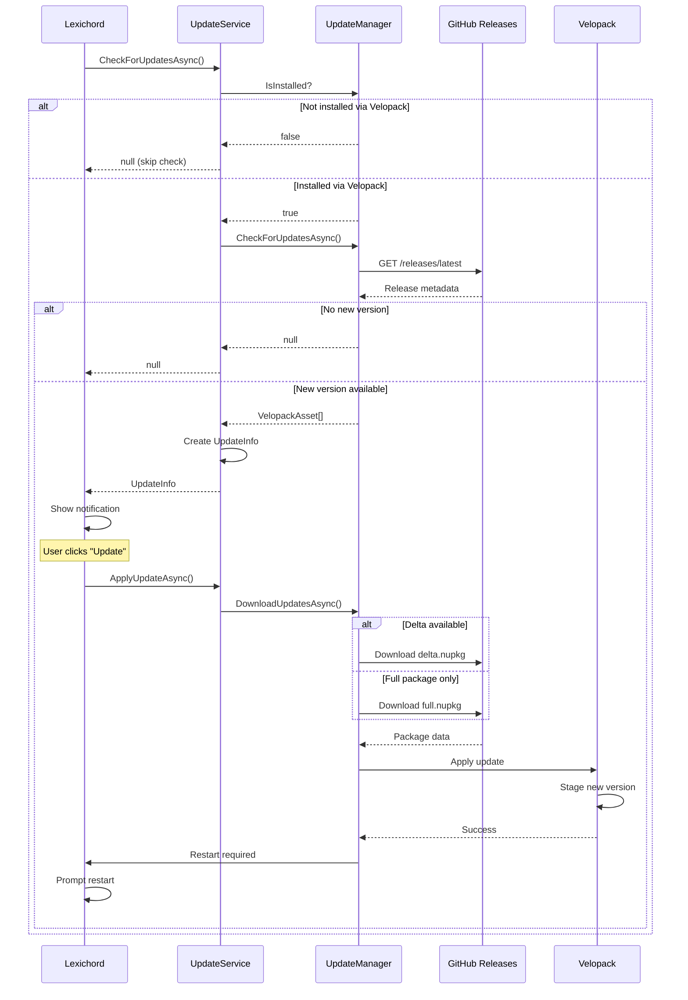

# LCS-DES-017a: Velopack Integration

## 1. Metadata & Categorization

| Field              | Value                                     | Description                           |
| :----------------- | :---------------------------------------- | :------------------------------------ |
| **Document ID**    | LCS-DES-017a                              | Design Specification v0.1.7a          |
| **Feature ID**     | INF-017a                                  | Infrastructure - Velopack Integration |
| **Feature Name**   | Velopack Integration                      | Installer generation and auto-updates |
| **Target Version** | `v0.1.7a`                                 | First sub-part of v0.1.7              |
| **Module Scope**   | `Build Infrastructure` / `Lexichord.Host` | Build scripts and host bootstrap      |
| **Swimlane**       | `Infrastructure`                          | The Podium (Platform)                 |
| **License Tier**   | `Core`                                    | Foundation (Required for all tiers)   |
| **Author**         | System Architect                          |                                       |
| **Status**         | **Draft**                                 | Pending implementation                |
| **Last Updated**   | 2026-01-27                                |                                       |

---

## 2. Executive Summary

### 2.1 The Requirement

Lexichord needs **professional installers** for distribution:

- Current state: Application runs only from development environment
- Windows users expect Setup.exe installer experience
- macOS users expect .dmg disk image with drag-to-Applications
- Auto-update capability reduces user friction between releases
- Delta updates minimize download size for frequent releases

Without installers:

- Users cannot easily install Lexichord
- Manual file copying is error-prone
- No upgrade path between versions
- Application appears unprofessional

### 2.2 The Proposed Solution

We **SHALL** implement Velopack integration with:

1. **VelopackApp Bootstrap** — Initialize Velopack before application startup
2. **Windows Installer** — Generate Setup.exe with NSIS-style experience
3. **macOS Installer** — Generate .dmg with drag-to-Applications
4. **Auto-Update Service** — Check GitHub Releases for new versions
5. **Delta Updates** — Generate binary diffs for efficient updates

---

## 3. Architecture & Modular Strategy

### 3.1 Build Pipeline Flow



### 3.2 Application Bootstrap Sequence



### 3.3 Update Check Flow



### 3.4 File Structure After Installation

```
Windows:
%LOCALAPPDATA%\Lexichord\
├── current/
│   ├── Lexichord.exe
│   ├── Lexichord.dll
│   ├── CHANGELOG.md
│   └── ... (app files)
├── packages/
│   ├── Lexichord-0.1.7-full.nupkg
│   └── Lexichord-0.1.7-delta.nupkg
├── Update.exe             # Velopack updater
└── SquirrelSetup.log      # Install/update log

macOS:
/Applications/Lexichord.app/
├── Contents/
│   ├── Info.plist
│   ├── MacOS/
│   │   └── Lexichord
│   ├── Resources/
│   │   ├── CHANGELOG.md
│   │   └── ...
│   └── _CodeSignature/
~/Library/Caches/Lexichord/
└── packages/
    └── ... (update packages)
```

---

## 4. Decision Tree: Velopack Operations

```text
START: "What Velopack operation is needed?"
|
+-- Application Launch
|   +-- Check command line args
|   |   +-- --velopack-install → Run install hooks → Exit
|   |   +-- --velopack-uninstall → Run uninstall hooks → Exit
|   |   +-- --velopack-updated → Set env flag → Continue
|   |   +-- --velopack-obsolete → Clean old version → Continue
|   |   +-- (none) → Normal launch
|   +-- Is first run after install?
|   |   +-- YES → Call OnFirstRun callback
|   |   +-- NO → Continue
|   +-- END
|
+-- Build Installer
|   +-- Which platform?
|   |   +-- Windows
|   |   |   +-- dotnet publish -r win-x64
|   |   |   +-- vpk pack with --packTitle "Lexichord"
|   |   |   +-- Generate Setup.exe, releases.json
|   |   +-- macOS
|   |   |   +-- dotnet publish -r osx-x64
|   |   |   +-- vpk pack with --packTitle "Lexichord"
|   |   |   +-- Generate .dmg, releases.json
|   |   +-- macOS ARM
|   |   |   +-- dotnet publish -r osx-arm64
|   |   |   +-- vpk pack
|   |   |   +-- Generate .dmg
|   +-- Include previous version?
|   |   +-- YES → Generate delta package
|   |   +-- NO → Full package only
|   +-- END
|
+-- Check for Updates
|   +-- Is app installed via Velopack?
|   |   +-- YES → Query configured release source
|   |   +-- NO → Skip (development mode)
|   +-- Is newer version available?
|   |   +-- YES → Return UpdateInfo
|   |   +-- NO → Return null
|   +-- END
|
+-- Apply Update
|   +-- Is delta package available?
|   |   +-- YES → Download delta
|   |   |   +-- Delta apply fails? → Fallback to full
|   |   +-- NO → Download full package
|   +-- Verify package signature
|   |   +-- Valid → Stage update
|   |   +-- Invalid → Abort with error
|   +-- Prompt user to restart
|   +-- END
|
+-- END
```

---

## 5. Data Contracts

### 5.1 IUpdateService Interface

```csharp
namespace Lexichord.Abstractions.Contracts;

/// <summary>
/// Service for checking and applying application updates via Velopack.
/// </summary>
/// <remarks>
/// LOGIC: Wraps Velopack UpdateManager for type-safe update operations.
/// Supports both delta and full updates with automatic fallback.
///
/// Usage Pattern:
/// 1. Call CheckForUpdatesAsync() on startup (background)
/// 2. If update available, show notification to user
/// 3. User clicks "Update" → ApplyUpdateAsync()
/// 4. Prompt user to restart
/// 5. On restart, Velopack applies staged update
/// </remarks>
public interface IUpdateService : IDisposable
{
    /// <summary>
    /// Checks for available updates from the configured release source.
    /// </summary>
    /// <param name="cancellationToken">Cancellation token.</param>
    /// <returns>Update information if available, null if up to date.</returns>
    /// <remarks>
    /// LOGIC: Returns null if:
    /// - Application not installed via Velopack (development mode)
    /// - No newer version available
    /// - Network error (logged but not thrown)
    /// </remarks>
    Task<UpdateInfo?> CheckForUpdatesAsync(CancellationToken cancellationToken = default);

    /// <summary>
    /// Downloads and stages the specified update.
    /// </summary>
    /// <param name="update">The update to apply.</param>
    /// <param name="progress">Optional progress reporter (0-100).</param>
    /// <param name="cancellationToken">Cancellation token.</param>
    /// <remarks>
    /// LOGIC: Downloads delta if available, falls back to full.
    /// After staging, application must restart to complete update.
    /// </remarks>
    Task ApplyUpdateAsync(
        UpdateInfo update,
        IProgress<int>? progress = null,
        CancellationToken cancellationToken = default);

    /// <summary>
    /// Restarts the application to apply a staged update.
    /// </summary>
    /// <remarks>
    /// LOGIC: Calls Velopack's restart mechanism.
    /// Current application instance will terminate.
    /// </remarks>
    void RestartToApplyUpdate();

    /// <summary>
    /// Gets whether an update has been staged and is waiting for restart.
    /// </summary>
    bool IsUpdatePending { get; }

    /// <summary>
    /// Gets the version of the pending update, if any.
    /// </summary>
    string? PendingVersion { get; }

    /// <summary>
    /// Gets the current installed version.
    /// </summary>
    string CurrentVersion { get; }

    /// <summary>
    /// Gets whether the application was installed via Velopack.
    /// </summary>
    /// <remarks>
    /// LOGIC: Returns false when running from development environment.
    /// Update checks are skipped when false.
    /// </remarks>
    bool IsInstalled { get; }

    /// <summary>
    /// Gets the URL to the releases page for manual download.
    /// </summary>
    string ReleasesUrl { get; }

    /// <summary>
    /// Event raised when an update is available.
    /// </summary>
    event EventHandler<UpdateAvailableEventArgs>? UpdateAvailable;

    /// <summary>
    /// Event raised during update download with progress.
    /// </summary>
    event EventHandler<UpdateProgressEventArgs>? UpdateProgress;
}

/// <summary>
/// Information about an available update.
/// </summary>
/// <param name="CurrentVersion">The currently installed version.</param>
/// <param name="TargetVersion">The version to update to.</param>
/// <param name="ReleaseNotes">Markdown release notes for the update.</param>
/// <param name="DownloadSize">Download size in bytes.</param>
/// <param name="IsDelta">Whether this is a delta (incremental) update.</param>
/// <param name="ReleaseDate">When the update was released.</param>
/// <param name="IsMandatory">Whether this update is mandatory.</param>
public record UpdateInfo(
    string CurrentVersion,
    string TargetVersion,
    string? ReleaseNotes,
    long DownloadSize,
    bool IsDelta,
    DateTimeOffset ReleaseDate,
    bool IsMandatory = false
);

/// <summary>
/// Event args for update availability.
/// </summary>
public class UpdateAvailableEventArgs : EventArgs
{
    /// <summary>
    /// Gets the update information.
    /// </summary>
    public required UpdateInfo Update { get; init; }
}

/// <summary>
/// Event args for update progress.
/// </summary>
public class UpdateProgressEventArgs : EventArgs
{
    /// <summary>
    /// Gets the progress percentage (0-100).
    /// </summary>
    public required int ProgressPercent { get; init; }

    /// <summary>
    /// Gets the bytes downloaded so far.
    /// </summary>
    public long BytesDownloaded { get; init; }

    /// <summary>
    /// Gets the total bytes to download.
    /// </summary>
    public long TotalBytes { get; init; }
}
```

### 5.2 Velopack Configuration

```csharp
namespace Lexichord.Abstractions.Contracts;

/// <summary>
/// Configuration options for Velopack updates.
/// </summary>
/// <remarks>
/// LOGIC: Loaded from appsettings.json [Updates] section.
/// </remarks>
public record UpdateOptions
{
    /// <summary>
    /// URL to GitHub Releases or custom release feed.
    /// </summary>
    /// <remarks>
    /// Example: https://github.com/lexichord/lexichord/releases
    /// </remarks>
    public string ReleasesUrl { get; init; } = string.Empty;

    /// <summary>
    /// Whether to check for updates automatically on startup.
    /// </summary>
    public bool AutoCheckEnabled { get; init; } = true;

    /// <summary>
    /// Interval between automatic update checks.
    /// </summary>
    public TimeSpan CheckInterval { get; init; } = TimeSpan.FromHours(4);

    /// <summary>
    /// Whether to download updates in the background.
    /// </summary>
    public bool BackgroundDownload { get; init; } = false;

    /// <summary>
    /// Personal access token for private repositories.
    /// </summary>
    /// <remarks>
    /// SECURITY: Should be stored in user secrets, not appsettings.
    /// </remarks>
    public string? GitHubToken { get; init; }

    /// <summary>
    /// Channel for update (stable, beta, etc.).
    /// </summary>
    public string Channel { get; init; } = "stable";
}
```

### 5.3 Build Scripts Configuration

```csharp
namespace Lexichord.Build;

/// <summary>
/// Configuration for Velopack build scripts.
/// </summary>
/// <remarks>
/// LOGIC: Used by build/pack-*.ps1 scripts.
/// Values come from CI environment or defaults.
/// </remarks>
public static class PackConfiguration
{
    /// <summary>
    /// Application unique identifier (used in install path).
    /// </summary>
    public const string AppId = "Lexichord";

    /// <summary>
    /// Display title in installer UI.
    /// </summary>
    public const string PackTitle = "Lexichord";

    /// <summary>
    /// Application icon path (relative to project root).
    /// </summary>
    public const string IconPath = "assets/icons/lexichord.ico";

    /// <summary>
    /// macOS bundle identifier.
    /// </summary>
    public const string BundleId = "com.lexichord.app";

    /// <summary>
    /// Authors displayed in installer.
    /// </summary>
    public const string Authors = "Lexichord Team";

    /// <summary>
    /// Windows runtime identifiers.
    /// </summary>
    public static readonly string[] WindowsRids = ["win-x64", "win-arm64"];

    /// <summary>
    /// macOS runtime identifiers.
    /// </summary>
    public static readonly string[] MacOSRids = ["osx-x64", "osx-arm64"];
}
```

---

## 6. Implementation Logic

### 6.1 Program.cs with Velopack Bootstrap

```csharp
using Avalonia;
using Serilog;
using Serilog.Events;
using Velopack;
using System;

namespace Lexichord.Host;

/// <summary>
/// Application entry point with Velopack integration.
/// </summary>
/// <remarks>
/// LOGIC: Velopack MUST be initialized before any other code.
/// VelopackApp.Build().Run() handles:
/// - Installation hooks (--velopack-install) → creates shortcuts, exits
/// - Uninstall hooks (--velopack-uninstall) → removes shortcuts, exits
/// - Update hooks (--velopack-updated) → sets env var, continues
/// - Obsolete hooks (--velopack-obsolete) → cleanup, continues
/// - Normal launch → no action, continues
///
/// CRITICAL: Any code before VelopackApp.Build().Run() will execute
/// during install/uninstall hooks, which may cause issues.
/// </remarks>
internal sealed class Program
{
    [STAThread]
    public static int Main(string[] args)
    {
        // ═══════════════════════════════════════════════════════════════
        // VELOPACK BOOTSTRAP - MUST BE FIRST
        // ═══════════════════════════════════════════════════════════════
        // This may exit the process for install/uninstall operations.
        // Callbacks are invoked for first-run and restart scenarios.
        VelopackApp.Build()
            .WithFirstRun(OnFirstRun)
            .WithRestarted(OnRestarted)
            .WithBeforeUpdateFastCallback(OnBeforeUpdate)
            .WithAfterUpdateFastCallback(OnAfterUpdate)
            .Run();

        // ═══════════════════════════════════════════════════════════════
        // BOOTSTRAP LOGGER - BEFORE DI
        // ═══════════════════════════════════════════════════════════════
        Log.Logger = new LoggerConfiguration()
            .MinimumLevel.Debug()
            .MinimumLevel.Override("Microsoft", LogEventLevel.Information)
            .MinimumLevel.Override("System", LogEventLevel.Warning)
            .WriteTo.Console(
                outputTemplate: "[{Timestamp:HH:mm:ss} {Level:u3}] {Message:lj}{NewLine}{Exception}")
            .CreateBootstrapLogger();

        try
        {
            Log.Information("═══════════════════════════════════════════════════════════════");
            Log.Information("Starting Lexichord v{Version}",
                typeof(Program).Assembly.GetName().Version);
            Log.Information("═══════════════════════════════════════════════════════════════");

            var exitCode = BuildAvaloniaApp()
                .StartWithClassicDesktopLifetime(args);

            Log.Information("Lexichord shutdown complete. Exit code: {ExitCode}", exitCode);
            return exitCode;
        }
        catch (Exception ex)
        {
            Log.Fatal(ex, "Lexichord terminated unexpectedly");
            return 1;
        }
        finally
        {
            Log.CloseAndFlush();
        }
    }

    /// <summary>
    /// Called once after fresh installation completes.
    /// </summary>
    /// <param name="version">Installed version.</param>
    /// <remarks>
    /// LOGIC: Set environment variable for App.axaml.cs to detect.
    /// Will trigger welcome/onboarding flow.
    /// </remarks>
    private static void OnFirstRun(SemanticVersion version)
    {
        Environment.SetEnvironmentVariable("LEXICHORD_FIRST_RUN", "true");
        Environment.SetEnvironmentVariable("LEXICHORD_VERSION", version.ToString());

        // Minimal logging - full Serilog not yet initialized
        Console.WriteLine($"[Velopack] First run detected: {version}");
    }

    /// <summary>
    /// Called when application restarts after an update.
    /// </summary>
    /// <param name="version">New version after update.</param>
    /// <remarks>
    /// LOGIC: Set environment variables for App.axaml.cs to detect.
    /// Will trigger release notes display.
    /// </remarks>
    private static void OnRestarted(SemanticVersion version)
    {
        Environment.SetEnvironmentVariable("LEXICHORD_UPDATED", "true");
        Environment.SetEnvironmentVariable("LEXICHORD_NEW_VERSION", version.ToString());

        Console.WriteLine($"[Velopack] Restarted after update to: {version}");
    }

    /// <summary>
    /// Called immediately before update is applied (fast, synchronous).
    /// </summary>
    /// <param name="version">Version being updated to.</param>
    /// <remarks>
    /// LOGIC: Last chance to save state before files are replaced.
    /// Must be fast - blocks update process.
    /// </remarks>
    private static void OnBeforeUpdate(SemanticVersion version)
    {
        Console.WriteLine($"[Velopack] Preparing update to: {version}");

        // Could save critical state here if needed
        // Example: Flush any in-memory caches
    }

    /// <summary>
    /// Called immediately after update files are staged (fast, synchronous).
    /// </summary>
    /// <param name="version">Version that was staged.</param>
    /// <remarks>
    /// LOGIC: Update is staged but not yet active.
    /// Application will restart to activate new version.
    /// </remarks>
    private static void OnAfterUpdate(SemanticVersion version)
    {
        Console.WriteLine($"[Velopack] Update staged: {version}");
    }

    /// <summary>
    /// Builds the Avalonia application configuration.
    /// </summary>
    public static AppBuilder BuildAvaloniaApp()
        => AppBuilder.Configure<App>()
            .UsePlatformDetect()
            .WithInterFont()
            .LogToTrace();
}
```

### 6.2 UpdateService Implementation

```csharp
using Lexichord.Abstractions.Contracts;
using Lexichord.Abstractions.Events;
using MediatR;
using Microsoft.Extensions.Logging;
using Microsoft.Extensions.Options;
using Velopack;
using Velopack.Sources;

namespace Lexichord.Host.Services;

/// <summary>
/// Service for checking and applying application updates via Velopack.
/// </summary>
/// <remarks>
/// LOGIC: Wraps Velopack UpdateManager for safe update operations.
///
/// Update Flow:
/// 1. CheckForUpdatesAsync() → queries GitHub Releases
/// 2. ApplyUpdateAsync() → downloads and stages update
/// 3. RestartToApplyUpdate() → terminates app, Velopack swaps binaries
/// 4. Next launch → OnRestarted callback → FirstRunService detects update
///
/// Safety:
/// - Graceful degradation when not installed via Velopack
/// - Delta updates with full fallback
/// - Signature verification before apply
/// </remarks>
public sealed class UpdateService : IUpdateService
{
    private readonly ILogger<UpdateService> _logger;
    private readonly IMediator _mediator;
    private readonly UpdateOptions _options;
    private readonly UpdateManager? _updateManager;

    private UpdateInfo? _pendingUpdate;
    private VelopackAssetFeed? _cachedUpdate;
    private bool _disposed;

    public UpdateService(
        ILogger<UpdateService> logger,
        IMediator mediator,
        IOptions<UpdateOptions> options)
    {
        _logger = logger;
        _mediator = mediator;
        _options = options.Value;

        // LOGIC: Only create UpdateManager if URL is configured
        if (!string.IsNullOrEmpty(_options.ReleasesUrl))
        {
            try
            {
                var source = new GithubSource(
                    _options.ReleasesUrl,
                    _options.GitHubToken,
                    prerelease: _options.Channel != "stable");

                _updateManager = new UpdateManager(source);

                _logger.LogInformation(
                    "UpdateService initialized. Source: {Url}, Channel: {Channel}, Installed: {Installed}",
                    _options.ReleasesUrl,
                    _options.Channel,
                    _updateManager.IsInstalled);
            }
            catch (Exception ex)
            {
                _logger.LogError(ex, "Failed to initialize UpdateManager");
            }
        }
        else
        {
            _logger.LogWarning("Updates disabled: ReleasesUrl not configured");
        }
    }

    /// <inheritdoc/>
    public event EventHandler<UpdateAvailableEventArgs>? UpdateAvailable;

    /// <inheritdoc/>
    public event EventHandler<UpdateProgressEventArgs>? UpdateProgress;

    /// <inheritdoc/>
    public bool IsUpdatePending => _pendingUpdate is not null;

    /// <inheritdoc/>
    public string? PendingVersion => _pendingUpdate?.TargetVersion;

    /// <inheritdoc/>
    public string CurrentVersion =>
        _updateManager?.CurrentVersion?.ToString()
        ?? typeof(UpdateService).Assembly.GetName().Version?.ToString()
        ?? "0.0.0";

    /// <inheritdoc/>
    public bool IsInstalled => _updateManager?.IsInstalled ?? false;

    /// <inheritdoc/>
    public string ReleasesUrl => _options.ReleasesUrl;

    /// <inheritdoc/>
    public async Task<UpdateInfo?> CheckForUpdatesAsync(CancellationToken cancellationToken = default)
    {
        if (_updateManager is null)
        {
            _logger.LogDebug("Update check skipped: UpdateManager not initialized");
            return null;
        }

        if (!_updateManager.IsInstalled)
        {
            _logger.LogDebug("Update check skipped: Not installed via Velopack");
            return null;
        }

        _logger.LogInformation("Checking for updates...");

        try
        {
            _cachedUpdate = await _updateManager.CheckForUpdatesAsync();

            if (_cachedUpdate is null)
            {
                _logger.LogInformation("No updates available. Current: {Version}", CurrentVersion);
                return null;
            }

            var targetRelease = _cachedUpdate.TargetFullRelease;
            var hasDelta = _cachedUpdate.DeltasToTarget.Count > 0;

            var updateInfo = new UpdateInfo(
                CurrentVersion: CurrentVersion,
                TargetVersion: targetRelease.Version.ToString(),
                ReleaseNotes: targetRelease.NotesMarkdown,
                DownloadSize: hasDelta
                    ? _cachedUpdate.DeltasToTarget.Sum(d => d.Size)
                    : targetRelease.Size,
                IsDelta: hasDelta,
                ReleaseDate: targetRelease.Published ?? DateTimeOffset.UtcNow,
                IsMandatory: false
            );

            _logger.LogInformation(
                "Update available: {Current} → {Target} (Delta: {IsDelta}, Size: {Size:N0} bytes)",
                updateInfo.CurrentVersion,
                updateInfo.TargetVersion,
                updateInfo.IsDelta,
                updateInfo.DownloadSize);

            // Notify listeners
            UpdateAvailable?.Invoke(this, new UpdateAvailableEventArgs { Update = updateInfo });

            await _mediator.Publish(new UpdateAvailableEvent(
                updateInfo.CurrentVersion,
                updateInfo.TargetVersion,
                updateInfo.ReleaseDate), cancellationToken);

            return updateInfo;
        }
        catch (Exception ex)
        {
            _logger.LogError(ex, "Failed to check for updates");
            return null;
        }
    }

    /// <inheritdoc/>
    public async Task ApplyUpdateAsync(
        UpdateInfo update,
        IProgress<int>? progress = null,
        CancellationToken cancellationToken = default)
    {
        if (_updateManager is null)
            throw new InvalidOperationException("UpdateManager not initialized");

        if (_cachedUpdate is null)
            throw new InvalidOperationException("No update available. Call CheckForUpdatesAsync first.");

        _logger.LogInformation("Downloading update to {Version}...", update.TargetVersion);

        try
        {
            // LOGIC: Download with progress reporting
            await _updateManager.DownloadUpdatesAsync(
                _cachedUpdate,
                progress: percent =>
                {
                    progress?.Report(percent);
                    UpdateProgress?.Invoke(this, new UpdateProgressEventArgs
                    {
                        ProgressPercent = percent,
                        BytesDownloaded = (long)(update.DownloadSize * percent / 100.0),
                        TotalBytes = update.DownloadSize
                    });
                });

            _logger.LogInformation("Update downloaded. Staging...");

            // LOGIC: Stage update (does not restart)
            // Next call to RestartToApplyUpdate() will activate it
            _pendingUpdate = update;

            _logger.LogInformation("Update staged. Version {Version} ready to apply on restart.",
                update.TargetVersion);
        }
        catch (Exception ex)
        {
            _logger.LogError(ex, "Failed to download/stage update");
            _pendingUpdate = null;
            throw;
        }
    }

    /// <inheritdoc/>
    public void RestartToApplyUpdate()
    {
        if (_updateManager is null || _cachedUpdate is null)
        {
            _logger.LogWarning("Cannot restart: No update staged");
            return;
        }

        _logger.LogInformation("Restarting to apply update...");

        // LOGIC: This will terminate the current process
        // Velopack will swap binaries and restart with --velopack-updated flag
        _updateManager.ApplyUpdatesAndRestart(_cachedUpdate);
    }

    public void Dispose()
    {
        if (_disposed) return;
        _updateManager?.Dispose();
        _disposed = true;
    }
}
```

### 6.3 Windows Build Script (pack-windows.ps1)

```powershell
#!/usr/bin/env pwsh
<#
.SYNOPSIS
    Builds and packages Lexichord for Windows using Velopack.

.DESCRIPTION
    This script:
    1. Publishes the application for win-x64 and win-arm64
    2. Packages using Velopack to create Setup.exe
    3. Generates delta packages if previous version exists
    4. Outputs artifacts to ./releases directory

.PARAMETER Version
    Semantic version for this release (e.g., "0.1.7")

.PARAMETER PreviousReleasesDir
    Directory containing previous releases for delta generation (optional)

.PARAMETER Certificate
    Path to PFX certificate for signing (optional, can use env var)

.PARAMETER CertificatePassword
    Password for PFX certificate (optional, can use env var)

.EXAMPLE
    ./pack-windows.ps1 -Version "0.1.7"

.EXAMPLE
    ./pack-windows.ps1 -Version "0.1.7" -PreviousReleasesDir "./prev-releases"
#>

param(
    [Parameter(Mandatory = $true)]
    [string]$Version,

    [Parameter(Mandatory = $false)]
    [string]$PreviousReleasesDir,

    [Parameter(Mandatory = $false)]
    [string]$Certificate = $env:WINDOWS_CERTIFICATE_PATH,

    [Parameter(Mandatory = $false)]
    [string]$CertificatePassword = $env:WINDOWS_CERTIFICATE_PASSWORD
)

$ErrorActionPreference = "Stop"

# Configuration
$AppId = "Lexichord"
$PackTitle = "Lexichord"
$Authors = "Lexichord Team"
$ProjectPath = "./src/Lexichord.Host/Lexichord.Host.csproj"
$OutputDir = "./releases/windows"
$PublishDir = "./publish/win-x64"
$IconPath = "./assets/icons/lexichord.ico"

Write-Host "═══════════════════════════════════════════════════════════════" -ForegroundColor Cyan
Write-Host "Building Lexichord v$Version for Windows" -ForegroundColor Cyan
Write-Host "═══════════════════════════════════════════════════════════════" -ForegroundColor Cyan

# Step 1: Clean and create directories
Write-Host "`n[1/5] Preparing directories..." -ForegroundColor Yellow
if (Test-Path $PublishDir) { Remove-Item -Recurse -Force $PublishDir }
if (Test-Path $OutputDir) { Remove-Item -Recurse -Force $OutputDir }
New-Item -ItemType Directory -Force -Path $PublishDir | Out-Null
New-Item -ItemType Directory -Force -Path $OutputDir | Out-Null

# Step 2: Publish application
Write-Host "`n[2/5] Publishing application..." -ForegroundColor Yellow
dotnet publish $ProjectPath `
    --configuration Release `
    --runtime win-x64 `
    --self-contained true `
    --output $PublishDir `
    -p:PublishSingleFile=false `
    -p:PublishReadyToRun=true `
    -p:Version=$Version

if ($LASTEXITCODE -ne 0) {
    Write-Error "Publish failed with exit code $LASTEXITCODE"
    exit $LASTEXITCODE
}

# Copy CHANGELOG.md
Copy-Item "./CHANGELOG.md" -Destination "$PublishDir/CHANGELOG.md" -Force

Write-Host "Published to: $PublishDir" -ForegroundColor Green

# Step 3: Sign executable (if certificate provided)
if ($Certificate -and $CertificatePassword) {
    Write-Host "`n[3/5] Signing executable..." -ForegroundColor Yellow

    $exePath = Join-Path $PublishDir "Lexichord.exe"

    # Find signtool
    $signTool = Get-ChildItem -Path "C:\Program Files (x86)\Windows Kits\10\bin" `
        -Filter "signtool.exe" -Recurse | Sort-Object -Descending | Select-Object -First 1

    if ($signTool) {
        & $signTool.FullName sign `
            /f $Certificate `
            /p $CertificatePassword `
            /fd sha256 `
            /tr "http://timestamp.digicert.com" `
            /td sha256 `
            /v `
            $exePath

        if ($LASTEXITCODE -ne 0) {
            Write-Error "Signing failed with exit code $LASTEXITCODE"
            exit $LASTEXITCODE
        }

        Write-Host "Signed: $exePath" -ForegroundColor Green
    }
    else {
        Write-Warning "signtool.exe not found. Skipping signing."
    }
}
else {
    Write-Host "`n[3/5] Skipping signing (no certificate provided)" -ForegroundColor Yellow
}

# Step 4: Package with Velopack
Write-Host "`n[4/5] Packaging with Velopack..." -ForegroundColor Yellow

$vpkArgs = @(
    "pack"
    "--packId", $AppId
    "--packVersion", $Version
    "--packDir", $PublishDir
    "--packTitle", $PackTitle
    "--packAuthors", $Authors
    "--mainExe", "Lexichord.exe"
    "--outputDir", $OutputDir
)

# Add icon if exists
if (Test-Path $IconPath) {
    $vpkArgs += "--icon", $IconPath
}

# Add previous releases for delta generation
if ($PreviousReleasesDir -and (Test-Path $PreviousReleasesDir)) {
    $vpkArgs += "--delta", $PreviousReleasesDir
    Write-Host "Delta generation enabled from: $PreviousReleasesDir" -ForegroundColor Cyan
}

# Add signing if certificate provided
if ($Certificate -and $CertificatePassword) {
    $vpkArgs += "--signParams", "/f $Certificate /p $CertificatePassword /fd sha256 /tr http://timestamp.digicert.com /td sha256"
}

vpk @vpkArgs

if ($LASTEXITCODE -ne 0) {
    Write-Error "Velopack packaging failed with exit code $LASTEXITCODE"
    exit $LASTEXITCODE
}

# Step 5: Verify outputs
Write-Host "`n[5/5] Verifying outputs..." -ForegroundColor Yellow

$expectedFiles = @(
    "$OutputDir/RELEASES"
    "$OutputDir/Setup.exe"
    "$OutputDir/$AppId-$Version-full.nupkg"
)

foreach ($file in $expectedFiles) {
    if (Test-Path $file) {
        $size = (Get-Item $file).Length
        Write-Host "  ✓ $(Split-Path $file -Leaf) ($([math]::Round($size / 1MB, 2)) MB)" -ForegroundColor Green
    }
    else {
        Write-Warning "  ✗ $file not found"
    }
}

Write-Host "`n═══════════════════════════════════════════════════════════════" -ForegroundColor Cyan
Write-Host "Build complete! Artifacts in: $OutputDir" -ForegroundColor Cyan
Write-Host "═══════════════════════════════════════════════════════════════" -ForegroundColor Cyan
```

### 6.4 macOS Build Script (pack-macos.sh)

```bash
#!/bin/bash
#
# pack-macos.sh - Build and package Lexichord for macOS using Velopack
#
# Usage: ./pack-macos.sh <version> [--sign]
#
# Arguments:
#   version   Semantic version (e.g., "0.1.7")
#   --sign    Enable code signing and notarization
#
# Environment variables (for signing):
#   APPLE_DEVELOPER_ID        - Developer ID certificate name
#   APPLE_TEAM_ID            - Apple Developer Team ID
#   APPLE_ID                 - Apple ID email for notarization
#   APPLE_APP_SPECIFIC_PASSWORD - App-specific password for notarization
#

set -e

VERSION="${1:-}"
SIGN_ENABLED=false

if [[ "$2" == "--sign" ]]; then
    SIGN_ENABLED=true
fi

if [[ -z "$VERSION" ]]; then
    echo "Usage: $0 <version> [--sign]"
    echo "Example: $0 0.1.7 --sign"
    exit 1
fi

# Configuration
APP_ID="Lexichord"
BUNDLE_ID="com.lexichord.app"
PROJECT_PATH="./src/Lexichord.Host/Lexichord.Host.csproj"
OUTPUT_DIR="./releases/macos"
PUBLISH_DIR="./publish/osx-x64"
ICON_PATH="./assets/icons/lexichord.icns"
ENTITLEMENTS="./build/macos/entitlements.plist"

echo "═══════════════════════════════════════════════════════════════"
echo "Building Lexichord v$VERSION for macOS"
echo "═══════════════════════════════════════════════════════════════"

# Step 1: Clean and create directories
echo ""
echo "[1/6] Preparing directories..."
rm -rf "$PUBLISH_DIR" "$OUTPUT_DIR"
mkdir -p "$PUBLISH_DIR" "$OUTPUT_DIR"

# Step 2: Publish application
echo ""
echo "[2/6] Publishing application..."
dotnet publish "$PROJECT_PATH" \
    --configuration Release \
    --runtime osx-x64 \
    --self-contained true \
    --output "$PUBLISH_DIR" \
    -p:PublishSingleFile=false \
    -p:Version="$VERSION"

# Copy CHANGELOG.md
cp ./CHANGELOG.md "$PUBLISH_DIR/CHANGELOG.md"

echo "Published to: $PUBLISH_DIR"

# Step 3: Create app bundle structure
echo ""
echo "[3/6] Creating app bundle..."
APP_BUNDLE="$OUTPUT_DIR/$APP_ID.app"
mkdir -p "$APP_BUNDLE/Contents/MacOS"
mkdir -p "$APP_BUNDLE/Contents/Resources"

# Copy binaries
cp -R "$PUBLISH_DIR/"* "$APP_BUNDLE/Contents/MacOS/"

# Copy icon
if [[ -f "$ICON_PATH" ]]; then
    cp "$ICON_PATH" "$APP_BUNDLE/Contents/Resources/AppIcon.icns"
fi

# Create Info.plist
cat > "$APP_BUNDLE/Contents/Info.plist" << EOF
<?xml version="1.0" encoding="UTF-8"?>
<!DOCTYPE plist PUBLIC "-//Apple//DTD PLIST 1.0//EN" "http://www.apple.com/DTDs/PropertyList-1.0.dtd">
<plist version="1.0">
<dict>
    <key>CFBundleIdentifier</key>
    <string>$BUNDLE_ID</string>
    <key>CFBundleName</key>
    <string>$APP_ID</string>
    <key>CFBundleDisplayName</key>
    <string>$APP_ID</string>
    <key>CFBundleExecutable</key>
    <string>$APP_ID</string>
    <key>CFBundleVersion</key>
    <string>$VERSION</string>
    <key>CFBundleShortVersionString</key>
    <string>$VERSION</string>
    <key>CFBundlePackageType</key>
    <string>APPL</string>
    <key>CFBundleIconFile</key>
    <string>AppIcon</string>
    <key>LSMinimumSystemVersion</key>
    <string>11.0</string>
    <key>NSHighResolutionCapable</key>
    <true/>
    <key>CFBundleDocumentTypes</key>
    <array>
        <dict>
            <key>CFBundleTypeExtensions</key>
            <array>
                <string>md</string>
                <string>txt</string>
            </array>
            <key>CFBundleTypeName</key>
            <string>Text Document</string>
            <key>CFBundleTypeRole</key>
            <string>Editor</string>
        </dict>
    </array>
</dict>
</plist>
EOF

# Rename executable
mv "$APP_BUNDLE/Contents/MacOS/Lexichord" "$APP_BUNDLE/Contents/MacOS/Lexichord.orig" 2>/dev/null || true
mv "$APP_BUNDLE/Contents/MacOS/Lexichord.Host" "$APP_BUNDLE/Contents/MacOS/$APP_ID" 2>/dev/null || true

echo "App bundle created: $APP_BUNDLE"

# Step 4: Code signing (if enabled)
if [[ "$SIGN_ENABLED" == "true" ]]; then
    echo ""
    echo "[4/6] Signing app bundle..."

    if [[ -z "$APPLE_DEVELOPER_ID" ]]; then
        echo "Warning: APPLE_DEVELOPER_ID not set. Skipping signing."
    else
        # Sign all nested binaries first
        find "$APP_BUNDLE" -type f -perm +111 -exec codesign --force --options runtime \
            --entitlements "$ENTITLEMENTS" \
            --sign "$APPLE_DEVELOPER_ID" {} \;

        # Sign the app bundle
        codesign --force --deep --options runtime \
            --entitlements "$ENTITLEMENTS" \
            --sign "$APPLE_DEVELOPER_ID" \
            "$APP_BUNDLE"

        # Verify signature
        codesign --verify --verbose=2 "$APP_BUNDLE"
        echo "Signing complete and verified."
    fi
else
    echo ""
    echo "[4/6] Skipping signing (--sign not specified)"
fi

# Step 5: Create DMG
echo ""
echo "[5/6] Creating DMG..."

DMG_PATH="$OUTPUT_DIR/$APP_ID-$VERSION.dmg"
DMG_TEMP="$OUTPUT_DIR/dmg-temp"

mkdir -p "$DMG_TEMP"
cp -R "$APP_BUNDLE" "$DMG_TEMP/"

# Create symlink to Applications
ln -s /Applications "$DMG_TEMP/Applications"

# Create DMG
hdiutil create -volname "$APP_ID $VERSION" \
    -srcfolder "$DMG_TEMP" \
    -ov -format UDZO \
    "$DMG_PATH"

rm -rf "$DMG_TEMP"

echo "DMG created: $DMG_PATH"

# Step 6: Notarization (if signing enabled)
if [[ "$SIGN_ENABLED" == "true" && -n "$APPLE_ID" && -n "$APPLE_APP_SPECIFIC_PASSWORD" ]]; then
    echo ""
    echo "[6/6] Notarizing DMG..."

    xcrun notarytool submit "$DMG_PATH" \
        --apple-id "$APPLE_ID" \
        --team-id "$APPLE_TEAM_ID" \
        --password "$APPLE_APP_SPECIFIC_PASSWORD" \
        --wait

    # Staple the notarization ticket
    xcrun stapler staple "$DMG_PATH"

    echo "Notarization complete."
else
    echo ""
    echo "[6/6] Skipping notarization"
fi

# Final summary
echo ""
echo "═══════════════════════════════════════════════════════════════"
echo "Build complete! Artifacts:"
ls -lh "$OUTPUT_DIR"
echo "═══════════════════════════════════════════════════════════════"
```

---

## 7. Use Cases & User Stories

### 7.1 User Stories

| ID    | Role      | Story                                                             | Acceptance Criteria                       |
| :---- | :-------- | :---------------------------------------------------------------- | :---------------------------------------- |
| US-01 | User      | As a user, I want to install Lexichord with a familiar installer. | Setup.exe provides standard installation. |
| US-02 | User      | As a user, I want Lexichord to update automatically.              | Updates detected and applied seamlessly.  |
| US-03 | User      | As a user, I want minimal download size for updates.              | Delta updates used when available.        |
| US-04 | Developer | As a developer, I want to build installers from CI.               | GitHub Actions produces artifacts.        |
| US-05 | Developer | As a developer, I want to test updates locally.                   | vpk can package from local builds.        |

### 7.2 Use Cases

#### UC-01: Install from Setup.exe

**Preconditions:**

- User downloads Setup.exe from GitHub Releases.
- Windows 10/11 with default security.

**Flow:**

1. User double-clicks Setup.exe.
2. Velopack extracts to %LOCALAPPDATA%\Lexichord.
3. Desktop shortcut created.
4. Start menu entry created.
5. Lexichord.exe launches automatically.
6. VelopackApp.OnFirstRun callback fires.
7. Application shows welcome screen.

**Postconditions:**

- Lexichord installed in user directory.
- Shortcuts created for easy access.
- Uninstaller registered in Programs & Features.

---

#### UC-02: Background Update Check

**Preconditions:**

- Lexichord installed via Velopack.
- Network available.
- Newer version published to GitHub.

**Flow:**

1. User launches Lexichord.
2. UpdateService initialized (4-hour check interval).
3. Background timer triggers CheckForUpdatesAsync().
4. GitHub Releases API queried.
5. Newer version found.
6. UpdateAvailableEvent raised.
7. Toast notification appears.

**Postconditions:**

- User notified of available update.
- Update not applied (user choice).

---

## 8. Observability & Logging

### 8.1 Log Events

| Level       | Context       | Message Template                                                                       |
| :---------- | :------------ | :------------------------------------------------------------------------------------- |
| Information | UpdateService | `UpdateService initialized. Source: {Url}, Channel: {Channel}, Installed: {Installed}` |
| Warning     | UpdateService | `Updates disabled: ReleasesUrl not configured`                                         |
| Debug       | UpdateService | `Update check skipped: UpdateManager not initialized`                                  |
| Debug       | UpdateService | `Update check skipped: Not installed via Velopack`                                     |
| Information | UpdateService | `Checking for updates...`                                                              |
| Information | UpdateService | `No updates available. Current: {Version}`                                             |
| Information | UpdateService | `Update available: {Current} → {Target} (Delta: {IsDelta}, Size: {Size:N0} bytes)`     |
| Information | UpdateService | `Downloading update to {Version}...`                                                   |
| Information | UpdateService | `Update downloaded. Staging...`                                                        |
| Information | UpdateService | `Update staged. Version {Version} ready to apply on restart.`                          |
| Information | UpdateService | `Restarting to apply update...`                                                        |
| Warning     | UpdateService | `Cannot restart: No update staged`                                                     |
| Error       | UpdateService | `Failed to check for updates`                                                          |
| Error       | UpdateService | `Failed to download/stage update`                                                      |
| Information | Program       | `[Velopack] First run detected: {Version}`                                             |
| Information | Program       | `[Velopack] Restarted after update to: {Version}`                                      |
| Information | Program       | `[Velopack] Preparing update to: {Version}`                                            |
| Information | Program       | `[Velopack] Update staged: {Version}`                                                  |

---

## 9. Unit Testing Requirements

### 9.1 UpdateService Tests

```csharp
[TestFixture]
[Category("Unit")]
public class UpdateServiceTests
{
    private Mock<ILogger<UpdateService>> _mockLogger = null!;
    private Mock<IMediator> _mockMediator = null!;
    private Mock<IOptions<UpdateOptions>> _mockOptions = null!;

    [SetUp]
    public void SetUp()
    {
        _mockLogger = new Mock<ILogger<UpdateService>>();
        _mockMediator = new Mock<IMediator>();
        _mockOptions = new Mock<IOptions<UpdateOptions>>();
    }

    [Test]
    public void IsInstalled_WhenNoUpdateManager_ReturnsFalse()
    {
        // Arrange
        _mockOptions.Setup(o => o.Value).Returns(new UpdateOptions());
        var sut = new UpdateService(
            _mockLogger.Object,
            _mockMediator.Object,
            _mockOptions.Object);

        // Assert
        Assert.That(sut.IsInstalled, Is.False);
    }

    [Test]
    public void CurrentVersion_ReturnsAssemblyVersion()
    {
        // Arrange
        _mockOptions.Setup(o => o.Value).Returns(new UpdateOptions());
        var sut = new UpdateService(
            _mockLogger.Object,
            _mockMediator.Object,
            _mockOptions.Object);

        // Assert
        Assert.That(sut.CurrentVersion, Is.Not.Null.And.Not.Empty);
    }

    [Test]
    public void ReleasesUrl_ReturnsConfiguredValue()
    {
        // Arrange
        var options = new UpdateOptions { ReleasesUrl = "https://github.com/test/repo/releases" };
        _mockOptions.Setup(o => o.Value).Returns(options);
        var sut = new UpdateService(
            _mockLogger.Object,
            _mockMediator.Object,
            _mockOptions.Object);

        // Assert
        Assert.That(sut.ReleasesUrl, Is.EqualTo("https://github.com/test/repo/releases"));
    }

    [Test]
    public async Task CheckForUpdatesAsync_WhenNotInstalled_ReturnsNull()
    {
        // Arrange
        _mockOptions.Setup(o => o.Value).Returns(new UpdateOptions
        {
            ReleasesUrl = "https://github.com/test/repo/releases"
        });
        var sut = new UpdateService(
            _mockLogger.Object,
            _mockMediator.Object,
            _mockOptions.Object);

        // Act
        var result = await sut.CheckForUpdatesAsync();

        // Assert
        Assert.That(result, Is.Null);
    }

    [Test]
    public void Dispose_DoesNotThrow()
    {
        // Arrange
        _mockOptions.Setup(o => o.Value).Returns(new UpdateOptions());
        var sut = new UpdateService(
            _mockLogger.Object,
            _mockMediator.Object,
            _mockOptions.Object);

        // Act & Assert
        Assert.DoesNotThrow(() => sut.Dispose());
    }

    [Test]
    public void RestartToApplyUpdate_WhenNoUpdateStaged_LogsWarning()
    {
        // Arrange
        _mockOptions.Setup(o => o.Value).Returns(new UpdateOptions());
        var sut = new UpdateService(
            _mockLogger.Object,
            _mockMediator.Object,
            _mockOptions.Object);

        // Act
        sut.RestartToApplyUpdate();

        // Assert - verify warning logged
        _mockLogger.Verify(
            x => x.Log(
                LogLevel.Warning,
                It.IsAny<EventId>(),
                It.Is<It.IsAnyType>((v, t) => v.ToString()!.Contains("No update staged")),
                It.IsAny<Exception>(),
                It.IsAny<Func<It.IsAnyType, Exception?, string>>()),
            Times.Once);
    }
}
```

---

## 10. Security & Safety

### 10.1 Package Verification

> [!IMPORTANT]
> Velopack verifies package signatures before applying updates.
> Only packages signed with the configured certificate are accepted.

### 10.2 Secure Update Source

> [!NOTE]
> Updates are fetched over HTTPS from GitHub Releases.
> For private repositories, use a GitHub token stored securely.

```csharp
// CORRECT: Token from environment/secrets
var token = Environment.GetEnvironmentVariable("GITHUB_TOKEN");
var source = new GithubSource(url, token, false);

// WRONG: Hardcoded token
var source = new GithubSource(url, "ghp_xxxxxxxxxxxx", false);
```

---

## 11. Risks & Mitigations

| Risk                           | Impact | Mitigation                                    |
| :----------------------------- | :----- | :-------------------------------------------- |
| Update corrupts installation   | High   | Full rollback on failure; verify before apply |
| GitHub rate limiting           | Medium | Cache update check results; respect intervals |
| Delta apply fails              | Medium | Automatic fallback to full package            |
| Velopack not initialized first | High   | Code review; startup tests                    |
| User in middle of work         | Medium | Prompt for restart; never auto-restart        |

---

## 12. Acceptance Criteria (QA)

| #   | Category      | Criterion                                              |
| :-- | :------------ | :----------------------------------------------------- |
| 1   | **[Install]** | Setup.exe installs to %LOCALAPPDATA%\Lexichord         |
| 2   | **[Install]** | Desktop shortcut created                               |
| 3   | **[Install]** | Uninstaller registered in Programs & Features          |
| 4   | **[Update]**  | CheckForUpdatesAsync returns UpdateInfo when available |
| 5   | **[Update]**  | ApplyUpdateAsync downloads and stages update           |
| 6   | **[Update]**  | RestartToApplyUpdate activates staged update           |
| 7   | **[Update]**  | Delta updates used when available                      |
| 8   | **[macOS]**   | .dmg opens with drag-to-Applications UI                |
| 9   | **[CI]**      | pack-windows.ps1 produces Setup.exe                    |
| 10  | **[CI]**      | pack-macos.sh produces .dmg                            |

---

## 13. Verification Commands

```bash
# 1. Install Velopack CLI
dotnet tool install -g vpk

# 2. Build and package (Windows)
./build/scripts/pack-windows.ps1 -Version "0.1.7"

# 3. Build and package (macOS)
./build/scripts/pack-macos.sh 0.1.7

# 4. Test installation locally (Windows)
./releases/windows/Setup.exe

# 5. Test update detection
# - Install v0.1.6
# - Publish v0.1.7 to GitHub
# - Launch and verify notification

# 6. Verify package contents
vpk list ./releases/windows/Lexichord-0.1.7-full.nupkg

# 7. Run unit tests
dotnet test --filter "FullyQualifiedName~UpdateServiceTests"
```

---

## 14. Deliverable Checklist

| Step | Description                                   | Status |
| :--- | :-------------------------------------------- | :----- |
| 1    | Install Velopack NuGet package                | [ ]    |
| 2    | Configure VelopackApp bootstrap in Program.cs | [ ]    |
| 3    | Implement OnFirstRun callback                 | [ ]    |
| 4    | Implement OnRestarted callback                | [ ]    |
| 5    | Define IUpdateService interface               | [ ]    |
| 6    | Implement UpdateService                       | [ ]    |
| 7    | Add UpdateOptions to appsettings.json         | [ ]    |
| 8    | Create pack-windows.ps1 script                | [ ]    |
| 9    | Create pack-macos.sh script                   | [ ]    |
| 10   | Create entitlements.plist for macOS           | [ ]    |
| 11   | Bundle CHANGELOG.md with publish              | [ ]    |
| 12   | Unit tests for UpdateService                  | [ ]    |
| 13   | Integration test for update flow              | [ ]    |
| 14   | Document build process                        | [ ]    |
