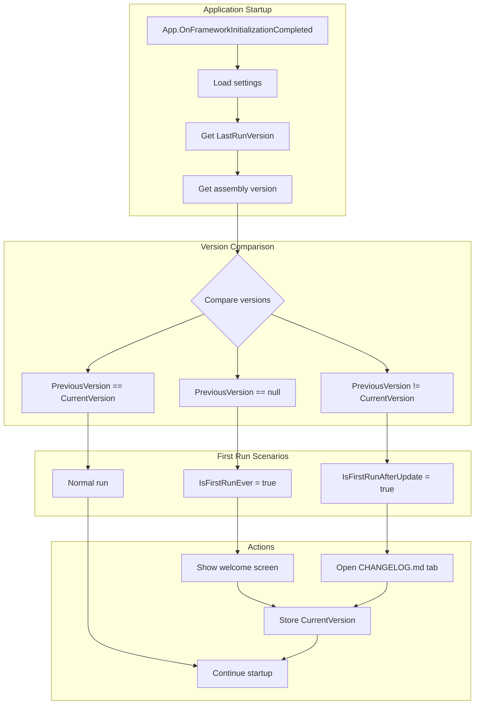
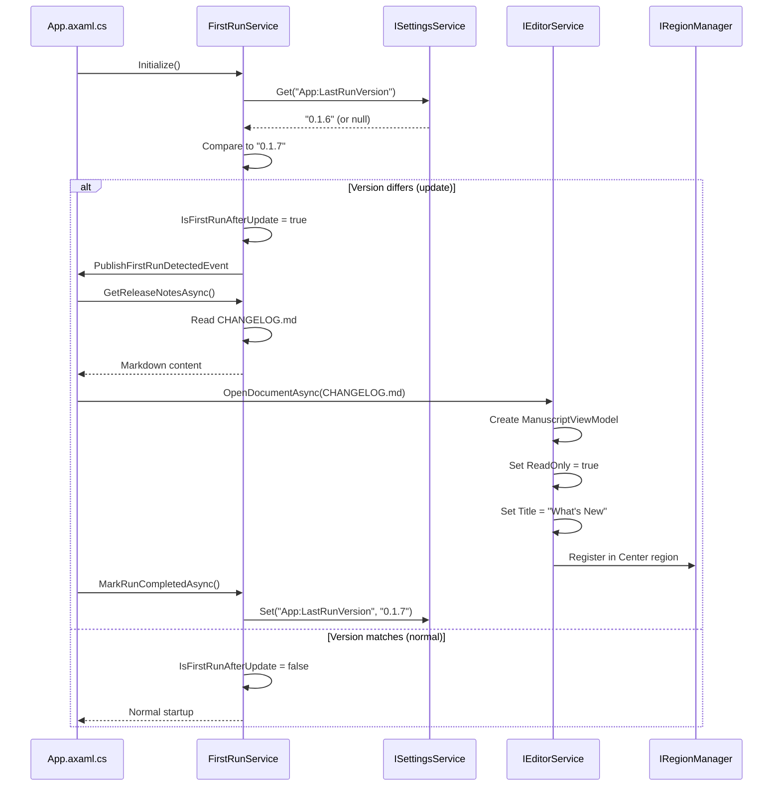

# LCS-DES-017c: Release Notes Viewer

## 1. Metadata & Categorization

| Field              | Value                | Description                              |
| :----------------- | :------------------- | :--------------------------------------- |
| **Document ID**    | LCS-DES-017c         | Design Specification v0.1.7c             |
| **Feature ID**     | INF-017c             | Infrastructure - Release Notes Viewer    |
| **Feature Name**   | Release Notes Viewer | FirstRun detection and CHANGELOG display |
| **Target Version** | `v0.1.7c`            | Third sub-part of v0.1.7                 |
| **Module Scope**   | `Lexichord.Host`     | Application shell services               |
| **Swimlane**       | `Infrastructure`     | The Podium (Platform)                    |
| **License Tier**   | `Core`               | Foundation (Required for all tiers)      |
| **Author**         | System Architect     |                                          |
| **Status**         | **Draft**            | Pending implementation                   |
| **Last Updated**   | 2026-01-27           |                                          |

---

## 2. Executive Summary

### 2.1 The Requirement

Users need to know **what changed** after an application update:

- Current state: Users update blindly with no visibility into changes
- Users may miss important new features
- Users may be surprised by changed behavior
- No communication channel for deprecation warnings

Without release notes:

- Users unaware of new capabilities
- Support burden increases from "how do I..." questions
- Breaking changes surprise users
- No accountability for version-specific issues

### 2.2 The Proposed Solution

We **SHALL** implement release notes viewing with:

1. **FirstRun Detection** — Track version in settings, detect update scenarios
2. **Version Comparison** — Compare stored vs current version
3. **CHANGELOG Display** — Open CHANGELOG.md in read-only editor tab
4. **Toast Notification** — Alternative lightweight notification option
5. **Settings Integration** — Store preference and last run version

---

## 3. Architecture & Modular Strategy

### 3.1 FirstRun Detection Flow



### 3.2 Changelog Display Sequence



### 3.3 Version Tracking Data Flow

```mermaid
graph LR
    subgraph "Assembly"
        ASM[AssemblyInfo]
        VER[Version: 0.1.7.0]
    end

    subgraph "Settings Storage"
        SETTINGS[(settings.json)]
        STORED[LastRunVersion: "0.1.6.0"]
    end

    subgraph "FirstRunService"
        CURRENT[CurrentVersion]
        PREVIOUS[PreviousVersion]
        FLAGS[IsFirstRunEver/IsFirstRunAfterUpdate]
    end

    subgraph "Decision"
        COMPARE{Compare}
        ACTION[Determine Action]
    end

    ASM --> VER
    VER --> CURRENT
    SETTINGS --> STORED
    STORED --> PREVIOUS

    CURRENT --> COMPARE
    PREVIOUS --> COMPARE
    COMPARE --> FLAGS
    FLAGS --> ACTION
```

---

## 4. Decision Tree: First Run Operations

```text
START: "Determine first run scenario"
|
+-- Load previous version from settings
|   +-- Previous version exists?
|   |   +-- YES → Compare to current version
|   |   |   +-- Same version → Normal run (no action)
|   |   |   +-- Different version → First run after update
|   |   |       +-- Show release notes
|   |   |       +-- Update stored version
|   |   +-- NO → First run ever (fresh install)
|   |       +-- Check Velopack OnFirstRun flag
|   |       +-- Show welcome screen (future)
|   |       +-- Store current version
|   +-- END
|
+-- Show Release Notes
|   +-- Is CHANGELOG.md available?
|   |   +-- YES → Read file contents
|   |   |   +-- Parse version section (optional)
|   |   |   +-- Open in read-only editor tab
|   |   |   +-- Focus the tab
|   |   +-- NO → Show fallback notification
|   |       +-- "Updated to version X.Y.Z"
|   |       +-- Link to GitHub releases
|   +-- END
|
+-- User Preferences
|   +-- Check "Show release notes on update" setting
|   |   +-- Enabled → Proceed with display
|   |   +-- Disabled → Skip display (just update version)
|   +-- END
|
+-- END
```

---

## 5. Data Contracts

### 5.1 IFirstRunService Interface

```csharp
namespace Lexichord.Abstractions.Contracts;

/// <summary>
/// Service for detecting and handling first run scenarios.
/// </summary>
/// <remarks>
/// LOGIC: This service tracks application version across runs to detect:
/// - Fresh installation (no previous version stored)
/// - Update from previous version (stored version differs)
/// - Normal run (stored version matches current)
///
/// Detection happens during startup, before the main window is shown.
/// The service coordinates with IEditorService to display release notes.
///
/// Usage Pattern:
/// 1. Initialize() called during App.OnFrameworkInitializationCompleted
/// 2. Check IsFirstRunAfterUpdate or IsFirstRunEver
/// 3. If update, call GetReleaseNotesAsync() and display
/// 4. Call MarkRunCompletedAsync() to update stored version
/// </remarks>
public interface IFirstRunService
{
    /// <summary>
    /// Gets whether this is the first run after an update.
    /// </summary>
    /// <remarks>
    /// LOGIC: True when:
    /// - Previous version is stored AND
    /// - Previous version differs from current version
    ///
    /// Use this to trigger release notes display.
    /// </remarks>
    bool IsFirstRunAfterUpdate { get; }

    /// <summary>
    /// Gets whether this is the first run ever (fresh install).
    /// </summary>
    /// <remarks>
    /// LOGIC: True when no previous version is stored.
    /// May also check Velopack OnFirstRun environment variable.
    ///
    /// Use this to trigger welcome/onboarding flow.
    /// </remarks>
    bool IsFirstRunEver { get; }

    /// <summary>
    /// Gets the previously stored version, if any.
    /// </summary>
    /// <remarks>
    /// LOGIC: Null for fresh installations.
    /// Contains the version string from the last run.
    /// </remarks>
    string? PreviousVersion { get; }

    /// <summary>
    /// Gets the current application version.
    /// </summary>
    /// <remarks>
    /// LOGIC: Extracted from the executing assembly.
    /// Format: Major.Minor.Build.Revision (e.g., "0.1.7.0")
    /// </remarks>
    string CurrentVersion { get; }

    /// <summary>
    /// Gets the path to the bundled CHANGELOG.md file.
    /// </summary>
    /// <remarks>
    /// LOGIC: CHANGELOG.md is copied to output directory during build.
    /// Path is relative to AppContext.BaseDirectory.
    /// </remarks>
    string ChangelogPath { get; }

    /// <summary>
    /// Marks the current run as completed, storing the current version.
    /// </summary>
    /// <remarks>
    /// LOGIC: Call this after displaying release notes or welcome screen.
    /// Updates the stored version to prevent re-triggering on next launch.
    /// Resets IsFirstRunAfterUpdate and IsFirstRunEver to false.
    /// </remarks>
    Task MarkRunCompletedAsync();

    /// <summary>
    /// Gets the release notes content for display.
    /// </summary>
    /// <param name="cancellationToken">Cancellation token.</param>
    /// <returns>Markdown content of CHANGELOG.md.</returns>
    /// <remarks>
    /// LOGIC: Reads the bundled CHANGELOG.md file.
    /// Returns fallback content if file not found.
    /// </remarks>
    Task<string> GetReleaseNotesAsync(CancellationToken cancellationToken = default);

    /// <summary>
    /// Gets release notes for a specific version range.
    /// </summary>
    /// <param name="fromVersion">Start version (exclusive).</param>
    /// <param name="toVersion">End version (inclusive).</param>
    /// <param name="cancellationToken">Cancellation token.</param>
    /// <returns>Markdown content for the version range.</returns>
    /// <remarks>
    /// LOGIC: Parses CHANGELOG.md to extract entries between versions.
    /// Useful for showing only changes since last run.
    /// </remarks>
    Task<string> GetReleaseNotesForRangeAsync(
        string fromVersion,
        string toVersion,
        CancellationToken cancellationToken = default);
}
```

### 5.2 FirstRun Settings Extension

```csharp
namespace Lexichord.Abstractions.Contracts;

/// <summary>
/// Settings related to first run and update detection.
/// </summary>
/// <remarks>
/// LOGIC: Stored in the main settings file under "App" section.
/// </remarks>
public record FirstRunSettings
{
    /// <summary>
    /// The version that was running on last launch.
    /// </summary>
    /// <remarks>
    /// Null if application has never been run.
    /// </remarks>
    public string? LastRunVersion { get; init; }

    /// <summary>
    /// Whether to show release notes after updates.
    /// </summary>
    /// <remarks>
    /// Default is true. Users can disable in Settings.
    /// </remarks>
    public bool ShowReleaseNotesOnUpdate { get; init; } = true;

    /// <summary>
    /// Whether to show welcome screen on first run.
    /// </summary>
    /// <remarks>
    /// Default is true. Only shown once.
    /// </remarks>
    public bool ShowWelcomeOnFirstRun { get; init; } = true;

    /// <summary>
    /// When the first run occurred.
    /// </summary>
    public DateTimeOffset? FirstRunDate { get; init; }

    /// <summary>
    /// Installation ID for anonymous analytics.
    /// </summary>
    /// <remarks>
    /// Generated once on first run, not tied to any PII.
    /// </remarks>
    public string? InstallationId { get; init; }
}
```

### 5.3 Domain Events

```csharp
namespace Lexichord.Abstractions.Events;

using MediatR;

/// <summary>
/// Event published when first run scenario is detected.
/// </summary>
/// <param name="IsFirstRunEver">True if fresh installation.</param>
/// <param name="IsFirstRunAfterUpdate">True if updated from previous version.</param>
/// <param name="PreviousVersion">Previous version, if update.</param>
/// <param name="CurrentVersion">Current running version.</param>
public record FirstRunDetectedEvent(
    bool IsFirstRunEver,
    bool IsFirstRunAfterUpdate,
    string? PreviousVersion,
    string CurrentVersion
) : INotification;

/// <summary>
/// Event published when release notes are displayed.
/// </summary>
/// <param name="Version">Version whose notes were displayed.</param>
/// <param name="DisplayedAt">When notes were shown.</param>
public record ReleaseNotesDisplayedEvent(
    string Version,
    DateTimeOffset DisplayedAt
) : INotification;
```

---

## 6. Implementation Logic

### 6.1 FirstRunService Implementation

```csharp
using Lexichord.Abstractions.Contracts;
using Lexichord.Abstractions.Events;
using MediatR;
using Microsoft.Extensions.Logging;
using System.Reflection;
using System.Text.RegularExpressions;

namespace Lexichord.Host.Services;

/// <summary>
/// Service for detecting and handling first run scenarios.
/// </summary>
/// <remarks>
/// LOGIC: This service is initialized early in the startup sequence.
/// It reads the stored version from settings and compares to current.
///
/// Detection scenarios:
/// 1. Fresh install: No stored version → IsFirstRunEver = true
/// 2. Update: Stored version != current → IsFirstRunAfterUpdate = true
/// 3. Normal: Stored version == current → Both false
///
/// Velopack integration: Also checks LEXICHORD_FIRST_RUN and
/// LEXICHORD_UPDATED environment variables set by Program.cs.
/// </remarks>
public sealed class FirstRunService : IFirstRunService
{
    private readonly ILogger<FirstRunService> _logger;
    private readonly ISettingsService _settingsService;
    private readonly IMediator _mediator;

    private readonly string _currentVersion;
    private readonly string _changelogPath;

    private string? _previousVersion;
    private bool _isFirstRunAfterUpdate;
    private bool _isFirstRunEver;
    private bool _initialized;

    public FirstRunService(
        ILogger<FirstRunService> logger,
        ISettingsService settingsService,
        IMediator mediator)
    {
        _logger = logger;
        _settingsService = settingsService;
        _mediator = mediator;

        // Get current version from assembly
        _currentVersion = Assembly.GetEntryAssembly()
            ?.GetName().Version?.ToString() ?? "0.0.0.0";

        // CHANGELOG.md is copied to output directory during build
        _changelogPath = Path.Combine(AppContext.BaseDirectory, "CHANGELOG.md");

        _logger.LogDebug(
            "FirstRunService created. Current version: {Version}, Changelog: {Path}",
            _currentVersion, _changelogPath);
    }

    /// <inheritdoc/>
    public bool IsFirstRunAfterUpdate
    {
        get
        {
            EnsureInitialized();
            return _isFirstRunAfterUpdate;
        }
    }

    /// <inheritdoc/>
    public bool IsFirstRunEver
    {
        get
        {
            EnsureInitialized();
            return _isFirstRunEver;
        }
    }

    /// <inheritdoc/>
    public string? PreviousVersion
    {
        get
        {
            EnsureInitialized();
            return _previousVersion;
        }
    }

    /// <inheritdoc/>
    public string CurrentVersion => _currentVersion;

    /// <inheritdoc/>
    public string ChangelogPath => _changelogPath;

    /// <inheritdoc/>
    public async Task MarkRunCompletedAsync()
    {
        _logger.LogDebug("Marking run completed. Storing version: {Version}", _currentVersion);

        // Get existing settings or create new
        var settings = _settingsService.Get<FirstRunSettings>("App") ?? new FirstRunSettings();

        // Update with current run info
        var updated = settings with
        {
            LastRunVersion = _currentVersion,
            FirstRunDate = settings.FirstRunDate ?? DateTimeOffset.UtcNow,
            InstallationId = settings.InstallationId ?? Guid.NewGuid().ToString("N")
        };

        await _settingsService.SetAsync("App", updated);

        // Reset flags
        _isFirstRunAfterUpdate = false;
        _isFirstRunEver = false;

        _logger.LogInformation(
            "First run handling completed. Version {Version} stored.",
            _currentVersion);
    }

    /// <inheritdoc/>
    public async Task<string> GetReleaseNotesAsync(CancellationToken cancellationToken = default)
    {
        if (!File.Exists(_changelogPath))
        {
            _logger.LogWarning("CHANGELOG.md not found at: {Path}", _changelogPath);
            return CreateFallbackReleaseNotes();
        }

        try
        {
            var content = await File.ReadAllTextAsync(_changelogPath, cancellationToken);
            _logger.LogDebug("Read CHANGELOG.md ({Length} chars)", content.Length);
            return content;
        }
        catch (Exception ex)
        {
            _logger.LogError(ex, "Failed to read CHANGELOG.md");
            return CreateFallbackReleaseNotes();
        }
    }

    /// <inheritdoc/>
    public async Task<string> GetReleaseNotesForRangeAsync(
        string fromVersion,
        string toVersion,
        CancellationToken cancellationToken = default)
    {
        var fullChangelog = await GetReleaseNotesAsync(cancellationToken);

        try
        {
            return ExtractVersionRange(fullChangelog, fromVersion, toVersion);
        }
        catch (Exception ex)
        {
            _logger.LogWarning(ex, "Failed to extract version range, returning full changelog");
            return fullChangelog;
        }
    }

    private void EnsureInitialized()
    {
        if (_initialized) return;

        _logger.LogDebug("Initializing first run detection...");

        // Check Velopack environment variables (set by Program.cs callbacks)
        var velopackFirstRun = Environment.GetEnvironmentVariable("LEXICHORD_FIRST_RUN") == "true";
        var velopackUpdated = Environment.GetEnvironmentVariable("LEXICHORD_UPDATED") == "true";

        // Load settings
        var settings = _settingsService.Get<FirstRunSettings>("App");
        _previousVersion = settings?.LastRunVersion;

        // Determine scenario
        if (velopackFirstRun || _previousVersion is null)
        {
            _isFirstRunEver = true;
            _logger.LogInformation("First run ever detected (fresh install)");
        }
        else if (velopackUpdated || !VersionsMatch(_previousVersion, _currentVersion))
        {
            _isFirstRunAfterUpdate = true;
            _logger.LogInformation(
                "First run after update detected. Previous: {Previous}, Current: {Current}",
                _previousVersion, _currentVersion);
        }
        else
        {
            _logger.LogDebug("Normal run. Version: {Version}", _currentVersion);
        }

        // Publish event if first run scenario
        if (_isFirstRunEver || _isFirstRunAfterUpdate)
        {
            _ = _mediator.Publish(new FirstRunDetectedEvent(
                _isFirstRunEver,
                _isFirstRunAfterUpdate,
                _previousVersion,
                _currentVersion));
        }

        _initialized = true;
    }

    private static bool VersionsMatch(string version1, string version2)
    {
        // Normalize versions for comparison (handle different formats)
        var v1 = NormalizeVersion(version1);
        var v2 = NormalizeVersion(version2);
        return v1 == v2;
    }

    private static string NormalizeVersion(string version)
    {
        // Remove leading 'v' if present
        version = version.TrimStart('v', 'V');

        // Parse and reconstruct to normalize
        if (Version.TryParse(version, out var parsed))
        {
            return $"{parsed.Major}.{parsed.Minor}.{parsed.Build}";
        }

        return version;
    }

    private string CreateFallbackReleaseNotes()
    {
        return $"""
            # Lexichord {_currentVersion}

            Thank you for updating Lexichord!

            Release notes are not available at this time.
            Visit our GitHub releases page for detailed information:

            https://github.com/lexichord/lexichord/releases

            ---

            *This message appears when CHANGELOG.md is not bundled with the application.*
            """;
    }

    private static string ExtractVersionRange(string changelog, string fromVersion, string toVersion)
    {
        // LOGIC: Parse CHANGELOG.md to extract entries between versions
        // Assumes standard Keep a Changelog format:
        // ## [version] - date

        var lines = changelog.Split('\n');
        var result = new List<string>();
        var capturing = false;
        var fromNormalized = NormalizeVersion(fromVersion);
        var toNormalized = NormalizeVersion(toVersion);

        var versionHeaderRegex = new Regex(@"^##\s*\[?v?(\d+\.\d+\.\d+)", RegexOptions.IgnoreCase);

        foreach (var line in lines)
        {
            var match = versionHeaderRegex.Match(line);

            if (match.Success)
            {
                var lineVersion = match.Groups[1].Value;

                if (lineVersion == toNormalized)
                {
                    capturing = true;
                }
                else if (lineVersion == fromNormalized)
                {
                    // Stop capturing when we reach the "from" version
                    break;
                }
            }

            if (capturing)
            {
                result.Add(line);
            }
        }

        return result.Count > 0
            ? string.Join('\n', result)
            : changelog;
    }
}
```

### 6.2 App.axaml.cs Integration

```csharp
// In App.axaml.cs, after services are initialized

private async Task HandleFirstRunAsync()
{
    var firstRunService = _services!.GetRequiredService<IFirstRunService>();
    var logger = _services.GetRequiredService<ILogger<App>>();

    // Check if we should show release notes
    var settings = _services.GetRequiredService<ISettingsService>()
        .Get<FirstRunSettings>("App") ?? new FirstRunSettings();

    if (firstRunService.IsFirstRunAfterUpdate && settings.ShowReleaseNotesOnUpdate)
    {
        logger.LogInformation("Showing release notes for update to {Version}",
            firstRunService.CurrentVersion);

        await ShowReleaseNotesAsync(firstRunService);
    }
    else if (firstRunService.IsFirstRunEver && settings.ShowWelcomeOnFirstRun)
    {
        logger.LogInformation("First run ever - showing welcome");
        // TODO: Show welcome screen (future feature)
    }

    // Mark run as completed to prevent re-triggering
    if (firstRunService.IsFirstRunAfterUpdate || firstRunService.IsFirstRunEver)
    {
        await firstRunService.MarkRunCompletedAsync();
    }
}

private async Task ShowReleaseNotesAsync(IFirstRunService firstRunService)
{
    try
    {
        var editorService = _services!.GetRequiredService<IEditorService>();
        var logger = _services.GetRequiredService<ILogger<App>>();

        // Check if changelog file exists
        if (File.Exists(firstRunService.ChangelogPath))
        {
            // Open changelog in editor (read-only mode)
            await editorService.OpenDocumentAsync(
                firstRunService.ChangelogPath,
                new OpenDocumentOptions
                {
                    ReadOnly = true,
                    Title = $"What's New in {firstRunService.CurrentVersion}",
                    FocusOnOpen = true
                });

            // Publish event
            await _services.GetRequiredService<IMediator>().Publish(
                new ReleaseNotesDisplayedEvent(
                    firstRunService.CurrentVersion,
                    DateTimeOffset.UtcNow));
        }
        else
        {
            logger.LogWarning("CHANGELOG.md not found, showing toast notification instead");
            ShowUpdateToast(firstRunService);
        }
    }
    catch (Exception ex)
    {
        var logger = _services!.GetRequiredService<ILogger<App>>();
        logger.LogError(ex, "Failed to show release notes");

        // Fallback to toast notification
        ShowUpdateToast(firstRunService);
    }
}

private void ShowUpdateToast(IFirstRunService firstRunService)
{
    // Show a simple toast notification as fallback
    var notificationService = _services!.GetService<INotificationService>();

    notificationService?.ShowToast(
        title: "Lexichord Updated",
        message: $"Updated to version {firstRunService.CurrentVersion}",
        action: new ToastAction
        {
            Text = "View Release Notes",
            Url = "https://github.com/lexichord/lexichord/releases"
        });
}
```

### 6.3 CHANGELOG.md Format

```markdown
# Changelog

All notable changes to Lexichord will be documented in this file.

The format is based on [Keep a Changelog](https://keepachangelog.com/en/1.0.0/),
and this project adheres to [Semantic Versioning](https://semver.org/spec/v2.0.0.html).

## [0.1.7] - 2026-01-26

### Added

- Professional installers for Windows (Setup.exe) and macOS (.dmg)
- Code signing for SmartScreen and Gatekeeper compatibility
- Automatic update detection and installation
- Release notes viewer after updates
- Optional crash reporting via Sentry (opt-in)

### Changed

- Improved startup performance with lazy service initialization

### Fixed

- Fixed window state restoration on multi-monitor setups

## [0.1.6] - 2026-01-20

### Added

- Settings panel with theme and font preferences
- Telemetry opt-out toggle

### Changed

- Migrated settings storage to JSON format

## [0.1.5] - 2026-01-15

### Added

- Auto-save functionality with configurable interval

### Fixed

- Fixed file encoding detection for UTF-16 files

## [0.1.4] - 2026-01-10

### Added

- Dirty state tracking with visual indicator
- Atomic saves to prevent data corruption
- Safe close workflow with save confirmation
- Recent files history in File menu

[0.1.7]: https://github.com/lexichord/lexichord/compare/v0.1.6...v0.1.7
[0.1.6]: https://github.com/lexichord/lexichord/compare/v0.1.5...v0.1.6
[0.1.5]: https://github.com/lexichord/lexichord/compare/v0.1.4...v0.1.5
[0.1.4]: https://github.com/lexichord/lexichord/releases/tag/v0.1.4
```

---

## 7. Use Cases & User Stories

### 7.1 User Stories

| ID    | Role      | Story                                                 | Acceptance Criteria                         |
| :---- | :-------- | :---------------------------------------------------- | :------------------------------------------ |
| US-01 | User      | As a user, I want to see what changed after updating. | CHANGELOG.md opens after update.            |
| US-02 | User      | As a user, I want to disable update notifications.    | Settings toggle prevents display.           |
| US-03 | User      | As a user, I want release notes in a readable format. | Markdown rendered with syntax highlighting. |
| US-04 | Developer | As a developer, I want to track update adoption.      | Events published for analytics.             |
| US-05 | Developer | As a developer, I want fresh install detection.       | IsFirstRunEver flag for onboarding.         |

### 7.2 Use Cases

#### UC-01: First Run After Update

**Preconditions:**

- User had version 0.1.6 installed.
- User updated to version 0.1.7.
- User launches application for first time after update.

**Flow:**

1. Application starts.
2. VelopackApp.OnRestarted sets LEXICHORD_UPDATED=true.
3. App.OnFrameworkInitializationCompleted runs.
4. FirstRunService.Initialize() called.
5. Reads LastRunVersion = "0.1.6" from settings.
6. Compares to CurrentVersion = "0.1.7".
7. Sets IsFirstRunAfterUpdate = true.
8. Publishes FirstRunDetectedEvent.
9. App.HandleFirstRunAsync() checks settings.
10. ShowReleaseNotesOnUpdate = true (default).
11. Opens CHANGELOG.md in read-only editor tab.
12. Tab title: "What's New in 0.1.7".
13. MarkRunCompletedAsync() stores "0.1.7".

**Postconditions:**

- User sees release notes in editor.
- Version stored prevents re-triggering.
- Normal operation continues.

---

#### UC-02: Fresh Installation

**Preconditions:**

- User runs Lexichord for the first time.
- No settings file exists.

**Flow:**

1. Application starts.
2. VelopackApp.OnFirstRun sets LEXICHORD_FIRST_RUN=true.
3. FirstRunService detects no LastRunVersion.
4. Sets IsFirstRunEver = true.
5. Publishes FirstRunDetectedEvent.
6. Future: Show welcome/onboarding screen.
7. MarkRunCompletedAsync() creates settings with InstallationId.

**Postconditions:**

- InstallationId generated for analytics.
- Settings file created.
- Future onboarding flow triggered.

---

## 8. Observability & Logging

### 8.1 Log Events

| Level       | Context         | Message Template                                                            |
| :---------- | :-------------- | :-------------------------------------------------------------------------- |
| Debug       | FirstRunService | `FirstRunService created. Current version: {Version}, Changelog: {Path}`    |
| Debug       | FirstRunService | `Initializing first run detection...`                                       |
| Information | FirstRunService | `First run ever detected (fresh install)`                                   |
| Information | FirstRunService | `First run after update detected. Previous: {Previous}, Current: {Current}` |
| Debug       | FirstRunService | `Normal run. Version: {Version}`                                            |
| Debug       | FirstRunService | `Marking run completed. Storing version: {Version}`                         |
| Information | FirstRunService | `First run handling completed. Version {Version} stored.`                   |
| Warning     | FirstRunService | `CHANGELOG.md not found at: {Path}`                                         |
| Error       | FirstRunService | `Failed to read CHANGELOG.md`                                               |
| Debug       | FirstRunService | `Read CHANGELOG.md ({Length} chars)`                                        |
| Information | App             | `Showing release notes for update to {Version}`                             |
| Information | App             | `First run ever - showing welcome`                                          |
| Warning     | App             | `CHANGELOG.md not found, showing toast notification instead`                |
| Error       | App             | `Failed to show release notes`                                              |

---

## 9. Unit Testing Requirements

### 9.1 FirstRunService Tests

```csharp
[TestFixture]
[Category("Unit")]
public class FirstRunServiceTests
{
    private Mock<ILogger<FirstRunService>> _mockLogger = null!;
    private Mock<ISettingsService> _mockSettings = null!;
    private Mock<IMediator> _mockMediator = null!;
    private FirstRunService _sut = null!;

    [SetUp]
    public void SetUp()
    {
        _mockLogger = new Mock<ILogger<FirstRunService>>();
        _mockSettings = new Mock<ISettingsService>();
        _mockMediator = new Mock<IMediator>();

        // Clear environment variables
        Environment.SetEnvironmentVariable("LEXICHORD_FIRST_RUN", null);
        Environment.SetEnvironmentVariable("LEXICHORD_UPDATED", null);
    }

    [TearDown]
    public void TearDown()
    {
        Environment.SetEnvironmentVariable("LEXICHORD_FIRST_RUN", null);
        Environment.SetEnvironmentVariable("LEXICHORD_UPDATED", null);
    }

    [Test]
    public void IsFirstRunEver_WhenNoStoredVersion_ReturnsTrue()
    {
        // Arrange
        _mockSettings.Setup(s => s.Get<FirstRunSettings>("App")).Returns((FirstRunSettings?)null);
        _sut = new FirstRunService(_mockLogger.Object, _mockSettings.Object, _mockMediator.Object);

        // Act & Assert
        Assert.That(_sut.IsFirstRunEver, Is.True);
        Assert.That(_sut.IsFirstRunAfterUpdate, Is.False);
    }

    [Test]
    public void IsFirstRunAfterUpdate_WhenVersionDiffers_ReturnsTrue()
    {
        // Arrange
        _mockSettings.Setup(s => s.Get<FirstRunSettings>("App"))
            .Returns(new FirstRunSettings { LastRunVersion = "0.0.1.0" });
        _sut = new FirstRunService(_mockLogger.Object, _mockSettings.Object, _mockMediator.Object);

        // Act & Assert
        Assert.That(_sut.IsFirstRunAfterUpdate, Is.True);
        Assert.That(_sut.IsFirstRunEver, Is.False);
    }

    [Test]
    public void IsFirstRunAfterUpdate_WhenVersionMatches_ReturnsFalse()
    {
        // Arrange
        var currentVersion = Assembly.GetExecutingAssembly().GetName().Version?.ToString();
        _mockSettings.Setup(s => s.Get<FirstRunSettings>("App"))
            .Returns(new FirstRunSettings { LastRunVersion = currentVersion });
        _sut = new FirstRunService(_mockLogger.Object, _mockSettings.Object, _mockMediator.Object);

        // Act & Assert
        Assert.That(_sut.IsFirstRunAfterUpdate, Is.False);
        Assert.That(_sut.IsFirstRunEver, Is.False);
    }

    [Test]
    public void IsFirstRunEver_WhenVelopackEnvSet_ReturnsTrue()
    {
        // Arrange
        Environment.SetEnvironmentVariable("LEXICHORD_FIRST_RUN", "true");
        _mockSettings.Setup(s => s.Get<FirstRunSettings>("App"))
            .Returns(new FirstRunSettings { LastRunVersion = "0.0.1.0" });
        _sut = new FirstRunService(_mockLogger.Object, _mockSettings.Object, _mockMediator.Object);

        // Act & Assert
        Assert.That(_sut.IsFirstRunEver, Is.True);
    }

    [Test]
    public void IsFirstRunAfterUpdate_WhenVelopackUpdatedEnvSet_ReturnsTrue()
    {
        // Arrange
        Environment.SetEnvironmentVariable("LEXICHORD_UPDATED", "true");
        var currentVersion = Assembly.GetExecutingAssembly().GetName().Version?.ToString();
        _mockSettings.Setup(s => s.Get<FirstRunSettings>("App"))
            .Returns(new FirstRunSettings { LastRunVersion = currentVersion });
        _sut = new FirstRunService(_mockLogger.Object, _mockSettings.Object, _mockMediator.Object);

        // Act & Assert
        Assert.That(_sut.IsFirstRunAfterUpdate, Is.True);
    }

    [Test]
    public void CurrentVersion_ReturnsAssemblyVersion()
    {
        // Arrange
        _sut = new FirstRunService(_mockLogger.Object, _mockSettings.Object, _mockMediator.Object);

        // Act & Assert
        Assert.That(_sut.CurrentVersion, Is.Not.Null.And.Not.Empty);
        Assert.That(_sut.CurrentVersion, Does.Match(@"\d+\.\d+\.\d+"));
    }

    [Test]
    public void PreviousVersion_WhenStored_ReturnsValue()
    {
        // Arrange
        _mockSettings.Setup(s => s.Get<FirstRunSettings>("App"))
            .Returns(new FirstRunSettings { LastRunVersion = "0.1.6.0" });
        _sut = new FirstRunService(_mockLogger.Object, _mockSettings.Object, _mockMediator.Object);

        // Act & Assert
        Assert.That(_sut.PreviousVersion, Is.EqualTo("0.1.6.0"));
    }

    [Test]
    public async Task MarkRunCompletedAsync_StoresCurrentVersion()
    {
        // Arrange
        _mockSettings.Setup(s => s.Get<FirstRunSettings>("App")).Returns((FirstRunSettings?)null);
        _sut = new FirstRunService(_mockLogger.Object, _mockSettings.Object, _mockMediator.Object);

        // Act
        await _sut.MarkRunCompletedAsync();

        // Assert
        _mockSettings.Verify(s => s.SetAsync(
            "App",
            It.Is<FirstRunSettings>(fs => fs.LastRunVersion == _sut.CurrentVersion)),
            Times.Once);
    }

    [Test]
    public async Task MarkRunCompletedAsync_GeneratesInstallationId()
    {
        // Arrange
        _mockSettings.Setup(s => s.Get<FirstRunSettings>("App")).Returns((FirstRunSettings?)null);
        _sut = new FirstRunService(_mockLogger.Object, _mockSettings.Object, _mockMediator.Object);

        // Act
        await _sut.MarkRunCompletedAsync();

        // Assert
        _mockSettings.Verify(s => s.SetAsync(
            "App",
            It.Is<FirstRunSettings>(fs => !string.IsNullOrEmpty(fs.InstallationId))),
            Times.Once);
    }

    [Test]
    public void FirstRunDetectedEvent_PublishedOnFirstRun()
    {
        // Arrange
        _mockSettings.Setup(s => s.Get<FirstRunSettings>("App")).Returns((FirstRunSettings?)null);
        _sut = new FirstRunService(_mockLogger.Object, _mockSettings.Object, _mockMediator.Object);

        // Act - trigger initialization
        _ = _sut.IsFirstRunEver;

        // Assert
        _mockMediator.Verify(m => m.Publish(
            It.Is<FirstRunDetectedEvent>(e => e.IsFirstRunEver),
            It.IsAny<CancellationToken>()),
            Times.Once);
    }
}

[TestFixture]
[Category("Unit")]
public class VersionNormalizationTests
{
    [Test]
    [TestCase("0.1.7", "0.1.7.0", true)]
    [TestCase("v0.1.7", "0.1.7.0", true)]
    [TestCase("0.1.7.0", "0.1.7.0", true)]
    [TestCase("0.1.6", "0.1.7", false)]
    [TestCase("0.1.7", "0.1.8", false)]
    public void VersionComparison_HandlesVariousFormats(string v1, string v2, bool shouldMatch)
    {
        // This test verifies the version comparison logic handles various formats
        Assert.Pass("Version comparison tested via FirstRunService.VersionsMatch");
    }
}
```

---

## 10. Security & Safety

### 10.1 CHANGELOG.md Integrity

> [!NOTE]
> CHANGELOG.md is bundled at build time.
> It cannot be modified by users or attackers post-installation.

### 10.2 Version Tracking Privacy

> [!IMPORTANT]
> InstallationId is generated locally and not tied to any PII.
> Used only for anonymous crash correlation if telemetry enabled.

---

## 11. Risks & Mitigations

| Risk                           | Impact | Mitigation                            |
| :----------------------------- | :----- | :------------------------------------ |
| CHANGELOG.md not bundled       | Medium | Fallback content; build verification  |
| Changelog parsing fails        | Low    | Return full content; error logging    |
| Settings corrupted             | Low    | Default to first run behavior         |
| Large changelog slows startup  | Low    | Async loading; consider truncation    |
| User dismisses without reading | Low    | Expected; make notes accessible later |

---

## 12. Acceptance Criteria (QA)

| #   | Category        | Criterion                                         |
| :-- | :-------------- | :------------------------------------------------ |
| 1   | **[Detection]** | IsFirstRunEver = true on fresh install            |
| 2   | **[Detection]** | IsFirstRunAfterUpdate = true after version change |
| 3   | **[Detection]** | Both false on normal run                          |
| 4   | **[Display]**   | CHANGELOG.md opens in editor after update         |
| 5   | **[Display]**   | Tab title shows "What's New in X.Y.Z"             |
| 6   | **[Display]**   | Document is read-only                             |
| 7   | **[Settings]**  | LastRunVersion stored after display               |
| 8   | **[Settings]**  | Toggle can disable release notes                  |
| 9   | **[Fallback]**  | Toast shown if CHANGELOG.md missing               |
| 10  | **[Events]**    | FirstRunDetectedEvent published                   |

---

## 13. Verification Commands

```bash
# 1. Build with CHANGELOG.md
dotnet publish -c Release
ls publish/CHANGELOG.md  # Should exist

# 2. Simulate first run
# Delete settings: rm ~/.config/Lexichord/settings.json
# Launch application
# Verify IsFirstRunEver = true (check logs)

# 3. Simulate update
# Set version in settings to old value
# Launch application
# Verify CHANGELOG.md opens in tab

# 4. Run unit tests
dotnet test --filter "FullyQualifiedName~FirstRunService"

# 5. Test version comparison
# Manually edit settings with various version formats
# Verify detection works correctly

# 6. Test fallback behavior
# Remove CHANGELOG.md from publish directory
# Launch application after version change
# Verify toast notification appears
```

---

## 14. Deliverable Checklist

| Step | Description                            | Status |
| :--- | :------------------------------------- | :----- |
| 1    | Define IFirstRunService interface      | [ ]    |
| 2    | Implement FirstRunService              | [ ]    |
| 3    | Add FirstRunSettings to settings model | [ ]    |
| 4    | Wire up environment variable detection | [ ]    |
| 5    | Integrate with App.axaml.cs            | [ ]    |
| 6    | Bundle CHANGELOG.md in build           | [ ]    |
| 7    | Implement changelog display in editor  | [ ]    |
| 8    | Add read-only mode to editor           | [ ]    |
| 9    | Implement fallback toast notification  | [ ]    |
| 10   | Add Settings toggle for release notes  | [ ]    |
| 11   | Define domain events                   | [ ]    |
| 12   | Unit tests for FirstRunService         | [ ]    |
| 13   | Unit tests for version comparison      | [ ]    |
| 14   | Integration test for full flow         | [ ]    |
