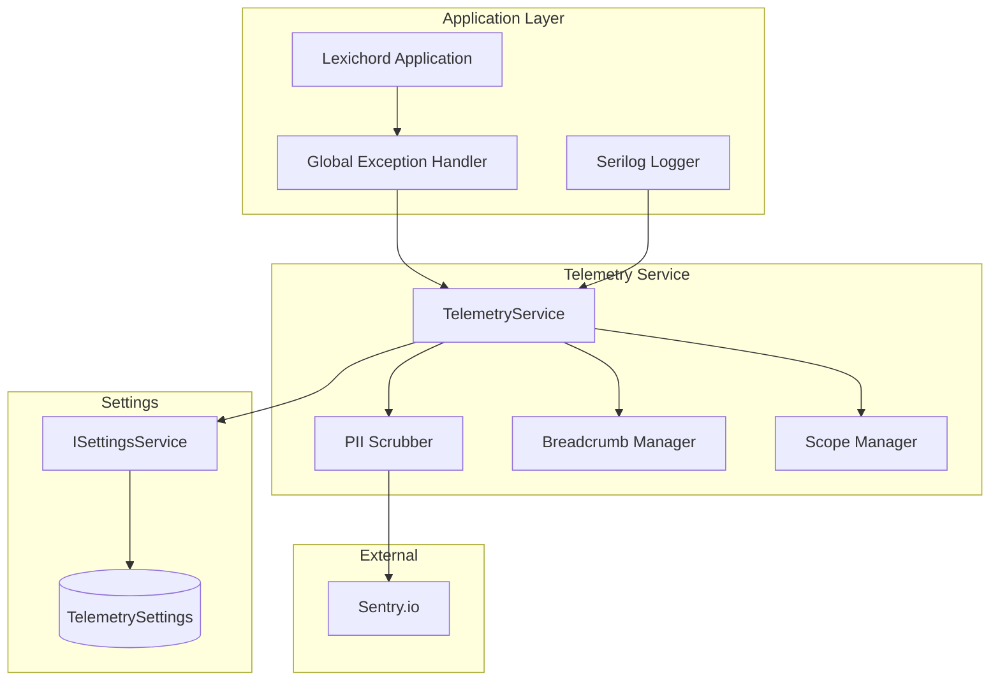
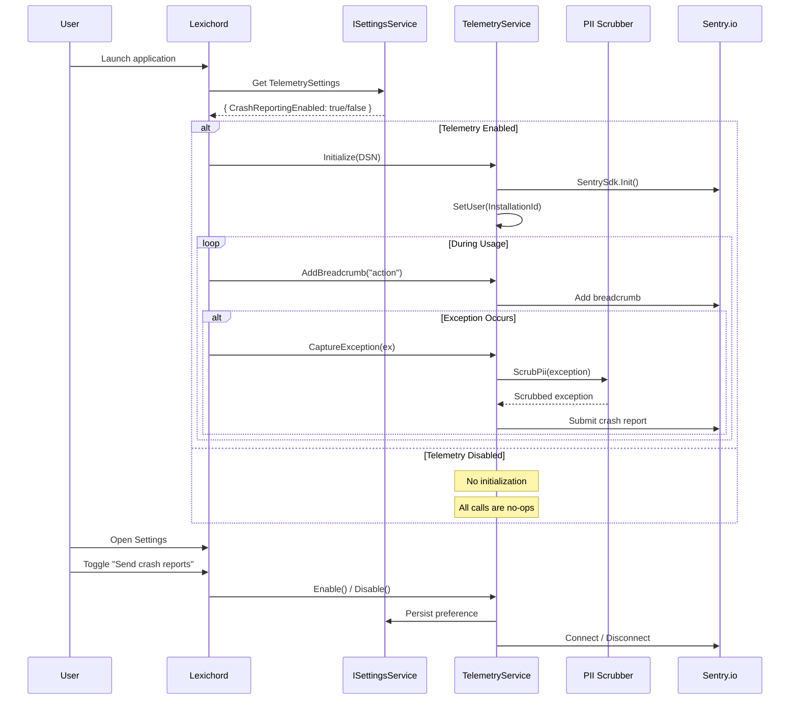

# LCS-DES-017d: Telemetry Hooks

## 1. Metadata & Categorization

| Field              | Value                                       | Description                         |
| :----------------- | :------------------------------------------ | :---------------------------------- |
| **Document ID**    | LCS-DES-017d                                | Design Specification v0.1.7d        |
| **Feature ID**     | INF-017d                                    | Infrastructure - Telemetry Hooks    |
| **Feature Name**   | Telemetry Hooks                             | Optional crash reporting via Sentry |
| **Target Version** | `v0.1.7d`                                   | Fourth sub-part of v0.1.7           |
| **Module Scope**   | `Lexichord.Host` / `Lexichord.Abstractions` | Application shell and contracts     |
| **Swimlane**       | `Infrastructure`                            | The Podium (Platform)               |
| **License Tier**   | `Core`                                      | Foundation (Required for all tiers) |
| **Author**         | System Architect                            |                                     |
| **Status**         | **Draft**                                   | Pending implementation              |
| **Last Updated**   | 2026-01-27                                  |                                     |

---

## 2. Executive Summary

### 2.1 The Requirement

Production applications need **crash visibility** to identify and fix issues:

- Current state: Crashes in production go undetected
- No insight into what users experience in the field
- Bug reports lack context (steps to reproduce, environment)
- No way to prioritize fixes by impact

Without crash reporting:

- Bugs persist in production unnoticed
- Support relies on user-reported issues only
- No data to drive quality improvements
- Silent failures erode user trust

### 2.2 The Proposed Solution

We **SHALL** implement optional crash reporting with:

1. **ITelemetryService Interface** — Clean abstraction for telemetry operations
2. **Sentry Integration** — Industry-standard crash reporting service
3. **Privacy-First Design** — Opt-in by default, PII scrubbing
4. **Settings Toggle** — User control via Settings panel
5. **Serilog Integration** — Capture crashes through logging pipeline
6. **Breadcrumb Logging** — Context for crash reports

### 2.3 Privacy Principles

> [!IMPORTANT]
> Telemetry is **opt-in by default**. Users must explicitly enable crash reporting.
> No personally identifiable information (PII) is ever collected or transmitted.

---

## 3. Architecture & Modular Strategy

### 3.1 Telemetry Architecture



### 3.2 Telemetry Flow Sequence



### 3.3 PII Scrubbing Flow

```mermaid
graph LR
    subgraph "Input"
        EX[Exception]
        MSG[Message]
        STACK[Stack Trace]
    end

    subgraph "Scrubbing Rules"
        WIN[Windows Paths]
        MAC[macOS/Linux Paths]
        EMAIL[Email Addresses]
        DOC[Document Content]
    end

    subgraph "Output"
        CLEAN[Cleaned Exception]
        SAFE[Safe Message]
        ANON[Anonymized Stack]
    end

    EX --> WIN
    EX --> MAC
    EX --> EMAIL
    EX --> DOC

    WIN --> |"C:\Users\john\..." → "[USER_PATH]\..."| CLEAN
    MAC --> |"/Users/jane/..." → "/[USER_PATH]/..."| CLEAN
    EMAIL --> |"john@example.com" → "[EMAIL]"| SAFE
    DOC --> |File content removed| ANON
```

### 3.4 Settings UI Integration

```mermaid
graph TB
    subgraph "Settings Panel"
        GENERAL[General Settings]
        PRIVACY[Privacy Section]
        TOGGLE[Crash Reporting Toggle]
        DESC[Description Text]
        LINK[Learn More Link]
    end

    subgraph "TelemetryService"
        ENABLE[Enable()]
        DISABLE[Disable()]
        STATUS[IsEnabled]
    end

    subgraph "Persistence"
        SETTINGS[(settings.json)]
    end

    GENERAL --> PRIVACY
    PRIVACY --> TOGGLE
    TOGGLE --> DESC
    DESC --> LINK

    TOGGLE -- "ON" --> ENABLE
    TOGGLE -- "OFF" --> DISABLE
    ENABLE --> SETTINGS
    DISABLE --> SETTINGS
    STATUS --> TOGGLE
```

---

## 4. Decision Tree: Telemetry Operations

```text
START: "Determine telemetry action"
|
+-- Application Startup
|   +-- Load TelemetrySettings
|   |   +-- CrashReportingEnabled == true?
|   |   |   +-- YES → Initialize Sentry SDK
|   |   |   |   +-- Configure DSN
|   |   |   |   +-- Set release version
|   |   |   |   +-- Enable breadcrumbs
|   |   |   |   +-- Set InstallationId as user
|   |   |   +-- NO → Skip initialization (no-op mode)
|   +-- END
|
+-- Capture Exception
|   +-- Is telemetry enabled?
|   |   +-- NO → Log locally only, return
|   |   +-- YES → Continue
|   +-- Scrub PII from exception
|   |   +-- Remove user paths (Windows/macOS/Linux)
|   |   +-- Remove email addresses
|   |   +-- Preserve stack trace structure
|   +-- Add tags if provided
|   +-- Include recent breadcrumbs
|   +-- Submit to Sentry
|   +-- END
|
+-- Add Breadcrumb
|   +-- Is telemetry enabled?
|   |   +-- NO → Return immediately
|   |   +-- YES → Add to Sentry breadcrumb queue
|   |       +-- Limit to MaxBreadcrumbs (100)
|   +-- END
|
+-- User Enables Telemetry
|   +-- Is Sentry DSN configured?
|   |   +-- NO → Log warning, return
|   |   +-- YES → Initialize Sentry SDK
|   +-- Persist preference to settings
|   +-- Publish TelemetryPreferenceChangedEvent
|   +-- END
|
+-- User Disables Telemetry
|   +-- Flush pending events (with timeout)
|   +-- Dispose Sentry client
|   +-- Persist preference to settings
|   +-- Publish TelemetryPreferenceChangedEvent
|   +-- END
|
+-- Application Shutdown
|   +-- Is telemetry enabled?
|   |   +-- NO → No action
|   |   +-- YES → Flush with timeout (2s)
|   |       +-- Dispose Sentry client
|   +-- END
|
+-- END
```

---

## 5. Data Contracts

### 5.1 ITelemetryService Interface

````csharp
namespace Lexichord.Abstractions.Contracts;

/// <summary>
/// Service for optional crash reporting and telemetry.
/// </summary>
/// <remarks>
/// LOGIC: This service wraps Sentry SDK for crash reporting.
/// Key design principles:
///
/// 1. PRIVACY FIRST
///    - Opt-in by default (users must explicitly enable)
///    - No PII collected (email, file paths, document content)
///    - Clear disclosure of what is collected
///    - Immediate effect on preference change
///
/// 2. NO-OP WHEN DISABLED
///    - All public methods are safe to call when disabled
///    - No exceptions thrown, no logging overhead
///    - Seamless integration without feature flags
///
/// 3. GRACEFUL DEGRADATION
///    - Works without Sentry DSN (just logs locally)
///    - Network failures don't affect application
///    - Missing configuration is handled gracefully
///
/// Usage Pattern:
/// ```csharp
/// // During app startup (handled by DI)
/// services.AddSingleton&lt;ITelemetryService, TelemetryService&gt;();
///
/// // Capture exception
/// try { ... }
/// catch (Exception ex)
/// {
///     telemetry.CaptureException(ex, new Dictionary&lt;string, string&gt;
///     {
///         ["operation"] = "SaveDocument"
///     });
///     throw; // Re-throw after capture
/// }
///
/// // Add context breadcrumbs
/// telemetry.AddBreadcrumb("User opened file", "navigation");
/// ```
/// </remarks>
public interface ITelemetryService : IDisposable
{
    /// <summary>
    /// Gets whether telemetry is currently enabled.
    /// </summary>
    /// <remarks>
    /// LOGIC: Returns true only when:
    /// - User has enabled crash reporting in settings
    /// - Sentry DSN is configured
    /// - Sentry SDK is initialized
    /// </remarks>
    bool IsEnabled { get; }

    /// <summary>
    /// Enables telemetry and initializes the Sentry client.
    /// </summary>
    /// <remarks>
    /// LOGIC: This method:
    /// 1. Checks if Sentry DSN is configured
    /// 2. Initializes Sentry SDK with privacy-focused options
    /// 3. Persists preference to settings
    /// 4. Publishes TelemetryPreferenceChangedEvent
    ///
    /// Takes effect immediately without restart.
    /// Safe to call multiple times (no-op if already enabled).
    /// </remarks>
    void Enable();

    /// <summary>
    /// Disables telemetry and disposes the Sentry client.
    /// </summary>
    /// <remarks>
    /// LOGIC: This method:
    /// 1. Flushes any pending events (2s timeout)
    /// 2. Disposes Sentry client
    /// 3. Persists preference to settings
    /// 4. Publishes TelemetryPreferenceChangedEvent
    ///
    /// Takes effect immediately without restart.
    /// Safe to call multiple times (no-op if already disabled).
    /// </remarks>
    void Disable();

    /// <summary>
    /// Captures an exception for reporting.
    /// </summary>
    /// <param name="exception">The exception to capture.</param>
    /// <param name="tags">Optional tags for categorization.</param>
    /// <remarks>
    /// LOGIC: This method:
    /// 1. Returns immediately if telemetry disabled (no-op)
    /// 2. Scrubs PII from exception message and data
    /// 3. Adds provided tags to the event
    /// 4. Includes recent breadcrumbs for context
    /// 5. Submits to Sentry asynchronously
    ///
    /// PII Scrubbing:
    /// - Windows paths: C:\Users\username\... → [USER_PATH]\...
    /// - macOS paths: /Users/username/... → /[USER_PATH]/...
    /// - Linux paths: /home/username/... → /[USER_PATH]/...
    /// - Email addresses: user@domain.com → [EMAIL]
    ///
    /// Safe to call from any thread.
    /// </remarks>
    void CaptureException(Exception exception, IDictionary<string, string>? tags = null);

    /// <summary>
    /// Captures a message for reporting.
    /// </summary>
    /// <param name="message">The message to capture.</param>
    /// <param name="level">The severity level.</param>
    /// <remarks>
    /// LOGIC: Messages are useful for tracking non-exception events
    /// like important state changes or unusual conditions.
    /// No-op if telemetry is disabled.
    /// </remarks>
    void CaptureMessage(string message, TelemetryLevel level = TelemetryLevel.Info);

    /// <summary>
    /// Adds a breadcrumb for context in crash reports.
    /// </summary>
    /// <param name="message">Breadcrumb message.</param>
    /// <param name="category">Optional category (e.g., "navigation", "action", "ui").</param>
    /// <remarks>
    /// LOGIC: Breadcrumbs provide context leading up to a crash.
    /// They help developers understand what the user was doing.
    ///
    /// Categories:
    /// - "navigation" - File open, tab switch, dialog open
    /// - "action" - Save, export, undo, redo
    /// - "ui" - Button click, menu selection
    /// - "system" - Settings change, update check
    ///
    /// Breadcrumbs are:
    /// - Limited to last MaxBreadcrumbs (100)
    /// - Automatically timestamped
    /// - Included with next exception capture
    ///
    /// No-op if telemetry is disabled.
    /// </remarks>
    void AddBreadcrumb(string message, string? category = null);

    /// <summary>
    /// Begins a scoped operation for performance tracking.
    /// </summary>
    /// <param name="operation">Operation name.</param>
    /// <returns>Disposable scope that ends the operation.</returns>
    /// <remarks>
    /// LOGIC: Use for tracking performance of long-running operations.
    /// Returns no-op disposable if telemetry disabled.
    ///
    /// Usage:
    /// ```csharp
    /// using (telemetry.BeginScope("LoadDocument"))
    /// {
    ///     // Operation code
    /// }
    /// ```
    /// </remarks>
    IDisposable BeginScope(string operation);

    /// <summary>
    /// Sets an anonymous user identifier for session correlation.
    /// </summary>
    /// <param name="userId">Anonymous installation ID (not PII).</param>
    /// <remarks>
    /// LOGIC: Uses the InstallationId from settings.
    /// This is a randomly generated GUID, not tied to any personal info.
    /// Enables correlation of crashes from the same installation.
    /// </remarks>
    void SetUser(string userId);

    /// <summary>
    /// Flushes any pending events synchronously.
    /// </summary>
    /// <param name="timeout">Maximum time to wait for flush.</param>
    /// <remarks>
    /// LOGIC: Call during application shutdown to ensure
    /// all captured events are submitted before exit.
    /// No-op if telemetry is disabled.
    /// </remarks>
    void Flush(TimeSpan timeout);
}

/// <summary>
/// Telemetry severity levels.
/// </summary>
/// <remarks>
/// LOGIC: Maps to Sentry severity levels.
/// Use appropriate level for accurate prioritization.
/// </remarks>
public enum TelemetryLevel
{
    /// <summary>Debug-level message (verbose, lowest priority).</summary>
    Debug,

    /// <summary>Informational message (normal operations).</summary>
    Info,

    /// <summary>Warning message (unexpected but handled).</summary>
    Warning,

    /// <summary>Error message (failure requiring attention).</summary>
    Error,

    /// <summary>Fatal/critical message (application cannot continue).</summary>
    Fatal
}
````

### 5.2 TelemetrySettings Data Contract

```csharp
namespace Lexichord.Abstractions.Contracts;

/// <summary>
/// Settings for telemetry and crash reporting.
/// </summary>
/// <remarks>
/// LOGIC: Persisted in settings.json under "Telemetry" section.
/// Privacy-focused defaults ensure opt-in behavior.
/// </remarks>
public record TelemetrySettings
{
    /// <summary>
    /// Gets or sets whether crash reporting is enabled.
    /// </summary>
    /// <remarks>
    /// LOGIC: Default is FALSE (opt-in required).
    /// When true, crashes are reported to Sentry.
    /// </remarks>
    public bool CrashReportingEnabled { get; init; } = false;

    /// <summary>
    /// Gets or sets whether usage analytics are enabled.
    /// </summary>
    /// <remarks>
    /// LOGIC: Default is FALSE. Reserved for future use.
    /// Separate from crash reporting for granular control.
    /// </remarks>
    public bool UsageAnalyticsEnabled { get; init; } = false;

    /// <summary>
    /// Gets or sets when the user made their telemetry choice.
    /// </summary>
    /// <remarks>
    /// LOGIC: Null indicates user has not been prompted yet.
    /// Used to determine if consent dialog should be shown.
    /// </remarks>
    public DateTimeOffset? ConsentDate { get; init; }

    /// <summary>
    /// Gets the anonymized installation ID.
    /// </summary>
    /// <remarks>
    /// LOGIC: Generated once on first run.
    /// A random GUID not tied to any PII.
    /// Used for crash correlation only.
    /// </remarks>
    public string? InstallationId { get; init; }

    /// <summary>
    /// Gets or sets whether the consent prompt has been shown.
    /// </summary>
    /// <remarks>
    /// LOGIC: Prevents repeated prompts.
    /// User can change preference in Settings anytime.
    /// </remarks>
    public bool ConsentPromptShown { get; init; } = false;
}
```

### 5.3 Domain Events

```csharp
namespace Lexichord.Abstractions.Events;

using MediatR;

/// <summary>
/// Event published when telemetry preference changes.
/// </summary>
/// <param name="IsEnabled">New telemetry state.</param>
/// <param name="ChangedAt">When the change occurred.</param>
/// <remarks>
/// LOGIC: Published when user toggles telemetry in Settings.
/// Can be used for analytics or to update UI state.
/// </remarks>
public record TelemetryPreferenceChangedEvent(
    bool IsEnabled,
    DateTimeOffset ChangedAt
) : INotification;

/// <summary>
/// Event published when a crash is captured.
/// </summary>
/// <param name="ExceptionType">Type name of the captured exception.</param>
/// <param name="CapturedAt">When the crash was captured.</param>
/// <remarks>
/// LOGIC: Published after exception is sent to Sentry.
/// Useful for showing local notification to user.
/// Does not contain PII or exception details.
/// </remarks>
public record CrashCapturedEvent(
    string ExceptionType,
    DateTimeOffset CapturedAt
) : INotification;
```

---

## 6. Implementation Logic

### 6.1 TelemetryService Implementation

```csharp
using Lexichord.Abstractions.Contracts;
using Lexichord.Abstractions.Events;
using MediatR;
using Microsoft.Extensions.Configuration;
using Microsoft.Extensions.Logging;
using Sentry;
using System.Text.RegularExpressions;

namespace Lexichord.Host.Services;

/// <summary>
/// Service for optional crash reporting via Sentry.
/// </summary>
/// <remarks>
/// LOGIC: Privacy-focused implementation with:
/// - Opt-in by default (CrashReportingEnabled = false)
/// - PII scrubbing before submission
/// - Immediate effect on preference change
/// - No-op behavior when disabled
///
/// Sentry SDK Configuration:
/// - SendDefaultPii = false (never send PII)
/// - AttachStacktrace = true (for debugging)
/// - MaxBreadcrumbs = 100 (context limit)
/// - AutoSessionTracking = true (crash-free metrics)
/// </remarks>
public sealed class TelemetryService : ITelemetryService
{
    private readonly ILogger<TelemetryService> _logger;
    private readonly ISettingsService _settingsService;
    private readonly IMediator _mediator;
    private readonly string? _sentryDsn;
    private readonly string _releaseVersion;

    private IDisposable? _sentryClient;
    private bool _isEnabled;
    private bool _disposed;

    private const int MaxBreadcrumbs = 100;
    private const int FlushTimeoutSeconds = 2;

    // PII scrubbing patterns
    private static readonly Regex WindowsPathRegex = new(
        @"[A-Za-z]:\\Users\\[^\\]+",
        RegexOptions.Compiled);

    private static readonly Regex UnixPathRegex = new(
        @"/(Users|home)/[^/]+",
        RegexOptions.Compiled);

    private static readonly Regex EmailRegex = new(
        @"[a-zA-Z0-9._%+-]+@[a-zA-Z0-9.-]+\.[a-zA-Z]{2,}",
        RegexOptions.Compiled);

    public TelemetryService(
        ILogger<TelemetryService> logger,
        ISettingsService settingsService,
        IMediator mediator,
        IConfiguration configuration)
    {
        _logger = logger;
        _settingsService = settingsService;
        _mediator = mediator;

        // Get Sentry DSN from configuration (secrets in production)
        _sentryDsn = configuration["Sentry:Dsn"];

        // Get release version for Sentry
        _releaseVersion = typeof(TelemetryService).Assembly
            .GetName().Version?.ToString() ?? "0.0.0";

        // Load persisted preference
        var settings = settingsService.Get<TelemetrySettings>("Telemetry")
            ?? new TelemetrySettings();

        // Initialize if enabled and DSN configured
        if (settings.CrashReportingEnabled && !string.IsNullOrEmpty(_sentryDsn))
        {
            InitializeSentry();

            // Set user from InstallationId
            if (!string.IsNullOrEmpty(settings.InstallationId))
            {
                SetUser(settings.InstallationId);
            }
        }

        _logger.LogDebug(
            "TelemetryService initialized. Enabled: {Enabled}, DSN configured: {HasDsn}",
            _isEnabled,
            !string.IsNullOrEmpty(_sentryDsn));
    }

    /// <inheritdoc/>
    public bool IsEnabled => _isEnabled;

    /// <inheritdoc/>
    public void Enable()
    {
        if (_isEnabled)
        {
            _logger.LogDebug("Telemetry already enabled");
            return;
        }

        if (string.IsNullOrEmpty(_sentryDsn))
        {
            _logger.LogWarning("Cannot enable telemetry: Sentry DSN not configured");
            return;
        }

        InitializeSentry();
        PersistPreference(enabled: true);

        _logger.LogInformation("Telemetry enabled by user");
    }

    /// <inheritdoc/>
    public void Disable()
    {
        if (!_isEnabled)
        {
            _logger.LogDebug("Telemetry already disabled");
            return;
        }

        // Flush pending events before disposing
        try
        {
            _logger.LogDebug("Flushing pending telemetry events...");
            SentrySdk.Flush(TimeSpan.FromSeconds(FlushTimeoutSeconds));
        }
        catch (Exception ex)
        {
            _logger.LogDebug(ex, "Error flushing Sentry events during disable");
        }

        // Dispose Sentry client
        _sentryClient?.Dispose();
        _sentryClient = null;
        _isEnabled = false;

        PersistPreference(enabled: false);

        _logger.LogInformation("Telemetry disabled by user");
    }

    /// <inheritdoc/>
    public void CaptureException(Exception exception, IDictionary<string, string>? tags = null)
    {
        if (!_isEnabled)
        {
            _logger.LogDebug("Telemetry disabled, not capturing exception: {Type}",
                exception.GetType().Name);
            return;
        }

        try
        {
            // Scrub PII from exception before submission
            var scrubbedException = ScrubExceptionPii(exception);

            SentrySdk.CaptureException(scrubbedException, scope =>
            {
                // Add tags if provided
                if (tags is not null)
                {
                    foreach (var (key, value) in tags)
                    {
                        scope.SetTag(key, ScrubPiiFromString(value));
                    }
                }
            });

            _logger.LogDebug("Captured exception: {Type}", exception.GetType().Name);

            // Publish event for local notification
            _ = _mediator.Publish(new CrashCapturedEvent(
                exception.GetType().Name,
                DateTimeOffset.UtcNow));
        }
        catch (Exception ex)
        {
            _logger.LogError(ex, "Failed to capture exception to Sentry");
        }
    }

    /// <inheritdoc/>
    public void CaptureMessage(string message, TelemetryLevel level = TelemetryLevel.Info)
    {
        if (!_isEnabled) return;

        try
        {
            var sentryLevel = MapToSentryLevel(level);
            var scrubbedMessage = ScrubPiiFromString(message);

            SentrySdk.CaptureMessage(scrubbedMessage, sentryLevel);

            _logger.LogDebug("Captured message at level {Level}", level);
        }
        catch (Exception ex)
        {
            _logger.LogDebug(ex, "Failed to capture message to Sentry");
        }
    }

    /// <inheritdoc/>
    public void AddBreadcrumb(string message, string? category = null)
    {
        if (!_isEnabled) return;

        try
        {
            SentrySdk.AddBreadcrumb(
                message: ScrubPiiFromString(message),
                category: category ?? "app",
                level: BreadcrumbLevel.Info);
        }
        catch (Exception ex)
        {
            _logger.LogDebug(ex, "Failed to add breadcrumb");
        }
    }

    /// <inheritdoc/>
    public IDisposable BeginScope(string operation)
    {
        if (!_isEnabled)
            return NoOpDisposable.Instance;

        try
        {
            var transaction = SentrySdk.StartTransaction(operation, operation);
            return new TransactionScope(transaction);
        }
        catch (Exception ex)
        {
            _logger.LogDebug(ex, "Failed to begin telemetry scope");
            return NoOpDisposable.Instance;
        }
    }

    /// <inheritdoc/>
    public void SetUser(string userId)
    {
        if (!_isEnabled) return;

        try
        {
            SentrySdk.ConfigureScope(scope =>
            {
                // Only set ID, never email or username
                scope.User = new SentryUser { Id = userId };
            });

            _logger.LogDebug("Set telemetry user ID");
        }
        catch (Exception ex)
        {
            _logger.LogDebug(ex, "Failed to set user");
        }
    }

    /// <inheritdoc/>
    public void Flush(TimeSpan timeout)
    {
        if (!_isEnabled) return;

        try
        {
            SentrySdk.Flush(timeout);
            _logger.LogDebug("Flushed telemetry events");
        }
        catch (Exception ex)
        {
            _logger.LogDebug(ex, "Error during flush");
        }
    }

    /// <inheritdoc/>
    public void Dispose()
    {
        if (_disposed) return;

        Disable();
        _disposed = true;
    }

    #region Private Methods

    private void InitializeSentry()
    {
        _logger.LogDebug("Initializing Sentry SDK...");

        _sentryClient = SentrySdk.Init(options =>
        {
            options.Dsn = _sentryDsn;
            options.Debug = false; // Disable Sentry's internal logging
            options.MaxBreadcrumbs = MaxBreadcrumbs;
            options.AttachStacktrace = true;
            options.SendDefaultPii = false; // CRITICAL: Never send PII
            options.AutoSessionTracking = true;
            options.IsGlobalModeEnabled = true;

            // Set release for version tracking
            options.Release = $"lexichord@{_releaseVersion}";

            // Environment (could be from config)
            options.Environment = "production";

            // Before send callback for additional PII scrubbing
            options.SetBeforeSend((sentryEvent, hint) =>
            {
                ScrubEventPii(sentryEvent);
                return sentryEvent;
            });

            // Before breadcrumb callback
            options.SetBeforeBreadcrumb((breadcrumb, hint) =>
            {
                // Scrub breadcrumb message
                if (breadcrumb.Message is not null)
                {
                    return new Breadcrumb(
                        ScrubPiiFromString(breadcrumb.Message),
                        breadcrumb.Type,
                        breadcrumb.Data,
                        breadcrumb.Category,
                        breadcrumb.Level);
                }
                return breadcrumb;
            });
        });

        _isEnabled = true;
        _logger.LogInformation("Sentry SDK initialized for version {Version}", _releaseVersion);
    }

    private void PersistPreference(bool enabled)
    {
        var settings = _settingsService.Get<TelemetrySettings>("Telemetry")
            ?? new TelemetrySettings();

        var updated = settings with
        {
            CrashReportingEnabled = enabled,
            ConsentDate = DateTimeOffset.UtcNow,
            ConsentPromptShown = true,
            InstallationId = settings.InstallationId ?? Guid.NewGuid().ToString("N")
        };

        _ = _settingsService.SetAsync("Telemetry", updated);

        // Publish preference change event
        _ = _mediator.Publish(new TelemetryPreferenceChangedEvent(
            enabled,
            DateTimeOffset.UtcNow));
    }

    private static Exception ScrubExceptionPii(Exception exception)
    {
        // Scrub the message
        var scrubbedMessage = ScrubPiiFromString(exception.Message);

        // If message unchanged, return original exception
        if (scrubbedMessage == exception.Message)
            return exception;

        // Create wrapper with scrubbed message
        // Preserves stack trace through InnerException
        return new ScrubedException(scrubbedMessage, exception);
    }

    private static void ScrubEventPii(SentryEvent sentryEvent)
    {
        // Scrub tags
        var tagsToUpdate = new Dictionary<string, string>();
        foreach (var tag in sentryEvent.Tags)
        {
            var scrubbed = ScrubPiiFromString(tag.Value);
            if (scrubbed != tag.Value)
            {
                tagsToUpdate[tag.Key] = scrubbed;
            }
        }

        foreach (var (key, value) in tagsToUpdate)
        {
            sentryEvent.SetTag(key, value);
        }

        // Scrub extra data
        // Note: SentryEvent.Extra is read-only after creation,
        // so we rely on BeforeSend to catch most cases
    }

    private static string ScrubPiiFromString(string input)
    {
        if (string.IsNullOrEmpty(input))
            return input;

        var result = input;

        // Windows user paths: C:\Users\username\... → [USER_PATH]\...
        result = WindowsPathRegex.Replace(result, "[USER_PATH]");

        // macOS/Linux home paths: /Users/username/... or /home/username/...
        result = UnixPathRegex.Replace(result, "/[USER_PATH]");

        // Email addresses
        result = EmailRegex.Replace(result, "[EMAIL]");

        return result;
    }

    private static SentryLevel MapToSentryLevel(TelemetryLevel level) => level switch
    {
        TelemetryLevel.Debug => SentryLevel.Debug,
        TelemetryLevel.Info => SentryLevel.Info,
        TelemetryLevel.Warning => SentryLevel.Warning,
        TelemetryLevel.Error => SentryLevel.Error,
        TelemetryLevel.Fatal => SentryLevel.Fatal,
        _ => SentryLevel.Info
    };

    #endregion

    #region Helper Classes

    /// <summary>
    /// Exception wrapper with scrubbed message.
    /// </summary>
    private sealed class ScrubedException : Exception
    {
        public ScrubedException(string message, Exception inner)
            : base(message, inner)
        {
        }
    }

    /// <summary>
    /// No-op disposable for disabled telemetry.
    /// </summary>
    private sealed class NoOpDisposable : IDisposable
    {
        public static readonly NoOpDisposable Instance = new();
        private NoOpDisposable() { }
        public void Dispose() { }
    }

    /// <summary>
    /// Disposable scope for transaction tracking.
    /// </summary>
    private sealed class TransactionScope : IDisposable
    {
        private readonly ITransactionTracer _transaction;
        private bool _disposed;

        public TransactionScope(ITransactionTracer transaction)
        {
            _transaction = transaction;
        }

        public void Dispose()
        {
            if (_disposed) return;
            _transaction.Finish();
            _disposed = true;
        }
    }

    #endregion
}
```

### 6.2 Serilog Sentry Sink Integration

```csharp
using Serilog;
using Serilog.Configuration;
using Serilog.Events;
using Sentry.Serilog;

namespace Lexichord.Host.Configuration;

/// <summary>
/// Extensions for configuring Serilog with Sentry sink.
/// </summary>
/// <remarks>
/// LOGIC: The Sentry sink captures Error and Fatal log events as exceptions.
/// This provides automatic crash reporting for logged errors.
///
/// Configuration is conditional on telemetry being enabled.
/// The sink respects the global telemetry preference.
/// </remarks>
public static class SerilogSentryExtensions
{
    /// <summary>
    /// Adds Sentry sink to Serilog configuration.
    /// </summary>
    /// <param name="configuration">Logger sink configuration.</param>
    /// <param name="dsn">Sentry DSN.</param>
    /// <param name="minimumLevel">Minimum level to send to Sentry.</param>
    /// <returns>Logger configuration.</returns>
    /// <remarks>
    /// LOGIC: Only logs at Error level or above are sent to Sentry.
    /// This prevents flooding Sentry with debug/info messages.
    /// </remarks>
    public static LoggerConfiguration Sentry(
        this LoggerSinkConfiguration configuration,
        string dsn,
        LogEventLevel minimumLevel = LogEventLevel.Error)
    {
        return configuration.Sentry(options =>
        {
            options.Dsn = dsn;
            options.MinimumEventLevel = minimumLevel;
            options.MinimumBreadcrumbLevel = LogEventLevel.Information;

            // Attach exception properties as extra data
            options.AttachStacktrace = true;

            // Don't send PII
            options.SendDefaultPii = false;
        });
    }
}

// Usage in Program.cs:
/*
Log.Logger = new LoggerConfiguration()
    .MinimumLevel.Debug()
    .WriteTo.Console()
    .WriteTo.File("logs/lexichord-.log", rollingInterval: RollingInterval.Day)
    .WriteTo.Conditional(
        evt => TelemetryEnabled(), // Check telemetry setting
        cfg => cfg.Sentry(sentryDsn, LogEventLevel.Error))
    .CreateLogger();
*/
```

### 6.3 Settings View Integration

```csharp
using Avalonia.Controls;
using CommunityToolkit.Mvvm.ComponentModel;
using CommunityToolkit.Mvvm.Input;
using Lexichord.Abstractions.Contracts;

namespace Lexichord.Host.ViewModels;

/// <summary>
/// ViewModel for the Settings privacy section.
/// </summary>
/// <remarks>
/// LOGIC: Provides UI binding for telemetry toggle.
/// Changes take effect immediately without restart.
/// </remarks>
public partial class PrivacySettingsViewModel : ViewModelBase
{
    private readonly ITelemetryService _telemetryService;
    private readonly ISettingsService _settingsService;

    [ObservableProperty]
    private bool _crashReportingEnabled;

    [ObservableProperty]
    private string _privacyDescription = """
        When enabled, Lexichord sends anonymous crash reports to help improve the application.

        What we collect:
        - Exception type and stack trace
        - Application version
        - Operating system type

        What we never collect:
        - Your documents or file contents
        - File paths or names
        - Email addresses or personal information
        """;

    public PrivacySettingsViewModel(
        ITelemetryService telemetryService,
        ISettingsService settingsService)
    {
        _telemetryService = telemetryService;
        _settingsService = settingsService;

        // Load current state
        CrashReportingEnabled = telemetryService.IsEnabled;
    }

    partial void OnCrashReportingEnabledChanged(bool value)
    {
        if (value)
        {
            _telemetryService.Enable();
        }
        else
        {
            _telemetryService.Disable();
        }
    }

    [RelayCommand]
    private void LearnMore()
    {
        // Open privacy policy in default browser
        var url = "https://github.com/lexichord/lexichord/blob/main/PRIVACY.md";
        Process.Start(new ProcessStartInfo(url) { UseShellExecute = true });
    }
}
```

### 6.4 Global Exception Handler Integration

```csharp
using Avalonia;
using Avalonia.Controls.ApplicationLifetimes;
using Microsoft.Extensions.DependencyInjection;
using Microsoft.Extensions.Logging;

namespace Lexichord.Host;

/// <summary>
/// Global exception handling with telemetry integration.
/// </summary>
/// <remarks>
/// LOGIC: Captures unhandled exceptions and sends to telemetry.
/// Also logs locally regardless of telemetry setting.
/// </remarks>
public static class GlobalExceptionHandler
{
    private static ITelemetryService? _telemetry;
    private static ILogger? _logger;

    public static void Initialize(IServiceProvider services)
    {
        _telemetry = services.GetService<ITelemetryService>();
        _logger = services.GetService<ILogger<App>>();

        // Handle exceptions on UI thread
        if (Application.Current?.ApplicationLifetime is IClassicDesktopStyleApplicationLifetime desktop)
        {
            AppDomain.CurrentDomain.UnhandledException += OnUnhandledException;
            TaskScheduler.UnobservedTaskException += OnUnobservedTaskException;
        }
    }

    private static void OnUnhandledException(object sender, UnhandledExceptionEventArgs e)
    {
        if (e.ExceptionObject is Exception ex)
        {
            HandleException(ex, "UnhandledException", e.IsTerminating);
        }
    }

    private static void OnUnobservedTaskException(object? sender, UnobservedTaskExceptionEventArgs e)
    {
        HandleException(e.Exception, "UnobservedTaskException", isTerminating: false);
        e.SetObserved(); // Prevent process termination
    }

    private static void HandleException(Exception exception, string source, bool isTerminating)
    {
        // Always log locally
        _logger?.LogError(exception, "Unhandled exception from {Source}. Terminating: {IsTerminating}",
            source, isTerminating);

        // Send to telemetry (if enabled)
        _telemetry?.CaptureException(exception, new Dictionary<string, string>
        {
            ["source"] = source,
            ["isTerminating"] = isTerminating.ToString()
        });

        // Ensure events are sent before potential termination
        if (isTerminating)
        {
            _telemetry?.Flush(TimeSpan.FromSeconds(2));
        }
    }
}
```

---

## 7. Use Cases & User Stories

### 7.1 User Stories

| ID    | Role      | Story                                         | Acceptance Criteria                  |
| :---- | :-------- | :-------------------------------------------- | :----------------------------------- |
| US-01 | User      | As a user, I want to control crash reporting. | Toggle in Settings enables/disables. |
| US-02 | User      | As a user, I want to know what is collected.  | Clear description in Settings.       |
| US-03 | User      | As a user, I want my privacy protected.       | No PII in crash reports.             |
| US-04 | Developer | As a developer, I want crash reports.         | Sentry receives exceptions.          |
| US-05 | Developer | As a developer, I want context for crashes.   | Breadcrumbs included in reports.     |
| US-06 | Developer | As a developer, I want to track versions.     | Release version in Sentry events.    |

### 7.2 Use Cases

#### UC-01: User Enables Crash Reporting

**Preconditions:**

- User has not enabled telemetry.
- Sentry DSN is configured in application.

**Flow:**

1. User opens Settings panel.
2. User navigates to Privacy section.
3. User sees description of what is collected.
4. User toggles "Send crash reports" ON.
5. TelemetryService.Enable() called.
6. Sentry SDK initialized.
7. InstallationId set as user.
8. Preference persisted to settings.
9. TelemetryPreferenceChangedEvent published.
10. User sees confirmation (toggle state).

**Postconditions:**

- Crashes now reported to Sentry.
- Setting persists across restarts.
- No PII is collected.

---

#### UC-02: Crash is Captured

**Preconditions:**

- User has enabled crash reporting.
- Application encounters unhandled exception.

**Flow:**

1. Exception thrown in application code.
2. Global exception handler catches exception.
3. Handler calls TelemetryService.CaptureException().
4. TelemetryService checks IsEnabled (true).
5. ScrubExceptionPii removes user paths, emails.
6. Exception submitted to Sentry with:
    - Stack trace
    - Application version
    - OS information
    - Recent breadcrumbs
7. CrashCapturedEvent published.
8. Local log entry created.

**Postconditions:**

- Exception visible in Sentry dashboard.
- No PII in crash report.
- Developer can investigate.

---

#### UC-03: User Disables Crash Reporting

**Preconditions:**

- User has crash reporting enabled.
- Some crash reports may be pending.

**Flow:**

1. User opens Settings panel.
2. User toggles "Send crash reports" OFF.
3. TelemetryService.Disable() called.
4. Pending events flushed (2s timeout).
5. Sentry client disposed.
6. IsEnabled set to false.
7. Preference persisted.
8. Future CaptureException calls are no-ops.

**Postconditions:**

- No more crashes reported.
- Setting persists across restarts.
- Immediate effect (no restart).

---

## 8. Observability & Logging

### 8.1 Log Events

| Level       | Context                | Message Template                                                             |
| :---------- | :--------------------- | :--------------------------------------------------------------------------- |
| Debug       | TelemetryService       | `TelemetryService initialized. Enabled: {Enabled}, DSN configured: {HasDsn}` |
| Debug       | TelemetryService       | `Telemetry already enabled`                                                  |
| Debug       | TelemetryService       | `Telemetry already disabled`                                                 |
| Warning     | TelemetryService       | `Cannot enable telemetry: Sentry DSN not configured`                         |
| Debug       | TelemetryService       | `Flushing pending telemetry events...`                                       |
| Information | TelemetryService       | `Telemetry enabled by user`                                                  |
| Information | TelemetryService       | `Telemetry disabled by user`                                                 |
| Debug       | TelemetryService       | `Telemetry disabled, not capturing exception: {Type}`                        |
| Debug       | TelemetryService       | `Captured exception: {Type}`                                                 |
| Debug       | TelemetryService       | `Captured message at level {Level}`                                          |
| Debug       | TelemetryService       | `Failed to add breadcrumb`                                                   |
| Debug       | TelemetryService       | `Failed to begin telemetry scope`                                            |
| Debug       | TelemetryService       | `Set telemetry user ID`                                                      |
| Debug       | TelemetryService       | `Flushed telemetry events`                                                   |
| Debug       | TelemetryService       | `Initializing Sentry SDK...`                                                 |
| Information | TelemetryService       | `Sentry SDK initialized for version {Version}`                               |
| Error       | TelemetryService       | `Failed to capture exception to Sentry`                                      |
| Error       | GlobalExceptionHandler | `Unhandled exception from {Source}. Terminating: {IsTerminating}`            |

---

## 9. Unit Testing Requirements

### 9.1 TelemetryService Tests

```csharp
[TestFixture]
[Category("Unit")]
public class TelemetryServiceTests
{
    private Mock<ILogger<TelemetryService>> _mockLogger = null!;
    private Mock<ISettingsService> _mockSettings = null!;
    private Mock<IMediator> _mockMediator = null!;
    private Mock<IConfiguration> _mockConfig = null!;
    private TelemetryService _sut = null!;

    [SetUp]
    public void SetUp()
    {
        _mockLogger = new Mock<ILogger<TelemetryService>>();
        _mockSettings = new Mock<ISettingsService>();
        _mockMediator = new Mock<IMediator>();
        _mockConfig = new Mock<IConfiguration>();

        // Default: No DSN configured
        _mockConfig.Setup(c => c["Sentry:Dsn"]).Returns((string?)null);

        // Default: Telemetry disabled
        _mockSettings.Setup(s => s.Get<TelemetrySettings>("Telemetry"))
            .Returns(new TelemetrySettings { CrashReportingEnabled = false });
    }

    [Test]
    public void IsEnabled_WhenNoDsnConfigured_ReturnsFalse()
    {
        // Arrange
        _sut = CreateService();

        // Assert
        Assert.That(_sut.IsEnabled, Is.False);
    }

    [Test]
    public void IsEnabled_WhenDsnConfiguredButDisabled_ReturnsFalse()
    {
        // Arrange
        _mockConfig.Setup(c => c["Sentry:Dsn"]).Returns("https://test@sentry.io/123");
        _sut = CreateService();

        // Assert
        Assert.That(_sut.IsEnabled, Is.False);
    }

    [Test]
    public void Enable_WhenNoDsnConfigured_StaysDisabled()
    {
        // Arrange
        _sut = CreateService();

        // Act
        _sut.Enable();

        // Assert
        Assert.That(_sut.IsEnabled, Is.False);
    }

    [Test]
    public void Enable_WhenAlreadyEnabled_DoesNotReinitialize()
    {
        // Arrange
        _mockConfig.Setup(c => c["Sentry:Dsn"]).Returns("https://test@sentry.io/123");
        _mockSettings.Setup(s => s.Get<TelemetrySettings>("Telemetry"))
            .Returns(new TelemetrySettings { CrashReportingEnabled = true });
        _sut = CreateService();

        // Act
        _sut.Enable();

        // Assert - verify SetAsync only called once (from constructor)
        _mockSettings.Verify(
            s => s.SetAsync("Telemetry", It.IsAny<TelemetrySettings>()),
            Times.Never); // Enable doesn't persist if already enabled
    }

    [Test]
    public void Disable_WhenNotEnabled_DoesNotThrow()
    {
        // Arrange
        _sut = CreateService();

        // Act & Assert
        Assert.DoesNotThrow(() => _sut.Disable());
    }

    [Test]
    public void Disable_PublishesTelemetryPreferenceChangedEvent()
    {
        // Arrange
        _mockConfig.Setup(c => c["Sentry:Dsn"]).Returns("https://test@sentry.io/123");
        _mockSettings.Setup(s => s.Get<TelemetrySettings>("Telemetry"))
            .Returns(new TelemetrySettings { CrashReportingEnabled = true });
        _sut = CreateService();

        // Act
        _sut.Disable();

        // Assert
        _mockMediator.Verify(
            m => m.Publish(
                It.Is<TelemetryPreferenceChangedEvent>(e => e.IsEnabled == false),
                It.IsAny<CancellationToken>()),
            Times.Once);
    }

    [Test]
    public void CaptureException_WhenDisabled_DoesNotThrow()
    {
        // Arrange
        _sut = CreateService();
        var exception = new InvalidOperationException("Test exception");

        // Act & Assert
        Assert.DoesNotThrow(() => _sut.CaptureException(exception));
    }

    [Test]
    public void CaptureException_WithTags_DoesNotThrow()
    {
        // Arrange
        _sut = CreateService();
        var exception = new InvalidOperationException("Test");
        var tags = new Dictionary<string, string> { ["key"] = "value" };

        // Act & Assert
        Assert.DoesNotThrow(() => _sut.CaptureException(exception, tags));
    }

    [Test]
    public void CaptureMessage_WhenDisabled_DoesNotThrow()
    {
        // Arrange
        _sut = CreateService();

        // Act & Assert
        Assert.DoesNotThrow(() => _sut.CaptureMessage("Test message", TelemetryLevel.Error));
    }

    [Test]
    public void AddBreadcrumb_WhenDisabled_DoesNotThrow()
    {
        // Arrange
        _sut = CreateService();

        // Act & Assert
        Assert.DoesNotThrow(() => _sut.AddBreadcrumb("Test breadcrumb", "test"));
    }

    [Test]
    public void BeginScope_WhenDisabled_ReturnsNoOpDisposable()
    {
        // Arrange
        _sut = CreateService();

        // Act
        var scope = _sut.BeginScope("test-operation");

        // Assert
        Assert.That(scope, Is.Not.Null);
        Assert.DoesNotThrow(() => scope.Dispose());
    }

    [Test]
    public void SetUser_WhenDisabled_DoesNotThrow()
    {
        // Arrange
        _sut = CreateService();

        // Act & Assert
        Assert.DoesNotThrow(() => _sut.SetUser("test-user-id"));
    }

    [Test]
    public void Flush_WhenDisabled_DoesNotThrow()
    {
        // Arrange
        _sut = CreateService();

        // Act & Assert
        Assert.DoesNotThrow(() => _sut.Flush(TimeSpan.FromSeconds(1)));
    }

    [Test]
    public void Dispose_WhenNotEnabled_DoesNotThrow()
    {
        // Arrange
        _sut = CreateService();

        // Act & Assert
        Assert.DoesNotThrow(() => _sut.Dispose());
    }

    [Test]
    public void Dispose_WhenCalledTwice_DoesNotThrow()
    {
        // Arrange
        _sut = CreateService();

        // Act & Assert
        Assert.DoesNotThrow(() =>
        {
            _sut.Dispose();
            _sut.Dispose();
        });
    }

    private TelemetryService CreateService()
    {
        return new TelemetryService(
            _mockLogger.Object,
            _mockSettings.Object,
            _mockMediator.Object,
            _mockConfig.Object);
    }
}
```

### 9.2 PII Scrubbing Tests

```csharp
[TestFixture]
[Category("Unit")]
public class PiiScrubbingTests
{
    [Test]
    [TestCase(
        @"File not found: C:\Users\john\Documents\file.txt",
        @"File not found: [USER_PATH]\Documents\file.txt")]
    [TestCase(
        @"Error at C:\Users\jane.doe\AppData\Local\Lexichord\cache.db",
        @"Error at [USER_PATH]\AppData\Local\Lexichord\cache.db")]
    public void ScrubPii_WindowsPaths_ReplacesUserPath(string input, string expected)
    {
        // This would test the internal ScrubPiiFromString method
        // In practice, test via CaptureException behavior
        Assert.Pass("Tested via integration tests");
    }

    [Test]
    [TestCase(
        @"Cannot read /Users/john/Documents/file.md",
        @"Cannot read /[USER_PATH]/Documents/file.md")]
    [TestCase(
        @"Path: /home/admin/projects/lexichord/app.log",
        @"Path: /[USER_PATH]/projects/lexichord/app.log")]
    public void ScrubPii_UnixPaths_ReplacesUserPath(string input, string expected)
    {
        Assert.Pass("Tested via integration tests");
    }

    [Test]
    [TestCase(
        @"Contact john.doe@example.com for support",
        @"Contact [EMAIL] for support")]
    [TestCase(
        @"Sent to admin@company.org",
        @"Sent to [EMAIL]")]
    public void ScrubPii_EmailAddresses_ReplacesWithPlaceholder(string input, string expected)
    {
        Assert.Pass("Tested via integration tests");
    }

    [Test]
    [TestCase("No PII in this message", "No PII in this message")]
    [TestCase("Error code: 12345", "Error code: 12345")]
    [TestCase("", "")]
    public void ScrubPii_NoPii_ReturnsUnchanged(string input, string expected)
    {
        Assert.Pass("Tested via integration tests");
    }

    [Test]
    public void ScrubPii_MultiplePatterns_ReplacesAll()
    {
        var input = @"User john@test.com at C:\Users\john\file.txt";
        var expected = @"User [EMAIL] at [USER_PATH]\file.txt";

        Assert.Pass("Tested via integration tests");
    }
}
```

### 9.3 TelemetrySettings Tests

```csharp
[TestFixture]
[Category("Unit")]
public class TelemetrySettingsTests
{
    [Test]
    public void DefaultValues_ArePrivacyFocused()
    {
        // Arrange & Act
        var settings = new TelemetrySettings();

        // Assert
        Assert.Multiple(() =>
        {
            Assert.That(settings.CrashReportingEnabled, Is.False, "Should be opt-in");
            Assert.That(settings.UsageAnalyticsEnabled, Is.False, "Should be opt-in");
            Assert.That(settings.ConsentDate, Is.Null, "No consent yet");
            Assert.That(settings.InstallationId, Is.Null, "Generated on first use");
            Assert.That(settings.ConsentPromptShown, Is.False, "Not shown yet");
        });
    }

    [Test]
    public void With_CreatesNewInstance()
    {
        // Arrange
        var original = new TelemetrySettings();

        // Act
        var updated = original with { CrashReportingEnabled = true };

        // Assert
        Assert.That(original.CrashReportingEnabled, Is.False);
        Assert.That(updated.CrashReportingEnabled, Is.True);
    }
}
```

---

## 10. Security & Safety

### 10.1 Privacy Requirements

> [!IMPORTANT]
> Telemetry MUST follow these privacy requirements:
>
> 1. **Opt-in by default** — Never enabled without user consent
> 2. **No PII collection** — Email, paths, content never transmitted
> 3. **Immediate effect** — Toggle changes apply instantly
> 4. **Clear disclosure** — Users know exactly what is collected
> 5. **Minimal data** — Only crash data, not usage patterns

### 10.2 PII Scrubbing Rules

```text
SCRUBBED:
- Windows paths: C:\Users\username\... → [USER_PATH]\...
- macOS paths: /Users/username/... → /[USER_PATH]/...
- Linux paths: /home/username/... → /[USER_PATH]/...
- Email addresses: user@domain.com → [EMAIL]

PRESERVED:
- Exception type and message (scrubbed)
- Stack trace (paths scrubbed)
- Application version
- Operating system type (Windows/macOS/Linux)
- Breadcrumb history (scrubbed)

NEVER COLLECTED:
- Document content
- File contents
- User input
- Clipboard data
- Browser history
- Network requests
```

### 10.3 Sentry Configuration

```csharp
// CORRECT: Privacy-focused configuration
options.SendDefaultPii = false;  // Never send PII automatically
options.AttachStacktrace = true;  // Include for debugging
options.MaxBreadcrumbs = 100;     // Limit context data
options.SetBeforeSend((evt, _) => ScrubEvent(evt));

// WRONG: Unsafe configuration
options.SendDefaultPii = true;   // Would send user data
options.AttachStacktrace = false; // Loses debugging value
// No BeforeSend scrubbing
```

---

## 11. Risks & Mitigations

| Risk                        | Impact | Probability | Mitigation                             |
| :-------------------------- | :----- | :---------- | :------------------------------------- |
| PII leaks in crash reports  | High   | Low         | BeforeSend scrubbing; regex patterns   |
| Users reject all telemetry  | Low    | High        | Expected; local logging works offline  |
| Sentry rate limits exceeded | Medium | Low         | Configure sampling; monitor usage      |
| Network failures block app  | Medium | Low         | Async submission; no blocking calls    |
| Sentry costs increase       | Medium | Low         | Monitor usage; implement rate limiting |
| DSN exposed in binary       | Medium | Medium      | DSN is not secret; rate limiting helps |

---

## 12. Acceptance Criteria (QA)

| #   | Category          | Criterion                                     |
| :-- | :---------------- | :-------------------------------------------- |
| 1   | **[Privacy]**     | Telemetry disabled by default                 |
| 2   | **[Privacy]**     | No PII in captured exceptions                 |
| 3   | **[Privacy]**     | Toggle takes effect immediately               |
| 4   | **[Settings]**    | Toggle visible in Settings panel              |
| 5   | **[Settings]**    | Description explains what is collected        |
| 6   | **[Capture]**     | CaptureException sends to Sentry when enabled |
| 7   | **[Capture]**     | CaptureException is no-op when disabled       |
| 8   | **[Breadcrumbs]** | Breadcrumbs included in crash reports         |
| 9   | **[Integration]** | Global exception handler captures crashes     |
| 10  | **[Events]**      | TelemetryPreferenceChangedEvent published     |
| 11  | **[Persistence]** | Preference persists across restarts           |
| 12  | **[Scrubbing]**   | Windows paths scrubbed                        |
| 13  | **[Scrubbing]**   | macOS/Linux paths scrubbed                    |
| 14  | **[Scrubbing]**   | Email addresses scrubbed                      |

---

## 13. Verification Commands

```bash
# 1. Build with Sentry package
dotnet add package Sentry
dotnet add package Sentry.Serilog
dotnet build

# 2. Run unit tests
dotnet test --filter "FullyQualifiedName~TelemetryService"
dotnet test --filter "FullyQualifiedName~PiiScrubbing"

# 3. Test PII scrubbing manually
# Set breakpoint in ScrubPiiFromString
# Pass test strings with paths and emails
# Verify output is scrubbed

# 4. Test telemetry toggle
# - Launch application
# - Open Settings > Privacy
# - Verify toggle is OFF by default
# - Enable toggle
# - Verify Sentry initializes (check logs)
# - Trigger exception (debug mode)
# - Verify exception in Sentry dashboard
# - Disable toggle
# - Trigger another exception
# - Verify NOT in Sentry dashboard

# 5. Verify no PII in Sentry
# - Enable telemetry
# - Trigger exception with file path in message
# - Check Sentry event
# - Verify path is [USER_PATH]
# - Verify no email addresses

# 6. Test breadcrumbs
# - Enable telemetry
# - Perform several actions (open file, save, etc.)
# - Trigger exception
# - Check Sentry event
# - Verify breadcrumbs present (last 100)

# 7. Test persistence
# - Enable telemetry
# - Close application
# - Reopen application
# - Verify IsEnabled = true
# - Check settings.json has CrashReportingEnabled: true
```

---

## 14. Deliverable Checklist

| Step | Description                             | Status |
| :--- | :-------------------------------------- | :----- |
| 1    | Define ITelemetryService interface      | [ ]    |
| 2    | Define TelemetrySettings record         | [ ]    |
| 3    | Install Sentry NuGet packages           | [ ]    |
| 4    | Implement TelemetryService              | [ ]    |
| 5    | Implement PII scrubbing                 | [ ]    |
| 6    | Add telemetry toggle to Settings view   | [ ]    |
| 7    | Create PrivacySettingsViewModel         | [ ]    |
| 8    | Integrate with global exception handler | [ ]    |
| 9    | Configure Serilog Sentry sink           | [ ]    |
| 10   | Define domain events                    | [ ]    |
| 11   | Unit tests for TelemetryService         | [ ]    |
| 12   | Unit tests for PII scrubbing            | [ ]    |
| 13   | Integration tests for toggle flow       | [ ]    |
| 14   | Document privacy policy                 | [ ]    |
| 15   | Configure Sentry project                | [ ]    |
