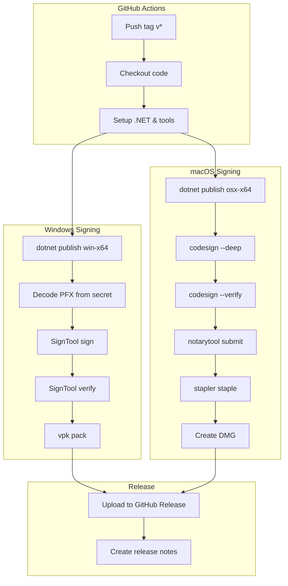
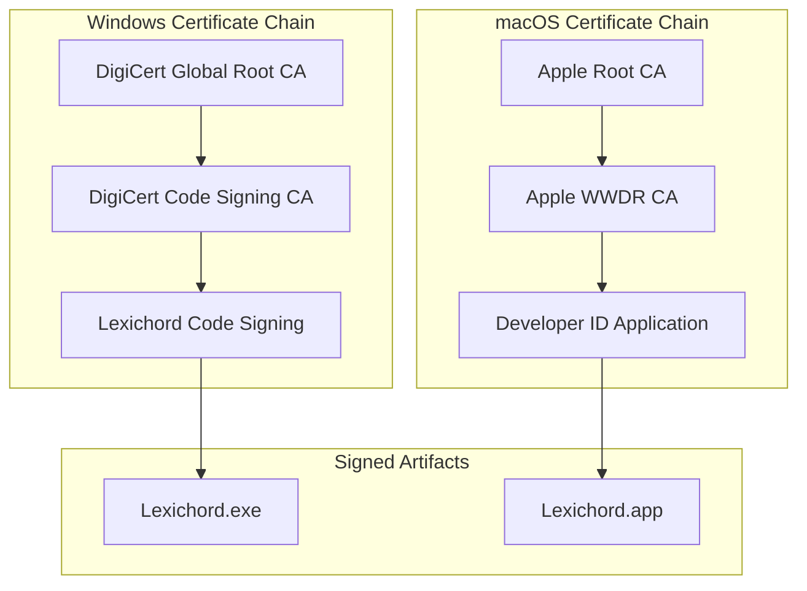
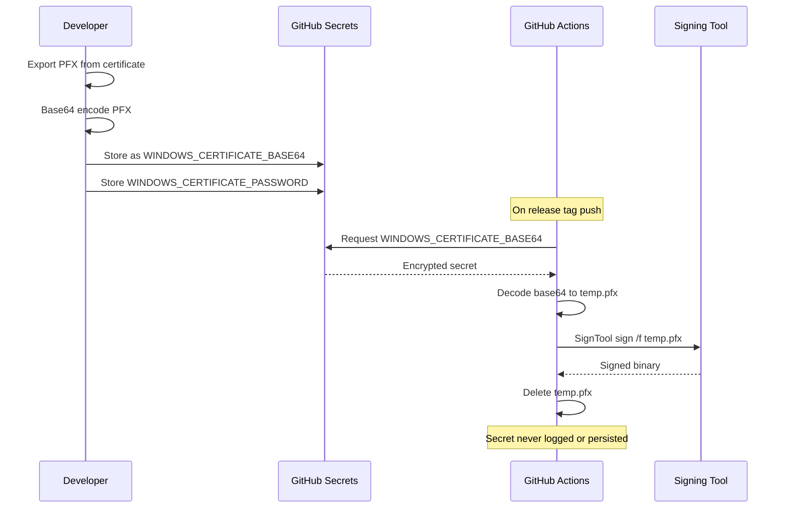

# LCS-INF-017b: Signing Infrastructure

## 1. Metadata & Categorization

| Field                | Value                                | Description                                  |
| :------------------- | :----------------------------------- | :------------------------------------------- |
| **Feature ID**       | `INF-017b`                           | Infrastructure - Signing Infrastructure      |
| **Feature Name**     | Signing Infrastructure               | CI pipeline with code signing certificates   |
| **Target Version**   | `v0.1.7b`                            | Second sub-part of v0.1.7                    |
| **Module Scope**     | `Build Infrastructure` / `CI Pipeline` | GitHub Actions workflows                  |
| **Swimlane**         | `Infrastructure`                     | The Podium (Platform)                        |
| **License Tier**     | `Core`                               | Foundation (Required for all tiers)          |
| **Author**           | System Architect                     |                                              |
| **Status**           | **Draft**                            | Pending implementation                       |
| **Last Updated**     | 2026-01-26                           |                                              |

---

## 2. Executive Summary

### 2.1 The Requirement

Unsigned executables trigger **security warnings** that discourage users:

- Windows SmartScreen: "Windows protected your PC" warning
- macOS Gatekeeper: "Lexichord can't be opened because it is from an unidentified developer"
- Enterprise environments may block unsigned applications entirely
- Users perceive unsigned apps as potentially malicious

Without code signing:

- Users receive alarming security warnings
- Enterprise adoption is blocked
- Application appears unprofessional
- Updates may be rejected by security software

### 2.2 The Proposed Solution

We **SHALL** implement a complete signing infrastructure with:

1. **Windows Code Signing** — PFX certificate with SignTool.exe
2. **macOS Code Signing** — Developer ID certificate with codesign
3. **macOS Notarization** — Apple notary service with stapling
4. **CI Integration** — GitHub Actions workflow with secrets management
5. **Timestamp Servers** — Long-term signature validity

---

## 3. Architecture & Modular Strategy

### 3.1 Signing Pipeline Flow



### 3.2 Certificate Trust Chain



### 3.3 Secrets Flow



---

## 4. Decision Tree: Signing Operations

```text
START: "What needs to be signed?"
|
+-- Windows Executable
|   +-- Is PFX certificate available?
|   |   +-- YES → Decode from base64 secret
|   |   |   +-- Find SignTool.exe in Windows SDK
|   |   |   +-- Sign with SHA256 algorithm
|   |   |   +-- Add timestamp from DigiCert server
|   |   |   +-- Verify signature
|   |   |   +-- Delete temporary PFX file
|   |   +-- NO → Skip signing (development build)
|   +-- END
|
+-- macOS Application Bundle
|   +-- Is Developer ID certificate available?
|   |   +-- YES → Sign all nested binaries first
|   |   |   +-- codesign --force --options runtime
|   |   |   +-- Include entitlements for hardened runtime
|   |   |   +-- Sign main app bundle --deep
|   |   |   +-- Verify signature with --strict
|   |   +-- NO → Skip signing (development build)
|   +-- Is notarization configured?
|   |   +-- YES → Submit to notary service
|   |   |   +-- Wait for notarization result
|   |   |   +-- Staple ticket to app bundle
|   |   |   +-- Staple ticket to DMG
|   |   +-- NO → Skip notarization
|   +-- END
|
+-- Velopack Package
|   +-- Is underlying binary signed?
|   |   +-- YES → Package will inherit trust
|   |   +-- NO → Package will be untrusted
|   +-- END
|
+-- END
```

---

## 5. Data Contracts

### 5.1 GitHub Secrets Schema

```yaml
# Repository Settings > Secrets > Actions

# Windows Code Signing
WINDOWS_CERTIFICATE_BASE64:
  description: "PFX certificate exported as base64 string"
  required: true
  example: "MIIKyQIBAzCCCo8GCS..."

WINDOWS_CERTIFICATE_PASSWORD:
  description: "Password for the PFX certificate"
  required: true
  sensitive: true

# macOS Code Signing
APPLE_DEVELOPER_ID:
  description: "Developer ID certificate name as shown in Keychain"
  required: true
  example: "Developer ID Application: Company Name (TEAMID)"

APPLE_TEAM_ID:
  description: "Apple Developer Team ID (10-character)"
  required: true
  example: "ABCD123456"

# macOS Notarization
APPLE_ID:
  description: "Apple ID email for notarization"
  required: true
  example: "developer@company.com"

APPLE_APP_SPECIFIC_PASSWORD:
  description: "App-specific password for notarization"
  required: true
  sensitive: true
  note: "Generated at appleid.apple.com"

# Optional: Private repository access
GITHUB_TOKEN:
  description: "GitHub token for private releases"
  required: false
  note: "Auto-provided by GitHub Actions for public repos"
```

### 5.2 Signing Configuration Record

```csharp
namespace Lexichord.Build;

/// <summary>
/// Configuration for code signing operations.
/// </summary>
/// <remarks>
/// LOGIC: Values are populated from CI environment variables.
/// Used by build scripts to determine signing parameters.
/// </remarks>
public record SigningConfiguration
{
    /// <summary>
    /// Windows signing configuration.
    /// </summary>
    public WindowsSigningConfig? Windows { get; init; }

    /// <summary>
    /// macOS signing configuration.
    /// </summary>
    public MacOSSigningConfig? MacOS { get; init; }

    /// <summary>
    /// Whether any signing is configured.
    /// </summary>
    public bool IsConfigured => Windows?.IsConfigured == true || MacOS?.IsConfigured == true;
}

/// <summary>
/// Windows-specific signing configuration.
/// </summary>
public record WindowsSigningConfig
{
    /// <summary>
    /// Base64-encoded PFX certificate.
    /// </summary>
    public string? CertificateBase64 { get; init; }

    /// <summary>
    /// PFX certificate password.
    /// </summary>
    public string? CertificatePassword { get; init; }

    /// <summary>
    /// Timestamp server URL.
    /// </summary>
    public string TimestampUrl { get; init; } = "http://timestamp.digicert.com";

    /// <summary>
    /// Hash algorithm for signing.
    /// </summary>
    public string HashAlgorithm { get; init; } = "sha256";

    /// <summary>
    /// Whether Windows signing is configured.
    /// </summary>
    public bool IsConfigured =>
        !string.IsNullOrEmpty(CertificateBase64) &&
        !string.IsNullOrEmpty(CertificatePassword);
}

/// <summary>
/// macOS-specific signing configuration.
/// </summary>
public record MacOSSigningConfig
{
    /// <summary>
    /// Developer ID certificate identity.
    /// </summary>
    public string? DeveloperIdIdentity { get; init; }

    /// <summary>
    /// Apple Team ID.
    /// </summary>
    public string? TeamId { get; init; }

    /// <summary>
    /// Apple ID for notarization.
    /// </summary>
    public string? AppleId { get; init; }

    /// <summary>
    /// App-specific password for notarization.
    /// </summary>
    public string? AppSpecificPassword { get; init; }

    /// <summary>
    /// Path to entitlements plist file.
    /// </summary>
    public string EntitlementsPath { get; init; } = "build/macos/entitlements.plist";

    /// <summary>
    /// Whether macOS signing is configured.
    /// </summary>
    public bool IsConfigured =>
        !string.IsNullOrEmpty(DeveloperIdIdentity);

    /// <summary>
    /// Whether notarization is configured.
    /// </summary>
    public bool IsNotarizationConfigured =>
        IsConfigured &&
        !string.IsNullOrEmpty(TeamId) &&
        !string.IsNullOrEmpty(AppleId) &&
        !string.IsNullOrEmpty(AppSpecificPassword);
}
```

### 5.3 Entitlements Configuration

```xml
<?xml version="1.0" encoding="UTF-8"?>
<!DOCTYPE plist PUBLIC "-//Apple//DTD PLIST 1.0//EN" "http://www.apple.com/DTDs/PropertyList-1.0.dtd">
<!--
    entitlements.plist - macOS hardened runtime entitlements

    LOGIC: These entitlements are required for:
    - Hardened runtime (required for notarization)
    - JIT compilation (.NET runtime)
    - Network access (update checks)
    - File access (document editing)

    SECURITY: Only enable entitlements that are actually needed.
    Each entitlement is a potential security surface.
-->
<plist version="1.0">
<dict>
    <!-- Allow JIT compilation (required for .NET) -->
    <key>com.apple.security.cs.allow-jit</key>
    <true/>

    <!-- Allow unsigned executable memory (required for .NET) -->
    <key>com.apple.security.cs.allow-unsigned-executable-memory</key>
    <true/>

    <!-- Allow loading libraries not signed by Apple -->
    <key>com.apple.security.cs.disable-library-validation</key>
    <true/>

    <!-- Network access for update checks -->
    <key>com.apple.security.network.client</key>
    <true/>

    <!-- User-selected file access -->
    <key>com.apple.security.files.user-selected.read-write</key>
    <true/>
</dict>
</plist>
```

---

## 6. Implementation Logic

### 6.1 GitHub Actions Workflow (release.yml)

```yaml
name: Release

on:
  push:
    tags:
      - 'v*'

env:
  DOTNET_VERSION: '9.0.x'
  DOTNET_NOLOGO: true
  DOTNET_CLI_TELEMETRY_OPTOUT: true

jobs:
  # ═══════════════════════════════════════════════════════════════════
  # Build and sign Windows release
  # ═══════════════════════════════════════════════════════════════════
  build-windows:
    runs-on: windows-latest
    steps:
      - name: Checkout
        uses: actions/checkout@v4
        with:
          fetch-depth: 0

      - name: Setup .NET
        uses: actions/setup-dotnet@v4
        with:
          dotnet-version: ${{ env.DOTNET_VERSION }}

      - name: Install Velopack CLI
        run: dotnet tool install -g vpk

      - name: Extract version from tag
        id: version
        run: |
          $version = "${{ github.ref_name }}".TrimStart('v')
          echo "VERSION=$version" >> $env:GITHUB_OUTPUT
        shell: pwsh

      - name: Restore dependencies
        run: dotnet restore

      - name: Build
        run: dotnet build --configuration Release --no-restore

      - name: Test
        run: dotnet test --configuration Release --no-build --verbosity normal

      - name: Publish
        run: |
          dotnet publish src/Lexichord.Host/Lexichord.Host.csproj `
            --configuration Release `
            --runtime win-x64 `
            --self-contained true `
            --output ./publish/win-x64 `
            -p:PublishReadyToRun=true `
            -p:Version=${{ steps.version.outputs.VERSION }}
        shell: pwsh

      - name: Copy CHANGELOG
        run: Copy-Item CHANGELOG.md ./publish/win-x64/

      # ─────────────────────────────────────────────────────────────────
      # Code Signing
      # ─────────────────────────────────────────────────────────────────
      - name: Decode certificate
        if: ${{ secrets.WINDOWS_CERTIFICATE_BASE64 != '' }}
        run: |
          $certBytes = [Convert]::FromBase64String("${{ secrets.WINDOWS_CERTIFICATE_BASE64 }}")
          [IO.File]::WriteAllBytes("${{ runner.temp }}/certificate.pfx", $certBytes)
        shell: pwsh

      - name: Sign executable
        if: ${{ secrets.WINDOWS_CERTIFICATE_BASE64 != '' }}
        run: |
          $signTool = Get-ChildItem -Path "C:\Program Files (x86)\Windows Kits\10\bin" `
            -Filter "signtool.exe" -Recurse | `
            Where-Object { $_.FullName -like "*x64*" } | `
            Sort-Object -Descending | `
            Select-Object -First 1

          if (-not $signTool) {
            Write-Error "SignTool not found"
            exit 1
          }

          Write-Host "Using SignTool: $($signTool.FullName)"

          & $signTool.FullName sign `
            /f "${{ runner.temp }}/certificate.pfx" `
            /p "${{ secrets.WINDOWS_CERTIFICATE_PASSWORD }}" `
            /fd sha256 `
            /tr "http://timestamp.digicert.com" `
            /td sha256 `
            /v `
            ./publish/win-x64/Lexichord.exe

          if ($LASTEXITCODE -ne 0) {
            Write-Error "Signing failed"
            exit $LASTEXITCODE
          }
        shell: pwsh

      - name: Verify signature
        if: ${{ secrets.WINDOWS_CERTIFICATE_BASE64 != '' }}
        run: |
          $signTool = Get-ChildItem -Path "C:\Program Files (x86)\Windows Kits\10\bin" `
            -Filter "signtool.exe" -Recurse | `
            Where-Object { $_.FullName -like "*x64*" } | `
            Sort-Object -Descending | `
            Select-Object -First 1

          & $signTool.FullName verify /pa ./publish/win-x64/Lexichord.exe

          if ($LASTEXITCODE -ne 0) {
            Write-Error "Signature verification failed"
            exit $LASTEXITCODE
          }

          Write-Host "Signature verified successfully"
        shell: pwsh

      - name: Cleanup certificate
        if: always()
        run: |
          if (Test-Path "${{ runner.temp }}/certificate.pfx") {
            Remove-Item "${{ runner.temp }}/certificate.pfx" -Force
          }
        shell: pwsh

      # ─────────────────────────────────────────────────────────────────
      # Package with Velopack
      # ─────────────────────────────────────────────────────────────────
      - name: Package with Velopack
        run: |
          vpk pack `
            --packId Lexichord `
            --packVersion ${{ steps.version.outputs.VERSION }} `
            --packDir ./publish/win-x64 `
            --packTitle "Lexichord" `
            --packAuthors "Lexichord Team" `
            --mainExe Lexichord.exe `
            --outputDir ./releases/windows `
            --icon ./assets/icons/lexichord.ico
        shell: pwsh

      - name: Upload Windows artifacts
        uses: actions/upload-artifact@v4
        with:
          name: windows-release
          path: ./releases/windows/*

  # ═══════════════════════════════════════════════════════════════════
  # Build and sign macOS release
  # ═══════════════════════════════════════════════════════════════════
  build-macos:
    runs-on: macos-latest
    steps:
      - name: Checkout
        uses: actions/checkout@v4
        with:
          fetch-depth: 0

      - name: Setup .NET
        uses: actions/setup-dotnet@v4
        with:
          dotnet-version: ${{ env.DOTNET_VERSION }}

      - name: Install Velopack CLI
        run: dotnet tool install -g vpk

      - name: Extract version from tag
        id: version
        run: |
          version="${{ github.ref_name }}"
          version="${version#v}"
          echo "VERSION=$version" >> $GITHUB_OUTPUT

      - name: Restore dependencies
        run: dotnet restore

      - name: Build
        run: dotnet build --configuration Release --no-restore

      - name: Test
        run: dotnet test --configuration Release --no-build --verbosity normal

      - name: Publish (x64)
        run: |
          dotnet publish src/Lexichord.Host/Lexichord.Host.csproj \
            --configuration Release \
            --runtime osx-x64 \
            --self-contained true \
            --output ./publish/osx-x64 \
            -p:Version=${{ steps.version.outputs.VERSION }}

      - name: Publish (ARM64)
        run: |
          dotnet publish src/Lexichord.Host/Lexichord.Host.csproj \
            --configuration Release \
            --runtime osx-arm64 \
            --self-contained true \
            --output ./publish/osx-arm64 \
            -p:Version=${{ steps.version.outputs.VERSION }}

      - name: Copy CHANGELOG
        run: |
          cp CHANGELOG.md ./publish/osx-x64/
          cp CHANGELOG.md ./publish/osx-arm64/

      # ─────────────────────────────────────────────────────────────────
      # Create and sign app bundles
      # ─────────────────────────────────────────────────────────────────
      - name: Create app bundle (x64)
        run: |
          mkdir -p ./releases/macos/Lexichord-x64.app/Contents/MacOS
          mkdir -p ./releases/macos/Lexichord-x64.app/Contents/Resources

          cp -R ./publish/osx-x64/* ./releases/macos/Lexichord-x64.app/Contents/MacOS/
          mv ./releases/macos/Lexichord-x64.app/Contents/MacOS/Lexichord.Host \
             ./releases/macos/Lexichord-x64.app/Contents/MacOS/Lexichord

          # Create Info.plist
          cat > ./releases/macos/Lexichord-x64.app/Contents/Info.plist << EOF
          <?xml version="1.0" encoding="UTF-8"?>
          <!DOCTYPE plist PUBLIC "-//Apple//DTD PLIST 1.0//EN" "http://www.apple.com/DTDs/PropertyList-1.0.dtd">
          <plist version="1.0">
          <dict>
              <key>CFBundleIdentifier</key>
              <string>com.lexichord.app</string>
              <key>CFBundleName</key>
              <string>Lexichord</string>
              <key>CFBundleExecutable</key>
              <string>Lexichord</string>
              <key>CFBundleVersion</key>
              <string>${{ steps.version.outputs.VERSION }}</string>
              <key>CFBundleShortVersionString</key>
              <string>${{ steps.version.outputs.VERSION }}</string>
              <key>CFBundlePackageType</key>
              <string>APPL</string>
              <key>LSMinimumSystemVersion</key>
              <string>11.0</string>
              <key>NSHighResolutionCapable</key>
              <true/>
          </dict>
          </plist>
          EOF

      - name: Sign app bundle (x64)
        if: ${{ secrets.APPLE_DEVELOPER_ID != '' }}
        run: |
          # Sign all binaries
          find ./releases/macos/Lexichord-x64.app -type f -perm +111 \
            -exec codesign --force --options runtime \
              --entitlements ./build/macos/entitlements.plist \
              --sign "${{ secrets.APPLE_DEVELOPER_ID }}" {} \;

          # Sign the app bundle
          codesign --force --deep --options runtime \
            --entitlements ./build/macos/entitlements.plist \
            --sign "${{ secrets.APPLE_DEVELOPER_ID }}" \
            ./releases/macos/Lexichord-x64.app

          # Verify
          codesign --verify --verbose=2 ./releases/macos/Lexichord-x64.app
          echo "Signature verified"

      - name: Create DMG (x64)
        run: |
          mkdir -p ./releases/macos/dmg-temp
          cp -R ./releases/macos/Lexichord-x64.app ./releases/macos/dmg-temp/Lexichord.app
          ln -s /Applications ./releases/macos/dmg-temp/Applications

          hdiutil create -volname "Lexichord ${{ steps.version.outputs.VERSION }}" \
            -srcfolder ./releases/macos/dmg-temp \
            -ov -format UDZO \
            ./releases/macos/Lexichord-${{ steps.version.outputs.VERSION }}-x64.dmg

          rm -rf ./releases/macos/dmg-temp

      # ─────────────────────────────────────────────────────────────────
      # Notarization
      # ─────────────────────────────────────────────────────────────────
      - name: Notarize DMG (x64)
        if: ${{ secrets.APPLE_ID != '' && secrets.APPLE_APP_SPECIFIC_PASSWORD != '' }}
        run: |
          xcrun notarytool submit \
            ./releases/macos/Lexichord-${{ steps.version.outputs.VERSION }}-x64.dmg \
            --apple-id "${{ secrets.APPLE_ID }}" \
            --team-id "${{ secrets.APPLE_TEAM_ID }}" \
            --password "${{ secrets.APPLE_APP_SPECIFIC_PASSWORD }}" \
            --wait

          # Staple the notarization ticket
          xcrun stapler staple \
            ./releases/macos/Lexichord-${{ steps.version.outputs.VERSION }}-x64.dmg

          echo "Notarization complete"

      - name: Upload macOS artifacts
        uses: actions/upload-artifact@v4
        with:
          name: macos-release
          path: ./releases/macos/*.dmg

  # ═══════════════════════════════════════════════════════════════════
  # Create GitHub Release
  # ═══════════════════════════════════════════════════════════════════
  create-release:
    needs: [build-windows, build-macos]
    runs-on: ubuntu-latest
    permissions:
      contents: write
    steps:
      - name: Checkout
        uses: actions/checkout@v4

      - name: Download Windows artifacts
        uses: actions/download-artifact@v4
        with:
          name: windows-release
          path: ./artifacts/windows

      - name: Download macOS artifacts
        uses: actions/download-artifact@v4
        with:
          name: macos-release
          path: ./artifacts/macos

      - name: Extract version from tag
        id: version
        run: |
          version="${{ github.ref_name }}"
          version="${version#v}"
          echo "VERSION=$version" >> $GITHUB_OUTPUT

      - name: Generate release notes
        id: notes
        run: |
          # Extract release notes from CHANGELOG.md for this version
          # This is a simplified version - could use a proper changelog parser
          echo "## What's New in v${{ steps.version.outputs.VERSION }}" > release-notes.md
          echo "" >> release-notes.md
          echo "See [CHANGELOG.md](./CHANGELOG.md) for details." >> release-notes.md

      - name: Create GitHub Release
        uses: softprops/action-gh-release@v1
        with:
          name: "Lexichord v${{ steps.version.outputs.VERSION }}"
          body_path: release-notes.md
          draft: false
          prerelease: ${{ contains(github.ref_name, '-') }}
          files: |
            ./artifacts/windows/Setup.exe
            ./artifacts/windows/RELEASES
            ./artifacts/windows/*.nupkg
            ./artifacts/macos/*.dmg
        env:
          GITHUB_TOKEN: ${{ secrets.GITHUB_TOKEN }}
```

### 6.2 Windows Signing Script (sign-windows.ps1)

```powershell
<#
.SYNOPSIS
    Signs a Windows executable with a PFX certificate.

.DESCRIPTION
    This script signs the specified executable using SignTool.exe
    with the provided PFX certificate and password.

.PARAMETER ExePath
    Path to the executable to sign.

.PARAMETER CertificatePath
    Path to the PFX certificate file.

.PARAMETER CertificatePassword
    Password for the PFX certificate.

.PARAMETER TimestampUrl
    URL of the timestamp server (default: DigiCert).

.EXAMPLE
    ./sign-windows.ps1 -ExePath "./Lexichord.exe" -CertificatePath "./cert.pfx" -CertificatePassword "password"
#>

param(
    [Parameter(Mandatory = $true)]
    [string]$ExePath,

    [Parameter(Mandatory = $true)]
    [string]$CertificatePath,

    [Parameter(Mandatory = $true)]
    [string]$CertificatePassword,

    [Parameter(Mandatory = $false)]
    [string]$TimestampUrl = "http://timestamp.digicert.com"
)

$ErrorActionPreference = "Stop"

# Validate inputs
if (-not (Test-Path $ExePath)) {
    Write-Error "Executable not found: $ExePath"
    exit 1
}

if (-not (Test-Path $CertificatePath)) {
    Write-Error "Certificate not found: $CertificatePath"
    exit 1
}

# Find SignTool.exe
Write-Host "Locating SignTool.exe..." -ForegroundColor Cyan

$signTool = Get-ChildItem -Path "C:\Program Files (x86)\Windows Kits\10\bin" `
    -Filter "signtool.exe" -Recurse | `
    Where-Object { $_.FullName -like "*x64*" } | `
    Sort-Object { [version](Split-Path (Split-Path $_.DirectoryName -Parent) -Leaf) } -Descending | `
    Select-Object -First 1

if (-not $signTool) {
    Write-Error "SignTool.exe not found. Install Windows SDK."
    exit 1
}

Write-Host "Using: $($signTool.FullName)" -ForegroundColor Green

# Sign the executable
Write-Host "`nSigning: $ExePath" -ForegroundColor Cyan

$signArgs = @(
    "sign"
    "/f", $CertificatePath
    "/p", $CertificatePassword
    "/fd", "sha256"
    "/tr", $TimestampUrl
    "/td", "sha256"
    "/v"
    $ExePath
)

& $signTool.FullName @signArgs

if ($LASTEXITCODE -ne 0) {
    Write-Error "Signing failed with exit code: $LASTEXITCODE"
    exit $LASTEXITCODE
}

Write-Host "`nSigning successful!" -ForegroundColor Green

# Verify signature
Write-Host "`nVerifying signature..." -ForegroundColor Cyan

& $signTool.FullName verify /pa $ExePath

if ($LASTEXITCODE -ne 0) {
    Write-Error "Signature verification failed"
    exit $LASTEXITCODE
}

Write-Host "Signature verification successful!" -ForegroundColor Green

# Display certificate info
Write-Host "`nCertificate Information:" -ForegroundColor Cyan
& $signTool.FullName verify /pa /v $ExePath | Select-String -Pattern "Issued|Subject|Serial|SHA"
```

### 6.3 macOS Signing Script (sign-macos.sh)

```bash
#!/bin/bash
#
# sign-macos.sh - Sign and notarize macOS application
#
# Usage: ./sign-macos.sh <app-bundle> [--notarize]
#
# Arguments:
#   app-bundle    Path to .app bundle to sign
#   --notarize    Also notarize after signing
#
# Environment variables:
#   APPLE_DEVELOPER_ID        - Developer ID certificate identity
#   APPLE_TEAM_ID            - Apple Developer Team ID
#   APPLE_ID                 - Apple ID for notarization
#   APPLE_APP_SPECIFIC_PASSWORD - App-specific password
#

set -e

APP_BUNDLE="${1:-}"
NOTARIZE=false
ENTITLEMENTS="./build/macos/entitlements.plist"

if [[ "$2" == "--notarize" ]]; then
    NOTARIZE=true
fi

if [[ -z "$APP_BUNDLE" ]]; then
    echo "Usage: $0 <app-bundle> [--notarize]"
    exit 1
fi

if [[ ! -d "$APP_BUNDLE" ]]; then
    echo "Error: App bundle not found: $APP_BUNDLE"
    exit 1
fi

if [[ -z "$APPLE_DEVELOPER_ID" ]]; then
    echo "Error: APPLE_DEVELOPER_ID environment variable not set"
    exit 1
fi

echo "═══════════════════════════════════════════════════════════════"
echo "Signing: $APP_BUNDLE"
echo "Identity: $APPLE_DEVELOPER_ID"
echo "═══════════════════════════════════════════════════════════════"

# Step 1: Sign all nested binaries first
echo ""
echo "[1/4] Signing nested binaries..."

find "$APP_BUNDLE" -type f -perm +111 -exec file {} \; | grep "Mach-O" | cut -d: -f1 | while read binary; do
    echo "  Signing: $binary"
    codesign --force --options runtime \
        --entitlements "$ENTITLEMENTS" \
        --sign "$APPLE_DEVELOPER_ID" \
        "$binary"
done

# Step 2: Sign dylibs and frameworks
echo ""
echo "[2/4] Signing libraries..."

find "$APP_BUNDLE" -type f \( -name "*.dylib" -o -name "*.framework" \) | while read lib; do
    echo "  Signing: $lib"
    codesign --force --options runtime \
        --entitlements "$ENTITLEMENTS" \
        --sign "$APPLE_DEVELOPER_ID" \
        "$lib"
done

# Step 3: Sign the main bundle
echo ""
echo "[3/4] Signing app bundle..."

codesign --force --deep --options runtime \
    --entitlements "$ENTITLEMENTS" \
    --sign "$APPLE_DEVELOPER_ID" \
    "$APP_BUNDLE"

echo "Bundle signed successfully."

# Step 4: Verify signature
echo ""
echo "[4/4] Verifying signature..."

codesign --verify --verbose=2 --strict "$APP_BUNDLE"

echo ""
echo "Signature verification passed!"

# Display signature details
echo ""
echo "Signature Details:"
codesign -dv --verbose=2 "$APP_BUNDLE" 2>&1 | grep -E "Authority|TeamIdentifier|Timestamp"

# Notarization (if requested)
if [[ "$NOTARIZE" == "true" ]]; then
    echo ""
    echo "═══════════════════════════════════════════════════════════════"
    echo "Notarizing application..."
    echo "═══════════════════════════════════════════════════════════════"

    if [[ -z "$APPLE_ID" || -z "$APPLE_APP_SPECIFIC_PASSWORD" || -z "$APPLE_TEAM_ID" ]]; then
        echo "Error: Notarization requires APPLE_ID, APPLE_APP_SPECIFIC_PASSWORD, and APPLE_TEAM_ID"
        exit 1
    fi

    # Create a zip for notarization
    NOTARIZE_ZIP="${APP_BUNDLE%.app}.zip"
    echo "Creating zip for notarization: $NOTARIZE_ZIP"
    ditto -c -k --keepParent "$APP_BUNDLE" "$NOTARIZE_ZIP"

    # Submit for notarization
    echo "Submitting to notary service..."
    xcrun notarytool submit "$NOTARIZE_ZIP" \
        --apple-id "$APPLE_ID" \
        --team-id "$APPLE_TEAM_ID" \
        --password "$APPLE_APP_SPECIFIC_PASSWORD" \
        --wait

    # Cleanup zip
    rm "$NOTARIZE_ZIP"

    # Staple the ticket
    echo "Stapling notarization ticket..."
    xcrun stapler staple "$APP_BUNDLE"

    echo ""
    echo "Notarization complete!"
fi

echo ""
echo "═══════════════════════════════════════════════════════════════"
echo "Signing complete!"
echo "═══════════════════════════════════════════════════════════════"
```

---

## 7. Use Cases & User Stories

### 7.1 User Stories

| ID | Role | Story | Acceptance Criteria |
|:---|:-----|:------|:--------------------|
| US-01 | User | As a user, I want no SmartScreen warning. | Signed installer passes SmartScreen. |
| US-02 | User | As a user, I want no Gatekeeper warning. | Signed and notarized app passes. |
| US-03 | Developer | As a developer, I want CI to sign releases. | GitHub Actions signs on tag. |
| US-04 | Developer | As a developer, I want certificates secured. | Secrets never logged or exposed. |
| US-05 | Admin | As an admin, I want to verify signatures. | Can verify with signtool/codesign. |

### 7.2 Use Cases

#### UC-01: Windows SmartScreen Validation

**Preconditions:**
- User downloads Setup.exe from GitHub.
- Windows 10/11 with default SmartScreen settings.
- Executable is signed with valid certificate.

**Flow:**
1. User double-clicks Setup.exe.
2. Windows checks signature via SmartScreen.
3. SmartScreen validates certificate chain.
4. Certificate is trusted (DigiCert CA).
5. Timestamp proves signing occurred when cert was valid.
6. SmartScreen reputation check (may still warn initially).
7. Installation proceeds without "unknown publisher" warning.

**Postconditions:**
- User confidence maintained.
- No "Windows protected your PC" dialog.

---

#### UC-02: macOS Notarization Validation

**Preconditions:**
- User downloads .dmg from GitHub.
- macOS 10.15+ with Gatekeeper enabled.
- Application is signed and notarized.

**Flow:**
1. User opens .dmg file.
2. macOS checks signature and notarization.
3. Stapled ticket validates app is known to Apple.
4. No "unidentified developer" warning.
5. User drags app to Applications.
6. First launch may still show "downloaded from internet" dialog.
7. User clicks "Open" to proceed.

**Postconditions:**
- No Gatekeeper block.
- App launches normally.

---

## 8. Observability & Logging

### 8.1 CI Log Events

| Stage | Log Entry |
|:------|:----------|
| Setup | `Using SignTool: C:\Program Files (x86)\Windows Kits\10\bin\10.0.22621.0\x64\signtool.exe` |
| Sign | `Successfully signed: Lexichord.exe` |
| Verify | `Signature verification successful` |
| Package | `Created: Setup.exe (45.2 MB)` |
| macOS Sign | `Signing: ./Lexichord.app` |
| macOS Verify | `Signature verification passed!` |
| Notarize | `Submitting to notary service...` |
| Notarize | `Processing complete. Status: Accepted` |
| Staple | `The staple and validate action worked!` |

### 8.2 Audit Trail

All signing operations are logged in GitHub Actions with:

- Timestamp of signing
- Certificate subject (not private key)
- Hash of signed file
- Verification result

---

## 9. Unit Testing Requirements

### 9.1 Script Validation Tests

```powershell
# test-sign-windows.ps1 - Validate signing script

Describe "sign-windows.ps1" {
    BeforeAll {
        $script = "./build/scripts/sign-windows.ps1"
    }

    It "Should find SignTool.exe" {
        $signTool = Get-ChildItem -Path "C:\Program Files (x86)\Windows Kits\10\bin" `
            -Filter "signtool.exe" -Recurse | `
            Where-Object { $_.FullName -like "*x64*" } | `
            Select-Object -First 1

        $signTool | Should -Not -BeNullOrEmpty
    }

    It "Should fail gracefully with missing executable" {
        { & $script -ExePath "./nonexistent.exe" -CertificatePath "./cert.pfx" -CertificatePassword "test" } | `
            Should -Throw "*not found*"
    }

    It "Should fail gracefully with missing certificate" {
        # Create temp file
        $tempExe = New-TemporaryFile
        Rename-Item $tempExe "$tempExe.exe"

        { & $script -ExePath "$tempExe.exe" -CertificatePath "./nonexistent.pfx" -CertificatePassword "test" } | `
            Should -Throw "*not found*"

        Remove-Item "$tempExe.exe"
    }
}
```

```bash
# test-sign-macos.sh - Validate macOS signing script

#!/bin/bash

# Test: Script requires app bundle argument
output=$(./build/scripts/sign-macos.sh 2>&1) || true
if [[ "$output" != *"Usage:"* ]]; then
    echo "FAIL: Should show usage when no argument"
    exit 1
fi

# Test: Script fails with nonexistent bundle
output=$(./build/scripts/sign-macos.sh /nonexistent.app 2>&1) || true
if [[ "$output" != *"not found"* ]]; then
    echo "FAIL: Should fail with nonexistent bundle"
    exit 1
fi

# Test: Script fails without APPLE_DEVELOPER_ID
unset APPLE_DEVELOPER_ID
mkdir -p /tmp/Test.app/Contents/MacOS
touch /tmp/Test.app/Contents/MacOS/Test
output=$(./build/scripts/sign-macos.sh /tmp/Test.app 2>&1) || true
if [[ "$output" != *"APPLE_DEVELOPER_ID"* ]]; then
    echo "FAIL: Should require APPLE_DEVELOPER_ID"
    exit 1
fi
rm -rf /tmp/Test.app

echo "All tests passed!"
```

---

## 10. Security & Safety

### 10.1 Certificate Storage

> [!CRITICAL]
> Certificates and private keys are extremely sensitive.
> Compromise allows signing malware as your organization.

```yaml
# CORRECT: Base64 encode and store as GitHub secret
# Local machine:
cat certificate.pfx | base64 > cert_b64.txt
# Then paste contents into GitHub Secrets

# WRONG: Commit certificate to repository
git add certificate.pfx  # NEVER DO THIS
```

### 10.2 Secret Exposure Prevention

```yaml
# GitHub Actions automatically masks secrets in logs
# But be careful with debugging output

# WRONG: Echo secret (will be masked but avoid anyway)
- run: echo "${{ secrets.WINDOWS_CERTIFICATE_PASSWORD }}"

# CORRECT: Use secrets directly in commands
- run: signtool sign /p "${{ secrets.PASSWORD }}" ...
  # Output is masked automatically
```

### 10.3 Certificate Lifecycle

> [!WARNING]
> Code signing certificates typically expire after 1-3 years.
> Set calendar reminders 60 days before expiration.

**Renewal Process:**
1. Purchase renewal from CA (DigiCert, Sectigo, etc.)
2. Generate new CSR or renew existing
3. Receive new certificate
4. Export as PFX with private key
5. Base64 encode: `cat new-cert.pfx | base64 > cert_b64.txt`
6. Update GitHub secret: `WINDOWS_CERTIFICATE_BASE64`
7. Test signing with new certificate
8. Verify old signed binaries still validate (timestamped)

---

## 11. Risks & Mitigations

| Risk | Impact | Mitigation |
|:-----|:-------|:-----------|
| Certificate compromised | Critical | Revoke immediately; rotate secrets |
| Certificate expires during release | High | 60-day advance warning; automated check |
| Notarization queue delays | Medium | Plan extra time; parallelize builds |
| Timestamp server unavailable | Medium | Retry logic; fallback server |
| SmartScreen reputation low | Medium | Build reputation over time; EV certificate |
| Secrets exposed in logs | Critical | GitHub auto-masking; no echo commands |

---

## 12. Acceptance Criteria (QA)

| # | Category | Criterion |
|:--|:---------|:----------|
| 1 | **[Windows]** | Signed .exe passes `signtool verify /pa` |
| 2 | **[Windows]** | SmartScreen shows no "unknown publisher" |
| 3 | **[Windows]** | Timestamp is present and valid |
| 4 | **[macOS]** | Signed .app passes `codesign --verify --strict` |
| 5 | **[macOS]** | Notarized .dmg passes `stapler validate` |
| 6 | **[macOS]** | Gatekeeper allows app to run |
| 7 | **[CI]** | GitHub Actions signs on v* tag |
| 8 | **[CI]** | Secrets not exposed in logs |
| 9 | **[CI]** | Temporary certificate files cleaned up |
| 10 | **[CI]** | Release created with signed artifacts |

---

## 13. Verification Commands

```bash
# Windows signature verification
signtool verify /pa /v Lexichord.exe

# Check certificate chain
signtool verify /pa /all Lexichord.exe

# macOS signature verification
codesign --verify --verbose=4 Lexichord.app

# Check entitlements
codesign -d --entitlements - Lexichord.app

# Verify notarization
xcrun stapler validate Lexichord.app

# Check notarization status
xcrun notarytool history --apple-id $APPLE_ID --team-id $TEAM_ID

# Test SmartScreen (Windows)
# 1. Download signed exe from GitHub
# 2. Double-click in Windows Explorer
# 3. Should not show "Windows protected your PC"

# Test Gatekeeper (macOS)
# 1. Download signed dmg from GitHub
# 2. Open dmg and drag to Applications
# 3. First launch should only show "downloaded from internet"
```

---

## 14. Deliverable Checklist

| Step | Description | Status |
|:-----|:------------|:-------|
| 1 | Obtain Windows code signing certificate | [ ] |
| 2 | Export PFX and base64 encode | [ ] |
| 3 | Store WINDOWS_CERTIFICATE_BASE64 in GitHub secrets | [ ] |
| 4 | Store WINDOWS_CERTIFICATE_PASSWORD in GitHub secrets | [ ] |
| 5 | Enroll in Apple Developer Program | [ ] |
| 6 | Create Developer ID Application certificate | [ ] |
| 7 | Store APPLE_DEVELOPER_ID in GitHub secrets | [ ] |
| 8 | Store APPLE_TEAM_ID in GitHub secrets | [ ] |
| 9 | Create app-specific password for notarization | [ ] |
| 10 | Store APPLE_ID and APPLE_APP_SPECIFIC_PASSWORD | [ ] |
| 11 | Create entitlements.plist | [ ] |
| 12 | Create sign-windows.ps1 script | [ ] |
| 13 | Create sign-macos.sh script | [ ] |
| 14 | Create release.yml workflow | [ ] |
| 15 | Test Windows signing locally | [ ] |
| 16 | Test macOS signing locally | [ ] |
| 17 | Test full CI pipeline with tag | [ ] |
| 18 | Verify SmartScreen behavior | [ ] |
| 19 | Verify Gatekeeper behavior | [ ] |
| 20 | Document certificate renewal process | [ ] |
