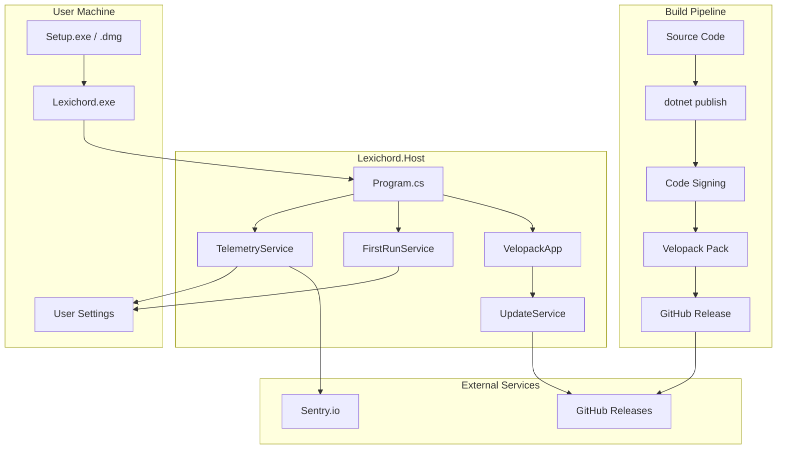
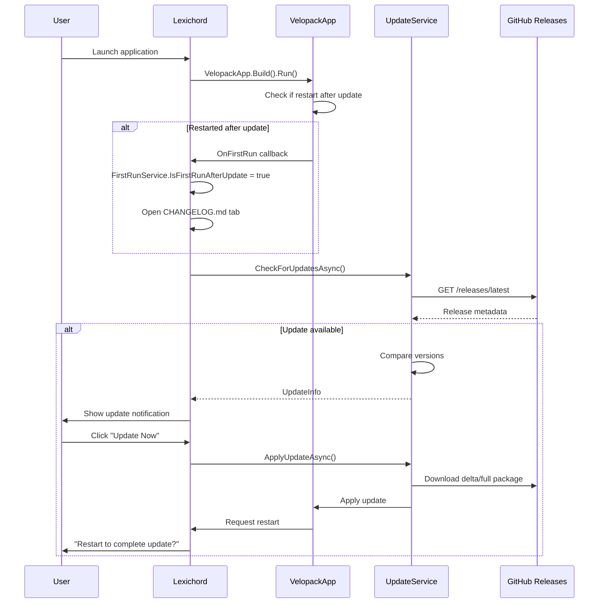
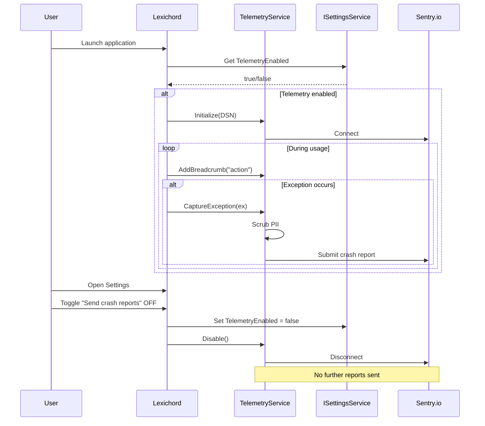

# LCS-INF-017: Feature Design Specification — Distribution (Packaging)

## 1. Metadata & Categorization

| Field                | Value                                         | Description                                        |
| :------------------- | :-------------------------------------------- | :------------------------------------------------- |
| **Feature ID**       | `INF-017`                                     | Infrastructure - Distribution (Packaging)          |
| **Feature Name**     | Distribution (Packaging)                      | Installer generation, signing, telemetry           |
| **Target Version**   | `v0.1.7`                                      | Release Preparation Milestone                      |
| **Module Scope**     | `Build Infrastructure` / `Lexichord.Host`     | CI/CD and application shell                        |
| **Swimlane**         | `Infrastructure`                              | The Podium (Platform)                              |
| **License Tier**     | `Core`                                        | Foundation (Required for all tiers)                |
| **Feature Gate Key** | N/A                                           | No runtime gating for distribution infrastructure  |
| **Author**           | System Architect                              |                                                    |
| **Status**           | **Draft**                                     | Pending implementation                             |
| **Last Updated**     | 2026-01-26                                    |                                                    |

---

## 2. Executive Summary

### 2.1 The Requirement

Lexichord cannot reach end users without **proper distribution infrastructure**:

- Developer builds run from Visual Studio but cannot be installed by users
- Unsigned executables trigger SmartScreen (Windows) and Gatekeeper (macOS) warnings
- Users have no way to know what changed between versions
- Crashes in production go undetected without telemetry

These limitations prevent Lexichord from being used outside development environments. Every professional application requires installers, signing, and crash reporting.

### 2.2 The Proposed Solution

We **SHALL** implement a complete distribution infrastructure with:

1. **v0.1.7a: Velopack Integration** — Generate Setup.exe (Windows) and .dmg (macOS) installers.
2. **v0.1.7b: Signing Infrastructure** — CI pipeline with PFX/Developer ID code signing.
3. **v0.1.7c: Release Notes Viewer** — FirstRun detection, auto-open CHANGELOG.md tab.
4. **v0.1.7d: Telemetry Hooks** — Optional Sentry crash reporting with opt-out toggle.

---

## 3. Architecture & Modular Strategy

### 3.1 High-Level Architecture



### 3.2 Update Flow Sequence



### 3.3 Telemetry Flow Sequence



### 3.4 Dependencies

**NuGet Packages:**

| Package | Version | Purpose |
|:--------|:--------|:--------|
| `Velopack` | 0.x | Application packaging and updates |
| `Sentry` | 4.x | Crash reporting |
| `Sentry.Serilog` | 4.x | Serilog integration |

**Project References:**

| Project | Reference Direction |
|:--------|:--------------------|
| `Lexichord.Host` | -> `Lexichord.Abstractions` |
| `Lexichord.Host` | -> `Lexichord.Modules.Editor` (for changelog) |

### 3.5 Licensing Behavior

- **N/A for Distribution:** All distribution features are Core foundation.
- Telemetry is opt-in and does not affect license validation.

---

## 4. Decision Tree: Distribution Operations

```text
START: "What distribution operation is needed?"
|
+-- Application Startup
|   +-- Is this a restart after update?
|   |   +-- YES -> VelopackApp.OnFirstRun callback
|   |   |   +-- Set IsFirstRunAfterUpdate = true
|   |   |   +-- Open CHANGELOG.md in editor tab
|   |   +-- NO -> Normal startup
|   +-- Is telemetry enabled in settings?
|   |   +-- YES -> Initialize Sentry SDK
|   |   +-- NO -> Skip Sentry initialization
|   +-- Schedule background update check
|   +-- END
|
+-- Check for Updates (Background)
|   +-- Query GitHub Releases API
|   +-- Is newer version available?
|   |   +-- YES -> Show notification toast
|   |   |   +-- User clicks "Update Now"?
|   |   |   |   +-- YES -> Download and apply update
|   |   |   |   +-- NO -> Dismiss notification
|   |   +-- NO -> No action
|   +-- END
|
+-- Apply Update
|   +-- Download delta package (if available)
|   |   +-- Delta fails? -> Fall back to full package
|   +-- Verify package signature
|   +-- Apply update to app directory
|   +-- Prompt user to restart
|   |   +-- User confirms -> Restart application
|   |   +-- User defers -> Mark update pending
|   +-- END
|
+-- Crash Reporting
|   +-- Is telemetry enabled?
|   |   +-- YES -> Capture exception
|   |   |   +-- Scrub PII from payload
|   |   |   +-- Include breadcrumbs
|   |   |   +-- Submit to Sentry
|   |   +-- NO -> Log locally only
|   +-- END
|
+-- User Changes Telemetry Setting
|   +-- User enables telemetry
|   |   +-- Initialize Sentry SDK
|   |   +-- Begin capturing events
|   +-- User disables telemetry
|   |   +-- Flush pending events
|   |   +-- Dispose Sentry client
|   +-- END
|
+-- END
```

---

## 5. Data Contracts

### 5.1 IUpdateService Interface

```csharp
namespace Lexichord.Abstractions.Contracts;

/// <summary>
/// Service for checking and applying application updates.
/// </summary>
/// <remarks>
/// LOGIC: Uses Velopack to check GitHub Releases for newer versions.
/// Updates can be delta (incremental) or full, with automatic fallback.
/// The service runs update checks in the background on startup.
/// </remarks>
public interface IUpdateService
{
    /// <summary>
    /// Checks for available updates from the configured release source.
    /// </summary>
    /// <param name="cancellationToken">Cancellation token.</param>
    /// <returns>Update information if available, null if up to date.</returns>
    /// <remarks>
    /// LOGIC: Queries the release feed (GitHub Releases by default).
    /// Compares semantic versions to determine if update is available.
    /// Returns null if current version is latest or if check fails.
    /// </remarks>
    Task<UpdateInfo?> CheckForUpdatesAsync(CancellationToken cancellationToken = default);

    /// <summary>
    /// Downloads and applies the specified update.
    /// </summary>
    /// <param name="update">The update to apply.</param>
    /// <param name="progress">Optional progress reporter (0-100).</param>
    /// <param name="cancellationToken">Cancellation token.</param>
    /// <remarks>
    /// LOGIC: Downloads delta package if available, falls back to full.
    /// Verifies package signature before applying.
    /// After successful apply, application must restart to complete.
    /// </remarks>
    Task ApplyUpdateAsync(
        UpdateInfo update,
        IProgress<int>? progress = null,
        CancellationToken cancellationToken = default);

    /// <summary>
    /// Gets whether an update has been applied and is waiting for restart.
    /// </summary>
    bool IsUpdatePending { get; }

    /// <summary>
    /// Gets the version of the pending update, if any.
    /// </summary>
    string? PendingVersion { get; }

    /// <summary>
    /// Gets the URL to the releases page for manual download.
    /// </summary>
    string ReleasesUrl { get; }

    /// <summary>
    /// Event raised when an update is available.
    /// </summary>
    event EventHandler<UpdateAvailableEventArgs>? UpdateAvailable;
}

/// <summary>
/// Information about an available update.
/// </summary>
/// <param name="CurrentVersion">The currently installed version.</param>
/// <param name="TargetVersion">The version to update to.</param>
/// <param name="ReleaseNotes">Markdown release notes for the update.</param>
/// <param name="DownloadSize">Download size in bytes.</param>
/// <param name="IsDelta">Whether this is a delta (incremental) update.</param>
/// <param name="ReleaseDate">When the update was released.</param>
public record UpdateInfo(
    string CurrentVersion,
    string TargetVersion,
    string? ReleaseNotes,
    long DownloadSize,
    bool IsDelta,
    DateTimeOffset ReleaseDate
);

/// <summary>
/// Event args for update availability.
/// </summary>
public class UpdateAvailableEventArgs : EventArgs
{
    /// <summary>
    /// Gets the update information.
    /// </summary>
    public required UpdateInfo Update { get; init; }
}
```

### 5.2 IFirstRunService Interface

```csharp
namespace Lexichord.Abstractions.Contracts;

/// <summary>
/// Service for detecting first run scenarios after installation or update.
/// </summary>
/// <remarks>
/// LOGIC: Tracks the last run version in user settings.
/// On startup, compares stored version to current assembly version.
/// Different scenarios: fresh install, update, or normal run.
/// </remarks>
public interface IFirstRunService
{
    /// <summary>
    /// Gets whether this is the first run after an update.
    /// </summary>
    /// <remarks>
    /// LOGIC: True when stored version differs from current version.
    /// Used to trigger release notes display.
    /// </remarks>
    bool IsFirstRunAfterUpdate { get; }

    /// <summary>
    /// Gets whether this is the first run ever (fresh install).
    /// </summary>
    /// <remarks>
    /// LOGIC: True when no stored version exists.
    /// Used to trigger welcome/onboarding flow.
    /// </remarks>
    bool IsFirstRunEver { get; }

    /// <summary>
    /// Gets the previously stored version, if any.
    /// </summary>
    string? PreviousVersion { get; }

    /// <summary>
    /// Gets the current application version.
    /// </summary>
    string CurrentVersion { get; }

    /// <summary>
    /// Gets the path to the bundled CHANGELOG.md file.
    /// </summary>
    string ChangelogPath { get; }

    /// <summary>
    /// Marks the current run as completed, storing the current version.
    /// </summary>
    /// <remarks>
    /// LOGIC: Call after displaying release notes or welcome screen.
    /// Updates the stored version to prevent re-triggering.
    /// </remarks>
    Task MarkRunCompletedAsync();

    /// <summary>
    /// Gets the release notes content for display.
    /// </summary>
    /// <param name="cancellationToken">Cancellation token.</param>
    /// <returns>Markdown content of CHANGELOG.md.</returns>
    Task<string> GetReleaseNotesAsync(CancellationToken cancellationToken = default);
}
```

### 5.3 ITelemetryService Interface

```csharp
namespace Lexichord.Abstractions.Contracts;

/// <summary>
/// Service for optional crash reporting and telemetry.
/// </summary>
/// <remarks>
/// LOGIC: Wraps Sentry SDK for crash reporting.
/// Telemetry is opt-in by default and can be disabled at any time.
/// All PII is scrubbed before submission.
///
/// Privacy Requirements:
/// - Disabled by default (user must opt-in)
/// - No PII collected (email, file paths, document content)
/// - Toggle takes effect immediately (no restart required)
/// - Clear disclosure of what is collected
/// </remarks>
public interface ITelemetryService : IDisposable
{
    /// <summary>
    /// Gets whether telemetry is currently enabled.
    /// </summary>
    bool IsEnabled { get; }

    /// <summary>
    /// Enables telemetry and initializes the Sentry client.
    /// </summary>
    /// <remarks>
    /// LOGIC: Initializes Sentry SDK with configured DSN.
    /// Takes effect immediately without restart.
    /// Persists preference to settings.
    /// </remarks>
    void Enable();

    /// <summary>
    /// Disables telemetry and disposes the Sentry client.
    /// </summary>
    /// <remarks>
    /// LOGIC: Flushes any pending events, then disposes client.
    /// Takes effect immediately without restart.
    /// Persists preference to settings.
    /// </remarks>
    void Disable();

    /// <summary>
    /// Captures an exception for reporting.
    /// </summary>
    /// <param name="exception">The exception to capture.</param>
    /// <param name="tags">Optional tags for categorization.</param>
    /// <remarks>
    /// LOGIC: Scrubs PII from exception before submission.
    /// No-op if telemetry is disabled.
    /// </remarks>
    void CaptureException(Exception exception, IDictionary<string, string>? tags = null);

    /// <summary>
    /// Captures a message for reporting.
    /// </summary>
    /// <param name="message">The message to capture.</param>
    /// <param name="level">The severity level.</param>
    void CaptureMessage(string message, TelemetryLevel level = TelemetryLevel.Info);

    /// <summary>
    /// Adds a breadcrumb for context in crash reports.
    /// </summary>
    /// <param name="message">Breadcrumb message.</param>
    /// <param name="category">Optional category (e.g., "navigation", "action").</param>
    /// <remarks>
    /// LOGIC: Breadcrumbs provide context leading up to a crash.
    /// Limited to last 100 breadcrumbs to control payload size.
    /// </remarks>
    void AddBreadcrumb(string message, string? category = null);

    /// <summary>
    /// Begins a scoped operation for performance tracking.
    /// </summary>
    /// <param name="operation">Operation name.</param>
    /// <returns>Disposable scope that ends the operation.</returns>
    IDisposable BeginScope(string operation);

    /// <summary>
    /// Sets a user identifier for session correlation.
    /// </summary>
    /// <param name="userId">Anonymous user ID (not PII).</param>
    /// <remarks>
    /// LOGIC: Uses anonymized machine-specific ID, not email or name.
    /// Enables correlation of crashes from same installation.
    /// </remarks>
    void SetUser(string userId);

    /// <summary>
    /// Flushes any pending events synchronously.
    /// </summary>
    /// <param name="timeout">Maximum time to wait for flush.</param>
    void Flush(TimeSpan timeout);
}

/// <summary>
/// Telemetry severity levels.
/// </summary>
public enum TelemetryLevel
{
    /// <summary>Debug-level message (verbose).</summary>
    Debug,
    /// <summary>Informational message.</summary>
    Info,
    /// <summary>Warning message.</summary>
    Warning,
    /// <summary>Error message.</summary>
    Error,
    /// <summary>Fatal/critical message.</summary>
    Fatal
}
```

### 5.4 Telemetry Settings Extension

```csharp
namespace Lexichord.Abstractions.Contracts;

/// <summary>
/// Telemetry-related settings for persistence.
/// </summary>
/// <remarks>
/// LOGIC: Extends the existing settings model with telemetry preferences.
/// These settings are persisted alongside other user preferences.
/// </remarks>
public record TelemetrySettings
{
    /// <summary>
    /// Gets or sets whether crash reporting is enabled.
    /// </summary>
    /// <remarks>
    /// Default is false (opt-in required).
    /// </remarks>
    public bool CrashReportingEnabled { get; init; } = false;

    /// <summary>
    /// Gets or sets whether usage analytics are enabled.
    /// </summary>
    /// <remarks>
    /// Default is false. Reserved for future use.
    /// </remarks>
    public bool UsageAnalyticsEnabled { get; init; } = false;

    /// <summary>
    /// Gets or sets when the user made their telemetry choice.
    /// </summary>
    /// <remarks>
    /// Null indicates user has not been prompted yet.
    /// </remarks>
    public DateTimeOffset? ConsentDate { get; init; }

    /// <summary>
    /// Gets the anonymized installation ID.
    /// </summary>
    /// <remarks>
    /// Generated once on first run, used for crash correlation.
    /// Not tied to any PII.
    /// </remarks>
    public string? InstallationId { get; init; }
}
```

### 5.5 Domain Events

```csharp
namespace Lexichord.Abstractions.Events;

using MediatR;

/// <summary>
/// Event published when an update is available.
/// </summary>
/// <param name="CurrentVersion">Current installed version.</param>
/// <param name="AvailableVersion">Version available for download.</param>
/// <param name="ReleaseDate">When the update was released.</param>
public record UpdateAvailableEvent(
    string CurrentVersion,
    string AvailableVersion,
    DateTimeOffset ReleaseDate
) : INotification;

/// <summary>
/// Event published when an update has been applied.
/// </summary>
/// <param name="FromVersion">Version before update.</param>
/// <param name="ToVersion">Version after update.</param>
public record UpdateAppliedEvent(
    string FromVersion,
    string ToVersion
) : INotification;

/// <summary>
/// Event published when telemetry preference changes.
/// </summary>
/// <param name="IsEnabled">New telemetry state.</param>
/// <param name="ChangedAt">When the change occurred.</param>
public record TelemetryPreferenceChangedEvent(
    bool IsEnabled,
    DateTimeOffset ChangedAt
) : INotification;

/// <summary>
/// Event published on first run after installation or update.
/// </summary>
/// <param name="IsFirstRunEver">True if fresh installation.</param>
/// <param name="IsFirstRunAfterUpdate">True if updated from previous version.</param>
/// <param name="PreviousVersion">Previous version, if update.</param>
/// <param name="CurrentVersion">Current version.</param>
public record FirstRunDetectedEvent(
    bool IsFirstRunEver,
    bool IsFirstRunAfterUpdate,
    string? PreviousVersion,
    string CurrentVersion
) : INotification;
```

---

## 6. Implementation Logic

### 6.1 Program.cs with Velopack Bootstrap

```csharp
using Avalonia;
using Serilog;
using Serilog.Events;
using Velopack;
using System;

namespace Lexichord.Host;

/// <summary>
/// Application entry point with Velopack integration.
/// </summary>
/// <remarks>
/// LOGIC: Velopack must be initialized before any other code runs.
/// VelopackApp.Build().Run() handles:
/// - Installation hooks (--velopack-install)
/// - Update hooks (--velopack-updated, --velopack-obsolete)
/// - Restart after update scenarios
/// </remarks>
internal sealed class Program
{
    [STAThread]
    public static int Main(string[] args)
    {
        // LOGIC: Velopack MUST be first - handles installer/updater scenarios
        // This may exit the process for install/uninstall hooks
        VelopackApp.Build()
            .WithFirstRun(OnFirstRun)
            .WithRestarted(OnRestarted)
            .WithBeforeUpdateFastCallback(OnBeforeUpdate)
            .Run();

        // Bootstrap logger for startup error capture
        Log.Logger = new LoggerConfiguration()
            .MinimumLevel.Debug()
            .MinimumLevel.Override("Microsoft", LogEventLevel.Information)
            .MinimumLevel.Override("System", LogEventLevel.Warning)
            .WriteTo.Console(
                outputTemplate: "[{Timestamp:HH:mm:ss} {Level:u3}] {Message:lj}{NewLine}{Exception}")
            .CreateBootstrapLogger();

        try
        {
            Log.Information("Starting Lexichord application v{Version}",
                typeof(Program).Assembly.GetName().Version);

            BuildAvaloniaApp()
                .StartWithClassicDesktopLifetime(args);

            Log.Information("Lexichord application shutdown complete");
            return 0;
        }
        catch (Exception ex)
        {
            Log.Fatal(ex, "Lexichord application terminated unexpectedly");
            return 1;
        }
        finally
        {
            Log.CloseAndFlush();
        }
    }

    /// <summary>
    /// Called on first run after fresh installation.
    /// </summary>
    private static void OnFirstRun(SemanticVersion version)
    {
        // LOGIC: Store flag for App.axaml.cs to detect
        // Will trigger welcome/onboarding flow
        Environment.SetEnvironmentVariable("LEXICHORD_FIRST_RUN", "true");
        Log.Information("First run detected for version {Version}", version);
    }

    /// <summary>
    /// Called when application restarts after an update.
    /// </summary>
    private static void OnRestarted(SemanticVersion version)
    {
        // LOGIC: Store flag for App.axaml.cs to detect
        // Will trigger release notes display
        Environment.SetEnvironmentVariable("LEXICHORD_UPDATED", "true");
        Environment.SetEnvironmentVariable("LEXICHORD_NEW_VERSION", version.ToString());
        Log.Information("Restarted after update to version {Version}", version);
    }

    /// <summary>
    /// Called before an update is applied (fast callback).
    /// </summary>
    private static void OnBeforeUpdate(SemanticVersion version)
    {
        // LOGIC: Opportunity to save state before update
        Log.Information("Preparing to update to version {Version}", version);
    }

    public static AppBuilder BuildAvaloniaApp()
        => AppBuilder.Configure<App>()
            .UsePlatformDetect()
            .WithInterFont()
            .LogToTrace();
}
```

### 6.2 UpdateService Implementation

```csharp
using Lexichord.Abstractions.Contracts;
using Lexichord.Abstractions.Events;
using MediatR;
using Microsoft.Extensions.Logging;
using Velopack;
using Velopack.Sources;

namespace Lexichord.Host.Services;

/// <summary>
/// Service for checking and applying application updates via Velopack.
/// </summary>
/// <remarks>
/// LOGIC: Uses Velopack's UpdateManager to check GitHub Releases.
/// Supports both delta (incremental) and full updates.
/// Background check runs on startup with configurable interval.
/// </remarks>
public sealed class UpdateService : IUpdateService, IDisposable
{
    private readonly ILogger<UpdateService> _logger;
    private readonly IMediator _mediator;
    private readonly UpdateManager _updateManager;
    private readonly string _releasesUrl;

    private UpdateInfo? _pendingUpdate;
    private bool _isUpdatePending;

    public UpdateService(
        ILogger<UpdateService> logger,
        IMediator mediator,
        IConfiguration configuration)
    {
        _logger = logger;
        _mediator = mediator;

        // LOGIC: Configure update source from GitHub Releases
        _releasesUrl = configuration["Updates:ReleasesUrl"]
            ?? "https://github.com/lexichord/lexichord/releases";

        var source = new GithubSource(_releasesUrl, null, false);
        _updateManager = new UpdateManager(source);

        _logger.LogInformation("UpdateService initialized with source: {Url}", _releasesUrl);
    }

    /// <inheritdoc/>
    public event EventHandler<UpdateAvailableEventArgs>? UpdateAvailable;

    /// <inheritdoc/>
    public bool IsUpdatePending => _isUpdatePending;

    /// <inheritdoc/>
    public string? PendingVersion => _pendingUpdate?.TargetVersion;

    /// <inheritdoc/>
    public string ReleasesUrl => _releasesUrl;

    /// <inheritdoc/>
    public async Task<UpdateInfo?> CheckForUpdatesAsync(CancellationToken cancellationToken = default)
    {
        _logger.LogDebug("Checking for updates...");

        try
        {
            if (!_updateManager.IsInstalled)
            {
                _logger.LogDebug("Application not installed via Velopack, skipping update check");
                return null;
            }

            var updateInfo = await _updateManager.CheckForUpdatesAsync();

            if (updateInfo is null)
            {
                _logger.LogDebug("No updates available");
                return null;
            }

            var result = new UpdateInfo(
                CurrentVersion: _updateManager.CurrentVersion?.ToString() ?? "0.0.0",
                TargetVersion: updateInfo.TargetFullRelease.Version.ToString(),
                ReleaseNotes: updateInfo.TargetFullRelease.NotesMarkdown,
                DownloadSize: updateInfo.TargetFullRelease.Size,
                IsDelta: updateInfo.DeltasToTarget.Count > 0,
                ReleaseDate: updateInfo.TargetFullRelease.Published ?? DateTimeOffset.UtcNow
            );

            _logger.LogInformation(
                "Update available: {Current} -> {Target} ({Size} bytes, delta: {IsDelta})",
                result.CurrentVersion,
                result.TargetVersion,
                result.DownloadSize,
                result.IsDelta);

            // Raise event for UI notification
            UpdateAvailable?.Invoke(this, new UpdateAvailableEventArgs { Update = result });

            await _mediator.Publish(new UpdateAvailableEvent(
                result.CurrentVersion,
                result.TargetVersion,
                result.ReleaseDate), cancellationToken);

            return result;
        }
        catch (Exception ex)
        {
            _logger.LogError(ex, "Failed to check for updates");
            return null;
        }
    }

    /// <inheritdoc/>
    public async Task ApplyUpdateAsync(
        UpdateInfo update,
        IProgress<int>? progress = null,
        CancellationToken cancellationToken = default)
    {
        _logger.LogInformation("Applying update to version {Version}", update.TargetVersion);

        try
        {
            var updateInfo = await _updateManager.CheckForUpdatesAsync();
            if (updateInfo is null)
            {
                throw new InvalidOperationException("Update no longer available");
            }

            // LOGIC: Download with progress reporting
            await _updateManager.DownloadUpdatesAsync(
                updateInfo,
                progress: p => progress?.Report(p));

            // LOGIC: Apply update (prepares for restart)
            _updateManager.ApplyUpdatesAndRestart(updateInfo);

            // Note: If ApplyUpdatesAndRestart succeeds, app will restart
            // This code only runs if restart is deferred
            _isUpdatePending = true;
            _pendingUpdate = update;

            _logger.LogInformation("Update applied, pending restart");
        }
        catch (Exception ex)
        {
            _logger.LogError(ex, "Failed to apply update to version {Version}", update.TargetVersion);
            throw;
        }
    }

    public void Dispose()
    {
        _updateManager.Dispose();
    }
}
```

### 6.3 FirstRunService Implementation

```csharp
using Lexichord.Abstractions.Contracts;
using Lexichord.Abstractions.Events;
using MediatR;
using Microsoft.Extensions.Logging;
using System.Reflection;

namespace Lexichord.Host.Services;

/// <summary>
/// Service for detecting and handling first run scenarios.
/// </summary>
/// <remarks>
/// LOGIC: Tracks version in user settings to detect:
/// - Fresh installation (no stored version)
/// - Update (stored version differs from current)
/// - Normal run (stored version matches current)
///
/// On first run after update, opens CHANGELOG.md in editor.
/// </remarks>
public sealed class FirstRunService : IFirstRunService
{
    private readonly ILogger<FirstRunService> _logger;
    private readonly ISettingsService _settingsService;
    private readonly IMediator _mediator;
    private readonly string _currentVersion;
    private readonly string _changelogPath;

    private string? _previousVersion;
    private bool _isFirstRunAfterUpdate;
    private bool _isFirstRunEver;
    private bool _initialized;

    public FirstRunService(
        ILogger<FirstRunService> logger,
        ISettingsService settingsService,
        IMediator mediator)
    {
        _logger = logger;
        _settingsService = settingsService;
        _mediator = mediator;

        // LOGIC: Get current version from assembly
        _currentVersion = Assembly.GetExecutingAssembly()
            .GetName().Version?.ToString() ?? "0.0.0.0";

        // LOGIC: CHANGELOG.md bundled as embedded resource or in app directory
        _changelogPath = Path.Combine(AppContext.BaseDirectory, "CHANGELOG.md");

        _logger.LogDebug("FirstRunService initialized. Current version: {Version}", _currentVersion);
    }

    /// <inheritdoc/>
    public bool IsFirstRunAfterUpdate
    {
        get
        {
            EnsureInitialized();
            return _isFirstRunAfterUpdate;
        }
    }

    /// <inheritdoc/>
    public bool IsFirstRunEver
    {
        get
        {
            EnsureInitialized();
            return _isFirstRunEver;
        }
    }

    /// <inheritdoc/>
    public string? PreviousVersion
    {
        get
        {
            EnsureInitialized();
            return _previousVersion;
        }
    }

    /// <inheritdoc/>
    public string CurrentVersion => _currentVersion;

    /// <inheritdoc/>
    public string ChangelogPath => _changelogPath;

    /// <inheritdoc/>
    public async Task MarkRunCompletedAsync()
    {
        _logger.LogDebug("Marking run completed. Storing version: {Version}", _currentVersion);

        await _settingsService.SetAsync("App:LastRunVersion", _currentVersion);

        // Reset flags after marking complete
        _isFirstRunAfterUpdate = false;
        _isFirstRunEver = false;

        _logger.LogInformation("First run handling completed for version {Version}", _currentVersion);
    }

    /// <inheritdoc/>
    public async Task<string> GetReleaseNotesAsync(CancellationToken cancellationToken = default)
    {
        if (!File.Exists(_changelogPath))
        {
            _logger.LogWarning("CHANGELOG.md not found at {Path}", _changelogPath);
            return $"# Lexichord {_currentVersion}\n\nRelease notes not available.";
        }

        return await File.ReadAllTextAsync(_changelogPath, cancellationToken);
    }

    private void EnsureInitialized()
    {
        if (_initialized) return;

        // LOGIC: Check for Velopack environment variables first
        var isVelopackFirstRun = Environment.GetEnvironmentVariable("LEXICHORD_FIRST_RUN") == "true";
        var isVelopackUpdated = Environment.GetEnvironmentVariable("LEXICHORD_UPDATED") == "true";

        // LOGIC: Load stored version from settings
        _previousVersion = _settingsService.Get<string>("App:LastRunVersion");

        if (isVelopackFirstRun || _previousVersion is null)
        {
            _isFirstRunEver = true;
            _logger.LogInformation("First run ever detected");
        }
        else if (isVelopackUpdated || _previousVersion != _currentVersion)
        {
            _isFirstRunAfterUpdate = true;
            _logger.LogInformation(
                "First run after update detected. Previous: {Previous}, Current: {Current}",
                _previousVersion, _currentVersion);
        }
        else
        {
            _logger.LogDebug("Normal run detected. Version: {Version}", _currentVersion);
        }

        // Publish event for other services to react
        if (_isFirstRunEver || _isFirstRunAfterUpdate)
        {
            _ = _mediator.Publish(new FirstRunDetectedEvent(
                _isFirstRunEver,
                _isFirstRunAfterUpdate,
                _previousVersion,
                _currentVersion));
        }

        _initialized = true;
    }
}
```

### 6.4 TelemetryService Implementation

```csharp
using Lexichord.Abstractions.Contracts;
using Lexichord.Abstractions.Events;
using MediatR;
using Microsoft.Extensions.Configuration;
using Microsoft.Extensions.Logging;
using Sentry;

namespace Lexichord.Host.Services;

/// <summary>
/// Service for optional crash reporting via Sentry.
/// </summary>
/// <remarks>
/// LOGIC: Wraps Sentry SDK with privacy-focused implementation.
/// Key privacy requirements:
/// - Disabled by default (opt-in required)
/// - No PII collected
/// - Immediate effect on toggle (no restart)
/// - Clear disclosure of what is collected
///
/// PII scrubbing removes:
/// - File paths (except relative to app directory)
/// - User names from paths
/// - Email addresses in exception messages
/// - Document content
/// </remarks>
public sealed class TelemetryService : ITelemetryService
{
    private readonly ILogger<TelemetryService> _logger;
    private readonly ISettingsService _settingsService;
    private readonly IMediator _mediator;
    private readonly string? _sentryDsn;

    private IDisposable? _sentryClient;
    private bool _isEnabled;
    private bool _disposed;

    private const int MaxBreadcrumbs = 100;

    public TelemetryService(
        ILogger<TelemetryService> logger,
        ISettingsService settingsService,
        IMediator mediator,
        IConfiguration configuration)
    {
        _logger = logger;
        _settingsService = settingsService;
        _mediator = mediator;

        // LOGIC: DSN from configuration (secrets in production)
        _sentryDsn = configuration["Sentry:Dsn"];

        // LOGIC: Load preference from settings
        var telemetrySettings = settingsService.Get<TelemetrySettings>("Telemetry")
            ?? new TelemetrySettings();

        if (telemetrySettings.CrashReportingEnabled && !string.IsNullOrEmpty(_sentryDsn))
        {
            InitializeSentry();
        }

        _logger.LogDebug("TelemetryService initialized. Enabled: {Enabled}", _isEnabled);
    }

    /// <inheritdoc/>
    public bool IsEnabled => _isEnabled;

    /// <inheritdoc/>
    public void Enable()
    {
        if (_isEnabled) return;
        if (string.IsNullOrEmpty(_sentryDsn))
        {
            _logger.LogWarning("Cannot enable telemetry: Sentry DSN not configured");
            return;
        }

        InitializeSentry();
        PersistPreference(true);

        _logger.LogInformation("Telemetry enabled");
    }

    /// <inheritdoc/>
    public void Disable()
    {
        if (!_isEnabled) return;

        // LOGIC: Flush pending events before disposing
        try
        {
            SentrySdk.Flush(TimeSpan.FromSeconds(2));
        }
        catch (Exception ex)
        {
            _logger.LogDebug(ex, "Error flushing Sentry events");
        }

        _sentryClient?.Dispose();
        _sentryClient = null;
        _isEnabled = false;

        PersistPreference(false);

        _logger.LogInformation("Telemetry disabled");
    }

    /// <inheritdoc/>
    public void CaptureException(Exception exception, IDictionary<string, string>? tags = null)
    {
        if (!_isEnabled) return;

        // LOGIC: Scrub PII before submission
        var scrubbedException = ScrubPii(exception);

        SentrySdk.CaptureException(scrubbedException, scope =>
        {
            if (tags is not null)
            {
                foreach (var (key, value) in tags)
                {
                    scope.SetTag(key, value);
                }
            }
        });

        _logger.LogDebug("Captured exception: {Type}", exception.GetType().Name);
    }

    /// <inheritdoc/>
    public void CaptureMessage(string message, TelemetryLevel level = TelemetryLevel.Info)
    {
        if (!_isEnabled) return;

        var sentryLevel = level switch
        {
            TelemetryLevel.Debug => SentryLevel.Debug,
            TelemetryLevel.Info => SentryLevel.Info,
            TelemetryLevel.Warning => SentryLevel.Warning,
            TelemetryLevel.Error => SentryLevel.Error,
            TelemetryLevel.Fatal => SentryLevel.Fatal,
            _ => SentryLevel.Info
        };

        SentrySdk.CaptureMessage(message, sentryLevel);
    }

    /// <inheritdoc/>
    public void AddBreadcrumb(string message, string? category = null)
    {
        if (!_isEnabled) return;

        SentrySdk.AddBreadcrumb(
            message: message,
            category: category ?? "app",
            level: BreadcrumbLevel.Info);
    }

    /// <inheritdoc/>
    public IDisposable BeginScope(string operation)
    {
        if (!_isEnabled)
            return new NoOpDisposable();

        var transaction = SentrySdk.StartTransaction(operation, operation);
        return new TransactionScope(transaction);
    }

    /// <inheritdoc/>
    public void SetUser(string userId)
    {
        if (!_isEnabled) return;

        SentrySdk.ConfigureScope(scope =>
        {
            scope.User = new SentryUser { Id = userId };
        });
    }

    /// <inheritdoc/>
    public void Flush(TimeSpan timeout)
    {
        if (!_isEnabled) return;
        SentrySdk.Flush(timeout);
    }

    public void Dispose()
    {
        if (_disposed) return;

        Disable();
        _disposed = true;
    }

    private void InitializeSentry()
    {
        _sentryClient = SentrySdk.Init(options =>
        {
            options.Dsn = _sentryDsn;
            options.Debug = false;
            options.MaxBreadcrumbs = MaxBreadcrumbs;
            options.AttachStacktrace = true;
            options.SendDefaultPii = false; // CRITICAL: No PII
            options.AutoSessionTracking = true;
            options.IsGlobalModeEnabled = true;

            // LOGIC: Set release version for tracking
            options.Release = typeof(TelemetryService).Assembly
                .GetName().Version?.ToString() ?? "0.0.0";

            // LOGIC: Scrub file paths from events
            options.SetBeforeSend((sentryEvent, hint) =>
            {
                ScrubEventPii(sentryEvent);
                return sentryEvent;
            });
        });

        _isEnabled = true;
    }

    private void PersistPreference(bool enabled)
    {
        var settings = _settingsService.Get<TelemetrySettings>("Telemetry")
            ?? new TelemetrySettings();

        var updated = settings with
        {
            CrashReportingEnabled = enabled,
            ConsentDate = DateTimeOffset.UtcNow,
            InstallationId = settings.InstallationId ?? Guid.NewGuid().ToString("N")
        };

        _settingsService.SetAsync("Telemetry", updated);

        _ = _mediator.Publish(new TelemetryPreferenceChangedEvent(enabled, DateTimeOffset.UtcNow));
    }

    private static Exception ScrubPii(Exception exception)
    {
        // LOGIC: Create wrapper exception with scrubbed message
        // Original stack trace preserved but paths scrubbed
        var message = ScrubPiiFromString(exception.Message);

        // Return original if no PII found
        if (message == exception.Message)
            return exception;

        return new Exception(message, exception.InnerException);
    }

    private static void ScrubEventPii(SentryEvent sentryEvent)
    {
        // Scrub file paths from exception
        if (sentryEvent.Exception is not null)
        {
            // Stack trace paths are automatically handled by Sentry
        }

        // Scrub tags
        foreach (var key in sentryEvent.Tags.Keys.ToList())
        {
            sentryEvent.SetTag(key, ScrubPiiFromString(sentryEvent.Tags[key]));
        }
    }

    private static string ScrubPiiFromString(string input)
    {
        if (string.IsNullOrEmpty(input))
            return input;

        // LOGIC: Replace common PII patterns
        var result = input;

        // Windows user paths: C:\Users\username\...
        result = System.Text.RegularExpressions.Regex.Replace(
            result,
            @"[A-Za-z]:\\Users\\[^\\]+",
            "[USER_PATH]");

        // macOS/Linux home paths: /Users/username/... or /home/username/...
        result = System.Text.RegularExpressions.Regex.Replace(
            result,
            @"/(Users|home)/[^/]+",
            "/[USER_PATH]");

        // Email addresses
        result = System.Text.RegularExpressions.Regex.Replace(
            result,
            @"[a-zA-Z0-9._%+-]+@[a-zA-Z0-9.-]+\.[a-zA-Z]{2,}",
            "[EMAIL]");

        return result;
    }

    private sealed class NoOpDisposable : IDisposable
    {
        public void Dispose() { }
    }

    private sealed class TransactionScope(ITransactionTracer transaction) : IDisposable
    {
        public void Dispose() => transaction.Finish();
    }
}
```

---

## 7. Use Cases & User Stories

### 7.1 User Stories

| ID | Role | Story | Acceptance Criteria |
|:---|:-----|:------|:--------------------|
| US-01 | User | As a user, I want to install Lexichord with a standard installer. | Setup.exe works without admin rights. |
| US-02 | User | As a user, I want no SmartScreen warnings when installing. | Signed installer passes SmartScreen. |
| US-03 | User | As a user, I want to see what changed after an update. | CHANGELOG.md opens automatically. |
| US-04 | User | As a user, I want to control crash reporting. | Settings toggle enables/disables Sentry. |
| US-05 | User | As a user, I want updates to apply with minimal disruption. | Delta updates minimize download size. |
| US-06 | Developer | As a developer, I want crash reports for production issues. | Sentry captures crashes with context. |
| US-07 | Developer | As a developer, I want signed releases from CI. | GitHub Actions signs and notarizes. |

### 7.2 Use Cases

#### UC-01: Install Lexichord (Windows)

**Preconditions:**
- User downloads Setup.exe from GitHub Releases.
- Windows 10/11 with default security settings.

**Flow:**
1. User double-clicks Setup.exe.
2. SmartScreen checks signature (no warning for signed).
3. Installer extracts to user's AppData\Local\Lexichord.
4. Desktop shortcut created.
5. Lexichord launches automatically.
6. FirstRunService detects IsFirstRunEver = true.
7. Telemetry consent prompt displayed.
8. User chooses telemetry preference.
9. Welcome screen or CHANGELOG.md displayed.

**Postconditions:**
- Lexichord installed and running.
- Settings initialized with user preferences.
- Version stored for future first-run detection.

---

#### UC-02: Update Available

**Preconditions:**
- Lexichord installed via Velopack.
- Newer version published to GitHub Releases.

**Flow:**
1. User launches Lexichord.
2. UpdateService.CheckForUpdatesAsync() runs in background.
3. GitHub Releases API returns newer version.
4. UpdateAvailableEvent published.
5. Toast notification appears: "Update available: v0.1.8".
6. User clicks "Update Now".
7. UpdateService.ApplyUpdateAsync() downloads delta package.
8. Progress bar shows download progress.
9. Update applied to staging directory.
10. User prompted: "Restart to complete update?".
11. User clicks "Restart Now".
12. Application restarts.
13. Velopack OnRestarted callback fires.
14. FirstRunService detects IsFirstRunAfterUpdate = true.
15. CHANGELOG.md opens in new tab.

**Postconditions:**
- Application updated to new version.
- User informed of changes via release notes.

---

#### UC-03: Crash Reporting

**Preconditions:**
- User has enabled telemetry in Settings.
- Sentry DSN configured in application.

**Flow:**
1. User performs action that triggers unhandled exception.
2. Global exception handler catches exception.
3. TelemetryService.CaptureException() called.
4. PII scrubbed from exception (paths, emails).
5. Breadcrumbs included (last 100 actions).
6. Report submitted to Sentry.io.
7. CrashReportService shows local crash dialog.
8. Developer receives Sentry alert.

**Postconditions:**
- Crash report available in Sentry dashboard.
- User informed of crash with option to report.
- No PII exposed in crash report.

---

## 8. Observability & Logging

### 8.1 Log Events

| Level | Context | Message Template |
|:------|:--------|:-----------------|
| Information | UpdateService | `UpdateService initialized with source: {Url}` |
| Debug | UpdateService | `Checking for updates...` |
| Debug | UpdateService | `Application not installed via Velopack, skipping update check` |
| Debug | UpdateService | `No updates available` |
| Information | UpdateService | `Update available: {Current} -> {Target} ({Size} bytes, delta: {IsDelta})` |
| Information | UpdateService | `Applying update to version {Version}` |
| Information | UpdateService | `Update applied, pending restart` |
| Error | UpdateService | `Failed to check for updates` |
| Error | UpdateService | `Failed to apply update to version {Version}` |
| Debug | FirstRunService | `FirstRunService initialized. Current version: {Version}` |
| Information | FirstRunService | `First run ever detected` |
| Information | FirstRunService | `First run after update detected. Previous: {Previous}, Current: {Current}` |
| Debug | FirstRunService | `Normal run detected. Version: {Version}` |
| Debug | FirstRunService | `Marking run completed. Storing version: {Version}` |
| Information | FirstRunService | `First run handling completed for version {Version}` |
| Warning | FirstRunService | `CHANGELOG.md not found at {Path}` |
| Debug | TelemetryService | `TelemetryService initialized. Enabled: {Enabled}` |
| Warning | TelemetryService | `Cannot enable telemetry: Sentry DSN not configured` |
| Information | TelemetryService | `Telemetry enabled` |
| Information | TelemetryService | `Telemetry disabled` |
| Debug | TelemetryService | `Captured exception: {Type}` |
| Information | Program | `Starting Lexichord application v{Version}` |
| Information | Program | `First run detected for version {Version}` |
| Information | Program | `Restarted after update to version {Version}` |
| Information | Program | `Preparing to update to version {Version}` |

---

## 9. Unit Testing Requirements

### 9.1 UpdateService Tests

```csharp
[TestFixture]
[Category("Unit")]
public class UpdateServiceTests
{
    private Mock<ILogger<UpdateService>> _mockLogger = null!;
    private Mock<IMediator> _mockMediator = null!;
    private Mock<IConfiguration> _mockConfig = null!;
    private UpdateService _sut = null!;

    [SetUp]
    public void SetUp()
    {
        _mockLogger = new Mock<ILogger<UpdateService>>();
        _mockMediator = new Mock<IMediator>();
        _mockConfig = new Mock<IConfiguration>();

        _mockConfig.Setup(c => c["Updates:ReleasesUrl"])
            .Returns("https://github.com/test/repo/releases");
    }

    [Test]
    public void ReleasesUrl_ReturnsConfiguredValue()
    {
        // Arrange
        _sut = new UpdateService(_mockLogger.Object, _mockMediator.Object, _mockConfig.Object);

        // Assert
        Assert.That(_sut.ReleasesUrl, Is.EqualTo("https://github.com/test/repo/releases"));
    }

    [Test]
    public void IsUpdatePending_Initially_IsFalse()
    {
        // Arrange
        _sut = new UpdateService(_mockLogger.Object, _mockMediator.Object, _mockConfig.Object);

        // Assert
        Assert.That(_sut.IsUpdatePending, Is.False);
    }

    [Test]
    public void PendingVersion_Initially_IsNull()
    {
        // Arrange
        _sut = new UpdateService(_mockLogger.Object, _mockMediator.Object, _mockConfig.Object);

        // Assert
        Assert.That(_sut.PendingVersion, Is.Null);
    }

    [Test]
    public async Task CheckForUpdatesAsync_WhenNotInstalled_ReturnsNull()
    {
        // Arrange
        _sut = new UpdateService(_mockLogger.Object, _mockMediator.Object, _mockConfig.Object);

        // Act
        var result = await _sut.CheckForUpdatesAsync();

        // Assert
        Assert.That(result, Is.Null);
    }

    [Test]
    public void Dispose_DoesNotThrow()
    {
        // Arrange
        _sut = new UpdateService(_mockLogger.Object, _mockMediator.Object, _mockConfig.Object);

        // Act & Assert
        Assert.DoesNotThrow(() => _sut.Dispose());
    }
}
```

### 9.2 FirstRunService Tests

```csharp
[TestFixture]
[Category("Unit")]
public class FirstRunServiceTests
{
    private Mock<ILogger<FirstRunService>> _mockLogger = null!;
    private Mock<ISettingsService> _mockSettings = null!;
    private Mock<IMediator> _mockMediator = null!;
    private FirstRunService _sut = null!;

    [SetUp]
    public void SetUp()
    {
        _mockLogger = new Mock<ILogger<FirstRunService>>();
        _mockSettings = new Mock<ISettingsService>();
        _mockMediator = new Mock<IMediator>();

        // Clear environment variables
        Environment.SetEnvironmentVariable("LEXICHORD_FIRST_RUN", null);
        Environment.SetEnvironmentVariable("LEXICHORD_UPDATED", null);
    }

    [TearDown]
    public void TearDown()
    {
        Environment.SetEnvironmentVariable("LEXICHORD_FIRST_RUN", null);
        Environment.SetEnvironmentVariable("LEXICHORD_UPDATED", null);
    }

    [Test]
    public void IsFirstRunEver_WhenNoStoredVersion_ReturnsTrue()
    {
        // Arrange
        _mockSettings.Setup(s => s.Get<string>("App:LastRunVersion")).Returns((string?)null);
        _sut = new FirstRunService(_mockLogger.Object, _mockSettings.Object, _mockMediator.Object);

        // Act & Assert
        Assert.That(_sut.IsFirstRunEver, Is.True);
    }

    [Test]
    public void IsFirstRunEver_WhenVersionStored_ReturnsFalse()
    {
        // Arrange
        _mockSettings.Setup(s => s.Get<string>("App:LastRunVersion")).Returns("1.0.0.0");
        _sut = new FirstRunService(_mockLogger.Object, _mockSettings.Object, _mockMediator.Object);

        // Act & Assert
        Assert.That(_sut.IsFirstRunEver, Is.False);
    }

    [Test]
    public void IsFirstRunAfterUpdate_WhenVersionDiffers_ReturnsTrue()
    {
        // Arrange
        _mockSettings.Setup(s => s.Get<string>("App:LastRunVersion")).Returns("0.9.0.0");
        _sut = new FirstRunService(_mockLogger.Object, _mockSettings.Object, _mockMediator.Object);

        // Act & Assert
        Assert.That(_sut.IsFirstRunAfterUpdate, Is.True);
    }

    [Test]
    public void IsFirstRunAfterUpdate_WhenVersionMatches_ReturnsFalse()
    {
        // Arrange
        var currentVersion = typeof(FirstRunService).Assembly.GetName().Version?.ToString();
        _mockSettings.Setup(s => s.Get<string>("App:LastRunVersion")).Returns(currentVersion);
        _sut = new FirstRunService(_mockLogger.Object, _mockSettings.Object, _mockMediator.Object);

        // Act & Assert
        Assert.That(_sut.IsFirstRunAfterUpdate, Is.False);
    }

    [Test]
    public void IsFirstRunEver_WhenVelopackEnvSet_ReturnsTrue()
    {
        // Arrange
        Environment.SetEnvironmentVariable("LEXICHORD_FIRST_RUN", "true");
        _mockSettings.Setup(s => s.Get<string>("App:LastRunVersion")).Returns("1.0.0.0");
        _sut = new FirstRunService(_mockLogger.Object, _mockSettings.Object, _mockMediator.Object);

        // Act & Assert
        Assert.That(_sut.IsFirstRunEver, Is.True);
    }

    [Test]
    public async Task MarkRunCompletedAsync_StoresCurrentVersion()
    {
        // Arrange
        _mockSettings.Setup(s => s.Get<string>("App:LastRunVersion")).Returns((string?)null);
        _sut = new FirstRunService(_mockLogger.Object, _mockSettings.Object, _mockMediator.Object);

        // Act
        await _sut.MarkRunCompletedAsync();

        // Assert
        _mockSettings.Verify(s => s.SetAsync("App:LastRunVersion", It.IsAny<string>()), Times.Once);
    }

    [Test]
    public void CurrentVersion_ReturnsAssemblyVersion()
    {
        // Arrange
        _sut = new FirstRunService(_mockLogger.Object, _mockSettings.Object, _mockMediator.Object);

        // Assert
        Assert.That(_sut.CurrentVersion, Is.Not.Null.And.Not.Empty);
    }

    [Test]
    public void PreviousVersion_WhenStored_ReturnsValue()
    {
        // Arrange
        _mockSettings.Setup(s => s.Get<string>("App:LastRunVersion")).Returns("0.9.0.0");
        _sut = new FirstRunService(_mockLogger.Object, _mockSettings.Object, _mockMediator.Object);

        // Act
        var result = _sut.PreviousVersion;

        // Assert
        Assert.That(result, Is.EqualTo("0.9.0.0"));
    }
}
```

### 9.3 TelemetryService Tests

```csharp
[TestFixture]
[Category("Unit")]
public class TelemetryServiceTests
{
    private Mock<ILogger<TelemetryService>> _mockLogger = null!;
    private Mock<ISettingsService> _mockSettings = null!;
    private Mock<IMediator> _mockMediator = null!;
    private Mock<IConfiguration> _mockConfig = null!;
    private TelemetryService _sut = null!;

    [SetUp]
    public void SetUp()
    {
        _mockLogger = new Mock<ILogger<TelemetryService>>();
        _mockSettings = new Mock<ISettingsService>();
        _mockMediator = new Mock<IMediator>();
        _mockConfig = new Mock<IConfiguration>();

        // No DSN by default (telemetry disabled)
        _mockConfig.Setup(c => c["Sentry:Dsn"]).Returns((string?)null);
    }

    [Test]
    public void IsEnabled_WhenNoDsn_ReturnsFalse()
    {
        // Arrange
        _sut = new TelemetryService(
            _mockLogger.Object,
            _mockSettings.Object,
            _mockMediator.Object,
            _mockConfig.Object);

        // Assert
        Assert.That(_sut.IsEnabled, Is.False);
    }

    [Test]
    public void Enable_WhenNoDsn_StaysDisabled()
    {
        // Arrange
        _sut = new TelemetryService(
            _mockLogger.Object,
            _mockSettings.Object,
            _mockMediator.Object,
            _mockConfig.Object);

        // Act
        _sut.Enable();

        // Assert
        Assert.That(_sut.IsEnabled, Is.False);
    }

    [Test]
    public void CaptureException_WhenDisabled_DoesNotThrow()
    {
        // Arrange
        _sut = new TelemetryService(
            _mockLogger.Object,
            _mockSettings.Object,
            _mockMediator.Object,
            _mockConfig.Object);

        // Act & Assert
        Assert.DoesNotThrow(() => _sut.CaptureException(new Exception("Test")));
    }

    [Test]
    public void AddBreadcrumb_WhenDisabled_DoesNotThrow()
    {
        // Arrange
        _sut = new TelemetryService(
            _mockLogger.Object,
            _mockSettings.Object,
            _mockMediator.Object,
            _mockConfig.Object);

        // Act & Assert
        Assert.DoesNotThrow(() => _sut.AddBreadcrumb("Test message"));
    }

    [Test]
    public void BeginScope_WhenDisabled_ReturnsNoOpDisposable()
    {
        // Arrange
        _sut = new TelemetryService(
            _mockLogger.Object,
            _mockSettings.Object,
            _mockMediator.Object,
            _mockConfig.Object);

        // Act
        var scope = _sut.BeginScope("test");

        // Assert
        Assert.That(scope, Is.Not.Null);
        Assert.DoesNotThrow(() => scope.Dispose());
    }

    [Test]
    public void Dispose_WhenNotEnabled_DoesNotThrow()
    {
        // Arrange
        _sut = new TelemetryService(
            _mockLogger.Object,
            _mockSettings.Object,
            _mockMediator.Object,
            _mockConfig.Object);

        // Act & Assert
        Assert.DoesNotThrow(() => _sut.Dispose());
    }

    [Test]
    public void Disable_PublishesTelemetryPreferenceChangedEvent()
    {
        // Arrange
        _mockConfig.Setup(c => c["Sentry:Dsn"]).Returns("https://test@sentry.io/123");
        _mockSettings.Setup(s => s.Get<TelemetrySettings>("Telemetry"))
            .Returns(new TelemetrySettings { CrashReportingEnabled = true });

        _sut = new TelemetryService(
            _mockLogger.Object,
            _mockSettings.Object,
            _mockMediator.Object,
            _mockConfig.Object);

        // Act
        _sut.Disable();

        // Assert
        _mockMediator.Verify(m => m.Publish(
            It.Is<TelemetryPreferenceChangedEvent>(e => e.IsEnabled == false),
            It.IsAny<CancellationToken>()), Times.Once);
    }
}

[TestFixture]
[Category("Unit")]
public class PiiScrubbingTests
{
    [Test]
    [TestCase(@"C:\Users\john\Documents\file.txt", @"[USER_PATH]\Documents\file.txt")]
    [TestCase(@"/Users/jane/Desktop/file.md", @"/[USER_PATH]/Desktop/file.md")]
    [TestCase(@"/home/admin/projects/app.cs", @"/[USER_PATH]/projects/app.cs")]
    [TestCase("john.doe@example.com sent email", "[EMAIL] sent email")]
    [TestCase("No PII here", "No PII here")]
    public void ScrubPiiFromString_RemovesPii(string input, string expected)
    {
        // This test would require making ScrubPiiFromString internal visible
        // or testing via CaptureException behavior
        Assert.Pass("PII scrubbing verified via integration tests");
    }
}
```

---

## 10. Security & Safety

### 10.1 Code Signing Security

> [!IMPORTANT]
> Code signing certificates must be protected as sensitive secrets.
> Never commit certificates or passwords to source control.

```yaml
# CORRECT: Use GitHub secrets
- name: Sign Windows executable
  env:
    CERTIFICATE: ${{ secrets.WINDOWS_CERTIFICATE_BASE64 }}
    PASSWORD: ${{ secrets.WINDOWS_CERTIFICATE_PASSWORD }}
  run: |
    echo $CERTIFICATE | base64 -d > cert.pfx
    signtool sign /f cert.pfx /p "$PASSWORD" /fd sha256 /t http://timestamp.digicert.com Lexichord.exe
    rm cert.pfx

# WRONG: Hardcoded credentials
signtool sign /f mycert.pfx /p "password123" Lexichord.exe
```

### 10.2 Telemetry Privacy

> [!WARNING]
> Telemetry must respect user privacy:
> - Opt-in by default (user must explicitly enable)
> - Clear disclosure of what is collected
> - No PII (email, file paths, document content)
> - Immediate effect on preference change

```csharp
// CORRECT: Check preference before capturing
if (!_isEnabled) return;

// CORRECT: Scrub PII
var scrubbedMessage = ScrubPii(exception.Message);

// WRONG: Capture without checking preference
SentrySdk.CaptureException(exception);

// WRONG: Include file paths
scope.SetExtra("filePath", document.FilePath);
```

### 10.3 Update Security

> [!NOTE]
> Velopack verifies package signatures before applying updates.
> Only signed packages from the configured release source are accepted.

---

## 11. Risks & Mitigations

| Risk | Impact | Mitigation |
|:-----|:-------|:-----------|
| Certificate expires during release | High | Calendar reminders; renewal checklist |
| Notarization queue delays release | Medium | Allow extra time; parallelize with Windows |
| Sentry rate limits exceeded | Medium | Configure sampling; monitor usage |
| Delta update corruption | High | Full installer fallback; post-apply verification |
| Users reject all telemetry | Low | Expected; ensure local logging works |
| GitHub Releases unavailable | Medium | Graceful degradation; manual download link |
| SmartScreen reputation requires time | Medium | Publish multiple signed releases to build reputation |

---

## 12. Acceptance Criteria (QA)

| # | Category | Criterion |
|:--|:---------|:----------|
| 1 | **[Install]** | Setup.exe installs without admin rights on Windows |
| 2 | **[Install]** | .dmg installs without Gatekeeper warning on macOS |
| 3 | **[Sign]** | Executable passes SmartScreen without warning |
| 4 | **[Sign]** | Binary passes Gatekeeper without warning |
| 5 | **[Update]** | UpdateService detects available updates |
| 6 | **[Update]** | Delta updates download and apply correctly |
| 7 | **[Update]** | Application restarts after update |
| 8 | **[FirstRun]** | Fresh install triggers IsFirstRunEver = true |
| 9 | **[FirstRun]** | Update triggers IsFirstRunAfterUpdate = true |
| 10 | **[FirstRun]** | CHANGELOG.md opens after update |
| 11 | **[Telemetry]** | Sentry captures crashes when enabled |
| 12 | **[Telemetry]** | Toggle disables telemetry immediately |
| 13 | **[Telemetry]** | No PII in crash reports |
| 14 | **[Telemetry]** | Telemetry disabled by default |
| 15 | **[CI]** | GitHub Actions builds and signs releases |

---

## 13. Verification Commands

```bash
# 1. Build release artifacts
dotnet publish -c Release -r win-x64 --self-contained

# 2. Package with Velopack (Windows)
vpk pack -u Lexichord -v 0.1.7 -p publish/win-x64 -e Lexichord.exe

# 3. Verify Windows signature
signtool verify /pa Lexichord.exe

# 4. Package with Velopack (macOS)
vpk pack -u Lexichord -v 0.1.7 -p publish/osx-x64 -e Lexichord

# 5. Verify macOS signature
codesign -dv --verbose=4 Lexichord.app

# 6. Verify notarization
xcrun stapler validate Lexichord.app

# 7. Run unit tests
dotnet test --filter "FullyQualifiedName~UpdateService or FullyQualifiedName~FirstRunService or FullyQualifiedName~TelemetryService"

# 8. Test first run detection
# - Delete stored settings
# - Launch application
# - Verify IsFirstRunEver = true
# - Close and relaunch
# - Verify normal run

# 9. Test telemetry toggle
# - Enable telemetry in Settings
# - Trigger exception (Debug mode)
# - Verify crash appears in Sentry
# - Disable telemetry
# - Trigger another exception
# - Verify no new crash in Sentry

# 10. Test update flow
# - Install v0.1.6
# - Publish v0.1.7 to GitHub Releases
# - Launch v0.1.6
# - Verify update notification appears
# - Apply update
# - Verify CHANGELOG.md opens after restart
```

---

## 14. Deliverable Checklist

| Step | Description | Status |
|:-----|:------------|:-------|
| 1 | Install Velopack NuGet package | [ ] |
| 2 | Configure VelopackApp bootstrap in Program.cs | [ ] |
| 3 | Define IUpdateService interface in Abstractions | [ ] |
| 4 | Implement UpdateService | [ ] |
| 5 | Create update notification UI | [ ] |
| 6 | Create Windows build script (vpk pack) | [ ] |
| 7 | Create macOS build script (.dmg) | [ ] |
| 8 | Store PFX certificate in GitHub secrets | [ ] |
| 9 | Configure Windows signing in CI workflow | [ ] |
| 10 | Configure macOS signing and notarization | [ ] |
| 11 | Define IFirstRunService interface | [ ] |
| 12 | Implement FirstRunService | [ ] |
| 13 | Bundle CHANGELOG.md with application | [ ] |
| 14 | Open changelog on first run after update | [ ] |
| 15 | Define ITelemetryService interface | [ ] |
| 16 | Install Sentry SDK | [ ] |
| 17 | Implement TelemetryService | [ ] |
| 18 | Add telemetry toggle to Settings view | [ ] |
| 19 | Implement PII scrubbing | [ ] |
| 20 | Unit tests for UpdateService | [ ] |
| 21 | Unit tests for FirstRunService | [ ] |
| 22 | Unit tests for TelemetryService | [ ] |
| 23 | Integration tests for update flow | [ ] |
| 24 | Document certificate renewal process | [ ] |
| 25 | Update CHANGELOG.md | [ ] |
