# LCS-SBD-101-KG: Scope Overview — Knowledge Graph Versioning

## Document Control

| Field            | Value                                                        |
| :--------------- | :----------------------------------------------------------- |
| **Document ID**  | LCS-SBD-101-KG                                               |
| **Version**      | v0.10.1                                                      |
| **Codename**     | Knowledge Graph Versioning (CKVS Phase 5a)                   |
| **Status**       | Draft                                                        |
| **Last Updated** | 2026-01-31                                                   |
| **Owner**        | Lead Architect                                               |
| **Depends On**   | v0.4.5-KG (Graph Foundation), v0.7.6-KG (Sync Service)       |

---

## 1. Executive Summary

### 1.1 The Vision

**v0.10.1-KG** delivers **Knowledge Graph Versioning** — the ability to track changes to the knowledge graph over time, create snapshots, and roll back to previous states. This enables:

- "What did the graph look like last month?"
- "Who changed this entity and when?"
- "Restore the graph to before that bad merge."

This brings Git-like version control semantics to the knowledge layer.

### 1.2 Business Value

- **Audit Trail:** Complete history of all graph changes.
- **Rollback:** Recover from accidental or incorrect edits.
- **Time-Travel Queries:** Query the graph as it existed at any point.
- **Branching:** Experimental changes without affecting production.
- **Compliance:** Meet regulatory requirements for change tracking.

### 1.3 Success Criteria

1. Every graph mutation creates a versioned change record.
2. Users can view graph state at any historical timestamp.
3. Rollback to any previous version within retention period.
4. Branch/merge support for experimental changes.
5. Change history UI with diff visualization.
6. Performance: <100ms overhead per mutation.

---

## 2. Key Deliverables

### 2.1 Sub-Parts

| Sub-Part | Title | Description | Est. Hours |
|:---------|:------|:------------|:-----------|
| v0.10.1a | Version Store | Persist graph versions and deltas | 8 |
| v0.10.1b | Change Tracking | Capture mutations as versioned changes | 6 |
| v0.10.1c | Time-Travel Queries | Query graph at historical timestamps | 8 |
| v0.10.1d | Snapshot Manager | Create and restore full snapshots | 6 |
| v0.10.1e | Branch/Merge | Support graph branching and merging | 10 |
| v0.10.1f | Version History UI | Visualize changes and diffs | 6 |
| **Total** | | | **44 hours** |

### 2.2 Key Interfaces

```csharp
/// <summary>
/// Manages knowledge graph versions and history.
/// </summary>
public interface IGraphVersionService
{
    /// <summary>
    /// Gets the current graph version.
    /// </summary>
    Task<GraphVersion> GetCurrentVersionAsync(CancellationToken ct = default);

    /// <summary>
    /// Gets graph state at a specific version or timestamp.
    /// </summary>
    Task<IGraphSnapshot> GetSnapshotAsync(
        GraphVersionRef versionRef,
        CancellationToken ct = default);

    /// <summary>
    /// Creates a named snapshot of current graph state.
    /// </summary>
    Task<GraphSnapshot> CreateSnapshotAsync(
        string name,
        string? description = null,
        CancellationToken ct = default);

    /// <summary>
    /// Rolls back graph to a previous version.
    /// </summary>
    Task<RollbackResult> RollbackAsync(
        GraphVersionRef targetVersion,
        RollbackOptions options,
        CancellationToken ct = default);

    /// <summary>
    /// Gets change history for the graph or specific entity.
    /// </summary>
    Task<IReadOnlyList<GraphChange>> GetHistoryAsync(
        HistoryQuery query,
        CancellationToken ct = default);
}

/// <summary>
/// A version reference - can be version ID, timestamp, or tag.
/// </summary>
public record GraphVersionRef
{
    public Guid? VersionId { get; init; }
    public DateTimeOffset? Timestamp { get; init; }
    public string? Tag { get; init; }
    public string? BranchName { get; init; }

    public static GraphVersionRef FromVersion(Guid id) => new() { VersionId = id };
    public static GraphVersionRef FromTimestamp(DateTimeOffset ts) => new() { Timestamp = ts };
    public static GraphVersionRef FromTag(string tag) => new() { Tag = tag };
}

/// <summary>
/// A graph version record.
/// </summary>
public record GraphVersion
{
    public Guid VersionId { get; init; }
    public Guid? ParentVersionId { get; init; }
    public string BranchName { get; init; } = "main";
    public DateTimeOffset CreatedAt { get; init; }
    public string? CreatedBy { get; init; }
    public string? Message { get; init; }
    public GraphChangeStats Stats { get; init; } = new();
}

/// <summary>
/// Statistics about changes in a version.
/// </summary>
public record GraphChangeStats
{
    public int EntitiesCreated { get; init; }
    public int EntitiesModified { get; init; }
    public int EntitiesDeleted { get; init; }
    public int RelationshipsCreated { get; init; }
    public int RelationshipsDeleted { get; init; }
    public int ClaimsAffected { get; init; }
}

/// <summary>
/// A recorded change to the graph.
/// </summary>
public record GraphChange
{
    public Guid ChangeId { get; init; }
    public Guid VersionId { get; init; }
    public GraphChangeType ChangeType { get; init; }
    public GraphElementType ElementType { get; init; }
    public Guid ElementId { get; init; }
    public string? ElementLabel { get; init; }
    public JsonDocument? OldValue { get; init; }
    public JsonDocument? NewValue { get; init; }
    public DateTimeOffset ChangedAt { get; init; }
    public string? ChangedBy { get; init; }
    public string? SourceDocument { get; init; }
}

public enum GraphChangeType { Create, Update, Delete }
public enum GraphElementType { Entity, Relationship, Claim, Axiom }

/// <summary>
/// Manages graph branches for experimental changes.
/// </summary>
public interface IGraphBranchService
{
    /// <summary>
    /// Creates a new branch from current state.
    /// </summary>
    Task<GraphBranch> CreateBranchAsync(
        string branchName,
        string? description = null,
        CancellationToken ct = default);

    /// <summary>
    /// Switches to a different branch.
    /// </summary>
    Task SwitchBranchAsync(string branchName, CancellationToken ct = default);

    /// <summary>
    /// Merges a branch into current branch.
    /// </summary>
    Task<MergeResult> MergeBranchAsync(
        string sourceBranch,
        MergeOptions options,
        CancellationToken ct = default);

    /// <summary>
    /// Lists all branches.
    /// </summary>
    Task<IReadOnlyList<GraphBranch>> GetBranchesAsync(CancellationToken ct = default);

    /// <summary>
    /// Deletes a branch.
    /// </summary>
    Task DeleteBranchAsync(string branchName, CancellationToken ct = default);
}

public record GraphBranch
{
    public string Name { get; init; } = "main";
    public string? Description { get; init; }
    public Guid HeadVersionId { get; init; }
    public Guid? BaseBranchVersionId { get; init; }
    public DateTimeOffset CreatedAt { get; init; }
    public string? CreatedBy { get; init; }
    public bool IsDefault { get; init; }
}

public record MergeResult
{
    public MergeStatus Status { get; init; }
    public Guid? MergeVersionId { get; init; }
    public IReadOnlyList<MergeConflict> Conflicts { get; init; } = [];
    public GraphChangeStats MergedStats { get; init; } = new();
}

public enum MergeStatus { Success, Conflict, NothingToMerge }

public record MergeConflict
{
    public GraphElementType ElementType { get; init; }
    public Guid ElementId { get; init; }
    public string PropertyName { get; init; } = "";
    public object? SourceValue { get; init; }
    public object? TargetValue { get; init; }
    public object? BaseValue { get; init; }
}
```

### 2.3 Version Storage Architecture


---

## 3. Time-Travel Query Flow

```mermaid
sequenceDiagram
    participant User
    participant API as Graph Version Service
    participant VS as Version Store
    participant DS as Delta Store
    participant KG as Knowledge Graph

    User->>API: GetSnapshotAsync(timestamp: "2026-01-15")

    API->>VS: Find version at timestamp
    VS-->>API: Version V42 (closest <= timestamp)

    API->>DS: Get deltas from V42 to HEAD
    DS-->>API: [Delta43, Delta44, ...]

    API->>KG: Get current state
    KG-->>API: Current entities/relationships

    API->>API: Apply inverse deltas (HEAD → V42)

    API-->>User: GraphSnapshot at 2026-01-15
```



---

## 4. Rollback Flow

```mermaid
sequenceDiagram
    participant User
    participant API as Graph Version Service
    participant VS as Version Store
    participant KG as Knowledge Graph
    participant EV as Event Publisher

    User->>API: RollbackAsync(targetVersion: V42)

    API->>VS: Get deltas V42 → HEAD
    VS-->>API: [Delta43, Delta44, ...]

    API->>API: Calculate inverse operations

    loop For each inverse delta
        API->>KG: Apply inverse mutation
        KG-->>API: Mutation applied
    end

    API->>VS: Create rollback version
    VS-->>API: Version V50 (rollback)

    API->>EV: Publish GraphRolledBackEvent

    API-->>User: RollbackResult(success, V50)
```



---

## 5. Branch/Merge Workflow

```
┌────────────────────────────────────────────────────────────────┐
│ Graph Branches                                                  │
├────────────────────────────────────────────────────────────────┤
│                                                                │
│ main ─────●─────●─────●─────●─────●─────●────────────●─────▶  │
│           │     │     │                 │            │         │
│           │     │     │                 │   merge    │         │
│           │     │     └──────┐          │     ┌──────┘         │
│           │     │            │          │     │                │
│ feature/  │     └────●───────●──────────●─────┘                │
│ api-v2    │          ▲                  │                      │
│           │          │                  │                      │
│           │     branch point       conflicts                   │
│           │                        resolved                    │
│           │                                                    │
│ experiment└──●──●──●──●  (deleted after merge)                │
│                                                                │
├────────────────────────────────────────────────────────────────┤
│ Active Branches:                                               │
│ ├── main (default) - 142 versions                             │
│ ├── feature/api-v2 - 8 versions ahead, 3 behind              │
│ └── experiment - 4 versions (stale)                           │
│                                                                │
│ [Create Branch] [Merge] [Compare] [Delete]                    │
└────────────────────────────────────────────────────────────────┘
```

---

## 6. Version History UI

```
┌────────────────────────────────────────────────────────────────┐
│ Knowledge Graph History                          [main ▼]      │
├────────────────────────────────────────────────────────────────┤
│                                                                │
│ 🔍 Search history...                    📅 Jan 1 - Jan 31     │
│                                                                │
│ ┌────────────────────────────────────────────────────────────┐ │
│ │ ● V147 - 2 hours ago                              [Restore]│ │
│ │   "Updated API endpoint descriptions"                      │ │
│ │   by alice@company.com via Sync Service                   │ │
│ │   +3 entities, ~5 modified, -0 deleted                    │ │
│ │   └─ [View Changes] [Compare with Previous]               │ │
│ ├────────────────────────────────────────────────────────────┤ │
│ │ ● V146 - 5 hours ago                              [Restore]│ │
│ │   "Merged feature/api-v2 branch"                          │ │
│ │   by bob@company.com                                      │ │
│ │   +12 entities, ~8 modified, -2 deleted                   │ │
│ │   └─ [View Changes] [Compare with Previous]               │ │
│ ├────────────────────────────────────────────────────────────┤ │
│ │ 📌 V140 - 3 days ago                    [Tagged: v2.0-rc1]│ │
│ │   "Pre-release snapshot"                                  │ │
│ │   by admin@company.com                                    │ │
│ │   Snapshot: 847 entities, 1,234 relationships            │ │
│ │   └─ [View Changes] [Compare with Previous] [Download]    │ │
│ └────────────────────────────────────────────────────────────┘ │
│                                                                │
│ [Load More] Showing 3 of 147 versions                         │
│                                                                │
└────────────────────────────────────────────────────────────────┘
```

---

## 7. Change Diff Visualization

```
┌────────────────────────────────────────────────────────────────┐
│ Changes in V147                                    [Close]     │
├────────────────────────────────────────────────────────────────┤
│                                                                │
│ Entity: GET /users                                             │
│ ┌─────────────────────────────┬─────────────────────────────┐ │
│ │ Before (V146)               │ After (V147)                │ │
│ ├─────────────────────────────┼─────────────────────────────┤ │
│ │ description:                │ description:                │ │
│ │ "Returns all users"         │ "Returns paginated list of  │ │
│ │                             │  users with filtering"      │ │
│ │                             │                             │ │
│ │ parameters: []              │ parameters:                 │ │
│ │                             │   - page (int)              │ │
│ │                             │   - limit (int)             │ │
│ │                             │   - filter (string)         │ │
│ └─────────────────────────────┴─────────────────────────────┘ │
│                                                                │
│ Relationship: ADDED                                            │
│ ┌──────────────────────────────────────────────────────────┐  │
│ │ GET /users ──[RETURNS]──▶ User (array)                   │  │
│ └──────────────────────────────────────────────────────────┘  │
│                                                                │
│ [Previous Change] [Next Change]        Changes: 1 of 8        │
└────────────────────────────────────────────────────────────────┘
```

---

## 8. Dependencies

| Component | Source | Usage |
|:----------|:-------|:------|
| `IGraphRepository` | v0.4.5e | Graph CRUD operations |
| `ISyncService` | v0.7.6-KG | Triggers version creation |
| `IMediator` | v0.0.7a | Event publishing |
| Neo4j | v0.4.5-KG | Graph storage |
| PostgreSQL | v0.4.6-KG | Version metadata storage |

---

## 9. License Gating

| Tier | Graph Versioning |
|:-----|:-----------------|
| Core | Not available |
| WriterPro | View history only (30 days) |
| Teams | Full versioning + rollback |
| Enterprise | Full + branching + unlimited history |

---

## 10. Performance Targets

| Metric | Target | Measurement |
|:-------|:-------|:------------|
| Mutation overhead | <100ms | P95 timing |
| Time-travel query | <2s | P95 timing |
| Rollback (100 changes) | <10s | P95 timing |
| History query | <500ms | P95 timing |
| Branch creation | <1s | P95 timing |

---

## 11. Data Retention

| Tier | Retention |
|:-----|:----------|
| WriterPro | 30 days |
| Teams | 1 year |
| Enterprise | Unlimited (configurable) |

Deltas older than retention are compacted into periodic snapshots.

---

## 12. Risks & Mitigations

| Risk | Mitigation |
|:-----|:-----------|
| Storage growth | Delta compression, snapshot compaction |
| Rollback complexity | Three-way merge for conflicts |
| Performance at scale | Lazy delta loading, caching |
| Branch proliferation | Auto-cleanup of stale branches |

---
