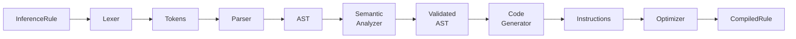

# LCS-DES-v0.10.2-KG-b: Design Specification — Rule Compiler

## 1. Metadata & Categorization

| Field | Value | Description |
| :--- | :--- | :--- |
| **Feature ID** | `KG-102-b` | Inference Engine sub-part b |
| **Feature Name** | `Rule Compiler` | Parse and compile rules to executable form |
| **Target Version** | `v0.10.2b` | Second sub-part of v0.10.2-KG |
| **Module Scope** | `Lexichord.Modules.CKVS` | Composite Knowledge & Versioned Store |
| **Swimlane** | `Knowledge Graph` | Knowledge Graph vertical |
| **License Tier** | `WriterPro` / `Teams` / `Enterprise` | Built-in + Custom rules support |
| **Feature Gate Key** | `FeatureFlags.CKVS.InferenceEngine` | Inference engine feature flag |
| **Author** | Lead Architect | |
| **Status** | `Draft` | |
| **Last Updated** | `2026-01-31` | |
| **Parent Document** | [LCS-SBD-v0.10.2-KG](./LCS-SBD-v0.10.2-KG.md) | Inference Engine scope |
| **Scope Breakdown** | [LCS-SBD-v0.10.2-KG S2.1](./LCS-SBD-v0.10.2-KG.md#21-sub-parts) | b = Rule Compiler |

---

## 2. Executive Summary

### 2.1 The Requirement

The Rule Compiler consumes rule DSL text (from v0.10.2a) and produces an executable representation. It must:

1. **Parse** DSL text into an abstract syntax tree (AST)
2. **Validate** rule structure, variable bindings, and entity/relationship references
3. **Compile** AST to executable bytecode-like instructions
4. **Detect** invalid patterns (unreachable conclusions, self-referential comparisons)
5. **Report** errors with line/column information for debugging

### 2.2 The Proposed Solution

Implement a multi-pass compiler pipeline:

1. **Lexer:** Tokenize DSL text
2. **Parser:** Build AST from tokens
3. **Semantic Analyzer:** Validate bindings and references
4. **Code Generator:** Convert AST to executable rule instructions
5. **Optimizer:** Apply simple optimizations (constant folding, reordering)

---

## 3. Architecture & Modular Strategy

### 3.1 Dependencies

#### 3.1.1 Upstream Dependencies

| Component | Source Version | Purpose |
| :--- | :--- | :--- |
| `IRuleDslParser` | v0.10.2a | Parse rule DSL to AST |
| `IGraphRepository` | v0.4.5e | Validate entity/relationship types |
| Entity Models | v0.4.5e | Entity type schema information |
| Relationship Models | v0.4.5e | Relationship type definitions |

#### 3.1.2 NuGet Packages

| Package | Version | Purpose |
| :--- | :--- | :--- |
| (None required) | | Compilation uses only standard C# |

### 3.2 Licensing Behavior

- **WriterPro Tier:** Compile built-in rules only (no custom rule compilation)
- **Teams Tier:** Compile up to 50 custom rules
- **Enterprise Tier:** Unlimited rule compilation

---

## 4. Data Contract (The API)

### 4.1 Compiled Rule Structure

```csharp
namespace Lexichord.Abstractions.Contracts.CKVS.Inference;

/// <summary>
/// A compiled rule ready for execution.
/// Contains the original AST plus bytecode-like instructions.
/// </summary>
public record CompiledRule
{
    /// <summary>
    /// The original rule definition.
    /// </summary>
    public required InferenceRule Original { get; init; }

    /// <summary>
    /// The parsed AST.
    /// </summary>
    public required RuleNode Ast { get; init; }

    /// <summary>
    /// Compiled condition instructions.
    /// </summary>
    public required IReadOnlyList<RuleInstruction> ConditionInstructions { get; init; }

    /// <summary>
    /// Compiled conclusion instructions.
    /// </summary>
    public required IReadOnlyList<RuleInstruction> ConclusionInstructions { get; init; }

    /// <summary>
    /// Variables bound during condition matching.
    /// Maps variable name (e.g., "?a") to binding context.
    /// </summary>
    public required IReadOnlyDictionary<string, VariableBinding> VariableBindings { get; init; }

    /// <summary>
    /// Entity types referenced in the rule.
    /// </summary>
    public IReadOnlyList<string> ReferencedEntityTypes { get; init; } = [];

    /// <summary>
    /// Relationship types referenced in the rule.
    /// </summary>
    public IReadOnlyList<string> ReferencedRelationshipTypes { get; init; } = [];

    /// <summary>
    /// Whether this rule has been validated against the schema.
    /// </summary>
    public bool IsValidated { get; init; } = false;

    /// <summary>
    /// Compilation timestamp.
    /// </summary>
    public DateTimeOffset CompiledAt { get; init; } = DateTimeOffset.UtcNow;
}

/// <summary>
/// Information about a variable binding in a rule.
/// </summary>
public record VariableBinding
{
    /// <summary>
    /// The variable name (e.g., "?a").
    /// </summary>
    public required string Name { get; init; }

    /// <summary>
    /// The instruction index where this variable is first bound.
    /// </summary>
    public required int FirstBoundAt { get; init; }

    /// <summary>
    /// The entity type this variable can bind to (if known).
    /// Null means any entity type.
    /// </summary>
    public string? ConstrainedToType { get; init; }

    /// <summary>
    /// Whether this variable is used in conclusions.
    /// </summary>
    public bool UsedInConclusions { get; init; }
}

/// <summary>
/// A single executable instruction in a compiled rule.
/// </summary>
public abstract record RuleInstruction;

/// <summary>
/// Match a relationship pattern.
/// Instruction: MATCH_PATTERN source relation target
/// </summary>
public record MatchPatternInstruction(
    string SourceVariable,
    string RelationshipType,
    string TargetVariable,
    bool IsLiteral,
    string? LiteralValue) : RuleInstruction;

/// <summary>
/// Check entity type.
/// Instruction: MATCH_TYPE variable entityType
/// </summary>
public record MatchTypeInstruction(
    string Variable,
    string EntityType) : RuleInstruction;

/// <summary>
/// Check property value.
/// Instruction: MATCH_PROPERTY variable propName operator value
/// </summary>
public record MatchPropertyInstruction(
    string Variable,
    string PropertyName,
    PropertyOperator Operator,
    object? Value) : RuleInstruction;

/// <summary>
/// Negate the next condition.
/// Instruction: NOT
/// </summary>
public record NegateInstruction : RuleInstruction;

/// <summary>
/// Compare two variables or values.
/// Instruction: COMPARE left operator right
/// </summary>
public record CompareInstruction(
    string LeftOperand,
    ComparisonOperator Operator,
    string RightOperand) : RuleInstruction;

/// <summary>
/// Derive a new relationship.
/// Instruction: DERIVE_REL source relation target
/// </summary>
public record DeriveRelationshipInstruction(
    string SourceVariable,
    string RelationshipType,
    string TargetVariable) : RuleInstruction;

/// <summary>
/// Derive a new property value.
/// Instruction: DERIVE_PROP variable propName value
/// </summary>
public record DerivePropertyInstruction(
    string Variable,
    string PropertyName,
    object? Value) : RuleInstruction;
```

### 4.2 Compiler Interface

```csharp
namespace Lexichord.Modules.CKVS.Inference;

/// <summary>
/// Compiles rule DSL to executable form.
/// </summary>
public interface IRuleCompiler
{
    /// <summary>
    /// Compiles a rule DSL string to a compiled rule.
    /// </summary>
    Task<RuleCompilationResult> CompileAsync(
        InferenceRule rule,
        CancellationToken ct = default);

    /// <summary>
    /// Validates a rule against the current schema without compiling.
    /// </summary>
    Task<RuleValidationResult> ValidateAsync(
        InferenceRule rule,
        CancellationToken ct = default);

    /// <summary>
    /// Batch compiles multiple rules.
    /// </summary>
    Task<IReadOnlyList<RuleCompilationResult>> CompileBatchAsync(
        IReadOnlyList<InferenceRule> rules,
        CancellationToken ct = default);
}

/// <summary>
/// Result of a rule compilation attempt.
/// </summary>
public record RuleCompilationResult
{
    /// <summary>
    /// Whether compilation succeeded.
    /// </summary>
    public bool Success { get; init; }

    /// <summary>
    /// The original rule definition.
    /// </summary>
    public required InferenceRule Rule { get; init; }

    /// <summary>
    /// Compiled rule if successful.
    /// </summary>
    public CompiledRule? Compiled { get; init; }

    /// <summary>
    /// Errors encountered during compilation.
    /// </summary>
    public IReadOnlyList<RuleCompilationError> Errors { get; init; } = [];

    /// <summary>
    /// Warnings (e.g., unreachable code).
    /// </summary>
    public IReadOnlyList<RuleCompilationWarning> Warnings { get; init; } = [];

    /// <summary>
    /// Compilation duration.
    /// </summary>
    public TimeSpan Duration { get; init; }
}

/// <summary>
/// An error during rule compilation.
/// </summary>
public record RuleCompilationError
{
    /// <summary>
    /// Error phase (Parse, Validate, Generate, etc.).
    /// </summary>
    public required RuleCompilationPhase Phase { get; init; }

    /// <summary>
    /// Error message.
    /// </summary>
    public required string Message { get; init; }

    /// <summary>
    /// Line number where error occurred.
    /// </summary>
    public int? Line { get; init; }

    /// <summary>
    /// Column number where error occurred.
    /// </summary>
    public int? Column { get; init; }

    /// <summary>
    /// Source code context.
    /// </summary>
    public string? Context { get; init; }
}

/// <summary>
/// A warning during compilation.
/// </summary>
public record RuleCompilationWarning
{
    /// <summary>
    /// Warning message.
    /// </summary>
    public required string Message { get; init; }

    /// <summary>
    /// Affected variable or entity.
    /// </summary>
    public string? Target { get; init; }
}

/// <summary>
/// Compilation phase where error occurred.
/// </summary>
public enum RuleCompilationPhase
{
    Parse = 1,
    Validate = 2,
    Generate = 3,
    Optimize = 4
}

/// <summary>
/// Result of rule validation without compilation.
/// </summary>
public record RuleValidationResult
{
    /// <summary>
    /// Whether the rule is valid.
    /// </summary>
    public bool IsValid { get; init; }

    /// <summary>
    /// Validation errors.
    /// </summary>
    public IReadOnlyList<RuleCompilationError> Errors { get; init; } = [];

    /// <summary>
    /// Validation warnings.
    /// </summary>
    public IReadOnlyList<RuleCompilationWarning> Warnings { get; init; } = [];
}
```

---

## 5. Compilation Pipeline

### 5.1 Phase 1: Lexical Analysis

Tokenize the DSL text:

```csharp
namespace Lexichord.Modules.CKVS.Inference;

/// <summary>
/// A token in the rule DSL.
/// </summary>
public record Token(
    TokenType Type,
    string Value,
    int Line,
    int Column);

/// <summary>
/// Token types in the rule DSL.
/// </summary>
public enum TokenType
{
    // Keywords
    RuleKeyword,
    DescriptionKeyword,
    WhenKeyword,
    ThenKeyword,
    DeriveKeyword,
    SetKeyword,
    HasKeyword,
    TypeKeyword,
    NotKeyword,
    AndKeyword,
    OrKeyword,
    MatchesKeyword,

    // Symbols
    LeftArrow,      // -[
    RightArrow,     // ]->
    Equals,         // =
    NotEquals,      // !=
    EqualsEquals,   // ==
    Quote,          // "
    LeftParen,      // (
    RightParen,     // )

    // Literals
    Variable,       // ?name
    Identifier,     // name
    StringLiteral,  // "..."
    Number,         // 123 or 1.23
    Boolean,        // true or false

    // Special
    Newline,
    Eof
}
```

### 5.2 Phase 2: Parsing

Build AST from token stream (delegated to `IRuleDslParser` from v0.10.2a).

### 5.3 Phase 3: Semantic Analysis

```csharp
namespace Lexichord.Modules.CKVS.Inference;

/// <summary>
/// Semantic analyzer for compiled rules.
/// </summary>
public interface IRuleSemanticAnalyzer
{
    /// <summary>
    /// Analyzes an AST for semantic correctness.
    /// </summary>
    Task<SemanticAnalysisResult> AnalyzeAsync(
        RuleNode ast,
        IGraphRepository graph,
        CancellationToken ct = default);
}

/// <summary>
/// Result of semantic analysis.
/// </summary>
public record SemanticAnalysisResult
{
    /// <summary>
    /// Whether analysis succeeded.
    /// </summary>
    public bool IsValid { get; init; }

    /// <summary>
    /// Semantic errors found.
    /// </summary>
    public IReadOnlyList<SemanticError> Errors { get; init; } = [];

    /// <summary>
    /// Variable binding information.
    /// </summary>
    public required IReadOnlyDictionary<string, VariableBinding> VariableBindings { get; init; }

    /// <summary>
    /// Entity types referenced.
    /// </summary>
    public IReadOnlyList<string> ReferencedEntityTypes { get; init; } = [];

    /// <summary>
    /// Relationship types referenced.
    /// </summary>
    public IReadOnlyList<string> ReferencedRelationshipTypes { get; init; } = [];
}

/// <summary>
/// A semantic error (beyond parsing).
/// </summary>
public record SemanticError
{
    /// <summary>
    /// Error category.
    /// </summary>
    public required SemanticErrorKind Kind { get; init; }

    /// <summary>
    /// Error message.
    /// </summary>
    public required string Message { get; init; }

    /// <summary>
    /// Affected element (variable, type, etc.).
    /// </summary>
    public string? Element { get; init; }
}

/// <summary>
/// Types of semantic errors.
/// </summary>
public enum SemanticErrorKind
{
    UnboundVariable = 1,
    DuplicateVariable = 2,
    InvalidEntityType = 3,
    InvalidRelationshipType = 4,
    InvalidPropertyName = 5,
    SelfComparison = 6,
    UnreachableConclusion = 7,
    InvalidNegation = 8
}
```

**Validation checks:**

1. **Variable binding:** All variables in conclusions must be bound in conditions
2. **Valid entity types:** Types referenced must exist in the graph schema
3. **Valid relationship types:** Relationship types must be defined or generic
4. **Valid properties:** Properties must exist on the entity types
5. **No self-comparison:** Rules like `?a != ?a` are invalid
6. **No pure negation:** At least one positive condition must exist
7. **Reachability:** All conclusion variables must be reachable from conditions

### 5.4 Phase 4: Code Generation

```csharp
namespace Lexichord.Modules.CKVS.Inference;

/// <summary>
/// Generates executable instructions from validated AST.
/// </summary>
public interface IRuleCodeGenerator
{
    /// <summary>
    /// Generates instructions from an AST.
    /// </summary>
    RuleInstructionSet Generate(
        RuleNode ast,
        SemanticAnalysisResult analysis);
}

/// <summary>
/// Set of generated instructions.
/// </summary>
public record RuleInstructionSet
{
    /// <summary>
    /// Condition instructions (evaluated against working memory).
    /// </summary>
    public required IReadOnlyList<RuleInstruction> Conditions { get; init; }

    /// <summary>
    /// Conclusion instructions (applied when conditions match).
    /// </summary>
    public required IReadOnlyList<RuleInstruction> Conclusions { get; init; }

    /// <summary>
    /// Variable binding order (optimization hint).
    /// </summary>
    public IReadOnlyList<string> VariableBindingOrder { get; init; } = [];
}
```

**Generation strategy:**

1. Convert each condition node to one or more instructions
2. Optimize instruction sequence (reorder for early filtering)
3. Generate conclusion instructions from conclusion nodes
4. Embed variable binding information

### 5.5 Phase 5: Optimization

```csharp
namespace Lexichord.Modules.CKVS.Inference;

/// <summary>
/// Optimizes generated instructions.
/// </summary>
public interface IRuleOptimizer
{
    /// <summary>
    /// Optimizes an instruction set.
    /// </summary>
    RuleInstructionSet Optimize(RuleInstructionSet instructions);
}
```

**Optimization passes:**

1. **Constant folding:** Simplify constant comparisons
2. **Instruction reordering:** Move most selective conditions first
3. **Dead code elimination:** Remove unreachable instructions
4. **Instruction fusion:** Combine adjacent compatible instructions

---

## 6. Error Detection & Reporting

### 6.1 Common Compilation Errors

| Error | Cause | Fix |
| :--- | :--- | :--- |
| Unbound variable in conclusion | Variable appears in THEN but not WHEN | Add condition binding the variable |
| Invalid entity type | Entity type doesn't exist in schema | Check spelling or use generic type |
| Invalid relationship type | Relationship type undefined | Define relationship type first |
| Unreachable conclusion | No path to bind variables | Add intermediate conditions |
| Self-referential comparison | e.g., `?a != ?a` | Compare different variables |
| Invalid property name | Property doesn't exist on entity | Check property exists in schema |

### 6.2 Error Messages with Context

```
Error: Unbound variable in conclusion
  Rule: "Grandparent Inference"
  Location: Line 6, Column 18
  Context: DERIVE ?a -[GRANDPARENT_OF]-> ?unknown
           ^^^^^^^^^^^^^^^^^^^^^^^^^^^^^^^^^^^^^^
  Message: Variable ?unknown is not bound in WHEN clause.
           Bound variables: ?a, ?b, ?c
  Fix: Add a condition that binds ?unknown, e.g., ?b -[PARENT_OF]-> ?unknown
```

---

## 7. Implementation Strategy

### 7.1 Compilation Flow



### 7.2 Schema Caching

- Cache entity/relationship type information to avoid repeated lookups
- Invalidate cache on schema changes
- Use IGraphRepository for schema queries

---

## 8. Testing

### 8.1 Unit Tests

```csharp
[TestClass]
public class RuleCompilerTests
{
    private readonly IRuleCompiler _compiler = new RuleCompiler(
        _parser,
        _analyzer,
        _generator,
        _optimizer);

    [TestMethod]
    public async Task CompileRule_SimpleTransitivity_Succeeds()
    {
        var rule = new InferenceRule
        {
            RuleId = Guid.NewGuid(),
            Name = "Grandparent",
            Condition = "?a -[PARENT_OF]-> ?b\n?b -[PARENT_OF]-> ?c",
            Conclusion = "DERIVE ?a -[GRANDPARENT_OF]-> ?c"
        };

        var result = await _compiler.CompileAsync(rule);
        Assert.IsTrue(result.Success);
        Assert.IsNotNull(result.Compiled);
    }

    [TestMethod]
    public async Task CompileRule_UnboundVariable_ReturnsError()
    {
        var rule = new InferenceRule
        {
            RuleId = Guid.NewGuid(),
            Name = "Bad Rule",
            Condition = "?a -[PARENT_OF]-> ?b",
            Conclusion = "DERIVE ?a -[GRANDPARENT_OF]-> ?unknown"
        };

        var result = await _compiler.CompileAsync(rule);
        Assert.IsFalse(result.Success);
        Assert.IsTrue(result.Errors.Any(e =>
            e.Message.Contains("?unknown")));
    }

    [TestMethod]
    public async Task ValidateRule_InvalidEntityType_ReturnsError()
    {
        var rule = new InferenceRule
        {
            RuleId = Guid.NewGuid(),
            Name = "Bad Type",
            Condition = "?a TYPE \"NonExistentType\"",
            Conclusion = "DERIVE ?a -[IS_A]-> \"SomeType\""
        };

        var result = await _compiler.ValidateAsync(rule);
        Assert.IsFalse(result.IsValid);
        Assert.IsTrue(result.Errors.Any(e =>
            e.Message.Contains("NonExistentType")));
    }

    [TestMethod]
    public async Task CompileRule_SelfComparison_ReturnsError()
    {
        var rule = new InferenceRule
        {
            RuleId = Guid.NewGuid(),
            Name = "Bad Comparison",
            Condition = "?a != ?a",
            Conclusion = "DERIVE ?a HAS invalid = true"
        };

        var result = await _compiler.CompileAsync(rule);
        Assert.IsFalse(result.Success);
        Assert.IsTrue(result.Errors.Any(e =>
            e.Message.Contains("self")));
    }
}
```

### 8.2 Integration Tests

```csharp
[TestClass]
public class RuleCompilerIntegrationTests
{
    [TestMethod]
    public async Task CompileAndStore_AllBuiltInRules_Succeed()
    {
        var builtInRules = new[]
        {
            BuiltInRuleDsl.GrandparentInference,
            BuiltInRuleDsl.ServiceDependency,
            BuiltInRuleDsl.DocumentDependency,
            BuiltInRuleDsl.AuthPropagation,
            BuiltInRuleDsl.DeprecationPropagation
        };

        // Convert to InferenceRule records and compile
        foreach (var ruleDsl in builtInRules)
        {
            var rule = ParseBuiltInRule(ruleDsl);
            var result = await _compiler.CompileAsync(rule);
            Assert.IsTrue(result.Success);
            Assert.IsNotNull(result.Compiled);
        }
    }
}
```

---

## 9. Error Handling

### 9.1 Graceful Degradation

- Lexer errors: Stop at first error, report line/column
- Parser errors: Continue parsing to find additional errors
- Semantic errors: Collect all errors before failing
- Code generation: Only attempt if semantics valid

### 9.2 Recovery Strategies

- Skip invalid rules during batch compilation
- Provide detailed error messages for debugging
- Suggest fixes based on error pattern

---

## 10. Security & Safety

| Risk | Level | Mitigation |
| :--- | :--- | :--- |
| Unbounded execution | Low | Checked at compile time (MaxDepth validation) |
| Memory explosion | Low | Instruction set size limits |
| Code injection | Low | DSL tokenization prevents arbitrary code |

---

## 11. Performance Considerations

| Operation | Target | Implementation |
| :--- | :--- | :--- |
| Compile single rule | <50ms | Single-pass semantic analysis |
| Batch compile 50 rules | <2.5s | Parallel compilation with schema cache |
| Schema validation | <1ms per type | Cached lookups |
| Code generation | <10ms | Instruction generation without optimization |

---

## 12. License Gating

| Tier | Support |
| :--- | :--- |
| **Core** | Not available |
| **WriterPro** | Built-in rules only (no custom compilation) |
| **Teams** | Compile up to 50 custom rules |
| **Enterprise** | Unlimited rule compilation |

---

## 13. Acceptance Criteria

| # | Given | When | Then |
| :--- | :--- | :--- | :--- |
| 1 | Valid rule DSL | Compiled | CompiledRule created with valid instructions |
| 2 | Unbound variable | Compiled | Error reported with variable name |
| 3 | Invalid entity type | Validated | Error reports invalid type name |
| 4 | Valid rule batch | Compiled | All rules compiled, results list returned |
| 5 | Rule with negation | Compiled | NegateInstruction generated correctly |
| 6 | Self-comparison | Compiled | Error: "self-referential comparison" |
| 7 | Built-in rules | Compiled | All 5 built-in rules compile successfully |
| 8 | Error reporting | Compilation | Line/column and context included |

---

## 14. Changelog

| Version | Date | Changes |
| :--- | :--- | :--- |
| 1.0 | 2026-01-31 | Initial specification - compilation pipeline, code generation, error handling |
