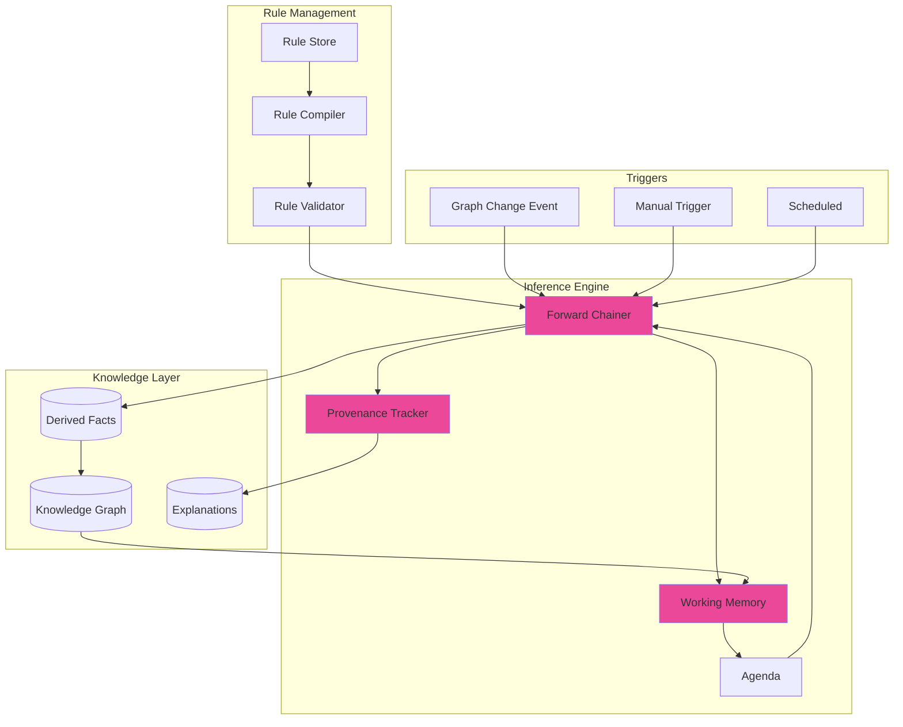
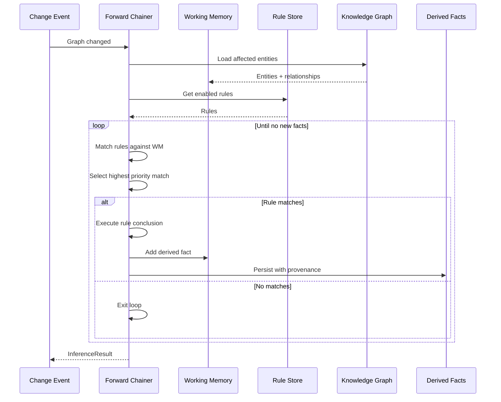
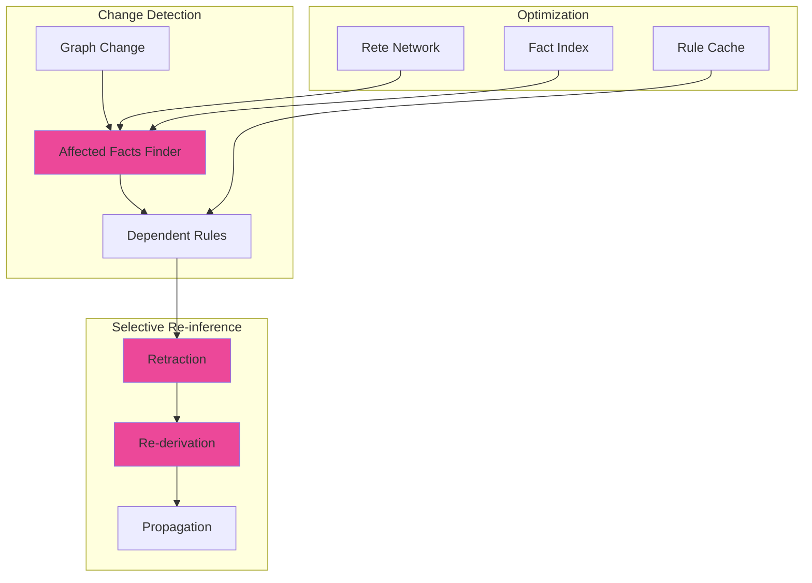

# LCS-SBD-102-KG: Scope Overview — Inference Engine

## Document Control

| Field            | Value                                                        |
| :--------------- | :----------------------------------------------------------- |
| **Document ID**  | LCS-SBD-102-KG                                               |
| **Version**      | v0.10.2                                                      |
| **Codename**     | Inference Engine (CKVS Phase 5b)                             |
| **Status**       | Draft                                                        |
| **Last Updated** | 2026-01-31                                                   |
| **Owner**        | Lead Architect                                               |
| **Depends On**   | v0.4.6-KG (Axiom Store), v0.6.5-KG (Validation Engine)       |

---

## 1. Executive Summary

### 1.1 The Vision

**v0.10.2-KG** delivers an **Inference Engine** — automated reasoning over axioms to derive new facts from existing knowledge. Unlike the Axiom Validator (v0.6.5g) which checks constraints, the Inference Engine creates new relationships and claims through logical deduction.

Examples:
- If "A is parent of B" and "B is parent of C", infer "A is grandparent of C"
- If "API endpoint X requires auth" and "Y calls X", infer "Y requires auth"
- If "Document A defines Entity E" and "Document B references E", infer "B depends on A"

### 1.2 Business Value

- **Knowledge Enrichment:** Automatically discover implicit relationships.
- **Consistency Propagation:** Derived facts stay consistent with source facts.
- **Query Enhancement:** Find connections not explicitly stated.
- **Documentation Intelligence:** Understand dependencies automatically.
- **Reduced Manual Work:** No need to manually create obvious relationships.

### 1.3 Success Criteria

1. Forward-chaining inference from axiom rules.
2. Derived facts distinguished from asserted facts.
3. Explanation/provenance for inferred relationships.
4. Incremental inference (only recompute affected derivations).
5. Configurable inference depth and scope.
6. <5 second inference for typical workspace changes.

---

## 2. Key Deliverables

### 2.1 Sub-Parts

| Sub-Part | Title | Description | Est. Hours |
|:---------|:------|:------------|:-----------|
| v0.10.2a | Inference Rule Language | DSL for defining inference rules | 8 |
| v0.10.2b | Rule Compiler | Parse and compile rules to executable form | 6 |
| v0.10.2c | Forward Chainer | Execute rules to derive new facts | 10 |
| v0.10.2d | Incremental Inference | Recompute only affected derivations | 8 |
| v0.10.2e | Provenance Tracker | Track derivation chains for explanations | 6 |
| v0.10.2f | Inference UI | Configure rules and view derived facts | 5 |
| **Total** | | | **43 hours** |

### 2.2 Key Interfaces

```csharp
/// <summary>
/// Executes inference rules to derive new facts.
/// </summary>
public interface IInferenceEngine
{
    /// <summary>
    /// Runs inference and returns derived facts.
    /// </summary>
    Task<InferenceResult> InferAsync(
        InferenceOptions options,
        CancellationToken ct = default);

    /// <summary>
    /// Runs incremental inference after graph changes.
    /// </summary>
    Task<InferenceResult> InferIncrementalAsync(
        IReadOnlyList<GraphChange> changes,
        CancellationToken ct = default);

    /// <summary>
    /// Explains how a fact was derived.
    /// </summary>
    Task<DerivationExplanation?> ExplainAsync(
        Guid factId,
        CancellationToken ct = default);

    /// <summary>
    /// Validates inference rules without executing.
    /// </summary>
    Task<RuleValidationResult> ValidateRulesAsync(
        IReadOnlyList<InferenceRule> rules,
        CancellationToken ct = default);
}

/// <summary>
/// Result of an inference run.
/// </summary>
public record InferenceResult
{
    public InferenceStatus Status { get; init; }
    public int FactsDerived { get; init; }
    public int FactsRetracted { get; init; }
    public int RulesEvaluated { get; init; }
    public TimeSpan Duration { get; init; }
    public IReadOnlyList<DerivedFact> NewFacts { get; init; } = [];
    public IReadOnlyList<InferenceWarning> Warnings { get; init; } = [];
}

public enum InferenceStatus { Success, PartialSuccess, CycleDetected, RuleError }

/// <summary>
/// A fact derived through inference.
/// </summary>
public record DerivedFact
{
    public Guid FactId { get; init; }
    public DerivedFactType FactType { get; init; }
    public Guid? SourceEntityId { get; init; }
    public Guid? TargetEntityId { get; init; }
    public string? RelationshipType { get; init; }
    public string? PropertyName { get; init; }
    public object? PropertyValue { get; init; }
    public Guid RuleId { get; init; }
    public float Confidence { get; init; } = 1.0f;
    public DateTimeOffset DerivedAt { get; init; }
}

public enum DerivedFactType { Relationship, Property, Claim }

/// <summary>
/// An inference rule definition.
/// </summary>
public record InferenceRule
{
    public Guid RuleId { get; init; }
    public required string Name { get; init; }
    public string? Description { get; init; }
    public required string Condition { get; init; }  // Rule DSL
    public required string Conclusion { get; init; } // What to derive
    public int Priority { get; init; } = 100;
    public bool IsEnabled { get; init; } = true;
    public InferenceRuleScope Scope { get; init; } = InferenceRuleScope.Workspace;
}

public enum InferenceRuleScope { Workspace, Project, Global }

/// <summary>
/// Explanation of how a fact was derived.
/// </summary>
public record DerivationExplanation
{
    public Guid FactId { get; init; }
    public Guid RuleId { get; init; }
    public string RuleName { get; init; } = "";
    public IReadOnlyList<DerivationPremise> Premises { get; init; } = [];
    public string NaturalLanguageExplanation { get; init; } = "";
    public int DerivationDepth { get; init; }
}

public record DerivationPremise
{
    public Guid FactId { get; init; }
    public bool IsDerived { get; init; }
    public string Description { get; init; } = "";
    public DerivationExplanation? NestedExplanation { get; init; }
}

/// <summary>
/// Options for inference execution.
/// </summary>
public record InferenceOptions
{
    public int MaxDepth { get; init; } = 10;
    public int MaxIterations { get; init; } = 1000;
    public TimeSpan Timeout { get; init; } = TimeSpan.FromSeconds(30);
    public IReadOnlyList<Guid>? RuleIds { get; init; }
    public IReadOnlyList<string>? EntityTypes { get; init; }
    public bool DryRun { get; init; } = false;
}
```

### 2.3 Inference Rule DSL

```
// Rule Language Syntax

// Simple transitivity rule
RULE "Grandparent Inference"
WHEN
    ?a -[PARENT_OF]-> ?b
    ?b -[PARENT_OF]-> ?c
THEN
    DERIVE ?a -[GRANDPARENT_OF]-> ?c

// Property propagation rule
RULE "Auth Requirement Propagation"
WHEN
    ?endpoint HAS requiresAuth = true
    ?caller -[CALLS]-> ?endpoint
THEN
    DERIVE ?caller HAS requiresAuth = true

// Type-based inference
RULE "API Endpoint Classification"
WHEN
    ?entity TYPE "Endpoint"
    ?entity HAS method = "GET"
    ?entity HAS path MATCHES "/api/*/search"
THEN
    DERIVE ?entity -[IS_A]-> "SearchEndpoint"

// Conditional with negation
RULE "Public Endpoint Detection"
WHEN
    ?endpoint TYPE "Endpoint"
    NOT ?endpoint HAS requiresAuth = true
    NOT ?endpoint -[PROTECTED_BY]-> ?authProvider
THEN
    DERIVE ?endpoint HAS isPublic = true

// Aggregation rule
RULE "Document Dependency"
WHEN
    ?doc1 TYPE "Document"
    ?doc2 TYPE "Document"
    ?entity -[DEFINED_IN]-> ?doc1
    ?entity -[REFERENCED_IN]-> ?doc2
    ?doc1 != ?doc2
THEN
    DERIVE ?doc2 -[DEPENDS_ON]-> ?doc1
```

### 2.4 Inference Architecture



---

## 3. Forward Chaining Flow



---

## 4. Incremental Inference



When a fact changes:
1. Find all derived facts that depended on changed fact
2. Retract those derived facts
3. Re-run relevant rules with new data
4. Propagate changes to downstream derivations

---

## 5. Explanation UI

```
┌────────────────────────────────────────────────────────────────┐
│ Derived Relationship Explanation                    [Close]    │
├────────────────────────────────────────────────────────────────┤
│                                                                │
│ Relationship: UserService ──[DEPENDS_ON]──▶ AuthService       │
│ Type: Derived (not explicitly stated)                         │
│ Confidence: 100%                                              │
│                                                                │
│ ┌──────────────────────────────────────────────────────────┐  │
│ │ Why this relationship exists:                            │  │
│ │                                                          │  │
│ │ "UserService depends on AuthService because UserService  │  │
│ │  calls the /auth/validate endpoint, which is defined in  │  │
│ │  AuthService."                                           │  │
│ └──────────────────────────────────────────────────────────┘  │
│                                                                │
│ Derivation Chain:                                              │
│                                                                │
│ ┌─ Rule: "Service Dependency Detection" (priority: 100)       │
│ │                                                              │
│ │  Premise 1: (Asserted)                                      │
│ │  └─ UserService -[CALLS]-> GET /auth/validate               │
│ │     Source: user-service.md, line 45                        │
│ │                                                              │
│ │  Premise 2: (Asserted)                                      │
│ │  └─ GET /auth/validate -[DEFINED_IN]-> AuthService          │
│ │     Source: auth-service.md, line 12                        │
│ │                                                              │
│ │  Conclusion:                                                 │
│ │  └─ UserService -[DEPENDS_ON]-> AuthService                 │
│ └──────────────────────────────────────────────────────────────│
│                                                                │
│ [View Rule] [View Source Documents] [Mark as Incorrect]       │
└────────────────────────────────────────────────────────────────┘
```

---

## 6. Built-in Rules

```yaml
# Default inference rules shipped with CKVS

rules:
  - id: transitivity-parent
    name: "Grandparent Inference"
    description: "Infer grandparent relationships from parent chains"
    condition: |
      ?a -[PARENT_OF]-> ?b
      ?b -[PARENT_OF]-> ?c
    conclusion: "?a -[GRANDPARENT_OF]-> ?c"
    priority: 100

  - id: service-dependency
    name: "Service Dependency Detection"
    description: "Infer service dependencies from API calls"
    condition: |
      ?service1 -[CALLS]-> ?endpoint
      ?endpoint -[DEFINED_IN]-> ?service2
      ?service1 != ?service2
    conclusion: "?service1 -[DEPENDS_ON]-> ?service2"
    priority: 90

  - id: document-dependency
    name: "Document Dependency"
    description: "Infer document dependencies from entity references"
    condition: |
      ?entity -[DEFINED_IN]-> ?doc1
      ?entity -[REFERENCED_IN]-> ?doc2
      ?doc1 != ?doc2
    conclusion: "?doc2 -[DEPENDS_ON]-> ?doc1"
    priority: 80

  - id: auth-propagation
    name: "Auth Requirement Propagation"
    description: "Propagate auth requirements through call chains"
    condition: |
      ?callee HAS requiresAuth = true
      ?caller -[CALLS]-> ?callee
    conclusion: "?caller HAS requiresAuth = true"
    priority: 70

  - id: deprecated-propagation
    name: "Deprecation Propagation"
    description: "Mark callers of deprecated endpoints as affected"
    condition: |
      ?endpoint HAS deprecated = true
      ?caller -[CALLS]-> ?endpoint
    conclusion: "?caller HAS usesDeprecated = true"
    priority: 60
```

---

## 7. Dependencies

| Component | Source | Usage |
|:----------|:-------|:------|
| `IAxiomStore` | v0.4.6-KG | Store inference rules |
| `IGraphRepository` | v0.4.5e | Read/write facts |
| `IValidationEngine` | v0.6.5-KG | Validate derived facts |
| `ISyncService` | v0.7.6-KG | Trigger on graph changes |
| `IMediator` | v0.0.7a | Event publishing |

---

## 8. License Gating

| Tier | Inference Engine |
|:-----|:-----------------|
| Core | Not available |
| WriterPro | Built-in rules only |
| Teams | Custom rules (up to 50) |
| Enterprise | Unlimited rules + API access |

---

## 9. Performance Targets

| Metric | Target | Measurement |
|:-------|:-------|:------------|
| Incremental inference | <2s | P95 timing |
| Full workspace inference | <30s | P95 timing |
| Rule compilation | <100ms | P95 timing |
| Explanation generation | <500ms | P95 timing |

---

## 10. Risks & Mitigations

| Risk | Mitigation |
|:-----|:-----------|
| Infinite loops | Cycle detection, max iterations |
| Explosion of facts | Scope limits, rule priorities |
| Incorrect inferences | Explanation UI, manual override |
| Performance at scale | Rete algorithm, incremental updates |

---
