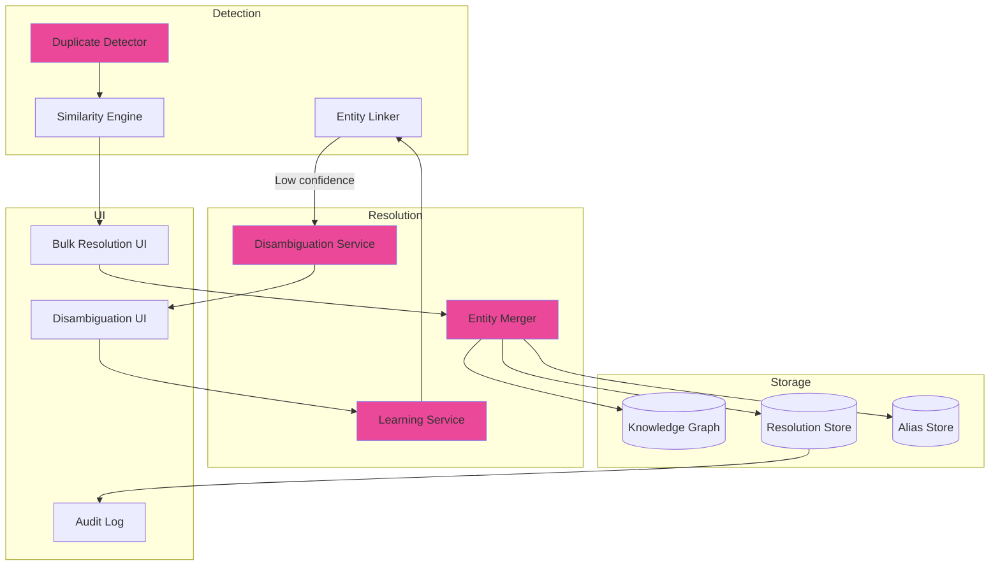
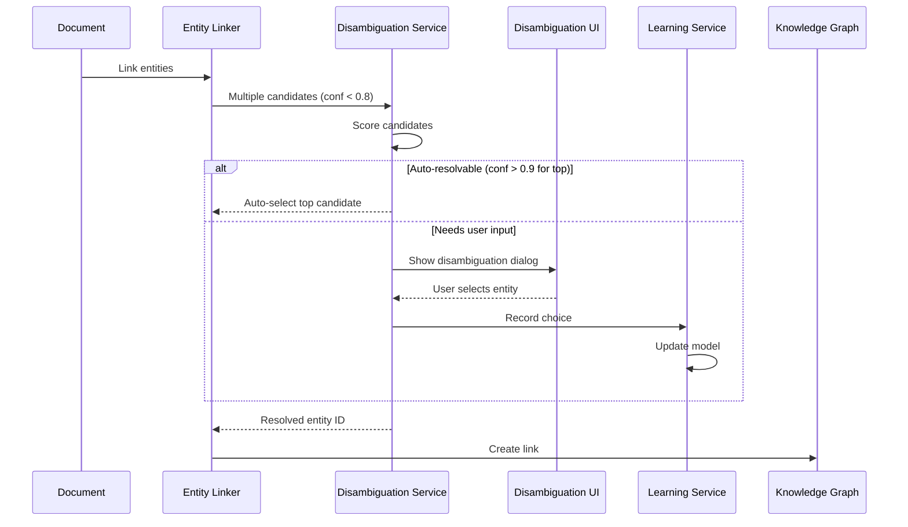
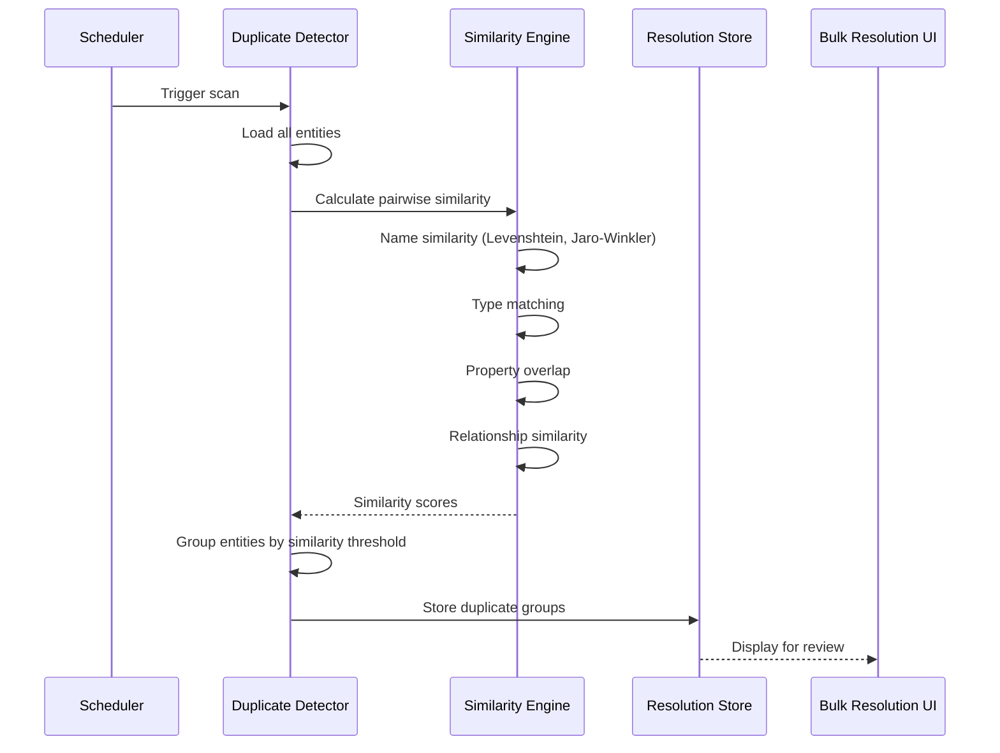

# LCS-SBD-103-KG: Scope Overview — Entity Resolution

## Document Control

| Field            | Value                                                        |
| :--------------- | :----------------------------------------------------------- |
| **Document ID**  | LCS-SBD-103-KG                                               |
| **Version**      | v0.10.3                                                      |
| **Codename**     | Entity Resolution (CKVS Phase 5c)                            |
| **Status**       | Draft                                                        |
| **Last Updated** | 2026-01-31                                                   |
| **Owner**        | Lead Architect                                               |
| **Depends On**   | v0.5.5-KG (Entity Linking), v0.4.7-KG (Entity Browser)       |

---

## 1. Executive Summary

### 1.1 The Vision

**v0.10.3-KG** delivers **Entity Resolution** — workflows for disambiguating uncertain entity matches and deduplicating entities that represent the same real-world concept. This addresses two gaps:

1. **Disambiguation:** When entity linking finds multiple possible matches for a mention, guide users to select the correct one.
2. **Deduplication:** When the same entity exists under different names across documents, merge them into a single canonical entity.

### 1.2 Business Value

- **Accuracy:** Eliminate ambiguous entity links.
- **Cleaner Graph:** No duplicate entities cluttering the knowledge base.
- **User Guidance:** Clear workflow for resolving uncertainties.
- **Bulk Operations:** Handle deduplication at scale.
- **Learning:** System improves disambiguation over time.

### 1.3 Success Criteria

1. Disambiguation UI when linking confidence < threshold.
2. Automated duplicate detection with confidence scoring.
3. Merge workflow preserving relationships from both entities.
4. Bulk deduplication with review/approve flow.
5. Learning from user decisions to improve future matching.
6. <1% false positive rate for auto-merge suggestions.

---

## 2. Key Deliverables

### 2.1 Sub-Parts

| Sub-Part | Title | Description | Est. Hours |
|:---------|:------|:------------|:-----------|
| v0.10.3a | Disambiguation Service | Handle uncertain entity matches | 6 |
| v0.10.3b | Duplicate Detector | Find potential duplicate entities | 8 |
| v0.10.3c | Entity Merger | Merge entities preserving relationships | 8 |
| v0.10.3d | Resolution Learning | Learn from user disambiguation choices | 6 |
| v0.10.3e | Bulk Resolution UI | Review and resolve duplicates at scale | 6 |
| v0.10.3f | Resolution Audit | Track all resolution decisions | 4 |
| **Total** | | | **38 hours** |

### 2.2 Key Interfaces

```csharp
/// <summary>
/// Handles entity disambiguation when linking is uncertain.
/// </summary>
public interface IDisambiguationService
{
    /// <summary>
    /// Gets disambiguation candidates for a mention.
    /// </summary>
    Task<DisambiguationResult> GetCandidatesAsync(
        EntityMention mention,
        DisambiguationOptions options,
        CancellationToken ct = default);

    /// <summary>
    /// Records user's disambiguation choice for learning.
    /// </summary>
    Task RecordChoiceAsync(
        Guid mentionId,
        Guid chosenEntityId,
        DisambiguationFeedback feedback,
        CancellationToken ct = default);

    /// <summary>
    /// Creates a new entity from an unmatched mention.
    /// </summary>
    Task<Entity> CreateFromMentionAsync(
        EntityMention mention,
        EntityCreationOptions options,
        CancellationToken ct = default);
}

public record DisambiguationResult
{
    public Guid MentionId { get; init; }
    public string MentionText { get; init; } = "";
    public IReadOnlyList<DisambiguationCandidate> Candidates { get; init; } = [];
    public bool RequiresUserInput { get; init; }
    public Guid? AutoSelectedId { get; init; }
}

public record DisambiguationCandidate
{
    public Guid EntityId { get; init; }
    public string EntityName { get; init; } = "";
    public string EntityType { get; init; } = "";
    public float ConfidenceScore { get; init; }
    public IReadOnlyList<string> MatchReasons { get; init; } = [];
    public string? ContextSnippet { get; init; }
}

/// <summary>
/// Detects and manages duplicate entities.
/// </summary>
public interface IDuplicateDetector
{
    /// <summary>
    /// Scans for potential duplicates across the graph.
    /// </summary>
    Task<DuplicateScanResult> ScanForDuplicatesAsync(
        DuplicateScanOptions options,
        CancellationToken ct = default);

    /// <summary>
    /// Checks if a specific entity has potential duplicates.
    /// </summary>
    Task<IReadOnlyList<DuplicateCandidate>> FindDuplicatesOfAsync(
        Guid entityId,
        CancellationToken ct = default);

    /// <summary>
    /// Gets duplicate groups for review.
    /// </summary>
    Task<IReadOnlyList<DuplicateGroup>> GetDuplicateGroupsAsync(
        DuplicateGroupFilter filter,
        CancellationToken ct = default);
}

public record DuplicateScanResult
{
    public int EntitiesScanned { get; init; }
    public int DuplicateGroupsFound { get; init; }
    public int TotalDuplicates { get; init; }
    public TimeSpan ScanDuration { get; init; }
    public IReadOnlyList<DuplicateGroup> Groups { get; init; } = [];
}

public record DuplicateGroup
{
    public Guid GroupId { get; init; }
    public IReadOnlyList<DuplicateCandidate> Entities { get; init; } = [];
    public float GroupConfidence { get; init; }
    public DuplicateType DuplicateType { get; init; }
    public Guid? SuggestedPrimaryId { get; init; }
}

public record DuplicateCandidate
{
    public Guid EntityId { get; init; }
    public string EntityName { get; init; } = "";
    public string EntityType { get; init; } = "";
    public int RelationshipCount { get; init; }
    public int ClaimCount { get; init; }
    public int DocumentCount { get; init; }
    public DateTimeOffset CreatedAt { get; init; }
    public DateTimeOffset LastModified { get; init; }
}

public enum DuplicateType
{
    ExactName,          // Same name, different case
    SimilarName,        // Fuzzy name match
    AliasMatch,         // Known aliases
    ContentSimilarity,  // Similar properties/claims
    CrossDocument       // Same entity in different docs
}

/// <summary>
/// Merges duplicate entities into a single canonical entity.
/// </summary>
public interface IEntityMerger
{
    /// <summary>
    /// Previews a merge without executing it.
    /// </summary>
    Task<MergePreview> PreviewMergeAsync(
        Guid primaryEntityId,
        IReadOnlyList<Guid> secondaryEntityIds,
        MergeOptions options,
        CancellationToken ct = default);

    /// <summary>
    /// Executes a merge operation.
    /// </summary>
    Task<MergeResult> MergeAsync(
        Guid primaryEntityId,
        IReadOnlyList<Guid> secondaryEntityIds,
        MergeOptions options,
        CancellationToken ct = default);

    /// <summary>
    /// Undoes a merge operation.
    /// </summary>
    Task<UnmergeResult> UnmergeAsync(
        Guid mergeOperationId,
        CancellationToken ct = default);
}

public record MergePreview
{
    public Guid PrimaryEntityId { get; init; }
    public string PrimaryEntityName { get; init; } = "";
    public IReadOnlyList<Guid> SecondaryEntityIds { get; init; } = [];
    public int RelationshipsToTransfer { get; init; }
    public int ClaimsToTransfer { get; init; }
    public int DocumentLinksToUpdate { get; init; }
    public IReadOnlyList<MergeConflict> Conflicts { get; init; } = [];
    public IReadOnlyList<PropertyMerge> PropertyMerges { get; init; } = [];
}

public record MergeConflict
{
    public string PropertyName { get; init; } = "";
    public object? PrimaryValue { get; init; }
    public object? SecondaryValue { get; init; }
    public MergeConflictResolution SuggestedResolution { get; init; }
}

public enum MergeConflictResolution
{
    KeepPrimary,
    KeepSecondary,
    KeepBoth,      // For multi-value properties
    Manual
}

public record MergeResult
{
    public Guid MergeOperationId { get; init; }
    public Guid PrimaryEntityId { get; init; }
    public IReadOnlyList<Guid> MergedEntityIds { get; init; } = [];
    public int RelationshipsTransferred { get; init; }
    public int ClaimsTransferred { get; init; }
    public int DocumentLinksUpdated { get; init; }
    public bool CanUndo { get; init; }
}

public record MergeOptions
{
    public MergeConflictResolution DefaultConflictResolution { get; init; } = MergeConflictResolution.KeepPrimary;
    public bool CreateAliases { get; init; } = true;
    public bool UpdateDocumentLinks { get; init; } = true;
    public bool PreserveHistory { get; init; } = true;
}
```

### 2.3 Entity Resolution Architecture



---

## 3. Disambiguation Flow



---

## 4. Disambiguation UI

```
┌────────────────────────────────────────────────────────────────┐
│ Disambiguate Entity Reference                       [Close]    │
├────────────────────────────────────────────────────────────────┤
│                                                                │
│ In your document "api-guide.md":                              │
│                                                                │
│ "...the user service calls the **authentication endpoint**    │
│  to validate tokens before processing requests..."            │
│                                                                │
│ Which entity does "authentication endpoint" refer to?         │
│                                                                │
│ ┌────────────────────────────────────────────────────────────┐ │
│ │ ○ POST /auth/login                              [85% match]│ │
│ │   Type: Endpoint | In: auth-service.md                    │ │
│ │   "Authenticates user with credentials"                   │ │
│ ├────────────────────────────────────────────────────────────┤ │
│ │ ◉ POST /auth/validate                           [82% match]│ │
│ │   Type: Endpoint | In: auth-service.md                    │ │
│ │   "Validates an existing authentication token"            │ │
│ ├────────────────────────────────────────────────────────────┤ │
│ │ ○ GET /auth/token                               [71% match]│ │
│ │   Type: Endpoint | In: auth-service.md                    │ │
│ │   "Retrieves current auth token info"                     │ │
│ └────────────────────────────────────────────────────────────┘ │
│                                                                │
│ ☐ Remember this choice for similar mentions                   │
│                                                                │
│ [None of these - Create New Entity] [Link Selected]           │
└────────────────────────────────────────────────────────────────┘
```

---

## 5. Duplicate Detection Flow



---

## 6. Bulk Resolution UI

```
┌────────────────────────────────────────────────────────────────┐
│ Duplicate Entity Resolution                          [Scan]    │
├────────────────────────────────────────────────────────────────┤
│                                                                │
│ Found 12 potential duplicate groups (47 entities)             │
│                                                                │
│ Filter: [All Types ▼] [All Confidence ▼] [Unresolved ▼]       │
│                                                                │
│ ┌────────────────────────────────────────────────────────────┐ │
│ │ Group 1: "User" entities                    [95% confident]│ │
│ │ ┌────────────────────────────────────────────────────────┐ │ │
│ │ │ ◉ User (primary)                     12 refs, 8 claims │ │ │
│ │ │   In: user-model.md                                    │ │ │
│ │ │ ○ UserEntity                          3 refs, 2 claims │ │ │
│ │ │   In: database-schema.md                               │ │ │
│ │ │ ○ UserRecord                          1 ref,  0 claims │ │ │
│ │ │   In: legacy-api.md                                    │ │ │
│ │ └────────────────────────────────────────────────────────┘ │ │
│ │ Merge action: Keep "User", create aliases for others      │ │
│ │ [Preview Merge] [Merge] [Not Duplicates] [Skip]           │ │
│ ├────────────────────────────────────────────────────────────┤ │
│ │ Group 2: "Auth" endpoints                   [87% confident]│ │
│ │ ┌────────────────────────────────────────────────────────┐ │ │
│ │ │ ○ POST /api/auth/login                                 │ │ │
│ │ │ ○ POST /auth/login                                     │ │ │
│ │ └────────────────────────────────────────────────────────┘ │ │
│ │ [Preview Merge] [Merge] [Not Duplicates] [Skip]           │ │
│ └────────────────────────────────────────────────────────────┘ │
│                                                                │
│ Batch Actions: [Merge All High-Confidence (>90%)]             │
│               [Export Report] [Mark All as Reviewed]          │
│                                                                │
│ Progress: 3 of 12 groups resolved                             │
└────────────────────────────────────────────────────────────────┘
```

---

## 7. Merge Preview

```
┌────────────────────────────────────────────────────────────────┐
│ Merge Preview                                       [Close]    │
├────────────────────────────────────────────────────────────────┤
│                                                                │
│ Primary Entity: User                                           │
│ Merging: UserEntity, UserRecord                               │
│                                                                │
│ Changes:                                                       │
│ ├── Relationships: 4 will be transferred                      │
│ │   └── UserEntity -[HAS_FIELD]-> id (→ User)                │
│ │   └── UserEntity -[HAS_FIELD]-> email (→ User)             │
│ │   └── UserRecord -[STORED_IN]-> legacy_db (→ User)         │
│ │   └── UserRecord -[USED_BY]-> LegacyAPI (→ User)           │
│ │                                                              │
│ ├── Claims: 2 will be transferred                             │
│ │   └── "UserEntity has primary key 'id'" (→ User)           │
│ │   └── "UserEntity is stored in PostgreSQL" (→ User)        │
│ │                                                              │
│ ├── Document Links: 2 files will be updated                   │
│ │   └── database-schema.md: 3 references                     │
│ │   └── legacy-api.md: 1 reference                           │
│ │                                                              │
│ └── Aliases: 2 will be created                                │
│     └── "UserEntity" → User                                   │
│     └── "UserRecord" → User                                   │
│                                                                │
│ ⚠ Property Conflicts:                                         │
│ ┌──────────────────────────────────────────────────────────┐  │
│ │ description:                                              │  │
│ │   User: "Represents a registered user"                    │  │
│ │   UserEntity: "Database entity for users"                 │  │
│ │   Resolution: ○ Keep User ○ Keep UserEntity ◉ Combine     │  │
│ └──────────────────────────────────────────────────────────┘  │
│                                                                │
│ [Cancel] [Execute Merge]                                       │
└────────────────────────────────────────────────────────────────┘
```

---

## 8. Dependencies

| Component | Source | Usage |
|:----------|:-------|:------|
| `IEntityLinkingService` | v0.5.5-KG | Entity linking integration |
| `IEntityBrowser` | v0.4.7-KG | Entity management |
| `IGraphRepository` | v0.4.5e | Graph operations |
| `IGraphVersionService` | v0.10.1-KG | Undo support |
| `IMediator` | v0.0.7a | Event publishing |

---

## 9. License Gating

| Tier | Entity Resolution |
|:-----|:------------------|
| Core | Not available |
| WriterPro | Disambiguation only |
| Teams | Full + bulk operations |
| Enterprise | Full + learning + API |

---

## 10. Performance Targets

| Metric | Target | Measurement |
|:-------|:-------|:------------|
| Disambiguation response | <500ms | P95 timing |
| Duplicate scan (1K entities) | <30s | P95 timing |
| Single merge operation | <2s | P95 timing |
| Bulk merge (10 groups) | <20s | P95 timing |

---

## 11. Similarity Algorithms

| Algorithm | Use Case | Weight |
|:----------|:---------|:-------|
| Levenshtein | Name typos | 0.3 |
| Jaro-Winkler | Similar names | 0.3 |
| TF-IDF | Description similarity | 0.2 |
| Jaccard | Property overlap | 0.1 |
| Graph structure | Relationship patterns | 0.1 |

---

## 12. Risks & Mitigations

| Risk | Mitigation |
|:-----|:-----------|
| False positive merges | Preview, undo support |
| Learning bad patterns | Feedback loop, admin override |
| Performance at scale | Incremental scanning, caching |
| Broken document links | Alias system, link verification |

---
